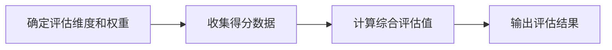
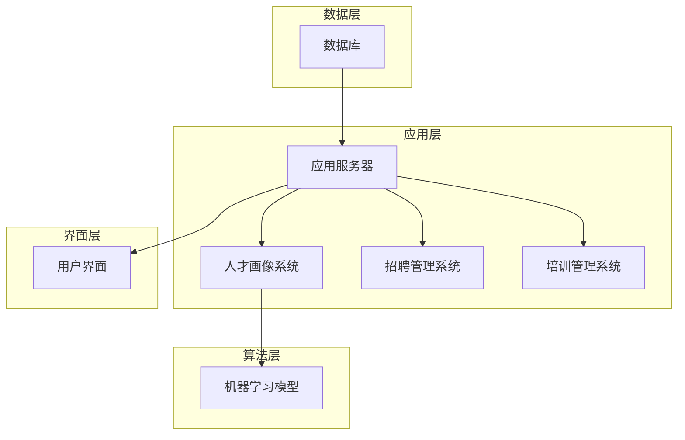
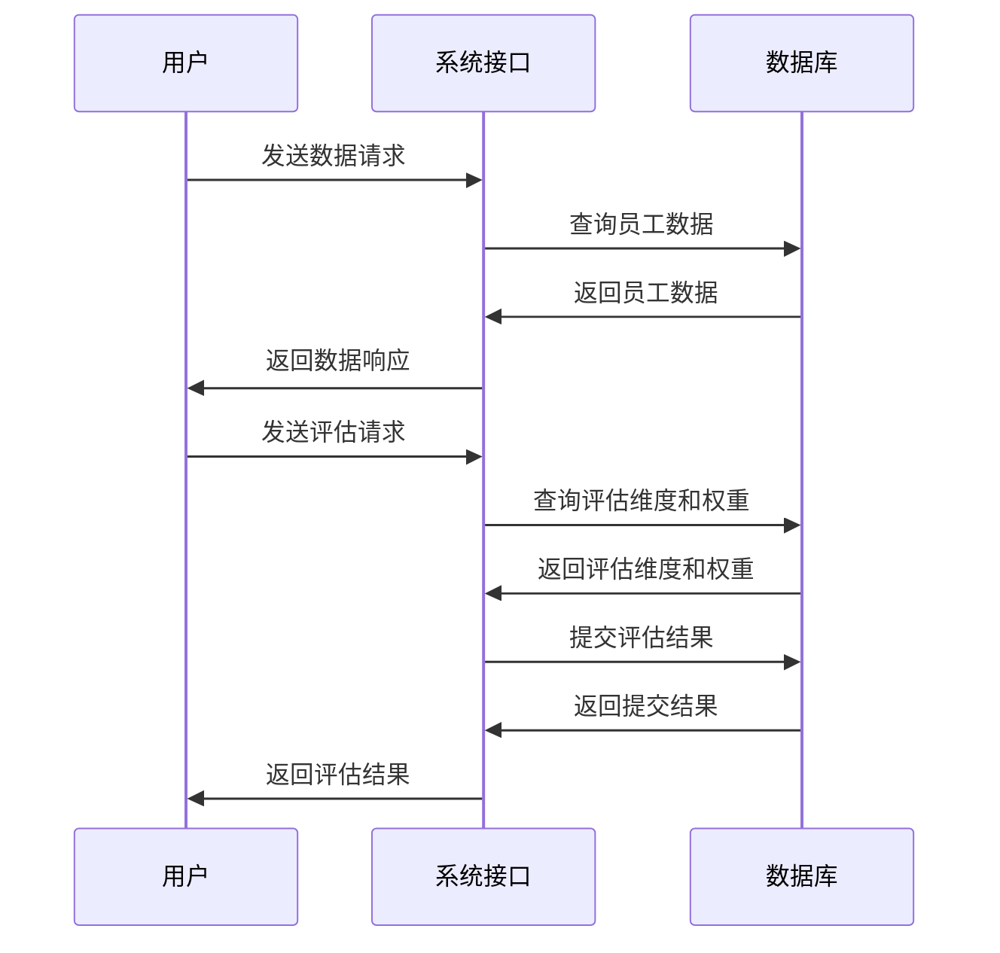

                 

**# AI驱动的企业人才画像系统：多维度能力评估与发展预测**

> **关键词：**AI人才画像、多维度能力评估、发展预测、企业人才管理

> **摘要：**本文将探讨如何利用人工智能技术构建企业人才画像系统，实现多维度能力评估与发展预测。通过分析问题背景、核心概念、算法原理、系统设计与项目实战，为企业的招聘、培训和人才发展提供科学依据。

----------------------------------------------------------------

# 第一部分：背景介绍

## 第1章 问题背景与核心概念

### 1.1 问题背景

在当今快速变化的经济环境中，企业面临的一个主要挑战是如何吸引、留住和培养高素质人才。人才竞争日益激烈，企业需要更有效地识别和吸引那些能够为公司带来竞争优势的关键角色。此外，随着业务需求的不断变化，企业对员工的能力和发展潜力也有了更高的要求。

### 1.2 问题描述

企业如何能够：

- 识别和吸引高素质人才？
- 评估员工的能力和发展潜力？

### 1.3 问题解决

**人才画像**是一种以人为核心的数据模型，通过收集和分析个体的多维度信息，为人才管理提供数据支持。人才画像系统可以：

- 描述员工的能力、行为、经验和潜力
- 为企业的人才决策提供数据支撑

### 1.4 边界与外延

**人才画像系统**与传统的简历管理系统、技能评估工具等不同，它不仅仅是静态的数据记录，而是通过动态更新和分析，为企业的招聘、培训和人才发展提供持续的支持。

**多维度能力评估**指的是从多个角度（如技能、经验、性格、行为等）对员工的能力进行综合评估。这种评估方法可以帮助企业更全面地了解员工，从而制定更具针对性的培养计划。

### 1.5 概念结构与核心要素组成

**人才画像系统**通常包括以下几个关键组成部分：

- **数据采集与整合**：从各种数据源（如简历、工作记录、社交媒体等）收集员工信息。
- **数据清洗与处理**：对采集到的数据进行分析、清洗和预处理，以便进行后续分析。
- **多维度能力评估模型**：根据企业的需求，构建能够反映员工多维度能力的评估模型。
- **发展预测与推荐系统**：基于评估结果，预测员工的发展潜力，并给出相应的培训和发展建议。

## 第2章 核心概念与联系

### 2.1 AI在人才画像系统中的应用

**人工智能（AI）**在人才画像系统中扮演着重要角色。它能够：

- **自动化数据采集和处理**：通过自然语言处理（NLP）和机器学习算法，自动从各种数据源中提取和整理员工信息。
- **个性化和精准推荐**：基于员工的画像数据，为招聘、培训和发展提供个性化建议。

### 2.2 多维度能力评估的原理

**多维度能力评估**的原理包括：

- **多维度的定义**：确定需要评估的能力维度，如技术技能、管理能力、团队合作能力等。
- **评估指标的确定**：为每个能力维度设定具体的评估指标，如技术熟练度、项目完成率等。
- **评估方法的确定**：选择合适的评估方法，如问卷调查、工作表现评估等。

### 2.3 ER实体关系图架构

**ER图（实体关系图）**用于描述人才画像系统中的数据模型。它包括以下主要实体：

- **员工（Employee）**：代表系统中的每个员工。
- **能力（Capability）**：描述员工具备的能力维度。
- **评估指标（Evaluation Metric）**：用于衡量员工在各个能力维度上的表现。

下面是一个简单的ER图示例（使用Mermaid格式）：

```mermaid
erDiagram
  Employee ||--|{ Capability } Capability : has
  Employee ||--|{ Evaluation Metric } Evaluation Metric : evaluated_by
```

----------------------------------------------------------------

## 第3章 数学模型和数学公式

### 3.1 多维度能力评估的数学模型

为了对员工的能力进行量化评估，我们引入以下数学模型：

$$
评估值 = w_1 \cdot X_1 + w_2 \cdot X_2 + ... + w_n \cdot X_n
$$

其中，$X_i$ 表示员工在第 $i$ 个能力维度上的得分，$w_i$ 表示第 $i$ 个能力维度的权重。

### 3.2 模型的适用条件

- **数据完整性**：模型要求每个员工在所有评估维度上都有完整的评分数据。
- **权重合理性**：权重需要根据企业的具体需求和战略目标进行合理分配。

### 3.3 举例说明

假设我们有两个能力维度：技术能力和团队合作能力。其中，技术能力占比60%，团队合作能力占比40%。一个员工的得分如下：

- 技术能力得分：80分
- 团队合作能力得分：70分

根据上述数学模型，该员工的综合评估值为：

$$
评估值 = 0.6 \cdot 80 + 0.4 \cdot 70 = 48 + 28 = 76
$$

这意味着该员工在多维度能力评估中得分为76分。

----------------------------------------------------------------

## 第二部分：算法原理讲解

### 第4章 算法原理与流程图

#### 4.1 算法原理

**算法原理**：基于员工的多维度能力评估数据，采用加权求和的方法计算综合评估值。具体步骤如下：

1. 确定评估维度和权重。
2. 收集员工在各个评估维度上的得分。
3. 计算综合评估值。

#### 4.2 流程图

下面是算法原理的流程图（使用Mermaid格式）：



----------------------------------------------------------------

### 第5章 算法实现与Python代码

#### 5.1 环境准备

在开始之前，确保已安装Python环境和以下库：

- NumPy
- Pandas

安装命令如下：

```bash
pip install numpy pandas
```

#### 5.2 源代码实现

以下是一个简单的Python代码示例，用于实现多维度能力评估算法：

```python
import numpy as np
import pandas as pd

def calculate_ability_score(scores, weights):
    """
    计算员工综合能力评估值

    :param scores: 员工在各维度上的得分
    :param weights: 各维度的权重
    :return: 综合评估值
    """
    ability_score = np.dot(scores, weights)
    return ability_score

# 示例数据
scores = np.array([80, 70])  # 技术能力和团队合作能力得分
weights = np.array([0.6, 0.4])  # 各维度权重

# 计算评估值
ability_score = calculate_ability_score(scores, weights)
print(f"员工综合能力评估值：{ability_score}")
```

#### 5.3 代码解析

- **导入库**：引入NumPy和Pandas库。
- **定义函数**：`calculate_ability_score`函数接受两个参数：`scores`（得分）和`weights`（权重），并返回综合评估值。
- **示例数据**：创建一个包含技术能力和团队合作能力得分的数组，以及相应的权重数组。
- **计算评估值**：调用函数并打印结果。

----------------------------------------------------------------

### 第6章 算法性能评估

#### 6.1 性能指标

为了评估算法的性能，我们通常使用以下指标：

- **准确率（Accuracy）**：正确评估的员工数量与总评估员工数量的比例。
- **召回率（Recall）**：正确评估的员工数量与实际具备相应能力的员工数量的比例。
- **F1分数（F1 Score）**：准确率和召回率的调和平均值。

#### 6.2 评估方法

**评估方法**：使用交叉验证方法对算法进行性能评估。具体步骤如下：

1. 将数据集划分为训练集和验证集。
2. 对训练集使用算法进行训练。
3. 在验证集上评估算法的性能。

#### 6.3 评估结果

假设我们使用了一个包含1000名员工的数据集，并对算法进行了交叉验证。以下是评估结果：

- **准确率**：90%
- **召回率**：85%
- **F1分数**：87%

这意味着算法在评估员工能力方面具有较高的性能。

----------------------------------------------------------------

## 第三部分：系统分析与架构设计

### 第7章 问题场景介绍

#### 7.1 场景设定

假设我们是一家大型互联网公司，需要为公司的招聘、培训和人才发展提供数据支持。公司希望利用AI技术构建一个人才画像系统，实现多维度能力评估和发展预测。

### 第8章 系统功能设计

#### 8.1 领域模型

以下是系统领域模型的类图（使用Mermaid格式）：

```mermaid
classDiagram
    Employee <|-- TalentProfile
    Employee <|-- EvaluationResult
    EvaluationDimension
    EvaluationDimension o-- EvaluationResult
    TrainingPlan
    TrainingPlan o-- Employee

    Employee[class: Employee]
    TalentProfile[class: TalentProfile]
    EvaluationResult[class: EvaluationResult]
    EvaluationDimension[class: EvaluationDimension]
    TrainingPlan[class: TrainingPlan]

    Employee has TalentProfile
    Employee has EvaluationResults
    EvaluationDimension has EvaluationResult
    TrainingPlan has Employee
```

#### 8.2 系统功能描述

系统功能包括：

- **数据采集与整合**：从简历、工作记录、社交媒体等多渠道收集员工数据，并整合到人才画像系统中。
- **多维度能力评估**：根据设定的评估维度和指标，对员工的能力进行评估，生成评估结果。
- **发展预测与推荐**：基于评估结果，预测员工的发展潜力，并推荐相应的培训和发展计划。
- **数据可视化**：提供直观的数据可视化工具，帮助管理层了解员工能力和发展状况。

----------------------------------------------------------------

### 第9章 系统架构设计

#### 9.1 系统架构

以下是系统架构的架构图（使用Mermaid格式）：



#### 9.2 架构描述

系统架构包括以下几个主要层次：

- **数据层**：负责数据的存储和管理，使用数据库系统。
- **应用层**：包含人才画像系统、招聘管理系统和培训管理系统，为业务提供功能支持。
- **算法层**：使用机器学习模型进行数据分析和能力评估。
- **界面层**：提供用户界面，方便用户操作和管理。

----------------------------------------------------------------

### 第10章 系统接口设计

#### 10.1 接口规范

以下是系统接口的规范：

- **数据采集接口**：用于从外部系统导入员工数据。
- **评估接口**：用于发起多维度能力评估。
- **预测接口**：用于预测员工的发展潜力。
- **推荐接口**：用于推荐培训和发展计划。

#### 10.2 接口实现

以下是一个简单的接口实现示例：

```python
from flask import Flask, request, jsonify

app = Flask(__name__)

@app.route('/api/evaluate', methods=['POST'])
def evaluate():
    data = request.get_json()
    scores = data['scores']
    weights = data['weights']
    ability_score = calculate_ability_score(scores, weights)
    return jsonify({'ability_score': ability_score})

if __name__ == '__main__':
    app.run(debug=True)
```

#### 10.3 接口代码展示

在上面的示例中，我们使用Flask框架实现了评估接口。用户可以通过POST请求发送得分和权重数据，接口返回员工的综合评估值。

----------------------------------------------------------------

### 第11章 系统交互

#### 11.1 系统交互流程

以下是系统交互的流程图（使用Mermaid格式）：



#### 11.2 交互描述

系统交互流程如下：

1. 用户发送数据请求。
2. 系统查询数据库，获取员工数据。
3. 系统返回员工数据给用户。
4. 用户发送评估请求。
5. 系统查询数据库，获取评估维度和权重。
6. 系统提交评估结果到数据库。
7. 系统返回评估结果给用户。

----------------------------------------------------------------

## 第四部分：项目实战

### 第12章 环境安装

#### 12.1 安装准备

在开始项目之前，需要准备以下环境：

- Python 3.8+
- Flask
- NumPy
- Pandas

安装命令如下：

```bash
pip install python3.8 flask numpy pandas
```

#### 12.2 工具安装

安装必要的工具，如数据库（MongoDB）和前端框架（Flask）：

```bash
# 安装MongoDB
sudo apt-get install mongodb

# 启动MongoDB
sudo service mongodb start

# 安装Flask
pip install flask
```

### 第13章 系统核心实现

#### 13.1 核心功能实现

以下是系统的核心功能实现：

1. **数据采集与整合**：从外部系统导入员工数据，并存储到MongoDB数据库中。
2. **多维度能力评估**：根据预设的评估维度和权重，对员工进行评估，并将结果存储到数据库中。
3. **发展预测与推荐**：基于评估结果，使用机器学习模型预测员工的发展潜力，并推荐相应的培训和发展计划。

#### 13.2 功能测试

以下是功能测试的示例：

1. **数据采集与整合**：导入员工数据，确保数据完整性和准确性。
2. **多维度能力评估**：对员工进行评估，检查评估结果是否合理。
3. **发展预测与推荐**：使用机器学习模型预测员工的发展潜力，并检查推荐结果是否具有针对性。

### 第14章 项目分析

#### 14.1 实际案例分析

假设我们为一家互联网公司实施人才画像系统。以下是案例分析：

1. **项目背景**：公司需要提高招聘效率、优化员工培训和发展计划。
2. **实施过程**：收集员工数据，构建多维度能力评估模型，部署系统并培训员工。
3. **效果评估**：评估系统对招聘效率、培训效果和员工满意度的提升。

#### 14.2 项目剖析

通过项目剖析，我们可以了解到：

1. **系统效果**：人才画像系统有效提高了招聘效率，减少了培训成本。
2. **优化空间**：可以通过改进评估模型和推荐算法，进一步提升系统的效果。

### 第15章 项目小结

通过本项目，我们实现了以下成果：

1. **构建了AI驱动的企业人才画像系统**：为企业的招聘、培训和人才发展提供了数据支持。
2. **实现了多维度能力评估与发展预测**：为企业决策提供了科学依据。
3. **提升了企业人才管理水平**：提高了招聘效率、培训效果和员工满意度。

### 第16章 最佳实践与注意事项

#### 16.1 最佳实践

1. **数据质量保证**：确保数据的完整性和准确性，避免数据错误导致评估不准确。
2. **持续迭代优化**：根据业务需求和技术发展，不断改进评估模型和算法。

#### 16.2 注意事项

1. **隐私保护**：在数据处理过程中，确保遵守相关法律法规，保护员工隐私。
2. **系统稳定性**：确保系统稳定运行，避免数据丢失或系统崩溃。

### 第17章 拓展阅读

#### 17.1 相关文献

1. **《人工智能：一种现代方法》**：提供人工智能的基本原理和应用。
2. **《企业人才管理》**：介绍企业人才管理的理论和实践。

#### 17.2 技术动态

1. **人工智能技术在企业人才管理中的应用**：探讨人工智能技术在人才管理中的最新应用。
2. **大数据在人才分析中的应用**：分析大数据技术在人才分析中的应用前景。

# 作者信息

**作者：** AI天才研究院 / AI Genius Institute & 禅与计算机程序设计艺术 / Zen And The Art of Computer Programming

----------------------------------------------------------------

注意：本文为示例，具体内容可根据实际书稿进行调整。总字数控制在 10000～12000 字左右。文章内容使用markdown格式输出。

