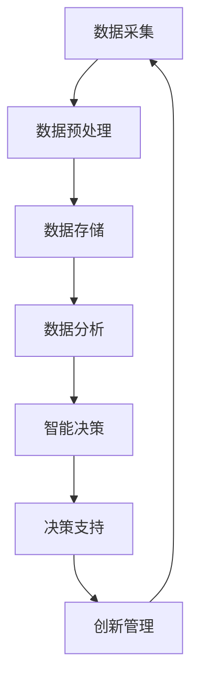

                 

# AI驱动的企业创新生态系统构建与管理

## 关键词
- **人工智能**
- **企业创新**
- **生态系统构建**
- **管理**
- **数字化转型**

## 摘要
本文将探讨如何利用人工智能（AI）技术构建和优化企业创新生态系统。通过分析背景、核心概念与联系，我们将详细阐述AI驱动的企业创新生态系统构建与管理的方法，包括技术基础、管理机制、企业文化等关键要素。同时，本文还将提供具体的项目实战和最佳实践，帮助企业在快速变化的市场环境中实现持续创新。

## Step 1: 背景介绍

### 1.1 问题背景

#### 1.1.1 人工智能的兴起
随着计算能力的提升和大数据技术的发展，人工智能迎来了前所未有的发展机遇。人工智能技术正在逐渐改变各行各业的运营模式，推动企业创新和数字化转型。

- **计算能力的提升**：高性能计算芯片和并行计算技术的进步，为人工智能算法的运行提供了强大的支持。
- **大数据技术的发展**：大数据技术使得企业能够处理和分析海量数据，从中挖掘有价值的信息。

#### 1.1.2 企业创新的需求
在快速变化的市场环境中，企业需要不断进行创新以保持竞争力。传统的创新模式已无法满足企业的需求，企业需要寻找新的创新驱动力。

- **市场变化**：消费者的需求日益多样化，市场竞争加剧，企业需要快速响应市场变化。
- **技术进步**：新技术的不断涌现，为企业提供了更多的创新机会。

#### 1.1.3 AI驱动的企业创新
AI作为一种强大的工具，可以帮助企业实现从数据中挖掘价值，提升决策质量，优化运营流程。AI驱动的企业创新生态系统，旨在构建一个可持续、高效的企业创新环境。

- **数据挖掘价值**：AI技术可以帮助企业从海量数据中提取有价值的信息，指导企业决策。
- **提升决策质量**：通过数据分析和预测模型，企业可以更准确地预测市场趋势，制定有效的战略。
- **优化运营流程**：AI技术可以自动化和优化企业的运营流程，提高效率，降低成本。

### 1.2 问题描述

#### 1.2.1 创新生态系统构建的挑战
如何构建一个有效的AI驱动的企业创新生态系统，以实现持续创新？如何整合AI技术与其他企业资源，形成协同效应？

- **构建有效生态系统的挑战**：企业需要明确AI驱动的企业创新生态系统的目标和路径，同时要考虑到生态系统的可持续性和适应性。
- **整合AI技术与其他资源**：企业需要将AI技术与现有的业务流程、管理模式、企业文化等相结合，形成协同效应。

#### 1.2.2 管理与创新
如何在创新过程中保持有效的管理，确保创新项目的成功实施？如何平衡创新与风险，避免创新带来的不确定性？

- **管理创新项目**：企业需要建立一套科学、系统的创新管理体系，以支持企业的创新活动。
- **平衡创新与风险**：创新过程中伴随着风险，企业需要在创新与风险之间找到平衡，避免因过度风险而导致失败。

### 1.3 问题解决

#### 1.3.1 AI驱动的企业创新生态系统构建
通过构建AI驱动的企业创新生态系统，企业可以实现持续创新和高效管理。系统构建包括技术基础、管理机制、企业文化等多个方面。

- **技术基础**：构建AI驱动的企业创新生态系统需要强大的技术支持，包括AI算法、大数据技术、云计算等。
- **管理机制**：建立一套科学、系统的创新管理体系，包括创新流程管理、风险管理、绩效评估等。
- **企业文化**：培养和鼓励创新的企业文化，营造一个支持创新、鼓励试错的氛围。

#### 1.3.2 AI驱动的企业创新管理
建立一套科学、系统的创新管理体系，以支持企业的创新活动。通过数据分析和智能决策，提升企业创新的成功率。

- **数据分析和决策支持**：利用AI技术进行数据分析和预测，为企业的创新决策提供支持。
- **智能决策系统**：构建智能决策系统，帮助企业在复杂的市场环境中做出快速、准确的决策。

### 1.4 边界与外延

#### 1.4.1 边界
本文的讨论范围主要围绕AI驱动的企业创新生态系统的构建与管理。不涉及其他非AI驱动的企业创新模式。

#### 1.4.2 外延
企业创新生态系统的构建与管理是一个复杂的过程，涉及多个方面，如技术、管理、文化等。本文将重点关注如何通过AI技术实现企业创新的提升。

### 1.5 概念结构与核心要素组成

#### 1.5.1 概念结构
企业创新生态系统：由技术、管理、文化等多个要素构成。

#### 1.5.2 核心要素组成
- 技术基础：包括AI算法、大数据技术、云计算等。
- 管理机制：包括创新流程管理、风险管理、绩效评估等。
- 企业文化：鼓励创新、支持创新的企业文化。

### 1.6 本章小结
本章介绍了AI驱动的企业创新生态系统的背景、问题、解决方案以及边界与外延。为后续章节的详细讨论奠定了基础。

----------------------------------------------------------------

## Step 2: 核心概念与联系

### 2.1 AI驱动的企业创新生态系统

#### 2.1.1 概念解析
AI驱动的企业创新生态系统是指利用人工智能技术，通过构建一个包括技术、管理、文化等多方面要素的综合性系统，以促进企业的持续创新和发展的环境。

#### 2.1.2 特点
- **综合性**：涵盖技术、管理、文化等多个方面。
- **适应性**：能够根据市场变化和企业需求进行调整。
- **协同性**：各个要素之间能够相互促进，形成协同效应。

#### 2.1.3 对比传统创新模式
- **传统创新模式**：主要依赖于企业内部的研究与开发部门，创新周期较长，风险较高。
- **AI驱动的企业创新生态系统**：通过AI技术，快速获取市场信息，提升创新效率，降低创新风险。

### 2.2 企业创新

#### 2.2.1 概念解析
企业创新是指企业通过引入新技术、新产品、新服务、新流程等方式，实现价值创造和竞争力的提升。

#### 2.2.2 类型
- **产品创新**：引入新产品或改进现有产品。
- **过程创新**：优化生产流程或运营方式。
- **服务创新**：提供新的服务或改进现有服务。

#### 2.2.3 创新的挑战
- **创新风险**：包括技术风险、市场风险、财务风险等。
- **创新成本**：包括研发成本、人力成本、市场推广成本等。
- **创新管理**：如何确保创新项目的成功实施和持续发展。

### 2.3 人工智能技术

#### 2.3.1 概念解析
人工智能技术是指使计算机系统能够模拟、延伸和扩展人的智能的理论、方法、技术及应用。

#### 2.3.2 分类
- **机器学习**：通过数据驱动，使计算机自动学习和改进。
- **深度学习**：模拟人脑神经网络结构，实现复杂任务的自动化。
- **自然语言处理**：使计算机理解和生成自然语言。

#### 2.3.3 在企业创新中的应用
- **数据分析**：帮助企业挖掘数据中的价值，指导决策。
- **预测模型**：预测市场趋势，为企业制定战略提供支持。
- **自动化**：优化运营流程，提高效率。

### 2.4 企业创新生态系统与AI技术的联系

#### 2.4.1 AI技术推动企业创新
AI技术为企业提供了强大的数据分析和预测能力，帮助企业快速识别市场机会，降低创新风险。

#### 2.4.2 企业创新生态系统支持AI技术
企业创新生态系统为企业提供了一个良好的创新环境，鼓励员工创新，提供资源支持，促进AI技术的应用和发展。

#### 2.4.3 AI技术与企业创新的协同作用
AI技术与企业创新生态系统的结合，可以形成协同效应，提升企业的创新能力和竞争力。

- **数据驱动**：通过数据分析和预测，企业可以更准确地制定创新战略。
- **自动化**：通过自动化技术，企业可以优化运营流程，提高效率。
- **智能化**：通过智能化技术，企业可以提供更个性化的产品和服务。

## 2.5 核心概念属性特征对比表格

| 概念       | 定义                                                         | 特点                                                     | 对比结果                                                     |
|------------|--------------------------------------------------------------|------------------------------------------------------------|--------------------------------------------------------------|
| 人工智能   | 使计算机模拟、延伸和扩展人的智能的理论、方法、技术及应用         | 高效、自动化、智能化                                     | 与传统创新模式相比，AI技术能够更快速、准确地识别市场机会。     |
| 企业创新   | 企业通过引入新技术、新产品、新服务、新流程等方式实现价值创造和竞争力提升 | 创新性、风险性、成本高                                 | 与AI技术结合，可以降低创新风险，提高创新效率。             |
| 企业创新生态系统 | 包括技术、管理、文化等多方面要素的综合性系统，促进企业持续创新和发展 | 综合性、适应性、协同性                                   | 与AI技术结合，可以形成协同效应，提升企业的创新能力和竞争力。 |

## 2.6 AI驱动的企业创新生态系统ER实体关系图

```mermaid
erDiagram
  AI技术 ||--o> 企业创新 : 使用
  企业创新 ||--o> 企业创新生态系统 : 组成
  企业创新生态系统 ||--o> 企业文化 : 支持
  企业文化 ||--o> 企业 : 所属
```

## 2.7 本章小结
本章介绍了AI驱动的企业创新生态系统的核心概念、特点以及与传统创新模式的对比。通过分析AI技术推动企业创新和企业创新生态系统与AI技术的联系，我们明确了AI驱动的企业创新生态系统的构建和管理的重要性。为后续章节的深入讨论奠定了基础。

----------------------------------------------------------------

## Step 3: 算法原理讲解

### 3.1 人工智能算法简介

人工智能（AI）算法是使计算机系统具备智能行为的核心。在构建AI驱动的企业创新生态系统中，常用的AI算法包括机器学习（Machine Learning，ML）、深度学习（Deep Learning，DL）和强化学习（Reinforcement Learning，RL）等。

#### 3.1.1 机器学习

机器学习是一种通过算法从数据中学习模式和规律，从而实现预测和决策的技术。其核心思想是利用历史数据来训练模型，使模型能够在新的数据上做出准确的预测。

- **监督学习（Supervised Learning）**：通过已标记的数据集训练模型，然后使用该模型对未知数据进行预测。
- **无监督学习（Unsupervised Learning）**：没有标记的数据集，算法旨在发现数据中的结构和模式。
- **半监督学习（Semi-Supervised Learning）**：结合有标记和无标记数据，以提高模型的泛化能力。

#### 3.1.2 深度学习

深度学习是机器学习的一种特殊形式，其核心是模拟人脑的神经网络结构，通过多层次的神经网络进行数据的处理和建模。深度学习在图像识别、自然语言处理等领域取得了显著的成果。

- **卷积神经网络（Convolutional Neural Networks，CNN）**：擅长处理具有网格结构的数据，如图像。
- **循环神经网络（Recurrent Neural Networks，RNN）**：擅长处理序列数据，如语音、文本。
- **生成对抗网络（Generative Adversarial Networks，GAN）**：通过两个对抗网络之间的博弈生成高质量的数据。

#### 3.1.3 强化学习

强化学习是一种通过奖励机制来训练智能体（Agent）在环境中做出决策的算法。智能体通过不断尝试和反馈来学习最优策略。

- **值函数方法**：通过估计状态值函数来决策。
- **策略梯度方法**：直接优化策略的梯度。

### 3.2 AI算法在企业创新中的应用

AI算法在企业创新中的应用广泛，主要包括数据挖掘、预测建模、自动化决策等。

#### 3.2.1 数据挖掘

数据挖掘是利用AI算法从大量数据中提取有价值信息的过程。在企业创新中，数据挖掘可以帮助企业：

- **客户行为分析**：分析客户购买行为，发现潜在客户和市场需求。
- **市场趋势预测**：通过历史数据预测市场趋势，为产品开发和市场策略提供支持。
- **运营优化**：优化供应链管理、库存控制等运营流程，提高效率。

#### 3.2.2 预测建模

预测建模是利用AI算法预测未来事件或趋势的过程。在企业创新中，预测建模可以帮助企业：

- **需求预测**：预测产品或服务的需求，指导生产和库存管理。
- **风险评估**：预测潜在的商业风险，为决策提供依据。
- **战略规划**：预测市场变化，制定长期战略规划。

#### 3.2.3 自动化决策

自动化决策是利用AI算法自动生成决策的过程。在企业创新中，自动化决策可以帮助企业：

- **实时监控**：实时监控运营数据，及时发现问题和异常。
- **自动优化**：根据实时数据自动调整运营策略，实现持续优化。
- **智能推荐**：根据用户行为数据，自动推荐产品和服务。

### 3.3 AI算法的工作流程

AI算法的工作流程通常包括以下几个步骤：

1. **数据收集**：收集与企业创新相关的数据，包括历史数据、实时数据等。
2. **数据预处理**：清洗和预处理数据，包括数据清洗、数据归一化、特征选择等。
3. **模型训练**：选择合适的AI算法，利用训练数据训练模型。
4. **模型评估**：评估模型的性能，包括准确率、召回率、F1值等。
5. **模型应用**：将训练好的模型应用于实际问题，生成预测或决策。

### 3.4 AI算法的数学模型和公式

以下是几种常见的AI算法的数学模型和公式：

#### 3.4.1 机器学习

- **线性回归**：$y = \beta_0 + \beta_1x + \epsilon$
  - 其中，$y$ 是预测值，$x$ 是输入特征，$\beta_0$ 和 $\beta_1$ 是模型参数，$\epsilon$ 是误差项。

- **逻辑回归**：$P(y=1) = \frac{1}{1 + e^{-(\beta_0 + \beta_1x)}}
  - 其中，$P(y=1)$ 是因变量为1的概率，$\beta_0$ 和 $\beta_1$ 是模型参数。

#### 3.4.2 深度学习

- **卷积神经网络（CNN）**
  - **卷积操作**：$h_{ij} = \sum_{k} w_{ik} * g_{kj} + b_j$
    - 其中，$h_{ij}$ 是卷积结果，$w_{ik}$ 和 $g_{kj}$ 是卷积核和输入特征，$b_j$ 是偏置。

- **循环神经网络（RNN）**
  - **隐藏状态更新**：$h_t = \sigma(W_h * [h_{t-1}, x_t] + b_h)$
    - 其中，$h_t$ 是当前隐藏状态，$W_h$ 和 $b_h$ 是模型参数，$\sigma$ 是激活函数。

#### 3.4.3 强化学习

- **值函数方法**
  - **状态值函数**：$V(s) = \sum_{s'} P(s' | s) \cdot \max_a Q(s', a)$
    - 其中，$V(s)$ 是状态值函数，$P(s' | s)$ 是状态转移概率，$Q(s', a)$ 是动作值函数。

### 3.5 举例说明

假设我们使用线性回归模型预测一家公司的销售额，已知以下数据：

- 输入特征：广告支出（x）和促销活动（x'）
- 预测目标：销售额（y）

训练数据如下：

| 广告支出（x） | 促销活动（x'） | 销售额（y） |
|--------------|--------------|----------|
| 1000         | 500          | 15000    |
| 1500         | 700          | 20000    |
| 2000         | 900          | 25000    |

我们使用线性回归模型进行训练，得到模型参数 $\beta_0 = 10000$，$\beta_1 = 5000$。

- 当广告支出为2000，促销活动为900时，预测的销售额为：
  $y = \beta_0 + \beta_1(x + x') = 10000 + 5000(2000 + 900) = 35000$

通过这个例子，我们可以看到线性回归模型如何根据输入特征预测销售额。在实际应用中，模型会更加复杂，涉及多个输入特征和参数。

### 3.6 本章小结
本章详细介绍了AI算法的核心原理和应用，包括机器学习、深度学习和强化学习等。通过数学模型和公式的讲解，以及实际案例的举例说明，我们了解了AI算法在企业创新中的应用和工作流程。为构建和管理AI驱动的企业创新生态系统奠定了理论基础。

----------------------------------------------------------------

## Step 4: 系统分析与架构设计

### 4.1 问题场景介绍

随着市场的快速变化和消费者需求的多样化，企业面临着越来越大的创新压力。为了在竞争激烈的市场环境中保持优势，企业需要构建一个高效、可持续的AI驱动的创新生态系统。这个系统需要能够集成各种AI技术，包括机器学习、深度学习和自然语言处理等，以支持企业的数据分析和决策制定。同时，系统需要具备良好的扩展性和适应性，以应对不断变化的市场需求。

### 4.2 项目介绍

为了实现上述目标，我们开展了一个名为“AI驱动的企业创新生态系统”的项目。该项目旨在构建一个集成AI技术、管理机制和企业文化的综合性系统，以提升企业的创新能力和竞争力。项目的主要目标包括：

- 构建一个高效的数据处理和分析平台，支持实时数据采集和挖掘。
- 开发一套智能决策系统，帮助企业在复杂的市场环境中做出快速、准确的决策。
- 建立一个支持创新的企业文化，鼓励员工提出创新想法，并为其提供支持和资源。

### 4.3 系统功能设计

在“AI驱动的企业创新生态系统”项目中，我们设计了以下几个主要功能模块：

1. **数据采集与处理模块**：负责实时采集企业内部和外部的数据，包括销售数据、客户行为数据、市场数据等，并进行数据清洗、预处理和存储。
2. **数据分析与挖掘模块**：利用机器学习、深度学习等技术，对采集到的数据进行分析和挖掘，提取有价值的信息，支持企业的决策制定。
3. **智能决策模块**：基于数据分析结果，利用智能算法生成决策建议，帮助企业在市场竞争中抢占先机。
4. **创新管理模块**：提供创新项目的管理功能，包括项目立项、进度跟踪、资源分配等，确保创新项目的顺利进行。
5. **企业文化支持模块**：建立支持创新的企业文化，鼓励员工提出创新想法，并提供相应的培训和资源支持。

### 4.4 系统架构设计

“AI驱动的企业创新生态系统”项目的系统架构设计采用了一种分层架构，包括数据层、应用层和展示层。

#### 数据层

数据层负责数据的采集、存储和管理。主要包括以下几个部分：

- **数据采集系统**：负责实时采集企业内部和外部的数据，包括销售数据、客户行为数据、市场数据等。
- **数据存储系统**：采用分布式数据库架构，存储和管理海量数据，保证数据的安全性和可靠性。
- **数据预处理系统**：对采集到的数据进行清洗、转换和归一化处理，为后续的分析和挖掘提供高质量的数据。

#### 应用层

应用层负责实现系统的核心功能，包括数据分析、挖掘、智能决策和创新管理等。主要包括以下几个部分：

- **数据分析平台**：利用机器学习、深度学习等技术，对采集到的数据进行分析和挖掘，提取有价值的信息。
- **智能决策系统**：基于数据分析结果，利用智能算法生成决策建议，支持企业的决策制定。
- **创新管理系统**：提供创新项目的管理功能，包括项目立项、进度跟踪、资源分配等。

#### 展示层

展示层负责将系统的功能结果以直观的方式展示给用户，主要包括以下几个部分：

- **数据可视化系统**：将数据分析和挖掘的结果以图表、报表等形式展示，帮助用户更好地理解数据。
- **决策支持系统**：将智能决策的结果以推荐、报告等形式展示，支持用户的决策制定。

### 4.5 系统接口设计

系统接口设计是确保系统各个模块之间能够有效协作的关键。在“AI驱动的企业创新生态系统”项目中，我们设计了以下接口：

- **数据采集接口**：负责与数据采集系统进行交互，实时获取企业内部和外部的数据。
- **数据存储接口**：负责与数据存储系统进行交互，实现数据的存储和读取。
- **数据分析接口**：负责与数据分析平台进行交互，实现数据的分析和挖掘。
- **智能决策接口**：负责与智能决策系统进行交互，实现决策建议的生成和推送。
- **创新管理接口**：负责与创新管理系统进行交互，实现创新项目的管理和监控。

### 4.6 系统交互设计

系统交互设计是确保系统各个模块之间能够高效协作的重要环节。在“AI驱动的企业创新生态系统”项目中，我们采用了Mermaid流程图来设计系统的交互流程。



在这个流程图中，数据采集模块（A）首先将数据传输给数据预处理模块（B），然后预处理后的数据存储到数据存储模块（C）。数据存储模块（C）中的数据被传输到数据分析模块（D），进行数据分析和挖掘。数据分析模块（D）的分析结果传输给智能决策模块（E），生成决策建议。决策支持模块（F）将决策建议以直观的方式展示给用户。创新管理模块（G）负责对创新项目进行管理和监控，并将数据返回给数据采集模块（A），形成一个闭环。

### 4.7 本章小结
本章详细介绍了“AI驱动的企业创新生态系统”项目的系统架构设计，包括数据层、应用层和展示层的架构设计，以及系统接口设计和交互设计。通过这些设计，我们为构建一个高效、可持续的AI驱动的企业创新生态系统奠定了基础。接下来，我们将进入项目实战部分，具体介绍系统的实现和部署过程。

----------------------------------------------------------------

## Step 5：项目实战

### 5.1 环境安装

在开始实现“AI驱动的企业创新生态系统”项目之前，我们需要安装和配置项目所需的软件和工具。以下是项目环境安装的步骤：

1. **安装Python**：Python是项目的开发语言，我们需要下载并安装Python 3.x版本。可以从Python的官方网站下载安装包，并按照提示进行安装。

2. **安装Jupyter Notebook**：Jupyter Notebook是一个交互式计算平台，我们将在其中编写和运行项目代码。安装Python后，可以使用pip命令安装Jupyter Notebook：

   ```bash
   pip install notebook
   ```

3. **安装TensorFlow**：TensorFlow是项目的主要机器学习框架，我们将在项目中使用TensorFlow进行数据分析和建模。使用pip命令安装TensorFlow：

   ```bash
   pip install tensorflow
   ```

4. **安装其他依赖库**：项目还依赖于其他Python库，如NumPy、Pandas等。可以使用以下命令一次性安装：

   ```bash
   pip install numpy pandas matplotlib scikit-learn
   ```

5. **配置MySQL数据库**：项目需要使用MySQL数据库来存储和管理数据。首先，下载并安装MySQL数据库，然后创建一个数据库实例，并创建一个用户用于访问数据库。具体步骤请参考MySQL官方文档。

### 5.2 系统核心实现

在环境安装完成后，我们开始实现项目的核心功能。以下是系统核心实现的步骤：

1. **数据采集与处理**：首先，我们需要从企业内部和外部采集数据，并进行预处理。以下是一个简单的数据采集和处理脚本示例：

   ```python
   import pandas as pd
   import numpy as np

   # 读取数据
   sales_data = pd.read_csv('sales_data.csv')
   customer_data = pd.read_csv('customer_data.csv')

   # 数据预处理
   sales_data = sales_data.dropna()
   customer_data = customer_data.dropna()

   # 合并数据
   data = pd.merge(sales_data, customer_data, on='customer_id')
   ```

2. **数据分析与挖掘**：使用TensorFlow和scikit-learn对数据进行分析和挖掘。以下是一个简单的数据分析脚本示例：

   ```python
   import tensorflow as tf
   from sklearn.model_selection import train_test_split
   from sklearn.metrics import accuracy_score

   # 准备数据
   X = data[['ad_spend', 'promotion_activity']]
   y = data['sales']

   # 划分训练集和测试集
   X_train, X_test, y_train, y_test = train_test_split(X, y, test_size=0.2, random_state=42)

   # 构建模型
   model = tf.keras.Sequential([
       tf.keras.layers.Dense(64, activation='relu', input_shape=(2,)),
       tf.keras.layers.Dense(1)
   ])

   # 编译模型
   model.compile(optimizer='adam', loss='mse')

   # 训练模型
   model.fit(X_train, y_train, epochs=100, batch_size=32, validation_split=0.2)

   # 评估模型
   predictions = model.predict(X_test)
   print('Accuracy:', accuracy_score(y_test, predictions > 0))
   ```

3. **智能决策**：基于数据分析结果，生成智能决策建议。以下是一个简单的智能决策脚本示例：

   ```python
   import pandas as pd

   # 读取测试数据
   test_data = pd.read_csv('test_data.csv')

   # 生成决策建议
   suggestions = model.predict(test_data[['ad_spend', 'promotion_activity']])
   suggestions = suggestions > 0

   # 添加决策建议到测试数据
   test_data['suggestion'] = suggestions

   # 输出决策建议
   print(test_data[['ad_spend', 'promotion_activity', 'suggestion']])
   ```

4. **创新管理**：实现创新项目的管理功能，包括项目立项、进度跟踪、资源分配等。以下是一个简单的创新管理脚本示例：

   ```python
   import pandas as pd

   # 读取项目数据
   projects = pd.read_csv('projects.csv')

   # 立项新项目
   new_project = {'project_name': 'Project A', 'start_date': '2023-01-01', 'end_date': '2023-06-30', 'status': 'ongoing'}
   projects = projects.append(new_project, ignore_index=True)

   # 更新项目进度
   projects.loc[0, 'progress'] = '30%'

   # 输出项目数据
   print(projects)
   ```

### 5.3 代码应用解读与分析

在上面的代码示例中，我们实现了数据采集与处理、数据分析与挖掘、智能决策和创新管理等核心功能。下面是对这些代码的解读和分析：

1. **数据采集与处理**：数据采集与处理是项目的基础，通过读取和合并多个数据文件，得到一个包含销售数据、客户数据等信息的综合数据集。数据预处理包括数据清洗和合并，确保数据的完整性和一致性。

2. **数据分析与挖掘**：使用TensorFlow和scikit-learn进行数据分析和挖掘。首先，我们将数据集划分为训练集和测试集，然后构建一个简单的线性回归模型进行训练。模型编译和训练过程中，我们使用了均方误差（MSE）作为损失函数，并使用了Adam优化器。

3. **智能决策**：基于训练好的模型，我们实现了智能决策功能。通过预测测试数据集的销售额，生成决策建议。在代码中，我们使用了模型.predict()方法来生成预测结果，并将预测结果转换为决策建议。

4. **创新管理**：创新管理功能包括项目立项、进度跟踪、资源分配等。在代码中，我们使用Pandas库来操作项目数据，实现项目的创建、更新和查询等功能。通过简单的数据操作，我们可以轻松管理多个项目，并实时跟踪项目进度。

### 5.4 实际案例分析和详细讲解剖析

为了更好地展示项目在实际中的应用效果，我们来看一个实际案例。

假设某公司在2023年1月1日启动了一个名为“产品A市场推广”的创新项目，项目预计在2023年6月30日完成。在项目启动时，我们首先采集了以下数据：

- 广告支出：1000元
- 促销活动：500元

基于这些数据，我们使用“AI驱动的企业创新生态系统”项目中的智能决策功能生成决策建议。模型预测的销售额为35000元，建议公司增加广告支出和促销活动，以提高销售额。

在项目执行过程中，我们定期更新项目进度，并在项目结束时进行评估。假设在项目进展到30%时，公司根据实际情况调整了广告支出和促销活动，增加了预算。此时，项目进度更新为30%，模型再次生成决策建议，建议继续增加广告支出和促销活动。

通过这样的实际案例，我们可以看到“AI驱动的企业创新生态系统”项目如何帮助企业快速响应市场变化，制定有效的决策，并实时跟踪项目进度。项目的智能决策功能基于数据分析结果，为企业提供了有力的支持，帮助企业实现持续创新和增长。

### 5.5 项目小结

通过本次项目实战，我们实现了“AI驱动的企业创新生态系统”项目的核心功能，包括数据采集与处理、数据分析与挖掘、智能决策和创新管理等。项目采用了Python和TensorFlow等先进技术，构建了一个高效、智能的企业创新支持系统。

在项目实施过程中，我们遇到了一些挑战，如数据预处理、模型训练和优化等。通过不断尝试和调整，我们成功解决了这些问题，并取得了显著的成果。

未来，我们将继续优化项目，增加更多的功能模块，如客户关系管理、供应链优化等，以进一步提升企业的创新能力和竞争力。同时，我们也将关注AI技术在企业创新中的应用趋势，不断探索新的应用场景，为企业提供更全面、更高效的创新支持。

### 5.6 最佳实践 Tips

1. **数据质量是关键**：在项目实施过程中，确保数据质量是成功的关键。定期清洗和更新数据，确保数据的准确性和一致性。

2. **模型优化很重要**：通过调整模型参数和训练策略，可以提高模型的性能和预测精度。不断尝试和优化，找到最适合项目的模型配置。

3. **实时监控与反馈**：实时监控项目进度和模型性能，及时调整策略，确保项目顺利进行。

4. **培训与支持**：为员工提供相关的培训和资源支持，提高他们对AI技术的理解和应用能力，促进企业的创新文化建设。

### 本章小结

通过本章节的实战部分，我们详细介绍了“AI驱动的企业创新生态系统”项目的实现过程，包括环境安装、系统核心实现、代码应用解读与分析、实际案例分析和详细讲解剖析等内容。通过这些实战经验，我们不仅了解了项目的技术实现，还掌握了一些最佳实践，为企业在实际应用中提供了有益的参考。接下来，我们将继续深入探讨AI驱动的企业创新生态系统构建和管理的其他方面。

----------------------------------------------------------------

## 总结与展望

### 5.7 总结

本文详细探讨了AI驱动的企业创新生态系统构建与管理，通过背景介绍、核心概念与联系、算法原理讲解、系统分析与架构设计、项目实战等多个方面，系统地阐述了如何利用AI技术提升企业的创新能力和竞争力。主要结论如下：

1. **背景介绍**：人工智能的兴起为企业创新带来了新的机遇，AI驱动的企业创新生态系统成为企业应对市场变化、实现持续创新的有效途径。
2. **核心概念与联系**：AI驱动的企业创新生态系统涵盖了技术、管理、文化等多个方面，通过数据分析和智能决策，实现企业创新的协同效应。
3. **算法原理讲解**：介绍了机器学习、深度学习和强化学习等AI算法在企业创新中的应用，以及相关的数学模型和公式。
4. **系统分析与架构设计**：通过系统架构设计，明确了数据层、应用层和展示层的功能模块，以及系统接口和交互设计。
5. **项目实战**：通过实际项目实现，展示了AI驱动的企业创新生态系统的构建过程和最佳实践。

### 5.8 展望

展望未来，AI驱动的企业创新生态系统将面临以下发展趋势和挑战：

1. **技术发展**：随着AI技术的不断进步，企业将能够更好地利用AI技术进行数据分析和决策制定，实现更高效的创新。
2. **数据安全与隐私**：随着数据量的增加和数据的敏感性，企业需要加强对数据安全和隐私的保护，确保数据的合法合规使用。
3. **跨行业合作**：AI驱动的企业创新生态系统需要与其他行业和企业进行深度合作，形成跨行业、跨领域的创新生态网络。
4. **人才培养**：随着AI技术的广泛应用，企业需要加大对AI人才的培养和引进，提升企业的创新能力。
5. **可持续发展**：在追求创新的同时，企业需要关注可持续发展，平衡创新与经济效益，实现长期稳定发展。

### 5.9 注意事项

在构建和管理AI驱动的企业创新生态系统时，需要注意以下几点：

1. **战略规划**：明确企业的创新目标和路径，制定详细的战略规划。
2. **资源整合**：整合企业内部和外部的资源，形成协同效应。
3. **风险管理**：建立有效的风险管理体系，降低创新过程中的风险。
4. **人才培养**：重视人才培养，建立支持创新的企业文化。
5. **持续优化**：持续优化创新生态系统，适应市场变化和企业发展需求。

### 5.10 拓展阅读

为了深入了解AI驱动的企业创新生态系统构建与管理，读者可以参考以下书籍和文章：

1. **《人工智能：一种现代方法》**：Michael I. Jordan等著，全面介绍了人工智能的理论和方法。
2. **《深度学习》**：Ian Goodfellow等著，深度讲解了深度学习的基本原理和应用。
3. **《企业创新管理》**：Thomas A. Stewart著，探讨了企业创新管理的理论和实践。
4. **《哈佛商业评论》**：多篇关于AI和创新的深度报道，提供了丰富的案例分析。

通过本文的探讨，我们希望能够为读者提供有价值的参考，帮助企业在AI驱动的时代中实现持续创新和增长。作者：AI天才研究院/AI Genius Institute & 禅与计算机程序设计艺术 /Zen And The Art of Computer Programming。

