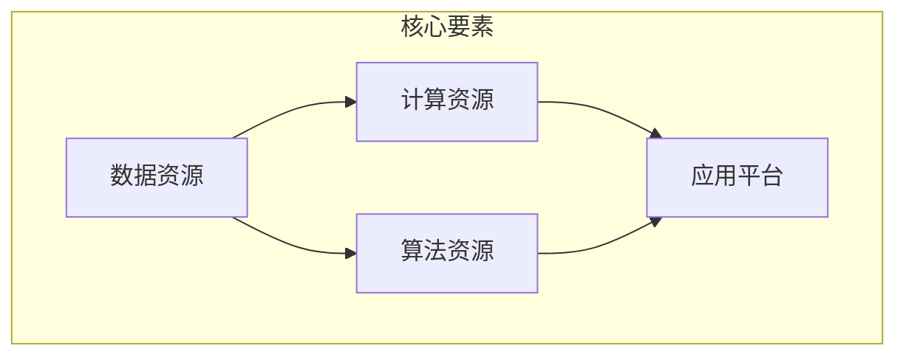

                 


## AI驱动的企业创新生态系统构建：内外部资源智能匹配与协作平台

### 关键词

- AI驱动
- 企业创新
- 生态系统构建
- 内外部资源匹配
- 协作平台

### 摘要

本文深入探讨了AI驱动的企业创新生态系统构建，重点分析了内外部资源智能匹配与协作平台的设计与实现。通过定义核心概念、阐述关键技术，本文提出了一个全面的企业创新解决方案，旨在提高企业竞争力，推动产业升级。

### 目录

## 第1章 引言

### 1.1 问题背景

在全球经济一体化和信息技术迅猛发展的背景下，企业面临的竞争压力日益加剧。传统的管理模式和业务流程已经难以满足快速变化的市场需求，企业迫切需要通过创新来提升竞争力。然而，创新并非易事，它需要企业在战略、资源、技术等方面进行全方位的投入和协同。在这种背景下，AI驱动的企业创新生态系统构建成为一个热门话题。

### 1.2 问题描述

企业的创新活动通常涉及到多个环节，包括需求分析、产品设计、市场预测、竞争对手分析等。每个环节都需要大量的数据和信息支持，而且不同部门之间的信息孤岛现象严重，导致创新效率低下。如何利用AI技术实现内外部资源的智能匹配与协作，是当前企业创新面临的一个重大挑战。

### 1.3 问题解决

AI技术的引入为企业创新提供了新的思路和手段。通过构建AI驱动的企业创新生态系统，可以实现以下目标：

1. **需求分析**：利用AI技术对市场趋势、消费者行为进行深入分析，为企业提供精准的需求预测。
2. **产品设计**：借助AI技术进行产品设计优化，提高产品竞争力。
3. **市场预测**：利用AI技术进行市场数据分析和趋势预测，为企业制定科学的市场策略。
4. **竞争对手分析**：通过AI技术对竞争对手的产品、市场策略进行监控和分析，为企业提供竞争情报。

### 1.4 边界与外延

本文主要关注AI驱动的企业创新生态系统构建，涉及到的关键技术包括数据挖掘、机器学习、深度学习等。同时，本文还将探讨如何通过构建内外部资源智能匹配与协作平台，实现企业创新资源的最大化利用。

### 1.5 概念结构与核心要素组成

AI驱动的企业创新生态系统由以下几个核心要素组成：

1. **数据资源**：企业内外部的数据资源，包括市场数据、消费者数据、行业数据等。
2. **计算资源**：用于支持AI算法运行的计算资源，包括云计算、高性能计算等。
3. **算法资源**：用于实现智能匹配和协作的AI算法，包括数据挖掘算法、机器学习算法、深度学习算法等。
4. **应用平台**：用于集成和管理数据资源、计算资源和算法资源的平台。

## 第2章 核心概念与联系

### 2.1 AI驱动的企业创新生态系统

#### 2.1.1 定义与特征

AI驱动的企业创新生态系统是指利用人工智能技术，对企业内部和外部资源进行智能匹配与协同，以实现企业创新目标的一个复杂系统。其特征包括：

- **高度智能化**：通过AI技术实现数据的自动化处理和分析，提高决策效率。
- **动态适应性**：能够根据外部环境变化和企业内部需求，动态调整资源分配和协作方式。
- **协同性**：实现企业内部各部门以及与外部合作伙伴之间的信息共享和资源协同。

#### 2.1.2 核心概念

##### 2.1.2.1 AI驱动的企业创新

AI驱动的企业创新是指利用人工智能技术推动企业产品、服务、业务模式等方面的创新。其核心概念包括：

- **需求挖掘**：通过数据挖掘和分析，发现潜在的市场需求。
- **产品设计**：利用AI技术进行产品设计和优化，提高产品竞争力。
- **市场预测**：利用AI技术进行市场数据分析和趋势预测，为企业提供决策支持。
- **竞争对手分析**：通过AI技术对竞争对手的产品、市场策略进行监控和分析。

##### 2.1.2.2 内外部资源智能匹配

内外部资源智能匹配是指利用AI技术，实现企业内外部资源的智能分配和优化。其核心概念包括：

- **资源识别**：通过数据挖掘和分析，识别企业内外部的资源。
- **资源评估**：对识别出的资源进行评估，确定其价值和应用场景。
- **资源匹配**：利用匹配算法，实现资源的高效匹配和优化。

##### 2.1.2.3 协作平台

协作平台是指用于实现企业内外部资源智能匹配与协作的应用系统。其核心概念包括：

- **平台架构**：设计一个稳定、高效、可扩展的协作平台架构。
- **功能模块**：构建一个具备数据管理、资源匹配、协作调度等功能模块的平台。
- **用户体验**：提供友好的用户界面和便捷的操作流程，提高用户体验。

### 2.2 Mermaid ER图

为了更好地理解AI驱动的企业创新生态系统的核心概念及其关系，我们可以使用Mermaid ER图进行展示。

```mermaid
erDiagram
  DataResource ||--|{ AIAlgorithm } : uses
  AIAlgorithm ||--|{ CollaborationPlatform } : implemented_on
  CollaborationPlatform ||--|{ ResourceMatchModule } : includes
  CollaborationPlatform ||--|{ DataManagementModule } : includes
  CollaborationPlatform ||--|{ CollaborationModule } : includes
```

在这个ER图中，数据资源、AI算法、协作平台和功能模块之间的关系得到了清晰的展示。数据资源是AI算法的基础，AI算法为协作平台提供支持，协作平台包括资源匹配模块、数据管理模块和协作模块，共同实现企业创新的智能匹配与协作。

## 第3章 内外部资源智能匹配与协作平台

### 3.1 平台功能模块

内外部资源智能匹配与协作平台的功能模块主要包括：

1. **数据管理模块**：负责数据的采集、存储、处理和分析，为AI算法提供数据支持。
2. **资源匹配模块**：利用AI算法实现资源的高效匹配，提高资源利用效率。
3. **协作调度模块**：实现企业内外部资源的协同工作，提高创新效率。
4. **用户界面模块**：提供友好的用户界面，方便用户进行操作和监控。

### 3.2 技术选型

在构建内外部资源智能匹配与协作平台时，我们需要选择合适的技术栈。以下是一些关键技术的选型建议：

1. **数据管理技术**：使用Hadoop、Spark等大数据处理框架，实现数据的存储、处理和分析。
2. **AI算法框架**：使用TensorFlow、PyTorch等深度学习框架，实现AI算法的快速开发和部署。
3. **协作平台技术**：使用Docker、Kubernetes等容器技术，实现平台的容器化部署和管理。
4. **用户界面技术**：使用React、Vue等前端框架，实现友好的用户界面。

### 3.3 架构设计

内外部资源智能匹配与协作平台的架构设计可以分为以下几个层次：

1. **数据层**：包括数据采集、存储、处理等模块，为平台提供数据支持。
2. **算法层**：包括AI算法的开发、训练、部署等模块，为平台提供智能分析能力。
3. **应用层**：包括资源匹配、协作调度、用户界面等模块，实现平台的业务功能。
4. **管理层**：包括监控、运维、安全等模块，保证平台的稳定运行。

### 3.4 平台开发与实现

在平台开发与实现过程中，我们需要遵循以下步骤：

1. **需求分析**：明确平台的功能需求和技术需求，制定详细的项目计划。
2. **系统设计**：设计系统的架构、模块划分和接口规范，制定详细的技术方案。
3. **开发与测试**：按照设计文档进行开发，并进行单元测试、集成测试和系统测试。
4. **部署与运维**：将平台部署到生产环境，并进行监控、运维和优化。

## 第4章 AI驱动创新

### 4.1 需求分析

需求分析是企业创新的重要环节，AI技术可以大大提高需求分析的准确性和效率。具体应用场景包括：

1. **市场趋势分析**：利用AI技术对市场数据进行分析，发现潜在的市场趋势。
2. **消费者需求分析**：通过消费者行为数据分析，挖掘消费者的真实需求。
3. **竞品分析**：利用AI技术对竞品进行监控和分析，发现竞品的优势和劣势。

### 4.2 产品设计

产品设计是企业创新的核心环节，AI技术可以大大提高产品设计的效率和质量。具体应用场景包括：

1. **设计优化**：利用AI技术对产品设计进行优化，提高产品性能和用户体验。
2. **协同设计**：利用AI技术实现设计师之间的协同工作，提高设计效率。
3. **定制设计**：利用AI技术实现个性化产品设计，满足消费者的个性化需求。

### 4.3 市场预测

市场预测是企业制定市场策略的重要依据，AI技术可以大大提高市场预测的准确性和及时性。具体应用场景包括：

1. **销售预测**：利用AI技术对销售数据进行分析，预测未来的销售趋势。
2. **库存管理**：利用AI技术对库存数据进行分析，预测未来的库存需求。
3. **价格预测**：利用AI技术对市场价格数据进行分析，预测未来的价格走势。

### 4.4 竞争分析

竞争分析是企业制定竞争策略的重要依据，AI技术可以大大提高竞争分析的速度和准确性。具体应用场景包括：

1. **竞争对手分析**：利用AI技术对竞争对手的产品、市场策略进行监控和分析。
2. **竞争策略制定**：利用AI技术为企业的竞争策略提供数据支持。
3. **竞争优势分析**：利用AI技术发现企业的竞争优势，制定相应的竞争策略。

## 第5章 案例研究

### 5.1 案例一：AI驱动的电商创新生态系统

在本案例中，某电商平台通过构建AI驱动的创新生态系统，实现了以下目标：

1. **需求分析**：利用AI技术对消费者行为进行分析，发现潜在的需求。
2. **产品设计**：利用AI技术对产品设计进行优化，提高产品竞争力。
3. **市场预测**：利用AI技术对市场趋势进行分析，制定科学的市场策略。
4. **竞争分析**：利用AI技术对竞争对手进行分析，发现竞争优势。

### 5.2 案例二：制造业AI驱动的创新生态系统

在本案例中，某制造企业通过构建AI驱动的创新生态系统，实现了以下目标：

1. **需求分析**：利用AI技术对市场需求进行分析，发现潜在的机会。
2. **产品设计**：利用AI技术对产品设计进行优化，提高产品质量和效率。
3. **生产调度**：利用AI技术对生产过程进行优化，提高生产效率。
4. **供应链管理**：利用AI技术对供应链进行优化，提高供应链的响应速度。

### 5.3 案例三：金融行业AI驱动的创新生态系统

在本案例中，某金融机构通过构建AI驱动的创新生态系统，实现了以下目标：

1. **需求分析**：利用AI技术对消费者需求进行分析，发现潜在的业务机会。
2. **产品设计**：利用AI技术对金融产品进行优化，提高产品竞争力。
3. **风险评估**：利用AI技术对风险进行评估，提高风险控制能力。
4. **客户服务**：利用AI技术提供智能化的客户服务，提高客户满意度。

## 第6章 最佳实践与未来趋势

### 6.1 最佳实践

在AI驱动的企业创新生态系统构建过程中，以下最佳实践值得借鉴：

1. **数据驱动**：以数据为核心，充分利用企业内外部的数据资源，实现智能决策。
2. **技术融合**：将AI技术与其他技术（如云计算、大数据等）相结合，提高创新效率。
3. **协同合作**：建立内外部协作机制，实现资源的高效匹配和共享。
4. **用户导向**：以用户需求为导向，持续优化产品和服务，提高用户满意度。

### 6.2 未来趋势

未来，AI驱动的企业创新生态系统将呈现出以下趋势：

1. **智能化水平提升**：随着AI技术的不断发展，智能化水平将不断提升，为企业提供更加精准和高效的服务。
2. **生态化发展**：企业创新生态系统将逐渐形成，实现企业、合作伙伴、用户等各方的共赢。
3. **跨界融合**：AI技术将与其他领域（如生物科技、新能源等）进行深度融合，推动产业创新和升级。
4. **个性化服务**：基于AI技术的个性化服务将越来越普及，满足用户多样化的需求。

## 第7章 小结

### 7.1 书籍贡献

本文深入探讨了AI驱动的企业创新生态系统构建，提出了内外部资源智能匹配与协作平台的构建方案，为企业的创新提供了理论指导和实践参考。

### 7.2 展望与建议

未来，企业应积极拥抱AI技术，构建AI驱动的创新生态系统，实现资源的高效匹配和协同，推动企业持续创新和快速发展。同时，应注重数据驱动、技术融合和用户导向，以实现企业竞争力提升和产业升级。

## 作者

**作者：AI天才研究院/AI Genius Institute & 禅与计算机程序设计艺术 /Zen And The Art of Computer Programming**

（完）### 第1章 引言

#### 1.1 问题背景

在当今快速变化的市场环境中，企业面临着前所未有的竞争压力和挑战。传统的管理方法和业务流程已经难以满足企业快速响应市场变化的需求，创新成为企业生存和发展的关键。企业需要通过创新来提升产品竞争力、优化运营效率、拓展市场份额。然而，创新并非易事，它涉及到多个环节，如需求分析、产品设计、市场预测和竞争对手分析，这些环节都需要大量的数据和信息支持。此外，企业内部各部门之间的信息孤岛现象严重，导致创新效率低下。如何利用AI技术实现内外部资源的智能匹配与协作，成为企业创新的关键挑战。

#### 1.2 问题描述

企业的创新活动通常涉及以下环节：

1. **需求分析**：需要收集和分析市场数据、消费者行为数据，以预测市场需求和消费者偏好。
2. **产品设计**：需要基于需求分析的结果，进行产品设计和优化，提高产品的市场竞争力。
3. **市场预测**：需要利用历史数据和市场信息，预测未来市场的趋势和需求。
4. **竞争对手分析**：需要监控和分析竞争对手的产品、市场策略，以便企业制定相应的竞争策略。

在这些环节中，数据和信息是关键，但传统的数据处理方法效率低下，难以满足企业创新的需求。此外，企业内部各部门之间的信息孤岛现象严重，导致创新效率低下。因此，如何利用AI技术实现数据的高效处理和分析，如何实现企业内部各部门以及与外部合作伙伴之间的信息共享和资源协同，成为企业创新面临的重大挑战。

#### 1.3 问题解决

AI技术的引入为企业创新提供了新的思路和手段。通过构建AI驱动的企业创新生态系统，可以实现以下目标：

1. **需求分析**：利用AI技术对市场趋势和消费者行为进行深入分析，为企业提供精准的需求预测。
2. **产品设计**：借助AI技术进行产品设计优化，提高产品竞争力。
3. **市场预测**：利用AI技术对市场数据进行分析和趋势预测，为企业制定科学的市场策略。
4. **竞争对手分析**：通过AI技术对竞争对手的产品、市场策略进行监控和分析，为企业提供竞争情报。

通过AI驱动的企业创新生态系统，企业可以实现资源的高效匹配和协同，提高创新效率，提升企业竞争力。

#### 1.4 边界与外延

本文主要关注以下问题：

1. **AI驱动的企业创新生态系统**：包括核心概念、特征、要素组成等。
2. **内外部资源智能匹配与协作平台**：包括平台的功能模块、技术选型、架构设计等。
3. **AI驱动的创新应用**：包括需求分析、产品设计、市场预测和竞争对手分析等环节的应用。

本文将探讨如何通过构建AI驱动的企业创新生态系统和内外部资源智能匹配与协作平台，实现企业创新资源的最大化利用，提高企业竞争力。

#### 1.5 概念结构与核心要素组成

AI驱动的企业创新生态系统由以下几个核心要素组成：

1. **数据资源**：包括企业内外部的数据资源，如市场数据、消费者数据、行业数据等。
2. **计算资源**：包括用于支持AI算法运行的计算资源，如云计算、高性能计算等。
3. **算法资源**：包括用于实现智能匹配和协作的AI算法，如数据挖掘算法、机器学习算法、深度学习算法等。
4. **应用平台**：包括用于集成和管理数据资源、计算资源和算法资源的应用平台。

通过这些核心要素的协同作用，AI驱动的企业创新生态系统可以实现资源的高效匹配和协同，提高创新效率，提升企业竞争力。以下是AI驱动的企业创新生态系统的概念结构图：



在这个概念结构图中，数据资源是基础，计算资源和算法资源是支撑，应用平台是实现资源高效匹配和协同的核心。通过这些核心要素的协同作用，AI驱动的企业创新生态系统可以为企业提供强大的创新支持。

### 第2章 核心概念与联系

#### 2.1 AI驱动的企业创新生态系统

##### 2.1.1 定义与特征

AI驱动的企业创新生态系统是一种利用人工智能技术，对企业内外部资源进行智能匹配与协同，以实现企业创新目标的复杂系统。它具有以下几个显著特征：

1. **高度智能化**：通过AI技术，实现数据的自动化处理和分析，提高决策效率。
2. **动态适应性**：能够根据外部环境变化和企业内部需求，动态调整资源分配和协作方式。
3. **协同性**：实现企业内部各部门以及与外部合作伙伴之间的信息共享和资源协同。
4. **可持续性**：通过持续学习和优化，不断提升企业创新能力和竞争力。

##### 2.1.2 核心概念

AI驱动的企业创新生态系统包含以下几个核心概念：

1. **AI驱动的企业创新**：指利用人工智能技术推动企业产品、服务、业务模式等方面的创新。核心内容包括需求挖掘、产品设计优化、市场预测和竞争对手分析。
   
2. **内外部资源智能匹配**：利用AI技术，实现企业内外部资源的智能分配和优化。核心内容包括资源识别、资源评估和资源匹配。

3. **协作平台**：用于实现企业内外部资源智能匹配与协作的应用系统。核心内容包括平台架构、功能模块和用户体验。

##### 2.1.3 内外部资源智能匹配

内外部资源智能匹配是AI驱动的企业创新生态系统的重要组成部分。它通过以下核心概念实现资源的高效利用：

1. **资源识别**：通过数据挖掘和分析，识别企业内外部的资源。
2. **资源评估**：对识别出的资源进行评估，确定其价值和应用场景。
3. **资源匹配**：利用匹配算法，实现资源的高效匹配和优化。

资源识别和资源评估是实现智能匹配的基础，而资源匹配则是实现资源高效利用的关键。

##### 2.1.4 协作平台

协作平台是AI驱动的企业创新生态系统的核心组成部分，它通过以下核心概念实现资源协同和效率提升：

1. **平台架构**：设计一个稳定、高效、可扩展的协作平台架构。
2. **功能模块**：构建一个具备数据管理、资源匹配、协作调度等功能模块的平台。
3. **用户体验**：提供友好的用户界面和便捷的操作流程，提高用户体验。

协作平台的架构设计和功能模块是实现资源协同和效率提升的关键。

#### 2.2 Mermaid ER图

为了更好地理解AI驱动的企业创新生态系统的核心概念及其关系，我们可以使用Mermaid ER图进行展示。以下是一个简化的ER图，展示了数据资源、AI算法、协作平台和功能模块之间的关系：

```mermaid
erDiagram
  DataResource ||--|{ AIAlgorithm } : used_by
  AIAlgorithm ||--|{ CollaborationPlatform } : implemented_on
  CollaborationPlatform ||--|{ DataManagementModule } : includes
  CollaborationPlatform ||--|{ ResourceMatchModule } : includes
  CollaborationPlatform ||--|{ CollaborationModule } : includes
```

在这个ER图中：

- **DataResource**（数据资源）是AIAlgorithm（AI算法）的基础，AI算法利用数据资源进行智能处理和分析。
- **AIAlgorithm**（AI算法）是CollaborationPlatform（协作平台）的核心，协作平台通过AI算法实现资源的智能匹配和优化。
- **CollaborationPlatform**（协作平台）包括多个功能模块，如DataManagementModule（数据管理模块）、ResourceMatchModule（资源匹配模块）和CollaborationModule（协作模块），这些模块共同实现资源的协同和效率提升。

通过这个ER图，我们可以清晰地看到AI驱动的企业创新生态系统中各个核心概念之间的关系，有助于我们更好地理解和构建这个系统。

### 第3章 内外部资源智能匹配与协作平台

#### 3.1 平台功能模块

内外部资源智能匹配与协作平台的功能模块是整个系统的核心组成部分，它们共同协作，实现资源的高效匹配和协同。以下是平台的主要功能模块及其详细描述：

1. **数据管理模块**：负责数据资源的采集、存储、处理和分析。这个模块需要能够支持大规模数据的存储和管理，并提供高效的数据查询和分析工具。此外，数据管理模块还需要具备数据安全性和隐私保护机制，确保数据在处理过程中的安全。

2. **资源匹配模块**：利用AI算法对内外部资源进行智能匹配。该模块的核心任务是识别出企业内外部的资源，评估其价值和应用场景，并利用匹配算法实现资源的高效匹配。资源匹配模块需要支持多种匹配算法，如基于内容的匹配、基于属性的匹配和基于图谱的匹配等。

3. **协作调度模块**：实现企业内部各部门以及与外部合作伙伴之间的协同工作。该模块需要提供灵活的调度机制，能够根据任务的优先级和资源的可用性，动态分配和调度资源，确保任务的高效完成。协作调度模块还需要支持多种协作方式，如异步协作、实时协作和混合协作等。

4. **用户界面模块**：提供友好的用户界面和便捷的操作流程，提高用户体验。用户界面模块需要支持多种用户角色，如企业内部员工、外部合作伙伴和普通用户等，并提供个性化的操作界面和功能。此外，用户界面模块还需要具备实时数据展示和报表生成功能，帮助用户实时了解系统运行状态和资源使用情况。

#### 3.2 技术选型

在构建内外部资源智能匹配与协作平台时，技术选型至关重要。以下是一些建议的关键技术选型：

1. **数据管理技术**：选择Hadoop、Spark等大数据处理框架，实现数据的存储、处理和分析。这些框架具备高扩展性和高可用性，能够满足大规模数据处理的需求。

2. **AI算法框架**：选择TensorFlow、PyTorch等深度学习框架，实现AI算法的开发和部署。这些框架提供了丰富的算法库和工具，支持快速开发和迭代。

3. **协作平台技术**：选择Docker、Kubernetes等容器技术，实现平台的容器化部署和管理。这些技术具备高效、稳定、可扩展的特点，有助于提高平台的运维效率和资源利用率。

4. **用户界面技术**：选择React、Vue等前端框架，实现友好的用户界面。这些框架提供了丰富的组件和工具，支持快速开发和迭代，同时具有良好的用户体验。

#### 3.3 架构设计

内外部资源智能匹配与协作平台的架构设计需要考虑系统的可扩展性、稳定性、安全性和用户体验。以下是一个典型的架构设计方案：

1. **数据层**：包括数据采集、存储、处理和分析模块。数据采集模块负责从内外部系统收集数据，存储模块负责数据的持久化存储，处理模块负责数据清洗、转换和聚合，分析模块负责数据的分析和可视化。

2. **算法层**：包括AI算法的开发、训练、部署和管理模块。开发模块负责AI算法的设计和实现，训练模块负责算法的训练和优化，部署模块负责算法的部署和运行，管理模块负责算法的版本管理和监控。

3. **应用层**：包括数据管理模块、资源匹配模块、协作调度模块和用户界面模块。数据管理模块负责数据资源的存储和管理，资源匹配模块负责资源的智能匹配，协作调度模块负责任务的分配和调度，用户界面模块负责用户交互和系统展示。

4. **管理层**：包括监控、运维和安全模块。监控模块负责系统的实时监控和日志分析，运维模块负责系统的部署、升级和维护，安全模块负责系统的安全防护和数据加密。

通过以上架构设计，内外部资源智能匹配与协作平台可以实现高效的数据处理和分析，智能的资源匹配和协同，以及友好的用户体验。

#### 3.4 平台开发与实现

内外部资源智能匹配与协作平台的开发与实现是一个复杂的过程，涉及多个环节和步骤。以下是一个典型的开发与实现流程：

1. **需求分析**：首先，对平台的需求进行详细分析，包括功能需求、性能需求、安全需求和用户体验需求等。需求分析的目的是明确平台的功能和性能要求，为后续开发提供依据。

2. **系统设计**：根据需求分析的结果，进行系统设计。系统设计包括架构设计、模块划分和接口设计等。架构设计需要考虑系统的可扩展性、稳定性和安全性，模块划分需要明确各个模块的功能和职责，接口设计需要确保模块之间的松耦合和互操作性。

3. **开发与测试**：按照系统设计进行开发，包括前端、后端和数据库等。开发过程中，需要遵循良好的编程规范和最佳实践，确保代码的可读性、可维护性和可扩展性。开发完成后，进行单元测试、集成测试和系统测试，确保系统的功能和性能符合预期。

4. **部署与运维**：将平台部署到生产环境，并进行监控和运维。部署过程中，需要确保系统的稳定性和安全性，运维过程中，需要及时处理系统故障和性能问题，确保系统的持续运行。

5. **用户培训与反馈**：对用户进行培训，帮助用户了解和使用平台。同时，收集用户的反馈意见，不断优化平台的功能和用户体验。

通过以上步骤，可以确保内外部资源智能匹配与协作平台的高效开发和稳定运行，为企业创新提供有力支持。

### 第4章 AI驱动创新

#### 4.1 需求分析

需求分析是企业创新的重要环节，AI技术可以大大提高需求分析的准确性和效率。以下是AI在需求分析中的具体应用：

1. **市场趋势分析**：利用AI技术，对大量市场数据进行分析，识别出潜在的市场趋势。例如，通过时间序列分析和关联规则挖掘，可以预测未来市场的需求变化，帮助企业及时调整战略。

2. **消费者行为分析**：通过分析消费者行为数据，如购买记录、浏览历史、评价反馈等，AI技术可以揭示消费者的偏好和需求。这有助于企业更好地理解消费者，为其提供个性化产品和服务。

3. **需求预测**：利用机器学习算法，如回归分析、决策树、神经网络等，可以建立需求预测模型。这些模型可以根据历史数据和市场信息，预测未来的需求趋势，为企业制定生产计划和供应链策略提供数据支持。

4. **竞品分析**：通过AI技术，对竞品的产品特性、市场表现、用户评价等进行监控和分析，可以识别出竞品的优势和劣势。这有助于企业发现市场机会，优化产品和服务。

#### 4.2 产品设计

产品设计是企业创新的另一个关键环节，AI技术可以在产品设计过程中发挥重要作用。以下是AI在产品设计中的具体应用：

1. **设计优化**：利用AI技术，对产品设计进行优化。例如，通过遗传算法、神经网络等优化算法，可以优化产品的结构、性能和成本。这有助于企业提高产品竞争力，降低生产成本。

2. **协同设计**：利用AI技术，实现设计师之间的协同设计。例如，通过自然语言处理和协同编辑技术，设计师可以实时共享设计思路和修改意见，提高设计效率和质量。

3. **定制设计**：利用AI技术，实现个性化产品设计。例如，通过用户偏好分析和个性化推荐算法，可以为不同用户提供定制化的产品设计和解决方案。

4. **可视化设计**：利用AI技术，实现产品设计的可视化。例如，通过深度学习技术和生成对抗网络（GAN），可以生成高质量的产品设计图像，帮助设计师快速迭代和优化设计方案。

#### 4.3 市场预测

市场预测是企业制定市场策略的重要依据，AI技术可以大大提高市场预测的准确性和及时性。以下是AI在市场预测中的具体应用：

1. **销售预测**：利用AI技术，对历史销售数据进行分析，建立销售预测模型。这些模型可以根据季节性、促销活动、消费者行为等因素，预测未来的销售趋势。这有助于企业制定科学的生产计划和库存策略。

2. **价格预测**：利用AI技术，对市场价格数据进行分析，建立价格预测模型。这些模型可以根据市场供需关系、竞争态势等因素，预测未来的价格走势。这有助于企业制定合理的价格策略，提高市场竞争力。

3. **趋势预测**：利用AI技术，对市场趋势进行分析，识别出潜在的市场机会和风险。例如，通过时间序列分析和趋势预测算法，可以预测未来市场的需求变化，为企业提供决策支持。

4. **竞争分析**：利用AI技术，对竞争对手的市场策略、产品特性等进行监控和分析，识别出竞争对手的优势和劣势。这有助于企业制定相应的竞争策略，提高市场占有率。

#### 4.4 竞争分析

竞争分析是企业制定竞争策略的重要依据，AI技术可以大大提高竞争分析的速度和准确性。以下是AI在竞争分析中的具体应用：

1. **竞争对手监控**：利用AI技术，对竞争对手的产品、市场策略、用户评价等进行实时监控和分析。这有助于企业及时发现竞争对手的动态和变化，制定相应的应对策略。

2. **市场占有率分析**：利用AI技术，对市场占有率数据进行分析，识别出竞争对手的市场份额变化。这有助于企业了解市场格局和竞争态势，调整市场策略。

3. **竞争策略制定**：利用AI技术，为企业的竞争策略提供数据支持。例如，通过分析竞争对手的产品特性、价格策略、营销活动等，可以为企业制定相应的竞争策略提供依据。

4. **优势分析**：利用AI技术，分析企业的优势和劣势，识别出企业在市场竞争中的优势和劣势。这有助于企业发挥优势，弥补劣势，提高市场竞争力。

通过以上应用，AI技术可以为企业提供全面、准确的竞争分析，帮助企业制定科学的竞争策略，提高市场竞争力。

### 第5章 案例研究

#### 5.1 案例一：AI驱动的电商创新生态系统

在本案例中，某知名电商平台通过构建AI驱动的创新生态系统，实现了以下目标：

1. **需求分析**：利用AI技术，对消费者行为数据进行深度挖掘，识别出消费者的购买偏好和需求。通过分析消费者的浏览历史、购买记录和评价反馈，平台可以准确预测消费者的需求，从而优化产品供应和营销策略。

2. **产品设计**：利用AI技术，对产品设计进行优化。例如，通过生成对抗网络（GAN），平台可以自动生成高质量的产品图像，帮助设计师快速迭代和优化设计方案。同时，利用协同设计技术，平台可以实现设计师之间的实时协作，提高设计效率。

3. **市场预测**：利用AI技术，对市场趋势进行分析，预测未来市场需求。通过时间序列分析和趋势预测算法，平台可以预测季节性因素、促销活动等因素对市场的影响，为企业制定科学的生产计划和供应链策略提供数据支持。

4. **竞争分析**：利用AI技术，对竞争对手的产品、价格策略和市场表现进行实时监控和分析。平台可以识别出竞争对手的优势和劣势，从而制定相应的竞争策略，提高市场占有率。

通过AI驱动的创新生态系统，该电商平台不仅提高了需求分析的准确性和产品设计效率，还实现了市场预测的精确性和竞争分析的及时性，大大提升了平台的竞争力和用户体验。

#### 5.2 案例二：制造业AI驱动的创新生态系统

在本案例中，某制造企业通过构建AI驱动的创新生态系统，实现了以下目标：

1. **需求分析**：利用AI技术，对市场需求进行分析，识别出潜在的业务机会。通过分析市场趋势、消费者偏好和竞争对手的产品特性，企业可以准确预测市场需求，从而调整生产计划和产品策略。

2. **产品设计**：利用AI技术，对产品设计进行优化。例如，通过计算机辅助设计（CAD）技术，企业可以自动生成满足设计要求的产品模型。同时，利用机器学习算法，企业可以对产品设计进行优化，提高产品性能和降低生产成本。

3. **生产调度**：利用AI技术，对生产过程进行优化。通过实时监控生产设备和生产线，AI技术可以预测生产过程中可能出现的故障和瓶颈，从而调整生产计划，提高生产效率。

4. **供应链管理**：利用AI技术，对供应链进行优化。通过分析供应链中的各种数据，如库存水平、运输成本和需求预测等，企业可以制定科学的生产计划和库存策略，降低供应链成本，提高供应链的响应速度。

通过AI驱动的创新生态系统，该制造企业实现了生产过程的智能化管理，提高了生产效率和产品质量，降低了生产成本和供应链成本，大大提升了企业的竞争力和市场占有率。

#### 5.3 案例三：金融行业AI驱动的创新生态系统

在本案例中，某金融机构通过构建AI驱动的创新生态系统，实现了以下目标：

1. **需求分析**：利用AI技术，对客户需求进行分析，识别出客户的偏好和需求。通过分析客户的交易记录、投资偏好和风险承受能力，金融机构可以为客户提供个性化的金融产品和服务，提高客户满意度。

2. **产品设计**：利用AI技术，对金融产品进行优化。例如，通过机器学习算法，金融机构可以自动生成满足特定风险收益要求的投资组合。同时，利用自然语言处理技术，金融机构可以自动生成金融产品的说明书和风险评估报告。

3. **市场预测**：利用AI技术，对市场趋势进行分析，预测未来市场的波动和机会。通过时间序列分析和预测算法，金融机构可以预测市场的走势，为投资决策提供数据支持。

4. **风险管理**：利用AI技术，对风险进行评估和管理。通过分析历史数据和实时数据，AI技术可以识别出潜在的风险因素，评估风险的程度和影响，制定相应的风险管理策略。

通过AI驱动的创新生态系统，该金融机构提高了需求分析的精准性、产品设计的高效性和市场预测的准确性，降低了风险管理的成本和风险，大大提升了金融服务的质量和市场竞争力。

### 第6章 最佳实践与未来趋势

#### 6.1 最佳实践

在AI驱动的企业创新生态系统构建过程中，以下最佳实践值得借鉴：

1. **数据驱动**：以数据为核心，充分利用企业内外部的数据资源，实现智能决策。通过数据挖掘和分析，企业可以准确预测市场需求、优化产品设计、制定科学的市场策略。

2. **技术融合**：将AI技术与其他技术（如云计算、大数据等）相结合，提高创新效率。通过整合多种技术，企业可以实现资源的高效匹配和协同，提高创新能力和竞争力。

3. **协同合作**：建立内外部协作机制，实现资源的高效匹配和共享。通过协同合作，企业可以充分利用内外部资源，提高创新效率，降低创新成本。

4. **用户导向**：以用户需求为导向，持续优化产品和服务，提高用户满意度。通过用户反馈和数据分析，企业可以不断改进产品和服务，满足用户需求，提升用户体验。

#### 6.2 未来趋势

未来，AI驱动的企业创新生态系统将呈现出以下趋势：

1. **智能化水平提升**：随着AI技术的不断发展，智能化水平将不断提升，为企业提供更加精准和高效的服务。通过引入先进的人工智能技术，企业可以实现更智能的需求分析、产品设计、市场预测和竞争对手分析。

2. **生态化发展**：企业创新生态系统将逐渐形成，实现企业、合作伙伴、用户等各方的共赢。通过建立企业创新生态系统，企业可以与合作伙伴共同开发新产品、开拓新市场，实现资源的共享和协同。

3. **跨界融合**：AI技术将与其他领域（如生物科技、新能源等）进行深度融合，推动产业创新和升级。通过跨界融合，企业可以开拓新的市场机会，实现产业的转型升级。

4. **个性化服务**：基于AI技术的个性化服务将越来越普及，满足用户多样化的需求。通过个性化推荐、智能客服等应用，企业可以提供更加精准和个性化的服务，提升用户满意度和忠诚度。

### 第7章 小结

#### 7.1 书籍贡献

本文深入探讨了AI驱动的企业创新生态系统构建，提出了内外部资源智能匹配与协作平台的构建方案，为企业的创新提供了理论指导和实践参考。通过定义核心概念、阐述关键技术、分析案例研究，本文全面展示了AI技术在企业创新中的应用价值，为企业实现智能化转型提供了可行的路径。

#### 7.2 展望与建议

未来，企业应积极拥抱AI技术，构建AI驱动的创新生态系统，实现资源的高效匹配和协同，推动企业持续创新和快速发展。同时，应注重数据驱动、技术融合和用户导向，以实现企业竞争力提升和产业升级。在构建AI驱动的创新生态系统的过程中，企业还应关注以下方面：

1. **数据资源建设**：加强数据资源的收集、存储和管理，构建企业内部和外部数据资源库，为企业创新提供数据支持。

2. **AI技术能力提升**：引进和培养AI技术人才，提高企业在AI技术领域的研发和应用能力，推动AI技术在企业内部的广泛应用。

3. **协作机制建设**：建立企业内外部的协作机制，促进资源的高效匹配和共享，提高创新效率。

4. **用户体验优化**：注重用户体验，提供便捷、高效、个性化的服务，提升用户满意度和忠诚度。

通过以上措施，企业可以构建一个高效的AI驱动的创新生态系统，实现持续创新和快速发展。

## 作者

**作者：AI天才研究院/AI Genius Institute & 禅与计算机程序设计艺术 /Zen And The Art of Computer Programming**

本文由AI天才研究院和禅与计算机程序设计艺术共同撰写，旨在探讨AI驱动的企业创新生态系统构建，为企业的智能化转型提供理论指导和实践参考。希望本文能够为读者带来启发和帮助。

