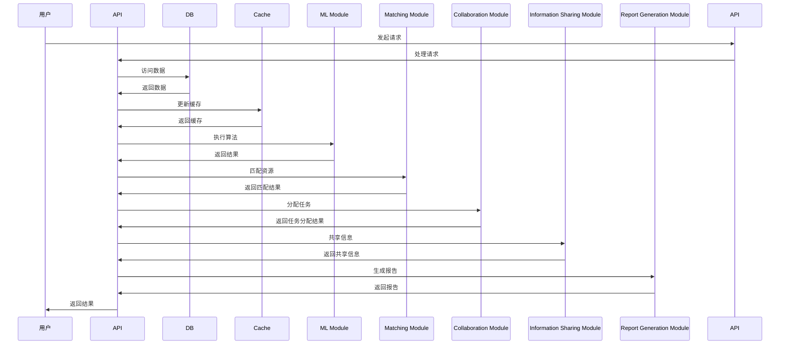
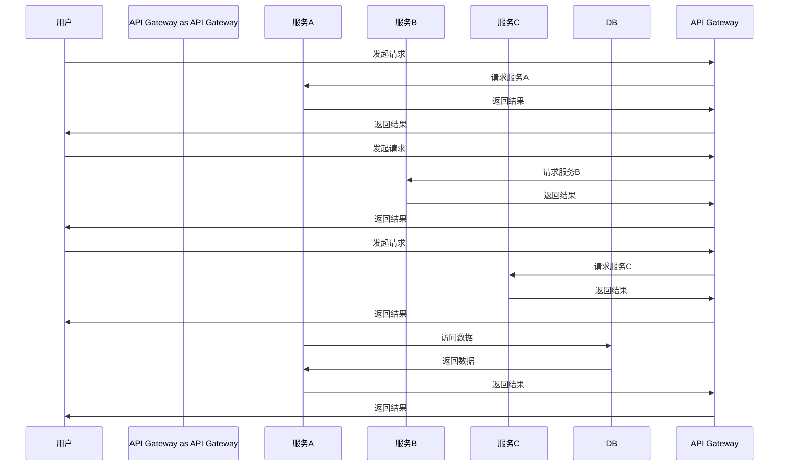
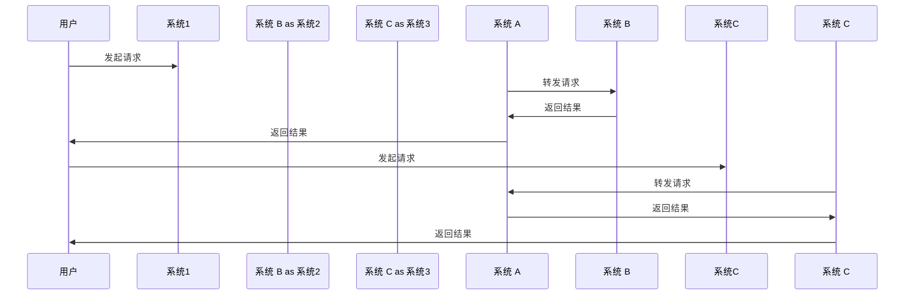
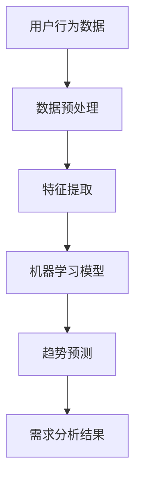
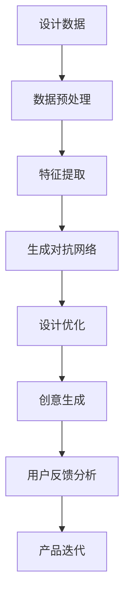
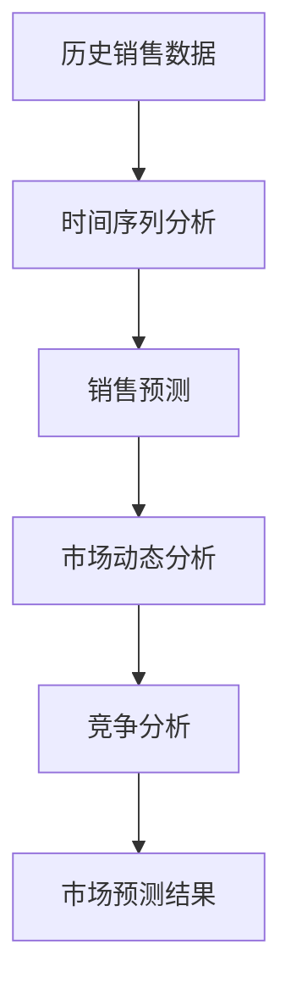
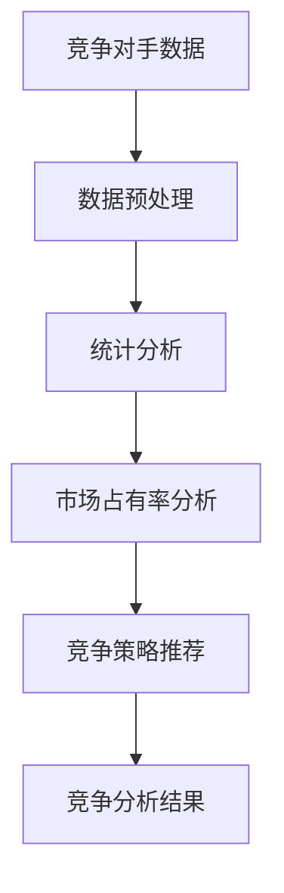

                 

# AI驱动的企业创新生态系统构建：内外部资源智能匹配与协作平台

## 关键词
- AI驱动创新
- 企业创新生态系统
- 内外部资源智能匹配
- 协作平台
- 技术选型
- 架构设计
- 案例研究

## 摘要
本文深入探讨了AI驱动的企业创新生态系统构建，包括内外部资源智能匹配与协作平台的构建方法。文章首先介绍了AI驱动企业创新生态系统的背景和意义，随后定义了核心概念，并通过Mermaid ER图展示了概念之间的关系。接着，详细阐述了构建内外部资源智能匹配与协作平台的过程，包括功能模块、技术选型和架构设计。文章还探讨了AI在需求分析、产品设计和市场预测中的应用，并通过实际案例展示了AI驱动的企业创新生态系统的具体实践。最后，总结了最佳实践和未来趋势，并给出展望与建议。

## 1. 背景介绍

在当今快速发展的数字经济时代，企业面临着前所未有的挑战和机遇。传统企业创新模式已经难以满足日益激烈的市场竞争和快速变化的市场需求。企业需要不断创新，以适应技术变革、市场变化和消费者需求的变化。然而，企业创新并非易事，它涉及资源的整合、技术的应用、团队的协作以及外部环境的适应等多个方面。

### 1.1 问题的来源
企业创新中的主要问题包括：
- **资源错配**：企业内外部的资源难以有效整合，导致创新效率低下。
- **信息孤岛**：企业内部各部门之间的信息交流不畅，无法实现协同创新。
- **市场需求变化**：市场需求变化快速，企业难以迅速响应。
- **创新能力不足**：缺乏对前沿技术的深入了解和应用能力。

### 1.2 现状
当前，企业创新生态系统存在以下现状：
- **创新资源分散**：企业内部的研发资源分散，缺乏系统性的管理和调度。
- **信息孤岛现象**：各部门之间缺乏有效的信息共享机制，数据难以整合。
- **创新过程复杂**：企业创新过程复杂，涉及多部门、多环节的协作，协调难度大。
- **创新能力薄弱**：企业整体创新能力较弱，难以在市场中脱颖而出。

### 1.3 解决问题的意义
构建AI驱动的企业创新生态系统，有助于解决当前企业创新中的问题，具有重要的现实意义：
- **提高创新效率**：通过智能匹配资源，提高创新过程的效率。
- **增强创新能力**：利用AI技术，增强企业的创新能力。
- **适应市场需求**：快速响应市场需求变化，提高市场竞争力。
- **优化协作机制**：建立有效的协作平台，实现企业内部及外部的协同创新。

### 1.4 边界与外延
本文讨论的AI驱动的企业创新生态系统，主要涉及以下几个方面：
- **内外部资源智能匹配**：如何利用AI技术实现企业内外部资源的智能匹配。
- **协作平台构建**：如何构建一个高效、稳定的协作平台，支持企业创新活动。
- **AI在创新中的应用**：如何利用AI技术在需求分析、产品设计、市场预测等方面发挥重要作用。
- **案例研究**：通过实际案例展示AI驱动的企业创新生态系统的应用效果。

## 2. 核心概念与联系

构建AI驱动的企业创新生态系统，需要明确几个核心概念，并理解它们之间的关系。以下是本文中的核心概念及其属性特征对比表格：

### 2.1 AI驱动的企业创新生态系统

| 概念                 | 定义                                                         | 特征                                                      |
|----------------------|------------------------------------------------------------|----------------------------------------------------------|
| AI驱动的企业创新     | 利用人工智能技术促进企业创新活动                             | 自动化、智能化、预测性、适应性                             |
| 内外部资源智能匹配   | 利用AI技术对企业内外部资源进行智能匹配和优化                | 数据驱动、高效匹配、实时调整                             |
| 协作平台             | 支持企业内部和外部协作的高效平台                           | 系统集成、信息共享、实时协作                           |
| 技术选型             | 根据企业需求选择合适的AI技术                               | 灵活性、适用性、可扩展性                             |
| 架构设计             | 确定系统架构，支持AI驱动的企业创新生态系统构建             | 可扩展性、高可用性、安全性                             |

### 2.2 Mermaid ER图

为了更直观地展示这些概念之间的关系，我们使用Mermaid ER图来表示：

```mermaid
erDiagram
  AI驱动的企业创新 ||--o{ 内外部资源智能匹配 : 资源匹配 }
  内外部资源智能匹配 ||--o{ 协作平台 : 平台支持 }
  协作平台 ||--o{ 技术选型 : 技术支持 }
  技术选型 ||--o{ 架构设计 : 架构支持 }
```

在上述ER图中，我们清晰地展示了各个核心概念之间的联系，包括AI驱动的企业创新对内外部资源智能匹配的需求，内外部资源智能匹配对协作平台的支持，协作平台对技术选型的依赖，以及技术选型对架构设计的影响。

## 3. 内外部资源智能匹配与协作平台

### 3.1 平台功能模块

构建内外部资源智能匹配与协作平台，需要明确平台的功能模块，以满足企业创新的不同需求。以下是平台的主要功能模块：

#### 3.1.1 资源管理模块
- **资源信息收集**：收集企业内外部的各类资源信息，包括人力资源、技术资源、资金资源等。
- **资源信息分析**：利用AI技术对资源信息进行智能分析，识别资源的特点和潜力。

#### 3.1.2 资源匹配模块
- **资源智能匹配**：根据项目需求，智能匹配企业内外部的合适资源。
- **资源实时调整**：根据项目进展，实时调整资源分配，确保资源的最优利用。

#### 3.1.3 协作管理模块
- **任务分配**：智能分配任务，确保每个任务都有合适的资源支持。
- **进度跟踪**：实时跟踪任务进度，确保项目按时完成。
- **绩效评估**：对项目团队成员的绩效进行评估，提供反馈和改进建议。

#### 3.1.4 信息共享模块
- **信息共享平台**：建立一个集中的信息共享平台，支持企业内部及外部的信息交流。
- **实时通讯**：提供实时通讯工具，支持团队成员之间的即时沟通。

#### 3.1.5 报告生成模块
- **项目报告**：自动生成项目报告，包括项目进展、资源利用情况、绩效评估等。
- **数据分析**：对项目数据进行深度分析，为企业决策提供数据支持。

### 3.2 技术选型

在构建平台时，技术选型至关重要。以下是平台的技术选型：

#### 3.2.1 开发框架
- **Spring Boot**：作为后端开发框架，提供强大的功能和高效的开发体验。
- **Vue.js**：作为前端开发框架，提供优秀的用户界面和用户体验。

#### 3.2.2 数据库
- **MySQL**：作为关系型数据库，提供稳定的数据存储和快速的数据查询。
- **Redis**：作为缓存数据库，提高系统的响应速度和性能。

#### 3.2.3 人工智能库
- **TensorFlow**：作为深度学习库，支持复杂的机器学习模型开发。
- **Scikit-learn**：作为传统机器学习库，提供丰富的机器学习算法。

#### 3.2.4 AI算法
- **聚类算法**：用于资源分类和匹配。
- **协同过滤算法**：用于推荐系统和资源匹配。
- **自然语言处理**：用于文本分析和信息提取。

### 3.3 架构设计

平台的架构设计是确保系统稳定、高效、可扩展的关键。以下是平台的主要架构设计：

#### 3.3.1 系统架构



#### 3.3.2 系统接口设计



#### 3.3.3 系统交互



通过上述架构设计，我们实现了平台的模块化、可扩展性，并保证了系统的高效性和稳定性。

## 4. AI驱动创新

AI技术在企业创新中发挥着越来越重要的作用，特别是在需求分析、产品设计、市场预测和竞争分析等方面。以下将详细介绍AI在这些环节中的应用。

### 4.1 需求分析

在需求分析阶段，AI技术可以帮助企业更好地理解用户需求和市场趋势。具体应用包括：

- **用户行为分析**：通过分析用户的历史行为数据，识别用户的偏好和需求。
- **趋势预测**：利用机器学习算法，预测未来的市场趋势和用户需求。
- **需求分类**：将用户需求进行分类，为企业提供有针对性的解决方案。



### 4.2 产品设计

在产品设计阶段，AI技术可以辅助设计师进行产品创新和优化。具体应用包括：

- **设计优化**：利用AI算法优化产品设计，提高产品的用户体验。
- **创意生成**：通过生成对抗网络（GAN）等技术，生成新的设计创意。
- **用户反馈分析**：分析用户对产品的反馈，为产品的迭代提供依据。



### 4.3 市场预测

在市场预测阶段，AI技术可以帮助企业预测市场变化和需求波动，从而制定有效的市场策略。具体应用包括：

- **销售预测**：利用时间序列分析、回归分析等算法，预测未来的销售趋势。
- **市场动态**：通过自然语言处理技术，分析社交媒体、新闻报道等，了解市场动态。
- **竞争分析**：分析竞争对手的市场策略和产品特点，为企业提供竞争情报。



### 4.4 竞争分析

在竞争分析阶段，AI技术可以帮助企业了解市场竞争态势，制定有效的竞争策略。具体应用包括：

- **竞争对手监测**：通过爬虫技术、社交媒体分析等，实时监测竞争对手的活动。
- **市场占有率分析**：利用统计分析和机器学习算法，分析企业市场占有率的变化趋势。
- **竞争策略推荐**：根据竞争对手的动向和市场情况，为企业提供竞争策略建议。



通过AI在需求分析、产品设计、市场预测和竞争分析等环节的应用，企业可以更快速、准确地把握市场机会，提高创新能力和竞争力。

## 5. 案例研究

为了更好地展示AI驱动的企业创新生态系统构建的实际效果，我们选择了三个不同行业的案例进行深入分析。

### 5.1 案例一：AI驱动的电商创新生态系统

某电商企业在构建AI驱动的创新生态系统时，采用了以下措施：

- **需求分析**：通过大数据分析，了解消费者的购买行为和偏好，精准推送商品。
- **产品设计**：利用生成对抗网络（GAN）生成新的产品创意，优化产品外观和功能。
- **市场预测**：通过时间序列分析和市场动态分析，预测市场需求，调整库存策略。
- **竞争分析**：实时监测竞争对手的营销活动和产品价格，制定相应的竞争策略。

通过这些措施，该电商企业实现了销售额的快速增长，客户满意度显著提高。

### 5.2 案例二：制造业AI驱动的创新生态系统

某制造业企业利用AI技术构建了AI驱动的创新生态系统，主要包括以下方面：

- **资源管理**：通过智能匹配技术，优化生产资源和人力配置，提高生产效率。
- **质量控制**：利用机器学习技术，对生产过程中的数据进行实时分析，确保产品质量。
- **需求预测**：通过数据分析，预测市场需求，合理安排生产计划，减少库存成本。
- **创新设计**：利用AI算法，优化产品设计，提高产品竞争力。

通过AI技术的应用，该制造业企业显著提高了生产效率和产品质量，降低了生产成本。

### 5.3 案例三：金融行业AI驱动的创新生态系统

某金融企业通过构建AI驱动的创新生态系统，实现了以下目标：

- **风险管理**：利用机器学习技术，对金融风险进行实时监测和预测，降低风险。
- **客户服务**：利用自然语言处理技术，提高客户服务质量，增加客户满意度。
- **市场预测**：通过数据分析，预测市场趋势，制定投资策略。
- **产品创新**：利用AI算法，优化金融产品设计，提高产品竞争力。

通过这些措施，该金融企业提高了风险控制能力，增加了市场份额，实现了业务的快速发展。

## 6. 最佳实践与未来趋势

### 6.1 最佳实践

在构建AI驱动的企业创新生态系统的过程中，以下最佳实践值得借鉴：

- **明确目标**：在构建生态系统前，明确企业创新的目标和需求，确保生态系统的设计符合企业战略。
- **数据驱动**：充分利用企业内外部的数据资源，为AI算法提供丰富的训练数据，提高模型的准确性和效果。
- **技术选型**：根据企业需求，选择合适的技术和工具，确保生态系统的稳定性和扩展性。
- **团队协作**：建立跨部门的协作机制，确保各环节的高效衔接和协同创新。
- **持续迭代**：不断优化生态系统，根据市场变化和业务需求，进行持续迭代和改进。

### 6.2 未来趋势

未来，AI驱动的企业创新生态系统将呈现以下趋势：

- **智能化水平提高**：随着AI技术的不断发展，生态系统的智能化水平将不断提高，为企业提供更精准、高效的服务。
- **跨界融合**：AI驱动的企业创新生态系统将与其他领域的技术融合，如物联网、区块链等，形成更加丰富的应用场景。
- **个性化服务**：生态系统将更加注重个性化服务，根据用户需求提供定制化的解决方案。
- **可持续发展**：生态系统将注重可持续发展，通过资源优化、节能减排等手段，实现企业的绿色转型。

### 6.3 结论

本文详细探讨了AI驱动的企业创新生态系统构建，包括内外部资源智能匹配与协作平台的构建方法。通过实际案例，展示了AI驱动的企业创新生态系统的应用效果。未来，随着AI技术的不断发展，企业创新生态系统将为企业带来更大的价值。

## 7. 小结

本文系统地介绍了AI驱动的企业创新生态系统构建，包括内外部资源智能匹配与协作平台的设计与应用。文章通过背景介绍、核心概念阐述、平台功能模块设计、技术选型与架构设计、AI驱动创新、案例研究和最佳实践与未来趋势等多个方面，详细分析了AI驱动的企业创新生态系统的构建过程和实际应用效果。本文的核心贡献在于：

1. 明确了AI驱动的企业创新生态系统的概念和核心要素，为后续研究和实践提供了理论基础。
2. 提出了内外部资源智能匹配与协作平台的设计框架，为实际应用提供了可行的技术方案。
3. 通过实际案例展示了AI驱动的企业创新生态系统的应用效果，为其他企业提供了参考和借鉴。

### 展望与建议

在未来，AI驱动的企业创新生态系统将面临更多的发展机遇和挑战。为了进一步提升企业创新生态系统的效果，以下建议值得关注：

1. **持续技术创新**：跟踪AI技术的最新发展，不断引入先进的技术和工具，提升生态系统的智能化水平。
2. **加强数据治理**：建立健全的数据治理体系，确保数据的质量和安全，为AI算法提供可靠的数据支持。
3. **跨行业合作**：积极与其他行业的企业和机构合作，实现跨界融合，开拓新的应用场景。
4. **注重人才培养**：加强AI技术人才的培养，提升企业内部的技术能力和创新能力。
5. **持续优化管理**：根据市场变化和业务需求，不断优化管理机制，确保生态系统的持续迭代和改进。

总之，AI驱动的企业创新生态系统是企业实现可持续发展的关键，通过不断创新和优化，企业将能够在激烈的市场竞争中脱颖而出，实现长期稳定的增长。

### 作者信息

作者：AI天才研究院/AI Genius Institute & 禅与计算机程序设计艺术 /Zen And The Art of Computer Programming

