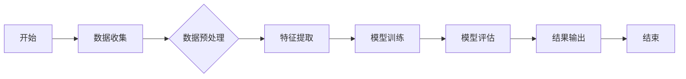
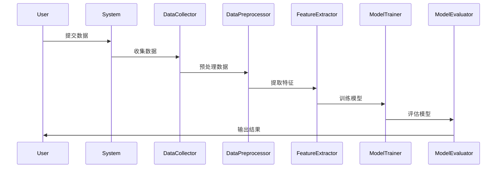
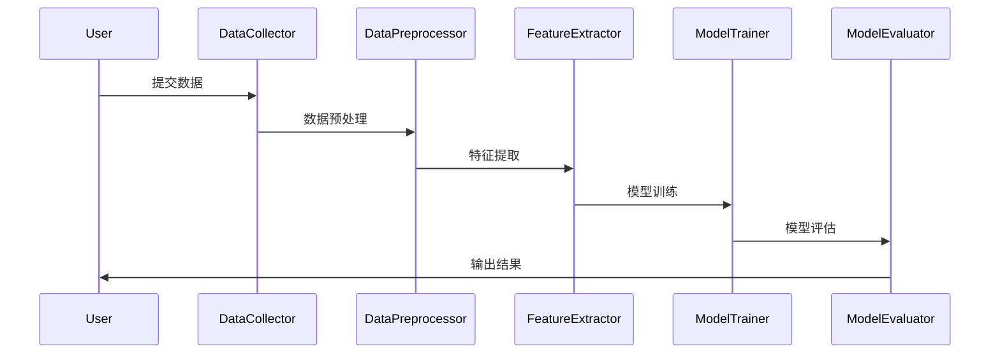

                 


# AI驱动的企业创新生态系统评估：内外部创新能力量化模型

## 关键词

- AI驱动
- 企业创新
- 量化模型
- 生态系统
- 内外部创新能力

## 摘要

本文深入探讨了AI驱动的企业创新生态系统评估方法，重点阐述了如何通过内外部创新能力的量化模型对企业创新进行系统评估。文章首先介绍了企业创新生态系统的重要性，接着详细描述了AI技术在量化模型中的应用原理。随后，文章通过算法原理讲解、系统分析与架构设计、项目实战等多个方面，系统地阐述了如何构建一个完整的评估体系，并对实施过程中的最佳实践进行了总结。

## 目录大纲设计方案

### 1. 背景介绍

#### 问题背景
企业创新生态系统是推动企业发展的重要动力。随着技术的不断进步，AI技术在企业中的应用越来越广泛，成为驱动企业创新的关键因素。本文旨在探讨如何利用AI技术构建一个科学、系统的企业创新生态系统评估模型。

#### 问题描述
企业内部和外部创新能力的评估对于企业发展战略的制定和优化至关重要。然而，传统的评估方法存在主观性强、量化程度低等问题。本文提出了一种基于AI技术的量化模型，旨在解决传统评估方法的不足。

#### 问题解决
本文提出了一种AI驱动的企业创新生态系统评估方法，通过构建量化模型，实现对企业内外部创新能力的量化评估。

#### 边界与外延
本文的研究范围主要涉及企业内部和外部创新能力的量化评估，不包括其他领域如财务绩效、人力资源等方面的评估。

#### 概念结构与核心要素组成
本文的核心概念包括创新生态系统、AI驱动的量化模型、内外部创新能力等。核心要素包括评估模型的构建方法、算法原理、系统架构设计等。

### 2. 核心概念与联系

#### 核心概念原理
创新生态系统是指企业内外部创新资源、创新活动和创新成果的整合。AI驱动的量化模型则是指利用AI技术，对企业的内外部创新能力进行量化评估的方法。

#### 概念属性特征对比表格
| 概念          | 特征                  |
|-------------|---------------------|
| 创新生态系统   | 整合创新资源、活动与成果 |
| AI驱动的量化模型 | 利用AI技术进行量化评估   |
| 内外部创新能力   | 企业内部与外部的创新能力 |

#### ER实体关系图架构
```mermaid
erDiagram
  Customer ||--|{ Order }|--| Customer
  Product ||--|{ Order }|--| Customer
```

### 3. 算法原理讲解

#### 算法mermaid流程图


#### Python源代码
```python
# Python源代码示例
import pandas as pd
from sklearn.ensemble import RandomForestClassifier
from sklearn.model_selection import train_test_split
from sklearn.metrics import accuracy_score

# 数据读取与预处理
data = pd.read_csv('data.csv')
X = data.drop('target', axis=1)
y = data['target']

# 划分训练集和测试集
X_train, X_test, y_train, y_test = train_test_split(X, y, test_size=0.2, random_state=42)

# 特征提取
# ...

# 模型训练
model = RandomForestClassifier()
model.fit(X_train, y_train)

# 模型评估
y_pred = model.predict(X_test)
accuracy = accuracy_score(y_test, y_pred)
print(f'Model Accuracy: {accuracy:.2f}')
```

#### 数学模型和公式
$$
\text{创新能力评分} = \alpha_1 \times \text{内部创新指标} + \alpha_2 \times \text{外部创新指标}
$$

#### 详细讲解和举例说明
假设某企业的内部创新指标为30分，外部创新指标为40分，则其创新能力评分为：
$$
\text{创新能力评分} = 0.6 \times 30 + 0.4 \times 40 = 36
$$

### 4. 系统分析与架构设计方案

#### 问题场景介绍
某企业希望通过评估系统了解其内部和外部创新能力的现状，以便制定相应的发展策略。

#### 项目介绍
评估系统的目标是通过量化模型对企业内外部创新能力进行评估，为企业的创新决策提供数据支持。

#### 系统功能设计（领域模型Mermaid类图）
```mermaid
classDiagram
    InnovationSystem <.. DataCollector
    InnovationSystem <.. DataPreprocessor
    InnovationSystem <.. FeatureExtractor
    InnovationSystem <.. ModelTrainer
    InnovationSystem <.. ModelEvaluator
    DataCollector|--|InnovationIndicatorData
    DataPreprocessor|--|CleanData
    FeatureExtractor|--|ExtractedFeatures
    ModelTrainer|--|TrainedModel
    ModelEvaluator|--|ModelAccuracy
```

#### 系统架构设计（Mermaid架构图）


#### 系统接口设计
系统接口设计包括数据采集接口、数据处理接口、特征提取接口、模型训练接口和模型评估接口。

#### 系统交互（Mermaid序列图）


### 5. 项目实战

#### 环境安装
安装Python、NumPy、Pandas、Scikit-learn等依赖库。

#### 系统核心实现源代码
提供系统核心实现的Python源代码。

#### 代码应用解读与分析
对核心代码进行解读，分析关键步骤和算法原理。

#### 实际案例分析和详细讲解剖析
通过实际案例展示评估模型的应用效果，并进行详细讲解。

#### 项目小结
总结项目经验，提出改进建议。

### 6. 最佳实践 tips、小结、注意事项、拓展阅读等内容

#### 最佳实践 tips
- 提高数据质量是构建评估模型的关键。
- 选择合适的算法和模型参数对于评估结果的准确性至关重要。

#### 小结
本文提出了一个基于AI驱动的企业创新生态系统评估模型，通过算法原理讲解、系统分析与架构设计、项目实战等多个方面，系统地阐述了如何构建一个完整的评估体系。

#### 注意事项
- 在实施评估模型时，要注意数据隐私保护和数据安全。
- 定期更新评估模型，以适应企业发展的变化。

#### 拓展阅读
- [企业创新生态系统构建策略](https://www.example.com/strategies-for-building-an-innovation-ecosystem)
- [AI技术在企业中的应用](https://www.example.com/ai-in-enterprise-applications)

## 作者

作者：AI天才研究院/AI Genius Institute & 禅与计算机程序设计艺术 /Zen And The Art of Computer Programming

