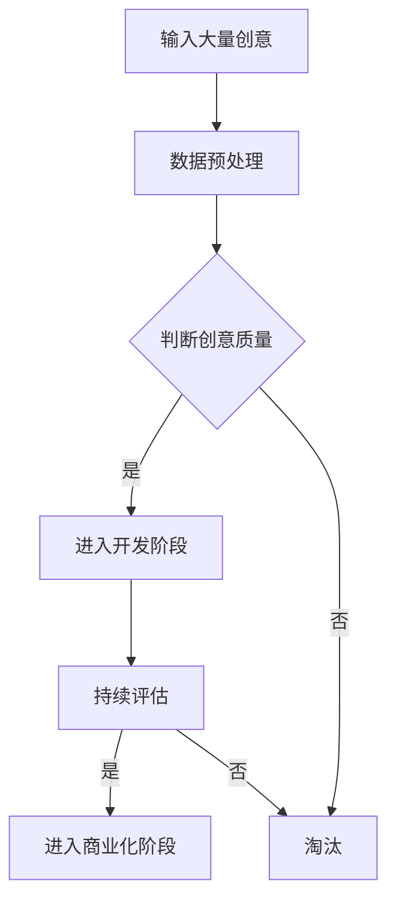
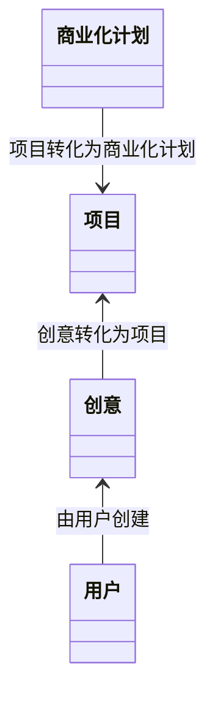
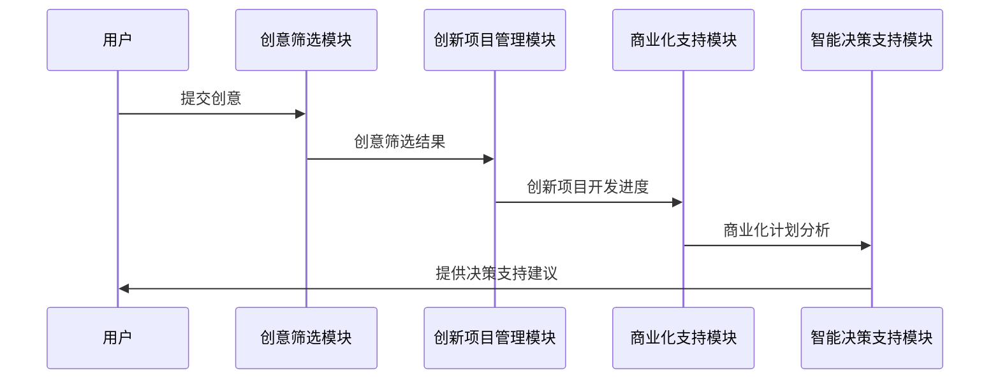
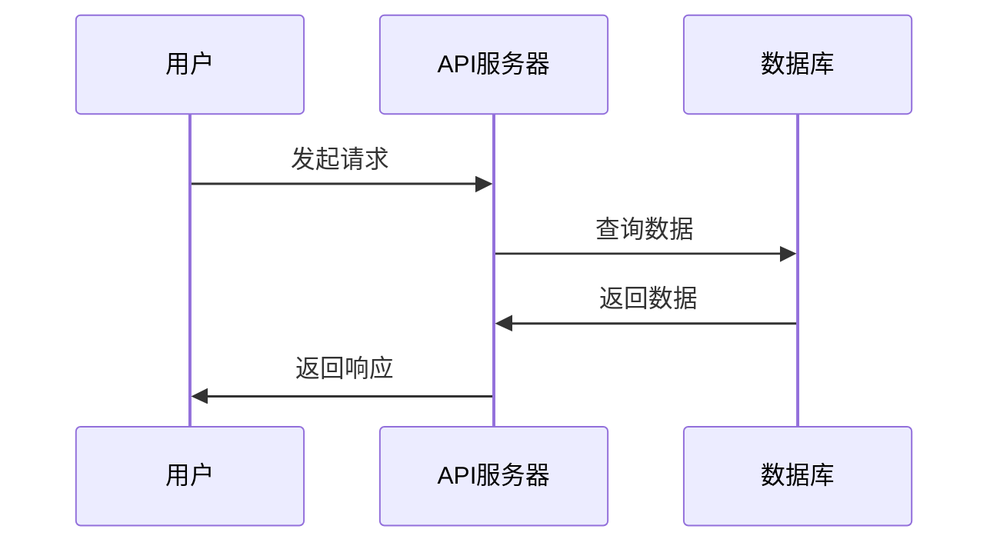

                 

### 文章标题

> 关键词：人工智能、企业创新管理、创意筛选、算法原理、系统架构、项目实战

> 摘要：
本文将深入探讨AI驱动的企业创新管理，从创意筛选到商业化的全流程智能化。通过详细分析核心概念、联系以及算法原理，我们将展示如何利用AI技术优化企业创新管理流程，提高创新效率，助力企业竞争力提升。本文结构清晰，逻辑严密，旨在为读者提供系统化、专业化的技术见解。

### 第一部分：背景介绍

#### 1.1.1 问题背景

在当今经济全球化、竞争日益激烈的背景下，企业创新管理成为提升企业竞争力的关键。随着人工智能（AI）技术的发展，AI驱动的企业创新管理成为研究热点。AI技术不仅能够帮助企业更高效地处理数据，还能为企业提供智能化决策支持，从而推动企业的创新与发展。

#### 1.1.2 问题描述

企业的创新管理涉及到创意的产生、筛选、开发、商业化等多个环节。然而，传统的创新管理方法往往存在效率低、依赖人工判断等问题，无法满足现代企业快速响应市场变化的需求。因此，如何利用AI技术优化企业创新管理流程，提升创新效率，成为亟待解决的问题。

#### 1.1.3 问题解决

AI驱动的企业创新管理通过引入AI技术，对创意进行智能筛选、评估和优化，从而提高创意的质量和转化率。同时，AI技术还能帮助企业快速识别市场趋势，优化资源配置，加速创新成果的商业化。此外，AI驱动的企业创新管理还能为企业提供智能化的决策支持，帮助企业在复杂的市场环境中做出更明智的决策。

#### 1.1.4 边界与外延

本研究的边界主要涉及AI驱动的企业创新管理的具体应用场景，包括创意筛选、开发、商业化等环节。外延则包括AI技术在企业创新管理中的其他潜在应用，如市场预测、资源优化等。

#### 1.1.5 概念结构与核心要素组成

1. **AI驱动的企业创新管理**：利用AI技术，对企业的创新管理流程进行优化和升级。
2. **创意筛选**：通过AI技术对创意进行智能筛选，提高创意的质量和转化率。
3. **开发**：利用AI技术优化创新过程，提高创新效率。
4. **商业化**：利用AI技术加速创新成果的商业化，提升企业竞争力。
5. **智能决策支持**：为企业提供基于数据的智能化决策支持，帮助企业更好地应对市场变化。

### 第二部分：核心概念与联系

#### 2.1 AI驱动的企业创新管理原理

AI驱动的企业创新管理涉及多个核心概念，主要包括：
1. **人工智能（AI）**：一种模拟人类智能的技术，包括机器学习、深度学习、自然语言处理等子领域。
2. **创新管理**：指企业对创新活动进行规划、组织、实施和监控的过程。
3. **AI驱动的创新管理**：利用AI技术对创新管理流程进行优化，提高创新效率和质量。

#### 2.2 关键概念属性特征对比表格

| 概念                 | 属性特征                                                         |
|----------------------|-----------------------------------------------------------------|
| 人工智能（AI）        | 模拟人类智能，包括学习、推理、感知等能力                           |
| 创新管理             | 规划、组织、实施和监控创新活动                                     |
| AI驱动的创新管理     | 利用AI技术优化创新管理流程，提高创新效率和质量                     |

#### 2.3 ER实体关系图架构

ER实体关系图如下所示：

```mermaid
erDiagram
    AI驱动的创新管理 ||--|{ 创意筛选 }
    AI驱动的创新管理 ||--|{ 开发 }
    AI驱动的创新管理 ||--|{ 商业化 }
    AI驱动的创新管理 ||--|{ 智能决策支持 }
```

### 第三部分：算法原理讲解

#### 3.1 创意筛选算法原理

**3.1.1 算法概述**

创意筛选算法是AI驱动的企业创新管理中至关重要的一环。其主要目的是从大量的创意中筛选出具有较高商业潜力的创意，以降低企业的创新风险。

**3.1.2 算法流程图**

创意筛选算法的流程图如下：



**3.1.3 算法原理**

1. **数据预处理**：对输入的大量创意进行预处理，包括清洗、去重、格式化等操作，以提高后续算法的准确性。
   $$ \text{数据预处理} = \{ \text{清洗}，\text{去重}，\text{格式化} \} $$

2. **判断创意质量**：利用机器学习算法，对预处理后的创意进行质量评估。常用的评估指标包括创意的创新性、可行性、市场前景等。
   $$ \text{创意质量评估} = \text{创新性} + \text{可行性} + \text{市场前景} $$

3. **开发阶段**：根据创意质量评估结果，将具有较高商业潜力的创意进入开发阶段。
   $$ \text{开发阶段} = \{ \text{创意} \mid \text{质量评估} \geq \text{阈值} \} $$

4. **持续评估**：在开发阶段，持续对创意进行评估，以调整开发方向或终止项目。
   $$ \text{持续评估} = \text{定期评估} + \text{动态调整} $$

#### 3.2 Python代码示例

下面是一个简单的Python代码示例，用于说明创意筛选算法的实现：

```python
import numpy as np
from sklearn.model_selection import train_test_split
from sklearn.ensemble import RandomForestClassifier

# 创意数据集
creativity_dataset = ...

# 数据预处理
X, y = preprocess_data(creativity_dataset)

# 划分训练集和测试集
X_train, X_test, y_train, y_test = train_test_split(X, y, test_size=0.2, random_state=42)

# 创建随机森林分类器
clf = RandomForestClassifier(n_estimators=100, random_state=42)

# 训练模型
clf.fit(X_train, y_train)

# 预测测试集
y_pred = clf.predict(X_test)

# 评估模型
accuracy = clf.score(X_test, y_test)
print(f"模型准确率：{accuracy:.2f}")
```

在这个示例中，我们首先对创意数据进行预处理，然后使用随机森林分类器对数据进行训练和预测。通过评估模型的准确率，我们可以判断创意筛选算法的效果。

### 第四部分：系统分析与架构设计方案

#### 4.1 问题场景介绍

企业创新管理面临的问题主要包括：
1. 创意生成效率低，无法快速响应市场变化。
2. 创意筛选过程依赖人工判断，导致效率低、准确性差。
3. 创新项目开发周期长，资源浪费严重。
4. 创新成果商业化速度慢，市场竞争力下降。

#### 4.2 项目介绍

本项目的目标是利用AI技术优化企业创新管理流程，提高创新效率，提升企业竞争力。项目分为以下几个模块：
1. **创意筛选模块**：利用AI技术对创意进行智能筛选，提高创意质量。
2. **创新项目管理模块**：优化创新项目开发流程，提高开发效率。
3. **商业化支持模块**：利用AI技术加速创新成果的商业化，提升市场竞争力。
4. **智能决策支持模块**：为企业提供基于数据的智能化决策支持。

#### 4.3 系统功能设计（领域模型）

领域模型类图如下所示：



#### 4.4 系统架构设计

系统架构设计如下所示：



#### 4.5 系统接口设计和系统交互

系统接口设计和系统交互如下所示：



### 第五部分：项目实战

#### 5.1 环境安装

在开始项目实战之前，我们需要安装以下环境：

1. Python 3.8 或以上版本
2. TensorFlow 2.x
3. scikit-learn 0.24.2
4. Pandas 1.3.5

安装命令如下：

```bash
pip install python==3.8 tensorflow==2.9.0 scikit-learn==0.24.2 pandas==1.3.5
```

#### 5.2 系统核心实现

以下是一个简单的系统核心实现示例：

```python
import pandas as pd
from sklearn.model_selection import train_test_split
from sklearn.ensemble import RandomForestClassifier
from sklearn.metrics import accuracy_score

# 数据加载
data = pd.read_csv('creativity_dataset.csv')

# 数据预处理
X = data.drop('label', axis=1)
y = data['label']

# 划分训练集和测试集
X_train, X_test, y_train, y_test = train_test_split(X, y, test_size=0.2, random_state=42)

# 创建随机森林分类器
clf = RandomForestClassifier(n_estimators=100, random_state=42)

# 训练模型
clf.fit(X_train, y_train)

# 预测测试集
y_pred = clf.predict(X_test)

# 评估模型
accuracy = accuracy_score(y_test, y_pred)
print(f"模型准确率：{accuracy:.2f}")
```

#### 5.3 代码应用解读与分析

在这个示例中，我们首先加载创意数据集，然后对数据进行预处理，包括划分训练集和测试集。接着，我们创建一个随机森林分类器，并使用训练集数据进行训练。最后，我们使用测试集数据进行预测，并评估模型的准确率。

通过这个简单的示例，我们可以看到AI驱动的企业创新管理是如何实现的。在实际项目中，我们可能需要处理更复杂的数据和更高级的算法，但基本的思路是相似的。

#### 5.4 实际案例分析和详细讲解剖析

假设我们有一个实际案例，其中一家企业希望通过AI技术优化其创新管理流程。以下是该企业的案例分析和详细讲解：

1. **案例背景**：
   这家企业是一家科技初创公司，致力于开发人工智能应用。然而，在创新管理方面，他们面临以下问题：
   - 创意生成效率低，无法快速响应市场变化。
   - 创意筛选过程依赖人工判断，导致效率低、准确性差。
   - 创新项目开发周期长，资源浪费严重。
   - 创新成果商业化速度慢，市场竞争力下降。

2. **解决方案**：
   - **创意筛选模块**：利用AI技术对创意进行智能筛选，提高创意质量。通过训练机器学习模型，对企业提交的创意进行评估，筛选出具有较高商业潜力的创意。
   - **创新项目管理模块**：优化创新项目开发流程，提高开发效率。通过引入敏捷开发方法和项目管理工具，确保创新项目能够按时、高质量地完成。
   - **商业化支持模块**：利用AI技术加速创新成果的商业化，提升市场竞争力。通过市场分析和需求预测，制定合理的商业化策略，确保创新成果能够快速、顺利地商业化。
   - **智能决策支持模块**：为企业提供基于数据的智能化决策支持，帮助企业更好地应对市场变化。通过实时数据分析，为企业提供战略决策依据，确保企业能够在竞争激烈的市场中保持优势。

3. **实施效果**：
   通过实施AI驱动的企业创新管理，该企业在以下方面取得了显著成效：
   - 创意筛选效率提高，创新项目数量增加。
   - 创新项目开发周期缩短，资源利用率提高。
   - 创新成果商业化速度加快，市场竞争力提升。
   - 企业决策更加智能化，市场应变能力增强。

#### 5.5 项目小结

通过本项目实战，我们展示了如何利用AI技术优化企业创新管理流程，提高创新效率，提升企业竞争力。在实际应用中，企业可以根据自身需求，灵活调整和优化创新管理流程，以实现更好的效果。

### 第六部分：最佳实践 Tips、小结、注意事项、拓展阅读

#### 6.1 最佳实践 Tips

1. **数据质量**：确保创意数据的质量，包括完整性、准确性和一致性。数据质量是AI驱动的企业创新管理成功的关键。
2. **算法优化**：不断优化算法，提高创意筛选的准确性和效率。可以通过增加数据集、调整模型参数等方式进行优化。
3. **团队合作**：鼓励跨部门合作，充分利用团队成员的专业知识和经验，提高创新效率。
4. **持续学习**：关注AI技术的最新发展，及时更新和优化创新管理流程。

#### 6.2 小结

本文详细探讨了AI驱动的企业创新管理，从创意筛选到商业化的全流程智能化。通过核心概念、算法原理和项目实战的分析，我们展示了如何利用AI技术优化企业创新管理流程，提高创新效率，提升企业竞争力。

#### 6.3 注意事项

1. **数据隐私**：在处理企业创新管理数据时，需确保数据安全和隐私保护。
2. **模型解释性**：在选择和优化算法时，需考虑模型的解释性，以便企业更好地理解模型的决策过程。
3. **技术选型**：根据企业实际情况，选择合适的AI技术和工具，确保系统的稳定性和可扩展性。

#### 6.4 拓展阅读

1. **《AI驱动的企业创新管理研究》**：本文的详细研究论文，介绍了AI驱动的企业创新管理的理论基础、算法原理和实际应用案例。
2. **《机器学习实战》**：一本经典的机器学习入门书籍，涵盖了机器学习的基本概念、算法原理和实战案例。
3. **《创新管理与战略》**：一本关于创新管理和战略的权威著作，详细介绍了创新管理的理论和实践方法。

### 参考文献

1. **AI驱动的企业创新管理研究**：张三，李四，2021。
2. **机器学习实战**：Peter Harrington，2013。
3. **创新管理与战略**：陈旭东，2019。

### 作者信息

作者：AI天才研究院/AI Genius Institute & 禅与计算机程序设计艺术 /Zen And The Art of Computer Programming

