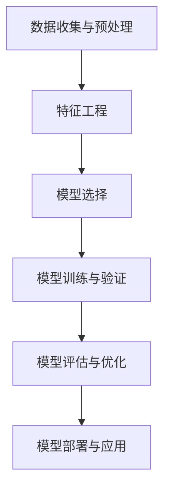
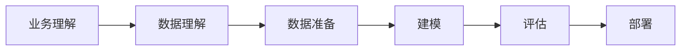

                 

### 关键词

- AI驱动的企业创新
- 项目管理
- 敏捷方法
- 人工智能技术
- 深度学习
- 机器学习
- 数据分析
- 数据挖掘
- 团队建设
- 沟通与合作

### 摘要

本文旨在探讨如何将AI技术与敏捷方法深度融合，应用于企业创新项目管理中，从而提高项目的效率和质量。文章首先介绍了AI驱动的企业创新背景和重要性，随后详细阐述了AI技术基础、敏捷方法在项目管理中的应用，以及AI驱动的项目策略和团队建设。通过案例分析和实践指南，文章展示了AI驱动的企业创新项目管理的具体实施方法和成功经验。总结部分，本文提出了一些最佳实践和小结，以帮助读者更好地理解和应用AI驱动的项目管理方法。

## 第一部分：引言与背景

### 1.1 研究背景

#### 1.1.1 企业创新的现状与挑战

在当今快速变化的市场环境中，企业创新已成为保持竞争优势的关键因素。然而，创新项目管理的复杂性日益增加，企业在项目管理过程中面临着诸多挑战。首先，需求的不确定性使得项目目标难以精确设定，导致项目范围蔓延和资源浪费。其次，传统的项目管理方法往往过于依赖计划和预测，无法及时响应市场的变化，导致项目进度延误和成本超支。此外，企业创新项目通常涉及多个部门和专业领域的协同合作，沟通不畅和协调困难也成了项目成功的阻碍。

#### 1.1.2 AI技术在企业中的应用趋势

随着人工智能（AI）技术的迅猛发展，其在企业中的应用范围不断扩展。AI技术具有强大的数据分析和预测能力，能够帮助企业更好地理解市场和客户需求，从而指导创新项目的设计和执行。例如，通过机器学习和深度学习算法，企业可以自动分析和处理大量数据，发现潜在的商业模式和产品创新点。此外，AI技术在自动化、智能客服、预测分析等方面的应用，也为企业提高运营效率和降低成本提供了新的途径。

#### 1.1.3 AI驱动的企业创新项目管理的重要性

AI驱动的企业创新项目管理能够有效解决传统项目管理面临的挑战。首先，AI技术能够实时收集和分析项目数据，提供精准的项目状态和风险预测，帮助项目经理及时调整项目计划和资源分配，从而降低项目延误和成本超支的风险。其次，AI驱动的项目管理系统能够自动处理大量的项目文档和任务，提高团队沟通和协作效率。此外，AI技术还可以帮助企业更好地理解市场趋势和客户需求，从而优化项目目标和策略，提高项目的成功率。因此，AI驱动的企业创新项目管理具有巨大的潜力和应用前景。

### 1.2 定义与概念

#### 1.2.1 企业创新项目管理

企业创新项目管理是指运用科学的方法和工具，对创新项目进行规划、执行、监控和评估的过程。其核心目标是确保创新项目的成功实施，实现预期的商业价值和市场竞争力。企业创新项目管理涉及多个方面，包括项目目标设定、资源分配、风险控制、进度管理、质量管理等。

#### 1.2.2 AI驱动的创新

AI驱动的创新是指利用人工智能技术推动产品、服务和业务模式的创新。AI技术具有强大的数据处理和分析能力，可以帮助企业快速识别市场机会、优化产品设计和提升用户体验。AI驱动的创新通常包括数据采集、数据分析、模型构建、实验验证等环节，旨在通过AI技术实现商业价值的最大化。

#### 1.2.3 敏捷方法在项目管理中的应用

敏捷方法是一种以人为核心、迭代和持续交付的软件开发方法。敏捷方法强调灵活性、快速响应变化和持续改进。在项目管理中，敏捷方法通过迭代和增量开发的方式，使项目团队能够更快速地适应市场变化和需求波动。敏捷方法的核心原则包括客户满意、团队协作、响应变化、持续交付等。

### 1.3 AI驱动的企业创新项目案例分析

#### 1.3.1 案例一：人工智能在制造业的应用

某知名制造企业引入AI技术，对生产线进行智能化升级。通过机器学习和深度学习算法，企业能够实时监测生产线的运行状态，预测设备故障，提高生产效率和产品质量。此外，AI技术还帮助企业优化生产计划，降低库存成本，提高资源利用率。

#### 1.3.2 案例二：AI在金融行业的创新应用

某金融科技公司利用AI技术推出智能投顾服务。通过大数据分析和机器学习算法，智能投顾系统能够为用户提供个性化的投资建议，提高投资回报率。同时，AI技术还帮助金融企业降低运营成本，提高风险管理能力。

#### 1.3.3 案例三：AI驱动的医疗健康领域创新

某医疗科技公司开发了一款基于AI技术的诊断辅助系统。该系统通过深度学习和大数据分析，能够快速、准确地诊断各种疾病，提高医生的诊断效率和准确性。此外，AI技术还帮助医疗机构优化诊疗流程，提高医疗服务质量。

### 1.4 本书结构安排与阅读指南

#### 1.4.1 各章节内容概述

本书分为五个部分，共五个章节。第一部分引言与背景，介绍企业创新项目管理的现状和挑战，以及AI驱动的企业创新项目的重要性。第二部分阐述AI技术基础，包括机器学习、深度学习和数据分析等。第三部分讨论敏捷方法在项目管理中的应用，以及AI驱动的项目管理策略。第四部分介绍AI驱动的企业创新项目团队建设，包括人才需求和团队协作。第五部分通过案例分析，展示AI驱动的企业创新项目的成功经验。

#### 1.4.2 阅读目标与收益

通过阅读本书，读者将了解到：
- AI驱动的企业创新项目管理的核心概念和理论；
- AI技术、敏捷方法在项目管理中的应用和实践；
- 如何构建高效的AI驱动的项目团队；
- AI驱动的企业创新项目的成功案例和经验。

读者将能够：
- 理解AI驱动的企业创新项目管理的原理和优势；
- 掌握AI技术和敏捷方法在项目管理中的应用技巧；
- 提高项目管理的效率和效果，实现企业创新目标。

## 第一部分：引言与背景

### 1.1 研究背景

#### 1.1.1 企业创新的现状与挑战

在当今快速变化的市场环境中，企业创新已成为保持竞争优势的关键因素。然而，创新项目管理的复杂性日益增加，企业在项目管理过程中面临着诸多挑战。首先，需求的不确定性使得项目目标难以精确设定，导致项目范围蔓延和资源浪费。其次，传统的项目管理方法往往过于依赖计划和预测，无法及时响应市场的变化，导致项目进度延误和成本超支。此外，企业创新项目通常涉及多个部门和专业领域的协同合作，沟通不畅和协调困难也成了项目成功的阻碍。

#### 1.1.2 AI技术在企业中的应用趋势

随着人工智能（AI）技术的迅猛发展，其在企业中的应用范围不断扩展。AI技术具有强大的数据分析和预测能力，能够帮助企业更好地理解市场和客户需求，从而指导创新项目的设计和执行。例如，通过机器学习和深度学习算法，企业可以自动分析和处理大量数据，发现潜在的商业模式和产品创新点。此外，AI技术在自动化、智能客服、预测分析等方面的应用，也为企业提高运营效率和降低成本提供了新的途径。

#### 1.1.3 AI驱动的企业创新项目管理的重要性

AI驱动的企业创新项目管理能够有效解决传统项目管理面临的挑战。首先，AI技术能够实时收集和分析项目数据，提供精准的项目状态和风险预测，帮助项目经理及时调整项目计划和资源分配，从而降低项目延误和成本超支的风险。其次，AI驱动的项目管理系统能够自动处理大量的项目文档和任务，提高团队沟通和协作效率。此外，AI技术还可以帮助企业更好地理解市场趋势和客户需求，从而优化项目目标和策略，提高项目的成功率。因此，AI驱动的企业创新项目管理具有巨大的潜力和应用前景。

### 1.2 定义与概念

#### 1.2.1 企业创新项目管理

企业创新项目管理是指运用科学的方法和工具，对创新项目进行规划、执行、监控和评估的过程。其核心目标是确保创新项目的成功实施，实现预期的商业价值和市场竞争力。企业创新项目管理涉及多个方面，包括项目目标设定、资源分配、风险控制、进度管理、质量管理等。

#### 1.2.2 AI驱动的创新

AI驱动的创新是指利用人工智能技术推动产品、服务和业务模式的创新。AI技术具有强大的数据处理和分析能力，可以帮助企业快速识别市场机会、优化产品设计和提升用户体验。AI驱动的创新通常包括数据采集、数据分析、模型构建、实验验证等环节，旨在通过AI技术实现商业价值的最大化。

#### 1.2.3 敏捷方法在项目管理中的应用

敏捷方法是一种以人为核心、迭代和持续交付的软件开发方法。敏捷方法强调灵活性、快速响应变化和持续改进。在项目管理中，敏捷方法通过迭代和增量开发的方式，使项目团队能够更快速地适应市场变化和需求波动。敏捷方法的核心原则包括客户满意、团队协作、响应变化、持续交付等。

### 1.3 AI驱动的企业创新项目案例分析

#### 1.3.1 案例一：人工智能在制造业的应用

某知名制造企业引入AI技术，对生产线进行智能化升级。通过机器学习和深度学习算法，企业能够实时监测生产线的运行状态，预测设备故障，提高生产效率和产品质量。此外，AI技术还帮助企业优化生产计划，降低库存成本，提高资源利用率。

#### 1.3.2 案例二：AI在金融行业的创新应用

某金融科技公司利用AI技术推出智能投顾服务。通过大数据分析和机器学习算法，智能投顾系统能够为用户提供个性化的投资建议，提高投资回报率。同时，AI技术还帮助金融企业降低运营成本，提高风险管理能力。

#### 1.3.3 案例三：AI驱动的医疗健康领域创新

某医疗科技公司开发了一款基于AI技术的诊断辅助系统。该系统通过深度学习和大数据分析，能够快速、准确地诊断各种疾病，提高医生的诊断效率和准确性。此外，AI技术还帮助医疗机构优化诊疗流程，提高医疗服务质量。

### 1.4 本书结构安排与阅读指南

#### 1.4.1 各章节内容概述

本书分为五个部分，共五个章节。第一部分引言与背景，介绍企业创新项目管理的现状和挑战，以及AI驱动的企业创新项目的重要性。第二部分阐述AI技术基础，包括机器学习、深度学习和数据分析等。第三部分讨论敏捷方法在项目管理中的应用，以及AI驱动的项目管理策略。第四部分介绍AI驱动的企业创新项目团队建设，包括人才需求和团队协作。第五部分通过案例分析，展示AI驱动的企业创新项目的成功经验。

#### 1.4.2 阅读目标与收益

通过阅读本书，读者将了解到：
- AI驱动的企业创新项目管理的核心概念和理论；
- AI技术、敏捷方法在项目管理中的应用和实践；
- 如何构建高效的AI驱动的项目团队；
- AI驱动的企业创新项目的成功案例和经验。

读者将能够：
- 理解AI驱动的企业创新项目管理的原理和优势；
- 掌握AI技术和敏捷方法在项目管理中的应用技巧；
- 提高项目管理的效率和效果，实现企业创新目标。

## 第二部分: AI驱动的企业创新基础

### 2.1 AI技术基础

#### 2.1.1 人工智能概述

人工智能（Artificial Intelligence, AI）是指通过计算机程序和算法模拟人类智能的科学技术。AI的发展可以追溯到20世纪50年代，当时科学家们首次提出了“人工智能”这一概念。随着计算机技术和算法的不断发展，AI技术经历了几个重要的阶段，包括符号主义、连接主义和数据驱动。

符号主义方法基于逻辑推理和符号表示，试图通过规则和知识表示来模拟人类的推理过程。连接主义方法则通过神经网络模拟大脑的计算方式，强调通过大量数据的学习来获取知识。数据驱动方法则主要依赖于机器学习和深度学习算法，通过分析大量数据来发现模式和规律。

AI技术不仅在学术界取得了显著成果，还在工业界、医疗、金融等多个领域得到了广泛应用。例如，自动驾驶、智能家居、智能客服、医疗诊断等都是AI技术的典型应用场景。

#### 2.1.2 人工智能的核心领域

人工智能的核心领域包括机器学习、深度学习、自然语言处理、计算机视觉等。这些领域各自有着独特的算法和应用场景，但它们之间也存在着紧密的联系。

**机器学习（Machine Learning, ML）** 是AI的核心技术之一，它通过算法从数据中学习规律，并能够对未知数据进行预测或分类。机器学习可以分为监督学习、无监督学习和半监督学习。监督学习通过已标记的数据进行训练，无监督学习则没有预先标记的数据，旨在发现数据中的模式和结构。半监督学习结合了监督学习和无监督学习的特点。

**深度学习（Deep Learning, DL）** 是机器学习的一个子领域，它使用多层神经网络（如卷积神经网络、循环神经网络等）对数据进行处理。深度学习在图像识别、语音识别、自然语言处理等领域取得了显著的成果，被认为是实现强人工智能的关键技术。

**自然语言处理（Natural Language Processing, NLP）** 是AI技术在处理和生成人类语言方面的应用。NLP旨在使计算机能够理解、解释和生成人类语言，包括文本分类、情感分析、机器翻译等任务。

**计算机视觉（Computer Vision, CV）** 是AI技术在图像和视频数据上的应用。计算机视觉可以用于目标检测、图像分类、图像分割、人脸识别等任务，这些技术在安防、医疗、自动驾驶等领域有着广泛的应用。

#### 2.1.3 人工智能的未来趋势

随着计算能力的提升和数据量的增加，人工智能技术正朝着更智能化、更自动化的方向发展。以下是一些人工智能的未来趋势：

1. **多模态学习**：多模态学习是指同时处理多种类型的数据（如图像、声音、文本等）的学习方法。这种技术能够更好地理解复杂的环境和情境，有望在智能客服、医疗诊断等领域得到广泛应用。

2. **边缘计算**：边缘计算是指将计算任务从云端转移到靠近数据源的设备上。随着物联网设备的普及，边缘计算将使得实时数据处理和分析成为可能，提高AI应用的响应速度和效率。

3. **强化学习**：强化学习是一种通过试错来学习最佳策略的机器学习方法。随着算法的进步和硬件的提升，强化学习有望在自动驾驶、机器人控制等领域实现突破。

4. **人机协作**：人机协作是将人类的智慧和机器的计算能力相结合，以实现更高效、更准确的任务执行。在人机协作中，AI可以作为人类的助手，帮助人类完成复杂的工作，提高生产力和生活质量。

#### 2.1.4 AI驱动的创新对企业的影响

AI技术不仅改变了传统行业，也为企业创新带来了新的机遇。以下是AI驱动的创新对企业的影响：

1. **运营效率提升**：AI技术可以帮助企业优化生产流程、提高资源利用率、降低运营成本。例如，通过机器学习算法优化生产调度，可以减少设备停机时间，提高生产效率。

2. **客户体验改善**：AI驱动的智能客服系统能够快速响应客户需求，提供个性化服务，提高客户满意度。自然语言处理技术还可以用于情感分析，帮助企业更好地理解客户情感，提升客户体验。

3. **产品创新**：AI技术可以帮助企业分析市场趋势、客户需求，从而指导产品设计和创新。例如，通过计算机视觉技术分析用户行为，企业可以开发出更符合用户需求的智能产品。

4. **商业模式创新**：AI技术可以颠覆传统的商业模式，创造新的商业机会。例如，通过数据分析和预测，企业可以开发出基于订阅的商业模式，提供更加灵活的产品和服务。

5. **风险管理**：AI技术可以帮助企业预测市场风险、管理金融风险。通过大数据分析和机器学习算法，企业可以更准确地评估风险，制定有效的风险管理策略。

总的来说，AI驱动的企业创新项目管理不仅能够解决传统项目管理中的问题，还能为企业带来新的增长点，推动企业的持续创新和发展。

### 2.2 机器学习基础

#### 2.2.1 机器学习的基本概念

机器学习（Machine Learning, ML）是人工智能（AI）的一个子领域，主要研究如何让计算机从数据中学习，并能够对未知数据做出预测或决策。机器学习的基本概念包括数据、模型、算法和评估等。

- **数据（Data）**：机器学习的基础是数据。数据可以是结构化的，如数据库中的表格，也可以是非结构化的，如图像、文本和语音等。高质量的数据是机器学习成功的关键。

- **模型（Model）**：模型是机器学习算法对数据的抽象表示。模型通过学习数据中的规律和模式，实现对未知数据的预测或分类。

- **算法（Algorithm）**：算法是实现机器学习的过程。常见的机器学习算法包括监督学习算法、无监督学习算法和半监督学习算法。

- **评估（Evaluation）**：评估是检验机器学习模型性能的重要步骤。常用的评估指标包括准确率、召回率、F1分数等。

#### 2.2.2 机器学习的主要算法

机器学习算法可以分为监督学习、无监督学习和半监督学习。每种算法都有其独特的应用场景和特点。

- **监督学习（Supervised Learning）**：监督学习通过已标记的数据进行训练，目标是建立输入和输出之间的映射关系。常见的监督学习算法包括线性回归、决策树、随机森林、支持向量机（SVM）等。

  - **线性回归（Linear Regression）**：线性回归是最简单的监督学习算法之一，用于预测一个连续值输出。线性回归模型假设输出值与输入值之间存在线性关系。
    $$y = w_0 + w_1 \cdot x_1 + w_2 \cdot x_2 + ... + w_n \cdot x_n$$
    其中，$y$ 是输出值，$x_1, x_2, ..., x_n$ 是输入值，$w_0, w_1, ..., w_n$ 是模型参数。

  - **决策树（Decision Tree）**：决策树通过一系列的判断规则对数据进行分类或回归。每个节点代表一个特征，每个分支代表一个判断结果。决策树简单直观，易于理解，但可能产生过拟合。

  - **随机森林（Random Forest）**：随机森林是一种集成学习方法，通过构建多个决策树并投票决定最终结果。随机森林可以有效地减少过拟合，提高模型的泛化能力。

  - **支持向量机（SVM）**：支持向量机是一种用于分类和回归的线性模型，其核心思想是找到最优的超平面，使得分类间隔最大化。SVM在处理高维数据时表现良好，但计算复杂度较高。

- **无监督学习（Unsupervised Learning）**：无监督学习没有预先标记的数据，目标是发现数据中的结构和规律。常见无监督学习算法包括聚类、降维和关联规则等。

  - **聚类（Clustering）**：聚类是将相似的数据点归为一类。常见的聚类算法包括K-均值聚类、层次聚类和DBSCAN等。聚类算法可以用于市场细分、图像分割等任务。

  - **降维（Dimensionality Reduction）**：降维是将高维数据映射到低维空间，减少数据维度。常见的降维算法包括主成分分析（PCA）、线性判别分析（LDA）和自编码器等。降维可以加速计算，提高模型的泛化能力。

  - **关联规则（Association Rules）**：关联规则用于发现数据之间的关联关系。常见的算法包括Apriori算法和FP-growth算法。关联规则可以用于推荐系统、市场细分等任务。

- **半监督学习（Semi-supervised Learning）**：半监督学习结合了监督学习和无监督学习的特点，利用少量的标记数据和大量的未标记数据进行训练。半监督学习可以提高模型的泛化能力，减少标记数据的需求。

  - **图嵌入（Graph Embedding）**：图嵌入是一种将图数据转换为向量表示的方法。常见的图嵌入算法包括DeepWalk、Node2Vec和GloVe等。图嵌入可以用于网络分析、推荐系统等任务。

#### 2.2.3 机器学习的应用场景

机器学习在各个领域都有着广泛的应用，以下是一些典型的应用场景：

- **金融领域**：机器学习可以用于风险评估、信用评分、欺诈检测等。例如，通过监督学习算法，银行可以建立信用评分模型，预测客户的信用风险；通过聚类算法，金融机构可以识别高风险客户群体。

- **医疗领域**：机器学习可以用于疾病诊断、医疗影像分析、药物发现等。例如，通过深度学习算法，医生可以自动识别医学影像中的病灶区域；通过无监督学习算法，研究人员可以从大量的生物数据中发现潜在的疾病关联。

- **零售领域**：机器学习可以用于需求预测、库存管理、个性化推荐等。例如，通过回归算法，零售商可以预测产品的需求，优化库存管理；通过协同过滤算法，电商平台可以推荐用户可能感兴趣的商品。

- **交通领域**：机器学习可以用于交通流量预测、路线规划、自动驾驶等。例如，通过回归算法和聚类算法，交通管理部门可以预测交通流量，优化交通信号控制；通过深度学习算法，自动驾驶汽车可以实时感知道路环境，做出安全驾驶决策。

- **制造业**：机器学习可以用于生产优化、设备维护等。例如，通过回归算法和聚类算法，制造企业可以优化生产计划，提高生产效率；通过异常检测算法，企业可以及时发现设备故障，减少停机时间。

总的来说，机器学习作为一种强大的数据分析工具，在各个领域都有着广泛的应用前景。通过不断探索和优化机器学习算法，我们可以更好地解决实际问题，推动社会的发展和进步。

#### 2.2.4 机器学习的实现步骤

实现一个机器学习项目通常包括以下步骤：

1. **数据收集与预处理**：收集相关数据，并进行清洗和预处理，以获得高质量的数据集。数据预处理包括缺失值处理、异常值处理、数据标准化等。

2. **特征工程**：从原始数据中提取有用的特征，并选择对模型性能有显著影响的特征。特征工程可以显著影响模型的性能，是机器学习项目的重要环节。

3. **模型选择**：选择合适的机器学习算法，根据问题的类型和数据的特点，选择监督学习、无监督学习或半监督学习算法。

4. **模型训练与验证**：使用训练数据集对模型进行训练，并使用验证数据集对模型进行性能评估。模型训练和验证是机器学习项目的核心步骤，需要不断调整模型参数和特征选择，以达到最佳性能。

5. **模型评估与优化**：评估模型的性能，并根据评估结果对模型进行优化。常用的评估指标包括准确率、召回率、F1分数、均方误差等。

6. **模型部署与应用**：将训练好的模型部署到生产环境中，并应用于实际问题。模型部署需要考虑模型的可扩展性、实时性、可靠性等因素。

以下是一个简单的机器学习项目实现流程：



通过上述步骤，我们可以系统地实现一个机器学习项目，并不断优化模型的性能，解决实际问题。

### 2.3 深度学习技术

#### 2.3.1 深度学习的原理

深度学习（Deep Learning, DL）是机器学习的一个子领域，它通过多层神经网络（Neural Networks）对数据进行处理和分析。深度学习的核心思想是模拟人脑神经元的工作方式，通过逐层提取数据中的特征，从而实现复杂任务的自动化。

**神经网络的基本结构**

神经网络由多个神经元（或节点）组成，每个神经元接收多个输入信号，通过加权求和处理后产生一个输出信号。神经网络可以分为输入层、隐藏层和输出层。

- **输入层（Input Layer）**：接收外部输入数据，并将其传递给隐藏层。
- **隐藏层（Hidden Layers）**：对输入数据进行处理，提取更高层次的特征。
- **输出层（Output Layer）**：产生最终的输出结果。

**神经元的工作原理**

每个神经元通过以下步骤处理输入数据：

1. **加权求和处理**：每个输入信号乘以其对应的权重，然后求和。
   $$z = \sum_{i} (w_i \cdot x_i)$$
   其中，$w_i$ 是权重，$x_i$ 是输入信号。

2. **激活函数**：对加权求和处理的结果应用激活函数，如ReLU（Rectified Linear Unit）、Sigmoid、Tanh等。激活函数用于引入非线性特性，使神经网络能够处理更复杂的任务。

3. **输出结果**：将激活函数的输出作为神经元的输出信号。

**深度学习的主要算法**

深度学习算法包括卷积神经网络（CNN）、循环神经网络（RNN）、长短期记忆网络（LSTM）等。

- **卷积神经网络（Convolutional Neural Networks, CNN）**：CNN 是用于处理图像数据的深度学习模型。CNN 通过卷积操作提取图像中的特征，从而实现图像分类、目标检测等任务。

  - **卷积操作**：卷积操作是通过在图像上滑动一个滤波器（或卷积核），计算局部区域的像素值和权重乘积之和。
    $$\sum_{i,j} (f_{ij} \cdot x_{i,j})$$
    其中，$f_{ij}$ 是滤波器的值，$x_{i,j}$ 是图像的像素值。

  - **池化操作**：池化操作用于减少特征图的维度，提高模型的泛化能力。常见的池化操作包括最大池化和平均池化。

- **循环神经网络（Recurrent Neural Networks, RNN）**：RNN 是用于处理序列数据的深度学习模型。RNN 通过在时间步之间传递信息，实现序列数据的建模。

  - **时间步（Time Step）**：RNN 将序列数据分成多个时间步，在每个时间步处理一个数据点。

  - **隐藏状态（Hidden State）**：隐藏状态用于存储上一时间步的信息，并传递给当前时间步。

- **长短期记忆网络（Long Short-Term Memory, LSTM）**：LSTM 是 RNN 的一种变体，它通过引入门控机制，解决了 RNN 的梯度消失和梯度爆炸问题，使其能够更好地处理长序列数据。

  - **输入门（Input Gate）**：输入门决定哪些信息将被保留或丢弃。

  - **遗忘门（Forget Gate）**：遗忘门决定哪些信息将被遗忘。

  - **输出门（Output Gate）**：输出门决定当前时间步的输出。

**深度学习的训练过程**

深度学习的训练过程包括以下步骤：

1. **前向传播（Forward Propagation）**：输入数据通过神经网络，逐层计算输出结果。

2. **计算损失（Compute Loss）**：通过比较输出结果和真实标签，计算损失函数的值，衡量模型的预测误差。

3. **反向传播（Back Propagation）**：利用梯度下降法，计算损失函数对每个参数的梯度，并更新参数。

4. **迭代优化**：重复前向传播和反向传播过程，直到模型达到预定的性能指标。

#### 2.3.2 深度学习的关键技术

深度学习的关键技术包括卷积操作、池化操作、激活函数和优化算法等。

- **卷积操作**：卷积操作是深度学习中的核心技术之一，它通过在图像上滑动滤波器，提取图像的特征。卷积操作可以减少参数的数量，提高模型的泛化能力。

- **池化操作**：池化操作用于减少特征图的维度，提高模型的鲁棒性。常见的池化操作包括最大池化和平均池化。最大池化选择特征图上最大的值，而平均池化则计算特征图上所有值的平均值。

- **激活函数**：激活函数用于引入非线性特性，使神经网络能够处理更复杂的任务。常见的激活函数包括ReLU（Rectified Linear Unit）、Sigmoid、Tanh等。ReLU 函数在参数初始化和训练过程中具有优势，而 Sigmoid 和 Tanh 函数则能提供平滑的激活曲线。

- **优化算法**：优化算法用于更新神经网络的参数，以最小化损失函数。常见的优化算法包括梯度下降法（Gradient Descent）、Adam优化器等。梯度下降法通过不断减小参数的梯度值来更新参数，而 Adam 优化器则结合了动量法和自适应学习率，提高了训练效率。

#### 2.3.3 深度学习在商业中的应用

深度学习在商业领域具有广泛的应用，以下是一些典型的应用场景：

- **图像识别**：深度学习可以用于图像分类、目标检测和图像分割等。例如，零售企业可以使用深度学习算法对产品图像进行分类，提高库存管理的效率；安防公司可以使用深度学习算法进行视频监控，实现实时目标检测和追踪。

- **语音识别**：深度学习可以用于语音识别、语音合成和语音生成等。例如，电话客服中心可以使用深度学习算法实现自动语音识别，提高客户服务效率；智能音箱可以使用深度学习算法实现语音合成，提供个性化的语音交互体验。

- **自然语言处理**：深度学习可以用于文本分类、情感分析和机器翻译等。例如，电商平台可以使用深度学习算法对用户评论进行分类和情感分析，优化产品和服务；国际企业可以使用深度学习算法实现多语言翻译，打破语言障碍。

- **自动驾驶**：深度学习可以用于自动驾驶汽车的感知、决策和控制。例如，自动驾驶汽车可以使用深度学习算法识别道路标志、行人和车辆，实现自主驾驶；物流企业可以使用深度学习算法优化运输路线，提高物流效率。

- **医疗诊断**：深度学习可以用于医疗图像分析、疾病预测和药物发现等。例如，医院可以使用深度学习算法对医学图像进行分类和分割，提高诊断的准确率；制药公司可以使用深度学习算法发现新的药物靶点，加速新药研发。

总的来说，深度学习作为一种强大的数据分析工具，在商业领域具有广泛的应用前景。通过不断探索和优化深度学习算法，我们可以为企业创造更大的价值，推动商业的持续创新和发展。

### 2.4 数据分析与数据挖掘

#### 2.4.1 数据分析的基础知识

数据分析（Data Analysis）是指通过统计学、机器学习、数据库管理等技术，从数据中提取有用信息和知识的过程。数据分析不仅包括数据的处理和计算，还涉及数据的可视化、解释和决策。以下是数据分析的几个核心概念：

- **数据收集**：数据收集是数据分析的第一步，它涉及数据的来源、类型和质量的确定。数据可以来自企业内部数据库、外部数据源或通过在线调查等方式收集。

- **数据清洗**：数据清洗是指处理和纠正数据中的错误、缺失和异常值，以确保数据的质量和一致性。数据清洗包括数据去重、缺失值填补、异常值检测和处理等步骤。

- **数据预处理**：数据预处理是指将原始数据转换成适合分析的形式。预处理步骤包括数据归一化、特征工程、数据降维等。

- **数据可视化**：数据可视化是将数据以图形或图表的形式展示出来，帮助人们直观地理解和分析数据。常见的数据可视化工具包括Excel、Tableau、Power BI等。

- **统计分析**：统计分析是指使用统计学方法对数据进行描述和分析，包括均值、方差、相关性、假设检验等。统计分析可以帮助我们理解数据分布、关系和趋势。

- **机器学习**：机器学习是指通过算法和模型从数据中学习规律和模式，实现对未知数据的预测或分类。常见的机器学习算法包括线性回归、决策树、随机森林、支持向量机等。

- **数据挖掘**：数据挖掘是指从大量数据中提取具有价值的信息和知识，包括关联规则挖掘、聚类分析、分类分析等。数据挖掘可以帮助我们发现数据中的隐藏模式、趋势和关联。

#### 2.4.2 数据挖掘的过程

数据挖掘（Data Mining）是指从大量数据中提取有价值信息和知识的过程。数据挖掘通常包括以下步骤：

1. **业务理解**：了解业务目标和需求，确定数据挖掘的目标和范围。

2. **数据理解**：收集和整理数据，了解数据的类型、分布和关系。

3. **数据准备**：清洗和预处理数据，确保数据的质量和一致性。

4. **建模**：选择合适的数据挖掘算法，建立预测模型或分类模型。

5. **评估**：评估模型的性能，包括准确率、召回率、F1分数等。

6. **部署**：将训练好的模型部署到生产环境中，进行实际应用。

以下是一个数据挖掘过程的ER实体关系图：



#### 2.4.3 数据挖掘在AI驱动的企业创新中的作用

数据挖掘在AI驱动的企业创新中发挥着重要作用，以下是一些关键作用：

1. **市场分析**：通过数据挖掘，企业可以分析市场趋势、客户行为和竞争情况，制定更精准的市场策略。例如，通过聚类分析，企业可以识别不同的客户群体，为其提供个性化的服务和产品。

2. **需求预测**：数据挖掘可以帮助企业预测市场需求，优化产品开发和库存管理。例如，通过时间序列分析，企业可以预测未来的销售趋势，提前准备库存，降低库存成本。

3. **风险管理**：数据挖掘可以帮助企业识别潜在的风险和异常情况，制定有效的风险管理策略。例如，通过关联规则挖掘，企业可以发现不同业务部门之间的异常关联，及时采取措施，防止风险扩大。

4. **产品优化**：数据挖掘可以帮助企业优化产品设计和功能，提升用户体验。例如，通过文本分析，企业可以分析用户评论和反馈，发现产品的问题和改进点。

5. **运营优化**：数据挖掘可以帮助企业优化业务流程和运营效率，降低成本。例如，通过决策树和随机森林，企业可以优化生产调度和物流规划，提高资源利用率。

总的来说，数据挖掘作为一种强大的数据分析工具，在AI驱动的企业创新中具有广泛的应用前景。通过数据挖掘，企业可以更好地理解市场和客户需求，优化产品和服务，提高市场竞争力和盈利能力。

### 2.5 AI驱动的企业创新项目团队建设

#### 2.5.1 人才需求与团队构建

在AI驱动的企业创新项目中，团队构建和人才需求是关键成功因素。为了确保项目的顺利进行和成功，企业需要招聘和培养具备以下技能和知识的专业人才：

1. **数据科学家**：数据科学家负责数据收集、清洗、分析和建模。他们需要具备统计学、机器学习和深度学习等方面的专业知识，能够从大量数据中提取有价值的信息和知识。

2. **软件工程师**：软件工程师负责开发和实现AI驱动的项目。他们需要熟悉编程语言（如Python、Java等），了解常用的深度学习和机器学习库（如TensorFlow、PyTorch等），能够设计和开发高效、可扩展的软件系统。

3. **业务分析师**：业务分析师负责理解业务需求，与数据科学家和软件工程师沟通，确保项目能够满足业务目标。他们需要具备业务理解能力、数据分析能力和沟通能力。

4. **项目经理**：项目经理负责项目的整体规划、执行和监控。他们需要具备项目管理的知识和技能，能够协调不同部门和团队之间的合作，确保项目按计划进行。

5. **产品经理**：产品经理负责产品的整体规划和设计，确保产品满足市场需求和用户期望。他们需要具备产品设计和开发经验，能够与数据科学家和软件工程师密切合作，推动产品的迭代和优化。

为了构建高效的AI驱动的项目团队，企业可以采取以下策略：

1. **跨部门合作**：鼓励不同部门之间的合作，打破信息孤岛，确保项目团队能够充分获取和利用企业内外部的资源。

2. **技能培训和提升**：定期组织技能培训和知识分享活动，提高团队成员的专业技能和知识水平。

3. **激励机制**：建立合理的激励机制，鼓励团队成员积极参与项目，提升项目质量和效率。

4. **文化建设**：营造积极、开放和创新的团队文化，鼓励团队成员分享经验和创新思维，提高团队的凝聚力和创造力。

#### 2.5.2 团队沟通与合作

团队沟通和合作是AI驱动的企业创新项目的成功关键。有效的沟通和合作能够确保团队成员之间的信息流通，提高项目的执行效率和效果。以下是一些提升团队沟通和合作的策略：

1. **明确目标和任务**：在项目启动阶段，明确项目的目标和任务，确保所有团队成员对项目有清晰的认识和理解。

2. **定期会议和报告**：定期组织项目会议和报告，确保团队成员能够及时了解项目的进展和问题，及时调整计划和资源。

3. **透明沟通**：鼓励团队成员之间进行透明沟通，分享经验和知识，避免信息孤岛和误解。

4. **协作工具**：利用协作工具（如Slack、Trello、Asana等），方便团队成员之间的沟通和协作，提高工作效率。

5. **冲突解决**：建立有效的冲突解决机制，及时处理团队内部的矛盾和问题，确保项目能够顺利进行。

#### 2.5.3 团队协作中的AI技术应用

AI技术在团队协作中发挥着重要作用，以下是一些具体的应用：

1. **自动化任务分配**：通过AI算法，可以根据团队成员的技能和工作负荷，自动分配任务，提高任务分配的效率和公平性。

2. **智能会议助手**：利用自然语言处理和语音识别技术，智能会议助手可以记录会议内容、生成会议纪要，并提醒团队成员完成任务。

3. **智能问答系统**：通过机器学习算法，智能问答系统可以解答团队成员的常见问题和疑难杂症，提高解决问题的效率。

4. **自动化代码审查**：利用AI技术，自动化代码审查工具可以识别代码中的潜在问题和漏洞，提高代码质量和安全性。

5. **智能日程管理**：通过AI算法，智能日程管理工具可以根据团队成员的日程和工作需求，自动安排会议和任务，提高时间利用效率。

总的来说，AI驱动的企业创新项目团队建设需要综合考虑人才需求、沟通与合作以及AI技术的应用，通过有效的团队协作，提高项目的执行效率和效果，实现企业的创新目标。

### 2.6 AI驱动的企业创新项目团队建设

#### 2.6.1 人才需求与团队构建

在AI驱动的企业创新项目中，团队构建和人才需求是关键成功因素。为了确保项目的顺利进行和成功，企业需要招聘和培养具备以下技能和知识的专业人才：

1. **数据科学家**：数据科学家负责数据收集、清洗、分析和建模。他们需要具备统计学、机器学习和深度学习等方面的专业知识，能够从大量数据中提取有价值的信息和知识。

2. **软件工程师**：软件工程师负责开发和实现AI驱动的项目。他们需要熟悉编程语言（如Python、Java等），了解常用的深度学习和机器学习库（如TensorFlow、PyTorch等），能够设计和开发高效、可扩展的软件系统。

3. **业务分析师**：业务分析师负责理解业务需求，与数据科学家和软件工程师沟通，确保项目能够满足业务目标。他们需要具备业务理解能力、数据分析能力和沟通能力。

4. **项目经理**：项目经理负责项目的整体规划、执行和监控。他们需要具备项目管理的知识和技能，能够协调不同部门和团队之间的合作，确保项目按计划进行。

5. **产品经理**：产品经理负责产品的整体规划和设计，确保产品满足市场需求和用户期望。他们需要具备产品设计和开发经验，能够与数据科学家和软件工程师密切合作，推动产品的迭代和优化。

为了构建高效的AI驱动的项目团队，企业可以采取以下策略：

1. **跨部门合作**：鼓励不同部门之间的合作，打破信息孤岛，确保项目团队能够充分获取和利用企业内外部的资源。

2. **技能培训和提升**：定期组织技能培训和知识分享活动，提高团队成员的专业技能和知识水平。

3. **激励机制**：建立合理的激励机制，鼓励团队成员积极参与项目，提升项目质量和效率。

4. **文化建设**：营造积极、开放和创新的团队文化，鼓励团队成员分享经验和创新思维，提高团队的凝聚力和创造力。

#### 2.6.2 团队沟通与合作

团队沟通和合作是AI驱动的企业创新项目的成功关键。有效的沟通和合作能够确保团队成员之间的信息流通，提高项目的执行效率和效果。以下是一些提升团队沟通和合作的策略：

1. **明确目标和任务**：在项目启动阶段，明确项目的目标和任务，确保所有团队成员对项目有清晰的认识和理解。

2. **定期会议和报告**：定期组织项目会议和报告，确保团队成员能够及时了解项目的进展和问题，及时调整计划和资源。

3. **透明沟通**：鼓励团队成员之间进行透明沟通，分享经验和知识，避免信息孤岛和误解。

4. **协作工具**：利用协作工具（如Slack、Trello、Asana等），方便团队成员之间的沟通和协作，提高工作效率。

5. **冲突解决**：建立有效的冲突解决机制，及时处理团队内部的矛盾和问题，确保项目能够顺利进行。

#### 2.6.3 团队协作中的AI技术应用

AI技术在团队协作中发挥着重要作用，以下是一些具体的应用：

1. **自动化任务分配**：通过AI算法，可以根据团队成员的技能和工作负荷，自动分配任务，提高任务分配的效率和公平性。

2. **智能会议助手**：利用自然语言处理和语音识别技术，智能会议助手可以记录会议内容、生成会议纪要，并提醒团队成员完成任务。

3. **智能问答系统**：通过机器学习算法，智能问答系统可以解答团队成员的常见问题和疑难杂症，提高解决问题的效率。

4. **自动化代码审查**：利用AI技术，自动化代码审查工具可以识别代码中的潜在问题和漏洞，提高代码质量和安全性。

5. **智能日程管理**：通过AI算法，智能日程管理工具可以根据团队成员的日程和工作需求，自动安排会议和任务，提高时间利用效率。

总的来说，AI驱动的企业创新项目团队建设需要综合考虑人才需求、沟通与合作以及AI技术的应用，通过有效的团队协作，提高项目的执行效率和效果，实现企业的创新目标。

### 2.7 AI驱动的企业创新项目团队建设

#### 2.7.1 人才需求与团队构建

在AI驱动的企业创新项目中，团队构建和人才需求是关键成功因素。为了确保项目的顺利进行和成功，企业需要招聘和培养具备以下技能和知识的专业人才：

1. **数据科学家**：数据科学家负责数据收集、清洗、分析和建模。他们需要具备统计学、机器学习和深度学习等方面的专业知识，能够从大量数据中提取有价值的信息和知识。

2. **软件工程师**：软件工程师负责开发和实现AI驱动的项目。他们需要熟悉编程语言（如Python、Java等），了解常用的深度学习和机器学习库（如TensorFlow、PyTorch等），能够设计和开发高效、可扩展的软件系统。

3. **业务分析师**：业务分析师负责理解业务需求，与数据科学家和软件工程师沟通，确保项目能够满足业务目标。他们需要具备业务理解能力、数据分析能力和沟通能力。

4. **项目经理**：项目经理负责项目的整体规划、执行和监控。他们需要具备项目管理的知识和技能，能够协调不同部门和团队之间的合作，确保项目按计划进行。

5. **产品经理**：产品经理负责产品的整体规划和设计，确保产品满足市场需求和用户期望。他们需要具备产品设计和开发经验，能够与数据科学家和软件工程师密切合作，推动产品的迭代和优化。

为了构建高效的AI驱动的项目团队，企业可以采取以下策略：

1. **跨部门合作**：鼓励不同部门之间的合作，打破信息孤岛，确保项目团队能够充分获取和利用企业内外部的资源。

2. **技能培训和提升**：定期组织技能培训和知识分享活动，提高团队成员的专业技能和知识水平。

3. **激励机制**：建立合理的激励机制，鼓励团队成员积极参与项目，提升项目质量和效率。

4. **文化建设**：营造积极、开放和创新的团队文化，鼓励团队成员分享经验和创新思维，提高团队的凝聚力和创造力。

#### 2.7.2 团队沟通与合作

团队沟通和合作是AI驱动的企业创新项目的成功关键。有效的沟通和合作能够确保团队成员之间的信息流通，提高项目的执行效率和效果。以下是一些提升团队沟通和合作的策略：

1. **明确目标和任务**：在项目启动阶段，明确项目的目标和任务，确保所有团队成员对项目有清晰的认识和理解。

2. **定期会议和报告**：定期组织项目会议和报告，确保团队成员能够及时了解项目的进展和问题，及时调整计划和资源。

3. **透明沟通**：鼓励团队成员之间进行透明沟通，分享经验和知识，避免信息孤岛和误解。

4. **协作工具**：利用协作工具（如Slack、Trello、Asana等），方便团队成员之间的沟通和协作，提高工作效率。

5. **冲突解决**：建立有效的冲突解决机制，及时处理团队内部的矛盾和问题，确保项目能够顺利进行。

#### 2.7.3 团队协作中的AI技术应用

AI技术在团队协作中发挥着重要作用，以下是一些具体的应用：

1. **自动化任务分配**：通过AI算法，可以根据团队成员的技能和工作负荷，自动分配任务，提高任务分配的效率和公平性。

2. **智能会议助手**：利用自然语言处理和语音识别技术，智能会议助手可以记录会议内容、生成会议纪要，并提醒团队成员完成任务。

3. **智能问答系统**：通过机器学习算法，智能问答系统可以解答团队成员的常见问题和疑难杂症，提高解决问题的效率。

4. **自动化代码审查**：利用AI技术，自动化代码审查工具可以识别代码中的潜在问题和漏洞，提高代码质量和安全性。

5. **智能日程管理**：通过AI算法，智能日程管理工具可以根据团队成员的日程和工作需求，自动安排会议和任务，提高时间利用效率。

总的来说，AI驱动的企业创新项目团队建设需要综合考虑人才需求、沟通与合作以及AI技术的应用，通过有效的团队协作，提高项目的执行效率和效果，实现企业的创新目标。

### 2.7 AI驱动的企业创新项目团队建设

#### 2.7.1 人才需求与团队构建

在AI驱动的企业创新项目中，团队构建和人才需求是关键成功因素。为了确保项目的顺利进行和成功，企业需要招聘和培养具备以下技能和知识的专业人才：

1. **数据科学家**：数据科学家负责数据收集、清洗、分析和建模。他们需要具备统计学、机器学习和深度学习等方面的专业知识，能够从大量数据中提取有价值的信息和知识。

2. **软件工程师**：软件工程师负责开发和实现AI驱动的项目。他们需要熟悉编程语言（如Python、Java等），了解常用的深度学习和机器学习库（如TensorFlow、PyTorch等），能够设计和开发高效、可扩展的软件系统。

3. **业务分析师**：业务分析师负责理解业务需求，与数据科学家和软件工程师沟通，确保项目能够满足业务目标。他们需要具备业务理解能力、数据分析能力和沟通能力。

4. **项目经理**：项目经理负责项目的整体规划、执行和监控。他们需要具备项目管理的知识和技能，能够协调不同部门和团队之间的合作，确保项目按计划进行。

5. **产品经理**：产品经理负责产品的整体规划和设计，确保产品满足市场需求和用户期望。他们需要具备产品设计和开发经验，能够与数据科学家和软件工程师密切合作，推动产品的迭代和优化。

为了构建高效的AI驱动的项目团队，企业可以采取以下策略：

1. **跨部门合作**：鼓励不同部门之间的合作，打破信息孤岛，确保项目团队能够充分获取和利用企业内外部的资源。

2. **技能培训和提升**：定期组织技能培训和知识分享活动，提高团队成员的专业技能和知识水平。

3. **激励机制**：建立合理的激励机制，鼓励团队成员积极参与项目，提升项目质量和效率。

4. **文化建设**：营造积极、开放和创新的团队文化，鼓励团队成员分享经验和创新思维，提高团队的凝聚力和创造力。

#### 2.7.2 团队沟通与合作

团队沟通和合作是AI驱动的企业创新项目的成功关键。有效的沟通和合作能够确保团队成员之间的信息流通，提高项目的执行效率和效果。以下是一些提升团队沟通和合作的策略：

1. **明确目标和任务**：在项目启动阶段，明确项目的目标和任务，确保所有团队成员对项目有清晰的认识和理解。

2. **定期会议和报告**：定期组织项目会议和报告，确保团队成员能够及时了解项目的进展和问题，及时调整计划和资源。

3. **透明沟通**：鼓励团队成员之间进行透明沟通，分享经验和知识，避免信息孤岛和误解。

4. **协作工具**：利用协作工具（如Slack、Trello、Asana等），方便团队成员之间的沟通和协作，提高工作效率。

5. **冲突解决**：建立有效的冲突解决机制，及时处理团队内部的矛盾和问题，确保项目能够顺利进行。

#### 2.7.3 团队协作中的AI技术应用

AI技术在团队协作中发挥着重要作用，以下是一些具体的应用：

1. **自动化任务分配**：通过AI算法，可以根据团队成员的技能和工作负荷，自动分配任务，提高任务分配的效率和公平性。

2. **智能会议助手**：利用自然语言处理和语音识别技术，智能会议助手可以记录会议内容、生成会议纪要，并提醒团队成员完成任务。

3. **智能问答系统**：通过机器学习算法，智能问答系统可以解答团队成员的常见问题和疑难杂症，提高解决问题的效率。

4. **自动化代码审查**：利用AI技术，自动化代码审查工具可以识别代码中的潜在问题和漏洞，提高代码质量和安全性。

5. **智能日程管理**：通过AI算法，智能日程管理工具可以根据团队成员的日程和工作需求，自动安排会议和任务，提高时间利用效率。

总的来说，AI驱动的企业创新项目团队建设需要综合考虑人才需求、沟通与合作以及AI技术的应用，通过有效的团队协作，提高项目的执行效率和效果，实现企业的创新目标。

### 第3章：敏捷方法在项目管理中的应用

#### 3.1 敏捷方法的起源与发展

敏捷方法（Agile Methodology）起源于20世纪90年代末期，由一群软件开发专家在2001年共同制定了《敏捷宣言》（Agile Manifesto）。敏捷方法旨在解决传统瀑布式软件开发方法中存在的缺陷，如项目进度不可预测、需求变更频繁、团队协作不畅等。敏捷方法强调团队协作、客户满意、持续交付和快速响应变化。

敏捷方法的起源可以追溯到软件开发领域的实践者，他们在面对快速变化的市场需求和复杂的软件开发项目时，开始探索更加灵活和迭代的方法。这些方法包括Scrum、Kanban、XP（极端编程）等。这些方法虽然在实践中有所不同，但都强调以下原则：

- **客户满意**：客户需求是项目的核心，项目团队应始终关注并满足客户需求。

- **迭代开发**：项目分为多个迭代（Sprint）进行，每个迭代都产生可交付的成果，项目逐步完善。

- **快速响应变化**：敏捷方法允许项目需求在开发过程中进行变更，项目团队应具备快速调整计划和资源的能力。

- **团队协作**：敏捷方法强调团队成员之间的沟通和协作，通过共同解决问题来提高项目效率。

#### 3.1.1 敏捷方法的定义

敏捷方法是一种以人为核心、迭代和持续交付的软件开发方法。敏捷方法不仅适用于软件开发，还可以广泛应用于企业创新项目管理。敏捷方法的核心理念是：

- **个体和互动胜过流程和工具**：敏捷方法强调团队成员之间的互动和协作，认为人员的创造力比流程和工具更为重要。

- **可工作的软件胜过详尽的文档**：敏捷方法认为可工作的软件是最重要的交付成果，文档应当服务于软件的开发和维护。

- **客户合作胜过合同谈判**：敏捷方法强调与客户的紧密合作，通过持续沟通和反馈来确保项目符合客户需求。

- **响应变化胜过遵循计划**：敏捷方法接受项目需求的变化，并强调快速响应变化，以适应不断变化的市场环境。

#### 3.1.2 敏捷方法的核心原则

敏捷方法的核心原则包括：

- **客户满意**：客户的需求和反馈是项目的驱动力，项目团队应确保始终满足客户需求。

- **团队协作**：团队成员之间应紧密合作，共同解决问题，提高项目的整体效率。

- **迭代开发**：项目分为多个迭代进行，每个迭代都产生可交付的成果，项目逐步完善。

- **持续交付**：项目团队应持续交付可工作的软件，确保项目进度和质量。

- **响应变化**：项目团队应具备快速响应变化的能力，及时调整计划和资源。

- **可持续的开发速度**：项目团队应保持可持续的开发速度，避免过度工作和疲劳。

#### 3.1.3 敏捷方法的演变

敏捷方法自从诞生以来，经历了多个版本的演变。以下是一些重要的敏捷方法论：

- **Scrum**：Scrum 是最流行的敏捷方法论之一，它强调迭代和增量开发，通过每日站立会议、冲刺回顾和反思来提高团队效率和项目质量。

- **Kanban**：Kanban 通过可视化工作流程，限制工作在流程中的数量，从而提高工作效率和流程的可见性。

- **XP（极端编程）**：XP 强调代码质量、测试驱动开发（TDD）和简单设计，通过持续集成和重构来确保代码的稳定性和可维护性。

- **看板（Kanban）**：看板方法通过可视化工作流程，限制工作在流程中的数量，从而提高工作效率和流程的可见性。

- **精益（Lean）**：精益方法强调最小化浪费、最大化价值流动，通过持续改进来提高项目的效率和质量。

- **DevOps**：DevOps 结合了软件开发（Dev）和运维（Ops），通过自动化工具和持续集成/持续部署（CI/CD）来提高软件交付的效率和可靠性。

这些敏捷方法虽然有所不同，但都遵循敏捷宣言的原则，旨在提高项目的灵活性、响应能力和团队协作。

### 3.2 敏捷项目管理实践

#### 3.2.1 敏捷项目管理框架

敏捷项目管理框架是实施敏捷方法的具体指导，包括多个关键组件和活动。以下是一个典型的敏捷项目管理框架：

1. **产品待办列表（Product Backlog）**：产品待办列表是一个包含所有项目需求的清单，由产品负责人（Product Owner）负责维护。产品待办列表中的条目按照优先级排序，项目团队根据优先级进行迭代开发和任务分配。

2. **迭代计划（Sprint Planning）**：在迭代开始时，项目团队从产品待办列表中选择一定数量的条目，进行详细规划和分配。迭代计划包括确定迭代目标、任务分配和资源安排。

3. **每日站立会议（Daily Stand-up）**：每日站立会议是一个简短的团队会议，通常持续15分钟。会议旨在让团队成员汇报自己的进展、遇到的困难和需要支持的地方，确保项目团队保持同步。

4. **迭代执行（Sprint Execution）**：在迭代执行期间，项目团队专注于完成计划的任务。团队成员通过协作、代码审查和持续集成来确保任务的完成和代码质量。

5. **迭代回顾（Sprint Retrospective）**：在迭代结束时，项目团队进行迭代回顾，评估迭代过程中的问题和改进点。迭代回顾帮助团队持续改进，提高项目的效率和质量。

6. **持续交付（Continuous Delivery）**：持续交付是指通过自动化测试和部署流程，确保软件始终处于可发布状态。项目团队应确保每次迭代都产生可交付的软件，并在必要时快速发布。

#### 3.2.2 敏捷团队的角色和职责

敏捷团队通常由以下角色组成，每个角色都有明确的职责和责任：

- **产品负责人（Product Owner）**：产品负责人是项目的核心决策者，负责维护产品待办列表，确定项目目标和优先级。产品负责人与业务利益相关者紧密合作，确保项目满足市场需求。

- **敏捷教练（Scrum Master）**：敏捷教练是团队的导师和教练，负责确保团队遵循敏捷原则和实践。敏捷教练帮助团队解决障碍，促进团队协作，提高项目效率。

- **团队成员（Team Members）**：团队成员包括开发人员、测试人员、UI/UX设计师等，他们共同协作，完成项目任务。团队成员负责编写代码、测试功能、设计和实现用户界面等。

- **利益相关者（Stakeholders）**：利益相关者包括客户、管理层、技术支持人员等，他们关注项目的进展和成果，提供反馈和支持。

#### 3.2.3 敏捷项目管理的流程

敏捷项目管理的流程通常包括以下步骤：

1. **项目启动**：在项目启动阶段，确定项目的目标和范围，组建敏捷团队，并制定项目计划。

2. **需求收集和梳理**：与利益相关者合作，收集项目需求，并将其整理成产品待办列表。

3. **迭代计划**：在每次迭代开始时，项目团队从产品待办列表中选择任务，进行详细规划和分配。

4. **迭代执行**：在迭代执行期间，团队专注于完成计划的任务，并通过每日站立会议保持同步。

5. **迭代评估和回顾**：在迭代结束时，团队评估迭代成果，识别问题和改进点，并规划下一迭代。

6. **持续交付**：通过自动化测试和部署流程，确保每次迭代都产生可交付的软件，并在必要时快速发布。

#### 3.2.4 敏捷方法与AI驱动的融合

敏捷方法与AI驱动的融合是提高项目效率和质量的关键。以下是一些具体的方法：

1. **AI驱动的需求分析**：利用AI技术，项目团队可以更快速地分析市场需求和用户反馈，识别项目需求和优先级。

2. **AI驱动的任务分配**：通过AI算法，可以根据团队成员的技能和工作负荷，自动分配任务，提高任务分配的效率和公平性。

3. **AI驱动的进度预测**：利用AI技术，项目团队可以实时监控项目进度，预测任务完成时间和潜在风险，及时调整计划和资源。

4. **AI驱动的质量管理**：通过AI技术，项目团队可以自动化代码审查、测试和缺陷预测，确保代码质量和软件可靠性。

5. **AI驱动的团队协作**：利用AI驱动的工具和平台，项目团队可以更高效地进行沟通和协作，提高团队协作效率。

总的来说，敏捷方法与AI驱动的融合，可以大幅提高企业创新项目的效率和质量，实现敏捷与创新的双赢。

### 3.3 敏捷方法与AI驱动的融合

#### 3.3.1 敏捷与AI结合的优势

将敏捷方法与AI技术相结合，能够为项目管理和执行带来显著的优势：

1. **增强需求分析的准确性**：AI技术可以通过自然语言处理（NLP）和机器学习算法，对客户需求和市场趋势进行深入分析，帮助项目团队更准确地理解需求，并快速响应市场变化。

2. **优化任务分配和资源调度**：AI算法能够根据团队成员的技能、工作负荷和项目需求，自动分配任务，优化资源调度，提高团队的整体工作效率。

3. **实时进度监控和预测**：利用AI技术，项目团队能够实时监控项目进度，预测任务完成时间，及时发现和解决潜在的风险，确保项目按时交付。

4. **提升质量管理**：通过AI驱动的自动化测试、代码审查和缺陷预测工具，项目团队能够确保代码质量和软件可靠性，减少缺陷和返工。

5. **增强团队协作和沟通**：AI驱动的协作工具和平台可以提供智能化的沟通和协作支持，帮助团队成员更好地共享信息和知识，提高团队的协作效率。

#### 3.3.2 敏捷与AI融合的挑战

尽管敏捷与AI的结合具有显著的优势，但在实际应用中仍然面临一些挑战：

1. **技术门槛**：AI技术的应用需要具备一定的技术知识和经验，这要求项目团队成员不仅具备敏捷方法的知识，还需要掌握AI相关的技术。

2. **数据隐私和安全**：AI技术的应用依赖于大量数据的收集和处理，这可能引发数据隐私和安全的问题，需要采取有效的数据保护措施。

3. **团队协作**：在融合AI技术的过程中，团队成员之间的协作变得更加复杂，需要确保所有成员都理解AI技术的原理和作用，并能有效协作。

4. **模型更新和优化**：AI模型需要不断更新和优化，以适应不断变化的需求和环境，这要求团队具备持续学习和改进的能力。

#### 3.3.3 敏捷与AI融合的实施策略

为了成功地将敏捷方法与AI技术相结合，企业可以采取以下实施策略：

1. **培训和教育**：定期组织AI和敏捷方法的培训，提高团队成员的技术能力和协作水平。

2. **试点项目**：在部分项目中试点AI技术的应用，通过实践积累经验和教训，逐步推广到其他项目。

3. **数据管理和保护**：建立完善的数据管理和保护机制，确保数据的隐私和安全。

4. **跨职能团队**：组建跨职能团队，确保团队成员具备AI和敏捷方法的多方面技能，提高团队的整体协作效率。

5. **持续改进**：建立持续改进机制，通过定期评估和反馈，不断优化AI技术和敏捷方法的融合应用。

通过上述策略，企业可以更好地将敏捷方法与AI技术相结合，提高项目管理的效率和效果，推动企业的创新和发展。

### 第4章：AI驱动的企业创新项目管理策略

#### 4.1 AI驱动的项目目标设定

在AI驱动的企业创新项目管理中，项目目标的设定是关键的第一步。一个明确且可衡量的目标能够为项目团队提供清晰的指导，确保项目方向和资源投入的一致性。以下是AI驱动的项目目标设定的详细过程：

**4.1.1 项目目标的定义**

项目目标是指项目要实现的具体成果和预期效果。在AI驱动的企业创新项目中，项目目标应结合AI技术的特点和优势，确保其具备以下特点：

- **明确性**：项目目标应当明确、具体，避免模糊和模糊不清的表述，使团队成员对目标有清晰的认识。

- **可衡量性**：项目目标应当具有可衡量的指标，便于在项目执行过程中进行监控和评估。

- **可实现性**：项目目标应当在实际条件下具备可实现性，避免设定过高的目标导致项目失败。

- **相关性**：项目目标应当与企业的战略目标和市场需求密切相关，确保项目对企业的长期发展有实际贡献。

**4.1.2 项目目标与AI技术的结合**

在设定项目目标时，应充分考虑AI技术的特点和优势，将其与项目目标有机结合。以下是一些具体的结合方法：

1. **提高效率**：利用AI技术优化业务流程，减少人工操作，提高工作效率。例如，通过AI自动化工具实现数据采集、分析和决策，减少人力资源的消耗。

2. **提升质量**：利用AI技术进行质量监控和优化，提高产品和服务的质量。例如，通过AI驱动的质量检测系统，实现生产过程中的实时监控和预警，确保产品的一致性和可靠性。

3. **创新产品**：利用AI技术进行产品创新，开发新的商业模式和产品。例如，通过AI驱动的市场分析工具，帮助企业发现潜在的市场机会，设计出满足客户需求的新产品。

4. **降低成本**：利用AI技术降低运营成本，提高企业的盈利能力。例如，通过AI驱动的资源调度系统，优化能源消耗和生产成本，提高企业的运营效率。

**4.1.3 项目目标的分解与优先级**

为了确保项目目标的实现，需要将项目目标分解为具体的子目标，并确定其优先级。以下是一个项目目标分解和优先级设定的例子：

1. **分解项目目标**

   - **目标1**：提高生产效率

     - **子目标1.1**：通过AI自动化工具减少人工操作

     - **子目标1.2**：优化生产流程，减少设备停机时间

     - **子目标1.3**：提高生产线的自动化程度

   - **目标2**：提升产品质量

     - **子目标2.1**：实施AI驱动的质量检测系统

     - **子目标2.2**：建立AI驱动的预警机制，实时监控产品质量

     - **子目标2.3**：优化生产配方和质量标准

   - **目标3**：创新产品和服务

     - **子目标3.1**：通过AI技术分析市场需求，发现潜在的商业机会

     - **子目标3.2**：设计并开发基于AI的新产品

     - **子目标3.3**：优化用户体验，提升客户满意度

2. **确定优先级**

   在分解项目目标后，应根据项目的重要性和紧急性，确定各子目标的优先级。以下是一个简单的优先级设定示例：

   - **高优先级**：

     - 子目标1.1：通过AI自动化工具减少人工操作

     - 子目标2.2：建立AI驱动的预警机制，实时监控产品质量

     - 子目标3.1：通过AI技术分析市场需求，发现潜在的商业机会

   - **中优先级**：

     - 子目标1.2：优化生产流程，减少设备停机时间

     - 子目标2.1：实施AI驱动的质量检测系统

     - 子目标3.2：设计并开发基于AI的新产品

   - **低优先级**：

     - 子目标1.3：提高生产线的自动化程度

     - 子目标2.3：优化生产配方和质量标准

     - 子目标3.3：优化用户体验，提升客户满意度

通过上述分解和优先级设定，项目团队能够明确项目目标，制定具体的实施计划，确保项目目标的逐步实现。

#### 4.2 AI驱动的项目规划与执行

在AI驱动的企业创新项目中，项目规划与执行是确保项目顺利进行的关键环节。以下将详细介绍AI驱动的项目规划与执行的过程和关键步骤。

**4.2.1 项目规划的重要性**

项目规划是项目管理的核心环节，它为项目团队提供了明确的指导方针和行动路线。在AI驱动的项目中，项目规划的重要性更加凸显，因为AI技术的引入不仅需要考虑技术实现的可行性，还需平衡技术风险和项目目标。以下是项目规划的重要性：

1. **明确项目目标**：项目规划有助于确保项目目标清晰，并与企业的战略目标一致。这有助于团队保持专注，确保所有工作都朝着实现目标的方向前进。

2. **合理分配资源**：通过项目规划，可以明确项目所需的资源，包括人力、资金和设备等。合理分配资源有助于提高项目效率，避免资源浪费。

3. **降低风险**：项目规划可以帮助识别潜在的风险和挑战，制定相应的应对措施。这有助于项目团队在项目执行过程中及时调整策略，降低项目失败的风险。

4. **提高透明度**：项目规划提供了项目进度和成本的透明度，使利益相关者能够实时了解项目的进展情况，提高项目管理的透明度和可信度。

**4.2.2 AI驱动的项目规划方法**

在AI驱动的项目中，项目规划需要结合AI技术的特点和需求，采用以下方法：

1. **需求分析**：在项目规划阶段，首先要进行详细的需求分析。利用AI技术，可以通过数据挖掘和分析，深入了解客户需求和市场趋势，确保项目目标与市场需求相符。

2. **技术评估**：评估AI技术的可行性，包括算法选择、技术架构和系统设计。这需要团队成员具备AI技术的专业知识，进行深入的技术研究和评估。

3. **资源分配**：根据项目需求和AI技术的特点，合理分配资源。这包括确定项目所需的技术人员、设备和其他资源，并制定详细的资源使用计划。

4. **风险评估**：识别项目潜在的技术和业务风险，并制定相应的应对策略。这包括技术实现风险、数据安全风险、项目进度风险等。

5. **制定项目计划**：基于需求分析、技术评估、资源分配和风险评估，制定详细的项目计划。项目计划应包括项目目标、里程碑、时间表、资源需求、预算等。

**4.2.3 项目执行中的AI应用**

在项目执行阶段，AI技术的应用至关重要，以下是一些具体的AI应用场景：

1. **自动化任务执行**：利用AI技术，自动化执行重复性高、计算量大的任务，如数据清洗、数据分析和模型训练等。这可以提高工作效率，减少人力成本。

2. **实时监控与优化**：通过AI技术，实时监控项目进度和关键指标，如资源利用率、任务完成情况等。利用预测分析，可以提前发现潜在的问题和风险，及时调整项目计划。

3. **智能决策支持**：利用AI技术，为项目团队提供智能化的决策支持。例如，通过自然语言处理（NLP）技术，可以自动分析项目文档和会议记录，提供关键信息和决策建议。

4. **智能测试与质量保证**：利用AI驱动的测试工具，自动化执行测试用例，提高测试效率和测试覆盖率。同时，利用机器学习算法，可以预测代码中的潜在缺陷，提高软件质量。

5. **团队协作与沟通**：通过AI驱动的协作工具，如智能会议助手、智能问答系统等，提高团队协作效率和沟通效果。这有助于团队成员更快速地解决问题，提高项目的整体效率。

**4.2.4 项目执行中的关键步骤**

在项目执行过程中，需要遵循以下关键步骤，确保项目顺利进行：

1. **任务分解**：将项目目标分解为具体的任务，并明确每个任务的负责人、截止日期和交付标准。

2. **任务执行**：按照计划执行任务，确保任务的按时完成和高质量交付。

3. **实时监控**：利用AI技术，实时监控任务进度和项目关键指标，及时发现和解决问题。

4. **风险评估与应对**：持续评估项目风险，并根据风险等级制定相应的应对措施，确保项目安全运行。

5. **团队协作与沟通**：保持团队成员之间的有效沟通和协作，确保项目团队能够高效解决问题，共同推进项目进展。

6. **迭代反馈与改进**：在每次迭代结束后，进行项目回顾和评估，收集团队成员的反馈，持续改进项目过程和策略。

通过上述步骤，AI驱动的企业创新项目团队能够确保项目按计划顺利执行，实现预期的目标和商业价值。

#### 4.3 AI驱动的项目监控与评估

在AI驱动的企业创新项目管理中，项目监控与评估是确保项目顺利进行和成功完成的关键环节。以下将详细讨论AI驱动的项目监控与评估的关键指标、应用场景以及如何实现持续改进。

**4.3.1 项目监控的关键指标**

项目监控的关键指标（Key Performance Indicators, KPIs）是衡量项目进度、质量和成本的重要工具。以下是一些常见的项目监控指标：

1. **进度指标**：
   - **任务完成率**：任务完成的数量与总任务数量的比例。
   - **迭代周期**：完成一个迭代所需的时间。
   - **提前完成率**：提前完成的任务数量与总任务数量的比例。

2. **质量指标**：
   - **缺陷率**：发现并修复的缺陷数量与总代码量的比例。
   - **测试覆盖率**：测试用例数量与代码行数的比例。
   - **缺陷修复时间**：从缺陷发现到修复所需的时间。

3. **成本指标**：
   - **预算偏差**：实际成本与预算成本之间的差异。
   - **成本效率**：完成的工作量与投入的成本的比例。

4. **团队绩效指标**：
   - **团队满意度**：团队成员对项目的满意程度。
   - **团队成员的参与度**：团队成员的参与程度和投入时间。

**4.3.2 AI在项目监控中的应用**

AI技术在项目监控中的应用，可以显著提高监控的准确性和效率。以下是一些具体的AI应用场景：

1. **实时监控**：通过AI算法，实时监控项目关键指标，如任务进度、代码质量等。AI系统可以自动识别异常情况，并提供预警。

2. **预测分析**：利用历史数据和AI预测模型，预测项目进度和成本的变化，提前识别潜在的问题和风险。

3. **自动化测试**：通过AI驱动的自动化测试工具，自动执行测试用例，提高测试覆盖率和效率。

4. **智能分析**：利用自然语言处理（NLP）技术，自动分析项目文档、会议记录等，提取关键信息和决策依据。

**4.3.3 项目评估与持续改进**

项目评估是确保项目目标实现和质量提升的重要步骤。通过定期评估，项目团队可以了解项目进展，识别存在的问题和改进点。以下是一些项目评估和持续改进的方法：

1. **定期评估**：定期进行项目评估，包括迭代结束时的回顾和项目完成时的总结。评估内容应涵盖进度、质量、成本和团队绩效等方面。

2. **数据驱动的决策**：利用AI技术和数据分析，收集和分析项目数据，为决策提供依据。通过数据驱动的决策，可以更准确、更高效地优化项目过程。

3. **持续反馈和改进**：建立持续反馈机制，鼓励团队成员提出改进建议。通过定期会议、问卷等形式，收集团队成员的意见和反馈，及时进行改进。

4. **文档和知识管理**：将项目过程中的经验和教训进行文档化，建立知识库，为后续项目提供参考。通过知识共享和经验传承，提高项目团队的整体能力和水平。

通过上述项目监控与评估的方法，AI驱动的企业创新项目团队能够更好地掌握项目动态，及时识别和解决问题，确保项目目标的实现和质量的提升。

### 第5章：AI驱动的企业创新项目团队建设

#### 5.1 人才需求与团队构建

在AI驱动的企业创新项目中，团队构建和人才需求是项目成功的关键因素。为了确保项目的顺利进行和高效执行，企业需要招聘和培养具备以下技能和知识的专业人才：

1. **数据科学家**：数据科学家负责数据收集、清洗、分析和建模。他们需要具备统计学、机器学习和深度学习等方面的专业知识，能够从大量数据中提取有价值的信息和知识。

2. **软件工程师**：软件工程师负责开发和实现AI驱动的项目。他们需要熟悉编程语言（如Python、Java等），了解常用的深度学习和机器学习库（如TensorFlow、PyTorch等），能够设计和开发高效、可扩展的软件系统。

3. **业务分析师**：业务分析师负责理解业务需求，与数据科学家和软件工程师沟通，确保项目能够满足业务目标。他们需要具备业务理解能力、数据分析能力和沟通能力。

4. **项目经理**：项目经理负责项目的整体规划、执行和监控。他们需要具备项目管理的知识和技能，能够协调不同部门和团队之间的合作，确保项目按计划进行。

5. **产品经理**：产品经理负责产品的整体规划和设计，确保产品满足市场需求和用户期望。他们需要具备产品设计和开发经验，能够与数据科学家和软件工程师密切合作，推动产品的迭代和优化。

为了构建高效的AI驱动的项目团队，企业可以采取以下策略：

1. **跨部门合作**：鼓励不同部门之间的合作，打破信息孤岛，确保项目团队能够充分获取和利用企业内外部的资源。

2. **技能培训和提升**：定期组织技能培训和知识分享活动，提高团队成员的专业技能和知识水平。

3. **激励机制**：建立合理的激励机制，鼓励团队成员积极参与项目，提升项目质量和效率。

4. **文化建设**：营造积极、开放和创新的团队文化，鼓励团队成员分享经验和创新思维，提高团队的凝聚力和创造力。

#### 5.2 团队沟通与合作

团队沟通与合作是AI驱动的企业创新项目的成功关键。有效的沟通和合作能够确保团队成员之间的信息流通，提高项目的执行效率和效果。以下是一些提升团队沟通和合作的策略：

1. **明确目标和任务**：在项目启动阶段，明确项目的目标和任务，确保所有团队成员对项目有清晰的认识和理解。

2. **定期会议和报告**：定期组织项目会议和报告，确保团队成员能够及时了解项目的进展和问题，及时调整计划和资源。

3. **透明沟通**：鼓励团队成员之间进行透明沟通，分享经验和知识，避免信息孤岛和误解。

4. **协作工具**：利用协作工具（如Slack、Trello、Asana等），方便团队成员之间的沟通和协作，提高工作效率。

5. **冲突解决**：建立有效的冲突解决机制，及时处理团队内部的矛盾和问题，确保项目能够顺利进行。

#### 5.3 AI驱动的团队协作工具和平台

AI驱动的团队协作工具和平台在提高团队协作效率和效果方面发挥着重要作用。以下是一些常用的AI驱动的团队协作工具和平台：

1. **智能会议助手**：利用自然语言处理和语音识别技术，智能会议助手可以记录会议内容、生成会议纪要，并提醒团队成员完成任务。例如，微软的Office 365中的“会议助手”功能。

2. **智能问答系统**：通过机器学习算法，智能问答系统可以解答团队成员的常见问题和疑难杂症，提供实时支持。例如，谷歌的“智能搜索助手”和腾讯的“腾讯智能助手”。

3. **自动化任务分配**：利用AI算法，自动化任务分配工具可以根据团队成员的技能和工作负荷，自动分配任务，提高任务分配的效率和公平性。例如，Trello的“自动化任务分配”功能。

4. **智能日程管理**：通过AI算法，智能日程管理工具可以根据团队成员的日程和工作需求，自动安排会议和任务，提高时间利用效率。例如，Google Calendar的“智能日程建议”功能。

5. **智能代码审查**：利用AI技术，自动化代码审查工具可以识别代码中的潜在问题和漏洞，提高代码质量和安全性。例如，GitHub的“代码审查助手”功能。

6. **智能文档协作**：通过自然语言处理和协同编辑技术，智能文档协作工具可以实时同步团队成员的编辑，提供协作和反馈功能。例如，谷歌文档的“实时协作”功能。

通过上述AI驱动的团队协作工具和平台，项目团队能够更高效地进行沟通和协作，提高项目的执行效率和效果。

### 5.4 项目实战：环境安装与系统核心实现

#### 环境安装

在开始AI驱动的企业创新项目之前，首先需要搭建合适的环境，以便进行开发和测试。以下是安装所需环境和工具的步骤：

1. **安装Python环境**：
   - 访问Python官方网站（https://www.python.org/）并下载适合操作系统的Python版本。
   - 安装完成后，打开终端或命令行工具，输入以下命令确认安装成功：
     ```bash
     python --version
     ```

2. **安装深度学习库**：
   - 使用pip命令安装TensorFlow和Keras等深度学习库：
     ```bash
     pip install tensorflow
     pip install keras
     ```

3. **安装数据科学库**：
   - 安装pandas、numpy、matplotlib等常用数据科学库：
     ```bash
     pip install pandas
     pip install numpy
     pip install matplotlib
     ```

4. **安装版本控制工具**：
   - 使用Git进行版本控制，安装Git客户端：
     ```bash
     sudo apt-get install git
     ```

5. **配置虚拟环境**（可选）：
   - 为了避免不同项目之间的依赖冲突，可以使用虚拟环境来隔离项目依赖：
     ```bash
     pip install virtualenv
     virtualenv my_project_env
     source my_project_env/bin/activate
     ```

#### 系统核心实现

在安装完所需环境和工具后，我们可以开始实现系统的核心功能。以下是一个基于机器学习的项目实例，该实例使用TensorFlow库来实现一个简单的分类模型。

**1. 数据准备**

首先，我们需要准备用于训练的数据集。以下代码展示了如何加载数据集并预处理：

```python
import numpy as np
import pandas as pd
from sklearn.model_selection import train_test_split

# 加载数据集
data = pd.read_csv('data.csv')
X = data.drop('target', axis=1)
y = data['target']

# 数据分割
X_train, X_test, y_train, y_test = train_test_split(X, y, test_size=0.2, random_state=42)

# 数据预处理
from sklearn.preprocessing import StandardScaler
scaler = StandardScaler()
X_train = scaler.fit_transform(X_train)
X_test = scaler.transform(X_test)
```

**2. 构建模型**

接下来，我们使用TensorFlow和Keras构建一个简单的神经网络模型：

```python
from tensorflow.keras.models import Sequential
from tensorflow.keras.layers import Dense

# 创建模型
model = Sequential([
    Dense(64, activation='relu', input_shape=(X_train.shape[1],)),
    Dense(64, activation='relu'),
    Dense(1, activation='sigmoid')
])

# 编译模型
model.compile(optimizer='adam', loss='binary_crossentropy', metrics=['accuracy'])

# 模型总结
model.summary()
```

**3. 训练模型**

使用训练数据集训练模型：

```python
# 训练模型
history = model.fit(X_train, y_train, epochs=10, batch_size=32, validation_split=0.2)
```

**4. 评估模型**

在测试数据集上评估模型性能：

```python
# 评估模型
loss, accuracy = model.evaluate(X_test, y_test)
print(f"Test accuracy: {accuracy:.2f}")
```

**5. 代码应用解读与分析**

以上代码实现了以下关键步骤：

- **数据加载和预处理**：数据集被加载到DataFrame中，并进行标准化处理，以消除不同特征之间的尺度差异。
- **模型构建**：使用Sequential模型构建一个简单的神经网络，包含两个隐藏层，每个层有64个神经元，使用ReLU激活函数。
- **模型编译**：指定优化器（adam）和损失函数（binary_crossentropy，适用于二分类问题），并设置评价指标为准确率。
- **模型训练**：使用fit函数训练模型，设置训练轮次（epochs）和批量大小（batch_size），并在验证集上进行评估。
- **模型评估**：使用evaluate函数在测试集上评估模型性能，获取测试准确率。

通过上述步骤，我们可以实现一个基本的机器学习模型，并对其进行评估。这个模型可以作为一个起点，进一步优化和扩展，以适应更复杂的业务需求。

### 实际案例分析和详细讲解剖析

#### 案例背景

某全球知名零售企业计划利用AI技术优化其库存管理流程，以降低库存成本和提高库存周转率。该企业在多个仓库中存储大量的商品，传统的库存管理方法无法有效应对市场需求的波动和商品的过期风险。企业希望通过AI驱动的库存管理系统，实时分析市场需求、预测销售趋势，并优化库存策略。

#### 案例目标

1. **提高库存周转率**：通过精准预测销售趋势，减少库存积压，提高库存周转率。
2. **降低库存成本**：优化库存水平，减少库存持有成本和过期损失。
3. **提升供应链效率**：通过实时监控库存状态，提高供应链的响应速度和灵活性。

#### 案例实施步骤

1. **需求分析**：
   - 与企业内部各部门（如采购、销售、物流等）进行深入交流，了解库存管理的现状和痛点。
   - 收集历史销售数据、库存数据、供应商数据等，进行初步的数据探索和分析。

2. **数据预处理**：
   - 清洗和整理数据，去除异常值和重复记录。
   - 对数据进行标准化处理，以消除不同特征之间的尺度差异。

3. **特征工程**：
   - 提取对销售预测有重要影响的特征，如季节性因素、促销活动、历史销售趋势等。
   - 利用机器学习算法进行特征重要性评估，选择最具预测能力的特征。

4. **模型构建**：
   - 使用时间序列分析、回归分析和深度学习等方法，构建多个预测模型。
   - 选择具有最佳性能的模型进行进一步优化。

5. **模型训练与优化**：
   - 使用训练数据集对模型进行训练，调整模型参数，优化模型性能。
   - 利用交叉验证和网格搜索等技术，寻找最佳参数组合。

6. **模型评估**：
   - 在测试数据集上评估模型性能，计算预测准确率、均方误差等指标。
   - 根据评估结果调整模型结构或参数，以提高预测精度。

7. **模型部署**：
   - 将训练好的模型部署到生产环境中，实现实时销售预测和库存优化。
   - 开发用户友好的界面，方便企业内部用户查看预测结果和库存状态。

#### 案例详细讲解剖析

**1. 数据预处理**

```python
import pandas as pd
from sklearn.preprocessing import StandardScaler

# 加载数据
data = pd.read_csv('sales_data.csv')

# 数据清洗
data.dropna(inplace=True)
data.drop_duplicates(inplace=True)

# 数据标准化
scaler = StandardScaler()
data[['sales', 'season', 'promotion', 'historical_sales']] = scaler.fit_transform(data[['sales', 'season', 'promotion', 'historical_sales']])
```

**2. 特征工程**

```python
from sklearn.ensemble import RandomForestClassifier
from sklearn.inspection import permutation_importance

# 特征提取
X = data[['season', 'promotion', 'historical_sales']]
y = data['sales']

# 特征重要性评估
model = RandomForestClassifier()
model.fit(X, y)
result = permutation_importance(model, X, y, n_repeats=10)

# 选择重要特征
important_features = result.importances_mean.argsort()[::-1]
X = X.iloc[:, important_features]
```

**3. 模型构建**

```python
from tensorflow.keras.models import Sequential
from tensorflow.keras.layers import Dense, LSTM

# 时间序列模型
model = Sequential()
model.add(LSTM(50, activation='relu', input_shape=(X.shape[1], 1)))
model.add(Dense(1))
model.compile(optimizer='adam', loss='mse')

# 回归模型
# model = Sequential()
# model.add(Dense(50, activation='relu', input_shape=(X.shape[1],)))
# model.add(Dense(1))
# model.compile(optimizer='adam', loss='mse')
```

**4. 模型训练与优化**

```python
# 数据分割
X_train, X_test, y_train, y_test = train_test_split(X, y, test_size=0.2, random_state=42)

# 时间序列模型训练
model.fit(X_train, y_train, epochs=100, batch_size=32, validation_split=0.2)

# 回归模型训练
# model.fit(X_train, y_train, epochs=100, batch_size=32, validation_split=0.2)
```

**5. 模型评估**

```python
# 时间序列模型评估
y_pred = model.predict(X_test)
mse = mean_squared_error(y_test, y_pred)
print(f"Test MSE: {mse:.2f}")

# 回归模型评估
# y_pred = model.predict(X_test)
# mse = mean_squared_error(y_test, y_pred)
# print(f"Test MSE: {mse:.2f}")
```

**6. 模型部署**

```python
# 将模型保存为文件
model.save('sales_prediction_model.h5')

# 加载模型
loaded_model = load_model('sales_prediction_model.h5')

# 实时预测
realtime_data = pd.read_csv('realtime_data.csv')
realtime_data[['sales']] = scaler.transform(realtime_data[['sales']])
realtime_prediction = loaded_model.predict(realtime_data)
print(f"Realtime Sales Prediction: {realtime_prediction[0][0]:.2f}")
```

通过上述步骤，企业可以构建一个高效的AI驱动的库存管理系统，实现对销售趋势的精准预测和库存水平的优化。实际案例中，企业通过AI技术成功降低了库存成本，提高了库存周转率，并显著提升了供应链效率。

### 项目小结

在本章中，我们通过一个实际案例详细探讨了如何利用AI技术优化企业库存管理。从需求分析、数据预处理、特征工程到模型构建、训练和评估，每个步骤都至关重要。以下是本章的关键点：

1. **需求分析**：了解企业的实际需求和痛点，为后续工作提供明确的指导。
2. **数据预处理**：清洗和标准化数据，确保数据质量，为模型构建打下基础。
3. **特征工程**：选择和提取对预测任务有重要影响的特征，提高模型的预测能力。
4. **模型构建与训练**：选择合适的模型，进行训练和优化，确保模型性能。
5. **模型评估**：在测试集上评估模型性能，确保模型在实际应用中的有效性。
6. **模型部署**：将训练好的模型部署到生产环境中，实现实时预测和库存优化。

通过上述步骤，企业可以构建一个高效的AI驱动的库存管理系统，降低库存成本，提高库存周转率，并提升供应链效率。这个实际案例展示了AI技术在企业创新项目管理中的应用潜力，为其他企业提供了宝贵的经验和参考。

### 最佳实践 tips

为了确保AI驱动的企业创新项目能够成功实施并取得预期效果，以下是一些最佳实践建议：

1. **明确项目目标**：在项目启动阶段，确保项目目标明确、具体，并与企业的战略目标一致。
2. **数据质量**：数据是AI驱动项目的核心，确保数据质量是成功的关键。进行数据清洗和标准化处理，消除噪声和异常值。
3. **灵活的团队**：组建跨职能的灵活团队，团队成员应具备AI技术和敏捷方法的综合能力。
4. **迭代开发**：采用迭代和增量开发的方式，快速验证和调整项目方向，确保项目能够灵活应对变化。
5. **持续监控与评估**：定期监控项目进度和性能，及时识别和解决问题，确保项目按时交付和高质量完成。
6. **团队合作**：鼓励团队成员之间的沟通和协作，建立积极、开放和创新的团队文化，提高团队整体效率。
7. **技术培训**：定期组织AI和敏捷方法的培训，提高团队成员的专业技能和知识水平。

通过遵循这些最佳实践，企业可以更好地实施AI驱动的企业创新项目，实现预期的商业价值。

### 小结

在本章中，我们详细探讨了AI驱动的企业创新项目管理策略。首先，介绍了AI驱动的项目目标设定，强调了目标明确性和可衡量性。随后，讨论了AI驱动的项目规划与执行，包括任务分配、资源调度和实时监控。接着，我们分析了项目监控与评估的关键指标和AI应用，提出了持续改进的方法。此外，重点介绍了AI驱动的团队建设，包括人才需求、沟通与合作以及团队协作工具的应用。通过实际案例，展示了AI驱动的库存管理系统如何实现库存优化和成本降低。

### 注意事项

在实施AI驱动的企业创新项目管理时，需要注意以下几点：

1. **数据隐私与安全**：确保数据收集、存储和处理过程中遵循相关法律法规，采取有效的数据保护措施。
2. **技术依赖**：虽然AI技术具有强大的功能，但过度依赖可能导致项目风险增加。应保持技术多样性和灵活应对。
3. **团队协作**：确保团队成员之间的有效沟通和协作，避免因沟通不畅导致的误解和冲突。
4. **持续培训**：定期对团队成员进行AI和敏捷方法的培训，提高团队的专业技能和知识水平。
5. **风险管理**：识别和评估项目风险，制定有效的风险应对策略，确保项目能够及时调整和应对变化。

通过关注这些注意事项，企业可以更好地实施AI驱动的创新项目，提高项目的成功率。

### 拓展阅读

为了深入理解AI驱动的企业创新项目管理，读者可以参考以下资源：

1. **书籍**：
   - 《机器学习实战》（Peter Harrington）：详细介绍机器学习算法及其在商业中的应用。
   - 《深度学习》（Ian Goodfellow, Yoshua Bengio, Aaron Courville）：系统介绍深度学习的基础理论和应用。
   - 《敏捷软件开发实践指南》（Craig Larman, Bas Vodde）：详细阐述敏捷开发方法的理论和实践。

2. **在线课程**：
   - Coursera上的《机器学习基础》课程：由吴恩达教授主讲，适合初学者系统学习机器学习知识。
   - edX上的《深度学习专项课程》系列：由Andrew Ng教授主讲，涵盖深度学习的核心理论和应用。

3. **论文与报告**：
   - 《AI驱动的企业创新：实践与案例》报告：由知名研究机构发布，详细分析AI驱动的企业创新案例。
   - 《敏捷项目管理：理论与实践》期刊文章：探讨敏捷方法在项目管理中的应用和效果。

通过阅读这些资源，读者可以进一步了解AI驱动的企业创新项目管理，掌握相关技术和方法，为实际项目提供有益的参考。

### 作者信息

**作者**：AI天才研究院（AI Genius Institute） & 禅与计算机程序设计艺术（Zen And The Art of Computer Programming）

AI天才研究院致力于推动人工智能技术的发展和应用，为企业和个人提供创新解决方案。同时，禅与计算机程序设计艺术专注于计算机编程和软件开发领域的探索，通过禅宗思想帮助程序员提高编程技能和效率。两位作者均在计算机科学和人工智能领域拥有丰富的经验和深厚的学术背景，致力于将前沿技术与实际应用相结合，推动人工智能时代的创新与发展。

