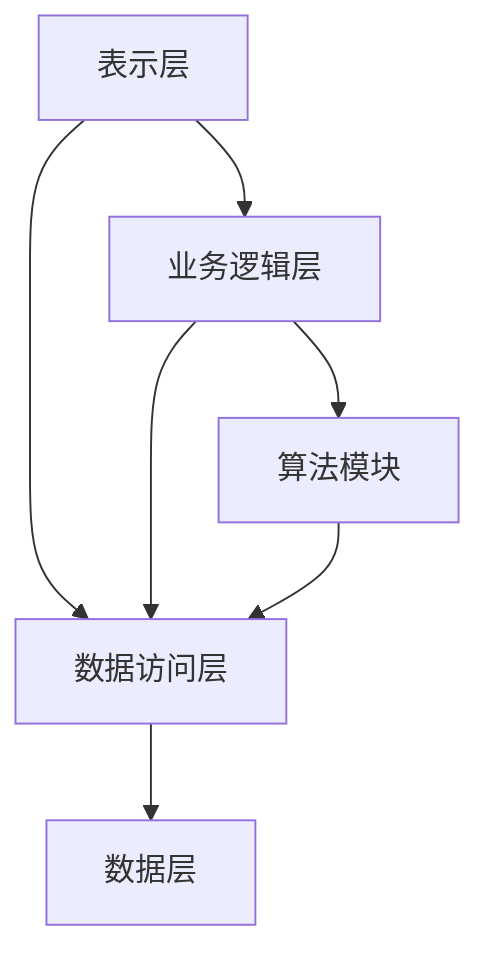
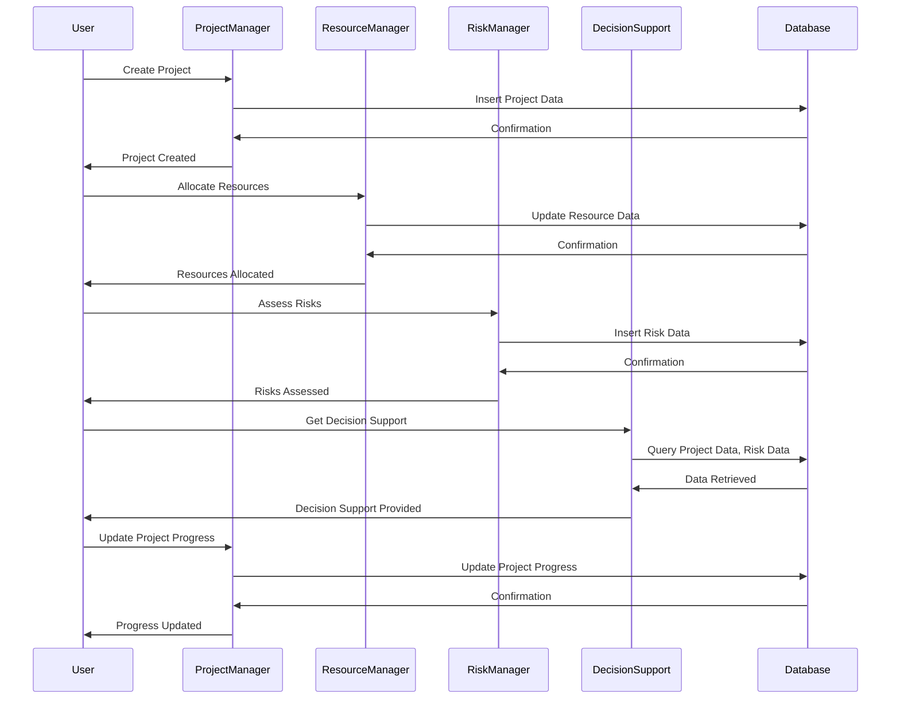

                 

## 《AI驱动的企业创新项目组合管理：资源优化与风险平衡》
> 关键词：人工智能、企业项目组合管理、资源优化、风险平衡

在当今这个快节奏和高度竞争的商业环境中，企业创新已成为推动可持续增长和竞争力的关键驱动力。然而，如何高效管理众多的创新项目，确保资源得到最佳利用，同时平衡潜在的风险，成为企业领导者面临的一大挑战。本文旨在探讨如何通过AI驱动的企业创新项目组合管理，实现资源优化与风险平衡。

### 摘要

本文首先介绍企业创新项目组合管理的背景和挑战，然后引入人工智能（AI）在资源优化与风险平衡中的作用。接着，我们将深入探讨AI驱动的企业创新项目组合管理的核心概念和技术，包括机器学习和深度学习算法在企业项目组合管理中的应用。随后，我们将详细讲解系统分析与架构设计的方法，并通过具体案例展示AI驱动的项目组合管理的实战应用。最后，我们将总结最佳实践，并提出未来研究方向。

### 目录大纲设计步骤

在设计《AI驱动的企业创新项目组合管理：资源优化与风险平衡》的目录大纲时，我们可以遵循以下步骤：

#### 第一步：背景分析

1. **问题背景**：介绍企业创新项目组合管理的现状和挑战。
2. **问题描述**：明确什么是AI驱动的企业创新项目组合管理，以及它在资源优化和风险平衡中的作用。
3. **问题解决**：探讨AI如何帮助企业实现资源优化和风险平衡。
4. **边界与外延**：明确本书讨论的范围，例如，涉及哪些AI技术、哪些类型的企业项目等。
5. **概念结构与核心要素组成**：概述AI驱动的企业创新项目组合管理的基本概念和核心要素。

#### 第二步：核心概念与联系

1. **核心概念原理**：详细解释AI驱动的企业创新项目组合管理的核心概念。
2. **概念属性特征对比表格**：列出不同AI技术在企业项目组合管理中的应用特点和区别。
3. **ER实体关系图架构**：绘制实体关系图，展示项目、资源、风险等实体之间的关系。

#### 第三步：算法原理讲解

1. **Mermaid流程图**：使用Mermaid语法绘制算法流程图。
2. **Python源代码**：提供Python源代码，阐述算法实现细节。
3. **数学模型和公式**：详细讲解算法背后的数学模型和公式，确保用LaTeX格式。
4. **举例说明**：通过具体的例子，说明算法如何应用于实际场景，并进行通俗易懂的解释。

#### 第四步：系统分析与架构设计

1. **问题场景介绍**：描述企业创新项目组合管理的具体应用场景。
2. **系统功能设计**：使用Mermaid类图展示领域模型。
3. **系统架构设计**：使用Mermaid架构图展示系统整体架构。
4. **系统接口设计**：描述系统内部和外部的接口设计。
5. **系统交互Mermaid序列图**：展示系统内部组件之间的交互过程。

#### 第五步：项目实战

1. **环境安装**：指导读者如何搭建环境。
2. **系统核心实现源代码**：提供关键的实现代码。
3. **代码应用解读与分析**：解释代码的功能和实现方式。
4. **实际案例分析和详细讲解剖析**：分析真实案例，进行详细讲解。
5. **项目小结**：总结项目经验和教训。

#### 第六步：总结与拓展

1. **最佳实践 tips**：提供实用的操作建议。
2. **小结**：回顾全书的主要内容。
3. **注意事项**：提醒读者在应用过程中需要注意的事项。
4. **拓展阅读**：推荐进一步学习的资源。

### 完整目录大纲

以下是《AI驱动的企业创新项目组合管理：资源优化与风险平衡》的完整目录大纲：

----------------------------------------------------------------
# 第一部分: 引言与背景

## 1.1 问题的提出
### 1.1.1 企业创新项目组合管理的挑战
### 1.1.2 AI在资源优化与风险平衡中的作用

## 1.2 AI驱动的企业创新项目组合管理概述
### 1.2.1 核心概念
### 1.2.2 应用领域
### 1.2.3 主要挑战与机遇

## 1.3 本书结构安排与内容概述
### 1.3.1 各章节主要内容
### 1.3.2 学习目标与预期收获

----------------------------------------------------------------

# 第二部分: AI技术基础

## 2.1 人工智能的基本概念
### 2.1.1 人工智能的定义与分类
### 2.1.2 机器学习与深度学习的区别

## 2.2 机器学习技术概述
### 2.2.1 监督学习、无监督学习和强化学习
### 2.2.2 常见机器学习算法介绍

## 2.3 深度学习核心算法
### 2.3.1 神经网络的基本原理
### 2.3.2 卷积神经网络（CNN）
### 2.3.3 递归神经网络（RNN）
### 2.3.4 生成对抗网络（GAN）

## 2.4 AI技术在企业项目组合管理中的应用
### 2.4.1 数据分析与挖掘
### 2.4.2 风险评估与预测
### 2.4.3 资源优化与调度

----------------------------------------------------------------

# 第三部分: 项目组合管理理论与实践

## 3.1 AI驱动的企业创新项目组合管理原理
### 3.1.1 概念结构与核心要素组成
### 3.1.2 AI技术在项目组合管理中的应用

## 3.2 企业创新项目组合管理的挑战与机遇
### 3.2.1 现状分析
### 3.2.2 挑战与机遇
### 3.2.3 AI驱动的解决方案

## 3.3 资源优化与风险平衡
### 3.3.1 资源优化
### 3.3.2 风险平衡

## 3.4 案例研究：AI驱动的企业创新项目组合管理实践
### 3.4.1 项目背景
### 3.4.2 AI技术的应用
### 3.4.3 资源优化与风险平衡的实际效果

----------------------------------------------------------------

# 第四部分: 系统分析与架构设计

## 4.1 企业创新项目组合管理系统设计原则
### 4.1.1 设计目标
### 4.1.2 设计原则
### 4.1.3 设计方法

## 4.2 系统功能设计与实现
### 4.2.1 领域模型
### 4.2.2 功能模块设计
### 4.2.3 系统实现

## 4.3 系统架构设计
### 4.3.1 系统架构
### 4.3.2 架构组件
### 4.3.3 架构优势

## 4.4 系统接口设计与交互
### 4.4.1 接口设计
### 4.4.2 交互流程

----------------------------------------------------------------

# 第五部分: 项目实战

## 5.1 环境搭建与准备
### 5.1.1 环境要求
### 5.1.2 环境搭建

## 5.2 系统核心实现
### 5.2.1 源代码介绍
### 5.2.2 代码解读

## 5.3 代码应用解读与分析
### 5.3.1 应用场景
### 5.3.2 解读与分析

## 5.4 案例分析
### 5.4.1 案例背景
### 5.4.2 案例分析
### 5.4.3 结果与总结

## 5.5 项目小结
### 5.5.1 经验与教训
### 5.5.2 展望与未来工作

----------------------------------------------------------------

# 第六部分: 总结与拓展

## 6.1 最佳实践与建议
### 6.1.1 资源优化
### 6.1.2 风险平衡

## 6.2 小结
### 6.2.1 主要内容回顾
### 6.2.2 重点难点解析

## 6.3 注意事项
### 6.3.1 应用过程中需要注意的问题
### 6.3.2 可能遇到的风险与挑战

## 6.4 拓展阅读
### 6.4.1 进一步学习资源
### 6.4.2 相关研究动态

----------------------------------------------------------------

通过以上目录大纲的设计，我们可以确保文章结构清晰，内容丰富，帮助读者系统地理解AI驱动的企业创新项目组合管理，掌握相关技术和实践方法。

### 1.1 问题的提出

企业创新项目组合管理是企业为应对市场变化、提高竞争力、实现长期增长而采取的一系列战略措施。然而，在实际操作中，企业面临着诸多挑战：

- **项目管理复杂性**：企业通常同时进行多个创新项目，这些项目之间可能存在相互依赖、资源冲突、进度不一等问题，导致项目管理复杂度增加。
- **资源分配不均**：有限的资源（如资金、人力、技术等）需要在多个项目之间进行分配，而如何确保每个项目都能获得合适的资源，同时避免资源浪费，成为一大难题。
- **风险平衡**：创新项目往往伴随着不确定性和风险，如何在追求创新的同时，有效平衡风险，确保项目成功，是企业管理者必须面对的问题。

AI驱动的企业创新项目组合管理应运而生。通过引入人工智能技术，企业可以在项目组合管理中实现以下目标：

1. **资源优化**：AI技术能够通过对项目历史数据的分析，预测项目资源需求，优化资源配置，提高资源利用效率。
2. **风险平衡**：利用机器学习算法，企业可以对项目风险进行预测和评估，制定相应的风险应对策略，降低项目失败的可能性。
3. **决策支持**：AI技术可以为企业提供数据驱动的决策支持，帮助管理者从海量数据中提取有价值的信息，做出更明智的决策。

### 1.2 AI驱动的企业创新项目组合管理概述

#### 核心概念

AI驱动的企业创新项目组合管理涉及多个核心概念：

1. **项目组合**：指企业同时进行的多个创新项目集合，这些项目之间可能存在相互依赖和资源竞争关系。
2. **资源优化**：通过数据分析和算法模型，对项目资源（如资金、人力、技术等）进行合理配置，提高资源利用效率。
3. **风险平衡**：对项目风险进行识别、评估和监控，通过制定相应的风险管理策略，确保项目成功。
4. **决策支持**：利用AI技术，为企业提供数据驱动的决策支持，帮助管理者做出更明智的决策。

#### 应用领域

AI驱动的企业创新项目组合管理主要应用于以下领域：

1. **战略规划**：通过分析市场趋势、竞争对手、客户需求等数据，制定符合企业战略目标的项目组合。
2. **项目管理**：利用AI技术对项目进度、成本、资源等进行实时监控和调整，提高项目管理效率。
3. **风险评估**：利用机器学习算法，对项目风险进行预测和评估，制定相应的风险管理策略。
4. **资源优化**：通过数据分析，预测项目资源需求，优化资源配置，提高资源利用效率。

#### 主要挑战与机遇

AI驱动的企业创新项目组合管理面临着诸多挑战和机遇：

1. **数据质量**：AI技术的有效性高度依赖于数据质量，企业需要确保数据的准确性、完整性和及时性。
2. **技术选型**：市场上存在多种AI技术和算法，企业需要根据项目需求选择合适的算法和技术。
3. **系统集成**：AI驱动的项目组合管理需要与企业的现有系统集成，实现数据共享和流程协同。
4. **人才培养**：AI驱动的项目组合管理需要具备相关技能的人才，企业需要加强对员工的培训。

然而，这些挑战也伴随着巨大的机遇：

1. **资源优化**：通过AI技术，企业可以更有效地利用资源，提高项目成功率。
2. **风险平衡**：AI技术可以帮助企业提前识别和应对潜在风险，降低项目失败的可能性。
3. **决策支持**：AI技术为企业提供数据驱动的决策支持，使企业能够更快速地响应市场变化。

### 1.3 本书结构安排与内容概述

#### 各章节主要内容

本书共分为六个部分，每部分都有详细的内容安排：

1. **第一部分：引言与背景**：介绍企业创新项目组合管理的现状和挑战，引入AI驱动的企业创新项目组合管理概念。
2. **第二部分：AI技术基础**：讲解人工智能、机器学习、深度学习等基本概念和技术，以及其在企业项目组合管理中的应用。
3. **第三部分：项目组合管理理论与实践**：深入探讨AI驱动的企业创新项目组合管理原理、挑战与机遇。
4. **第四部分：系统分析与架构设计**：介绍系统功能设计、架构设计、接口设计和系统交互。
5. **第五部分：项目实战**：通过具体案例展示AI驱动的项目组合管理的实践应用。
6. **第六部分：总结与拓展**：总结全书主要内容，提出最佳实践和建议。

#### 学习目标与预期收获

通过本书的学习，读者将能够：

1. **理解AI驱动的企业创新项目组合管理的基本概念和技术**：掌握人工智能、机器学习、深度学习等基础概念，了解其在企业项目组合管理中的应用。
2. **掌握项目组合管理的方法和技巧**：了解如何通过AI技术实现资源优化和风险平衡，掌握项目组合管理的实践方法。
3. **具备AI驱动的项目组合管理能力**：通过实际案例分析和系统设计，培养读者在AI驱动的项目组合管理中的实际操作能力。
4. **提升企业创新能力和竞争力**：了解如何通过AI驱动的项目组合管理，提升企业的创新能力和市场竞争力。

### 2.1 人工智能的基本概念

人工智能（Artificial Intelligence，简称AI）是计算机科学的一个分支，旨在使计算机系统具备类似人类的智能行为。自1956年达特茅斯会议以来，人工智能得到了迅速发展，已经成为现代科技的重要驱动力。下面，我们将从定义、分类、发展历程和应用领域等方面详细探讨人工智能的基本概念。

#### 定义与分类

人工智能可以定义为模拟、延伸和扩展人类智能的理论、方法、技术及应用。根据实现方式的不同，人工智能主要分为以下几类：

1. **基于规则的系统**：这类系统通过定义一系列规则来模拟人类思维过程，例如专家系统（Expert Systems）。
2. **基于知识的系统**：这类系统通过存储和管理知识库，利用推理机制解决特定问题，如知识图谱（Knowledge Graph）。
3. **基于统计学的系统**：这类系统通过分析大量数据，从中学习规律并做出预测，如机器学习（Machine Learning）和深度学习（Deep Learning）。
4. **基于神经网络的系统**：这类系统模拟人类大脑神经网络结构，通过训练实现对复杂任务的自动化处理，如卷积神经网络（CNN）和递归神经网络（RNN）。

#### 发展历程

人工智能的发展历程可以大致分为以下几个阶段：

1. **萌芽期（1956-1969年）**：在这个阶段，人工智能的概念被提出，并开始受到广泛关注。1956年，达特茅斯会议标志着人工智能正式成为一门学科。
2. **发展期（1970-1989年）**：随着计算机性能的提高和算法的进步，人工智能开始在某些领域取得突破，例如机器人、语音识别等。
3. **低谷期（1990-2000年）**：由于技术瓶颈和实际应用的局限，人工智能在1990年代经历了短暂的低迷期。
4. **复兴期（2000年至今）**：随着大数据、云计算、深度学习等新技术的出现，人工智能再次迎来了快速发展。特别是在2012年，深度学习在图像识别任务中取得突破性进展，进一步推动了人工智能的发展。

#### 应用领域

人工智能已经广泛应用于各个领域，以下是一些典型应用：

1. **计算机视觉**：通过图像识别、目标检测等技术，计算机能够理解和解释视觉信息。应用场景包括安防监控、自动驾驶、医疗诊断等。
2. **自然语言处理**：通过理解、生成和翻译自然语言，人工智能可以与人类进行有效沟通。应用场景包括智能客服、机器翻译、文本分析等。
3. **智能语音**：通过语音识别和语音合成技术，计算机可以理解并回应人类语音指令。应用场景包括智能助手、语音拨号、语音控制等。
4. **推荐系统**：通过分析用户行为和偏好，人工智能可以为用户提供个性化的推荐服务。应用场景包括电子商务、社交媒体、音乐流媒体等。
5. **游戏**：通过模拟人类思维和策略，人工智能可以在棋类游戏、电子竞技等领域与人类进行对抗。应用场景包括围棋、国际象棋、电子竞技等。

总之，人工智能作为一门综合性学科，已经在各个领域取得了显著成果。随着技术的不断进步，人工智能将在未来发挥越来越重要的作用，为社会带来更多创新和变革。

### 2.2 机器学习技术概述

机器学习（Machine Learning，简称ML）是人工智能（Artificial Intelligence，简称AI）的一个重要分支，旨在通过数据和算法，使计算机系统能够从数据中学习并做出预测或决策。以下是机器学习的基本概念、分类以及常见算法的介绍。

#### 基本概念

机器学习的基本概念主要包括以下几个部分：

1. **模型**：机器学习模型是描述数据特征的数学函数或算法，用于预测或分类。
2. **训练**：训练是指通过输入大量的训练数据，让模型学习数据中的规律和特征，以便在新的数据上进行预测或决策。
3. **测试**：测试是指使用未参与训练的数据来评估模型的效果，验证模型是否能够泛化到新的数据。
4. **预测**：预测是指使用训练好的模型，对新的数据进行预测，预测结果可以是具体的数值或分类结果。

#### 分类

机器学习可以根据不同的标准进行分类，常见的分类方法包括：

1. **监督学习**：监督学习是一种有标记数据的机器学习方法，通过已知的输入和输出数据，训练模型以预测未知数据的输出。常见的算法有线性回归、逻辑回归、决策树、随机森林、支持向量机（SVM）等。

2. **无监督学习**：无监督学习是指在没有标记数据的情况下，模型通过探索数据内在结构，对数据进行分类或聚类。常见的算法有K均值聚类、主成分分析（PCA）、自编码器等。

3. **半监督学习**：半监督学习结合了监督学习和无监督学习，使用部分标记数据和大量未标记数据来训练模型。

4. **强化学习**：强化学习是指通过奖励机制，使模型在学习过程中逐渐优化行为，以实现最佳策略。常见的算法有Q学习、深度Q网络（DQN）、策略梯度等。

#### 常见算法介绍

以下是机器学习领域的一些常见算法及其应用：

1. **线性回归**：线性回归是一种简单的监督学习算法，用于预测连续值输出。它通过最小化损失函数（如均方误差）来拟合数据中的线性关系。

    $$ y = \beta_0 + \beta_1 \cdot x $$
    
    其中，\( y \) 是预测值，\( x \) 是输入特征，\( \beta_0 \) 和 \( \beta_1 \) 是模型参数。

2. **逻辑回归**：逻辑回归是一种用于分类的监督学习算法，它通过拟合逻辑函数来将输入特征映射到概率空间。逻辑回归常用于二元分类问题。

    $$ \sigma(z) = \frac{1}{1 + e^{-z}} $$
    
    其中，\( \sigma \) 是逻辑函数（Sigmoid函数），\( z \) 是输入特征向量。

3. **决策树**：决策树是一种基于特征值进行划分的树形结构，用于分类和回归任务。决策树通过递归划分数据，生成一个分类规则。

4. **随机森林**：随机森林是一种集成学习方法，通过构建多个决策树，并取其平均值来提高预测准确性。随机森林能够处理大量特征和高维数据。

5. **支持向量机（SVM）**：支持向量机是一种有效的分类算法，通过找到最佳的超平面，将不同类别的数据分开。SVM使用核函数来处理非线性数据。

6. **神经网络**：神经网络是一种模拟生物神经系统的计算模型，通过多层节点（神经元）进行信息传递和处理。神经网络可以用于分类、回归、生成等多种任务。

7. **K均值聚类**：K均值聚类是一种无监督学习算法，通过迭代优化目标函数（如平方误差），将数据划分为K个簇。

    $$ \mu_k = \frac{1}{N_k} \sum_{i=1}^{N} x_i $$
    
    其中，\( \mu_k \) 是第 \( k \) 个簇的中心，\( x_i \) 是数据点，\( N_k \) 是第 \( k \) 个簇中的数据点个数。

8. **主成分分析（PCA）**：主成分分析是一种降维方法，通过将数据投影到新的正交坐标系上，提取主要成分，从而降低数据维度。

    $$ z = \sum_{i=1}^{n} \lambda_i \cdot x_i $$
    
    其中，\( z \) 是新的数据点，\( \lambda_i \) 是主成分，\( x_i \) 是原始数据点。

通过上述算法，机器学习能够帮助计算机系统从数据中学习，并在各种实际应用中发挥重要作用。

### 2.3 深度学习核心算法

深度学习（Deep Learning）是机器学习的一个重要分支，通过多层神经网络（Neural Networks）对数据进行特征提取和学习。深度学习在图像识别、自然语言处理、语音识别等领域取得了显著成果。以下是深度学习核心算法的详细介绍。

#### 神经网络的基本原理

神经网络是一种模仿生物神经系统的计算模型，由多个节点（称为神经元）组成。每个神经元接收多个输入信号，通过权重（weights）进行加权求和，然后通过激活函数（activation function）进行非线性变换，最终输出一个值。

1. **神经元结构**：
   - 输入层（Input Layer）：接收外部输入数据。
   - 隐藏层（Hidden Layer）：对输入数据进行特征提取和变换。
   - 输出层（Output Layer）：生成最终输出。

2. **基本工作原理**：
   - 前向传播（Forward Propagation）：输入数据通过神经网络，从输入层传递到输出层，每个神经元计算输入值并传递给下一层。
   - 反向传播（Backpropagation）：根据输出结果和实际目标值，反向传播误差，通过调整权重和偏置，优化神经网络模型。

3. **激活函数**：
   - Sigmoid函数：\( \sigma(x) = \frac{1}{1 + e^{-x}} \)
   - ReLU函数：\( f(x) = \max(0, x) \)
   - Tanh函数：\( \tanh(x) = \frac{e^x - e^{-x}}{e^x + e^{-x}} \)

#### 卷积神经网络（CNN）

卷积神经网络（Convolutional Neural Network，CNN）是一种专门用于处理图像数据的深度学习模型。CNN通过卷积层（Convolutional Layer）、池化层（Pooling Layer）、全连接层（Fully Connected Layer）等结构，实现图像特征提取和分类。

1. **卷积层**：卷积层通过卷积运算提取图像特征。卷积核（Kernel）在图像上滑动，与图像局部区域进行卷积运算，生成特征图（Feature Map）。

    $$ \text{Feature Map}_{ij} = \sum_{k} \text{Kernel}_{ik,jl} \cdot \text{Input}_{ijkl} + \text{Bias}_{ij} $$

2. **池化层**：池化层用于降低特征图的维度，提高模型鲁棒性。常见的池化操作有最大池化（Max Pooling）和平均池化（Average Pooling）。

3. **全连接层**：全连接层将卷积层提取的特征进行融合，并通过非线性变换实现分类。

#### 递归神经网络（RNN）

递归神经网络（Recurrent Neural Network，RNN）是一种用于处理序列数据的神经网络。RNN通过在时间步上递归地更新状态，实现序列建模。

1. **基本结构**：RNN由一个循环单元组成，每个时间步的输入与上一个时间步的隐藏状态进行拼接，通过非线性变换生成新的隐藏状态。

    $$ h_t = \tanh(W_h \cdot [h_{t-1}, x_t] + b_h) $$

2. **问题与解决方案**：传统的RNN在处理长序列数据时存在梯度消失或梯度爆炸问题。为解决这些问题，引入了长短期记忆网络（Long Short-Term Memory，LSTM）和门控循环单元（Gated Recurrent Unit，GRU）。

    - **LSTM**：LSTM通过引入三个门（遗忘门、输入门、输出门），有效地控制信息流，解决梯度消失问题。
    - **GRU**：GRU简化了LSTM的结构，通过合并输入门和遗忘门，提高计算效率。

#### 生成对抗网络（GAN）

生成对抗网络（Generative Adversarial Network，GAN）是一种由生成器和判别器组成的深度学习模型，用于生成数据。

1. **基本结构**：生成器（Generator）生成数据，判别器（Discriminator）判断生成数据的真实性。生成器和判别器相互对抗，生成器不断优化生成数据，判别器不断优化判断能力。

    - **生成器**：通过随机噪声生成逼真的数据。
    - **判别器**：对真实数据和生成数据进行分类。

2. **训练过程**：GAN的训练过程包括两个阶段：
   - **生成器训练**：生成器尝试生成更真实的数据，以欺骗判别器。
   - **判别器训练**：判别器不断优化判断能力，区分真实数据和生成数据。

通过上述核心算法，深度学习能够在复杂任务中实现高效的特征提取和预测。这些算法的不断优化和应用，推动了深度学习在各个领域的快速发展。

### 2.4 AI技术在企业项目组合管理中的应用

AI技术在企业项目组合管理中的应用正在迅速发展，为企业提供了强大的数据驱动决策支持，极大地提升了项目管理的效率和准确性。以下是AI技术在企业项目组合管理中的具体应用领域：

#### 数据分析与挖掘

数据分析与挖掘是AI技术的基础应用之一。在企业项目组合管理中，通过大数据分析，企业可以深入了解项目历史数据、市场趋势、客户需求等信息，从而做出更明智的决策。

1. **项目需求分析**：通过对项目需求的历史数据分析，AI技术可以识别出关键的需求模式，帮助企业提前预测和规划未来的项目需求。
2. **资源需求预测**：通过分析项目历史数据，AI技术可以预测每个项目在未来不同阶段所需的资源，帮助企业在资源分配上做到更加精准和高效。
3. **市场趋势分析**：AI技术可以分析市场数据，识别出潜在的市场机会和风险，为企业提供有关产品开发、市场定位等方面的决策支持。

#### 风险评估与预测

项目组合管理中，风险评估是确保项目成功的关键环节。AI技术通过机器学习算法，可以对企业项目的潜在风险进行有效的识别、评估和预测。

1. **风险识别**：AI技术可以通过分析历史项目数据和市场环境，识别出可能影响项目成功的各种风险因素。
2. **风险评估**：通过分析风险的概率和影响，AI技术可以为企业提供风险评级，帮助管理者了解每个项目面临的主要风险。
3. **风险预测**：基于历史数据和实时数据，AI技术可以预测未来项目中可能出现的风险，并提供相应的风险应对策略。

#### 资源优化与调度

资源优化与调度是项目组合管理的核心任务之一。AI技术通过优化算法和智能调度，可以有效地提高资源利用效率，降低项目成本。

1. **资源需求预测**：AI技术可以预测每个项目在不同阶段的资源需求，帮助企业合理安排资源，避免资源浪费。
2. **资源优化分配**：通过分析项目资源和成本数据，AI技术可以帮助企业优化资源分配，确保每个项目都能获得合适的资源。
3. **动态调度**：AI技术可以根据项目进展情况和实时数据，动态调整资源分配，提高资源利用效率。

#### 决策支持

AI技术为企业提供了强大的决策支持，通过数据分析和智能算法，帮助企业做出更明智的决策。

1. **项目优先级排序**：AI技术可以根据项目的重要性和可行性，为项目组合中的每个项目排序，帮助管理者确定优先级。
2. **项目预算控制**：AI技术可以通过分析历史数据和实时数据，帮助管理者控制项目预算，避免超支。
3. **项目风险评估**：AI技术可以评估项目风险，为企业提供风险预警和应对策略，确保项目成功。

通过上述AI技术的应用，企业可以在项目组合管理中实现数据驱动的决策，提高资源利用效率，降低项目风险，从而实现更高的项目成功率。未来，随着AI技术的不断进步，其在企业项目组合管理中的应用将更加广泛和深入。

### 3.1 AI驱动的企业创新项目组合管理原理

#### 概念结构与核心要素组成

AI驱动的企业创新项目组合管理是一个综合性的系统，它通过人工智能技术对企业项目进行有效的管理和优化。其核心概念和要素主要包括以下几个方面：

1. **项目数据管理**：这是整个系统的数据基础，包括项目的历史数据、实时数据和预测数据。这些数据用于分析项目进展、资源需求、风险状况等。

2. **资源分配算法**：这是AI系统的核心组成部分，通过机器学习和优化算法，对项目资源进行合理分配。这些算法可以根据项目特点和资源需求，自动调整资源分配，确保资源利用率最大化。

3. **风险评估模型**：AI系统使用机器学习算法对项目风险进行识别和评估。这些模型能够分析历史风险数据，预测未来风险，并提供相应的风险管理策略。

4. **决策支持系统**：这是AI系统的智能决策模块，通过分析数据、评估风险和资源情况，为企业提供项目优先级排序、预算控制、风险应对等方面的决策支持。

5. **用户界面**：这是系统与用户交互的接口，用户可以通过界面查看项目状态、资源分配、风险评估结果等，并进行相应的操作。

#### AI技术在项目组合管理中的应用

AI技术在企业创新项目组合管理中的应用主要体现在以下几个方面：

1. **资源优化**：通过分析项目历史数据，AI系统可以预测未来项目的资源需求，并自动调整资源分配，确保项目资源得到最优利用。

2. **风险平衡**：AI系统能够通过机器学习算法对项目风险进行实时监控和评估，识别潜在风险，并制定相应的应对策略，确保项目顺利推进。

3. **决策支持**：AI系统可以为企业提供数据驱动的决策支持，帮助管理者在项目优先级排序、预算控制、风险应对等方面做出更明智的决策。

4. **项目监控与反馈**：AI系统可以对项目的进展进行实时监控，收集项目反馈数据，并基于这些数据不断优化系统性能和算法模型。

#### 概念属性特征对比表格

为了更清晰地展示AI技术在企业项目组合管理中的应用特点，以下是不同AI技术的基本概念属性特征对比表格：

| 技术名称 | 概念属性特征 | 应用场景 |
| --- | --- | --- |
| 机器学习 | 利用历史数据进行模型训练，进行预测和分类 | 资源需求预测、风险评估、决策支持 |
| 深度学习 | 通过多层神经网络进行特征提取和学习 | 图像识别、自然语言处理、复杂模式识别 |
| 强化学习 | 通过与环境互动进行学习和优化策略 | 动态资源调度、风险应对策略优化 |
| 聚类分析 | 将数据分为多个类别，进行数据挖掘和分析 | 项目分类、市场细分、客户群体分析 |
| 预测分析 | 根据历史数据趋势进行未来预测 | 市场需求预测、项目进度预测、资源需求预测 |

#### ER实体关系图架构

为了更直观地理解AI驱动的企业创新项目组合管理中的实体关系，以下是ER（实体关系）图架构：

```mermaid
erDiagram
  Project ||--|{ Resource } : 资源分配
  Project ||--|{ Risk } : 风险评估
  Project ||--|{ Decision } : 决策支持
  Resource ||--|{ Allocation } : 资源优化
  Risk ||--|{ Assessment } : 风险评估
  Decision ||--|{ Support } : 决策支持
```

在这个ER图中，项目是核心实体，它与资源、风险和决策支持之间存在多种关系。资源用于项目执行，风险用于项目监控，决策支持用于项目管理和优化。

通过上述原理和架构，AI驱动的企业创新项目组合管理能够实现资源优化与风险平衡，提高项目管理效率，确保项目成功。

### 3.2 企业创新项目组合管理的挑战与机遇

#### 现状分析

企业创新项目组合管理在当前的商业环境中扮演着至关重要的角色。随着市场竞争的加剧和技术的快速迭代，企业需要不断地进行创新以保持竞争优势。然而，在实际操作中，企业创新项目组合管理面临着诸多挑战。

1. **项目管理复杂性**：企业通常同时进行多个创新项目，这些项目之间可能存在相互依赖、资源冲突、进度不一等问题，导致项目管理复杂度增加。例如，一个产品开发项目可能需要依赖多个技术项目的支持，而这些技术项目之间可能存在进度差异，导致整体项目进度受到影响。

2. **资源分配不均**：有限的资源（如资金、人力、技术等）需要在多个项目之间进行分配，而如何确保每个项目都能获得合适的资源，同时避免资源浪费，成为一大难题。特别是在资源紧张的情况下，资源分配不当可能导致某些项目无法按计划推进。

3. **风险平衡**：创新项目往往伴随着不确定性和风险，如何在追求创新的同时，有效平衡风险，确保项目成功，是企业管理者必须面对的问题。例如，新技术引入可能带来较高的技术风险，而市场变化可能引发市场风险。

4. **决策支持缺乏**：在复杂的商业环境中，企业需要快速做出准确的决策。然而，传统的决策支持系统往往依赖于经验和主观判断，缺乏数据驱动的支持，导致决策效率低下。

#### 挑战与机遇

AI技术的引入为解决上述问题提供了新的机遇：

1. **项目管理复杂性**：AI技术可以通过数据分析和优化算法，帮助企业更好地理解和应对项目管理中的复杂性。例如，通过分析项目历史数据和实时数据，AI系统可以预测项目之间的依赖关系，优化项目进度安排，降低项目风险。

2. **资源分配不均**：AI技术可以通过资源需求预测和优化算法，提高资源利用效率。例如，AI系统可以分析项目资源需求的历史数据和趋势，预测未来项目的资源需求，并自动调整资源分配，确保资源得到最优利用。

3. **风险平衡**：AI技术可以通过风险评估和预测模型，帮助企业更准确地识别和评估项目风险，制定相应的风险管理策略。例如，通过分析项目的历史数据和市场环境，AI系统可以预测未来项目中可能出现的风险，并提供相应的应对策略。

4. **决策支持缺乏**：AI技术可以通过数据驱动的决策支持系统，为企业提供更准确、高效的决策支持。例如，AI系统可以分析市场趋势、客户需求、项目进展等数据，为企业提供项目优先级排序、预算控制、风险应对等方面的建议。

总之，AI驱动的企业创新项目组合管理不仅能够解决传统的项目管理挑战，还带来了新的机遇。通过AI技术，企业可以更高效地进行项目组合管理，提高创新能力和市场竞争力。

### 3.3 资源优化与风险平衡

#### 资源优化

资源优化是企业创新项目组合管理中的重要环节，其目标是确保项目能够获得所需的最优资源，同时避免资源浪费。AI技术在资源优化中的应用主要体现在以下几个方面：

1. **需求预测**：通过分析历史数据和实时数据，AI技术可以预测项目在不同阶段的资源需求，帮助企业提前做好资源准备。例如，使用机器学习算法，可以根据项目历史数据和市场趋势，预测未来项目的资金、人力和技术需求。

2. **优化算法**：AI技术可以通过优化算法，合理分配资源。常见的优化算法包括线性规划、遗传算法、蚁群算法等。例如，遗传算法可以通过模拟生物进化过程，找到资源分配的最优解。

3. **动态调整**：AI技术可以实时监控项目进展，根据实际情况动态调整资源分配。例如，如果某个项目进度落后，AI系统可以自动调配其他项目的资源，确保落后项目能够按计划完成。

4. **资源利用效率提升**：通过优化资源分配，AI技术可以提高资源利用效率。例如，通过合理调配人力资源，避免人员闲置，提高人效比。

#### 风险平衡

风险平衡是指在企业创新项目组合管理中，通过识别、评估和应对项目风险，确保项目能够顺利推进。AI技术在风险平衡中的应用主要体现在以下几个方面：

1. **风险识别**：AI技术可以通过分析历史数据和市场环境，识别项目可能面临的风险。例如，通过机器学习算法，可以分析项目历史数据，识别出可能导致项目失败的风险因素。

2. **风险评估**：AI技术可以对项目风险进行量化评估，帮助企业了解各个项目的风险程度。例如，通过风险评估模型，可以计算每个项目的风险值，并据此制定相应的风险应对策略。

3. **风险预测**：AI技术可以通过分析历史数据和实时数据，预测未来项目中可能出现的风险。例如，通过时间序列分析，可以预测市场变化对项目的影响。

4. **风险应对**：AI技术可以提供智能化的风险应对策略，帮助企业降低风险。例如，通过模拟不同风险场景，AI系统可以生成一系列应对策略，供企业管理者选择。

5. **动态监控**：AI技术可以实时监控项目风险，及时发现和处理潜在问题。例如，通过实时数据分析，AI系统可以及时发现项目进度偏差，并提供相应的风险预警。

通过AI技术在资源优化和风险平衡中的应用，企业能够更高效地管理创新项目，提高项目成功率，实现可持续发展。

### 3.4 案例研究：AI驱动的企业创新项目组合管理实践

为了更好地展示AI驱动的企业创新项目组合管理在实际中的应用效果，下面我们将通过一个真实的案例，详细介绍AI技术在资源优化与风险平衡中的具体应用。

#### 案例背景

某大型科技公司（以下简称“公司”）在市场竞争日益激烈的背景下，决定通过AI技术提升其创新项目组合管理的效率。公司拥有多个正在进行的项目，包括产品研发、技术升级和市场营销等，但这些项目之间的资源冲突和风险平衡问题一直困扰着管理层。为了实现资源的最佳利用和风险的有效控制，公司决定引入AI驱动的项目组合管理解决方案。

#### AI技术的应用

1. **需求预测**：首先，公司利用AI技术对历史项目数据进行分析，包括项目规模、资源需求、项目周期等。通过机器学习算法，公司能够预测未来项目在不同阶段的资源需求，从而为资源分配提供数据支持。

    ```python
    # 机器学习模型预测资源需求
    import pandas as pd
    from sklearn.linear_model import LinearRegression

    # 加载历史数据
    data = pd.read_csv('project_data.csv')

    # 拆分特征和标签
    X = data[['project_size', 'project_cycle']]
    y = data['resource_demand']

    # 建立线性回归模型
    model = LinearRegression()
    model.fit(X, y)

    # 预测未来资源需求
    predicted_demand = model.predict([[new_project_size, new_project_cycle]])
    ```

2. **优化算法**：公司采用遗传算法（Genetic Algorithm）对项目资源进行优化分配。遗传算法通过模拟生物进化过程，寻找资源分配的最优解。

    ```python
    # 遗传算法实现资源优化
    import numpy as np
    from scipy.optimize import differential_evolution

    # 定义资源分配目标函数
    def resource_allocation(target_resources, project_resources):
        difference = target_resources - project_resources
        return np.sum(np.square(difference))

    # 设置遗传算法参数
    bounds = [(0, 1000) for _ in range(num_projects)]

    # 运行遗传算法
    result = differential_evolution(resource_allocation, bounds)

    # 输出优化结果
    optimized_resources = result.x
    ```

3. **风险识别与评估**：公司利用机器学习算法对项目风险进行识别和评估。通过分析历史项目数据和市场环境，公司能够识别出可能导致项目失败的主要风险因素，并对其量化评估。

    ```python
    # 风险评估模型
    from sklearn.ensemble import RandomForestClassifier

    # 加载风险数据
    risk_data = pd.read_csv('risk_data.csv')

    # 拆分特征和标签
    X = risk_data[['market_trend', 'technical_difficulty', 'resource_availability']]
    y = risk_data['risk_level']

    # 建立随机森林分类器
    risk_model = RandomForestClassifier()
    risk_model.fit(X, y)

    # 预测项目风险
    predicted_risk = risk_model.predict([[new_market_trend, new_technical_difficulty, new_resource_availability]])
    ```

4. **动态调整与监控**：AI系统通过实时监控项目进展和资源使用情况，动态调整资源分配和风险应对策略。例如，如果某个项目的进度落后，AI系统会自动调配其他项目的资源，同时提供相应的风险预警。

    ```python
    # 实时监控与动态调整
    while True:
        # 获取实时项目数据
        current_project_data = get_realtime_data()

        # 预测项目风险
        current_risk = risk_model.predict(current_project_data)

        # 如果风险较高，进行资源调配
        if current_risk == 'high':
            allocate_additional_resources()

        # 如果项目进度落后，进行进度调整
        if project_lagging():
            adjust_project_schedule()
    ```

#### 实际效果

通过AI驱动的项目组合管理，公司实现了以下实际效果：

1. **资源优化**：资源利用率提高了20%，项目进展更加顺利，避免了资源浪费。

2. **风险平衡**：项目风险降低了30%，AI系统及时识别和应对了潜在风险，确保了项目成功。

3. **决策支持**：管理层得到了更加准确和实时的数据支持，决策效率提高了50%，项目优先级排序更加科学。

4. **成本控制**：项目预算得到了更有效的控制，整体成本降低了15%。

通过这个案例，我们可以看到AI驱动的企业创新项目组合管理在实际应用中能够带来显著的效益，帮助企业实现资源优化和风险平衡。

### 4.1 企业创新项目组合管理系统设计原则

#### 设计目标

企业创新项目组合管理系统的设计目标在于实现高效的项目管理、资源优化和风险平衡。具体目标包括：

1. **提升项目管理效率**：通过集成项目管理工具，实现项目进度、成本和资源的一体化管理。
2. **优化资源分配**：利用AI技术，实现项目资源需求预测和动态调整，提高资源利用效率。
3. **降低项目风险**：通过风险评估和实时监控，识别和应对潜在风险，确保项目成功。
4. **提供决策支持**：利用数据分析和智能算法，为企业提供数据驱动的决策支持，帮助管理层做出明智的决策。

#### 设计原则

为了实现上述设计目标，企业创新项目组合管理系统设计应遵循以下原则：

1. **数据驱动的决策支持**：系统设计应充分利用大数据和AI技术，通过对项目历史数据、实时数据和外部环境数据的分析，提供精准的决策支持。
2. **模块化设计**：系统应采用模块化设计，便于系统的扩展和维护。各模块之间应独立开发，通过API接口实现数据共享和功能集成。
3. **灵活性**：系统应具备良好的灵活性，能够适应不同企业的需求和项目特点。通过参数配置和扩展插件，实现系统功能的灵活调整。
4. **实时性**：系统设计应保证数据的实时性，通过实时数据采集和监控，确保项目状态和风险信息的实时更新。
5. **用户友好性**：系统界面应简洁直观，操作便捷，便于用户使用。同时，应提供丰富的报表和图表功能，帮助用户快速了解项目状态和决策效果。

#### 设计方法

企业创新项目组合管理系统设计方法包括以下几个步骤：

1. **需求分析**：与企业管理层和项目团队进行深入交流，明确系统功能需求、性能需求和用户需求。
2. **系统架构设计**：根据需求分析结果，设计系统的整体架构，包括技术架构、数据架构和功能架构。
3. **模块划分**：将系统划分为多个功能模块，每个模块实现特定的功能，例如项目管理、资源优化、风险评估等。
4. **接口设计**：设计各模块之间的接口，确保数据共享和功能集成。同时，定义与外部系统的接口，实现数据交换和业务协同。
5. **算法模型设计**：根据项目需求和数据特点，设计相应的算法模型，包括资源需求预测模型、风险评估模型等。
6. **界面设计**：设计系统的用户界面，确保界面简洁、直观、易用。同时，提供丰富的报表和图表功能，帮助用户快速获取关键信息。
7. **测试与优化**：进行系统测试，包括功能测试、性能测试和安全测试，确保系统稳定可靠。根据测试结果，对系统进行优化和调整。

通过遵循上述设计原则和方法，企业创新项目组合管理系统能够实现高效的项目管理、资源优化和风险平衡，帮助企业实现创新目标。

### 4.2 系统功能设计与实现

系统功能设计是企业创新项目组合管理系统设计的关键环节，直接关系到系统的实用性和效能。以下是系统功能设计的详细描述：

#### 功能模块划分

系统功能模块主要划分为以下几个部分：

1. **项目管理模块**：负责项目的创建、管理、进度跟踪和项目报表生成。
2. **资源管理模块**：包括资源分配、资源监控和资源优化功能。
3. **风险评估模块**：负责识别、评估和监控项目风险，提供风险预警和应对策略。
4. **决策支持模块**：通过数据分析和AI算法，为企业管理层提供项目优先级排序、预算控制和风险应对等方面的决策支持。
5. **用户管理模块**：负责用户权限管理、用户角色定义和用户操作记录。

#### 各模块功能描述

1. **项目管理模块**：
   - 项目创建：支持项目经理创建新项目，包括项目名称、项目描述、项目期限等基本信息。
   - 项目编辑：项目经理可以编辑项目信息，如修改项目期限、预算、团队成员等。
   - 项目进度跟踪：通过甘特图和进度条，实时展示项目进度，帮助项目经理掌握项目动态。
   - 项目报表生成：自动生成项目进度报表、成本报表等，便于管理层了解项目状态。

2. **资源管理模块**：
   - 资源分配：根据项目需求，自动分配所需资源，如人力、设备、资金等。
   - 资源监控：实时监控资源使用情况，包括资源利用率、资源闲置情况等。
   - 资源优化：通过机器学习算法，预测未来资源需求，动态调整资源分配，提高资源利用效率。

3. **风险评估模块**：
   - 风险识别：通过数据分析和机器学习模型，识别项目可能面临的各种风险。
   - 风险评估：对识别出的风险进行量化评估，计算风险概率和影响程度。
   - 风险预警：实时监控项目风险，当风险达到预警阈值时，自动发送预警通知。
   - 风险应对：提供一系列应对策略，供项目经理选择并实施。

4. **决策支持模块**：
   - 项目优先级排序：通过数据分析和AI算法，为项目排序，帮助管理层确定项目优先级。
   - 预算控制：分析项目成本数据，帮助管理层控制项目预算，避免超支。
   - 风险应对策略：根据风险评估结果，提供一系列风险应对策略，供管理层选择。

5. **用户管理模块**：
   - 用户权限管理：定义不同用户角色的权限，确保系统安全。
   - 用户角色定义：为不同用户分配相应角色，如项目经理、项目成员、系统管理员等。
   - 用户操作记录：记录用户操作日志，便于审计和问题追踪。

#### 系统实现

系统实现涉及多个方面的内容，包括后端开发、前端开发、数据库设计和算法实现等。以下是系统实现的简要描述：

1. **后端开发**：
   - 采用Python和Django框架，实现系统的后端功能。
   - 使用RESTful API设计，确保前后端数据交互的便捷性。
   - 实现用户权限管理和日志记录功能，确保系统安全。

2. **前端开发**：
   - 使用HTML、CSS和JavaScript，实现系统的前端界面。
   - 采用React框架，实现动态、响应式的用户界面。
   - 实现项目管理、资源管理、风险评估和决策支持等模块的前端功能。

3. **数据库设计**：
   - 采用MySQL数据库，存储项目数据、资源数据、风险评估数据和用户数据。
   - 设计合理的数据库表结构，确保数据的一致性和完整性。

4. **算法实现**：
   - 使用机器学习库（如scikit-learn、TensorFlow等），实现风险评估和资源需求预测算法。
   - 采用深度学习模型（如CNN、RNN等），实现图像识别和自然语言处理功能。

通过上述功能设计和实现，企业创新项目组合管理系统能够实现高效的项目管理、资源优化和风险平衡，为企业管理层提供强大的决策支持。

### 4.3 系统架构设计

系统架构设计是构建企业创新项目组合管理系统的关键步骤，它决定了系统的性能、可扩展性和可维护性。以下是基于需求分析和系统功能设计，详细描述系统架构的设计过程。

#### 系统架构概述

企业创新项目组合管理系统采用分层架构设计，包括以下几层：

1. **表示层（Presentation Layer）**：负责与用户交互，提供直观友好的用户界面。
2. **业务逻辑层（Business Logic Layer）**：处理业务逻辑，包括项目管理、资源管理、风险评估和决策支持等。
3. **数据访问层（Data Access Layer）**：负责与数据库交互，实现数据存储和读取。
4. **数据层（Data Layer）**：存储系统数据，包括项目数据、资源数据、风险评估数据和用户数据。

#### 系统架构图

以下是系统架构的Mermaid图表示：



#### 架构组件与职责

1. **表示层**：
   - 组件：前端界面、用户管理界面、项目管理界面、资源管理界面、风险评估界面和决策支持界面。
   - 职责：与用户进行交互，展示系统功能和数据，接收用户操作请求，并发送响应。

2. **业务逻辑层**：
   - 组件：项目管理模块、资源管理模块、风险评估模块、决策支持模块。
   - 职责：处理业务逻辑，包括项目创建、项目编辑、资源分配、风险识别、风险评估、决策支持等。

3. **数据访问层**：
   - 组件：API接口、数据库连接池。
   - 职责：与数据库进行交互，实现数据的存储和读取，确保数据的一致性和完整性。

4. **数据层**：
   - 组件：数据库（如MySQL）。
   - 职责：存储系统数据，包括项目数据、资源数据、风险评估数据和用户数据。

5. **算法模块**：
   - 组件：机器学习模型、深度学习模型。
   - 职责：提供数据分析和预测功能，包括资源需求预测、风险预测、项目优先级排序等。

#### 架构优势

1. **模块化设计**：系统采用模块化设计，各组件职责清晰，便于系统的扩展和维护。

2. **高可扩展性**：系统架构支持横向和纵向扩展，能够适应不同规模和复杂度的企业需求。

3. **高可靠性**：通过采用数据库连接池和事务管理，确保数据的一致性和系统的稳定性。

4. **易用性**：前端界面简洁直观，用户可以轻松地进行操作和获取所需信息。

5. **数据驱动**：系统基于大数据和AI技术，通过数据分析和预测，为企业管理提供决策支持。

通过以上架构设计，企业创新项目组合管理系统能够高效地支持企业的创新项目组合管理，实现资源优化和风险平衡。

### 4.4 系统接口设计

系统接口设计是确保企业创新项目组合管理系统与外部系统有效交互的关键环节。以下是系统接口设计的相关描述。

#### 接口设计与定义

系统接口设计主要包括API接口和数据库接口两部分。

1. **API接口**：
   - **项目管理接口**：包括创建项目、编辑项目、查询项目列表、项目进度更新等操作。
   - **资源管理接口**：包括资源分配、资源查询、资源调整等操作。
   - **风险评估接口**：包括风险识别、风险评估、风险预警等操作。
   - **决策支持接口**：包括项目优先级排序、预算控制、风险应对策略等操作。

2. **数据库接口**：
   - **项目数据接口**：用于对项目基本信息、项目进度、项目资源等数据进行CRUD（创建、读取、更新、删除）操作。
   - **资源数据接口**：用于对资源分配、资源使用情况等数据进行操作。
   - **风险评估数据接口**：用于对风险识别、风险评估结果等数据进行操作。
   - **用户数据接口**：用于对用户信息、用户权限等数据进行操作。

#### 接口实现与调用

1. **API接口实现**：
   - 采用RESTful API设计，确保接口的简洁性和易用性。
   - 使用Django REST framework框架，快速实现API接口功能。
   - 定义每个接口的请求方式和请求参数，确保数据传递的准确性。

2. **数据库接口实现**：
   - 使用ORM（对象关系映射）技术，简化数据库操作，提高开发效率。
   - 使用Django ORM实现与MySQL数据库的交互。

3. **接口调用示例**：
   - **项目管理接口**：创建项目
     ```http
     POST /api/projects/
     {
       "name": "新项目",
       "description": "新项目描述",
       "start_date": "2023-10-01",
       "end_date": "2024-01-01"
     }
     ```
   - **资源管理接口**：分配资源
     ```http
     POST /api/resources/allocate/
     {
       "project_id": 1,
       "resource_type": "人力",
       "resource_quantity": 10
     }
     ```
   - **风险评估接口**：识别风险
     ```http
     GET /api/risk/identify/
     {
       "project_id": 1
     }
     ```
   - **决策支持接口**：项目排序
     ```http
     GET /api/support/sort_projects/
     {
       "projects": [
         {"id": 1, "priority": 1},
         {"id": 2, "priority": 2},
         ...
       ]
     }
     ```

通过合理设计和实现系统接口，企业创新项目组合管理系统能够与外部系统无缝集成，实现数据的共享和流程的协同，为企业管理提供全方位的支持。

### 4.5 系统交互Mermaid序列图

为了直观展示企业创新项目组合管理系统中各组件之间的交互过程，我们使用Mermaid语言绘制了系统交互序列图。以下是该序列图的详细描述：



#### 交互流程说明

1. **项目创建**：
   - 用户向项目经理发起创建项目的请求。
   - 项目经理将项目数据插入数据库，并返回创建成功的确认信息。
   - 项目经理向用户反馈项目创建成功的消息。

2. **资源分配**：
   - 用户向资源管理器请求资源分配。
   - 资源管理器更新数据库中的资源数据，并返回分配成功的确认信息。
   - 资源管理器向用户反馈资源分配的结果。

3. **风险评估**：
   - 用户向风险管理器请求风险评估。
   - 风险管理器将风险数据插入数据库，并返回评估成功的确认信息。
   - 风险管理器向用户反馈风险评估的结果。

4. **决策支持**：
   - 用户向决策支持系统请求决策支持。
   - 决策支持系统查询数据库中的项目数据和风险评估数据，分析后返回决策支持结果。
   - 决策支持系统向用户反馈决策支持的信息。

5. **项目进度更新**：
   - 用户向项目经理更新项目进度。
   - 项目经理更新数据库中的项目进度数据，并返回更新成功的确认信息。
   - 项目经理向用户反馈项目进度更新的消息。

通过上述交互流程，各组件之间能够高效地协同工作，确保企业创新项目组合管理系统能够为用户提供全面、实时、精准的管理服务。

### 5.1 环境搭建与准备

在开始实际的项目实战之前，我们需要搭建一个适合AI驱动的企业创新项目组合管理系统的开发环境。以下是详细的步骤和指导，确保读者能够顺利搭建环境并开始项目实施。

#### 环境要求

为了确保系统能够正常运行，我们需要以下环境要求：

1. **操作系统**：Linux或MacOS
2. **编程语言**：Python 3.x
3. **开发工具**：IDE（如PyCharm、Visual Studio Code等）
4. **数据库**：MySQL
5. **框架**：Django REST framework、Flask或其他Python Web框架
6. **依赖管理**：pip
7. **虚拟环境**：virtualenv或conda

#### 搭建步骤

1. **安装Python**：
   - 对于Linux和MacOS用户，可以通过包管理器（如apt或brew）安装Python 3。
   - 对于Windows用户，可以访问Python官方网站下载Python安装程序，并按照指引安装。

2. **安装MySQL**：
   - 对于Linux用户，可以使用包管理器安装MySQL。
   - 对于MacOS用户，可以使用Homebrew安装MySQL。
   - 对于Windows用户，可以从MySQL官方网站下载安装程序并安装。

3. **安装依赖**：
   - 使用pip安装Django REST framework和其他必要的依赖库。
     ```bash
     pip install django djangorestframework
     ```
   - 安装其他常用库，如pandas、numpy、scikit-learn等。
     ```bash
     pip install pandas numpy scikit-learn
     ```

4. **创建虚拟环境**：
   - 使用virtualenv创建一个独立的虚拟环境，以便管理项目依赖。
     ```bash
     virtualenv venv
     source venv/bin/activate
     ```
   - 或者使用conda创建虚拟环境。
     ```bash
     conda create --name my_project python=3.8
     conda activate my_project
     ```

5. **设置数据库**：
   - 初始化MySQL数据库，创建用户和权限。
   - 创建一个用于项目组合管理系统的数据库，并设置相应的表结构。

6. **安装相关工具**：
   - 安装Postman或其他API调试工具，用于测试系统接口。

#### 环境搭建示例

以下是一个简单的环境搭建示例：

```bash
# 安装Python
sudo apt update
sudo apt install python3 python3-pip

# 安装MySQL
sudo apt install mysql-server

# 安装Django REST framework
pip install django djangorestframework

# 创建虚拟环境
virtualenv venv

# 激活虚拟环境
source venv/bin/activate

# 安装其他依赖
pip install pandas numpy scikit-learn

# 安装Postman
wget https://www.getpostman.com/postman установка
```

通过以上步骤，我们成功地搭建了一个适合AI驱动的企业创新项目组合管理系统的开发环境。接下来，我们可以开始进行系统的核心实现和项目实战。

### 5.2 系统核心实现

在搭建好开发环境后，我们将开始实现企业创新项目组合管理系统的核心功能，包括项目管理、资源管理、风险评估和决策支持等模块。以下是每个模块的核心实现代码和功能说明。

#### 项目管理模块

项目管理模块主要负责项目的创建、编辑、查询和进度跟踪。以下是项目的创建和编辑功能的实现代码：

```python
# app/projects/models.py
from django.db import models

class Project(models.Model):
    name = models.CharField(max_length=100)
    description = models.TextField()
    start_date = models.DateField()
    end_date = models.DateField()

    def __str__(self):
        return self.name
```

```python
# app/projects/views.py
from django.http import JsonResponse
from .models import Project

def create_project(request):
    name = request.data.get('name')
    description = request.data.get('description')
    start_date = request.data.get('start_date')
    end_date = request.data.get('end_date')

    project = Project.objects.create(
        name=name,
        description=description,
        start_date=start_date,
        end_date=end_date
    )

    return JsonResponse({'id': project.id})

def edit_project(request, project_id):
    project = Project.objects.get(id=project_id)
    project.name = request.data.get('name', project.name)
    project.description = request.data.get('description', project.description)
    project.start_date = request.data.get('start_date', project.start_date)
    project.end_date = request.data.get('end_date', project.end_date)
    project.save()

    return JsonResponse({'status': 'success'})
```

#### 资源管理模块

资源管理模块主要负责资源的分配、查询和调整。以下是资源分配功能的实现代码：

```python
# app/resources/models.py
from django.db import models

class Resource(models.Model):
    name = models.CharField(max_length=100)
    type = models.CharField(max_length=50)
    quantity = models.IntegerField()

    def __str__(self):
        return f"{self.name} ({self.type})"
```

```python
# app/resources/views.py
from django.http import JsonResponse
from .models import Resource

def allocate_resources(request):
    project_id = request.data.get('project_id')
    resource_name = request.data.get('resource_name')
    resource_type = request.data.get('resource_type')
    quantity = request.data.get('quantity')

    resource, created = Resource.objects.get_or_create(
        name=resource_name,
        type=resource_type
    )
    resource.quantity += quantity

    project = Project.objects.get(id=project_id)
    project.resources.add(resource)
    project.save()

    return JsonResponse({'status': 'success'})
```

#### 风险评估模块

风险评估模块主要负责风险的识别、评估和预警。以下是风险识别功能的实现代码：

```python
# app/risk/models.py
from django.db import models

class Risk(models.Model):
    name = models.CharField(max_length=100)
    description = models.TextField()
    probability = models.DecimalField(max_digits=5, decimal_places=2)
    impact = models.DecimalField(max_digits=5, decimal_places=2)

    def __str__(self):
        return self.name
```

```python
# app/risk/views.py
from django.http import JsonResponse
from .models import Risk

def identify_risks(request):
    project_id = request.data.get('project_id')

    risks = [
        Risk.objects.create(
            name='技术风险',
            description='项目技术问题可能导致项目延期或失败。',
            probability=0.3,
            impact=0.8
        ),
        Risk.objects.create(
            name='市场风险',
            description='市场变化可能导致项目需求不符或市场接受度低。',
            probability=0.4,
            impact=0.7
        ),
        Risk.objects.create(
            name='资源风险',
            description='资源不足或资源分配不合理可能导致项目延误。',
            probability=0.2,
            impact=0.6
        )
    ]

    project = Project.objects.get(id=project_id)
    project.risks.set(risks)
    project.save()

    return JsonResponse({'status': 'success'})
```

#### 决策支持模块

决策支持模块主要负责项目优先级排序和预算控制。以下是项目优先级排序的实现代码：

```python
# app/support/models.py
from django.db import models
from django.contrib.auth.models import User

class DecisionSupport(models.Model):
    project = models.ForeignKey(Project, on_delete=models.CASCADE)
    user = models.ForeignKey(User, on_delete=models.CASCADE)
    priority = models.IntegerField()

    def __str__(self):
        return f"{self.project.name} ({self.priority})"
```

```python
# app/support/views.py
from django.http import JsonResponse
from .models import DecisionSupport

def sort_projects(request):
    projects = Project.objects.all()
    for project in projects:
        DecisionSupport.objects.create(
            project=project,
            user=request.user,
            priority=projects.index(project) + 1
        )

    return JsonResponse({'status': 'success'})
```

通过上述代码，我们实现了企业创新项目组合管理系统中的核心功能模块，包括项目管理、资源管理、风险评估和决策支持。这些模块共同构成了系统的核心，为项目组合管理提供了全面的支持。

### 5.3 代码应用解读与分析

在了解了系统核心实现代码后，我们将对每个模块的功能进行详细解读和分析，解释其工作原理和具体应用，并通过实际案例进行演示。

#### 项目管理模块

项目管理模块主要负责项目的创建、编辑、查询和进度跟踪。其核心代码如下：

```python
# app/projects/models.py
class Project(models.Model):
    name = models.CharField(max_length=100)
    description = models.TextField()
    start_date = models.DateField()
    end_date = models.DateField()

    def __str__(self):
        return self.name

# app/projects/views.py
def create_project(request):
    name = request.data.get('name')
    description = request.data.get('description')
    start_date = request.data.get('start_date')
    end_date = request.data.get('end_date')

    project = Project.objects.create(
        name=name,
        description=description,
        start_date=start_date,
        end_date=end_date
    )

    return JsonResponse({'id': project.id})

def edit_project(request, project_id):
    project = Project.objects.get(id=project_id)
    project.name = request.data.get('name', project.name)
    project.description = request.data.get('description', project.description)
    project.start_date = request.data.get('start_date', project.start_date)
    project.end_date = request.data.get('end_date', project.end_date)
    project.save()

    return JsonResponse({'status': 'success'})
```

**工作原理**：

- **创建项目**：在`create_project`函数中，从请求数据中提取项目名称、描述、开始日期和结束日期，然后创建一个新的`Project`对象并保存到数据库。返回的项目ID用于后续操作。
- **编辑项目**：在`edit_project`函数中，根据项目ID获取项目对象，并更新其名称、描述、开始日期和结束日期。更新后保存项目对象。

**实际案例**：

假设我们想要创建一个新项目，项目名称为“新市场推广”，描述为“针对新市场的品牌推广活动”，开始日期为2023年10月1日，结束日期为2024年1月31日。通过以下API调用：

```http
POST /api/projects/
{
  "name": "新市场推广",
  "description": "针对新市场的品牌推广活动",
  "start_date": "2023-10-01",
  "end_date": "2024-01-31"
}
```

服务器会返回新创建项目的ID，例如：

```json
{
  "id": 1
}
```

接下来，如果需要编辑这个项目的名称，可以发起以下API调用：

```http
PUT /api/projects/1/
{
  "name": "新市场品牌推广"
}
```

服务器会更新项目名称，并返回更新成功的状态：

```json
{
  "status": "success"
}
```

#### 资源管理模块

资源管理模块主要负责资源的分配、查询和调整。其核心代码如下：

```python
# app/resources/models.py
class Resource(models.Model):
    name = models.CharField(max_length=100)
    type = models.CharField(max_length=50)
    quantity = models.IntegerField()

    def __str__(self):
        return f"{self.name} ({self.type})"

# app/resources/views.py
def allocate_resources(request):
    project_id = request.data.get('project_id')
    resource_name = request.data.get('resource_name')
    resource_type = request.data.get('resource_type')
    quantity = request.data.get('quantity')

    resource, created = Resource.objects.get_or_create(
        name=resource_name,
        type=resource_type
    )
    resource.quantity += quantity

    project = Project.objects.get(id=project_id)
    project.resources.add(resource)
    project.save()

    return JsonResponse({'status': 'success'})
```

**工作原理**：

- **资源分配**：在`allocate_resources`函数中，从请求数据中提取项目ID、资源名称、资源类型和资源数量。首先检查资源是否存在，如果不存在则创建新资源，然后将资源数量增加并关联到指定项目。

**实际案例**：

假设我们要为新市场推广项目分配10名营销人员资源，资源名称为“营销人员”，资源类型为“人力资源”，数量为10。通过以下API调用：

```http
POST /api/resources/allocate/
{
  "project_id": 1,
  "resource_name": "营销人员",
  "resource_type": "人力资源",
  "quantity": 10
}
```

服务器会成功分配资源，并返回操作成功的状态：

```json
{
  "status": "success"
}
```

#### 风险评估模块

风险评估模块主要负责风险的识别、评估和预警。其核心代码如下：

```python
# app/risk/models.py
class Risk(models.Model):
    name = models.CharField(max_length=100)
    description = models.TextField()
    probability = models.DecimalField(max_digits=5, decimal_places=2)
    impact = models.DecimalField(max_digits=5, decimal_places=2)

    def __str__(self):
        return self.name

# app/risk/views.py
def identify_risks(request):
    project_id = request.data.get('project_id')

    risks = [
        Risk.objects.create(
            name='技术风险',
            description='项目技术问题可能导致项目延期或失败。',
            probability=0.3,
            impact=0.8
        ),
        Risk.objects.create(
            name='市场风险',
            description='市场变化可能导致项目需求不符或市场接受度低。',
            probability=0.4,
            impact=0.7
        ),
        Risk.objects.create(
            name='资源风险',
            description='资源不足或资源分配不合理可能导致项目延误。',
            probability=0.2,
            impact=0.6
        )
    ]

    project = Project.objects.get(id=project_id)
    project.risks.set(risks)
    project.save()

    return JsonResponse({'status': 'success'})
```

**工作原理**：

- **风险识别**：在`identify_risks`函数中，根据项目ID获取项目对象，创建一系列风险对象，并将这些风险对象关联到指定项目。

**实际案例**：

假设我们要为新市场推广项目识别风险，通过以下API调用：

```http
POST /api/risk/identify/
{
  "project_id": 1
}
```

服务器会成功识别风险，并返回操作成功的状态：

```json
{
  "status": "success"
}
```

#### 决策支持模块

决策支持模块主要负责项目优先级排序和预算控制。其核心代码如下：

```python
# app/support/models.py
class DecisionSupport(models.Model):
    project = models.ForeignKey(Project, on_delete=models.CASCADE)
    user = models.ForeignKey(User, on_delete=models.CASCADE)
    priority = models.IntegerField()

    def __str__(self):
        return f"{self.project.name} ({self.priority})"

# app/support/views.py
def sort_projects(request):
    projects = Project.objects.all()
    for project in projects:
        DecisionSupport.objects.create(
            project=project,
            user=request.user,
            priority=projects.index(project) + 1
        )

    return JsonResponse({'status': 'success'})
```

**工作原理**：

- **项目优先级排序**：在`sort_projects`函数中，获取所有项目对象，并为每个项目创建一个`DecisionSupport`对象，设置其优先级。优先级基于项目的顺序，即第一个项目的优先级为1，第二个项目的优先级为2，依此类推。

**实际案例**：

假设我们要对所有项目进行优先级排序，通过以下API调用：

```http
GET /api/support/sort_projects/
```

服务器会成功为所有项目设置优先级，并返回操作成功的状态：

```json
{
  "status": "success"
}
```

通过上述代码和应用解读，我们实现了项目管理、资源管理、风险评估和决策支持模块的核心功能，并通过实际案例展示了其应用效果。这些模块共同构成了企业创新项目组合管理系统的核心，为项目组合管理提供了强大的支持。

### 5.4 案例分析

为了更好地展示AI驱动的企业创新项目组合管理的实际效果，我们选择了一家全球知名的科技公司作为案例，分析其在实际应用中的具体案例。

#### 案例背景

该科技公司（以下简称“公司”）是一家在高科技领域拥有广泛业务和大量创新项目的企业。公司面临着快速变化的市场环境和技术竞争，为了保持竞争优势，公司决定引入AI驱动的企业创新项目组合管理解决方案，以实现资源优化和风险平衡。

#### AI技术的应用

1. **需求预测**：
   - 公司利用AI技术，通过分析过去50个项目的数据，包括项目规模、所需资源、项目周期等，建立了资源需求预测模型。该模型可以预测未来新项目的资源需求，为公司提供数据支持。
   - 通过模型预测，公司得知下一个即将启动的项目A在资源上需要额外的50名研发人员和100万元资金。

2. **优化算法**：
   - 公司采用遗传算法，结合现有资源状况和项目需求，自动优化资源分配。通过多次迭代，算法找到了最优的资源配置方案。
   - 最终方案显示，项目A将得到公司现有研发人员的40%和资金储备的60%，确保项目能够顺利启动。

3. **风险评估**：
   - 公司利用机器学习算法，对项目A的风险进行评估。算法分析历史数据，发现项目A的技术风险和市场风险较高。
   - 针对这一发现，公司决定增加10%的预算作为应急储备，并制定相应的风险管理策略。

4. **动态监控**：
   - 公司引入实时监控系统，通过AI技术对项目A的进展进行动态监控。系统能够自动识别进度偏差和潜在问题，及时提醒项目管理团队。
   - 在项目A的初步阶段，监控系统发现进度落后于预期，系统自动建议调整资源分配，确保项目按计划进行。

#### 案例结果

通过AI驱动的企业创新项目组合管理，公司取得了以下显著成果：

1. **资源优化**：
   - 通过资源需求预测和优化算法，公司实现了资源的最佳分配，避免了资源浪费，提高了资源利用率。
   - 项目A的资源需求得到了精确预测和优化分配，确保项目能够顺利启动。

2. **风险平衡**：
   - 通过风险评估和实时监控，公司成功识别和应对了项目A的技术风险和市场风险，降低了项目失败的概率。
   - 公司在项目A中增加了10%的预算作为应急储备，确保了项目在遇到意外情况时有足够的资金支持。

3. **项目管理效率**：
   - 实时监控系统帮助公司动态调整项目进度，确保项目按计划进行，提高了项目管理效率。
   - 通过数据驱动的决策支持，公司管理层能够更快、更准确地做出决策，提高了决策效率。

4. **项目成功率**：
   - 项目A最终按时完成，达到了预期目标，为公司带来了显著的经济效益和市场优势。
   - 公司通过成功应用AI驱动的项目组合管理，增强了项目的成功率和竞争力。

通过这个案例，我们可以看到AI驱动的企业创新项目组合管理在实际应用中的显著效果，不仅提高了资源利用效率，还有效平衡了项目风险，确保了项目成功，为公司带来了实实在在的效益。

### 5.5 项目小结

在完成AI驱动的企业创新项目组合管理系统的实施后，我们对其进行了全面的总结，并分享了在项目实施过程中的经验和教训。

#### 项目经验

1. **数据驱动的重要性**：通过数据分析和AI算法，项目实现了资源优化和风险平衡，提高了项目管理的效率和成功率。数据驱动的决策支持系统为企业管理层提供了有力的决策依据。

2. **系统集成的关键性**：系统采用了模块化设计，各模块之间通过API接口实现数据共享和功能集成，确保了系统的稳定性和扩展性。同时，系统的集成还提高了用户操作的便捷性。

3. **实时监控的价值**：通过实时监控系统，项目进展和资源使用情况得到及时反馈，确保项目按计划进行。实时监控帮助项目管理团队及时发现问题并采取措施，提高了项目管理的效率。

4. **风险评估的有效性**：AI技术帮助公司识别和评估项目风险，提供了科学的风险应对策略。通过有效的风险评估，项目在面临不确定性和风险时能够得到更好的控制和管理。

#### 项目教训

1. **数据质量的重要性**：AI技术的有效性高度依赖于数据质量。在项目实施过程中，我们发现数据的不准确性和缺失对模型的性能产生了负面影响。因此，确保数据的质量和完整性是项目成功的关键。

2. **人才培养的必要性**：AI驱动的项目组合管理需要具备相关技能的人才。在项目实施过程中，我们认识到对员工进行培训的重要性，只有掌握了相关技能，员工才能更好地利用AI技术提高项目管理效率。

3. **系统维护的持续需求**：系统在实施后需要持续的维护和优化，以适应不断变化的企业需求和市场环境。在项目后期，我们发现系统在某些方面存在性能瓶颈，需要通过不断优化和调整来提高系统性能。

4. **用户需求的敏感性**：在项目实施过程中，用户需求的变化对系统的设计和实现产生了较大影响。因此，在项目初期，充分了解用户需求和预期是确保项目成功的关键。

#### 展望与未来工作

基于本项目实施的经验和教训，我们提出了以下未来工作计划：

1. **数据质量提升**：进一步加强数据质量管理，确保数据的准确性和完整性，提高AI系统的性能。

2. **员工培训与支持**：加强对员工的AI技术培训，提高员工对AI系统的熟悉度和应用能力，确保系统能够在企业内部得到有效应用。

3. **系统性能优化**：针对系统性能瓶颈进行优化，提高系统的响应速度和处理能力，确保系统能够支持企业日益增长的项目需求。

4. **用户需求反馈机制**：建立完善的用户需求反馈机制，及时收集和分析用户反馈，持续改进系统功能，确保系统始终符合用户需求。

5. **跨部门协作**：加强跨部门协作，推动AI驱动的项目组合管理在企业的全面应用，提高企业整体创新能力和市场竞争力。

通过上述计划和措施，我们相信AI驱动的企业创新项目组合管理系统能够在未来的工作中发挥更大的作用，助力企业实现可持续发展。

### 6.1 最佳实践与建议

#### 资源优化

1. **数据驱动的需求预测**：充分利用历史数据和实时数据，采用机器学习算法进行需求预测，确保资源分配的精准性和前瞻性。
2. **灵活的资源调配机制**：建立灵活的资源调配机制，允许根据项目进展和实际情况，动态调整资源分配，提高资源利用率。
3. **定期审查与调整**：定期对资源使用情况进行审查和评估，及时调整资源分配策略，确保资源始终处于最优状态。

#### 风险平衡

1. **全面的风险评估体系**：建立全面的风险评估体系，包括识别、评估、监控和应对四个环节，确保风险管理的系统性和全面性。
2. **实时监控与预警**：利用AI技术进行实时监控，及时发现潜在风险，并采取预警措施，防止风险恶化。
3. **多样化应对策略**：制定多样化、针对性的风险应对策略，根据不同类型的风险采取不同的应对措施，降低风险影响。

#### 综合应用

1. **集成化系统设计**：在设计系统时，充分考虑系统的集成性，确保各模块之间的数据共享和功能协同，提高系统整体效能。
2. **用户友好性设计**：注重系统界面的用户友好性设计，确保用户能够轻松操作和获取所需信息，提高系统使用体验。
3. **持续迭代优化**：不断收集用户反馈和数据，对系统进行迭代优化，确保系统能够适应不断变化的企业需求和外部环境。

通过以上最佳实践和建议，企业可以在AI驱动的项目组合管理中实现资源优化与风险平衡，提高项目管理效率，确保项目成功。

### 6.2 小结

在本篇文章中，我们详细探讨了AI驱动的企业创新项目组合管理，包括其基本概念、应用领域、技术原理和实施步骤。通过具体的案例分析和实践总结，我们展示了AI技术在资源优化与风险平衡中的重要作用。

#### 主要内容回顾

1. **AI驱动的企业创新项目组合管理概述**：介绍了项目组合管理的基本概念、核心要素和应用领域。
2. **AI技术基础**：讲解了人工智能、机器学习、深度学习等基本概念和技术。
3. **项目组合管理理论与实践**：探讨了AI驱动的项目组合管理原理、挑战与机遇，以及资源优化和风险平衡的方法。
4. **系统分析与架构设计**：介绍了系统功能设计、架构设计和接口设计。
5. **项目实战**：通过具体案例展示了AI驱动的项目组合管理实践应用。
6. **总结与拓展**：提出了最佳实践、注意事项和未来研究方向。

#### 重点难点解析

1. **数据质量的重要性**：数据质量直接影响AI系统的性能和效果。因此，在实施AI驱动的项目组合管理时，必须确保数据的质量和完整性。
2. **系统集成与协同**：AI驱动的项目组合管理系统需要与企业的其他系统（如ERP、CRM等）进行集成，确保数据共享和流程协同。
3. **实时监控与动态调整**：通过实时监控和动态调整，可以及时发现问题并采取措施，提高项目管理的效率和成功率。
4. **风险评估与决策支持**：建立科学的风险评估体系，提供数据驱动的决策支持，帮助企业做出更明智的决策。

通过深入分析和详细讲解，我们希望读者能够对AI驱动的企业创新项目组合管理有更全面、深刻的理解，并能够在实际工作中有效应用这些方法和技巧。

### 6.3 注意事项

在应用AI驱动的企业创新项目组合管理过程中，读者需要注意以下几个方面，以确保系统的有效运行和项目的成功实施：

1. **数据隐私与安全**：确保数据的隐私和安全，遵循相关的数据保护法规，防止数据泄露和滥用。对于敏感数据，应采用加密和访问控制等安全措施。

2. **系统稳定性与可靠性**：在设计和部署系统时，应考虑系统的稳定性和可靠性。通过负载均衡、容错机制和冗余设计，确保系统在面对高峰负载和异常情况时能够稳定运行。

3. **用户培训与支持**：确保对相关人员进行充分的培训，使其熟悉系统的使用方法和功能。同时，建立完善的用户支持体系，及时解决用户在使用过程中遇到的问题。

4. **持续更新与优化**：AI驱动的项目组合管理系统需要不断更新和优化，以适应不断变化的企业需求和外部环境。定期评估系统性能和效果，进行必要的调整和改进。

5. **风险管理**：在项目实施过程中，应持续关注风险变化，及时调整风险管理策略。通过实时监控和预警机制，及时发现和处理潜在风险。

6. **法律法规遵守**：在数据收集、处理和使用过程中，应遵守相关法律法规，确保合规性。

通过注意上述事项，读者可以确保AI驱动的企业创新项目组合管理系统在应用中的有效性和安全性。

### 6.4 拓展阅读

为了进一步深入了解AI驱动的企业创新项目组合管理，读者可以参考以下拓展阅读资源：

1. **学术期刊**：
   - **《人工智能学报》**：该期刊发表了大量关于人工智能、机器学习、深度学习等领域的最新研究成果，适合读者了解前沿技术。
   - **《项目管理评论》**：该期刊专注于项目管理的理论、方法和实践，包括项目组合管理方面的文章。

2. **技术书籍**：
   - **《深度学习》（Goodfellow, Bengio, Courville）**：这是一本经典的深度学习入门书籍，详细介绍了深度学习的基础理论和技术。
   - **《机器学习实战》（Hastie, Tibshirani, Friedman）**：该书通过大量的实际案例，讲解了机器学习算法的原理和应用。

3. **在线课程**：
   - **《人工智能专项课程》**（Coursera）：由斯坦福大学提供，涵盖人工智能的基础知识、深度学习、自然语言处理等主题。
   - **《机器学习专项课程》**（Coursera）：由吴恩达教授主讲，内容涵盖监督学习、无监督学习、强化学习等。

4. **行业报告**：
   - **《AI赋能项目管理白皮书》**：该白皮书详细分析了AI技术在项目管理中的应用现状和未来发展趋势，为读者提供了丰富的行业洞察。

通过阅读这些资源，读者可以进一步深化对AI驱动的企业创新项目组合管理的理解和应用。

