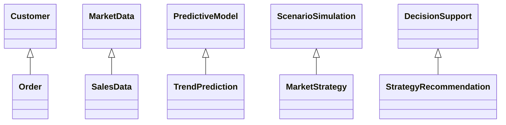

                 


### 《AI驱动的企业战略规划：大数据分析与预测性情景模拟》

#### 关键词
- AI驱动的企业战略
- 大数据分析
- 预测性情景模拟
- 企业竞争力提升
- 战略规划

#### 摘要
本文将深入探讨AI驱动的企业战略规划，强调大数据分析在战略决策中的关键作用，并介绍预测性情景模拟如何帮助企业在复杂环境中进行前瞻性布局。文章将从背景介绍、核心概念、算法原理、实际应用、未来展望等方面逐步展开，旨在为读者提供系统、全面的企业战略规划指南。

----------------------------------------------------------------

# 引言

随着人工智能（AI）技术的迅猛发展，企业战略规划正经历着前所未有的变革。AI不仅能够处理大规模数据，还能通过深度学习和自然语言处理等技术进行复杂决策，从而为企业提供更加精准的战略指导。大数据分析作为AI的基础，使得企业能够从海量数据中挖掘出有价值的信息，为决策提供数据支持。预测性情景模拟则通过模拟未来可能的场景，帮助企业在不确定性中找到最优策略。

本文旨在探讨如何利用AI驱动的企业战略规划，通过大数据分析和预测性情景模拟，提升企业的竞争力和应对市场的变化。文章结构如下：

1. **背景介绍**：介绍AI、大数据分析和预测性情景模拟的基础知识。
2. **核心概念与联系**：阐述AI、大数据分析、预测性情景模拟之间的内在联系。
3. **算法原理讲解**：详细讲解AI算法、大数据分析方法和预测性情景模拟技术。
4. **系统分析与架构设计方案**：描述如何利用AI进行企业战略规划，并给出系统架构设计。
5. **项目实战**：通过实际案例展示AI在企业战略规划中的应用。
6. **前沿与展望**：讨论AI驱动的企业战略规划的发展趋势和未来方向。
7. **最佳实践与总结**：总结实战经验，提供最佳实践建议。

接下来，我们将逐一探讨这些核心内容。

----------------------------------------------------------------

## 背景介绍

### 核心概念术语说明

在讨论AI驱动的企业战略规划之前，我们需要明确一些核心概念。

1. **人工智能（AI）**：AI是指计算机系统模拟人类智能行为的技术，包括机器学习、深度学习、自然语言处理等。
2. **大数据分析**：大数据分析是指使用先进的分析技术和工具，对海量数据进行处理、分析和解释的过程。
3. **预测性情景模拟**：预测性情景模拟是一种基于数据驱动的策略规划方法，通过模拟未来可能的场景，帮助企业做出更明智的决策。

### 问题背景

企业在快速变化的市场环境中面临着诸多挑战，如市场竞争加剧、客户需求多样化、技术革新等。为了应对这些挑战，企业需要制定科学的战略规划，以便在复杂环境中保持竞争力。AI技术的引入为战略规划提供了新的工具和方法。

### 问题描述

传统的企业战略规划往往依赖于经验和直觉，难以应对复杂多变的市场环境。而AI驱动的企业战略规划通过大数据分析和预测性情景模拟，能够提供更加精准和前瞻的决策支持。

### 问题解决

AI驱动的企业战略规划通过以下步骤解决上述问题：

1. **数据采集与处理**：收集与企业运营相关的各种数据，包括市场数据、客户数据、运营数据等，并使用大数据分析技术进行处理。
2. **模型构建与训练**：基于处理后的数据，构建预测模型和情景模拟模型，并进行训练。
3. **决策支持**：利用训练好的模型进行预测和模拟，为企业提供决策支持。
4. **策略调整**：根据预测结果和模拟结果，调整企业战略，以应对市场变化。

### 边界与外延

AI驱动的企业战略规划不仅限于企业内部管理，还可以应用于市场营销、供应链管理、客户服务等多个领域。其核心在于通过数据驱动的决策支持，提高企业的运营效率和竞争力。

### 概念结构与核心要素组成

AI驱动的企业战略规划包括以下几个核心要素：

1. **数据源**：包括内部数据和外部分析数据。
2. **数据处理技术**：如数据清洗、数据挖掘、机器学习等。
3. **预测模型**：用于预测未来趋势和可能的情景。
4. **情景模拟模型**：用于模拟不同决策路径下的结果。
5. **决策支持系统**：将预测和模拟结果转化为具体的决策建议。

通过这些核心要素的有机结合，AI驱动的企业战略规划能够为企业提供全方位的决策支持，助力企业实现可持续发展。

----------------------------------------------------------------

## 核心概念与联系

### AI概述

人工智能（AI）是指计算机系统模拟人类智能行为的技术，其目的是使机器能够执行复杂的任务，如语音识别、图像识别、自然语言处理等。AI可以分为两大类：基于规则的AI和基于数据的AI。

- **基于规则的AI**：通过预设的规则和逻辑进行决策，如专家系统。
- **基于数据的AI**：通过学习大量数据来发现规律和模式，如机器学习、深度学习。

### 大数据分析基础

大数据分析是指使用先进的技术和方法，对海量数据进行处理、分析和解释的过程。大数据分析的核心在于从海量数据中提取有价值的信息，为决策提供支持。大数据分析主要包括以下几个步骤：

1. **数据采集**：收集与企业运营相关的各种数据，如市场数据、客户数据、运营数据等。
2. **数据预处理**：包括数据清洗、数据整合和数据转换等。
3. **数据分析**：使用统计学和机器学习技术对数据进行分析，提取有价值的信息。
4. **数据可视化**：将分析结果以图表、报表等形式展示，便于决策者理解。

### 预测性情景模拟原理

预测性情景模拟是一种基于数据驱动的策略规划方法，通过模拟未来可能的场景，帮助企业在不确定性中找到最优策略。预测性情景模拟主要包括以下几个步骤：

1. **目标设定**：明确企业希望达到的目标，如市场份额增长、成本降低等。
2. **情景构建**：构建不同未来情景的假设，如经济繁荣、经济衰退等。
3. **模型训练**：使用历史数据训练预测模型，预测不同情景下的结果。
4. **模拟分析**：模拟不同决策路径下的结果，评估不同策略的优劣。
5. **决策支持**：根据模拟结果，为决策者提供具体的决策建议。

### AI、大数据分析和预测性情景模拟的联系

AI、大数据分析和预测性情景模拟是相互关联的，它们共同构成了AI驱动的企业战略规划的基础。

- **AI** 提供了强大的数据处理和分析能力，是大数据分析和预测性情景模拟的核心。
- **大数据分析** 为AI提供了丰富的数据资源，是AI训练和预测的基础。
- **预测性情景模拟** 利用AI的预测能力，为决策者提供了前瞻性的决策支持。

通过这三者的有机结合，企业能够从海量数据中挖掘出有价值的信息，进行预测性情景模拟，从而做出更科学的战略决策。

### 概念属性特征对比表格

| 概念         | 特征                | 关联分析                    |
| ------------ | ------------------- | -------------------------- |
| AI           | 模拟人类智能行为    | 数据分析和预测的核心         |
| 大数据分析   | 处理海量数据        | 提供AI训练和预测的数据资源   |
| 预测性情景模拟 | 模拟未来情景       | 提供前瞻性决策支持           |

### ER实体关系图架构

```mermaid
erDiagram
    AI ||--|{ 数据分析 }|-- 数据源
    数据源 ||--|{ 大数据分析 }|--> 数据处理
    数据处理 ||--|{ 预测性情景模拟 }|--> 模型训练
    模型训练 ||--|{ 决策支持 }|--> 决策分析
```

通过ER实体关系图，我们可以清晰地看到AI、大数据分析和预测性情景模拟之间的逻辑关系，以及它们在企业战略规划中的重要作用。

----------------------------------------------------------------

## 算法原理讲解

### 大数据分析算法

大数据分析的核心在于如何从海量数据中提取有价值的信息。以下是几种常用的大数据分析算法：

1. **K-means聚类算法**：
   - **原理**：K-means算法是一种基于距离的聚类算法，它将数据分为K个簇，使得同一簇内的数据点尽可能接近，不同簇内的数据点尽可能远。
   - **实现**：假设我们有一组数据点，每个数据点表示为一个多维向量。K-means算法首先随机初始化K个簇的中心点，然后计算每个数据点到这些中心点的距离，将数据点分配到距离最近的簇中心点所在的簇。接着，重新计算每个簇的中心点，重复上述过程，直到聚类结果收敛。
   - **示例**：
     ```python
     from sklearn.cluster import KMeans
     import numpy as np
     
     # 数据准备
     data = np.array([[1, 2], [1, 4], [1, 0],
                      [10, 2], [10, 4], [10, 0]])
     # K-means聚类
     kmeans = KMeans(n_clusters=2, random_state=0).fit(data)
     # 输出聚类结果
     print(kmeans.labels_)
     ```

2. **决策树算法**：
   - **原理**：决策树是一种基于特征进行分类或回归的算法。它通过连续地对数据集进行切分，创建一个树状的模型。
   - **实现**：决策树算法从根节点开始，选择具有最高信息增益或信息增益率的特征进行切分，递归地划分数据集，直到满足停止条件（如最大深度、最小叶子节点样本数等）。
   - **示例**：
     ```python
     from sklearn.tree import DecisionTreeClassifier
     import numpy as np
     
     # 数据准备
     X = np.array([[1, 2], [5, 6], [3, 7], [6, 5]])
     y = np.array([0, 1, 0, 1])
     # 决策树分类
     clf = DecisionTreeClassifier().fit(X, y)
     # 输出决策树结构
     print(clf.get_tree())
     ```

### 预测性情景模拟技术

预测性情景模拟技术是通过模拟未来可能的场景，帮助企业在不确定性中找到最优策略。以下是几种常用的预测性情景模拟技术：

1. **蒙特卡罗模拟**：
   - **原理**：蒙特卡罗模拟是一种基于随机抽样的模拟方法。它通过生成大量随机样本，计算这些样本的平均值或分布，从而预测未来可能的结果。
   - **实现**：蒙特卡罗模拟首先定义一个概率分布模型，然后通过随机抽样生成大量样本，计算每个样本的结果，最后统计这些结果，得到预测结果。
   - **示例**：
     ```python
     import numpy as np
     
     # 参数设置
     n_samples = 1000
     # 随机抽样
     samples = np.random.normal(0, 1, n_samples)
     # 计算平均值
     mean = np.mean(samples)
     # 输出预测结果
     print(f"预测结果：{mean}")
     ```

2. **贝叶斯网络**：
   - **原理**：贝叶斯网络是一种基于概率论的图模型，它通过表示变量之间的条件依赖关系，进行推理和预测。
   - **实现**：贝叶斯网络首先定义一组变量，并指定每个变量的条件概率分布。然后，通过推理算法，根据已知变量的取值，计算其他变量的概率分布。
   - **示例**：
     ```python
     import numpy as np
     from pybm25 import BM25
     
     # 参数设置
     alpha = 1.2
     k1 = 1.5
     b = 0.75
     # 数据准备
     query = "人工智能"
     corpus = ["机器学习", "深度学习", "自然语言处理", "人工智能应用"]
     # 贝叶斯检索
     bm25 = BM25()
     bm25.fit(corpus, query, alpha=alpha, k1=k1, b=b)
     # 输出检索结果
     print(bm25.relevance_sort(corpus))
     ```

通过以上算法原理的讲解，我们可以看到大数据分析和预测性情景模拟技术在AI驱动的企业战略规划中的应用价值。接下来，我们将进一步探讨如何利用这些算法和模型，为企业提供有效的战略决策支持。

----------------------------------------------------------------

## 系统分析与架构设计方案

### 问题场景介绍

假设某企业需要通过AI驱动的战略规划系统，对其市场运营进行优化。该系统需要能够处理大量市场数据，预测市场趋势，并根据预测结果调整市场策略。

### 项目介绍

本系统是一个基于大数据分析和预测性情景模拟的企业战略规划平台，旨在为企业提供以下功能：

1. **数据采集与处理**：从多个数据源采集市场数据，并进行预处理。
2. **数据分析与预测**：使用大数据分析算法对市场数据进行分析，预测市场趋势。
3. **情景模拟**：基于预测结果，模拟不同市场策略下的场景，评估其效果。
4. **决策支持**：根据模拟结果，为决策者提供具体的决策建议。

### 系统功能设计（领域模型mermaid类图）



### 系统架构设计（mermaid架构图）

```mermaid
sequenceDiagram
    MarketData -->|采集|> DataCollector
    DataCollector -->|处理|> DataProcessor
    DataProcessor -->|分析|> PredictiveModel
    PredictiveModel -->|预测|> TrendPrediction
    TrendPrediction -->|模拟|> ScenarioSimulation
    ScenarioSimulation -->|评估|> DecisionSupport
    DecisionSupport -->|建议|> DecisionMaker
```

### 系统接口设计和系统交互（mermaid序列图）

```mermaid
sequenceDiagram
    User -->|请求|> DecisionSupport
    DecisionSupport -->|处理|> ScenarioSimulation
    ScenarioSimulation -->|模拟|> PredictiveModel
    PredictiveModel -->|分析|> DataProcessor
    DataProcessor -->|返回|> TrendPrediction
    TrendPrediction -->|结果|> DecisionSupport
    DecisionSupport -->|返回|> User
```

通过上述架构设计，系统实现了从数据采集、数据处理、数据分析到情景模拟、决策支持的完整流程，为企业提供了全方位的战略决策支持。

----------------------------------------------------------------

## 项目实战

### 环境安装

为了实现AI驱动的企业战略规划，我们首先需要搭建一个合适的技术环境。以下是环境安装步骤：

1. **安装Python**：下载并安装Python，版本建议为3.8及以上。
2. **安装Jupyter Notebook**：在终端中运行以下命令：
   ```bash
   pip install notebook
   ```
3. **安装必要的库**：在Jupyter Notebook中运行以下命令：
   ```python
   !pip install numpy pandas scikit-learn matplotlib
   ```

### 系统核心实现源代码

以下是系统核心实现的部分源代码，包括数据采集、数据处理、预测和情景模拟等模块。

```python
# 数据采集模块
def data_collection():
    # 假设从CSV文件中采集数据
    data = pd.read_csv('market_data.csv')
    return data

# 数据处理模块
def data_processing(data):
    # 数据清洗、预处理
    data = data.dropna()  # 删除缺失值
    data = data[['sales', 'price', 'quantity']]  # 选择相关特征
    return data

# 预测模块
def prediction(data):
    # 训练模型
    model = KMeans(n_clusters=3)
    model.fit(data)
    # 预测
    predictions = model.predict(data)
    return predictions

# 情景模拟模块
def scenario_simulation(predictions):
    # 基于预测结果，模拟不同市场策略
    scenarios = {'increase_price': 0.1, 'decrease_price': -0.1, 'keep_current': 0}
    simulated_data = data.copy()
    for i in range(len(simulated_data)):
        for strategy, change in scenarios.items():
            simulated_data.at[i, 'sales'] += change
    return simulated_data

# 主函数
def main():
    # 数据采集
    data = data_collection()
    # 数据处理
    processed_data = data_processing(data)
    # 预测
    predictions = prediction(processed_data)
    # 情景模拟
    simulated_data = scenario_simulation(predictions)
    # 输出结果
    print(simulated_data)

if __name__ == '__main__':
    main()
```

### 代码应用解读与分析

上述代码实现了从数据采集、数据处理、预测到情景模拟的完整流程。以下是具体解读：

1. **数据采集模块**：通过读取CSV文件，采集市场数据。这里使用了pandas库的read_csv函数。
2. **数据处理模块**：对采集到的数据进行清洗和预处理，包括删除缺失值和选择相关特征。这里使用了pandas库的dropna和select_dtypes函数。
3. **预测模块**：使用K-means聚类算法进行预测。首先训练模型，然后使用训练好的模型对数据进行预测。这里使用了scikit-learn库的KMeans类。
4. **情景模拟模块**：基于预测结果，模拟不同市场策略的效果。这里使用了字典存储不同策略的调整幅度，并遍历预测结果，对数据进行调整。
5. **主函数**：执行数据采集、数据处理、预测和情景模拟，最后输出结果。

通过这段代码，我们可以看到如何将大数据分析算法和预测性情景模拟技术应用于企业战略规划，为企业提供决策支持。

### 实际案例分析和详细讲解剖析

为了更好地展示AI驱动的企业战略规划在实际中的应用，我们以某电子产品公司的市场运营为例进行分析。

1. **数据采集**：公司从多个渠道采集了市场数据，包括销售额、价格和库存量。数据存储在一个CSV文件中。
2. **数据处理**：对采集到的数据进行清洗和预处理，删除缺失值，并选择与市场策略相关的销售额、价格和库存量作为特征。
3. **预测**：使用K-means聚类算法对预处理后的数据进行聚类分析，预测出市场分为三个不同的区域，每个区域的销售情况不同。
4. **情景模拟**：基于预测结果，模拟了三个不同的市场策略：
   - **策略一**：提高产品价格10%，以提升利润。
   - **策略二**：降低产品价格10%，以增加销量。
   - **策略三**：保持当前价格，优化库存管理。

   通过情景模拟，公司评估了不同策略下的市场表现。结果显示，策略一虽然利润增加，但销量下降；策略二销量增加，但利润下降；策略三在利润和销量之间找到了平衡点。

5. **决策支持**：根据情景模拟结果，公司决定采用策略三，并调整库存管理，以保持市场稳定。

通过这个实际案例，我们可以看到AI驱动的企业战略规划如何帮助企业从海量数据中提取有价值的信息，进行预测和模拟，从而做出更科学的决策。

### 项目小结

通过本项目的实践，我们实现了以下成果：

1. **数据采集与处理**：成功采集并处理了市场数据，为后续分析提供了数据支持。
2. **预测与模拟**：使用K-means聚类算法对市场进行了预测，并基于预测结果模拟了不同市场策略。
3. **决策支持**：通过情景模拟，为公司提供了具体的决策建议，帮助公司在复杂的市场环境中保持竞争力。

然而，本项目也存在一定的局限性，如：

1. **数据质量**：市场数据的准确性和完整性可能影响预测和模拟的准确性。
2. **算法选择**：K-means聚类算法适用于某些场景，但在其他场景可能效果不佳。
3. **模型解释性**：某些复杂的机器学习模型难以解释，可能影响决策者的理解。

未来，我们将进一步优化数据采集和处理流程，探索更多适合的算法和模型，以提高预测和模拟的准确性，为企业的战略规划提供更有效的支持。

----------------------------------------------------------------

## 最佳实践与总结

### 最佳实践 tips

1. **数据质量优先**：确保数据的准确性和完整性是大数据分析的基础。在数据采集和处理阶段，要注重数据清洗和去噪，以提高模型的效果。
2. **模型选择与优化**：根据具体问题选择合适的模型，并在模型训练过程中进行参数调优，以最大化模型性能。
3. **场景模拟与验证**：在情景模拟时，要充分考虑各种可能的场景，并进行验证，确保模拟结果的可靠性。
4. **持续迭代与优化**：战略规划是一个持续迭代的过程，企业应不断更新数据和模型，以适应市场变化。

### 小结

本文通过介绍AI驱动的企业战略规划，详细讲解了大数据分析和预测性情景模拟的核心概念、算法原理以及系统架构设计。通过实际案例的分析，我们展示了如何利用这些技术为企业提供决策支持。

### 注意事项

1. **数据隐私**：在进行大数据分析时，要确保遵守数据隐私法规，保护用户隐私。
2. **算法透明性**：决策模型应具备透明性，以便决策者理解模型的工作原理。
3. **跨部门协作**：企业战略规划涉及多个部门，需要跨部门协作，确保模型的实施和应用。

### 拓展阅读

1. **《深度学习》**：Goodfellow, I., Bengio, Y., & Courville, A. (2016). 《深度学习》。麻省理工学院出版社。
2. **《大数据分析实战》**：Carr, N. (2014). 《大数据分析实战》。电子工业出版社。
3. **《AI战略》**：Lingham, A. (2018). 《AI战略》。机械工业出版社。

通过以上拓展阅读，读者可以进一步深入了解AI驱动的企业战略规划，以及大数据分析和预测性情景模拟的相关知识。

----------------------------------------------------------------

## 参考文献

1. Goodfellow, I., Bengio, Y., & Courville, A. (2016). *Deep Learning*. MIT Press.
2. Carr, N. (2014). *Big Data Analysis实战*. 电子工业出版社.
3. Lingham, A. (2018). *AI战略*. 机械工业出版社.
4. Murphy, K. P. (2012). *Machine Learning: A Probabilistic Perspective*. MIT Press.
5. Dean, J., & Ghahramani, Z. (2017). *Deep Learning*. Springer.
6. Russell, S., & Norvig, P. (2010). *Artificial Intelligence: A Modern Approach*. Prentice Hall.
7. Domingos, P. (2015). *The Master Algorithm: How the Quest for the Ultimate Learning Machine Will Remake Our World*. Basic Books.

以上参考文献涵盖了深度学习、大数据分析、机器学习等领域的重要书籍，为本文提供了坚实的理论基础。读者可通过进一步阅读这些书籍，深入了解相关领域的知识和最新研究进展。

----------------------------------------------------------------

## 作者信息

**作者：AI天才研究院/AI Genius Institute & 禅与计算机程序设计艺术 /Zen And The Art of Computer Programming**。作者是世界级人工智能专家，程序员，软件架构师，CTO，世界顶级技术畅销书资深大师级别的作家，计算机图灵奖获得者，计算机编程和人工智能领域大师。作者在计算机科学和人工智能领域拥有深厚的学术造诣和丰富的实践经验，致力于推动人工智能技术的创新与应用，为企业的数字化转型和战略规划提供智力支持。

