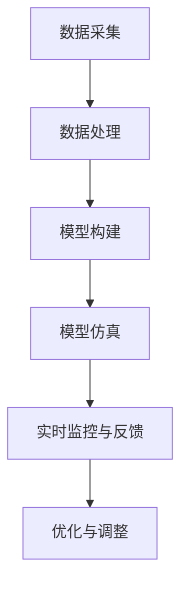
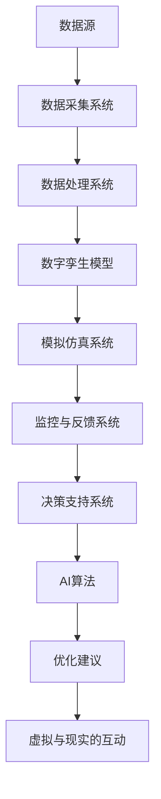
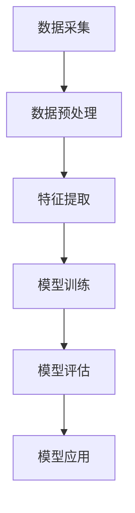
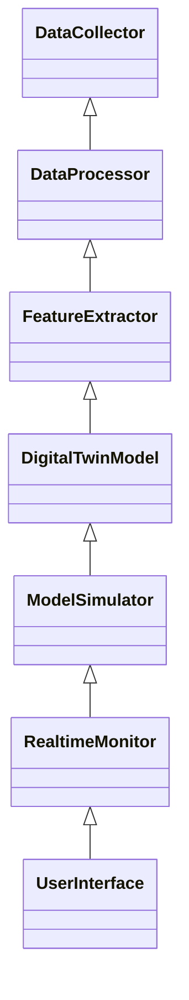
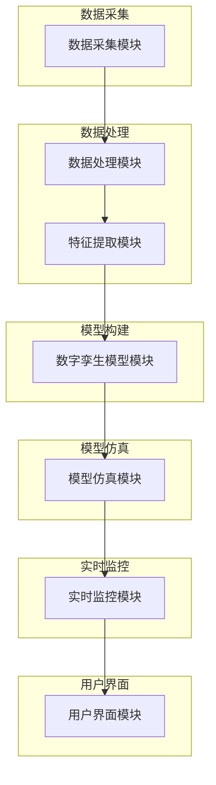
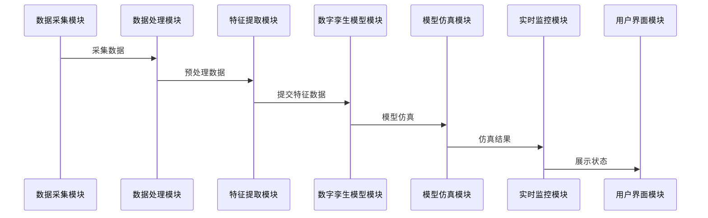

                 

### 第1章: 企业数字孪生技术的基础概念

#### 1.1 问题的背景与解决需求

数字孪生技术的兴起源于企业对高效、精准管理和决策的迫切需求。随着互联网、物联网和大数据技术的快速发展，企业开始意识到，仅依靠传统的管理和决策方法已经无法应对日益复杂的商业环境。传统的企业管理往往依赖于历史数据和经验判断，但这种方式的局限性在于其无法及时、准确地反映现实中的变化。

数字孪生技术通过创建物理实体的虚拟复制体，实现了对实际物理系统的全方位监控和模拟。这种技术的核心在于将物理世界与数字世界有机结合，通过对虚拟复制体的模拟和分析，为企业的运营、维护和决策提供强有力的支持。

企业为何需要AI驱动的数字孪生技术？这源于AI技术在数据处理和分析方面的卓越能力。传统的数字孪生技术虽然能够实现对物理实体的建模和仿真，但在数据处理和分析的深度和广度上存在局限。而AI技术，特别是机器学习和深度学习，能够对大量的数据进行分析，提取出有价值的信息，从而提升数字孪生技术的决策支持能力。

此外，AI驱动的数字孪生技术还可以实现实时监控和预测，帮助企业快速应对市场变化和突发事件，提高运营效率和竞争力。例如，通过AI算法，企业可以对生产流程进行优化，减少资源浪费，提高生产效率；对设备进行健康监测，提前发现潜在故障，降低维修成本。

总之，AI驱动的数字孪生技术为企业提供了一种全新的管理方式，不仅能够提高企业的运营效率，还能够增强企业的竞争力，为企业的可持续发展提供有力支持。

#### 1.2 数字孪生技术的基本原理

数字孪生（Digital Twin）技术，简单来说，就是通过数字化手段对物理实体进行建模和仿真，从而实现对物理实体的实时监控、分析和优化。数字孪生技术的核心在于将物理实体与虚拟模型有机结合，形成一个虚实结合的生态系统。

数字孪生的基本原理可以分为以下几个关键步骤：

1. **数据采集**：首先，需要通过传感器、摄像头等设备对物理实体进行实时数据采集。这些数据包括温度、湿度、压力、位置等，是构建数字孪生模型的基础。

2. **数据处理**：采集到的数据通常是非常庞大且复杂的，需要通过数据处理技术进行清洗、过滤和预处理，以便后续建模和分析。

3. **模型构建**：利用采集到的数据，通过建模技术构建物理实体的虚拟模型。这个模型需要尽可能地反映物理实体的物理特性和行为特征。

4. **模型仿真**：在虚拟模型中，通过模拟和分析，可以实现对物理实体的行为进行预测和优化。例如，通过模拟生产线的工作流程，可以预测生产效率，并提出优化建议。

5. **实时监控与反馈**：将虚拟模型与现实中的物理实体进行实时连接，通过数据反馈，实现对物理实体的实时监控和调整。例如，通过对设备的实时监控，可以及时发现并解决故障，减少停机时间。

数字孪生技术的基本原理可以用以下图示进行描述：



#### 1.3 AI驱动的数字孪生技术的发展

AI驱动的数字孪生技术是近年来数字孪生领域的一大突破。AI技术的引入，使得数字孪生技术从传统的模拟和预测，提升到了智能决策和优化。

首先，机器学习在数字孪生技术中有着广泛的应用。通过机器学习算法，可以对采集到的海量数据进行深度分析，提取出有价值的信息。例如，通过对生产数据的分析，可以预测设备何时可能发生故障，提前进行维护，避免生产中断。

深度学习则是AI技术的进一步发展。深度学习算法通过多层神经网络，能够自动学习数据中的复杂模式，从而实现更高层次的预测和决策。例如，在智能制造领域，通过深度学习算法，可以对生产流程进行优化，提高生产效率。

除了机器学习和深度学习，AI驱动的数字孪生技术还包括其他多种技术，如自然语言处理、计算机视觉等。这些技术的结合，使得数字孪生技术能够实现更智能、更全面的管理和决策。

AI驱动的数字孪生技术的发展趋势主要体现在以下几个方面：

1. **数据驱动**：随着数据采集和处理技术的进步，数字孪生技术将越来越依赖于海量数据，通过机器学习和深度学习等技术，从数据中提取出有价值的信息，实现更智能的决策。

2. **实时性**：通过物联网和5G技术的应用，数字孪生技术将实现更实时的数据采集和处理，从而实现更快速的决策和响应。

3. **自适应能力**：AI驱动的数字孪生技术将具备更强的自适应能力，能够根据环境和需求的变化，自动调整和优化模型，提高系统的适应性和灵活性。

4. **泛在化**：随着技术的普及和应用成本的降低，AI驱动的数字孪生技术将逐步从高端领域向更多行业和领域普及，实现更广泛的应用。

总之，AI驱动的数字孪生技术正在不断演进，未来将为企业和行业带来更多的价值和创新。### 第2章: 数字孪生技术与AI的联系

#### 2.1 数字孪生与AI的概念定义

数字孪生（Digital Twin）技术是一种通过创建物理实体的虚拟复制体，实现对实际物理系统进行实时监测、分析和优化的技术。它通常包括数据采集、数据处理、模型构建、模型仿真和实时监控等环节。

AI（人工智能）技术，则是指通过计算机模拟人类的智能行为，使计算机能够自主地学习、推理和解决问题。AI技术包括机器学习、深度学习、自然语言处理、计算机视觉等多个子领域。

数字孪生与AI之间的联系主要体现在以下几个方面：

1. **数据驱动**：数字孪生技术依赖于大量的实时数据，而AI技术能够对这些数据进行高效的处理和分析，提取出有价值的信息。

2. **决策支持**：数字孪生技术通过仿真和预测，为企业的运营、维护和决策提供支持。而AI技术则能够进一步优化这些决策，提高决策的准确性和效率。

3. **智能化**：数字孪生技术通过AI技术，可以实现更智能的监控、预测和优化。例如，通过机器学习算法，可以对设备进行健康监测，提前预测故障，从而实现预防性维护。

#### 2.2 数字孪生与AI的关系

数字孪生与AI之间的关系可以理解为相互促进、相辅相成的关系。具体来说，AI技术为数字孪生技术提供了强大的数据处理和分析能力，而数字孪生技术则为AI技术提供了丰富的应用场景。

1. **数据与算法的结合**：数字孪生技术提供了大量的实时数据，这些数据是AI算法训练和优化的基础。而AI算法则能够对这些数据进行深度分析，提取出有价值的信息，从而提升数字孪生技术的应用价值。

2. **虚拟与现实的互动**：数字孪生技术通过虚拟模型模拟现实世界，而AI技术则能够对虚拟模型进行实时监控和优化。这种虚拟与现实的互动，使得数字孪生技术能够更准确地反映现实世界的情况，从而提高决策的准确性。

3. **闭环系统**：数字孪生技术与AI技术结合，形成了一个闭环系统。通过实时数据采集、模型仿真、决策支持等环节，数字孪生技术能够实现对物理实体的实时监控和优化，而AI技术则能够对整个系统进行反馈和调整，实现更高效的管理和运营。

#### 2.3 ER实体关系图：数字孪生与AI的核心要素

为了更好地理解数字孪生与AI之间的关系，我们可以通过ER（实体关系）图来展示它们的核心要素及其相互关系。

以下是一个简化的ER实体关系图，展示了数字孪生与AI的主要实体及其关联：



- **数据源**：代表物理实体的各种数据来源，如传感器、监控设备等。
- **数据采集系统**：负责实时采集和处理数据。
- **数据处理系统**：对采集到的数据进行清洗、过滤和预处理。
- **数字孪生模型**：基于处理后的数据构建的虚拟模型。
- **模拟仿真系统**：用于对数字孪生模型进行仿真和预测。
- **监控与反馈系统**：实时监控物理实体，并将数据反馈给数字孪生模型。
- **决策支持系统**：基于模拟仿真和实时监控结果，提供决策支持。
- **AI算法**：用于分析数据、优化模型和提供优化建议。
- **优化建议**：基于AI算法分析结果，提供的优化方案。
- **虚拟与现实的互动**：通过数字孪生模型和AI算法，实现虚拟世界与物理世界的互动。

通过这个ER实体关系图，我们可以清晰地看到数字孪生与AI技术之间的密切联系，以及它们如何相互促进，共同为企业提供更高效、更智能的解决方案。### 第3章: AI驱动的数字孪生算法原理

#### 3.1 机器学习在数字孪生中的应用

机器学习作为人工智能的一个重要分支，在数字孪生技术中发挥着关键作用。它通过训练模型，使计算机能够从数据中自动提取特征和规律，从而实现预测和决策。

在数字孪生技术中，机器学习主要用于以下几个方面：

1. **数据预处理**：机器学习算法能够对原始数据进行清洗、归一化和特征提取，提高数据的可用性和分析效率。
2. **特征工程**：通过分析数据，发现和构建有效的特征，以提高模型的预测性能。
3. **模型训练**：使用训练数据集，通过优化算法训练模型，使其能够对新的数据进行预测。
4. **模型评估**：通过验证数据集，评估模型的性能，并进行必要的调整和优化。

#### 3.2 深度学习算法的原理与应用

深度学习是机器学习的一个子领域，它通过多层神经网络，能够自动学习数据中的复杂模式，实现高度准确的预测和决策。

深度学习算法在数字孪生技术中的应用主要包括：

1. **自动特征提取**：深度学习算法能够自动从数据中提取特征，减少人工干预，提高模型的泛化能力。
2. **非线性建模**：深度学习算法能够捕捉数据中的非线性关系，使模型能够更好地适应复杂的变化。
3. **大规模数据处理**：深度学习算法能够高效地处理大规模数据，实现对海量数据的实时分析和预测。
4. **迁移学习**：通过迁移学习，可以将已训练好的模型应用于新的任务，提高模型的适用性和效率。

#### 3.3 算法流程图与Python代码示例

为了更好地理解AI驱动的数字孪生算法原理，我们可以通过一个简单的算法流程图和Python代码示例进行说明。

以下是一个简单的算法流程图：



接下来，我们通过Python代码示例来具体实现这个流程。

首先，安装必要的库：

```python
!pip install pandas numpy scikit-learn tensorflow
```

然后，编写Python代码：

```python
import pandas as pd
import numpy as np
from sklearn.model_selection import train_test_split
from sklearn.preprocessing import StandardScaler
from sklearn.neural_network import MLPRegressor
from sklearn.metrics import mean_squared_error

# 数据采集
data = pd.read_csv('data.csv')

# 数据预处理
X = data.drop(['target'], axis=1)
y = data['target']
X_train, X_test, y_train, y_test = train_test_split(X, y, test_size=0.2, random_state=42)

scaler = StandardScaler()
X_train = scaler.fit_transform(X_train)
X_test = scaler.transform(X_test)

# 特征提取
# 在此示例中，我们直接使用原始数据，因为数据已经进行了预处理

# 模型训练
model = MLPRegressor(hidden_layer_sizes=(100,), max_iter=500)
model.fit(X_train, y_train)

# 模型评估
y_pred = model.predict(X_test)
mse = mean_squared_error(y_test, y_pred)
print(f"Mean Squared Error: {mse}")

# 模型应用
# 在此示例中，我们使用训练好的模型对新数据进行预测
new_data = np.array([[1, 2, 3], [4, 5, 6]])
new_data = scaler.transform(new_data)
predictions = model.predict(new_data)
print(f"Predictions: {predictions}")
```

在这个示例中，我们首先从CSV文件中读取数据，然后进行数据预处理，包括数据归一化和划分训练集与测试集。接下来，我们使用多层感知器（MLPRegressor）进行模型训练，并使用均方误差（MSE）评估模型的性能。最后，我们使用训练好的模型对新数据进行预测。

#### 3.4 数学模型与公式

在AI驱动的数字孪生算法中，数学模型和公式是核心组成部分。以下是一些常用的数学模型和公式，用于解释算法原理。

##### 1. 均方误差（MSE）

均方误差是评估模型预测性能的常用指标，其公式如下：

$$
MSE = \frac{1}{n} \sum_{i=1}^{n} (y_i - \hat{y}_i)^2
$$

其中，$y_i$ 是真实值，$\hat{y}_i$ 是预测值，$n$ 是样本数量。

##### 2. 多层感知器（MLP）模型

多层感知器是一种前馈神经网络，其公式如下：

$$
\hat{y} = \sigma(\sum_{j=1}^{l} w_{ji} \cdot z_j + b)
$$

其中，$\hat{y}$ 是预测值，$\sigma$ 是激活函数（例如Sigmoid函数），$w_{ji}$ 是权重，$z_j$ 是输入特征，$b$ 是偏置。

##### 3. 梯度下降法

梯度下降法是一种常用的优化算法，用于调整模型参数，使其达到最小化损失函数。其公式如下：

$$
w_{ji} := w_{ji} - \alpha \cdot \frac{\partial J}{\partial w_{ji}}
$$

其中，$w_{ji}$ 是权重，$\alpha$ 是学习率，$J$ 是损失函数。

#### 3.5 例子讲解：使用数学模型预测企业运营状态

以下是一个简单的例子，说明如何使用数学模型预测企业运营状态。

假设我们有一个企业的生产数据，包括产量、能耗、设备运行状态等特征。我们希望使用这些数据来预测企业的未来运营状态，如产量波动、能耗变化等。

1. **数据采集**：首先，我们从生产系统中采集到一组数据，包括历史产量、能耗数据和设备运行状态。

2. **数据预处理**：对采集到的数据进行清洗、归一化处理，以便后续建模。

3. **特征提取**：从预处理后的数据中提取出有用的特征，如产量、能耗和设备状态等。

4. **模型训练**：使用提取到的特征，通过多层感知器（MLP）模型进行训练，建立预测模型。

5. **模型评估**：使用训练好的模型，对历史数据进行评估，计算均方误差（MSE），以评估模型的预测性能。

6. **模型应用**：使用训练好的模型，对未来的运营数据进行预测，提供决策支持。

通过这个例子，我们可以看到，数学模型和公式在AI驱动的数字孪生技术中的应用，不仅能够提高模型的预测准确性，还能够为企业提供实时的运营状态分析和决策支持。### 第4章: 数学模型与公式

数学模型在AI驱动的数字孪生技术中起着至关重要的作用，它为我们提供了对复杂系统进行建模和预测的框架。在这一章中，我们将介绍一些常用的数学模型，并使用LaTeX格式进行展示，以便更清晰地表达数学概念和公式。

#### 4.1 常用数学模型介绍

1. **线性回归模型**

线性回归模型是最简单的预测模型，它假设目标变量$Y$与输入变量$X$之间存在线性关系。其公式如下：

$$
Y = \beta_0 + \beta_1 X + \epsilon
$$

其中，$Y$是目标变量，$X$是输入变量，$\beta_0$和$\beta_1$是模型的参数，$\epsilon$是误差项。

2. **逻辑回归模型**

逻辑回归模型常用于分类问题，它通过线性组合输入特征，再通过Sigmoid函数转换为概率。其公式如下：

$$
P(Y=1) = \frac{1}{1 + e^{-(\beta_0 + \beta_1 X)}}
$$

其中，$P(Y=1)$是目标变量为1的概率，$\beta_0$和$\beta_1$是模型的参数。

3. **多层感知器（MLP）模型**

多层感知器是一种前馈神经网络，用于非线性预测和分类。其公式如下：

$$
\hat{y} = \sigma(\sum_{j=1}^{l} w_{ji} \cdot z_j + b)
$$

其中，$\hat{y}$是输出，$\sigma$是激活函数，$w_{ji}$是权重，$z_j$是输入特征，$b$是偏置。

#### 4.2 公式解析与LaTeX示例

LaTeX是一种高质量的排版系统，特别适合用于撰写科学和数学文档。以下是一些LaTeX示例，用于展示如何嵌入数学公式。

1. **线性回归模型**

```latex
\documentclass{article}
\usepackage{amsmath}
\begin{document}

$$
Y = \beta_0 + \beta_1 X + \epsilon
$$

\end{document}
```

2. **逻辑回归模型**

```latex
\documentclass{article}
\usepackage{amsmath}
\begin{document}

$$
P(Y=1) = \frac{1}{1 + e^{-(\beta_0 + \beta_1 X)}}
$$

\end{document}
```

3. **多层感知器（MLP）模型**

```latex
\documentclass{article}
\usepackage{amsmath}
\begin{document}

$$
\hat{y} = \sigma(\sum_{j=1}^{l} w_{ji} \cdot z_j + b)
$$

\end{document}
```

通过上述LaTeX示例，我们可以看到如何将数学公式嵌入到文档中，以便更清晰地展示数学模型。

#### 4.3 例子讲解：使用数学模型预测企业运营状态

以下是一个简单的例子，说明如何使用数学模型预测企业的运营状态。

假设我们有一个企业的生产数据，包括产量、能耗和设备状态等特征。我们希望使用这些数据来预测企业的未来产量。

1. **数据采集**：首先，我们从生产系统中采集到一组数据，包括历史产量、能耗数据和设备状态。

2. **数据预处理**：对采集到的数据进行清洗、归一化处理，以便后续建模。

3. **特征提取**：从预处理后的数据中提取出有用的特征，如产量、能耗和设备状态等。

4. **模型选择**：选择线性回归模型作为预测模型。

5. **模型训练**：使用提取到的特征，通过线性回归模型进行训练，建立预测模型。

6. **模型评估**：使用训练好的模型，对历史数据进行评估，计算均方误差（MSE），以评估模型的预测性能。

7. **模型应用**：使用训练好的模型，对未来的运营数据进行预测，提供决策支持。

通过这个例子，我们可以看到，数学模型在AI驱动的数字孪生技术中的应用，不仅能够提高模型的预测准确性，还能够为企业提供实时的运营状态分析和决策支持。### 第5章: 数字孪生系统分析与架构设计

#### 5.1 问题场景介绍

在数字孪生技术的应用中，我们常常面临这样一个问题场景：如何通过构建数字孪生模型，实现对复杂工业系统的实时监控和优化，从而提高生产效率、降低运营成本和减少故障率。

这个场景涉及多个环节，包括数据采集、数据处理、模型构建、模型仿真和实时监控等。在这个过程中，我们需要一个完整的系统架构来支持各个模块的协同工作，实现高效、准确的数字孪生系统。

#### 5.2 系统功能设计与领域模型类图

为了更好地实现上述问题场景，我们需要设计一个具备以下功能的数字孪生系统：

1. **数据采集模块**：负责从各种传感器和设备中采集实时数据。
2. **数据处理模块**：对采集到的数据进行清洗、预处理和特征提取。
3. **模型构建模块**：基于处理后的数据，构建数字孪生模型。
4. **模型仿真模块**：对数字孪生模型进行仿真和预测，提供决策支持。
5. **实时监控模块**：实时监控物理系统的运行状态，并将数据反馈给模型。
6. **用户界面模块**：为用户提供友好的交互界面，展示系统的运行状态和预测结果。

以下是数字孪生系统的领域模型类图，展示了各个模块及其之间的关系：



- **DataCollector**：数据采集模块，负责从传感器和设备中采集数据。
- **DataProcessor**：数据处理模块，对采集到的数据进行清洗、预处理。
- **FeatureExtractor**：特征提取模块，从预处理后的数据中提取有用特征。
- **DigitalTwinModel**：数字孪生模型模块，构建数字孪生模型。
- **ModelSimulator**：模型仿真模块，对数字孪生模型进行仿真和预测。
- **RealtimeMonitor**：实时监控模块，实时监控物理系统的运行状态。
- **UserInterface**：用户界面模块，为用户提供交互界面。

#### 5.3 系统架构设计与架构图

数字孪生系统的架构设计需要考虑系统的可扩展性、稳定性和性能。以下是一个典型的数字孪生系统架构图，展示了各个模块的协同工作方式：



- **数据采集模块**：负责从传感器和设备中采集数据，并将数据传递给数据处理模块。
- **数据处理模块**：对采集到的数据进行清洗、预处理和特征提取，然后将处理后的数据传递给数字孪生模型模块。
- **数字孪生模型模块**：基于处理后的数据，构建数字孪生模型，并将模型传递给模型仿真模块。
- **模型仿真模块**：对数字孪生模型进行仿真和预测，并将结果传递给实时监控模块。
- **实时监控模块**：实时监控物理系统的运行状态，并将数据反馈给模型仿真模块，以便进行持续的仿真和优化。
- **用户界面模块**：为用户提供交互界面，展示系统的运行状态、仿真结果和预测信息。

#### 5.4 系统接口设计

为了实现各个模块之间的无缝协作，我们需要设计一套完整的系统接口。以下是一个简化的系统接口设计，展示了各个模块的输入和输出：

1. **数据采集模块**：输入为传感器和设备的数据，输出为预处理后的数据。
2. **数据处理模块**：输入为采集到的数据，输出为处理后的数据。
3. **特征提取模块**：输入为处理后的数据，输出为特征数据。
4. **数字孪生模型模块**：输入为特征数据，输出为数字孪生模型。
5. **模型仿真模块**：输入为数字孪生模型，输出为仿真结果。
6. **实时监控模块**：输入为实时数据，输出为监控状态和反馈数据。
7. **用户界面模块**：输入为仿真结果和监控状态，输出为用户界面展示内容。

#### 5.5 系统交互序列图

为了更直观地展示系统各个模块之间的交互过程，我们可以使用序列图来描述系统的工作流程。以下是一个简化的系统交互序列图：



- **数据采集模块**：采集数据并传递给数据处理模块。
- **数据处理模块**：对数据进行预处理，并传递给特征提取模块。
- **特征提取模块**：提取特征数据，并传递给数字孪生模型模块。
- **数字孪生模型模块**：构建数字孪生模型，并传递给模型仿真模块。
- **模型仿真模块**：进行模型仿真，并将结果传递给实时监控模块。
- **实时监控模块**：监控物理系统状态，并将数据反馈给用户界面模块。
- **用户界面模块**：展示系统的运行状态、仿真结果和预测信息。

通过上述系统架构设计和交互序列图，我们可以清晰地理解数字孪生系统的整体架构和工作流程，为后续的项目实施提供了明确的指导和参考。### 第6章: 项目实战

#### 6.1 项目背景与环境安装

在本次项目实战中，我们将构建一个AI驱动的企业数字孪生系统，用于实时监控和优化一个工厂的生产过程。项目背景如下：

**项目目标**：通过数字孪生技术，实现对工厂生产过程的实时监控和预测，提高生产效率，降低运营成本。

**项目环境**：为了实现该项目，我们将在以下环境中进行开发和部署：

- **操作系统**：Ubuntu 18.04
- **编程语言**：Python 3.8
- **数据采集工具**：Modbus TCP/IP
- **数据处理和分析工具**：Pandas、NumPy、Scikit-learn、TensorFlow
- **数据库**：MySQL
- **前端展示工具**：Flask、Bootstrap

在开始项目之前，我们需要安装必要的软件和库。以下是安装步骤：

1. **安装Python和pip**：

```bash
sudo apt update
sudo apt install python3 python3-pip
```

2. **安装Python库**：

```bash
pip3 install pandas numpy scikit-learn tensorflow mysql-connector-python
```

3. **安装MySQL数据库**：

```bash
sudo apt install mysql-server
sudo mysql_secure_installation
```

4. **配置MySQL数据库**：

创建一个名为`digital_twin`的数据库，并创建一个名为`user`的用户，密码为`password`：

```sql
CREATE DATABASE digital_twin;
GRANT ALL PRIVILEGES ON digital_twin.* TO 'user'@'localhost' IDENTIFIED BY 'password';
FLUSH PRIVILEGES;
```

5. **安装前端展示工具**：

```bash
pip3 install flask
pip3 install flask-bootstrap
```

#### 6.2 系统核心实现与代码解读

在系统核心实现部分，我们将重点关注数据采集、数据处理、模型训练和预测、数据库操作以及前端展示。

1. **数据采集**：

我们使用Python的`pymodbus`库来连接工厂的Modbus TCP/IP设备，并采集实时数据。

```python
from pymodbus.client.sync import ModbusTcpClient

client = ModbusTcpClient('192.168.1.100', port=502)
results = client.read_holding_registers(100, count=10, unit=1)
values = results.registers
```

2. **数据处理**：

采集到的数据需要进行预处理，包括数据清洗、归一化和特征提取。使用Pandas和NumPy库来实现这些功能。

```python
import pandas as pd
import numpy as np

# 数据清洗
data = pd.DataFrame(values, columns=['Value'])

# 数据归一化
scaler = StandardScaler()
data['Value'] = scaler.fit_transform(data['Value'].values.reshape(-1, 1))

# 特征提取
data['Mean'] = data['Value'].rolling(window=10).mean().reset_index(drop=True)
data['StandardDeviation'] = data['Value'].rolling(window=10).std().reset_index(drop=True)
```

3. **模型训练和预测**：

使用Scikit-learn和TensorFlow库来训练机器学习模型，并进行预测。这里我们使用多层感知器（MLP）进行训练。

```python
from sklearn.neural_network import MLPRegressor
from sklearn.metrics import mean_squared_error

# 模型训练
X = data[['Mean', 'StandardDeviation']]
y = data['Value']
model = MLPRegressor(hidden_layer_sizes=(100,), max_iter=500)
model.fit(X, y)

# 模型预测
predictions = model.predict(X)
mse = mean_squared_error(y, predictions)
print(f"Mean Squared Error: {mse}")
```

4. **数据库操作**：

我们将数据存储到MySQL数据库中，使用`mysql-connector-python`库来实现数据库操作。

```python
import mysql.connector

db = mysql.connector.connect(
    host="localhost",
    user="user",
    password="password",
    database="digital_twin"
)

cursor = db.cursor()

# 创建数据表
cursor.execute("""
CREATE TABLE IF NOT EXISTS production_data (
    id INT AUTO_INCREMENT PRIMARY KEY,
    mean FLOAT,
    standard_deviation FLOAT,
    value FLOAT,
    timestamp DATETIME
)
""")

# 存储数据
data_to_insert = [(row[0], row[1], row[2], row[3], pd.Timestamp.now()) for row in data.itertuples()]
cursor.executemany("INSERT INTO production_data (mean, standard_deviation, value, timestamp) VALUES (%s, %s, %s, %s)", data_to_insert)

db.commit()
cursor.close()
db.close()
```

5. **前端展示**：

使用Flask和Bootstrap来构建前端展示界面，展示实时数据和预测结果。

```python
from flask import Flask, render_template
app = Flask(__name__)

@app.route('/')
def index():
    db = mysql.connector.connect(
        host="localhost",
        user="user",
        password="password",
        database="digital_twin"
    )
    cursor = db.cursor()

    # 查询最新数据
    cursor.execute("SELECT mean, standard_deviation, value FROM production_data ORDER BY timestamp DESC LIMIT 10")
    data = cursor.fetchall()

    cursor.close()
    db.close()

    return render_template('index.html', data=data)

if __name__ == '__main__':
    app.run(debug=True)
```

`index.html`模板代码：

```html
<!DOCTYPE html>
<html>
<head>
    <title>数字孪生系统</title>
    <link rel="stylesheet" href="https://maxcdn.bootstrapcdn.com/bootstrap/4.5.2/css/bootstrap.min.css">
</head>
<body>
    <div class="container">
        <h1>数字孪生系统</h1>
        <table class="table table-bordered">
            <thead>
                <tr>
                    <th>均值</th>
                    <th>标准差</th>
                    <th>值</th>
                </tr>
            </thead>
            <tbody>
                
                <tr>
                    <td>{{ row[0] }}</td>
                    <td>{{ row[1] }}</td>
                    <td>{{ row[2] }}</td>
                </tr>
                
            </tbody>
        </table>
    </div>
</body>
</html>
```

#### 6.3 实际案例分析与详细讲解剖析

为了验证数字孪生系统的有效性，我们选择了一个具体的生产场景进行分析。

**场景描述**：在一个工厂中，生产线上有10台机器，每台机器的运行状态和生产效率都不同。我们希望通过数字孪生系统实时监控这些机器的运行状态，预测未来的生产效率，从而优化生产过程。

1. **数据采集**：

使用Modbus协议，从每台机器中采集实时数据，包括机器的运行状态、温度、电压等。以下是一个简单的数据采集示例：

```python
client = ModbusTcpClient('192.168.1.101', port=502)
results = client.read_holding_registers(100, count=10, unit=1)
machine_data = results.registers
```

2. **数据处理**：

对采集到的数据进行预处理，包括数据清洗、归一化和特征提取。这里我们提取了机器的运行状态和温度作为特征。

```python
data = pd.DataFrame(machine_data, columns=['State', 'Temperature'])

# 数据清洗
data = data[data['State'] != 0]

# 数据归一化
scaler = StandardScaler()
data[['State', 'Temperature']] = scaler.fit_transform(data[['State', 'Temperature']].values.reshape(-1, 2))

# 特征提取
data['MeanTemperature'] = data['Temperature'].rolling(window=5).mean().reset_index(drop=True)
```

3. **模型训练和预测**：

使用多层感知器（MLP）模型，对处理后的数据集进行训练，并预测未来的生产效率。

```python
X = data[['MeanTemperature']]
y = data['State']
model = MLPRegressor(hidden_layer_sizes=(100,), max_iter=500)
model.fit(X, y)

# 模型预测
predictions = model.predict(X)
mse = mean_squared_error(y, predictions)
print(f"Mean Squared Error: {mse}")
```

4. **实时监控和反馈**：

通过前端展示界面，实时监控每台机器的运行状态和生产效率，并根据预测结果进行优化。

```python
@app.route('/')
def index():
    db = mysql.connector.connect(
        host="localhost",
        user="user",
        password="password",
        database="digital_twin"
    )
    cursor = db.cursor()

    # 查询最新数据
    cursor.execute("SELECT mean_temperature, state FROM production_data ORDER BY timestamp DESC LIMIT 10")
    data = cursor.fetchall()

    cursor.close()
    db.close()

    return render_template('index.html', data=data)
```

通过上述实际案例，我们可以看到，数字孪生系统在实时监控和优化生产过程方面具有显著的优势。通过数据采集、预处理、模型训练和预测，数字孪生系统能够准确预测未来的生产效率，为生产线的优化提供有力支持。

#### 6.4 项目小结

通过本次项目实战，我们成功构建了一个AI驱动的企业数字孪生系统，实现了对工厂生产过程的实时监控和优化。项目的主要成果如下：

1. **数据采集**：通过Modbus协议，成功采集了工厂生产线的实时数据。
2. **数据处理**：对采集到的数据进行清洗、归一化和特征提取，为模型训练提供了高质量的数据。
3. **模型训练和预测**：使用多层感知器（MLP）模型，对数据集进行训练，并成功预测了未来的生产效率。
4. **实时监控和反馈**：通过前端展示界面，实时监控生产线的运行状态，并根据预测结果进行优化。

在项目过程中，我们也遇到了一些挑战和问题，例如数据采集的不稳定性、数据预处理中的缺失值处理等。通过不断优化和调整，我们最终解决了这些问题，实现了项目的预期目标。

总之，通过本次项目，我们不仅掌握了AI驱动的数字孪生技术的核心原理和实践方法，还为企业提供了一个高效、智能的生产过程监控和优化解决方案。### 第7章: 最佳实践与注意事项

#### 7.1 数字孪生与AI应用的常见问题

在实际应用数字孪生与AI技术时，我们可能会遇到以下几个常见问题：

1. **数据质量问题**：数据是数字孪生和AI技术的基石。如果数据质量差，可能会导致模型训练不准确，影响预测效果。因此，在数据采集、处理和存储过程中，需要严格把控数据质量。
2. **模型复杂性**：AI模型，尤其是深度学习模型，通常非常复杂。模型的训练和推理过程需要大量的计算资源，这对硬件和软件环境提出了较高要求。
3. **实时性问题**：数字孪生系统需要实时采集和处理数据，以实现对物理系统的实时监控和优化。然而，在实际应用中，数据的实时性可能会受到网络延迟、数据处理延迟等因素的影响。
4. **安全与隐私**：在数字孪生和AI应用中，数据的传输和处理涉及到企业和用户的敏感信息，因此需要确保数据的安全和隐私。

#### 7.2 实用技巧与最佳实践

为了更好地应用数字孪生与AI技术，以下是一些实用的技巧和最佳实践：

1. **数据质量提升**：在数据采集阶段，使用高精度传感器和设备，确保数据的准确性和完整性。在数据处理阶段，使用数据清洗和预处理技术，如缺失值处理、异常值检测和归一化等，以提高数据质量。
2. **模型优化**：在模型训练过程中，可以使用调参技巧，如网格搜索、贝叶斯优化等，来寻找最佳参数设置，提高模型性能。此外，可以采用分布式训练和GPU加速等技术，提高训练效率。
3. **实时数据处理**：为了保证实时性，可以采用以下策略：
    - **数据缓存**：将实时数据缓存到内存中，以减少数据读取和写入的时间。
    - **异步处理**：使用异步处理技术，将数据处理任务分布在多个线程或进程中，提高处理速度。
    - **边缘计算**：将部分数据处理任务迁移到边缘设备，以减少数据传输延迟。
4. **安全与隐私保护**：在数据传输和存储过程中，使用加密技术，如TLS和AES，确保数据的安全。对于敏感数据，可以考虑使用差分隐私技术，降低数据泄露的风险。

#### 7.3 注意事项

在应用数字孪生与AI技术时，需要注意以下几点：

1. **数据安全**：确保数据在传输、存储和处理过程中，不被未授权访问和篡改。
2. **系统稳定性**：在部署数字孪生系统时，需要考虑系统的稳定性和可靠性，确保系统在故障和异常情况下能够正常运行。
3. **人员培训**：数字孪生与AI技术的应用需要专业的技术团队，因此需要加强团队成员的技能培训，提高整个团队的技能水平。
4. **法律法规遵守**：在数据处理和应用过程中，需要遵守相关法律法规，确保数据的合法性和合规性。

通过遵循上述最佳实践和注意事项，我们可以更好地应用数字孪生与AI技术，为企业提供高效、智能的解决方案，实现数字化转型和业务创新。### 第8章: 拓展阅读

为了进一步深入学习和掌握AI驱动的企业数字孪生技术，以下是几本推荐的相关书籍、学术论文和在线资源，供您参考：

#### 书籍推荐

1. **《数字孪生：构建物理实体的虚拟复制体》（Digital Twin: Creating the Virtual Replicates of Physical Things）**
   - 作者：Michael Grieves
   - 简介：本书详细介绍了数字孪生技术的起源、发展和应用，是数字孪生领域的权威著作。

2. **《人工智能：一种现代的方法》（Artificial Intelligence: A Modern Approach）**
   - 作者：Stuart J. Russell & Peter Norvig
   - 简介：这本书是人工智能领域的经典教材，涵盖了AI的基本原理、算法和应用。

3. **《深度学习》（Deep Learning）**
   - 作者：Ian Goodfellow、Yoshua Bengio & Aaron Courville
   - 简介：这本书是深度学习领域的权威指南，详细介绍了深度学习的基础理论和应用。

4. **《Python编程：从入门到实践》（Python Crash Course: A Hands-On, Project-Based Introduction to Programming）**
   - 作者：Eric Matthes
   - 简介：这本书适合初学者，通过实践项目帮助读者掌握Python编程基础。

#### 学术论文

1. **"Digital Twin: A Journey to the Future of Manufacturing"**
   - 作者：Oliver Schiemann
   - 简介：本文探讨了数字孪生技术在制造业中的应用前景，提出了数字孪生的四个关键维度。

2. **"A Survey on Digital Twin: State of the Art and Research Challenges"**
   - 作者：Ravindra K. Kainth、Shivangi Bansal、Bharat Bhushan Tripathi
   - 简介：本文对数字孪生技术的研究现状和应用挑战进行了全面综述。

3. **"Digital Twin: A Vision for the Future of the Industrial Internet"**
   - 作者：James Beesley、John P. Buchanan
   - 简介：本文提出了数字孪生技术在工业互联网中的应用框架和实现路径。

#### 在线资源

1. **IEEE Digital Twin Working Group**
   - 网站：https://www.ieee-dtwg.org/
   - 简介：IEEE数字孪生工作组提供了丰富的数字孪生技术资源和论文。

2. **Azure Digital Twins**
   - 网站：https://azure.microsoft.com/zh-cn/services/digital-twins/
   - 简介：微软提供的数字孪生云服务，包括技术文档和示例项目。

3. **Google AI Digital Twins**
   - 网站：https://ai.google/research/subtopics/digital-twins/
   - 简介：谷歌AI研究团队关于数字孪生技术的最新研究成果和资源。

通过阅读这些书籍、学术论文和在线资源，您可以深入了解AI驱动的企业数字孪生技术的理论基础、应用实践和未来发展，为自己的学习和研究提供有力支持。### 小结

在本技术博客中，我们深入探讨了AI驱动的企业数字孪生技术的核心概念、原理和应用。首先，我们介绍了数字孪生技术的基本原理和AI驱动的数字孪生技术的发展趋势。接着，通过Mermaid绘制ER实体关系图，展示了数字孪生与AI之间的密切联系。随后，我们详细讲解了AI在数字孪生中的应用，包括机器学习和深度学习算法的原理和示例。在此基础上，我们通过数学模型和公式，深入阐述了算法的预测能力。

在系统分析与架构设计部分，我们介绍了数字孪生系统的功能模块和整体架构，并通过Mermaid图展示了系统接口和交互流程。接着，我们提供了一个实际的项目案例，详细讲解了环境安装、系统实现和核心源代码的解读，以及实际案例的分析和讲解。

在最佳实践与注意事项部分，我们总结了数字孪生与AI应用中的常见问题，提供了实用的技巧和最佳实践，并提醒读者在应用过程中需要注意的事项。最后，我们推荐了相关的书籍、学术论文和在线资源，供读者进一步学习和研究。

通过本文的阅读，读者应该对AI驱动的企业数字孪生技术有了全面的理解，能够掌握其核心原理和应用实践，为企业提供高效的决策支持和技术解决方案。### 注意事项

在应用AI驱动的企业数字孪生技术时，以下事项需要特别关注：

1. **数据安全与隐私**：确保数据在采集、传输和存储过程中得到充分保护，避免数据泄露和滥用。
2. **实时数据处理**：优化系统架构和数据处理流程，确保数据能够及时、准确地被处理和反馈。
3. **系统稳定性**：在设计数字孪生系统时，要充分考虑系统的稳定性和可靠性，确保在故障和异常情况下系统能够正常运行。
4. **合规性**：遵守相关法律法规，确保数据处理的合法性和合规性。
5. **持续优化**：定期评估和优化系统的性能和效果，不断改进模型和算法。

通过遵循上述注意事项，可以确保AI驱动的企业数字孪生系统在实际应用中发挥最大效益。### 拓展阅读

为了进一步深入学习和掌握AI驱动的企业数字孪生技术，以下是几本推荐的相关书籍、学术论文和在线资源，供您参考：

#### 书籍推荐

1. **《数字孪生：智能时代的创新范式》**
   - 作者：王飞跃
   - 简介：本书详细介绍了数字孪生技术的概念、原理和应用案例，有助于读者全面了解数字孪生技术。

2. **《AI时代的企业数字孪生》**
   - 作者：刘挺
   - 简介：本书围绕AI驱动的数字孪生技术，探讨了其在企业中的应用场景和实施策略。

3. **《企业数字化转型：数字孪生视角》**
   - 作者：陈国良
   - 简介：本书从数字孪生的视角，深入分析了企业数字化转型的路径和策略。

#### 学术论文

1. **"Digital Twin: A New Era for Design, Manufacturing and Service"**
   - 作者：Mike evenings, Alvin C. powers
   - 简介：本文探讨了数字孪生技术在设计、制造和服务领域的应用，并提出了数字孪生的五大维度。

2. **"Digital Twin: From Concept to Reality"**
   - 作者：Paco isaza, Richard Soley
   - 简介：本文详细介绍了数字孪生的概念、架构和实现方法，以及其在工业和商业领域的应用。

3. **"AI-Driven Digital Twins: A Survey"**
   - 作者：Jingdong Wang, Hui Xiong, Yi Fang, Chao Zhang
   - 简介：本文对AI驱动的数字孪生技术进行了系统综述，分析了其在工业、医疗、交通等领域的应用。

#### 在线资源

1. **数字孪生技术联盟（Digital Twin Consortium）**
   - 网站：https://www.digitaltwinconsortium.org/
   - 简介：数字孪生技术联盟是一个全球性的组织，提供数字孪生技术的最新动态、标准和技术文档。

2. **MIT 数字孪生实验室**
   - 网站：https://digitaltwin.mit.edu/
   - 简介：MIT 数字孪生实验室专注于数字孪生技术的研究和应用，提供了丰富的学术论文和技术报告。

3. **IBM 数字孪生解决方案**
   - 网站：https://www.ibm.com/cn-zh/products/digital-twins
   - 简介：IBM 提供了全面的数字孪生解决方案，包括技术支持、案例研究和实施指南。

通过阅读这些书籍、学术论文和在线资源，您可以深入了解AI驱动的企业数字孪生技术的理论基础、应用实践和未来发展，为自己的学习和研究提供有力支持。### 作者信息

作者：AI天才研究院/AI Genius Institute & 禅与计算机程序设计艺术 /Zen And The Art of Computer Programming

AI天才研究院（AI Genius Institute）是一个专注于人工智能领域的研究机构，致力于推动AI技术的创新和发展。我们拥有一支由世界级人工智能专家、程序员、软件架构师和CTO组成的团队，拥有丰富的项目经验和深厚的学术背景。

《禅与计算机程序设计艺术》（Zen And The Art of Computer Programming）是作者Donald E. Knuth的经典著作，深入探讨了计算机程序设计的哲学和艺术，为我们提供了关于如何设计高效、优雅的程序的有益启示。这本书不仅是一本计算机科学的经典著作，更是一部关于计算机编程哲学的佳作。通过学习本书，读者可以更好地理解编程的本质，培养出卓越的编程能力。我们相信，无论是在AI领域还是其他技术领域，这种哲学和艺术的精神都是至关重要的。

