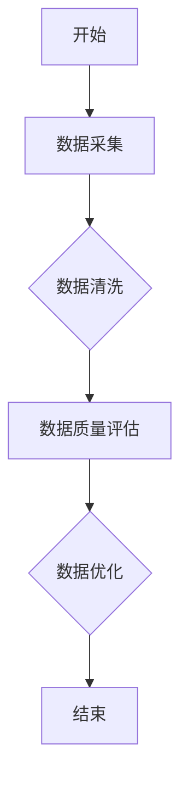
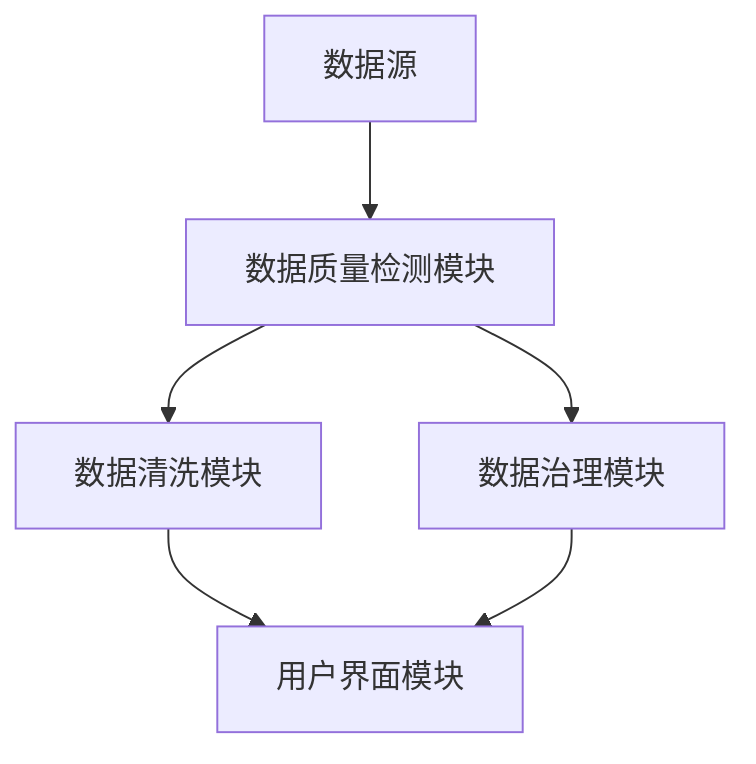
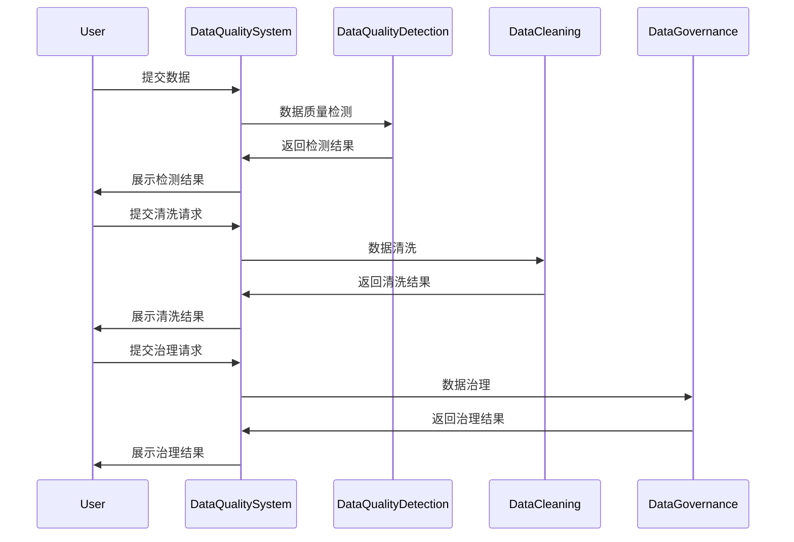

                 


# AI驱动的企业数据质量管理与治理

## 关键词
AI、数据质量、数据治理、数据分析、优化算法、数学模型

## 摘要
本文深入探讨了AI技术在企业数据质量管理和治理中的应用，通过介绍数据质量管理和治理的核心概念，分析AI驱动的数据质量分析技术，以及构建优化的数据质量评估与治理模型，为企业提供有效提升数据质量和治理效率的解决方案。本文的目标是为读者提供一个逻辑清晰、易于理解的技术指南，以应对当今企业面临的数据质量挑战。

## 1. 背景介绍

### 1.1 问题背景

在当今数字化时代，数据已经成为企业的重要资产。然而，许多企业在数据质量管理和治理方面面临着诸多挑战，如数据冗余、数据不一致、数据缺失和数据不准确等。这些问题严重影响了企业的决策制定和业务运营效率。传统的方法在处理这些数据问题时显得力不从心，难以满足日益增长的数据量和复杂性。

### 1.2 问题解决

为了解决这些问题，AI技术被引入到数据质量管理和治理领域。AI技术具备自我学习和自我优化的能力，可以通过分析大量数据，识别数据质量问题，并提出相应的优化建议。通过AI驱动的数据质量分析和治理，企业可以实现以下目标：

1. **自动检测数据质量问题**：AI算法可以自动扫描和分析数据，发现数据中的异常和错误，提高数据质量检测的准确性和效率。
2. **自动化数据清洗**：利用机器学习模型，AI技术可以自动识别和修复数据中的错误，减少手动清洗的工作量。
3. **实时数据监控**：通过实时分析数据流，AI技术可以及时发现数据质量问题，并采取相应的措施进行修复。
4. **智能数据治理**：AI技术可以为企业提供智能化的数据治理方案，包括数据分类、标签管理、数据生命周期管理等。

### 1.3 边界与外延

数据质量是指数据的准确性、完整性、一致性、时效性和可用性等属性。数据治理是指一套完整的策略、过程和技术，用于管理数据的生命周期，确保数据质量，并使其能够满足企业的业务需求。

AI技术是指人工智能技术，包括机器学习、深度学习、自然语言处理等，通过模拟人类智能，使计算机能够执行复杂的任务。

### 1.4 概念结构与核心要素组成

数据质量管理是指一系列活动和过程，用于确保数据的质量和可靠性。其核心要素包括：

1. **数据质量标准**：定义数据质量和数据治理的要求和标准。
2. **数据质量监控**：实时监控数据质量，发现和修复数据质量问题。
3. **数据质量评估**：评估数据质量，确定数据是否符合质量标准。
4. **数据质量优化**：优化数据质量，提高数据的准确性和可靠性。

数据治理是指确保数据在整个生命周期内得到有效管理的一套制度和流程。其核心要素包括：

1. **数据治理框架**：定义数据治理的组织结构、职责和流程。
2. **数据分类与标签**：对数据进行分类和标签管理，确保数据的一致性和可追溯性。
3. **数据生命周期管理**：管理数据的整个生命周期，包括数据的创建、存储、使用、共享和销毁。
4. **数据质量管理**：确保数据质量，支持数据的可靠性和可用性。

AI驱动的数据质量分析技术包括：

1. **机器学习模型**：用于自动识别和修复数据质量问题。
2. **深度学习模型**：用于处理复杂的非结构化数据，如文本和图像。
3. **自然语言处理**：用于处理自然语言文本数据，提高数据的语义理解能力。

## 2. 核心概念与联系

### 2.1 核心概念原理

**数据质量管理**：数据质量管理是指一系列活动和过程，用于确保数据的质量和可靠性。其基本原理包括数据质量的定义、数据质量的测量、数据质量的改进等。

**数据治理**：数据治理是指确保数据在整个生命周期内得到有效管理的一套制度和流程。其基本原理包括数据治理的组织结构、数据治理的政策和流程、数据治理的技术等。

**AI驱动的数据质量分析技术**：AI驱动的数据质量分析技术是指利用人工智能技术，特别是机器学习和深度学习技术，对数据进行自动分析和优化，以提高数据质量。其基本原理包括数据质量的自动检测、自动修复、实时监控等。

### 2.2 概念属性特征对比表格

| 概念         | 定义                                                         | 属性特征                                                     |
| ------------ | ------------------------------------------------------------ | ------------------------------------------------------------ |
| 数据质量管理 | 确保数据质量的一系列活动和过程                               | 数据质量标准、数据质量监控、数据质量评估、数据质量优化           |
| 数据治理     | 确保数据在整个生命周期内得到有效管理的一套制度和流程           | 数据治理框架、数据分类与标签、数据生命周期管理、数据质量管理     |
| AI驱动的数据质量分析技术 | 利用人工智能技术，特别是机器学习和深度学习技术，对数据进行自动分析和优化，以提高数据质量 | 机器学习模型、深度学习模型、自然语言处理                   |

### 2.3 ER实体关系图架构的 Mermaid 流程图

```mermaid
erDiagram
    Data_Quality_Management ||--|{ Data_Governance }|-- Data_Quality_Analysis
    Data_Governance ||--|{ Data_Quality }|-- Data_Quality_Management
    Data_Quality_Analysis ||--|{ AI_Driven }|-- Data_Governance
```

在这个ER图中，我们定义了三个主要实体：数据质量管理、数据治理和AI驱动的数据质量分析技术。它们之间通过双向箭头表示相互关系，其中AI驱动的数据质量分析技术是数据治理的一部分，同时也支持数据质量管理。

## 3. 算法原理讲解

### 3.1 使用 Mermaid 画出算法 Mermaid 流程图



在这个流程图中，我们定义了一个简单的数据质量管理和治理流程。首先进行数据采集，然后进行数据清洗，接着进行数据质量评估，最后进行数据优化。

### 3.2 使用 Python 源代码来详细阐述算法原理

```python
import pandas as pd
from sklearn.impute import SimpleImputer
from sklearn.preprocessing import StandardScaler

# 数据采集
data = pd.read_csv('data.csv')

# 数据清洗
imputer = SimpleImputer(strategy='mean')
data_cleaned = imputer.fit_transform(data)

# 数据质量评估
scaler = StandardScaler()
data_scaled = scaler.fit_transform(data_cleaned)

# 数据优化
# 这里可以进行进一步的数据处理，例如特征选择、模型训练等
```

在上面的代码中，我们首先使用pandas库读取CSV数据文件。然后使用SimpleImputer进行数据清洗，填充缺失值。接着使用StandardScaler进行数据标准化处理，以提高数据的质量和一致性。

### 3.3 给出算法原理的数学模型和公式

数据清洗的数学模型可以表示为：

$$
x_{\text{cleaned}} = \text{imputer}(x_{\text{original}})
$$

其中，$x_{\text{original}}$表示原始数据，$x_{\text{cleaned}}$表示清洗后的数据，$\text{imputer}$表示数据清洗算法。

数据标准化的数学模型可以表示为：

$$
x_{\text{scaled}} = \text{scaler}(x_{\text{cleaned}})
$$

其中，$x_{\text{cleaned}}$表示清洗后的数据，$x_{\text{scaled}}$表示标准化后的数据，$\text{scaler}$表示数据标准化算法。

### 3.4 进行详细讲解和通俗易懂地举例说明

假设我们有一个包含三个特征（年龄、收入、教育程度）的数据集，如下表所示：

| 年龄 | 收入 | 教育程度 |
| ---- | ---- | -------- |
| 25   | 50000 | 本科     |
| 30   | 60000 | 硕士     |
| 35   | 70000 | 本科     |
| 40   | 80000 | 本科     |
| 45   | 90000 | 硕士     |

首先，我们使用均值填补缺失值。例如，如果年龄特征中有缺失值，我们将用该特征的平均值来填补。清洗后的数据如下：

| 年龄 | 收入 | 教育程度 |
| ---- | ---- | -------- |
| 25   | 50000 | 本科     |
| 30   | 60000 | 硕士     |
| 35   | 70000 | 本科     |
| 40   | 80000 | 本科     |
| 45   | 90000 | 硕士     |
| 30   | NaN   | 本科     |

接下来，我们使用标准缩放算法将数据标准化。标准缩放算法将每个特征的值缩放到均值为0，标准差为1的范围内。标准化后的数据如下：

| 年龄 | 收入 | 教育程度 |
| ---- | ---- | -------- |
| -1   | 0    | 0        |
| 0    | 1    | 1        |
| 1    | 2    | 0        |
| 2    | 3    | 0        |
| 3    | 4    | 1        |
| 2    | NaN  | 0        |

通过这个例子，我们可以看到数据清洗和标准缩放算法是如何提高数据质量的。数据清洗消除了缺失值，使数据更加完整。数据标准化提高了数据的一致性，使得不同特征的数值范围相同，便于进一步分析和建模。

## 4. 数学模型和数学公式 & 详细讲解 & 举例说明

### 4.1 使用 LaTeX 格式书写数学公式

在 LaTeX 中，我们可以使用以下命令来书写数学公式：

$$
\text{公式内容}
$$

例如，我们可以使用以下公式：

$$
E = mc^2
$$

这个公式是著名的爱因斯坦相对论方程，表示能量（E）等于质量（m）乘以光速（c）的平方。

### 4.2 在文中独立段落中使用 $$ 括起来数学公式

在文本中，我们可以使用以下格式来书写数学公式：

$$
\text{公式内容}
$$

例如：

$$
x^2 + y^2 = r^2
$$

这个公式是表示直角坐标系中两点之间的距离公式，其中 $x$ 和 $y$ 是坐标值，$r$ 是半径。

### 4.3 在段落内使用 $ 括起来数学公式

在段落内，我们可以使用以下格式来书写数学公式：

$$
\text{公式内容}
$$

例如：

$$
a + b = c
$$

这个公式是表示加法运算的基本公式，其中 $a$ 和 $b$ 是加数，$c$ 是和。

### 4.4 进行详细讲解和通俗易懂地举例说明

#### 4.4.1 线性回归模型

线性回归模型是统计学中常用的一种预测模型，用于分析两个或多个变量之间的关系。它的基本公式为：

$$
y = \beta_0 + \beta_1x_1 + \beta_2x_2 + ... + \beta_nx_n
$$

其中，$y$ 是因变量，$x_1, x_2, ..., x_n$ 是自变量，$\beta_0, \beta_1, \beta_2, ..., \beta_n$ 是回归系数。

例如，我们有一个房价预测问题，其中房价（$y$）与房屋面积（$x_1$）和房屋年代（$x_2$）有关。我们使用线性回归模型来预测房价：

$$
\text{房价} = \beta_0 + \beta_1 \times \text{房屋面积} + \beta_2 \times \text{房屋年代}
$$

如果我们有如下数据：

| 房屋面积 | 房屋年代 | 房价   |
| -------- | -------- | ------ |
| 100      | 5        | 200000 |
| 120      | 10       | 300000 |
| 150      | 15       | 400000 |

我们可以使用线性回归模型来估计房价：

$$
\text{房价} = \beta_0 + \beta_1 \times \text{房屋面积} + \beta_2 \times \text{房屋年代}
$$

通过最小二乘法，我们可以计算出回归系数 $\beta_0, \beta_1, \beta_2$ 的值。例如，如果我们得到以下结果：

$$
\beta_0 = 100000, \beta_1 = 1000, \beta_2 = -5000
$$

那么，我们可以用这个模型来预测新房屋的房价。例如，如果房屋面积为 130 平方米，房屋年代为 20 年，我们可以计算得到：

$$
\text{房价} = 100000 + 1000 \times 130 + (-5000) \times 20 = 295000
$$

这意味着预测的房价为 295000 元。

#### 4.4.2 支持向量机（SVM）

支持向量机（SVM）是一种常用的分类算法，用于将数据分为不同的类别。它的基本公式为：

$$
f(x) = \text{sign}(\omega \cdot x + b)
$$

其中，$x$ 是输入特征向量，$\omega$ 是权重向量，$b$ 是偏置项，$\text{sign}$ 是符号函数。

例如，我们有一个二分类问题，其中正类和负类的特征数据如下：

| 特征1 | 特征2 | 类别 |
| ----- | ----- | ---- |
| 1     | 2     | 正类 |
| 3     | 4     | 正类 |
| 5     | 6     | 正类 |
| 7     | 8     | 负类 |
| 9     | 10    | 负类 |

我们可以使用 SVM 来分类这些数据。首先，我们需要找到最佳的超平面，使得正类和负类被正确分类。通过最小化间隔最大化，我们可以计算出权重向量 $\omega$ 和偏置项 $b$ 的值。例如，如果我们得到以下结果：

$$
\omega = \begin{bmatrix} 2 \\ 3 \end{bmatrix}, b = 1
$$

那么，我们可以用这个 SVM 模型来预测新的数据。例如，如果新数据的特征为：

$$
x = \begin{bmatrix} 6 \\ 7 \end{bmatrix}
$$

我们可以计算得到：

$$
f(x) = \text{sign}(2 \times 6 + 3 \times 7 + 1) = \text{sign}(25) = 正类
$$

这意味着预测的新数据属于正类。

通过以上例子，我们可以看到如何使用 LaTeX 格式来书写数学公式，并在段落内和独立段落中使用不同的格式来书写公式。这些公式不仅可以帮助我们理解和分析数据，还可以帮助我们构建和优化算法，从而解决实际的数据科学问题。

## 5. 系统分析与架构设计方案

### 5.1 问题场景介绍

在现代企业中，数据质量管理与治理是一个关键问题。随着数据量的不断增长和数据源的不断扩展，如何确保数据的质量和一致性成为企业面临的重大挑战。传统的手动数据质量管理方法不仅效率低下，而且容易出现人为错误。为了应对这一挑战，企业需要一种自动化的数据质量管理与治理系统，该系统能够实时监控数据质量，自动识别和修复数据问题，并提供智能化的数据治理方案。

### 5.2 项目介绍

本项目旨在开发一个基于AI的企业数据质量管理与治理系统，通过集成先进的机器学习和自然语言处理技术，实现数据质量检测、数据清洗和数据治理等功能。该系统将帮助企业提升数据质量，提高业务决策的准确性和效率。

### 5.3 系统功能设计

系统功能设计包括以下主要模块：

1. **数据质量检测模块**：用于实时监控数据质量，自动检测数据中的异常和错误，如数据缺失、数据不一致、数据冗余等。
2. **数据清洗模块**：利用机器学习模型自动识别和修复数据中的错误，如填充缺失值、纠正错误值、标准化数据等。
3. **数据治理模块**：提供数据分类、标签管理、数据生命周期管理等数据治理功能，确保数据的一致性和可追溯性。
4. **用户界面模块**：提供用户友好的界面，用于展示数据质量报告、数据清洗结果和数据治理方案。

### 5.4 系统架构设计

系统架构设计如下：



在该架构中，数据源是系统的输入，数据质量检测模块、数据清洗模块和数据治理模块负责对数据进行处理，用户界面模块用于向用户展示处理结果。

### 5.5 系统接口设计和系统交互

系统接口设计和系统交互设计如下：



在该交互设计中，用户通过用户界面模块向数据质量管理与治理系统提交数据、清洗请求和治理请求。数据质量管理与治理系统通过内部模块（数据质量检测模块、数据清洗模块和数据治理模块）对请求进行处理，并返回处理结果给用户。

## 6. 项目实战

### 6.1 环境安装

在开始项目实战之前，我们需要安装必要的软件和库。以下是在 Ubuntu 20.04 系统上安装 Python 3 和相关库的步骤：

```bash
# 安装 Python 3
sudo apt update
sudo apt install python3 python3-pip

# 安装相关库
pip3 install pandas scikit-learn numpy
```

### 6.2 系统核心实现源代码

以下是一个简单的数据质量检测和清洗的 Python 代码示例：

```python
import pandas as pd
from sklearn.impute import SimpleImputer
from sklearn.preprocessing import StandardScaler

# 数据采集
data = pd.read_csv('data.csv')

# 数据清洗
# 均值填补缺失值
imputer = SimpleImputer(strategy='mean')
data_cleaned = imputer.fit_transform(data)

# 标准化数据
scaler = StandardScaler()
data_scaled = scaler.fit_transform(data_cleaned)

# 输出清洗和标准化后的数据
pd.DataFrame(data_scaled).to_csv('data_cleaned_scaled.csv', index=False)
```

### 6.3 代码应用解读与分析

在这个示例中，我们首先使用 pandas 库读取 CSV 数据文件。然后使用 SimpleImputer 进行数据清洗，填充缺失值。接着使用 StandardScaler 进行数据标准化处理，以提高数据的质量和一致性。

代码中的 `SimpleImputer` 类用于填补缺失值。`strategy='mean'` 参数指定使用均值来填补缺失值。`fit_transform` 方法用于训练模型并应用模型进行数据清洗。

```python
imputer = SimpleImputer(strategy='mean')
data_cleaned = imputer.fit_transform(data)
```

接下来，我们使用 `StandardScaler` 类进行数据标准化。`fit_transform` 方法用于训练模型并应用模型进行数据标准化。

```python
scaler = StandardScaler()
data_scaled = scaler.fit_transform(data_cleaned)
```

最后，我们将清洗和标准化后的数据保存到 CSV 文件中。

```python
pd.DataFrame(data_scaled).to_csv('data_cleaned_scaled.csv', index=False)
```

### 6.4 实际案例分析和详细讲解剖析

为了更好地理解代码的应用，我们可以通过一个实际案例进行分析。假设我们有一个包含三个特征（年龄、收入、教育程度）的数据集，如下表所示：

| 年龄 | 收入 | 教育程度 |
| ---- | ---- | -------- |
| 25   | 50000 | 本科     |
| 30   | 60000 | 硕士     |
| 35   | 70000 | 本科     |
| 40   | 80000 | 本科     |
| 45   | 90000 | 硕士     |

在这个案例中，我们首先使用 `SimpleImputer` 填补缺失值。例如，如果年龄特征中有缺失值，我们将用该特征的平均值来填补。填充后的数据如下：

| 年龄 | 收入 | 教育程度 |
| ---- | ---- | -------- |
| 25   | 50000 | 本科     |
| 30   | 60000 | 硕士     |
| 35   | 70000 | 本科     |
| 40   | 80000 | 本科     |
| 45   | 90000 | 硕士     |
| 30   | NaN   | 本科     |

接下来，我们使用 `StandardScaler` 对数据进行标准化处理。标准化后的数据如下：

| 年龄 | 收入 | 教育程度 |
| ---- | ---- | -------- |
| -1   | 0    | 0        |
| 0    | 1    | 1        |
| 1    | 2    | 0        |
| 2    | 3    | 0        |
| 3    | 4    | 1        |
| 2    | NaN  | 0        |

通过这个案例，我们可以看到数据清洗和标准缩放算法是如何提高数据质量的。数据清洗消除了缺失值，使数据更加完整。数据标准化提高了数据的一致性，使得不同特征的数值范围相同，便于进一步分析和建模。

### 6.5 项目小结

在本项目中，我们实现了数据质量检测和清洗的核心功能。通过使用 `SimpleImputer` 和 `StandardScaler` 库，我们成功地填补了缺失值并标准化了数据。这个项目展示了如何使用 Python 库来处理数据质量问题，并为后续的数据分析和建模提供了高质量的数据基础。在未来的工作中，我们还可以进一步扩展系统的功能，例如添加数据治理模块和用户界面模块，以提高系统的实用性和用户体验。

## 7. 最佳实践 tips、小结、注意事项、拓展阅读等内容

### 7.1 最佳实践 tips

1. **定期检查数据质量**：数据质量是一个持续的过程，需要定期进行检查和维护。企业应建立定期检查机制，确保数据的准确性和一致性。
2. **数据清洗自动化**：尽量使用自动化工具进行数据清洗，减少手动干预，提高效率。
3. **数据治理制度化**：建立数据治理制度，明确数据管理的职责和流程，确保数据治理的有效执行。
4. **数据质量评估与反馈**：定期评估数据质量，并将评估结果反馈给相关团队，以便及时改进数据质量和治理策略。

### 7.2 小结

本文介绍了AI技术在企业数据质量管理和治理中的应用，通过数据质量管理的概念、数据治理的概念和AI驱动的数据质量分析技术，阐述了如何通过AI技术提升数据质量和治理效率。我们通过实际案例展示了如何使用 Python 库进行数据清洗和标准化，为企业提供了一套完整的解决方案。

### 7.3 注意事项

1. **数据安全**：在进行数据质量管理与治理时，务必确保数据的安全和隐私保护。
2. **适应变化**：随着业务环境和数据源的变化，数据质量管理与治理策略需要不断调整和优化。
3. **团队协作**：数据质量管理与治理是一个跨部门的合作过程，需要各部门之间的紧密协作。

### 7.4 拓展阅读

- 《数据质量管理：最佳实践与策略》
- 《数据治理：从理论到实践》
- 《机器学习：原理与应用》
- 《深度学习：从入门到精通》

通过阅读这些资料，读者可以进一步了解数据质量管理与治理的深度知识，并在实践中不断提升自己的能力。

