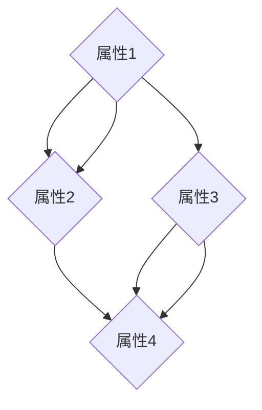
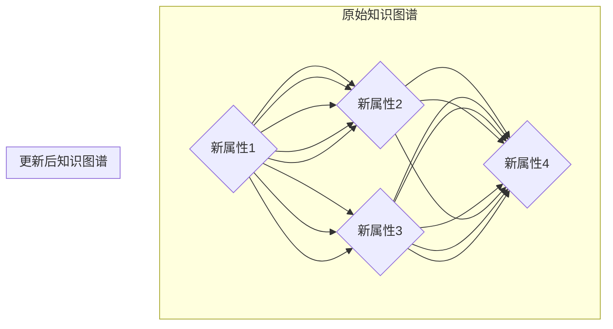
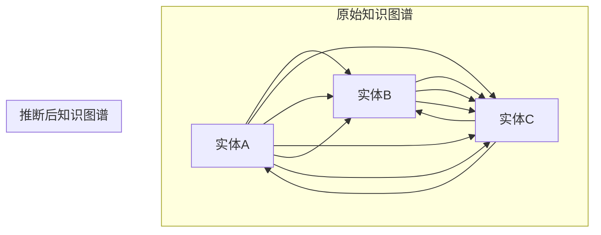

                 


# AI驱动的企业知识图谱：动态更新与智能推理机制

## 关键词：AI、知识图谱、动态更新、智能推理、企业应用

> 摘要：本文将探讨AI驱动的企业知识图谱的构建与应用，重点分析动态更新与智能推理机制在知识图谱中的关键作用。通过详细的案例分析，我们将理解知识图谱在企业决策支持、智能化服务等方面的实际应用价值。

## 引言与背景

### 1.1 书籍概述

随着信息技术的飞速发展，大数据、云计算、物联网等技术的广泛应用，企业面临着前所未有的数据爆炸和信息泛滥。在这种背景下，知识图谱作为一种结构化的语义网络，逐渐成为企业智能化转型的重要工具。

**问题背景**：企业知识图谱在AI时代的意义

知识图谱可以帮助企业将海量的非结构化数据转化为结构化信息，实现数据的高效管理和利用。在AI时代，知识图谱与人工智能技术相结合，能够为企业提供更加智能化、个性化的解决方案。

**问题描述**：如何构建和更新企业知识图谱

构建企业知识图谱的关键在于如何有效地组织和表示数据，以及如何动态更新以适应企业的变化需求。此外，智能推理机制在知识图谱中的应用，也是提升其价值的重要手段。

**问题解决**：动态更新与智能推理机制在知识图谱中的应用

本文将介绍动态更新与智能推理机制在知识图谱中的具体实现方法，并通过实际案例展示其在企业中的应用效果。

**边界与外延**：知识图谱的范围与关联技术

知识图谱不仅涵盖了数据管理和语义网络，还与自然语言处理、机器学习、图数据库等技术密切相关。本文将探讨这些技术的相互关系及其在企业知识图谱中的应用。

### 1.2 核心概念

#### 知识图谱的定义

知识图谱（Knowledge Graph）是一种用于表达实体及其之间关系的语义网络。它通过节点表示实体，边表示实体之间的关系，以及属性表示实体的特征。

#### AI驱动的知识图谱

AI驱动的知识图谱是指在知识图谱构建和更新过程中，引入人工智能技术，如自然语言处理、机器学习等，以实现自动化和智能化。

#### 动态更新与智能推理机制

动态更新是指知识图谱能够根据数据源的变化，实时调整实体和关系的信息。智能推理机制则利用知识图谱中的逻辑关系，进行推理和预测，为企业提供决策支持。

### 1.3 书籍结构

本文将分为以下几个部分：

1. 引言与背景
2. 知识图谱的基本概念
3. AI驱动的知识图谱
4. 动态更新的知识图谱机制
5. 智能推理机制
6. 实际案例分析
7. 知识图谱在企业的应用实践
8. 总结与展望

通过以上章节的阐述，读者将全面了解AI驱动的企业知识图谱的构建与应用，掌握动态更新与智能推理机制的核心技术。

## 知识图谱的基本概念

### 2.1 知识图谱的起源与发展

知识图谱（Knowledge Graph）的概念最早由Google在2012年提出，其目的是为了更好地理解网络上的信息，并为其搜索引擎提供更加智能的搜索结果。Google知识图谱通过将实体、属性和关系表示为三元组（Subject-Predicate-Object），构建了一个庞大的语义网络。

知识图谱的发展经历了从最初的图数据库到语义网络，再到现代基于深度学习的知识图谱的演变。早期的知识图谱主要依赖于手工编写的规则和领域知识，而现代知识图谱则通过大规模的数据挖掘和机器学习技术，实现了自动化和智能化。

### 2.2 知识图谱的组成部分

知识图谱通常由以下几个主要组成部分构成：

1. **实体（Entity）**：知识图谱中的基本元素，表示现实世界中的个体或对象，如人、地点、组织、物品等。
2. **关系（Relationship）**：实体之间的联系，表示实体之间的语义关联，如“属于”、“居住于”、“生产”等。
3. **属性（Attribute）**：实体的特征描述，如人的年龄、地点的纬度、物品的价格等。
4. **分类（Classification）**：实体所属的类别或分类，如“人”的分类包括“学生”、“医生”、“工人”等。

### 2.3 知识图谱的类型与应用场景

知识图谱可以分为以下几种类型：

1. **结构化知识图谱**：基于关系型数据库构建，如Facebook的Open Graph和Google的知识图谱。
2. **语义网络**：基于图数据库构建，如Apache Jena和Neo4j。
3. **基于深度学习的知识图谱**：利用深度学习技术构建，如BERT和GPT。

不同的知识图谱类型适用于不同的应用场景：

1. **搜索引擎**：通过结构化知识图谱提供更加精准的搜索结果。
2. **推荐系统**：利用语义网络进行实体推荐，如商品推荐、用户推荐等。
3. **自然语言处理**：基于深度学习知识图谱进行文本理解和生成。

### 2.4 知识图谱的关键技术

知识图谱的关键技术包括：

1. **实体识别（Entity Recognition）**：通过自然语言处理技术，从文本中识别出实体。
2. **关系抽取（Relation Extraction）**：从文本中抽取实体之间的语义关系。
3. **实体链接（Entity Linking）**：将文本中的实体与知识图谱中的实体进行关联。
4. **实体分类（Entity Classification）**：对实体进行分类，以丰富知识图谱的结构。
5. **知识融合（Knowledge Fusion）**：将不同来源的知识进行整合，提高知识图谱的完整性。

### 2.5 知识图谱的概念结构

为了更好地理解知识图谱，我们可以用ER（Entity-Relationship）图来表示其概念结构。以下是一个简单的知识图谱ER图示例：

```mermaid
erDiagram
    Class::Person ||--|{ Class::Organization : worksFor }
    Class::Person ||--|{ Class::Location : bornIn }
    Class::Location ||--|{ Class::Location : parent }
    Class::Organization ||--|{ Class::Industry : belongsTo }
```

在这个ER图中，`Class::Person` 表示人这一实体，`worksFor` 和 `bornIn` 表示实体之间的关系，`Location` 和 `Organization` 分别表示地点和组织实体，`parent` 和 `belongsTo` 表示地点和组织的分类关系。

### 2.6 知识图谱的核心要素组成

知识图谱的核心要素包括：

1. **实体**：知识图谱中的基本单元，如人、地点、物品等。
2. **关系**：实体之间的语义关联，如“属于”、“居住于”、“生产”等。
3. **属性**：实体的特征描述，如人的年龄、地点的纬度、物品的价格等。
4. **分类**：实体所属的类别或分类，如“人”的分类包括“学生”、“医生”、“工人”等。
5. **标签**：实体的额外属性，如人的职业、兴趣等。

这些核心要素共同构成了知识图谱的语义网络，为后续的动态更新与智能推理提供了基础。

## AI驱动的知识图谱

### 3.1 AI在知识图谱中的应用

人工智能（AI）技术在知识图谱构建和更新中发挥着重要作用。以下是一些主要的应用：

1. **实体识别与分类**：利用自然语言处理技术，从文本中自动识别和分类实体。
2. **关系抽取**：通过机器学习算法，从非结构化文本中抽取实体之间的语义关系。
3. **实体链接**：将文本中的实体与知识图谱中的实体进行关联，提高数据一致性。
4. **知识融合**：利用深度学习技术，将不同来源的知识进行整合，提高知识图谱的完整性。
5. **智能推理**：利用知识图谱中的逻辑关系，进行推理和预测，为决策提供支持。

### 3.2 AI驱动的知识图谱构建方法

AI驱动的知识图谱构建方法主要包括以下几个步骤：

1. **数据采集与清洗**：从多种数据源（如文本、图像、音频等）中采集数据，并进行数据清洗，去除噪声和冗余。
2. **实体识别与分类**：利用自然语言处理技术，对文本进行分词、词性标注等预处理，然后使用机器学习算法进行实体识别和分类。
3. **关系抽取**：通过训练好的模型，从预处理后的文本中抽取实体之间的语义关系。
4. **实体链接**：利用实体识别和分类的结果，将文本中的实体与知识图谱中的实体进行关联。
5. **知识融合**：将不同来源的知识进行整合，构建一个完整、一致的知识图谱。
6. **动态更新**：根据数据源的变化，实时调整知识图谱中的实体和关系信息。

### 3.3 AI驱动的知识图谱更新机制

AI驱动的知识图谱更新机制主要包括以下几种：

1. **增量更新**：只更新知识图谱中发生变化的部分，提高更新效率。
2. **全量更新**：重新构建整个知识图谱，确保数据的完整性和一致性。
3. **智能更新**：利用机器学习算法，根据数据源的变化，自动调整知识图谱的结构和内容。

增量更新和全量更新各有优缺点，增量更新适用于数据变化频繁的场景，而全量更新则适用于数据稳定、更新频率较低的场景。智能更新则结合了两种方法的优势，通过机器学习算法，实现更高效、更智能的知识图谱更新。

### 3.4 AI驱动的知识图谱示例

以下是一个简单的AI驱动的知识图谱示例：



在这个示例中，A、B、C和D表示实体，它们之间存在关系。属性1、属性2、属性3和属性4表示实体的特征描述。

通过AI驱动的知识图谱构建方法，我们可以将这个简单的示例扩展为一个复杂的知识图谱，包含大量的实体、关系和属性。

## 动态更新的知识图谱机制

### 4.1 动态更新需求分析

在知识图谱的应用过程中，数据源和业务场景往往会发生动态变化。为了保持知识图谱的实时性和准确性，需要引入动态更新机制。以下是一些常见的动态更新需求：

1. **数据源更新**：如企业数据库、社交媒体、传感器数据等，这些数据源可能会实时发生变化，导致知识图谱中的实体和关系需要更新。
2. **业务场景变化**：如企业战略调整、市场环境变化等，可能导致知识图谱的结构和内容发生变化。
3. **用户反馈**：用户对知识图谱的使用反馈，如建议、错误报告等，可能需要调整知识图谱中的数据。
4. **知识融合**：将来自不同来源的知识进行整合，提高知识图谱的完整性和一致性。

### 4.2 动态更新策略

为了实现知识图谱的动态更新，可以采用以下几种策略：

1. **增量更新**：只更新知识图谱中发生变化的部分，减少计算和存储开销。适用于数据变化频繁的场景。
2. **全量更新**：重新构建整个知识图谱，确保数据的完整性和一致性。适用于数据稳定、更新频率较低的场景。
3. **智能更新**：利用机器学习算法，根据数据源的变化，自动调整知识图谱的结构和内容。适用于复杂、动态变化的场景。

### 4.3 动态更新算法

动态更新算法是实现知识图谱动态更新的核心技术。以下是一些常见的动态更新算法：

1. **基于版本控制的更新算法**：通过维护知识图谱的版本信息，实现增量更新。如Git图数据库，通过版本控制实现知识图谱的增量更新。
2. **基于图论算法的更新算法**：利用图论算法，如广度优先搜索、深度优先搜索等，实现知识图谱的增量更新。如Neo4j图数据库，使用广度优先搜索实现知识图谱的增量更新。
3. **基于机器学习的更新算法**：利用机器学习算法，如分类、聚类、关联规则挖掘等，实现知识图谱的智能更新。如基于深度学习的知识图谱更新算法，通过模型预测实现知识图谱的动态调整。

### 4.4 动态更新流程

动态更新流程通常包括以下几个步骤：

1. **数据采集**：从数据源中采集变化的数据。
2. **数据预处理**：对采集到的数据进行清洗、转换等预处理操作。
3. **版本控制**：维护知识图谱的版本信息，记录每次更新的版本号。
4. **更新计算**：根据更新策略和算法，计算知识图谱中需要更新的实体和关系。
5. **数据更新**：将计算得到的结果更新到知识图谱中。
6. **版本发布**：发布新的知识图谱版本，供用户使用。

### 4.5 动态更新示例

以下是一个简单的动态更新示例：

假设知识图谱中有两个实体A和B，它们之间存在关系R。当实体A发生变化时，需要更新知识图谱。



在这个示例中，实体A发生了变化，新增了属性1和属性2。通过动态更新算法，更新后的知识图谱包含了这些变化的信息。

## 智能推理机制

### 5.1 智能推理的概念与类型

智能推理（Intelligent Reasoning）是一种基于知识和逻辑推理的技术，旨在从已知信息中推断出新的知识。在知识图谱中，智能推理机制能够利用实体之间的关系和属性，进行推理和预测，为企业提供决策支持。

根据推理方法的不同，智能推理可以分为以下几种类型：

1. **演绎推理**：从一般性的前提推导出具体的结论，如“所有人都有生命，张三是人，因此张三有生命”。
2. **归纳推理**：从具体的实例推导出一般性的结论，如“观察到的天鹅都是白色的，因此所有天鹅都是白色的”。
3. **类比推理**：通过比较两个相似的情况，推断出新的结论，如“人类社会和动物社会有相似之处，因此可以借鉴动物社会的规律来研究人类社会”。
4. **基于规则的推理**：利用预定义的规则进行推理，如“如果天气晴朗，那么可以户外运动”。
5. **基于模型的推理**：利用机器学习模型进行推理，如“给定用户的偏好数据，推荐相应的商品”。

### 5.2 智能推理在知识图谱中的应用

智能推理在知识图谱中的应用主要体现在以下几个方面：

1. **实体识别**：利用知识图谱中的关系和属性，识别出文本中的实体。
2. **关系抽取**：从非结构化文本中抽取实体之间的语义关系。
3. **实体链接**：将文本中的实体与知识图谱中的实体进行关联。
4. **知识融合**：将不同来源的知识进行整合，提高知识图谱的完整性。
5. **推理和预测**：利用知识图谱中的逻辑关系，进行推理和预测，为决策提供支持。

### 5.3 智能推理算法

智能推理算法是实现智能推理的核心技术。以下是一些常见的智能推理算法：

1. **基于规则的推理算法**：利用预定义的规则进行推理，如演绎推理、归纳推理和类比推理等。
2. **基于模型的推理算法**：利用机器学习模型进行推理，如神经网络、决策树、支持向量机等。
3. **基于知识的推理算法**：利用知识图谱中的知识进行推理，如基于本体论的方法、基于语义网络的方法等。
4. **基于逻辑的推理算法**：利用逻辑推理规则进行推理，如命题逻辑、谓词逻辑等。

### 5.4 智能推理流程

智能推理流程通常包括以下几个步骤：

1. **数据预处理**：对输入数据进行清洗、转换等预处理操作，提取出关键信息。
2. **实体识别**：利用知识图谱中的实体信息，识别出文本中的实体。
3. **关系抽取**：从文本中抽取实体之间的语义关系。
4. **实体链接**：将文本中的实体与知识图谱中的实体进行关联。
5. **推理和预测**：利用知识图谱中的逻辑关系和算法模型，进行推理和预测，生成新的知识。
6. **结果输出**：将推理结果输出，供用户使用。

### 5.5 智能推理示例

以下是一个简单的智能推理示例：

假设知识图谱中有两个实体A和B，它们之间存在关系R。当给定一个新的实体C时，需要推断出C与A、B之间的关系。



在这个示例中，根据知识图谱中的关系R，可以推断出实体C与实体A、B之间存在关系R。通过智能推理算法，可以自动完成这种推理过程。

## 实际案例分析

### 6.1 案例背景

本案例选取了一家大型电子商务公司，该公司希望通过构建AI驱动的企业知识图谱，实现商品推荐、客户服务和业务智能分析等目标。

### 6.2 案例分析

#### 6.2.1 数据采集

该电子商务公司从多个数据源（如用户行为日志、商品信息、客户反馈等）采集数据，用于构建知识图谱。

#### 6.2.2 数据预处理

对采集到的数据进行清洗、去重、转换等预处理操作，提取出关键信息，如用户、商品、评价、购买行为等。

#### 6.2.3 实体识别

利用自然语言处理技术，识别出文本中的实体，如用户、商品、地点等。

#### 6.2.4 关系抽取

通过机器学习算法，从预处理后的文本中抽取实体之间的语义关系，如“购买”、“评价”、“推荐”等。

#### 6.2.5 实体链接

将文本中的实体与知识图谱中的实体进行关联，确保数据的一致性和完整性。

#### 6.2.6 知识融合

将来自不同数据源的知识进行整合，构建一个完整、一致的企业知识图谱。

#### 6.2.7 动态更新

采用增量更新策略，根据数据源的变化，实时调整知识图谱中的实体和关系信息。

#### 6.2.8 智能推理

利用知识图谱中的逻辑关系和算法模型，进行推理和预测，为商品推荐、客户服务和业务智能分析等提供支持。

### 6.3 案例总结与反思

通过本案例，我们可以看到AI驱动的企业知识图谱在电子商务公司中的应用效果。知识图谱不仅实现了商品推荐、客户服务和业务智能分析等功能，还提高了数据的一致性和完整性。然而，在实际应用中，我们也需要关注以下几点：

1. **数据质量**：高质量的数据是构建知识图谱的基础，需要加强对数据采集、预处理和更新的管理。
2. **动态更新**：知识图谱需要具备动态更新的能力，以适应企业不断变化的需求。
3. **智能推理**：智能推理算法的选择和优化对知识图谱的应用效果至关重要。
4. **用户反馈**：及时收集用户反馈，调整知识图谱的结构和内容，提高用户体验。

## 知识图谱在企业的应用实践

### 7.1 企业知识图谱的应用价值

企业知识图谱作为一种高效的数据组织和语义表示方法，具有以下应用价值：

1. **数据整合**：将来自不同数据源的信息进行整合，实现数据的一致性和完整性。
2. **智能推荐**：基于用户行为、偏好和历史数据，实现个性化商品推荐、客户服务和营销活动。
3. **业务智能**：利用知识图谱进行业务智能分析，优化供应链管理、市场策略和运营决策。
4. **风险控制**：通过对企业内外部数据的实时监测和分析，识别潜在风险，提高风险管理能力。
5. **知识共享**：构建企业内部的统一知识库，促进知识共享和团队协作，提高工作效率。

### 7.2 企业知识图谱的实施步骤

要实施企业知识图谱，一般需要遵循以下步骤：

1. **需求分析**：明确企业知识图谱的目标和应用场景，确定数据源和业务需求。
2. **数据采集**：从多个数据源采集数据，进行清洗、去重和转换等预处理操作。
3. **实体识别与分类**：利用自然语言处理技术，从文本中识别出实体，并进行分类。
4. **关系抽取**：通过机器学习算法，从预处理后的文本中抽取实体之间的语义关系。
5. **实体链接**：将文本中的实体与知识图谱中的实体进行关联，确保数据的一致性和完整性。
6. **知识融合**：将不同来源的知识进行整合，构建一个完整、一致的企业知识图谱。
7. **动态更新**：根据数据源的变化，实时调整知识图谱中的实体和关系信息。
8. **智能推理**：利用知识图谱中的逻辑关系和算法模型，进行推理和预测，为企业提供决策支持。

### 7.3 企业知识图谱的维护与优化

企业知识图谱的维护与优化是确保其长期有效运行的关键。以下是一些维护与优化的策略：

1. **数据质量管理**：定期检查数据质量，确保数据的一致性和准确性。
2. **动态更新机制**：采用增量更新和全量更新的策略，根据数据源的变化，及时调整知识图谱。
3. **智能推理优化**：对智能推理算法进行优化，提高推理的准确性和效率。
4. **用户反馈**：收集用户反馈，调整知识图谱的结构和内容，提高用户体验。
5. **知识库扩展**：根据业务需求，不断扩展知识库的内容，提高知识图谱的覆盖范围。

通过以上策略，企业知识图谱可以更好地服务于企业的业务需求，提高企业的竞争力。

## 总结与展望

### 8.1 书籍总结

本文详细介绍了AI驱动的企业知识图谱的构建与应用，重点分析了动态更新与智能推理机制在知识图谱中的关键作用。通过实际案例分析，我们理解了知识图谱在企业决策支持、智能化服务等方面的实际应用价值。

### 8.2 知识图谱发展的未来趋势

随着人工智能技术的不断进步，知识图谱将在以下几个方面取得突破：

1. **智能化**：利用深度学习、强化学习等人工智能技术，实现知识图谱的智能化构建和更新。
2. **多模态**：结合文本、图像、音频等多模态数据，构建更加全面的知识图谱。
3. **实时性**：通过实时数据流处理技术，实现知识图谱的实时更新和推理。
4. **协作与共享**：构建企业间、行业内的知识图谱共享平台，实现知识图谱的协作与共享。

### 8.3 进一步研究建议

针对知识图谱的发展，我们可以从以下几个方面进行深入研究：

1. **算法优化**：研究更加高效、准确的智能推理算法，提高知识图谱的应用效果。
2. **数据质量**：探索数据质量管理的方法和技术，确保知识图谱的数据质量。
3. **隐私保护**：研究知识图谱中的隐私保护机制，确保用户数据的隐私安全。
4. **跨领域应用**：探讨知识图谱在不同领域（如医疗、金融、教育等）的应用，拓展其应用场景。
5. **开放与共享**：构建知识图谱的开放平台，促进知识图谱的共享与合作，推动知识图谱的普及和发展。

作者：AI天才研究院/AI Genius Institute & 禅与计算机程序设计艺术 /Zen And The Art of Computer Programming

## 最佳实践 Tips

1. **数据采集与预处理**：确保数据源的可靠性和数据质量，采用合理的预处理方法，如数据清洗、去重和转换等。
2. **实体识别与分类**：使用先进的技术，如自然语言处理和机器学习，提高实体识别和分类的准确性。
3. **关系抽取**：采用多种关系抽取算法，如基于规则、基于统计和基于深度学习的方法，提高关系抽取的全面性和准确性。
4. **智能推理**：根据业务需求，选择合适的智能推理算法，如基于规则的推理、基于模型的推理和基于知识的推理等。
5. **动态更新**：采用增量更新和智能更新的策略，根据数据源的变化，实时调整知识图谱的结构和内容。

## 小结

本文详细介绍了AI驱动的企业知识图谱的构建与应用，从核心概念、动态更新、智能推理到实际案例分析，全面阐述了知识图谱在企业中的重要作用。通过本文的学习，读者可以掌握知识图谱的关键技术和应用实践，为企业的智能化转型提供有力支持。

## 注意事项

1. **数据安全**：在知识图谱构建和应用过程中，确保用户数据的隐私和安全。
2. **系统性能**：关注知识图谱系统的性能优化，提高数据处理和查询效率。
3. **持续更新**：定期对知识图谱进行更新和优化，以适应企业发展的需求。

## 拓展阅读

1. **《知识图谱：关键技术、应用与实践》**：详细介绍了知识图谱的基本概念、关键技术、应用实践等。
2. **《深度学习与知识图谱》**：探讨深度学习技术在知识图谱构建中的应用。
3. **《企业知识图谱：构建与应用》**：提供企业知识图谱的构建方法和应用案例。

通过阅读以上书籍，读者可以更深入地了解知识图谱的原理和应用，为实际项目的实施提供参考。

