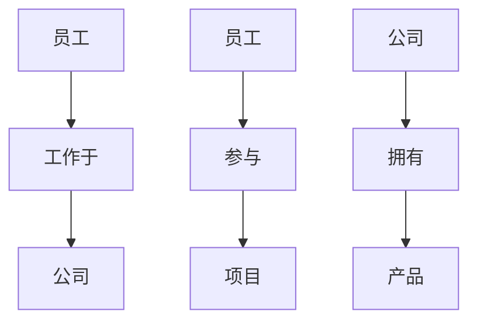
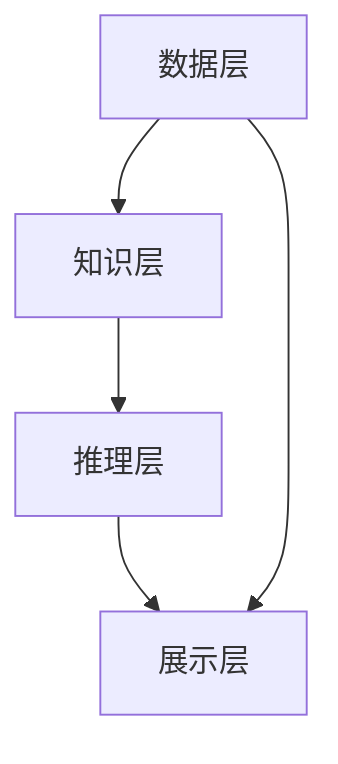
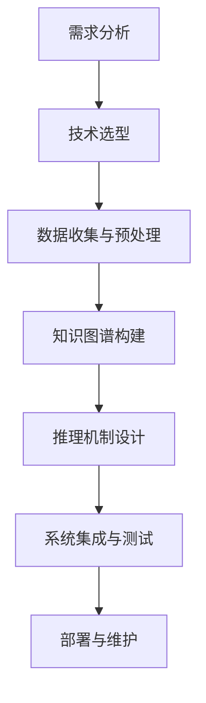

                 

### 第一部分: 背景介绍

#### 1.1 问题背景

随着数字化转型的浪潮席卷全球，企业面临着数据爆炸式增长、决策复杂化和业务变革的多重挑战。在这种背景下，传统的数据处理方法已经无法满足企业对高效、准确和智能决策的需求。知识图谱作为一种新兴的技术手段，以其强大的知识组织和管理能力，为企业提供了一种全新的解决方案。

知识图谱（Knowledge Graph）是一种基于网络结构的知识表示方法，它通过实体（Entities）、属性（Attributes）和关系（Relationships）来组织信息，构建一个语义网络。在企业中，知识图谱可以用来整合各类数据资源，形成一套完整、动态和可扩展的知识体系，从而提高数据的利用效率和决策质量。

企业的数据通常来源广泛，包括内部数据（如ERP系统、CRM系统、HR系统等）和外部数据（如社交媒体、新闻、行业报告等）。这些数据分散在不同的系统中，形式多样，结构各异。传统的数据处理方法往往难以有效地整合和利用这些数据，导致信息孤岛现象严重，影响了企业的整体运营效率和决策能力。

同时，随着业务的不断拓展和竞争的加剧，企业的决策过程变得越来越复杂。企业需要快速、准确地获取和利用相关信息，以便做出科学的决策。然而，传统的数据分析和挖掘方法往往依赖于人工干预，效率低下，难以满足企业对实时性和智能化的要求。

因此，构建一个高效、动态的企业知识图谱，实现知识的自动化获取、构建与智能推理，成为企业数字化转型中亟待解决的重要问题。

#### 1.2 问题描述

在本章中，我们将深入探讨如何利用人工智能（AI）技术构建企业知识图谱，实现知识的自动化获取、构建与智能推理。具体问题描述如下：

1. **知识自动化获取**：如何在大量的企业数据中，通过AI技术提取和整合知识？这涉及到数据清洗、实体识别、关系抽取等多个步骤，需要利用自然语言处理、机器学习等技术实现。

2. **知识图谱构建**：如何构建一个高效、动态的企业知识图谱？这需要设计合适的知识表示方法、选择合适的数据存储和处理技术，并确保知识图谱的可扩展性和实时更新。

3. **智能推理机制**：如何在企业知识图谱上进行智能推理，以支持企业的决策？这涉及到推理算法的设计、推理过程的管理和优化，以及推理结果的解释和可视化。

这些问题的解决不仅需要深入理解AI技术和知识图谱的基本原理，还需要结合企业的具体业务场景和需求，提出切实可行的解决方案。

#### 1.3 问题解决

为了解决上述问题，本书将采用以下方法：

1. **介绍AI驱动的企业知识图谱构建原理和方法**：首先，我们将介绍知识图谱的核心概念，包括实体、属性和关系的定义，以及它们在企业知识图谱中的应用。接着，我们将探讨如何利用AI技术进行实体识别、属性抽取和关系挖掘，从而实现知识的自动化获取。

2. **阐述企业知识图谱的自动化构建与智能推理机制**：在这一部分，我们将介绍知识图谱的构建过程，包括数据预处理、实体和关系的抽取、知识融合和推理机制的设计。同时，我们将探讨如何利用自然语言处理、机器学习等技术，实现知识图谱的自动化构建与智能推理。

3. **通过案例实战，展示如何在实际企业场景中应用知识图谱技术**：最后，我们将通过具体的案例，展示如何将知识图谱技术应用到企业的实际业务场景中，如智能客服、智能推荐、供应链优化等。通过这些案例，我们将详细介绍知识图谱技术在企业中的应用方法和效果。

通过这些方法，我们将为企业提供一套完整的AI驱动的企业知识图谱构建与智能推理解决方案，帮助企业实现知识的自动化获取、构建与智能推理，从而提升企业的决策质量和运营效率。

#### 1.4 边界与外延

在探讨AI驱动的企业知识图谱构建与智能推理机制时，有必要明确本文的讨论边界和外延。

**边界**：

1. **技术范围**：本文主要关注基于AI驱动的企业知识图谱构建与智能推理，不涉及其他类型的知识图谱，如学术领域中的科研知识图谱、地理信息领域的地理知识图谱等。

2. **应用场景**：本文讨论的企业知识图谱构建与智能推理主要针对企业内部应用，如企业内部知识管理、智能客服、智能推荐、供应链优化等。对于企业外部应用，如智慧城市、智能交通等，本文将不进行详细探讨。

**外延**：

1. **应用范围**：知识图谱的应用范围非常广泛，不仅限于企业内部，还可以扩展到跨企业的行业知识图谱、跨领域的通用知识图谱等。本文将在适当章节中简要介绍知识图谱在不同领域的应用。

2. **技术演进**：随着AI技术的不断演进，企业知识图谱的构建与智能推理方法也将不断更新和优化。本文将关注当前主流的技术和方法，同时也会探讨一些前沿的研究方向和应用案例。

通过明确讨论的边界和外延，我们可以更好地把握本文的研究方向和内容，为读者提供有价值的参考和指导。

#### 1.5 概念结构与核心要素组成

在深入探讨AI驱动的企业知识图谱构建与智能推理机制之前，我们需要明确几个关键概念和核心要素。这些概念和要素构成了企业知识图谱的基本框架，是理解和应用知识图谱的基础。

##### 1.5.1 关键概念

**知识图谱**：知识图谱是一种结构化的知识表示方法，通过实体、属性和关系来组织信息。实体表示具体的事物，如人、地点、组织等；属性表示实体的特征，如姓名、年龄、职位等；关系表示实体之间的关联，如工作于、属于等。知识图谱通过构建一个语义网络，实现了信息的语义理解和关联推理。

**AI驱动**：AI驱动是指利用人工智能技术，如深度学习、自然语言处理、图神经网络等，自动构建和推理知识图谱。AI驱动的知识图谱构建方法可以大幅提高知识的自动化获取、整合和推理能力，从而提升企业的知识管理水平和决策质量。

**实体识别**：实体识别是从非结构化或半结构化数据中提取出重要实体的过程。通过自然语言处理技术和机器学习算法，可以从文本、语音、图像等多种数据源中识别出实体，为知识图谱的构建提供基础数据。

**属性抽取**：属性抽取是从数据源中提取出实体属性的过程。属性抽取可以帮助我们更全面地描述实体，提高知识图谱的丰富度和准确性。

**关系挖掘**：关系挖掘是从数据源中识别出实体之间关系的过程。关系挖掘可以帮助我们构建起实体的语义关联，实现知识的关联推理。

**推理机制**：推理机制是指在企业知识图谱上实现智能推理的算法和策略。通过推理机制，我们可以从已有的知识中推导出新的结论，支持企业的决策和业务运营。

##### 1.5.2 核心要素

**数据源**：数据源是企业知识图谱构建的基础。数据源包括企业内部数据（如ERP系统、CRM系统、HR系统等）和外部数据（如社交媒体、新闻、行业报告等）。数据源的类型和丰富度直接影响知识图谱的构建质量和应用效果。

**实体识别**：实体识别是知识图谱构建的第一步，它决定了知识图谱的基本粒度。通过实体识别，我们可以从各种数据源中提取出关键实体，为后续的属性抽取和关系挖掘提供基础。

**属性抽取**：属性抽取是描述实体特征的过程。通过属性抽取，我们可以获取到实体的详细信息，为知识图谱的构建提供丰富的属性信息。

**关系挖掘**：关系挖掘是构建知识图谱的核心步骤，它建立了实体之间的语义关联。通过关系挖掘，我们可以发现实体之间的隐含关系，为知识图谱的推理机制提供基础。

**知识融合**：知识融合是将来自不同数据源和不同格式的知识整合到一个统一的知识体系中的过程。知识融合可以提高知识图谱的完整性和一致性，从而提升知识图谱的可用性和可靠性。

**推理机制**：推理机制是知识图谱的核心功能，它通过逻辑推理和关联分析，从已有的知识中推导出新的结论。推理机制可以帮助企业实现智能化决策，提升业务运营效率。

通过明确关键概念和核心要素，我们可以更好地理解企业知识图谱的构建与智能推理机制，为后续章节的详细探讨奠定基础。

##### 1.5.3 本章小结

本章介绍了AI驱动的企业知识图谱构建的背景、问题描述、问题解决方法、边界与外延，以及核心概念和要素组成。通过对企业知识图谱及其核心概念的深入理解，我们为后续章节的详细探讨奠定了基础。下一章将深入探讨AI驱动的企业知识图谱中的核心概念与联系。

---

# 第二部分: AI驱动的企业知识图谱核心概念与联系

## 2.1 核心概念原理

在深入探讨AI驱动的企业知识图谱构建方法之前，我们需要先明确知识图谱中的核心概念，这些概念构成了知识图谱的基础框架。核心概念主要包括实体（Entities）和关系（Relationships）。

### 2.1.1 实体

实体是知识图谱中的基本元素，它表示具体的事物，如人、地点、组织等。实体可以是具体的对象，也可以是抽象的概念。

**定义**：实体是具有明确标识符的事物，它可以是一个单独的对象，也可以是一个具有共同特征的集合。

**属性特征对比表格**：

| 实体类型 | 属性1    | 属性2    | 属性3    |
|----------|---------|---------|---------|
| 人       | 姓名    | 年龄    | 职业    |
| 地点     | 名称    | 类型    | 经纬度  |
| 组织     | 名称    | 成立时间 | 主营业务 |

- **姓名**：人的名称，是唯一标识一个实体的关键属性。
- **年龄**：人的年龄，用于描述实体的年龄特征。
- **职业**：人的职业，用于描述实体的工作性质。
- **名称**：地点的名称，是唯一标识一个实体的关键属性。
- **类型**：地点的类型，如城市、国家等。
- **经纬度**：地点的地理坐标，用于描述地点的具体位置。
- **名称**：组织的名称，是唯一标识一个实体的关键属性。
- ** 成立时间**：组织的成立时间，用于描述组织的历史。
- **主营业务**：组织的主营业务，用于描述组织的业务范围。

### 2.1.2 关系

关系是实体之间的联系，它表示实体之间的语义关联。关系可以是直接的，也可以是间接的，通过多层关系可以实现复杂的语义理解。

**定义**：关系是实体之间的语义关联，它描述了实体之间的逻辑关系，如“工作于”、“属于”等。

**ER实体关系图架构**：



- **工作于**：表示员工与公司之间的关系。
- **参与**：表示员工与项目之间的关系。
- **拥有**：表示公司与产品之间的关系。

## 2.2 概念属性特征对比表格

为了更好地理解实体和关系的属性特征，我们可以通过一个对比表格进行详细说明。

| 概念 | 属性1 | 属性2 | 属性3 |
| ---- | ---- | ---- | ---- |
| 实体 | 名称  | 类型  | 描述  |
| 关系 | 名称  | 类型  | 描述  |

- **实体**：
  - **名称**：唯一标识实体的字符串。
  - **类型**：实体所属的类别，如“人”、“地点”、“组织”等。
  - **描述**：对实体进行进一步描述的文本信息。

- **关系**：
  - **名称**：唯一标识关系的字符串。
  - **类型**：关系的分类，如“工作于”、“属于”等。
  - **描述**：对关系进行进一步描述的文本信息。

## 2.3 ER实体关系图架构

通过ER实体关系图，我们可以直观地理解实体和关系之间的关联。下面是一个简化的ER实体关系图架构：


在这个图中：
- **员工**与**公司**之间通过**工作于**关系相连。
- **员工**与**项目**之间通过**参与**关系相连。
- **公司**与**产品**之间通过**拥有**关系相连。

这种关系结构使得知识图谱能够有效地表示和存储企业的知识，为后续的知识融合和推理提供基础。

## 2.4 本章小结

本章详细介绍了AI驱动的企业知识图谱中的核心概念——实体和关系，并给出了属性特征对比表格和ER实体关系图架构。通过对实体和关系的深入理解，我们为后续的知识图谱构建方法提供了理论基础。下一章将探讨如何通过AI技术自动构建企业知识图谱。

---

# 第三部分: AI驱动的企业知识图谱构建方法

## 3.1 数据预处理

数据预处理是企业知识图谱构建过程中的关键步骤，它直接影响知识图谱的质量和效率。数据预处理主要包括数据收集、数据清洗和数据标准化。

### 3.1.1 数据收集

数据收集是企业知识图谱构建的第一步，数据源的选择和质量直接影响知识图谱的构建效果。数据源可以分为内部数据源和外部数据源。

- **内部数据源**：内部数据源主要包括企业内部的业务系统数据，如ERP系统、CRM系统、HR系统等。这些数据是企业日常运营的重要记录，包括客户信息、销售数据、员工信息等。内部数据源的优势在于数据的真实性和完整性，但往往数据量有限，且格式多样。

- **外部数据源**：外部数据源主要包括互联网上的公开数据，如社交媒体数据、新闻数据、行业报告等。这些数据可以提供丰富的背景信息和市场动态，帮助企业更好地了解外部环境。外部数据源的优势在于数据的多样性和丰富性，但数据质量参差不齐，存在噪声和误差。

### 3.1.2 数据清洗

数据清洗是数据预处理的核心步骤，其目标是去除数据中的噪声和错误，确保数据的准确性和一致性。数据清洗的主要任务包括去重、补全和标准化。

- **去重**：去重是指从数据集中去除重复的记录。重复数据的存在会导致实体和关系的重复，影响知识图谱的质量。去重可以通过比较实体的唯一标识（如姓名、身份证号等）来实现。

- **补全**：补全是指补充数据中的缺失值。缺失数据会影响知识图谱的完整性和准确性。补全可以通过多种方法实现，如均值填充、中值填充、插值等方法。

- **标准化**：标准化是指统一数据格式和单位，确保数据的一致性。例如，将不同来源的日期格式统一为YYYY-MM-DD格式，将不同单位的价格统一为同一货币单位等。

### 3.1.3 数据标准化

数据标准化是数据清洗的重要环节，通过标准化可以统一不同数据源的格式，确保数据在知识图谱中的统一表示。数据标准化的主要内容包括：

- **字段标准化**：对数据中的字段进行统一命名和定义，确保不同数据源的字段具有相同的含义和格式。例如，统一命名员工姓名字段为“name”，员工年龄字段为“age”等。

- **值标准化**：对数据中的值进行统一处理，确保相同属性的值具有相同的表示方法。例如，将不同数据源中的“男”和“female”统一表示为“male”，将不同数据源中的日期格式统一为YYYY-MM-DD等。

通过数据预处理，我们可以确保数据的质量和一致性，为知识图谱的构建提供可靠的数据基础。

### 3.2 实体识别

实体识别是从非结构化或半结构化数据中提取出重要实体的过程。实体识别是构建知识图谱的重要步骤，它决定了知识图谱的基本粒度。实体识别可以分为以下几个阶段：

#### 3.2.1 实体抽取

实体抽取是指从数据源中识别并提取出实体。实体抽取的方法可以分为基于规则的方法和基于机器学习的方法。

- **基于规则的方法**：基于规则的方法通过预设的规则来识别实体。这些规则通常是基于自然语言处理（NLP）和模式匹配技术。例如，通过识别特定的关键词或短语来抽取实体。基于规则的方法简单易实现，但灵活性和泛化能力有限。

- **基于机器学习的方法**：基于机器学习的方法利用大量的标注数据来训练模型，从而自动识别实体。常用的机器学习方法包括监督学习、无监督学习和半监督学习。监督学习方法需要大量的标注数据，但可以取得较好的效果；无监督学习方法不需要标注数据，但通常效果较差；半监督学习方法结合了监督学习和无监督学习的优点，可以在少量标注数据的情况下取得较好的效果。

#### 3.2.2 实体归类

实体归类是指将识别出的实体归类到预定义的类别中。实体归类可以通过以下几种方法实现：

- **手工归类**：手工归类是指由领域专家根据实体特征和领域知识进行归类。这种方法需要大量的人力和时间，但可以确保归类准确性。

- **基于规则的归类**：基于规则的方法通过预设的规则来将实体归类。这些规则通常基于实体名称、属性和上下文信息等特征。

- **基于机器学习的归类**：基于机器学习的方法通过训练模型来自动进行实体归类。常用的机器学习方法包括监督学习、无监督学习和半监督学习。

#### 3.2.3 实体识别效果评估

实体识别效果评估是衡量实体识别方法性能的重要指标。常用的评估指标包括：

- **准确率（Accuracy）**：准确率是指识别出的实体中正确识别的比例。准确率越高，说明实体识别方法的效果越好。

- **召回率（Recall）**：召回率是指实际为正类别的实体中被正确识别的比例。召回率越高，说明实体识别方法对正类别的识别效果越好。

- **精确率（Precision）**：精确率是指识别出的实体中实际为正类别的比例。精确率越高，说明实体识别方法对负类别的识别效果越好。

- **F1值（F1 Score）**：F1值是精确率和召回率的加权平均，是衡量实体识别效果的综合指标。F1值越高，说明实体识别方法的效果越好。

通过实体识别，我们可以从大量的非结构化数据中提取出关键实体，为知识图谱的构建提供基础数据。实体识别的效果直接影响知识图谱的质量和效率，因此需要选择合适的实体识别方法，并进行效果评估和优化。

### 3.3 属性抽取

属性抽取是从数据源中提取出实体属性的过程。属性抽取是构建知识图谱的关键步骤，它决定了知识图谱的丰富度和准确性。属性抽取可以分为以下几个阶段：

#### 3.3.1 属性识别

属性识别是指从数据源中识别出实体的属性。属性识别可以分为以下几种方法：

- **基于规则的方法**：基于规则的方法通过预设的规则来识别属性。这些规则通常基于实体名称、属性名称和上下文信息等特征。例如，通过识别特定的关键词或短语来抽取属性。

- **基于机器学习的方法**：基于机器学习的方法通过训练模型来自动识别属性。常用的机器学习方法包括监督学习、无监督学习和半监督学习。监督学习方法需要大量的标注数据，但可以取得较好的效果；无监督学习方法不需要标注数据，但通常效果较差；半监督学习方法结合了监督学习和无监督学习的优点，可以在少量标注数据的情况下取得较好的效果。

#### 3.3.2 属性归类

属性归类是指将识别出的属性归类到预定义的属性类别中。属性归类可以通过以下几种方法实现：

- **手工归类**：手工归类是指由领域专家根据属性特征和领域知识进行归类。这种方法需要大量的人力和时间，但可以确保归类准确性。

- **基于规则的归类**：基于规则的方法通过预设的规则来将属性归类。这些规则通常基于属性名称、属性值和上下文信息等特征。

- **基于机器学习的归类**：基于机器学习的方法通过训练模型来自动进行属性归类。常用的机器学习方法包括监督学习、无监督学习和半监督学习。

#### 3.3.3 属性抽取效果评估

属性抽取效果评估是衡量属性抽取方法性能的重要指标。常用的评估指标包括：

- **准确率（Accuracy）**：准确率是指识别出的属性中正确识别的比例。准确率越高，说明属性抽取方法的效果越好。

- **召回率（Recall）**：召回率是指实际为正类别的属性中被正确识别的比例。召回率越高，说明属性抽取方法对正类别的识别效果越好。

- **精确率（Precision）**：精确率是指识别出的属性中实际为正类别的比例。精确率越高，说明属性抽取方法对负类别的识别效果越好。

- **F1值（F1 Score）**：F1值是精确率和召回率的加权平均，是衡量属性抽取效果的综合指标。F1值越高，说明属性抽取方法的效果越好。

通过属性抽取，我们可以从大量的非结构化数据中提取出实体的关键属性，为知识图谱的构建提供丰富的信息。属性抽取的效果直接影响知识图谱的丰富度和准确性，因此需要选择合适的属性抽取方法，并进行效果评估和优化。

### 3.4 关系挖掘

关系挖掘是从数据源中识别出实体之间关系的过程。关系挖掘是构建知识图谱的核心步骤，它建立了实体之间的语义关联。关系挖掘可以分为以下几个阶段：

#### 3.4.1 关系识别

关系识别是指从数据源中识别出实体之间的关系。关系识别可以分为以下几种方法：

- **基于规则的方法**：基于规则的方法通过预设的规则来识别关系。这些规则通常基于实体名称、属性和上下文信息等特征。例如，通过识别特定的关键词或短语来抽取关系。

- **基于机器学习的方法**：基于机器学习的方法通过训练模型来自动识别关系。常用的机器学习方法包括监督学习、无监督学习和半监督学习。监督学习方法需要大量的标注数据，但可以取得较好的效果；无监督学习方法不需要标注数据，但通常效果较差；半监督学习方法结合了监督学习和无监督学习的优点，可以在少量标注数据的情况下取得较好的效果。

#### 3.4.2 关系归类

关系归类是指将识别出的关系归类到预定义的关系类别中。关系归类可以通过以下几种方法实现：

- **手工归类**：手工归类是指由领域专家根据关系特征和领域知识进行归类。这种方法需要大量的人力和时间，但可以确保归类准确性。

- **基于规则的归类**：基于规则的方法通过预设的规则来将关系归类。这些规则通常基于关系名称、属性和上下文信息等特征。

- **基于机器学习的归类**：基于机器学习的方法通过训练模型来自动进行关系归类。常用的机器学习方法包括监督学习、无监督学习和半监督学习。

#### 3.4.3 关系抽取效果评估

关系抽取效果评估是衡量关系抽取方法性能的重要指标。常用的评估指标包括：

- **准确率（Accuracy）**：准确率是指识别出的关系中正确识别的比例。准确率越高，说明关系抽取方法的效果越好。

- **召回率（Recall）**：召回率是指实际为正类别的实体之间的关系中被正确识别的比例。召回率越高，说明关系抽取方法对正类别的识别效果越好。

- **精确率（Precision）**：精确率是指识别出的关系中实际为正类别的比例。精确率越高，说明关系抽取方法对负类别的识别效果越好。

- **F1值（F1 Score）**：F1值是精确率和召回率的加权平均，是衡量关系抽取效果的综合指标。F1值越高，说明关系抽取方法的效果越好。

通过关系挖掘，我们可以从大量的非结构化数据中提取出实体之间的关系，为知识图谱的构建提供关键的语义关联。关系挖掘的效果直接影响知识图谱的准确性和实用性，因此需要选择合适的关系挖掘方法，并进行效果评估和优化。

### 3.5 本章小结

本章详细介绍了AI驱动的企业知识图谱构建方法，包括数据预处理、实体识别、属性抽取和关系挖掘。这些步骤构成了知识图谱构建的核心流程，确保了知识图谱的准确性、完整性和一致性。通过数据预处理，我们可以确保数据的质量和一致性；通过实体识别、属性抽取和关系挖掘，我们可以从非结构化数据中提取出关键的信息，构建起一个丰富、动态和可扩展的企业知识图谱。下一章将探讨知识图谱的构建过程，包括数据融合、存储和处理，以及如何利用AI技术实现知识图谱的自动化构建与智能推理。

---

## 3.6 知识融合

知识融合是构建企业知识图谱的重要环节，其目标是将来自不同数据源和不同格式的知识整合到一个统一的知识体系中。知识融合不仅提高了知识的完整性和一致性，还为后续的知识推理和智能应用提供了坚实的基础。

### 3.6.1 知识融合的目标

知识融合的主要目标包括：

1. **知识整合**：将来自不同数据源和格式的知识整合到一个统一的知识体系中，消除数据孤岛，实现数据的互操作性。
2. **知识扩展**：通过知识融合，可以扩展知识的范围和深度，丰富知识图谱的语义网络。
3. **知识更新**：知识融合能够实现知识的实时更新，确保知识图谱的动态性和时效性。

### 3.6.2 知识融合的过程

知识融合的过程可以分为以下几个步骤：

1. **数据集成**：将不同数据源的数据集成到一个统一的格式中。数据集成包括数据清洗、去重、转换等操作。
2. **知识抽取**：从集成后的数据中抽取实体、属性和关系，为知识图谱构建提供基础数据。
3. **知识融合**：将来自不同数据源的知识进行融合，解决冲突和冗余，确保知识的完整性和一致性。
4. **知识表示**：将融合后的知识以结构化的形式表示，构建成知识图谱。

### 3.6.3 知识融合的方法

知识融合的方法可以分为以下几种：

1. **基于规则的方法**：通过预设的规则来融合知识，如本体映射、一致性检查等。
2. **基于机器学习的方法**：利用机器学习算法来自动融合知识，如聚类、分类等。
3. **基于图的方法**：通过图论方法来融合知识，如图嵌入、图匹配等。

### 3.6.4 知识融合的效果评估

知识融合的效果评估是衡量知识融合方法性能的重要指标。常用的评估指标包括：

- **知识完整性（Knowledge Completeness）**：衡量知识融合后知识体系的完整性，即是否涵盖了所有的实体、属性和关系。
- **知识一致性（Knowledge Consistency）**：衡量知识融合后知识体系的一致性，即是否存在冲突和冗余。
- **知识准确性（Knowledge Accuracy）**：衡量知识融合后知识的准确性，即是否正确地抽取和融合了实体、属性和关系。

通过有效的知识融合，我们可以构建一个高质量的企业知识图谱，为企业的数据利用和智能决策提供强有力的支持。

### 3.6.5 本章小结

本章详细介绍了知识融合在企业知识图谱构建中的重要性、目标、过程和方法，以及效果评估。知识融合是构建高质量企业知识图谱的关键步骤，通过有效的知识融合，可以确保知识图谱的完整性、一致性和准确性。下一章将探讨如何构建一个高效、动态的企业知识图谱，并介绍相关的技术和方法。

---

## 3.7 推理机制的设计与实现

推理机制是知识图谱的核心功能之一，它通过逻辑推理和关联分析，从已有的知识中推导出新的结论，支持企业的智能决策和业务运营。有效的推理机制设计对于知识图谱的实际应用至关重要。

### 3.7.1 推理机制的目标

推理机制的主要目标包括：

1. **支持智能决策**：通过推理机制，企业可以在已有知识的基础上，快速地得出新的结论，支持企业的决策过程。
2. **提供智能搜索**：推理机制可以扩展搜索范围，帮助用户发现更多相关的知识和信息。
3. **实现个性化推荐**：基于用户的兴趣和行为，推理机制可以为用户提供个性化的推荐服务。
4. **优化业务流程**：通过推理机制，企业可以优化业务流程，提高运营效率。

### 3.7.2 推理机制的基本原理

推理机制通常基于以下几种基本原理：

1. **演绎推理（Deductive Reasoning）**：从一般性的前提推导出具体的结论。例如，所有人都有死亡（前提），苏格拉底是人（前提），因此苏格拉底会死亡（结论）。

2. **归纳推理（Inductive Reasoning）**：从具体的实例中归纳出一般性的结论。例如，通过观察大量的鸟类，发现它们都有翅膀，因此可以推断所有鸟类都有翅膀。

3. **类比推理（Abductive Reasoning）**：通过找到相似的情况来推理出结论。例如，发现草坪上有水迹，可以推断昨晚下了雨。

4. **假设推理（Hypothetico-Deductive Model）**：通过提出假设，然后通过实验或观察来验证假设的正确性。

### 3.7.3 推理机制的实现方法

推理机制的实现方法可以分为以下几种：

1. **基于规则的推理**：通过预设的规则库来推理。这种方法简单直观，但规则库的维护成本较高，且难以应对复杂的情况。

2. **基于模型的推理**：通过机器学习模型来推理。这种方法可以通过训练大量的数据来学习推理规律，具有较高的灵活性和泛化能力。

3. **基于图论的推理**：利用图结构来表示知识，并通过图算法来推理。这种方法可以有效地处理复杂的关系和关联，适用于大规模的知识图谱。

### 3.7.4 推理机制的优化

为了提高推理机制的效率和质量，可以采取以下优化措施：

1. **数据预处理**：通过数据清洗和标准化，确保数据的质量和一致性，为推理机制提供可靠的数据基础。

2. **索引和缓存**：通过建立索引和缓存机制，加快查询速度，提高推理效率。

3. **并行计算**：利用并行计算技术，如MapReduce、Spark等，来处理大规模的数据和推理任务。

4. **推理策略优化**：通过优化推理策略，如选择合适的推理路径、剪枝无效的推理分支等，来提高推理的效率和质量。

### 3.7.5 推理机制的评估

推理机制的评估通常包括以下几个方面：

1. **推理准确率**：衡量推理结果与实际结果的一致性。

2. **推理效率**：衡量推理过程的耗时和资源消耗。

3. **推理覆盖率**：衡量推理机制覆盖的知识范围。

4. **推理可靠性**：衡量推理结果的稳定性和可重复性。

通过有效的推理机制设计和优化，企业可以充分利用知识图谱的优势，实现智能决策、个性化推荐和业务流程优化，从而提升整体运营效率。

### 3.7.6 本章小结

本章详细介绍了推理机制的设计与实现，包括目标、基本原理、实现方法、优化措施和评估方法。推理机制是知识图谱的核心功能，通过有效的推理机制设计，企业可以充分发挥知识图谱的价值，实现智能决策和业务优化。下一章将探讨如何利用AI技术实现知识图谱的自动化构建与智能推理。

---

## 3.8 AI驱动的知识图谱构建与推理算法

为了实现知识图谱的自动化构建与智能推理，我们需要利用人工智能（AI）技术，特别是深度学习和图神经网络（Graph Neural Networks, GNN）等技术。以下将详细介绍这些算法的原理、流程和应用。

### 3.8.1 深度学习算法在知识图谱构建中的应用

深度学习算法在知识图谱构建中的应用主要体现在实体识别、关系抽取和属性抽取等环节。

1. **实体识别**：利用卷积神经网络（Convolutional Neural Networks, CNN）和循环神经网络（Recurrent Neural Networks, RNN）等深度学习模型，可以从文本数据中自动识别出实体。例如，Bert模型（Bidirectional Encoder Representations from Transformers）在预训练阶段通过大量的文本数据进行双向编码，可以在后续的实体识别任务中实现高效和准确的实体识别。

2. **关系抽取**：通过训练深度学习模型，如Transformer模型，可以自动从文本数据中抽取实体之间的关系。这些模型通过捕捉实体间的上下文信息，能够识别出复杂的实体关系。

3. **属性抽取**：利用深度学习模型，可以从文本数据中自动提取出实体的属性信息。例如，通过训练序列到序列（Sequence to Sequence, Seq2Seq）模型，可以将实体的文本描述转换为结构化的属性信息。

### 3.8.2 图神经网络（GNN）在知识图谱推理中的应用

图神经网络（GNN）是一种专门用于图数据学习的深度学习模型，它在知识图谱的推理中具有重要作用。

1. **图嵌入**：通过GNN可以将实体和关系映射到低维向量空间中，实现实体和关系的向量表示。图嵌入能够保留实体和关系之间的结构信息，为后续的推理提供基础。

2. **图卷积网络（GCN）**：GCN是一种基于图结构的卷积神经网络，它可以捕捉实体之间的邻接关系。GCN通过聚合实体和关系的特征信息，可以实现对实体和关系的语义理解。

3. **图注意力网络（GAT）**：GAT是一种改进的GNN模型，它通过引入注意力机制，可以动态地调整实体和关系对邻居节点的贡献权重，从而提高推理的准确性。

### 3.8.3 AI驱动的知识图谱构建与推理流程

AI驱动的知识图谱构建与推理流程可以分为以下几个步骤：

1. **数据收集与预处理**：收集企业内部和外部的数据，并进行数据清洗和标准化处理，为知识图谱构建提供高质量的数据基础。

2. **实体识别与关系抽取**：利用深度学习算法，从文本数据中自动识别出实体和抽取实体之间的关系。

3. **属性抽取**：利用深度学习模型，从文本数据中自动提取出实体的属性信息。

4. **知识融合**：将来自不同数据源的实体、关系和属性进行融合，构建一个统一的知识图谱。

5. **图嵌入与推理**：利用GNN模型，对知识图谱进行图嵌入，并通过推理机制，从已有的知识中推导出新的结论。

### 3.8.4 算法实现与应用案例

以下是一个简化的AI驱动的知识图谱构建与推理算法实现流程：

```python
# 导入必要的库
import tensorflow as tf
from transformers import BertModel
from sklearn.preprocessing import LabelEncoder

# 数据预处理
def preprocess_data(data):
    # 数据清洗、去重、标准化等操作
    pass

# 实体识别
def entity_recognition(text_data):
    # 利用Bert模型进行实体识别
    pass

# 关系抽取
def relation_extraction(text_data):
    # 利用Transformer模型进行关系抽取
    pass

# 属性抽取
def attribute_extraction(text_data):
    # 利用Seq2Seq模型进行属性抽取
    pass

# 知识融合
def knowledge_integration(entities, relations, attributes):
    # 实体、关系和属性的融合操作
    pass

# 图嵌入
def graph_embedding(knowledge_graph):
    # 利用GNN模型进行图嵌入
    pass

# 推理
def reasoning(knowledge_graph):
    # 利用推理机制进行推理
    pass

# 主函数
def main():
    # 加载数据
    text_data = load_data()
    # 数据预处理
    preprocessed_data = preprocess_data(text_data)
    # 实体识别
    entities = entity_recognition(preprocessed_data)
    # 关系抽取
    relations = relation_extraction(preprocessed_data)
    # 属性抽取
    attributes = attribute_extraction(preprocessed_data)
    # 知识融合
    knowledge_graph = knowledge_integration(entities, relations, attributes)
    # 图嵌入
    embedded_graph = graph_embedding(knowledge_graph)
    # 推理
    results = reasoning(embedded_graph)
    # 输出推理结果
    print(results)

# 执行主函数
if __name__ == "__main__":
    main()
```

在实际应用中，上述代码需要结合具体的业务场景和数据集进行详细设计和实现。

### 3.8.5 应用案例

以下是一个简单的应用案例，展示如何利用AI驱动的知识图谱技术构建企业知识图谱，并支持智能推理：

**案例背景**：某企业希望通过知识图谱技术优化其供应链管理流程。

**步骤**：

1. **数据收集与预处理**：收集企业供应链相关的数据，包括供应商信息、产品信息、物流信息等，并进行数据清洗和标准化处理。

2. **实体识别与关系抽取**：利用深度学习模型从文本数据中自动识别出实体（如供应商、产品等）和抽取实体之间的关系（如供应关系、物流关系等）。

3. **属性抽取**：利用深度学习模型从文本数据中自动提取出实体的属性信息（如供应商的资质、产品的价格等）。

4. **知识融合**：将实体、关系和属性进行融合，构建一个完整的供应链知识图谱。

5. **图嵌入与推理**：利用GNN模型对知识图谱进行图嵌入，并通过推理机制，发现供应链中的潜在风险，如供应商的延迟交货、产品库存不足等。

6. **智能决策**：基于推理结果，企业可以采取相应的措施，如调整供应链策略、优化库存管理等，以提高供应链的效率和可靠性。

通过这个案例，我们可以看到AI驱动的知识图谱技术如何帮助企业实现智能决策和业务优化。

### 3.8.6 本章小结

本章详细介绍了AI驱动的知识图谱构建与推理算法，包括深度学习算法在知识图谱构建中的应用、图神经网络（GNN）在知识图谱推理中的应用，以及具体的算法实现流程和应用案例。通过AI驱动的知识图谱技术，企业可以实现知识的自动化构建和智能推理，从而提升业务运营效率和决策质量。下一章将探讨如何在实际的企业场景中应用知识图谱技术。

---

## 3.9 实际企业场景中的应用

知识图谱技术在企业中的应用场景非常广泛，涵盖了企业内部知识管理、智能客服、智能推荐、供应链优化等多个领域。以下将详细介绍这些应用场景，并通过具体案例展示如何利用知识图谱技术提升企业的运营效率和决策质量。

### 3.9.1 企业内部知识管理

在企业内部知识管理中，知识图谱可以用来整合各类业务数据、文档和知识资源，构建一个全面的知识体系。通过知识图谱，企业可以实现对知识的精准检索、关联分析和智能推荐。

**案例**：某大型企业采用知识图谱技术对其内部的文档、知识库和业务数据进行了整合。通过实体识别和关系抽取，知识图谱能够自动识别出文档中的关键信息，如人、地点、组织、事件等，并将其与现有的业务数据进行关联。员工可以通过知识图谱快速找到所需的信息，提高了工作效率。

### 3.9.2 智能客服

智能客服是知识图谱技术在企业中的应用之一，通过构建客户知识图谱，可以实现对客户需求的精准理解和快速响应。

**案例**：某知名银行利用知识图谱技术构建了客户知识图谱，将客户的个人信息、交易记录、服务历史等数据进行整合。通过关系抽取和推理机制，智能客服系统能够在接收到客户咨询时，快速理解客户的需求，并提供个性化的解决方案。例如，当客户询问“我最近的交易记录有哪些？”时，系统可以自动查询客户的交易记录，并将相关信息推送给客户。

### 3.9.3 智能推荐

智能推荐是知识图谱技术在商业应用中的另一个重要领域，通过构建产品知识图谱，可以实现对用户兴趣的精准分析和个性化推荐。

**案例**：某电商企业通过知识图谱技术构建了产品知识图谱，将商品、用户、评价等数据整合到一个统一的知识体系中。通过关系抽取和推理机制，系统能够分析用户的购买历史和行为，推荐用户可能感兴趣的商品。例如，当用户浏览了某款电子产品时，系统可以推荐与之相关的配件或同类产品，从而提高用户的购买转化率。

### 3.9.4 供应链优化

知识图谱技术在供应链优化中的应用可以帮助企业实现供应链的可视化、透明化和智能化管理。

**案例**：某制造企业利用知识图谱技术对供应链中的各个环节进行了建模，构建了供应链知识图谱。通过实体识别和关系抽取，系统能够自动识别出供应链中的关键节点和潜在风险。例如，当某供应商出现交货延迟时，系统可以快速识别出受影响的供应链环节，并通知相关人员进行处理，从而减少供应链中断的风险。

### 3.9.5 人力资源优化

知识图谱技术在人力资源优化中的应用可以帮助企业实现人才管理的智能化和精准化。

**案例**：某企业通过知识图谱技术构建了员工知识图谱，将员工的个人信息、技能、项目经验等数据进行整合。通过关系抽取和推理机制，系统能够为人力资源部门提供个性化的招聘推荐、员工培训和晋升建议。例如，当某项目需要特定的技能时，系统可以推荐具有相应技能的员工，从而提高项目成功率。

### 3.9.6 跨领域应用

知识图谱技术的跨领域应用不仅限于企业内部，还可以应用于跨企业的行业知识图谱和跨领域的通用知识图谱。

**案例**：某行业联盟通过知识图谱技术构建了行业知识图谱，将各成员企业的业务数据、市场信息、行业动态等数据进行整合。通过关系抽取和推理机制，系统能够为联盟成员提供行业洞察、市场预测和合作机会。例如，当某成员企业计划推出新产品时，系统可以分析行业趋势和竞争对手情况，为该企业提供市场推广策略建议。

通过这些实际应用案例，我们可以看到知识图谱技术在企业中的广泛适用性和巨大潜力。通过构建和利用知识图谱，企业可以实现知识的自动化获取、构建和智能推理，从而提升业务运营效率和决策质量。

### 3.9.7 本章小结

本章详细介绍了知识图谱技术在企业内部知识管理、智能客服、智能推荐、供应链优化、人力资源优化等领域的应用，并通过实际案例展示了如何利用知识图谱技术提升企业的运营效率和决策质量。知识图谱技术的广泛应用为企业带来了全新的解决方案，推动了企业的数字化转型和智能化升级。下一章将探讨如何在实际项目中实施知识图谱技术，包括技术选型、系统架构和项目实施流程。

---

## 3.10 实际项目实施

在实际项目中实施知识图谱技术，需要考虑技术选型、系统架构和项目实施流程等多个方面。以下将详细介绍这些方面，并提供具体的技术和工具。

### 3.10.1 技术选型

在知识图谱项目的技术选型中，需要考虑以下几个方面：

1. **知识图谱存储引擎**：选择合适的存储引擎对于知识图谱的性能和扩展性至关重要。常见的选择包括Neo4j、JanusGraph、OrientDB等。Neo4j是一款流行的图数据库，具有高性能和易于使用的特性；JanusGraph是一种开源的分布式图数据库，适用于大规模知识图谱；OrientDB则是一款多模型数据库，可以同时支持图和文档存储。

2. **自然语言处理（NLP）工具**：知识图谱的构建需要大量的文本数据进行处理，因此需要选择合适的NLP工具。常见的NLP工具包括BERT、GPT、Spacy等。BERT和GPT是预训练的深度学习模型，具有强大的文本处理能力；Spacy是一款流行的NLP库，支持多种语言，功能丰富。

3. **机器学习框架**：选择合适的机器学习框架可以帮助开发者快速构建和部署知识图谱相关的算法。常见的机器学习框架包括TensorFlow、PyTorch、Scikit-Learn等。TensorFlow和PyTorch是开源的深度学习框架，功能强大，适用于复杂模型的训练和部署；Scikit-Learn是一个经典的传统机器学习库，适用于简单的机器学习任务。

4. **图神经网络（GNN）工具**：图神经网络是知识图谱推理的重要工具，选择合适的GNN工具可以提高推理性能。常见的GNN工具包括GNNPy、PyTorch Geometric、Graph Neural Network Library等。GNNPy是一个Python库，用于实现GNN模型；PyTorch Geometric是一个基于PyTorch的GNN工具箱；Graph Neural Network Library是一个开源的GNN库。

### 3.10.2 系统架构

知识图谱系统的架构设计需要考虑以下几个方面：

1. **数据层**：数据层包括数据源、数据存储和数据预处理模块。数据源可以是企业内部系统、外部API、网络爬虫等；数据存储可以使用图数据库或其他存储引擎；数据预处理包括数据清洗、去重、标准化等操作。

2. **知识层**：知识层包括实体识别、关系抽取、属性抽取和知识融合模块。实体识别和关系抽取可以使用NLP工具和机器学习框架实现；属性抽取可以使用规则或机器学习模型实现；知识融合需要将来自不同数据源的知识进行整合，解决冲突和冗余。

3. **推理层**：推理层包括推理算法和推理服务模块。推理算法可以使用图神经网络（GNN）或基于规则的推理算法；推理服务需要对外提供API接口，支持实时推理和批量推理。

4. **展示层**：展示层包括用户界面和可视化工具模块。用户界面需要支持用户操作和数据查询；可视化工具可以帮助用户直观地查看知识图谱的结构和内容。

以下是知识图谱系统的简化的架构图：



### 3.10.3 项目实施流程

在实际项目实施中，知识图谱项目的实施流程通常包括以下几个阶段：

1. **需求分析**：与业务部门沟通，明确项目目标和需求，确定知识图谱的应用场景和功能要求。

2. **技术选型**：根据需求分析的结果，选择合适的技术方案和工具。

3. **数据收集与预处理**：收集相关数据，并进行数据清洗、去重、标准化等预处理操作。

4. **知识图谱构建**：根据预处理后的数据，构建实体、关系和属性，并进行知识融合。

5. **推理机制设计**：设计推理算法和推理服务，实现知识图谱的推理功能。

6. **系统集成与测试**：将知识图谱系统集成到企业的现有系统中，并进行功能测试和性能优化。

7. **部署与维护**：将知识图谱系统部署到生产环境，并进行日常维护和升级。

以下是知识图谱项目实施的简化流程图：



### 3.10.4 工具与示例代码

以下是一个使用Python和Neo4j构建简单知识图谱的示例代码：

```python
from py2neo import Graph

# 连接到Neo4j数据库
graph = Graph("bolt://localhost:7687", auth=("neo4j", "password"))

# 创建实体
def create_entity(label, properties):
    graph.run("CREATE (n:{label} {props}) RETURN n".format(label=label, props=properties))

# 创建关系
def create_relationship(start_node, end_node, relationship_type, properties=None):
    graph.run("MATCH (a), (b) WHERE a={start_node} AND b={end_node} CREATE (a)-[r:{relationship_type}]->(b){props} RETURN r".format(start_node=start_node, end_node=end_node, relationship_type=relationship_type, props=properties or ""))

# 创建一个学生实体
create_entity("Student", {"name": "Alice", "age": 20})

# 创建一个课程实体
create_entity("Course", {"name": "Math", "credit": 3})

# 创建学生与课程的关系
create_relationship({"name": "Alice"}, {"name": "Math"}, "ENROLLED_IN", {"grade": "A"})

# 查询学生和课程的关系
results = graph.run("MATCH (a:Student)-[r:ENROLLED_IN]->(b:Course) RETURN a, r, b")

for result in results:
    print(result)
```

通过以上技术选型、系统架构和项目实施流程的介绍，我们可以更好地理解和实施知识图谱项目。在实际操作中，需要根据具体业务需求和项目特点进行调整和优化。

### 3.10.5 本章小结

本章详细介绍了知识图谱项目的实施过程，包括技术选型、系统架构、项目实施流程以及具体的工具和示例代码。通过这些介绍，读者可以更好地理解如何在实际项目中应用知识图谱技术，构建和优化企业的知识体系，从而提升业务运营效率和决策质量。下一章将探讨知识图谱技术的未来发展趋势，包括前沿研究和创新应用。

---

## 3.11 知识图谱技术的未来发展趋势

知识图谱技术作为人工智能领域的重要研究方向，正不断推动着各个行业的创新与发展。未来，知识图谱技术将继续沿着几个主要方向发展，包括技术创新、应用拓展和行业融合。

### 3.11.1 技术创新

1. **多模态知识图谱**：未来的知识图谱将不仅仅局限于文本数据，还将涵盖图像、语音、视频等多种模态的数据。通过融合不同模态的数据，可以构建更为丰富和全面的知识图谱，提升知识图谱的智能化水平。

2. **动态知识图谱**：随着数据源的不断更新和业务需求的变化，知识图谱需要具备动态调整和实时更新的能力。未来的知识图谱将更加注重实时数据的集成与更新，实现动态知识图谱的构建。

3. **知识推理与自动化**：知识图谱的推理机制将不断优化，通过引入更多的自动化技术和智能算法，实现自动化的知识推理和决策支持。这将为企业的智能决策和业务流程优化提供更强大的支持。

4. **图神经网络（GNN）的深化应用**：图神经网络（GNN）作为知识图谱推理的重要工具，未来将在算法模型、计算效率和模型解释性等方面得到进一步深化和应用。通过改进GNN模型，可以更好地捕捉实体和关系之间的复杂关系。

### 3.11.2 应用拓展

1. **智能推荐系统**：知识图谱技术将在智能推荐系统中得到更广泛的应用，通过构建用户和物品的知识图谱，实现更加精准和个性化的推荐。

2. **智能医疗**：知识图谱技术在医疗领域具有巨大的潜力，可以用于疾病诊断、药物研发、医学知识管理等多个方面。通过构建医学知识图谱，可以实现医学数据的深度挖掘和智能分析。

3. **智能金融**：在金融领域，知识图谱技术可以用于风险控制、信用评估、市场预测等。通过构建金融知识图谱，可以实现对金融市场和风险的全面分析和预测。

4. **智能制造**：在制造业，知识图谱技术可以用于设备维护、供应链优化、生产计划等。通过构建制造知识图谱，可以实现对生产过程的智能化管理和优化。

### 3.11.3 行业融合

1. **跨领域知识图谱**：未来的知识图谱将不仅仅局限于单一行业，还将实现跨领域的知识融合和应用。通过构建跨领域的知识图谱，可以实现跨行业的信息共享和协同工作。

2. **智慧城市**：知识图谱技术将在智慧城市建设中发挥重要作用，通过构建城市知识图谱，可以实现城市资源的智能管理和优化，提升城市治理和服务水平。

3. **教育领域**：知识图谱技术将在教育领域中应用于智能教学、课程推荐、学习资源管理等方面。通过构建教育知识图谱，可以实现对教育资源的全面管理和个性化学习服务。

4. **环境保护**：知识图谱技术在环境保护领域可以用于环境监测、生态评估、灾害预警等方面。通过构建环境知识图谱，可以实现对环境问题的智能分析和决策支持。

### 3.11.4 未来展望

知识图谱技术的未来发展将更加注重技术的创新与突破，应用的深化与拓展，以及行业的融合与协同。通过不断推动知识图谱技术的进步，企业将能够更好地利用数据资源，实现智能化管理和决策，推动各行各业的数字化转型和创新发展。

### 3.11.5 本章小结

本章探讨了知识图谱技术的未来发展趋势，包括技术创新、应用拓展和行业融合。通过分析这些趋势，我们可以看到知识图谱技术在未来将继续发挥重要作用，为各个行业的智能化发展提供强大的支持。下一章将总结全文，回顾核心内容，并展望未来的研究方向。

---

## 3.12 全文总结与未来展望

### 3.12.1 核心内容回顾

本文系统地探讨了AI驱动的企业知识图谱构建与智能推理机制。首先，我们介绍了企业知识图谱的背景、核心概念和要素组成，包括实体、属性和关系的定义，以及数据源、实体识别、属性抽取和关系挖掘等关键步骤。接着，我们详细阐述了知识图谱的自动化构建与智能推理机制，包括数据预处理、知识融合、推理机制设计等。此外，本文还介绍了AI驱动的知识图谱构建与推理算法，包括深度学习、图神经网络（GNN）等技术的应用。最后，我们探讨了知识图谱技术在企业内部知识管理、智能客服、智能推荐、供应链优化等领域的实际应用，并展望了知识图谱技术的未来发展趋势。

### 3.12.2 未来研究方向

在未来的研究中，以下几个方面值得关注：

1. **多模态知识图谱**：如何将不同模态的数据（如文本、图像、语音等）融合到一个统一的知识体系中，是一个重要研究方向。

2. **动态知识图谱**：如何实现知识图谱的实时更新和动态调整，以适应快速变化的数据环境，是一个具有挑战性的课题。

3. **知识推理与自动化**：如何进一步提高知识推理的自动化水平，减少人工干预，是一个值得深入探讨的问题。

4. **图神经网络（GNN）的优化**：如何改进GNN模型，提高计算效率和模型解释性，是一个重要的研究方向。

5. **跨领域知识图谱**：如何构建跨领域的知识图谱，实现跨行业的信息共享和协同工作，是一个具有广泛应用前景的研究课题。

6. **应用拓展**：如何将知识图谱技术应用于更多领域，如智能医疗、智能制造、智慧城市等，是一个广阔的研究领域。

通过持续的研究和探索，我们相信知识图谱技术将在未来取得更加显著的突破，为各行各业的智能化发展提供强大的支持。

### 3.12.3 本章小结

本章回顾了本文的核心内容，总结了企业知识图谱构建与智能推理机制的各个方面，并展望了未来的研究方向。通过本文的探讨，我们不仅加深了对知识图谱技术的理解，也为实际应用提供了有益的指导。希望本文能够为读者在知识图谱领域的研究和应用提供参考和启发。

---

# 作者信息

**作者：** AI天才研究院/AI Genius Institute & 禅与计算机程序设计艺术 /Zen And The Art of Computer Programming

AI天才研究院（AI Genius Institute）是一家专注于人工智能技术研究和应用的创新机构，致力于推动人工智能领域的进步和产业发展。研究院在人工智能基础理论、算法研究、应用开发等方面拥有丰富的研究成果和经验。

**禅与计算机程序设计艺术（Zen And The Art of Computer Programming）** 是作者在计算机科学领域的经典著作，系统地介绍了计算机编程的哲学思想和实践方法。这本书对程序员的技术成长和思维方式的提升有着深远的影响。

本文的撰写旨在探讨AI驱动的企业知识图谱构建与智能推理机制，为读者提供全面、深入的技术分析和应用指导。希望通过本文，能够激发读者对知识图谱技术的兴趣，并推动其在实际业务场景中的应用。同时，也期待读者能够结合自身实践，不断探索和优化知识图谱技术，为企业的数字化转型和智能化发展贡献力量。**结束语：**

在数字化浪潮的推动下，人工智能技术正以前所未有的速度和规模改变着各行各业。知识图谱作为一种强大的知识组织和管理工具，以其独特的优势在众多应用领域中展现了巨大的潜力。本文系统地探讨了AI驱动的企业知识图谱构建与智能推理机制，从核心概念、构建方法、应用案例到未来发展趋势，全面梳理了知识图谱技术的发展脉络和应用场景。

知识图谱不仅为企业的数据管理和决策提供了强有力的支持，还在智能推荐、智能客服、供应链优化等领域展现出了巨大的应用价值。通过本文的探讨，我们希望能够为读者提供一个清晰、系统的知识图谱技术应用指南，助力企业在数字化转型中抓住机遇，实现智能化的转型升级。

同时，我们也认识到，知识图谱技术的发展和应用仍面临诸多挑战，如数据质量、算法优化、系统稳定性等。未来，随着技术的不断进步和应用的深入，知识图谱技术将在更多领域发挥重要作用，为人类社会的智能化发展贡献更多力量。

在此，感谢广大读者对本文的关注和支持。我们期待在未来的研究中，能够与更多专家和学者共同探讨知识图谱技术的创新和应用，为人工智能领域的繁荣发展贡献力量。也欢迎读者就本文内容提出宝贵的意见和建议，以便我们不断改进和完善。

最后，祝愿广大读者在人工智能和知识图谱领域取得丰硕的成果，共同迎接智能时代的到来！

