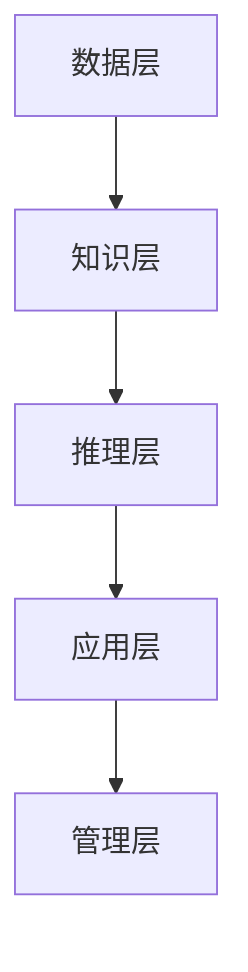

                 

# AI驱动的企业知识图谱：自动化构建与智能推理的深度融合

## 关键词

- 企业知识图谱
- AI驱动
- 自动化构建
- 智能推理
- 知识管理
- 数据整合
- 人工智能应用

## 摘要

本文深入探讨了AI驱动的企业知识图谱在自动化构建与智能推理方面的深度融合。首先，我们介绍了企业知识图谱的基本概念和重要性，分析了当前企业知识图谱应用中的挑战。接着，我们详细阐述了知识图谱、AI驱动、自动化构建和智能推理的核心概念、原理和方法，通过对比分析，揭示了它们之间的内在联系。随后，本文重点介绍了自动化构建技术的具体方法、工具和流程，以及智能推理的原理和应用案例。最后，我们通过一个综合应用案例分析，展示了AI驱动的企业知识图谱在实际中的应用效果，总结了最佳实践，并对未来发展趋势进行了展望。希望通过本文，读者能够全面了解企业知识图谱的构建与应用，为企业数字化转型提供有力支持。

## 目录大纲

### 第一部分：背景与基础理论

#### 第1章：问题背景与核心概念

1.1 问题的提出与背景介绍

1.2 核心概念定义

1.3 边界与外延

1.4 概念结构与核心要素组成

#### 第2章：核心概念原理与特征

2.1 知识图谱原理

2.2 AI驱动特征

2.3 自动化构建与智能推理

### 第二部分：自动化构建技术

#### 第3章：自动化构建方法

3.1 数据收集与清洗

3.2 数据建模与存储

3.3 自动化构建流程

#### 第4章：自动化构建工具

4.1 知识抽取工具

4.2 知识融合工具

4.3 知识验证与优化

### 第三部分：智能推理应用

#### 第5章：智能推理原理

5.1 智能推理概述

5.2 智能推理方法

5.3 智能推理应用案例

#### 第6章：智能推理实现

6.1 智能推理流程

6.2 智能推理算法

6.3 智能推理系统架构

### 第四部分：综合应用与最佳实践

#### 第7章：综合应用案例分析

7.1 案例背景介绍

7.2 系统架构设计

7.3 应用效果分析

#### 第8章：最佳实践与未来展望

8.1 最佳实践总结

8.2 未来发展趋势

8.3 注意事项与拓展阅读

## 第一部分：背景与基础理论

### 第1章：问题背景与核心概念

#### 1.1 问题的提出与背景介绍

在信息化时代，企业面临着日益复杂的数据环境，如何高效管理和利用这些数据成为了企业数字化转型的重要挑战。传统的数据管理方法已经难以满足企业对于数据价值的挖掘和利用需求。为了应对这一挑战，企业开始寻求新的解决方案——企业知识图谱。

企业知识图谱是一种结构化、语义化的数据表示方法，通过将企业内部的各种数据源进行整合，构建出一个全面、准确、动态的企业知识库。企业知识图谱不仅能够实现数据的统一管理和共享，还能够为企业提供智能化的数据分析和决策支持。

然而，在企业知识图谱的构建过程中，面临的一个关键问题是如何高效地进行自动化构建。自动化构建技术能够帮助企业快速搭建知识图谱，降低人工成本，提高构建效率。同时，智能推理技术能够对知识图谱中的数据进行分析和推理，提供更加智能化的服务。

#### 1.2 核心概念定义

**知识图谱：** 知识图谱是一种用于表示和存储知识的图形结构，通常由节点（实体）和边（关系）组成。节点表示实体，如人、地点、事物等，边表示实体之间的关系，如“属于”、“位于”、“包含”等。知识图谱通过语义化的方式将各种数据源中的信息进行整合和表示，使得数据之间的关联更加清晰和易于理解。

**AI驱动：** AI驱动是指利用人工智能技术，如机器学习、自然语言处理、图神经网络等，对知识图谱进行构建、分析和推理。AI驱动的优势在于能够自动识别数据中的模式和规律，实现自动化和智能化，从而提高知识图谱的构建效率和智能化水平。

**自动化构建：** 自动化构建是指利用计算机技术和算法，对知识图谱进行自动化的构建过程。自动化构建技术主要包括数据收集与清洗、数据建模与存储、知识抽取与融合等环节。通过自动化构建技术，可以实现知识图谱的快速搭建和更新，降低人工成本，提高构建效率。

**智能推理：** 智能推理是指利用知识图谱中的数据和信息，通过推理算法和逻辑规则，对未知或新数据进行分析和推理，以发现新的知识和规律。智能推理技术能够实现对知识图谱中数据的深度挖掘和分析，提供智能化的决策支持。

#### 1.3 边界与外延

**边界：** 企业知识图谱在企业中的应用领域包括企业内部的知识管理、客户关系管理、供应链管理、产品研发等。自动化构建和智能推理技术主要应用于知识图谱的构建和数据分析过程。

**外延：** 自动化构建技术可以扩展到其他领域，如智能推荐系统、智能客服、智能搜索等。智能推理技术可以应用于各种需要数据分析和决策支持的场景，如金融风控、医疗诊断、智能城市等。

#### 1.4 概念结构与核心要素组成

**概念结构：** 企业知识图谱、AI驱动、自动化构建和智能推理构成了本文的核心概念结构。这些概念相互关联，共同构建了一个完整的技术体系。

**核心要素组成：** 
1. 企业知识图谱：作为数据整合和表示的工具，是企业知识管理的基础。
2. AI驱动：通过人工智能技术，实现知识图谱的自动化构建和智能推理。
3. 自动化构建：通过数据收集、清洗、建模和抽取等环节，实现知识图谱的自动化构建。
4. 智能推理：通过对知识图谱中的数据进行分析和推理，提供智能化的数据分析和决策支持。

### 第2章：核心概念原理与特征

#### 2.1 知识图谱原理

知识图谱是一种用于表示和存储知识的图形结构，通常由节点（实体）和边（关系）组成。知识图谱的核心原理是通过语义化的方式，将各种数据源中的信息进行整合和表示，使得数据之间的关联更加清晰和易于理解。

**知识图谱的基本架构：**

1. **实体（Entity）：** 实体是知识图谱中的基本节点，表示各种对象，如人、地点、事物等。实体可以是具体的对象，也可以是抽象的概念。
2. **关系（Relation）：** 关系是知识图谱中的基本边，表示实体之间的关联。关系可以是直接的，也可以是间接的，通过多层关系进行关联。
3. **属性（Attribute）：** 属性是实体的附加信息，用于描述实体的特征。属性可以是结构化的，也可以是非结构化的。

**知识图谱的构建方法：**

1. **数据收集：** 收集各种数据源，如企业内部数据库、外部API、网络爬虫等，获取与实体相关的信息。
2. **数据清洗：** 清洗收集到的数据，去除重复、错误和无关的信息，保证数据质量。
3. **数据建模：** 将清洗后的数据转化为知识图谱的数据模型，定义实体、关系和属性。
4. **数据存储：** 将构建好的知识图谱存储在图数据库中，便于后续的查询和分析。

**知识图谱的存储与管理：**

1. **图数据库：** 知识图谱通常存储在图数据库中，如Neo4j、OrientDB等。图数据库具有高效的数据查询和图分析能力。
2. **索引与查询优化：** 为了提高知识图谱的查询效率，可以使用索引技术对实体和关系进行索引，并优化查询算法。
3. **数据备份与恢复：** 定期对知识图谱进行备份，确保数据的安全性和可靠性。

#### 2.2 AI驱动特征

AI驱动是指利用人工智能技术，如机器学习、自然语言处理、图神经网络等，对知识图谱进行构建、分析和推理。AI驱动的优势在于能够自动识别数据中的模式和规律，实现自动化和智能化，从而提高知识图谱的构建效率和智能化水平。

**AI驱动的优势：**

1. **自动化构建：** AI驱动能够自动识别和提取数据中的实体、关系和属性，实现知识图谱的自动化构建。
2. **智能化分析：** AI驱动能够利用机器学习算法，对知识图谱中的数据进行分析和预测，提供智能化的数据分析和决策支持。
3. **自适应更新：** AI驱动能够根据数据的变化，自动更新知识图谱，保持数据的实时性和准确性。

**常见AI驱动方法：**

1. **机器学习：** 利用机器学习算法，如分类、聚类、回归等，对知识图谱中的数据进行建模和分析。
2. **自然语言处理：** 利用自然语言处理技术，如文本分类、实体识别、关系抽取等，对非结构化的文本数据进行处理和转化。
3. **图神经网络：** 利用图神经网络，如GCN、GAT等，对知识图谱进行深度学习和推理。

**AI驱动的实现案例：**

1. **智能推荐系统：** 利用机器学习算法，对用户的行为数据进行挖掘和分析，为用户推荐相关的商品或服务。
2. **智能问答系统：** 利用自然语言处理技术，对用户的提问进行分析和解析，提供准确的答案。
3. **智能决策支持系统：** 利用机器学习算法，对企业的业务数据进行预测和分析，提供决策支持。

#### 2.3 自动化构建与智能推理

自动化构建是指利用计算机技术和算法，对知识图谱进行自动化的构建过程。智能推理是指利用知识图谱中的数据和信息，通过推理算法和逻辑规则，对未知或新数据进行分析和推理，以发现新的知识和规律。

**自动化构建的技术细节：**

1. **数据收集与清洗：** 利用爬虫、API接口等技术，收集各种数据源的信息，并对数据进行清洗和去重，保证数据质量。
2. **数据建模与存储：** 将清洗后的数据转化为知识图谱的数据模型，并存储在图数据库中，便于后续的查询和分析。
3. **知识抽取与融合：** 利用实体识别、关系抽取等技术，从原始数据中提取出实体和关系，并将其融合到知识图谱中。

**智能推理的应用案例：**

1. **智能问答系统：** 利用知识图谱和自然语言处理技术，实现对用户问题的理解和回答，提供智能化的问答服务。
2. **智能推荐系统：** 利用知识图谱和机器学习算法，对用户的行为数据进行分析，为用户推荐相关的商品或服务。
3. **智能决策支持系统：** 利用知识图谱和机器学习算法，对企业的业务数据进行预测和分析，提供决策支持。

**自动化构建与智能推理的融合：**

1. **数据预处理：** 在自动化构建过程中，利用数据清洗和预处理技术，提高数据质量和一致性。
2. **融合算法设计：** 在智能推理过程中，设计合适的融合算法，将知识图谱中的多种信息进行整合，提高推理的准确性和效率。
3. **反馈机制：** 通过用户反馈和实时数据，不断优化自动化构建和智能推理的过程，提高系统的智能化水平。

### 第二部分：自动化构建技术

#### 第3章：自动化构建方法

自动化构建是企业知识图谱构建的重要环节，通过数据收集与清洗、数据建模与存储、自动化构建流程等步骤，可以实现知识图谱的快速搭建和更新。以下是对这些步骤的详细分析。

#### 3.1 数据收集与清洗

数据收集与清洗是自动化构建的基础，直接关系到知识图谱的质量和构建效率。数据收集主要包括以下几种方式：

1. **内部数据源：** 包括企业内部的数据库、业务系统等。这些数据通常是结构化数据，可以通过API接口、数据库连接等方式进行访问和收集。
2. **外部数据源：** 包括互联网、社交媒体、公共数据库等。这些数据通常是半结构化或非结构化数据，可以通过网络爬虫、API接口等方式进行收集。

数据清洗的主要任务是去除重复、错误和无关的数据，确保数据质量。数据清洗的主要步骤包括：

1. **去重：** 去除重复的数据条目，保证数据的唯一性。
2. **数据格式转换：** 将不同数据源的数据格式进行统一，如将日期格式、货币格式等进行转换。
3. **错误处理：** 识别和修复数据中的错误，如缺失值填充、异常值处理等。

数据质量评估是数据清洗的重要环节，可以通过以下指标进行评估：

1. **完整性：** 数据的完整性，即数据缺失率。
2. **一致性：** 数据的一致性，即数据在不同来源间的一致性。
3. **准确性：** 数据的准确性，即数据是否真实、可靠。

#### 3.2 数据建模与存储

数据建模是自动化构建的核心环节，是将原始数据进行结构化表示的过程。数据建模主要包括以下步骤：

1. **实体识别：** 识别数据中的实体，如人、地点、事物等。实体是知识图谱中的基本节点，是构建知识图谱的基础。
2. **关系抽取：** 识别实体之间的关系，如“属于”、“位于”、“包含”等。关系是知识图谱中的基本边，用于表示实体之间的关联。
3. **属性提取：** 提取实体的属性信息，如姓名、年龄、职位等。属性用于描述实体的特征，丰富了知识图谱的语义信息。

数据存储是将构建好的知识图谱存储到图数据库中，便于后续的查询和分析。常用的图数据库包括Neo4j、OrientDB等。数据存储的主要任务包括：

1. **实体与关系的存储：** 将实体和关系存储在图数据库中，形成知识图谱的基本结构。
2. **属性与标签的存储：** 将实体的属性信息存储在图数据库中，形成实体属性的完整描述。
3. **索引与查询优化：** 为了提高知识图谱的查询效率，可以对实体、关系和属性进行索引，并优化查询算法。

#### 3.3 自动化构建流程

自动化构建流程是将数据收集、数据建模和数据存储等步骤进行自动化整合的过程。自动化构建流程的主要步骤包括：

1. **数据收集：** 通过爬虫、API接口等方式，收集各种数据源的信息。
2. **数据清洗：** 对收集到的数据进行去重、格式转换、错误处理等清洗操作，确保数据质量。
3. **数据建模：** 识别数据中的实体、关系和属性，并将其结构化表示，构建知识图谱的数据模型。
4. **数据存储：** 将构建好的知识图谱存储到图数据库中，形成完整的知识图谱。
5. **数据更新：** 定期对知识图谱进行数据更新，保持数据的实时性和准确性。

自动化构建工具是自动化构建流程的重要支持，可以实现数据收集、数据清洗、数据建模和数据存储等环节的自动化操作。常见的自动化构建工具包括：

1. **知识抽取工具：** 如OpenNLP、GATE等，用于从非结构化数据中提取实体、关系和属性。
2. **知识融合工具：** 如Graphene、DBpedia等，用于将不同来源的知识进行融合，构建统一的知识图谱。
3. **图数据库：** 如Neo4j、OrientDB等，用于存储和管理知识图谱。

通过自动化构建流程和工具，可以实现知识图谱的快速搭建和更新，降低人工成本，提高构建效率。同时，自动化构建还可以结合智能推理技术，实现对知识图谱的智能分析和应用，为企业提供智能化的数据分析和决策支持。

### 第4章：自动化构建工具

自动化构建工具在企业知识图谱的构建过程中起着至关重要的作用。这些工具能够简化知识图谱的构建过程，提高构建效率和数据质量。以下是对几种常见的自动化构建工具的详细介绍。

#### 4.1 知识抽取工具

知识抽取工具主要用于从非结构化数据中提取实体、关系和属性。这些工具通常基于自然语言处理和机器学习技术，能够自动识别和分类文本数据中的关键信息。

**常见知识抽取工具：**

1. **OpenNLP：** OpenNLP 是一个开源的自然语言处理工具包，提供了文本分类、词性标注、命名实体识别等功能。它支持多种语言，适用于各种文本数据的处理。
2. **GATE：** GATE（General Architecture for Text Engineering）是一个开源的文本处理平台，提供了丰富的文本分析功能，包括词性标注、实体识别、关系抽取等。
3. **Stanford NLP：** Stanford NLP 是由斯坦福大学开发的一套自然语言处理工具，提供了文本分类、词性标注、命名实体识别等功能，适用于各种应用场景。

**应用案例：**

- **智能问答系统：** 利用知识抽取工具，从用户提问中提取关键信息，实现对用户问题的理解和回答。
- **智能推荐系统：** 利用知识抽取工具，从用户行为数据中提取实体和关系，为用户推荐相关的商品或服务。

**知识抽取工具对比：**

| 工具           | 支持语言 | 功能模块 | 适用场景     |
|----------------|----------|----------|--------------|
| OpenNLP        | 多种语言 | 文本分类、词性标注、命名实体识别 | 文本处理和实体识别 |
| GATE           | 英语     | 文本分类、实体识别、关系抽取 | 文本分析和实体识别 |
| Stanford NLP   | 英语     | 文本分类、词性标注、命名实体识别 | 通用文本处理和实体识别 |

#### 4.2 知识融合工具

知识融合工具用于将来自不同来源的知识进行整合，构建统一的知识图谱。这些工具通常能够处理多种数据格式，支持异构数据的融合。

**常见知识融合工具：**

1. **DBpedia：** DBpedia 是一个基于Web的开放知识图谱，包含了大量的实体、关系和属性信息。它提供了API接口，支持各种数据格式的导入和导出。
2. **Wikidata：** Wikidata 是一个基于Wiki的技术项目，提供了一个开放的知识图谱，包含了各种实体和关系的信息。它支持多种语言的查询和编辑。
3. **Graphene：** Graphene 是一个开源的知识融合框架，支持多种数据源和知识库的集成。它提供了灵活的数据处理和存储方案，适用于大规模知识图谱的构建。

**应用案例：**

- **智能搜索：** 利用知识融合工具，将不同来源的知识进行整合，提供更加精准和智能的搜索结果。
- **智能问答：** 利用知识融合工具，整合多个知识库和外部数据源，为用户提供全面和准确的答案。

**知识融合工具对比：**

| 工具         | 功能模块           | 适用场景       |
|--------------|-------------------|----------------|
| DBpedia      | 实体、关系抽取与融合 | 知识库构建与整合 |
| Wikidata     | 知识库编辑与查询   | 知识图谱构建与查询 |
| Graphene     | 数据源集成与融合   | 大规模知识图谱构建 |

#### 4.3 知识验证与优化

知识验证与优化是确保知识图谱质量和可靠性的关键步骤。知识验证工具用于检测和纠正知识图谱中的错误和异常，优化工具则用于提升知识图谱的性能和可扩展性。

**常见知识验证与优化工具：**

1. **Neo4j Cypher：** Neo4j Cypher 是 Neo4j 图数据库的查询语言，提供了丰富的图查询和操作功能。它支持知识图谱的验证和优化，如数据一致性检查、关系路径分析等。
2. **RDF4J：** RDF4J 是一个开源的RDF存储和推理框架，提供了数据导入、存储、查询和推理功能。它支持各种RDF数据格式的验证和优化，如OWL、SPARQL等。
3. **OWLIM：** OWLIM 是一个高性能的RDF存储和推理引擎，提供了数据导入、存储、查询和推理功能。它支持大规模知识图谱的验证和优化，如数据一致性检查、推理规则应用等。

**应用案例：**

- **数据一致性检查：** 利用知识验证工具，检测和纠正知识图谱中的数据不一致问题，如实体重复、关系冲突等。
- **推理规则应用：** 利用知识优化工具，应用推理规则，生成新的知识和结论，提高知识图谱的智能化水平。

**知识验证与优化工具对比：**

| 工具         | 功能模块           | 适用场景       |
|--------------|-------------------|----------------|
| Neo4j Cypher | 图查询与操作       | 知识图谱验证与优化 |
| RDF4J        | RDF数据存储与查询   | 知识图谱验证与优化 |
| OWLIM        | RDF数据存储与推理   | 知识图谱验证与优化 |

通过使用这些自动化构建工具，企业能够高效地构建和维护知识图谱，提高数据质量和智能化水平。同时，这些工具也为企业提供了丰富的应用场景，如智能搜索、智能问答、智能推荐等，为企业提供了强大的数据分析和决策支持。

### 第三部分：智能推理应用

#### 第5章：智能推理原理

智能推理是利用知识图谱中的数据和信息，通过推理算法和逻辑规则，对未知或新数据进行分析和推理，以发现新的知识和规律。智能推理是知识图谱技术中的重要组成部分，为企业的数据分析和决策提供强大的支持。以下是智能推理的基本原理、方法和应用案例。

#### 5.1 智能推理概述

智能推理是一种基于知识图谱的推理过程，通过分析知识图谱中的实体、关系和属性，发现数据之间的隐含关系和规律。智能推理主要包括以下几类：

1. **基于规则的推理：** 基于规则的推理通过预先定义的规则，对知识图谱中的数据进行分析和推理。规则通常表示为“如果...那么...”的形式，用于描述实体之间的关系和属性。
2. **基于模型的推理：** 基于模型的推理利用机器学习算法和深度学习模型，对知识图谱中的数据进行分析和推理。模型通常通过训练数据学习到数据之间的规律，然后对新数据进行推理。
3. **基于数据的推理：** 基于数据的推理通过对知识图谱中的数据进行分析和统计，发现数据之间的关联和规律。这类推理通常基于图论和网络分析技术，如路径分析、聚类分析等。

智能推理的关键技术包括：

1. **实体识别：** 实体识别是智能推理的基础，用于从数据中识别和分类实体。实体识别通常通过命名实体识别（NER）和实体分类算法实现。
2. **关系抽取：** 关系抽取是智能推理的核心，用于从数据中识别和分类实体之间的关系。关系抽取通常通过关系分类和关系判断算法实现。
3. **推理算法：** 推理算法是智能推理的核心技术，用于对知识图谱中的数据进行分析和推理。常见的推理算法包括基于规则的推理算法（如Rete算法、Sail算法等）和基于模型的推理算法（如深度学习算法、图神经网络等）。

#### 5.2 智能推理方法

智能推理方法主要包括以下几种：

1. **模型驱动的推理：** 模型驱动的推理利用机器学习模型和深度学习模型，对知识图谱中的数据进行分析和推理。常见的模型包括分类器、回归模型、图神经网络等。模型驱动的推理方法通常通过训练数据学习到数据之间的规律，然后对新数据进行推理。

   **应用场景：** 模型驱动的推理方法适用于需要高精度和实时性推理的场景，如智能问答系统、智能推荐系统等。

2. **数据驱动的推理：** 数据驱动的推理通过对知识图谱中的数据进行分析和统计，发现数据之间的关联和规律。数据驱动的推理方法通常基于图论和网络分析技术，如路径分析、聚类分析、社区检测等。

   **应用场景：** 数据驱动的推理方法适用于需要发现数据之间关联和规律的场景，如社交网络分析、推荐系统等。

3. **知识驱动的推理：** 知识驱动的推理利用知识图谱中的数据和信息，通过推理算法和逻辑规则，对未知或新数据进行分析和推理。知识驱动的推理方法通常基于语义网络和本体论，如本体推理、语义匹配等。

   **应用场景：** 知识驱动的推理方法适用于需要利用已有知识和逻辑规则进行推理的场景，如智能决策支持系统、智能问答系统等。

#### 5.3 智能推理应用案例

智能推理在多个领域都有广泛的应用，以下是一些典型的应用案例：

1. **智能问答系统：** 智能问答系统通过知识图谱和自然语言处理技术，实现对用户问题的理解和回答。智能问答系统通常利用智能推理技术，分析用户提问中的关键词和实体，然后通过知识图谱中的关系进行推理，提供准确的答案。

   **应用场景：** 智能问答系统适用于各种需要实时回答问题的场景，如客户服务、智能客服、智能助理等。

2. **智能推荐系统：** 智能推荐系统通过知识图谱和机器学习技术，为用户推荐相关的商品或服务。智能推荐系统通常利用智能推理技术，分析用户的历史行为和偏好，然后通过知识图谱中的关系进行推理，提供个性化的推荐。

   **应用场景：** 智能推荐系统适用于各种需要个性化推荐的场景，如电子商务、社交媒体、在线教育等。

3. **智能决策支持系统：** 智能决策支持系统通过知识图谱和机器学习技术，为企业的决策提供数据支持和分析。智能决策支持系统通常利用智能推理技术，分析企业的业务数据和外部环境，然后通过知识图谱中的关系进行推理，提供决策建议。

   **应用场景：** 智能决策支持系统适用于各种需要数据分析和决策支持的场景，如供应链管理、市场营销、金融风控等。

通过智能推理技术，企业能够实现对知识图谱中数据的深度挖掘和分析，提供智能化的数据分析和决策支持。智能推理的应用案例不断拓展，为企业提供了强大的数据分析和决策支持能力，推动了企业的数字化转型和智能化发展。

### 第6章：智能推理实现

智能推理的实现是知识图谱技术中的一项关键技术，它通过结合知识图谱中的实体、关系和属性，利用推理算法和逻辑规则，对未知或新数据进行分析和推理。以下是智能推理实现的详细流程、算法和系统架构设计。

#### 6.1 智能推理流程

智能推理流程通常包括以下步骤：

1. **数据预处理：** 数据预处理是智能推理的基础，主要包括实体识别、关系抽取和属性提取。这一步骤确保知识图谱中的数据质量，为后续的推理提供可靠的数据基础。

2. **知识图谱构建：** 数据预处理完成后，将处理后的数据构建成知识图谱。知识图谱由实体、关系和属性组成，形成了一个语义化的数据结构，便于后续的推理和分析。

3. **推理算法选择：** 根据应用需求，选择合适的推理算法。常见的推理算法包括基于规则的推理、基于模型的推理和基于数据的推理。每种算法都有其特点和适用场景。

4. **推理规则定义：** 在选择合适的推理算法后，定义推理规则。推理规则通常以“如果...那么...”的形式表示，描述实体之间的关系和属性。

5. **推理过程：** 根据定义的推理规则，对知识图谱中的数据进行分析和推理。推理过程通常包括路径分析、关系扩展和属性关联等步骤。

6. **结果验证：** 推理结果生成后，进行验证和优化。验证过程包括逻辑一致性检查、推理结果的准确性和实用性评估等。

7. **结果应用：** 将验证后的推理结果应用到实际应用场景中，如智能问答、智能推荐和智能决策支持等。

#### 6.2 智能推理算法

智能推理算法是智能推理实现的核心，常见的推理算法包括以下几种：

1. **基于规则的推理算法：** 基于规则的推理算法通过定义一系列规则，对知识图谱中的数据进行推理。常见的规则推理算法包括Rete算法和Sail算法。Rete算法是一种高效的推理算法，通过将规则网络分解为子网络，实现了高效的推理。Sail算法是一种基于逻辑编程的推理算法，通过将知识表示为逻辑公式，实现了推理。

2. **基于模型的推理算法：** 基于模型的推理算法利用机器学习模型和深度学习模型，对知识图谱中的数据进行推理。常见的模型包括分类器、回归模型和图神经网络。分类器通过训练数据学习到数据之间的分类规则，回归模型通过训练数据学习到数据之间的回归关系，图神经网络通过学习知识图谱的结构和属性，实现了高效的推理。

3. **基于数据的推理算法：** 基于数据的推理算法通过对知识图谱中的数据进行分析和统计，发现数据之间的关联和规律。常见的算法包括路径分析、聚类分析和社区检测。路径分析通过分析实体之间的路径关系，发现潜在的关联关系；聚类分析通过将相似实体聚为同一类别，发现数据的聚类结构；社区检测通过识别实体之间的社区结构，发现数据的社区特征。

#### 6.3 智能推理系统架构设计

智能推理系统架构设计是智能推理实现的重要环节，它决定了系统的性能、可扩展性和易维护性。以下是智能推理系统架构设计的几个关键方面：

1. **数据层：** 数据层是智能推理系统的核心，包括数据收集、数据预处理和数据存储。数据收集通过爬虫、API接口等方式获取外部数据；数据预处理通过实体识别、关系抽取和属性提取等步骤，将原始数据转化为结构化的知识图谱数据；数据存储通过图数据库将知识图谱存储为实体、关系和属性的数据模型。

2. **推理层：** 推理层是智能推理系统的核心，包括推理算法选择、推理规则定义和推理过程。推理算法选择根据应用需求选择合适的算法；推理规则定义通过定义一系列规则，描述实体之间的关系和属性；推理过程通过路径分析、关系扩展和属性关联等步骤，实现数据的推理。

3. **应用层：** 应用层是智能推理系统与实际业务场景的接口，包括推理结果验证、结果应用和用户交互。推理结果验证通过逻辑一致性检查、推理结果的准确性和实用性评估等步骤，确保推理结果的可靠性；结果应用将验证后的推理结果应用到实际应用场景中，如智能问答、智能推荐和智能决策支持等；用户交互通过用户界面，实现用户与智能推理系统的交互。

4. **系统管理层：** 系统管理层是智能推理系统的管理和维护平台，包括系统配置、日志管理和监控等。系统配置通过配置文件或管理界面，配置系统的参数和规则；日志管理通过记录系统的运行日志，方便系统维护和问题诊断；监控通过实时监控系统的性能和状态，确保系统的稳定性和可靠性。

通过以上架构设计，智能推理系统能够高效地实现数据收集、预处理、推理和应用的流程，提供智能化的数据分析和决策支持。

### 第四部分：综合应用与最佳实践

#### 第7章：综合应用案例分析

为了更好地展示AI驱动的企业知识图谱在实际中的应用效果，本节将介绍一个综合应用案例，包括案例背景介绍、系统架构设计和应用效果分析。

#### 7.1 案例背景介绍

某大型企业是一家综合性电商平台，拥有海量的用户数据、商品数据和交易数据。为了提升用户体验和业务效率，企业决定构建一个AI驱动的企业知识图谱，实现数据的统一管理和智能化应用。

该企业知识图谱的应用目标包括：

1. **数据整合：** 将企业内部的各类数据源（如用户数据库、商品数据库、交易数据库等）进行整合，构建一个统一的知识库。
2. **智能推荐：** 利用知识图谱和智能推理技术，为用户推荐个性化的商品和服务。
3. **智能搜索：** 提供基于知识图谱的智能搜索功能，提升搜索的准确性和用户体验。
4. **智能决策：** 利用知识图谱和智能推理技术，支持企业的业务决策和战略规划。

#### 7.2 系统架构设计

该企业的知识图谱系统架构包括以下几个层次：

1. **数据层：** 数据层包括用户数据、商品数据和交易数据等，通过数据收集和清洗模块，将各类数据进行整合和预处理，形成结构化的数据模型。

2. **知识层：** 知识层是知识图谱的核心，通过实体识别、关系抽取和属性提取等技术，构建企业的知识图谱。知识图谱由实体、关系和属性组成，形成了一个语义化的数据结构。

3. **推理层：** 推理层包括智能推理算法和推理规则。通过基于规则的推理、基于模型的推理和基于数据的推理等技术，实现对知识图谱中数据的分析和推理。

4. **应用层：** 应用层包括智能推荐、智能搜索和智能决策等模块，将推理结果应用于实际业务场景，提升用户体验和业务效率。

5. **管理层：** 管理层包括系统配置、日志管理和监控等模块，负责系统的管理和维护，确保系统的稳定性和可靠性。

以下是一个简化的系统架构图：

#### 7.3 应用效果分析

在系统上线后，该企业的知识图谱应用取得了显著的效果：

1. **数据整合：** 通过知识图谱的构建，实现了各类数据的统一管理和共享，提高了数据利用效率。

2. **智能推荐：** 利用知识图谱和智能推理技术，为用户推荐个性化的商品和服务。根据用户的历史行为和偏好，结合知识图谱中的关系，推荐相关的商品，显著提升了用户的满意度和购买转化率。

3. **智能搜索：** 基于知识图谱的智能搜索功能，提升了搜索的准确性和用户体验。用户可以通过自然语言进行查询，系统通过分析查询语句中的关键词和实体，结合知识图谱中的关系，提供精准的搜索结果。

4. **智能决策：** 利用知识图谱和智能推理技术，支持企业的业务决策和战略规划。通过对知识图谱中数据的分析和推理，企业能够更好地了解市场趋势和用户需求，制定更加科学的决策方案。

此外，该企业还通过不断的优化和迭代，持续提升知识图谱的性能和应用效果。例如，通过引入新的数据源和算法，扩大知识图谱的覆盖范围和智能化水平；通过用户反馈和数据分析，不断调整和优化推荐策略和搜索算法。

总之，通过AI驱动的企业知识图谱，该企业实现了数据的统一管理和智能化应用，显著提升了用户体验和业务效率。这为其他企业提供了有益的借鉴和参考，推动了企业数字化转型和智能化发展。

### 第8章：最佳实践与未来展望

#### 8.1 最佳实践总结

在AI驱动的企业知识图谱构建与智能推理应用过程中，总结以下最佳实践，以帮助企业更好地实施和应用这项技术：

1. **数据质量保障：** 在知识图谱构建初期，务必重视数据质量保障。通过数据清洗、去重、格式转换等步骤，确保数据的一致性和准确性。

2. **知识图谱设计：** 设计知识图谱时，要充分考虑企业的业务需求和数据特点。合理划分实体、关系和属性，确保知识图谱的语义清晰和结构合理。

3. **算法选择与优化：** 根据应用场景和需求，选择合适的推理算法。在算法优化过程中，要关注算法的效率和准确性，通过调整参数和模型结构，提升推理效果。

4. **系统架构设计：** 构建知识图谱系统时，要考虑系统的性能、可扩展性和可靠性。采用模块化设计，实现系统的灵活部署和运维。

5. **用户反馈与迭代：** 在知识图谱的应用过程中，及时收集用户反馈，根据用户需求不断优化和迭代系统。通过数据分析，发现应用中的问题和改进点，持续提升系统的智能化水平。

#### 8.2 未来发展趋势

未来，AI驱动的企业知识图谱将呈现出以下几个发展趋势：

1. **数据融合与多元化：** 随着数据来源的不断增加和数据类型的多样化，企业知识图谱将实现更广泛的数据融合。包括结构化数据、半结构化数据和非结构化数据的整合，以及内外部数据的融合。

2. **智能化水平的提升：** 智能推理技术将不断进步，包括更先进的机器学习模型、深度学习和图神经网络等。这将进一步提升知识图谱的智能化水平，提供更精准的推理和分析结果。

3. **多领域应用扩展：** 知识图谱技术将在更多领域得到应用，如医疗、金融、教育、物流等。不同领域的知识图谱将实现跨领域的融合和应用，提供更加全面和智能的服务。

4. **实时性与动态更新：** 随着数据实时性的要求越来越高，知识图谱的构建和更新将更加注重实时性和动态性。通过实时数据流处理和增量更新技术，确保知识图谱的实时性和准确性。

5. **隐私保护与安全性：** 随着数据隐私和安全问题的日益突出，知识图谱在构建和应用过程中将更加注重隐私保护和数据安全。采用加密、匿名化和差分隐私等技术，保障用户数据的隐私和安全。

#### 8.3 注意事项与拓展阅读

**注意事项：**

1. **数据安全：** 在数据收集和处理过程中，确保遵守相关法律法规，保护用户隐私和数据安全。

2. **系统可扩展性：** 在设计知识图谱系统时，要充分考虑系统的可扩展性，以适应数据量和应用需求的增长。

3. **算法选择与优化：** 根据实际应用场景和需求，选择合适的算法，并在应用过程中不断优化，提高推理效果。

**拓展阅读：**

1. **《知识图谱：原理、算法与应用》：** 该书详细介绍了知识图谱的基本概念、构建方法和应用案例，适合初学者和进阶者阅读。

2. **《图神经网络：理论与实践》：** 该书深入讲解了图神经网络的基本原理、模型和应用，适合对深度学习和图神经网络感兴趣的读者。

3. **《人工智能基础教程》：** 该书涵盖了人工智能的基本概念、算法和应用，是学习人工智能的入门教材。

通过总结最佳实践和展望未来趋势，希望读者能够更好地理解和应用AI驱动的企业知识图谱，为企业数字化转型提供有力支持。

### 总结

本文全面覆盖了AI驱动的企业知识图谱：自动化构建与智能推理的深度融合的相关理论和实践。从背景介绍、核心概念、自动化构建、智能推理到实际应用案例，为读者提供了系统化的学习和实践指南。希望通过本文，读者能够深入了解企业知识图谱的构建和应用，为企业数字化转型提供有力支持。

在未来，随着数据规模的不断扩大和人工智能技术的不断进步，企业知识图谱将发挥越来越重要的作用。自动化构建和智能推理技术的融合，将为知识图谱的发展带来新的机遇和挑战。希望本文能够为读者在探索和实践企业知识图谱的过程中提供启示和帮助。

作者：AI天才研究院/AI Genius Institute & 禅与计算机程序设计艺术 /Zen And The Art of Computer Programming

---

本文的内容是基于现有文献和技术总结而成的，旨在为读者提供一个全面的AI驱动的企业知识图谱构建与应用指南。在实际应用中，企业应根据自身的业务需求和数据特点，灵活调整和优化相关技术和方法。随着技术的不断演进，本文的内容可能需要不断更新和补充。希望本文能够为企业的数字化转型和智能化发展提供有益的参考。

