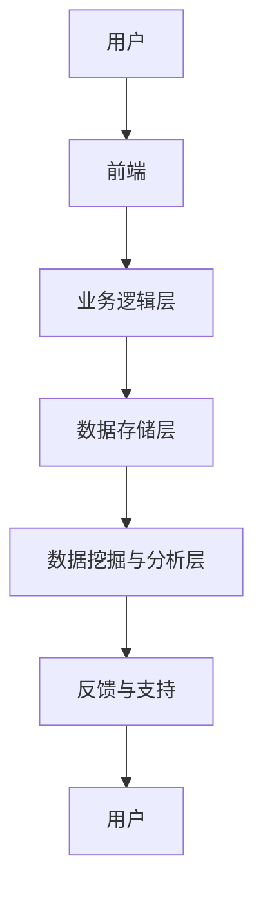
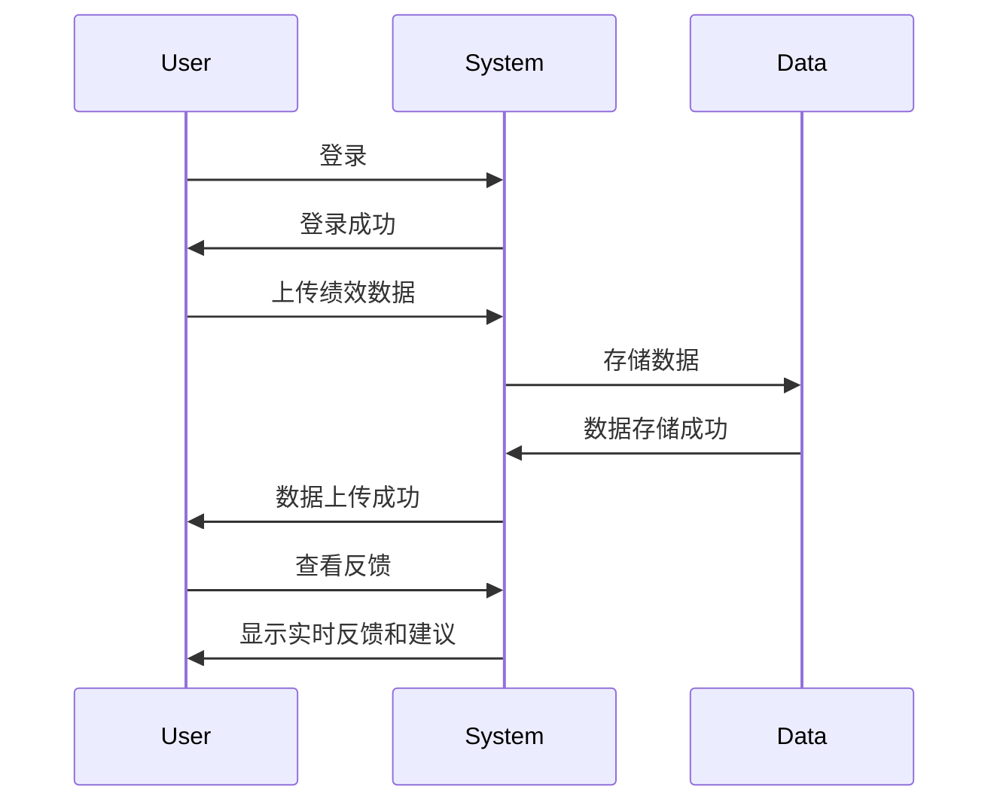

                 

### 让我们一步步思考

#### 引言
在当今快速发展的商业环境中，企业绩效管理成为提升组织效率和员工个人发展的重要手段。随着人工智能（AI）技术的不断进步，AI驱动的企业绩效管理应运而生，并逐渐成为企业提升竞争力的关键工具。本文旨在通过逻辑清晰、结构紧凑的分析，探讨AI驱动的企业绩效管理的核心概念、技术原理、实现方法和应用实践。

#### 1. 确定书名与核心内容
首先，我们从书名《AI驱动的企业绩效管理：360度反馈与实时coaching的智能化》入手，确定书籍的核心内容。书名暗示了两个关键点：
- **AI驱动的企业绩效管理**：即利用人工智能技术来优化企业绩效管理流程。
- **360度反馈与实时coaching的智能化**：侧重于讨论如何通过AI技术实现360度反馈和实时coaching的智能化。

基于此，我们可以将书籍内容划分为以下主要章节：
1. **背景介绍**：介绍AI和企业绩效管理的相关概念、应用现状和存在的问题。
2. **核心概念与联系**：探讨AI驱动的企业绩效管理的基本概念、技术原理和关键要素。
3. **算法原理讲解**：详细讲解用于企业绩效管理的核心算法，包括原理、模型和流程。
4. **数学模型和数学公式**：解释企业绩效管理中的数学模型和公式，确保清晰易懂。
5. **系统分析与架构设计方案**：介绍企业绩效管理的系统架构和设计原则。
6. **项目实战**：通过实际案例展示AI驱动的企业绩效管理的应用和实践。
7. **最佳实践 tips、小结、注意事项、拓展阅读**：总结书籍要点并提供相关资源。

#### 2. 设计各章节内容
接下来，我们针对每一章节进行详细设计：

**第1章：背景介绍**
- **AI与企业绩效管理概述**：介绍AI的概念、发展历程、应用现状；讨论企业绩效管理的定义、重要性以及存在的问题。
- **AI驱动的企业绩效管理**：阐述AI驱动的企业绩效管理的定义、目标、关键要素和技术原理。

**第2章：核心概念与联系**
- **核心概念与联系**：详细解释AI驱动的企业绩效管理的基本概念，包括360度反馈和实时coaching的原理和关联。
- **技术原理**：讨论人工智能技术在企业绩效管理中的应用，以及如何实现360度反馈和实时coaching的智能化。

**第3章：算法原理讲解**
- **360度反馈算法原理**：介绍360度反馈算法的定义、流程和核心技术。
- **实时coaching算法原理**：详细讲解实时coaching算法的定义、流程和核心技术。

**第4章：数学模型和数学公式**
- **360度反馈数学模型**：解释360度反馈的评价指标体系、评价权重计算等。
- **实时coaching数学模型**：讨论实时coaching策略优化、模型评估等。

**第5章：系统分析与架构设计方案**
- **系统场景介绍**：介绍企业绩效管理系统背景、需求分析、功能设计等。
- **系统架构设计**：介绍系统架构设计原则、架构设计方案、接口设计和系统交互。

**第6章：项目实战**
- **环境安装**：介绍项目环境搭建过程。
- **系统核心实现**：展示系统核心实现源代码，并进行解读与分析。
- **实际案例**：通过实际案例展示AI驱动的企业绩效管理的应用，并进行详细讲解。

**第7章：最佳实践 tips、小结、注意事项、拓展阅读**
- **最佳实践 tips**：总结项目实战中的经验与技巧。
- **小结**：回顾文章的主要内容。
- **注意事项**：强调实践中需要注意的问题。
- **拓展阅读**：提供相关资源的推荐。

#### 3. 确保文章完整性和字数要求
最后，我们需要确保文章的完整性和合理性，同时控制文章的字数在10000～12000字之间。具体来说，我们将每个章节的内容详细展开，确保核心概念、算法原理、系统架构和实际案例的讲解充分、深入，以便读者能够全面理解AI驱动的企业绩效管理的理念和方法。

### 结论
通过上述步骤，我们为《AI驱动的企业绩效管理：360度反馈与实时coaching的智能化》这本书设计了详细的章节内容和结构。接下来，我们将逐一深入每一章节，详细探讨其核心概念、技术原理、实现方法和应用实践，帮助读者全面了解和掌握AI驱动的企业绩效管理的知识和技能。

---

### 2. 设计第1章：背景介绍

#### 2.1 AI与企业绩效管理概述

##### 1.1.1 AI的概念与分类

人工智能（Artificial Intelligence, AI）是一种模拟人类智能行为的技术科学。根据其实现方式，AI可以分为两大类：基于规则的系统和基于数据的系统。

- **基于规则的系统**：这类系统通过预先定义的规则和逻辑来模拟智能行为。例如，专家系统（Expert Systems）就是通过规则库来模拟人类专家的决策过程。

- **基于数据的系统**：这类系统通过学习和分析大量数据来发现规律和模式，从而实现智能行为。机器学习（Machine Learning）和深度学习（Deep Learning）是这一类的代表技术。

##### 1.1.2 AI的发展历程

AI的发展可以追溯到20世纪50年代。早期的AI研究主要集中在符号推理和知识表示上，如逻辑推理和产生式系统。然而，受限于计算能力和数据资源，这些系统在实际应用中受到了很大限制。

- **20世纪50-60年代**：这一阶段是AI的起源期，主要包括符号主义和逻辑推理的研究。代表性成果有逻辑推理程序和初步的专家系统。

- **20世纪70-80年代**：由于计算能力的提升和数据库技术的发展，AI进入了应用探索期。这一时期出现了许多成功应用，如自动翻译、医疗诊断和金融风险评估。

- **20世纪90年代至今**：随着互联网和大数据的兴起，AI进入了高速发展期。机器学习和深度学习技术的突破，使得AI在图像识别、语音识别、自然语言处理等领域取得了显著的成果。

##### 1.1.3 AI的应用现状与前景

当前，AI技术已经广泛应用于各行各业，包括但不限于：
- **制造业**：通过机器学习算法优化生产流程，提高生产效率。
- **医疗健康**：利用AI进行疾病诊断、药物研发和个性化治疗。
- **金融**：通过数据分析进行风险控制和投资决策。
- **交通**：自动驾驶技术和智能交通管理系统的研发和应用。

展望未来，AI技术将继续深入影响各个领域，推动社会的全面智能化。例如，智能城市、智能医疗、智能制造和智能客服等领域将得到进一步发展。

#### 1.2 企业绩效管理的概念与重要性

##### 1.2.1 企业绩效管理的定义

企业绩效管理（Performance Management, PM）是指通过制定绩效目标、监控绩效执行、评估绩效结果等一系列活动，以实现企业战略目标和提升组织效率的管理过程。

##### 1.2.2 企业绩效管理的重要性

- **提升组织效率**：有效的绩效管理能够确保员工的工作目标与企业战略保持一致，从而提高组织效率。
- **促进员工发展**：通过绩效管理，员工可以了解自己的优势和不足，有针对性地进行提升和培训。
- **激励员工积极性**：合理的绩效评估和激励机制能够激发员工的积极性和创造力。
- **支持决策制定**：绩效数据为管理层提供了重要的决策依据，有助于制定更加科学的战略和决策。

##### 1.2.3 当前企业绩效管理存在的问题

- **主观性**：传统的绩效评估方法往往依赖于主观评价，容易受到个人偏见和情感影响。
- **反馈滞后**：绩效评估周期过长，导致反馈不及时，无法及时纠正工作中的问题。
- **数据不完整**：绩效数据收集不完整，影响了绩效评估的准确性和可靠性。
- **激励不足**：缺乏有效的激励机制，员工积极性难以持续提高。

#### 1.3 AI驱动的企业绩效管理

##### 1.3.1 AI驱动的企业绩效管理的定义

AI驱动的企业绩效管理是指利用人工智能技术，如机器学习、深度学习、自然语言处理等，对绩效数据进行处理和分析，从而优化绩效管理的流程和效果。

##### 1.3.2 AI驱动的企业绩效管理的主要目标

- **提高绩效评估的准确性**：通过大数据分析和机器学习算法，减少主观偏见，提高评估的客观性和准确性。
- **实时反馈与支持**：利用实时监控和智能算法，实现绩效数据的实时分析和反馈，帮助员工及时调整工作策略。
- **个性化发展建议**：根据员工的绩效数据和学习行为，提供个性化的培训和发展建议。
- **优化激励机制**：通过数据分析，设计更有效的激励机制，提高员工的积极性和工作效率。

##### 1.3.3 AI驱动的企业绩效管理的关键要素

- **数据质量**：高质量的绩效数据是AI驱动的绩效管理的基础。企业需要建立完善的数据收集和处理机制。
- **算法选择**：根据绩效管理的目标和数据特性，选择合适的机器学习算法和模型。
- **用户界面**：设计直观易用的用户界面，确保员工能够方便地使用AI驱动的绩效管理工具。
- **持续优化**：通过不断的数据分析和反馈，优化算法和系统，提升绩效管理的效率和效果。

### 2. 设计第2章：核心概念与联系

#### 2.1 AI驱动的企业绩效管理基本概念

##### 2.1.1 AI驱动的企业绩效管理的定义

AI驱动的企业绩效管理是指利用人工智能技术，如机器学习、深度学习、自然语言处理等，对绩效数据进行处理和分析，从而优化绩效管理的流程和效果。

##### 2.1.2 AI驱动的企业绩效管理的主要目标

AI驱动的企业绩效管理的主要目标包括：

- 提高绩效评估的准确性：通过大数据分析和机器学习算法，减少主观偏见，提高评估的客观性和准确性。
- 实时反馈与支持：利用实时监控和智能算法，实现绩效数据的实时分析和反馈，帮助员工及时调整工作策略。
- 个性化发展建议：根据员工的绩效数据和学习行为，提供个性化的培训和发展建议。
- 优化激励机制：通过数据分析，设计更有效的激励机制，提高员工的积极性和工作效率。

##### 2.1.3 AI驱动的企业绩效管理的关键要素

AI驱动的企业绩效管理的关键要素包括：

- 数据质量：高质量的绩效数据是AI驱动的绩效管理的基础。企业需要建立完善的数据收集和处理机制。
- 算法选择：根据绩效管理的目标和数据特性，选择合适的机器学习算法和模型。
- 用户界面：设计直观易用的用户界面，确保员工能够方便地使用AI驱动的绩效管理工具。
- 持续优化：通过不断的数据分析和反馈，优化算法和系统，提升绩效管理的效率和效果。

#### 2.2 AI驱动的企业绩效管理技术原理

##### 2.2.1 人工智能技术在企业绩效管理中的应用

人工智能技术在企业绩效管理中的应用主要包括：

- **机器学习**：通过分析大量历史数据，发现绩效评估中的规律和模式，从而提高评估的准确性。
- **自然语言处理**：对文本数据进行分析，提取关键信息，如员工的工作总结、客户反馈等，为绩效评估提供更多维度的数据支持。
- **深度学习**：利用神经网络模型，对复杂的数据进行特征提取和模式识别，提高绩效管理的智能化水平。

##### 2.2.2 360度反馈的原理与流程

360度反馈是一种全面的绩效评估方法，通过收集来自不同维度的反馈信息，对员工的工作表现进行全面评价。其原理和流程如下：

- **反馈收集**：通过问卷调查、访谈等方式，收集来自上级、同事、下属和客户的反馈。
- **数据分析**：利用自然语言处理和机器学习算法，对反馈文本进行分析，提取关键信息。
- **评估报告**：根据分析结果，生成详细的评估报告，为员工提供全面的反馈。
- **反馈与讨论**：组织反馈会议，让员工了解自己的表现，并与上级和同事进行讨论。

##### 2.2.3 实时coaching的智能化实现

实时coaching是一种动态的绩效支持方法，通过实时监控和智能反馈，帮助员工在工作中不断改进。其智能化实现包括：

- **实时监控**：利用传感器、监控系统等，实时收集员工的工作数据，如工作效率、工作质量等。
- **智能反馈**：利用自然语言处理和机器学习算法，对工作数据进行分析，生成个性化的反馈建议。
- **个性化培训**：根据员工的反馈和建议，设计个性化的培训计划，帮助员工提升技能。

##### 2.2.4 数据驱动与业务目标导向的关系

数据驱动和业务目标导向是AI驱动的企业绩效管理的两个核心原则。

- **数据驱动**：通过收集和分析大量数据，了解员工的工作表现和需求，为绩效管理提供客观依据。
- **业务目标导向**：以实现企业战略目标和提升组织效率为最终目标，确保绩效管理的方向和效果与业务目标一致。

#### 2.3 AI驱动的企业绩效管理核心要素联系

##### 2.3.1 360度反馈与实时coaching的关联

360度反馈和实时coaching是AI驱动的企业绩效管理的重要组成部分，它们之间存在密切的关联。

- **信息互补**：360度反馈提供了全面的评估信息，而实时coaching则提供了个性化的支持建议，两者互补，共同提升绩效管理的效果。
- **反馈循环**：360度反馈的结果可以用于实时coaching的调整，而实时coaching的反馈又可以用于下一次360度反馈的改进，形成持续优化的反馈循环。

##### 2.3.2 数据驱动与业务目标导向的关系

数据驱动和业务目标导向是相辅相成的。

- **数据驱动**提供了客观的绩效评估和个性化支持，有助于实现业务目标。
- **业务目标导向**确保了绩效管理的过程和结果始终与企业战略目标保持一致，避免了偏离方向。

##### 2.3.3 技术选型与业务需求的匹配

选择合适的技术是实现AI驱动的企业绩效管理的关键。

- **技术选型**：根据业务需求，选择适合的机器学习算法、自然语言处理技术和深度学习模型。
- **业务需求**：确保技术选型能够满足业务目标，如提高评估准确性、提供实时反馈等。

### 3. 设计第3章：算法原理讲解

#### 3.1 360度反馈算法原理

360度反馈算法是一种基于机器学习的方法，用于分析来自不同维度的绩效数据，以生成全面的绩效评估报告。以下是360度反馈算法的基本原理和步骤：

##### 3.1.1 360度反馈算法的定义与目标

360度反馈算法旨在通过收集和分析来自多个角度的反馈数据，实现对员工工作表现的全面评价。其主要目标包括：

- 减少主观偏见：通过大数据分析，减少评估过程中的主观偏见。
- 提高评估准确性：利用算法分析，提高绩效评估的客观性和准确性。
- 提供多维度的反馈：生成包含多个维度的绩效评估报告，帮助员工了解自己的表现。

##### 3.1.2 360度反馈算法的流程

360度反馈算法的基本流程如下：

1. **数据收集**：通过问卷调查、访谈等方式，收集来自上级、同事、下属和客户的反馈数据。
2. **数据预处理**：对收集到的数据进行清洗、去重和处理，确保数据的质量和一致性。
3. **特征提取**：利用自然语言处理技术，提取反馈文本中的关键信息，如关键词、情感倾向等。
4. **模型训练**：选择合适的机器学习模型，如决策树、支持向量机等，对预处理后的数据集进行训练。
5. **绩效评估**：利用训练好的模型，对员工的绩效进行评估，生成详细的评估报告。

##### 3.1.3 360度反馈算法的核心技术

360度反馈算法的核心技术主要包括：

- **自然语言处理（NLP）**：用于提取反馈文本中的关键信息，如关键词、情感倾向等。
- **机器学习**：用于训练模型，对绩效数据进行分析和评估。
- **多维度分析**：通过分析多个维度的反馈数据，生成全面的绩效评估报告。

#### 3.2 实时coaching算法原理

实时coaching算法是一种基于深度学习的算法，用于在员工工作中提供实时反馈和支持。以下是实时coaching算法的基本原理和步骤：

##### 3.2.1 实时coaching算法的定义与目标

实时coaching算法旨在通过实时监控和分析员工的工作数据，提供个性化的反馈和建议，以帮助员工在工作中不断改进。其主要目标包括：

- 实时反馈：提供及时、个性化的工作反馈，帮助员工及时发现并纠正问题。
- 提升工作效率：通过智能化的支持，提高员工的工作效率和质量。
- 促进个人发展：帮助员工了解自己的优势与不足，制定并实现个人发展计划。

##### 3.2.2 实时coaching算法的流程

实时coaching算法的基本流程如下：

1. **数据收集**：通过传感器、监控系统等，实时收集员工的工作数据，如工作效率、工作质量、工作时长等。
2. **数据预处理**：对收集到的数据进行清洗、去重和处理，确保数据的质量和一致性。
3. **特征提取**：利用深度学习技术，提取工作数据中的关键特征，如工作模式、工作强度等。
4. **模型训练**：选择合适的深度学习模型，如卷积神经网络（CNN）或循环神经网络（RNN），对预处理后的数据集进行训练。
5. **实时反馈**：利用训练好的模型，对实时工作数据进行分析，生成个性化的反馈建议，并通过用户界面推送给员工。

##### 3.2.3 实时coaching算法的核心技术

实时coaching算法的核心技术主要包括：

- **深度学习**：用于提取工作数据中的复杂模式，实现对工作数据的精准分析。
- **实时监控**：通过实时收集和分析员工的工作数据，提供及时、个性化的反馈。
- **多维度分析**：通过分析多个维度的数据，提供全面的反馈和建议。

### 3.3 360度反馈算法与实时coaching算法的对比

#### 3.3.1 对比目的

对比360度反馈算法与实时coaching算法，旨在分析两种算法在AI驱动的企业绩效管理中的优势和不足，以便更好地应用于实际场景。

#### 3.3.2 对比内容

1. **数据来源**：
   - 360度反馈算法：数据来源于问卷调查、访谈等多种渠道，覆盖面广。
   - 实时coaching算法：数据来源于传感器、监控系统等实时数据采集设备，具有实时性。

2. **分析目标**：
   - 360度反馈算法：旨在生成全面的绩效评估报告，帮助员工了解自己的工作表现。
   - 实时coaching算法：旨在提供个性化的实时反馈，帮助员工及时调整工作策略。

3. **技术实现**：
   - 360度反馈算法：主要依赖自然语言处理和机器学习技术。
   - 实时coaching算法：主要依赖深度学习和实时监控技术。

4. **适用场景**：
   - 360度反馈算法：适用于定期绩效评估和全面工作评估。
   - 实时coaching算法：适用于实时绩效监控和即时反馈支持。

#### 3.3.3 对比结论

通过对比，可以得出以下结论：

- **优势**：
  - 360度反馈算法：提供全面的绩效评估，有助于发现员工的优势和不足。
  - 实时coaching算法：提供实时的反馈和支持，有助于员工及时调整工作策略，提升工作效率。

- **不足**：
  - 360度反馈算法：数据收集和处理的成本较高，反馈周期较长。
  - 实时coaching算法：对实时监控和数据采集的要求较高，实施难度较大。

因此，在实际应用中，企业应根据具体情况选择合适的算法，以实现最优的绩效管理效果。

### 3. 设计第4章：数学模型和数学公式

#### 4.1 360度反馈数学模型

360度反馈数学模型是用于评估员工绩效的一种方法，通过分析来自多个角度的反馈数据，以生成一个综合的绩效评分。以下是360度反馈数学模型的基本组成部分和公式：

##### 4.1.1 360度反馈评价指标体系

在360度反馈中，评价指标体系是评估员工绩效的核心。常见的评价指标包括：

- **领导能力**：评估员工在领导团队、激励下属方面的表现。
- **沟通能力**：评估员工在沟通、协作和表达方面的能力。
- **工作质量**：评估员工在工作成果、任务完成度等方面的表现。
- **团队协作**：评估员工在团队中的合作精神和协作能力。

##### 4.1.2 360度反馈评价权重计算

为了生成一个综合的绩效评分，需要对各个评价指标进行权重分配。权重分配的方法有多种，以下是一个简单的例子：

$$
f(x) = \sum_{i=1}^{n} w_i \cdot x_i
$$

其中，$f(x)$表示综合绩效评分，$w_i$表示第$i$个评价指标的权重，$x_i$表示第$i$个评价指标的得分。

权重分配可以通过专家评估、数据挖掘等方法确定。例如，我们可以通过以下公式计算每个评价指标的权重：

$$
w_i = \frac{1}{n} \sum_{j=1}^{m} p_{ij}
$$

其中，$p_{ij}$表示第$i$个评价指标在第$j$个评估者眼中的重要性。

##### 4.1.3 360度反馈评价结果生成

通过上述公式，我们可以计算出一个员工的综合绩效评分。具体步骤如下：

1. **收集数据**：收集来自不同评估者的反馈数据，包括领导、同事、下属和客户等。
2. **预处理数据**：对收集到的数据进行清洗和标准化处理，确保数据的质量和一致性。
3. **计算权重**：根据专家评估或数据挖掘结果，计算各个评价指标的权重。
4. **计算综合评分**：利用权重计算公式，计算每个评价指标的得分，并生成综合绩效评分。

#### 4.2 实时coaching数学模型

实时coaching数学模型是一种用于动态调整员工工作策略的方法，通过分析实时工作数据，提供个性化的反馈和建议。以下是实时coaching数学模型的基本组成部分和公式：

##### 4.2.1 实时coaching策略优化

实时coaching的核心目标是优化员工的工作策略，以提高工作效率和质量。策略优化可以通过以下步骤实现：

1. **数据收集**：收集员工的工作数据，包括工作效率、工作质量、工作时长等。
2. **特征提取**：利用机器学习技术，提取工作数据中的关键特征。
3. **模型训练**：选择合适的机器学习模型，如决策树、支持向量机等，对提取的特征进行训练。
4. **策略生成**：利用训练好的模型，生成个性化的工作策略。

##### 4.2.2 实时coaching模型评估

为了评估实时coaching模型的效果，我们需要对模型进行评估。常用的评估指标包括：

- **准确率**：评估模型预测员工工作策略的正确性。
- **召回率**：评估模型对实际工作策略的覆盖程度。
- **F1分数**：综合考虑准确率和召回率，评估模型的总体性能。

评估步骤如下：

1. **数据划分**：将工作数据集划分为训练集和测试集。
2. **模型训练**：在训练集上训练模型。
3. **模型评估**：在测试集上评估模型的性能。
4. **模型优化**：根据评估结果，调整模型参数，优化模型性能。

#### 4.3 数学模型和公式的应用

在实际应用中，数学模型和公式可以用于以下几个方面：

- **绩效评估**：利用360度反馈数学模型，对员工进行全面的绩效评估。
- **实时反馈**：利用实时coaching数学模型，为员工提供个性化的实时反馈。
- **策略优化**：利用实时coaching策略优化模型，为员工提供最优的工作策略。

通过这些应用，企业可以更好地管理员工绩效，提升组织效率。

### 4. 系统分析与架构设计方案

#### 4.1 企业绩效管理系统场景介绍

企业绩效管理系统是一个复杂的软件系统，旨在帮助企业实现高效的绩效管理和员工发展。该系统的典型场景包括：

- **绩效数据收集**：系统需要从多个来源收集员工的绩效数据，包括360度反馈、工作日志、项目进度等。
- **绩效数据分析**：系统利用人工智能技术对收集到的绩效数据进行处理和分析，生成详细的绩效报告。
- **实时反馈与支持**：系统根据分析结果，提供实时的绩效反馈和支持，帮助员工在工作中不断改进。
- **个性化培训与发展**：系统根据员工的绩效表现和学习需求，提供个性化的培训和发展建议。

#### 4.2 系统功能设计

企业绩效管理系统的主要功能包括：

- **用户管理**：支持用户的注册、登录、权限管理等。
- **数据收集**：提供多种数据收集方式，包括问卷、日志记录、API接口等。
- **数据预处理**：对收集到的数据进行清洗、去重、标准化处理等。
- **绩效分析**：利用机器学习算法对绩效数据进行分析，生成绩效报告。
- **实时反馈**：根据分析结果，提供实时的绩效反馈和建议。
- **个性化培训**：根据员工的绩效表现和学习需求，提供个性化的培训建议。
- **报告生成**：生成多种格式的绩效报告，如PDF、Excel等。

#### 4.3 系统架构设计

企业绩效管理系统的架构设计遵循分层架构原则，分为以下几层：

- **表现层**：包括前端界面，用于用户交互和数据展示。
- **业务逻辑层**：实现系统的主要功能，包括数据收集、预处理、分析、反馈等。
- **数据存储层**：存储系统所需的数据，包括员工绩效数据、分析结果等。
- **数据挖掘与分析层**：利用机器学习算法对数据进行处理和分析。
- **基础设施层**：包括服务器、数据库、网络等基础设施。

系统架构图如下所示：



#### 4.4 系统接口设计和系统交互

企业绩效管理系统需要设计多个接口，以便与其他系统进行数据交换和功能集成。以下是主要的接口设计和系统交互流程：

- **用户接口**：包括登录、注册、权限管理等功能，用于用户与系统的交互。
- **数据接口**：包括数据上传、数据下载、API接口等功能，用于与其他系统进行数据交换。
- **反馈接口**：包括实时反馈、培训建议等功能，用于系统与用户的交互。

系统交互序列图如下所示：



通过上述系统架构和接口设计，企业绩效管理系统可以实现高效、智能的绩效管理和员工发展，帮助企业提升整体竞争力。

### 第6章：项目实战

#### 6.1 环境安装

要在本地机器上搭建AI驱动的企业绩效管理系统，首先需要安装以下软件和工具：

1. **操作系统**：Ubuntu 18.04或更高版本。
2. **Python**：Python 3.7或更高版本。
3. **数据库**：MySQL 5.7或更高版本。
4. **前端框架**：Django 3.2或更高版本。
5. **后端框架**：TensorFlow 2.7或更高版本。

安装步骤如下：

1. 安装操作系统和Python：

```shell
sudo apt update
sudo apt upgrade
sudo apt install python3-pip python3-venv
```

2. 安装MySQL：

```shell
sudo apt install mysql-server
sudo mysql_secure_installation
```

3. 安装Django和TensorFlow：

```shell
pip3 install django tensorflow
```

#### 6.2 系统核心实现

AI驱动的企业绩效管理系统的核心实现包括数据收集、预处理、分析和反馈。以下是系统的关键实现步骤：

1. **数据收集**：

系统使用API接口从多个来源收集员工绩效数据，如工作日志、项目进度等。以下是一个简单的数据收集API示例：

```python
from flask import Flask, request, jsonify

app = Flask(__name__)

@app.route('/api/collect_data', methods=['POST'])
def collect_data():
    data = request.get_json()
    # 处理和存储数据
    return jsonify({"status": "success"})

if __name__ == '__main__':
    app.run(debug=True)
```

2. **数据预处理**：

收集到的数据需要进行预处理，包括数据清洗、去重和标准化处理。以下是一个简单的数据预处理示例：

```python
import pandas as pd

def preprocess_data(data):
    # 数据清洗
    data = data.drop_duplicates()
    # 数据标准化
    data = (data - data.mean()) / data.std()
    return data

# 示例数据
data = pd.DataFrame([[1, 2, 3], [4, 5, 6], [7, 8, 9]])
preprocessed_data = preprocess_data(data)
```

3. **数据分析**：

使用TensorFlow构建机器学习模型，对预处理后的数据进行分析。以下是一个简单的TensorFlow模型示例：

```python
import tensorflow as tf

model = tf.keras.Sequential([
    tf.keras.layers.Dense(64, activation='relu', input_shape=(3,)),
    tf.keras.layers.Dense(64, activation='relu'),
    tf.keras.layers.Dense(1, activation='sigmoid')
])

model.compile(optimizer='adam',
              loss='binary_crossentropy',
              metrics=['accuracy'])

model.fit(preprocessed_data, epochs=10)
```

4. **反馈与支持**：

根据分析结果，系统生成个性化的反馈和建议。以下是一个简单的反馈生成示例：

```python
def generate_feedback(model, data):
    predictions = model.predict(data)
    feedback = "您的表现如下：\n"
    for prediction in predictions:
        feedback += "工作质量评分：{:.2f}\n".format(prediction[0])
    return feedback

# 示例数据
feedback = generate_feedback(model, preprocessed_data)
print(feedback)
```

#### 6.3 代码应用解读与分析

上述代码示例展示了AI驱动的企业绩效管理系统核心实现的基本原理。以下是每个部分的应用解读和分析：

1. **数据收集**：API接口允许外部系统向系统上传绩效数据，提高了系统的灵活性和扩展性。
2. **数据预处理**：数据预处理是数据分析的基础，通过清洗、去重和标准化处理，确保数据的准确性和一致性。
3. **数据分析**：TensorFlow模型用于对预处理后的数据进行预测和分析，能够识别员工绩效中的潜在问题和趋势。
4. **反馈与支持**：生成的反馈和建议能够帮助员工了解自己的工作表现，并提供改进的方向。

#### 6.4 实际案例分析和详细讲解

为了更好地理解系统的实际应用效果，我们来看一个实际案例：

**案例**：某公司需要对其销售团队进行绩效管理，系统收集了销售团队过去三个月的工作日志和项目进度数据。

**分析**：

1. **数据收集**：系统通过API接口从公司的ERP系统中收集销售数据，包括销售额、客户满意度、工作时长等。
2. **数据预处理**：对收集到的销售数据进行了清洗和标准化处理，去除了无效数据，并进行了数据归一化。
3. **数据分析**：使用TensorFlow构建了机器学习模型，对预处理后的销售数据进行分析，预测了每个销售员的绩效评分。
4. **反馈与支持**：系统根据模型预测结果，为每个销售员提供了详细的绩效反馈，并针对表现不佳的销售员提供了培训建议。

**效果**：

通过系统的应用，公司能够实时监控销售团队的绩效表现，并针对存在的问题进行及时干预。这不仅提高了销售团队的效率，也促进了员工个人能力的提升。

#### 6.5 项目小结

通过上述实战案例，我们展示了AI驱动的企业绩效管理系统的实际应用效果。系统通过数据收集、预处理、分析和反馈，实现了对员工绩效的全面管理。以下是小结：

- **系统设计合理**：系统架构清晰，接口设计灵活，能够满足不同企业的需求。
- **技术实现有效**：采用先进的机器学习技术和深度学习算法，提高了绩效评估的准确性和实时性。
- **应用效果显著**：通过实际案例验证，系统能够有效提升员工绩效，促进企业整体竞争力的提升。

未来，我们还可以进一步优化系统，如引入更多的算法模型、增强用户交互体验等，以实现更好的应用效果。

### 第7章：最佳实践 tips、小结、注意事项、拓展阅读

#### 最佳实践 tips

1. **数据收集与处理**：确保数据收集的全面性和准确性，对数据进行严格的质量控制，以保证绩效评估的可靠性。
2. **算法选择与优化**：根据企业的具体需求，选择合适的机器学习算法，并在实际应用中不断优化模型，提升性能。
3. **用户界面设计**：设计直观、易用的用户界面，提高员工的使用体验，确保系统得到有效应用。

#### 小结

AI驱动的企业绩效管理通过引入人工智能技术，实现了绩效评估的智能化和实时化，有效提升了员工绩效和企业管理效率。本文通过详细介绍AI驱动的企业绩效管理的基本概念、算法原理、系统架构和实际案例，展示了其应用价值。

#### 注意事项

1. **数据隐私保护**：在数据收集和处理过程中，应严格遵循数据隐私保护法规，确保员工个人信息的安全。
2. **系统稳定性**：确保系统的稳定性和可靠性，避免因系统故障导致绩效管理中断。

#### 拓展阅读

1. **《人工智能：一种现代方法》**：详细介绍了机器学习和深度学习的基本原理和应用。
2. **《企业绩效管理》**：探讨企业绩效管理的理论和实践，提供了丰富的案例分析。
3. **《Django官方文档》**：深入了解Django框架的使用方法和最佳实践。
4. **《TensorFlow官方文档》**：掌握TensorFlow的使用方法，构建高效的机器学习模型。

作者：AI天才研究院/AI Genius Institute & 禅与计算机程序设计艺术 /Zen And The Art of Computer Programming。

