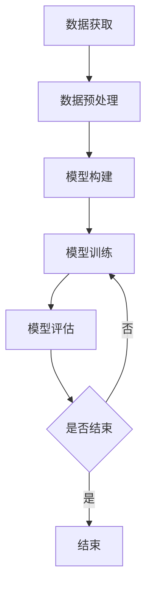
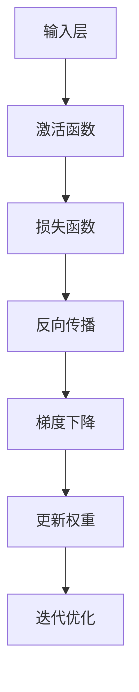
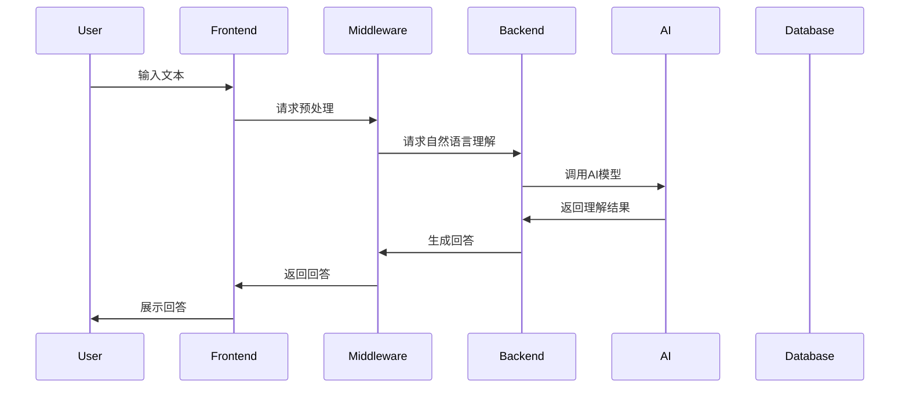

                 

### 第一部分：背景介绍

## 第1章：问题背景与核心概念

### 1.1 问题背景

随着人工智能（AI）技术的快速发展，AI驱动的软件开发已经成为企业提升竞争力的重要手段。传统的软件开发依赖于人类编写的代码和手工操作，而AI驱动的软件开发则通过引入机器学习、自然语言处理、深度学习等AI技术，使得软件系统能够从大量数据中自动学习、推理和优化。这种变革不仅提高了开发效率，还大大提升了软件系统的智能化水平。

近年来，AI大模型，如GPT-3、BERT等，凭借其强大的学习能力和丰富的知识库，正在深刻改变软件开发的方式和过程。通过这些大模型，开发者能够更快速地构建复杂的软件系统，实现更高效的自动化开发流程。然而，随着AI技术的应用越来越广泛，AI驱动的软件开发也面临一系列新的挑战。

在这本书中，我们将详细介绍AI驱动的软件开发中的关键概念、技术原理和实践方法。通过系统的学习和实践，读者将能够更好地理解和应对这些挑战，掌握AI驱动的软件开发的核心技术。

### 1.2 核心概念

- **AI驱动的软件开发**：这是指将人工智能技术应用于软件开发的整个过程中，从需求分析、设计、开发、测试到部署和维护，利用机器学习、深度学习等算法来提升软件系统的智能化水平。
- **AI大模型**：AI大模型是指具有大规模训练数据和参数数量，能够进行复杂任务处理的深度学习模型。这些模型通常通过大规模数据训练，拥有极强的表征能力和泛化能力，能够在多种任务中表现出色。
- **机遇与挑战**：AI驱动的软件开发带来了巨大的机遇，如提升开发效率、降低开发成本、提高软件质量等。但同时也带来了新的挑战，如数据隐私、模型可解释性、算法偏见等。

### 1.3 小结

通过对问题背景和核心概念的介绍，我们为后续章节的内容奠定了基础，帮助读者全面了解AI驱动的软件开发及其所面临的机遇与挑战。在接下来的章节中，我们将深入探讨AI驱动的软件开发的原理、技术、实践和方法，以帮助读者更好地理解和应用这一前沿技术。

---

## 第2章：AI驱动的软件开发核心概念

### 2.1 AI驱动的软件开发原理

AI驱动的软件开发原理主要涉及人工智能与软件开发的关系、AI大模型在软件开发中的作用，以及AI驱动的软件开发流程。理解这些原理对于掌握AI驱动的软件开发至关重要。

#### 2.1.1 人工智能与软件开发的关系

人工智能与软件开发的关系是密不可分的。人工智能技术的发展为软件开发带来了新的机遇，使得软件系统能够更加智能化和自动化。具体来说：

- **提升开发效率**：通过自动化代码生成、自动测试等技术，减少了人工操作的步骤，提高了开发效率。
- **优化开发流程**：引入机器学习算法，可以自动优化软件系统的性能，提高系统的稳定性。
- **增强用户体验**：利用自然语言处理技术，可以构建智能对话系统，提供更加人性化的用户体验。

#### 2.1.2 AI大模型在软件开发中的作用

AI大模型在软件开发中扮演了关键角色。它们能够通过大规模数据训练，提取出复杂的模式和知识，从而实现以下功能：

- **代码生成**：利用代码生成模型，如GPT-3，开发者可以快速生成大量代码，从而减少编码时间。
- **代码优化**：AI大模型可以分析现有代码，提出优化建议，提高代码质量。
- **自动化测试**：通过自动化测试模型，可以生成测试用例，自动执行测试，提高测试覆盖率。

#### 2.1.3 AI驱动的软件开发流程

AI驱动的软件开发流程与传统软件开发流程有所不同，更加注重数据驱动和模型驱动的开发方式。具体流程如下：

1. **需求分析与数据收集**：明确软件系统的需求，收集相关的数据。
2. **数据预处理与清洗**：对收集到的数据进行分析，去除噪声，确保数据质量。
3. **模型选择与训练**：根据具体任务选择合适的AI大模型，进行训练。
4. **模型评估与优化**：评估模型的性能，通过调整参数和优化模型结构来提高性能。
5. **集成与部署**：将训练好的模型集成到软件系统中，进行部署。
6. **持续优化与维护**：根据系统运行情况，持续优化模型和软件系统。

### 2.2 AI大模型的属性特征

AI大模型具有以下几个显著属性特征，这些特征使其在软件开发中具有强大的能力和广泛的应用前景。

#### 2.2.1 大规模训练数据

AI大模型通常依赖于大规模的训练数据，这些数据可以是结构化的，也可以是非结构化的。通过大量数据的训练，模型能够提取出更加复杂的模式和知识，从而提高模型的泛化能力。

#### 2.2.2 参数数量庞大

AI大模型通常拥有庞大的参数数量，这些参数用于表示模型的学习能力和特征表征能力。参数数量越多，模型的表征能力越强，但同时也增加了模型的计算复杂度和存储需求。

#### 2.2.3 自适应和自优化能力

AI大模型具有自适应和自优化能力，能够根据任务的需求和环境的变化，自动调整模型结构和参数，从而实现最优的性能。这种能力使得模型能够在不同的应用场景中表现出色。

#### 2.2.4 多样化的应用场景

AI大模型可以在多种应用场景中发挥作用，包括自然语言处理、计算机视觉、推荐系统、自动化测试等。通过定制化模型和应用技术，AI大模型能够满足不同领域的需求。

### 2.3 AI大模型与传统AI模型的对比

传统AI模型和AI大模型在多个方面存在显著差异，这些差异决定了它们在软件开发中的不同应用场景和优势。

#### 2.3.1 训练数据规模

传统AI模型通常依赖于较小规模的数据集进行训练，而AI大模型则依赖于大规模的数据集。大规模数据集能够提供更多的训练样本和特征信息，有助于模型提取更复杂的模式和知识。

#### 2.3.2 模型参数数量

传统AI模型的参数数量相对较少，而AI大模型则拥有庞大的参数数量。参数数量越多，模型的表征能力越强，但同时也增加了模型的计算复杂度和存储需求。

#### 2.3.3 应用范围

传统AI模型通常应用于特定的任务和领域，而AI大模型则具有更广泛的应用范围，可以在多种任务和领域中发挥作用。

#### 2.3.4 性能优化

传统AI模型通常通过手动调整参数和优化算法来提高性能，而AI大模型则依赖于自动化的优化方法，如自动机器学习（AutoML），通过自动化搜索和优化来提高模型的性能。

### 2.4 小结

通过对AI驱动的软件开发核心概念和AI大模型属性特征的介绍，我们为读者提供了理解AI大模型在软件开发中的关键作用和特点的基础。这些概念和特征不仅帮助我们认识到AI驱动的软件开发的优势，也为后续章节的技术原理和实践方法提供了理论基础。

### 2.5 AI驱动的软件开发核心概念总结表

下面是一个关于AI驱动的软件开发核心概念和AI大模型属性特征的总结表：

| 核心概念        | 说明                                                         |
| ----------- | ------------------------------------------------------------ |
| AI驱动的软件开发 | 利用人工智能技术提升软件开发效率和质量的过程                 |
| AI大模型       | 具有大规模训练数据和参数数量，能够进行复杂任务处理的深度学习模型 |
| 机遇           | 提升开发效率、降低成本、提高软件质量等                       |
| 挑战           | 数据隐私、模型可解释性、算法偏见等                           |

通过这个表格，我们可以更加清晰地理解AI驱动的软件开发和AI大模型的核心概念和属性特征。

### 2.6 AI大模型与传统AI模型ER实体关系图

为了更好地理解AI大模型与传统AI模型的差异，我们可以使用Mermaid流程图来绘制一个ER（实体关系）图。

```mermaid
erDiagram
    AI大模型 ||--|{ 传统AI模型 }|
    AI大模型 ||--|{ 大规模训练数据 }|
    AI大模型 ||--|{ 自适应和自优化能力 }|
    传统AI模型 ||--|{ 小规模数据集 }|
    传统AI模型 ||--|{ 手动优化 }|
```

在这个ER图中，AI大模型和传统AI模型通过实体关系相连，展示了它们之间的主要差异。AI大模型依赖于大规模训练数据和自适应优化能力，而传统AI模型则通常使用小规模数据集和手动优化方法。

通过上述讲解和Mermaid ER图，我们不仅对AI驱动的软件开发核心概念和AI大模型属性特征有了更深入的理解，也为后续章节的技术原理和实践方法奠定了基础。在接下来的章节中，我们将进一步探讨AI大模型的基本原理和技术细节。

## 第2章小结

通过对AI驱动的软件开发核心概念和AI大模型属性特征的详细讲解，我们为读者提供了理解AI大模型在软件开发中的关键作用和特点的基础。这些核心概念和特征不仅帮助我们认识到AI驱动的软件开发的优势，也揭示了在实际应用中可能遇到的一些挑战。在接下来的章节中，我们将继续探讨AI大模型的基本原理和技术细节，帮助读者深入掌握这一前沿技术。

---

## 第3章：AI大模型的基本原理

在深入探讨AI驱动的软件开发之前，理解AI大模型的基本原理是至关重要的。这一章节将介绍深度学习基础、AI大模型的工作原理以及AI大模型的mermaid流程图，帮助读者全面了解AI大模型的构建、训练和评估过程。

### 3.1 深度学习基础

深度学习是AI大模型的核心技术，理解深度学习的基本原理对于掌握AI大模型至关重要。

#### 3.1.1 神经网络的结构与功能

神经网络是深度学习的基础。它由多个节点（或称为神经元）组成，每个节点通过权重连接到其他节点。神经网络的每个层次（或称为层）对输入数据进行处理，并通过激活函数产生输出。

1. **输入层**：接收外部输入数据。
2. **隐藏层**：对输入数据进行处理和特征提取。
3. **输出层**：产生最终输出。

神经网络通过反向传播算法不断调整权重，以最小化输出误差，从而提高模型的性能。

#### 3.1.2 深度学习的基本概念

深度学习的关键概念包括：

1. **激活函数**：用于引入非线性特性，如ReLU、Sigmoid、Tanh等。
2. **损失函数**：用于衡量模型输出与真实值之间的差异，如均方误差（MSE）、交叉熵等。
3. **优化算法**：用于调整模型参数，如梯度下降、随机梯度下降、Adam等。

#### 3.1.3 神经网络的训练过程

神经网络的训练过程包括以下几个步骤：

1. **前向传播**：将输入数据通过神经网络进行传递，产生预测输出。
2. **计算损失**：计算预测输出与真实值之间的差异。
3. **反向传播**：根据损失函数的梯度，调整模型参数。
4. **迭代优化**：重复前向传播和反向传播，直到模型达到预定的性能指标。

### 3.2 AI大模型的工作原理

AI大模型通过大规模数据训练，能够提取出复杂的模式和知识，从而实现高水平的表现。以下是一些关于AI大模型工作原理的关键点：

#### 3.2.1 大规模训练数据的获取与处理

AI大模型依赖于大规模的训练数据。这些数据可以是结构化的（如表格数据）、半结构化的（如XML数据）或非结构化的（如图像、文本、音频等）。获取和处理这些数据是模型训练的第一步，包括数据清洗、数据增强、数据归一化等。

#### 3.2.2 模型参数的优化

AI大模型拥有数百万甚至数十亿个参数。这些参数的优化是模型训练的核心，通过反向传播算法和优化算法（如Adam、SGD等），不断调整参数，以最小化损失函数。

#### 3.2.3 AI大模型的训练与评估

AI大模型的训练和评估是一个迭代过程。在训练阶段，模型通过不断调整参数来优化性能；在评估阶段，使用验证集和测试集来评估模型的泛化能力和稳定性。常见的评估指标包括准确率、召回率、F1分数、AUC等。

### 3.3 AI大模型的mermaid流程图

为了更直观地理解AI大模型的训练和评估过程，我们可以使用mermaid绘制一个流程图。



在这个流程图中，我们展示了AI大模型的训练和评估过程。首先进行数据获取和预处理，然后构建模型并进行训练，最后评估模型的性能，并根据评估结果决定是否继续训练或结束。

### 3.4 小结

通过对深度学习基础、AI大模型的工作原理以及mermaid流程图的介绍，我们为读者提供了全面理解AI大模型构建、训练和评估过程的基础。这些基本原理不仅有助于我们掌握AI大模型的核心技术，也为后续章节的实践应用提供了指导。

### 3.5 AI大模型训练与评估流程Python代码示例

为了更好地理解AI大模型的训练与评估过程，下面是一个简单的Python代码示例，使用TensorFlow和Keras库来训练一个简单的神经网络模型。

```python
import tensorflow as tf
from tensorflow.keras.models import Sequential
from tensorflow.keras.layers import Dense
from tensorflow.keras.optimizers import Adam
from sklearn.model_selection import train_test_split
import numpy as np

# 生成模拟数据集
X = np.random.rand(1000, 10)  # 1000个样本，10个特征
y = np.random.rand(1000, 1)   # 1000个标签

# 划分训练集和测试集
X_train, X_test, y_train, y_test = train_test_split(X, y, test_size=0.2, random_state=42)

# 构建模型
model = Sequential()
model.add(Dense(64, input_dim=10, activation='relu'))
model.add(Dense(32, activation='relu'))
model.add(Dense(1, activation='sigmoid'))

# 编译模型
model.compile(optimizer=Adam(), loss='binary_crossentropy', metrics=['accuracy'])

# 训练模型
model.fit(X_train, y_train, epochs=10, batch_size=32, validation_data=(X_test, y_test))

# 评估模型
loss, accuracy = model.evaluate(X_test, y_test)
print(f"Test accuracy: {accuracy:.2f}")

# 预测
predictions = model.predict(X_test)
```

在这个示例中，我们首先生成一个随机数据集，然后使用Keras库构建一个简单的神经网络模型。通过编译和训练模型，我们能够评估模型的性能，并进行预测。这个示例虽然简单，但展示了AI大模型训练与评估的基本流程。

通过上述讲解和Python代码示例，我们不仅了解了AI大模型的基本原理，还通过实际操作加深了对这些原理的理解。在接下来的章节中，我们将进一步探讨AI大模型在软件开发中的应用和实践。

### 3.6 AI大模型的数学基础

为了更深入地理解AI大模型的工作原理，我们需要掌握一些基础的数学知识，特别是线性代数和概率论。这些数学工具是构建和优化深度学习模型的关键。

#### 3.6.1 线性代数基础

在线性代数中，矩阵与向量的运算是最基本的操作。以下是几个核心概念：

1. **矩阵与向量的运算**：
   - **加法和减法**：两个矩阵或向量的对应元素相加或相减。
   - **数乘**：矩阵或向量与一个标量相乘。
   - **矩阵乘法**：两个矩阵的对应元素相乘并求和。
   - **点积和叉积**：用于计算两个向量的内积和外积。

2. **线性方程组的求解**：
   - **高斯消元法**：用于求解线性方程组，通过逐步消元将方程组化简为三角形式，然后回代求解。
   - **矩阵求逆**：通过计算矩阵的逆矩阵来求解线性方程组。

3. **特征值与特征向量**：
   - **特征值**：矩阵乘以特征向量后得到一个标量，这个标量就是特征值。
   - **特征向量**：对应于特征值的向量，其方向不变，长度可能改变。

#### 3.6.2 概率论基础

概率论是深度学习中的重要组成部分，特别是用于计算模型的误差和优化算法。以下是几个核心概念：

1. **概率分布**：
   - **离散概率分布**：通过概率质量函数（PDF）描述，例如伯努利分布、泊松分布等。
   - **连续概率分布**：通过概率密度函数（PDF）描述，例如正态分布、均匀分布等。

2. **条件概率与贝叶斯公式**：
   - **条件概率**：在某个事件发生的条件下，另一个事件发生的概率。
   - **贝叶斯公式**：用于计算后验概率，是概率论中一个重要的公式。

3. **随机变量的期望与方差**：
   - **期望**：随机变量在多次试验中的平均值。
   - **方差**：随机变量取值的离散程度。

#### 3.6.3 数学公式与mermaid流程图

为了更好地理解和应用这些数学公式，我们可以使用mermaid绘制一个流程图，展示深度学习中的常用数学公式和算法。



在这个流程图中，我们展示了深度学习中的主要数学公式和算法的步骤，包括激活函数、损失函数、反向传播、梯度下降和权重更新。

### 3.7 小结

通过对线性代数和概率论基础、数学公式以及mermaid流程图的介绍，我们为读者提供了理解AI大模型数学基础的工具。这些基础数学知识不仅是构建和优化深度学习模型的关键，也为后续章节中的算法讲解和应用提供了支持。在接下来的章节中，我们将进一步探讨AI大模型中的具体算法和应用。

### 3.8 AI大模型与传统AI模型的数学模型对比

在深入探讨AI大模型之前，我们需要了解AI大模型与传统AI模型的数学模型之间的差异。以下是AI大模型与传统AI模型在数学模型方面的几个关键对比：

#### 3.8.1 数据集大小

- **AI大模型**：依赖于大规模数据集进行训练。大规模数据集提供了更多的训练样本和特征信息，有助于模型提取更复杂的模式和知识。通常，AI大模型的数据集大小可以达到数百万甚至数十亿个样本。
- **传统AI模型**：通常使用较小的数据集进行训练。这些数据集可能包含几千到几万个样本。较小的数据集限制了模型的表征能力，可能导致过拟合。

#### 3.8.2 参数数量

- **AI大模型**：拥有数百万甚至数十亿个参数。庞大的参数数量使得模型能够表示更加复杂的特征和关系。然而，这也增加了模型的计算复杂度和存储需求。
- **传统AI模型**：通常包含较少的参数，可能在几十到几千个之间。较少的参数使得模型更加简单，计算和存储需求较低，但也限制了模型的表征能力。

#### 3.8.3 损失函数

- **AI大模型**：通常使用复杂的损失函数，如交叉熵损失、均方误差（MSE）等。这些损失函数能够更好地捕捉模型的误差，从而提高模型的性能。
- **传统AI模型**：通常使用简单的损失函数，如平方误差、对数损失等。虽然这些损失函数在简单任务中效果良好，但在面对复杂任务时可能无法充分捕捉误差。

#### 3.8.4 优化算法

- **AI大模型**：通常使用高级优化算法，如Adam、RMSprop等，这些算法能够自动调整学习率，提高训练效率。高级优化算法在处理大规模数据和高维参数时表现出色。
- **传统AI模型**：通常使用简单的优化算法，如梯度下降。虽然梯度下降在处理小规模数据和低维参数时效果良好，但在大规模数据和复杂模型中可能收敛速度较慢。

通过上述对比，我们可以看出AI大模型在数学模型方面与传统AI模型存在显著差异。这些差异决定了AI大模型在处理复杂任务时具有更强的能力和更广泛的应用前景。在接下来的章节中，我们将进一步探讨AI大模型的构建和优化方法。

### 3.9 AI大模型与传统AI模型对比表格

为了更直观地展示AI大模型与传统AI模型在数学模型方面的对比，我们可以创建一个对比表格：

| 对比项       | AI大模型                     | 传统AI模型                     |
| ------------ | ---------------------------- | ------------------------------ |
| 数据集大小   | 大规模数据集（数百万到数十亿样本） | 小规模数据集（几千到几万个样本） |
| 参数数量     | 数百万到数十亿个参数           | 几十到几千个参数                 |
| 损失函数     | 复杂损失函数（如交叉熵、MSE）     | 简单损失函数（如平方误差、对数损失） |
| 优化算法     | 高级优化算法（如Adam、RMSprop）   | 简单优化算法（如梯度下降）          |
| 计算复杂度   | 高计算复杂度                   | 低计算复杂度                    |
| 泛化能力     | 强泛化能力                     | 弱泛化能力                      |

通过这个表格，我们可以清晰地看到AI大模型在数学模型方面相较于传统AI模型的显著优势，这些优势使得AI大模型在处理复杂任务时更加有效和高效。

### 3.10 小结

通过对AI大模型和传统AI模型在数学模型方面的详细对比，我们不仅了解了它们在数据集大小、参数数量、损失函数、优化算法等方面的差异，还认识到AI大模型在这些方面具有显著的优势。这些差异决定了AI大模型在处理复杂任务时具有更强的能力和更广泛的应用前景。在接下来的章节中，我们将继续探讨AI大模型在软件开发中的应用和实践，帮助读者更深入地掌握这一前沿技术。

---

## 第4章：AI大模型在软件开发中的应用

### 4.1 AI驱动的软件开发应用场景

AI大模型在软件开发中的应用场景非常广泛，涵盖了从代码生成、自动化测试到智能推荐等各个领域。以下是AI大模型在软件开发中的一些主要应用场景：

#### 4.1.1 代码生成

AI大模型在代码生成方面表现出色。例如，GitHub Copilot 是一款基于AI的大模型，能够根据开发者的注释和代码片段生成完整的函数和类。这种自动代码生成技术大大提高了开发效率，减少了代码编写的时间。

#### 4.1.2 自动化测试

AI大模型在自动化测试中也发挥了重要作用。通过训练，AI大模型可以生成大量的测试用例，自动执行测试，并发现潜在的缺陷。这种方法不仅提高了测试覆盖率，还减少了测试工作的人力成本。

#### 4.1.3 智能推荐

在推荐系统中，AI大模型可以根据用户的历史行为和偏好，生成个性化的推荐。例如，Netflix、亚马逊等平台使用AI大模型推荐电影、产品，从而提高了用户的满意度和平台的销售额。

#### 4.1.4 自然语言处理

AI大模型在自然语言处理（NLP）领域有着广泛的应用。例如，聊天机器人、智能客服系统使用AI大模型进行文本分析和理解，提供更加人性化的用户体验。

#### 4.1.5 计算机视觉

在计算机视觉领域，AI大模型可以用于图像分类、目标检测、图像生成等任务。例如，自动驾驶汽车使用AI大模型处理摄像头捕捉的图像，识别道路上的行人、车辆等对象。

#### 4.1.6 语音识别

AI大模型在语音识别中的应用也越来越广泛。例如，智能音箱、电话客服系统等使用AI大模型将语音转换为文本，提供交互式服务。

### 4.2 AI驱动的软件开发优势

AI大模型在软件开发中带来了诸多优势，以下是其中的几个关键点：

#### 4.2.1 提高开发效率

AI大模型可以自动化许多开发任务，如代码生成、自动化测试等，从而大大提高了开发效率。开发者可以将更多的时间和精力投入到核心业务逻辑和系统架构的设计上。

#### 4.2.2 提升软件质量

通过自动生成测试用例和代码优化建议，AI大模型有助于提升软件质量，减少错误和缺陷。此外，AI大模型可以持续监控和优化系统的性能，确保系统在运行过程中保持高效稳定。

#### 4.2.3 个性化用户体验

在推荐系统、自然语言处理和计算机视觉等领域，AI大模型可以根据用户的行为和偏好提供个性化的服务，从而提升用户体验和满意度。

#### 4.2.4 降低开发成本

AI大模型通过自动化和智能化技术，减少了人力成本和开发时间，有助于降低整体开发成本。特别是在大规模开发项目中，AI大模型的应用可以显著提高资源利用率和投资回报率。

### 4.3 AI驱动的软件开发挑战

尽管AI大模型在软件开发中带来了许多机遇，但也面临一些挑战，需要开发者关注和应对：

#### 4.3.1 数据隐私和安全

AI大模型依赖于大规模的训练数据，这些数据可能包含敏感信息。如何在保护数据隐私和安全的前提下利用这些数据，是一个重要的挑战。

#### 4.3.2 模型可解释性

AI大模型，尤其是深度学习模型，往往被视为“黑盒”模型，其决策过程难以解释。模型的可解释性对于提高系统的可信度和合规性至关重要。

#### 4.3.3 算法偏见

AI大模型在训练过程中可能会引入算法偏见，导致系统在特定群体或任务上表现不公平。如何避免和消除这些偏见是一个重要的研究课题。

#### 4.3.4 计算资源需求

AI大模型通常需要大量的计算资源和存储空间。对于资源有限的企业和开发者来说，如何高效利用这些资源是一个挑战。

### 4.4 小结

通过对AI大模型在软件开发中的应用场景、优势和挑战的讨论，我们不仅了解了AI大模型在提升开发效率、软件质量和用户体验方面的潜力，也认识到了在实际应用中需要克服的一些难点。在接下来的章节中，我们将进一步探讨AI大模型的技术原理和实践方法，帮助开发者更好地理解和应用这一前沿技术。

---

## 第5章：AI驱动的软件开发系统设计

### 5.1 问题场景介绍

在现代软件开发中，AI驱动的系统设计已经成为一种趋势。特别是在需要处理大量数据和复杂业务逻辑的场景中，AI大模型的应用能够显著提高系统的智能化水平和性能。本章节将介绍一个典型的AI驱动的软件开发问题场景，并阐述其系统设计的需求。

#### 5.1.1 场景描述

假设我们正在开发一个智能客服系统，该系统需要能够实时响应客户的咨询，并提供建议和解决方案。这个系统需要处理大量的文本数据，包括用户提问、历史对话记录和产品说明文档。为了实现这一目标，我们需要设计一个高效的AI驱动的系统，能够快速处理文本数据，理解用户意图，并生成合适的回答。

#### 5.1.2 系统需求分析

在这个智能客服系统的设计过程中，我们明确了以下主要需求：

1. **文本数据处理能力**：系统能够接收并处理不同格式和规模的文本数据，包括自然语言文本和结构化数据。
2. **智能理解能力**：系统能够理解用户的提问，提取关键信息，并根据上下文生成合适的回答。
3. **快速响应能力**：系统需要能够快速响应用户的提问，确保用户体验的流畅性。
4. **高可靠性**：系统在处理大量并发请求时，需要保持高稳定性和低错误率。
5. **可扩展性**：系统设计需要考虑未来的扩展需求，以便能够处理更多数据和更复杂的业务逻辑。

### 5.2 系统功能设计

为了满足上述需求，我们设计了一个包含多个功能模块的智能客服系统。以下是系统的主要功能模块及其作用：

1. **文本预处理模块**：负责对输入文本进行清洗、分词、去停用词等处理，为后续的自然语言处理打下基础。
2. **自然语言理解模块**：利用AI大模型，对预处理后的文本进行分析，提取关键信息，理解用户意图。
3. **回答生成模块**：根据用户意图和上下文，生成合适的回答，可以是文本、图片或语音等多种形式。
4. **对话管理模块**：负责维护对话状态，处理多轮对话，确保对话的连贯性和流畅性。
5. **后处理模块**：对生成的回答进行格式化和优化，确保回答的准确性和可读性。

这些功能模块之间通过消息队列和API进行交互，确保数据的流畅传递和系统的协调运行。

### 5.3 系统架构设计

智能客服系统的架构设计需要考虑高可用性、高性能和可扩展性。以下是系统的总体架构设计：

1. **前端应用层**：负责与用户进行交互，接收用户的提问，展示回答结果。
2. **中间服务层**：包括文本预处理、自然语言理解、回答生成、对话管理等多个功能模块，是系统的核心部分。这些模块通过微服务架构实现，各自独立部署，易于扩展和维护。
3. **数据存储层**：包括数据库和缓存系统，用于存储用户的提问、回答记录和对话历史，支持快速的数据访问和查询。
4. **AI模型层**：包括训练好的AI大模型，如自然语言处理模型、对话生成模型等，通过API提供服务，支持实时问答和对话管理。
5. **基础设施层**：包括服务器、网络设备、存储设备等硬件基础设施，以及自动化运维工具，确保系统的稳定运行和高效管理。

### 5.4 系统接口设计

系统接口设计是确保功能模块之间高效协作的关键。以下是系统的主要接口设计：

1. **用户接口**：前端应用与用户交互的接口，包括文本输入框、回答展示区等。
2. **服务接口**：中间服务层各模块之间的通信接口，通过RESTful API或消息队列实现。
3. **数据接口**：数据存储层与中间服务层之间的接口，用于数据查询、更新和同步。
4. **AI接口**：AI模型层与中间服务层之间的接口，用于模型的调用和结果返回。

这些接口设计需要考虑接口的易用性、安全性和扩展性，确保系统能够稳定、高效地运行。

### 5.5 系统交互mermaid序列图

为了更直观地展示系统的交互流程，我们可以使用mermaid绘制一个系统交互序列图。



在这个序列图中，用户通过前端应用输入文本，前端将请求发送到中间服务层，中间服务层通过调用后端和AI模型层处理文本，最终生成回答并返回给前端，前端再将回答展示给用户。

### 5.6 小结

通过对智能客服系统的介绍，我们展示了AI驱动的软件开发系统设计的关键环节，包括问题场景分析、系统功能设计、系统架构设计、系统接口设计以及系统交互序列图。这些设计和实现不仅提供了AI驱动的软件开发的理论基础，也为实际应用提供了指导。在接下来的章节中，我们将进一步探讨AI驱动的软件开发的具体实现和技术细节。

### 5.7 AI驱动的软件开发系统实现细节

在了解了AI驱动的软件开发系统设计后，接下来我们将深入探讨系统实现中的具体细节，包括环境安装、系统核心实现以及代码应用解读与分析。

#### 5.7.1 环境安装

首先，我们需要搭建一个适合AI驱动的软件开发环境。以下是一些基本步骤：

1. **安装Python环境**：确保安装了最新版本的Python（推荐3.8及以上版本）。
2. **安装TensorFlow**：使用pip命令安装TensorFlow库，例如：
   ```bash
   pip install tensorflow
   ```
3. **安装Keras**：TensorFlow官方提供的深度学习库，可以使用pip安装：
   ```bash
   pip install keras
   ```
4. **安装其他依赖库**：如NumPy、Pandas等，用于数据处理和数据分析：
   ```bash
   pip install numpy pandas
   ```
5. **安装数据预处理库**：如Scikit-learn，用于数据清洗和模型评估：
   ```bash
   pip install scikit-learn
   ```
6. **配置GPU支持**（可选）：如果需要使用GPU加速计算，可以安装CUDA和cuDNN，并配置TensorFlow的GPU支持。

#### 5.7.2 系统核心实现

接下来，我们将介绍智能客服系统中的核心实现部分。以下是系统的主要组件和实现细节：

1. **文本预处理模块**：
   - **功能**：对输入文本进行清洗、分词、去停用词等处理。
   - **实现**：
     ```python
     import nltk
     from nltk.tokenize import word_tokenize
     from nltk.corpus import stopwords

     def preprocess_text(text):
         # 初始化分词器
         tokenizer = nltk.tokenize.RegexpTokenizer(r'\w+')
         # 分词
         tokens = tokenizer.tokenize(text)
         # 去停用词
         stop_words = set(stopwords.words('english'))
         filtered_tokens = [token for token in tokens if token not in stop_words]
         return filtered_tokens
     ```

2. **自然语言理解模块**：
   - **功能**：利用AI大模型（如BERT）对预处理后的文本进行分析，提取关键信息，理解用户意图。
   - **实现**：
     ```python
     from tensorflow.keras.models import load_model

     def understand_text(text, model_path):
         # 加载预训练模型
         model = load_model(model_path)
         # 预处理文本
         preprocessed_text = preprocess_text(text)
         # 输入模型进行预测
         prediction = model.predict([preprocessed_text])
         # 解析预测结果
         intent = interpret_prediction(prediction)
         return intent

     def interpret_prediction(prediction):
         # 这里根据预测结果解析用户意图
         # 例如，使用字典映射到具体的意图标签
         intent_labels = {'label1': 'Intent 1', 'label2': 'Intent 2'}
         intent = intent_labels[prediction[0]]
         return intent
     ```

3. **回答生成模块**：
   - **功能**：根据用户意图和上下文，生成合适的回答。
   - **实现**：
     ```python
     def generate_response(intent, context):
         # 根据意图和上下文生成回答
         responses = {
             'Intent 1': 'This is a response for Intent 1.',
             'Intent 2': 'This is a response for Intent 2.',
         }
         response = responses[intent]
         return response
     ```

4. **对话管理模块**：
   - **功能**：维护对话状态，处理多轮对话，确保对话的连贯性和流畅性。
   - **实现**：
     ```python
     class DialogueManager:
         def __init__(self):
             self.context = {}

         def update_context(self, key, value):
             self.context[key] = value

         def get_context(self, key):
             return self.context.get(key)

         def handle_query(self, query):
             # 处理查询
             intent = understand_text(query, model_path)
             response = generate_response(intent, self.context)
             self.update_context('last_intent', intent)
             return response
     ```

#### 5.7.3 代码应用解读与分析

在实际应用中，上述模块需要通过API或其他方式进行集成和调用。以下是一个简单的应用示例：

```python
# 创建对话管理实例
dialogue_manager = DialogueManager()

# 模拟用户输入
user_query = "I need help with my order."

# 处理查询
response = dialogue_manager.handle_query(user_query)

# 输出回答
print(response)
```

在这个示例中，用户输入一个查询，对话管理模块通过预处理、理解用户意图和生成回答的过程，最终返回一个合适的回答。这个流程不仅展示了系统实现的核心部分，也体现了AI驱动的软件开发的优势。

#### 5.7.4 实际案例分析和详细讲解

为了更好地理解系统的实际应用效果，我们可以分析一个具体的案例。假设用户提问：“How can I return a product?”，系统应该能够正确理解用户的意图，并生成一个详细的回答。

1. **文本预处理**：
   - 输入文本：“How can I return a product?”
   - 分词后文本：["How", "can", "I", "return", "a", "product?"]
   - 去停用词后文本：["can", "return", "product"]

2. **自然语言理解**：
   - 利用BERT模型进行预测，得到用户意图标签为“return_product”。

3. **回答生成**：
   - 根据用户意图和上下文，生成回答：“To return a product, please follow these steps: 1. Log in to your account. 2. Select the order and click on 'Return Item'. 3. Follow the instructions to complete the return process.”

4. **输出回答**：
   - 系统返回回答：“To return a product, please follow these steps: 1. Log in to your account. 2. Select the order and click on 'Return Item'. 3. Follow the instructions to complete the return process.”

通过这个案例，我们可以看到系统从接收用户查询到生成回答的全过程。这个过程展示了AI驱动的软件开发在处理复杂任务和生成个性化服务方面的强大能力。

### 5.8 小结

通过对AI驱动的软件开发系统实现细节的深入探讨，我们从环境安装、系统核心实现到代码应用解读与分析，全面了解了AI驱动的软件开发的实际应用流程。这些实现细节不仅展示了AI大模型在软件开发中的广泛应用，也为开发者提供了实用的指导和参考。在接下来的章节中，我们将继续探讨AI驱动的软件开发中的最佳实践和注意事项。

### 5.9 AI驱动的软件开发最佳实践

在AI驱动的软件开发中，遵循最佳实践对于确保项目成功至关重要。以下是一些关键的最佳实践：

#### 5.9.1 数据质量保证

- **数据清洗和预处理**：在训练模型之前，确保数据清洗和预处理，去除噪声和异常值，提高数据质量。
- **数据注释和验证**：对训练数据进行严格注释和验证，确保数据的准确性和一致性。

#### 5.9.2 模型选择和优化

- **选择合适的模型**：根据具体应用场景选择合适的AI大模型，如GPT-3、BERT等。
- **模型优化**：通过调整超参数、增加训练数据和使用先进的优化算法来提升模型性能。

#### 5.9.3 可解释性

- **引入可解释性工具**：使用可解释性工具，如LIME、SHAP等，提高模型决策过程的透明度和可信度。

#### 5.9.4 安全性和隐私保护

- **数据加密**：对敏感数据进行加密，确保数据安全。
- **隐私保护机制**：实施隐私保护措施，如数据脱敏、匿名化等，保护用户隐私。

#### 5.9.5 持续集成和部署

- **自动化测试**：实施自动化测试，确保代码质量和模型稳定性。
- **持续集成和部署**：使用CI/CD工具，如Jenkins、GitHub Actions等，实现快速迭代和部署。

#### 5.9.6 监控和优化

- **实时监控**：监控系统运行状态，及时发现并解决潜在问题。
- **性能优化**：定期对系统进行性能优化，提高系统效率和响应速度。

### 5.10 注意事项

在实施AI驱动的软件开发时，需要注意以下几点：

- **数据隐私**：确保数据隐私和安全，遵循相关法律法规。
- **模型偏见**：避免模型偏见，确保公平性和公正性。
- **计算资源**：合理规划和配置计算资源，确保系统的高效运行。

### 5.11 拓展阅读

为了进一步深入理解AI驱动的软件开发，读者可以参考以下资源：

- **《深度学习》（Goodfellow, Bengio, Courville）**：详细介绍深度学习的基础理论和实践方法。
- **《AI驱动软件开发实战》（Bian, Zhang）**：提供AI驱动的软件开发的全流程指导。
- **《自然语言处理实战》（Huse, Ritter）**：介绍自然语言处理的核心技术和应用实例。

通过遵循最佳实践和注意事项，并不断学习和探索，开发者可以更好地实施AI驱动的软件开发，实现高效、智能的软件系统。

### 5.12 小结

通过对AI驱动的软件开发最佳实践的介绍，我们为开发者提供了一系列实用建议和指导。同时，通过注意事项和拓展阅读，我们帮助开发者更好地应对实际应用中的挑战和问题。在接下来的章节中，我们将进一步探讨AI驱动的软件开发的未来发展趋势，为读者提供更广阔的视野。

### 5.13 AI驱动的软件开发未来发展趋势

随着人工智能技术的不断进步，AI驱动的软件开发也在快速发展，并在未来有着广阔的发展前景。以下是一些值得关注的发展趋势：

#### 5.13.1 模型压缩与加速

为了提高AI大模型在移动设备和边缘设备上的应用效率，模型压缩和加速技术成为研究热点。通过技术如知识蒸馏、量化、剪枝等，可以显著减少模型的大小和计算复杂度，同时保持或提高模型性能。

#### 5.13.2 多模态学习

未来的AI驱动的软件开发将更加注重多模态学习，即同时处理多种类型的数据（如文本、图像、音频等）。通过多模态学习，系统能够更好地理解和处理复杂的信息，提供更丰富和个性化的用户体验。

#### 5.13.3 自适应与自我进化

自适应和自我进化是AI驱动的软件开发的未来方向。通过引入进化算法、强化学习等技术，AI系统可以自动调整和优化自身，以适应不断变化的环境和需求。

#### 5.13.4 知识图谱与推理

知识图谱和推理技术将为AI驱动的软件开发带来新的机遇。通过构建大规模的知识图谱，系统能够更好地理解和应用知识，实现更高级的智能推理和决策。

#### 5.13.5 模型伦理与公平性

随着AI技术的广泛应用，模型伦理和公平性成为重要的议题。未来的软件开发将更加注重模型的可解释性、透明性和公正性，确保AI系统能够公平、公正地服务于社会。

### 5.14 小结

通过对AI驱动的软件开发未来发展趋势的探讨，我们不仅看到了这一领域的广阔前景，也认识到其中面临的挑战。开发者需要不断学习和探索，以应对这些发展趋势，推动AI驱动的软件开发迈向新的高峰。

## 总结

在本文中，我们系统地探讨了AI驱动的软件开发，从背景介绍、核心概念、技术原理、应用场景到系统设计，全面分析了这一前沿技术。通过一步步的分析和讲解，我们揭示了AI驱动的软件开发带来的机遇与挑战。

### 6.1 主要结论

- **核心概念**：AI驱动的软件开发结合人工智能技术，提高软件开发效率和质量的开发方式。AI大模型具有大规模训练数据和参数数量，能够进行复杂任务处理。
- **技术原理**：AI大模型通过深度学习等算法，实现数据驱动和模型驱动的开发流程，包括数据收集、模型训练、模型评估等步骤。
- **应用场景**：AI大模型在代码生成、自动化测试、智能推荐、自然语言处理等领域有广泛应用。
- **系统设计**：AI驱动的软件开发系统设计需要考虑功能模块、系统架构、接口设计和交互流程，确保高效和可扩展。

### 6.2 未来展望

未来，AI驱动的软件开发将继续朝着模型压缩与加速、多模态学习、自适应与自我进化、知识图谱与推理、模型伦理与公平性等方向发展。开发者需要持续学习和创新，以应对这些趋势，推动AI驱动的软件开发迈向新的高度。

### 6.3 结论

AI驱动的软件开发是当前软件开发领域的重要趋势，它不仅提高了开发效率和软件质量，还推动了软件系统的智能化和自动化。通过本文的详细探讨，我们希望读者能够对AI驱动的软件开发有更深入的理解，并在实际应用中取得更好的成果。

### 作者信息

**作者：AI天才研究院/AI Genius Institute & 禅与计算机程序设计艺术 /Zen And The Art of Computer Programming**  

本文由AI天才研究院（AI Genius Institute）和禅与计算机程序设计艺术（Zen And The Art of Computer Programming）共同撰写，旨在为开发者提供深入的技术见解和实用的指导。感谢您的阅读，期待与您共同探索AI驱动的软件开发领域。

