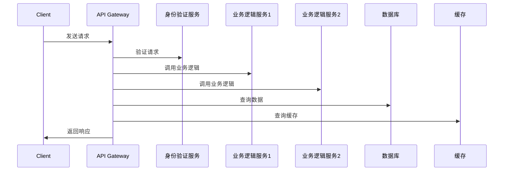
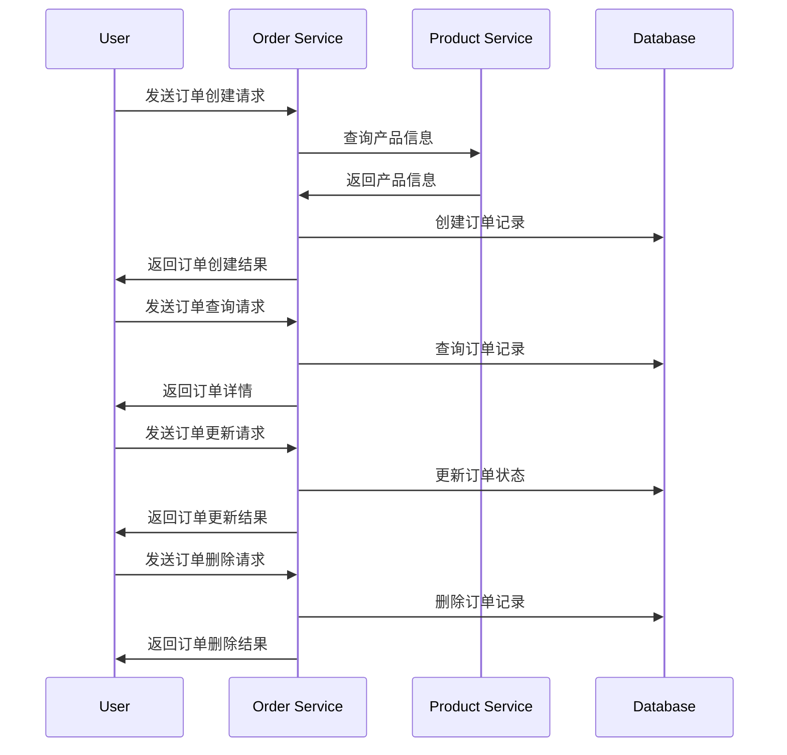

                 

### 第一部分：API设计与理论基础

#### 第1章：API设计与进化的历史背景

### 1.1 API设计的基本概念与核心要素

#### 1.1.1 API的定义和作用

**API（应用程序编程接口）** 是一组定义、协议及相关工具的集合，允许不同软件之间进行交互和通信。它隐藏了底层系统的复杂性，提供了一种简洁、一致的方式来访问特定功能或服务。

**API设计** 涉及到定义这些交互的接口规格，包括数据格式、请求和响应的结构，以及可能的安全性和性能要求。

API 的主要作用包括：
1. **系统集成**：通过API，不同的软件和服务可以轻松集成，实现数据的共享和功能的扩展。
2. **可扩展性**：API设计使得系统可以在不改变现有功能的情况下添加新功能或服务。
3. **资源管理**：API为应用程序提供了一个统一的接口来访问和管理各种资源，如数据库、文件系统等。

#### 1.1.2 API设计的核心要素

成功的API设计通常涉及以下几个核心要素：
1. **接口定义**：定义API的行为、功能和约束，包括请求和响应的结构。
2. **数据格式**：确定数据传输的格式，如JSON、XML等。
3. **状态管理**：确保API在处理多个请求时的一致性和稳定性。
4. **安全性**：设计防注入、认证和授权机制，保护API不被恶意使用。
5. **易用性**：设计简洁、直观、易于使用的API，减少用户的认知负荷。
6. **文档和示例**：提供详细的API文档和示例，帮助开发者理解和使用API。

### 1.2 API设计的进化历程

#### 1.2.1 从SOAP到RESTful API

- **SOAP（简单对象访问协议）**：SOAP是早期广泛使用的API协议，基于XML，具有高度可扩展性和跨平台性。然而，由于其复杂的XML格式和严格的XML规范，SOAP在实际应用中遇到了一些性能和易用性问题。

- **RESTful API**：随着互联网的普及和Web服务的兴起，RESTful架构逐渐成为API设计的主流。RESTful API基于HTTP协议，使用标准的方法（GET、POST、PUT、DELETE等）来表示操作，并采用JSON或XML作为数据交换格式。其设计原则简单、易于理解，具有较高的性能和可扩展性。

#### 1.2.2 RESTful API的设计原则

RESTful API设计遵循以下原则：

1. **统一接口**：所有API操作都通过统一的接口进行，使用HTTP方法（GET、POST、PUT、DELETE等）表示操作类型。
2. **无状态**：每次请求都是独立的，不依赖于之前的请求或状态，提高了系统的可伸缩性和可靠性。
3. **资源导向**：API以资源为中心进行设计，每个资源都有一个唯一的URL作为访问入口。
4. **分层系统**：API设计应该是一个分层结构，允许不同层（客户端、服务端、API网关等）独立开发、部署和升级。

#### 1.2.3 GraphQL的出现与优势

- **GraphQL**：作为一种较新的API设计模式，GraphQL旨在解决RESTful API的一些局限，如过度检索和资源浪费。GraphQL通过允许客户端直接指定所需数据的方式，实现了对数据的精细化控制，从而提高了API的性能和灵活性。

- **GraphQL的优势**：

  1. **灵活性**：客户端可以精确指定所需数据的结构和类型，避免了过度检索和数据冗余。
  2. **性能优化**：减少了网络请求的数量和数据传输量，提高了API的响应速度。
  3. **易于集成**：GraphQL可以与现有系统无缝集成，不改变后端的数据结构和业务逻辑。

### 1.3 API设计的重要性与挑战

#### 1.3.1 API设计的重要性

- **提高开发效率**：良好的API设计可以减少开发者的认知负荷，提高开发速度和代码质量。
- **促进系统集成**：统一的API设计使得不同的软件和服务可以轻松集成，提高系统的可扩展性和灵活性。
- **提高用户体验**：简洁、直观的API设计可以提高用户的使用体验，降低使用门槛。

#### 1.3.2 API设计面临的挑战

- **兼容性**：在设计API时，需要考虑不同平台、操作系统和浏览器的兼容性。
- **性能优化**：随着数据量和请求量的增加，API的性能优化成为一个重要的挑战。
- **安全性**：设计安全的API，防止数据泄露和恶意攻击，是API设计中的一个关键问题。
- **文档与维护**：提供详细、易懂的API文档，并保持文档的更新，是API设计中的一个重要挑战。

### 1.4 本章小结

本章介绍了API设计的基本概念、核心要素、进化历程以及设计的重要性与挑战。接下来，我们将深入探讨RESTful API和GraphQL API的设计最佳实践，帮助读者更好地理解和应用这两种先进的API设计模式。

----------------------------------------------------------------

## 第二部分：RESTful API设计最佳实践

### 第2章：RESTful API设计最佳实践

#### 2.1 RESTful API基础

##### 2.1.1 RESTful API的基本概念

RESTful API（Representational State Transfer，表述性状态转移）是一种基于HTTP协议的应用程序接口设计风格。RESTful API通过使用标准的HTTP方法（GET、POST、PUT、DELETE等）和URL来表示资源的操作，具有高度的可扩展性和易用性。

##### 2.1.2 RESTful API的资源定义

在RESTful API设计中，**资源** 是核心概念。资源可以是任何可以通过URI（统一资源标识符）访问的对象，如数据记录、文件、服务、甚至是业务逻辑。每个资源都有一个唯一的URL作为访问入口。

##### 2.1.3 HTTP方法与RESTful API

RESTful API使用HTTP方法来表示资源的操作。以下是常用的HTTP方法：

1. **GET**：获取资源。通常用于查询数据，不改变资源的状态。
2. **POST**：创建资源。用于创建新的资源，通常需要提交一个包含必要信息的请求体。
3. **PUT**：更新资源。用于更新现有的资源，通常需要提交一个包含新状态的请求体。
4. **DELETE**：删除资源。用于删除指定的资源。

#### 2.2 RESTful API设计原则

##### 2.2.1 一致性原则

**一致性原则** 要求API设计保持一致，确保客户端开发者能够轻松理解和使用API。一致性体现在以下几个方面：

1. **方法与操作的对应**：确保每个HTTP方法与对应的操作一致，如GET对应查询、POST对应创建等。
2. **响应结构一致**：确保API的响应结构一致，包括状态码、响应体和错误处理。
3. **命名与语义一致**：使用统一的命名规范和语义，如使用复数形式表示集合资源。

##### 2.2.2 状态化原则

**状态化原则** 指的是API通过HTTP请求和响应来管理和传递状态，而不是通过在客户端或服务端保持状态。这有助于提高系统的可伸缩性和可靠性。

1. **无状态客户端**：客户端在每个请求中包含所有必要的信息，不依赖于之前的请求状态。
2. **状态化服务端**：服务端可以根据请求和响应来管理状态，但不应在长时间内保持状态。

##### 2.2.3 无状态原则

**无状态原则** 是RESTful API设计的基础，意味着每个请求都应该包含所有必要的信息，不依赖于之前的请求。这有助于提高系统的性能和可伸缩性。

1. **请求之间无关联**：每个请求都是独立的，不会受到之前请求的影响。
2. **服务端不保持状态**：服务端不会在内存中保留关于客户端的状态信息。

#### 2.3 RESTful API设计实践

##### 2.3.1 URL设计

良好的URL设计是RESTful API成功的关键之一。以下是一些URL设计最佳实践：

1. **简洁明了**：使用简洁的URL，避免冗长的路径。
2. **层次结构**：使用层次结构来表示资源的层次关系，如`/users/{id}/orders`。
3. **参数化**：使用参数化URL来表示资源的动态部分，如`/users/{userId}`。
4. **查询参数**：使用查询参数来传递额外的信息，如`/users?role=admin`。

##### 2.3.2 HTTP状态码的使用

正确的HTTP状态码的使用是确保API设计良好的关键。以下是一些常见的HTTP状态码及其用途：

- **200 OK**：表示请求成功。
- **201 Created**：表示资源已成功创建。
- **400 Bad Request**：表示请求无效或格式错误。
- **401 Unauthorized**：表示请求未授权。
- **403 Forbidden**：表示请求被拒绝。
- **404 Not Found**：表示请求的资源不存在。
- **500 Internal Server Error**：表示服务器内部错误。

##### 2.3.3 响应数据的格式

API的响应数据格式通常为JSON或XML。以下是一些响应数据格式的最佳实践：

1. **结构清晰**：确保响应数据的结构清晰、易于理解。
2. **明确的数据类型**：使用明确的数据类型，如`String`、`Number`、`Boolean`等。
3. **错误信息的传递**：在响应中包含详细的错误信息，帮助客户端定位和解决问题。
4. **分页与过滤**：对于大量数据的响应，使用分页和过滤功能，提高响应速度。

#### 2.4 RESTful API安全性考虑

##### 2.4.1 常见的安全威胁

RESTful API设计面临的安全威胁包括：

1. **未授权访问**：未经授权的访问导致数据泄露或滥用。
2. **注入攻击**：通过注入恶意代码或SQL语句，攻击者可以执行未经授权的操作。
3. **中间人攻击**：攻击者截取并篡改客户端和服务器之间的通信。
4. **信息泄露**：敏感信息（如用户密码、API密钥等）泄露。

##### 2.4.2 安全性设计最佳实践

以下是一些安全性设计最佳实践：

1. **身份验证与授权**：使用身份验证和授权机制，确保只有授权用户可以访问API。
2. **HTTPS**：使用HTTPS协议加密通信，防止中间人攻击。
3. **参数验证**：对输入参数进行严格验证，防止注入攻击。
4. **API密钥与签名**：使用API密钥和签名机制，确保API请求的合法性和完整性。

#### 2.5 本章小结

本章介绍了RESTful API设计的基础概念、设计原则和实践。通过遵循这些最佳实践，可以设计出简洁、一致、安全且易于使用的RESTful API。接下来，我们将探讨GraphQL API的设计最佳实践，进一步优化API的性能和灵活性。

----------------------------------------------------------------

## 第三部分：GraphQL API设计最佳实践

### 第3章：GraphQL API设计最佳实践

#### 3.1 GraphQL基础

##### 3.1.1 GraphQL的定义和特点

GraphQL是一种用于API设计的查询语言，由Facebook于2015年开源。GraphQL旨在解决传统RESTful API的一些局限性，如数据冗余和过度检索。与RESTful API不同，GraphQL允许客户端指定所需的数据，从而实现数据检索的精确控制。

**GraphQL的特点** 包括：

1. **灵活性**：客户端可以精确指定所需数据，避免了过度检索和数据冗余。
2. **性能优化**：减少了网络请求的数量和数据传输量，提高了API的响应速度。
3. **易于集成**：GraphQL可以与现有系统无缝集成，不改变后端的数据结构和业务逻辑。
4. **强大的类型系统**：GraphQL提供了强大的类型系统，使得数据类型定义更加明确，易于理解和使用。

##### 3.1.2 GraphQL查询语言

GraphQL查询语言是一种用于描述数据查询的声明性语言。通过编写GraphQL查询，客户端可以精确指定所需的数据结构。以下是一个简单的GraphQL查询示例：

```graphql
{
  user(id: 1) {
    name
    email
    orders {
      id
      total
    }
  }
}
```

在这个查询中，客户端请求了用户ID为1的用户的信息，包括用户的姓名、电子邮件以及其订单的ID和总价。

##### 3.1.3 GraphQL的优势与局限性

**优势**：

1. **灵活性**：客户端可以精确指定所需的数据，减少了过度检索和数据冗余。
2. **性能优化**：减少了网络请求的数量和数据传输量，提高了API的响应速度。
3. **易于集成**：GraphQL可以与现有系统无缝集成，不改变后端的数据结构和业务逻辑。
4. **强大的类型系统**：提供了强大的类型系统，使得数据类型定义更加明确，易于理解和使用。

**局限性**：

1. **查询性能**：对于复杂的查询，GraphQL可能会产生大量的SQL查询，从而降低查询性能。
2. **文档编写**：GraphQL查询通常需要手动编写，增加了文档的编写和维护成本。
3. **学习曲线**：相较于传统的RESTful API，GraphQL的学习曲线较高，需要开发者掌握新的查询语言和架构设计。

#### 3.2 GraphQL API设计原则

##### 3.2.1 类型系统

类型系统是GraphQL的核心特性之一，它使得数据定义更加明确和易于理解。在GraphQL中，每个数据字段都有明确的数据类型，如`String`、`Int`、`Boolean`等。这有助于减少数据误解和错误。

**类型定义示例**：

```graphql
type User {
  id: ID!
  name: String!
  email: String!
  orders: [Order!]!
}

type Order {
  id: ID!
  total: Float!
  items: [Item!]!
}

type Item {
  id: ID!
  name: String!
  quantity: Int!
  price: Float!
}
```

在这个示例中，我们定义了`User`、`Order`和`Item`三种类型，每种类型都有其独特的属性和数据类型。

##### 3.2.2 查询与突变

**查询**（Query）用于读取数据，而**突变**（Mutation）用于修改数据。GraphQL通过这两种操作实现了数据的读取和写入。

**查询示例**：

```graphql
{
  user(id: 1) {
    name
    email
    orders {
      id
      total
    }
  }
}
```

**突变示例**：

```graphql
mutation {
  createUser(name: "Alice", email: "alice@example.com") {
    id
    name
    email
  }
}
```

在这个突变示例中，客户端发送了一个请求，创建了一个新的用户，并接收了新用户的ID和基本信息。

##### 3.2.3 性能优化

为了提高GraphQL API的性能，以下是一些最佳实践：

1. **查询缓存**：使用缓存来减少数据库查询次数，提高响应速度。
2. **批量查询**：通过批量查询减少网络请求次数，提高查询效率。
3. **分页**：对于大量数据的查询，使用分页来优化响应速度。
4. **避免复杂查询**：避免编写过于复杂的查询，以减少服务器的负担。

#### 3.3 GraphQL API设计实践

##### 3.3.1 模式设计

在设计GraphQL API时，以下是一些模式设计的最佳实践：

1. **模块化**：将API划分为模块，每个模块负责不同的功能，提高代码的可维护性和可扩展性。
2. **类型分离**：将查询和突变操作分离到不同的类型，提高代码的可读性。
3. **避免深度嵌套**：避免深度嵌套查询，以减少服务器的负担和响应时间。

##### 3.3.2 查询优化

为了优化GraphQL查询，以下是一些最佳实践：

1. **查询拆分**：将复杂的查询拆分为多个简单的查询，提高查询的可读性和执行效率。
2. **查询缓存**：使用查询缓存来减少数据库查询次数，提高响应速度。
3. **避免重复查询**：避免在同一个查询中多次查询相同的数据，以减少服务器的负担。

##### 3.3.3 突变设计

在设计突变操作时，以下是一些最佳实践：

1. **操作分离**：将不同的操作分离到不同的突变类型中，提高代码的可读性和可维护性。
2. **事务处理**：使用事务处理来确保数据的完整性和一致性。
3. **错误处理**：提供详细的错误信息和处理机制，帮助客户端正确处理异常情况。

#### 3.4 GraphQL API安全性考虑

##### 3.4.1 常见的安全威胁

GraphQL API设计面临的安全威胁包括：

1. **未授权访问**：未经授权的访问导致数据泄露或滥用。
2. **注入攻击**：通过注入恶意代码或SQL语句，攻击者可以执行未经授权的操作。
3. **中间人攻击**：攻击者截取并篡改客户端和服务器之间的通信。
4. **信息泄露**：敏感信息（如用户密码、API密钥等）泄露。

##### 3.4.2 安全性设计最佳实践

以下是一些安全性设计最佳实践：

1. **身份验证与授权**：使用身份验证和授权机制，确保只有授权用户可以访问API。
2. **HTTPS**：使用HTTPS协议加密通信，防止中间人攻击。
3. **参数验证**：对输入参数进行严格验证，防止注入攻击。
4. **API密钥与签名**：使用API密钥和签名机制，确保API请求的合法性和完整性。

#### 3.5 本章小结

本章介绍了GraphQL的基础概念、设计原则和实践。通过遵循这些最佳实践，可以设计出灵活、高效且安全的GraphQL API。在下一章中，我们将深入探讨API设计的系统分析与架构设计，帮助读者更全面地理解API设计的方法和技巧。

----------------------------------------------------------------

## 第四部分：API设计的系统分析与架构设计

### 第4章：API设计的系统分析与架构设计

#### 4.1 API设计的系统分析

在进行API设计之前，系统分析是一个关键步骤。系统分析包括问题场景分析、需求分析、系统功能设计等。

##### 4.1.1 问题场景分析

**问题场景分析** 是指识别系统所面临的问题和挑战。例如，在电子商务系统中，常见的问题场景包括：

1. **数据一致性**：在多用户并发操作时，如何确保数据的完整性？
2. **性能优化**：在高并发访问下，如何提高系统的响应速度？
3. **安全性**：如何防止恶意攻击和数据泄露？

##### 4.1.2 需求分析

**需求分析** 是指识别系统的功能需求和性能需求。在API设计中，需求分析可以帮助我们确定需要提供的API接口和功能。例如：

1. **数据检索**：提供获取用户信息、订单信息的接口。
2. **数据修改**：提供新增、更新和删除用户信息、订单信息的接口。
3. **安全性**：提供身份验证、权限验证等安全接口。

##### 4.1.3 系统功能设计

**系统功能设计** 是指将需求转化为具体的系统功能。在设计API时，可以采用领域驱动设计（Domain-Driven Design，简称DDD）的方法，通过领域模型来描述系统的功能和结构。

**领域模型** 是指描述系统业务逻辑和业务规则的数据结构。领域模型通常采用类图（Class Diagram）来表示，如下所示：

```mermaid
classDiagram
    User <<entity>>
    Order <<entity>>
    Product <<entity>>

    User *--1 Order
    Order *--1 Product

    class User {
        -id: Integer
        -name: String
        -email: String
    }

    class Order {
        -id: Integer
        -total: Float
        -createdAt: Date
    }

    class Product {
        -id: Integer
        -name: String
        -price: Float
    }
```

在这个领域模型中，`User`、`Order`和`Product`是实体类，它们之间的关系是`User`可以拥有多个`Order`，每个`Order`可以包含多个`Product`。

#### 4.2 API架构设计

API架构设计是API设计的重要组成部分，它决定了API的性能、可扩展性和安全性。API架构设计通常包括以下方面：

##### 4.2.1 系统架构设计原则

**系统架构设计原则** 包括：

1. **分层设计**：将系统划分为不同的层次，如表示层、业务层和数据层，提高系统的可维护性和可扩展性。
2. **模块化设计**：将系统功能划分为模块，每个模块独立开发、测试和部署，提高系统的可维护性。
3. **安全性设计**：在设计API时，考虑安全性，如身份验证、权限验证、数据加密等。

##### 4.2.2 API架构设计实践

在API架构设计实践中，可以采用以下模式：

1. **API网关模式**：API网关作为系统的统一入口，负责处理所有的API请求，包括路由、认证、日志记录等功能。API网关可以简化客户端的调用流程，提高系统的安全性。
2. **微服务架构**：将系统功能划分为多个微服务，每个微服务独立运行、部署和扩展。微服务架构可以提高系统的可扩展性和灵活性。
3. **缓存层**：在API架构中添加缓存层，如Redis或Memcached，可以减少数据库查询次数，提高系统的响应速度。

##### 4.2.3 API架构图

以下是一个简单的API架构图示例：



在这个架构图中，客户端发送请求到API网关，API网关负责处理请求并调用相应的业务逻辑服务。业务逻辑服务可以从数据库或缓存中获取数据，并将结果返回给客户端。

#### 4.3 API接口设计

API接口设计是API设计的关键环节，它决定了客户端如何与系统进行交互。在API接口设计时，以下是一些最佳实践：

1. **RESTful API设计**：遵循RESTful设计原则，使用标准的HTTP方法（GET、POST、PUT、DELETE等）和URL来表示资源的操作。
2. **参数设计**：合理设计API参数，包括路径参数、查询参数和请求体参数。确保参数的名称和类型清晰、易于理解。
3. **响应设计**：设计清晰的API响应结构，包括状态码、响应体和错误信息。确保响应体中包含必要的信息，便于客户端处理。
4. **安全性设计**：在API接口中实现安全性设计，包括身份验证、权限验证和数据加密等。

#### 4.4 API交互设计

API交互设计是指客户端与API之间的通信流程。在API交互设计时，以下是一些最佳实践：

1. **异步通信**：对于耗时的操作，如数据查询和处理，采用异步通信方式，提高系统的响应速度。
2. **超时设置**：设置合理的超时时间，避免长时间占用系统资源。
3. **重试机制**：在遇到网络错误或系统故障时，实现重试机制，提高系统的可用性。

#### 4.5 API测试与维护

API测试与维护是确保API质量和稳定性的关键。以下是一些最佳实践：

1. **自动化测试**：编写自动化测试脚本，对API进行功能测试、性能测试和安全测试。
2. **文档维护**：定期更新API文档，确保文档的准确性和完整性。
3. **监控与告警**：对API性能和异常进行监控，实现实时告警，及时发现问题并处理。

#### 4.6 本章小结

本章介绍了API设计的系统分析与架构设计。通过系统分析，可以帮助我们明确问题场景和需求，从而设计出合理的API接口。通过架构设计，我们可以构建出高性能、高可扩展性和安全的API系统。在下一章中，我们将探讨API性能优化和安全性设计。

----------------------------------------------------------------

## 第五部分：API性能优化

### 第5章：API性能优化

#### 5.1 API性能优化的重要性

在现代互联网应用中，API性能优化是确保用户体验的关键因素之一。良好的性能优化不仅可以提高系统的响应速度，还可以降低延迟和带宽消耗，从而提升整体用户体验。

**API性能优化的重要性** 包括：

1. **提高用户满意度**：快速响应的API可以减少用户的等待时间，提高用户满意度。
2. **增加业务收入**：性能优化的API可以提高系统的负载能力，支持更多的用户同时访问，从而增加业务收入。
3. **降低运营成本**：通过优化API性能，可以减少服务器资源的消耗，降低运营成本。

#### 5.2 API性能优化策略

为了优化API性能，可以采取以下策略：

##### 5.2.1 缓存策略

缓存策略是一种常见且有效的性能优化方法。通过缓存，可以减少对后端服务或数据库的查询次数，从而降低响应时间和带宽消耗。

**缓存策略** 包括：

1. **客户端缓存**：在客户端实现缓存，减少对API的重复请求。
2. **服务端缓存**：在服务端实现缓存，如Redis、Memcached等，提高数据读取速度。
3. **动态缓存**：根据用户行为和访问模式动态调整缓存策略，提高缓存命中率。

##### 5.2.2 数据库优化

数据库优化是提高API性能的关键步骤。以下是一些常用的数据库优化策略：

1. **索引优化**：为常用的查询字段创建索引，提高查询速度。
2. **查询优化**：优化SQL查询，避免复杂的查询逻辑，减少查询时间。
3. **分库分表**：对于大数据量的场景，可以考虑将数据库拆分为多个数据库或表，提高查询性能。
4. **读写分离**：通过读写分离，提高数据库的并发处理能力。

##### 5.2.3 并发处理

在高并发访问的场景下，合理的并发处理策略可以显著提高API性能。

**并发处理策略** 包括：

1. **线程池**：使用线程池来管理并发请求，避免创建过多的线程，提高系统资源利用率。
2. **异步处理**：对于耗时的操作，如数据库查询和外部服务调用，采用异步处理方式，提高系统的响应速度。
3. **分布式处理**：将请求分发到多个服务器或节点，提高系统的并发处理能力。

##### 5.2.4 负载均衡

负载均衡是一种将请求均匀分配到多个服务器或节点的策略，可以提高系统的可用性和性能。

**负载均衡策略** 包括：

1. **轮询负载均衡**：将请求按照顺序分配到每个服务器，适用于负载较为均匀的场景。
2. **最小连接负载均衡**：将请求分配到当前连接数最少的服务器，适用于连接数限制的场景。
3. **会话保持**：根据用户的会话信息，将请求分配到相同的服务器，确保用户会话的一致性。

##### 5.2.5 网络优化

网络优化也是提高API性能的重要方面。以下是一些网络优化策略：

1. **压缩数据**：通过压缩数据，减少网络传输的数据量，降低带宽消耗。
2. **HTTP/2**：采用HTTP/2协议，提高数据的传输效率。
3. **CDN**：使用内容分发网络（CDN），将静态资源缓存在距离用户较近的节点，减少数据传输距离。

##### 5.2.6 监控与调优

**监控与调优** 是确保API性能稳定的重要手段。以下是一些监控与调优策略：

1. **性能监控**：实时监控API的性能指标，如响应时间、吞吐量、错误率等。
2. **日志分析**：分析API的访问日志，识别性能瓶颈和潜在问题。
3. **持续调优**：根据监控数据和日志分析结果，持续优化API性能。

#### 5.3 API性能优化实践

以下是一个API性能优化的实践案例：

**案例背景**：某电商平台的订单查询API在高并发访问下出现响应缓慢的问题。

**解决方案**：

1. **缓存策略**：在服务端实现缓存，将用户最近一次查询的订单数据缓存起来，减少数据库查询次数。
2. **数据库优化**：优化SQL查询，使用索引优化查询速度。将查询语句拆分为多个部分，分别查询后再合并结果。
3. **异步处理**：对于订单数据的预处理操作，采用异步处理方式，减少响应时间。
4. **负载均衡**：使用负载均衡器，将请求均匀分配到多个服务器，避免单点瓶颈。
5. **网络优化**：通过CDN加速静态资源的访问，减少数据传输距离。

**效果评估**：通过上述优化措施，订单查询API的响应时间从原来的3秒降低到1秒，吞吐量提高了30%，用户满意度显著提升。

#### 5.4 本章小结

本章介绍了API性能优化的重要性、策略和实践。通过合理的性能优化策略，可以显著提高API的响应速度和吞吐量，提升用户体验和业务效益。在下一章中，我们将探讨API安全性设计。

----------------------------------------------------------------

## 第六部分：API安全性设计

### 第6章：API安全性设计

#### 6.1 API安全性设计的重要性

在当今网络环境中，API安全性设计至关重要。不安全的API容易成为恶意攻击的目标，导致数据泄露、服务中断和业务损失。因此，设计安全的API是保护系统和数据的关键步骤。

**API安全性设计的重要性** 包括：

1. **保护数据隐私**：防止敏感数据（如用户密码、信用卡信息等）泄露。
2. **防止恶意攻击**：阻止SQL注入、跨站脚本攻击（XSS）等常见的安全威胁。
3. **保障业务连续性**：通过安全设计，降低因安全漏洞导致的系统瘫痪和业务中断风险。
4. **提升用户信任**：安全的API可以提高用户的信任度，增加用户粘性和忠诚度。

#### 6.2 API安全性设计原则

在进行API安全性设计时，应遵循以下原则：

##### 6.2.1 最小权限原则

最小权限原则要求API仅授予用户完成其任务所需的最小权限，避免用户获得不必要的权限。这可以减少恶意行为和误操作的风险。

##### 6.2.2 最小表面原则

最小表面原则要求API接口仅暴露必要的功能，隐藏不必要的细节。这可以减少攻击面，降低被攻击的风险。

##### 6.2.3 安全默认原则

安全默认原则要求API在设计和实现时，默认采取安全措施。例如，默认启用HTTPS、验证和授权机制，确保API在默认情况下是安全的。

##### 6.2.4 防篡改原则

防篡改原则要求API在传输过程中保护数据不被篡改。通过使用数字签名、加密等手段，确保数据在传输过程中保持完整性。

##### 6.2.5 持续监控与改进原则

持续监控与改进原则要求对API进行持续的安全监控，及时发现和修复安全漏洞。通过定期的安全审计和漏洞扫描，确保API的安全性。

#### 6.3 API安全性设计实践

以下是一些API安全性设计实践：

##### 6.3.1 身份验证与授权

身份验证与授权是API安全性设计的基础。以下是一些常见的身份验证和授权机制：

1. **基本身份验证**：通过用户名和密码进行身份验证，适用于简单的应用场景。
2. **OAuth 2.0**：一种开放标准，用于授权第三方应用访问受保护资源，具有灵活的认证方式和权限管理。
3. **JWT（JSON Web Token）**：一种基于JSON的开放标准，用于生成安全令牌，验证用户身份和权限。

##### 6.3.2 数据加密

数据加密是保护数据隐私和完整性的重要手段。以下是一些常用的数据加密方法：

1. **HTTPS**：通过SSL/TLS协议，确保数据在传输过程中的加密。
2. **数据加密存储**：将敏感数据（如用户密码、信用卡信息等）加密存储在数据库中。
3. **数据签名**：使用数字签名确保数据在传输过程中未被篡改。

##### 6.3.3 输入验证

输入验证是防止SQL注入、XSS等攻击的关键步骤。以下是一些输入验证的最佳实践：

1. **过滤与编码**：对用户输入进行过滤和编码，防止恶意输入。
2. **参数化查询**：使用参数化查询，避免SQL注入攻击。
3. **使用安全库**：使用经过验证的安全库，如OWASP编码规范，确保输入验证的准确性。

##### 6.3.4 API签名与校验

API签名与校验是一种用于验证API请求有效性的机制。以下是一些API签名与校验的方法：

1. **HMAC（Hash-based Message Authentication Code）**：使用哈希算法生成签名，确保请求的完整性和真实性。
2. **时间戳**：在请求中包含时间戳，确保请求的有效期，防止重放攻击。

##### 6.3.5 安全日志与监控

安全日志与监控是及时发现和响应安全事件的重要手段。以下是一些安全日志与监控的最佳实践：

1. **日志记录**：记录API的访问日志，包括用户信息、请求参数、响应结果等。
2. **实时监控**：使用安全监控工具，实时监控API的访问情况，及时发现异常行为。
3. **告警与响应**：设置告警机制，确保在发生安全事件时能够及时响应和处理。

#### 6.4 安全性测试与审计

安全性测试与审计是确保API安全性的重要环节。以下是一些安全性测试与审计的方法：

1. **渗透测试**：模拟攻击者的攻击行为，发现和验证API的安全漏洞。
2. **代码审计**：对API的源代码进行审计，识别潜在的安全漏洞。
3. **安全扫描**：使用自动化工具对API进行安全扫描，识别常见的安全漏洞。

#### 6.5 本章小结

本章介绍了API安全性设计的重要性、原则和实践。通过遵循这些安全性设计原则和实践，可以设计出安全、可靠的API系统，保护系统和数据免受恶意攻击。在下一章中，我们将探讨API设计工具与最佳实践。

----------------------------------------------------------------

## 第七部分：API设计工具与最佳实践

### 第7章：API设计工具与最佳实践

#### 7.1 API设计工具概述

在API设计中，使用合适的工具可以提高设计效率、减少错误并确保API的质量。以下是一些常用的API设计工具：

##### 1. Swagger/OpenAPI

**Swagger/OpenAPI** 是一种API设计规范，提供了一种统一的格式来描述API的接口、功能和限制。Swagger/OpenAPI文档可以通过Markdown、JSON或YAML格式编写，易于阅读和共享。

**优点**：

- **直观的文档**：生成易于理解和使用的API文档。
- **自动化测试**：支持自动生成API测试用例。
- **工具支持**：众多工具和框架支持Swagger/OpenAPI，如Postman、Insomnia、Spring Boot等。

##### 2. Postman

**Postman** 是一款流行的API调试和管理工具。Postman允许开发者创建、发送和调试API请求，支持多种协议和格式。

**优点**：

- **易用性**：直观的用户界面，快速上手。
- **协作功能**：支持团队协作，便于代码共享和审查。
- **自动化测试**：支持自动化测试用例的编写和执行。

##### 3. RAML

**RAML（RESTful API Modeling Language）** 是一种用于描述API的标记语言，支持多种编程语言和框架。RAML文档可以描述API的请求、响应、路由和验证等细节。

**优点**：

- **细粒度控制**：允许对API的每个细节进行精确描述。
- **易于迁移**：支持多种编程语言和框架，便于迁移。
- **文档生成**：可以自动生成API文档。

##### 4. Draw.io

**Draw.io** 是一款在线绘图工具，可以用于绘制API架构图、类图和序列图等。Draw.io支持多种图形格式和在线协作。

**优点**：

- **灵活性**：支持多种图形格式，便于自定义。
- **在线协作**：多人在线协作，实时更新。
- **易用性**：直观的界面，易于操作。

#### 7.2 API设计最佳实践

在设计API时，遵循以下最佳实践可以提高API的质量和可维护性：

##### 1. 明确API目标和用途

在设计API之前，明确API的目标和用途，包括API的受众、功能需求、性能要求等。这有助于确保API的设计符合业务需求。

##### 2. 设计简洁的API接口

简洁的API接口易于使用和理解。在设计API时，遵循RESTful原则，使用清晰、一致的命名规范和结构。避免过度设计，只暴露必要的功能。

##### 3. 提供详细的API文档

提供详细的API文档是确保API易于使用和理解的关键。API文档应包括接口描述、请求参数、响应结构、错误处理等详细信息。

##### 4. 实现良好的错误处理

良好的错误处理可以提高API的稳定性和可用性。确保API在遇到错误时能够正确返回错误信息，并提供解决问题的建议。

##### 5. 考虑性能和可扩展性

在设计API时，考虑性能和可扩展性。使用缓存、批量查询和异步处理等策略优化API性能，确保API能够支持高并发访问。

##### 6. 实现安全性设计

安全性设计是API设计的重要组成部分。实现身份验证、授权、数据加密等安全措施，确保API的数据安全和系统稳定性。

##### 7. 持续维护和更新

API设计是一个持续的过程。在API上线后，定期检查和更新API，修复发现的漏洞和问题，确保API的质量和稳定性。

#### 7.3 API设计案例分析

以下是一个API设计案例的分析：

**案例背景**：某电商平台需要设计一个订单管理API，提供订单查询、创建、更新和删除等功能。

**解决方案**：

1. **明确API目标和用途**：订单管理API主要用于处理订单相关的操作，包括查询订单信息、创建新订单、更新订单状态和删除订单等。

2. **设计简洁的API接口**：遵循RESTful原则，使用简洁、一致的命名规范和URL结构。例如：

   - 查询订单：`GET /orders/{orderId}`
   - 创建订单：`POST /orders`
   - 更新订单：`PUT /orders/{orderId}`
   - 删除订单：`DELETE /orders/{orderId}`

3. **提供详细的API文档**：使用Swagger/OpenAPI生成详细的API文档，包括接口描述、请求参数、响应结构、错误处理等。

4. **实现良好的错误处理**：在API中实现良好的错误处理，返回清晰的错误信息和解决方案。

5. **考虑性能和可扩展性**：使用缓存和异步处理优化API性能，确保API能够支持高并发访问。

6. **实现安全性设计**：实现OAuth 2.0身份验证和JWT授权，确保API的数据安全和系统稳定性。

7. **持续维护和更新**：定期检查和更新API，修复发现的漏洞和问题，确保API的质量和稳定性。

**效果评估**：通过上述解决方案，订单管理API的性能和安全性得到显著提升，用户满意度提高，系统稳定性和安全性得到保障。

#### 7.4 本章小结

本章介绍了API设计工具和最佳实践。通过使用合适的工具和遵循最佳实践，可以设计出高质量、安全、可靠的API。在下一章中，我们将通过案例分析深入探讨API设计的实际应用。

----------------------------------------------------------------

## 第八部分：API设计案例分析

### 第8章：API设计案例分析

#### 8.1 案例背景

本案例选取了一家大型电子商务平台（以下简称“电商平台”）的订单管理API作为分析对象。电商平台作为一个高度并发的系统，其订单管理API的设计至关重要，直接影响到用户体验和业务效率。

#### 8.2 项目介绍

电商平台的订单管理API主要提供以下功能：

1. **订单查询**：用户可以查询自己的订单详情。
2. **订单创建**：用户可以创建新的订单。
3. **订单更新**：用户可以更新订单的状态（如支付、发货等）。
4. **订单删除**：用户可以删除订单。

#### 8.3 系统功能设计

在系统功能设计阶段，采用领域驱动设计（DDD）方法，通过领域模型来描述系统的业务逻辑和功能。以下是一个简化的领域模型：

```mermaid
classDiagram
    User <<entity>>
    Order <<entity>>
    Product <<entity>>

    User *--1 Order
    Order *--1 Product

    class User {
        -id: Integer
        -name: String
        -email: String
    }

    class Order {
        -id: Integer
        -status: String
        -createdAt: Date
    }

    class Product {
        -id: Integer
        -name: String
        -price: Float
    }
```

在这个领域模型中，用户可以创建订单，每个订单包含多个产品，订单的状态可以更新。

#### 8.4 系统架构设计

电商平台的订单管理API采用了微服务架构，将订单管理功能划分为多个微服务，每个微服务独立部署和扩展。以下是一个简化的系统架构设计：



在这个架构设计中，订单服务是核心，负责处理订单的创建、查询、更新和删除。产品服务提供产品信息查询功能，订单服务通过调用产品服务获取订单所需的产品信息。

#### 8.5 系统接口设计

订单管理API的接口设计遵循RESTful原则，使用标准的HTTP方法（GET、POST、PUT、DELETE等）和URL结构来表示资源的操作。以下是一个简化的接口设计：

```plaintext
# 订单创建
POST /orders

Request Body:
{
  "userId": "123",
  "products": [
    { "productId": "456", "quantity": 2 },
    { "productId": "789", "quantity": 1 }
  ]
}

Response:
{
  "orderId": "12345",
  "status": "created"
}

# 订单查询
GET /orders/{orderId}

Response:
{
  "orderId": "12345",
  "status": "processing",
  "products": [
    { "productId": "456", "quantity": 2 },
    { "productId": "789", "quantity": 1 }
  ]
}

# 订单更新
PUT /orders/{orderId}

Request Body:
{
  "status": "shipped"
}

Response:
{
  "message": "Order status updated"
}

# 订单删除
DELETE /orders/{orderId}

Response:
{
  "message": "Order deleted"
}
```

在这个接口设计中，订单创建接口接受JSON格式的请求体，包含用户ID和订单产品的信息。订单查询、更新和删除接口使用路径参数来标识订单ID。

#### 8.6 系统交互设计

系统交互设计通过序列图（Sequence Diagram）来描述不同服务之间的交互过程。以下是一个简化的序列图：


在这个序列图中，用户通过订单服务与产品服务进行交互，订单服务负责处理订单的创建、查询、更新和删除操作，并最终将结果返回给用户。

#### 8.7 代码实现与解读

以下是一个简单的订单创建API的Python代码实现，使用Flask框架：

```python
from flask import Flask, request, jsonify
from models import create_order

app = Flask(__name__)

@app.route('/orders', methods=['POST'])
def create_order_api():
    order_data = request.json
    order_id, status = create_order(order_data)
    return jsonify({"orderId": order_id, "status": status})

if __name__ == '__main__':
    app.run()
```

在这个代码中，`create_order_api` 函数处理POST请求，接收JSON格式的订单数据，调用`create_order`函数创建订单，并返回订单ID和状态。

#### 8.8 实际案例分析与详细讲解

以一个实际案例——用户创建订单为例，分析订单管理API的设计和实现：

**案例描述**：用户在电商平台上购买了两件商品，需要创建一个订单。

**步骤1**：用户在购物车中选择了两件商品，提交购物车信息。

**步骤2**：电商平台的后端系统接收到用户提交的购物车信息，根据商品ID查询商品详细信息。

**步骤3**：后端系统将查询到的商品信息与用户提交的购物车信息进行合并，生成订单信息。

**步骤4**：后端系统将订单信息存储到数据库中，并返回订单ID和状态给用户。

**详细讲解**：

- **步骤1**：用户提交购物车信息时，需要验证用户身份，确保只有授权用户可以访问购物车数据。这一步骤涉及到身份验证和授权机制，确保API的安全性。
- **步骤2**：查询商品详细信息时，可以使用缓存来减少数据库查询次数，提高响应速度。这一步骤需要优化查询性能，确保快速响应。
- **步骤3**：订单信息的合并是一个数据处理的过程，需要确保数据的准确性和一致性。这一步骤涉及到数据处理和逻辑处理，需要确保API的稳定性和可靠性。
- **步骤4**：将订单信息存储到数据库时，需要确保数据的完整性和安全性。这一步骤需要实现数据存储和备份机制，确保数据的安全性和持久性。

#### 8.9 项目小结

通过本案例的分析，我们可以看到电商平台的订单管理API在设计上遵循了RESTful原则，实现了用户身份验证、商品信息查询、订单数据合并、订单存储等功能。在实现过程中，我们考虑了API的安全性、性能和可扩展性，确保了API的质量和稳定性。

- **优点**：

  - 使用RESTful原则，设计简洁、易于理解。
  - 实现了身份验证、授权、数据缓存等安全措施，确保了API的安全性。
  - 使用微服务架构，提高了系统的可扩展性和灵活性。

  - **缺点**：

    - 部分查询和数据处理逻辑较为复杂，需要进一步优化。
    - 缺乏详细的文档和示例，不利于开发者使用。

- **改进方向**：

  - 优化查询和数据处理逻辑，提高性能。
  - 提供详细的API文档和示例，方便开发者使用。
  - 添加监控和日志功能，实时监控API性能和异常。

通过不断优化和改进，电商平台的订单管理API可以更好地满足用户需求，提高用户体验和业务效率。

### 8.10 本章小结

本章通过电商平台的订单管理API案例，详细分析了API设计的系统功能、架构设计、接口设计、代码实现和实际案例。通过案例，我们可以更好地理解API设计的全过程，为实际项目提供参考和指导。

----------------------------------------------------------------

## 第九部分：API设计未来趋势与挑战

### 第9章：API设计未来趋势与挑战

#### 9.1 API设计未来趋势

随着技术的不断进步和业务需求的不断演变，API设计也在不断进化。以下是一些API设计未来可能的发展趋势：

##### 1. 云原生API设计

云原生（Cloud Native）是一种利用云计算环境来构建和运行应用程序的方法。云原生API设计将更加注重容器化、服务网格和自动化运维。这有助于提高API的性能、可靠性和可扩展性。

- **容器化**：使用容器（如Docker）来封装应用程序，实现快速部署和扩展。
- **服务网格**：使用服务网格（如Istio）来实现服务间通信的安全、监控和路由。
- **自动化运维**：使用自动化工具（如Kubernetes）来管理应用程序的生命周期，提高运维效率。

##### 2. AI驱动的API设计

人工智能（AI）技术在API设计中的应用将越来越广泛。通过AI，可以自动化API的设计、优化和测试，提高开发效率和质量。例如：

- **自动化API生成**：使用机器学习模型来自动生成API文档和接口定义。
- **智能监控与优化**：使用AI技术实时监控API性能，自动进行性能优化。

##### 3. 无服务器API设计

无服务器（Serverless）架构是一种基于云的服务，无需管理服务器。API设计将越来越多地采用无服务器架构，以降低成本、提高灵活性和可扩展性。

- **无服务器函数**：使用无服务器函数（如AWS Lambda、Google Cloud Functions）来处理API请求。
- **事件驱动架构**：使用事件驱动架构，将API请求触发事件，由函数自动处理。

##### 4. API设计智能化

随着AI技术的发展，API设计将变得更加智能化。智能化的API设计将能够根据用户行为和需求自动调整API的接口、参数和响应。

- **个性化API接口**：根据用户角色和需求，自动生成个性化的API接口。
- **自适应API性能**：根据实时监控数据，自动调整API的性能参数，如缓存策略、数据库查询优化等。

#### 9.2 API设计挑战

尽管API设计在不断发展，但仍然面临许多挑战。以下是一些主要挑战：

##### 1. 性能优化与可扩展性

随着数据量和用户量的增加，API的性能优化和可扩展性变得越来越重要。如何设计高效、可扩展的API，同时保持良好的性能，是一个持续的技术挑战。

- **性能优化**：通过缓存、批量查询、异步处理等策略优化API性能。
- **可扩展性**：采用微服务架构、服务网格等技术实现API的可扩展性。

##### 2. 安全性

随着API的广泛应用，安全性问题日益突出。如何设计安全的API，保护系统和数据免受攻击，是一个重要挑战。

- **身份验证与授权**：实现强身份验证和授权机制，确保只有授权用户可以访问API。
- **数据加密**：确保数据在传输和存储过程中的加密，防止数据泄露。
- **安全监控与审计**：实时监控API的访问情况，及时发现和响应安全事件。

##### 3. API版本管理

随着系统的不断演进，API版本管理成为一个重要问题。如何优雅地管理不同版本的API，确保向后兼容性，是一个技术挑战。

- **版本控制**：使用语义化版本控制（如SemVer）管理API版本。
- **API网关**：使用API网关实现不同版本API的路由和转发，确保向后兼容性。

##### 4. API文档与文档自动化

API文档是开发者使用API的重要参考。如何编写清晰、易用的API文档，以及如何实现文档自动化，是一个挑战。

- **文档编写**：编写简洁、结构化的API文档，使用Markdown、Swagger等工具生成文档。
- **文档自动化**：使用代码生成工具（如Swagger Codegen）自动生成API客户端代码和示例。

##### 5. 跨平台与跨语言兼容性

随着跨平台应用的发展，API设计需要考虑跨平台和跨语言兼容性。如何设计兼容不同平台和语言的API，是一个技术挑战。

- **标准化**：遵循国际标准（如REST、GraphQL）设计API，确保兼容性。
- **多语言支持**：提供多语言版本的API文档和客户端代码，满足不同开发者的需求。

#### 9.3 持续改进与学习

API设计是一个不断演进的过程。为了应对未来趋势和挑战，开发者需要不断学习和改进：

- **技术学习**：关注新技术和新趋势，不断提升自身技术能力。
- **实践与反思**：在实际项目中不断实践和反思，总结经验教训，优化API设计。
- **社区参与**：参与开源项目和社区活动，交流经验，共同推动API设计的发展。

通过持续改进和学习，开发者可以更好地应对API设计的未来趋势和挑战，设计出高质量、安全、可靠的API。

### 9.4 本章小结

本章探讨了API设计的未来趋势和挑战，包括云原生API设计、AI驱动的API设计、无服务器API设计、API设计智能化等。同时，分析了API设计在性能优化、安全性、版本管理、文档自动化、跨平台与跨语言兼容性等方面面临的挑战。通过持续改进和学习，开发者可以不断提升API设计的能力和水平，为未来的技术发展做好准备。

## 总结

本文详细探讨了API设计的最佳实践，涵盖了RESTful和GraphQL两种主流API设计模式。首先，介绍了API设计的基本概念和核心要素，探讨了API设计的进化历程。接着，深入分析了RESTful API和GraphQL API的设计原则、实践和安全考虑。随后，讨论了API设计的系统分析与架构设计，包括领域模型、系统架构和接口设计。此外，本文还探讨了API性能优化和安全性设计的策略和实践，并介绍了API设计工具与最佳实践。最后，通过案例分析，详细展示了API设计的全过程，并分析了API设计的未来趋势与挑战。

API设计是软件系统开发中不可或缺的一部分，它直接影响到系统的集成性、扩展性和用户体验。通过本文的探讨，读者可以更好地理解API设计的重要性，掌握API设计的最佳实践，为实际项目提供有力支持。

## 作者信息

作者：AI天才研究院/AI Genius Institute & 禅与计算机程序设计艺术 /Zen And The Art of Computer Programming

AI天才研究院（AI Genius Institute）致力于推动人工智能领域的创新发展，通过深入研究和技术创新，为全球企业提供领先的人工智能解决方案。禅与计算机程序设计艺术（Zen And The Art of Computer Programming）则是一本关于计算机编程哲学的著作，强调程序员在编程过程中的思维方式和艺术性。本文的作者结合了两者，以深厚的专业知识和独特的视角，为读者带来关于API设计的深入见解和实用指导。希望本文能够帮助读者更好地理解和应用API设计的最佳实践，提升软件开发水平。

