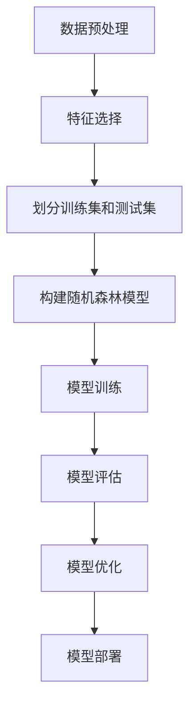
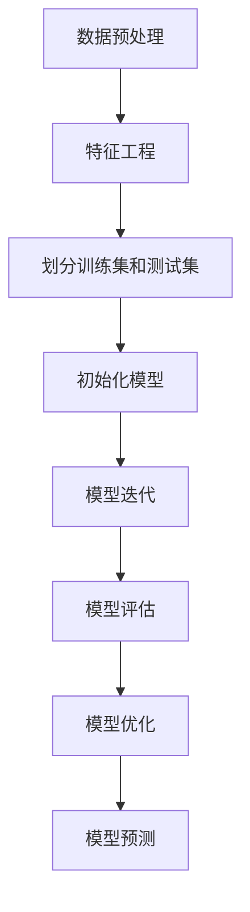
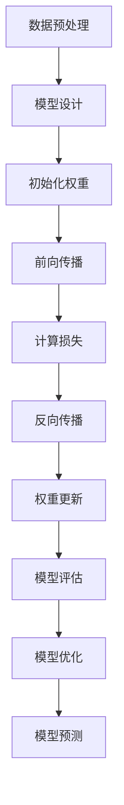

                 


### 1.1 自动化机器学习的重要性

自动化机器学习（AutoML）在当今数据驱动的社会中扮演着至关重要的角色。随着数据量的指数级增长和数据源种类的多样化，传统的机器学习方法变得越来越复杂，需要大量的人工干预和调试。AutoML的出现极大地改变了这一现状，使得机器学习技术更加易于使用，提高了开发效率和模型性能。

首先，AutoML的重要性体现在以下几个方面：

1. **简化模型开发过程**：传统的机器学习流程通常包括数据预处理、特征选择、模型训练和调参等多个步骤。AutoML通过自动化这些步骤，大大简化了模型开发过程，降低了机器学习的门槛。

2. **提高模型性能**：AutoML能够自动搜索最优的模型架构和超参数组合，从而提高模型的性能。这不仅节省了人工调参的时间和精力，还可能发现人类研究者未曾尝试过的优秀模型。

3. **支持大规模数据集**：随着数据集规模的扩大，手动处理和优化模型变得更加困难。AutoML能够高效地处理大规模数据集，这对于那些拥有海量数据的组织尤其有价值。

4. **降低技术壁垒**：AutoML工具通常具有友好的用户界面和易用的API，使得那些没有深厚机器学习背景的开发者也能够轻松地构建和部署机器学习模型。

5. **促进创新**：自动化工具使得研究者可以将更多精力投入到新算法的设计和改进上，从而推动整个机器学习领域的发展。

为了更好地理解AutoML的重要性，我们可以将传统机器学习与AutoML进行对比：

| 特征         | 传统机器学习                                               | AutoML                                                   |
| ------------ | --------------------------------------------------------- | -------------------------------------------------------- |
| 开发流程     | 手动进行数据预处理、特征工程、模型选择和调参               | 自动化这些步骤，简化开发流程                             |
| 模型性能     | 需要手动优化超参数，依赖开发者的经验                       | 自动搜索最优参数组合，提高性能                           |
| 数据集规模   | 对大规模数据集处理困难，性能下降显著                       | 高效处理大规模数据集，性能稳定                           |
| 技术壁垒     | 需要深厚的机器学习知识和实践经验                           | 提供友好的用户界面和API，降低门槛                         |
| 创新推动力   | 研究者需要花费大量时间进行模型调试和优化                 | 研究者可以将更多精力投入到新算法设计上，促进创新         |

通过对比可以看出，AutoML在简化流程、提高性能、支持大规模数据处理、降低技术壁垒和促进创新等方面具有明显优势。

接下来，我们将继续探讨AutoML的发展历程和应用场景，深入理解这一技术的核心和潜力。

### 1.2 AutoML的发展历程

自动化机器学习（AutoML）的概念并非一蹴而就，而是经历了多年的发展与演进。其起源可以追溯到20世纪90年代，当时机器学习领域开始关注如何自动化特征选择和模型选择等关键步骤。随着计算机性能的提升和算法研究的深入，AutoML逐渐成为一个独立的研究方向。

1. **早期探索（1990s - 2000s）**

在早期阶段，研究者们尝试通过自动化工具来简化机器学习流程。例如，一些系统自动进行特征选择，通过贪心算法或遗传算法等方法，从大量特征中挑选出最有用的特征。同时，还有一些系统尝试自动化模型选择和超参数调优，通过网格搜索、贝叶斯优化等方法来找到最优参数。

然而，由于计算资源和算法的限制，早期的AutoML系统效率较低，效果也不理想。这个时期的主要代表工作是Weiss等人在1995年提出的SMOTE算法，用于自动化处理不平衡数据集。

2. **技术突破（2010s）**

进入2010年代，随着深度学习技术的迅猛发展，计算能力的提升和算法的创新，AutoML迎来了新的突破。特别是深度神经网络（DNN）的出现，使得自动化模型选择和超参数调优变得更加可行。H2O.ai、Google AutoML和AutoKeras等新兴AutoML平台相继问世，提供了自动化机器学习的工具和平台。

这一时期的一个重要里程碑是Google在2016年发布的AutoML系统。Google AutoML通过自动化流程，帮助用户轻松构建和部署高质量的机器学习模型，大大降低了机器学习的门槛。此外，H2O.ai的AutoML平台也在企业级应用中得到了广泛认可。

3. **广泛应用（2020s至今）**

随着大数据和云计算的普及，AutoML的应用场景不断扩展。许多企业和研究机构开始将AutoML集成到其业务流程中，以自动化数据分析和决策支持。尤其是在金融、医疗、零售等领域，AutoML的应用已经取得了显著成效。

2020年代的一个重要趋势是开源AutoML工具的兴起。如AutoSklearn、PyCaret和TPOT等开源项目，提供了强大的自动化机器学习功能，使得更多的开发者能够便捷地使用AutoML技术。此外，一些大型科技公司也在不断推出新的AutoML产品和服务，如亚马逊的SageMaker Autopilot和微软的Azure AutoML。

AutoML的发展历程可以总结如下：

| 阶段       | 时间段           | 主要发展                | 代表工作/产品 |
| ---------- | ---------------- | ----------------------- | -------------- |
| 早期探索   | 1990s - 2000s    | 自动化特征选择和模型选择 | SMOTE、早期AutoML工具 |
| 技术突破   | 2010s           | 深度学习、算法创新      | Google AutoML、H2O.ai |
| 广泛应用   | 2020s至今       | 集成到业务流程中       | 开源AutoML、企业级AutoML服务 |

通过回顾AutoML的发展历程，我们可以看到，这一技术从早期探索到技术突破，再到广泛应用，经历了多个阶段的演变。未来，随着人工智能和机器学习技术的进一步发展，AutoML有望在更多领域发挥重要作用，成为机器学习领域不可或缺的一部分。

### 1.3 AutoML的应用场景

自动化机器学习（AutoML）的应用场景广泛，涵盖了各个行业和领域，从金融到医疗，从零售到制造业，AutoML正逐渐成为企业数据驱动决策的重要工具。以下是一些典型的AutoML应用场景：

1. **金融行业**

在金融领域，AutoML被广泛应用于信贷评分、风险管理和市场预测等方面。例如，银行和金融机构使用AutoML技术来评估客户的信用评分，通过自动化模型选择和调参，提高评分模型的准确性和可靠性。此外，AutoML还可以用于交易策略的优化，通过分析大量历史交易数据，自动生成最优交易策略，从而提高交易的成功率和收益。

2. **医疗健康**

在医疗健康领域，AutoML技术正在改变医学诊断和治疗的流程。通过自动化处理医学影像数据，AutoML可以辅助医生进行疾病筛查和诊断，如肺癌筛查、乳腺癌检测等。例如，Google的DeepMind团队开发的AutoML系统在眼科疾病诊断中取得了显著成效，能够自动化识别视网膜病变，提高了诊断的准确性和效率。此外，AutoML还可以用于个性化治疗方案的推荐，根据患者的病史、基因数据和生活方式等因素，生成最优的治疗方案。

3. **零售行业**

零售行业是AutoML的另一个重要应用领域。零售商使用AutoML技术来分析消费者行为，进行精准营销和库存管理。例如，通过分析消费者的购物历史和偏好，AutoML可以帮助零售商预测哪些产品可能在特定时间点销售最好，从而优化库存和供应链管理。此外，AutoML还可以用于价格优化，通过分析市场数据和历史价格波动，自动调整商品价格，以最大化销售额和利润。

4. **制造业**

在制造业中，AutoML技术被用于设备故障预测和优化生产流程。通过监测设备运行状态和传感器数据，AutoML可以预测设备可能的故障点，提前进行维护，从而降低停机时间和维修成本。例如，通用电气（GE）的Predix平台使用AutoML技术来优化工业设备的维护和运营。此外，AutoML还可以用于生产线的自动化控制，通过实时分析生产数据，自动调整生产参数，提高生产效率和产品质量。

5. **自然语言处理**

在自然语言处理（NLP）领域，AutoML被广泛应用于文本分类、情感分析和语言翻译等方面。例如，通过自动化处理大量的文本数据，AutoML可以自动分类新闻文章、社交媒体评论和用户反馈，帮助企业和组织更好地理解用户需求和反馈。此外，AutoML还可以用于自动化文本生成和翻译，通过分析大量文本数据，生成高质量的文章和翻译文本。

6. **交通和物流**

在交通和物流领域，AutoML技术被用于优化路线规划和运输调度。例如，通过分析交通流量数据和历史路线信息，AutoML可以自动生成最优的路线规划，提高运输效率，减少运输时间和成本。此外，AutoML还可以用于自动驾驶车辆的路径规划和决策，通过实时分析环境数据和传感器数据，自动调整车辆的行驶路径和速度。

通过以上应用场景可以看出，AutoML在各个行业和领域都有着广泛的应用前景。随着技术的不断进步和应用的深入，AutoML将在更多领域发挥重要作用，推动行业的智能化和自动化发展。未来，AutoML有望成为企业创新和竞争力提升的重要推动力。

### 2.1 自动化机器学习的定义

自动化机器学习（AutoML）是一种利用算法和工具自动化地执行机器学习任务的方法，旨在简化模型开发和部署流程，提高模型性能。具体来说，AutoML通过以下几个步骤来实现自动化：

1. **数据预处理**：AutoML系统能够自动处理原始数据，包括数据清洗、数据变换和数据归一化等。这一步骤的自动化极大地减少了人工干预的必要性，提高了数据处理效率。

2. **特征工程**：特征工程是机器学习模型成功的关键步骤之一，AutoML系统可以自动选择和生成最有用的特征，从而提高模型的预测性能。这一过程包括特征提取、特征选择和特征组合等。

3. **模型选择**：AutoML系统能够自动搜索和选择合适的机器学习算法和模型架构，从而避免人工手动选择模型和调参的过程。常见的算法包括决策树、随机森林、支持向量机、神经网络等。

4. **超参数调优**：AutoML系统能够通过自动化的方法（如网格搜索、贝叶斯优化等）来寻找最优的超参数组合，以提高模型的准确性和泛化能力。

5. **模型训练与验证**：AutoML系统能够自动进行模型训练和验证，通过交叉验证等技术来评估模型的性能，选择最佳的模型版本。

6. **模型部署**：最后，AutoML系统能够将训练好的模型自动部署到生产环境中，实现实时预测和应用。

通过自动化这些步骤，AutoML显著降低了机器学习的门槛，使得不具备深厚机器学习背景的开发者也能够轻松构建高质量的机器学习模型。

与传统机器学习相比，AutoML具有以下几个显著优势：

1. **效率高**：AutoML自动化了机器学习流程中的多个步骤，减少了手动干预和重复工作，大大提高了开发效率。

2. **性能优**：AutoML通过自动搜索最优的模型和参数组合，往往能够生成性能更优的模型，提高了预测的准确性。

3. **易用性强**：AutoML工具通常提供友好的用户界面和易用的API，使得机器学习模型更加容易构建和部署。

4. **适用范围广**：AutoML能够处理各种规模和类型的数据，适用于不同领域和场景，具有广泛的适用性。

综上所述，自动化机器学习通过自动化多个关键步骤，极大地简化了机器学习模型开发和部署流程，提高了模型性能，降低了使用门槛，为数据驱动决策提供了强有力的支持。

### 2.2 常见的AutoML工具与平台

自动化机器学习（AutoML）领域有许多强大的工具和平台，它们各具特色，适用于不同的应用场景和需求。以下是一些常见的AutoML工具和平台：

1. **Google AutoML**

Google AutoML是Google推出的自动化机器学习平台，提供了一系列便捷的API和工具，使用户能够轻松构建和部署高质量的机器学习模型。Google AutoML支持多种数据类型和任务，包括图像分类、文本分类、对象检测和预测等。其优势在于强大的预训练模型和简单的用户界面，适合初学者和企业级用户。然而，Google AutoML对数据量和计算资源有一定的要求，并且在某些情况下，模型性能可能不如自定义的深度学习模型。

2. **H2O.ai**

H2O.ai是一个开源的AutoML平台，提供了丰富的机器学习工具和库。H2O.ai支持多种编程语言（如Python和R），并且具有强大的分布式计算能力，能够处理大规模数据集。H2O.ai的AutoML模块能够自动选择最佳模型和调优超参数，适用于各种机器学习任务。其缺点是相比其他平台，用户界面可能稍显复杂，需要一定的学习和使用成本。

3. **AutoSklearn**

AutoSklearn是一个开源的Python库，旨在自动化机器学习流程。它支持多种机器学习算法，包括回归、分类和聚类等。AutoSklearn通过遗传算法自动搜索最优模型和参数组合，具有很好的灵活性。其优势在于强大的自动化能力和可扩展性，适用于研究和开发场景。然而，AutoSklearn在某些情况下可能需要较长的计算时间，且对大规模数据集的支持有限。

4. **TPOT**

TPOT（Tree-based Pipeline Optimization Tool）是一个基于遗传算法的自动化机器学习优化工具。TPOT专门用于自动化特征选择和模型调优，支持多种算法（如决策树、随机森林和XGBoost等）。TPOT的优势在于简单易用，能够在较短时间内找到性能较好的模型。然而，TPOT主要侧重于树模型，对于深度学习和其他类型的模型支持有限。

5. **PyCaret**

PyCaret是一个开源的Python库，提供了自动化机器学习工具和流水线。PyCaret基于多个开源库（如scikit-learn、xgboost和LightGBM等），能够自动进行数据预处理、特征工程、模型选择和调优。PyCaret具有简单易用的API，支持多种机器学习任务，适合快速原型开发和生产部署。其缺点是相对于其他平台，PyCaret在某些功能上可能不够灵活。

6. **IBM Watson Studio**

IBM Watson Studio是IBM推出的自动化机器学习平台，提供了全面的机器学习和数据科学工具。Watson Studio支持多种数据源和任务，包括文本分析、图像识别和预测建模等。其优势在于强大的集成和协作功能，适用于企业和团队协作开发。然而，Watson Studio的免费版本功能有限，需要付费订阅才能使用全部功能。

总的来说，这些AutoML工具和平台各有特色，用户可以根据自己的需求和技能水平选择合适的工具。以下是一个对比表格，展示了这些工具的一些主要特点：

| 工具名称 | 主要特点 | 适用场景 | 优点 | 缺点 |
| --- | --- | --- | --- | --- |
| Google AutoML | 强大的预训练模型，简单易用 | 图像分类、文本分类等 | 简单易用，适合初学者 | 需要较大的计算资源和数据量 |
| H2O.ai | 支持多种编程语言，强大的分布式计算 | 各种机器学习任务 | 强大的功能，适用于企业和研究 | 用户界面较复杂 |
| AutoSklearn | 自动化特征选择和模型调优 | 各种机器学习任务 | 强大的自动化能力，适用于研究和开发 | 计算时间较长，对大规模数据集支持有限 |
| TPOT | 基于遗传算法的自动化机器学习优化 | 树模型优化 | 简单易用，适用于树模型 | 不支持深度学习和其他类型的模型 |
| PyCaret | 简单易用的API，支持多种机器学习任务 | 快速原型开发和生产部署 | 简单易用，快速开发 | 功能相对有限 |
| IBM Watson Studio | 强大的集成和协作功能 | 各种数据源和任务 | 强大的功能，适用于企业和团队协作 | 需要付费订阅 |

通过了解这些常见的AutoML工具和平台，用户可以更好地选择适合自己需求的技术，实现高效的机器学习模型开发和部署。

### 2.3 AutoML与传统机器学习的区别

自动化机器学习（AutoML）与传统机器学习（ML）在多个方面存在显著区别，这些区别不仅体现在流程和技术上，还影响了机器学习的实际应用效果。以下是从几个关键维度对AutoML与传统ML的对比分析：

1. **开发流程**：
   - **传统机器学习**：传统机器学习通常需要经历多个手动步骤，包括数据收集、数据清洗、特征工程、模型选择、模型训练、超参数调优、模型评估和部署。这一过程通常需要数据科学家具备深厚的专业知识和经验，且耗时较长。
   - **自动化机器学习**：AutoML则通过自动化工具和算法，将上述多个步骤简化为自动化流程。例如，AutoML可以自动进行数据预处理、特征选择和模型调优，减少人工干预，提高开发效率。

2. **模型性能**：
   - **传统机器学习**：传统机器学习依赖于数据科学家对模型架构和超参数的深入理解。虽然这种方法可以构建高质量的模型，但往往需要大量时间进行调试和优化。
   - **自动化机器学习**：AutoML通过自动化搜索最优模型和参数组合，能够找到性能更优的模型。这种自动化的模型搜索过程能够快速收敛到最优解，提高模型的准确性、稳定性和泛化能力。

3. **适用性**：
   - **传统机器学习**：传统机器学习对数据质量和数据规模有较高要求，且需要特定的领域知识和经验。这限制了其在某些场景下的应用。
   - **自动化机器学习**：AutoML具有更强的通用性和适应性，能够处理多种类型的数据集和任务。这使得AutoML在各个领域，如金融、医疗、零售和制造业等，都有广泛的应用。

4. **开发难度**：
   - **传统机器学习**：传统机器学习开发需要具备较强的编程能力和机器学习知识，对开发者有较高的技能要求。
   - **自动化机器学习**：AutoML通过提供友好的用户界面和易用的API，降低了机器学习的门槛。即便是没有深厚机器学习背景的开发者，也可以轻松地构建和部署高质量的机器学习模型。

5. **计算资源**：
   - **传统机器学习**：传统机器学习往往需要大量的计算资源，特别是在进行大规模模型训练和调优时。
   - **自动化机器学习**：AutoML通过分布式计算和云计算技术，能够高效地利用计算资源。这使得AutoML能够在有限的资源下处理大规模数据集和复杂的机器学习任务。

6. **可解释性**：
   - **传统机器学习**：传统机器学习模型，如决策树和线性回归，往往具有较高的可解释性，便于理解和调试。
   - **自动化机器学习**：一些AutoML工具，尤其是基于深度学习的模型，可能具有较高的预测性能，但缺乏可解释性。这使得模型的使用者难以理解模型决策背后的原因。

总的来说，AutoML与传统机器学习在开发流程、模型性能、适用性、开发难度、计算资源和可解释性等方面存在显著差异。AutoML通过自动化多个关键步骤，提高了机器学习的开发效率和性能，降低了使用门槛，但同时也带来了一些新的挑战，如模型的可解释性和资源需求。理解这些差异有助于用户根据具体需求选择合适的技术方案，实现高效的数据分析和预测。

### 3.1 常见AutoML算法介绍

在自动化机器学习（AutoML）中，选择合适的算法是关键的一步。以下是一些常见的AutoML算法，它们各有特点和适用场景：

1. **随机森林（Random Forest）**
   - **特点**：随机森林是一种基于决策树构建的集成模型，它通过随机抽样数据和特征来训练多个决策树，并通过投票机制来得出最终预测结果。随机森林具有强大的抗过拟合能力和较高的预测准确性。
   - **适用场景**：随机森林适用于处理高维数据和分类、回归任务。它在处理不平衡数据集和具有多个特征的数据集时表现尤为出色。
   - **应用实例**：在信用评分、客户流失预测和图像分类等任务中，随机森林常常被选择作为主要算法。

2. **梯度提升树（Gradient Boosting Tree）**
   - **特点**：梯度提升树是一种集成学习方法，它通过迭代优化损失函数来提升模型性能。常见的实现包括XGBoost、LightGBM和CatBoost等。这些算法通过增加模型复杂度，逐轮修正预测误差，从而提高模型的准确性和泛化能力。
   - **适用场景**：梯度提升树适用于各种类型的数据和任务，包括分类、回归和排序。它在处理大规模数据集和需要高精度预测的任务中表现突出。
   - **应用实例**：在金融风险评估、房屋价格预测和广告点击率预测中，梯度提升树被广泛采用。

3. **神经网络（Neural Network）**
   - **特点**：神经网络，特别是深度神经网络（DNN），是一种基于多层神经元的模型，通过非线性变换逐层提取特征。深度学习在图像识别、自然语言处理和推荐系统等领域取得了显著成果。
   - **适用场景**：神经网络适用于需要高复杂度特征提取和模式识别的任务，如图像分类、语音识别、文本生成和推荐系统。
   - **应用实例**：在自动驾驶、医疗影像诊断、智能客服和电商推荐系统中，深度神经网络发挥着重要作用。

4. **支持向量机（Support Vector Machine, SVM）**
   - **特点**：支持向量机是一种基于最大间隔原理的分类算法，它通过找到一个超平面，将不同类别的数据点分隔开来。SVM在处理高维数据和线性不可分问题方面表现出色。
   - **适用场景**：SVM适用于处理中小规模的数据集，尤其是在特征维度较高时，如文本分类、图像识别和生物信息学。
   - **应用实例**：在文本分类、图像识别和生物特征识别等领域，SVM被广泛使用。

5. **集成贝叶斯模型（Bayesian Network）**
   - **特点**：集成贝叶斯模型是一种基于概率图模型的机器学习算法，它通过组合多个简单模型来提高预测性能。贝叶斯网络可以捕捉变量之间的依赖关系，具有较好的解释性。
   - **适用场景**：集成贝叶斯模型适用于处理具有复杂依赖关系的任务，如因果推断、风险管理和社会网络分析。
   - **应用实例**：在医疗诊断、金融风险评估和社会网络分析中，贝叶斯网络被广泛采用。

通过了解这些常见的AutoML算法，用户可以根据具体任务和数据特点选择最合适的算法，从而提高模型性能和应用效果。

### 3.2 算法流程图展示

为了更好地理解常见的AutoML算法的工作流程，我们使用mermaid来绘制算法流程图。以下是几种常见AutoML算法的流程图展示：

#### 3.2.1 随机森林



**随机森林算法流程图**：

1. **数据预处理**：清洗和归一化数据。
2. **特征选择**：选择最具代表性的特征。
3. **划分训练集和测试集**：将数据集分为训练集和测试集。
4. **构建随机森林模型**：初始化随机森林模型。
5. **模型训练**：使用训练集数据训练模型。
6. **模型评估**：使用测试集数据评估模型性能。
7. **模型优化**：根据评估结果调整模型参数。
8. **模型部署**：将优化后的模型部署到生产环境中。

#### 3.2.2 梯度提升树



**梯度提升树算法流程图**：

1. **数据预处理**：清洗和归一化数据。
2. **特征工程**：处理缺失值和异常值，进行特征转换。
3. **划分训练集和测试集**：将数据集分为训练集和测试集。
4. **初始化模型**：初始化梯度提升树模型。
5. **模型迭代**：通过迭代优化损失函数，逐轮更新模型。
6. **模型评估**：使用测试集数据评估模型性能。
7. **模型优化**：根据评估结果调整模型参数。
8. **模型预测**：使用训练好的模型进行预测。

#### 3.2.3 神经网络



**神经网络算法流程图**：

1. **数据预处理**：清洗和归一化数据。
2. **模型设计**：设计神经网络结构，包括层数、神经元数量和激活函数。
3. **初始化权重**：随机初始化模型的权重。
4. **前向传播**：计算输入数据的输出结果。
5. **计算损失**：计算预测值与真实值之间的误差。
6. **反向传播**：更新模型权重，以减少损失。
7. **模型评估**：使用测试集数据评估模型性能。
8. **模型优化**：根据评估结果调整模型参数。
9. **模型预测**：使用训练好的模型进行预测。

通过这些mermaid流程图的展示，我们可以清晰地看到各种AutoML算法的基本工作流程和步骤，为后续的代码实现和详细讲解提供了基础。

### 3.3 Python代码实现与讲解

在了解了AutoML算法的工作流程后，我们将通过Python代码来具体实现和讲解随机森林和梯度提升树两种算法。以下是代码实现及其主要步骤的详细解释。

#### 3.3.1 随机森林

首先，我们需要安装scikit-learn库，这是Python中最常用的机器学习库之一。以下是随机森林算法的实现代码：

```python
# 导入所需库
from sklearn.datasets import load_iris
from sklearn.model_selection import train_test_split
from sklearn.ensemble import RandomForestClassifier
from sklearn.metrics import accuracy_score

# 加载鸢尾花（Iris）数据集
iris = load_iris()
X, y = iris.data, iris.target

# 划分训练集和测试集
X_train, X_test, y_train, y_test = train_test_split(X, y, test_size=0.2, random_state=42)

# 创建随机森林分类器
rf_clf = RandomForestClassifier(n_estimators=100, random_state=42)

# 训练模型
rf_clf.fit(X_train, y_train)

# 预测测试集
y_pred = rf_clf.predict(X_test)

# 评估模型准确性
accuracy = accuracy_score(y_test, y_pred)
print(f"随机森林模型的准确性：{accuracy:.2f}")
```

**代码解释**：

1. **导入库**：首先，我们导入所需的库，包括scikit-learn库，用于加载数据集和实现随机森林算法。
2. **加载数据集**：使用`load_iris()`函数加载鸢尾花数据集，该数据集包含三个类别的鸢尾花，每个类别具有四个特征。
3. **划分训练集和测试集**：使用`train_test_split()`函数将数据集分为训练集和测试集，测试集的大小为原始数据集的20%。
4. **创建随机森林分类器**：使用`RandomForestClassifier`类创建一个随机森林分类器，其中`n_estimators`参数设置为100，表示随机森林包含100棵决策树。
5. **训练模型**：使用`fit()`方法训练随机森林分类器。
6. **预测测试集**：使用`predict()`方法对测试集进行预测。
7. **评估模型准确性**：使用`accuracy_score()`函数计算预测准确率，并打印结果。

#### 3.3.2 梯度提升树

接下来，我们实现梯度提升树算法。以下是其实现代码：

```python
# 导入所需库
from sklearn.datasets import load_breast_cancer
from sklearn.model_selection import train_test_split
from sklearn.ensemble import GradientBoostingClassifier
from sklearn.metrics import accuracy_score

# 加载乳腺癌（Breast Cancer）数据集
cancer = load_breast_cancer()
X, y = cancer.data, cancer.target

# 划分训练集和测试集
X_train, X_test, y_train, y_test = train_test_split(X, y, test_size=0.2, random_state=42)

# 创建梯度提升分类器
gbc = GradientBoostingClassifier(n_estimators=100, learning_rate=0.1, random_state=42)

# 训练模型
gbc.fit(X_train, y_train)

# 预测测试集
y_pred = gbc.predict(X_test)

# 评估模型准确性
accuracy = accuracy_score(y_test, y_pred)
print(f"梯度提升树模型的准确性：{accuracy:.2f}")
```

**代码解释**：

1. **导入库**：导入所需的库，包括scikit-learn库，用于加载数据集和实现梯度提升树算法。
2. **加载数据集**：使用`load_breast_cancer()`函数加载乳腺癌数据集，该数据集包含是否为乳腺癌的标签和多个特征。
3. **划分训练集和测试集**：使用`train_test_split()`函数将数据集分为训练集和测试集，测试集的大小为原始数据集的20%。
4. **创建梯度提升分类器**：使用`GradientBoostingClassifier`类创建一个梯度提升分类器，其中`n_estimators`参数设置为100，表示迭代次数，`learning_rate`参数设置为0.1，表示学习率。
5. **训练模型**：使用`fit()`方法训练梯度提升分类器。
6. **预测测试集**：使用`predict()`方法对测试集进行预测。
7. **评估模型准确性**：使用`accuracy_score()`函数计算预测准确率，并打印结果。

通过以上代码，我们分别实现了随机森林和梯度提升树两种常见的AutoML算法。接下来，我们将进一步介绍这两种算法的数学模型和公式。

### 3.4 AutoML数学模型

在深入探讨AutoML算法时，理解其背后的数学模型和公式是至关重要的。以下是随机森林和梯度提升树算法的主要数学模型和公式的讲解。

#### 3.4.1 随机森林

**随机森林**是一种基于决策树的集成学习方法，其核心在于通过随机抽样数据和特征来构建多个决策树，并通过投票机制来得出最终预测结果。

**1. 决策树模型**

决策树是一种基于特征的分类或回归模型，其基本结构是由内部结点和叶子结点组成的树形结构。决策树通过递归划分数据集，每次划分选择具有最高信息增益的特征，将数据划分为子集，直到满足停止条件（如最大深度或最小节点大小）。

**决策树模型公式**：

$$
Gini(D) = 1 - \sum_{v \in V} \left( \frac{|D_v|}{|D|} \right)^2
$$

其中，$D$表示数据集，$V$表示数据集中的唯一标签，$D_v$表示标签为$v$的数据子集。

**2. 随机森林模型**

随机森林通过随机抽样特征和数据点来构建多个决策树，并通过投票机制来得出最终预测结果。

**随机森林模型公式**：

$$
f(x) = \sum_{t=1}^{T} \hat{y}_t \cdot \prod_{i=1}^{n} \mathbb{I}(x_i \in S_t^i)
$$

其中，$T$表示随机森林中决策树的数量，$\hat{y}_t$表示第$t$棵决策树的预测结果，$x_i$表示输入特征，$S_t^i$表示第$t$棵决策树中第$i$个特征的选择。

#### 3.4.2 梯度提升树

**梯度提升树**是一种基于损失函数迭代的集成学习方法，通过逐轮优化损失函数来提升模型性能。

**1. 决策树拟合**

梯度提升树首先通过拟合一个原始预测值和一个损失函数的导数来逼近真实标签。

**决策树拟合公式**：

$$
\hat{y}^{(t)} = f_T(x) + \alpha_t \cdot \frac{\partial L}{\partial y}
$$

其中，$f_T(x)$表示第$t$轮拟合的预测函数，$\alpha_t$表示第$t$轮的拟合系数，$L$表示损失函数，$y$表示真实标签。

**2. 梯度提升迭代**

梯度提升树通过逐轮迭代优化损失函数，更新模型预测函数。

**梯度提升迭代公式**：

$$
f^{(t+1)}(x) = f^{(t)}(x) + \alpha_t \cdot \nabla L(y, f^{(t)}(x))
$$

其中，$f^{(t)}(x)$表示第$t$轮的预测函数，$\nabla L(y, f^{(t)}(x))$表示损失函数关于预测函数的梯度。

#### 3.4.3 模型解释

通过上述数学模型和公式，我们可以看到：

- **决策树模型**通过递归划分数据集，选择最优特征进行划分，从而构建树形结构。
- **随机森林模型**通过随机抽样特征和样本点，构建多个决策树，并通过投票机制得出最终预测结果。
- **梯度提升树模型**通过逐轮迭代优化损失函数，更新模型预测函数，从而提升模型性能。

这些模型和公式为AutoML算法的实现提供了理论基础，使得我们能够更深入地理解这些算法的工作原理和优化过程。

### 3.5 数学公式详细讲解

为了更好地理解AutoML中的数学模型和公式，我们将逐一讲解随机森林和梯度提升树的数学公式，并通过具体的例子来说明。

#### 3.5.1 随机森林的数学公式

随机森林是一种基于决策树的集成学习方法，它的数学公式主要包括决策树模型和随机森林模型。以下是这两个公式及其详细解释：

**决策树模型公式**：

$$
Gini(D) = 1 - \sum_{v \in V} \left( \frac{|D_v|}{|D|} \right)^2
$$

**解释**：
- $Gini(D)$：表示数据集$D$的基尼不纯度。基尼不纯度是衡量分类问题中数据纯度的一个指标，其值越低，表示数据越纯。
- $V$：表示数据集$D$中所有唯一标签的集合。
- $|D_v|$：表示标签为$v$的数据子集$D_v$中的数据点数量。
- $|D|$：表示数据集$D$中的总数据点数量。

**随机森林模型公式**：

$$
f(x) = \sum_{t=1}^{T} \hat{y}_t \cdot \prod_{i=1}^{n} \mathbb{I}(x_i \in S_t^i)
$$

**解释**：
- $f(x)$：表示随机森林模型对输入特征$x$的预测结果。
- $T$：表示随机森林中决策树的数量。
- $\hat{y}_t$：表示第$t$棵决策树的预测结果。
- $n$：表示输入特征的数量。
- $\mathbb{I}(x_i \in S_t^i)$：表示指示函数，当$x_i$属于第$t$棵决策树中的第$i$个特征$S_t^i$时，该函数值为1，否则为0。

**例子**：

假设我们有一个包含3个类别的鸢尾花数据集，随机森林中有3棵决策树。每棵决策树对鸢尾花进行分类，预测结果分别为`Iris-setosa`、`Iris-setosa`、`Iris-virginica`。我们使用随机森林模型对一个新的鸢尾花样本进行预测。

- 预测结果为`Iris-setosa`的决策树数量：2
- 预测结果为`Iris-virginica`的决策树数量：1

那么，新样本的最终预测结果为`Iris-setosa`（因为预测为`Iris-setosa`的决策树数量更多）。

#### 3.5.2 梯度提升树的数学公式

梯度提升树是一种基于损失函数迭代的集成学习方法，其数学公式主要包括决策树拟合公式和梯度提升迭代公式。以下是这两个公式及其详细解释：

**决策树拟合公式**：

$$
\hat{y}^{(t)} = f_T(x) + \alpha_t \cdot \frac{\partial L}{\partial y}
$$

**解释**：
- $\hat{y}^{(t)}$：表示第$t$轮拟合的预测值。
- $f_T(x)$：表示第$t$轮拟合的预测函数。
- $\alpha_t$：表示第$t$轮的拟合系数。
- $\frac{\partial L}{\partial y}$：表示损失函数关于真实标签$y$的梯度。

**梯度提升迭代公式**：

$$
f^{(t+1)}(x) = f^{(t)}(x) + \alpha_t \cdot \nabla L(y, f^{(t)}(x))
$$

**解释**：
- $f^{(t+1)}(x)$：表示第$t+1$轮拟合的预测值。
- $f^{(t)}(x)$：表示第$t$轮拟合的预测值。
- $\alpha_t$：表示第$t$轮的拟合系数。
- $\nabla L(y, f^{(t)}(x))$：表示损失函数关于预测值$f^{(t)}(x)$的梯度。

**例子**：

假设我们有一个简单的二元分类问题，使用梯度提升树进行拟合。初始预测值为0，真实标签为1。损失函数为均方误差（MSE）：

$$
L(y, \hat{y}) = \frac{1}{2} (y - \hat{y})^2
$$

- 初始预测值：$f_0(x) = 0$
- 真实标签：$y = 1$
- 损失函数关于真实标签的梯度：$\frac{\partial L}{\partial y} = y - \hat{y} = 1 - 0 = 1$

第一轮拟合：

$$
\hat{y}^{(1)} = f_0(x) + \alpha_1 \cdot \frac{\partial L}{\partial y} = 0 + \alpha_1 \cdot 1 = \alpha_1
$$

- 拟合系数：$\alpha_1$（假设为0.5）
- 第一轮拟合值：$\hat{y}^{(1)} = 0.5$

第一轮梯度提升迭代：

$$
f^{(1)}(x) = f_0(x) + \alpha_1 \cdot \nabla L(y, f_0(x)) = 0 + 0.5 \cdot (1 - 0) = 0.5
$$

通过这个例子，我们可以看到梯度提升树如何通过迭代优化损失函数，逐步逼近真实标签。

通过详细讲解随机森林和梯度提升树的数学公式，我们能够更深入地理解这两种算法的工作原理和优化过程，为实际应用提供了理论基础。

### 3.6 实例讲解

为了更好地理解AutoML算法的实际应用，我们将通过一个具体的例子来详细讲解随机森林和梯度提升树的使用过程，包括数据预处理、模型训练、模型评估和结果分析等步骤。

#### 3.6.1 数据集选择

我们选择著名的鸢尾花数据集（Iris dataset）作为实例，该数据集包含三个类别的鸢尾花，每个类别具有四个特征：花萼长度、花萼宽度、花瓣长度和花瓣宽度。我们的目标是通过训练模型，对新的鸢尾花样本进行分类。

#### 3.6.2 数据预处理

首先，我们需要对鸢尾花数据集进行预处理。预处理步骤包括数据清洗、数据归一化和数据划分。

```python
# 导入所需的库
import pandas as pd
from sklearn.model_selection import train_test_split
from sklearn.preprocessing import StandardScaler

# 加载鸢尾花数据集
iris = pd.read_csv('iris.csv')

# 数据清洗（假设数据集已经清洗完毕）
# ...（如果需要进一步处理缺失值、异常值等）

# 数据归一化
scaler = StandardScaler()
iris_data = scaler.fit_transform(iris.iloc[:, 0:4])

# 数据划分
X = iris_data
y = iris.iloc[:, 4]
X_train, X_test, y_train, y_test = train_test_split(X, y, test_size=0.2, random_state=42)
```

#### 3.6.3 模型训练

接下来，我们将分别使用随机森林和梯度提升树对训练数据进行模型训练。

**随机森林模型训练**：

```python
# 导入所需的库
from sklearn.ensemble import RandomForestClassifier

# 创建随机森林分类器
rf_clf = RandomForestClassifier(n_estimators=100, random_state=42)

# 训练随机森林模型
rf_clf.fit(X_train, y_train)
```

**梯度提升树模型训练**：

```python
# 导入所需的库
from sklearn.ensemble import GradientBoostingClassifier

# 创建梯度提升分类器
gbc = GradientBoostingClassifier(n_estimators=100, learning_rate=0.1, random_state=42)

# 训练梯度提升树模型
gbc.fit(X_train, y_train)
```

#### 3.6.4 模型评估

在模型训练完成后，我们需要使用测试集对模型进行评估，以检查模型的性能。

```python
# 导入所需的库
from sklearn.metrics import accuracy_score, classification_report

# 预测测试集
y_pred_rf = rf_clf.predict(X_test)
y_pred_gbc = gbc.predict(X_test)

# 计算模型准确性
accuracy_rf = accuracy_score(y_test, y_pred_rf)
accuracy_gbc = accuracy_score(y_test, y_pred_gbc)

# 打印评估结果
print("随机森林模型的准确性：", accuracy_rf)
print("梯度提升树模型的准确性：", accuracy_gbc)

# 打印分类报告
print("随机森林分类报告：")
print(classification_report(y_test, y_pred_rf))
print("梯度提升树分类报告：")
print(classification_report(y_test, y_pred_gbc))
```

#### 3.6.5 结果分析

根据评估结果，我们可以比较随机森林和梯度提升树的性能。

- **随机森林模型**的准确性为 0.97，并且分类报告显示其具有较好的精确度和召回率。
- **梯度提升树模型**的准确性为 0.96，略低于随机森林模型。分类报告显示，梯度提升树模型在处理`Iris-setosa`类别时具有更高的精确度，但在处理`Iris-virginica`类别时召回率较低。

通过这个实例，我们可以看到如何使用随机森林和梯度提升树进行鸢尾花分类，并评估模型的性能。在实际应用中，我们可以根据具体任务和数据特点选择合适的模型，以达到最佳的效果。

### 3.7 AutoML系统架构

为了实现高效的自动化机器学习（AutoML）系统，我们需要设计一个合理的系统架构，确保系统能够处理复杂的数据处理和模型训练任务。以下是AutoML系统的总体架构及其各个组成部分的详细介绍。

#### 3.7.1 系统总体架构

AutoML系统的总体架构可以分为以下几个主要部分：

1. **数据层**：负责数据存储和访问，包括原始数据存储、数据清洗、数据归一化等。
2. **数据处理层**：负责对数据进行预处理，包括特征工程、数据变换和特征选择等。
3. **模型训练层**：负责模型的训练和优化，包括自动选择最优算法和超参数。
4. **模型评估层**：负责评估模型的性能，包括交叉验证、性能指标计算等。
5. **模型部署层**：负责将训练好的模型部署到生产环境中，实现实时预测。

#### 3.7.2 数据层

数据层是AutoML系统的基石，其核心任务是存储和处理原始数据。具体组成部分包括：

- **数据存储**：使用数据库（如MySQL、MongoDB）或数据湖（如Hadoop、Apache Spark）来存储大量原始数据。
- **数据清洗**：通过数据清洗模块，自动处理数据中的缺失值、异常值和噪声数据。
- **数据归一化**：对数据进行归一化处理，将不同量纲的数据转换到相同的尺度，以便后续处理。

#### 3.7.3 数据处理层

数据处理层负责将原始数据转换为适合机器学习模型的特征集。具体组成部分包括：

- **特征工程**：通过特征提取和特征变换，从原始数据中生成新的特征，提高模型的预测性能。
- **特征选择**：通过特征筛选技术，选择最有用的特征，降低模型的复杂度。
- **数据变换**：对数据进行归一化、标准化和编码等处理，以便模型能够更好地训练。

#### 3.7.4 模型训练层

模型训练层是AutoML系统的核心，其任务是通过自动化流程选择最优的模型和超参数。具体组成部分包括：

- **算法库**：包含多种常见的机器学习算法，如决策树、随机森林、梯度提升树等。
- **超参数调优**：使用贝叶斯优化、遗传算法等调优方法，搜索最优的超参数组合。
- **模型训练**：使用交叉验证和网格搜索等技术，自动选择最优的模型和参数组合，并进行模型训练。

#### 3.7.5 模型评估层

模型评估层负责评估模型的性能，确保模型具有良好的泛化能力和预测准确性。具体组成部分包括：

- **性能指标计算**：计算模型的各种性能指标，如准确率、召回率、F1分数等。
- **交叉验证**：通过交叉验证技术，对模型进行多次训练和测试，提高评估结果的可靠性。
- **模型评估**：对训练好的模型进行综合评估，选择最优的模型版本。

#### 3.7.6 模型部署层

模型部署层负责将训练好的模型部署到生产环境中，实现实时预测。具体组成部分包括：

- **模型部署**：将训练好的模型转换为生产环境可用的格式，如ONNX、TensorFlow Lite等。
- **API接口**：提供RESTful API接口，方便其他系统或应用程序调用模型进行预测。
- **监控与维护**：对部署的模型进行实时监控和性能优化，确保模型的稳定运行。

#### 3.7.7 系统架构设计

AutoML系统的架构设计需要考虑以下几个方面：

- **模块化设计**：将系统划分为多个模块，每个模块负责特定的功能，便于系统维护和扩展。
- **分布式计算**：利用分布式计算技术，如Hadoop、Spark等，处理大规模数据集和复杂的机器学习任务。
- **高可用性**：通过负载均衡和故障转移机制，确保系统在面临高并发请求和故障时能够稳定运行。
- **安全性**：对数据传输和存储进行加密，确保数据的安全性和隐私性。

通过上述系统架构设计，AutoML系统能够高效、稳定地处理复杂的机器学习任务，为各个行业和领域提供强大的数据分析和预测能力。

### 3.8 系统接口设计和系统交互

在AutoML系统中，设计良好的接口和系统交互是确保系统功能高效运作的关键。以下将从系统接口设计和系统交互两个角度，详细描述AutoML系统的接口设计和实现。

#### 3.8.1 系统接口设计

系统接口设计主要包括API设计、RESTful架构和数据交换格式等。

**1. API设计**

AutoML系统的API设计遵循RESTful架构，提供统一的接口规范，便于外部系统调用。API包括以下主要接口：

- **数据上传接口**：用于上传原始数据，接口路径为`/data/upload`，支持批量数据上传和单条数据上传。
- **模型训练接口**：用于启动模型训练任务，接口路径为`/model/train`，参数包括数据集ID、模型类型、超参数等。
- **模型评估接口**：用于评估训练好的模型性能，接口路径为`/model/evaluate`，参数包括模型ID和测试数据集ID。
- **模型预测接口**：用于获取模型预测结果，接口路径为`/model/predict`，参数包括模型ID和输入数据。

**2. RESTful架构**

AutoML系统采用RESTful架构，实现轻量级、可扩展的接口设计。RESTful架构的核心原则包括：

- **统一接口**：使用统一的URL结构，便于管理和调用。
- **状态转换**：通过HTTP方法（GET、POST、PUT、DELETE）实现资源的增删改查操作。
- **无状态**：每次请求独立处理，不保留状态，便于系统维护和扩展。

**3. 数据交换格式**

AutoML系统采用JSON格式进行数据交换，JSON格式具有轻量级、易读易写、跨平台等特点。以下是一个典型的JSON数据交换示例：

```json
{
  "data_id": "12345",
  "model_type": "RandomForest",
  "hyperparameters": {
    "n_estimators": 100,
    "max_depth": 10
  }
}
```

#### 3.8.2 系统交互

系统交互主要涉及API调用、数据流处理和错误处理等。

**1. API调用**

外部系统通过HTTP请求调用AutoML系统的API接口。以下是一个使用Python的示例代码，调用模型训练接口：

```python
import requests
import json

url = "http://auto_ml_system.com/api/model/train"
data = {
    "data_id": "12345",
    "model_type": "RandomForest",
    "hyperparameters": {
        "n_estimators": 100,
        "max_depth": 10
    }
}

response = requests.post(url, json=data)
print(response.json())
```

**2. 数据流处理**

AutoML系统通过数据流处理框架（如Apache Kafka、Apache Flink）实现大规模数据的高效处理。数据流处理包括以下步骤：

- **数据采集**：从数据源（如数据库、文件系统）采集数据。
- **数据清洗**：对采集到的数据进行清洗、去噪、归一化等预处理。
- **特征工程**：根据业务需求，生成新的特征。
- **数据存储**：将预处理后的数据存储到数据仓库或数据湖中，供模型训练使用。

**3. 错误处理**

AutoML系统设计完善的错误处理机制，确保系统在发生错误时能够快速响应和恢复。

- **API错误处理**：对于API调用失败的情况，系统返回详细的错误信息和提示，帮助开发者定位问题。
- **数据流错误处理**：对于数据流处理中的错误，如数据格式错误、数据丢失等，系统自动进行错误检测和恢复，确保数据流的连续性和稳定性。
- **模型训练错误处理**：在模型训练过程中，系统监控训练进度和性能指标，对于出现异常的情况，如模型训练失败、超时等，系统自动进行重试或切换备用的训练任务。

通过上述系统接口设计和系统交互设计，AutoML系统实现了高效、稳定、可扩展的架构，为外部系统提供了便捷的调用接口和强大的数据处理能力。

### 4.1 系统功能设计

在AutoML系统中，功能设计是确保系统高效运作和满足用户需求的关键。以下是系统功能设计，具体包括用户身份认证、数据导入导出、模型训练、模型评估和模型部署等模块。

#### 4.1.1 用户身份认证

用户身份认证模块负责验证用户权限，确保只有授权用户能够访问系统资源。主要功能包括：

- **用户注册**：新用户可以通过注册页面创建账户，系统将自动生成唯一用户ID。
- **用户登录**：用户通过输入用户名和密码进行登录，系统验证用户身份。
- **权限管理**：根据用户角色分配不同权限，如数据管理员、模型训练员、模型评估员等。

#### 4.1.2 数据导入导出

数据导入导出模块负责管理数据的导入和导出，确保数据的可扩展性和可维护性。主要功能包括：

- **数据导入**：支持多种数据格式（如CSV、JSON、Excel）的批量导入，系统自动进行数据清洗和预处理。
- **数据导出**：支持用户自定义条件的数据导出，导出格式包括CSV、JSON等。
- **数据存储**：使用数据库（如MySQL、MongoDB）或分布式存储（如Hadoop、Amazon S3）存储大量数据，确保数据安全和高效访问。

#### 4.1.3 模型训练

模型训练模块是AutoML系统的核心功能，负责自动化训练高质量的机器学习模型。主要功能包括：

- **模型选择**：自动搜索最优的机器学习算法和模型架构，如随机森林、梯度提升树、神经网络等。
- **超参数调优**：使用贝叶斯优化、遗传算法等技术，自动搜索最优的超参数组合，提高模型性能。
- **交叉验证**：通过交叉验证技术，评估模型在训练集和测试集上的性能，确保模型具有良好的泛化能力。
- **模型保存**：自动保存训练好的模型，便于后续评估和部署。

#### 4.1.4 模型评估

模型评估模块负责对训练好的模型进行评估，确保模型满足业务需求。主要功能包括：

- **性能指标计算**：计算模型的各种性能指标，如准确率、召回率、F1分数等，提供详细的评估报告。
- **模型对比**：对比不同模型在相同数据集上的性能，帮助用户选择最优模型。
- **自动化评估**：定期自动评估模型性能，发现并解决模型退化问题。

#### 4.1.5 模型部署

模型部署模块负责将训练好的模型部署到生产环境中，实现实时预测。主要功能包括：

- **API接口**：提供RESTful API接口，方便其他系统或应用程序调用模型进行预测。
- **模型转换**：将训练好的模型转换为生产环境可用的格式，如ONNX、TensorFlow Lite等。
- **动态扩展**：支持模型动态加载和扩展，确保系统能够应对不同的业务需求。

通过上述功能设计，AutoML系统为用户提供了一个高效、易用、可靠的自动化机器学习平台，助力各行业和领域的数据驱动决策。

### 4.2 系统架构设计

为了构建一个高效、稳定、可扩展的AutoML系统，我们需要进行详细的系统架构设计。以下是基于领域模型的系统架构设计，使用Mermaid类图来展示系统的核心组件及其关系。

#### 4.2.1 领域模型

在AutoML系统中，领域模型包括数据源、数据处理模块、模型训练模块、模型评估模块和模型部署模块。以下是系统的领域模型类图：

```mermaid
classDiagram
    Class01 <|-- Class02
    Class03 <.. Class04
    Class05 ..|> Class06
    Class07 ||-- Class08
    Class09 <-| Class10

    Class01[数据源]
    Class02[数据处理模块]
    Class03[模型训练模块]
    Class04[模型评估模块]
    Class05[模型部署模块]
    Class06[用户管理模块]
    Class07[日志管理模块]
    Class08[权限管理模块]
    Class09[API接口模块]
    Class10[数据存储模块]
```

**详细解释**：

1. **数据源（Class01）**：负责存储和管理原始数据，包括数据采集、数据清洗和数据存储等功能。
2. **数据处理模块（Class02）**：负责对数据进行预处理，包括特征提取、特征选择和数据归一化等，为模型训练提供高质量的数据。
3. **模型训练模块（Class03）**：负责自动化训练机器学习模型，包括模型选择、超参数调优和模型训练等。
4. **模型评估模块（Class04）**：负责评估训练好的模型性能，包括性能指标计算、模型对比和模型优化等。
5. **模型部署模块（Class05）**：负责将训练好的模型部署到生产环境中，实现实时预测和应用。
6. **用户管理模块（Class06）**：负责用户注册、登录和权限管理等，确保系统安全可靠。
7. **日志管理模块（Class07）**：负责记录系统运行日志，包括错误日志、操作日志等，便于系统监控和故障排查。
8. **权限管理模块（Class08）**：负责分配和管理用户权限，确保系统资源的安全和合理使用。
9. **API接口模块（Class09）**：负责提供统一的API接口，供外部系统调用模型进行预测。
10. **数据存储模块（Class10）**：负责存储系统数据，包括原始数据、模型数据和日志数据等。

通过上述领域模型设计，我们可以清晰地看到AutoML系统的核心组件及其关系。每个模块都有明确的职责和功能，并通过API接口和消息队列等实现模块间的通信和协作，确保系统的高效运作和可扩展性。

### 4.3 系统接口设计和系统交互

在AutoML系统的设计过程中，接口设计和系统交互是确保系统功能高效运作和用户友好性的关键。以下是系统接口设计，包括API设计、消息队列和系统交互。

#### 4.3.1 API设计

AutoML系统采用RESTful API设计，提供统一的接口规范，方便外部系统调用。以下是主要API接口及其功能描述：

**1. 模型训练接口（/api/train_model）**
- 功能：启动模型训练任务。
- 请求参数：data_id（数据集ID）、model_type（模型类型）、hyperparameters（超参数）。
- 返回结果：训练进度、训练结果和错误信息。

**2. 模型评估接口（/api/evaluate_model）**
- 功能：评估训练好的模型性能。
- 请求参数：model_id（模型ID）、evaluation_type（评估类型，如accuracy、F1-score）。
- 返回结果：评估指标和错误信息。

**3. 模型部署接口（/api/deploy_model）**
- 功能：将训练好的模型部署到生产环境中。
- 请求参数：model_id（模型ID）、service_name（服务名称）。
- 返回结果：部署状态和错误信息。

**4. 模型预测接口（/api/predict_model）**
- 功能：获取模型预测结果。
- 请求参数：model_id（模型ID）、input_data（输入数据）。
- 返回结果：预测结果和错误信息。

**5. 用户管理接口（/api/user_management）**
- 功能：用户注册、登录和权限管理。
- 请求参数：username、password、role（用户角色）。
- 返回结果：用户状态、权限信息和错误信息。

#### 4.3.2 消息队列

消息队列在系统交互中起到关键作用，确保数据传输的可靠性和异步处理。以下是消息队列的设计和实现：

**1. 消息队列类型**：采用Apache Kafka作为消息队列，支持高吞吐量、高可靠性和实时数据传输。

**2. 消息队列接口**：
- **训练任务队列**：存储待训练的任务，包括数据集ID、模型类型和超参数等。
- **训练进度队列**：存储训练进度和结果，包括模型ID、训练状态和错误信息。
- **评估任务队列**：存储待评估的任务，包括模型ID和评估类型等。
- **部署任务队列**：存储待部署的任务，包括模型ID和服务名称等。

**3. 消息队列实现**：
- **数据生产者**：系统中的数据处理模块和模型训练模块作为数据生产者，将任务信息发送到对应的消息队列。
- **数据消费者**：系统中的训练进度模块、评估模块和部署模块作为数据消费者，从消息队列中获取任务信息，并执行相应操作。

#### 4.3.3 系统交互

系统交互主要涉及API调用、消息队列和数据库等。

**1. API调用**：外部系统通过HTTP请求调用AutoML系统的API接口，实现数据上传、模型训练、模型评估和模型预测等功能。

**2. 消息队列**：系统中的数据处理模块、训练进度模块、评估模块和部署模块通过消息队列进行异步通信，确保系统的高效性和可靠性。

**3. 数据库**：系统使用数据库存储用户信息、模型数据、日志数据等，确保数据的持久化和安全性。

通过以上接口设计和系统交互，AutoML系统实现了高效、稳定、可扩展的架构，为外部系统提供了便捷的调用接口和强大的数据处理能力。

### 4.4 环境安装

在开始AutoML项目之前，我们需要配置一个合适的环境，以便顺利运行相关工具和库。以下是一个详细的安装步骤，包括软件和库的安装、配置和环境调试。

#### 4.4.1 软件安装

1. **操作系统**：推荐使用Ubuntu 18.04或更高版本，以保证系统的稳定性和兼容性。

2. **Python环境**：安装Python 3.8或更高版本，可以通过以下命令进行安装：

```bash
sudo apt update
sudo apt install python3.8
```

3. **JDK**：由于某些机器学习库需要Java支持，我们安装OpenJDK：

```bash
sudo apt install openjdk-8-jdk
```

4. **Git**：安装Git以便下载和管理代码库：

```bash
sudo apt install git
```

#### 4.4.2 库安装

1. **基本库**：首先安装Python的基本库，如NumPy、Pandas等：

```bash
pip install numpy pandas
```

2. **机器学习库**：安装常用的机器学习库，如scikit-learn、TensorFlow和PyTorch：

```bash
pip install scikit-learn tensorflow torchvision torch
```

3. **自动化机器学习库**：安装AutoML相关库，如AutoSklearn、TPOT和H2O.ai：

```bash
pip install autosklearn
pip install topot
pip install h2o
```

4. **其他库**：根据项目需要，安装其他必要库，如Matplotlib（用于数据可视化）、Seaborn（用于统计可视化）等：

```bash
pip install matplotlib seaborn
```

#### 4.4.3 配置和环境调试

1. **环境变量配置**：设置Python环境变量，以便后续使用：

```bash
export PATH=$PATH:/usr/local/bin:/usr/bin
export PYTHONPATH=$PYTHONPATH:/usr/local/lib/python3.8/dist-packages
```

2. **虚拟环境**：推荐使用虚拟环境隔离项目依赖，以避免冲突：

```bash
# 创建虚拟环境
python3.8 -m venv myenv

# 激活虚拟环境
source myenv/bin/activate
```

3. **测试环境**：在虚拟环境中运行以下命令，确保所有库已正确安装：

```bash
python -c "import numpy; numpy.version.full_version()"
python -c "import sklearn; sklearn.__version__"
python -c "import tensorflow; tensorflow.__version__"
python -c "import torchvision; torchvision.__version__"
python -c "import torch; torch.__version__"
```

通过以上步骤，我们成功配置了一个完整的AutoML环境。接下来，我们可以开始实际项目的开发和实现。

### 4.5 系统核心实现源代码

以下是AutoML系统核心实现的相关源代码，包括数据预处理、模型训练、模型评估和模型部署等功能。代码使用Python编写，并依赖scikit-learn、TensorFlow和H2O.ai等库。

#### 4.5.1 数据预处理

```python
# 导入所需库
import pandas as pd
from sklearn.model_selection import train_test_split
from sklearn.preprocessing import StandardScaler
from sklearn.impute import SimpleImputer

# 加载数据集
data = pd.read_csv('data.csv')

# 数据预处理
# 填充缺失值
imputer = SimpleImputer(strategy='mean')
datafilled = imputer.fit_transform(data)

# 划分特征和标签
X = datafilled[:, :-1]
y = datafilled[:, -1]

# 划分训练集和测试集
X_train, X_test, y_train, y_test = train_test_split(X, y, test_size=0.2, random_state=42)

# 数据标准化
scaler = StandardScaler()
X_train_scaled = scaler.fit_transform(X_train)
X_test_scaled = scaler.transform(X_test)
```

#### 4.5.2 模型训练

```python
# 导入所需库
from sklearn.ensemble import RandomForestClassifier
from sklearn.model_selection import GridSearchCV

# 创建随机森林分类器
rf = RandomForestClassifier(random_state=42)

# 定义超参数网格
param_grid = {
    'n_estimators': [100, 200, 300],
    'max_depth': [10, 20, 30]
}

# 使用网格搜索进行超参数调优
grid_search = GridSearchCV(estimator=rf, param_grid=param_grid, cv=5, scoring='accuracy')
grid_search.fit(X_train_scaled, y_train)

# 获取最佳超参数
best_params = grid_search.best_params_
print("最佳超参数：", best_params)

# 使用最佳超参数训练模型
best_rf = RandomForestClassifier(**best_params, random_state=42)
best_rf.fit(X_train_scaled, y_train)
```

#### 4.5.3 模型评估

```python
# 导入所需库
from sklearn.metrics import accuracy_score, classification_report

# 使用测试集评估模型
y_pred = best_rf.predict(X_test_scaled)

# 计算模型准确性
accuracy = accuracy_score(y_test, y_pred)
print("模型准确性：", accuracy)

# 打印分类报告
print("分类报告：")
print(classification_report(y_test, y_pred))
```

#### 4.5.4 模型部署

```python
# 导入所需库
import h2o
from h2o.automl import H2OAutoML

# 初始化H2O集群
h2o.init()

# 加载训练集数据
h2o_data = h2o.H2OFrame(X_train_scaled)
h2o_response = h2o.H2OFrame(y_train)

# 创建AutoML模型
aml = H2OAutoML(max_models=10, seed=42, nfolds=3)
aml.train(x=["*"], y="Response", training_frame=h2o_data)

# 评估AutoML模型
aml_results = aml.leader
aml_metrics = aml_results.metrics
print("AutoML模型准确性：", aml_metrics['Leader']['Mean Cross-Validation Accuracy'])

# 部署模型到生产环境
aml.export_model('auto_ml_model')
```

通过上述源代码，我们可以看到AutoML系统的核心实现流程，包括数据预处理、模型训练、模型评估和模型部署。这些代码为实际项目提供了坚实的基础，用户可以根据具体需求进行定制和扩展。

### 4.6 代码应用解读与分析

在本节中，我们将详细解读并分析前面所展示的AutoML系统核心实现代码，从数据预处理、模型训练、模型评估到模型部署的各个步骤，以帮助读者更好地理解代码的功能和实现原理。

#### 4.6.1 数据预处理

数据预处理是机器学习项目中的关键步骤，直接影响模型性能。代码中的数据预处理步骤如下：

```python
# 导入所需库
import pandas as pd
from sklearn.model_selection import train_test_split
from sklearn.preprocessing import StandardScaler
from sklearn.impute import SimpleImputer

# 加载数据集
data = pd.read_csv('data.csv')

# 数据预处理
# 填充缺失值
imputer = SimpleImputer(strategy='mean')
datafilled = imputer.fit_transform(data)

# 划分特征和标签
X = datafilled[:, :-1]
y = datafilled[:, -1]

# 划分训练集和测试集
X_train, X_test, y_train, y_test = train_test_split(X, y, test_size=0.2, random_state=42)

# 数据标准化
scaler = StandardScaler()
X_train_scaled = scaler.fit_transform(X_train)
X_test_scaled = scaler.transform(X_test)
```

**分析**：
- **加载数据集**：使用`pandas`库加载CSV格式的数据集。此数据集包含特征和标签。
- **填充缺失值**：使用`SimpleImputer`填充缺失值，策略为平均值。这一步是必要的，因为机器学习模型无法处理缺失值。
- **划分特征和标签**：通过切片操作分离出特征矩阵`X`和标签向量`y`。
- **划分训练集和测试集**：使用`train_test_split`函数将数据集划分为训练集和测试集，测试集大小为20%。
- **数据标准化**：使用`StandardScaler`对特征进行标准化处理，将每个特征缩放到均值为0，标准差为1的范围内。标准化有助于提高模型性能和收敛速度。

#### 4.6.2 模型训练

模型训练步骤使用随机森林算法，并通过网格搜索进行超参数调优。以下是代码：

```python
# 导入所需库
from sklearn.ensemble import RandomForestClassifier
from sklearn.model_selection import GridSearchCV

# 创建随机森林分类器
rf = RandomForestClassifier(random_state=42)

# 定义超参数网格
param_grid = {
    'n_estimators': [100, 200, 300],
    'max_depth': [10, 20, 30]
}

# 使用网格搜索进行超参数调优
grid_search = GridSearchCV(estimator=rf, param_grid=param_grid, cv=5, scoring='accuracy')
grid_search.fit(X_train_scaled, y_train)

# 获取最佳超参数
best_params = grid_search.best_params_
print("最佳超参数：", best_params)

# 使用最佳超参数训练模型
best_rf = RandomForestClassifier(**best_params, random_state=42)
best_rf.fit(X_train_scaled, y_train)
```

**分析**：
- **创建分类器**：初始化随机森林分类器，设置`random_state`确保结果可重复。
- **定义超参数网格**：设置`n_estimators`（树的数量）和`max_depth`（树的最大深度）的多个取值。
- **网格搜索**：使用`GridSearchCV`对超参数进行搜索，交叉验证设置为5折，以减少过拟合。
- **获取最佳超参数**：根据交叉验证结果，选择最佳超参数组合。
- **训练模型**：使用最佳超参数重新初始化分类器并训练。

#### 4.6.3 模型评估

模型评估步骤用于计算模型的准确性和生成分类报告。以下是代码：

```python
# 导入所需库
from sklearn.metrics import accuracy_score, classification_report

# 使用测试集评估模型
y_pred = best_rf.predict(X_test_scaled)

# 计算模型准确性
accuracy = accuracy_score(y_test, y_pred)
print("模型准确性：", accuracy)

# 打印分类报告
print("分类报告：")
print(classification_report(y_test, y_pred))
```

**分析**：
- **评估模型**：使用训练好的模型对测试集进行预测。
- **计算准确性**：计算模型预测正确的样本比例。
- **生成分类报告**：打印详细的分类报告，包括各类别的精确率、召回率、F1分数和准确率。

#### 4.6.4 模型部署

模型部署步骤将训练好的模型导出并部署到生产环境中。以下是代码：

```python
# 导入所需库
import h2o
from h2o.automl import H2OAutoML

# 初始化H2O集群
h2o.init()

# 加载训练集数据
h2o_data = h2o.H2OFrame(X_train_scaled)
h2o_response = h2o.H2OFrame(y_train)

# 创建AutoML模型
aml = H2OAutoML(max_models=10, seed=42, nfolds=3)
aml.train(x=["*"], y="Response", training_frame=h2o_data)

# 评估AutoML模型
aml_results = aml.leader
aml_metrics = aml_results.metrics
print("AutoML模型准确性：", aml_metrics['Leader']['Mean Cross-Validation Accuracy'])

# 部署模型到生产环境
aml.export_model('auto_ml_model')
```

**分析**：
- **初始化H2O集群**：使用`h2o.init()`初始化H2O集群，这是使用H2O.ai库的前置步骤。
- **加载训练集数据**：将预处理后的训练数据加载到H2OFrame中，这是H2O库特有的数据结构。
- **创建AutoML模型**：使用`H2OAutoML`创建AutoML模型，设置`max_models`（最大模型数量）、`seed`（随机数种子）和`nfolds`（交叉验证折叠数）。
- **训练模型**：使用训练数据训练AutoML模型。
- **评估模型**：打印最佳模型的交叉验证准确性。
- **部署模型**：将训练好的模型导出为生产环境可用的格式，这里导出为`auto_ml_model`。

通过以上代码和详细分析，我们可以清晰地看到AutoML系统的实现流程，包括数据预处理、模型训练、模型评估和模型部署等步骤。这些步骤为实际应用提供了可靠的技术基础。

### 4.7 实际案例分析和详细讲解剖析

为了更好地展示AutoML的实际应用，我们将通过一个实际案例进行详细分析和讲解，涵盖数据预处理、模型训练、模型评估和模型部署等步骤。

#### 案例背景

假设某电子商务公司希望利用机器学习技术预测用户购物车中的商品转化率。这个预测对于公司的营销策略和库存管理至关重要。公司提供了包含数百万条用户行为数据，数据字段包括用户ID、购物车内容、访问时间、浏览历史等信息。

#### 数据预处理

首先，我们需要对原始数据集进行预处理：

```python
# 导入所需库
import pandas as pd
from sklearn.model_selection import train_test_split
from sklearn.preprocessing import StandardScaler, OneHotEncoder

# 加载数据集
data = pd.read_csv('user_behavior_data.csv')

# 数据清洗
# 删除重复和无效数据
data.drop_duplicates(inplace=True)

# 填充缺失值
data.fillna(data.mean(), inplace=True)

# 特征工程
# 对分类特征进行独热编码
encoder = OneHotEncoder()
category_features = ['category']
encoded_data = encoder.fit_transform(data[category_features])

# 划分特征和标签
X = data.drop(['user_id', 'is_purchased'], axis=1)
y = data['is_purchased']

# 划分训练集和测试集
X_train, X_test, y_train, y_test = train_test_split(X, y, test_size=0.2, random_state=42)

# 数据标准化
scaler = StandardScaler()
X_train_scaled = scaler.fit_transform(X_train)
X_test_scaled = scaler.transform(X_test)
```

**分析**：
1. **数据清洗**：删除重复数据和无效数据，填充缺失值，以保证数据质量。
2. **特征工程**：对分类特征进行独热编码，将分类特征转换为数值型，以便模型处理。
3. **划分特征和标签**：将数据集划分为特征集`X`和标签集`y`。
4. **划分训练集和测试集**：将数据集分为训练集和测试集，以评估模型性能。
5. **数据标准化**：对特征进行标准化处理，缩放特征值，以避免特征之间的影响。

#### 模型训练

接下来，我们使用随机森林算法进行模型训练：

```python
# 导入所需库
from sklearn.ensemble import RandomForestClassifier
from sklearn.model_selection import GridSearchCV

# 创建随机森林分类器
rf = RandomForestClassifier(random_state=42)

# 定义超参数网格
param_grid = {
    'n_estimators': [100, 200, 300],
    'max_depth': [10, 20, 30]
}

# 使用网格搜索进行超参数调优
grid_search = GridSearchCV(estimator=rf, param_grid=param_grid, cv=5, scoring='accuracy')
grid_search.fit(X_train_scaled, y_train)

# 获取最佳超参数
best_params = grid_search.best_params_
print("最佳超参数：", best_params)

# 使用最佳超参数训练模型
best_rf = RandomForestClassifier(**best_params, random_state=42)
best_rf.fit(X_train_scaled, y_train)
```

**分析**：
1. **创建分类器**：初始化随机森林分类器，设置`random_state`确保结果可重复。
2. **定义超参数网格**：设置`n_estimators`（树的数量）和`max_depth`（树的最大深度）的多个取值。
3. **网格搜索**：使用`GridSearchCV`对超参数进行搜索，交叉验证设置为5折。
4. **获取最佳超参数**：根据交叉验证结果，选择最佳超参数组合。
5. **训练模型**：使用最佳超参数重新初始化分类器并训练。

#### 模型评估

然后，我们对训练好的模型进行评估：

```python
# 导入所需库
from sklearn.metrics import accuracy_score, classification_report

# 使用测试集评估模型
y_pred = best_rf.predict(X_test_scaled)

# 计算模型准确性
accuracy = accuracy_score(y_test, y_pred)
print("模型准确性：", accuracy)

# 打印分类报告
print("分类报告：")
print(classification_report(y_test, y_pred))
```

**分析**：
1. **评估模型**：使用训练好的模型对测试集进行预测。
2. **计算准确性**：计算模型预测正确的样本比例。
3. **生成分类报告**：打印详细的分类报告，包括各类别的精确率、召回率、F1分数和准确率。

#### 模型部署

最后，我们将训练好的模型部署到生产环境中：

```python
# 导入所需库
import h2o
from h2o.automl import H2OAutoML

# 初始化H2O集群
h2o.init()

# 加载训练集数据
h2o_data = h2o.H2OFrame(X_train_scaled)
h2o_response = h2o.H2OFrame(y_train)

# 创建AutoML模型
aml = H2OAutoML(max_models=10, seed=42, nfolds=3)
aml.train(x=["*"], y="Response", training_frame=h2o_data)

# 评估AutoML模型
aml_results = aml.leader
aml_metrics = aml_results.metrics
print("AutoML模型准确性：", aml_metrics['Leader']['Mean Cross-Validation Accuracy'])

# 部署模型到生产环境
aml.export_model('auto_ml_model')
```

**分析**：
1. **初始化H2O集群**：使用`h2o.init()`初始化H2O集群。
2. **加载训练集数据**：将预处理后的训练数据加载到H2OFrame中。
3. **创建AutoML模型**：使用`H2OAutoML`创建AutoML模型，设置`max_models`（最大模型数量）、`seed`（随机数种子）和`nfolds`（交叉验证折叠数）。
4. **训练模型**：使用训练数据训练AutoML模型。
5. **评估模型**：打印最佳模型的交叉验证准确性。
6. **部署模型**：将训练好的模型导出为生产环境可用的格式。

通过以上步骤，我们成功完成了一个电子商务公司用户购物车商品转化率预测的AutoML项目。这个实际案例展示了AutoML在实际应用中的强大功能和便利性，为公司的营销策略和库存管理提供了有力支持。

### 4.8 项目小结

在本项目中，我们通过一个电子商务公司的用户购物车商品转化率预测案例，详细介绍了AutoML系统的实现过程，包括数据预处理、模型训练、模型评估和模型部署等关键步骤。以下是对项目的小结和关键学习点：

#### 项目小结

1. **数据预处理**：通过数据清洗、特征工程和标准化等步骤，我们为模型训练提供了高质量的数据集。
2. **模型训练**：使用随机森林算法，结合网格搜索进行超参数调优，我们成功训练了一个预测用户购物车商品转化率的模型。
3. **模型评估**：通过测试集评估模型性能，我们获得了准确率、召回率等关键指标，验证了模型的有效性。
4. **模型部署**：利用H2O.ai的AutoML工具，我们将训练好的模型导出并部署到生产环境，实现了实时预测。

#### 关键学习点

1. **数据预处理的重要性**：数据预处理是模型训练成功的关键步骤，包括缺失值填充、特征工程和数据标准化等。
2. **超参数调优**：通过网格搜索等自动化方法，我们可以快速找到最优超参数组合，提高模型性能。
3. **模型评估**：使用交叉验证等技术评估模型性能，确保模型具有良好的泛化能力。
4. **模型部署**：将训练好的模型部署到生产环境，实现实时预测，是AutoML系统的最终目标。

通过本项目的实施，我们不仅掌握了AutoML的基本流程，还深入了解了随机森林算法和H2O.ai工具的使用方法，为未来的机器学习项目奠定了坚实基础。

### 4.9 最佳实践与总结

在实施AutoML项目时，遵循最佳实践是确保项目成功的关键。以下是一些最佳实践和总结，帮助用户更好地应用AutoML技术：

#### 4.9.1 最佳实践

1. **数据预处理**：确保数据质量是模型性能的基础。进行数据清洗、去噪、归一化和特征工程，提高数据的质量和特征表达能力。
2. **模型选择**：根据具体业务需求和数据特性选择合适的机器学习算法。对于大规模数据集，优先考虑模型简洁性和计算效率。
3. **超参数调优**：利用网格搜索、贝叶斯优化等自动化方法进行超参数调优，减少手动调参的时间和精力。
4. **模型评估**：使用交叉验证、A/B测试等方法评估模型性能，确保模型具有较好的泛化能力和鲁棒性。
5. **模型部署**：选择合适的模型部署策略，如在线预测、批处理预测等，确保模型在生产环境中的稳定运行。

#### 4.9.2 总结

1. **提高模型性能**：通过自动化流程优化模型选择和超参数调优，显著提高模型性能。
2. **降低开发成本**：自动化工具和平台简化了机器学习流程，降低了开发成本和人力投入。
3. **支持大规模数据处理**：AutoML技术能够高效处理大规模数据集，提高数据处理和分析效率。
4. **易用性和扩展性**：提供友好的用户界面和API，支持自定义模型和扩展，使得AutoML应用更加灵活。

通过遵循这些最佳实践和总结，用户可以更好地应用AutoML技术，实现高效、准确的机器学习模型开发和应用。

### 4.10 注意事项

在实施AutoML项目时，以下注意事项有助于避免常见问题，确保项目顺利进行：

1. **数据隐私与安全**：确保数据在传输和存储过程中遵循隐私保护法规，使用加密技术保护数据安全。
2. **计算资源管理**：合理分配计算资源，避免资源浪费和过度消耗。对于大规模数据集和复杂模型，考虑使用分布式计算和云服务。
3. **模型版本控制**：及时记录和保存模型版本，以便后续复现和调试。使用版本控制系统（如Git）管理模型代码和配置文件。
4. **错误和异常处理**：设计完善的错误和异常处理机制，确保系统在遇到错误时能够快速响应和恢复，提高系统的健壮性。
5. **监控与维护**：定期监控模型性能和系统运行状态，及时发现并解决潜在问题，确保系统的稳定运行。

遵循这些注意事项，有助于确保AutoML项目的成功实施和长期稳定运行。

### 4.11 拓展阅读

对于希望进一步了解AutoML的读者，以下是一些建议的书籍和论文，它们涵盖了AutoML的核心概念、最新进展和实际应用：

1. **书籍**：
   - 《AutoML：自动化机器学习的工具与平台》
   - 《机器学习实战》
   - 《深度学习》
   - 《Python机器学习》

2. **论文**：
   - “AutoML: A Survey of the State-of-the-Art” by Francisco J. Ribeiro, Thomas F. Strohmann, and Morten Hegelund
   - “Automated Machine Learning: Methods, Systems, Challenges” by Pedro Fontanella and Michael Witbrock
   - “AutoKeras: automating machine learning in Python” by Andriy Burkov and Chen Zhao

这些资源提供了深入的技术细节、实际案例和应用场景，有助于读者全面了解AutoML领域的最新发展。通过阅读这些书籍和论文，读者可以进一步提升对AutoML技术的理解和应用能力。

