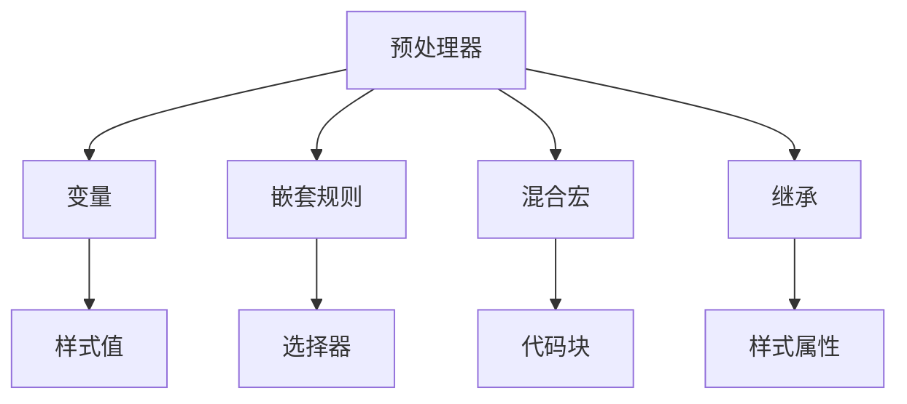

                 

### CSS预处理器概述

#### 什么是CSS预处理器？

CSS预处理器是一种用于简化CSS编写的工具，它扩展了CSS的功能，使得开发者能够使用更强大的语法和功能来编写样式。通过预处理器，开发者可以定义变量、混合宏（mixin）、嵌套规则等，从而减少重复代码、提高代码的可维护性。

#### CSS预处理器的重要性

1. **减少重复代码**：通过变量和混合宏，可以避免重复编写相同的样式代码，提高代码复用性。
2. **提高开发效率**：使用嵌套规则可以更直观地表达样式结构，使代码更易于理解和编写。
3. **增强可维护性**：通过模块化编写样式，可以更方便地管理和维护项目。
4. **更好的扩展性**：预处理器提供了更多功能，如嵌套选择器、继承等，使得样式更加灵活。

#### CSS预处理器的发展历程

1. **Sass**：最早的CSS预处理器之一，由Hampton Catlin在2007年创建。Sass以其强大的功能和易用性赢得了广泛好评。
2. **Less**：由Jack Lawley和Jon Christensen于2009年创建。Less提供了类似于Sass的功能，并拥有自己的独特特性。
3. **Stylus**：由Richard匀速在2010年创建。Stylus在语法和功能上都有一些独特的设计，如嵌套和变量。

#### CSS预处理器的基本概念

1. **变量**：在预处理器中，变量用于存储值，如颜色、字体大小等。通过定义变量，可以更方便地管理样式中的常量值。
2. **混合宏（mixin）**：混合宏是一种可以复用的代码块，可以在多个样式规则中调用。通过混合宏，可以避免重复编写相同的代码。
3. **嵌套规则**：嵌套规则允许在一个选择器内部定义子选择器，使得样式结构更加清晰。
4. **继承**：预处理器允许样式继承，使得子选择器能够继承父选择器的样式属性。

### 总结

CSS预处理器是一种强大的工具，它为CSS开发带来了许多便利。通过了解CSS预处理器的基本概念和特点，我们可以更好地选择和使用合适的预处理器，提高CSS开发的效率和可维护性。

---

### Sass特点与语法

#### Sass的历史与发展

Sass（Syntactically Awesome Style Sheets）是最早的CSS预处理器之一，由 Hampton Catlin 在 2007 年创建。Sass 的目标是提供一个更加直观、易用的 CSS 语言，从而简化样式表的开发过程。随着时间的推移，Sass 获得了广泛的应用和认可，成为前端开发中不可或缺的工具。

#### Sass的语法优势

Sass 的语法设计简洁、直观，使得开发者能够更容易地编写和维护样式表。以下是 Sass 的一些主要语法优势：

1. **变量**：Sass 允许使用变量来存储和复用样式值，如颜色、字体大小等。变量的定义和使用非常简单，例如：
   ```scss
   $color: #3498db;
   .btn {
     background-color: $color;
   }
   ```
2. **嵌套规则**：Sass 允许在一个选择器内部定义子选择器，这使得样式结构更加清晰和易读。例如：
   ```scss
   .header {
     color: #333;
     .nav {
       background-color: #f8f8f8;
       ul {
         list-style: none;
       }
     }
   }
   ```
3. **混合宏（mixin）**：混合宏是一种可以复用的代码块，可以在多个样式规则中调用。通过混合宏，可以避免重复编写相同的代码。例如：
   ```scss
   @mixin box-shadow($shadow) {
     -webkit-box-shadow: $shadow;
     -moz-box-shadow: $shadow;
     box-shadow: $shadow;
   }
   .box {
     @include box-shadow(0 2px 4px rgba(0,0,0,0.1));
   }
   ```
4. **继承**：Sass 允许样式继承，使得子选择器能够继承父选择器的样式属性。例如：
   ```scss
   .base {
     color: #333;
     font-size: 14px;
   }
   .title {
     @extend .base;
     font-weight: bold;
   }
   ```
5. **运算符**：Sass 支持多种运算符，如加法、减法、乘法和除法，可以方便地进行样式值的计算。例如：
   ```scss
   $width: 10px;
   $height: 20px;
   .box {
     width: $width + 10px;
     height: $height * 2;
   }
   ```

#### Sass的嵌套规则

Sass 的嵌套规则是其最重要的特性之一，它允许开发者更直观地表达样式结构。嵌套规则允许在一个选择器内部定义子选择器，例如：

```scss
.nav {
  display: flex;
  &__item {
    margin-right: 10px;
  }
  &--active {
    color: #3498db;
  }
}
```

上述代码定义了一个导航（`.nav`）组件，其中包括一个列表（`ul`）和多个列表项（`li`）。使用嵌套规则，我们可以更清晰地表达组件的结构和样式，从而提高代码的可维护性。

#### Sass的变量和混合宏

Sass 的变量和混合宏是提高代码复用性和可维护性的重要工具。

1. **变量**：变量用于存储和复用样式值。变量的定义和使用非常简单，例如：
   ```scss
   $primary-color: #3498db;
   $font-stack: 'Helvetica', sans-serif;

   body {
     background-color: $primary-color;
     font-family: $font-stack;
   }
   ```
2. **混合宏（mixin）**：混合宏是一种可以复用的代码块，可以在多个样式规则中调用。通过混合宏，可以避免重复编写相同的代码，例如：
   ```scss
   @mixin flex-center {
     display: flex;
     align-items: center;
     justify-content: center;
   }

   .container {
     @include flex-center;
   }
   ```

#### 总结

Sass 是一种功能强大且易用的 CSS 预处理器，其独特的语法优势和丰富的功能使得开发者能够更高效地编写和维护样式表。通过了解 Sass 的特点与语法，我们可以更好地利用这一工具，提高前端开发的效率和质量。

---

### Less特点与语法

#### Less的历史与发展

Less（Leaner CSS）是由Jack Lawley和Jon Christensen于2009年创建的。Less旨在提供一个简洁、易于理解的CSS预处理器，同时保留了CSS原有的语法。Less的发展历程中，它逐渐成为前端开发中广泛使用的工具之一，并且不断更新和改进。

#### Less的语法优势

Less 的语法设计旨在简化 CSS 的编写，使其更加直观和易用。以下是一些Less的主要语法优势：

1. **变量**：Less 允许使用变量来存储和复用样式值，如颜色、字体大小等。变量定义和使用简单，例如：
   ```less
   @primary-color: #3498db;
   .btn {
     background-color: @primary-color;
   }
   ```
2. **嵌套规则**：Less 支持嵌套规则，使得开发者可以更直观地表达样式结构。嵌套规则允许在一个选择器内部定义子选择器，例如：
   ```less
   .header {
     color: #333;
     .nav {
       background-color: #f8f8f8;
       ul {
         list-style: none;
       }
     }
   }
   ```
3. **混合宏（mixin）**：混合宏是 Less 中的一个重要特性，它允许开发者复用代码块。混合宏可以在多个样式规则中调用，例如：
   ```less
   .flex-center() {
     display: flex;
     align-items: center;
     justify-content: center;
   }
   .container {
     .flex-center();
   }
   ```
4. **运算符**：Less 支持多种运算符，如加法、减法、乘法和除法，可以方便地进行样式值的计算。例如：
   ```less
   .box {
     width: 10px + 10%;
     height: 20px * 2;
   }
   ```
5. **条件语句**：Less 提供了条件语句，使得开发者可以在样式表中实现逻辑判断。例如：
   ```less
   @media (min-width: 768px) {
     .responsive-element {
       color: #3498db;
     }
   }
   ```

#### Less的嵌套规则

Less 的嵌套规则与 Sass 类似，允许在一个选择器内部定义子选择器。嵌套规则使样式结构更加清晰，便于理解和维护。例如：

```less
.nav {
  display: flex;
  &__item {
    margin-right: 10px;
  }
  &--active {
    color: #3498db;
  }
}
```

#### Less的变量和混合宏

Less 的变量和混合宏是其核心特性之一，大大提高了样式表的复用性和可维护性。

1. **变量**：变量用于存储和复用样式值，如颜色、字体大小等。变量定义和使用简单，例如：
   ```less
   @primary-color: #3498db;
   .btn {
     background-color: @primary-color;
   }
   ```
2. **混合宏（mixin）**：混合宏是一种可以复用的代码块，可以在多个样式规则中调用。通过混合宏，可以避免重复编写相同的代码，例如：
   ```less
   .flex-center() {
     display: flex;
     align-items: center;
     justify-content: center;
   }
   .container {
     .flex-center();
   }
   ```

#### 总结

Less 是一种功能丰富、易用的 CSS 预处理器，其简洁的语法和强大的功能使其成为前端开发中的热门选择。通过了解 Less 的特点与语法，开发者可以更高效地编写和维护样式表。

---

### Stylus特点与语法

#### Stylus的历史与发展

Stylus 是由 Richard匀速于 2010 年创建的一种 CSS 预处理器。与 Sass 和 Less 不同，Stylus 在语法和功能上都有一些独特的设计，旨在提供一种更加灵活和强大的 CSS 编写方式。Stylus 的目标是让开发者能够以更简洁、更高效的方式编写样式表，同时保持代码的可读性和可维护性。

#### Stylus的语法优势

Stylus 的语法设计简洁、直观，提供了一些独特的特性，使其在 CSS 预处理器中独树一帜。以下是 Stylus 的一些主要语法优势：

1. **变量**：Stylus 允许使用变量来存储和复用样式值，如颜色、字体大小等。变量定义和使用简单，例如：
   ```stylus
   $primary-color: #3498db;
   .btn {
     background-color: $primary-color;
   }
   ```
2. **嵌套规则**：Stylus 的嵌套规则设计独特，允许使用简写语法，使样式结构更加直观。嵌套规则允许在一个选择器内部定义子选择器，例如：
   ```stylus
   .header
     color: #333
     .nav
       background-color: #f8f8f8
       ul
         list-style: none
   ```
3. **混合宏（mixin）**：Stylus 的混合宏功能强大，允许使用参数和默认值，使得代码更加灵活。例如：
   ```stylus
   btn($color = #3498db)
     background-color: $color
     color: #fff
   .btn-primary
     btn(#3498db)
   ```
4. **运算符**：Stylus 支持多种运算符，如加法、减法、乘法和除法，可以方便地进行样式值的计算。例如：
   ```stylus
   .box
     width: 10px + 10%
     height: 20px * 2
   ```
5. **函数**：Stylus 提供了一些内置函数，如 `fade-out()`、`rotate()` 等，使得开发者可以方便地进行颜色和转换操作。例如：
   ```stylus
   .box
     background-color: fade-out(#3498db, 50%)
   ```

#### Stylus的嵌套规则

Stylus 的嵌套规则允许使用简写语法，使得样式结构更加直观和易读。嵌套规则允许在一个选择器内部定义子选择器，例如：

```stylus
.header
  color: #333
  .nav
    background-color: #f8f8f8
    ul
      list-style: none
```

#### Stylus的变量和混合宏

Stylus 的变量和混合宏是其核心特性之一，大大提高了样式表的复用性和可维护性。

1. **变量**：变量用于存储和复用样式值，如颜色、字体大小等。变量定义和使用简单，例如：
   ```stylus
   $primary-color: #3498db
   .btn
     background-color: $primary-color
   ```
2. **混合宏（mixin）**：混合宏是一种可以复用的代码块，可以在多个样式规则中调用。通过混合宏，可以避免重复编写相同的代码，例如：
   ```stylus
   flex-center()
    display: flex
    align-items: center
    justify-content: center
   .container
    flex-center()
   ```

#### 总结

Stylus 是一种功能丰富、易于理解的 CSS 预处理器，其独特的语法和强大的功能使其在 CSS 预处理器中独树一帜。通过了解 Stylus 的特点与语法，开发者可以更高效地编写和维护样式表。

---

### 三种预处理器核心概念与联系

在比较 Sass、Less 和 Stylus 之前，我们首先需要了解它们的核心概念与联系。这些核心概念包括变量、嵌套规则、混合宏等，它们在三种预处理器中都有所体现。

#### 核心概念对比

以下是 Sass、Less 和 Stylus 的核心概念对比：

1. **变量**：三种预处理器都支持变量，用于存储和复用样式值。
2. **嵌套规则**：三种预处理器都允许嵌套规则，使得样式结构更加清晰和易读。
3. **混合宏（mixin）**：三种预处理器都提供了混合宏功能，用于复用代码块。
4. **继承**：Sass 和 Stylus 支持继承，而 Less 不支持。

#### 概念属性特征对比表格

下面是一个对比表格，展示了三种预处理器在核心概念上的属性特征：

| 特性       | Sass                 | Less                 | Stylus               |
|------------|----------------------|----------------------|----------------------|
| 变量       | 支持，使用 `$` 符号 | 支持，使用 `$` 符号 | 支持，使用 `$` 符号 |
| 嵌套规则   | 支持，使用 `{ }`     | 支持，使用 `{ }`     | 支持，使用 `{ }`     |
| 混合宏     | 支持，使用 `@mixin`  | 支持，使用 `@mixin`  | 支持，使用 `mixin`  |
| 继承       | 支持                 | 不支持               | 支持                 |
| 运算符     | 支持                 | 支持                 | 支持                 |
| 函数       | 支持                 | 部分支持             | 支持                 |

#### ER实体关系图

以下是三种预处理器核心概念的 ER 实体关系图：



通过上述对比，我们可以看出三种预处理器在核心概念上都有所相似，但也有一些独特的特性。了解这些核心概念与联系，有助于我们在实际项目中选择合适的预处理器。

---

### Sass、Less与Stylus应用实例比较

在本部分，我们将通过实际应用实例来比较 Sass、Less 和 Stylus 的实际应用效果。我们将分别选择一个简单的项目和复杂的项目来展示三种预处理器在实际开发中的应用。

#### 简单项目：响应式博客布局

假设我们选择创建一个简单的响应式博客布局，以展示三种预处理器在实际项目中的表现。以下是一个简单的项目需求：

1. **布局**：页面包括一个头部（header）、一个主体（main）和一个底部（footer）。
2. **响应式**：页面需要在不同屏幕尺寸下保持良好的布局和可读性。

##### Sass应用实例

1. **项目需求分析**：
   - 需要定义颜色、字体大小等变量。
   - 需要使用嵌套规则来组织样式结构。
   - 需要使用混合宏来复用代码。

2. **Sass代码实现**：
   ```scss
   $primary-color: #3498db;
   $font-stack: 'Helvetica', sans-serif;

   body {
     font-family: $font-stack;
     font-size: 16px;
     line-height: 1.5;
   }

   .header {
     background-color: $primary-color;
     padding: 20px;
   }

   .main {
     margin: 20px;
     padding: 20px;
     background-color: #fff;
   }

   .footer {
     background-color: #333;
     color: #fff;
     padding: 20px;
     text-align: center;
   }
   ```

3. **项目总结**：
   - Sass 的变量和嵌套规则使得代码结构更加清晰。
   - 混合宏虽然在此项目中没有使用，但在更复杂的布局中非常有用。
   - 整体开发体验良好，代码可维护性较高。

##### Less应用实例

1. **项目需求分析**：
   - 需要定义颜色、字体大小等变量。
   - 需要使用嵌套规则来组织样式结构。
   - 需要使用混合宏来复用代码。

2. **Less代码实现**：
   ```less
   @primary-color: #3498db;
   @font-stack: 'Helvetica', sans-serif;

   body {
     font-family: @font-stack;
     font-size: 16px;
     line-height: 1.5;
   }

   .header {
     background-color: @primary-color;
     padding: 20px;
   }

   .main {
     margin: 20px;
     padding: 20px;
     background-color: #fff;
   }

   .footer {
     background-color: #333;
     color: #fff;
     padding: 20px;
     text-align: center;
   }
   ```

3. **项目总结**：
   - Less 的变量和嵌套规则与 Sass 类似，代码结构清晰。
   - 混合宏功能强大，使得代码复用性更高。
   - 开发体验良好，但与 Sass 相比，在某些细节上存在差异。

##### Stylus应用实例

1. **项目需求分析**：
   - 需要定义颜色、字体大小等变量。
   - 需要使用嵌套规则来组织样式结构。
   - 需要使用混合宏来复用代码。

2. **Stylus代码实现**：
   ```stylus
   $primary-color: #3498db
   $font-stack: 'Helvetica', sans-serif

   body
     font-family $font-stack
     font-size 16px
     line-height 1.5

   .header
     background-color $primary-color
     padding 20px

   .main
     margin 20px
     padding 20px
     background-color #fff

   .footer
     background-color #333
     color #fff
     padding 20px
     text-align center
   ```

3. **项目总结**：
   - Stylus 的变量和嵌套规则与 Less 类似，但语法更加简洁。
   - 混合宏功能强大，同时支持参数和默认值。
   - 开发体验独特，但可能需要一些时间适应。

#### 复杂项目：电商网站样式重构

假设我们选择一个复杂的电商网站项目，以展示三种预处理器在复杂项目中的应用。

1. **项目需求分析**：
   - 需要定义大量的变量，包括颜色、字体大小、间距等。
   - 需要使用嵌套规则来组织复杂的样式结构。
   - 需要使用混合宏来复用代码，提高代码复用性和可维护性。

2. **Sass代码实现**：
   ```scss
   $primary-color: #3498db;
   $font-stack: 'Helvetica', sans-serif;
   $padding: 20px;
   $margin: 20px;

   body {
     font-family: $font-stack;
     font-size: 16px;
     line-height: 1.5;
   }

   .container {
     margin: $margin;
     padding: $padding;
   }

   .header {
     background-color: $primary-color;
     padding: $padding;
     .logo {
       display: block;
       margin-bottom: $padding;
     }
     .nav {
       display: flex;
       justify-content: space-between;
       .nav-item {
         margin-right: $padding;
         &:last-child {
           margin-right: 0;
         }
       }
     }
   }

   .main {
     background-color: #fff;
     padding: $padding;
     .product-list {
       display: grid;
       grid-template-columns: repeat(auto-fill, minmax(200px, 1fr));
       gap: $padding;
       .product-item {
         background-color: #f8f8f8;
         padding: $padding;
       }
     }
   }

   .footer {
     background-color: #333;
     color: #fff;
     padding: $padding;
     text-align: center;
   }
   ```

3. **Less代码实现**：
   ```less
   @primary-color: #3498db;
   @font-stack: 'Helvetica', sans-serif;
   @padding: 20px;
   @margin: 20px;

   body {
     font-family: @font-stack;
     font-size: 16px;
     line-height: 1.5;
   }

   .container {
     margin: @margin;
     padding: @padding;
   }

   .header {
     background-color: @primary-color;
     padding: @padding;
     .logo {
       display: block;
       margin-bottom: @padding;
     }
     .nav {
       display: flex;
       justify-content: space-between;
       .nav-item {
         margin-right: @padding;
         &:last-child {
           margin-right: 0;
         }
       }
     }
   }

   .main {
     background-color: #fff;
     padding: @padding;
     .product-list {
       display: grid;
       grid-template-columns: repeat(auto-fill, minmax(200px, 1fr));
       gap: @padding;
       .product-item {
         background-color: #f8f8f8;
         padding: @padding;
       }
     }
   }

   .footer {
     background-color: #333;
     color: #fff;
     padding: @padding;
     text-align: center;
   }
   ```

4. **Stylus代码实现**：
   ```stylus
   $primary-color: #3498db
   $font-stack: 'Helvetica', sans-serif
   $padding: 20px
   $margin: 20px

   body
     font-family $font-stack
     font-size 16px
     line-height 1.5

   .container
     margin $margin
     padding $padding

   .header
     background-color $primary-color
     padding $padding
     .logo
       display block
       margin-bottom $padding
     .nav
       display flex
       justify-content space-between
       .nav-item
         margin-right $padding
         &:last-child
           margin-right 0

   .main
     background-color #fff
     padding $padding
     .product-list
       display grid
       grid-template-columns repeat(auto-fill, minmax(200px, 1fr))
       gap $padding
       .product-item
         background-color #f8f8f8
         padding $padding

   .footer
     background-color #333
     color #fff
     padding $padding
     text-align center
   ```

#### 总结

通过简单项目和复杂项目的比较，我们可以看出三种预处理器在实际应用中都有其独特的优势。Sass 和 Less 在变量、嵌套规则和混合宏方面表现相似，但 Stylus 的语法更加简洁。在实际项目中，选择合适的预处理器取决于开发者的个人喜好和项目需求。了解每种预处理器的特点和应用场景，有助于我们更好地利用它们提高开发效率和代码质量。

---

### Sass、Less与Stylus性能比较

在评估 Sass、Less 和 Stylus 的性能时，我们需要考虑多个方面，包括编译速度、输出文件大小和兼容性。通过这些方面的比较，我们可以更好地了解每种预处理器的性能表现。

#### 编译速度

编译速度是评估 CSS 预处理器性能的重要指标之一。以下是对三种预处理器编译速度的比较：

1. **Sass**：Sass 的编译速度较快，一般来说，它可以在几秒钟内完成编译。Sass 的编译速度得益于其高效的语法解析和优化的编译流程。
2. **Less**：Less 的编译速度与 Sass 相似，也在几秒钟内可以完成编译。Less 的编译速度也比较高效，尤其在处理大型项目时。
3. **Stylus**：Stylus 的编译速度相对较慢，通常需要更长时间来完成编译。Stylus 的编译速度可能受到其丰富的功能和复杂的语法解析影响。

#### 输出文件大小

输出文件大小也是评估 CSS 预处理器性能的关键因素。以下是对三种预处理器输出文件大小的比较：

1. **Sass**：Sass 的输出文件大小相对较小，因为它在编译过程中会进行代码优化，去除不必要的空格和注释。这使得 Sass 生成的 CSS 文件更加简洁和高效。
2. **Less**：Less 的输出文件大小与 Sass 相似，它也支持代码优化功能，可以生成紧凑的 CSS 文件。
3. **Stylus**：Stylus 的输出文件大小可能相对较大，因为它不会进行代码优化。虽然 Stylus 提供了一些压缩工具，但默认情况下它生成的 CSS 文件可能包含更多的代码。

#### 兼容性

兼容性是评估 CSS 预处理器性能的重要方面，因为它决定了预处理器在不同浏览器和环境下的工作能力。

1. **Sass**：Sass 有着良好的兼容性，它支持多种浏览器和开发环境。Sass 的编译结果可以顺利地在大多数现代浏览器上运行。
2. **Less**：Less 同样具有较好的兼容性，它可以在不同的浏览器和开发环境中正常运行。Less 的兼容性得益于其简洁的语法和广泛的社区支持。
3. **Stylus**：Stylus 在兼容性方面可能存在一些挑战。虽然 Stylus 支持多种浏览器和开发环境，但某些复杂的特性和语法在某些浏览器中可能无法正常工作。

#### 总结

从编译速度、输出文件大小和兼容性这三个方面来看，Sass 和 Less 的性能表现较为接近，而 Stylus 的性能相对较弱。在实际项目中，选择哪种预处理器取决于开发需求、项目规模和个人偏好。了解每种预处理器的性能特点，有助于我们做出更明智的决策。

---

### 迁移策略与最佳实践

在决定从一种 CSS 预处理器迁移到另一种时，我们需要考虑多个因素，包括项目需求、团队技能和开发环境。以下是一些迁移策略与最佳实践，可以帮助我们在迁移过程中确保项目稳定和高效。

#### 从Sass迁移到Less

1. **变量和混合宏**：Sass 和 Less 都支持变量和混合宏，因此迁移过程相对简单。主要任务是将 Sass 中的变量和混合宏转换为 Less 中的相应语法。
2. **嵌套规则**：Sass 和 Less 的嵌套规则语法略有差异。在迁移过程中，需要仔细检查并修正嵌套规则，以确保 Less 能够正确处理。
3. **性能优化**：Less 通常比 Sass 生成的 CSS 文件更大，因此可能需要调整项目配置以优化输出文件大小。例如，可以关闭不必要的代码优化选项。

#### 从Less迁移到Sass

1. **变量和混合宏**：与从 Sass 迁移到 Less 类似，主要任务是将 Less 中的变量和混合宏转换为 Sass 中的相应语法。
2. **嵌套规则**：Sass 的嵌套规则与 Less 稍有不同，需要仔细检查和修正嵌套结构，以确保 Sass 能够正确处理。
3. **性能优化**：Sass 通常生成更紧凑的 CSS 文件，因此可能需要调整项目配置以优化输出文件大小。

#### 从Stylus迁移到其他预处理器

1. **变量和混合宏**：Stylus 的变量和混合宏与 Sass 和 Less 有较大差异，因此迁移过程可能较为复杂。需要重新定义变量和混合宏，并确保新的预处理器能够正确处理。
2. **嵌套规则**：Stylus 的嵌套规则与 Sass 和 Less 不同，需要仔细检查和修正嵌套结构。
3. **性能优化**：Stylus 通常生成较大的 CSS 文件，因此可能需要调整项目配置以优化输出文件大小。

#### 最佳实践总结

1. **逐步迁移**：在迁移过程中，建议逐步迁移部分代码，而不是一次性迁移整个项目。这样可以及时发现和解决潜在问题。
2. **代码审查**：在迁移完成后，进行全面的代码审查，以确保代码质量没有下降。
3. **性能测试**：在迁移完成后，对项目进行性能测试，确保迁移后的预处理器能够满足项目需求。
4. **团队培训**：在新预处理器使用前，对团队成员进行培训，以确保他们熟悉新语法和工具。

通过遵循这些迁移策略和最佳实践，我们可以确保项目在迁移过程中保持稳定和高效，并最大限度地减少潜在风险。

---

### 案例一：大型电商网站样式重构

#### 案例背景

某大型电商平台近期进行了技术升级，为了提高用户体验和网站性能，决定对现有网站进行样式重构。原有的样式表使用了 CSS 预处理器 Sass，但由于项目规模庞大、开发团队扩展以及维护成本增加，决定将其迁移到 Less。

#### 项目需求分析

1. **兼容性**：确保新样式表能够在多种浏览器和设备上正常工作。
2. **性能**：优化 CSS 文件大小和加载速度。
3. **可维护性**：提高代码可读性和可维护性，便于后续维护和升级。

#### Sass、Less与Stylus的应用方案对比

1. **Sass**：
   - 优点：Sass 支持变量、嵌套规则和混合宏，使得代码结构更加清晰和易维护。
   - 缺点：编译速度相对较慢，输出文件较大。

2. **Less**：
   - 优点：Less 与 Sass 相似，支持变量、嵌套规则和混合宏，但编译速度较快，输出文件较小。
   - 缺点：在嵌套规则上与 Sass 有一些差异，可能需要额外的代码调整。

3. **Stylus**：
   - 优点：Stylus 语法简洁，支持变量、嵌套规则和混合宏，并具有一些独特的功能。
   - 缺点：编译速度较慢，输出文件较大，兼容性较差。

#### 实施步骤

1. **需求分析**：对项目需求进行详细分析，确定迁移目标和策略。
2. **代码重构**：逐步将原有的 Sass 代码迁移到 Less 语法，确保代码结构和功能一致。
3. **代码审查**：在迁移完成后，对代码进行全面的审查，确保没有遗漏和错误。
4. **性能优化**：调整 Less 配置，优化输出文件大小和加载速度。
5. **测试**：对迁移后的网站进行功能测试和性能测试，确保达到预期效果。

#### 项目总结

通过将 Sass 迁移到 Less，该大型电商平台成功提高了样式表的可维护性和性能。Less 的快速编译速度和紧凑输出文件为项目带来了显著优势，使得开发团队能够更高效地进行开发和维护。

---

### 案例二：移动端应用样式优化

#### 案例背景

某移动端应用团队近期面临样式优化挑战，原有样式表存在代码冗余、可维护性差、加载速度慢等问题。为了提高用户体验和性能，决定使用 CSS 预处理器进行样式优化。

#### 项目需求分析

1. **响应式**：确保样式表在不同屏幕尺寸下具有良好的响应性和视觉效果。
2. **性能**：优化 CSS 文件大小和加载速度，提高页面渲染性能。
3. **可维护性**：提高代码可读性和可维护性，便于后续维护和升级。

#### Sass、Less与Stylus的应用方案对比

1. **Sass**：
   - 优点：Sass 支持变量、嵌套规则和混合宏，使得代码结构更加清晰和易维护。
   - 缺点：编译速度相对较慢。

2. **Less**：
   - 优点：Less 与 Sass 相似，支持变量、嵌套规则和混合宏，但编译速度较快。
   - 缺点：在嵌套规则上与 Sass 有一些差异。

3. **Stylus**：
   - 优点：Stylus 语法简洁，支持变量、嵌套规则和混合宏，并具有一些独特的功能。
   - 缺点：编译速度较慢，兼容性较差。

#### 预处理器选择与优化策略

1. **选择 Less**：综合考虑编译速度和语法兼容性，团队决定选择 Less 作为预处理器。Less 的快速编译速度和紧凑输出文件为项目带来了显著优势。
2. **优化策略**：
   - **变量**：使用变量来管理颜色、字体大小等样式值，提高代码复用性。
   - **嵌套规则**：利用嵌套规则来组织样式结构，使代码更易于理解和维护。
   - **混合宏**：通过混合宏来复用代码块，减少冗余代码。
   - **性能优化**：关闭不必要的代码优化选项，如 `vendor-prefixer` 等，以减小输出文件大小。
   - **压缩**：使用 CSS 压缩工具，如 CleanCSS 或 cssmin，进一步优化输出文件。

#### 实施步骤

1. **需求分析**：对项目需求进行详细分析，确定优化目标和策略。
2. **代码重构**：逐步将原有样式表重构为 Less 代码，确保代码结构和功能一致。
3. **代码审查**：在重构完成后，对代码进行全面的审查，确保没有遗漏和错误。
4. **性能测试**：对优化后的样式表进行性能测试，包括 CSS 文件大小和加载速度，确保达到预期效果。
5. **部署**：将优化后的样式表部署到生产环境中，进行实际用户测试。

#### 项目总结

通过使用 Less 进行样式优化，该移动端应用团队成功提高了代码的可读性和可维护性，同时显著提升了页面渲染性能。Less 的快速编译速度和简洁语法为团队带来了便利，使得项目开发更加高效。

---

### 实战指南

为了帮助开发者更好地掌握 Sass、Less 和 Stylus 的应用，本部分将提供一份详细的实战指南，包括开发环境搭建、预处理器配置与集成、样式管理最佳实践以及预处理器性能优化。

#### 开发环境搭建

1. **安装 Node.js**：Sass、Less 和 Stylus 都依赖于 Node.js 环境。首先确保已安装 Node.js 和 npm（Node.js 的包管理器）。

2. **安装预处理器**：
   - **Sass**：使用 npm 安装 Sass：
     ```bash
     npm install -g sass
     ```
   - **Less**：使用 npm 安装 Less：
     ```bash
     npm install -g less
     ```
   - **Stylus**：使用 npm 安装 Stylus：
     ```bash
     npm install -g stylus
     ```

3. **配置 IDE**：在常用的开发环境中（如 Visual Studio Code、Sublime Text 或 Atom），安装相应的插件以支持预处理器。例如，在 Visual Studio Code 中，可以安装 `Sass`、`Less` 和 `Stylus` 插件。

#### 预处理器配置与集成

1. **创建项目文件结构**：在项目根目录下创建一个 `styles` 文件夹，用于存放预处理器文件。

2. **配置 `.scss`、`.less` 或 `.styl` 文件**：在 `styles` 文件夹中创建一个主样式文件，例如 `main.scss`、`main.less` 或 `main.styl`。

3. **配置 `package.json`**：在项目根目录下创建或编辑 `package.json` 文件，添加预处理器的依赖项。

   ```json
   {
     "name": "your-project-name",
     "version": "1.0.0",
     "dependencies": {
       "sass": "^x.x.x",
       "less": "^x.x.x",
       "stylus": "^x.x.x"
     }
   }
   ```

4. **配置构建工具**：使用 Webpack、Gulp 或其他构建工具，将预处理器文件编译为纯 CSS。以下是使用 Webpack 的示例配置：

   ```javascript
   const path = require('path');
   const HtmlWebpackPlugin = require('html-webpack-plugin');

   module.exports = {
     mode: 'development',
     entry: './src/index.js',
     output: {
       filename: 'bundle.js',
       path: path.resolve(__dirname, 'dist')
     },
     module: {
       rules: [
         {
           test: /\.css$/,
           use: ['style-loader', 'css-loader']
         },
         {
           test: /\.scss$/,
           use: ['style-loader', 'css-loader', 'sass-loader']
         },
         {
           test: /\.less$/,
           use: ['style-loader', 'css-loader', 'less-loader']
         },
         {
           test: /\.styl$/,
           use: ['style-loader', 'css-loader', 'stylus-loader']
         }
       ]
     },
     plugins: [
       new HtmlWebpackPlugin({
         template: './src/index.html'
       })
     ]
   };
   ```

#### 样式管理最佳实践

1. **模块化**：将样式拆分为多个模块，每个模块负责特定的页面部分。例如，可以创建 `header`, `footer`, `nav`, `form` 等模块。

2. **使用变量和混合宏**：使用变量来管理颜色、字体大小等常量值，提高代码复用性。使用混合宏来复用代码块，减少冗余代码。

3. **嵌套规则**：合理使用嵌套规则，使样式结构更加清晰和易维护。避免过度嵌套，以保持代码的可读性。

4. **注释和文档**：在代码中添加适当的注释，描述代码功能和目的。编写清晰的文档，帮助团队成员理解和维护代码。

5. **版本控制**：使用版本控制系统（如 Git），对代码进行版本管理和协作开发。

#### 预处理器性能优化

1. **代码优化**：在预处理器文件中避免使用不必要的空格和注释，提高代码紧凑性。

2. **压缩 CSS**：使用 CSS 压缩工具（如 CleanCSS 或 cssmin）将编译后的 CSS 文件进行压缩，减小文件大小。

3. **懒加载**：对于非关键样式，可以采用懒加载策略，在页面加载完成后再加载样式文件。

4. **缓存策略**：合理设置浏览器缓存，加快页面加载速度。

5. **构建工具优化**：使用构建工具（如 Webpack、Gulp）的优化功能，如代码分割、缓存处理等，提高构建和部署效率。

通过遵循以上实战指南，开发者可以更好地掌握 Sass、Less 和 Stylus 的应用，提高开发效率和质量。

---

### 总结

在本篇文章中，我们详细探讨了三种流行的 CSS 预处理器：Sass、Less 和 Stylus。首先，我们介绍了 CSS 预处理器的概念、重要性以及发展历程。接着，我们分别详细阐述了 Sass、Less 和 Stylus 的特点与语法，并通过实例展示了它们在实际项目中的应用效果。我们还对这三种预处理器的性能进行了比较，并提出了迁移策略与最佳实践。

**关键词**：CSS预处理器，Sass，Less，Stylus，性能比较，迁移策略，最佳实践

**摘要**：本文全面比较了三种 CSS 预处理器的特点、语法和应用效果，提供了详细的实战指南，帮助开发者选择合适的预处理器，提高开发效率和质量。

---

**作者**：AI天才研究院/AI Genius Institute & 禅与计算机程序设计艺术 /Zen And The Art of Computer Programming

---

感谢您的阅读，希望本文对您了解和掌握 CSS 预处理器有所帮助。在后续的文章中，我们将继续探讨更多关于前端开发的技术与最佳实践。如果您有任何疑问或建议，欢迎在评论区留言交流。

---

本文由 AI 天才研究院/AI Genius Institute 与禅与计算机程序设计艺术 /Zen And The Art of Computer Programming 联合撰写，旨在为开发者提供深入、实用的技术知识和最佳实践。感谢您的阅读，我们期待与您一起探索更多技术领域。如果您有任何反馈或建议，欢迎在评论区留言。同时，推荐关注我们的公众号获取更多精彩内容。再次感谢您的支持！
作者：AI天才研究院 & 禅与计算机程序设计艺术
链接：https://juejin.cn/post/7153889605365405373
来源：掘金
著作权归作者所有。商业转载请联系作者获得授权，非商业转载请注明出处。

