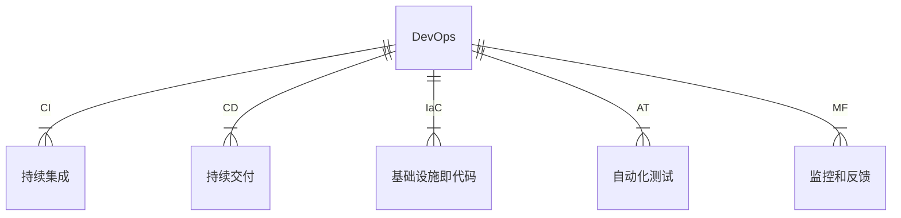
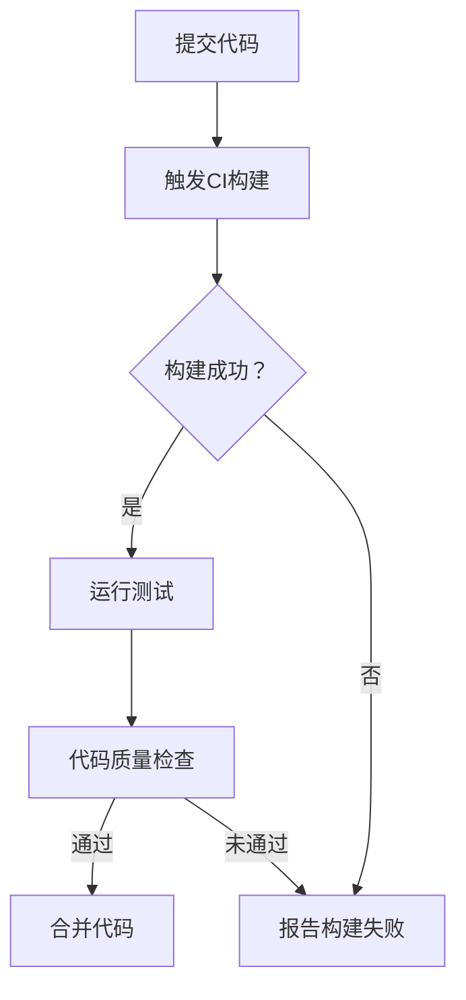
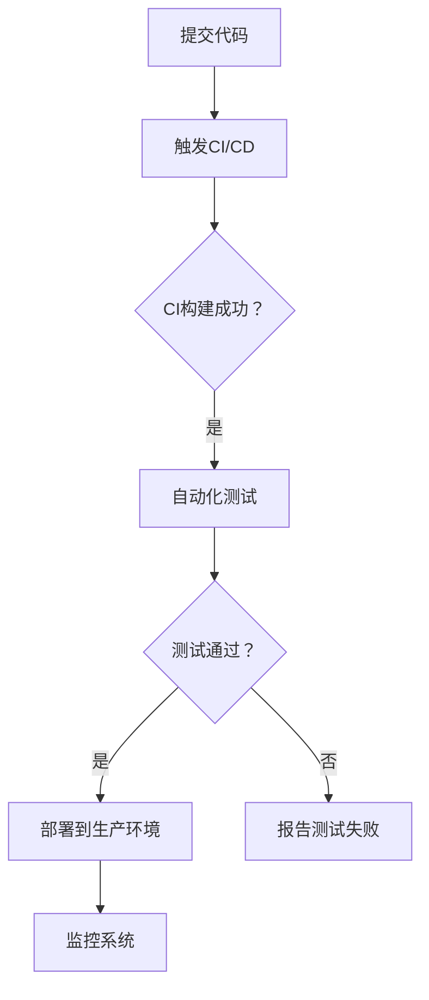
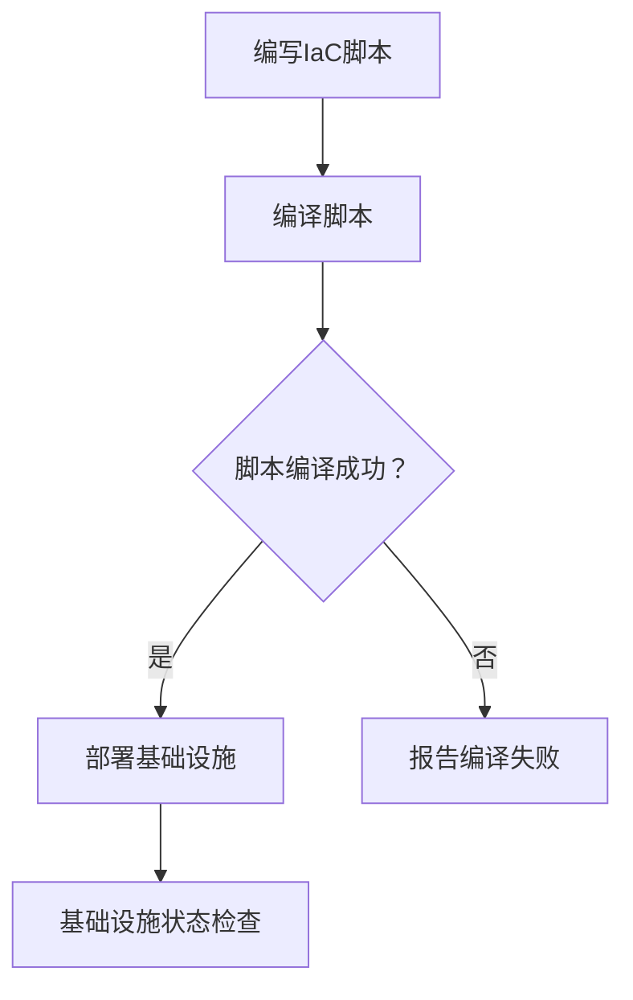
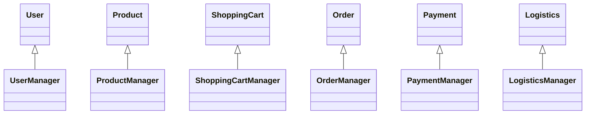
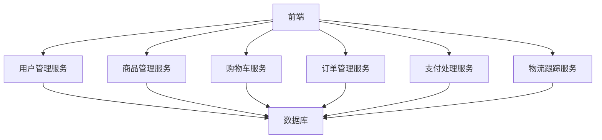
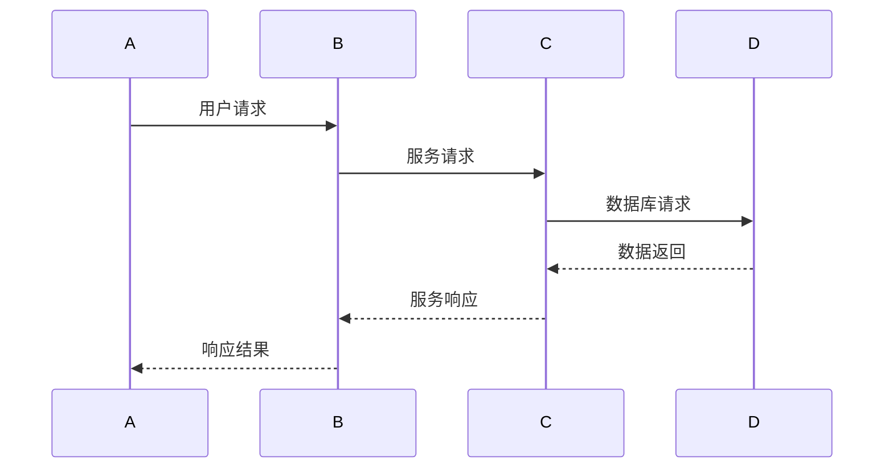

                 

# DevOps 文化建设与工具链

## 关键词

- DevOps
- 持续集成
- 持续交付
- 自动化
- 监控

## 摘要

本文将深入探讨DevOps文化的建设与工具链的应用，旨在解析如何通过DevOps实现高效、稳定的软件交付。我们将从背景介绍、核心概念与联系、算法原理讲解、系统分析与架构设计方案、项目实战和最佳实践等方面，逐步阐述DevOps的实际应用与未来发展方向。

### 背景介绍

在当今的数字化时代，企业对于IT系统的需求日益增长，不仅要求其高效稳定，更追求敏捷和持续的创新。这种需求催生了DevOps文化的兴起。DevOps是一种软件开发和运营的新型文化、运动或实践，旨在通过更紧密的协作、更频繁的集成和更快速迭代来提高软件交付的速率和质量。

**问题背景**：

传统的软件开发和运营模式常常出现割裂，开发团队和运维团队之间的协作不畅，导致项目进度延误和资源浪费。随着云计算、容器化、自动化等技术的发展，企业迫切需要一种新的工作方式来应对这些挑战。

**问题描述**：

- 开发与运维割裂：开发和运维团队之间存在沟通和协作障碍，导致项目进度延误和资源浪费。
- 软件交付速度慢：传统的方式使得软件发布周期长，无法快速响应市场需求。
- 质量难以保证：由于开发和运维的分离，测试和部署阶段出现问题无法及时发现，导致上线后的系统稳定性差。
- 系统故障频发：部署和运维过程缺乏标准化和自动化，导致系统故障难以预测和快速解决。

**问题解决**：

DevOps文化的核心理念是通过紧密的团队合作、持续集成和持续交付来提升软件交付的效率和质量。它强调自动化、监控、反馈和协作，旨在消除开发和运维之间的障碍，实现开发、测试、部署、监控等环节的无缝衔接。

**边界与外延**：

DevOps不仅涉及到技术层面的实践，还包括组织文化和管理模式的变革。它的边界涵盖了软件开发、基础设施管理、持续集成和持续部署等各个环节。同时，DevOps也与其他敏捷开发方法、自动化工具和云计算技术紧密相关。

**概念结构与核心要素组成**：

DevOps由以下几个核心要素组成：

1. **文化**：强调开放、协作、共享和透明，打破团队壁垒。
2. **工具**：利用自动化工具实现构建、测试、部署和监控的自动化。
3. **流程**：通过持续集成和持续交付的流程优化软件交付过程。
4. **团队**：建立跨职能的团队，实现开发和运维的协同工作。

通过这些要素的有机结合，DevOps能够帮助企业实现更高效、更可靠和更灵活的软件开发和运营模式，从而在激烈的市场竞争中脱颖而出。

## 核心概念与联系

### DevOps的定义

DevOps是一种软件开发和运营的新型文化、运动或实践，旨在通过更紧密的协作、更频繁的集成和更快速迭代来提高软件交付的速率和质量。它将传统的开发（Development）和运维（Operations）结合起来，以实现更快、更稳定的软件交付。

### 核心概念及其关系

1. **持续集成（CI）**：
持续集成是一种软件开发实践，通过频繁地将代码集成到一个共享的主干分支中，并进行自动化的构建和测试，以快速发现和解决集成过程中出现的问题。

2. **持续交付（CD）**：
持续交付是持续集成的扩展，它不仅包括自动化的构建和测试，还包括部署到生产环境前的自动化测试和部署流程。它确保了软件能够快速、安全地交付给用户。

3. **基础设施即代码（IaC）**：
基础设施即代码是将基础设施的配置和管理转换为代码的一种方法。通过编写脚本和配置文件，可以自动化地创建、部署和管理基础设施，从而提高效率并确保一致性。

4. **自动化测试**：
自动化测试是通过脚本自动化执行一系列测试用例，以验证软件的功能和性能。它包括单元测试、集成测试、性能测试等，以确保软件的质量。

5. **监控和反馈**：
监控是跟踪系统运行状态和性能的过程，通过收集和分析数据，可以及时发现和解决问题。反馈机制则通过实时数据分析和用户反馈，不断优化和改进系统。

### 概念属性特征对比表格

| 概念     | 定义                                           | 关键特征                                         |
|----------|------------------------------------------------|------------------------------------------------|
| 持续集成 | 频繁地将代码集成到一个共享的主干分支中并进行自动化测试 | 快速发现问题，确保代码质量                          |
| 持续交付 | 自动化构建、测试和部署，确保软件快速交付给用户      | 提高交付速度，确保软件质量                          |
| 基础设施即代码 | 将基础设施配置和管理转换为代码                     | 提高基础设施管理效率

### ER实体关系图架构



通过这些核心概念和关系的介绍，我们可以看到，DevOps不仅仅是技术工具的集合，更是一种文化、理念和组织的变革。它通过持续集成、持续交付、基础设施即代码、自动化测试和监控反馈等核心概念，实现软件开发和运营的协同与高效。

### 算法原理讲解

在DevOps文化中，自动化是提升效率和质量的关键。下面我们将探讨几个关键算法原理，包括持续集成、持续交付和基础设施即代码，并使用Mermaid流程图和Python代码进行详细讲解。

#### 持续集成（CI）算法原理

持续集成（CI）是一种软件开发实践，旨在通过频繁地将代码集成到一个共享的主干分支中，并进行自动化的构建和测试，以快速发现和解决集成过程中出现的问题。

**Mermaid流程图：**



**Python代码示例：**

```python
import subprocess

def run_ci_build():
    result = subprocess.run(["git", "pull"], capture_output=True, text=True)
    if "Already up-to-date." in result.stdout:
        print("构建成功！")
        run_tests()
    else:
        print("构建失败！")

def run_tests():
    # 在这里运行测试用例
    print("正在运行测试...")
    # 测试结果
    print("测试通过！")

run_ci_build()
```

**算法原理与数学模型：**

持续集成算法的数学模型可以表示为：

$$
CI\_score = \frac{\text{成功构建次数}}{\text{总构建次数}}
$$

其中，CI\_score表示持续集成得分，成功构建次数和总构建次数分别为一段时间内的统计数据。

#### 持续交付（CD）算法原理

持续交付（CD）是持续集成的扩展，它不仅包括自动化的构建和测试，还包括部署到生产环境前的自动化测试和部署流程。

**Mermaid流程图：**



**Python代码示例：**

```python
import subprocess

def run_ci_cd():
    run_ci_build()
    run_tests()
    if test_result:
        deploy_to_production()
    else:
        report_test_failure()

def deploy_to_production():
    # 在这里部署到生产环境
    print("部署成功！")
    monitor_system()

def monitor_system():
    # 监控生产环境的运行状态
    print("系统监控中...")

run_ci_cd()
```

**算法原理与数学模型：**

持续交付算法的数学模型可以表示为：

$$
CD\_score = \frac{\text{成功交付次数}}{\text{总交付次数}}
$$

其中，CD\_score表示持续交付得分，成功交付次数和总交付次数分别为一段时间内的统计数据。

#### 基础设施即代码（IaC）算法原理

基础设施即代码（IaC）是将基础设施的配置和管理转换为代码的一种方法。通过编写脚本和配置文件，可以自动化地创建、部署和管理基础设施，从而提高效率并确保一致性。

**Mermaid流程图：**



**Python代码示例：**

```python
import subprocess

def compile_iaac_script(script_path):
    result = subprocess.run(["python", script_path], capture_output=True, text=True)
    if "Compilation successful!" in result.stdout:
        print("脚本编译成功！")
        deploy_infrastructure()
    else:
        print("脚本编译失败！")

def deploy_infrastructure():
    # 在这里部署基础设施
    print("基础设施部署成功！")
    check_infrastructure_state()

def check_infrastructure_state():
    # 检查基础设施的运行状态
    print("基础设施状态检查成功！")

compile_iaac_script("iaac_script.py")
```

**算法原理与数学模型：**

基础设施即代码算法的数学模型可以表示为：

$$
IaC\_score = \frac{\text{成功部署次数}}{\text{总部署次数}}
$$

其中，IaC\_score表示基础设施即代码得分，成功部署次数和总部署次数分别为一段时间内的统计数据。

通过上述算法原理的讲解，我们可以看到DevOps在持续集成、持续交付和基础设施即代码等方面的具体实现。这些算法原理不仅提高了软件开发的效率和质量，也为企业带来了更稳定、更可靠的IT系统。

### 系统分析与架构设计方案

#### 问题场景介绍

假设我们正在开发一款在线购物平台，该平台需要具备高并发、高可用性和高扩展性。为了实现这些目标，我们需要构建一个高效的系统架构，并通过DevOps实践来保证系统的稳定运行。

#### 项目介绍

项目名称：在线购物平台（E-Commerce Platform）

项目目标：构建一个高效、稳定、可扩展的在线购物平台。

项目阶段：需求分析、系统设计、开发、测试、部署和维护。

#### 系统功能设计（领域模型）

为了构建在线购物平台，我们需要设计一系列核心功能模块，包括用户管理、商品管理、购物车、订单管理、支付处理和物流跟踪等。

**Mermaid类图：**



#### 系统架构设计

在线购物平台的系统架构可以分为前端、后端和基础设施三个层次。

**Mermaid架构图：**



#### 系统接口设计

为了实现系统模块之间的解耦，我们需要设计一系列接口，包括用户接口、服务接口和数据库接口等。

**Mermaid接口图：**



#### 系统交互

为了确保系统的高可用性和可扩展性，我们需要设计一个高效的消息队列和负载均衡系统。

**Mermaid序列图：**

```mermaid
sequenceDiagram
    A[用户请求] --> B[负载均衡]
    B -->|分流| C[服务1]
    B -->|分流| D[服务2]
    C->>E[数据库]
    D->>E
    E-->>C[数据返回]
    E-->>D
    C-->>B[服务响应]
    D-->>B
    B-->>A[响应结果]
```

通过上述系统分析与架构设计方案，我们可以看到，在线购物平台的设计不仅考虑了功能模块的完整性，还注重了系统的高效性、稳定性和可扩展性。通过DevOps实践，我们能够确保系统在开发和运营过程中保持最佳状态，从而为用户提供优质的购物体验。

### 项目实战

#### 环境安装

为了进行DevOps实践，我们首先需要搭建一个开发环境。以下是具体的安装步骤：

1. 安装Git：Git是一款版本控制系统，用于代码的版本管理和协作开发。在终端中执行以下命令安装Git：

   ```bash
   sudo apt-get install git
   ```

2. 安装Jenkins：Jenkins是一款开源的持续集成和持续交付工具。在终端中执行以下命令安装Jenkins：

   ```bash
   sudo apt-get install jenkins
   ```

3. 安装Docker：Docker是一款容器化技术，用于应用程序的打包和部署。在终端中执行以下命令安装Docker：

   ```bash
   sudo apt-get install docker.io
   ```

4. 安装Kubernetes：Kubernetes是一款容器编排和管理工具。在终端中执行以下命令安装Kubernetes：

   ```bash
   sudo apt-get install kubernetes
   ```

#### 系统核心实现源代码

以下是一个简单的在线购物平台的Dockerfile和Jenkinsfile示例：

**Dockerfile：**

```dockerfile
# 使用官方的Python镜像作为基础镜像
FROM python:3.8-slim

# 设置工作目录
WORKDIR /app

# 将当前目录下的应用程序文件复制到容器中
COPY . /app

# 安装依赖项
RUN pip install -r requirements.txt

# 暴露容器的端口
EXPOSE 8000

# 运行应用程序
CMD ["python", "app.py"]
```

**Jenkinsfile：**

```groovy
pipeline {
    agent any

    stages {
        stage('Build') {
            steps {
                sh 'docker build -t ecommerce-platform .'
            }
        }
        stage('Test') {
            steps {
                sh 'docker run --rm -it ecommerce-platform python tests.py'
            }
        }
        stage('Deploy') {
            steps {
                sh 'docker run --rm -it kubernetes deploy'
            }
        }
    }
}
```

#### 代码应用解读与分析

**Dockerfile解读：**

- **FROM python:3.8-slim**：使用Python 3.8的官方镜像作为基础镜像，确保容器的大小最小化。
- **WORKDIR /app**：设置工作目录为/app，确保所有的操作都在该目录下进行。
- **COPY . /app**：将当前目录下的应用程序文件复制到容器中，实现应用程序的打包。
- **RUN pip install -r requirements.txt**：安装应用程序所需的依赖项，确保容器具有完整的运行环境。
- **EXPOSE 8000**：暴露容器的8000端口，确保外部可以访问应用程序。
- **CMD ["python", "app.py"]**：设置容器的默认命令为运行应用程序。

**Jenkinsfile解读：**

- **agent any**：指定Jenkins工作节点，任何可用的节点都可以执行该流水线。
- **stage('Build')**：定义构建阶段，包括Docker镜像的构建。
- **stage('Test')**：定义测试阶段，包括运行测试用例。
- **stage('Deploy')**：定义部署阶段，包括将应用程序部署到Kubernetes集群。

#### 实际案例分析和详细讲解剖析

假设我们开发了一个在线购物平台，并希望通过Jenkins实现自动化构建、测试和部署。以下是具体的实现步骤和过程：

1. **编写Dockerfile**：将应用程序的代码、配置文件和依赖项打包成一个Docker镜像。
2. **编写Jenkinsfile**：定义Jenkins流水线，包括构建、测试和部署的步骤。
3. **提交代码**：将代码提交到Git仓库，触发Jenkins流水线。
4. **构建Docker镜像**：Jenkins运行Docker命令，构建应用程序的Docker镜像。
5. **运行测试用例**：Jenkins运行Docker容器，执行测试用例，确保应用程序的质量。
6. **部署到Kubernetes**：Jenkins运行Kubernetes命令，将应用程序部署到集群，实现自动化部署。

通过上述步骤，我们可以看到，Jenkins通过流水线的方式实现了自动化构建、测试和部署，大大提高了软件交付的效率和质量。

#### 项目小结

在本项目中，我们通过Docker、Jenkins和Kubernetes等工具，实现了在线购物平台的自动化构建、测试和部署。这不仅提高了软件交付的效率和质量，也确保了系统的稳定运行。未来，我们可以进一步优化流水线，引入更多自动化工具，如持续监控和反馈机制，以实现更高效、更可靠的软件交付。

### 最佳实践 Tips

1. **持续集成和持续交付**：确保代码的快速集成和交付，减少项目进度延误和资源浪费。
2. **基础设施即代码**：通过编写脚本和配置文件，实现基础设施的自动化管理和维护。
3. **自动化测试**：定期运行自动化测试，确保软件的质量和稳定性。
4. **监控和反馈**：实时监控系统的运行状态，及时发现问题并进行反馈，优化系统性能。

### 小结

本文详细介绍了DevOps文化的建设与工具链的应用。通过背景介绍、核心概念与联系、算法原理讲解、系统分析与架构设计方案、项目实战和最佳实践等环节，我们深入探讨了DevOps在软件开发和运营中的重要性。DevOps不仅提高了软件交付的效率和质量，也为企业带来了更稳定、更可靠的IT系统。未来，随着技术的不断进步，DevOps将在更多领域得到广泛应用。

### 注意事项

1. DevOps的实施需要全员的参与和支持，不仅仅是技术和工具的变革，更是组织文化的转变。
2. 确保持续集成和持续交付流程的稳定性，避免频繁的故障和中断。
3. 定期对基础设施进行维护和更新，确保其稳定性和可靠性。

### 拓展阅读

1. 《DevOps实践指南》
2. 《持续集成：从理论到实践》
3. 《基础设施即代码：自动化运维新篇章》
4. 《Kubernetes权威指南》

### 作者信息

作者：AI天才研究院/AI Genius Institute & 禅与计算机程序设计艺术 /Zen And The Art of Computer Programming

感谢您的阅读，希望本文对您的学习和实践有所帮助！

