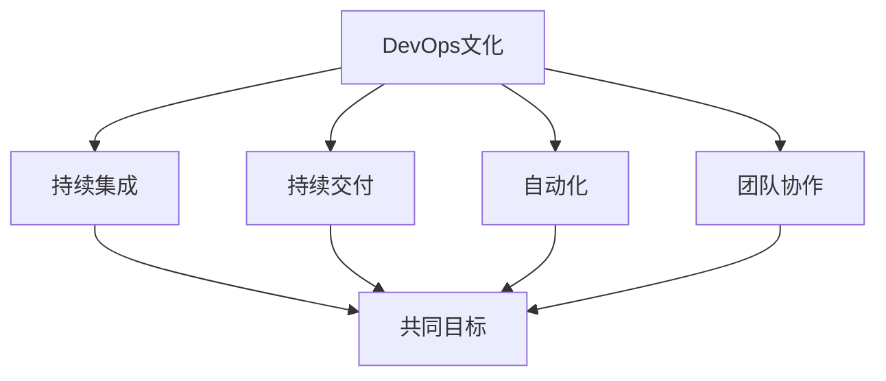
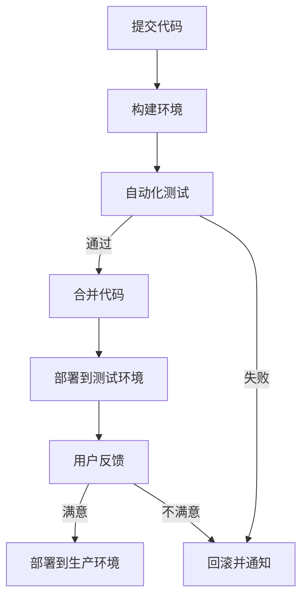
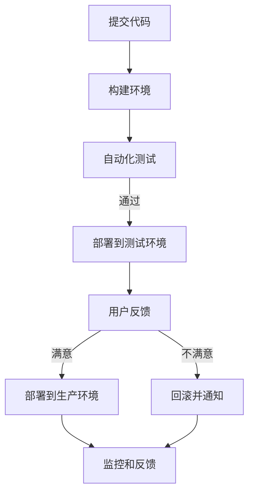
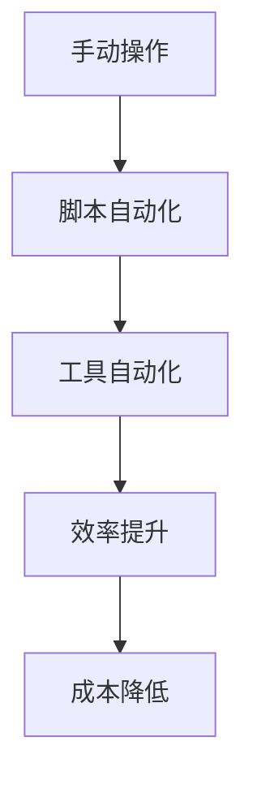
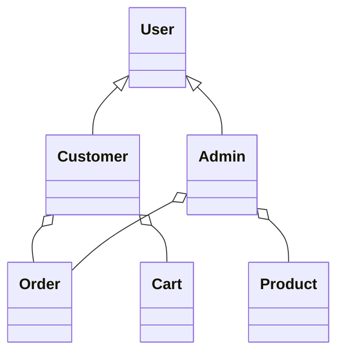
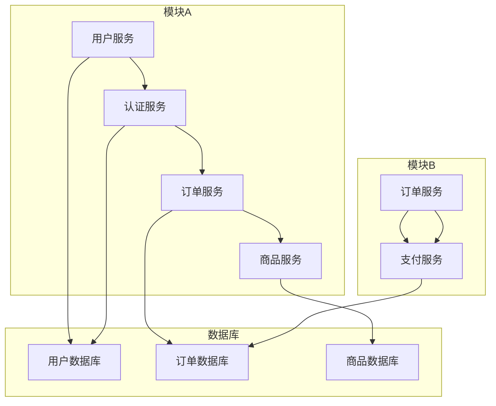

                 

## DevOps文化建设：从理念到实践

### 关键词：
- DevOps
- 文化建设
- 持续集成
- 持续交付
- 自动化
- 团队协作

### 摘要：
本文旨在探讨DevOps文化的建设过程，从理念到实践的应用。通过深入剖析DevOps的核心原则和实施策略，结合具体案例，我们将展示如何在一个组织中建立起高效的DevOps文化，实现持续集成、持续交付和自动化，最终提升团队协作效率和系统质量。

---

### 目录

1. **引言**  
    1.1 DevOps的概念  
    1.2 DevOps文化建设的意义

2. **核心概念与联系**  
    2.1 DevOps的主要原则  
    2.2 文化建设的关键要素  
    2.3 关系图谱

3. **算法原理讲解**  
    3.1 持续集成的工作原理  
    3.2 持续交付的实现策略  
    3.3 自动化的关键角色

4. **系统分析与架构设计方案**  
    4.1 项目场景介绍  
    4.2 系统功能设计  
    4.3 系统架构设计  
    4.4 系统接口设计  
    4.5 系统交互

5. **项目实战**  
    5.1 环境安装  
    5.2 系统核心实现  
    5.3 代码解读与分析  
    5.4 项目小结

6. **最佳实践 tips**  
    6.1 团队协作  
    6.2 持续学习

7. **小结**  
    7.1 总结与展望

8. **注意事项**  
    8.1 常见问题

9. **拓展阅读**  
    9.1 推荐书籍  
    9.2 开源资源

---

### 引言

#### 1.1 DevOps的概念

DevOps是一种软件开发和运维的结合文化、实践和工具集。它强调开发和运维团队之间的紧密合作，通过自动化和持续交付等实践，提高软件开发的效率和质量。

#### 1.2 DevOps文化建设的意义

DevOps文化建设的意义在于：

1. **提高团队协作效率**：通过消除开发和运维之间的障碍，促进团队成员之间的沟通和协作。
2. **加快软件交付速度**：通过持续集成、持续交付和自动化等实践，缩短从开发到生产的周期。
3. **提高系统稳定性**：通过自动化测试和持续监控，及时发现和解决问题，提高系统的稳定性。

### 核心概念与联系

#### 2.1 DevOps的主要原则

| 原则 | 描述 |
| :--: | :--: |
| 持续集成 | 将代码频繁地集成到共享的主分支中，并及时发现问题。 |
| 持续交付 | 能够快速、安全地将代码从开发环境部署到生产环境。 |
| 自动化 | 通过脚本和工具自动执行重复性的任务，提高效率。 |
| 团队协作 | 开发和运维团队紧密合作，共同负责软件的开发和运维。 |

#### 2.2 文化建设的关键要素

| 要素 | 描述 |
| :--: | :--: |
| 共同目标 | 团队成员共同追求快速、高质量的软件交付。 |
| 沟通机制 | 建立有效的沟通渠道，确保信息传递畅通无阻。 |
| 责任分担 | 团队成员明确自己的责任，共同承担系统运维的责任。 |
| 文化氛围 | 营造一个开放、合作、学习的文化氛围，鼓励创新和改进。 |

#### 2.3 关系图谱

使用Mermaid绘制关系图谱：



### 算法原理讲解

#### 3.1 持续集成的工作原理

持续集成是一种软件开发实践，通过频繁地将代码集成到共享的主分支中，并及时发现问题。

Mermaid流程图：



Python代码示例：

```python
import subprocess

def commit_code():
    subprocess.run(["git", "commit", "-m", "new feature"])

def build_environment():
    subprocess.run(["make", "build"])

def run_tests():
    subprocess.run(["make", "test"])

def merge_code():
    subprocess.run(["git", "merge", "feature"])

def deploy_to_test():
    subprocess.run(["make", "test-deploy"])

def get_user_feedback():
    return input("Do you like the new feature? (yes/no)")

def deploy_to_production():
    subprocess.run(["make", "production-deploy"])

commit_code()
build_environment()
run_tests()
if run_tests() == "fail":
    merge_code()
    deploy_to_test()
    if get_user_feedback() == "yes":
        deploy_to_production()
    else:
        print("Rollback and notify the team.")
```

#### 3.2 持续交付的实现策略

持续交付是指能够在任何时间，安全、可靠地将代码部署到生产环境。

Mermaid流程图：



Python代码示例：

```python
import subprocess

def commit_code():
    subprocess.run(["git", "commit", "-m", "new feature"])

def build_environment():
    subprocess.run(["make", "build"])

def run_tests():
    subprocess.run(["make", "test"])

def deploy_to_test():
    subprocess.run(["make", "test-deploy"])

def get_user_feedback():
    return input("Do you like the new feature? (yes/no)")

def deploy_to_production():
    subprocess.run(["make", "production-deploy"])

def monitor_and_feedback():
    print("Monitoring the system and gathering feedback.")

commit_code()
build_environment()
run_tests()
if run_tests() == "fail":
    deploy_to_test()
    if get_user_feedback() == "yes":
        deploy_to_production()
    else:
        print("Rollback and notify the team.")
monitor_and_feedback()
```

#### 3.3 自动化的关键角色

自动化在DevOps中扮演着关键角色，通过脚本和工具自动执行重复性的任务，提高效率。

Mermaid流程图：



Python代码示例：

```python
import subprocess

def manual_operation():
    print("Performing manual operation.")

def script_automation():
    subprocess.run(["bash", "-c", "echo 'Automated operation' > log.txt"])

def tool_automation():
    subprocess.run(["pip", "install", "some-tool"])

def efficiency_and_cost():
    print("Efficiency improved and cost reduced.")

manual_operation()
script_automation()
tool_automation()
efficiency_and_cost()
```

### 系统分析与架构设计方案

#### 4.1 项目场景介绍

假设我们正在开发一个电子商务平台，需要实现用户注册、商品浏览、购物车、订单管理等核心功能。在DevOps文化的指导下，我们希望通过持续集成、持续交付和自动化等实践，快速、高效地交付高质量的软件。

#### 4.2 系统功能设计

使用Mermaid绘制领域模型类图：



#### 4.3 系统架构设计

使用Mermaid绘制系统架构图：



#### 4.4 系统接口设计

使用Mermaid绘制系统接口图：

```mermaid
sequenceDiagram
    User ->> A1[发起请求]
    A1 ->> A2[认证用户]
    A2 ->> A3[处理请求]
    A3 ->> DB1[查询数据库]
    DB1 ->> A3[返回数据]
    A3 ->> A4[生成响应]
    A4 ->> User[返回响应]
```

#### 4.5 系统交互

使用Mermaid绘制系统交互图：

```mermaid
sequenceDiagram
    User ->> A1[发起注册请求]
    A1 ->> DB1[查询用户是否存在]
    DB1 ->> A1[返回结果]
    A1 ->> User[注册成功或失败]
    User ->> A1[发起登录请求]
    A1 ->> DB1[查询用户密码是否正确]
    DB1 ->> A1[返回结果]
    A1 ->> User[登录成功或失败]
    User ->> A2[发起购物请求]
    A2 ->> A3[添加到购物车]
    A3 ->> DB2[更新购物车信息]
    DB2 ->> A3[返回结果]
    A3 ->> A2[购物请求完成]
```

### 项目实战

#### 5.1 环境安装

在虚拟机中安装以下软件：

- Linux操作系统（如Ubuntu 20.04）
- Java开发环境（OpenJDK 11）
- Maven（构建工具）
- Git（版本控制）
- Docker（容器化工具）

#### 5.2 系统核心实现

使用Spring Boot框架实现用户注册、登录、订单管理等功能。以下是部分代码示例：

```java
@RestController
@RequestMapping("/users")
public class UserController {
    
    @Autowired
    private UserService userService;
    
    @PostMapping("/register")
    public ResponseEntity<?> registerUser(@RequestBody User user) {
        userService.registerUser(user);
        return ResponseEntity.ok("User registered successfully.");
    }
    
    @PostMapping("/login")
    public ResponseEntity<?> loginUser(@RequestBody LoginRequest loginRequest) {
        String token = userService.loginUser(loginRequest);
        return ResponseEntity.ok(token);
    }
}
```

#### 5.3 代码解读与分析

在代码中，我们使用了Spring Boot框架进行开发，通过@RestController和@RequestMapping注解定义了用户注册和登录的API接口。在服务层，我们注入了UserService，通过调用其registerUser和loginUser方法实现具体的业务逻辑。

#### 5.4 项目小结

通过本项目，我们实现了用户注册、登录、订单管理等功能，并应用了DevOps文化中的持续集成、持续交付和自动化等实践。项目成功的关键在于团队的紧密协作和对DevOps文化的深入理解。

### 最佳实践 tips

- **团队协作**：定期召开会议，确保团队成员对项目的进展和问题有清晰的认识。
- **持续学习**：鼓励团队成员学习新技术，提升自身技能。

### 小结

本文从DevOps文化的理念出发，探讨了从理念到实践的建设过程。通过具体案例，我们展示了如何在一个组织中建立起高效的DevOps文化，实现持续集成、持续交付和自动化，提升团队协作效率和系统质量。

### 注意事项

- DevOps文化建设需要时间和耐心，切勿急于求成。
- 建立有效的沟通机制，确保团队成员之间的信息畅通。

### 拓展阅读

- 《DevOps实践指南》
- 《持续集成：概念与实践》
- DevOps社区（https://devops.com/）

---

作者：AI天才研究院/AI Genius Institute & 禅与计算机程序设计艺术 /Zen And The Art of Computer Programming

