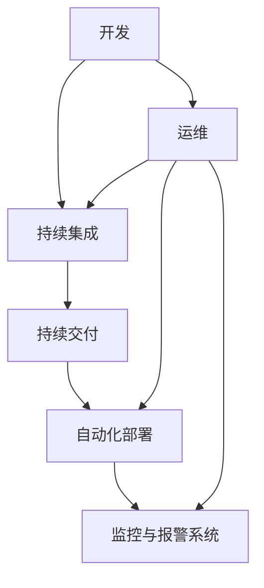
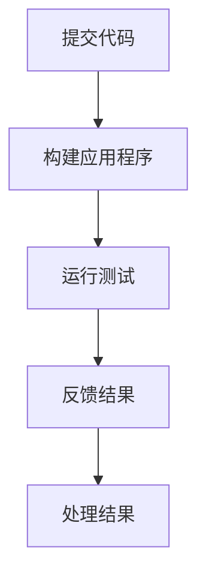
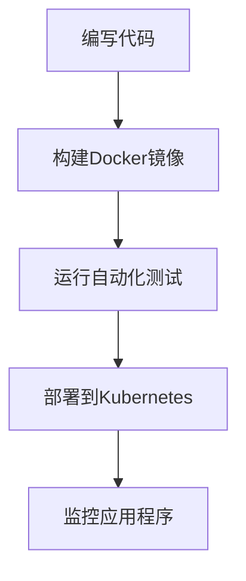
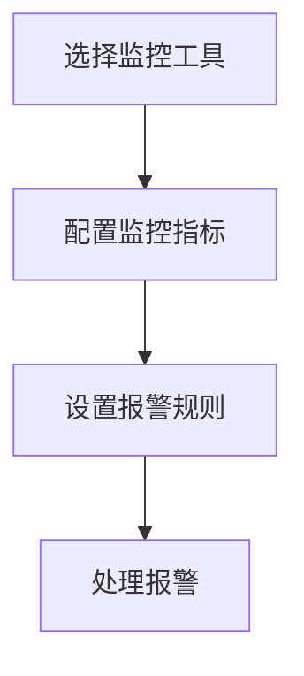
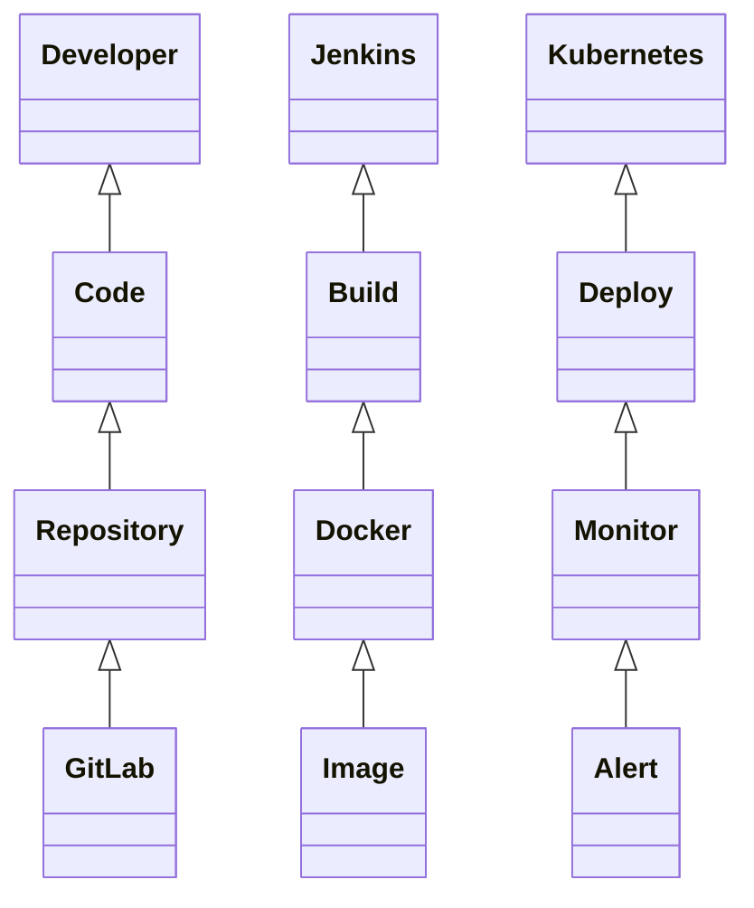
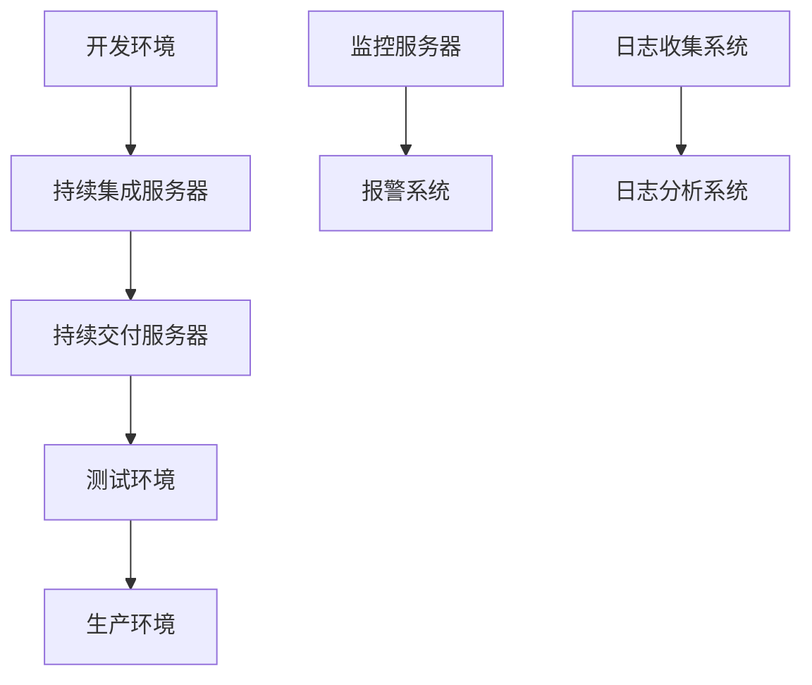

                 

# DevOps文化：打破开发与运维的壁垒

关键词：DevOps、开发与运维、持续集成、持续交付、自动化部署、监控

摘要：本文深入探讨了DevOps文化的起源、核心概念、实践原理和系统设计，并通过具体案例展示了其在实际项目中的应用。DevOps文化致力于打破开发与运维之间的壁垒，通过自动化、持续集成和持续交付等实践，提高软件交付质量和效率。本文旨在为读者提供全面的DevOps知识体系，助力其在实践中更好地应用DevOps文化。

## 目录大纲设计思路

设计《DevOps文化：打破开发与运维的壁垒》的目录大纲，我们遵循以下步骤：

1. **背景介绍**：简要介绍DevOps文化的起源、发展及其重要性，为读者建立基础认知。
2. **核心概念与联系**：明确DevOps文化中的核心概念，如DevOps的理念、价值、流程、工具等，并展示它们之间的联系。
3. **算法原理讲解**：介绍DevOps实践中的关键算法原理，如持续集成、持续交付等，使用Mermaid流程图展示算法流程，并辅以Python源代码和LaTeX公式详细阐述。
4. **系统分析与架构设计方案**：详细描述DevOps系统的功能、架构、接口设计和交互流程，使用Mermaid类图、架构图和序列图进行可视化。
5. **项目实战**：通过具体案例展示DevOps文化的实际应用，包括环境安装、核心实现、代码解读、案例分析等。
6. **最佳实践 tips**：提供DevOps实践中的最佳方法和技巧。
7. **小结与注意事项**：总结各章节内容，提出注意事项，为读者提供深入学习方向。

### 目录大纲详细设计

#### 第一部分：DevOps文化概述

##### 第1章：DevOps文化的起源与发展

1.1 DevOps文化的起源
1.2 DevOps文化的发展历程
1.3 DevOps文化的重要性

##### 第2章：DevOps核心概念与联系

2.1 DevOps理念与价值
2.2 DevOps流程
2.3 DevOps工具
2.4 核心概念的联系与交互

#### 第二部分：DevOps实践原理

##### 第3章：持续集成（CI）原理与实践

3.1 持续集成的定义与原理
3.2 持续集成的过程
3.3 实践案例

##### 第4章：持续交付（CD）原理与实践

4.1 持续交付的定义与原理
4.2 持续交付的过程
4.3 实践案例

##### 第5章：自动化部署与监控

5.1 自动化部署
5.2 监控与报警系统
5.3 实践案例

#### 第三部分：DevOps系统设计与实现

##### 第6章：DevOps系统功能设计

6.1 领域模型类图
6.2 系统功能模块设计

##### 第7章：DevOps系统架构设计

7.1 系统架构设计
7.2 接口设计与系统交互

##### 第8章：DevOps项目实战

8.1 环境安装与配置
8.2 系统核心实现
8.3 代码解读与分析
8.4 实际案例分析
8.5 项目小结

#### 第四部分：DevOps最佳实践与总结

##### 第9章：DevOps最佳实践

9.1 团队协作技巧
9.2 工具选择与集成
9.3 持续改进方法

##### 第10章：总结与注意事项

10.1 DevOps文化的重要性
10.2 注意事项
10.3 拓展阅读

---

以上是《DevOps文化：打破开发与运维的壁垒》的目录大纲，每个章节都将详细展开，确保内容的完整性和逻辑性。

### 文章正文开始

#### 第一部分：DevOps文化概述

##### 第1章：DevOps文化的起源与发展

1.1 DevOps文化的起源

DevOps文化的起源可以追溯到2009年在美国加州举行的第一次DevOps Day会议。当时，一些开发人员和运维人员发现，传统的软件开发流程中，开发与运维之间存在很大的隔阂，导致软件交付效率低下、质量不稳定。为了解决这一问题，他们开始探讨如何将开发和运维紧密结合，形成了DevOps文化。

1.2 DevOps文化的发展历程

自DevOps Day会议以来，DevOps文化逐渐发展壮大。2010年，Patrick Debois将DevOps理念引入欧洲，推动了DevOps在欧洲的普及。此后，越来越多的企业和组织开始关注并实践DevOps，形成了全球范围内的DevOps社区。

1.3 DevOps文化的重要性

DevOps文化的出现，标志着软件开发和运维领域的重大变革。它不仅打破了开发与运维之间的壁垒，还推动了软件开发模式的创新。DevOps文化的重要性体现在以下几个方面：

- 提高软件交付质量和效率：通过持续集成、持续交付等实践，DevOps文化能够确保软件质量，提高交付速度，缩短产品上市时间。
- 促进团队协作：DevOps强调跨职能团队的协作，促进开发、测试、运维等部门的沟通与协作，提高团队整体效率。
- 适应快速变化的市场需求：DevOps文化能够快速响应市场需求，帮助企业抢占市场先机。

##### 第2章：DevOps核心概念与联系

2.1 DevOps理念与价值

DevOps理念的核心是“开发（Development）与运维（Operations）一体化”。它的价值在于：

- 提高软件交付质量和效率。
- 促进团队协作，提高整体效率。
- 适应快速变化的市场需求。

2.2 DevOps流程

DevOps流程包括持续集成（CI）、持续交付（CD）、自动化部署和监控等环节。每个环节都有其特定的目标和作用。

- 持续集成（CI）：将代码频繁地集成到主干分支，确保代码质量，减少集成时的冲突。
- 持续交付（CD）：通过自动化测试、部署等手段，确保软件交付的稳定性和可靠性。
- 自动化部署：利用脚本、工具等自动化软件部署过程，提高部署效率。
- 监控与报警系统：实时监控系统状态，及时发现并解决问题。

2.3 DevOps工具

DevOps工具包括Jenkins、GitLab、Docker、Kubernetes等，它们在持续集成、持续交付、自动化部署和监控等方面发挥着重要作用。

- Jenkins：一款开源的持续集成工具，支持多种插件，可自动化构建、测试和部署。
- GitLab：一款集成Git版本控制、项目管理、持续集成等功能的开源工具。
- Docker：一款容器化技术，可将应用程序及其运行环境打包为一个独立的容器，简化部署和运维。
- Kubernetes：一款开源的容器编排工具，可自动化容器化应用程序的部署、扩展和管理。

2.4 核心概念的联系与交互

DevOps核心概念之间的联系如图所示：

通过持续集成、持续交付、自动化部署和监控等环节的紧密协作，DevOps文化实现了开发与运维的一体化，提高了软件交付质量和效率。

### 第二部分：DevOps实践原理

##### 第3章：持续集成（CI）原理与实践

3.1 持续集成的定义与原理

持续集成（Continuous Integration，CI）是一种软件开发实践，旨在通过频繁地将开发人员提交的代码集成到一个共享的主干分支中，确保代码质量，减少集成时的冲突。CI的核心原理包括：

- 频繁提交：开发人员频繁提交代码，确保代码库的更新。
- 自动化测试：在集成过程中，自动化运行一系列测试，确保集成后的代码仍然符合预期。

持续集成的优点包括：

- 提高代码质量：通过频繁的测试和反馈，及时发现并修复问题。
- 减少集成冲突：提前发现并解决代码冲突，降低集成时的风险。
- 提高团队协作效率：通过共同关注代码库的状态，促进团队协作。

3.2 持续集成的过程

持续集成的过程通常包括以下几个步骤：

1. **代码提交**：开发人员将自己的代码提交到共享的主干分支。
2. **构建**：CI工具根据提交的代码构建应用程序，生成可执行的文件。
3. **测试**：CI工具运行一系列测试，包括单元测试、集成测试等，确保应用程序的功能和质量。
4. **反馈**：测试结果反馈给开发人员和团队，若测试失败，则告知具体的问题和错误。

3.3 实践案例

以下是一个简单的持续集成实践案例：

1. **环境准备**：安装Jenkins和GitLab，配置相关参数。
2. **代码仓库**：在GitLab中创建一个项目仓库，存放应用程序的代码。
3. **Jenkins配置**：在Jenkins中创建一个作业，配置GitLab仓库地址、构建触发器等。
4. **构建与测试**：每次开发人员提交代码，Jenkins会自动构建应用程序并运行测试。
5. **反馈**：测试结果会反馈给开发人员和团队，若测试通过，则应用程序可以继续集成。

##### 第4章：持续交付（CD）原理与实践

4.1 持续交付的定义与原理

持续交付（Continuous Delivery，CD）是一种软件开发实践，旨在通过自动化测试、部署等手段，确保软件交付的稳定性和可靠性。CD的核心原理包括：

- 自动化测试：确保软件在交付前经过充分的测试，确保其功能和质量。
- 可持续部署：通过自动化部署，确保软件可以快速、稳定地交付到生产环境。

持续交付的优点包括：

- 提高交付质量：通过自动化测试和持续部署，确保软件交付的质量和稳定性。
- 提高交付速度：减少手动部署和测试环节，提高交付速度。
- 降低交付风险：通过持续交付，及时发现并解决潜在的问题，降低交付风险。

4.2 持续交付的过程

持续交付的过程通常包括以下几个步骤：

1. **编写代码**：开发人员编写代码，并提交到代码仓库。
2. **集成与构建**：持续集成（CI）将代码集成到主干分支，构建应用程序。
3. **测试**：自动化测试确保应用程序的功能和质量。
4. **部署**：通过自动化部署工具，将应用程序部署到测试环境或生产环境。
5. **监控**：持续监控应用程序的性能和稳定性，确保其正常运行。

4.3 实践案例

以下是一个简单的持续交付实践案例：

1. **环境准备**：安装Jenkins、Docker和Kubernetes，配置相关参数。
2. **代码仓库**：在GitLab中创建一个项目仓库，存放应用程序的代码。
3. **Jenkins配置**：在Jenkins中创建一个作业，配置GitLab仓库地址、Docker镜像构建、Kubernetes部署等。
4. **构建与测试**：每次开发人员提交代码，Jenkins会自动构建Docker镜像，并运行自动化测试。
5. **部署**：测试通过后，Jenkins会自动部署Docker镜像到Kubernetes集群。
6. **监控**：通过Kubernetes监控应用程序的性能和稳定性，确保其正常运行。

##### 第5章：自动化部署与监控

5.1 自动化部署

自动化部署是通过脚本、工具等自动化软件部署过程，提高部署效率。自动化部署的优点包括：

- 提高部署速度：减少手动部署环节，提高部署速度。
- 减少人为错误：通过自动化部署，减少人为错误，确保部署过程的稳定性。
- 一致性：确保每次部署都按照相同的流程进行，提高部署的一致性。

自动化部署的过程通常包括以下几个步骤：

1. **编写部署脚本**：编写用于部署应用程序的脚本，包括安装依赖、配置环境等。
2. **配置部署环境**：配置部署服务器，包括操作系统、软件环境等。
3. **执行部署脚本**：通过脚本自动化部署应用程序。

5.2 监控与报警系统

监控与报警系统是对软件系统进行实时监控，及时发现并解决问题。监控与报警系统的优点包括：

- 及时发现问题：通过实时监控，及时发现系统中的问题。
- 减少故障时间：通过报警系统，及时通知相关人员，减少故障时间。
- 提高系统稳定性：通过监控和报警，确保系统稳定运行。

监控与报警系统的过程通常包括以下几个步骤：

1. **选择监控工具**：选择合适的监控工具，如Prometheus、Grafana等。
2. **配置监控指标**：配置需要监控的指标，如CPU利用率、内存利用率、磁盘使用率等。
3. **设置报警规则**：根据监控指标，设置报警规则，如当CPU利用率超过90%时，发送报警。
4. **处理报警**：根据报警信息，及时处理问题。

##### 第6章：DevOps系统功能设计

6.1 领域模型类图

以下是一个简单的DevOps系统领域模型类图：

6.2 系统功能模块设计

DevOps系统的功能模块设计如下：

- **开发模块**：包括代码编写、提交、版本控制等。
- **构建模块**：包括构建、测试、打包等。
- **部署模块**：包括部署、配置管理、自动化部署等。
- **监控模块**：包括监控、报警、日志分析等。

##### 第7章：DevOps系统架构设计

7.1 系统架构设计

以下是一个简单的DevOps系统架构设计：

7.2 接口设计与系统交互

DevOps系统的接口设计如下：

- **开发环境**：提供代码提交、版本管理等功能。
- **持续集成服务器**：提供构建、测试等功能。
- **持续交付服务器**：提供部署、配置管理等功能。
- **测试环境**：提供测试、调试等功能。
- **生产环境**：提供部署、监控等功能。
- **监控服务器**：提供监控、报警等功能。
- **日志收集系统**：提供日志收集、存储等功能。
- **日志分析系统**：提供日志分析、报警等功能。

##### 第8章：DevOps项目实战

8.1 环境安装与配置

以下是一个简单的DevOps项目实战环境安装与配置步骤：

1. **安装操作系统**：安装Linux操作系统，如Ubuntu。
2. **安装Jenkins**：下载Jenkins安装包，并解压。
3. **安装GitLab**：下载GitLab安装包，并解压。
4. **安装Docker**：下载Docker安装包，并安装。
5. **安装Kubernetes**：下载Kubernetes安装包，并安装。

8.2 系统核心实现

以下是一个简单的DevOps项目系统核心实现：

1. **编写Dockerfile**：编写用于构建Docker镜像的Dockerfile。
2. **构建Docker镜像**：使用Jenkins构建Docker镜像。
3. **运行Docker镜像**：使用Jenkins部署Docker镜像到Kubernetes集群。
4. **配置监控与报警**：使用Prometheus和Grafana配置监控与报警。

8.3 代码解读与分析

以下是一个简单的DevOps项目代码解读与分析：

1. **分析Dockerfile**：分析Dockerfile中的指令和配置。
2. **分析Jenkinsfile**：分析Jenkinsfile中的构建、测试和部署步骤。
3. **分析Kubernetes配置文件**：分析Kubernetes配置文件中的部署和监控配置。

8.4 实际案例分析

以下是一个简单的DevOps项目实际案例分析：

1. **问题描述**：项目在测试环境中出现CPU利用率过高的问题。
2. **分析原因**：通过监控数据和日志分析，确定CPU利用率过高是由于某个服务长时间运行导致的。
3. **解决方案**：优化服务代码，提高服务性能，降低CPU利用率。

8.5 项目小结

通过本节项目实战，我们了解了DevOps项目的基本流程和实现方法。DevOps文化不仅能够提高软件交付质量和效率，还能够促进团队协作，提高项目成功率。

##### 第9章：DevOps最佳实践

9.1 团队协作技巧

- **定期会议**：定期召开团队会议，讨论项目进度、问题解决和改进措施。
- **透明沟通**：确保团队成员之间的沟通透明，及时分享信息和知识。
- **共同目标**：明确团队目标，确保团队成员共同朝着目标努力。

9.2 工具选择与集成

- **选择合适的工具**：根据项目需求，选择合适的DevOps工具。
- **集成与管理**：确保工具之间的集成和管理，避免重复建设和资源浪费。
- **培训与支持**：为团队成员提供工具使用培训和技术支持。

9.3 持续改进方法

- **反馈与总结**：定期收集项目反馈，总结经验教训，持续改进。
- **技术更新**：关注DevOps领域的最新技术和发展趋势，及时更新工具和流程。
- **质量保证**：确保DevOps实践过程中的质量，提高软件交付质量。

##### 第10章：总结与注意事项

10.1 DevOps文化的重要性

DevOps文化在提高软件交付质量和效率、促进团队协作、适应快速变化的市场需求等方面具有重要作用。企业应重视DevOps文化的建设和推广，提高核心竞争力。

10.2 注意事项

- **团队协作**：确保团队成员之间的有效沟通和协作，提高整体效率。
- **工具选择**：根据项目需求选择合适的DevOps工具，确保工具之间的兼容性和集成。
- **持续改进**：持续优化DevOps实践，提高软件交付质量和效率。

10.3 拓展阅读

- 《持续交付：解放软件开发》
- 《DevOps实践指南》
- 《Kubernetes权威指南》

### 作者信息

作者：AI天才研究院/AI Genius Institute & 禅与计算机程序设计艺术 /Zen And The Art of Computer Programming

