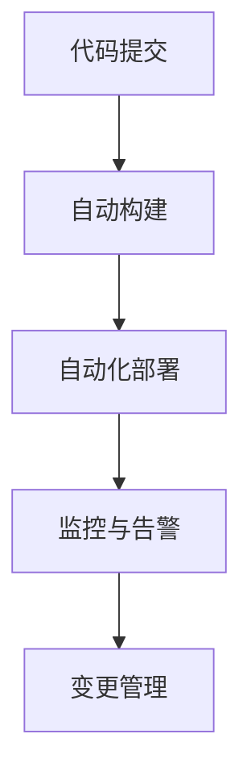

                 

### GitOps概述

#### 第1章：GitOps背景与核心概念

**1.1 GitOps的概念与起源**

GitOps是一种基于Git的软件部署和管理方法，它将代码版本控制系统（如Git）与基础设施管理和应用部署相结合，形成了一种现代化的运营模式。GitOps的概念起源于2017年Weaveworks公司的创始人Kelsey Hightower在一篇技术博客中提出的，它旨在解决传统的持续集成/持续部署（CI/CD）过程中存在的各种挑战。

**GitOps的定义：** GitOps是将基础设施即代码（Infrastructure as Code, IaC）与Git相结合，使得所有的基础设施配置、部署和变更都通过Git进行版本控制。它强调自动化、可视化和不可变性，使得团队能够快速、安全地交付软件。

**GitOps的发展历程：** GitOps的兴起可以追溯到DevOps运动的早期阶段，当时人们开始意识到手动部署和配置管理不仅低效，而且容易出错。随着容器化技术和自动化工具（如Kubernetes）的成熟，GitOps逐渐成为一种流行的最佳实践。

**GitOps的核心原则：** GitOps的核心原则包括：

1. **一切皆代码（Everything as Code）**：所有配置、部署脚本和变更都存储在版本控制系统中。
2. **自动化（Automation）**：自动化工具用于执行部署、监控和回滚等操作。
3. **不可变性（Immutability）**：基础设施和应用程序的状态应保持不变，任何变更都通过代码提交和回滚操作进行。
4. **透明性（Transparency）**：所有操作都应通过日志和监控工具记录，以便进行审计和问题排查。

**1.2 GitOps与传统CI/CD的差异**

**传统CI/CD流程的不足：** 传统CI/CD流程通常涉及手动操作和多个工具的集成，这增加了出错的风险，降低了效率。此外，传统的CI/CD流程通常缺乏对基础设施配置的版本控制，导致环境之间的差异和不一致性。

**GitOps带来的改进：** GitOps通过将所有配置和变更存储在Git中，实现了配置的版本控制和一致性。GitOps强调自动化，使得部署和回滚等操作更加高效和安全。此外，GitOps还提供了更好的可视化和监控能力，有助于快速识别和解决问题。

**GitOps与传统CI/CD的对比：**

| 对比维度 | GitOps | 传统CI/CD |
| --- | --- | --- |
| 基础设施管理 | 一切皆代码，版本控制 | 手动管理，缺乏版本控制 |
| 自动化 | 高度自动化 | 部分自动化，手动操作多 |
| 可视化 | 高级监控和可视化 | 监控能力有限 |
| 环境一致性 | 高一致性 | 环境差异大 |
| 安全性 | 强安全性 | 安全性较低 |

**1.3 GitOps的应用场景与优势**

**应用场景：** GitOps适用于需要高频次、快速迭代的现代软件开发环境，特别是采用容器化和Kubernetes的微服务架构。它也适用于需要跨多个环境（如开发、测试和生产）进行统一管理的场景。

**优势分析：**

1. **提高部署效率：** 通过自动化流程，GitOps显著减少了部署时间，提高了效率。
2. **增强安全性：** 所有变更都通过Git进行版本控制，降低了人为错误和恶意操作的风险。
3. **提高环境一致性：** 通过GitOps，可以确保不同环境之间的一致性，减少了环境差异导致的问题。
4. **更好的回滚能力：** GitOps提供了强大的回滚机制，可以快速恢复到之前的状态，降低了故障的影响。
5. **可追溯性：** 所有操作都记录在Git日志中，便于审计和问题排查。

**1.4 GitOps的挑战与局限性**

**实施挑战：** GitOps需要一定的基础设施和工具支持，实施初期可能需要较大的投入。此外，团队成员需要具备一定的编程和自动化技能。

**局限性分析：**

1. **复杂性：** 对于初学者来说，GitOps的概念和实施流程可能较为复杂。
2. **性能影响：** 过度依赖Git可能会导致性能瓶颈。
3. **安全性问题：** 尽管GitOps提供了强大的安全性，但仍然需要谨慎处理访问控制和权限管理。

**1.5 本章小结**

本章介绍了GitOps的背景、核心概念和与传统CI/CD的差异，并分析了GitOps的应用场景和优势。同时，我们也探讨了GitOps在实施过程中可能面临的挑战和局限性。下一章将深入探讨GitOps的工作流程和最佳实践。

### GitOps工作流程

#### 第2章：GitOps工作流程

**2.1 GitOps工作流程概述**

GitOps工作流程的核心是将基础设施配置、应用部署和变更管理都纳入版本控制系统中，通过自动化工具实现快速、安全、可重复的部署和运维。GitOps工作流程通常包括以下关键环节：

1. **代码提交**：开发者将新的代码提交到Git仓库中。
2. **自动构建**：自动化工具（如Jenkins、GitLab CI）从Git仓库中获取代码，并进行构建和测试。
3. **自动化部署**：通过配置管理工具（如Helm、Terraform）将构建结果部署到目标环境中。
4. **监控和告警**：部署后，监控系统会持续监控应用的性能和健康状态，并在发生问题时发出告警。
5. **变更管理**：任何变更都必须通过Git进行提交和审查，以确保变更的可追溯性和一致性。

**GitOps的基本工作流程**

**工作流程的关键环节**

- **代码提交**：开发者在本地环境中完成代码编写和测试后，将代码提交到Git仓库。提交过程需要遵循代码审查和合并流程，以确保代码质量。
- **自动构建**：构建过程包括编译、打包和测试等步骤。自动化工具会根据Git仓库中的代码自动执行构建过程，并将构建结果存储在容器镜像仓库中。
- **自动化部署**：部署过程是通过配置管理工具将容器镜像部署到Kubernetes集群中。配置管理工具会根据Git仓库中的配置文件生成Kubernetes配置，并使用Kubernetes API进行部署。
- **监控与告警**：部署后，应用性能和健康状况会被持续监控。监控系统会收集各种指标和日志，并在发现问题时通过告警系统通知相关团队成员。
- **变更管理**：任何对基础设施和应用配置的变更都必须通过Git进行提交。提交前，需要经过代码审查和测试，以确保变更的正确性和安全性。

**2.2 版本控制与代码管理**

**版本控制工具介绍**：

Git是目前最流行的版本控制系统，它具有高效、灵活和分布式等优点。Git可以管理代码、配置文件和文档等所有类型的文件，支持多种协作方式，如合并、分支和拉取请求。

**代码管理最佳实践**：

1. **代码仓库组织**：合理组织代码仓库，将不同项目的代码分开存储，方便管理和协作。
2. **代码审查**：实施代码审查流程，确保代码质量和一致性。
3. **分支策略**：采用合适的分支策略，如Git Flow或GitHub Flow，以便更好地管理代码变更。
4. **版本控制注释**：提交代码时，添加详细的注释，说明变更的目的和影响。

**2.3 自动化部署与回滚**

**自动化部署策略**：

自动化部署是通过配置管理工具和CI/CD流水线实现的。部署策略包括以下步骤：

1. **容器化**：将应用程序打包成容器镜像，以便在不同的环境中运行。
2. **镜像仓库**：将容器镜像存储在镜像仓库中，如Docker Hub或Quay。
3. **部署脚本**：编写部署脚本，定义部署的Kubernetes资源，如Deployments、Services和Ingress。

**部署回滚机制**：

回滚机制是在部署失败或应用出现问题时使用的。回滚策略包括以下步骤：

1. **备份当前状态**：在部署前，备份当前应用的配置和状态。
2. **回滚部署**：通过Kubernetes API执行回滚操作，将应用状态恢复到之前的状态。
3. **日志分析**：分析回滚过程的日志，找出问题的原因，并进行修复。

**2.4 监控与告警**

**监控系统设计**：

监控系统是GitOps工作流程的重要组成部分，它用于实时监控应用的性能和健康状态。监控系统的设计包括以下步骤：

1. **指标收集**：收集应用性能指标，如CPU利用率、内存使用率和网络流量等。
2. **日志收集**：收集应用日志，以便进行问题排查和性能分析。
3. **告警策略**：设置告警规则，当指标超过阈值或日志中出现特定关键字时，发出告警通知。

**告警策略与实践**：

1. **多渠道告警**：使用多种告警渠道，如邮件、短信和Slack，以便及时通知相关人员。
2. **告警分级**：根据告警的严重程度，设置不同的告警级别和处理流程。
3. **告警抑制**：为了避免频繁的重复告警，设置告警抑制策略，如延迟告警或合并告警。

**2.5 安全性保障**

**安全措施**：

安全性是GitOps工作流程中的重要考虑因素。以下是一些常用的安全措施：

1. **访问控制**：使用权限控制策略，限制对Git仓库和Kubernetes集群的访问。
2. **加密传输**：使用SSL/TLS加密协议，保护数据传输的安全性。
3. **代码审计**：定期进行代码审计，查找潜在的漏洞和风险。

**安全最佳实践**：

1. **最小权限原则**：为每个用户分配最少的权限，避免权限滥用。
2. **安全培训**：对团队成员进行安全培训，提高安全意识和技能。
3. **安全审计**：定期进行安全审计，检查系统的安全性和合规性。

**2.6 本章小结**

本章详细介绍了GitOps的工作流程，包括代码提交、自动构建、自动化部署、监控与告警、安全性保障等关键环节。通过GitOps工作流程，团队能够实现快速、安全、可重复的软件交付和运维。下一章将深入探讨GitOps中常用的工具和实践。

### GitOps工具介绍

#### 第3章：GitOps工具介绍

**3.1 Kubernetes与Helm**

**Kubernetes基础**

Kubernetes是一个开源的容器编排平台，用于自动化部署、扩展和管理容器化应用程序。Kubernetes提供了一系列功能，如自动装箱、负载均衡、服务发现和自我修复。

**Helm的使用**

Helm是Kubernetes的包管理工具，用于简化应用程序的部署和管理。通过Helm，开发者可以创建、打包、存储和部署Kubernetes应用程序。

**3.2 Terraform与Terraform Cloud**

**Terraform的概念**

Terraform是一个开源的基础设施即代码（IaC）工具，用于创建、组合和更改基础设施资源。它支持多种云服务提供商，如AWS、Azure和Google Cloud。

**Terraform Cloud的应用**

Terraform Cloud是Terraform的商业版，提供云基础架构自动化和协作功能。它允许团队在云中协作管理和部署基础设施。

**3.3 Flux与ArgoCD**

**Flux的GitOps实现**

Flux是一个GitOps工具，用于自动同步Kubernetes集群中的配置。它通过监控Git仓库中的更改，自动部署和更新应用程序。

**ArgoCD的集成与配置**

ArgoCD是另一个GitOps工具，用于自动化部署和管理Kubernetes应用程序。它支持多种源代码管理系统，如Git和Helm仓库。

**3.4 Weave Scope与Grafana**

**Weave Scope的监控与可视化**

Weave Scope是一个监控和可视化工具，用于监控Kubernetes集群中的应用程序和资源。它提供实时拓扑图和仪表板，帮助团队快速识别和解决问题。

**Grafana的数据监控与仪表板**

Grafana是一个开源的数据监控和分析工具，用于收集、存储和可视化Kubernetes集群中的指标数据。它支持多种数据源，如Prometheus和InfluxDB。

**3.5 其他常用GitOps工具**

**Jenkins与GitLab CI**

Jenkins和GitLab CI都是常用的CI/CD工具，用于自动化构建、测试和部署应用程序。它们可以与GitOps集成，实现自动化部署和管理。

**GitOps社区工具介绍**

除了上述工具外，还有许多其他社区工具，如Kubernetes Operator SDK、Tekton和Kustomize等，用于实现GitOps的最佳实践。

**3.6 本章小结**

本章介绍了GitOps中常用的工具，包括Kubernetes、Helm、Terraform、Flux、ArgoCD、Weave Scope、Grafana等。通过这些工具，团队能够实现自动化、可视化和不可变的基础设施和应用程序管理。下一章将探讨GitOps的最佳实践。

### GitOps最佳实践

#### 第4章：GitOps最佳实践

**4.1 GitOps策略制定**

**策略制定原则**

制定GitOps策略时，应遵循以下原则：

1. **简化流程**：确保流程简单明了，减少不必要的复杂性。
2. **自动化优先**：优先考虑自动化，减少手动操作，提高效率。
3. **安全性保障**：确保所有操作都遵循安全性最佳实践，防止安全漏洞。
4. **透明性**：所有操作都应记录在案，便于审计和问题排查。
5. **可恢复性**：设计回滚策略，确保在任何故障情况下都能快速恢复。

**实施步骤**

1. **评估现有流程**：分析当前的基础设施和部署流程，确定改进点。
2. **制定策略文档**：编写详细的GitOps策略文档，明确目标和原则。
3. **培训和沟通**：对团队成员进行培训，确保他们理解GitOps策略和流程。
4. **逐步实施**：分阶段实施GitOps，确保每个阶段都能正常运行。
5. **持续优化**：定期评估和优化GitOps流程，确保其持续适应业务需求。

**4.2 环境配置与网络规划**

**环境配置最佳实践**

1. **多环境隔离**：为每个环境（如开发、测试和生产）配置独立的Kubernetes集群，确保环境之间的隔离。
2. **配置管理**：使用配置管理工具（如Terraform或Helm）管理基础设施配置，确保配置的一致性。
3. **基础设施即代码**：将所有基础设施配置存储在版本控制系统中，确保配置的可追溯性和可重复性。

**网络规划要点**

1. **服务发现**：使用服务发现机制，如DNS或Kubernetes Service，确保服务之间的可访问性。
2. **负载均衡**：使用负载均衡器（如Nginx或Kubernetes Ingress）均衡流量，提高系统的可用性和性能。
3. **网络隔离**：为不同组件和团队设置网络隔离策略，确保网络安全和性能。

**4.3 部署与运维优化**

**部署流程优化**

1. **自动化部署**：使用CI/CD工具（如Jenkins或GitLab CI）实现自动化部署，减少手动操作。
2. **部署策略**：根据应用特性和需求，选择合适的部署策略（如滚动更新或蓝绿部署）。
3. **环境一致性**：确保不同环境之间的部署配置一致，减少环境差异导致的问题。

**运维策略与实践**

1. **监控与告警**：使用监控系统（如Prometheus和Grafana）监控应用的性能和健康状态，设置告警规则，及时发现问题。
2. **日志管理**：使用日志收集工具（如ELK Stack或Fluentd）收集应用日志，便于问题排查和性能分析。
3. **故障恢复**：设计故障恢复策略，确保在系统故障时能快速恢复。

**4.4 持续集成与持续部署**

**CI/CD流程集成**

1. **代码仓库集成**：将Git仓库与CI/CD工具集成，实现代码的自动构建、测试和部署。
2. **构建脚本**：编写构建脚本，定义构建过程中的各个步骤，如编译、打包和测试等。
3. **部署脚本**：编写部署脚本，定义部署过程中的各个步骤，如配置应用、更新服务和使用Kubernetes API等。

**持续部署策略**

1. **自动化部署**：使用自动化工具（如Helm或Kubernetes Deployment）实现应用的自动化部署。
2. **版本控制**：将部署脚本和配置文件存储在版本控制系统中，确保部署的可重复性和可追溯性。
3. **部署验证**：在部署后进行验证，确保应用正常运行，并通过自动化测试验证功能。

**4.5 安全与合规性**

**安全策略与实践**

1. **访问控制**：使用角色和权限控制，限制对Git仓库和Kubernetes集群的访问。
2. **加密传输**：使用SSL/TLS加密协议，保护数据传输的安全性。
3. **代码审计**：定期进行代码审计，查找潜在的漏洞和风险。

**合规性要求与实施**

1. **法规遵从**：确保GitOps流程符合相关法规和标准，如GDPR和ISO 27001。
2. **安全审计**：定期进行安全审计，检查系统的安全性和合规性。
3. **合规性培训**：对团队成员进行合规性培训，提高合规意识和技能。

**4.6 本章小结**

本章介绍了GitOps的最佳实践，包括策略制定、环境配置与网络规划、部署与运维优化、持续集成与持续部署、安全与合规性等方面的内容。通过遵循这些最佳实践，团队能够实现高效、安全、可重复的GitOps工作流程。

### GitOps案例分析

#### 第5章：GitOps案例分析

**5.1 案例一：企业级GitOps实践**

**案例背景**

某大型互联网企业面临着快速迭代的业务需求和复杂的应用架构。为了提高软件交付效率和质量，该公司决定采用GitOps模式进行基础设施和应用的自动化管理。

**实施过程**

1. **基础设施即代码**：使用Terraform配置和管理所有基础设施资源，确保配置的一致性和可重复性。
2. **Git仓库集成**：将所有代码和配置文件存储在Git仓库中，使用Helm管理Kubernetes集群中的应用。
3. **自动化部署**：使用Jenkins实现持续集成和持续部署（CI/CD），自动化构建和部署应用程序。
4. **监控与告警**：使用Prometheus和Grafana监控系统，收集应用性能指标和日志，设置告警规则，及时发现问题。
5. **安全措施**：实施严格的访问控制和加密传输，确保系统和数据的安全性。

**实施效果**

1. **部署效率提高**：自动化部署显著减少了部署时间，从原来的几天缩短到几分钟。
2. **环境一致性**：通过基础设施即代码，确保不同环境（如开发、测试和生产）之间的一致性。
3. **故障恢复**：通过监控和告警系统，能够在发生故障时快速恢复，减少了系统宕机时间。
4. **安全性增强**：实施严格的安全措施，降低了安全漏洞和数据泄露的风险。

**5.2 案例二：开源项目中的GitOps应用**

**项目背景**

某开源项目团队面临快速迭代和复杂的应用架构。为了提高项目的可持续性和稳定性，该团队决定采用GitOps模式进行管理和部署。

**GitOps实践**

1. **自动化构建**：使用GitLab CI进行自动化构建，确保代码的编译、打包和测试。
2. **自动化部署**：使用ArgoCD进行自动化部署，将构建结果部署到Kubernetes集群中。
3. **持续集成**：将代码仓库与GitLab CI集成，实现持续集成和自动化测试。
4. **监控与告警**：使用Grafana监控系统，收集应用性能指标和日志，设置告警规则，及时发现问题。
5. **版本控制**：所有配置和变更都存储在Git仓库中，确保变更的可追溯性和一致性。

**项目成果**

1. **代码质量提高**：自动化测试和持续集成提高了代码质量，减少了bug和缺陷。
2. **部署效率提高**：自动化部署和持续集成显著减少了部署时间，提高了项目的交付速度。
3. **环境一致性**：通过Git仓库管理配置和变更，确保不同环境之间的一致性。
4. **安全性增强**：通过监控和告警系统，及时发现和解决问题，提高了系统的安全性。

**5.3 案例三：中小企业的GitOps转型**

**转型原因**

某中小企业面临着快速发展的业务需求，但传统运维模式效率低下，难以满足需求。为了提高软件交付效率和质量，该公司决定采用GitOps模式进行转型。

**实施步骤**

1. **评估现有流程**：分析当前的基础设施和部署流程，确定改进点。
2. **培训与沟通**：对团队成员进行GitOps培训和沟通，确保理解新的工作模式。
3. **基础设施即代码**：使用Terraform配置和管理基础设施资源。
4. **Git仓库集成**：将所有代码和配置文件存储在Git仓库中。
5. **自动化部署**：使用Jenkins实现自动化部署。
6. **监控与告警**：使用Prometheus和Grafana监控系统。
7. **安全措施**：实施严格的访问控制和加密传输。

**转型效果**

1. **部署效率提高**：自动化部署和持续集成显著减少了部署时间，提高了项目的交付速度。
2. **环境一致性**：通过Git仓库管理配置和变更，确保不同环境之间的一致性。
3. **运维成本降低**：自动化和标准化降低了运维成本，提高了运营效率。
4. **安全性增强**：实施严格的安全措施，降低了安全漏洞和数据泄露的风险。

**5.4 本章小结**

本章通过三个案例，展示了GitOps在企业级项目、开源项目和中小企业转型中的应用和实践。通过GitOps，团队能够实现自动化、高效、安全和一致的软件交付和运维。这些案例为其他团队提供了宝贵的经验和借鉴。

### GitOps的未来发展趋势

#### 第6章：GitOps的未来发展趋势

**6.1 GitOps技术发展趋势**

GitOps作为一种现代化的运营模式，其技术发展趋势主要体现在以下几个方面：

1. **新工具与技术的引入**：随着技术的不断发展，越来越多的工具和技术被引入到GitOps中，如云原生GitOps、Serverless GitOps和AI驱动的GitOps。这些新工具和技术为GitOps提供了更强大的功能，如自动故障恢复、智能监控和预测性维护。

2. **自动化水平的提升**：GitOps强调自动化，未来自动化水平将进一步提升。例如，自动化部署、监控和回滚等操作将更加智能化和高效，减少人工干预，提高系统的稳定性和可靠性。

3. **更广泛的平台支持**：GitOps不仅适用于Kubernetes，还将扩展到其他容器编排平台，如Docker Swarm和OpenShift。同时，GitOps也将与更多的云服务提供商集成，提供更全面的云基础设施管理。

**6.2 GitOps与云计算的深度融合**

云计算的发展为GitOps提供了更强大的基础设施支持，GitOps与云计算的深度融合将成为未来趋势：

1. **云原生GitOps**：云原生GitOps将GitOps理念应用到云原生环境中，实现更高效、更可靠的云基础设施管理。例如，利用Kubernetes原生的自动化和扩展功能，实现自动化部署、监控和回滚。

2. **云服务集成策略**：GitOps将更加紧密地集成到云服务中，提供统一的云基础设施和应用程序管理。例如，通过Terraform Cloud，团队能够在云中自动化管理和部署基础设施，实现GitOps的最佳实践。

**6.3 GitOps在新兴场景中的应用**

GitOps的应用场景将不断扩展，包括以下新兴场景：

1. **IoT与边缘计算**：随着物联网和边缘计算的兴起，GitOps将在这些领域发挥作用。例如，通过GitOps管理物联网设备的配置和更新，实现高效的设备管理和维护。

2. **区块链与智能合约**：区块链和智能合约的发展为GitOps提供了新的应用场景。GitOps可以帮助团队自动化管理区块链网络的配置和智能合约的部署，提高区块链系统的稳定性和安全性。

**6.4 本章小结**

GitOps作为一种现代化的运营模式，正逐渐成为企业数字化转型的关键。未来，GitOps将迎来新的技术发展，与云计算的深度融合，以及在不同新兴场景中的应用。通过不断优化和扩展GitOps，团队能够实现更高效、更可靠、更安全的软件交付和运维。这将为企业带来更高的竞争优势和业务价值。

### 结语与展望

#### 第7章：结语与展望

**7.1 GitOps对DevOps的影响**

GitOps作为一种基于Git的现代化运营模式，对DevOps运动产生了深远的影响。GitOps不仅提升了软件交付和运维的效率，还推动了DevOps文化的变革。以下是GitOps对DevOps的影响：

1. **简化流程**：GitOps通过自动化和版本控制，简化了软件交付和运维流程，减少了手动操作和错误。
2. **提升安全性**：GitOps强调安全性，通过严格的访问控制和加密传输，提高了系统的安全性。
3. **增强可追溯性**：所有操作都记录在Git日志中，便于审计和问题排查，增强了系统的可追溯性。
4. **促进团队协作**：GitOps强调团队协作，通过统一的代码仓库和自动化工具，提高了团队之间的沟通和协作效率。

**7.2 GitOps面临的挑战与机遇**

尽管GitOps带来了许多优势，但其在实施过程中仍面临一些挑战：

1. **复杂性**：GitOps的概念和流程相对复杂，初学者可能难以理解。
2. **性能影响**：过度依赖Git可能会导致性能瓶颈。
3. **安全性问题**：虽然GitOps提供了强大的安全性，但仍然需要谨慎处理访问控制和权限管理。

然而，这些挑战也为GitOps带来了机遇：

1. **工具创新**：随着技术的发展，将出现更多易用、高效的GitOps工具，降低实施难度。
2. **社区支持**：GitOps社区的不断发展，将提供更多的最佳实践和解决方案，帮助团队克服挑战。
3. **业务需求**：随着企业对软件交付效率和安全性的要求不断提高，GitOps将在更多场景中得到应用。

**7.3 未来研究方向**

未来，GitOps的研究方向包括：

1. **智能化与自动化**：进一步提升GitOps的自动化水平，利用AI和机器学习技术实现智能监控和预测性维护。
2. **云原生与混合云**：深入探索GitOps在云原生环境和混合云中的应用，实现更灵活、高效的基础设施管理。
3. **开源社区发展**：加强GitOps开源社区的建设，推动更多开源工具和解决方案的诞生，提高GitOps的普及度和应用效果。

**7.4 本章小结**

GitOps作为DevOps的重要补充和发展，正逐渐成为企业数字化转型的关键。通过总结GitOps对DevOps的影响、面临的挑战与机遇以及未来研究方向，我们可以看到GitOps的广阔前景。在未来的发展中，GitOps将继续优化和扩展，为企业带来更高的效率、安全性和业务价值。

---

**作者：** AI天才研究院/AI Genius Institute & 禅与计算机程序设计艺术 /Zen And The Art of Computer Programming

通过本文，我们详细探讨了GitOps的概念、工作流程、工具与实践、案例分析以及未来发展趋势。GitOps以其自动化、透明性和安全性，为企业带来了显著的业务价值。在未来的发展中，GitOps将继续在各个领域发挥重要作用，推动企业数字化转型。希望本文能为读者提供有价值的参考和启示。

