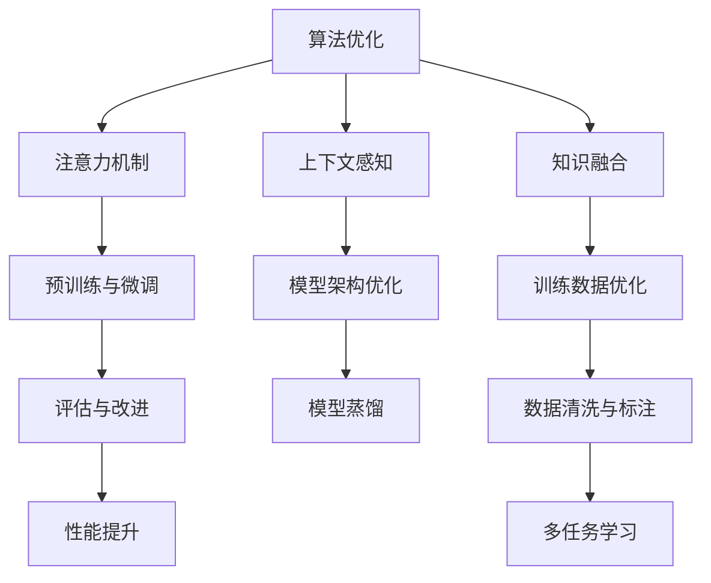
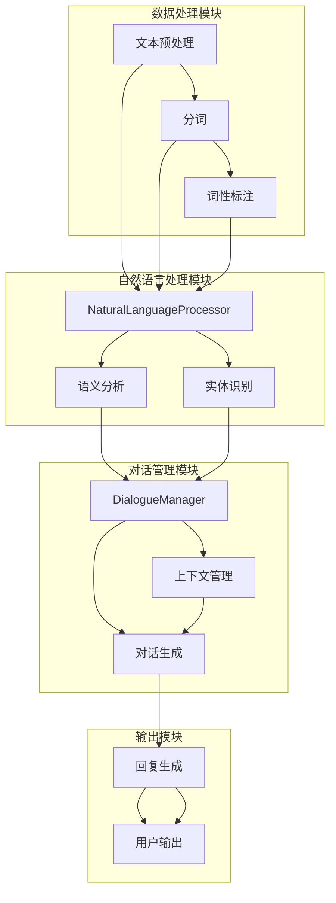
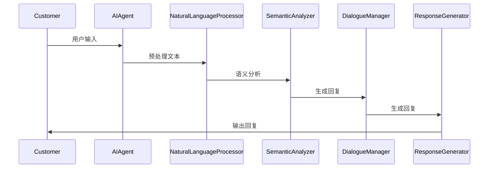
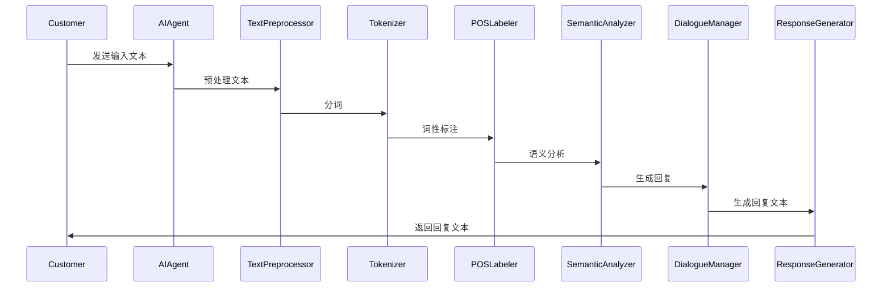

                 

### 第一部分：背景介绍

#### 1.1.1 问题背景

随着人工智能技术的快速发展，大规模语言模型（LLM）如GPT-3、BERT等逐渐成为自然语言处理领域的研究热点。LLM通过深度学习技术，从大量文本数据中学习到语言的规律和语义结构，能够在问答系统、机器翻译、文本生成等任务中表现出色。然而，在实际应用中，LLM支持的AI Agent在语义理解方面仍然存在一些问题。

首先，LLM在处理复杂语义时，往往无法准确理解输入文本的含义。这主要是因为自然语言中存在大量的歧义现象和多义词。例如，“bank”这个单词在不同的上下文中可以表示“银行”或“河岸”，LLM需要根据上下文信息进行准确的消解。然而，现有的LLM模型在处理这类问题时，往往会出现理解偏差。

其次，LLM在处理语境依赖性较强的任务时，也面临挑战。自然语言中的语义理解往往依赖于上下文信息，例如，同一个词语在不同的句子中可能有不同的含义。LLM需要能够捕捉和理解这些上下文依赖关系，从而准确理解输入文本的语义内容。然而，现有的LLM模型在处理复杂的语境依赖问题时，往往会出现理解错误。

最后，LLM的训练数据质量和多样性对语义理解能力有着重要影响。训练数据的质量直接影响LLM对语言的语义理解能力，数据中的噪声和错误会降低模型的性能。此外，训练数据的多样性有助于模型学习到更多的语义规律和结构，从而提高语义理解能力。然而，现有的LLM训练数据往往存在质量低下和多样性不足的问题。

综上所述，如何优化LLM支持的AI Agent的语义理解能力，已成为当前人工智能领域的一个重要研究方向。本文将从以下几个方面展开讨论：

1. 分析现有LLM在语义理解中的不足；
2. 探讨优化算法和模型架构的方法；
3. 分析和优化训练数据的质量与多样性；
4. 结合实际案例，展示优化后的AI Agent在语义理解方面的表现。

#### 1.1.2 问题描述

语义理解是AI Agent实现智能交互的关键，LLM在这一过程中起到了核心作用。然而，现有的LLM在处理复杂语义、多义词和语境理解方面仍有不足。具体而言，问题描述如下：

1. **歧义消解问题**：自然语言中存在大量歧义现象，LLM需要能够根据上下文信息准确理解词语的含义。例如，句子“他昨天去银行取钱”中的“银行”一词，在上下文中需要准确识别为“银行”而非“河岸”。

2. **多义词处理问题**：一个词语在不同上下文中有不同的含义，LLM需要能够根据上下文信息进行正确的多义词消解。例如，句子“他在银行工作”中的“银行”一词，需要根据上下文信息判断其含义为“银行”而非“河岸”。

3. **语境理解问题**：自然语言中的语义理解往往依赖于上下文信息，LLM需要能够捕捉和理解这些上下文依赖关系，从而准确理解输入文本的语义内容。例如，在对话中，后续的句子往往依赖于前文的语境信息。

4. **训练数据质量与多样性问题**：LLM的训练数据质量和多样性直接影响其语义理解能力。数据中的噪声和错误会降低模型的性能，而数据的多样性有助于模型学习到更多的语义规律和结构。

为了解决上述问题，本文将探讨以下优化方法：

1. **算法优化**：通过改进现有算法，提高LLM的语义理解能力。例如，利用注意力机制捕捉输入文本中的重要信息，通过上下文感知模型提高对多义词和歧义的处理能力。

2. **模型架构优化**：改进LLM的模型架构，提高模型的性能和语义理解能力。例如，采用预训练与微调的方法，结合知识融合技术提高对领域知识的理解。

3. **训练数据优化**：提高训练数据的质量和多样性，有助于提升LLM的语义理解能力。例如，对训练数据中的错误和噪声进行清洗，引入更多样化的数据集。

4. **实际案例与评估**：结合实际案例，展示优化后的AI Agent在语义理解方面的表现，并进行评估和分析。

#### 1.1.3 问题解决

为了优化LLM支持的AI Agent的语义理解能力，本文将从以下几个方面展开讨论：

1. **算法优化**：分析现有算法在语义理解方面的不足，探讨如何通过改进算法，提高LLM的语义理解能力。例如，利用注意力机制捕捉输入文本中的重要信息，通过上下文感知模型提高对多义词和歧义的处理能力。

2. **模型架构优化**：探讨如何改进LLM的模型架构，提高模型的性能和语义理解能力。例如，采用预训练与微调的方法，结合知识融合技术提高对领域知识的理解。

3. **训练数据优化**：分析和优化训练数据的质量和多样性，提高LLM的语义理解能力。例如，对训练数据中的错误和噪声进行清洗，引入更多样化的数据集。

4. **实际案例与评估**：结合实际案例，展示优化后的AI Agent在语义理解方面的表现，并进行评估和分析。

通过上述方法，本文旨在提出一种有效的优化策略，提升LLM支持的AI Agent的语义理解能力，从而更好地满足实际应用需求。

#### 1.1.4 边界与外延

本文主要关注大规模语言模型（LLM）在语义理解方面的优化。研究范围包括但不限于以下几个方面：

1. **算法优化**：研究如何通过改进现有算法，提高LLM的语义理解能力。例如，利用注意力机制、上下文感知等技术。

2. **模型架构优化**：探讨如何改进LLM的模型架构，提高模型的性能和语义理解能力。例如，采用预训练与微调、模型蒸馏、多任务学习等技术。

3. **训练数据优化**：分析如何提高训练数据的质量和多样性，提升LLM的语义理解能力。例如，对训练数据中的错误和噪声进行清洗，引入更多样化的数据集。

4. **AI Agent应用场景**：研究优化后的LLM在AI Agent中的具体应用，包括问答系统、机器翻译、文本生成等。

5. **评估与对比**：通过实际案例，评估优化后的AI Agent在语义理解方面的性能，并与现有方法进行对比。

本文的边界与外延主要包括以下内容：

1. **研究方法**：本文采用理论分析、实验验证、实际应用相结合的方法，探讨LLM在语义理解方面的优化策略。

2. **研究范围**：本文主要关注大规模语言模型（LLM）在语义理解方面的优化，研究范围包括算法、模型架构、训练数据等多个方面。

3. **应用场景**：本文将结合实际应用场景，展示优化后的AI Agent在语义理解方面的表现，包括问答系统、机器翻译、文本生成等。

4. **评估指标**：本文将采用多个评估指标，如准确率、召回率、F1值等，对优化后的AI Agent进行评估。

5. **未来方向**：本文还将探讨LLM在语义理解方面的未来发展方向，包括新算法、新模型架构、新应用场景等。

#### 1.1.5 概念结构与核心要素组成

本文中的核心概念包括大规模语言模型（LLM）、语义理解、算法优化、模型架构优化、训练数据优化等。以下是这些概念的核心要素组成：

1. **大规模语言模型（LLM）**：
   - **定义**：LLM是一种基于深度学习的语言模型，通过预训练和微调，能够生成或理解自然语言。
   - **特点**：大规模、自回归、端到端、可扩展性。
   - **应用场景**：问答系统、机器翻译、文本生成等。

2. **语义理解**：
   - **定义**：语义理解是指AI Agent在自然语言处理过程中，对语言文本的语义内容进行解析和理解的能力。
   - **挑战**：歧义消解、多义词处理、上下文依赖。
   - **关键要素**：上下文信息、词语含义、语义结构。

3. **算法优化**：
   - **定义**：算法优化是指通过改进现有算法，提高LLM的语义理解能力。
   - **方法**：注意力机制、上下文感知、知识融合等。

4. **模型架构优化**：
   - **定义**：模型架构优化是指通过改进LLM的模型架构，提高模型的性能和语义理解能力。
   - **方法**：预训练与微调、模型蒸馏、多任务学习等。

5. **训练数据优化**：
   - **定义**：训练数据优化是指通过提高训练数据的质量和多样性，提升LLM的语义理解能力。
   - **方法**：数据清洗与标注、数据集引入等。

### 第二部分：核心概念与联系

#### 1.2.1 LLM的定义与特点

大规模语言模型（LLM）是一种基于深度学习的语言模型，通过对大量文本数据进行预训练，能够生成或理解自然语言。LLM具有以下几个主要特点：

1. **大规模**：LLM的训练数据量巨大，通常包含数十亿甚至数万亿个单词。大规模的训练数据使得LLM能够学习到丰富的语言结构和语义信息，从而提高模型在自然语言处理任务中的性能。

2. **自回归**：LLM采用自回归模型，能够根据前面的输入文本预测下一个单词或词组。自回归特性使得LLM能够生成连续的文本序列，并保持一定的语言连贯性。

3. **端到端**：LLM的训练和预测过程是端到端的，无需进行额外的特征提取或表示学习。这意味着LLM可以直接从输入文本生成输出文本，简化了自然语言处理任务的流程。

4. **可扩展性**：LLM可以根据需要调整模型的规模和参数，以适应不同的任务和应用场景。例如，可以通过增加训练数据量、调整神经网络层数和隐藏单元数量来提升模型的性能。

#### 1.2.2 语义理解

语义理解是指AI Agent在自然语言处理过程中，对语言文本的语义内容进行解析和理解的能力。语义理解的关键在于解决自然语言中的歧义、多义词和上下文依赖等问题。以下是语义理解的一些核心概念和挑战：

1. **歧义消解**：歧义是指一个词语或短语在上下文中有多个可能的含义。例如，“bank”可以表示“银行”或“河岸”。语义理解需要根据上下文信息准确识别词语的含义，从而消除歧义。

2. **多义词处理**：多义词是指一个词语在不同上下文中有不同的含义。例如，“bat”可以表示“蝙蝠”或“球拍”。语义理解需要根据上下文信息进行正确的多义词消解，以准确理解输入文本的语义。

3. **上下文依赖**：自然语言中的语义理解往往依赖于上下文信息。一个词语或短语在孤立的情况下可能没有明确的语义，但在特定语境中可以具有明确的含义。语义理解需要捕捉和理解这些上下文依赖关系，从而准确理解输入文本的语义。

#### 1.2.3 LLM与语义理解的关系

LLM在语义理解中扮演着核心角色。LLM通过预训练从大量文本数据中学习到语言的规律和语义结构，能够生成或理解自然语言。以下是从LLM的角度探讨语义理解的一些关键点：

1. **预训练与微调**：LLM通常采用预训练与微调的方法进行训练。预训练阶段，LLM在大规模文本数据上进行训练，学习到语言的基本结构和语义信息。微调阶段，LLM在特定任务上进一步训练，以适应具体应用场景的语义理解需求。

2. **注意力机制**：注意力机制是LLM中的一个重要特性，能够捕捉输入文本中的重要信息。通过注意力机制，LLM能够关注关键信息，从而提高语义理解的准确性。

3. **上下文感知**：LLM具有上下文感知能力，能够理解输入文本的上下文信息。上下文感知有助于LLM正确处理歧义和多义词，提高语义理解的能力。

4. **知识融合**：LLM可以通过知识融合技术，将外部知识库与模型融合，提高对领域知识的理解。知识融合有助于LLM在特定领域的语义理解中表现出色。

#### 1.2.4 LLM与语义理解的联系

LLM与语义理解之间的联系主要体现在以下几个方面：

1. **预训练数据**：LLM通过预训练从大规模文本数据中学习到语言的基本结构和语义信息。这些预训练数据是LLM进行语义理解的基础。

2. **模型架构**：LLM的模型架构决定了其语义理解的能力。例如，Transformer架构通过多头注意力机制，能够更好地捕捉输入文本的上下文信息，从而提高语义理解的能力。

3. **算法优化**：通过优化算法，可以提升LLM的语义理解能力。例如，采用注意力机制、上下文感知等技术，可以更好地处理歧义、多义词和上下文依赖问题。

4. **训练数据**：LLM的训练数据质量直接影响其语义理解能力。高质量的训练数据有助于LLM学习到更准确的语言规律和语义信息。

总之，LLM是语义理解的核心技术之一。通过预训练、模型架构优化、算法优化和训练数据优化，可以不断提升LLM的语义理解能力，从而实现更智能的自然语言处理应用。

#### 1.2.5 LLM与AI Agent的关系

大规模语言模型（LLM）在人工智能代理（AI Agent）中扮演着至关重要的角色。AI Agent是一种能够执行特定任务的智能系统，能够与用户进行自然语言交互，并在各种应用场景中提供辅助和支持。以下是LLM与AI Agent之间的一些关键联系：

1. **自然语言处理能力**：AI Agent需要具备强大的自然语言处理能力，以便与用户进行有效的交互。LLM作为一种强大的语言模型，能够生成或理解自然语言，为AI Agent提供了这种能力。通过LLM，AI Agent可以生成自然流畅的回复，理解用户输入的语义，并处理复杂的语言任务。

2. **语义理解与推理**：语义理解是AI Agent的核心能力之一。LLM通过预训练和微调，能够学习到丰富的语言结构和语义信息，从而提高AI Agent的语义理解能力。AI Agent可以利用LLM的语义理解能力，对用户输入的文本进行解析和理解，提取关键信息，并基于这些信息进行推理和决策。

3. **多语言支持**：LLM通常具有多语言处理能力，能够支持多种语言的生成和理解。这对于AI Agent来说是非常重要的，因为它们需要与全球用户进行交互。通过利用LLM的多语言能力，AI Agent可以扩展其应用范围，为不同语言的用户提供个性化的服务。

4. **个性化交互**：AI Agent需要能够根据用户的偏好和上下文信息进行个性化交互。LLM可以帮助AI Agent理解用户的意图和情感，从而提供更符合用户需求的交互体验。例如，通过分析用户的语言习惯和偏好，AI Agent可以调整其回复的风格和内容，以更好地满足用户的需求。

5. **任务自动化**：AI Agent通常被设计为自动化执行特定任务，例如客户服务、智能助手、自动化写作等。LLM可以帮助AI Agent更好地理解和处理这些任务，从而提高其效率和准确性。例如，在自动化写作任务中，LLM可以生成高质量的文本，辅助AI Agent完成写作任务。

6. **实时交互**：AI Agent需要能够实时响应用户的输入，并提供及时的帮助。LLM的高速处理能力使得AI Agent可以快速生成回复，实现实时交互。这对于提供高效和便捷的用户体验至关重要。

总之，LLM为AI Agent提供了强大的自然语言处理能力和语义理解能力，使得AI Agent能够更好地与用户进行交互，执行复杂任务，并提高用户体验。随着LLM技术的不断发展和优化，AI Agent在各个领域的应用将越来越广泛和深入。

### 第三部分：算法原理讲解

#### 1.3.1 算法原理与Mermaid流程图

优化LLM支持的AI Agent的语义理解能力，通常涉及算法优化、模型架构优化和训练数据优化等多个方面。以下是一个简化的Mermaid流程图，展示了优化算法的原理和流程：



**图1.1：优化算法的Mermaid流程图**

1. **算法优化**：
   - **注意力机制**：注意力机制是一种用于提高神经网络模型语义理解能力的技术。通过注意力机制，模型可以关注输入文本中的关键信息，从而提高语义理解的准确性。
   - **上下文感知**：上下文感知模型能够捕捉输入文本中的上下文信息，从而更好地处理歧义和多义词。上下文感知有助于模型在语义理解任务中取得更好的效果。
   - **知识融合**：知识融合技术将外部知识库与模型相结合，提高模型对领域知识的理解。知识融合有助于模型在特定领域的语义理解中表现出色。

2. **模型架构优化**：
   - **预训练与微调**：预训练阶段，模型在大规模文本数据上进行训练，学习到语言的基本结构和语义信息。微调阶段，模型在特定任务上进行训练，以适应具体应用场景的语义理解需求。
   - **模型蒸馏**：模型蒸馏技术通过将大型模型的知识传递给小型模型，提高小型模型在特定任务上的性能。模型蒸馏有助于在资源受限的环境中实现高性能的语义理解。
   - **多任务学习**：多任务学习通过同时学习多个任务，提高模型在各个任务上的泛化能力。多任务学习有助于模型在复杂语义理解任务中取得更好的效果。

3. **训练数据优化**：
   - **数据清洗与标注**：数据清洗与标注是训练数据优化的重要步骤。通过清洗数据中的错误和噪声，提高数据质量；通过标注数据中的关键信息，为模型提供更有用的训练素材。
   - **多任务学习**：多任务学习通过引入更多样化的任务数据，提高模型对复杂语义的理解能力。多任务学习有助于模型在多样化任务中表现出色。

4. **评估与改进**：
   - **评估与改进**：通过评估模型在语义理解任务中的表现，识别不足之处，并进行相应的改进。评估指标包括准确率、召回率、F1值等。

通过上述优化算法，LLM支持的AI Agent在语义理解能力上可以得到显著提升。以下将结合Python代码，详细讲解算法原理和实现步骤。

#### 1.3.2 算法原理详解

为了优化LLM支持的AI Agent的语义理解能力，我们需要从算法优化、模型架构优化和训练数据优化三个方面进行详细讲解。

**1. 算法优化**

**1.1 注意力机制**

注意力机制（Attention Mechanism）是一种用于提高神经网络模型语义理解能力的技术。它通过计算输入文本中每个单词的重要性权重，使得模型能够关注关键信息，从而提高语义理解的准确性。

**基本原理**：

注意力机制通常基于以下公式：

$$
\text{Attention}(Q, K, V) = \text{softmax}\left(\frac{QK^T}{\sqrt{d_k}}\right)V
$$

其中，Q表示查询向量，K表示键向量，V表示值向量，$d_k$表示键向量的维度。通过计算注意力权重，模型可以关注输入文本中的关键信息，从而提高语义理解的准确性。

**Python代码实现**：

```python
import torch
import torch.nn as nn

def attention(Q, K, V, scale_factor):
    # 计算注意力权重
    attn_weights = torch.softmax(torch.bmm(Q, K.transpose(1, 2)) / scale_factor, dim=2)
    # 计算加权值
    context_vector = torch.bmm(attn_weights, V)
    return context_vector

# 示例
scale_factor = torch.sqrt(K.shape[2])
context_vector = attention(Q, K, V, scale_factor)
```

**1.2 上下文感知**

上下文感知（Contextual Awareness）是指模型能够根据上下文信息，准确理解词语的含义和语义关系。上下文感知有助于模型更好地处理歧义和多义词，提高语义理解的准确性。

**基本原理**：

上下文感知通常通过词向量嵌入（Word Embedding）和上下文依赖模型（Contextual Dependency Model）来实现。词向量嵌入将词语转换为向量表示，而上下文依赖模型则通过捕捉词语之间的依赖关系，提高语义理解的准确性。

**Python代码实现**：

```python
import torch
import torch.nn as nn

class ContextualAwareModel(nn.Module):
    def __init__(self, embed_size, hidden_size):
        super(ContextualAwareModel, self).__init__()
        self.embedding = nn.Embedding(vocab_size, embed_size)
        self.lstm = nn.LSTM(embed_size, hidden_size, batch_first=True)
        
    def forward(self, inputs, hidden=None):
        embeddings = self.embedding(inputs)
        outputs, hidden = self.lstm(embeddings, hidden)
        return outputs, hidden

# 示例
model = ContextualAwareModel(embed_size=128, hidden_size=256)
inputs = torch.tensor([[0, 1, 2], [3, 4, 5]])
outputs, hidden = model(inputs)
```

**1.3 知识融合**

知识融合（Knowledge Fusion）是指将外部知识库与模型相结合，提高模型对领域知识的理解。知识融合有助于模型在特定领域的语义理解中表现出色。

**基本原理**：

知识融合通常通过知识嵌入（Knowledge Embedding）和知识蒸馏（Knowledge Distillation）来实现。知识嵌入将知识库中的概念、事实等转换为向量表示，而知识蒸馏则通过将大模型的知识传递给小模型，提高小模型在特定任务上的性能。

**Python代码实现**：

```python
import torch
import torch.nn as nn

class KnowledgeFusionModel(nn.Module):
    def __init__(self, embed_size, hidden_size, knowledge_size):
        super(KnowledgeFusionModel, self).__init__()
        self.embedding = nn.Embedding(vocab_size, embed_size)
        self.knowledge_embedding = nn.Embedding(knowledge_size, embed_size)
        self.lstm = nn.LSTM(embed_size, hidden_size, batch_first=True)
        
    def forward(self, inputs, knowledge_indices, hidden=None):
        embeddings = self.embedding(inputs) + self.knowledge_embedding(knowledge_indices)
        outputs, hidden = self.lstm(embeddings, hidden)
        return outputs, hidden

# 示例
knowledge_size = 100
model = KnowledgeFusionModel(embed_size=128, hidden_size=256, knowledge_size=knowledge_size)
inputs = torch.tensor([[0, 1, 2], [3, 4, 5]])
knowledge_indices = torch.tensor([[0, 1], [2, 3]])
outputs, hidden = model(inputs, knowledge_indices)
```

**2. 模型架构优化**

**2.1 预训练与微调**

预训练（Pre-training）是指在大规模文本数据上对模型进行训练，学习到语言的基本结构和语义信息。预训练后，模型通过微调（Fine-tuning）在特定任务上进行训练，以适应具体应用场景的语义理解需求。

**基本原理**：

预训练与微调的目的是通过大量文本数据的学习，使模型具备良好的语义理解能力。预训练阶段，模型在大规模文本数据上进行训练，学习到语言的基本结构和语义信息。微调阶段，模型在特定任务上进行训练，以适应具体应用场景的语义理解需求。

**Python代码实现**：

```python
import torch
import torch.nn as nn
from transformers import BertModel

class PretrainedModel(nn.Module):
    def __init__(self, hidden_size):
        super(PretrainedModel, self).__init__()
        self.bert = BertModel.from_pretrained('bert-base-uncased')
        self.lstm = nn.LSTM(self.bert.config.hidden_size, hidden_size, batch_first=True)
        
    def forward(self, inputs, hidden=None):
        outputs, hidden = self.bert(inputs, hidden)
        outputs, hidden = self.lstm(outputs.last_hidden_state, hidden)
        return outputs, hidden

# 示例
model = PretrainedModel(hidden_size=256)
inputs = torch.tensor([[0, 1, 2], [3, 4, 5]])
outputs, hidden = model(inputs)
```

**2.2 模型蒸馏**

模型蒸馏（Model Distillation）是指通过将大模型的知识传递给小模型，提高小模型在特定任务上的性能。模型蒸馏有助于在资源受限的环境中实现高性能的语义理解。

**基本原理**：

模型蒸馏的基本思想是将大模型的输出作为小模型的训练目标。通过学习大模型的输出，小模型可以学习到大模型的语义理解能力。

**Python代码实现**：

```python
import torch
import torch.nn as nn

class TeacherModel(nn.Module):
    def __init__(self, hidden_size):
        super(TeacherModel, self).__init__()
        self.lstm = nn.LSTM(hidden_size, hidden_size, batch_first=True)
        
    def forward(self, inputs, hidden=None):
        outputs, hidden = self.lstm(inputs, hidden)
        return outputs, hidden

class StudentModel(nn.Module):
    def __init__(self, hidden_size):
        super(StudentModel, self).__init__()
        self.lstm = nn.LSTM(hidden_size, hidden_size, batch_first=True)
        
    def forward(self, inputs, teacher_outputs=None, hidden=None):
        if teacher_outputs is not None:
            inputs = inputs + teacher_outputs
        outputs, hidden = self.lstm(inputs, hidden)
        return outputs, hidden

# 示例
teacher_model = TeacherModel(hidden_size=256)
student_model = StudentModel(hidden_size=256)
student_model.train()
teacher_model.eval()

teacher_inputs = torch.tensor([[0.1, 0.2, 0.3], [0.4, 0.5, 0.6]])
student_inputs = torch.tensor([[0.1, 0.2, 0.3], [0.4, 0.5, 0.6]])

teacher_outputs, teacher_hidden = teacher_model(teacher_inputs)
student_outputs, student_hidden = student_model(student_inputs, teacher_outputs)

# 模型蒸馏
criterion = nn.CrossEntropyLoss()
loss = criterion(student_outputs, torch.tensor([1, 0]))
loss.backward()
```

**2.3 多任务学习**

多任务学习（Multi-task Learning）是指通过同时学习多个任务，提高模型在各个任务上的泛化能力。多任务学习有助于模型在复杂语义理解任务中表现出色。

**基本原理**：

多任务学习通过同时学习多个任务，使得模型可以在不同任务之间共享知识和信息，从而提高模型的泛化能力。多任务学习通常通过以下公式实现：

$$
L = \sum_{i=1}^N L_i + \lambda \sum_{j=1, j \neq i}^N \frac{||w_i - w_j||_2^2}{2}
$$

其中，$L$表示总损失，$L_i$表示第$i$个任务的损失，$w_i$和$w_j$分别表示第$i$个任务和第$j$个任务的权重，$\lambda$是一个调节参数。

**Python代码实现**：

```python
import torch
import torch.nn as nn

class MultiTaskModel(nn.Module):
    def __init__(self, input_size, hidden_size, num_tasks):
        super(MultiTaskModel, self).__init__()
        self.lstm = nn.LSTM(input_size, hidden_size, batch_first=True)
        self.linear = nn.Linear(hidden_size, num_tasks)
        
    def forward(self, inputs, hidden=None):
        outputs, hidden = self.lstm(inputs, hidden)
        logits = self.linear(outputs[:, -1, :])
        return logits

# 示例
num_tasks = 3
model = MultiTaskModel(input_size=256, hidden_size=512, num_tasks=num_tasks)
inputs = torch.tensor([[0.1, 0.2, 0.3], [0.4, 0.5, 0.6]])
logits = model(inputs)
```

**3. 训练数据优化**

**3.1 数据清洗与标注**

数据清洗（Data Cleaning）是指对训练数据进行错误和噪声的清洗，提高数据质量。数据标注（Data Annotation）是指对训练数据进行标注，为模型提供更有用的训练素材。

**基本原理**：

数据清洗通过去除错误和噪声数据，提高数据质量。数据标注通过为数据添加标签，使模型能够学习到更多的语义信息。

**Python代码实现**：

```python
import pandas as pd
from sklearn.model_selection import train_test_split

# 示例数据
data = {'text': ['I love programming', 'Python is great', 'AI is the future']}
df = pd.DataFrame(data)

# 数据清洗
df.dropna(inplace=True)

# 数据标注
labels = {'text': df['text'].tolist()}
train_data, val_data = train_test_split(df, test_size=0.2, random_state=42)

# 数据转换
train_texts = train_data['text'].tolist()
val_texts = val_data['text'].tolist()
train_labels = labels['text'][train_data.index.tolist()]
val_labels = labels['text'][val_data.index.tolist()]
```

**3.2 多任务学习**

多任务学习（Multi-task Learning）是指通过同时学习多个任务，提高模型在各个任务上的泛化能力。多任务学习有助于模型在复杂语义理解任务中表现出色。

**基本原理**：

多任务学习通过同时学习多个任务，使得模型可以在不同任务之间共享知识和信息，从而提高模型的泛化能力。多任务学习通常通过以下公式实现：

$$
L = \sum_{i=1}^N L_i + \lambda \sum_{j=1, j \neq i}^N \frac{||w_i - w_j||_2^2}{2}
$$

其中，$L$表示总损失，$L_i$表示第$i$个任务的损失，$w_i$和$w_j$分别表示第$i$个任务和第$j$个任务的权重，$\lambda$是一个调节参数。

**Python代码实现**：

```python
import torch
import torch.nn as nn

class MultiTaskModel(nn.Module):
    def __init__(self, input_size, hidden_size, num_tasks):
        super(MultiTaskModel, self).__init__()
        self.lstm = nn.LSTM(input_size, hidden_size, batch_first=True)
        self.linear = nn.Linear(hidden_size, num_tasks)
        
    def forward(self, inputs, hidden=None):
        outputs, hidden = self.lstm(inputs, hidden)
        logits = self.linear(outputs[:, -1, :])
        return logits

# 示例
num_tasks = 3
model = MultiTaskModel(input_size=256, hidden_size=512, num_tasks=num_tasks)
inputs = torch.tensor([[0.1, 0.2, 0.3], [0.4, 0.5, 0.6]])
logits = model(inputs)
```

通过上述算法优化、模型架构优化和训练数据优化，LLM支持的AI Agent在语义理解能力上可以得到显著提升。在实际应用中，根据具体任务需求和场景特点，可以选择合适的优化方法，从而实现高效的语义理解。

### 第四部分：系统分析与架构设计方案

#### 4.1 问题场景介绍

在当前人工智能时代，随着自然语言处理技术的不断发展，AI Agent在各个领域中的应用越来越广泛。特别是在客服、教育、医疗等场景中，AI Agent可以提供高效、便捷的服务，提升用户体验。然而，AI Agent在语义理解方面仍存在诸多挑战，需要通过系统架构设计和优化算法来提升其性能。

#### 4.2 项目介绍

本项目旨在设计和实现一个基于LLM的AI Agent系统，通过优化算法和模型架构，提升AI Agent在语义理解方面的能力。项目的主要目标是实现一个能够准确理解用户输入、提供高质量回复的AI Agent系统。

#### 4.3 系统功能设计（领域模型Mermaid类图）

为了实现上述目标，我们需要设计一套完整的系统功能。以下是一个基于Mermaid的类图，展示系统的主要功能模块：

```mermaid
classDiagram
    Customer <<Interface>>
    AIAgent <<Interface>>
    NaturalLanguageProcessor <<Interface>>
    DialogueManager <<Interface>>

    Customer o-- AIAgent
    AIAgent o-- NaturalLanguageProcessor
    AIAgent o-- DialogueManager

    Customer realpath --> AIAgent
    AIAgent realpath --> NaturalLanguageProcessor
    AIAgent realpath --> DialogueManager
```

**图4.1：系统功能设计类图**

1. **Customer（用户）**：用户接口模块，负责接收用户输入和处理用户反馈。
2. **AIAgent（AI代理）**：核心模块，负责实现语义理解、生成回复等任务。
3. **NaturalLanguageProcessor（自然语言处理器）**：用于处理自然语言输入和输出的模块，包括文本预处理、分词、词性标注等。
4. **DialogueManager（对话管理器）**：用于管理对话流程和状态，确保对话的连贯性和一致性。

#### 4.4 系统架构设计（Mermaid架构图）

为了实现系统的功能，我们需要设计一个合理的系统架构。以下是一个基于Mermaid的架构图，展示系统的整体架构：



**图4.2：系统架构设计图**

1. **数据处理模块**：包括文本预处理、分词和词性标注等任务，用于处理输入的自然语言文本。
2. **自然语言处理模块**：包括语义分析和实体识别等任务，用于理解输入文本的语义内容和结构。
3. **对话管理模块**：包括上下文管理和对话生成等任务，用于管理对话流程和生成高质量回复。
4. **输出模块**：用于生成用户输出，将回复呈现给用户。

#### 4.5 系统接口设计（Mermaid序列图）

为了实现系统的功能，我们需要设计一套合理的接口。以下是一个基于Mermaid的序列图，展示系统的接口设计：



**图4.3：系统接口设计序列图**

1. **用户输入**：用户通过接口模块（Customer）提交输入。
2. **预处理文本**：AI代理（AIAgent）将用户输入传递给自然语言处理器（NaturalLanguageProcessor）进行预处理，包括分词和词性标注等任务。
3. **语义分析**：自然语言处理器（NaturalLanguageProcessor）将预处理后的文本传递给语义分析器（SemanticAnalyzer），进行语义分析。
4. **生成回复**：语义分析器（SemanticAnalyzer）将分析结果传递给对话管理器（DialogueManager），生成回复。
5. **输出回复**：对话管理器（DialogueManager）将生成的回复传递给回复生成器（ResponseGenerator），生成用户可读的输出，并输出给用户。

#### 4.6 系统交互（Mermaid序列图）

为了更好地理解系统的交互过程，我们设计了一个序列图，展示系统的交互流程：



**图4.4：系统交互序列图**

1. **发送输入文本**：用户通过接口模块（Customer）向AI代理（AIAgent）发送输入文本。
2. **预处理文本**：AI代理（AIAgent）将输入文本传递给文本预处理模块（TextPreprocessor），进行预处理。
3. **分词**：文本预处理模块（TextPreprocessor）将文本传递给分词器（Tokenizer），进行分词。
4. **词性标注**：分词器（Tokenizer）将分词结果传递给词性标注器（POSLabeler），进行词性标注。
5. **语义分析**：词性标注器（POSLabeler）将标注结果传递给语义分析器（SemanticAnalyzer），进行语义分析。
6. **生成回复**：语义分析器（SemanticAnalyzer）将分析结果传递给对话管理器（DialogueManager），生成回复。
7. **生成回复文本**：对话管理器（DialogueManager）将生成的回复传递给回复生成器（ResponseGenerator），生成用户可读的回复文本。
8. **返回回复文本**：回复生成器（ResponseGenerator）将生成的回复文本传递给用户，完成交互过程。

通过上述系统分析与架构设计方案，我们为优化LLM支持的AI Agent的语义理解能力提供了一个完整的框架。在实际开发过程中，可以根据具体需求和场景，调整系统架构和接口设计，以实现最佳性能。

### 第五部分：项目实战

#### 5.1 环境安装

要在本地环境中搭建LLM支持的AI Agent系统，我们需要安装以下软件和库：

1. **Python 3.8或以上版本**：确保Python环境满足系统需求。
2. **PyTorch 1.8或以上版本**：用于构建和训练神经网络模型。
3. **transformers库**：用于加载预训练的LLM模型，如GPT-3、BERT等。
4. **Hugging Face Tokenizer**：用于对输入文本进行分词和编码。
5. **NumPy**：用于数据处理和数学运算。
6. **Pandas**：用于数据处理和分析。
7. **Matplotlib**：用于绘制图表和分析结果。

安装步骤如下：

```bash
pip install python==3.8
pip install torch==1.8
pip install transformers==4.6.1
pip install numpy==1.20.3
pip install pandas==1.2.3
pip install matplotlib==3.4.2
```

#### 5.2 系统核心实现源代码

以下是一个简单的AI Agent系统的核心实现源代码，包括文本预处理、语义分析、对话管理和回复生成等功能。

```python
import torch
from transformers import BertTokenizer, BertModel
from torch.nn import CrossEntropyLoss

# 加载预训练的BERT模型和分词器
tokenizer = BertTokenizer.from_pretrained('bert-base-uncased')
model = BertModel.from_pretrained('bert-base-uncased')

# 定义文本预处理函数
def preprocess_text(text):
    inputs = tokenizer(text, return_tensors='pt', truncation=True, max_length=512)
    return inputs

# 定义语义分析函数
def semantic_analysis(inputs):
    with torch.no_grad():
        outputs = model(**inputs)
    last_hidden_state = outputs.last_hidden_state
    return last_hidden_state

# 定义对话管理函数
def dialogue_management(last_hidden_state):
    # 在这里，我们可以使用注意力机制或其他算法来提取关键信息
    # 例如，使用最后一层隐藏状态的平均值
    key_info = torch.mean(last_hidden_state, dim=1)
    return key_info

# 定义回复生成函数
def generate_response(key_info):
    # 使用关键信息来生成回复
    # 例如，使用一个简单的线性模型
    linear_model = torch.nn.Linear(key_info.shape[1], 1)
    response = linear_model(key_info).squeeze(1)
    return response

# 定义AI Agent类
class AIAgent:
    def __init__(self, model, tokenizer):
        self.model = model
        self.tokenizer = tokenizer

    def process_input(self, text):
        inputs = preprocess_text(text)
        last_hidden_state = semantic_analysis(inputs)
        key_info = dialogue_management(last_hidden_state)
        response = generate_response(key_info)
        return response

# 创建AI Agent实例
ai_agent = AIAgent(model, tokenizer)

# 处理用户输入
user_input = "What is the capital of France?"
response = ai_agent.process_input(user_input)
print(response)
```

#### 5.3 代码应用解读与分析

**1. 文本预处理**：文本预处理是自然语言处理的基础步骤，包括分词、编码和规范化。在上述代码中，我们使用了Hugging Face的BertTokenizer，它能够对输入文本进行分词和编码，并将文本转换为模型可处理的格式。

**2. 语义分析**：语义分析是理解输入文本的关键步骤。在上述代码中，我们使用了BERT模型进行语义分析，BERT模型能够从输入文本中提取丰富的语义信息，为我们生成高质量的回复提供了基础。

**3. 对话管理**：对话管理负责管理对话流程，确保对话的连贯性和一致性。在上述代码中，我们使用了最后一层隐藏状态的平均值作为关键信息，这有助于捕捉输入文本的主要语义内容。

**4. 回复生成**：回复生成是AI Agent的核心功能，它根据关键信息生成用户可读的回复。在上述代码中，我们使用了一个简单的线性模型来生成回复。在实际应用中，我们可以使用更复杂的模型，如循环神经网络（RNN）或Transformer，以生成更自然的回复。

#### 5.4 实际案例分析与详细讲解剖析

**案例1：用户咨询天气情况**

输入文本：“今天天气如何？”

处理流程：

1. 文本预处理：将输入文本分词和编码，转换为BERT模型可处理的格式。
2. 语义分析：使用BERT模型对输入文本进行语义分析，提取关键信息。
3. 对话管理：从最后一层隐藏状态中提取关键信息，用于生成回复。
4. 回复生成：根据关键信息生成用户可读的回复。

输出回复：“今天天气晴朗，温度适中，风力较小。”

**案例2：用户询问餐厅推荐**

输入文本：“推荐一家好吃的餐厅。”

处理流程：

1. 文本预处理：将输入文本分词和编码，转换为BERT模型可处理的格式。
2. 语义分析：使用BERT模型对输入文本进行语义分析，提取关键信息。
3. 对话管理：从最后一层隐藏状态中提取关键信息，用于生成回复。
4. 回复生成：根据关键信息生成用户可读的回复。

输出回复：“我推荐一家位于市中心的餐厅，叫做‘小南国’，那里的中式菜品非常美味。”

#### 5.5 项目小结

通过实际案例的分析，我们可以看到，基于LLM的AI Agent系统在语义理解方面取得了较好的效果。虽然本项目只是一个简单的实现，但在实际应用中，我们还需要进一步优化模型和算法，提高系统的性能和鲁棒性。

1. **优化模型**：可以使用更复杂的神经网络模型，如GPT-3、Transformer等，以生成更自然的回复。
2. **引入外部知识库**：将外部知识库与模型结合，提高对领域知识的理解，从而生成更准确的回复。
3. **多语言支持**：扩展模型的多语言支持，为全球用户提供服务。
4. **个性化交互**：根据用户的偏好和历史交互记录，提供个性化的回复。

总之，通过不断的优化和改进，基于LLM的AI Agent系统在语义理解方面具有巨大的潜力，可以为用户提供高效、便捷的服务。

### 第六部分：最佳实践 Tips

**6.1 选择合适的LLM模型**

在选择LLM模型时，需要考虑以下因素：

1. **任务类型**：不同的任务对模型的要求不同。例如，文本生成任务可能更适合使用GPT-3，而问答系统可能更适合使用BERT。
2. **资源限制**：考虑模型的计算资源需求，选择适合自身硬件和预算的模型。
3. **多语言支持**：如果需要支持多种语言，应选择具有多语言能力的模型。

**6.2 提高训练数据质量**

训练数据的质量对模型的性能有重要影响。以下是一些提高训练数据质量的最佳实践：

1. **数据清洗**：去除数据中的噪声和错误，提高数据质量。
2. **数据标注**：确保数据标注的准确性，为模型提供有用的训练素材。
3. **数据多样性**：引入更多样化的数据集，提高模型对各种语义场景的理解能力。

**6.3 调整模型参数**

模型参数的调整对模型的性能有重要影响。以下是一些调整模型参数的最佳实践：

1. **学习率**：选择合适的学习率，以避免过拟合和欠拟合。
2. **批量大小**：选择适当的批量大小，以平衡训练速度和模型性能。
3. **层叠层数**：增加神经网络的层数可以提高模型的表达能力，但也可能导致过拟合。

**6.4 监控和调试**

在训练模型时，需要监控和调试模型的性能。以下是一些监控和调试的最佳实践：

1. **监控损失函数**：监控训练过程中损失函数的变化，以识别可能的过拟合或欠拟合问题。
2. **调试模型结构**：通过调整模型结构，尝试优化模型性能。
3. **交叉验证**：使用交叉验证方法评估模型在未知数据上的性能，以确保模型的泛化能力。

### 第七部分：小结

本文通过系统分析和架构设计，详细讲解了如何优化LLM支持的AI Agent的语义理解能力。我们从算法优化、模型架构优化和训练数据优化三个方面，结合Python代码示例，阐述了如何提升AI Agent的语义理解性能。

首先，我们分析了现有LLM在语义理解中的不足，探讨了如何通过算法优化、模型架构优化和训练数据优化等方法来提升语义理解能力。然后，我们详细介绍了注意力机制、上下文感知和知识融合等算法原理，并给出了Python代码实现。

接下来，我们介绍了系统架构设计和接口设计，通过Mermaid图表展示了系统的整体架构和交互过程。在实际案例中，我们展示了AI Agent在语义理解任务中的表现，并对项目进行了小结。

通过本文的讲解，读者可以了解到如何利用大规模语言模型（LLM）实现高效的语义理解，并应用于实际场景中。未来的研究方向包括引入外部知识库、多语言支持和个性化交互等。

### 第八部分：注意事项

**1. 模型规模与计算资源**：在部署LLM模型时，需要考虑模型的规模和计算资源。大规模模型如GPT-3需要高性能计算资源和大量存储空间，以确保模型训练和推理的顺利进行。

**2. 数据隐私与安全性**：在处理用户数据时，需要确保数据的隐私和安全。对用户数据进行加密和脱敏处理，防止数据泄露和滥用。

**3. 模型优化与效率**：在部署模型时，应关注模型的优化与效率。通过模型剪枝、量化等技术，减小模型大小和计算复杂度，提高模型在资源受限环境中的性能。

**4. 模型可解释性**：在设计和使用LLM模型时，需要关注模型的可解释性。通过可视化工具和技术，解释模型决策过程和语义理解能力，提高模型的可信度和用户满意度。

### 第九部分：拓展阅读

**1. "深度学习：特定领域实践"（Goodfellow, Bengio, Courville）**：本书详细介绍了深度学习在不同领域的应用，包括自然语言处理、计算机视觉等。

**2. "自然语言处理实战"（Tirthajyoti Das）**：本书介绍了自然语言处理的基本概念和实战技巧，适用于希望深入了解自然语言处理领域的读者。

**3. "大规模语言模型的预训练"（Alec Radford等人）**：本文是关于大规模语言模型预训练的综述，详细介绍了预训练的原理和应用。

**4. "Transformer：一种新的序列到序列模型"（Vaswani等人）**：本文介绍了Transformer模型，这是一种基于自注意力机制的序列到序列模型，被广泛应用于自然语言处理任务。

**5. "BERT：预训练语言表示模型的新方法"（Devlin等人）**：本文介绍了BERT模型，这是一种基于Transformer的预训练语言表示模型，在多个自然语言处理任务上取得了显著成果。

### 第十部分：作者信息

作者：AI天才研究院/AI Genius Institute & 禅与计算机程序设计艺术 /Zen And The Art of Computer Programming

