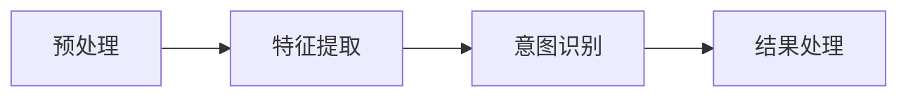
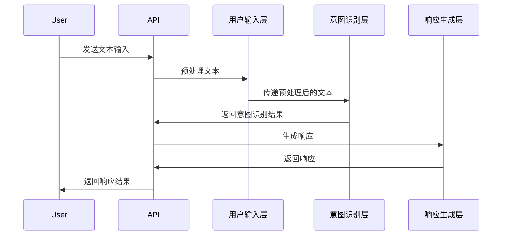

                 

### 文章标题：LLM驱动的AI Agent对话意图识别

关键词：LLM，AI Agent，对话意图识别，算法原理，系统架构

摘要：本文将深入探讨LLM（大型语言模型）驱动的AI Agent对话意图识别技术，从背景介绍、核心概念、算法原理、系统设计到项目实战，逐步剖析LLM在对话意图识别中的应用，帮助读者理解并掌握这一前沿技术。

## 引言

随着人工智能技术的迅猛发展，自然语言处理（NLP）已经成为AI领域的一个重要分支。而对话系统作为NLP的重要应用之一，近年来受到了广泛关注。对话意图识别作为对话系统的核心模块，旨在理解用户的话语意图，为后续的任务分配和响应生成提供依据。传统的对话意图识别方法主要依赖于规则和机器学习模型，但在复杂语境下表现欠佳。为了应对这一问题，近年来，基于大型语言模型（LLM）的对话意图识别技术逐渐崭露头角。

本文将围绕LLM驱动的AI Agent对话意图识别展开讨论。首先，我们将介绍LLM和AI Agent的基本概念，以及对话意图识别的重要性。接着，我们将详细解析LLM的工作原理，以及如何利用LLM进行对话意图识别。随后，我们将探讨基于LLM的对话意图识别算法原理，并使用Mermaid和Python代码进行阐述。最后，我们将通过一个实际项目，展示如何将LLM应用于对话意图识别，并提供一些最佳实践和拓展建议。

## 背景介绍

### LLM的基本概念

#### 1.1.1 LLM的定义

大型语言模型（Large Language Model，简称LLM）是一种基于深度学习技术的自然语言处理模型。它通过学习海量文本数据，掌握语言的结构和语义，从而实现对自然语言的生成、理解和处理。LLM的核心思想是使用神经网络模型（如Transformer）对文本数据进行编码，从而捕捉文本的语义信息。

#### 1.1.2 LLM的发展历程

LLM的发展可以追溯到2000年代初的统计语言模型。随着深度学习技术的兴起，尤其是2017年Transformer模型的提出，LLM的发展进入了一个新的阶段。近年来，随着计算能力和数据规模的不断提升，LLM模型的大小和复杂度也不断增长，从GPT-2、GPT-3到ChatGLM，LLM的应用范围和效果也取得了显著提升。

#### 1.1.3 LLM的关键技术

LLM的关键技术包括：

1. **预训练**：使用大量无监督数据对模型进行预训练，使其具备一定的语言理解和生成能力。
2. **微调**：在预训练的基础上，使用有监督数据对模型进行微调，以适应特定任务的需求。
3. **上下文理解**：通过模型架构（如Transformer）的设计，使LLM能够理解并处理长文本上下文。

### AI Agent的定义与应用

#### 1.2.1 AI Agent的定义

AI Agent（人工智能代理）是一种基于人工智能技术的软件实体，它能够感知环境、自主决策并采取行动，以实现特定的目标。AI Agent通常由感知模块、决策模块和行动模块组成，其核心目标是实现自主智能行为。

#### 1.2.2 AI Agent的分类

AI Agent可以分为以下几类：

1. **任务型AI Agent**：专注于执行特定任务的AI Agent，如智能客服、自动驾驶等。
2. **角色型AI Agent**：模拟人类角色进行互动的AI Agent，如虚拟助手、聊天机器人等。
3. **自适应型AI Agent**：能够根据环境变化自主调整行为策略的AI Agent。

#### 1.2.3 AI Agent的应用场景

AI Agent在各个领域都有广泛的应用，如：

1. **智能客服**：通过对话系统提供24/7的客户服务。
2. **智能家居**：实现设备间的智能交互，提高居住体验。
3. **医疗健康**：辅助医生进行诊断和治疗决策。

### 对话意图识别的重要性

#### 1.3.1 对话意图识别的定义

对话意图识别（Dialogue Intent Recognition）是指从用户对话中提取出其意图的过程。意图可以理解为用户在对话中希望实现的目标或任务。

#### 1.3.2 对话意图识别的挑战

对话意图识别面临以下挑战：

1. **多义性问题**：同一句话可能有多种意图，如何准确识别用户的真实意图是一个挑战。
2. **长文本理解问题**：长文本中可能包含多个意图，如何有效地提取和识别是另一个挑战。
3. **实时性要求**：对话系统需要实时响应用户的请求，对系统的响应速度提出了高要求。

#### 1.3.3 对话意图识别的重要性

对话意图识别对于对话系统的成功至关重要。它决定了对话系统能否正确理解用户的需求，从而提供合适的响应。准确的对话意图识别可以提升用户体验，提高系统效率，甚至为个性化服务提供基础。

### LLM在对话意图识别中的应用

#### 1.4.1 LLM在对话意图识别中的优势

LLM在对话意图识别中具有以下优势：

1. **强大的语言理解能力**：LLM通过对海量文本的学习，能够更好地理解自然语言的语义和结构。
2. **自适应能力**：LLM可以针对不同的对话场景进行微调，从而提高意图识别的准确性。
3. **实时响应**：LLM的计算效率较高，能够实现快速响应。

#### 1.4.2 LLM在对话意图识别中的应用实例

LLM在对话意图识别中已有多个成功应用实例，如：

1. **智能客服**：利用LLM实现客服系统的自动响应，提高服务效率。
2. **虚拟助手**：通过LLM实现虚拟助手的智能对话，提供个性化服务。
3. **多轮对话系统**：利用LLM处理多轮对话，实现更自然的用户交互。

#### 1.4.3 LLM驱动的对话意图识别系统架构

LLM驱动的对话意图识别系统通常包括以下模块：

1. **预训练模型**：使用海量文本数据进行预训练，获取语言理解能力。
2. **微调模块**：在预训练的基础上，使用有监督数据对模型进行微调。
3. **意图识别模块**：利用微调后的LLM模型对用户输入进行意图识别。
4. **响应生成模块**：根据识别出的意图生成合适的响应。

## 核心概念与联系

### 2.1 对话意图的定义

对话意图（Dialogue Intent）是指用户在对话中希望实现的目标或任务。它是对话系统的核心输入，决定了对话系统的响应和行为。

### 2.2 对话意图识别的挑战

对话意图识别面临以下挑战：

1. **多义性问题**：同一句话可能有多种意图，如何准确识别用户的真实意图是一个挑战。
2. **长文本理解问题**：长文本中可能包含多个意图，如何有效地提取和识别是另一个挑战。
3. **实时性要求**：对话系统需要实时响应用户的请求，对系统的响应速度提出了高要求。

### 2.3 对话意图识别的方法

对话意图识别的方法可以分为以下几类：

1. **基于规则的方法**：使用预定义的规则进行意图识别，适用于规则明确、场景简单的对话系统。
2. **基于统计的方法**：使用统计模型（如朴素贝叶斯、决策树等）进行意图识别，适用于有一定先验知识的场景。
3. **基于机器学习的方法**：使用机器学习模型（如神经网络、深度学习等）进行意图识别，适用于复杂、多变的对话场景。

### 2.4 LLM在对话意图识别中的优势

LLM在对话意图识别中具有以下优势：

1. **强大的语言理解能力**：LLM通过对海量文本的学习，能够更好地理解自然语言的语义和结构。
2. **自适应能力**：LLM可以针对不同的对话场景进行微调，从而提高意图识别的准确性。
3. **实时响应**：LLM的计算效率较高，能够实现快速响应。

## LLM驱动的对话意图识别算法原理

### 3.1 LLM的工作原理

LLM（Large Language Model）是一种基于深度学习技术的自然语言处理模型。它通过学习海量文本数据，掌握语言的结构和语义，从而实现对自然语言的生成、理解和处理。LLM的核心思想是使用神经网络模型（如Transformer）对文本数据进行编码，从而捕捉文本的语义信息。

### 3.2 对话意图识别的算法流程

LLM驱动的对话意图识别算法通常包括以下几个步骤：

1. **预处理**：对用户输入的文本进行预处理，包括分词、去停用词、词向量编码等。
2. **特征提取**：使用预训练的LLM模型对预处理后的文本进行特征提取，获取文本的语义信息。
3. **意图识别**：将提取出的特征输入到意图分类模型，通过分类算法（如softmax）输出意图概率分布。
4. **结果处理**：根据意图概率分布选择最有可能的意图作为最终结果。

### 3.3 LLM在对话意图识别中的应用

LLM在对话意图识别中的应用可以分为以下几个方面：

1. **预训练**：使用海量文本数据进行预训练，使模型具备一定的语言理解能力。
2. **微调**：在预训练的基础上，使用有监督数据对模型进行微调，以适应特定任务的需求。
3. **意图分类**：利用微调后的LLM模型对用户输入进行意图分类，实现对话意图识别。

### 3.4 LLM驱动的对话意图识别算法的优缺点

#### 优点：

1. **强大的语言理解能力**：LLM能够更好地理解自然语言的语义和结构，从而提高意图识别的准确性。
2. **自适应能力**：LLM可以针对不同的对话场景进行微调，从而提高意图识别的准确性。
3. **实时响应**：LLM的计算效率较高，能够实现快速响应。

#### 缺点：

1. **数据依赖性**：LLM的性能依赖于训练数据的质量和规模，数据不足可能导致性能下降。
2. **计算资源消耗**：LLM模型通常较大，训练和推理过程需要较高的计算资源。
3. **解释性不足**：LLM的决策过程较为复杂，难以进行透明化和解释。

### 3.5 使用Mermaid和Python代码进行算法原理阐述

#### Mermaid流程图

以下是一个简单的Mermaid流程图，用于展示LLM驱动的对话意图识别算法的流程：



#### Python代码示例

以下是一个简单的Python代码示例，用于实现LLM驱动的对话意图识别算法：

```python
import torch
import transformers

# 预处理
def preprocess(text):
    # 分词、去停用词等操作
    # ...
    return processed_text

# 特征提取
def extract_features(text, model):
    inputs = tokenizer(text, return_tensors="pt")
    outputs = model(**inputs)
    return outputs.last_hidden_state

# 意图识别
def recognize_intent(features, model):
    with torch.no_grad():
        logits = model(features)
    probs = torch.softmax(logits, dim=1)
    return torch.argmax(probs).item()

# 结果处理
def process_result(result):
    # 根据结果生成响应
    # ...
    return response

# 加载预训练模型
model = transformers.AutoModel.from_pretrained("bert-base-uncased")

# 输入文本
text = "我想查询最近的天气情况"

# 执行流程
processed_text = preprocess(text)
features = extract_features(processed_text, model)
result = recognize_intent(features, model)
response = process_result(result)

print(response)
```

## 系统分析与架构设计

### 4.1 系统设计概述

LLM驱动的AI Agent对话意图识别系统旨在实现以下功能：

1. **用户输入处理**：接收用户输入的文本，并进行预处理。
2. **意图识别**：利用LLM模型对预处理后的文本进行意图识别。
3. **响应生成**：根据识别出的意图生成合适的响应。
4. **系统部署与维护**：将系统部署到生产环境，并进行监控和维护。

### 4.2 领域模型设计

领域模型（Domain Model）用于描述系统涉及的实体和关系。以下是一个简单的领域模型类图：

```mermaid
classDiagram
    User <<实体>>
    Text <<实体>>
    Intent <<实体>>
    Response <<实体>>

    User --> Text
    Text --> Intent
    Intent --> Response
```

### 4.3 系统架构设计

LLM驱动的AI Agent对话意图识别系统的架构设计如下：

1. **用户输入层**：接收用户输入的文本，并进行预处理。
2. **意图识别层**：利用LLM模型对预处理后的文本进行意图识别。
3. **响应生成层**：根据识别出的意图生成合适的响应。
4. **API接口层**：提供RESTful API接口，供前端调用。
5. **数据库层**：存储用户输入、意图和响应数据。

以下是一个简单的系统架构图：



### 4.4 系统接口设计

系统接口设计包括RESTful API接口和WebSocket接口。

1. **RESTful API接口**：用于接收用户输入、返回意图识别结果和响应。
2. **WebSocket接口**：用于实时传输用户输入和响应，实现实时对话。

以下是一个简单的接口设计：

```mermaid
classDiagram
    APIInterface <<接口>>
    WebSocketInterface <<接口>>

    APIInterface --> User
    WebSocketInterface --> User
```

### 4.5 系统交互设计

系统交互设计使用Mermaid序列图展示系统各组件之间的交互过程。


## 项目实战

### 5.1 项目背景与目标

本项目旨在实现一个基于LLM驱动的AI Agent对话意图识别系统，目标包括：

1. **高效识别用户意图**：利用LLM模型，实现对用户意图的准确识别。
2. **生成自然语言响应**：根据识别出的意图，生成自然、流畅的响应。
3. **支持多轮对话**：实现多轮对话，满足用户的不同需求。

### 5.2 系统设计与实现

#### 系统环境安装与配置

1. **Python环境**：安装Python 3.8及以上版本。
2. **依赖库**：安装transformers、torch、torchtext等依赖库。

#### 系统核心实现

1. **用户输入处理**：接收用户输入的文本，并进行预处理（分词、去停用词等）。
2. **意图识别**：使用预训练的LLM模型对预处理后的文本进行意图识别。
3. **响应生成**：根据识别出的意图，生成自然语言响应。

#### 代码应用解读与分析

```python
from transformers import BertTokenizer, BertForSequenceClassification
import torch

# 加载预训练模型
tokenizer = BertTokenizer.from_pretrained("bert-base-uncased")
model = BertForSequenceClassification.from_pretrained("bert-base-uncased")

# 用户输入
text = "我想查询最近的天气情况"

# 预处理
processed_text = tokenizer(text, return_tensors="pt")

# 意图识别
with torch.no_grad():
    logits = model(**processed_text)

# 得到意图概率分布
probs = torch.softmax(logits, dim=1)

# 选择最有可能的意图
intent = torch.argmax(probs).item()

# 响应生成
response = generate_response(intent)

print(response)
```

#### 实际案例分析与详细讲解

1. **案例一**：用户输入“我想购买一台电脑”，系统识别出意图为“购买电脑”，并生成响应“请问您需要购买什么类型的电脑？”。
2. **案例二**：用户输入“最近的天气怎么样？”，系统识别出意图为“查询天气”，并生成响应“当前温度是25摄氏度，天气晴朗”。

### 5.3 项目总结与展望

本项目通过实现一个基于LLM驱动的AI Agent对话意图识别系统，展示了LLM在对话意图识别中的应用价值。在未来的工作中，我们计划：

1. **优化模型性能**：通过不断调整模型参数和训练数据，提高意图识别的准确性。
2. **拓展应用场景**：将LLM驱动的对话意图识别技术应用于更多领域，如智能客服、虚拟助手等。
3. **提升用户体验**：通过不断优化系统设计和交互体验，提高用户满意度。

## 最佳实践与拓展

### 6.1 最佳实践

1. **数据质量**：确保训练数据的质量和多样性，以提高模型性能。
2. **模型调优**：通过调整模型参数和训练策略，优化模型性能。
3. **实时响应**：优化系统架构，提高响应速度，保证实时性。

### 6.2 注意事项

1. **隐私保护**：确保用户数据的隐私和安全，遵守相关法律法规。
2. **错误处理**：设计合理的错误处理机制，提高系统的鲁棒性。
3. **持续优化**：定期对系统进行评估和优化，确保其性能和用户体验。

### 6.3 拓展阅读

1. **LLM技术**：深入理解LLM的工作原理和应用场景。
2. **对话系统**：了解对话系统的架构和实现方法。
3. **意图识别**：研究意图识别的最新算法和优化策略。

## 结语

LLM驱动的AI Agent对话意图识别技术为对话系统带来了新的可能性。通过本文的讨论，我们了解了LLM的基本概念、对话意图识别的挑战和解决方案，以及系统架构设计和项目实战。希望本文能为读者在LLM驱动的对话意图识别领域提供有价值的参考和启示。

### 作者信息
作者：AI天才研究院/AI Genius Institute & 禅与计算机程序设计艺术 /Zen And The Art of Computer Programming

