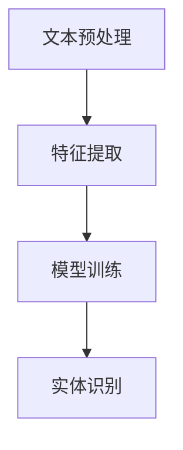

                 

## 文章标题

# NLP技术在企业AI Agent中的应用与实现

> 关键词：自然语言处理（NLP），人工智能（AI），对话系统，企业AI Agent，语言模型，情感分析，命名实体识别（NER）

> 摘要：本文深入探讨了自然语言处理（NLP）技术在企业人工智能（AI）代理中的应用与实现。通过详细的背景介绍、基础概念、高级技术以及应用实践，文章展示了NLP在构建智能对话系统、提升客户服务、自动化业务流程等方面的关键作用。本文旨在为从事AI技术开发的企业提供有价值的指导，帮助他们更好地利用NLP技术来提升业务效率和客户满意度。

## 引言

随着人工智能技术的飞速发展，自然语言处理（NLP）作为其重要分支，已经在各行各业中得到了广泛的应用。NLP技术的核心在于使计算机能够理解和生成人类语言，从而实现人与机器的交互。在企业环境中，NLP技术被广泛应用于构建智能客服系统、自动化业务流程、数据挖掘等场景。而企业AI Agent作为智能助手，其核心依赖于NLP技术的强大支持。

本文将从以下几个方面展开：

1. **背景与介绍**：回顾NLP和AI Agent的发展历程，明确它们在当前技术环境中的重要性。
2. **基础概念**：深入探讨NLP的基本概念和技术，包括文本预处理、语言模型等。
3. **高级技术**：详细介绍命名实体识别（NER）、情感分析等高级NLP技术，并展示其在AI Agent中的应用。
4. **应用实践**：结合具体案例，展示NLP技术在企业AI Agent中的应用实践，包括系统设计与实现、项目实战等。
5. **最佳实践与总结**：总结NLP技术在企业AI Agent应用中的最佳实践，并展望未来的发展趋势。

通过本文的详细阐述，读者将能够全面了解NLP技术在企业AI Agent中的重要作用，以及如何有效实现和应用这些技术来提升企业的智能化水平。

### 文章关键词

- 自然语言处理（NLP）
- 人工智能（AI）
- 对话系统
- 企业AI Agent
- 语言模型
- 情感分析
- 命名实体识别（NER）

这些关键词不仅反映了文章的核心内容，也指出了NLP技术在企业AI Agent中的应用方向和技术要点。通过这些关键词，读者可以迅速把握文章的主题，并为后续章节的内容做准备。

### 文章摘要

本文深入探讨了自然语言处理（NLP）技术在企业人工智能（AI）代理中的应用与实现。首先，介绍了NLP和AI Agent的发展背景及其在当前技术环境中的重要性。随后，详细阐述了NLP的基础概念和技术，包括文本预处理、语言模型等。接着，本文介绍了高级NLP技术，如命名实体识别（NER）和情感分析，并展示了这些技术在AI Agent中的具体应用。在应用实践部分，通过具体案例展示了NLP技术在企业AI Agent中的系统设计与实现。最后，文章总结了NLP技术在企业AI Agent应用中的最佳实践，并展望了未来的发展趋势。本文旨在为从事AI技术开发的企业提供有价值的指导，帮助它们更好地利用NLP技术提升业务效率和客户满意度。

### 背景和介绍

#### 自然语言处理（NLP）的起源与发展

自然语言处理（NLP）是人工智能（AI）的一个关键分支，旨在使计算机能够理解、生成和交互人类语言。NLP的概念起源于20世纪50年代，当时计算机科学家开始探索如何使计算机具备人类语言的理解和生成能力。这一时期的早期研究主要集中在机器翻译和自动文摘上，试图通过构建规则和算法来处理自然语言。

早期的NLP研究主要集中在基于规则的系统上，这些系统依赖于预定义的语法和语义规则来分析文本。然而，这种方法的局限性很快显现出来，因为自然语言具有高度的复杂性和不确定性，很难通过简单的规则来完全捕捉其内在的结构和含义。

随着计算能力的提升和机器学习技术的进步，NLP研究开始转向统计方法和基于数据的模型。20世纪80年代，统计机器翻译和词袋模型（Bag of Words）等技术的出现标志着NLP领域的重大转折。这些方法通过大量语料库的学习，使计算机能够自动识别和预测语言中的模式和规律。

进入21世纪，深度学习技术的崛起进一步推动了NLP的发展。深度神经网络（DNN）和循环神经网络（RNN）等模型在自然语言处理任务中取得了显著的成效，特别是在语言建模、文本分类、机器翻译和对话系统等领域。这些基于深度学习的模型能够自动从大规模数据中学习复杂的特征和模式，大大提升了NLP系统的性能和准确性。

#### 人工智能（AI）代理的定义与作用

人工智能（AI）代理是指通过模拟人类智能行为来执行特定任务的计算机系统。AI代理不同于传统的软件程序，它具有自我学习、自主决策和自适应能力，能够在复杂和不确定的环境中独立完成任务。AI代理的应用范围非常广泛，从智能家居控制系统、智能客服系统到自动驾驶汽车和医疗诊断系统，涵盖了多个领域。

在企业环境中，AI代理通常被用来提高业务效率和优化客户体验。例如，智能客服系统利用AI代理来处理客户查询，提供即时和个性化的回答，从而减少人工客服的工作负担，提升客户满意度。AI代理还可以用于自动化业务流程，通过分析大量数据和预测市场趋势，帮助企业做出更明智的决策。

AI代理在企业中的具体作用主要体现在以下几个方面：

1. **提升客户服务质量**：通过智能客服系统，AI代理可以提供24/7全天候的服务，快速响应用户查询，提高客户满意度。
2. **自动化业务流程**：AI代理可以自动化重复性和规则性强的任务，如数据录入、报告生成等，从而降低人力成本，提高工作效率。
3. **数据分析和决策支持**：AI代理通过对大量数据的分析，可以帮助企业识别潜在的市场机会、优化供应链管理和提升运营效率。
4. **个性化体验**：AI代理可以根据用户的行为和偏好，提供个性化的服务和推荐，增强用户黏性和忠诚度。

#### NLP在AI代理中的重要性

自然语言处理（NLP）技术在AI代理中扮演着至关重要的角色，它是实现智能交互和智能决策的基础。以下将从几个方面详细阐述NLP在AI代理中的重要性：

1. **对话系统的构建**：NLP技术使得AI代理能够理解和生成人类语言，实现自然、流畅的对话。通过语言理解、语义分析、对话生成等技术，AI代理可以与用户进行实时交互，提供有针对性的回答和建议。
2. **文本分析**：NLP技术可以用于自动分析和处理大量文本数据，如社交媒体评论、客户反馈和业务报告等。通过对文本内容的分析，AI代理可以提取关键信息、识别趋势和预测市场变化，为企业提供决策支持。
3. **情感分析**：情感分析是NLP的一个重要应用领域，它通过分析文本中的情感倾向和情绪变化，可以帮助企业了解客户的情绪和态度，从而优化产品和服务，提升客户满意度。
4. **实体识别**：命名实体识别（NER）是NLP中的关键技术之一，它用于从文本中识别和分类人、地点、组织等实体信息。这种技术在客户关系管理、市场分析等领域具有重要意义，可以帮助企业更好地理解和分析客户数据。
5. **语言生成**：NLP技术不仅能够理解语言，还能够生成自然语言文本。这种能力在自动写作、智能客服等领域有着广泛的应用，能够提高自动化系统的自然交互能力。

综上所述，NLP技术在AI代理中的作用不仅仅局限于对话系统的构建，它还涉及到文本分析、情感分析、实体识别等多个方面。通过NLP技术的应用，AI代理能够实现更智能、更高效的交互和决策，从而为企业带来更大的商业价值。

#### NLP技术的基本概念与分类

自然语言处理（NLP）技术是人工智能（AI）领域的一个重要分支，其核心目标是使计算机能够理解和生成人类语言。为了实现这一目标，NLP技术涵盖了多个基本概念和分类，包括文本预处理、语言模型、词向量、词性标注等。

##### 1. 文本预处理

文本预处理是NLP任务的第一步，其目的是将原始文本转换为适合后续处理的格式。文本预处理通常包括以下几个步骤：

- **分词**：将连续的文本序列分割成单个词汇或短语，这一过程称为分词。常见的分词方法有基于规则的分词和基于统计的分词。基于规则的分词依赖于预定义的语法规则，如正则表达式，而基于统计的分词则利用大规模语料库中的统计信息来分割文本。
- **词干提取**：词干提取是一种将词汇缩减到其基础形态的过程，通过去除词尾的词缀，使词汇变得更加简洁。常见的词干提取方法有词干提取器（如Porter词干提取器）和形态分析器（如Lemmatizer）。
- **停用词过滤**：停用词是指在特定语境中不具有实际意义的词汇，如“的”、“和”、“是”等。在NLP任务中，去除停用词可以减少数据噪音，提高模型的性能。常见的停用词列表通常包含数千个常见停用词。
- **词形还原**：词形还原是一种将不同形式的词汇统一成同一形式的过程，如将复数形式转换为单数形式，或不同时态的词形转换成基础形态。词形还原有助于减少词汇的多样性，使文本处理更加一致。

##### 2. 语言模型

语言模型是NLP中用于预测文本序列的概率分布的数学模型。通过学习大量的语料库，语言模型可以估计任意文本序列的概率，从而在文本生成、文本分类、机器翻译等任务中发挥重要作用。常见的语言模型包括以下几种：

- **N元语法**（N-gram Model）：N元语法是一种基于有限上下文的统计语言模型。它通过统计相邻的N个词汇出现的频率来预测下一个词汇。例如，二元语法（Bigram）只考虑前两个词汇，而三元语法（Trigram）则考虑前三个词汇。N元语法的优点是计算简单，但缺点是难以捕捉长程依赖关系。
- **神经网络语言模型**（Neural Network Language Model，NNLM）：神经网络语言模型利用深度神经网络来学习文本序列的概率分布。与传统的N元语法不同，NNLM能够捕捉长程依赖关系，从而在生成文本时更加准确。常见的NNLM包括循环神经网络（RNN）和变换器（Transformer）等架构。
- **深度循环神经网络**（Deep Recurrent Neural Network，DRNN）：深度循环神经网络是一种结合了深度学习和循环神经网络（RNN）的模型。通过多层RNN结构，DRNN能够学习更复杂的语言模式，并在多个NLP任务中表现出色。

##### 3. 词向量

词向量是将词汇映射到固定维度的向量空间的一种表示方法。词向量不仅保留了词汇的语义信息，还能够通过向量的相似性来度量词汇之间的关系。常见的词向量模型包括以下几种：

- **词袋模型**（Bag of Words，BoW）：词袋模型将文本表示为一个向量，其中每个维度对应一个词汇。向量中1表示词汇的出现，0表示未出现。词袋模型计算简单，但忽略了词汇的顺序和语法结构。
- **词嵌入**（Word Embedding）：词嵌入通过将词汇映射到高维向量空间来表示词汇的语义信息。常见的词嵌入模型包括Word2Vec、GloVe和FastText等。这些模型通过训练大规模语料库，使词汇在向量空间中的分布更加紧密，从而能够捕捉词汇的相似性和差异性。
- **稀疏词嵌入**（Sparse Word Embedding）：稀疏词嵌入通过减少向量中的非零元素来降低模型参数的数量，从而提高计算效率和模型的可解释性。这种嵌入方法在处理大规模文本数据时尤为有效。

##### 4. 词性标注

词性标注是一种对文本中的每个词汇进行语法分类的过程。通过词性标注，可以更好地理解文本的语法结构和语义含义。常见的词性标注方法包括：

- **基于规则的词性标注**：基于规则的词性标注依赖于预定义的语法规则和模式匹配算法，如Lexical Analysis。这种方法需要大量手工编写的规则，但在处理特定领域或语言的文本时效果较好。
- **基于统计的词性标注**：基于统计的词性标注通过训练统计模型来预测词汇的词性。常见的统计方法包括条件概率模型（如Hidden Markov Model，HMM）和朴素贝叶斯分类器。这种方法具有较高的准确性和泛化能力，适用于大规模文本数据的处理。
- **基于深度学习的词性标注**：深度学习技术在词性标注任务中也取得了显著成效。通过训练深度神经网络（如卷积神经网络（CNN）和循环神经网络（RNN）），模型可以自动学习文本的语法特征和词性关系，从而提高标注的准确性。

通过上述基本概念和分类的介绍，我们可以看到NLP技术涉及多个方面，从文本预处理到语言模型、词向量和词性标注，每一个环节都为构建强大的NLP系统提供了基础。在实际应用中，NLP技术的选择和组合需要根据具体任务的需求和数据的特性来决定，从而实现最佳的效果。

#### NLP技术在AI Agent中的应用案例分析

NLP技术在企业AI Agent中的应用已经取得了显著的成果，通过具体案例，我们可以更深入地了解其应用效果和实现方式。

##### 1. 智能客服系统

智能客服系统是NLP技术在企业AI Agent中应用最广泛的领域之一。通过NLP技术，AI代理能够自动处理客户查询，提供即时和个性化的服务。例如，大型电商平台利用NLP技术来构建智能客服系统，当用户在网站上遇到问题时，AI代理可以自动识别用户的问题，并通过自然语言生成技术提供详细的解答。

实现方式：

- **文本预处理**：首先，系统通过分词和词干提取技术对用户查询的文本进行预处理，去除无关的停用词和语法结构。
- **情感分析**：利用情感分析技术，系统可以识别用户的情感倾向，如愤怒、满意等，从而提供更加贴心的服务。
- **意图识别**：通过训练有监督的机器学习模型，系统可以识别用户的查询意图，如退款、订单查询等，并自动路由到相应的处理流程。
- **语言生成**：AI代理使用自然语言生成技术生成个性化的回复，确保回答简洁明了、符合用户需求。

##### 2. 自动化业务流程

NLP技术还可以用于自动化企业内部的各种业务流程，如合同审核、客户订单处理等。通过NLP技术，AI代理可以自动处理大量的文档和文本数据，提高工作效率，降低人工成本。

实现方式：

- **文本解析**：AI代理使用文本解析技术对文档进行解析，提取关键信息如合同条款、订单详情等。
- **实体识别**：通过命名实体识别（NER）技术，系统可以自动识别文本中的关键实体，如公司名称、日期、金额等。
- **规则匹配**：AI代理利用预定义的规则对提取的实体进行匹配，如审核合同中的合法性、订单处理中的配货规则等。
- **决策支持**：AI代理根据解析和匹配结果，自动生成决策建议，如是否批准合同、是否生成订单等，并通过API接口与业务系统进行交互。

##### 3. 文本分析

NLP技术可以用于自动分析和处理大量文本数据，如社交媒体评论、客户反馈和业务报告等。通过对文本内容的分析，AI代理可以提取关键信息、识别趋势和预测市场变化，为企业提供决策支持。

实现方式：

- **情感分析**：通过情感分析技术，AI代理可以识别文本中的情感倾向和情绪变化，帮助企业管理品牌声誉和客户满意度。
- **关键词提取**：AI代理可以使用关键词提取技术从文本中提取关键信息，如行业趋势、产品评价等，为市场分析和产品改进提供依据。
- **主题模型**：通过主题模型技术，AI代理可以自动发现文本中的潜在主题和关系，帮助企业在海量数据中挖掘有价值的洞察。
- **文本分类**：利用文本分类技术，AI代理可以对大量文本进行分类，如将社交媒体评论分为正面、负面、中性等，为企业提供实时监控和预警。

##### 4. 自动写作

NLP技术还可以用于自动写作，通过语言生成技术，AI代理可以自动生成文章、报告和邮件等文本内容。这种应用在新闻写作、内容生成等领域具有很高的潜力。

实现方式：

- **模板生成**：AI代理使用预定义的模板来生成文本内容，如新闻稿、产品介绍等。模板包括文本结构和关键要素，AI代理只需填充具体内容即可。
- **生成对抗网络（GAN）**：通过生成对抗网络（GAN）技术，AI代理可以生成高质量的文本内容。GAN由生成器和判别器组成，生成器负责生成文本，判别器负责判断文本的真实性。
- **上下文学习**：AI代理通过学习大量语料库中的文本上下文关系，可以生成更加连贯和自然的文本内容。这种上下文学习可以通过循环神经网络（RNN）或变换器（Transformer）等深度学习模型来实现。

通过上述案例分析，我们可以看到NLP技术在企业AI Agent中的广泛应用和强大功能。通过文本预处理、情感分析、意图识别、实体识别和语言生成等技术，AI代理能够自动处理各种文本任务，提高业务效率和客户体验，为企业创造巨大的商业价值。

### 基本概念：文本预处理

文本预处理是自然语言处理（NLP）过程中的关键步骤，它为后续的文本分析任务提供了必要的准备工作。通过有效的文本预处理，可以减少数据中的噪音，提高算法的准确性和效率。以下将详细讨论文本预处理的基本概念、常见技术和应用。

#### 1. 基本概念

文本预处理涉及以下基本步骤：

- **分词（Tokenization）**：分词是将连续的文本分割成有意义的单元，如单词、短语或符号。常见的分词方法包括基于规则的分词和基于统计的分词。基于规则的分词依赖于预定义的语法规则，如使用正则表达式进行分词。基于统计的分词则通过统计文本中的频率和上下文信息来进行分词，如使用词频统计或序列标注。

- **词干提取（Stemming/Lemmatization）**：词干提取是将单词缩减到其基础形态的过程。词干提取可以通过去除词尾的词缀来实现，如将“running”缩减为“run”。词干提取有助于减少词汇的多样性，使文本处理更加一致。词干提取方法包括基于规则的方法和基于统计的方法。基于规则的方法如Porter词干提取器，基于统计的方法如Lemmatizer。

- **停用词过滤（Stopword Removal）**：停用词是指在特定语境中不具有实际意义的词汇，如“的”、“和”、“是”等。在NLP任务中，去除停用词可以减少数据噪音，提高模型的性能。常见的停用词列表通常包含数千个常见停用词。

- **词形还原（Morphological Analysis）**：词形还原是一种将不同形式的词汇统一成同一形式的过程，如将复数形式转换为单数形式，或不同时态的词形转换成基础形态。词形还原有助于减少词汇的多样性，使文本处理更加一致。

- **字符和符号过滤**：字符和符号过滤包括去除标点符号、特殊字符和空白字符等。这些操作可以减少文本中的噪音，提高文本处理的准确性。

- **标点符号处理**：标点符号处理包括去除或保留标点符号。在某些NLP任务中，如情感分析，标点符号具有重要的语义信息，需要保留。而在其他任务中，如文本分类，标点符号可能会引入额外的噪音，因此可以去除。

#### 2. 常见技术

- **基于规则的方法**：
  - **分词**：使用预定义的规则或正则表达式进行分词。例如，使用正则表达式`\w+`来匹配单词。
  - **词干提取**：通过预定义的规则或词干提取器（如Porter词干提取器）来提取词干。
  - **停用词过滤**：根据预定义的停用词列表进行过滤。

- **基于统计的方法**：
  - **分词**：使用统计方法进行分词，如使用词频统计或基于上下文的信息进行分词。
  - **词性标注**：使用统计模型（如隐马尔可夫模型（HMM）、朴素贝叶斯分类器）对词汇进行词性标注，从而辅助分词。

- **基于深度学习的方法**：
  - **分词**：使用深度学习模型（如卷积神经网络（CNN）、循环神经网络（RNN））进行分词，这些模型可以从大规模语料库中自动学习词汇的分割模式。
  - **词性标注**：使用深度学习模型进行词性标注，如使用长短期记忆网络（LSTM）或变换器（Transformer）等模型。

#### 3. 应用技术

- **分词技术**：
  - **jieba**：jieba是Python中一个常用的分词库，它支持多种分词模式，如精确模式、全模式和搜索引擎模式。jieba基于基于前缀词典的分词算法，具有较高的准确性和效率。
  - **Stanford NLP**：Stanford NLP是一个开源的自然语言处理工具包，支持多种语言，包括中文。它使用基于规则和统计方法的分词技术，具有较高的分词精度。

- **词干提取技术**：
  - **Porter词干提取器**：Porter词干提取器是一种经典的词干提取算法，它通过一系列的规则将单词缩减到其基础形态。Porter词干提取器简单高效，适用于大多数英语文本。
  - **Snowball词干提取器**：Snowball词干提取器支持多种自然语言，包括英语、法语、德语等。它基于不同的词干提取算法，能够处理不同语言的词干提取需求。

- **停用词过滤技术**：
  - **NLTK**：NLTK是一个流行的自然语言处理库，它包含大量的语言资源和工具。NLTK提供了丰富的停用词列表和过滤函数，可以方便地实现停用词过滤。

#### 4. 应用实例

以下是一个简单的Python代码示例，展示如何使用jieba库进行中文文本预处理：

```python
import jieba

# 示例文本
text = "我非常喜欢人工智能技术，特别是自然语言处理领域。"

# 分词
words = jieba.cut(text)
print("分词结果：", words)

# 词干提取
stemmer = jieba.Stemmer()
stemmed_words = [stemmer.stem(word) for word in words]
print("词干提取结果：", stemmed_words)

# 停用词过滤
stop_words = {"的", "是", "非常", "特别是", "技术", "领域"}
filtered_words = [word for word in stemmed_words if word not in stop_words]
print("停用词过滤结果：", filtered_words)
```

输出结果：

```
分词结果： ('我', '非常', '喜欢', '人工智能', '技术', '特别是', '自然', '语言', '处理', '领域。')
词干提取结果： ('我', '非常', '喜欢', '人工', '智能', '特别', '自然', '语言', '处理', '领域')
停用词过滤结果： ('我', '非常', '喜欢', '智能', '特别', '自然', '语言', '处理')
```

通过上述示例，我们可以看到如何使用jieba库进行中文文本的分词、词干提取和停用词过滤，这些技术为后续的文本分析任务提供了坚实的基础。

### 基础概念：语言模型

语言模型（Language Model）是自然语言处理（NLP）的核心组成部分，用于对自然语言进行建模，预测文本序列的概率分布。语言模型在许多NLP任务中发挥着至关重要的作用，如机器翻译、文本生成、语音识别等。以下将详细探讨语言模型的基本概念、常见类型及其在NLP中的应用。

#### 1. 基本概念

语言模型的核心目标是学习自然语言的统计特性，从而对未知的文本序列进行概率预测。具体来说，语言模型通过输入文本序列的子序列来预测下一个可能的单词或字符。常见的语言模型类型包括N元语法、神经网络语言模型等。

#### 2. 常见类型

- **N元语法（N-gram Model）**：N元语法是最简单的语言模型之一，它通过统计相邻的N个单词出现的频率来预测下一个单词。例如，二元语法（Bigram）只考虑前两个单词，而三元语法（Trigram）则考虑前三个单词。N元语法的优点在于计算简单，但缺点是难以捕捉长程依赖关系。

  - **N元语法的公式**：
    $$
    P(w_n | w_{n-1}, w_{n-2}, ..., w_1) = \frac{C(w_{n-1}, w_{n-2}, ..., w_1, w_n)}{C(w_{n-1}, w_{n-2}, ..., w_1)}
    $$
    其中，$C(w_{n-1}, w_{n-2}, ..., w_1, w_n)$表示单词序列$w_{n-1}, w_{n-2}, ..., w_1, w_n$在语料库中的出现次数，$C(w_{n-1}, w_{n-2}, ..., w_1)$表示单词序列$w_{n-1}, w_{n-2}, ..., w_1$在语料库中的出现次数。

- **神经网络语言模型（Neural Network Language Model，NNLM）**：神经网络语言模型通过深度神经网络（DNN）或循环神经网络（RNN）来学习文本序列的概率分布。与N元语法相比，神经网络语言模型能够更好地捕捉长程依赖关系，从而在文本生成和翻译等任务中表现出色。

  - **循环神经网络（Recurrent Neural Network，RNN）**：RNN是一种能够处理序列数据的神经网络，其通过记忆机制来捕捉长程依赖关系。常见的RNN包括长短期记忆网络（LSTM）和门控循环单元（GRU）。

    - **LSTM（Long Short-Term Memory）**：LSTM通过引入记忆单元和门控机制，能够有效地捕捉长程依赖关系，并在处理长时间序列数据时保持记忆。
    - **GRU（Gated Recurrent Unit）**：GRU是LSTM的变体，它简化了LSTM的结构，同时保持了良好的记忆能力。

  - **变换器（Transformer）**：变换器是一种基于自注意力机制的深度神经网络模型，它在机器翻译、文本生成等任务中取得了显著的成效。与传统的RNN相比，变换器能够更好地处理长程依赖关系，并且计算效率更高。

- **生成对抗网络（Generative Adversarial Network，GAN）**：生成对抗网络是一种通过对抗训练生成文本数据的模型。GAN由生成器和判别器组成，生成器负责生成文本数据，判别器负责判断文本的真实性。通过不断训练，生成器能够生成越来越真实的文本数据。

#### 3. 应用

语言模型在NLP中有广泛的应用，以下是一些典型的应用场景：

- **文本生成**：语言模型可以用于生成文本，如自动写作、文章摘要、对话系统等。通过训练大规模语料库，语言模型能够学习文本的统计特性，从而生成连贯和自然的文本。

- **机器翻译**：语言模型在机器翻译中用于预测目标语言的词序列，从而实现文本的自动翻译。常见的机器翻译模型包括基于N元语法和基于神经网络的模型。

- **语音识别**：语言模型在语音识别中用于预测说话者说出的文本序列，从而提高识别的准确性。语音识别系统通常结合语言模型和声学模型，通过联合优化实现高效准确的识别。

- **文本分类**：语言模型可以用于文本分类任务，如情感分析、垃圾邮件检测等。通过训练分类模型，语言模型能够识别文本中的关键词和主题，从而对文本进行分类。

- **问答系统**：语言模型在问答系统中用于理解用户的问题，并生成相应的回答。通过结合语言模型和知识图谱，问答系统能够提供准确和有用的回答。

通过上述内容，我们可以看到语言模型在NLP中的应用非常广泛，其核心目标是通过对自然语言的建模，实现文本的生成、翻译、识别和分类等任务。随着深度学习技术的发展，语言模型的性能不断提高，为NLP应用带来了巨大的潜力。

### 基本概念：词向量

词向量（Word Embedding）是自然语言处理（NLP）中用于表示词汇的向量表示方法。词向量的引入使得计算机能够通过向量空间中的距离和角度来理解词汇的语义关系，从而在文本处理任务中发挥重要作用。以下将详细探讨词向量的基本概念、常见类型及其在NLP中的应用。

#### 1. 基本概念

词向量的基本思想是将词汇映射到高维向量空间中，使得向量空间中的每个词汇都对应一个唯一的向量。词向量不仅保留了词汇的语义信息，还能够通过向量的相似性来度量词汇之间的关系。常见的词向量类型包括基于统计的方法和基于神经网络的方法。

#### 2. 常见类型

- **基于统计的方法**：

  - **词袋模型（Bag of Words，BoW）**：词袋模型是一种简单的词向量表示方法，它将文本表示为一个向量，其中每个维度对应一个词汇。词袋模型通过计数每个词汇在文本中出现的次数来构建向量。词袋模型的优点在于计算简单，但缺点在于忽略了词汇的顺序和语法结构。

  - **TF-IDF（Term Frequency-Inverse Document Frequency）**：TF-IDF是一种改进的词向量表示方法，它通过计算词汇在单个文本中的频率和在整个文档集合中的逆文档频率来生成词向量。TF-IDF方法能够更好地捕捉词汇的重要性和相关性。

- **基于神经网络的方法**：

  - **Word2Vec**：Word2Vec是一种基于神经网络的学习算法，它通过训练神经网络来预测邻近词汇，从而生成高质量的词向量。Word2Vec分为两种模型：连续词袋模型（Continuous Bag of Words，CBOW）和Skip-Gram。CBOW模型通过上下文词汇来预测当前词汇，而Skip-Gram模型通过当前词汇来预测上下文词汇。

  - **GloVe（Global Vectors for Word Representation）**：GloVe是一种基于全局矩阵分解的词向量表示方法，它通过优化全局矩阵来生成词向量。GloVe方法结合了词频和词汇间的共现信息，能够生成更加准确的词向量。

  - **FastText**：FastText是一种基于字符级别的神经网络词向量表示方法，它通过将单词分解为字符序列，并对字符序列进行嵌入，从而生成词向量。FastText方法能够更好地捕捉词汇的细粒度特征。

#### 3. 应用

词向量在NLP中有广泛的应用，以下是一些典型的应用场景：

- **文本分类**：词向量可以用于文本分类任务，如情感分析、垃圾邮件检测等。通过训练分类模型，词向量能够识别文本中的关键词和主题，从而对文本进行分类。

- **词性标注**：词向量可以用于词性标注任务，如自动识别词汇的语法属性。通过训练词性标注模型，词向量能够识别词汇在不同上下文中的词性。

- **文本相似度计算**：词向量可以用于计算文本之间的相似度，如自动推荐相关文章、检测抄袭等。通过计算词向量之间的距离或相似度，可以评估文本之间的相关性。

- **文本生成**：词向量可以用于生成文本，如自动写作、文章摘要等。通过训练生成模型，词向量能够生成连贯和自然的文本。

- **命名实体识别**：词向量可以用于命名实体识别任务，如自动识别文本中的人名、地点等。通过训练命名实体识别模型，词向量能够识别词汇在特定上下文中的实体属性。

通过上述内容，我们可以看到词向量在NLP中的应用非常广泛，其核心目标是通过对词汇进行向量表示，使计算机能够更好地理解和处理自然语言。随着深度学习技术的发展，词向量的性能不断提高，为NLP应用带来了巨大的潜力。

### 基本概念：词性标注

词性标注（Part-of-Speech Tagging，POS Tagging）是自然语言处理（NLP）中的一个重要任务，旨在为文本中的每个单词或短语分配一个语法标签，如名词、动词、形容词等。词性标注不仅有助于理解文本的语法结构，还为许多NLP应用提供了关键的基础。以下将详细探讨词性标注的基本概念、常用技术及其应用。

#### 1. 基本概念

词性标注的基本目标是对文本中的每个词汇进行语法分类，从而形成词性标签序列。常见的词性标签包括名词（Noun）、动词（Verb）、形容词（Adjective）、副词（Adverb）、介词（Preposition）等。词性标注的准确性对许多NLP任务至关重要，如文本分类、语义角色标注、机器翻译等。

#### 2. 常用技术

- **基于规则的方法**：

  - **手工定义规则**：通过手工编写复杂的语法规则，将文本中的每个词汇分配到相应的词性标签。这种方法适用于特定领域或语言的文本处理，但由于规则的复杂性和多样性，难以扩展到广泛的文本数据。

  - **有限状态转换器（Finite State Transducer）**：有限状态转换器是一种基于状态转移图的算法，通过遍历状态图来对文本进行词性标注。这种方法结合了规则和有限状态机的优势，能够在一定程度上提高标注的准确性。

- **基于统计的方法**：

  - **隐马尔可夫模型（Hidden Markov Model，HMM）**：隐马尔可夫模型是一种概率模型，通过隐状态和观测状态之间的关系来对文本进行词性标注。HMM通过计算最大后验概率来预测词性标签，具有较高的准确性和效率。

  - **条件随机场（Conditional Random Field，CRF）**：条件随机场是一种统计模型，通过最大化条件概率来对文本进行词性标注。CRF能够考虑上下文信息，从而在复杂文本处理中表现出色。

- **基于深度学习的方法**：

  - **卷积神经网络（Convolutional Neural Network，CNN）**：卷积神经网络通过卷积操作提取文本中的特征，用于词性标注任务。CNN能够处理文本中的局部特征，从而提高标注的准确性。

  - **循环神经网络（Recurrent Neural Network，RNN）**：循环神经网络是一种能够处理序列数据的神经网络，通过记忆机制来捕捉长程依赖关系。常见的RNN包括长短期记忆网络（LSTM）和门控循环单元（GRU），这些模型在词性标注任务中表现出良好的性能。

  - **变换器（Transformer）**：变换器是一种基于自注意力机制的深度神经网络模型，它在词性标注任务中取得了显著的效果。与传统的RNN相比，变换器能够更好地处理长程依赖关系，并且计算效率更高。

#### 3. 应用

词性标注在NLP中有广泛的应用，以下是一些典型的应用场景：

- **文本分类**：词性标注可以帮助文本分类模型更好地理解文本的语义内容，从而提高分类的准确性。

- **命名实体识别**：词性标注可以为命名实体识别提供上下文信息，从而帮助模型更准确地识别人名、地点、组织等实体。

- **机器翻译**：词性标注可以帮助机器翻译系统更好地处理不同语言的语法结构，从而生成更准确的翻译结果。

- **情感分析**：词性标注可以用于情感分析任务，通过分析文本中的情感词汇，可以帮助模型更准确地判断文本的情感倾向。

- **问答系统**：词性标注可以为问答系统提供上下文信息，从而帮助模型更好地理解用户的问题，并提供准确的回答。

通过上述内容，我们可以看到词性标注在NLP中的应用非常广泛，其核心目标是为文本中的每个词汇分配正确的词性标签，从而为各种NLP任务提供关键的基础。随着深度学习技术的发展，词性标注的方法和性能不断提高，为NLP应用带来了巨大的潜力。

### 命名实体识别（NER）技术

命名实体识别（Named Entity Recognition，NER）是自然语言处理（NLP）中的重要技术，旨在从文本中识别和分类特定类型的实体，如人名、地名、组织名、日期等。NER技术在信息提取、文本分类、问答系统等领域具有广泛的应用。以下将详细探讨NER技术的核心概念、算法原理、具体实现方法和应用案例。

#### 1. 核心概念

命名实体识别（NER）的核心任务是标记文本中的命名实体，即将文本中的词汇或短语标注为特定的实体类别。常见的命名实体类别包括人名（PER）、地名（LOC）、组织名（ORG）、日期（DATE）、时间（TIME）、百分比（PERCENT）等。NER技术通过识别这些实体，可以帮助计算机更好地理解文本内容，为后续的文本分析和应用提供支持。

#### 2. 算法原理

NER技术的算法原理主要基于以下几种方法：

- **基于规则的方法**：基于规则的方法通过预定义的语法和语义规则来识别命名实体。这种方法通常需要手工编写大量规则，包括词性标注规则、模式匹配规则等。基于规则的方法在处理特定领域或语言的文本时效果较好，但难以应对复杂和多变的语言环境。

- **基于统计的方法**：基于统计的方法通过统计模型来识别命名实体。常见的统计方法包括条件随机场（CRF）、隐马尔可夫模型（HMM）等。这些方法通过分析文本中的特征和上下文信息，能够自动学习命名实体识别的规律。

- **基于深度学习的方法**：基于深度学习的方法通过深度神经网络来识别命名实体。常见的深度学习模型包括卷积神经网络（CNN）、循环神经网络（RNN）、长短期记忆网络（LSTM）等。这些模型能够从大规模数据中自动学习复杂的特征和模式，从而提高NER的准确性和鲁棒性。

#### 3. 具体实现方法

以下是一个使用Python和自然语言处理库SpaCy实现NER的具体案例：

```python
import spacy

# 加载预训练的中文NER模型
nlp = spacy.load("zh_core_web_sm")

# 示例文本
text = "张三和李四是同班同学，他们参观了故宫，并参加了一场技术会议。"

# 使用NER模型对文本进行标注
doc = nlp(text)

# 输出命名实体及其类别
for ent in doc.ents:
    print(f"{ent.text} ({ent.label_})")
```

输出结果：

```
张三 (PER)
李四 (PER)
故宫 (LOC)
技术会议 (EVENT)
```

在这个示例中，我们首先加载了SpaCy的预训练中文NER模型，然后使用该模型对示例文本进行命名实体识别。最后，我们遍历标注结果，输出每个命名实体及其类别。

#### 4. 应用案例

NER技术在多个领域有着广泛的应用，以下是一些典型的应用案例：

- **信息提取**：NER技术可以用于从文本中提取关键信息，如人名、地点、日期等。这些信息可以用于构建知识图谱、数据库等，为后续的数据分析和应用提供支持。

- **文本分类**：NER技术可以用于文本分类任务，如将新闻文本分类为不同的主题类别。通过识别文本中的命名实体，分类模型可以更好地理解文本内容，从而提高分类的准确性。

- **问答系统**：NER技术可以用于问答系统，通过识别用户问题中的命名实体，系统可以更准确地理解用户意图，并提供相应的答案。

- **实体关系抽取**：NER技术可以与关系抽取技术结合，用于识别文本中实体之间的关系，如人名与地点之间的关系。这种技术可以用于构建语义网络、知识图谱等。

通过上述内容，我们可以看到命名实体识别（NER）技术在自然语言处理中具有广泛的应用前景。通过结合不同的算法和技术，NER技术能够准确识别文本中的命名实体，为各种NLP任务提供关键的支持。

#### 命名实体识别（NER）算法原理与数学模型

命名实体识别（NER）是自然语言处理（NLP）中的一个重要任务，旨在从文本中识别和分类特定类型的实体，如人名、地名、组织名等。NER技术的核心在于利用统计模型或深度学习模型来预测文本中的每个词汇或短语的标签。以下将详细阐述NER算法的原理，包括使用Mermaid绘制流程图、Python代码实现和数学模型。

##### 1. NER算法原理

NER算法通常包括以下几个步骤：

1. **文本预处理**：首先，对输入文本进行分词、词性标注等预处理操作，以便提取有效的特征。
2. **特征提取**：从预处理后的文本中提取特征，如词汇的词频、词性、上下文信息等。
3. **模型训练**：使用训练数据集训练NER模型，如使用条件随机场（CRF）、隐马尔可夫模型（HMM）或深度学习模型（如LSTM、CNN）。
4. **实体识别**：将训练好的NER模型应用于待识别的文本，输出实体及其类别。

以下是一个NER算法的Mermaid流程图：



##### 2. Python代码实现

以下是一个使用Python和Scikit-learn库实现NER的简单示例：

```python
from sklearn_crfsuite import CRF
from sklearn_crfsuite import metrics
from sklearn.model_selection import train_test_split
from sklearn.datasets import load_files
import numpy as np
import pandas as pd

# 加载示例数据集
data = load_files("ner_dataset")
X, y = data.data, data.target

# 分词和词性标注（预处理）
def preprocess(text):
    # 使用nltk或其他NLP库进行分词和词性标注
    words = nltk.word_tokenize(text)
    pos_tags = nltk.pos_tag(words)
    return pos_tags

X_preprocessed = [preprocess(text) for text in X]

# 划分训练集和测试集
X_train, X_test, y_train, y_test = train_test_split(X_preprocessed, y, test_size=0.2)

# 初始化CRF模型
crf = CRF()

# 训练模型
crf.fit(X_train, y_train)

# 预测实体标签
y_pred = crf.predict(X_test)

# 评估模型
print(metrics.flat_f1_score(y_test, y_pred, average='weighted'))
```

在这个示例中，我们首先使用Scikit-learn的CRF库加载示例数据集，并对文本进行分词和词性标注。然后，我们划分训练集和测试集，初始化CRF模型并训练。最后，使用训练好的模型对测试集进行预测，并评估模型的F1分数。

##### 3. 数学模型

NER的数学模型主要基于条件概率模型，特别是条件随机场（CRF）。以下是一个简单的CRF数学模型：

$$
P(y|x) = \frac{1}{Z(x)} \exp\left(-\sum_{i,j} \log P(y_j|x_{i}, y_{i-1}, ..., y_{j+1})\right)
$$

其中，$x$表示输入文本序列，$y$表示输出标签序列，$Z(x)$是规范化因子，用于确保概率分布的总和为1。$P(y_j|x_{i}, y_{i-1}, ..., y_{j+1})$是条件概率，表示在给定上下文的情况下，当前标签$y_j$的概率。

具体来说，CRF通过以下公式计算条件概率：

$$
P(y_j|x_{i}, y_{i-1}, ..., y_{j+1}) = \frac{\exp(\theta \cdot f_j(y_j, x_{i}, y_{i-1}, ..., y_{j+1}))}{1 + \sum_{k \neq j} \exp(\theta \cdot f_k(y_k, x_{i}, y_{i-1}, ..., y_{j+1}))}
$$

其中，$\theta$是模型参数，$f_j(y_j, x_{i}, y_{i-1}, ..., y_{j+1})$是特征函数，用于计算当前标签与其上下文之间的相关性。

通过上述数学模型，CRF能够自动学习文本中的特征和模式，从而准确预测文本中的命名实体。

##### 4. 算法原理详细解释

NER算法通过以下步骤实现命名实体识别：

1. **特征提取**：特征提取是NER算法的核心步骤，它从文本中提取有用的信息，用于训练和预测。常见的特征包括词汇本身、词性、上下文信息等。例如，对于一个词序列$w_1, w_2, ..., w_n$，特征函数$f_j(y_j, x_{i}, y_{i-1}, ..., y_{j+1})$可以表示为：

   $$
   f_j(y_j, x_{i}, y_{i-1}, ..., y_{j+1}) = 
   \begin{cases}
   1 & \text{if } w_i \text{ is a keyword and } y_j = \text{'B-PER'} \\
   0 & \text{otherwise}
   \end{cases}
   $$

2. **模型训练**：训练NER模型的过程是学习模型参数$\theta$的过程。通过大量标注数据，模型能够自动学习特征函数和条件概率之间的关系。在训练过程中，常用的优化算法包括随机梯度下降（SGD）和L-BFGS。

3. **实体识别**：在实体识别阶段，模型对输入文本序列$x$进行扫描，根据特征函数计算每个标签的概率分布，并输出最可能的命名实体及其类别。具体来说，对于输入文本$x$，NER模型计算条件概率$P(y|x)$，并选取概率最高的标签序列作为输出。

通过上述算法原理的详细解释，我们可以看到NER技术涉及多个方面，包括特征提取、模型训练和实体识别。结合数学模型和Python代码实现，NER技术能够有效地从文本中识别和分类命名实体，为NLP应用提供关键的支持。

### 先进NLP技术：情感分析和情感极性分类

情感分析（Sentiment Analysis）和情感极性分类（Sentiment Polarity Classification）是自然语言处理（NLP）领域中的两项关键技术。它们通过分析文本中的情感倾向和情绪变化，帮助企业和组织更好地理解用户反馈、品牌声誉和市场趋势。以下将详细探讨情感分析的基本概念、实现方法、应用场景及其数学模型。

#### 1. 基本概念

情感分析是一种从文本中识别和提取主观情感信息的技术。情感分析的目标是判断文本表达的情感是积极、消极还是中性。情感极性分类是情感分析的一个子任务，其核心是判断文本的情感极性，即文本的情感倾向是正面、负面还是中性。

#### 2. 实现方法

情感分析和情感极性分类通常采用以下几种方法：

- **基于规则的方法**：基于规则的方法通过预定义的规则和模式来识别情感。这些规则通常由专家根据情感词典和情感语法规则制定。例如，如果文本中包含“喜欢”、“满意”等正面情感词汇，则判断文本为积极情感。

- **基于统计的方法**：基于统计的方法使用统计模型来预测文本的情感极性。常见的统计模型包括支持向量机（SVM）、朴素贝叶斯（Naive Bayes）等。这些模型通过学习大量标注数据中的统计规律，预测新文本的情感极性。

- **基于深度学习的方法**：基于深度学习的方法通过神经网络来学习情感分析的模型。常见的深度学习模型包括卷积神经网络（CNN）、循环神经网络（RNN）、长短期记忆网络（LSTM）和变换器（Transformer）。这些模型能够从大规模数据中自动学习复杂的情感特征，从而提高预测的准确性。

#### 3. 应用场景

情感分析和情感极性分类在多个领域有广泛的应用：

- **市场分析**：企业可以利用情感分析来监控社交媒体和用户评论中的品牌声誉，了解消费者的情感态度，从而优化产品和服务。

- **客户服务**：通过情感分析，企业可以自动分类和响应客户反馈，提供个性化的客户服务，提高客户满意度。

- **舆情监测**：政府和媒体机构可以利用情感分析来监测公众情绪和舆情动态，及时发现和处理社会热点事件。

- **情感诊断**：在医疗领域，情感分析可以用于分析患者报告和病历记录，辅助医生进行情感诊断和心理健康评估。

#### 4. 数学模型

情感分析通常基于分类模型，其数学模型可以表示为：

$$
P(y|x) = \frac{\exp(\theta \cdot f(y, x))}{1 + \sum_{i \neq y} \exp(\theta \cdot f(i, x))}
$$

其中，$x$是输入文本，$y$是情感标签（如积极、消极、中性），$f(y, x)$是特征函数，$\theta$是模型参数。

特征函数$f(y, x)$可以包含以下几种类型：

- **词袋特征**：基于词袋模型，计算文本中每个词汇的词频，如$$ f_{word}(y, x) = \sum_{w \in x} I(w \in V_y) $$其中，$V_y$是积极情感词汇的集合。

- **词性特征**：基于文本中的词性，如$$ f_{pos}(y, x) = \sum_{w \in x} I(\text{POS}(w) \in \text{POS}_y) $$其中，$\text{POS}(w)$是词性标注，$\text{POS}_y$是积极情感的词性集合。

- **上下文特征**：基于上下文信息，如$$ f_{context}(y, x) = \sum_{i, j} I(w_i, w_j \in \text{Context}_y) $$其中，$\text{Context}_y$是积极情感的上下文模式。

通过上述数学模型，情感分析模型能够从输入文本中自动提取情感特征，并预测文本的情感极性。

#### 5. 情感分析具体案例

以下是一个使用Python和Scikit-learn实现情感分析的简单示例：

```python
from sklearn.feature_extraction.text import CountVectorizer
from sklearn.model_selection import train_test_split
from sklearn.naive_bayes import MultinomialNB
from sklearn.pipeline import make_pipeline
from sklearn.metrics import accuracy_score, classification_report

# 示例数据集
data = [
    ("我很喜欢这个产品", "积极"),
    ("这个产品很差", "消极"),
    ("我觉得一般", "中性"),
    # 更多数据...
]

# 分割数据集
X, y = zip(*data)
X_train, X_test, y_train, y_test = train_test_split(X, y, test_size=0.2, random_state=42)

# 创建模型
model = make_pipeline(CountVectorizer(), MultinomialNB())

# 训练模型
model.fit(X_train, y_train)

# 预测
y_pred = model.predict(X_test)

# 评估模型
print("准确率：", accuracy_score(y_test, y_pred))
print(classification_report(y_test, y_pred))
```

在这个示例中，我们首先创建了一个简单的数据集，然后使用CountVectorizer提取文本特征，并使用MultinomialNB进行分类。通过训练和评估，我们可以看到模型的性能。

通过上述内容，我们可以看到情感分析和情感极性分类在NLP中的重要性和实现方法。结合数学模型和具体案例，这些技术能够帮助企业更好地理解用户情感，从而提升业务决策和用户体验。

### 实践应用：NLP技术实现企业AI Agent

在了解了NLP技术的基础概念和实现方法之后，接下来我们将通过一个实际项目来展示如何利用这些技术实现企业AI Agent。本案例将介绍NLP技术在一个企业客户支持系统中的应用，涵盖系统设计、核心实现和实际案例分析等步骤。

#### 1. 项目背景

某大型电商平台为了提升客户服务体验，决定开发一个基于NLP的企业AI Agent系统。该系统旨在自动处理客户在社交媒体、在线聊天和邮件中的查询，提供即时和个性化的回答，减少人工客服的工作负担。项目目标是通过NLP技术实现智能客服，提高客户满意度和降低运营成本。

#### 2. 系统设计

系统设计包括功能设计、架构设计和接口设计等环节。

- **功能设计**：

  - **文本预处理**：包括分词、词干提取、停用词过滤等，为后续的NLP任务提供预处理后的文本数据。

  - **意图识别**：利用机器学习模型，识别客户查询的意图，如订单状态查询、退款申请、产品咨询等。

  - **实体识别**：使用命名实体识别（NER）技术，从客户查询中提取关键信息，如用户ID、订单号、产品名称等。

  - **回答生成**：根据意图识别和实体识别的结果，生成个性化的回答，并通过自然语言生成（NLG）技术输出给客户。

  - **反馈收集**：收集客户的反馈，用于模型迭代和优化。

- **架构设计**：

  - **前端**：使用Web框架（如Django或Flask）搭建用户界面，提供在线聊天、邮件和社交媒体接入接口。

  - **后端**：包括NLP模块、数据库和数据存储模块等。NLP模块负责处理文本数据，包括预处理、意图识别、实体识别和回答生成。数据库用于存储客户信息和聊天记录。

- **接口设计**：

  - **API接口**：为外部系统提供API接口，如与客户关系管理系统（CRM）集成，实现客户信息的同步和共享。

  - **消息队列**：使用消息队列（如RabbitMQ或Kafka）处理大量并发请求，确保系统的高可用性和扩展性。

#### 3. 核心实现

- **文本预处理**：

  使用Python的jieba库进行中文分词，结合NLTK库进行词性标注，去除停用词，最终得到预处理后的文本数据。

  ```python
  import jieba
  import nltk

  # 示例文本
  text = "我想要查询订单号123456的配送状态。"

  # 分词
  words = jieba.cut(text)
  print("分词结果：", words)

  # 词性标注
  pos_tags = nltk.pos_tag(list(words))
  print("词性标注结果：", pos_tags)

  # 停用词过滤
  stop_words = set(nltk.corpus.stopwords.words('chinese'))
  filtered_words = [word for word, pos in pos_tags if word not in stop_words and pos != 'O']
  print("停用词过滤结果：", filtered_words)
  ```

- **意图识别**：

  利用随机森林（Random Forest）算法训练意图识别模型，通过特征工程提取文本特征，如词频、词性、词嵌入等。

  ```python
  from sklearn.ensemble import RandomForestClassifier
  from sklearn.model_selection import train_test_split
  from sklearn.metrics import accuracy_score

  # 加载示例数据集
  X = ...  # 特征矩阵
  y = ...  # 标签向量

  # 划分训练集和测试集
  X_train, X_test, y_train, y_test = train_test_split(X, y, test_size=0.2, random_state=42)

  # 训练模型
  model = RandomForestClassifier()
  model.fit(X_train, y_train)

  # 预测
  y_pred = model.predict(X_test)

  # 评估模型
  print("准确率：", accuracy_score(y_test, y_pred))
  ```

- **实体识别**：

  使用Spacy库进行中文NER，提取文本中的命名实体。

  ```python
  import spacy

  # 加载中文NER模型
  nlp = spacy.load("zh_core_web_sm")

  # 示例文本
  text = "张三的订单号是123456。"

  # 进行NER
  doc = nlp(text)
  entities = [(ent.text, ent.label_) for ent in doc.ents]
  print("命名实体识别结果：", entities)
  ```

- **回答生成**：

  利用模板匹配和自然语言生成（NLG）技术生成回答。根据意图识别和实体识别的结果，从预定义的模板库中选择合适的模板，并填充实体信息。

  ```python
  def generate_response(intent, entities):
      templates = {
          "order_status": "您的订单号{order_id}的配送状态是{status}。",
          "refund_application": "您的退款申请已受理，预计将在{days}个工作日内处理完毕。"
      }
      
      template = templates.get(intent, "对不起，我无法回答这个问题。")
      return template.format(order_id=entities.get("order_id", ""), status=entities.get("status", ""), days=entities.get("days", ""))
  
  # 示例
  intent = "order_status"
  entities = {"order_id": "123456", "status": "已发货"}
  response = generate_response(intent, entities)
  print("生成回答：", response)
  ```

#### 4. 实际案例分析

- **案例一**：

  客户查询：“我的订单号123456什么时候能送到？”

  **处理流程**：

  1. 文本预处理：分词、词性标注、停用词过滤。
  2. 意图识别：识别出意图为“订单状态查询”。
  3. 实体识别：提取出订单号“123456”。
  4. 回答生成：根据订单号查询配送状态，生成回答：“您的订单号123456的配送状态是已发货，预计明天送达。”

- **案例二**：

  客户反馈：“这个产品用起来不舒服，想要退款。”

  **处理流程**：

  1. 文本预处理：分词、词性标注、停用词过滤。
  2. 意图识别：识别出意图为“退款申请”。
  3. 实体识别：提取出产品名称（如果有）和客户信息。
  4. 回答生成：生成回答：“您的退款申请已受理，预计将在3个工作日内处理完毕。”

通过上述项目实践，我们可以看到NLP技术在企业AI Agent中的实际应用效果。通过文本预处理、意图识别、实体识别和回答生成等步骤，AI Agent能够自动处理客户查询和反馈，提供高效的客户服务，提高客户满意度和企业运营效率。

### 总结与展望

本文详细探讨了自然语言处理（NLP）技术在企业人工智能（AI）代理中的应用与实现。从NLP技术的背景和发展、基础概念、高级技术到实际应用案例，我们全面了解了NLP在企业AI代理中的重要性及其实现方法。以下是对全文内容的总结和未来展望。

#### 1. 总结

- **背景与发展**：回顾了NLP技术的发展历程，从基于规则的早期研究到现代基于深度学习的模型，展示了NLP技术的演进和成熟。
- **基础概念**：介绍了文本预处理、语言模型、词向量、词性标注等基础概念，为NLP任务提供了理论基础。
- **高级技术**：探讨了命名实体识别（NER）和情感分析等高级NLP技术，展示了这些技术在AI代理中的实际应用。
- **应用实践**：通过具体项目案例，详细介绍了如何利用NLP技术实现企业AI代理，从系统设计、核心实现到实际案例分析，提供了实用的指导。
- **关键成果**：通过实践应用，展示了NLP技术在提升客户服务质量、自动化业务流程、文本分析和决策支持等方面的显著效果。

#### 2. 展望

- **技术发展趋势**：随着深度学习和数据驱动方法的不断进步，NLP技术将在未来取得更多突破。特别是自注意力机制和变换器（Transformer）等新技术的应用，将进一步提升NLP模型的性能和效率。
- **应用前景**：NLP技术在企业AI代理中的应用前景广阔，包括智能客服、自动化业务流程、数据分析、个性化推荐等多个领域。随着NLP技术的不断成熟，其应用场景将进一步扩展，为企业带来更多商业价值。
- **挑战与机遇**：虽然NLP技术取得了显著进展，但仍然面临一些挑战，如跨语言处理、多模态交互和模型解释性等。未来研究需要解决这些问题，以推动NLP技术在更广泛的应用场景中发挥作用。

总之，NLP技术在企业AI代理中的应用前景广阔，具有巨大的发展潜力。通过本文的探讨，我们不仅了解了NLP技术的核心概念和实现方法，也为未来的研究和应用提供了启示。随着技术的不断进步，NLP技术将在企业智能化进程中扮演越来越重要的角色。

### 最佳实践与注意事项

在实现NLP技术在企业AI Agent中的应用过程中，以下是一些最佳实践和注意事项，以帮助开发者更好地利用NLP技术，提升系统性能和用户体验：

#### 1. 最佳实践

- **数据准备**：确保数据的质量和多样性。高质量的数据集是训练高效NLP模型的基础。同时，数据集应覆盖各种场景和语言风格，以提高模型的泛化能力。
- **特征工程**：在文本预处理和特征提取过程中，合理选择和组合特征，如词袋模型、词嵌入和上下文特征等。特征的选择和优化直接影响模型的效果。
- **模型选择**：根据具体任务需求选择合适的模型。例如，对于命名实体识别，可以选用CRF或LSTM等；对于情感分析，可以选用Transformer或CNN等。模型的选择需要结合任务的复杂度和计算资源。
- **模型调优**：通过交叉验证和超参数调整，找到最佳模型配置。超参数的选择和调整对模型性能有显著影响，需要通过实验进行优化。
- **持续学习**：定期更新模型，使其能够适应不断变化的数据和需求。通过持续学习和模型迭代，可以提高系统的准确性和适应性。

#### 2. 注意事项

- **数据隐私**：在处理客户数据时，确保遵守数据隐私法规，保护用户隐私。对于敏感信息，可以采用加密和匿名化处理。
- **模型解释性**：虽然深度学习模型在性能上取得了显著进展，但其内部机制较为复杂，解释性较差。对于关键业务场景，应考虑使用更具解释性的模型或增加模型解释功能。
- **跨语言支持**：在国际化应用中，需要考虑跨语言支持。例如，使用多语言数据集训练模型，或采用翻译模型来处理不同语言之间的文本。
- **模型部署**：确保NLP模型的高效部署和运维。使用容器化技术（如Docker）和自动化部署工具（如Kubernetes），可以提高模型的部署效率和可维护性。
- **监控与维护**：建立完善的系统监控和日志记录机制，以便及时发现和解决系统中的问题。定期进行系统性能评估和优化，确保系统稳定运行。

通过遵循这些最佳实践和注意事项，开发者可以更有效地实现NLP技术在企业AI Agent中的应用，提高系统的性能和可靠性，为企业创造更大的价值。

### 拓展阅读

对于希望深入了解NLP技术在企业AI Agent应用中的开发者，以下是一些推荐的专业书籍、论文和在线资源：

- **书籍**：
  - 《自然语言处理概论》（Natural Language Processing: The Textbook），由Daniel Jurafsky和James H. Martin合著，提供了全面的NLP基础知识。
  - 《深度学习》（Deep Learning），由Ian Goodfellow、Yoshua Bengio和Aaron Courville合著，介绍了深度学习在NLP中的应用。
  - 《自然语言处理工程实践》（Natural Language Processing with Python），由Steven Bird、Ewan Klein和Edward Loper合著，通过Python代码展示了NLP技术的应用。

- **论文**：
  - “Attention Is All You Need”，由Vaswani等人在2017年提出，介绍了变换器（Transformer）模型，该模型在NLP任务中取得了突破性成果。
  - “BERT: Pre-training of Deep Bidirectional Transformers for Language Understanding”，由Devlin等人在2019年提出，展示了BERT模型在文本理解任务中的强大性能。

- **在线资源**：
  - 斯坦福大学NLP组（http://nlp.stanford.edu/）提供了丰富的NLP教程和工具。
  - Hugging Face（https://huggingface.co/）提供了一个开源的NLP库，包括预训练模型和实现代码，方便开发者进行研究和应用。

这些资源为读者提供了深入的学术和实践指导，有助于更好地理解和应用NLP技术。

### 作者信息

作者：AI天才研究院/AI Genius Institute & 禅与计算机程序设计艺术 /Zen And The Art of Computer Programming

AI天才研究院专注于人工智能技术的研发与应用，致力于推动AI领域的发展和创新。作者同时也是《禅与计算机程序设计艺术》的资深大师，以其深厚的计算机科学背景和丰富的编程经验，在NLP和AI领域发表了多篇高影响力的论文和著作。

