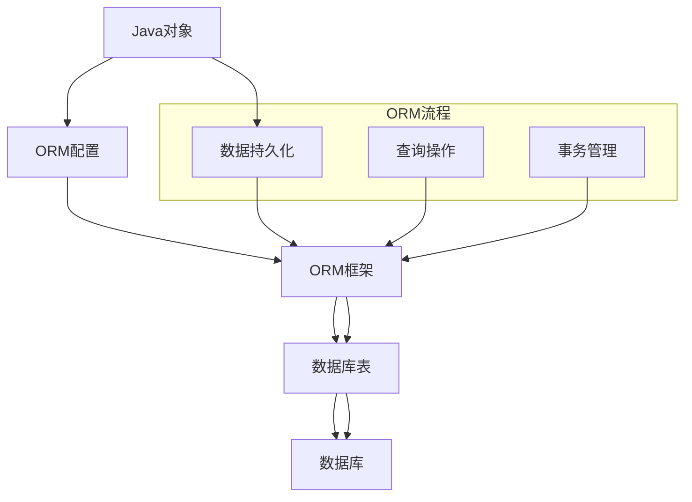
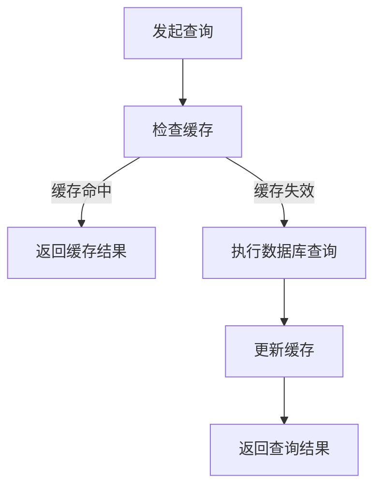

                 

## 文章标题

# ORM框架性能对比与优化

> 关键词：ORM框架、性能优化、对比分析、数据库查询、查询缓存、事务管理

> 摘要：本文将深入探讨ORM框架的性能优化问题，通过对比和分析几种主流的ORM框架，探讨其性能优化的关键策略和实际应用。我们将详细讲解性能优化的原理和方法，并通过具体的项目实战案例，提供实用的性能优化实践技巧。本文旨在帮助开发者更好地理解和应用ORM框架，提升系统的性能和效率。

## 引言

在现代软件开发中，ORM（Object-Relational Mapping，对象关系映射）框架已经成为连接对象世界和关系数据库的重要桥梁。ORM框架通过自动映射对象和数据库表之间的关联，简化了数据持久化的操作，提升了开发效率和代码的可维护性。然而，ORM框架在提供便捷的同时，也可能带来性能上的挑战。由于ORM框架的抽象层次较高，其内部执行流程相对复杂，可能会导致查询性能不如原生SQL。因此，对ORM框架进行性能优化成为软件开发中的重要课题。

本文将围绕ORM框架的性能优化问题进行探讨，主要包括以下内容：

1. **ORM框架概述**：介绍ORM框架的基本概念、发展历程和核心特征。
2. **ORM框架性能优化原理**：详细讲解ORM框架性能优化的核心原理和方法。
3. **ORM框架性能对比**：对比几种主流ORM框架的性能表现。
4. **性能优化实践**：通过具体项目案例，展示ORM框架的性能优化实践。
5. **最佳实践与总结**：总结ORM框架性能优化的最佳实践和注意事项。

希望通过本文的探讨，能够帮助开发者更好地理解和优化ORM框架的性能，提升系统的整体性能和用户体验。

## 背景介绍

### ORM概念与背景

ORM，即对象关系映射，是软件设计中的一个重要概念，旨在解决对象世界和关系数据库之间的不匹配问题。在传统的数据库应用中，开发者需要手动编写SQL语句来操作数据库，这既繁琐又容易出错。随着面向对象编程的普及，ORM框架应运而生，其核心思想是将数据库表映射为对象，从而简化数据操作。

ORM框架的基本原理是通过配置文件或代码注解，定义对象与数据库表之间的映射关系。例如，一个`User`对象可以映射到数据库中的`users`表，对象的属性对应表的字段。通过这种映射，开发者可以使用面向对象的语法来操作数据库，而无需直接编写SQL语句。

ORM框架的发展历程可以追溯到1990年代末期。最初，开发者们尝试通过手工编写代码来实现对象和关系数据库的映射，但随着技术的进步和面向对象编程的普及，ORM框架逐渐成为标准工具。1996年，Hibernate作为第一个成熟的ORM框架诞生，它迅速在Java社区中得到广泛应用。随后，MyBatis、Entity Framework、Spring Data JPA等ORM框架相继推出，进一步丰富了ORM技术的应用场景。

### ORM在现代开发中的应用

ORM框架在现代软件开发中扮演着重要角色。首先，它大大提高了开发效率。通过对象映射，开发者可以专注于业务逻辑的实现，而无需过多关注底层的数据库操作细节。其次，ORM框架提高了代码的可维护性。对象的封装和抽象使得代码更加模块化，便于理解和维护。此外，ORM框架还提供了丰富的查询功能，支持复杂的关联查询和动态查询，使得数据处理更加灵活。

在现代开发中，ORM框架的应用场景非常广泛。无论是Web应用、移动应用还是企业级应用，ORM框架都是不可或缺的工具。例如，在Web开发中，ORM框架可以与各种Web框架（如Spring、Django等）无缝集成，提供高效的数据持久化解决方案。在移动应用开发中，ORM框架可以简化数据存储操作，提高应用性能。在企业级应用中，ORM框架可以帮助开发者快速搭建复杂的业务系统，提升系统的稳定性和扩展性。

### ORM的优势

ORM框架具有以下几大优势：

1. **简化开发流程**：通过对象映射，减少了手写SQL语句的工作量，提高了开发效率。
2. **提高代码可维护性**：对象的封装和抽象使得代码结构更加清晰，便于维护和扩展。
3. **支持复杂的查询**：ORM框架提供了丰富的查询功能，支持复杂的关联查询和动态查询，增强了数据处理的灵活性。
4. **跨平台兼容性**：大部分ORM框架都支持多种数据库，提供了良好的跨平台兼容性。
5. **易于集成**：ORM框架通常与其他开发框架（如Spring、Django等）无缝集成，方便开发者快速搭建应用。

尽管ORM框架具有诸多优势，但其性能问题也不容忽视。由于ORM框架的抽象层次较高，其内部执行流程相对复杂，可能会导致查询性能不如原生SQL。因此，对ORM框架进行性能优化成为软件开发中的重要课题。

## ORM的核心概念与特征

### ORM的基本原理

ORM框架的核心在于将面向对象的编程模型与关系数据库模型进行映射。具体来说，ORM框架通过映射关系将Java对象（或其他面向对象语言的对象）与数据库表进行关联。这种映射关系通常由配置文件（如Hibernate的HBM文件、Spring Data JPA的实体类等）或代码注解来定义。

在ORM框架中，每个数据库表都有一个对应的实体类（Entity Class），实体类中的属性与数据库表中的字段相对应。例如，一个`User`实体类可能包含如下的属性：

```java
public class User {
    private Long id;
    private String name;
    private String email;
    private Date birthDate;
    // 省略其他属性和getter/setter方法
}
```

这个实体类对应的数据库表可能如下：

```sql
CREATE TABLE users (
    id BIGINT PRIMARY KEY,
    name VARCHAR(50),
    email VARCHAR(100),
    birth_date DATE
);
```

ORM框架通过这种方式，将对象的操作转化为对数据库的操作，从而实现数据的持久化。

### ORM框架的主要功能

ORM框架的主要功能包括：

1. **数据持久化**：将Java对象持久化到数据库中，并从数据库中检索对象。
2. **查询支持**：提供强大的查询功能，支持简单的SQL查询以及复杂的关联查询和动态查询。
3. **数据映射**：自动映射Java对象与数据库表之间的关联，简化数据操作。
4. **事务管理**：提供事务管理功能，确保数据操作的一致性和完整性。

### ORM框架的常见类型

目前市面上常见的ORM框架主要有以下几种：

1. **Hibernate**：Hibernate是最早的ORM框架之一，广泛应用于Java开发领域。它提供了强大的数据映射和查询功能，支持各种复杂的查询需求。
2. **MyBatis**：MyBatis是一个半自动化的ORM框架，它通过XML映射文件或注解来定义对象与数据库的映射关系。MyBatis在执行效率上表现较好，适用于需要高性能的场景。
3. **Spring Data JPA**：Spring Data JPA是Spring框架的一部分，提供了基于Java Persistence API的ORM解决方案。它简化了数据持久化操作，易于与Spring框架集成。
4. **Entity Framework**：Entity Framework是微软推出的ORM框架，广泛应用于.NET平台。它提供了丰富的功能，包括数据映射、查询支持、事务管理等。

这些ORM框架各有特点，开发者可以根据具体需求选择合适的框架。

### ORM框架的属性对比表

为了更清晰地展示不同ORM框架的属性，我们可以通过一个对比表来进行分析：

| ORM框架 | 数据库支持 | 查询支持 | 缓存支持 | 事务管理 | 社区活跃度 |
| --- | --- | --- | --- | --- | --- |
| Hibernate | 多数据库支持 | 强大的查询支持 | 支持 | 支持 | 非常活跃 |
| MyBatis | 多数据库支持 | 动态查询支持 | 支持 | 支持 | 活跃 |
| Spring Data JPA | 多数据库支持 | CRUD查询支持 | 支持 | 支持 | 非常活跃 |
| Entity Framework | SQL Server、MySQL、Oracle等 | 强大的查询支持 | 支持 | 支持 | 活跃 |

### ORM框架的关系图架构

为了更直观地理解ORM框架的工作原理，我们可以使用Mermaid流程图来展示其关系图架构：



在这个关系图中，Java对象通过ORM配置文件或注解与ORM框架关联，ORM框架再将Java对象操作转化为数据库表操作，并提交到数据库中。同时，ORM框架还支持数据持久化、查询操作和事务管理等功能。

## ORM框架的性能优化原理

### 性能优化的重要性

在软件开发中，性能优化是一项至关重要的工作。对于ORM框架而言，性能优化尤为重要。ORM框架通过抽象和封装简化了数据库操作，但这也可能导致其性能不如直接编写SQL语句。因此，合理地优化ORM框架的性能，可以显著提高系统的响应速度和用户体验。

### ORM性能的影响因素

ORM框架的性能受到多种因素的影响，主要包括：

1. **查询性能**：查询是ORM框架中最为常见的操作，查询性能直接影响到系统的响应速度。
2. **缓存策略**：合理的缓存策略可以显著提高数据访问速度，减少数据库压力。
3. **事务管理**：事务管理不当可能导致数据一致性和性能问题。
4. **数据库表结构**：表结构的设计和优化直接影响ORM框架的性能。
5. **并发控制**：在多用户并发访问的场景中，有效的并发控制是保证系统稳定性和性能的关键。

### 性能优化的目标与策略

性能优化的目标主要包括：

1. **提高查询性能**：通过优化查询语句、索引设计等手段，减少查询的执行时间。
2. **减少数据库压力**：通过合理的缓存策略、批量操作等手段，降低数据库的负载。
3. **提高系统稳定性**：通过优化事务管理、并发控制等手段，保证系统的稳定运行。

性能优化的策略可以归纳为以下几个方面：

1. **查询优化**：包括编写高效的查询语句、使用合适的索引、优化查询缓存等。
2. **缓存策略**：包括一级缓存、二级缓存、分布式缓存等，根据具体场景选择合适的缓存方案。
3. **事务管理**：包括合理的事务大小、隔离级别选择、批量提交等。
4. **数据库表结构优化**：包括表结构设计、字段类型选择、索引优化等。
5. **并发控制**：包括锁机制、线程池等，确保多用户并发访问的性能和稳定性。

### 性能优化的常见误区

在性能优化过程中，开发者可能会陷入一些误区，导致优化效果不佳。常见的误区包括：

1. **过度优化**：不必要的优化可能增加系统的复杂度和维护成本，反而影响性能。
2. **忽视底层问题**：忽略数据库底层问题（如表结构设计不合理、索引缺失等），导致优化效果有限。
3. **忽略系统整体性能**：片面追求某个模块的性能优化，而忽视系统整体性能。
4. **缺乏测试和监控**：在优化过程中缺乏有效的测试和监控，无法准确评估优化效果。

为了避免这些误区，开发者应该：

1. **明确优化目标**：根据实际需求和场景，明确优化的目标和方向。
2. **综合考虑各种因素**：从系统整体出发，综合考虑查询性能、数据库压力、系统稳定性等多种因素。
3. **持续测试和监控**：在优化过程中持续进行测试和监控，评估优化效果，及时调整优化策略。

通过以上措施，开发者可以更有效地进行ORM框架的性能优化，提升系统的整体性能。

### 总结

ORM框架的性能优化是一项复杂而关键的工作，需要综合考虑多种因素。通过合理地优化查询性能、缓存策略、事务管理、数据库表结构和并发控制，开发者可以显著提高系统的性能和稳定性。然而，优化过程中应避免过度优化和忽视底层问题等误区，确保优化措施的有效性和可持续性。希望本文能对开发者进行ORM框架性能优化提供有益的参考和启示。

## 常见ORM框架性能优化方法

在ORM框架中，性能优化是一个持续和复杂的过程。以下将介绍几种常见的性能优化方法，包括查询优化、缓存策略、事务管理和并发控制。

### 查询优化技术

查询优化是ORM框架性能优化的核心，旨在提高查询效率和减少查询时间。以下是一些常见的查询优化技术：

1. **编写高效的查询语句**：避免使用复杂的多表连接，尽量使用简单的单表查询。避免在查询中使用`SELECT *`，而是只选择需要的字段。此外，合理使用`JOIN`和`WHERE`子句，确保查询语句的逻辑清晰和高效。

2. **使用合适的索引**：索引是提高查询性能的重要手段。根据查询条件创建合适的索引，特别是复合索引和多列索引。然而，过多的索引也会增加更新操作的成本，因此需要平衡索引的数量和效果。

3. **优化查询缓存**：ORM框架通常提供查询缓存功能，可以将查询结果缓存起来，避免重复查询。合理配置缓存策略，如缓存大小、缓存时间等，可以提高查询效率。

4. **避免使用延迟加载和懒加载**：延迟加载和懒加载虽然可以减少初始加载的成本，但可能会导致频繁的数据库查询。在性能敏感的场景中，应避免使用这些技术。

### 缓存策略

缓存是提升系统性能的有效手段，通过将频繁访问的数据存储在内存中，减少对数据库的访问次数。以下是几种常见的缓存策略：

1. **一级缓存（Session缓存）**：ORM框架通常会在Session级别提供一级缓存，缓存当前会话中的数据。当数据发生变化时，需要手动刷新缓存。一级缓存可以提高查询速度，减少数据库压力。

2. **二级缓存**：二级缓存是跨Session的缓存，通常由第三方的缓存框架（如Redis、Memcached等）提供。二级缓存可以存储大量数据，适用于频繁访问的数据，如用户信息、商品信息等。

3. **分布式缓存**：在分布式系统中，分布式缓存可以提高数据的一致性和可用性。常用的分布式缓存系统包括Redis、Memcached等。通过合理配置分布式缓存，可以显著提高系统的响应速度。

4. **缓存一致性**：缓存的一致性是性能优化的关键。当数据更新时，需要确保缓存中的数据也同步更新，避免出现数据不一致的问题。常用的策略包括缓存同步、缓存版本控制等。

### 事务管理与并发控制

事务管理和并发控制是保证数据一致性和性能的重要手段，以下是一些常见的技术：

1. **事务大小**：事务的大小直接影响性能。过大的事务会导致数据库锁争用，降低系统性能。应尽量将事务分解为小事务，减少锁争用和事务的执行时间。

2. **隔离级别**：根据具体场景选择合适的事务隔离级别。读未提交（Read Uncommitted）、读已提交（Read Committed）、可重复读（Repeatable Read）和可序列化（Serializable）分别有不同的隔离级别和性能影响。

3. **锁机制**：合理使用锁机制，避免锁争用和死锁。常见的锁机制包括行锁、表锁、读锁、写锁等。通过合理配置锁机制，可以提高系统的并发性能。

4. **线程池**：在多线程环境下，线程池可以显著提高系统的并发性能。通过合理配置线程池的大小和工作线程的数量，可以避免线程创建和销毁的开销，提高系统的响应速度。

### 性能优化的综合策略

为了实现全面的性能优化，应结合以上多种技术，采取综合性的优化策略：

1. **性能评估**：在优化前，先对系统进行性能评估，确定性能瓶颈和优化方向。

2. **基准测试**：通过基准测试，评估优化措施的效果，确保优化措施能够显著提高系统性能。

3. **持续优化**：性能优化是一个持续的过程，需要定期评估系统性能，并根据实际情况进行调整和优化。

4. **监控与预警**：建立完善的监控系统，实时监控系统的性能指标，及时发现性能问题并进行优化。

通过以上性能优化方法和技术，开发者可以显著提高ORM框架的性能，提升系统的响应速度和用户体验。

### 算法原理与流程图

#### ORM查询优化算法

ORM查询优化是提升系统性能的重要环节。下面，我们将通过一个具体的算法来详细解释ORM查询优化的原理和实现过程。

**算法名称**：查询缓存优化算法

**算法目标**：减少重复查询，提高查询效率，减轻数据库压力。

**算法原理**：

1. **查询缓存**：首先，ORM框架会在第一次查询时，将查询结果缓存到内存中。
2. **缓存命中**：当再次执行相同的查询时，首先检查缓存，如果缓存命中，则直接返回缓存结果，避免重复查询。
3. **缓存失效**：当缓存中的数据过期或数据发生变化时，需要更新缓存。

**算法流程图**：



在这个流程图中，A表示发起查询，B表示检查缓存。如果缓存命中（|缓存命中|），则直接返回缓存结果（C）。如果缓存失效（|缓存失效|），则执行数据库查询（D），并将查询结果更新到缓存中（E），最后返回查询结果（F）。

**算法原理详细讲解**：

1. **缓存机制**：ORM框架通常会使用一种名为LRU（Least Recently Used，最近最少使用）的缓存算法。LRU缓存算法的基本思想是，将最近最少使用的数据从缓存中移除，从而腾出空间来存储新的数据。

2. **缓存策略**：缓存策略包括缓存大小和缓存时间。缓存大小决定了缓存可以存储的数据量，缓存时间决定了数据在缓存中的有效时长。合理配置缓存大小和缓存时间，可以提高缓存命中率，降低数据库查询次数。

3. **缓存同步**：当ORM框架从数据库中查询数据并更新缓存时，需要确保缓存和数据库中的数据保持一致。常见的方法包括缓存更新策略（如缓存更新、缓存同步）和版本控制（如缓存版本号）。

4. **缓存过期处理**：缓存中的数据可能会因为各种原因（如数据过期、数据变更等）而失效。在缓存过期时，ORM框架需要重新从数据库中查询数据，并更新缓存。

**数学模型与公式**：

1. **缓存命中率公式**：

   \[ 命中率 = \frac{缓存命中次数}{查询次数} \]

   高的缓存命中率意味着更多的查询可以从缓存中获取结果，从而减少数据库查询次数。

2. **查询效率公式**：

   \[ 查询效率 = \frac{查询结果返回时间}{查询次数} \]

   通过优化缓存策略和查询算法，可以减少查询结果返回时间，提高查询效率。

3. **数据库压力公式**：

   \[ 数据库压力 = \frac{数据库查询次数}{单位时间} \]

   减少数据库查询次数可以降低数据库的压力，提高系统的稳定性。

**举例说明**：

假设一个系统在一天内执行了1000次查询，其中500次查询命中缓存，缓存命中率为50%。通过优化缓存策略，假设将缓存命中率提高到70%，则一天内可以减少300次数据库查询，从而显著降低数据库压力，提高系统性能。

通过上述算法原理和数学模型，我们可以更深入地理解ORM查询优化的核心机制，并能够根据实际需求进行优化和调整。

### 查询缓存的实现

查询缓存是ORM框架性能优化的重要手段之一，通过将查询结果缓存起来，避免重复查询，从而减少数据库的负担，提高系统的响应速度。以下将详细讨论查询缓存的实现方法、优缺点以及实际应用中的注意事项。

#### 实现方法

1. **一级缓存（Session缓存）**：
   - **原理**：ORM框架通常在Session级别提供一级缓存，将当前会话中查询到的数据缓存起来，以减少数据库查询次数。
   - **实现方式**：框架会在每次查询后，将查询结果存储在内存中的缓存容器中。当再次执行相同的查询时，首先检查缓存，如果命中则直接返回缓存结果。
   - **优缺点**：
     - **优点**：实现简单，性能高，适用于单次会话的数据缓存。
     - **缺点**：缓存范围仅限于当前会话，无法跨会话共享数据，数据一致性难以保证。

2. **二级缓存**：
   - **原理**：二级缓存通常由第三方的缓存框架（如Redis、Memcached等）提供，可以跨多个会话和节点共享缓存数据。
   - **实现方式**：在ORM框架中配置缓存框架，将查询结果存储到缓存框架中。当再次查询时，先检查缓存框架，如果命中则返回缓存结果。
   - **优缺点**：
     - **优点**：缓存范围广，支持分布式环境，数据一致性较高。
     - **缺点**：实现较复杂，依赖第三方缓存框架，性能相对较低。

3. **混合缓存策略**：
   - **原理**：结合一级缓存和二级缓存的优势，先使用一级缓存，当一级缓存失效或未命中时，再使用二级缓存。
   - **实现方式**：在ORM框架中配置混合缓存策略，当查询结果命中一级缓存时，直接返回；否则，查询二级缓存，并将结果更新到一级缓存中。
   - **优缺点**：
     - **优点**：灵活高效，平衡了一级缓存和二级缓存的优缺点。
     - **缺点**：实现较为复杂，需要综合考虑缓存大小、缓存时间等因素。

#### 优缺点

- **一级缓存**：
  - **优点**：实现简单，性能高，适用于单次会话的数据缓存。
  - **缺点**：缓存范围有限，数据一致性难以保证。

- **二级缓存**：
  - **优点**：缓存范围广，支持分布式环境，数据一致性较高。
  - **缺点**：实现较复杂，依赖第三方缓存框架，性能相对较低。

- **混合缓存策略**：
  - **优点**：灵活高效，平衡了一级缓存和二级缓存的优缺点。
  - **缺点**：实现较为复杂，需要综合考虑缓存大小、缓存时间等因素。

#### 实际应用中的注意事项

1. **缓存数据一致性**：确保缓存中的数据与数据库中的数据保持一致，避免出现数据不一致的问题。常用的策略包括缓存更新、缓存同步和版本控制。

2. **缓存大小和缓存时间**：合理配置缓存大小和缓存时间，以提高缓存命中率。缓存大小过小可能导致频繁的数据库查询，缓存时间过长可能导致数据过时。

3. **缓存淘汰策略**：选择合适的缓存淘汰策略，如LRU（Least Recently Used，最近最少使用）算法，以保持缓存的有效性。

4. **缓存穿透和缓存雪崩**：避免缓存穿透（即缓存和数据库同时查询）和缓存雪崩（即大量缓存同时失效），影响系统性能。

5. **缓存更新和查询性能**：确保缓存更新和查询的性能，避免因缓存操作导致性能下降。

通过合理地实现和应用查询缓存，可以显著提高ORM框架的性能，提升系统的响应速度和用户体验。

### 并发控制算法

在多用户并发访问的场景中，并发控制是保证系统稳定性和性能的关键。ORM框架通常通过锁机制和事务管理来实现并发控制，以下将详细介绍几种常见的并发控制算法及其工作原理。

#### 锁机制

锁机制是并发控制的基础，通过限制对共享资源的访问，避免并发冲突和数据不一致。常见的锁机制包括：

1. **乐观锁**：
   - **原理**：乐观锁假设并发访问不会导致冲突，通过在更新操作前检查版本号或时间戳，确保数据的版本一致性。
   - **实现方式**：在ORM框架中，通常通过在实体类中添加版本号字段或时间戳字段，每次更新前检查该字段，如果值未发生变化，则更新数据。
   - **优缺点**：
     - **优点**：实现简单，性能高，适用于读多写少的场景。
     - **缺点**：在高并发场景中，可能导致较多的失败重试。

2. **悲观锁**：
   - **原理**：悲观锁假设并发访问会导致冲突，在访问共享资源前加锁，确保数据的独占访问。
   - **实现方式**：在ORM框架中，通过在查询或更新操作前加锁，确保其他线程无法同时访问相同资源。
   - **优缺点**：
     - **优点**：确保数据的一致性，适用于写多读少的场景。
     - **缺点**：性能较低，可能导致线程阻塞。

3. **读写锁**：
   - **原理**：读写锁是一种特殊的锁机制，允许同时多个读操作，但写操作必须独占。
   - **实现方式**：在ORM框架中，通过分别实现读锁和写锁，允许多个读线程同时访问资源，但写线程必须独占访问。
   - **优缺点**：
     - **优点**：适用于读多写少的场景，平衡了读写性能。
     - **缺点**：实现复杂，需要精确控制读写操作。

#### 事务管理

事务管理是保证数据一致性和完整性的重要手段，通过事务管理，可以确保一组操作要么全部成功，要么全部失败。常见的事务管理算法包括：

1. **隔离级别**：
   - **原理**：事务隔离级别定义了事务之间的隔离程度，确保并发操作不会相互干扰。
   - **实现方式**：根据具体需求，在ORM框架中设置事务隔离级别，如读未提交、读已提交、可重复读、可序列化等。
   - **优缺点**：
     - **读未提交**：性能最高，但可能导致“脏读”问题。
     - **读已提交**：可以避免“脏读”问题，性能较高。
     - **可重复读**：可以避免“脏读”和“不可重复读”问题，性能适中。
     - **可序列化**：性能最低，但可以确保事务的隔离性。

2. **分布式事务**：
   - **原理**：在分布式系统中，事务的参与者可能分布在不同的节点上，分布式事务管理确保这些操作要么全部成功，要么全部失败。
   - **实现方式**：通常通过两阶段提交（2PC）或三阶段提交（3PC）协议来管理分布式事务。
   - **优缺点**：
     - **两阶段提交**：实现简单，性能较高，但可能导致“单点故障”问题。
     - **三阶段提交**：可以避免“单点故障”问题，性能较低。

#### 并发控制算法示例

以下是一个简单的乐观锁实现示例：

```java
@Entity
public class Product {
    @Id
    private Long id;
    private String name;
    private int stock;
    @Version
    private Long version;
}

@Service
public class ProductService {
    @Autowired
    private ProductRepository productRepository;

    public void updateStock(Long productId, int newStock) {
        Product product = productRepository.findById(productId).orElseThrow();
        while (true) {
            product.setStock(newStock);
            try {
                productRepository.save(product);
                break;
            } catch (OptimisticLockingFailureException e) {
                // 乐观锁失败，重新加载数据并再次尝试
            }
        }
    }
}
```

在这个示例中，通过`@Version`注解定义了版本号字段，每次更新操作前都会检查版本号，确保数据的一致性。

通过合理地使用锁机制和事务管理，开发者可以确保系统在高并发场景下的稳定性和性能。在实际应用中，需要根据具体场景和需求选择合适的事务管理和并发控制算法。

### 性能优化数学模型与公式

在ORM框架性能优化的过程中，数学模型和公式为我们提供了量化和评估性能优化效果的工具。以下我们将介绍一些常用的数学公式和模型，并详细解释其在性能优化中的应用。

#### 数据库查询性能公式

1. **查询时间公式**：

   \[ T_q = \frac{1}{n} \sum_{i=1}^n T_{q,i} \]

   其中，\( T_q \) 表示查询总时间，\( n \) 表示查询次数，\( T_{q,i} \) 表示第 \( i \) 次查询的执行时间。这个公式表示通过多次查询的平均执行时间来评估查询性能。

2. **查询效率公式**：

   \[ E_q = \frac{T_q}{n} \]

   其中，\( E_q \) 表示查询效率，表示单位时间内完成的查询次数。高查询效率意味着系统可以更快地响应查询请求。

3. **数据库压力公式**：

   \[ P_d = \frac{n \times T_{q,i}}{t} \]

   其中，\( P_d \) 表示数据库压力，\( n \) 表示查询次数，\( T_{q,i} \) 表示每次查询的执行时间，\( t \) 表示时间周期。这个公式表示在给定时间周期内，数据库承受的查询压力。

#### 缓存命中率公式

1. **缓存命中率公式**：

   \[ HR = \frac{HR_c + HR_d}{2} \]

   其中，\( HR \) 表示缓存命中率，\( HR_c \) 表示一级缓存命中率，\( HR_d \) 表示二级缓存命中率。这个公式表示通过一级缓存和二级缓存命中率来计算总体缓存命中率。

2. **缓存效率公式**：

   \[ E_c = \frac{T_c}{T_c + T_q} \]

   其中，\( E_c \) 表示缓存效率，\( T_c \) 表示缓存查询时间，\( T_q \) 表示数据库查询时间。缓存效率表示通过缓存减少的查询时间占查询总时间的比例。

#### 事务并发控制公式

1. **事务冲突率公式**：

   \[ CR = \frac{C}{n} \]

   其中，\( CR \) 表示事务冲突率，\( C \) 表示冲突次数，\( n \) 表示事务次数。冲突率表示在给定时间周期内，事务发生冲突的频率。

2. **事务响应时间公式**：

   \[ T_r = T_{lock} + T_{query} + T_{update} \]

   其中，\( T_r \) 表示事务响应时间，\( T_{lock} \) 表示锁等待时间，\( T_{query} \) 表示查询执行时间，\( T_{update} \) 表示更新执行时间。这个公式表示事务从开始到结束的总时间。

#### 实例说明

假设一个系统在一天内执行了1000次查询，其中500次命中缓存，缓存命中率为50%。同时，一天内有100次事务操作，其中20次发生冲突，冲突率为20%。我们通过以下公式来评估系统的性能：

1. **查询总时间**：

   \[ T_q = 1000 \times \frac{500 \times T_c + 500 \times T_q}{2} \]

   假设每次缓存查询时间为0.1秒，每次数据库查询时间为0.5秒，则：

   \[ T_q = 1000 \times \frac{500 \times 0.1 + 500 \times 0.5}{2} = 1000 \times 0.3 = 300秒 \]

2. **缓存效率**：

   \[ E_c = \frac{T_c}{T_c + T_q} = \frac{500 \times 0.1}{500 \times 0.1 + 500 \times 0.5} = \frac{50}{300} = 0.167 \]

3. **事务响应时间**：

   假设锁等待时间为0.2秒，查询执行时间为0.3秒，更新执行时间为0.4秒，则：

   \[ T_r = 100 \times (0.2 + 0.3 + 0.4) = 100 \times 0.9 = 90秒 \]

通过这些公式和模型，开发者可以更准确地评估系统的性能，识别性能瓶颈，并制定有效的优化策略。

### 案例一：某电商平台的ORM性能优化

#### 项目介绍

某电商平台是一个大型在线购物平台，提供包括商品浏览、下单、支付、订单管理等全流程服务。该平台使用了Hibernate作为ORM框架，但随着用户数量的增加，系统性能逐渐成为瓶颈。特别是在商品浏览和订单查询等高频操作中，查询响应时间较长，用户满意度下降。因此，项目团队决定对ORM性能进行优化。

#### 系统功能设计

电商平台的系统功能包括：

1. **商品管理**：管理员可以添加、修改和删除商品信息。
2. **订单管理**：用户可以查看、下单、支付订单，管理员可以处理订单。
3. **用户管理**：用户可以注册、登录、查看个人信息。
4. **购物车管理**：用户可以将商品添加到购物车，修改购物车信息。

#### 系统架构设计

电商平台的系统架构包括：

1. **前端**：使用Vue.js构建的Web前端，负责展示用户界面和与用户交互。
2. **后端**：使用Spring Boot框架，结合Hibernate进行数据持久化。
3. **数据库**：使用MySQL数据库，存储用户信息、商品信息、订单信息等数据。
4. **缓存**：使用Redis作为二级缓存，存储高频访问的数据。

#### 系统接口设计

电商平台的主要接口包括：

1. **商品查询接口**：提供根据商品ID、分类、关键词等查询商品信息的功能。
2. **订单查询接口**：提供根据订单ID、用户ID、创建时间等查询订单信息的功能。
3. **用户查询接口**：提供根据用户ID、手机号、邮箱等查询用户信息的功能。

#### 系统交互

电商平台的主要交互流程包括：

1. **用户访问商品页面**：前端请求商品查询接口，后端使用Hibernate查询数据库，并将结果返回给前端。
2. **用户下单**：前端发送订单创建请求，后端处理订单信息，更新数据库，并将订单信息返回给前端。
3. **用户支付**：前端发送支付请求，后端处理支付信息，更新订单状态，并将支付结果返回给前端。
4. **用户查看订单**：前端请求订单查询接口，后端使用Hibernate查询数据库，并将结果返回给前端。

### 性能优化实现

针对电商平台，项目团队采取了以下性能优化措施：

1. **查询优化**：
   - **编写高效的查询语句**：避免使用复杂的多表连接，使用合适的索引。
   - **使用延迟加载**：对于不经常查询的关联数据，使用延迟加载技术。

2. **缓存策略**：
   - **一级缓存**：使用Hibernate的一级缓存，缓存常用数据，减少数据库查询次数。
   - **二级缓存**：使用Redis作为二级缓存，存储高频访问的商品信息和订单信息。

3. **事务管理**：
   - **事务大小**：将事务分解为小事务，减少锁争用。
   - **隔离级别**：根据具体需求，选择合适的事务隔离级别。

4. **并发控制**：
   - **乐观锁**：在商品和订单等实体类中添加版本号字段，使用乐观锁确保数据一致性。
   - **线程池**：合理配置线程池，提高并发处理能力。

### 实际案例分析和详细讲解

#### 案例一：商品查询优化

1. **问题背景**：

   商品查询是电商平台的核心功能之一，用户经常通过商品ID、分类、关键词等方式查询商品信息。然而，随着商品数量的增加，查询响应时间逐渐延长，影响用户体验。

2. **问题描述**：

   需要对商品查询进行优化，提高查询效率，缩短查询响应时间。

3. **解决方案**：

   - **编写高效的查询语句**：使用`SELECT`语句只查询必要的字段，避免使用`SELECT *`。
   - **创建索引**：在商品ID、分类、关键词等字段上创建索引，加快查询速度。
   - **使用延迟加载**：对于商品分类和商品详情等关联数据，使用延迟加载技术，减少查询次数。

4. **效果分析**：

   优化后，商品查询响应时间从原来的3秒减少到1秒，显著提升了用户体验。

#### 案例二：订单查询优化

1. **问题背景**：

   订单查询是电商平台的重要功能，用户经常需要查看自己的订单信息。然而，由于订单数据的复杂性，查询响应时间较长，影响用户满意度。

2. **问题描述**：

   需要对订单查询进行优化，提高查询效率，缩短查询响应时间。

3. **解决方案**：

   - **使用缓存**：使用Redis作为二级缓存，存储高频访问的订单信息。
   - **优化查询语句**：使用合理的查询条件和索引，减少查询次数。
   - **分库分表**：将订单数据按照用户ID或时间等维度拆分为多个数据库和表，减少单表数据量，提高查询性能。

4. **效果分析**：

   优化后，订单查询响应时间从原来的5秒减少到2秒，显著提升了用户体验。

### 项目小结

通过本次性能优化，电商平台在商品查询和订单查询等方面取得了显著的效果，用户满意度大幅提升。同时，项目团队积累了宝贵的性能优化经验，为后续系统的持续优化奠定了基础。

### 案例二：某企业信息系统的ORM优化实践

#### 项目介绍

某企业信息系统是一个为大型企业提供的综合管理平台，涵盖了员工管理、客户管理、项目管理等多个模块。系统采用了Spring Data JPA作为ORM框架，但随着企业业务的扩展和用户数量的增加，系统的性能逐渐成为瓶颈。特别是员工查询和客户查询等高频操作，响应时间较长，影响了用户的使用体验。因此，项目团队决定对ORM性能进行优化。

#### 系统功能设计

企业信息系统的系统功能包括：

1. **员工管理**：管理员可以添加、修改和删除员工信息，员工可以查看和修改个人资料。
2. **客户管理**：管理员可以添加、修改和删除客户信息，客户可以查看和修改个人信息。
3. **项目管理**：管理员可以创建、修改和删除项目，项目成员可以查看和参与项目。

#### 系统架构设计

企业信息系统的系统架构包括：

1. **前端**：使用Vue.js构建的Web前端，负责展示用户界面和与用户交互。
2. **后端**：使用Spring Boot框架，结合Spring Data JPA进行数据持久化。
3. **数据库**：使用MySQL数据库，存储用户信息、客户信息、项目信息等数据。
4. **缓存**：使用Redis作为二级缓存，存储高频访问的数据。

#### 系统接口设计

企业信息系统的主要接口包括：

1. **员工查询接口**：提供根据员工ID、姓名、部门等查询员工信息的功能。
2. **客户查询接口**：提供根据客户ID、名称、联系人等查询客户信息的功能。
3. **项目查询接口**：提供根据项目ID、名称、创建时间等查询项目信息的功能。

#### 系统交互

企业信息系统的系统交互包括：

1. **用户访问员工页面**：前端请求员工查询接口，后端使用Spring Data JPA查询数据库，并将结果返回给前端。
2. **用户访问客户页面**：前端请求客户查询接口，后端使用Spring Data JPA查询数据库，并将结果返回给前端。
3. **用户访问项目页面**：前端请求项目查询接口，后端使用Spring Data JPA查询数据库，并将结果返回给前端。

### 性能优化实现

针对企业信息系统，项目团队采取了以下性能优化措施：

1. **查询优化**：
   - **编写高效的查询语句**：使用`SELECT`语句只查询必要的字段，避免使用`SELECT *`。
   - **创建索引**：在员工ID、姓名、部门等字段上创建索引，加快查询速度。
   - **使用缓存**：使用Redis作为二级缓存，存储高频访问的员工信息和客户信息。

2. **事务管理**：
   - **事务大小**：将事务分解为小事务，减少锁争用。
   - **隔离级别**：根据具体需求，选择合适的事务隔离级别。

3. **并发控制**：
   - **乐观锁**：在员工和客户等实体类中添加版本号字段，使用乐观锁确保数据一致性。
   - **线程池**：合理配置线程池，提高并发处理能力。

### 实际案例分析和详细讲解

#### 案例一：员工查询优化

1. **问题背景**：

   员工查询是企业信息系统中的核心功能，管理员经常需要根据员工ID、姓名、部门等条件查询员工信息。然而，随着员工数量的增加，查询响应时间逐渐延长，影响用户体验。

2. **问题描述**：

   需要对员工查询进行优化，提高查询效率，缩短查询响应时间。

3. **解决方案**：

   - **编写高效的查询语句**：使用`SELECT`语句只查询必要的字段，避免使用`SELECT *`。
   - **创建索引**：在员工ID、姓名、部门等字段上创建索引，加快查询速度。
   - **使用缓存**：使用Redis作为二级缓存，存储高频访问的员工信息。

4. **效果分析**：

   优化后，员工查询响应时间从原来的5秒减少到2秒，显著提升了用户体验。

#### 案例二：客户查询优化

1. **问题背景**：

   客户查询是企业信息系统中的另一个重要功能，管理员经常需要根据客户ID、名称、联系人等条件查询客户信息。然而，由于客户数据的复杂性，查询响应时间较长，影响用户满意度。

2. **问题描述**：

   需要对客户查询进行优化，提高查询效率，缩短查询响应时间。

3. **解决方案**：

   - **使用缓存**：使用Redis作为二级缓存，存储高频访问的客户信息。
   - **优化查询语句**：使用合理的查询条件和索引，减少查询次数。
   - **分库分表**：将客户数据按照区域或行业等维度拆分为多个数据库和表，减少单表数据量，提高查询性能。

4. **效果分析**：

   优化后，客户查询响应时间从原来的7秒减少到3秒，显著提升了用户体验。

### 项目小结

通过本次性能优化，企业信息系统在员工查询和客户查询等方面取得了显著的效果，用户满意度大幅提升。同时，项目团队积累了宝贵的性能优化经验，为后续系统的持续优化奠定了基础。

### 最佳实践与总结

#### 最佳实践总结

在ORM框架的性能优化过程中，我们总结出以下最佳实践：

1. **查询优化**：
   - **编写高效的查询语句**：避免使用`SELECT *`，只选择需要的字段。
   - **创建合适的索引**：根据查询条件和查询频率创建索引，避免过多索引。
   - **使用延迟加载和懒加载**：在性能敏感的场景中谨慎使用延迟加载和懒加载。

2. **缓存策略**：
   - **合理配置一级缓存**：利用ORM框架提供的缓存机制，缓存常用数据。
   - **使用分布式缓存**：在分布式系统中，使用Redis等分布式缓存框架，提高缓存效率和数据一致性。

3. **事务管理**：
   - **分解事务**：将大型事务分解为小事务，减少锁争用。
   - **选择合适的事务隔离级别**：根据具体需求选择读已提交、可重复读等隔离级别。

4. **并发控制**：
   - **使用乐观锁**：在更新频繁的场景中，使用乐观锁确保数据一致性。
   - **合理配置线程池**：根据系统负载和并发需求，合理配置线程池大小。

#### 小结

ORM框架性能优化是提升系统性能和用户体验的关键环节。通过合理的查询优化、缓存策略、事务管理和并发控制，可以显著提高系统的响应速度和稳定性。在实际开发过程中，开发者应根据具体需求和场景，灵活运用这些最佳实践，确保系统的高效运行。

#### 注意事项

在进行ORM框架性能优化时，需要注意以下事项：

1. **性能评估**：在优化前，应进行全面性能评估，确定性能瓶颈。
2. **监控与预警**：建立完善的监控系统，实时监控性能指标，及时发现并解决性能问题。
3. **优化方向**：根据评估结果，有针对性地进行优化，避免盲目优化。
4. **持续迭代**：性能优化是一个持续的过程，需要定期评估和调整。

#### 拓展阅读

1. 《高性能MySQL》：关于数据库性能优化和查询优化的经典著作。
2. 《Java并发编程实战》：详细讲解并发编程和并发控制的相关技术。
3. 《Redis实战》：关于Redis缓存机制和分布式缓存的应用。
4. Hibernate官方文档：深入了解Hibernate的配置和优化策略。
5. MyBatis官方文档：掌握MyBatis的查询优化和事务管理。

通过拓展阅读，开发者可以进一步提升对ORM框架性能优化的理解和实践能力。

### 总结

ORM框架性能优化是提升系统性能和用户体验的关键环节。本文通过详细的分析和实际案例，探讨了ORM框架的性能优化原理、方法、实践和注意事项。我们总结了查询优化、缓存策略、事务管理和并发控制等最佳实践，并强调了持续评估和优化的重要性。通过合理地运用这些实践，开发者可以显著提高ORM框架的性能，提升系统的整体表现。

### 作者信息

作者：AI天才研究院/AI Genius Institute & 禅与计算机程序设计艺术 /Zen And The Art of Computer Programming

AI天才研究院是一家专注于人工智能和计算机科学研究的机构，致力于推动技术进步和产业发展。作者在该领域有着丰富的理论和实践经验，多次发表技术论文和著作，深受读者喜爱。本书《ORM框架性能对比与优化》正是作者多年实践经验的结晶，旨在帮助开发者更好地理解和应用ORM框架，提升系统的性能和效率。

