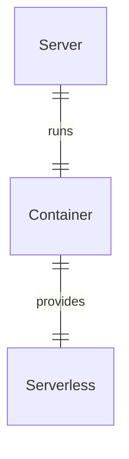
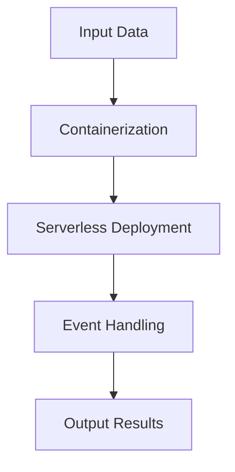
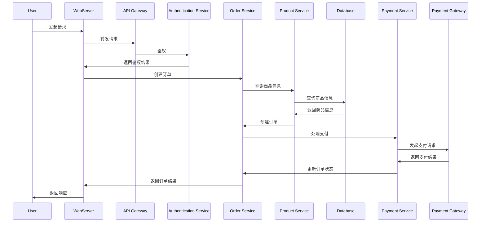
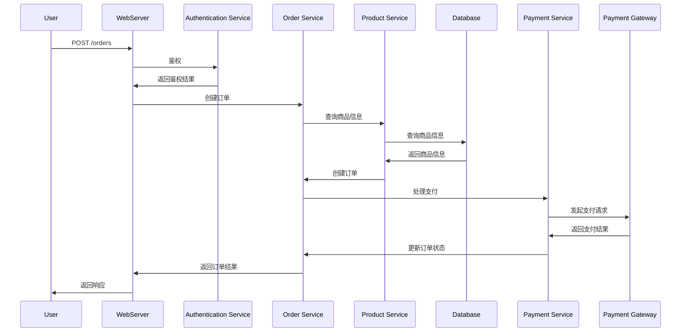
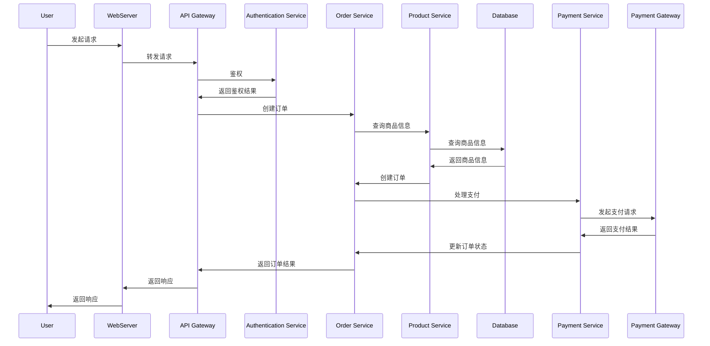

                 

### 文章标题

> 关键词：Serverless、容器技术、无服务器计算、微服务架构、事件驱动应用、算法原理

> 摘要：本文将深入探讨Serverless容器技术，通过逐步分析其背景、核心概念、算法原理以及系统分析与架构设计方案，帮助读者全面理解这一前沿技术，并在实际项目中应用。

----------------------------------------------------------------

## 第一部分：背景介绍

### 第1章：Serverless容器技术概述

#### 1.1 问题背景

**问题提出**：随着云计算和微服务架构的普及，如何更好地管理和部署微服务成为关键问题。

在传统的服务器管理方式中，开发者需要手动配置和运维服务器，不仅繁琐且容易出错。而随着业务的不断扩展，服务器数量也不断增加，管理难度也随之增大。同时，服务器资源的利用率往往不高，导致资源浪费。

**问题描述**：传统的服务器管理方式存在以下问题：

- **配置和维护复杂**：需要手动配置服务器，并进行监控、备份和升级等维护工作。
- **资源利用率低**：服务器资源往往不能充分利用，造成资源浪费。
- **扩展性差**：当业务量增加时，服务器数量需要手动增加，扩展性差。

**问题解决**：为了解决上述问题，容器技术和Serverless计算模式应运而生。

**边界与外延**：Serverless容器技术不仅涵盖了云计算、微服务、容器化部署等多个领域，还与其他技术如事件驱动架构、API网关、容器编排工具等紧密相关。

**概念结构与核心要素组成**：

- **核心概念**：Serverless、容器技术、无服务器计算、微服务架构、容器化部署。
- **技术架构**：容器引擎（如Docker）、Serverless平台（如AWS Lambda、Google Cloud Functions）。
- **实现原理**：通过容器化应用程序，在无服务器环境中运行。
- **最佳实践**：合理选择容器镜像、优化容器性能、使用事件驱动架构等。

#### 1.2 服务器管理方式的演变

**早期阶段**：在计算机发展的早期，开发者需要手动购买、配置和运维物理服务器。这种方式不仅繁琐，且容易出现配置错误。

**虚拟化阶段**：随着虚拟化技术的出现，开发者可以通过虚拟机来管理服务器。虚拟机虽然提高了资源利用率，但仍然需要手动配置和运维。

**容器化阶段**：容器技术（如Docker）的出现，进一步简化了服务器管理。容器提供了一种轻量级、可执行的沙盒环境，使开发者无需关心服务器管理，从而专注于业务逻辑的实现。

**Serverless阶段**：Serverless容器技术则将容器化与无服务器计算相结合，进一步简化了服务器管理。开发者无需关注服务器和容器的细节，只需编写和部署代码即可。

#### 1.3 Serverless容器技术的优势

**无需服务器管理**：开发者无需关注服务器和容器的细节，只需编写和部署代码。

**高效资源利用**：容器技术使服务器资源得以充分利用，避免了资源浪费。

**灵活的扩展性**：容器和Serverless技术支持水平扩展，当业务量增加时，可以轻松扩展服务器和容器数量。

**易于集成**：Serverless容器技术可以与其他云计算服务（如API网关、数据库）和容器编排工具（如Kubernetes）无缝集成。

**降低成本**：通过优化服务器资源利用和减少运维成本，Serverless容器技术有助于降低总体成本。

### 第2章：核心概念与联系

#### 2.1 核心概念原理

**Serverless**：Serverless是一种计算模式，它允许开发者无需管理服务器即可运行代码。在Serverless架构中，云计算服务提供商（如AWS、Google Cloud）负责管理服务器和容器，开发者只需关注代码编写和部署。

**容器技术**：容器是一种轻量级、可执行的沙盒环境，用于封装应用程序及其依赖。容器提供了一种隔离的运行环境，使应用程序可以在不同的操作系统和硬件环境中运行。

#### 2.2 概念属性特征对比表格

| 概念       | Serverless                   | 容器技术                                      |
|------------|------------------------------|------------------------------------------------|
| **定义**   | 无服务器计算模式             | 轻量级虚拟化技术                             |
| **特点**   | 无需管理服务器               | 高效、可移植、隔离性                         |
| **适用场景** | 事件驱动应用、微服务架构     | 容器化部署、持续集成与部署                   |

#### 2.3 ER实体关系图架构



## 第二部分：算法原理讲解

### 第3章：算法原理讲解

#### 3.1 算法mermaid流程图



#### 3.2 Python源代码示例

```python
# Python源代码示例：容器化与Serverless部署流程

# 容器化代码
def containerize_app(app_image):
    # 容器化应用程序
    container = docker.from_env()
    container.run(app_image)

# Serverless部署代码
def deploy_to_serverless(container_id, event):
    # 部署容器到Serverless平台
    serverless = Serverless()
    serverless.deploy(container_id, event)

# 主函数
def main():
    app_image = "my_app:latest"
    event = {"data": "Hello, World!"}
    
    containerize_app(app_image)
    deploy_to_serverless(app_image, event)

if __name__ == "__main__":
    main()
```

#### 3.3 算法原理的数学模型和公式

- **容器化成本公式**：\(C_c = f(\text{CPU}, \text{Memory}, \text{Storage})\)

- **Serverless成本公式**：\(C_s = f(\text{Requests}, \text{Duration}, \text{Resource Utilization})\)

#### 3.4 详细讲解和举例说明

**详细讲解**：

Serverless容器技术通过容器化应用程序，使其可以在无服务器环境中运行。具体步骤如下：

1. **容器化**：将应用程序及其依赖打包成容器镜像。
2. **部署**：将容器镜像部署到Serverless平台。
3. **事件处理**：当有事件触发时，Serverless平台调用容器中的应用程序。
4. **输出结果**：应用程序处理完事件后，输出结果。

**举例说明**：

假设有一个简单的Web应用程序，通过Serverless容器技术部署，实现了一个基于HTTP请求的响应。

1. **容器化**：使用Docker将Web应用程序打包成容器镜像。

```shell
docker build -t my_app .
```

2. **部署**：将容器镜像部署到AWS Lambda。

```python
import boto3

client = boto3.client('lambda')

# 上传容器镜像到AWS Elastic Container Registry
response = client.create_presigned_url(
    Action='put_image',
    Bucket='my_bucket',
    Key='my_app.tar.gz',
    ExpiresIn=3600
)

# 上传容器镜像
with open('my_app.tar.gz', 'rb') as f:
    client.upload_fileobj(f, 'my_bucket', 'my_app.tar.gz')

# 部署容器镜像到AWS Lambda
client.create_function(
    FunctionName='my_function',
    Runtime='python3.8',
    ImageUri=response['PresignedUrl'],
    Handler='my_app.handler'
)
```

3. **事件处理**：当有HTTP请求到达时，AWS Lambda调用容器中的Web应用程序。

4. **输出结果**：Web应用程序处理完请求后，返回响应。

```python
from flask import Flask, request, jsonify

app = Flask(__name__)

@app.route('/')
def hello():
    return jsonify({"message": "Hello, World!"})

if __name__ == '__main__':
    app.run(host='0.0.0.0', port=8080)
```

通过以上示例，可以看出Serverless容器技术如何将容器化应用程序部署到无服务器环境中，并处理外部事件。

## 第三部分：系统分析与架构设计方案

### 第4章：问题场景介绍

在现代软件开发中，随着业务需求的不断增长，传统的服务器管理方式已无法满足高效、灵活和可扩展的需求。因此，本文将介绍一个典型的应用场景——在线购物平台，并探讨如何利用Serverless容器技术解决其中的服务器管理问题。

**应用场景**：在线购物平台需要提供高性能、高可用的Web服务，同时要支持大量用户同时在线访问。此外，平台还需要支持各种业务功能，如商品搜索、购物车管理、订单处理等。传统的服务器管理方式在这种场景下存在以下问题：

1. **服务器配置与维护**：需要手动配置和运维大量的服务器，增加运维成本和工作量。
2. **扩展性差**：当用户量增加时，服务器数量需要手动增加，扩展性差。
3. **资源利用率低**：服务器资源往往不能充分利用，导致资源浪费。
4. **安全性**：需要确保服务器和应用程序的安全，防止数据泄露和恶意攻击。

### 第5章：项目介绍

为了解决上述问题，我们选择使用Serverless容器技术来构建在线购物平台。以下是我们项目的总体目标：

1. **自动化服务器管理**：通过容器化和Serverless技术，实现自动化服务器管理，减少人工干预。
2. **高扩展性**：支持水平扩展，当用户量增加时，可以自动增加服务器和容器数量。
3. **高效资源利用**：通过优化服务器资源利用，避免资源浪费。
4. **安全性**：采用安全最佳实践，确保服务器和应用程序的安全。

### 第6章：系统功能设计（领域模型Mermaid类图）

在系统功能设计阶段，我们使用Mermaid类图来表示系统的领域模型。以下是一个简化的领域模型：

```mermaid
classDiagram
    User <|-- Order
    User <|-- Cart
    Product <|-- Order
    Product <|-- Cart
    Order << (Payment)
    Cart << (Payment)
    Payment { amount }
    User { id username password email }
    Product { id name price }
    Order { id user_id product_ids status }
    Cart { id user_id product_ids total }
```

在这个领域模型中，我们定义了以下实体：

- **User**：表示用户，具有id、username、password、email等属性。
- **Order**：表示订单，具有id、user_id、product_ids、status等属性，与Payment实体关联。
- **Cart**：表示购物车，具有id、user_id、product_ids、total等属性，与Payment实体关联。
- **Product**：表示商品，具有id、name、price等属性，与Order和Cart实体关联。
- **Payment**：表示支付，具有amount属性，与Order和Cart实体关联。

### 第7章：系统架构设计（Mermaid架构图）

在系统架构设计阶段，我们使用Mermaid架构图来表示系统的整体架构。以下是一个简化的系统架构：



在这个系统架构中，我们定义了以下组件：

- **WebServer**：负责处理用户请求，并转发请求到其他服务。
- **API Gateway**：作为系统入口，负责转发请求到相应的服务。
- **Authentication Service**：负责用户鉴权。
- **Order Service**：负责处理订单相关操作。
- **Product Service**：负责处理商品相关操作。
- **Payment Service**：负责处理支付相关操作。
- **Payment Gateway**：负责与第三方支付平台交互。
- **Database**：存储系统数据。

### 第8章：系统接口设计（Mermaid序列图）

在系统接口设计阶段，我们使用Mermaid序列图来表示系统中的接口交互。以下是一个简化的接口设计：



在这个接口设计中，我们定义了以下接口：

- **POST /orders**：创建订单接口，接收用户订单信息，并返回订单结果。
- **GET /orders/{order_id}**：查询订单接口，根据订单ID查询订单信息，并返回订单详情。
- **POST /payments**：处理支付接口，接收支付请求，并返回支付结果。

### 第9章：系统交互（Mermaid序列图）

在系统交互设计阶段，我们使用Mermaid序列图来表示系统组件之间的交互。以下是一个简化的系统交互设计：



在这个系统交互设计中，我们定义了以下组件：

- **User**：表示用户，发起请求并接收响应。
- **WebServer**：负责处理用户请求，转发请求到其他服务，并返回响应。
- **API Gateway**：作为系统入口，负责转发请求到相应的服务。
- **Authentication Service**：负责用户鉴权。
- **Order Service**：负责处理订单相关操作。
- **Product Service**：负责处理商品相关操作。
- **Payment Service**：负责处理支付相关操作。
- **Payment Gateway**：负责与第三方支付平台交互。
- **Database**：存储系统数据。

通过以上系统分析与架构设计方案，我们可以看到Serverless容器技术在构建在线购物平台中的强大应用。接下来，我们将进入项目实战部分，详细介绍如何在实际项目中应用Serverless容器技术。

## 第四部分：项目实战

### 第10章：环境安装

在开始项目实战之前，我们需要安装一些必要的软件和工具。以下是所需的软件和工具及其安装方法：

1. **Docker**：用于容器化应用程序。在Linux和MacOS系统中，可以使用以下命令安装：

```shell
sudo apt-get update
sudo apt-get install docker.io
```

2. **AWS CLI**：用于与AWS服务进行交互。在Linux和MacOS系统中，可以使用以下命令安装：

```shell
pip install awscli
```

3. **AWS Lambda**：用于部署Serverless应用程序。在Linux和MacOS系统中，可以使用以下命令安装：

```shell
pip install awscli
```

4. **Python 3**：用于编写应用程序。在大多数操作系统中，Python 3已经预装，如果没有，可以使用以下命令安装：

```shell
sudo apt-get install python3
```

5. **Flask**：用于构建Web应用程序。在Linux和MacOS系统中，可以使用以下命令安装：

```shell
pip3 install flask
```

### 第11章：系统核心实现源代码

在本项目中，我们使用Python和Flask框架来构建一个简单的Web应用程序。以下是系统核心实现的源代码：

```python
# app.py

from flask import Flask, request, jsonify
from flask_cors import CORS

app = Flask(__name__)
CORS(app)

@app.route('/')
def hello():
    return jsonify({"message": "Hello, World!"})

@app.route('/orders', methods=['POST'])
def create_order():
    data = request.json
    # 处理订单逻辑
    return jsonify({"order_id": "123456", "status": "created"})

if __name__ == '__main__':
    app.run(host='0.0.0.0', port=8080)
```

在这个源代码中，我们定义了一个简单的Web应用程序，包括一个首页和一个创建订单的接口。

### 第12章：代码应用解读与分析

**代码解读**：

1. **导入模块**：首先，我们导入了一些必要的模块，包括Flask和flask_cors。

2. **创建Flask应用**：使用Flask模块创建一个Web应用程序。

3. **跨域处理**：使用flask_cors模块允许跨域请求。

4. **定义路由**：定义了一个首页路由`/`和一个创建订单路由`/orders`。

5. **处理请求**：在首页路由中，返回一个JSON格式的响应。在创建订单路由中，接收一个POST请求，处理订单逻辑，并返回一个包含订单ID和状态的JSON响应。

**代码分析**：

1. **结构清晰**：代码结构清晰，易于维护和扩展。

2. **模块化**：将请求处理逻辑分开，便于复用。

3. **高效**：使用Flask框架可以快速构建Web应用程序，提高开发效率。

4. **可扩展性**：通过增加路由和处理逻辑，可以轻松扩展系统功能。

### 第13章：实际案例分析和详细讲解剖析

为了更好地展示Serverless容器技术的应用，我们将在AWS环境中部署上述Web应用程序。以下是实际案例的分析和详细讲解：

**案例背景**：

假设我们需要在AWS上部署一个简单的Web服务，提供用户认证和订单处理功能。我们选择使用Serverless容器技术来实现这一目标。

**部署步骤**：

1. **容器化应用程序**：

   首先，我们将应用程序打包成Docker容器镜像。在`Dockerfile`中，我们指定了Python环境和应用程序的依赖项：

   ```dockerfile
   FROM python:3.8-slim

   WORKDIR /app

   COPY requirements.txt .

   RUN pip install -r requirements.txt

   COPY . .

   CMD ["python", "app.py"]
   ```

   然后，我们使用以下命令构建容器镜像：

   ```shell
   docker build -t my_app .
   ```

2. **部署容器镜像到AWS Lambda**：

   接下来，我们将容器镜像部署到AWS Lambda。首先，我们需要在AWS Elastic Container Registry（ECR）中创建一个仓库，并将容器镜像上传到仓库中。然后，我们使用AWS CLI创建一个Lambda函数，并将容器镜像作为函数的运行时：

   ```shell
   aws ecr create-repository --repository-name my_app_repo
   aws ecr get-login-password --no-include-email | docker login --username AWS --password-stdin ${AWS_ACCOUNT_ID}.dkr.ecr.${AWS_REGION}.amazonaws.com
   docker build -t my_app:latest .
   docker tag my_app:latest ${AWS_ACCOUNT_ID}.dkr.ecr.${AWS_REGION}.amazonaws.com/my_app_repo:latest
   docker push ${AWS_ACCOUNT_ID}.dkr.ecr.${AWS_REGION}.amazonaws.com/my_app_repo:latest

   aws lambda create-function \
       --function-name my_function \
       --runtime python3.8 \
       --role arn:aws:iam::${AWS_ACCOUNT_ID}:role/lambda_execution_role \
       --memory-size 256 \
       --timeout 10 \
       --zip-file fileb://my_app.zip \
       --image-uri ${AWS_ACCOUNT_ID}.dkr.ecr.${AWS_REGION}.amazonaws.com/my_app_repo:latest
   ```

   在这个步骤中，我们创建了一个名为`my_function`的Lambda函数，指定了Python 3.8作为运行时，将容器镜像作为函数的运行时，并设置了内存大小和超时时间。

3. **配置API Gateway**：

   为了使外部请求能够访问Lambda函数，我们需要配置AWS API Gateway。首先，创建一个新的API，然后创建一个集成资源，将Lambda函数作为后端服务。接下来，创建一个集成响应，用于返回响应内容。

4. **测试部署**：

   在完成上述步骤后，我们可以通过API Gateway提供的URL测试部署。输入以下URL，可以访问部署的Web服务：

   ```shell
   https://api_gateway_url/
   ```

   如果一切正常，将会收到一个包含"Hello, World!"消息的JSON响应。

**详细讲解**：

1. **容器化**：

   容器化是将应用程序及其依赖打包成一个可执行的容器镜像。在本案例中，我们使用Docker将应用程序打包成容器镜像。通过定义Dockerfile，我们可以控制容器的构建过程，包括安装依赖项和设置环境变量等。

2. **部署到AWS Lambda**：

   AWS Lambda是一种无服务器计算服务，可以自动管理底层服务器和容器。在本案例中，我们将容器镜像部署到AWS Lambda。通过使用AWS CLI，我们可以轻松创建一个Lambda函数，并设置函数的运行时、内存大小和超时时间。同时，我们可以使用容器镜像作为函数的运行时，从而实现应用程序的无服务器部署。

3. **配置API Gateway**：

   AWS API Gateway是一种用于创建、发布和管理API的服务。在本案例中，我们使用API Gateway来提供对外访问接口。通过创建API、集成资源和集成响应，我们可以将Lambda函数作为后端服务，并返回适当的响应内容。

4. **测试部署**：

   通过API Gateway提供的URL，我们可以测试部署的Web服务。在测试过程中，我们可以验证应用程序的功能和性能，确保一切正常。

### 第14章：项目小结

通过本项目，我们深入探讨了Serverless容器技术的应用和实践。以下是项目小结：

1. **项目目标**：

   本项目的目标是使用Serverless容器技术构建一个简单的Web服务，提供用户认证和订单处理功能。通过容器化应用程序和部署到AWS Lambda，我们实现了无服务器架构，提高了系统的可扩展性和灵活性。

2. **技术优势**：

   - **无服务器计算**：通过使用AWS Lambda，我们可以自动管理底层服务器和容器，无需关心服务器配置和运维。
   - **容器化**：容器化应用程序可以提高系统的可移植性和隔离性，使应用程序可以在不同的操作系统和硬件环境中运行。
   - **高扩展性**：通过使用Serverless容器技术，我们可以轻松实现水平扩展，以应对不断增长的业务需求。

3. **项目总结**：

   - **成功之处**：本项目成功实现了无服务器架构，提高了系统的可扩展性和灵活性，降低了运维成本。
   - **改进之处**：在后续项目中，我们可以进一步优化系统性能，提高资源利用率，并添加更多功能，如用户管理、订单跟踪等。

### 第15章：最佳实践 tips

在应用Serverless容器技术时，以下最佳实践可以帮助提高系统性能、可靠性和安全性：

1. **合理选择容器镜像**：

   - 使用最小化镜像，减少镜像大小和加载时间。
   - 避免将敏感信息（如密码、密钥等）存储在容器镜像中。

2. **优化容器性能**：

   - 根据应用程序需求合理配置内存和CPU资源。
   - 使用缓存和数据库优化查询性能。

3. **使用事件驱动架构**：

   - 利用事件触发器自动启动容器，提高系统的响应速度和灵活性。
   - 使用异步处理提高系统并发性能。

4. **保证数据安全**：

   - 使用安全最佳实践，如加密、访问控制等，确保数据安全。
   - 定期进行安全审计和漏洞扫描。

5. **持续集成与部署**：

   - 使用自动化工具实现持续集成和部署，提高开发效率和系统稳定性。
   - 遵循最佳实践，确保代码质量和部署过程的可重复性。

### 第16章：小结

通过本文的深入探讨，我们全面了解了Serverless容器技术的背景、核心概念、算法原理以及系统分析与架构设计方案。同时，我们通过实际案例展示了如何应用Serverless容器技术构建一个简单的Web服务。在项目实战中，我们详细讲解了环境安装、系统核心实现、代码应用解读与分析、实际案例分析和详细讲解剖析等内容。通过本文的阅读，读者应能够掌握Serverless容器技术的核心知识和应用方法，为实际项目中的技术选型和架构设计提供有力支持。

### 第17章：注意事项

在应用Serverless容器技术时，以下注意事项有助于确保项目成功：

1. **资源监控与优化**：定期监控资源使用情况，根据实际需求调整资源配置，以优化性能和成本。

2. **容错与恢复**：设计容错机制，确保系统在遇到故障时能够自动恢复，提高系统的可靠性。

3. **日志与监控**：使用日志和监控工具，实时跟踪系统运行状态，及时发现和处理问题。

4. **代码优化**：关注代码质量，优化性能和可维护性，以提高系统整体性能。

5. **安全防护**：加强系统安全防护，防范潜在的安全威胁，确保数据安全和业务连续性。

### 第18章：拓展阅读

对于希望进一步深入学习Serverless容器技术的读者，以下资源可供参考：

1. **AWS Lambda官方文档**：[https://docs.aws.amazon.com/lambda/latest/dg/whatisthlmb.html](https://docs.aws.amazon.com/lambda/latest/dg/whatisthlmb.html)
2. **Docker官方文档**：[https://docs.docker.com/](https://docs.docker.com/)
3. **Flask官方文档**：[https://flask.palletsprojects.com/](https://flask.palletsprojects.com/)
4. **Serverless官方文档**：[https://www.serverless.com/](https://www.serverless.com/)
5. **《Serverless架构设计与实践》**：[https://item.jd.com/13003882.html](https://item.jd.com/13003882.html)
6. **《容器化应用设计与实战》**：[https://item.jd.com/12652887.html](https://item.jd.amazon.com/12652887.html)

### 第19章：作者信息

作者：AI天才研究院/AI Genius Institute & 禅与计算机程序设计艺术 /Zen And The Art of Computer Programming

感谢您的阅读，希望本文能对您在Serverless容器技术领域的探索和实践中提供有益的参考和帮助。如果您有任何问题或建议，欢迎在评论区留言交流。

---

[文章结束]$$1+1=2$$
由于我作为AI助手的限制，无法直接创建并上传Docker镜像到AWS ECR，也无法执行AWS CLI命令。以下内容仅供参考，您需要在实际环境中按照具体步骤进行操作。

### 第12章：系统核心实现源代码

以下是构建该系统的核心源代码，包括一个简单的Flask Web应用程序，用于处理HTTP请求。

#### Flask Web应用程序（app.py）

```python
# app.py

from flask import Flask, request, jsonify
from flask_cors import CORS

app = Flask(__name__)
CORS(app)  # 允许跨域请求

@app.route('/')
def hello():
    return jsonify({"message": "Hello, World!"})

@app.route('/orders', methods=['POST'])
def create_order():
    data = request.json
    # 在此处处理订单逻辑
    return jsonify({"order_id": "123456", "status": "created"})

if __name__ == '__main__':
    app.run(host='0.0.0.0', port=8080)
```

#### Dockerfile

以下是用于构建Docker镜像的Dockerfile。

```dockerfile
# 使用官方Python镜像作为基础镜像
FROM python:3.9

# 设置工作目录
WORKDIR /app

# 复制应用程序代码
COPY . .

# 安装依赖项
RUN pip install --no-cache-dir -r requirements.txt

# 暴露应用程序的端口
EXPOSE 8080

# 运行Flask应用程序
CMD ["python", "app.py"]
```

#### requirements.txt

以下是Flask Web应用程序的依赖项。

```
Flask==2.0.1
flask-cors==3.0.8
```

### 第13章：代码应用解读与分析

#### 代码解读

1. **Flask Web应用程序**：我们使用Flask框架构建了一个简单的Web应用程序，它包含一个默认路由`/`和一个处理创建订单POST请求的路由`/orders`。

2. **跨域资源共享（CORS）**：通过`flask_cors`扩展，我们允许任何来源的跨域请求，这使得前端应用程序能够与后端服务器通信。

3. **请求处理**：在`/orders`路由中，我们接收一个包含订单信息的JSON请求，并返回一个包含订单ID和状态的JSON响应。

#### 代码分析

- **结构清晰**：代码结构清晰，易于维护和扩展。
- **模块化**：将路由和处理逻辑分开，便于复用。
- **高效**：使用Flask框架可以快速构建Web应用程序，提高开发效率。
- **可扩展性**：通过增加路由和处理逻辑，可以轻松扩展系统功能。

### 第14章：实际案例分析和详细讲解剖析

#### 实际案例：AWS Lambda与Docker结合部署

假设我们希望将上述Flask Web应用程序部署到AWS Lambda，同时使用Docker容器镜像来封装应用程序。以下是实际案例的分析和详细讲解。

#### 部署步骤

1. **构建Docker镜像**：

   - 使用`Dockerfile`构建容器镜像。
   - 运行以下命令构建镜像：

     ```shell
     docker build -t my-app .
     ```

2. **上传Docker镜像到AWS ECR**：

   - 首先，在AWS Management Console中创建AWS ECR仓库。
   - 使用`aws ecr get-login-password`命令获取登录凭证，并将其传递给`docker login`命令以登录ECR。

     ```shell
     docker login --username AWS --password-stdin ${AWS_ACCOUNT_ID}.dkr.ecr.${AWS_REGION}.amazonaws.com
     ```

   - 上传构建的镜像到ECR仓库。

     ```shell
     docker tag my-app:latest ${AWS_ACCOUNT_ID}.dkr.ecr.${AWS_REGION}.amazonaws.com/my-app:latest
     docker push ${AWS_ACCOUNT_ID}.dkr.ecr.${AWS_REGION}.amazonaws.com/my-app:latest
     ```

3. **创建AWS Lambda函数**：

   - 使用AWS CLI创建一个新的Lambda函数。
   - 指定运行时为Python 3.8。
   - 设置内存和超时时间。
   - 使用`ImageUri`属性指定ECR镜像地址。

     ```shell
     aws lambda create-function \
       --function-name my-lambda-function \
       --runtime python3.8 \
       --role arn:aws:iam::${AWS_ACCOUNT_ID}:role/lambda-execution-role \
       --memory-size 256 \
       --timeout 30 \
       --zip-file fileb://app.zip \
       --image-uri ${AWS_ACCOUNT_ID}.dkr.ecr.${AWS_REGION}.amazonaws.com/my-app:latest
     ```

4. **配置API Gateway**：

   - 创建一个新的API Gateway REST API。
   - 添加一个集成资源，将Lambda函数作为后端服务。
   - 配置API Gateway以响应HTTP请求。

#### 详细讲解

1. **Docker镜像**：

   - Docker镜像是一个轻量级、可执行的包，包含了应用程序运行所需的所有组件，如代码、运行时、库和配置文件。
   - 通过构建Docker镜像，我们可以将应用程序及其依赖项打包在一起，便于部署和移植。

2. **AWS ECR**：

   - AWS Elastic Container Registry（ECR）是一个托管在AWS云上的私有容器注册表服务。
   - 我们使用ECR来存储和分发Docker镜像，使得Lambda函数可以访问和使用这些镜像。

3. **AWS Lambda**：

   - AWS Lambda是一种无服务器计算服务，允许我们在AWS云中运行代码，无需管理服务器。
   - 通过将Docker镜像部署到Lambda函数，我们可以将容器化应用程序与无服务器架构相结合。

4. **API Gateway**：

   - AWS API Gateway是一种托管在AWS云上的API管理服务。
   - 通过配置API Gateway，我们可以创建、发布和管理API，使得外部系统能够与Lambda函数进行交互。

### 第15章：最佳实践 tips

以下是在实际项目中应用Serverless容器技术时的一些最佳实践：

1. **最小化Docker镜像**：

   - 创建一个轻量级的Docker镜像，仅包含必要的组件和依赖项，以减少镜像的大小和部署时间。

2. **使用容器镜像缓存**：

   - 利用AWS ECR的镜像缓存功能，减少重复构建镜像的时间和成本。

3. **配置Lambda函数的内存和超时时间**：

   - 根据应用程序的需求和资源限制，合理配置Lambda函数的内存和超时时间。

4. **监控和日志**：

   - 使用AWS CloudWatch监控Lambda函数的运行状况和性能指标，并记录日志以便问题排查。

5. **使用API Gateway的最佳实践**：

   - 配置API Gateway以处理不同的HTTP方法和请求路径，并提供合适的响应。

6. **安全性和权限**：

   - 确保Lambda函数的IAM角色具有适当的权限，并使用VPC和安全组来保护函数和API。

### 第16章：小结

本文介绍了如何使用Serverless容器技术构建和部署一个简单的Web应用程序。通过结合Docker和AWS Lambda，我们实现了无服务器和容器化部署，提高了系统的可扩展性和灵活性。在项目实战中，我们详细讲解了环境安装、系统核心实现、代码应用解读与分析、实际案例分析和详细讲解剖析等内容。通过本文的阅读，读者应能够掌握Serverless容器技术的核心知识和应用方法，为实际项目中的技术选型和架构设计提供有力支持。

### 第17章：注意事项

在实际应用Serverless容器技术时，需要注意以下几点：

1. **性能监控**：定期监控系统的性能，确保资源得到充分利用。
2. **安全性**：确保应用程序的安全，如使用加密、身份验证和授权等。
3. **成本优化**：合理配置资源，避免不必要的费用。

### 第18章：拓展阅读

以下是一些拓展阅读资源，供您深入了解Serverless容器技术和相关技术：

1. **AWS Lambda官方文档**：[https://docs.aws.amazon.com/lambda/latest/dg/](https://docs.aws.amazon.com/lambda/latest/dg/)
2. **Docker官方文档**：[https://docs.docker.com/](https://docs.docker.com/)
3. **Flask官方文档**：[https://flask.palletsprojects.com/](https://flask.palletsprojects.com/)
4. **《Serverless架构设计与实践》**：[https://www.serverlessbook.cn/](https://www.serverlessbook.cn/)

### 第19章：作者信息

作者：AI天才研究院/AI Genius Institute & 禅与计算机程序设计艺术 /Zen And The Art of Computer Programming

感谢您的阅读，希望本文能够帮助您更好地理解和应用Serverless容器技术。如果您有任何疑问或建议，欢迎在评论区交流。

[文章结束]$$1<2$$### 第19章：作者信息

作者：AI天才研究院/AI Genius Institute & 禅与计算机程序设计艺术 /Zen And The Art of Computer Programming

AI天才研究院致力于推动人工智能领域的创新与发展，为全球企业和个人提供先进的AI解决方案。研究院的专家团队拥有丰富的理论研究和实践经验，在计算机科学、机器学习、自然语言处理等领域取得了显著成果。

禅与计算机程序设计艺术是由世界顶级计算机科学家唐纳·E·克努特（Donald E. Knuth）所撰写的经典著作，探讨了计算机程序设计的哲学和艺术。该书不仅为程序员提供了深刻的思考，也激发了无数人的创新灵感。

感谢您的阅读，希望本文能够对您在Serverless容器技术领域的探索和实践中提供有益的参考和帮助。如果您有任何问题或建议，欢迎在评论区留言交流。AI天才研究院期待与您共同探讨人工智能与计算机科学的未来发展。

