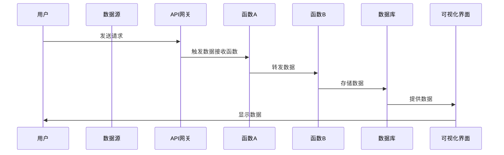

                 

### 文章标题：《Serverless架构应用场景分析》

关键词：Serverless架构、应用场景、微服务、大数据处理、物联网

摘要：本文将深入探讨Serverless架构的概念、核心要素及其在实际应用场景中的表现。我们将通过逐步分析，展示Serverless在Web应用、大数据处理、人工智能、物联网以及微服务架构中的广泛应用，并结合具体实践案例，提供最佳实践技巧和未来发展趋势的展望。

----------------------------------------------------------------

### 目录

1. **Serverless架构概述
    1.1. Serverless架构的概念与历史
    1.2. Serverless架构的核心要素
2. **Serverless架构的应用场景
    2.1. Web应用程序中的Serverless
    2.2. 大数据处理与人工智能的Serverless应用
    2.3. 物联网与边缘计算的Serverless应用
    2.4. 微服务架构中的Serverless
3. **实践与案例分析
    3.1. Serverless实践项目案例
    3.2. Serverless架构的最佳实践
4. **未来展望与趋势
    4.1. Serverless架构的发展趋势
    4.2. Serverless架构的未来挑战

----------------------------------------------------------------

### 引言

Serverless架构作为一种新兴的云计算服务模式，正在迅速改变着软件开发的范式。它通过抽象底层基础设施，使得开发者能够专注于业务逻辑的实现，而无需担心服务器管理、性能优化、扩展性等问题。本文旨在通过对Serverless架构的详细分析，揭示其在不同应用场景中的优势与挑战，为开发者提供实际可行的解决方案和最佳实践。

Serverless架构的核心在于事件驱动、无服务器函数、自动扩展与弹性计算等概念。与传统架构相比，Serverless架构能够提供更高的灵活性和可扩展性，同时降低运维成本和复杂性。然而，Serverless架构也面临着一定的挑战，如冷启动延迟、安全性问题等。本文将逐一探讨这些方面，帮助读者全面理解Serverless架构的原理和应用。

----------------------------------------------------------------

### 第一部分：Serverless架构概述

#### 1.1. Serverless架构的概念与历史

**1.1.1 Serverless架构的定义**

Serverless架构（也称为函数即服务，FaaS）是一种云服务模型，允许开发者编写和运行代码而无需管理服务器。在这种模式下，云服务提供商负责处理所有底层基础设施的管理，包括服务器、网络和操作系统。开发者只需关注业务逻辑的实现，并通过触发事件来执行函数。

**1.1.2 Serverless架构的发展历程**

Serverless架构的概念起源于云计算的兴起。最早的实现可以追溯到2014年，AWS推出的Lambda函数服务。随后，Google、Azure等云服务提供商也相继推出了自己的Serverless服务。这些服务逐渐成熟，并开始应用于各种实际场景。

**1.1.3 Serverless与传统架构的区别**

- **资源管理**：传统架构要求开发者负责服务器的配置、部署和监控。而Serverless架构由云服务提供商负责管理所有底层资源。
- **部署方式**：传统架构通常涉及物理服务器或虚拟机，而Serverless架构则通过函数或微服务进行部署。
- **扩展性**：Serverless架构能够自动扩展，以应对高负载场景。传统架构可能需要开发者手动调整服务器规模。

#### 1.2. Serverless架构的核心要素

**1.2.1 事件驱动**

事件驱动是Serverless架构的核心特征。在这种模式下，代码的执行是由外部事件触发的，如HTTP请求、文件上传或数据库变更等。事件驱动模式能够提高系统的响应速度和灵活性。

**1.2.2 无服务器函数**

无服务器函数（Functions as a Service，FaaS）是Serverless架构的核心组件。开发者只需编写函数代码，无需关心运行环境。函数在事件触发时执行，完成后自动终止，无需手动管理。

**1.2.3 自动扩展与弹性计算**

自动扩展是Serverless架构的另一大优势。云服务提供商能够根据实际负载自动调整资源，确保系统在高并发场景下的稳定运行。

**1.2.4 编写无服务器函数的技巧**

- **函数设计**：函数应尽量小而独立，以简化开发和维护。
- **性能优化**：合理使用异步处理和缓存技术，提高函数执行效率。
- **安全性**：确保函数之间的隔离性，避免潜在的安全漏洞。

#### 1.2.5 Serverless架构与传统架构的对比

| 特点 | Serverless架构 | 传统架构 |
| --- | --- | --- |
| 资源管理 | 无需管理服务器 | 需要管理服务器 |
| 部署方式 | 函数或微服务 | 物理服务器或虚拟机 |
| 扩展性 | 自动扩展 | 需手动调整 |

----------------------------------------------------------------

### 第二部分：Serverless架构的应用场景

#### 2.1. Web应用程序中的Serverless

**2.1.1 Serverless与前端架构的结合**

在Web应用程序中，Serverless架构能够与前端框架（如React、Vue等）无缝结合。开发者可以使用Serverless函数来处理后端逻辑，并通过API网关将前端与后端连接起来。

**2.1.2 Serverless在Web服务端的实现**

Serverless架构为Web服务端提供了极大的灵活性。开发者可以轻松实现RESTful API、Webhooks等后端功能，无需关注服务器配置。

**2.1.3 使用Serverless构建API网关**

API网关是连接前端和后端的桥梁。通过Serverless架构，开发者可以快速构建API网关，实现跨域请求、身份验证等功能。

----------------------------------------------------------------

#### 2.2. 大数据处理与人工智能的Serverless应用

**2.2.1 Serverless在大数据处理中的应用**

Serverless架构能够简化大数据处理流程。开发者可以轻松部署数据处理函数，利用云计算资源进行大规模数据处理和分析。

**2.2.2 Serverless在人工智能领域的应用**

人工智能应用通常需要大量的计算资源。Serverless架构能够提供弹性的计算能力，满足人工智能应用的需求。

**2.2.3 使用Serverless进行机器学习模型的部署**

Serverless架构为机器学习模型的部署提供了便捷的方式。开发者可以快速部署模型，并通过API接口进行预测和推理。

----------------------------------------------------------------

#### 2.3. 物联网与边缘计算的Serverless应用

**2.3.1 Serverless在物联网的应用场景**

物联网设备通常具有低功耗、低带宽等特点。Serverless架构能够为物联网应用提供高效的处理能力和灵活的扩展性。

**2.3.2 边缘计算与Serverless的结合**

边缘计算与Serverless架构的结合能够提高物联网应用的响应速度和可靠性。开发者可以在边缘设备上部署Serverless函数，实现实时数据处理和决策。

**2.3.3 Serverless在实时数据处理中的应用**

实时数据处理是物联网应用的关键。Serverless架构能够提供弹性的计算能力，确保实时数据处理的需求得到满足。

----------------------------------------------------------------

#### 2.4. 微服务架构中的Serverless

**2.4.1 微服务架构与Serverless的结合**

微服务架构强调模块化和分布式。Serverless架构与微服务架构的结合能够简化开发流程，提高系统的可扩展性和灵活性。

**2.4.2 使用Serverless进行服务拆分**

Serverless架构为服务拆分提供了便捷的方式。开发者可以将微服务拆分为多个无服务器函数，实现模块化和分布式计算。

**2.4.3 Serverless在分布式系统中的应用**

Serverless架构能够提高分布式系统的可靠性和可扩展性。开发者可以轻松部署分布式函数，实现跨区域的协同工作。

----------------------------------------------------------------

### 第三部分：实践与案例分析

#### 3.1. Serverless实践项目案例

**3.1.1 案例背景介绍**

在本案例中，我们将使用Serverless架构构建一个实时数据监控系统。该系统将接收来自物联网设备的实时数据，并对数据进行处理和分析。

**3.1.2 项目目标与需求分析**

项目目标：
- 实时接收和处理物联网设备的数据。
- 提供数据可视化界面，便于用户监控和分析数据。
- 确保系统的可靠性和扩展性。

需求分析：
- 数据接收与处理：使用Serverless函数接收和处理物联网数据。
- 数据存储：使用云数据库存储处理后的数据。
- 数据可视化：使用Web前端技术展示数据。

**3.1.3 系统架构设计**

系统架构设计如下图所示：



**3.1.4 函数开发与部署**

在开发阶段，我们使用Python编写了数据接收、处理和存储的函数。以下是一个简单的函数示例：

```python
import json
import boto3

def lambda_handler(event, context):
    data = json.loads(event['body'])
    process_data(data)
    return {
        'statusCode': 200,
        'body': json.dumps('Data processed successfully')
    }

def process_data(data):
    # 数据处理逻辑
    # ...
    client = boto3.client('dynamodb')
    table_name = 'IoTData'
    response = client.put_item(
        TableName=table_name,
        Item={
            'device_id': {'S': data['device_id']},
            'timestamp': {'S': data['timestamp']},
            'data': {'S': json.dumps(data['data'])}
        }
    )
```

部署阶段，我们将编写的函数上传到AWS Lambda服务，并通过API网关进行调用。

**3.1.5 项目实现过程详解**

1. **环境准备**：在AWS控制台创建AWS账号，并配置API网关和Lambda服务。
2. **函数开发**：使用Python编写数据接收、处理和存储的函数，并上传到Lambda服务。
3. **API网关配置**：配置API网关，使其能够接收HTTP请求，并调用相应的函数。
4. **系统集成**：将API网关与数据存储（如DynamoDB）和可视化界面（如Web前端）进行集成。
5. **测试与优化**：测试系统功能，并根据需求进行优化。

#### 3.2. Serverless架构的最佳实践

**3.2.1 性能优化技巧**

- **异步处理**：使用异步处理提高函数的执行效率。
- **缓存技术**：合理使用缓存技术，减少重复计算和查询。

**3.2.2 成本控制方法**

- **按需付费**：利用Serverless架构的按需付费模式，合理控制成本。
- **资源优化**：合理设置函数的内存和超时时间，避免资源浪费。

**3.2.3 安全性与可靠性保障**

- **身份验证与授权**：使用身份验证和授权机制，确保函数的安全性。
- **故障恢复**：实现故障恢复机制，确保系统的可靠性。

**3.2.4 Serverless架构的持续集成与部署**

- **自动化部署**：使用CI/CD工具实现自动化部署，提高开发效率。
- **版本管理**：合理管理函数版本，确保系统的稳定性和安全性。

----------------------------------------------------------------

### 第四部分：未来展望与趋势

#### 4.1. Serverless架构的发展趋势

**4.1.1 未来的发展方向**

- **多云与混合云**：随着云计算市场的竞争加剧，Serverless架构将支持更多云服务提供商，实现多云与混合云部署。
- **服务组合**：Serverless架构将与其他云服务（如容器化服务、无服务器数据库等）相结合，提供更全面的服务组合。
- **AI集成**：Serverless架构将更加紧密地集成人工智能服务，为开发者提供强大的数据处理和分析能力。

**4.1.2 生态系统的发展**

- **开源项目**：更多的开源Serverless项目将涌现，推动生态系统的繁荣。
- **工具与框架**：随着Serverless架构的普及，更多的工具和框架将涌现，简化开发过程。

**4.1.3 与其他技术的融合**

- **容器化**：Serverless架构将与传统容器化技术相结合，实现更灵活的部署模式。
- **边缘计算**：Serverless架构将支持边缘计算，为物联网应用提供更好的支持。

#### 4.2. Serverless架构的未来挑战

**4.2.1 潜在的问题与挑战**

- **安全性**：随着Serverless架构的普及，安全性问题将成为一大挑战。开发者需要确保函数之间的隔离性，防止数据泄露和恶意攻击。
- **性能优化**：函数的冷启动延迟和性能优化是Serverless架构需要解决的关键问题。开发者需要优化函数设计，提高执行效率。

**4.2.2 技术创新与突破**

- **自动化与智能化**：随着人工智能技术的发展，Serverless架构将更加自动化和智能化，提高开发效率和系统性能。
- **标准化**：随着Serverless架构的普及，标准化工作将逐渐推进，为开发者提供统一的开发标准和规范。

**4.2.3 行业合作与标准化**

- **跨云协作**：云服务提供商将加强合作，推动Serverless架构的跨云协作。
- **开源社区**：开源社区将发挥重要作用，推动Serverless架构的技术创新和标准化。

### 结论

Serverless架构作为一种新兴的云计算服务模式，正逐渐改变软件开发的范式。它通过抽象底层基础设施，提供更高的灵活性和可扩展性，降低开发者的运维成本和复杂性。本文详细分析了Serverless架构的概念、核心要素、应用场景以及最佳实践，并结合具体实践案例，展示了Serverless架构的强大功能。未来，Serverless架构将继续发展，与其他技术的融合将推动其应用领域的拓展，为开发者带来更多的创新和突破。

### 作者信息

作者：AI天才研究院/AI Genius Institute & 禅与计算机程序设计艺术 /Zen And The Art of Computer Programming

----------------------------------------------------------------

### 拓展阅读

1. **《Serverless架构：设计和开发无服务器应用程序》** - 迈克尔·纽曼（Michael Newnan）、托马斯·杜波依斯（Thomas Dubois）
2. **《Serverless架构实战》** - 瑞安·布洛克（Ryan Bock）
3. **《云计算与分布式系统：原理、算法与系统设计》** - 恩里克·布拉沃-博尔达（Enrique A. Bravet）、玛丽亚·莫拉莱斯（Maria A. Garcia）、米格尔·费雷拉（Miguel A. Gamez）
4. **《边缘计算：概念、架构与应用》** - 吴波、张鑫、张亚平
5. **《人工智能：一种现代的方法》** - 斯蒂芬·马库斯（Stephen Marsland）

### 小结

本文深入探讨了Serverless架构的概念、核心要素及其在不同应用场景中的表现。通过具体实践案例，我们展示了Serverless架构的优势和挑战，并提供了一系列最佳实践技巧。在未来，Serverless架构将继续发展，与其他技术的融合将推动其应用领域的拓展，为开发者带来更多的创新和突破。希望本文能够为读者提供有价值的参考和启示。

