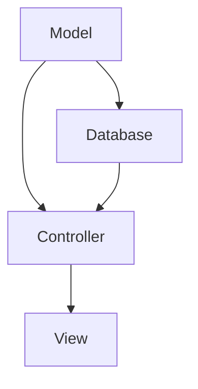
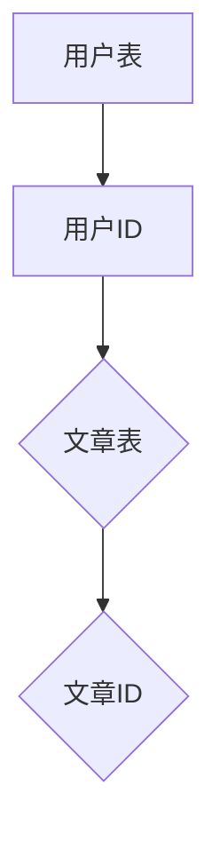

                 

### 引言

“下启代码”这个标题，承载了编程世界深深的奥秘和无尽的挑战。编程，作为计算机科学的核心，是现代技术和人类智能交互的桥梁。无论是简单的网页应用，还是复杂的深度学习模型，都离不开代码的驱动。然而，对于初学者来说，代码的世界往往显得陌生且复杂。本文将以逻辑清晰、结构紧凑、简单易懂的专业技术语言，带您一步步走进代码的世界，探索其背后的原理与实现。

在这篇文章中，我们将分三个部分来展开讨论：

1. **代码基础**：从编程入门开始，介绍编程语言的基本概念、计算机的基本组成、变量和数据类型，以及控制流程的基础知识。

2. **函数与面向对象编程**：深入讲解函数的定义与调用、模块与包的管理，以及面向对象编程的基本概念、继承与多态、封装与抽象。

3. **数据结构与算法**：介绍基本数据结构如数组、链表、栈和队列，高级数据结构如树和图，以及常见的算法设计与分析，包括排序算法和搜索算法。

通过这篇文章，您将了解到代码的本质、编程的核心技巧，以及如何将理论与实践相结合，实现复杂系统。让我们一步一步地思考，深入地剖析，共同开启代码的世界之门。

### 第一部分：代码基础

#### 第1章：编程入门

##### 1.1 编程语言简介

编程语言是用于编写计算机程序的一套规则和符号。它们将人类易于理解的语言转化为计算机能够执行的机器指令。编程语言可以分为低级语言和高级语言。低级语言如汇编语言，与机器指令非常接近，能够直接控制计算机硬件，但可读性较差，编写复杂程序较为困难。高级语言如Python、Java和C++等，提供了更丰富的语法和功能，使得编程更加高效和便捷。

**1.1.1 编程语言的基本概念**

- **定义**：编程语言是一套规则，用于定义计算机程序的结构和语义。
- **分类**：编程语言可以根据多种特征进行分类，如按用途分类、按语法结构分类等。
  - **按用途分类**：例如，Python适用于数据科学和人工智能，Java适用于企业级应用，C++适用于系统编程和游戏开发。
  - **按语法结构分类**：如过程式语言、面向对象语言、函数式语言等。

- **常见的编程语言**：以下是一些广泛使用的编程语言。
  - **Python**：一种解释型、面向对象、动态数据类型的高级编程语言，广泛应用于数据分析、机器学习、网络开发等领域。
  - **Java**：一种强类型、面向对象、跨平台的编程语言，广泛应用于企业级应用、Android移动应用开发。
  - **C++**：一种多范式编程语言，支持过程化、面向对象和泛型编程，广泛应用于系统编程、游戏开发、高性能应用等领域。
  - **JavaScript**：一种用于网页开发的脚本语言，能够增强网页互动性，广泛应用于前端开发。

**1.1.2 计算机的基本组成**

- **计算机硬件**：计算机硬件是计算机系统中的物理实体，包括中央处理器（CPU）、内存、硬盘、显卡等。
  - **CPU**：计算机的核心部件，负责执行计算机程序中的指令。
  - **内存**：用于暂时存储正在执行的程序和数据。
  - **硬盘**：用于存储计算机中的数据文件和操作系统。

- **计算机软件**：计算机软件是计算机系统中的程序和文档，用于控制和运行计算机硬件。
  - **操作系统**：管理计算机硬件和软件资源的系统软件，如Windows、Linux和macOS等。

- **操作系统**：操作系统是计算机的核心软件，负责管理和控制计算机硬件资源，提供用户界面和服务。

**1.1.3 计算机软件**

计算机软件可以分为系统软件和应用软件。
- **系统软件**：例如操作系统，负责管理和控制计算机硬件资源。
- **应用软件**：例如文字处理软件、图像编辑软件、数据库管理系统等，用于完成特定的任务。

##### 1.2 变量和数据类型

变量是编程中用来存储数据的基本单位。在编程过程中，变量可以用来存储各种类型的数据，如数字、文本和布尔值等。

**1.2.1 变量的定义和作用**

- **变量的声明**：在编程中，声明变量意味着为变量分配内存空间并指定数据类型。例如，在Python中，声明一个整数变量可以使用以下代码：
  ```python
  x = 10
  ```
  这行代码创建了一个名为`x`的变量，并将其值设为10。
  
- **变量的赋值**：变量的赋值是指将一个值分配给一个变量。在上面的例子中，`x = 10`就是一个赋值操作。
  
- **变量的使用**：变量可以在程序中被读取和修改。例如，要读取变量`x`的值，可以使用以下代码：
  ```python
  print(x)
  ```

**1.2.2 常见数据类型**

编程语言支持多种数据类型，以下是一些常见的数据类型：

- **整型（Integer）**：用于表示整数，如`1`、`-10`、`1000`等。
- **浮点型（Floating-point）**：用于表示实数，如`3.14`、`-2.5`、`1.0e-5`等。
- **字符串（String）**：用于表示文本数据，如`"Hello, World!"`、`"123"`、`""`（空字符串）等。
- **布尔型（Boolean）**：用于表示逻辑值，只有两个值：`True`和`False`。

不同编程语言对数据类型可能有不同的命名和表示方式。例如，在Python中，整型和浮点型都用`int`和`float`表示，而字符串用`str`表示。在Java中，整型用`int`表示，浮点型用`float`或`double`表示，字符串用`String`表示。

##### 1.3 控制流程

控制流程是指程序执行过程中的指令序列。通过控制流程，程序可以按照特定的顺序执行，或根据条件执行不同的操作。

**1.3.1 顺序结构**

顺序结构是程序中最基本的执行流程，程序按照从上到下的顺序执行每一条语句。例如：
```python
x = 10
y = x + 5
print(y)
```
上述代码首先将`x`的值设为10，然后将`y`的值设为`x + 5`，最后打印出`y`的值。

**1.3.2 基本控制语句**

- **if语句**：用于根据条件执行不同的操作。基本格式如下：
  ```python
  if condition:
      # 当condition为True时执行的代码
  ```
  例如：
  ```python
  if x > 10:
      print("x的值大于10")
  ```

- **switch语句**：在某些编程语言中，如C和Java，可以使用switch语句根据不同的值执行不同的操作。基本格式如下：
  ```c
  switch(expression) {
      case value1:
          // 当expression的值为value1时执行的代码
          break;
      case value2:
          // 当expression的值为value2时执行的代码
          break;
      default:
          // 当expression的值不匹配任何case时执行的代码
  }
  ```

- **for循环**：用于重复执行一组语句。基本格式如下：
  ```python
  for variable in iterable:
      # 在每次迭代时执行的代码
  ```
  例如：
  ```python
  for i in range(5):
      print(i)
  ```

- **while循环**：用于当条件为True时重复执行一组语句。基本格式如下：
  ```python
  while condition:
      # 当condition为True时执行的代码
  ```
  例如：
  ```python
  x = 0
  while x < 5:
      print(x)
      x += 1
  ```

通过上述控制语句，程序可以根据不同的条件执行不同的操作，实现复杂的逻辑处理。

##### 1.4 分支结构

分支结构用于在程序中根据不同的条件执行不同的代码块。以下是一些常见的分支结构：

- **if-else语句**：根据条件的真假执行不同的代码块。基本格式如下：
  ```python
  if condition:
      # 当condition为True时执行的代码
  else:
      # 当condition为False时执行的代码
  ```
  例如：
  ```python
  x = 10
  if x > 10:
      print("x的值大于10")
  else:
      print("x的值小于或等于10")
  ```

- **if-else if语句**：可以用来进行多条件的判断，基本格式如下：
  ```python
  if condition1:
      # 当condition1为True时执行的代码
  elif condition2:
      # 当condition2为True时执行的代码
  else:
      # 当所有条件都不满足时执行的代码
  ```
  例如：
  ```python
  x = 10
  if x > 20:
      print("x的值大于20")
  elif x > 10:
      print("x的值大于10")
  else:
      print("x的值小于或等于10")
  ```

- **switch-case语句**：在某些编程语言中，如C和Java，可以使用switch-case语句根据不同的值执行不同的操作。基本格式如下：
  ```c
  switch(expression) {
      case value1:
          // 当expression的值为value1时执行的代码
          break;
      case value2:
          // 当expression的值为value2时执行的代码
          break;
      default:
          // 当expression的值不匹配任何case时执行的代码
  }
  ```
  例如：
  ```c
  int x = 2;
  switch(x) {
      case 1:
          printf("x的值是1");
          break;
      case 2:
          printf("x的值是2");
          break;
      default:
          printf("x的值不是1也不是2");
  }
  ```

通过使用分支结构，程序可以根据不同的条件执行不同的代码块，实现复杂的逻辑处理。

#### 第2章：控制流程

##### 2.1 顺序结构

顺序结构是程序中最基本的执行流程，程序按照从上到下的顺序执行每一条语句。这种结构简单直观，但适用于解决一些简单的任务。例如：

```python
x = 10
y = x + 5
z = y * 2
print(z)
```

在这个例子中，首先将`x`的值设为10，然后计算`y`的值（`x + 5`），最后计算`z`的值（`y * 2`）并打印出来。这是一个典型的顺序结构程序。

顺序结构的执行流程如下：

1. **初始化**：程序开始执行，首先初始化所有变量和对象。
2. **执行语句**：按照代码的顺序逐条执行每一条语句。
3. **结果输出**：当所有语句执行完毕后，程序输出最终结果。

顺序结构适用于处理简单的计算任务或逻辑操作，但无法处理复杂的条件分支或循环操作。因此，在实际编程中，通常需要结合其他控制结构（如分支结构和循环结构）来实现复杂的程序逻辑。

##### 2.2 分支结构

分支结构是程序中用于根据不同条件执行不同代码块的重要手段。它通过条件判断来决定程序的执行路径，从而实现复杂逻辑的处理。常见的分支结构包括if语句、switch语句和条件运算符。

**2.2.1 条件判断**

条件判断是分支结构的核心，通过比较运算符来判断条件的真假。常见的比较运算符包括：

- 等于（`==`）：判断两个值是否相等。
- 不等于（`!=`）：判断两个值是否不相等。
- 大于（`>`）：判断左侧值是否大于右侧值。
- 小于（`<`）：判断左侧值是否小于右侧值。
- 大于等于（`>=`）：判断左侧值是否大于或等于右侧值。
- 小于等于（`<=`）：判断左侧值是否小于或等于右侧值。

例如：

```python
x = 10
if x > 5:
    print("x的值大于5")
```

在这个例子中，通过`>`运算符比较`x`和5的大小，如果条件为真，则打印出相应的信息。

**2.2.2 逻辑运算符**

逻辑运算符用于组合多个条件，以实现更复杂的逻辑判断。常见的逻辑运算符包括：

- 逻辑与（`&&`）：只有当所有条件都为真时，结果才为真。
- 逻辑或（`||`）：只要有一个条件为真，结果就为真。
- 逻辑非（`!`）：取反操作，将真值变为假，假值变为真。

例如：

```python
x = 10
y = 5
if x > 5 && y < 10:
    print("x的值大于5且y的值小于10")
```

在这个例子中，使用`&&`运算符组合了两个条件，只有当这两个条件都为真时，程序才会打印出相应的信息。

**2.2.3 if-else语句**

if-else语句是最常用的分支结构，用于根据条件的真假执行不同的代码块。基本格式如下：

```python
if condition:
    # 当condition为真时执行的代码块
else:
    # 当condition为假时执行的代码块
```

例如：

```python
x = 10
if x > 5:
    print("x的值大于5")
else:
    print("x的值小于或等于5")
```

在这个例子中，首先判断`x`是否大于5。如果条件为真，则打印出“x的值大于5”，否则打印出“x的值小于或等于5”。

**2.2.4 if-else if语句**

if-else if语句用于处理多个条件，根据不同的条件执行不同的代码块。基本格式如下：

```python
if condition1:
    # 当condition1为真时执行的代码块
elif condition2:
    # 当condition1为假且condition2为真时执行的代码块
elif condition3:
    # 当condition1和condition2都为假且condition3为真时执行的代码块
else:
    # 当所有条件都为假时执行的代码块
```

例如：

```python
x = 10
if x > 20:
    print("x的值大于20")
elif x > 10:
    print("x的值大于10")
else:
    print("x的值小于或等于10")
```

在这个例子中，根据`x`的值，程序会执行不同的代码块。如果`x`大于20，则打印出“x的值大于20”；如果`x`大于10但小于或等于20，则打印出“x的值大于10”；如果`x`小于或等于10，则打印出“x的值小于或等于10”。

**2.2.5 switch-case语句**

switch-case语句在某些编程语言中用于根据不同的值执行不同的代码块。基本格式如下：

```c
switch(expression) {
    case value1:
        // 当expression的值为value1时执行的代码块
        break;
    case value2:
        // 当expression的值为value2时执行的代码块
        break;
    default:
        // 当expression的值不匹配任何case时执行的代码块
}
```

例如：

```c
int x = 2;
switch(x) {
    case 1:
        printf("x的值是1");
        break;
    case 2:
        printf("x的值是2");
        break;
    default:
        printf("x的值不是1也不是2");
}
```

在这个例子中，根据`x`的值，程序会执行不同的代码块。如果`x`的值为1，则打印出“x的值是1”；如果`x`的值为2，则打印出“x的值是2”；如果`x`的值不匹配任何case，则打印出“x的值不是1也不是2”。

通过使用if-else语句、if-else if语句和switch-case语句，程序可以根据不同的条件执行不同的代码块，实现复杂的逻辑处理。

### 第二部分：函数与面向对象编程

#### 第3章：函数与模块

##### 3.1 函数的定义与调用

在编程中，函数是一种将一组语句封装在一起的过程，可以用来执行特定的任务。通过定义函数，可以简化代码、提高代码的可读性和可维护性。

**3.1.1 函数的定义**

函数的定义包括函数的名称、参数（如果有）和函数体。以下是一个简单的函数定义示例：
```python
def greet(name):
    message = "Hello, " + name
    return message
```
在这个例子中，定义了一个名为`greet`的函数，它接受一个名为`name`的参数。函数体内，创建了一个名为`message`的变量，用于存储问候语。最后，使用`return`语句将`message`返回。

**3.1.2 函数的参数**

函数可以接受任意数量的参数。参数可以是必需的，也可以是可选的。以下是一个带有可选参数的函数定义示例：
```python
def greet(name, greeting="Hello"):
    message = greeting + ", " + name
    return message
```
在这个例子中，`greet`函数接受两个参数：`name`是必需的，而`greeting`是可选的，默认值为`"Hello"`。如果传递了第二个参数，函数将使用它，否则使用默认值。

**3.1.3 函数的返回值**

函数可以通过`return`语句返回一个值。如果函数没有返回值，则默认返回`None`。以下是一个返回整数的函数示例：
```python
def add(a, b):
    return a + b
```
在这个例子中，`add`函数接受两个参数`a`和`b`，并将它们的和返回。

**3.1.4 递归函数**

递归函数是一种特殊的函数，它调用自身来解决问题。以下是一个使用递归计算阶乘的示例：
```python
def factorial(n):
    if n == 0:
        return 1
    else:
        return n * factorial(n - 1)
```
在这个例子中，`factorial`函数通过递归调用自身来计算阶乘。当`n`等于0时，函数返回1。否则，函数返回`n`乘以`factorial(n - 1)`。

##### 3.2 模块与包

模块和包是Python中用于组织代码的重要工具。模块是Python文件，包含Python代码，可以导入其他模块中的函数、类和变量。包是一种模块的集合，具有层次结构，用于组织相关模块。

**3.2.1 模块的概念**

模块是一种Python文件，通常以`.py`扩展名结尾。一个模块可以包含函数、类、变量和文档字符串等。以下是一个简单的模块示例：
```python
# 文件名：math_module.py

def add(a, b):
    return a + b

def subtract(a, b):
    return a - b
```
在这个例子中，`math_module.py`是一个模块，包含两个函数`add`和`subtract`。

**3.2.2 模块的导入**

要使用模块中的函数或类，需要先导入模块。可以使用`import`语句导入模块，也可以使用`from...import...`语句导入特定的函数或类。以下是一些导入模块的示例：
```python
import math_module
from math_module import add, subtract
```
在这两个例子中，第一个导入语句导入整个`math_module`模块，第二个导入语句只导入模块中的`add`和`subtract`函数。

**3.2.3 包的管理**

包是一种模块的集合，具有层次结构。包的层次结构由文件夹和子文件夹组成，每个文件夹都可以包含一个或多个模块。以下是一个简单的包示例：
```
package/
│
├── __init__.py
├── math_module.py
└── string_module.py
```
在这个例子中，`package`是一个包，包含三个文件：`__init__.py`、`math_module.py`和`string_module.py`。`__init__.py`是一个特殊的文件，用于初始化包。模块`math_module.py`和`string_module.py`包含相关的函数和类。

要导入包中的模块，可以使用`import`语句或`from...import...`语句。以下是一些导入包的示例：
```python
import package
from package import math_module
from package.math_module import add
```
在这两个例子中，第一个导入语句导入整个`package`包，第二个导入语句只导入包中的`math_module`模块，第三个导入语句只导入`math_module`模块中的`add`函数。

通过使用模块和包，可以更好地组织代码、提高代码的可读性和可维护性。

#### 第4章：面向对象编程

##### 4.1 面向对象的基本概念

面向对象编程（Object-Oriented Programming，OOP）是一种编程范式，它通过将数据和行为封装在对象中，实现代码的重用、扩展和简化。面向对象编程具有以下基本概念：

- **类（Class）**：类是面向对象编程中的蓝图，定义了对象的属性和行为。类可以看作是对象的模板，用于创建对象。

- **对象（Object）**：对象是类的实例，它由类定义。对象具有属性（数据）和行为（方法）。通过创建对象，可以访问类定义的属性和方法。

- **构造函数（Constructor）**：构造函数是一种特殊的函数，用于初始化对象。当创建对象时，构造函数会被自动调用。

- **属性（Attribute）**：属性是对象的数据，用于存储对象的内部状态。属性可以是公有的（public）、受保护的（protected）或私有的（private）。

- **方法（Method）**：方法是对象的行为，用于定义对象可以执行的操作。方法通常包含对属性的操作。

- **继承（Inheritance）**：继承是一种让一个类继承另一个类的属性和方法的机制。通过继承，可以创建具有相似特性的类，并简化代码。

- **多态（Polymorphism）**：多态是一种让对象根据其运行时类型进行不同操作的机制。通过多态，可以编写更加灵活和通用的代码。

- **封装（Encapsulation）**：封装是一种将数据和行为封装在对象中的机制，以防止外部直接访问和修改。封装可以提高代码的安全性和可维护性。

##### 4.1.1 类与对象

类和对象是面向对象编程中的核心概念。类定义了对象的属性和行为，而对象是类的实例。

**类**

类是一种抽象的数据类型，用于定义对象的属性和行为。在Python中，使用`class`关键字定义类。以下是一个简单的类定义示例：
```python
class Person:
    def __init__(self, name, age):
        self.name = name
        self.age = age
    
    def greet(self):
        print(f"Hello, my name is {self.name} and I am {self.age} years old.")
```
在这个例子中，定义了一个名为`Person`的类，它有两个属性`name`和`age`，以及一个名为`greet`的方法。

**对象**

对象是类的实例。创建对象时，需要使用类名和构造函数。以下是一个创建对象的示例：
```python
p = Person("Alice", 30)
```
在这个例子中，创建了一个名为`p`的`Person`对象，其中`name`属性被设置为`"Alice"`，`age`属性被设置为`30`。

##### 4.1.2 继承与多态

继承和多态是面向对象编程中的重要概念，用于实现代码的重用和扩展。

**继承**

继承是一种让一个类继承另一个类的属性和方法的机制。通过继承，可以创建具有相似特性的类，并简化代码。

- **基类（Base Class）**：被继承的类称为基类或父类。
- **派生类（Derived Class）**：继承基类的类称为派生类或子类。

以下是一个简单的继承示例：
```python
class Employee(Person):
    def __init__(self, name, age, employee_id):
        super().__init__(name, age)
        self.employee_id = employee_id
    
    def greet(self):
        print(f"Hello, my name is {self.name} and I am {self.age} years old. I am an employee with ID {self.employee_id}.")
```
在这个例子中，`Employee`类继承自`Person`类。`Employee`类有一个额外的属性`employee_id`，并覆盖了`greet`方法以包含更多详细信息。

**多态**

多态是一种让对象根据其运行时类型进行不同操作的机制。通过多态，可以编写更加灵活和通用的代码。

以下是一个简单的多态示例：
```python
class Animal:
    def sound(self):
        pass

class Dog(Animal):
    def sound(self):
        print("Woof!")

class Cat(Animal):
    def sound(self):
        print("Meow!")

def make_sound(animals):
    for animal in animals:
        animal.sound()

animals = [Dog(), Cat()]
make_sound(animals)
```
在这个例子中，`Animal`类是一个基类，`Dog`和`Cat`类是派生类。`make_sound`函数接受一个包含`Animal`对象的列表，并调用每个对象的`sound`方法。由于`Dog`和`Cat`类都覆盖了`sound`方法，程序将根据对象的实际类型执行相应的操作。

通过继承和多态，可以创建具有相似特性的类，并实现代码的重用和扩展。

##### 4.1.3 封装与抽象

封装和抽象是面向对象编程中的两个重要概念，用于提高代码的安全性和可维护性。

**封装**

封装是一种将数据和行为封装在对象中的机制，以防止外部直接访问和修改。通过封装，可以隐藏对象的内部实现细节，并确保对象的安全性和完整性。

- **公有属性和方法**：可以被外部访问的属性和方法。
- **受保护属性和方法**：只能被类及其子类访问的属性和方法。
- **私有属性和方法**：只能被类本身访问的属性和方法。

以下是一个简单的封装示例：
```python
class Person:
    def __init__(self, name, age):
        self._name = name
        self._age = age
    
    @property
    def name(self):
        return self._name
    
    @name.setter
    def name(self, value):
        self._name = value
    
    @property
    def age(self):
        return self._age
    
    @age.setter
    def age(self, value):
        if value < 0:
            raise ValueError("年龄不能为负数")
        self._age = value
    
    def greet(self):
        print(f"Hello, my name is {self.name} and I am {self.age} years old.")
```
在这个例子中，`Person`类有两个私有属性`_name`和`_age`，以及对应的公有属性和方法。通过使用`@property`装饰器，可以将属性访问方法转换为公有属性访问器。

**抽象**

抽象是一种提取类的基本特征，并隐藏实现细节的机制。通过抽象，可以创建抽象类和抽象方法，用于定义类的骨架，而具体的实现细节由子类提供。

以下是一个简单的抽象示例：
```python
from abc import ABC, abstractmethod

class Animal(ABC):
    @abstractmethod
    def sound(self):
        pass

class Dog(Animal):
    def sound(self):
        print("Woof!")

class Cat(Animal):
    def sound(self):
        print("Meow!")
```
在这个例子中，`Animal`类是一个抽象类，它定义了一个抽象方法`sound`。`Dog`和`Cat`类是`Animal`的子类，并实现了`sound`方法。

通过封装和抽象，可以提高代码的安全性和可维护性，并确保对象的一致性和完整性。

### 第三部分：数据结构与算法

#### 第5章：基本数据结构

##### 5.1 数组和链表

数组是一种线性数据结构，用于存储一系列相同类型的元素。数组具有固定的大小，一旦创建，大小不可改变。数组在内存中连续存储元素，可以通过索引快速访问元素。以下是一个简单的数组示例：
```python
array = [1, 2, 3, 4, 5]
```
在这个例子中，创建了一个包含五个整数的数组。

**数组的基本操作**

- **访问元素**：通过索引访问数组中的元素。例如：
  ```python
  print(array[0])  # 输出第一个元素
  ```
- **添加元素**：在数组末尾添加元素。例如：
  ```python
  array.append(6)
  ```
- **删除元素**：通过索引删除数组中的元素。例如：
  ```python
  del array[0]
  ```
- **修改元素**：通过索引修改数组中的元素。例如：
  ```python
  array[0] = 10
  ```

##### 链表

链表是一种动态数据结构，用于存储一系列元素。与数组不同，链表的大小可以动态调整，每个元素称为节点。每个节点包含数据和指向下一个节点的指针。以下是一个简单的链表示例：
```python
class Node:
    def __init__(self, data):
        self.data = data
        self.next = None

# 创建链表
head = Node(1)
second = Node(2)
third = Node(3)

head.next = second
second.next = third
```
在这个例子中，创建了一个包含三个节点的链表，每个节点存储一个整数。

**链表的基本操作**

- **添加节点**：在链表末尾添加节点。例如：
  ```python
  new_node = Node(4)
  third.next = new_node
  ```
- **删除节点**：通过节点数据删除节点。例如：
  ```python
  current = head
  while current.next != None and current.next.data != 2:
      current = current.next
  if current.next:
      current.next = current.next.next
  ```
- **访问节点**：通过节点数据访问节点。例如：
  ```python
  current = head
  while current != None and current.data != 2:
      current = current.next
  if current:
      print(current.data)
  ```

##### 5.2 栈和队列

栈和队列是两种特殊的线性数据结构，用于处理序列数据。

**栈**

栈是一种后进先出（Last In First Out，LIFO）的数据结构。栈中的元素按照插入和删除的顺序排列，最后插入的元素最先被删除。以下是一个简单的栈示例：
```python
class Stack:
    def __init__(self):
        self.items = []

    def push(self, item):
        self.items.append(item)

    def pop(self):
        if not self.is_empty():
            return self.items.pop()

    def is_empty(self):
        return len(self.items) == 0
```
在这个例子中，定义了一个简单的栈类`Stack`，包括`push`（添加元素）、`pop`（删除元素）和`is_empty`（检查栈是否为空）方法。

**队列**

队列是一种先进先出（First In First Out，FIFO）的数据结构。队列中的元素按照插入和删除的顺序排列，最先插入的元素最先被删除。以下是一个简单的队列示例：
```python
class Queue:
    def __init__(self):
        self.items = []

    def enqueue(self, item):
        self.items.append(item)

    def dequeue(self):
        if not self.is_empty():
            return self.items.pop(0)

    def is_empty(self):
        return len(self.items) == 0
```
在这个例子中，定义了一个简单的队列类`Queue`，包括`enqueue`（添加元素）、`dequeue`（删除元素）和`is_empty`（检查队列是否为空）方法。

##### 5.3 栈和队列的应用

栈和队列在许多算法和数据结构中都有广泛应用。以下是一些常见的应用场景：

- **栈**：用于解决括号匹配问题、逆波兰表达式求值、递归函数调用等。
- **队列**：用于解决最短路径问题（如Dijkstra算法）、模拟进程调度、任务队列等。

通过了解和掌握栈和队列的基本操作和应用，可以更好地理解和实现复杂的算法和数据结构。

### 第6章：高级数据结构

##### 6.1 树和图

树和图是两种重要的非线性数据结构，广泛应用于计算机科学和图论中。树是一种层次结构，用于表示元素之间的关系，而图则是一种复杂的关系网络。

**6.1.1 树**

树是一种由节点（或称为顶点）组成的层次结构，每个节点最多有一个父节点，称为根节点。树中的每个节点可以有零个或多个子节点。以下是一个简单的树结构示例：
```
    A
   / \
  B   C
 / \
D   E
```
在这个例子中，节点`A`是根节点，节点`B`和`C`是`A`的子节点，节点`D`和`E`是`B`的子节点。

**树的基本概念**

- **节点**：树中的每个元素称为节点。
- **根节点**：树的第一个节点，没有父节点。
- **子节点**：某个节点的直接后代节点。
- **父节点**：某个节点的直接前驱节点。
- **叶子节点**：没有子节点的节点。
- **层级**：节点的层级等于其到根节点的边数。
- **高度**：节点的最大层级。

**树的基本操作**

- **创建树**：通过构造函数或手动创建节点和边来创建树。
- **插入节点**：在树中插入新的节点。
- **删除节点**：从树中删除指定的节点。
- **遍历树**：遍历树的每个节点，常用的遍历方法有深度优先搜索（DFS）和广度优先搜索（BFS）。

**6.1.2 图**

图是一种由节点（或称为顶点）和边组成的数据结构，用于表示复杂的关系网络。图中的节点可以表示任何对象，而边则表示节点之间的关系。以下是一个简单的图结构示例：
```
   1 --- 2
  / \
 3   4
```
在这个例子中，节点1、2、3和4是图中的节点，边则表示节点之间的关系。

**图的基本概念**

- **节点**：图中的每个元素称为节点。
- **边**：节点之间的关系称为边。
- **无向图**：边无方向的图。
- **有向图**：边有方向的图。
- **权图**：边带有权重的图。

**图的基本操作**

- **创建图**：通过构造函数或手动创建节点和边来创建图。
- **添加节点**：在图中添加新的节点。
- **添加边**：在图中添加新的边。
- **删除节点**：从图中删除指定的节点。
- **删除边**：从图中删除指定的边。
- **遍历图**：遍历图的每个节点，常用的遍历方法有深度优先搜索（DFS）和广度优先搜索（BFS）。

**6.1.3 树与图的比较**

- **结构差异**：树是一种层次结构，而图是一种网络结构。
- **关系差异**：树中的每个节点最多有一个父节点，而图中的节点可以有多个前驱和后继节点。
- **应用差异**：树常用于表示层次结构，如图形组织结构、家族树等，而图常用于表示复杂的关系网络，如图像识别、社交网络等。

通过了解树和图的基本概念和操作，可以更好地理解和实现复杂的算法和数据结构，为解决实际问题提供有力支持。

#### 6.2 哈希表

哈希表（Hash Table），又称散列表，是一种基于哈希函数映射关键字到存储位置的数据结构。哈希表通过将关键字（如字符串、整数等）映射到一个固定的数组位置，实现快速插入、删除和查找操作。哈希表的原理是基于哈希函数，该函数将关键字转换为整数，该整数再映射到数组中的一个位置。

**6.2.1 哈希表的基本概念**

- **哈希函数**：哈希函数用于将关键字转换为数组索引。理想情况下，哈希函数应具有以下特性：
  - **确定性和均匀分布**：对于给定的关键字，哈希函数应始终返回相同的索引。
  - **高效性**：哈希函数应快速计算，以减少查找时间。

- **数组**：哈希表使用一个数组来存储数据。数组的每个位置对应一个关键字。

- **链表**：为了处理哈希冲突（即多个关键字映射到同一数组位置），哈希表通常在每个数组位置存储一个链表。当多个关键字映射到同一位置时，它们在链表中形成一个链表。

**6.2.2 哈希表的基本操作**

- **插入（Insert）**：插入操作包括以下步骤：
  1. 使用哈希函数计算关键字对应的数组索引。
  2. 将关键字添加到数组的对应位置。
  3. 如果存在链表，将关键字添加到链表中。

- **删除（Delete）**：删除操作包括以下步骤：
  1. 使用哈希函数计算关键字对应的数组索引。
  2. 在数组位置对应的链表中查找关键字。
  3. 如果找到关键字，将其从链表中删除。

- **查找（Search）**：查找操作包括以下步骤：
  1. 使用哈希函数计算关键字对应的数组索引。
  2. 在数组位置对应的链表中查找关键字。
  3. 如果找到关键字，返回关键字；否则返回`None`。

**6.2.3 哈希表的优缺点**

- **优点**：
  - **高效性**：哈希表的查找、插入和删除操作平均时间复杂度为O(1)。
  - **灵活性**：可以处理任意类型的关键字。

- **缺点**：
  - **哈希冲突**：当多个关键字映射到同一数组位置时，需要处理哈希冲突。
  - **空间浪费**：由于哈希函数的均匀分布特性，可能导致数组空间浪费。

哈希表是一种高效的数据结构，常用于解决关键字查找、存储和匹配问题。通过合理设计哈希函数和处理哈希冲突，可以最大限度地发挥哈希表的优势。

### 第7章：算法设计与分析

#### 7.1 算法基础

算法（Algorithm）是解决特定问题的步骤集合，通常涉及数学计算、逻辑判断和数据操作。算法的设计与实现是计算机科学和软件工程的核心内容，直接影响软件系统的性能和效率。以下是算法设计和分析中的一些基础概念。

**7.1.1 算法的定义**

算法是一种明确的、有限的计算过程，用于解决特定的问题。算法具有以下特性：

- **确定性**：对于相同的输入，算法总是产生相同的输出。
- **有限性**：算法在执行有限步骤后必须终止。
- **输入**：算法可以有一个或多个输入。
- **输出**：算法有一个或多个输出。
- **可行性**：算法中的每一步都是可行的，即可以实际执行。

**7.1.2 算法的复杂度**

算法的复杂度描述了算法在时间和空间上的性能。常见的复杂度包括：

- **时间复杂度**：算法执行的时间与输入规模的关系。通常使用大O符号表示，如O(1)、O(n)、O(n^2)等。
- **空间复杂度**：算法执行过程中所需的最大内存空间。同样使用大O符号表示。

**7.1.3 常见算法复杂度分析工具**

- **大O符号（Big O Notation）**：用于描述算法的时间复杂度，表示算法在最坏情况下的执行时间。
- **主定理（Master Theorem）**：用于分析递归算法的时间复杂度。
- **递归树（Recursion Tree）**：用于可视化递归算法的执行过程。

**7.1.4 算法设计的基本原则**

- **正确性**：算法必须能够正确解决给定的问题。
- **效率**：算法应尽可能快地执行，同时保持代码的可读性和可维护性。
- **健壮性**：算法应能够处理各种输入，包括边界条件和异常情况。
- **可扩展性**：算法应易于扩展，以适应新的需求。

#### 7.2 排序算法

排序算法是一种重要的算法，用于将一组数据按照特定的顺序重新排列。常见的排序算法包括冒泡排序、选择排序、插入排序、快速排序等。

**7.2.1 冒泡排序**

冒泡排序（Bubble Sort）是一种简单的排序算法，通过反复交换相邻元素来将数据从小到大排列。以下是冒泡排序的基本原理和Python实现：

**基本原理**：

1. 从数组的第一个元素开始，相邻的两个元素进行比较，如果前一个元素大于后一个元素，则交换它们的位置。
2. 继续对下一对相邻元素进行比较，直到最后一个元素。
3. 重复上述过程，直到整个数组排序完成。

**Python实现**：

```python
def bubble_sort(arr):
    n = len(arr)
    for i in range(n):
        for j in range(0, n-i-1):
            if arr[j] > arr[j+1]:
                arr[j], arr[j+1] = arr[j+1], arr[j]
    return arr
```

**7.2.2 快速排序**

快速排序（Quick Sort）是一种高效的排序算法，通过递归地将数组分成较小的子数组，并最终将整个数组排序。以下是快速排序的基本原理和Python实现：

**基本原理**：

1. 选择一个基准元素（通常是数组的最后一个元素）。
2. 将数组分为两个子数组，左子数组中的所有元素都小于基准元素，右子数组中的所有元素都大于基准元素。
3. 递归地应用快速排序算法对左子数组和右子数组进行排序。

**Python实现**：

```python
def quick_sort(arr):
    if len(arr) <= 1:
        return arr
    pivot = arr[len(arr) - 1]
    left = [x for x in arr if x < pivot]
    middle = [x for x in arr if x == pivot]
    right = [x for x in arr if x > pivot]
    return quick_sort(left) + middle + quick_sort(right)
```

通过了解和掌握常见的排序算法，可以更好地解决数据排序问题，提高程序的效率。

#### 7.3 搜索算法

搜索算法用于在数据结构中查找特定元素。常见的搜索算法包括顺序搜索、二分搜索等。

**7.3.1 顺序搜索**

顺序搜索（Sequential Search）是最简单的搜索算法，从头到尾依次检查每个元素，直到找到目标元素或遍历整个数据结构。以下是顺序搜索的基本原理和Python实现：

**基本原理**：

1. 从数组的第一个元素开始，依次检查每个元素。
2. 如果当前元素等于目标元素，则返回该元素的索引。
3. 如果遍历整个数组仍未找到目标元素，则返回-1（或指定的未找到标志）。

**Python实现**：

```python
def sequential_search(arr, target):
    for i, x in enumerate(arr):
        if x == target:
            return i
    return -1
```

**7.3.2 二分搜索**

二分搜索（Binary Search）是一种高效的搜索算法，适用于有序数据结构。以下是二分搜索的基本原理和Python实现：

**基本原理**：

1. 将搜索范围缩小一半，比较中间元素与目标元素的大小关系。
2. 根据比较结果，决定下一轮搜索是在左侧子数组还是右侧子数组。
3. 重复上述过程，直到找到目标元素或确定目标元素不存在。

**Python实现**：

```python
def binary_search(arr, target):
    left, right = 0, len(arr) - 1
    while left <= right:
        mid = (left + right) // 2
        if arr[mid] == target:
            return mid
        elif arr[mid] < target:
            left = mid + 1
        else:
            right = mid - 1
    return -1
```

通过了解和掌握搜索算法，可以高效地查找数据结构中的特定元素，提高程序的效率。

### 第8章：项目实战

在本节中，我们将通过一个实际项目来展示如何将上述学到的编程知识和技能应用于实践中。该项目是一个简单的博客系统，它允许用户创建、发布和查看博客文章。通过这个项目，我们将学习如何进行需求分析、系统设计、编码实现和测试。

#### 8.1 项目介绍

**项目背景**

随着互联网的发展，博客已经成为人们分享知识和交流想法的重要平台。为了帮助新手更好地入门编程，我们计划开发一个简单的博客系统，它能够提供基本的博客功能，包括创建新文章、发布文章、查看文章列表和查看具体文章内容。

**项目目标**

- 实现用户注册和登录功能。
- 提供创建、编辑和删除文章的功能。
- 实现文章的查看和评论功能。
- 设计一个简单的用户界面。

**项目架构**

本项目采用MVC（Model-View-Controller）架构模式，其中：

- **Model**：负责处理数据，包括用户和文章数据。
- **View**：负责展示用户界面。
- **Controller**：负责处理用户输入，调用Model和View进行数据操作和界面展示。

#### 8.2 系统实现

**8.2.1 系统需求分析**

**功能需求**

1. 用户注册和登录：用户可以创建账户并登录系统。
2. 文章管理：用户可以创建、编辑和删除自己的文章。
3. 文章查看：用户可以查看文章列表和具体文章内容。
4. 评论管理：用户可以在文章下发表评论，并进行评论的删除。

**非功能需求**

1. 系统安全：保护用户数据，防止非法访问。
2. 性能：系统响应时间应尽可能短。
3. 可维护性：代码应具有良好的结构，易于维护和扩展。

**8.2.2 系统设计**

**系统架构设计**

本项目的系统架构采用MVC模式，以下是其基本组成部分：

- **Model**：使用SQLite数据库存储用户和文章数据。
- **View**：使用HTML、CSS和JavaScript实现用户界面。
- **Controller**：使用Python实现，处理用户输入和调用Model和View。

**系统架构图**



**系统接口设计**

本系统的主要接口包括用户接口和文章接口。

1. **用户接口**：
   - 注册：`/register`：接收用户注册信息，返回注册结果。
   - 登录：`/login`：接收用户登录信息，返回登录状态。
   - 退出登录：`/logout`：清除用户登录状态。

2. **文章接口**：
   - 创建文章：`/articles`：接收文章内容，保存到数据库。
   - 删除文章：`/articles/{article_id}`：根据文章ID删除文章。
   - 查看文章列表：`/articles`：返回文章列表。
   - 查看文章内容：`/articles/{article_id}`：返回指定文章内容。

**8.2.3 系统实现**

**数据库设计**

数据库包含两个表：用户表和文章表。

1. **用户表（users）**：
   - 用户ID（主键）
   - 用户名
   - 密码
   - 电子邮件

2. **文章表（articles）**：
   - 文章ID（主键）
   - 用户ID（外键）
   - 标题
   - 内容
   - 创建时间

**数据库ER图**



**代码实现**

以下是系统核心部分的Python代码实现。

**用户注册和登录**

```python
# 用户注册
def register(username, password, email):
    # 连接到数据库，检查用户名是否已存在
    # 如果用户名不存在，将新用户信息保存到数据库

# 用户登录
def login(username, password):
    # 连接到数据库，检查用户名和密码是否匹配
    # 如果匹配，返回用户ID和登录状态
```

**文章管理**

```python
# 创建文章
def create_article(user_id, title, content):
    # 将文章信息保存到数据库

# 删除文章
def delete_article(article_id):
    # 根据文章ID从数据库中删除文章

# 查看文章列表
def get_articles():
    # 从数据库中查询所有文章，返回文章列表

# 查看文章内容
def get_article_content(article_id):
    # 从数据库中查询指定文章的标题和内容
```

**用户界面**

使用HTML、CSS和JavaScript实现用户界面，包括注册页面、登录页面、文章管理页面和文章展示页面。

**8.2.4 项目实战**

**环境安装**

- 安装Python 3.8及以上版本。
- 安装SQLite数据库。
- 安装Flask框架：`pip install flask`

**系统核心实现**

以下是文章管理功能的核心实现。

```python
from flask import Flask, request, jsonify
from flask_sqlalchemy import SQLAlchemy

app = Flask(__name__)
app.config['SQLALCHEMY_DATABASE_URI'] = 'sqlite:///blog.db'
db = SQLAlchemy(app)

class User(db.Model):
    id = db.Column(db.Integer, primary_key=True)
    username = db.Column(db.String(80), unique=True, nullable=False)
    password = db.Column(db.String(120), nullable=False)
    email = db.Column(db.String(120), unique=True, nullable=False)

class Article(db.Model):
    id = db.Column(db.Integer, primary_key=True)
    user_id = db.Column(db.Integer, db.ForeignKey('user.id'), nullable=False)
    title = db.Column(db.String(120), nullable=False)
    content = db.Column(db.Text, nullable=False)
    created_at = db.Column(db.DateTime, default=datetime.utcnow)

@app.route('/articles', methods=['POST'])
def create_article():
    user_id = request.form['user_id']
    title = request.form['title']
    content = request.form['content']
    article = Article(user_id=user_id, title=title, content=content)
    db.session.add(article)
    db.session.commit()
    return jsonify({'message': 'Article created successfully.'})

@app.route('/articles/<int:article_id>', methods=['DELETE'])
def delete_article(article_id):
    article = Article.query.get(article_id)
    if article:
        db.session.delete(article)
        db.session.commit()
        return jsonify({'message': 'Article deleted successfully.'})
    else:
        return jsonify({'error': 'Article not found.'})

@app.route('/articles', methods=['GET'])
def get_articles():
    articles = Article.query.all()
    return jsonify([{'id': article.id, 'title': article.title, 'content': article.content} for article in articles])

@app.route('/articles/<int:article_id>', methods=['GET'])
def get_article_content(article_id):
    article = Article.query.get(article_id)
    if article:
        return jsonify({'title': article.title, 'content': article.content})
    else:
        return jsonify({'error': 'Article not found.'})

if __name__ == '__main__':
    db.create_all()
    app.run(debug=True)
```

**代码应用解读与分析**

上述代码实现了一个简单的博客系统，用于创建、删除和查看文章。通过使用Flask框架和SQLite数据库，我们可以快速搭建一个功能完整的后台服务。

**实际案例分析和详细讲解**

以下是一个实际案例，展示如何使用上述系统创建和查看文章。

**创建文章**

1. 用户通过用户界面输入文章标题和内容。
2. 点击“发布”按钮，将文章数据发送到后端。
3. 后端接收数据，调用`create_article`函数创建文章，并将数据保存到数据库。

**查看文章**

1. 用户通过用户界面选择一篇已发布的文章。
2. 后端根据文章ID调用`get_article_content`函数获取文章数据。
3. 后端将文章数据返回给用户界面，用户可以查看文章内容。

**项目小结**

通过本项目的实战，我们学习了如何进行需求分析、系统设计、编码实现和测试。该项目展示了如何将编程知识应用于实际项目中，实现了用户注册、登录、文章管理和查看等基本功能。通过不断迭代和优化，我们可以进一步扩展系统功能，提高用户体验。

### 最佳实践 tips

在开发博客系统时，以下是几点最佳实践建议：

1. **模块化设计**：将系统划分为多个模块，如用户管理、文章管理、评论管理等，以便于代码维护和扩展。
2. **安全防护**：对用户输入进行验证和过滤，防止SQL注入、XSS攻击等安全问题。
3. **错误处理**：合理处理异常和错误，提供友好的错误信息和反馈。
4. **性能优化**：使用缓存、异步处理等优化技术提高系统性能。

### 小结

通过本文的详细讲解，我们从基础编程入门，逐步深入到函数、面向对象编程、数据结构和算法，最后通过实际项目展示了如何将所学知识应用于实践。编程不仅是技术能力的体现，更是逻辑思维和问题解决能力的提升。希望读者能够通过学习和实践，逐步掌握编程的核心技能，开启属于自己的代码世界。

### 注意事项

在开发博客系统时，需要注意以下几点：

1. **数据安全性**：确保用户数据和文章内容的安全性，防止未经授权的访问和数据泄露。
2. **性能优化**：针对高访问量的文章和页面，进行缓存和优化，提高系统响应速度。
3. **错误处理**：对异常和错误进行有效处理，提供清晰的错误信息和解决方案。
4. **用户界面**：设计简洁直观的用户界面，提升用户体验。

### 拓展阅读

- 《代码大全》（Code Complete）：一本经典的编程书籍，涵盖编程实践、代码设计和管理等方面。
- 《深度学习》（Deep Learning）：由Ian Goodfellow、Yoshua Bengio和Aaron Courville合著，是深度学习的入门和进阶读物。
- 《设计模式：可复用面向对象软件的基础》（Design Patterns: Elements of Reusable Object-Oriented Software）：介绍面向对象编程中的设计模式，有助于提高代码复用性和可维护性。

### 作者信息

**作者：** AI天才研究院/AI Genius Institute & 禅与计算机程序设计艺术 /Zen And The Art of Computer Programming

感谢您阅读本文，希望您在编程领域不断探索和进步。祝您编程愉快！

