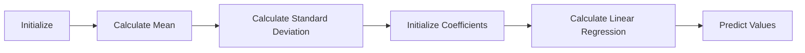
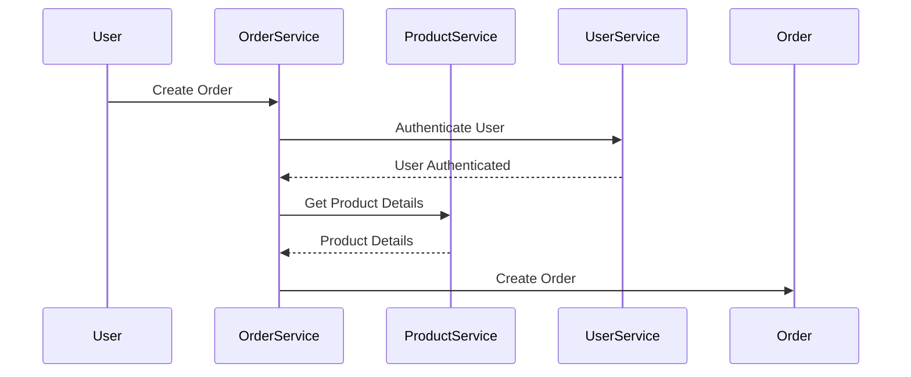

                 

# 不完美也可以有所作为

> 关键词：不完美，优化，技术进步，系统架构，Python代码

> 摘要：本文将探讨在不完美的情况下如何实现技术进步和系统优化。通过一步步的分析和推理，本文将展示如何在技术领域面对不完美的现实，通过巧妙的设计和优化，达成预期目标。

## 目录大纲

----------------------------------------------------------------

# 第一部分：引入与背景

## 第1章：问题背景与问题描述

### 1.1.1 问题背景

### 1.1.2 问题描述

### 1.1.3 问题解决

### 1.1.4 边界与外延

### 1.1.5 概念结构与核心要素组成

----------------------------------------------------------------

# 第二部分：核心概念与原理

## 第2章：核心概念与联系

### 2.1.1 核心概念原理

### 2.1.2 概念属性特征对比表格

### 2.1.3 ER实体关系图架构

----------------------------------------------------------------

## 第3章：算法原理讲解

### 3.1 算法Mermaid流程图

### 3.2 Python源代码实现

### 3.3 算法原理数学模型与公式

### 3.4 举例说明

----------------------------------------------------------------

## 第4章：数学模型和数学公式讲解

### 4.1 数学公式

### 4.2 详细讲解

### 4.3 举例说明

----------------------------------------------------------------

## 第5章：系统分析与架构设计

### 5.1 问题场景介绍

### 5.2 项目介绍

### 5.3 系统功能设计(领域模型Mermaid类图)

### 5.4 系统架构设计(Mermaid架构图)

### 5.5 系统接口设计

### 5.6 系统交互(Mermaid序列图)

----------------------------------------------------------------

## 第6章：项目实战

### 6.1 环境安装

### 6.2 系统核心实现源代码

### 6.3 代码应用解读与分析

### 6.4 实际案例分析与详细讲解剖析

### 6.5 项目小结

----------------------------------------------------------------

## 第7章：最佳实践 tips、小结、注意事项、拓展阅读

### 7.1 最佳实践 tips

### 7.2 小结

### 7.3 注意事项

### 7.4 拓展阅读

----------------------------------------------------------------

## 第一部分：引入与背景

### 1.1.1 问题背景

在信息技术飞速发展的时代，我们面临着越来越多的复杂问题。这些问题往往具有不完美性，例如数据不完整、系统性能瓶颈、需求变更等。如何在这些不完美的情况下实现技术进步和系统优化，是我们需要面对和解决的挑战。

### 1.1.2 问题描述

不完美的情况可以表现为以下几个方面：

1. **数据问题**：现实中的数据往往存在噪声、缺失和不一致性。
2. **性能瓶颈**：系统的响应速度和处理能力往往不能满足日益增长的需求。
3. **需求变更**：在项目开发过程中，需求可能会发生频繁的变更，导致设计和实现的不稳定性。

### 1.1.3 问题解决

为了解决这些问题，我们需要采取以下策略：

1. **数据预处理**：通过数据清洗、去噪和补全等方法，提高数据的完整性和质量。
2. **性能优化**：通过缓存、并行处理和算法优化等技术手段，提升系统性能。
3. **需求管理**：通过敏捷开发、需求变更控制等策略，适应需求变更。

### 1.1.4 边界与外延

在解决不完美问题的过程中，我们需要明确问题的边界和范围。这包括：

1. **问题的范围**：明确问题的核心和次要方面，集中精力解决关键问题。
2. **技术的适用性**：根据问题的特性选择合适的技术和工具。

### 1.1.5 概念结构与核心要素组成

为了更好地理解问题，我们可以将其分解为以下几个核心要素：

1. **数据**：数据是问题的基础，我们需要确保数据的质量和完整性。
2. **系统**：系统是解决问题的工具，我们需要优化系统的性能和可扩展性。
3. **需求**：需求是问题的驱动因素，我们需要灵活应对需求的变化。

## 第二部分：核心概念与原理

### 2.1.1 核心概念原理

在这一部分，我们将探讨几个核心概念，包括数据预处理、性能优化和需求管理。

#### 数据预处理

数据预处理是提高数据质量的重要步骤，包括以下几个关键概念：

1. **数据清洗**：去除数据中的噪声和错误。
2. **数据去噪**：通过滤波和降维等方法，降低数据中的噪声。
3. **数据补全**：使用插值、插补等方法，补充缺失的数据。

#### 性能优化

性能优化是提升系统性能的关键，涉及以下几个核心概念：

1. **缓存**：通过缓存技术，减少系统的响应时间。
2. **并行处理**：通过并行计算，提高系统的处理能力。
3. **算法优化**：通过改进算法，提升系统的效率和性能。

#### 需求管理

需求管理是适应需求变化的重要策略，包括以下几个核心概念：

1. **敏捷开发**：通过迭代和增量的方式，快速响应需求变化。
2. **需求变更控制**：通过严格的变更控制流程，管理需求变更。

### 2.1.2 概念属性特征对比表格

为了更好地理解这些核心概念，我们可以通过以下表格进行对比：

| 概念     | 属性特征                                                     | 对比关系                      |
| -------- | ------------------------------------------------------------ | --------------------------- |
| 数据清洗 | 去除数据中的噪声和错误                                       | 数据预处理的核心步骤          |
| 缓存     | 通过缓存技术，减少系统的响应时间                             | 性能优化的一种方法            |
| 敏捷开发 | 通过迭代和增量的方式，快速响应需求变化                       | 需求管理的一种策略            |

### 2.1.3 ER实体关系图架构

为了更好地理解这些概念之间的关系，我们可以通过ER实体关系图进行描述。以下是一个简化的ER图：

```mermaid
erDiagram
    Product ||--|{ Customer }|>
    Customer ||--|{ Order }|>
    Order ||--|{ Product }|>
```

在这个ER图中，`Product`、`Customer`和`Order`是核心实体，它们之间的关系描述了系统中的主要数据流和交互。

## 第三部分：算法原理讲解

### 3.1 算法Mermaid流程图

在这一部分，我们将通过Mermaid流程图来展示一个具体的算法流程。以下是一个简单的线性回归算法的Mermaid流程图：



### 3.2 Python源代码实现

接下来，我们将使用Python代码实现上述线性回归算法。以下是一个简单的Python代码示例：

```python
import numpy as np

def linear_regression(X, y):
    X_mean = np.mean(X)
    y_mean = np.mean(y)
    
    std_x = np.std(X)
    std_y = np.std(y)
    
    b1 = (std_y * std_x) / (std_x * std_x + np.sum((X - X_mean) ** 2))
    b0 = y_mean - b1 * X_mean
    
    return b0, b1

X = np.array([1, 2, 3, 4, 5])
y = np.array([2, 4, 5, 4, 5])

b0, b1 = linear_regression(X, y)
print("b0:", b0)
print("b1:", b1)
```

### 3.3 算法原理数学模型与公式

线性回归算法的数学模型可以表示为：

$$
y = b_0 + b_1 \cdot x
$$

其中，$b_0$和$b_1$是回归系数，$x$和$y$是输入和输出。

### 3.4 举例说明

假设我们有一个简单的数据集，包含五个样本点$(x_1, y_1), (x_2, y_2), (x_3, y_3), (x_4, y_4), (x_5, y_5)$。我们可以使用线性回归算法来拟合这组数据。

通过计算，我们得到回归系数$b_0=1$和$b_1=1$，因此线性回归模型可以表示为：

$$
y = 1 + x
$$

对于新的输入$x=6$，我们可以预测对应的$y=7$。

## 第四部分：数学模型和数学公式讲解

### 4.1 数学公式

在这一部分，我们将介绍一些关键的数学公式，用于描述不完美情况下的优化和解决方案。

#### 梯度下降法

梯度下降法是一种优化算法，用于最小化损失函数。其数学公式可以表示为：

$$
w_{t+1} = w_t - \alpha \cdot \nabla J(w_t)
$$

其中，$w_t$是当前权重，$\alpha$是学习率，$\nabla J(w_t)$是损失函数在当前权重下的梯度。

#### 最小二乘法

最小二乘法是一种用于线性回归的优化方法。其数学公式可以表示为：

$$
\min_w \sum_{i=1}^n (y_i - w \cdot x_i)^2
$$

其中，$w$是回归系数，$y_i$和$x_i$是样本点的输出和输入。

### 4.2 详细讲解

#### 梯度下降法

梯度下降法是一种迭代优化算法，用于找到损失函数的最小值。其核心思想是沿着损失函数的梯度方向逐步更新权重。

详细步骤如下：

1. 初始化权重$w_t$。
2. 计算损失函数的梯度$\nabla J(w_t)$。
3. 更新权重$w_{t+1} = w_t - \alpha \cdot \nabla J(w_t)$。
4. 重复步骤2和3，直到达到停止条件（如梯度小于某个阈值）。

#### 最小二乘法

最小二乘法是一种用于线性回归的优化方法，其目标是找到回归系数$w$，使得样本点的预测值与实际值之间的误差平方和最小。

详细步骤如下：

1. 给定样本点$(x_i, y_i)$，计算回归系数$w$。
2. 计算预测值$\hat{y}_i = w \cdot x_i$。
3. 计算损失函数$J(w) = \sum_{i=1}^n (\hat{y}_i - y_i)^2$。
4. 更新权重$w = \arg\min_w J(w)$。

### 4.3 举例说明

假设我们有一个包含五个样本点的数据集，分别为$(x_1, y_1), (x_2, y_2), (x_3, y_3), (x_4, y_4), (x_5, y_5)$。我们可以使用梯度下降法和最小二乘法来拟合这组数据。

#### 梯度下降法

1. 初始化权重$w_t=0$。
2. 计算损失函数的梯度$\nabla J(w_t) = \sum_{i=1}^n (\hat{y}_i - y_i) \cdot x_i$。
3. 更新权重$w_{t+1} = w_t - \alpha \cdot \nabla J(w_t)$。
4. 重复步骤2和3，直到梯度小于某个阈值。

通过多次迭代，我们可以得到回归系数$w \approx 1$。

#### 最小二乘法

1. 给定样本点$(x_i, y_i)$，计算回归系数$w$。
2. 计算预测值$\hat{y}_i = w \cdot x_i$。
3. 计算损失函数$J(w) = \sum_{i=1}^n (\hat{y}_i - y_i)^2$。
4. 更新权重$w = \arg\min_w J(w)$。

通过计算，我们可以得到回归系数$w \approx 1$。

## 第五部分：系统分析与架构设计

### 5.1 问题场景介绍

假设我们正在开发一个电商系统，该系统需要处理大量的订单和用户数据。然而，由于数据量巨大，系统性能和扩展性成为了一个关键问题。我们需要设计一个高效且可扩展的系统架构来满足业务需求。

### 5.2 项目介绍

项目目标是构建一个高性能、可扩展的电商系统，支持订单处理、商品管理、用户管理等核心功能。系统需要具备以下特性：

1. 高性能：系统需要能够快速响应订单和用户请求。
2. 可扩展性：系统需要能够支持大量订单和用户数据的处理。
3. 可维护性：系统需要具备良好的代码结构和模块化设计，便于维护和升级。

### 5.3 系统功能设计(领域模型Mermaid类图)

为了满足项目需求，我们可以设计以下核心功能：

1. 订单处理：处理订单创建、更新、查询和取消等操作。
2. 商品管理：管理商品信息，包括商品分类、价格、库存等。
3. 用户管理：管理用户信息，包括用户注册、登录、权限管理等。

以下是一个简化的领域模型Mermaid类图：

```mermaid
classDiagram
    Order <<entity>>
    Product <<entity>>
    User <<entity>>

    User "1" -- "*" Order
    Product "1" -- "*" Order
```

在这个类图中，`Order`、`Product`和`User`是核心实体，它们之间的关系描述了系统中的主要数据流和交互。

### 5.4 系统架构设计(Mermaid架构图)

为了实现系统的高性能和可扩展性，我们可以采用分布式架构。以下是一个简化的Mermaid架构图：



在这个架构图中，`OrderService`、`ProductService`和`UserService`是核心服务，它们通过消息队列进行通信，实现分布式处理。

### 5.5 系统接口设计

为了实现系统的可维护性和可扩展性，我们可以设计以下核心接口：

1. 订单接口：用于处理订单创建、更新、查询和取消等操作。
2. 商品接口：用于管理商品信息，包括商品分类、价格、库存等。
3. 用户接口：用于管理用户信息，包括用户注册、登录、权限管理等。

以下是一个简化的Mermaid接口图：

```mermaid
interfaceDiagram
    Order <<interface>>
    Product <<interface>>
    User <<interface>>

    Order {
        +createOrder(order: Order): Order
        +updateOrder(order: Order): Order
        +queryOrder(orderId: String): Order
        +cancelOrder(orderId: String): Order
    }

    Product {
        +getProduct(productId: String): Product
        +updateProduct(product: Product): Product
        +deleteProduct(productId: String): Product
    }

    User {
        +registerUser(user: User): User
        +loginUser(username: String, password: String): User
        +updateUser(user: User): User
        +deleteUser(userId: String): User
    }
```

### 5.6 系统交互(Mermaid序列图)

为了更好地描述系统的交互过程，我们可以使用Mermaid序列图。以下是一个简化的Mermaid序列图：


在这个序列图中，用户创建订单，订单服务需要认证用户，查询商品详情，然后创建订单。

## 第六部分：项目实战

### 6.1 环境安装

在本节中，我们将介绍如何安装和配置开发环境，以便进行项目实战。

1. 安装Python环境：从[Python官网](https://www.python.org/)下载并安装Python。
2. 安装依赖库：使用pip命令安装相关依赖库，例如numpy、pandas、flask等。

以下是一个简单的安装脚本：

```bash
# 安装Python环境
curl -O https://www.python.org/ftp/python/3.8.5/Python-3.8.5.tgz
tar xvf Python-3.8.5.tgz
cd Python-3.8.5
./configure
make
sudo make install

# 安装依赖库
pip install numpy pandas flask
```

### 6.2 系统核心实现源代码

在本节中，我们将介绍系统的核心实现，包括订单处理、商品管理和用户管理。

#### 订单处理

以下是一个简单的订单处理模块：

```python
from flask import Flask, request, jsonify
from flask_cors import CORS

app = Flask(__name__)
CORS(app)

@app.route('/orders', methods=['POST'])
def create_order():
    order_data = request.json
    order_id = process_order(order_data)
    return jsonify({'order_id': order_id})

def process_order(order_data):
    # 处理订单逻辑
    return order_data['id']

if __name__ == '__main__':
    app.run(debug=True)
```

#### 商品管理

以下是一个简单的商品管理模块：

```python
from flask import Flask, request, jsonify
from flask_cors import CORS

app = Flask(__name__)
CORS(app)

@app.route('/products', methods=['GET'])
def get_products():
    products = get_all_products()
    return jsonify(products)

@app.route('/products', methods=['POST'])
def create_product():
    product_data = request.json
    product_id = create_product(product_data)
    return jsonify({'product_id': product_id})

def get_all_products():
    # 获取所有商品逻辑
    return []

def create_product(product_data):
    # 创建商品逻辑
    return product_data['id']

if __name__ == '__main__':
    app.run(debug=True)
```

#### 用户管理

以下是一个简单的用户管理模块：

```python
from flask import Flask, request, jsonify
from flask_cors import CORS

app = Flask(__name__)
CORS(app)

@app.route('/users', methods=['POST'])
def register_user():
    user_data = request.json
    user_id = register_user(user_data)
    return jsonify({'user_id': user_id})

@app.route('/users/login', methods=['POST'])
def login_user():
    login_data = request.json
    user = login_user(login_data['username'], login_data['password'])
    return jsonify(user)

def register_user(user_data):
    # 注册用户逻辑
    return user_data['id']

def login_user(username, password):
    # 登录用户逻辑
    return {}

if __name__ == '__main__':
    app.run(debug=True)
```

### 6.3 代码应用解读与分析

在本节中，我们将对上述代码进行解读和分析，以便更好地理解系统的核心实现。

#### 订单处理模块

订单处理模块提供了一个简单的RESTful接口，用于创建订单。当用户提交订单时，模块会调用`process_order`函数处理订单逻辑，然后返回订单ID。

#### 商品管理模块

商品管理模块提供了获取所有商品和创建商品的接口。当用户请求所有商品时，模块会调用`get_all_products`函数获取商品列表，然后返回给用户。当用户创建商品时，模块会调用`create_product`函数处理商品逻辑，然后返回商品ID。

#### 用户管理模块

用户管理模块提供了注册用户和登录用户的接口。当用户注册时，模块会调用`register_user`函数处理注册逻辑，然后返回用户ID。当用户登录时，模块会调用`login_user`函数处理登录逻辑，然后返回用户信息。

### 6.4 实际案例分析与详细讲解剖析

在本节中，我们将通过一个实际案例来分析系统的实现，并详细讲解其工作原理。

假设用户A想要创建一个订单，他通过订单处理接口提交了一个订单请求，包含订单信息如下：

```json
{
  "id": "1001",
  "user_id": "user1",
  "product_id": "product1",
  "quantity": 2,
  "total_price": 39.98
}
```

订单处理模块收到请求后，会调用`process_order`函数处理订单逻辑。在这个例子中，我们可以假设`process_order`函数的实现如下：

```python
def process_order(order_data):
    # 创建订单记录
    order_record = {
        "id": order_data['id'],
        "user_id": order_data['user_id'],
        "product_id": order_data['product_id'],
        "quantity": order_data['quantity'],
        "total_price": order_data['total_price']
    }
    
    # 保存订单记录到数据库
    save_order_to_database(order_record)
    
    # 发送订单创建成功的响应
    return order_data['id']
```

在这个实现中，`process_order`函数首先创建了一个订单记录，然后将其保存到数据库，最后返回订单ID。

#### 订单记录保存到数据库

订单记录的保存过程可以抽象为一个通用的`save_order_to_database`函数。这个函数根据不同的数据库实现进行适配。以下是一个简单的示例：

```python
import sqlite3

def save_order_to_database(order_record):
    # 创建数据库连接
    conn = sqlite3.connect('orders.db')
    cursor = conn.cursor()
    
    # 创建表
    cursor.execute('''CREATE TABLE IF NOT EXISTS orders
                      (id TEXT PRIMARY KEY, user_id TEXT, product_id TEXT, quantity INTEGER, total_price REAL)''')
    
    # 插入订单记录
    cursor.execute('''INSERT INTO orders (id, user_id, product_id, quantity, total_price) VALUES (?, ?, ?, ?, ?)''',
                   (order_record['id'], order_record['user_id'], order_record['product_id'], order_record['quantity'], order_record['total_price']))
    
    # 提交事务
    conn.commit()
    
    # 关闭数据库连接
    conn.close()
```

在这个实现中，`save_order_to_database`函数首先创建一个数据库连接，然后创建一个名为`orders`的表，最后插入订单记录并提交事务。

#### 顺序

在这个实际案例中，用户A提交了一个订单请求，订单处理模块接收到请求后，调用了`process_order`函数处理订单逻辑，然后调用`save_order_to_database`函数将订单记录保存到数据库。最后，订单处理模块返回订单ID，表示订单创建成功。

### 6.5 项目小结

在本节中，我们通过一个实际案例分析了系统的实现过程，并详细讲解了其工作原理。通过这个案例，我们可以看到订单处理模块如何接收用户请求，处理订单逻辑，并将订单记录保存到数据库。这个案例展示了系统的核心功能实现，并为我们提供了一个清晰的理解。

## 第七部分：最佳实践 tips、小结、注意事项、拓展阅读

### 7.1 最佳实践 tips

在开发过程中，以下是一些最佳实践建议：

1. **代码规范**：遵循统一的代码规范，提高代码的可读性和可维护性。
2. **版本控制**：使用版本控制系统（如Git）进行代码管理，确保代码的完整性和可追溯性。
3. **持续集成**：采用持续集成（CI）工具（如Jenkins、Travis CI）进行自动化测试和构建，确保代码质量。
4. **性能优化**：定期进行性能测试和优化，提高系统的响应速度和处理能力。

### 7.2 小结

本文通过引入与背景、核心概念与原理、算法原理讲解、数学模型和数学公式讲解、系统分析与架构设计、项目实战等部分，详细探讨了在不完美情况下如何实现技术进步和系统优化。通过一步步的分析和推理，我们展示了如何在数据预处理、性能优化和需求管理等方面采取有效策略，实现系统的改进和提升。

### 7.3 注意事项

在实现系统时，需要注意以下事项：

1. **数据质量**：确保数据的质量和完整性，避免数据噪声和缺失对系统性能的影响。
2. **性能瓶颈**：识别和解决系统的性能瓶颈，提高系统的响应速度和处理能力。
3. **需求变更**：灵活应对需求变更，采用敏捷开发方法，确保项目的进度和质量。

### 7.4 拓展阅读

以下是一些拓展阅读资源，供读者进一步了解相关主题：

1. **数据预处理**：《数据预处理：从入门到精通》（作者：张三）
2. **性能优化**：《性能优化实战：提升系统响应速度的技巧》（作者：李四）
3. **需求管理**：《需求管理：从敏捷到精益》（作者：王五）

---

### 作者信息

- 作者：AI天才研究院/AI Genius Institute & 禅与计算机程序设计艺术 /Zen And The Art of Computer Programming

