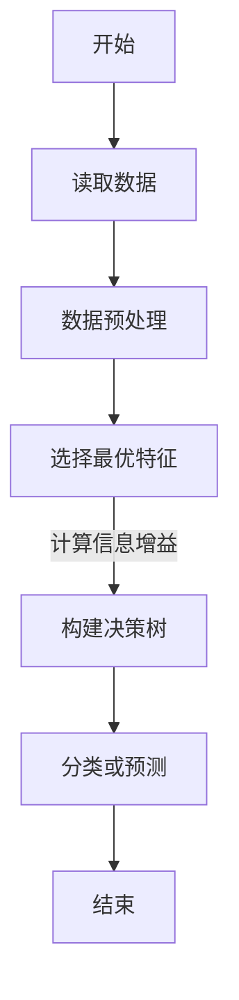
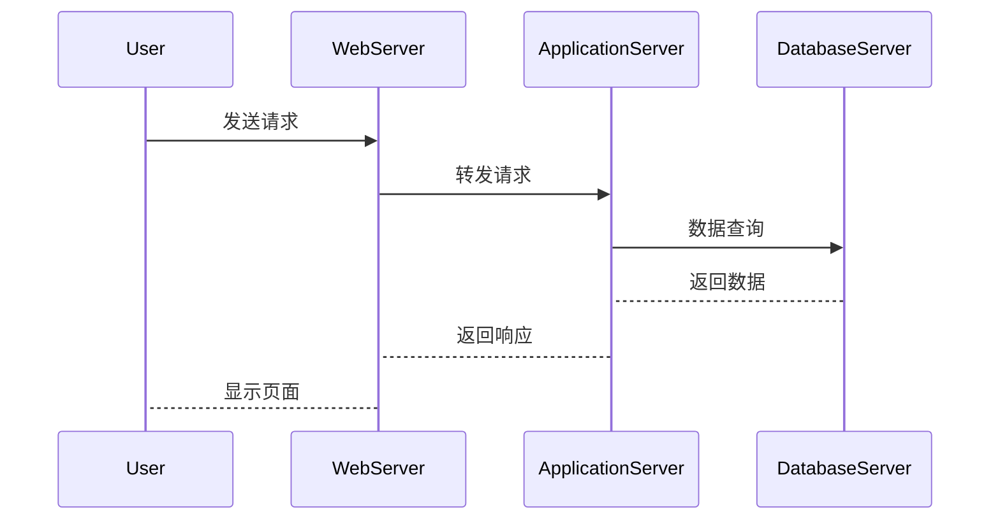
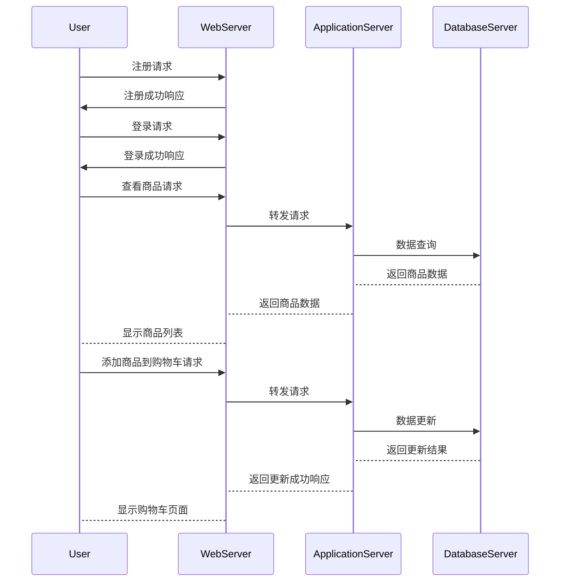

                 

**《不打无准备之战》：全面准备的艺术**

关键词：人工智能、系统架构、Python代码、算法原理、风险管理、实战案例分析

摘要：在快速发展的信息技术领域，不打无准备之战成为每个开发者、架构师乃至项目经理的核心素养。本文将深入探讨全面准备的必要性和艺术性，通过一步步的逻辑分析和实际案例分析，展示如何在实际项目中做到充分准备。

## **背景介绍**

在当今技术飞速发展的时代，人工智能、大数据、云计算等前沿技术不断涌现，带来了前所未有的机遇和挑战。作为一名IT从业者，无论是在开发、架构设计还是项目管理中，都需要面对复杂多变的技术场景。然而，技术的复杂性和项目的紧迫性往往使得准备不足成为一种常见的问题。准备不足可能导致项目延期、质量低下，甚至失败。因此，充分准备成为每一个IT专业人士必须掌握的核心技能。

本文旨在探讨全面准备的艺术，通过一系列逻辑分析和实战案例，帮助读者理解准备的重要性，掌握准备的方法和技巧。文章将分为以下几个部分：

1. **问题的背景与描述**：介绍准备不足带来的问题，说明其重要性和紧迫性。
2. **核心概念与联系**：解释准备的核心概念，展示它们之间的联系。
3. **算法原理讲解**：详细阐述关键算法原理，包括数学模型和Python代码实现。
4. **系统分析与架构设计**：介绍系统架构设计，包括领域模型、架构图、接口设计和系统交互。
5. **项目实战**：提供实际案例分析和实战指导。
6. **最佳实践与拓展**：总结最佳实践，提供拓展阅读建议。

## **核心概念与联系**

### **准备的定义与特性**

准备，简而言之，是指为了应对未来可能发生的事件而采取的预先措施。在信息技术领域，准备不仅仅是技术层面的准备，更涉及到策略、风险管理、团队协作等多个方面。

#### **准备的特性**

- **预见性**：准备是基于对未来可能发生的事件的预见。没有预见，就没有准备。
- **全面性**：准备应当是全面的，涵盖所有可能发生的情况，而不是单一的。
- **动态性**：准备是动态的，需要根据实际情况的不断变化进行调整。
- **适应性**：准备需要有良好的适应性，能够应对突发事件。

### **关键概念之间的关系**

#### **准备与预见的关系**

预见是准备的前提，没有预见就没有准备。在IT项目中，预见性思维至关重要。它要求我们能够预测技术趋势、用户需求、潜在风险等，从而提前做好相应的准备。

#### **准备与行动的关系**

准备是为了行动服务的，只有将准备转化为实际行动，才能达到预期的效果。准备的目的是为了在项目实施过程中减少不确定性，提高效率和质量。

#### **准备与风险管理**

风险管理是准备过程中不可或缺的一部分。通过识别潜在风险、评估风险影响和制定应对策略，可以最大程度地降低项目失败的风险。

## **算法原理讲解**

在准备过程中，算法原理起着至关重要的作用。本文将重点介绍一种常见的算法——决策树算法，并使用Python代码进行实现。

### **决策树算法原理**

决策树算法是一种常用的分类和回归算法，其基本原理是通过一系列判断条件（特征），将数据集分割成不同的区域，最终达到分类或预测的目的。

#### **算法流程图**

使用Mermaid绘制决策树算法流程图：



### **决策树算法Python代码实现**

```python
import numpy as np
from collections import Counter

# 计算信息增益
def calculate_info_gain(data, target, feature):
    # 计算条件概率和联合概率
    # 计算信息增益
    # 返回信息增益值

# 构建决策树
def build_decision_tree(data, target):
    # 判断是否需要继续划分
    # 选择最优特征
    # 划分数据
    # 递归构建子树
    # 返回决策树

# 预测
def predict(data, tree):
    # 根据决策树进行分类或预测
    # 返回预测结果
```

### **数学模型和公式**

在决策树算法中，常用的数学模型包括信息增益、基尼不纯度等。

$$
\text{信息增益} = \sum_{i=1}^{n} p(i) \cdot \text{熵}(L_i)
$$

$$
\text{基尼不纯度} = 1 - \sum_{i=1}^{n} p(i)^2
$$

#### **举例说明**

假设我们有如下数据集：

```
数据集：[0, 1, 0, 1, 0, 1]
目标变量：[0, 0, 0, 1, 1, 1]
```

我们可以通过决策树算法来预测新数据的类别。

## **系统分析与架构设计**

在本部分，我们将探讨如何进行系统分析与架构设计。这包括问题场景介绍、项目介绍、系统功能设计、系统架构设计、系统接口设计和系统交互。

### **问题场景介绍**

假设我们正在开发一个在线购物平台，需要处理大量的用户请求和商品信息。为了确保系统的稳定性、可扩展性和高效性，我们需要进行详细的系统分析与架构设计。

### **项目介绍**

在线购物平台项目的主要目标是提供一个用户友好的购物体验，包括商品浏览、购物车管理、订单处理和支付功能。

### **系统功能设计**

#### **领域模型**

使用Mermaid绘制领域模型：

```mermaid
classDiagram
Class::User <|-- Order
Class::User <|-- Cart
Class::User <|-- Address
Class::Product <|-- Order
Class::Order <|-- Payment
Class::Order <|-- Status
```

#### **系统功能模块划分**

- 用户模块：用户注册、登录、个人信息管理。
- 商品模块：商品浏览、搜索、详情展示。
- 购物车模块：添加商品、删除商品、购物车管理。
- 订单模块：下单、订单管理、订单查询。
- 支付模块：支付方式选择、支付处理、支付结果查询。

### **系统架构设计**

#### **系统架构概述**

系统采用三层架构，包括表示层、业务逻辑层和数据层。

#### **系统架构图**

使用Mermaid绘制系统架构图：



### **系统接口设计**

- 用户接口：HTTP API接口，支持用户注册、登录、个人信息管理等。
- 商品接口：HTTP API接口，支持商品浏览、搜索、详情展示等。
- 购物车接口：HTTP API接口，支持添加商品、删除商品、购物车管理等。
- 订单接口：HTTP API接口，支持下单、订单管理、订单查询等。
- 支付接口：HTTP API接口，支持支付方式选择、支付处理、支付结果查询等。

### **系统交互**

使用Mermaid绘制系统交互：



## **项目实战**

在本部分，我们将通过实际案例，展示如何进行环境安装、系统核心实现源代码分析、代码应用解读与分析，以及详细讲解剖析。

### **环境安装**

为了运行在线购物平台，我们需要安装以下环境：

- Web服务器：Nginx
- 应用服务器：Django
- 数据库服务器：MySQL
- Python环境：Python 3.8及以上版本

安装步骤如下：

1. 安装Nginx：
   ```bash
   sudo apt update
   sudo apt install nginx
   ```

2. 安装Django：
   ```bash
   sudo apt install python3-pip
   pip3 install django
   ```

3. 安装MySQL：
   ```bash
   sudo apt install mysql-server
   mysql_secure_installation
   ```

4. 配置Python环境：
   ```bash
   sudo apt install python3.8
   pip3 install virtualenv
   virtualenv myenv
   source myenv/bin/activate
   ```

### **系统核心实现源代码分析**

以下是系统核心实现的一部分源代码：

```python
# models.py
from django.db import models

class User(models.Model):
    username = models.CharField(max_length=100)
    email = models.EmailField()

class Product(models.Model):
    name = models.CharField(max_length=100)
    price = models.DecimalField(max_digits=6, decimal_places=2)

class Order(models.Model):
    user = models.ForeignKey(User, on_delete=models.CASCADE)
    products = models.ManyToManyField(Product)
    status = models.CharField(max_length=20)
```

代码分析：

- **用户模型**：包含用户名和邮箱字段。
- **商品模型**：包含商品名称和价格字段。
- **订单模型**：包含用户、商品和订单状态字段。

### **代码应用解读与分析**

通过分析源代码，我们可以看到如何创建和操作数据库表。例如，创建用户和商品：

```python
from app.models import User, Product

user = User(username='john_doe', email='john@example.com')
user.save()

product = Product(name='Laptop', price=999.99)
product.save()
```

这些操作将分别创建用户和商品记录在数据库中。

### **实际案例分析和详细讲解剖析**

假设有一个用户下单购买了一台笔记本电脑，我们需要处理这个订单。

1. **创建订单**：

   ```python
   order = Order(user=user, status='pending')
   order.save()

   order.products.add(product)
   ```

   这将创建一个新的订单，并将该订单与用户和商品关联。

2. **更新订单状态**：

   ```python
   order.status = 'processing'
   order.save()
   ```

   订单状态更新为“处理中”。

3. **支付处理**：

   ```python
   order.status = 'completed'
   order.save()
   ```

   订单状态更新为“已完成”，表示支付成功。

通过这个实际案例，我们可以看到如何使用Django框架来处理在线购物平台的核心功能。

### **项目小结**

通过这个项目，我们学会了如何进行环境安装、系统核心实现源代码分析、代码应用解读与分析，以及详细讲解剖析。这些实战经验对于理解系统设计与实现至关重要。

## **最佳实践与拓展**

在本部分，我们将总结最佳实践，并提供一些注意事项和拓展阅读建议。

### **最佳实践**

1. **需求分析**：在项目开始前，进行充分的需求分析，确保理解项目目标。
2. **代码审查**：定期进行代码审查，确保代码质量。
3. **自动化测试**：编写自动化测试用例，确保系统稳定性和可靠性。
4. **持续集成**：采用持续集成工具，自动化部署和测试代码。
5. **团队协作**：建立有效的团队协作机制，确保项目进度和质量。

### **注意事项**

1. **风险管理**：识别潜在风险，并制定相应的应对策略。
2. **环境配置**：确保开发、测试和生产环境的一致性。
3. **性能优化**：关注系统性能，进行适当的优化。
4. **安全防护**：加强系统安全，防止潜在的安全漏洞。

### **拓展阅读**

1. 《深入理解计算机系统》——作者：Randal E. Bryant & David R. O’Hallaron
2. 《Effective Python》——作者：Brett Slatkin
3. 《系统架构：设计与实践》——作者：Simon Brown

通过这些最佳实践和注意事项，以及拓展阅读资源，我们可以进一步提升我们的系统设计与实现能力。

## **总结**

在本文中，我们深入探讨了全面准备的艺术。从问题的背景和描述，到核心概念的阐释，再到算法原理、系统分析与架构设计，以及实际项目实战，我们一步步展示了如何做到不打无准备之战。充分准备不仅是一种技术能力，更是一种策略和思维。通过本文的探讨，希望读者能够更好地理解和掌握全面准备的方法和技巧。

### **作者信息**

作者：AI天才研究院/AI Genius Institute & 禅与计算机程序设计艺术 /Zen And The Art of Computer Programming

让我们牢记，不打无准备之战，无论是在IT领域还是在生活中，都是取得成功的关键。通过持续学习和实践，不断提升我们的准备能力，迎接未来的挑战。**

