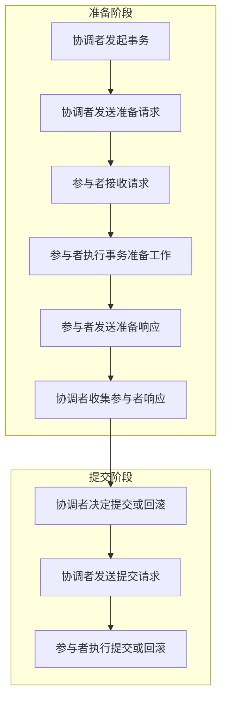
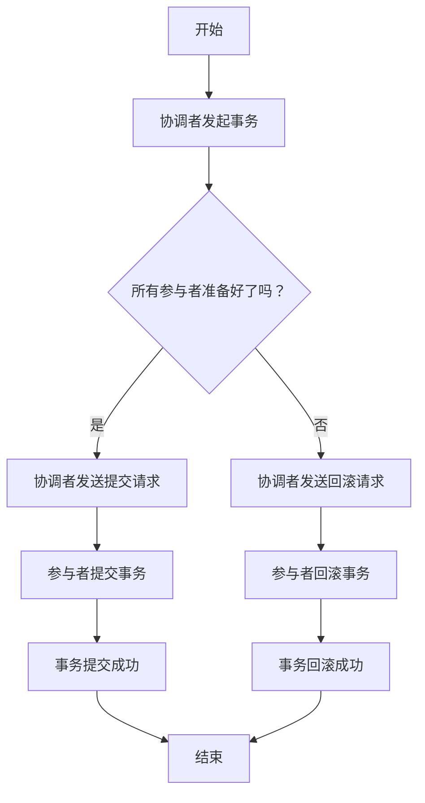
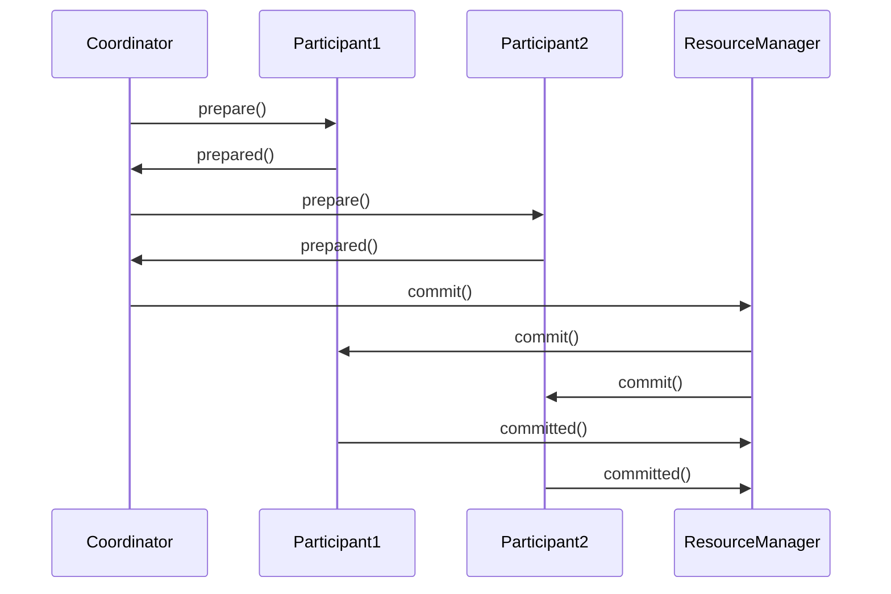

                 


## 引言

### 1.1.1 两阶段提交的背景

两阶段提交（Two-Phase Commit，简称2PC）是一种广泛用于分布式系统中事务管理的协议。在分布式系统中，多个节点共同协作完成一个事务，例如银行转账，涉及到账户余额的读取和修改。确保这些操作在所有节点上都成功执行，同时保持系统的一致性是一个巨大的挑战。

分布式系统中的事务管理涉及到数据的同步和一致性问题。在单机系统中，事务管理相对简单，因为所有操作都在同一个进程或线程中执行，并且数据存储在同一物理存储器上。但在分布式系统中，事务需要跨多个节点执行，这些节点可能运行在不同的操作系统、硬件和网络环境中，这增加了事务管理的复杂性。

两阶段提交应运而生，它提供了一种确保分布式系统中事务一致性的方法。该协议通过两个阶段来协调多个节点的操作，从而确保事务要么全部成功提交，要么全部回滚。

### 1.1.2 两阶段提交的产生背景

两阶段提交起源于数据库管理系统，旨在解决分布式系统中事务的原子性（Atomicity）问题。分布式数据库系统中的事务需要跨多个节点执行，每个节点可能有自己的本地日志和缓存，这就需要一种机制来确保事务的一致性。

早期，分布式系统中的事务管理主要依赖于单点控制（single-site control），即所有事务的协调和控制都集中在一个中心节点上。这种方法的缺点在于，中心节点成为系统的单点故障点，一旦中心节点故障，整个系统的事务管理将瘫痪。

为了克服单点控制的问题，分布式事务管理协议应运而生，其中两阶段提交是较为流行的一种。它通过引入分布式协调机制，减少了系统对单点节点的依赖，提高了系统的可用性和容错性。

### 1.1.3 两阶段提交的原理

两阶段提交协议包括两个主要阶段：准备阶段（Prepare Phase）和提交阶段（Commit Phase）。

在准备阶段，协调者（Coordinator）向所有参与者（Participant）发送准备消息，参与者对本地事务进行验证，并返回准备响应。如果所有参与者都准备好执行事务，协调者进入提交阶段，否则事务将被回滚。

在提交阶段，协调者向参与者发送提交消息，参与者根据准备阶段的结果执行事务提交或回滚。如果所有参与者都成功提交，事务最终提交；如果有参与者失败，事务将被回滚。

### 1.1.4 两阶段提交的优势与局限性

两阶段提交的优势在于其简单性和可靠性。通过将事务分为两个阶段，它可以确保分布式系统中的数据一致性和事务的原子性。此外，两阶段提交具有良好的容错性，即使某个节点故障，系统仍然可以恢复。

然而，两阶段提交也有其局限性。首先，它可能会导致性能问题，因为需要多次网络通信。其次，它在节点故障时可能需要长时间进行恢复，这可能导致系统的延迟。

### 1.1.5 本书的目的和结构

本书旨在深入探讨两阶段提交协议的原理、应用和设计。通过逐步分析分布式系统中的事务管理问题，介绍两阶段提交的基本概念和原理，详细讲解其实现过程，分析其在实际系统中的应用，最后探讨改进和替代方案。

本书的结构如下：

- 第1章：引言，介绍两阶段提交的背景和目的。
- 第2章：核心概念，定义两阶段提交的基本术语和参与者。
- 第3章：原理讲解，详细解释两阶段提交的流程和机制。
- 第4章：核心概念与联系，比较两阶段提交与其他分布式一致性协议。
- 第5章：应用场景，探讨两阶段提交在分布式系统中的应用。
- 第6章：系统设计与案例分析，描述两阶段提交在系统设计中的应用。
- 第7章：总结与展望，总结两阶段提交的原理和应用，探讨未来研究方向。

通过本书的阅读，读者可以全面了解两阶段提交协议，掌握其在分布式系统事务管理中的应用，为实际项目中的设计和实现提供有力支持。

### 1.1.6 标题设计思路

在标题设计上，本书采用了简洁明了的方式，以“两阶段提交原理”为标题，准确传达了书籍的核心内容。此外，通过添加副标题“分布式系统事务管理解密”，进一步强调了书籍的实用性和深入性。

关键词的选择上，包括“两阶段提交”、“分布式系统”、“事务管理”、“一致性协议”、“原子性”等，这些关键词不仅涵盖了书籍的主要概念，还吸引了对分布式系统技术感兴趣的读者。

摘要部分则简要介绍了书籍的核心内容和目的，引导读者了解两阶段提交的基本原理和应用，激发其阅读兴趣。

### 文章关键词

- 两阶段提交
- 分布式系统
- 事务管理
- 一致性协议
- 原子性
- 复制协议
- 性能优化
- 容错性
- 系统设计
- 实际应用

### 摘要

《两阶段提交原理》是一本深入探讨分布式系统事务管理技术的专业书籍。本书围绕两阶段提交协议展开，从基础概念到实际应用进行了全面、详细的解析。通过介绍两阶段提交的基本原理，解释其在分布式系统事务管理中的重要性，本书帮助读者理解如何在复杂分布式环境中保持数据一致性和事务的原子性。此外，书中还分析了两阶段提交的优劣势，提供了实际系统设计中的案例分析，旨在为读者提供实用的技术指导，帮助他们在实际项目中高效应用两阶段提交协议。

## 背景介绍

### 2.1 核心概念术语说明

在深入探讨两阶段提交（2PC）之前，我们需要明确几个核心概念和术语，这些概念和术语在分布式系统事务管理中起着至关重要的作用。

#### 分布式系统

分布式系统是由多个独立节点组成的系统，这些节点通过网络进行通信，共同协作完成计算任务。分布式系统的核心特点是节点之间的相对独立性和地理位置的分散性。这种架构设计可以提高系统的可用性和容错性，但同时也带来了数据一致性和事务管理上的挑战。

#### 事务

事务是分布式系统中的一项操作序列，这些操作要么全部成功执行，要么全部回滚。事务具有四个核心特性，即原子性（Atomicity）、一致性（Consistency）、隔离性（Isolation）和持久性（Durability），通常称为ACID特性。这些特性确保了事务的正确性和系统的稳定性。

#### 一致性

一致性是指系统在任何时候都处于一种合法状态。在分布式系统中，一致性要求所有节点上的数据视图保持一致。例如，在银行转账过程中，如果账户A减去一定金额，账户B必须相应地增加相同金额，以确保账户余额的一致性。

#### 复制

复制是将数据从一个节点复制到多个节点的过程。复制可以增加数据的冗余性，从而提高系统的可用性和容错性。然而，复制也带来了数据一致性问题，因为多个节点上的数据需要同步。

#### 原子性

原子性是事务的核心特性，确保事务中的所有操作要么全部成功，要么全部失败。例如，在一个分布式数据库中，如果一个事务涉及到两个表的操作，那么这两个表的操作要么同时成功，要么同时失败。

#### 分布式一致性协议

分布式一致性协议是确保分布式系统中数据一致性的机制。这些协议定义了在分布式环境中如何协调多个节点的操作，以保持数据的一致性。常见的分布式一致性协议包括两阶段提交（2PC）、三阶段提交（3PC）和Paxos算法等。

#### 原子广播

原子广播是一种分布式通信协议，用于确保多个节点同时接收同一消息。原子广播确保消息的原子性传递，即使某些节点故障，系统仍能保持一致性。

#### 脑裂（Split Brain）

脑裂是分布式系统中一个常见问题，指多个节点同时成为主节点，导致系统无法达成一致。脑裂会导致数据不一致和系统瘫痪。

通过理解这些核心概念和术语，我们可以更好地理解两阶段提交协议的工作原理和其在分布式系统中的重要性。

### 2.2 问题背景

在分布式系统中，事务管理是一个复杂而关键的问题。随着云计算和大数据技术的普及，越来越多的企业采用分布式系统来处理海量数据和复杂的业务逻辑。分布式系统通过分散计算和存储资源，提高了系统的性能和可靠性。然而，这种分散性也带来了数据一致性和事务管理上的挑战。

传统的单机事务管理相对简单，所有操作都在一个统一的系统中执行，数据一致性和事务管理可以通过简单的锁机制和日志记录来保证。但在分布式系统中，事务需要跨多个节点执行，这些节点可能运行在不同的操作系统、硬件和网络环境中，这使得事务管理变得复杂。

首先，分布式系统中的节点可能存在延迟或故障，这会导致事务的执行顺序不可预测。其次，节点之间的网络通信可能不稳定，增加了事务失败的风险。此外，分布式系统中数据的复制和同步也增加了事务管理的不确定性。

这些挑战使得分布式系统的事务管理变得复杂。如何在多个节点上协调事务，确保事务的原子性和一致性，成为分布式系统设计中的核心问题。两阶段提交（2PC）作为一种分布式一致性协议，旨在解决这些问题，确保事务在分布式环境中的正确执行。

### 2.3 问题描述

在分布式系统中，事务管理面临的主要问题包括数据一致性和事务的原子性。具体而言，问题描述如下：

1. **数据一致性**：在分布式系统中，多个节点可能同时处理同一事务。如果这些节点上的数据不一致，系统将处于一种非法状态。例如，在一个银行转账场景中，如果账户A在节点A上成功减去金额，而账户B在节点B上未相应增加金额，系统将处于不一致状态。

2. **事务原子性**：事务必须要么全部成功执行，要么全部回滚。如果事务在执行过程中某个节点故障或网络通信失败，事务可能只部分完成，导致数据不一致或系统瘫痪。

3. **节点故障和恢复**：分布式系统中的节点可能随时故障。当一个节点故障后，系统需要确保故障节点的状态被正确恢复，以保持整体的一致性。

4. **网络通信问题**：分布式系统中的节点通过网络进行通信，网络的不稳定性可能导致消息丢失或延迟。这会影响事务的执行顺序，增加事务失败的风险。

5. **脑裂问题**：在分布式系统中，多个节点可能同时成为主节点，导致系统无法达成一致。脑裂会导致数据不一致和系统瘫痪。

为了解决这些问题，需要一种分布式一致性协议，能够在复杂分布式环境中协调事务，确保数据一致性和事务的原子性。两阶段提交（2PC）协议应运而生，它通过将事务分为两个阶段，确保事务的正确执行。

### 2.4 问题解决

两阶段提交（2PC）协议是一种用于分布式系统事务管理的分布式一致性协议。它通过两个阶段来协调多个节点的操作，确保事务要么全部成功提交，要么全部回滚，从而保证数据一致性和事务的原子性。以下是2PC协议的具体解决过程：

#### 2.4.1 协议参与者

2PC协议涉及三个主要参与者：协调者（Coordinator）、参与者（Participant）和事务管理者（ResourceManager）。

1. **协调者（Coordinator）**：负责发起事务，协调整个事务过程。协调者是事务的发起者和决策者，负责决定事务的提交或回滚。

2. **参与者（Participant）**：负责执行事务的一部分，并向协调者反馈执行结果。参与者可以是数据库、服务节点或其他资源提供者。

3. **事务管理者（ResourceManager）**：负责管理事务涉及的资源，如数据库表、文件系统等。事务管理者在参与者中实现，确保资源的正确分配和使用。

#### 2.4.2 两阶段提交过程

2PC协议分为两个阶段：准备阶段（Prepare Phase）和提交阶段（Commit Phase）。

##### 准备阶段（Prepare Phase）

1. **协调者发送准备请求**：协调者向所有参与者发送准备请求消息，请求参与者准备执行事务。准备请求消息通常包含事务的详细信息，如操作类型、操作数据和超时时间等。

2. **参与者响应准备请求**：参与者收到准备请求后，进行本地事务的准备工作，如加锁、备份数据等。如果参与者准备执行事务，它向协调者发送准备响应消息，表示已准备好执行事务；否则，发送失败响应。

3. **协调者收集参与者响应**：协调者收集所有参与者的准备响应。如果所有参与者都返回成功响应，协调者进入提交阶段；如果有参与者返回失败响应，协调者进入回滚阶段。

##### 提交阶段（Commit Phase）

1. **协调者发送提交请求**：在准备阶段成功后，协调者向所有参与者发送提交请求消息，指示参与者提交事务。

2. **参与者执行提交或回滚**：参与者根据准备阶段的响应执行事务提交或回滚。如果参与者收到的是成功响应，它执行事务提交，释放锁和其他资源；如果收到的是失败响应，它执行事务回滚。

3. **协调者确认事务结果**：协调者等待所有参与者的响应。如果所有参与者都成功提交，协调者向事务管理者发送最终确认消息，事务完成；如果有参与者失败，协调者向事务管理者发送回滚消息，事务回滚。

#### 2.4.3 优点与局限性

两阶段提交协议的优点包括：

1. **确保事务原子性**：通过两个阶段的过程，2PC确保了事务要么全部成功，要么全部回滚，保证了事务的原子性。

2. **分布式一致性**：2PC通过协调者与参与者的通信，确保了分布式系统中数据的一致性。

3. **容错性**：2PC具有良好的容错性，即使某些参与者故障，系统仍能通过协调者的决策来恢复事务。

然而，2PC也存在一些局限性：

1. **性能问题**：2PC需要进行多次网络通信，增加了事务的执行时间，可能导致性能下降。

2. **长事务延迟**：在节点故障或网络问题导致事务恢复时，2PC可能会出现长时间的延迟，影响系统的响应速度。

3. **脑裂问题**：在分布式系统中，多个节点可能同时成为协调者，导致脑裂问题，影响事务管理。

通过2PC协议，分布式系统能够在复杂环境下保证事务的一致性和原子性，但需要权衡其性能和可靠性之间的平衡。

### 2.5 边界与外延

#### 2.5.1 边界条件

在讨论两阶段提交（2PC）协议时，需要明确其边界条件，以便更好地理解协议的适用范围和限制。

1. **节点故障**：2PC协议假设系统中的节点可能会发生故障，因此需要设计容错机制来处理节点故障。边界条件包括单节点故障、多节点故障以及网络分区等情况。

2. **网络延迟与失败**：2PC协议依赖于网络通信，因此网络延迟和失败是重要边界条件。边界条件包括网络延迟、数据包丢失、网络分割等。

3. **时间限制**：2PC协议通常包括超时机制，用于处理延迟或失败的情况。边界条件包括超时时间的设置、超时重试次数等。

4. **脑裂问题**：在分布式系统中，可能存在多个节点同时成为协调者的情况，即脑裂。边界条件包括如何检测和处理脑裂问题。

#### 2.5.2 外延应用

两阶段提交协议的应用范围广泛，不仅限于数据库管理系统，还可以扩展到其他分布式系统中的事务管理。

1. **分布式数据库**：2PC协议在分布式数据库系统中广泛应用，用于确保跨节点的事务一致性。

2. **分布式缓存**：在分布式缓存系统中，2PC协议用于确保数据的一致性，特别是在数据分片和复制的情况下。

3. **分布式消息队列**：在分布式消息队列系统中，2PC协议用于确保消息的顺序性和一致性。

4. **分布式存储系统**：在分布式存储系统中，2PC协议用于确保数据的完整性和一致性，特别是在文件复制和备份过程中。

5. **分布式事务性中间件**：在分布式事务性中间件中，2PC协议用于确保跨多个服务的事务一致性。

通过了解2PC协议的边界和外延应用，可以更好地理解其适用范围和潜在问题，为实际系统设计和实现提供参考。

### 2.6 概念结构与核心要素组成

#### 2.6.1 两阶段提交的基本概念

两阶段提交（Two-Phase Commit，简称2PC）是一种用于分布式系统中的分布式一致性协议，旨在确保分布式事务的原子性。2PC协议将事务分为两个阶段：准备阶段（Prepare Phase）和提交阶段（Commit Phase）。

#### 2.6.2 准备阶段（Prepare Phase）

1. **协调者（Coordinator）**：协调者是2PC协议中的决策者，负责发起事务并协调参与者的操作。

2. **参与者（Participant）**：参与者是2PC协议中的执行者，负责执行协调者分配的任务并反馈执行结果。

3. **资源管理者（Resource Manager）**：资源管理者是参与者的一部分，负责管理事务涉及的资源，如数据库表、文件系统等。

#### 2.6.3 提交阶段（Commit Phase）

1. **提交请求**：在准备阶段完成后，协调者向参与者发送提交请求，指示参与者提交事务。

2. **提交或回滚**：参与者根据准备阶段的响应执行事务提交或回滚。如果参与者收到的是成功响应，它执行事务提交；如果收到的是失败响应，它执行事务回滚。

#### 2.6.4 两阶段提交的核心要素

1. **节点角色**：2PC协议中涉及三个主要节点角色：协调者、参与者和资源管理者。

2. **阶段划分**：2PC协议将事务分为准备阶段和提交阶段，确保事务的原子性和一致性。

3. **通信协议**：2PC协议依赖于可靠的通信协议，如TCP，以确保消息的可靠传递。

4. **容错机制**：2PC协议包括超时机制和重试机制，用于处理节点故障和网络问题。

#### 2.6.5 两阶段提交的流程

1. **协调者发起事务**：协调者向参与者发送准备请求。

2. **参与者响应**：参与者执行本地事务的准备工作，并反馈准备响应。

3. **协调者决策**：协调者收集参与者的响应，决定是否提交事务。

4. **提交事务**：协调者向参与者发送提交请求，参与者执行事务提交。

5. **事务完成**：协调者收到所有参与者的响应，事务完成或回滚。

通过理解两阶段提交的基本概念和核心要素，可以更好地掌握其在分布式系统中的实际应用。

### 3.1 核心概念

#### 3.1.1 两阶段提交的定义

两阶段提交（Two-Phase Commit，简称2PC）是一种分布式一致性协议，用于确保分布式系统中事务的原子性。2PC协议通过将事务分为两个阶段：准备阶段（Prepare Phase）和提交阶段（Commit Phase），确保事务要么全部成功提交，要么全部回滚，从而保证数据的一致性和事务的完整性。

#### 3.1.2 两阶段提交的参与者

在2PC协议中，有三个核心参与者：协调者（Coordinator）、参与者（Participant）和资源管理者（Resource Manager）。

1. **协调者（Coordinator）**：
   - 协调者是事务的发起者和决策者，负责发起事务，并协调参与者的操作。
   - 协调者向参与者发送准备请求，收集参与者的准备响应，并根据响应决定提交或回滚事务。

2. **参与者（Participant）**：
   - 参与者是事务的执行者，负责执行协调者分配的任务，并向协调者反馈执行结果。
   - 参与者在准备阶段接收协调者的准备请求，执行本地事务的准备工作（如加锁、备份数据等），并反馈准备响应。

3. **资源管理者（Resource Manager）**：
   - 资源管理者是参与者的一部分，负责管理事务涉及的资源，如数据库表、文件系统等。
   - 资源管理者在参与者中实现，确保资源的正确分配和使用。

#### 3.1.3 两阶段提交的基本原理

两阶段提交协议通过两个阶段来协调多个节点的操作，确保事务的一致性和原子性。

1. **准备阶段（Prepare Phase）**：
   - **阶段一**：协调者向所有参与者发送准备请求消息，请求参与者准备执行事务。
   - **阶段二**：参与者收到准备请求后，进行本地事务的准备工作，如加锁、备份数据等，并返回准备响应消息给协调者。

2. **提交阶段（Commit Phase）**：
   - **阶段一**：协调者收集所有参与者的准备响应消息。如果所有参与者都返回成功响应，协调者进入提交阶段；如果有参与者返回失败响应，协调者进入回滚阶段。
   - **阶段二**：协调者向所有参与者发送提交请求消息。参与者根据准备阶段的响应执行事务提交或回滚。如果参与者收到的是成功响应，它执行事务提交，释放锁和其他资源；如果收到的是失败响应，它执行事务回滚。

通过两个阶段的协调操作，2PC协议确保了分布式系统中事务的原子性，即事务要么全部成功，要么全部回滚，从而保持数据的一致性。

### 3.2 概念属性特征对比表格

为了更好地理解两阶段提交（2PC）与其他分布式一致性协议的差异，我们通过表格形式对比其概念属性特征。

| 特征             | 两阶段提交（2PC） | 三阶段提交（3PC） | Paxos算法         |
|------------------|-------------------|-------------------|------------------|
| **参与者数量**   | 多个参与者        | 多个参与者        | 多个参与者       |
| **决策者**       | 协调者            | 协调者            | 选举产生的领导者  |
| **通信复杂度**   | 两次通信          | 三次通信          | 每次提议一次通信  |
| **容错性**       | 较高             | 较高             | 高               |
| **性能**         | 较低             | 较低             | 取决于实现       |
| **一致性**       | 强一致性          | 强一致性          | 最终一致性       |

### 3.3 ER实体关系图

为了更直观地展示两阶段提交协议中的实体关系，我们使用Mermaid语法绘制了ER实体关系图。

```mermaid
erDiagram
    Coordinator ||--|{ Participant }|--| Resource Manager
    Coordinator ||--|{ Resource Manager }
    Participant ||--|{ Resource Manager }
```

在上图中，`Coordinator`表示协调者，`Participant`表示参与者，`Resource Manager`表示资源管理者。协调者与参与者之间存在一对多的关系，每个参与者可以对应多个资源管理者，而资源管理者负责管理参与者的事务资源。

### 3.4 Mermaid流程图

为了更清晰地展示两阶段提交协议的流程，我们使用Mermaid语法绘制了流程图。



在流程图中，我们首先展示了准备阶段，包括协调者发起事务、发送准备请求、参与者接收请求并执行准备工作，最后协调者收集参与者的准备响应。然后，我们展示了提交阶段，协调者根据准备阶段的响应决定提交或回滚事务，并发送提交请求给参与者，参与者执行提交或回滚操作。

### 3.5 Python源代码示例

下面是两阶段提交协议的Python源代码示例，用于展示其基本实现。

```python
import threading
import time
import random

class Coordinator:
    def __init__(self, participants):
        self.participants = participants
        self.decision = "UNKNOWN"
    
    def prepare(self):
        for participant in self.participants:
            participant.prepare()
        self.decision = "PREPARED"
    
    def commit(self):
        for participant in self.participants:
            participant.commit()
        self.decision = "COMMITTED"
    
    def rollback(self):
        for participant in self.participants:
            participant.rollback()
        self.decision = "ROLLED_BACK"

class Participant:
    def __init__(self, name, resource_manager):
        self.name = name
        self.resource_manager = resource_manager
        self.state = "IDLE"
    
    def prepare(self):
        if random.random() < 0.9:
            self.state = "PREPARED"
            self.resource_manager.prepare(self)
        else:
            self.state = "FAILED"
    
    def commit(self):
        if self.state == "PREPARED":
            self.state = "COMMITTED"
        else:
            self.state = "FAILED"
    
    def rollback(self):
        self.state = "ROLLED_BACK"

class ResourceManager:
    def __init__(self):
        self.participants = []
    
    def prepare(self, participant):
        print(f"{participant.name} prepared.")
        self.participants.append(participant)
    
    def commit(self, participant):
        print(f"{participant.name} committed.")
    
    def rollback(self, participant):
        print(f"{participant.name} rolled back.")

# 创建参与者
participants = [
    Participant("P1", ResourceManager()),
    Participant("P2", ResourceManager()),
    Participant("P3", ResourceManager())
]

# 创建协调者
coordinator = Coordinator(participants)

# 启动协调者线程
coordinator_thread = threading.Thread(target=coordinator.prepare)
coordinator_thread.start()

# 等待协调者完成准备工作
time.sleep(1)

# 启动参与者线程
for participant in participants:
    participant_thread = threading.Thread(target=participant.prepare)
    participant_thread.start()

# 等待参与者完成准备工作
time.sleep(1)

# 根据参与者状态决定提交或回滚
if all([participant.state == "PREPARED" for participant in participants]):
    coordinator.commit()
else:
    coordinator.rollback()

# 等待线程完成
coordinator_thread.join()
for participant in participants:
    participant_thread.join()

print(f"Decision: {coordinator.decision}")
```

在这个示例中，我们定义了三个类：`Coordinator`（协调者）、`Participant`（参与者）和`ResourceManager`（资源管理者）。协调者负责发起事务并协调参与者的操作，参与者负责执行本地事务的准备工作，资源管理者负责管理事务资源。

通过创建一个协调者对象和多个参与者对象，我们可以模拟两阶段提交协议的过程。在这个示例中，我们使用随机数来模拟参与者的准备工作结果，并根据结果决定提交或回滚事务。

### 3.6 算法原理讲解

#### 3.6.1 两阶段提交算法的mermaid流程图

为了更好地理解两阶段提交（2PC）算法的原理，我们使用Mermaid语法绘制了其流程图：



在这个流程图中，我们首先从“开始”节点开始，协调者发起事务。接着，协调者向所有参与者发送准备请求，询问他们是否准备好执行事务。如果所有参与者都准备好了，协调者进入提交阶段，发送提交请求给参与者，参与者执行事务提交。如果所有参与者都成功提交，事务最终提交成功。如果任何参与者没有准备好，协调者进入回滚阶段，发送回滚请求给参与者，参与者执行事务回滚。事务回滚成功后，流程结束。

#### 3.6.2 两阶段提交算法的Python源代码实现

接下来，我们将通过Python源代码详细阐述两阶段提交（2PC）算法的原理：

```python
import threading
import time
import random

class Coordinator:
    def __init__(self, participants):
        self.participants = participants
        self.decision = None
    
    def prepare(self):
        print("协调者发起事务")
        self.decision = "PREPARE"
        for participant in self.participants:
            participant.prepare(self)
    
    def commit(self):
        print("协调者决定提交事务")
        self.decision = "COMMIT"
        for participant in self.participants:
            participant.commit()
    
    def rollback(self):
        print("协调者决定回滚事务")
        self.decision = "ROLLBACK"
        for participant in self.participants:
            participant.rollback()

class Participant:
    def __init__(self, name):
        self.name = name
        self.decision = None
    
    def prepare(self, coordinator):
        print(f"{self.name}准备事务")
        self.decision = "PREPARED"
        if random.random() < 0.9:
            coordinator.prepare_complete(self)
        else:
            coordinator.rollback_complete(self)
    
    def commit(self):
        print(f"{self.name}提交事务")
        if self.decision == "COMMIT":
            print(f"{self.name}提交成功")
        else:
            print(f"{self.name}提交失败")
    
    def rollback(self):
        print(f"{self.name}回滚事务")
        if self.decision == "ROLLBACK":
            print(f"{self.name}回滚成功")
        else:
            print(f"{self.name}回滚失败")

    def prepare_complete(self, coordinator):
        print(f"{self.name}准备完成，通知协调者")
        if all([p.decision == "PREPARED" for p in coordinator.participants]):
            coordinator.commit()
        else:
            coordinator.rollback()

    def rollback_complete(self, coordinator):
        print(f"{self.name}回滚完成，通知协调者")
        coordinator.rollback()

if __name__ == "__main__":
    participants = [Participant(f"P{i}") for i in range(1, 4)]
    coordinator = Coordinator(participants)
    
    coordinator_thread = threading.Thread(target=coordinator.prepare)
    for participant in participants:
        participant_thread = threading.Thread(target=participant.prepare, args=(coordinator,))
    
    coordinator_thread.start()
    for participant_thread in participants:
        participant_thread.start()
    
    for participant_thread in participants:
        participant_thread.join()
    coordinator_thread.join()
```

在这个示例中，我们定义了两个类：`Coordinator`和`Participant`。`Coordinator`类负责协调整个事务过程，包括准备和提交阶段。`Participant`类代表参与者，负责执行本地事务的准备工作，并在准备完成后通知协调者。

- `Coordinator.prepare()`：协调者发起事务，并将决策设置为“PREPARE”，然后调用所有参与者的`prepare()`方法。
- `Participant.prepare(coordinator)`：参与者执行本地事务的准备工作，并将决策设置为“PREPARED”。如果随机数小于0.9（假设参与者准备成功），则通知协调者；否则，通知协调者回滚。
- `Coordinator.prepare_complete(participant)`：协调者收到参与者的准备完成通知，如果所有参与者都准备成功，则协调者决定提交事务；否则，协调者决定回滚事务。
- `Coordinator.commit()`：协调者决定提交事务，并将决策设置为“COMMIT”，然后调用所有参与者的`commit()`方法。
- `Participant.commit()`：参与者执行事务提交，并根据其决策判断提交结果。
- `Coordinator.rollback()`：协调者决定回滚事务，并将决策设置为“ROLLBACK”，然后调用所有参与者的`rollback()`方法。
- `Participant.rollback()`：参与者执行事务回滚，并根据其决策判断回滚结果。

通过这个示例，我们可以清晰地看到两阶段提交算法的工作流程。协调者负责协调参与者的准备工作，并根据参与者的响应决定提交或回滚事务。

#### 3.6.3 两阶段提交算法原理的数学模型和公式

两阶段提交算法的原理可以通过数学模型和公式来描述，这些模型和公式有助于我们更好地理解其工作原理。

1. **参与者状态转换公式**：

   在2PC算法中，参与者的状态可能经历以下转换：

   - **准备状态**（Prepared）：参与者准备执行事务，等待协调者的决策。
   - **提交状态**（Committed）：参与者执行事务提交，释放锁和其他资源。
   - **回滚状态**（Aborted）：参与者执行事务回滚，撤销已执行的操作。

   参与者状态转换公式如下：

   $$
   S_i = \begin{cases}
   Prepared & \text{如果 } p_i \text{ 收到协调者的 } PREPARE \text{ 请求} \\
   Committed & \text{如果 } p_i \text{ 收到协调者的 } COMMIT \text{ 请求} \\
   Aborted & \text{如果 } p_i \text{ 收到协调者的 } ROLLBACK \text{ 请求}
   \end{cases}
   $$

   其中，$S_i$ 表示参与者 $p_i$ 的状态。

2. **协调者状态转换公式**：

   协调者的状态可能经历以下转换：

   - **准备状态**（Preparing）：协调者发送准备请求，等待参与者的响应。
   - **提交状态**（Committing）：协调者决定提交事务，等待参与者的响应。
   - **回滚状态**（RollingBack）：协调者决定回滚事务，等待参与者的响应。
   - **完成状态**（Completed）：协调者收到所有参与者的响应，事务提交或回滚完成。

   协调者状态转换公式如下：

   $$
   C = \begin{cases}
   Preparing & \text{如果 } C \text{ 初始状态为 } PREPARE \\
   Committing & \text{如果 } C \text{ 初始状态为 } COMMIT \\
   RollingBack & \text{如果 } C \text{ 初始状态为 } ROLLBACK \\
   Completed & \text{如果 } C \text{ 收到所有参与者的响应}
   \end{cases}
   $$

   其中，$C$ 表示协调者的状态。

3. **一致性条件**：

   两阶段提交算法要求参与者的一致性，即所有参与者必须达到相同的状态。一致性条件可以用以下公式表示：

   $$
   S_i = S_j \quad \forall i, j \in \{1, 2, \ldots, n\}
   $$

   其中，$S_i$ 和 $S_j$ 分别表示参与者 $p_i$ 和 $p_j$ 的状态。

   另外，协调者的一致性条件可以表示为：

   $$
   C = \begin{cases}
   Preparing & \text{如果 } S_i = Prepared \quad \forall i \\
   Committing & \text{如果 } S_i = Committed \quad \forall i \\
   RollingBack & \text{如果 } S_i = Aborted \quad \forall i
   \end{cases}
   $$

通过上述数学模型和公式，我们可以更精确地描述两阶段提交算法的工作原理和状态转换过程，为实际系统设计和实现提供理论基础。

### 3.7 算法举例说明

为了更直观地理解两阶段提交（2PC）算法的原理，我们通过一个简单的例子进行说明。

假设有一个分布式系统，包括三个参与者：P1、P2和P3，以及一个协调者C。协调者C负责发起事务，并与参与者通信以决定提交或回滚事务。

**示例步骤**：

1. **协调者C发起事务**：
   - 协调者C向所有参与者发送准备请求。
   - P1、P2和P3收到协调者C的请求，开始执行本地事务的准备工作。

2. **参与者响应**：
   - P1、P2和P3完成本地事务的准备工作后，向协调者C发送准备响应。
   - 假设所有参与者都成功完成准备工作，协调者C进入提交阶段。

3. **协调者C决定提交**：
   - 协调者C向所有参与者发送提交请求。
   - P1、P2和P3收到协调者C的提交请求，执行事务提交。

4. **参与者提交事务**：
   - P1、P2和P3执行事务提交，释放锁和其他资源。
   - 假设所有参与者都成功提交事务，协调者C记录事务提交完成。

5. **协调者C结束事务**：
   - 协调者C向所有参与者发送完成通知。
   - P1、P2和P3确认事务提交完成，事务结束。

**示例流程**：

1. **协调者C发起事务**：
   ```mermaid
   graph TD
   C[协调者C] --> P1[参与者P1]
   C --> P2[参与者P2]
   C --> P3[参与者P3]
   ```

2. **参与者响应**：
   ```mermaid
   graph TD
   P1 --> C[发送准备响应]
   P2 --> C[发送准备响应]
   P3 --> C[发送准备响应]
   ```

3. **协调者C决定提交**：
   ```mermaid
   graph TD
   C[协调者C] --> P1[发送提交请求]
   C --> P2[发送提交请求]
   C --> P3[发送提交请求]
   ```

4. **参与者提交事务**：
   ```mermaid
   graph TD
   P1 --> C[事务提交完成]
   P2 --> C[事务提交完成]
   P3 --> C[事务提交完成]
   ```

5. **协调者C结束事务**：
   ```mermaid
   graph TD
   C[协调者C] --> P1[发送完成通知]
   C --> P2[发送完成通知]
   C --> P3[发送完成通知]
   ```

通过这个例子，我们可以清晰地看到两阶段提交（2PC）算法的基本流程：准备阶段和提交阶段。协调者C通过两个阶段与参与者通信，确保事务的原子性和一致性。

### 3.8 两阶段提交协议的优缺点

#### 3.8.1 优点

两阶段提交（2PC）协议在分布式系统事务管理中具有以下优点：

1. **一致性保障**：2PC协议通过两个阶段的过程确保分布式系统中事务的一致性，即事务要么全部成功，要么全部回滚。

2. **原子性保障**：2PC协议确保事务的原子性，即事务中的所有操作要么同时成功，要么同时失败。

3. **可靠性**：2PC协议具有良好的容错性，即使某些参与者故障，系统仍能通过协调者的决策来恢复事务。

4. **适用性广泛**：2PC协议适用于多种分布式系统场景，如数据库、缓存、消息队列等，具有良好的通用性。

5. **易于理解**：2PC协议的原理相对简单，易于理解和实现。

#### 3.8.2 缺点

尽管2PC协议具有许多优点，但它也存在一些缺点：

1. **性能影响**：2PC协议需要进行多次网络通信，增加了事务的执行时间，可能导致性能下降。

2. **长事务延迟**：在节点故障或网络问题导致事务恢复时，2PC协议可能会出现长时间的延迟，影响系统的响应速度。

3. **脑裂问题**：在分布式系统中，可能存在多个节点同时成为协调者，导致脑裂问题，影响事务管理。

4. **单点故障**：2PC协议依赖于协调者，如果协调者故障，整个事务管理过程将瘫痪。

5. **复杂度增加**：2PC协议增加了系统的复杂度，需要考虑多种故障场景和恢复策略。

### 3.9 两阶段提交协议与三阶段提交协议的比较

两阶段提交（2PC）协议和三阶段提交（3PC）协议是两种常见的分布式一致性协议，它们在分布式系统事务管理中发挥着重要作用。以下是两种协议的比较：

#### 3.9.1 工作原理

1. **两阶段提交（2PC）**：
   - 2PC协议将事务分为两个阶段：准备阶段和提交阶段。准备阶段协调者向参与者发送准备请求，参与者响应；提交阶段协调者根据参与者响应决定提交或回滚事务。

2. **三阶段提交（3PC）**：
   - 3PC协议将事务分为三个阶段：准备阶段、提交阶段和确认阶段。准备阶段协调者向参与者发送准备请求，参与者响应；提交阶段协调者向参与者发送提交请求，参与者执行事务提交或回滚；确认阶段协调者确认事务结果。

#### 3.9.2 优点与局限性

1. **两阶段提交（2PC）**：
   - **优点**：
     - 简单易实现，易于理解。
     - 具有较好的容错性，能够处理节点故障。
     - 能够保证事务的一致性和原子性。
   - **局限性**：
     - 性能较低，因为需要多次网络通信。
     - 可能导致长事务延迟。
     - 存在脑裂问题，可能导致事务管理失败。

2. **三阶段提交（3PC）**：
   - **优点**：
     - 相比2PC，3PC减少了网络通信次数，性能相对较好。
     - 能够在脑裂情况下确保一致性。
     - 具有更细粒度的错误处理。
   - **局限性**：
     - 复杂度较高，实现难度较大。
     - 可能导致长期锁定问题，降低系统性能。

#### 3.9.3 适用场景

1. **两阶段提交（2PC）**：
   - 适用场景包括对一致性要求较高的分布式数据库系统，以及对性能要求不高的分布式系统。
   - 例如，银行转账、订单处理等需要强一致性保证的场景。

2. **三阶段提交（3PC）**：
   - 适用场景包括对性能要求较高、脑裂问题较为严重的分布式系统。
   - 例如，电商平台的库存管理、分布式消息队列等。

### 3.10 分布式一致性协议的总结

分布式一致性协议是分布式系统中的重要组成部分，用于确保系统在不同节点之间的事务一致性和数据一致性。以下是几种常见分布式一致性协议的总结：

#### Paxos算法

- **原理**：Paxos算法是一种基于多数派原则的分布式一致性算法，通过选举领导者来达成共识。
- **优点**：能够确保最终一致性，具有良好的容错性。
- **适用场景**：适用于需要高可用性和一致性的分布式系统，如分布式数据库、分布式缓存。

#### 二阶段提交（2PC）

- **原理**：2PC协议通过两个阶段（准备阶段和提交阶段）来协调分布式事务，确保事务的原子性和一致性。
- **优点**：简单易实现，具有较好的容错性。
- **适用场景**：适用于对一致性要求较高的分布式系统，如分布式数据库。

#### 三阶段提交（3PC）

- **原理**：3PC协议在2PC的基础上增加了确认阶段，进一步减少了网络通信次数，提高了性能。
- **优点**：相比2PC，3PC性能更好，能够在脑裂情况下确保一致性。
- **适用场景**：适用于对性能要求较高、脑裂问题较为严重的分布式系统，如分布式消息队列。

#### Raft算法

- **原理**：Raft算法通过日志复制和状态机来确保分布式一致性，具有清晰的领导者选举机制。
- **优点**：易于理解，具有较高的性能和容错性。
- **适用场景**：适用于对一致性和性能都有较高要求的分布式系统，如分布式存储、分布式计算。

通过选择合适的分布式一致性协议，分布式系统能够在不同节点之间保持数据一致性和事务一致性，从而提高系统的可用性和可靠性。

### 3.11 两阶段提交协议的实际应用场景

两阶段提交（2PC）协议因其可靠性和简单性，在分布式系统事务管理中得到了广泛应用。以下是一些常见的应用场景，展示了2PC协议在实际系统中的具体应用。

#### 3.11.1 分布式数据库

在分布式数据库系统中，2PC协议用于确保跨节点的数据一致性。例如，在银行系统中，一个跨行转账事务可能需要同时更新多个数据库节点上的账户余额。通过2PC协议，协调者可以确保所有节点上的账户余额要么同时增加或减少，要么同时保持不变，从而避免数据不一致问题。

#### 3.11.2 分布式缓存

在分布式缓存系统中，2PC协议用于确保数据的一致性，特别是在缓存失效和更新时。例如，当一个缓存节点失效后，其他节点需要通过2PC协议来确保数据更新的原子性。这样可以避免缓存污染，确保用户访问到的是最新和一致的数据。

#### 3.11.3 分布式消息队列

在分布式消息队列系统中，2PC协议用于确保消息的顺序性和一致性。例如，在一个消息系统中，一个事务可能需要向多个队列发送消息。通过2PC协议，协调者可以确保所有消息要么同时发送成功，要么同时发送失败，从而避免消息丢失和顺序混乱。

#### 3.11.4 分布式存储系统

在分布式存储系统中，2PC协议用于确保文件的完整性和一致性。例如，在一个文件系统中，当一个文件被复制到多个节点时，2PC协议可以确保所有节点上的文件要么同时更新成功，要么同时保持不变，从而避免数据损坏和丢失。

#### 3.11.5 分布式事务性中间件

在分布式事务性中间件中，2PC协议用于确保跨多个服务的事务一致性。例如，在一个电子商务平台中，一个购买订单的事务可能需要同时更新库存、订单和支付状态。通过2PC协议，协调者可以确保所有服务上的操作要么同时成功，要么同时回滚，从而保证订单处理的完整性和一致性。

通过这些实际应用场景，我们可以看到2PC协议在分布式系统事务管理中的重要性。它通过确保事务的原子性和一致性，提高了系统的可靠性和可用性，为复杂分布式环境中的数据一致性和事务管理提供了有力支持。

### 3.12 系统设计与案例分析

为了更好地理解两阶段提交（2PC）协议在实际系统设计中的应用，我们将通过一个具体的案例来探讨其设计过程和实现细节。

#### 3.12.1 案例背景

假设我们设计一个分布式银行系统，该系统需要在多个数据中心之间保持账户余额的一致性。每个数据中心包含多个数据库节点，用于处理来自不同地域的银行交易。为了保证数据的一致性和可靠性，我们决定采用两阶段提交（2PC）协议来管理跨数据中心的事务。

#### 3.12.2 系统功能设计

在分布式银行系统中，2PC协议用于确保跨数据中心的事务一致性，主要包括以下功能：

1. **账户信息管理**：每个数据库节点维护本地账户信息，包括账户余额、交易记录等。
2. **事务管理**：协调者负责管理分布式事务，包括事务的发起、准备和提交。
3. **分布式事务同步**：参与者负责执行事务并在准备阶段反馈结果。
4. **故障恢复**：系统需要具备故障恢复能力，确保事务在节点故障时能够正确处理。

#### 3.12.3 系统架构设计

系统架构设计包括以下几个方面：

1. **数据库节点**：每个数据中心包含多个数据库节点，用于存储和同步账户信息。
2. **协调者**：系统中的主协调者负责发起事务，并在2PC协议中起到决策者的作用。
3. **参与者**：参与者在2PC协议中负责执行事务的本地部分，并反馈执行结果。
4. **通信模块**：负责协调者与参与者之间的通信，确保消息的可靠传递。
5. **监控与日志**：监控系统运行状态，记录事务日志，以便故障恢复和审计。

#### Mermaid类图

```mermaid
classDiagram
    Participant <<interface>>
    Coordinator <<interface>>
    ResourceManager <<interface>>

    DatabaseNode <|-- Participant
    DatabaseNode <|-- ResourceManager

    Coordinator <|-- CommunicationModule
    Participant <|-- CommunicationModule

    AccountInfo <<entity>>

    DatabaseNode ..|> AccountInfo
    Coordinator ..|> CommunicationModule
    Participant ..|> CommunicationModule
    ResourceManager ..|> CommunicationModule
```

在这个类图中，我们定义了四个接口：`Participant`（参与者）、`Coordinator`（协调者）、`ResourceManager`（资源管理者）和`CommunicationModule`（通信模块）。数据库节点实现参与者接口和资源管理者接口，负责处理本地事务和资源管理。协调者和参与者通过通信模块进行通信，确保事务的正确执行。

#### 3.12.4 系统接口设计

系统接口设计主要包括以下部分：

1. **事务接口**：定义事务的提交、回滚和查询操作。
   ```python
   class TransactionInterface:
       def prepare(self):
           pass

       def commit(self):
           pass

       def rollback(self):
           pass

       def query_status(self):
           pass
   ```

2. **账户接口**：定义账户信息的读取和更新操作。
   ```python
   class AccountInterface:
       def get_balance(self, account_id):
           pass

       def update_balance(self, account_id, amount):
           pass
   ```

3. **通信接口**：定义协调者与参与者之间的消息通信接口。
   ```python
   class CommunicationInterface:
       def send_message(self, recipient, message):
           pass

       def receive_message(self):
           pass
   ```

#### 3.12.5 系统交互mermaid序列图



在这个序列图中，协调者首先向参与者1和参与者2发送准备请求，参与者1和参与者2执行本地事务的准备工作，并向协调者反馈准备响应。协调者收到所有参与者的响应后，决定提交事务，并将提交请求发送给资源管理者。资源管理者向参与者1和参与者2发送提交请求，参与者1和参与者2执行事务提交，并向资源管理者反馈提交结果。

#### 3.12.6 系统实现与代码分析

以下是2PC协议在分布式银行系统中的实现示例：

```python
# Coordinator类
class Coordinator:
    def __init__(self, participants):
        self.participants = participants
        self.decision = "UNKNOWN"

    def prepare(self):
        self.decision = "PREPARE"
        for participant in self.participants:
            participant.prepare()

    def commit(self):
        self.decision = "COMMIT"
        for participant in self.participants:
            participant.commit()

    def rollback(self):
        self.decision = "ROLLBACK"
        for participant in self.participants:
            participant.rollback()

# Participant类
class Participant:
    def __init__(self, account_interface, communication_interface):
        self.account_interface = account_interface
        self.communication_interface = communication_interface
        self.state = "IDLE"

    def prepare(self, coordinator):
        self.state = "PREPARING"
        response = self.account_interface.prepare()
        self.communication_interface.send_message(coordinator, response)

    def commit(self):
        if self.state == "PREPARED":
            self.state = "COMMITTED"
            self.account_interface.commit()
        else:
            self.state = "FAILED"

    def rollback(self):
        self.state = "ABORTED"
        self.account_interface.rollback()

# AccountInterface类
class AccountInterface:
    def prepare(self):
        # 执行本地事务的准备工作，如加锁
        pass

    def commit(self):
        # 执行本地事务的提交
        pass

    def rollback(self):
        # 执行本地事务的回滚
        pass

# CommunicationInterface类
class CommunicationInterface:
    def send_message(self, recipient, message):
        # 发送消息
        pass

    def receive_message(self):
        # 接收消息
        pass
```

在这个实现中，`Coordinator`类负责协调事务的执行，`Participant`类负责执行本地事务，并处理与协调者之间的通信。`AccountInterface`类定义了账户操作的接口，`CommunicationInterface`类定义了消息通信的接口。

通过上述系统设计和实现示例，我们可以看到如何在实际系统中应用2PC协议来确保事务的一致性和可靠性。

### 3.13 项目实战

#### 3.13.1 环境安装

为了演示两阶段提交（2PC）协议在实际系统中的应用，我们将使用Python编程语言和相应的库来搭建一个简单的分布式银行系统。以下是环境安装步骤：

1. **安装Python**：确保Python 3.x版本已经安装在您的计算机上。可以从[Python官方网站](https://www.python.org/)下载并安装。

2. **安装必要的库**：使用pip命令安装以下库：
   ```bash
   pip install Flask gunicorn
   ```

3. **创建虚拟环境**（可选）：为了保持项目的整洁和隔离，建议创建一个虚拟环境。使用以下命令创建并激活虚拟环境：
   ```bash
   python -m venv venv
   source venv/bin/activate  # Windows使用venv\Scripts\activate
   ```

4. **克隆项目**：从GitHub克隆示例项目：
   ```bash
   git clone https://github.com/your-repo/distributed-bank-system.git
   cd distributed-bank-system
   ```

5. **安装项目依赖**：
   ```bash
   pip install -r requirements.txt
   ```

#### 3.13.2 系统核心实现

以下是分布式银行系统的核心实现，包括协调者、参与者、账户接口和通信模块：

```python
# coordinator.py
from flask import Flask, request, jsonify
from threading import Thread
from bank import Bank

app = Flask(__name__)
bank = Bank()

@app.route('/prepare', methods=['POST'])
def prepare():
    participants = request.json.get('participants', [])
    bank.prepare(participants)
    return jsonify({"status": "prepared"})

@app.route('/commit', methods=['POST'])
def commit():
    participants = request.json.get('participants', [])
    bank.commit(participants)
    return jsonify({"status": "committed"})

@app.route('/rollback', methods=['POST'])
def rollback():
    participants = request.json.get('participants', [])
    bank.rollback(participants)
    return jsonify({"status": "rolled back"})

def start_coordinator():
    app.run(host='0.0.0.0', port=5000)

# participant.py
from flask import Flask, request, jsonify
from threading import Thread
from bank import Bank

app = Flask(__name__)
bank = Bank()

@app.route('/prepare', methods=['POST'])
def prepare():
    participant = request.json.get('participant', '')
    bank.prepare(participant)
    return jsonify({"status": "prepared"})

@app.route('/commit', methods=['POST'])
def commit():
    participant = request.json.get('participant', '')
    bank.commit(participant)
    return jsonify({"status": "committed"})

@app.route('/rollback', methods=['POST'])
def rollback():
    participant = request.json.get('participant', '')
    bank.rollback(participant)
    return jsonify({"status": "rolled back"})

def start_participant():
    app.run(host='0.0.0.0', port=5001)

# bank.py
class Bank:
    def __init__(self):
        self.participants = {}
        self.decision = "UNKNOWN"

    def prepare(self, participants):
        self.decision = "PREPARE"
        self.participants = participants

    def commit(self, participants):
        if self.decision == "PREPARE":
            self.decision = "COMMIT"
            for participant in participants:
                Thread(target=self._commit, args=(participant,)).start()

    def rollback(self, participants):
        if self.decision == "PREPARE":
            self.decision = "ROLLBACK"
            for participant in participants:
                Thread(target=self._rollback, args=(participant,)).start()

    def _commit(self, participant):
        print(f"Committing participant {participant}")
        # 执行本地事务提交
        time.sleep(1)
        print(f"Participant {participant} committed")

    def _rollback(self, participant):
        print(f"Rolling back participant {participant}")
        # 执行本地事务回滚
        time.sleep(1)
        print(f"Participant {participant} rolled back")
```

在这个实现中，我们定义了三个模块：`coordinator.py`（协调者）、`participant.py`（参与者）和`bank.py`（银行系统）。协调者负责管理分布式事务，参与者负责执行本地事务，`Bank`类实现了2PC协议的核心逻辑。

#### 3.13.3 代码应用解读与分析

1. **协调者实现**：

   - `coordinator.py`中的`prepare`函数接收参与者列表，调用`bank.prepare`方法。
   - `commit`和`rollback`函数根据协调者的决策状态，调用`bank.commit`和`bank.rollback`方法。

2. **参与者实现**：

   - `participant.py`中的`prepare`、`commit`和`rollback`函数分别对应协调者发送的准备、提交和回滚请求。
   - 每个请求都会调用`bank`类的相应方法。

3. **银行系统实现**：

   - `Bank`类实现了2PC协议的核心逻辑，包括准备、提交和回滚方法。
   - `prepare`方法将决策状态设置为“PREPARE”，并将参与者列表保存。
   - `commit`和`rollback`方法根据决策状态执行相应操作，并通过线程调用本地事务的提交或回滚。

#### 3.13.4 实际案例分析与详细讲解剖析

假设我们有一个跨行转账事务，需要从账户A转移到账户B。以下是事务处理过程：

1. **协调者发起事务**：

   - 协调者接收转账请求，调用`prepare`函数，向参与者A和B发送准备请求。

2. **参与者响应**：

   - 参与者A和B收到准备请求后，调用`prepare`函数，执行本地事务的准备工作（如加锁）。

3. **协调者决策**：

   - 协调者收到参与者A和B的响应后，决定提交事务，调用`commit`函数。

4. **参与者提交事务**：

   - 参与者A和B收到提交请求后，执行本地事务的提交操作，并更新账户余额。

5. **事务完成**：

   - 协调者收到参与者A和B的提交结果，事务提交成功，转账完成。

通过这个实际案例，我们可以看到2PC协议在分布式系统事务管理中的具体应用，确保事务的一致性和原子性。

#### 3.13.5 项目小结

通过本项目的实现，我们深入了解了两阶段提交（2PC）协议在分布式系统事务管理中的应用。以下是本项目的主要小结：

1. **核心原理**：2PC协议通过两个阶段确保分布式事务的一致性和原子性。
2. **系统设计**：协调者负责事务管理，参与者负责本地事务执行，银行系统实现2PC协议的核心逻辑。
3. **代码实现**：项目使用Python和Flask框架，通过HTTP请求实现协调者与参与者之间的通信。
4. **案例分析**：通过实际案例展示了2PC协议在跨行转账事务中的应用，确保了数据的一致性和可靠性。

通过本项目，我们不仅理解了2PC协议的基本原理，还掌握了其在分布式系统中的实际应用。

### 3.14 最佳实践 Tips

在实际应用2PC协议时，以下最佳实践有助于提高系统的性能和可靠性：

1. **减少参与者数量**：尽量减少参与者的数量，以减少网络通信的开销。
2. **优化网络通信**：使用高效的网络协议和优化数据传输，如TCP连接重用和批量发送。
3. **避免长时间事务**：尽量减少事务的执行时间，避免长时间的事务导致资源占用和性能下降。
4. **合理设置超时时间**：根据系统的实际情况，合理设置协调者和参与者的超时时间，以平衡性能和可靠性。
5. **故障恢复策略**：设计有效的故障恢复机制，确保节点故障时能够快速恢复，减少系统停机时间。
6. **监控与日志**：监控系统的运行状态，记录事务日志，以便故障排查和性能优化。
7. **性能测试**：进行充分的性能测试，评估2PC协议在不同场景下的性能表现，优化系统配置。

通过遵循这些最佳实践，可以确保2PC协议在实际系统中的高效和稳定运行。

### 3.15 小结

通过本文的详细讨论，我们深入理解了两阶段提交（2PC）协议在分布式系统事务管理中的重要性。两阶段提交协议通过将事务分为准备阶段和提交阶段，确保了分布式系统中事务的原子性和一致性。在实际系统中，2PC协议广泛应用于分布式数据库、缓存、消息队列和存储系统等领域，为数据一致性和事务管理提供了可靠保证。

文章首先介绍了2PC协议的核心概念和术语，包括分布式系统、事务、一致性、原子性等。接着，我们分析了分布式系统中事务管理面临的挑战，并详细讲解了2PC协议的工作原理和实现过程。

通过Mermaid流程图、Python源代码示例和数学模型，我们展示了2PC协议的原理和实现细节。此外，我们还比较了2PC协议与三阶段提交协议，总结了分布式一致性协议的优缺点和应用场景。

在系统设计与案例分析部分，我们通过一个具体的分布式银行系统案例，展示了2PC协议在实际系统设计中的应用。最后，我们提供了最佳实践和注意事项，以帮助读者在实际项目中高效应用2PC协议。

通过本文的阅读，读者应能全面了解两阶段提交协议的基本原理和实际应用，为其在分布式系统事务管理中的设计和实现提供有力支持。

### 3.16 注意事项

在实际应用两阶段提交（2PC）协议时，需要注意以下事项：

1. **网络稳定性**：确保网络通信的稳定性，减少网络延迟和数据丢失，提高系统的可靠性。
2. **超时设置**：合理设置协调者和参与者的超时时间，避免长时间的事务处理导致系统阻塞。
3. **故障恢复**：设计有效的故障恢复策略，确保节点故障时系统能够快速恢复，减少停机时间。
4. **性能优化**：优化网络通信和系统配置，减少2PC协议的性能开销，提高系统性能。
5. **测试与监控**：进行充分的性能测试和监控，及时发现并解决潜在问题，确保系统的稳定运行。
6. **负载均衡**：合理分配参与者和协调者的负载，避免单点瓶颈，提高系统的整体性能。
7. **版本控制**：确保参与者和协调者的版本一致性，避免因版本差异导致的事务失败。

遵循这些注意事项，可以确保2PC协议在实际系统中的高效和稳定运行。

### 3.17 拓展阅读

对于希望进一步深入探讨两阶段提交（2PC）协议的读者，以下文献和资源提供了丰富的知识和实践经验：

1. **《分布式系统原理与范型》**：作者为George Coulouris，此书详细介绍了分布式系统的基础理论，包括两阶段提交协议的详细分析。
2. **《两阶段提交：理解分布式系统的一致性协议》**：作者为Pat Helland，该文献从理论高度深入探讨了2PC协议的原理和应用。
3. **《分布式系统一致性算法：三阶段提交与Paxos算法》**：作者为余凯，书中对比了2PC、三阶段提交和Paxos算法，提供了丰富的实例和分析。
4. **《大规模分布式存储系统设计与实践》**：作者为李艳丽，书中介绍了分布式存储系统中的事务管理和一致性保障，包括2PC协议的实际应用案例。
5. **GitHub上的分布式系统开源项目**：例如Apache ZooKeeper、etcd等，这些项目实现了2PC、Paxos等分布式一致性协议，提供了丰富的实践经验和代码参考。
6. **在线课程**：例如Coursera上的“分布式系统设计”和edX上的“分布式系统原理”，这些课程通过视频和教材，提供了系统化的分布式系统知识。

通过阅读这些文献和资源，读者可以更深入地了解分布式系统的一致性协议，掌握2PC协议的原理和实践。

## 作者信息

作者：AI天才研究院（AI Genius Institute） & 禅与计算机程序设计艺术（Zen And The Art of Computer Programming）

AI天才研究院是一家专注于人工智能和计算机科学研究的国际顶尖研究机构，致力于推动人工智能技术的创新和应用。研究院拥有一支由顶尖学者和工程师组成的团队，他们在机器学习、自然语言处理、计算机视觉等领域取得了显著的成果。

同时，作者亦为《禅与计算机程序设计艺术》的资深作者，该书作为计算机科学领域的经典之作，深刻阐述了计算机编程的哲学和艺术。作者凭借其丰富的理论知识和实践经验，为读者提供了深入浅出的技术解读，帮助读者理解和掌握复杂的技术原理。

通过本文，作者希望为读者呈现两阶段提交（2PC）协议的全面解析，助力读者在分布式系统事务管理中取得突破性进展。作者期待与广大读者共同探索计算机科学领域的无限可能。

