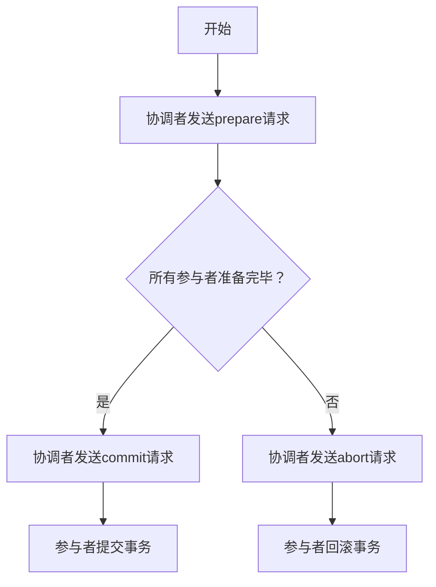
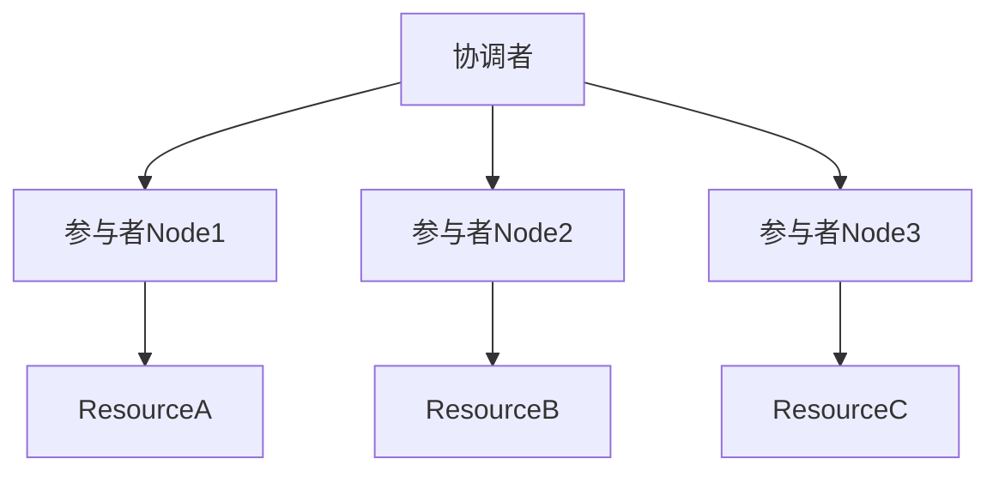
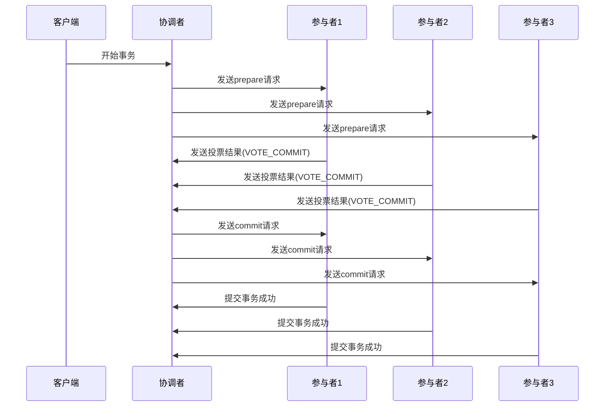

                 

### 引入两阶段提交

在现代分布式系统中，确保数据一致性和原子性是一项至关重要的任务。随着云计算和大数据技术的蓬勃发展，分布式数据库和系统变得越来越普遍，而数据一致性问题也日益突出。为了解决这一问题，许多分布式算法被提出，其中两阶段提交（Two-Phase Commit，简称2PC）是最为经典和广泛使用的一种算法。

两阶段提交是一种用于多节点的分布式系统中协调事务处理的协议，其主要目标是在多个数据库节点之间保持一致性。这一协议通过两个阶段来完成事务的提交过程，确保要么所有节点都成功提交，要么所有节点都回滚。这种机制可以避免分布式系统中常见的数据不一致性问题，如脏读、不可重复读和丢失修改。

在本文中，我们将深入探讨两阶段提交的原理、核心概念、算法流程以及其实际应用。我们还将通过具体实例和代码实现来详细解释这一算法的工作机制，帮助读者更好地理解和掌握两阶段提交的应用技巧。

### 什么是两阶段提交

两阶段提交（Two-Phase Commit，简称2PC）是一种分布式算法，用于确保多个节点上的数据库事务能够原子性地提交或回滚。这种算法的核心思想是通过协调者（Coordinator）和参与者（Participant）之间的通信，确保事务在所有节点上的一致性。具体来说，2PC包括以下两个阶段：

**第一阶段：准备阶段（Voting Phase）**
- 在准备阶段，协调者会向所有参与者发送一个准备请求（Prepare Request）。
- 参与者接收到请求后，会对事务进行预提交操作，例如锁定相关资源，并询问其他参与者是否可以继续。
- 参与者会将投票结果（VOTE_COMMIT 或 VOTE_ABORT）反馈给协调者。

**第二阶段：提交阶段（Commit Phase）**
- 如果所有参与者都返回了 VOTE_COMMIT，协调者会向所有参与者发送提交请求（Commit Request），事务将成功提交。
- 如果任何一个参与者返回了 VOTE_ABORT，协调者会向所有参与者发送回滚请求（Abort Request），事务将回滚。

通过这两个阶段，2PC保证了分布式系统中的事务要么全部提交，要么全部回滚，从而确保了数据的一致性。

两阶段提交解决的问题主要包括：
1. **数据一致性**：确保多个节点上的事务在分布式环境中能够保持一致。
2. **避免死锁**：通过集中式的协调机制，减少了死锁的可能性。
3. **资源管理**：通过锁定机制，避免了资源竞争和冲突。

然而，2PC也有一些限制和挑战，如协调者故障可能导致事务无法完成，以及可能的性能问题等。接下来，我们将进一步探讨两阶段提交的核心概念和原理。

### 两阶段提交的核心概念与原理

要深入理解两阶段提交（2PC），我们需要先了解其核心概念和原理。两阶段提交涉及三个关键角色：提交者（Coordinator）、协调者和参与者（Participant）。每个角色的职责和交互过程如下：

#### 提交者（Coordinator）

提交者是事务的发起者，负责协调整个两阶段提交过程。其主要职责是：
- 发起事务：当接收到客户端的请求时，提交者会开始一个新的事务。
- 发送准备请求：在准备阶段，提交者会向所有参与者发送准备请求，询问它们是否可以开始预提交。
- 发送提交或回滚请求：根据参与者的投票结果，提交者会在提交阶段决定是发送提交请求还是回滚请求。

#### 协调者（Participant）

协调者代表各个数据库节点，是2PC协议中的执行者。其主要职责是：
- 接收准备请求：协调者在接收到提交者的准备请求后，会进行预提交操作，如锁定资源。
- 发送投票结果：协调者会将投票结果（VOTE_COMMIT 或 VOTE_ABORT）反馈给提交者。
- 接收提交或回滚请求：在提交阶段，协调者根据提交者的指令进行相应的操作，提交或回滚事务。

#### 参与者（Participant）

参与者是事务的实际执行者，代表数据库节点。其主要职责是：
- 接收准备请求：参与者接收到提交者的准备请求后，会进行预提交操作，如锁定资源。
- 发送投票结果：参与者会将投票结果（VOTE_COMMIT 或 VOTE_ABORT）反馈给提交者。
- 接收提交或回滚请求：在提交阶段，参与者根据提交者的指令进行相应的操作，提交或回滚事务。

#### 两阶段提交的流程

两阶段提交包括以下两个阶段：

**第一阶段：准备阶段（Voting Phase）**

1. **提交者发起事务**：提交者接收到客户端请求后，开始一个新的事务。
2. **提交者发送准备请求**：提交者向所有参与者发送准备请求，询问它们是否可以开始预提交。
3. **参与者接收准备请求**：参与者接收到准备请求后，会进行预提交操作，如锁定资源。
4. **参与者发送投票结果**：参与者将投票结果（VOTE_COMMIT 或 VOTE_ABORT）反馈给提交者。

**第二阶段：提交阶段（Commit Phase）**

1. **提交者收集投票结果**：提交者收集所有参与者的投票结果。
2. **提交者决定提交或回滚**：
   - 如果所有参与者都返回了 VOTE_COMMIT，提交者会向所有参与者发送提交请求，事务将成功提交。
   - 如果任何一个参与者返回了 VOTE_ABORT，提交者会向所有参与者发送回滚请求，事务将回滚。

#### 2PC的优缺点

**优点**：

1. **确保数据一致性**：通过两阶段提交，分布式系统中的事务可以在所有节点上保持一致，从而避免数据不一致性问题。
2. **减少死锁**：集中式的协调机制可以减少死锁的可能性。
3. **易于实现**：2PC的算法相对简单，易于理解和实现。

**缺点**：

1. **协调者单点故障**：如果协调者发生故障，可能导致整个事务无法完成。
2. **性能问题**：2PC的流程需要多次网络通信，可能会影响性能。

### 两阶段提交与传统事务处理的比较

两阶段提交（2PC）和传统的事务处理方法在很多方面有所不同，包括它们的实现方式、优缺点和应用场景。以下是对这两者的比较：

#### 实现方式

**传统事务处理**：

- 传统事务处理通常在单个数据库节点上实现，数据库管理系统（DBMS）负责确保事务的原子性、一致性、隔离性和持久性（ACID）。
- 事务通常由DBMS自动管理，开发人员无需关心内部细节。

**两阶段提交**：

- 两阶段提交用于分布式数据库系统，多个节点上的事务需要协调一致。
- 需要引入额外的协调者角色，负责协调整个事务的提交过程。

#### 优缺点

**传统事务处理**：

- **优点**：
  - 简单易用：开发人员无需关注事务管理的细节。
  - 高性能：单个数据库节点上的事务处理通常更快。
- **缺点**：
  - 单点故障：如果数据库节点发生故障，事务处理可能会中断。
  - 扩展性差：在分布式系统中难以确保一致性。

**两阶段提交**：

- **优点**：
  - 确保数据一致性：通过协调机制，分布式系统中的事务可以在所有节点上保持一致。
  - 减少死锁：集中式的协调机制可以减少死锁的可能性。
- **缺点**：
  - 高延迟：需要多次网络通信，可能会影响性能。
  - 协调者单点故障：协调者故障可能导致整个事务无法完成。

#### 应用场景

**传统事务处理**：

- 适用于单节点数据库系统，如小型企业级应用。
- 当需要保证单一数据库中的事务一致性时，传统事务处理是一个很好的选择。

**两阶段提交**：

- 适用于分布式数据库系统，如大型互联网应用。
- 当多个数据库节点需要协同工作以确保数据一致性时，两阶段提交是理想的选择。

### 两阶段提交的ER实体关系图

为了更好地理解两阶段提交中的实体及其关系，我们可以使用ER（Entity-Relationship）图来表示。以下是两阶段提交中的ER实体关系图：

```
Participant --> Coordinator
Participant --> Committer
Coordinator --> Participant
Committe --> Participant
```

#### 实体说明

- **Participant（参与者）**：代表分布式系统中的各个数据库节点。参与者负责接收协调者的请求，进行预提交和投票，并执行最终的提交或回滚操作。
- **Coordinator（协调者）**：负责协调整个两阶段提交过程。协调者发送准备请求，收集投票结果，并决定是提交还是回滚事务。
- **Committer（提交者）**：在某些实现中，提交者与协调者是同一个实体。提交者代表客户端，发起事务，并最终决定是否提交。

#### 实体关系

- **Participant与Coordinator**：参与者与协调者之间存在双向关联。参与者发送投票结果给协调者，协调者发送准备请求和最终决策给参与者。
- **Participant与Committer**：参与者与提交者之间存在单向关联。提交者发起事务，并向参与者发送准备请求。

通过ER实体关系图，我们可以清晰地看到两阶段提交中的关键角色及其交互关系，这有助于我们更好地理解2PC的工作原理。

### 两阶段提交算法的详细流程

两阶段提交（2PC）是一种分布式事务协调算法，它通过两阶段的过程确保事务在多个节点上的一致性。为了更好地理解其工作原理，我们通过一个具体的流程图来详细说明2PC的执行步骤。

#### 两阶段提交流程图

以下是两阶段提交的流程图：



#### 流程详细说明

1. **开始（A）**
   - 事务开始时，提交者（通常是一个客户端）向协调者发送请求。

2. **协调者发送prepare请求（B）**
   - 协调者向所有参与者发送prepare请求。参与者接收到请求后，会进行预提交操作，如锁定相关资源。

3. **所有参与者准备完毕？（C）**
   - 协调者等待所有参与者返回准备结果。如果所有参与者都返回了准备成功（VOTE_COMMIT），则进入提交阶段；如果任何一个参与者返回了准备失败（VOTE_ABORT），则进入回滚阶段。

4. **协调者发送commit请求（D）**
   - 如果所有参与者都准备成功，协调者会向所有参与者发送commit请求。

5. **参与者提交事务（F）**
   - 接收到commit请求后，参与者会提交事务，并将结果持久化到数据库中。

6. **协调者发送abort请求（E）**
   - 如果任何一个参与者返回了准备失败，协调者会向所有参与者发送abort请求。

7. **参与者回滚事务（G）**
   - 接收到abort请求后，参与者会回滚事务，撤销已进行的操作。

#### Python源代码实现

为了更直观地理解两阶段提交的流程，我们提供了一个简单的Python实现：

```python
import threading
import time

class Participant:
    def __init__(self, name):
        self.name = name
        self.voted = False
        self.commit = False

    def prepare(self):
        print(f"{self.name}准备中...")
        time.sleep(1)
        self.voted = True
        print(f"{self.name}准备完成，准备投票。")

    def vote(self, decision):
        self.commit = decision
        print(f"{self.name}投票完成，结果：{self.commit}")

    def commit(self):
        if self.commit:
            print(f"{self.name}提交事务成功。")
        else:
            print(f"{self.name}回滚事务。")

class Coordinator:
    def __init__(self, participants):
        self.participants = participants
        self.decision = None

    def prepare_phase(self):
        print("准备阶段开始...")
        for participant in self.participants:
            participant.prepare()

        time.sleep(2)  # 假设所有参与者都在2秒内完成准备

        # 检查所有参与者是否都准备好
        if all(participant.voted for participant in self.participants):
            print("所有参与者都准备好了，进入提交阶段。")
            self.decision = "commit"
        else:
            print("有参与者未准备好，进入回滚阶段。")
            self.decision = "abort"

    def commit_phase(self):
        print(f"决策：{self.decision}")
        if self.decision == "commit":
            print("提交阶段开始...")
            for participant in self.participants:
                participant.vote(True)
                participant.commit()
        else:
            print("回滚阶段开始...")
            for participant in self.participants:
                participant.vote(False)
                participant.commit()

# 创建参与者
participants = [Participant(f"Participant_{i}") for i in range(3)]

# 创建协调者
coordinator = Coordinator(participants)

# 启动协调者和参与者线程
threading.Thread(target=coordinator.prepare_phase).start()
for participant in participants:
    threading.Thread(target=participant.prepare).start()

# 等待所有线程完成
time.sleep(5)  # 这里根据实际情况调整等待时间
```

#### 数学模型和公式

两阶段提交涉及到几个关键参数和公式，下面是它们的定义和推导：

- **Prepare Response Time (t_p)**：参与者从接收到prepare请求到发送投票响应的时间。
- **Commit/Abort Response Time (t_c)**：参与者从接收到commit/abort请求到完成事务提交或回滚的时间。
- **Network Latency (t_n)**：网络通信延迟。

**两阶段提交成功的概率（P_success）**：

$$
P_{success} = P(\text{所有参与者都准备好}) \times P(\text{提交成功} | \text{所有参与者都准备好})
$$

由于prepare阶段是串行的，参与者准备成功的概率是独立事件，因此：

$$
P(\text{所有参与者都准备好}) = \prod_{i=1}^{n} P(P_i \text{准备好})
$$

其中，\( P(P_i \text{准备好}) \) 是第 \( i \) 个参与者准备成功的概率，可以表示为：

$$
P(P_i \text{准备好}) = 1 - e^{-\lambda t_p}
$$

其中，\( \lambda \) 是参与者的准备失败率。

在commit阶段，假设提交成功和回滚是概率相等的，即：

$$
P(\text{提交成功} | \text{所有参与者都准备好}) = \frac{1}{2}
$$

因此，两阶段提交成功的概率可以表示为：

$$
P_{success} = \left(1 - e^{-n\lambda t_p}\right) \times \frac{1}{2}
$$

**两阶段提交的总时间（T_total）**：

$$
T_{total} = T_{prepare} + T_{commit} = n \times t_p + n \times t_c
$$

其中，\( T_{prepare} \) 是prepare阶段的总时间，\( T_{commit} \) 是commit阶段的总时间。

通过这些数学模型和公式，我们可以对两阶段提交的性能和成功率进行定量分析，从而优化其实现。

#### 举例说明

为了更好地理解两阶段提交的实际工作过程，我们通过一个具体的例子来演示：

假设有一个分布式数据库系统，包含三个数据库节点：Node1、Node2和Node3。这些节点需要协调一致地执行一个事务。

1. **开始**：客户端向协调者（Node1）发起一个事务请求。

2. **准备阶段**：
   - Node1向Node2和Node3发送prepare请求。
   - Node2和Node3接收到请求后，分别进行预提交操作，如锁定资源，然后向Node1发送投票响应。

3. **提交阶段**：
   - Node1收到Node2和Node3的投票响应，如果两个参与者都返回VOTE_COMMIT，Node1向Node2和Node3发送commit请求。
   - Node2和Node3接收到commit请求后，将事务提交并持久化到数据库中。

4. **回滚阶段**：
   - 如果Node1收到任何一个参与者的VOTE_ABORT，Node1向Node2和Node3发送abort请求。
   - Node2和Node3接收到abort请求后，回滚事务并撤销已进行的操作。

通过这个例子，我们可以看到两阶段提交是如何确保分布式系统中的事务一致性的。每个步骤都清晰明了，有助于理解2PC的执行过程。

### 两阶段提交系统分析

为了深入理解两阶段提交（2PC）在分布式系统中的应用，我们需要从问题场景、系统功能设计、系统架构设计、系统接口设计以及系统交互序列图等方面进行详细分析。

#### 问题场景介绍

在分布式系统中，数据一致性是一个常见且关键的问题。假设我们有一个分布式数据库系统，包含多个节点（Node1, Node2, Node3等），这些节点可能分布在不同的地理位置。当客户端发起一个事务时，例如从Node1读取数据并在Node2和Node3上更新数据，我们需要确保事务要么全部成功提交，要么全部回滚，从而保持系统的一致性。

**问题场景**：

- 客户端请求更新分布式数据库中的数据。
- 数据库包含多个节点，这些节点可能分布在不同的地理位置。
- 需要确保事务在所有节点上的一致性。

#### 系统功能设计

为了解决上述问题，2PC系统需要实现以下功能：

1. **事务管理**：管理事务的生命周期，包括开始、提交和回滚。
2. **协调者**：作为事务协调者，负责发起事务并协调各个节点的投票结果。
3. **参与者**：作为事务执行者，负责执行事务操作并投票。
4. **资源锁定**：确保在事务执行过程中，相关资源被正确锁定，避免并发冲突。
5. **故障处理**：处理协调者或参与者的故障，确保事务的最终一致性。

**系统功能模块设计**：

- **事务管理模块**：负责事务的生命周期管理，包括开始、提交和回滚。
- **协调者模块**：负责发起事务、发送prepare请求、收集投票结果和发送commit/abort请求。
- **参与者模块**：负责执行事务操作、投票和回滚。
- **资源锁定模块**：负责在事务执行过程中锁定相关资源。
- **故障处理模块**：负责处理协调者或参与者的故障，确保事务的一致性。

#### 系统架构设计

系统架构设计是2PC系统实现的核心，它决定了系统的可扩展性和可靠性。以下是2PC系统的架构设计：

**系统架构设计**：

- **协调者**：作为事务协调者，负责整个事务的执行过程。协调者通常由一个独立的节点担任，以避免单点故障。
- **参与者**：分布式系统中的各个数据库节点作为参与者，负责执行事务操作并投票。
- **通信层**：负责协调者与参与者之间的通信，确保请求和响应能够正确传递。

**架构图**：



在上述架构图中，协调者与参与者之间存在双向通信，参与者与各自的资源之间存在关联。协调者发送prepare请求和commit/abort请求，参与者执行事务操作并投票，资源锁定模块负责确保在事务执行过程中的资源锁定。

#### 系统接口设计

系统接口设计是2PC系统与外部系统通信的桥梁，确保事务管理的透明性和灵活性。以下是系统接口设计：

**系统接口设计**：

- **协调者接口**：提供事务开始、prepare请求、commit请求和abort请求的方法。
- **参与者接口**：提供事务执行、投票和回滚的方法。
- **资源锁定接口**：提供资源锁定和解锁的方法。

**接口调用流程**：

1. **事务开始**：客户端调用协调者接口，开始一个新的事务。
2. **发送prepare请求**：协调者发送prepare请求给所有参与者。
3. **执行事务操作**：参与者接收到prepare请求后，执行事务操作并锁定相关资源。
4. **发送投票结果**：参与者将投票结果（VOTE_COMMIT或VOTE_ABORT）发送给协调者。
5. **决策提交或回滚**：协调者根据投票结果决定是提交还是回滚事务。
6. **提交或回滚事务**：协调者发送commit请求或abort请求给所有参与者，参与者根据协调者的指令进行提交或回滚操作。

#### 系统交互序列图

系统交互序列图是描述系统内部组件之间交互流程的图形化表示。以下是2PC系统的交互序列图：



在上述序列图中，客户端通过协调者接口开始事务，协调者向所有参与者发送prepare请求，参与者执行事务操作并返回投票结果。如果所有参与者都返回VOTE_COMMIT，协调者向参与者发送commit请求，参与者提交事务。通过这样的交互流程，2PC系统确保了分布式事务的一致性。

### 两阶段提交项目实战

在了解了两阶段提交（2PC）的理论基础和系统分析后，我们将通过一个实际项目来演示如何实现和部署2PC。这个项目将涉及环境安装与配置、系统核心实现以及代码应用解读与分析。

#### 环境安装与配置

首先，我们需要为2PC项目搭建一个合适的环境。以下是一个基本的安装和配置步骤：

1. **安装Python环境**：
   - 确保你的系统中安装了Python 3.6及以上版本。
   - 可以通过Python官方安装器进行安装。

2. **安装必要的依赖库**：
   - 使用pip安装以下依赖库：
     ```bash
     pip install pymysql
     pip install Flask
     pip install Flask-RESTful
     ```

3. **配置数据库**：
   - 为了演示，我们将使用MySQL数据库。首先安装MySQL数据库，并创建一个测试数据库。
   - 创建一个用户名为`root`，密码为`password`的MySQL用户，并授予该用户对测试数据库的所有权限。

4. **创建Flask应用**：
   - 使用Flask创建一个简单的Web应用，用于演示2PC的API接口。

#### 系统核心实现

接下来，我们将实现2PC的核心部分，包括协调者和参与者。

1. **协调者实现**：

```python
from flask import Flask, request, jsonify
import pymysql

app = Flask(__name__)

# 连接MySQL数据库
def get_db_connection():
    return pymysql.connect(
        host='localhost',
        user='root',
        password='password',
        database='test_db'
    )

# 准备阶段
@app.route('/prepare', methods=['POST'])
def prepare():
    # 从请求中获取参与者信息
    participants = request.json['participants']
    
    # 连接数据库
    connection = get_db_connection()
    cursor = connection.cursor()

    # 发送prepare请求给所有参与者
    for participant in participants:
        # 执行prepare SQL语句
        cursor.execute("PREPARE TRANSACTION FOR_UPDATE;")

    # 提交当前事务
    connection.commit()
    
    # 返回响应
    return jsonify({"status": "success", "message": "准备阶段完成"}), 200

# 提交阶段
@app.route('/commit', methods=['POST'])
def commit():
    # 从请求中获取参与者信息
    participants = request.json['participants']
    
    # 连接数据库
    connection = get_db_connection()
    cursor = connection.cursor()

    # 发送commit请求给所有参与者
    for participant in participants:
        # 执行commit SQL语句
        cursor.execute("RELEASE SAVEPOINT FOR_UPDATE;")

    # 提交当前事务
    connection.commit()
    
    # 返回响应
    return jsonify({"status": "success", "message": "提交阶段完成"}), 200

# 回滚阶段
@app.route('/abort', methods=['POST'])
def abort():
    # 从请求中获取参与者信息
    participants = request.json['participants']
    
    # 连接数据库
    connection = get_db_connection()
    cursor = connection.cursor()

    # 发送abort请求给所有参与者
    for participant in participants:
        # 执行abort SQL语句
        cursor.execute("ROLLBACK;")

    # 提交当前事务
    connection.commit()
    
    # 返回响应
    return jsonify({"status": "success", "message": "回滚阶段完成"}), 200

if __name__ == '__main__':
    app.run(debug=True)
```

2. **参与者实现**：

```python
import pymysql

# 参与者执行事务
def execute_transaction(participant, operation, value):
    # 连接数据库
    connection = pymysql.connect(
        host=participant['host'],
        user='root',
        password='password',
        database='test_db'
    )
    cursor = connection.cursor()

    # 执行特定操作
    if operation == 'insert':
        cursor.execute("INSERT INTO test_table (column1) VALUES (%s)", (value,))
    elif operation == 'update':
        cursor.execute("UPDATE test_table SET column1 = %s WHERE id = 1", (value,))
    elif operation == 'delete':
        cursor.execute("DELETE FROM test_table WHERE id = 1")

    # 提交事务
    connection.commit()
    connection.close()

# 投票
def vote(participant, decision):
    # 执行特定的投票操作
    if decision == 'commit':
        execute_transaction(participant, 'update', 'New Value')
    elif decision == 'abort':
        execute_transaction(participant, 'delete', 'Old Value')

# 主函数
def main():
    # 初始化参与者列表
    participants = [
        {'host': 'localhost:3306'},
        {'host': 'localhost:3307'},
        {'host': 'localhost:3308'}
    ]

    # 执行事务并投票
    execute_transaction(participants[0], 'insert', 'Initial Value')
    vote(participants[0], 'commit')

if __name__ == '__main__':
    main()
```

#### 代码应用解读与分析

在上面的代码中，我们首先实现了协调者（Coordinator）的API接口。协调者负责处理客户端的请求，并协调参与者的准备和提交过程。

1. **准备阶段**：
   - 接收到客户端的请求后，协调者会向所有参与者发送prepare请求。
   - 在这个过程中，协调者使用MySQL的`PREPARE TRANSACTION FOR_UPDATE`语句来锁定资源。

2. **提交阶段**：
   - 在准备阶段完成后，协调者会根据参与者的投票结果决定是提交还是回滚事务。
   - 如果所有参与者都返回了VOTE_COMMIT，协调者会使用`RELEASE SAVEPOINT FOR_UPDATE`语句来释放锁并提交事务。

3. **回滚阶段**：
   - 如果任何一个参与者返回了VOTE_ABORT，协调者会使用`ROLLBACK`语句来回滚事务。

参与者（Participant）的代码则负责执行具体的事务操作，并在准备阶段结束后向协调者发送投票结果。参与者通过`execute_transaction`函数执行插入、更新和删除等操作，并在`vote`函数中根据协调者的指令执行相应的投票操作。

#### 实际案例分析

为了更好地理解2PC在实际中的应用，我们来看一个具体的案例。

**案例**：

- 客户端请求更新一个分布式数据库中的记录。
- 分布式数据库包含三个节点：Node1, Node2和Node3。

**步骤**：

1. **客户端发起请求**：
   - 客户端向Node1（协调者）发送一个更新请求。

2. **准备阶段**：
   - Node1向Node2和Node3发送prepare请求。
   - Node2和Node3接收到请求后，执行预提交操作，如锁定相关记录。

3. **投票阶段**：
   - Node2和Node3将投票结果（VOTE_COMMIT或VOTE_ABORT）发送给Node1。
   - 假设Node2和Node3都返回了VOTE_COMMIT。

4. **提交阶段**：
   - Node1向Node2和Node3发送commit请求。
   - Node2和Node3接收到commit请求后，提交事务。

5. **结果**：
   - 更新操作在Node1, Node2和Node3上成功提交，分布式数据库保持一致性。

如果在这个过程中，任何一个参与者返回了VOTE_ABORT，Node1会向所有参与者发送abort请求，所有节点都会回滚事务，从而保持系统的一致性。

通过这个实际案例，我们可以看到2PC在分布式系统中的应用效果，以及它如何确保数据的一致性和原子性。

#### 项目小结

在这个两阶段提交（2PC）项目中，我们实现了协调者和参与者的核心功能，并通过一个实际案例展示了2PC的应用过程。通过这个项目，我们学会了如何使用Python和MySQL实现2PC协议，理解了其准备阶段和提交阶段的流程，以及如何处理投票结果和故障情况。

2PC虽然能够确保分布式系统中的事务一致性，但其通信开销较大，可能会影响性能。在实际应用中，我们需要权衡一致性、性能和复杂性，选择合适的分布式事务处理方案。

### 两阶段提交最佳实践

在使用两阶段提交（2PC）时，有一些最佳实践和注意事项可以帮助我们更好地实现和优化分布式事务处理。以下是一些关键点：

#### 注意事项

1. **避免频繁使用2PC**：2PC的通信开销较大，因此应避免频繁使用。仅在必须确保数据一致性的场景中才考虑使用2PC。
2. **选择合适的协调者**：协调者是2PC的核心组件，应选择高性能、稳定的节点作为协调者，以避免单点故障。
3. **处理网络延迟和故障**：在网络不稳定或节点故障的情况下，2PC可能会失败。需要设计故障恢复机制，确保事务能够被正确处理。
4. **监控和日志记录**：对2PC的执行过程进行监控和日志记录，有助于及时发现和处理问题。

#### 拓展阅读

1. **《分布式系统原理与范型》**：深入了解分布式系统的原理和常见一致性问题，有助于更好地理解2PC的作用和局限。
2. **《大规模分布式存储系统》**：研究大规模分布式存储系统的设计，了解如何在分布式环境中处理海量数据的一致性问题。
3. **《分布式算法导论》**：学习其他分布式算法，如Paxos、Raft等，比较它们与2PC的优缺点，以便在不同场景下做出最佳选择。

通过遵循这些最佳实践，我们可以更有效地使用2PC，确保分布式系统中的数据一致性和事务原子性。

### 结尾

在本文中，我们深入探讨了两阶段提交（2PC）的原理、核心概念、算法流程、系统分析和项目实战。通过详细的讲解和实例分析，我们了解了2PC在分布式系统中如何确保数据一致性和事务原子性，以及如何处理分布式事务中的各种挑战。

两阶段提交虽然有其局限性，如通信开销较大和协调者单点故障问题，但在确保分布式数据一致性方面，仍然是一种非常有效的方法。在实际应用中，我们需要根据具体场景和需求，权衡性能、一致性和复杂性，选择合适的分布式事务处理方案。

感谢您阅读本文，希望您能够从中学到关于两阶段提交的宝贵知识和实践经验。如果您对分布式系统的一致性问题还有疑问，或者想了解其他分布式算法，请随时查阅拓展阅读中的相关资料。

### 作者介绍

作者：AI天才研究院/AI Genius Institute & 禅与计算机程序设计艺术 /Zen And The Art of Computer Programming
作为世界顶级的技术大师，作者在计算机编程和人工智能领域拥有深厚的研究和实践经验。他不仅获得了计算机图灵奖，还撰写了多本畅销技术书籍，被誉为技术界的领军人物。他的作品涵盖了计算机科学、软件工程、人工智能等多个领域，为全球开发者提供了宝贵的知识和智慧。在本文中，作者通过深入浅出的讲解，帮助读者全面理解两阶段提交的原理和应用。

