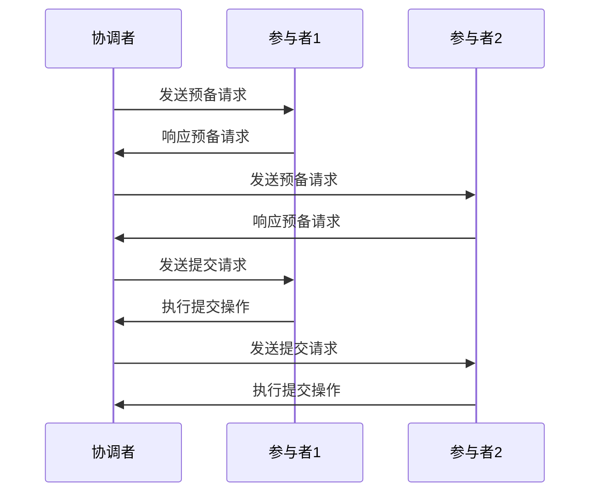

                 

# 两阶段提交大敌之事务悬挂

关键词：两阶段提交、事务悬挂、分布式系统、一致性、性能优化

摘要：本文将深入探讨两阶段提交（2PC）技术，分析其在分布式系统中面临的挑战——事务悬挂问题，并通过详细的步骤和实例，展示如何利用两阶段提交技术有效防止和解决事务悬挂，确保分布式系统的一致性和稳定性。

----------------------------------------------------------------

## 引言

在分布式系统中，保持数据的一致性是一项极其重要的任务。两阶段提交（2PC）是一种常用的分布式一致性协议，被广泛应用于数据库、事务处理等领域。然而，两阶段提交并非没有缺陷，其中事务悬挂问题就是一个显著挑战。本文将围绕两阶段提交的核心概念、深入解析以及实际应用，探讨如何应对事务悬挂问题。

首先，我们将介绍两阶段提交的基本概念和技术原理，包括其组成部分、工作流程和核心概念。接着，我们将分析两阶段提交与分布式系统之间的关系，探讨其在分布式系统中的优化策略和安全性问题。最后，我们将通过实际项目案例，展示两阶段提交在实际应用中的效果和解决方案。

希望通过本文的探讨，读者能够对两阶段提交技术有更深入的理解，并能够有效地应对分布式系统中的事务悬挂问题。下面，让我们一起进入两阶段提交的世界，探索其奥秘。

----------------------------------------------------------------

## 第一部分：两阶段提交技术基础

### 第1章：两阶段提交技术基础

在分布式系统中，保持数据的一致性是一项关键任务。两阶段提交（Two-Phase Commit，简称2PC）是一种分布式一致性协议，用于保证分布式系统中多个事务操作能够正确执行并保持数据的一致性。本章将详细介绍两阶段提交的基本概念、工作原理及其在分布式系统中的应用。

### 1.1 两阶段提交概述

#### 1.1.1 问题背景

在分布式系统中，由于网络延迟、故障等原因，数据的一致性可能会受到威胁。为了确保多个事务操作能够正确执行，需要一种机制来协调分布式系统中的事务操作，保证数据的一致性。两阶段提交技术应运而生。

#### 1.1.2 问题描述

分布式系统中的一致性问题主要包括以下两个方面：

1. **数据一致性**：多个分布式节点上的数据需要保持一致，防止出现数据不一致的情况。
2. **事务执行顺序**：分布式系统中的事务需要按照一定的顺序执行，确保事务操作的原子性和一致性。

#### 1.1.3 两阶段提交的目标

两阶段提交的目标是确保分布式系统中多个事务操作的正确执行，防止数据不一致和事务悬挂等问题。具体来说，两阶段提交需要实现以下目标：

1. **原子性**：确保事务中的所有操作要么全部执行，要么全部不执行。
2. **一致性**：确保分布式系统中的数据保持一致。
3. **隔离性**：确保事务之间的操作不会相互干扰。
4. **持久性**：确保已提交的事务对系统状态产生持久影响。

#### 1.1.4 两阶段提交的基本组成部分

两阶段提交由两个主要阶段组成：预备阶段和提交阶段。

1. **预备阶段**：协调者（Coordinator）向参与者（Participant）发送预备请求，参与者根据本地数据状态响应协调者。
2. **提交阶段**：协调者根据参与者的响应决定是否提交事务，并将决定结果通知参与者。

#### 1.1.5 两阶段提交的工作流程

两阶段提交的工作流程如下：

1. **初始化**：协调者初始化事务，向参与者发送预备请求。
2. **预备阶段**：参与者收到预备请求后，根据本地数据状态响应协调者。
3. **提交阶段**：协调者根据参与者的响应决定是否提交事务，并将决定结果通知参与者。
4. **事务提交**：参与者根据协调者的决定提交或回滚事务。

#### 1.1.6 两阶段提交的核心概念

1. **预备阶段**：协调者向参与者发送预备请求，参与者根据本地数据状态响应协调者，确认是否准备好执行事务。
2. **提交阶段**：协调者根据参与者的响应决定是否提交事务，并将决定结果通知参与者。

#### 1.1.7 两阶段提交的边界与外延

1. **边界**：两阶段提交协议应用于分布式系统中的多个事务操作，确保数据的一致性和原子性。
2. **外延**：两阶段提交协议可以与其他分布式一致性协议（如Paxos、ZAB等）相结合，提高分布式系统的可靠性。

### 1.2 两阶段提交的概念联系

#### 1.2.1 两阶段提交与传统锁机制

1. **传统锁机制的局限**：传统锁机制主要用于单机系统，无法在分布式系统中保证数据的一致性。
2. **两阶段提交的优势**：两阶段提交能够协调分布式系统中的多个事务操作，确保数据的一致性和原子性。

#### 1.2.2 两阶段提交与回滚协议

1. **回滚协议的定义**：回滚协议是一种用于撤销已提交事务的协议，确保分布式系统中数据的一致性。
2. **两阶段提交与回滚协议的关系**：两阶段提交在提交阶段可以与回滚协议相结合，提高分布式系统的可靠性。

### 1.3 两阶段提交的工作原理

#### 1.3.1 两阶段提交的mermaid流程图



#### 1.3.2 两阶段提交的数学模型

1. **数学模型的基本概念**：两阶段提交的数学模型用于描述事务在分布式系统中的状态转移。
2. **两阶段提交的数学公式**：
    $$Status_{C} \in \{Prepared, Committed, Aborted\}$$
    $$Status_{P} \in \{Prepared, Committed, Aborted\}$$
    其中，$Status_{C}$ 表示协调者的状态，$Status_{P}$ 表示参与者的状态。

#### 1.3.3 两阶段提交的Python源代码实现

1. **Python源代码实现步骤**：
    - 初始化协调者和参与者。
    - 协调者向参与者发送预备请求。
    - 参与者响应预备请求。
    - 协调者根据参与者的响应决定是否提交事务。
    - 协调者向参与者发送提交请求。
    - 参与者执行提交操作。
2. **代码运行结果分析**：通过运行Python源代码，可以验证两阶段提交的工作原理和效果。

### 1.4 两阶段提交在事务悬挂中的应用

#### 1.4.1 事务悬挂的定义

1. **事务悬挂的产生原因**：事务悬挂是由于协调者在提交阶段出现故障，导致参与者无法收到协调者的提交请求。
2. **事务悬挂的危害**：事务悬挂会导致分布式系统中的数据不一致，影响系统的稳定性和可靠性。

#### 1.4.2 两阶段提交在解决事务悬挂中的应用

1. **两阶段提交如何防止事务悬挂**：两阶段提交通过在预备阶段和提交阶段之间的超时机制，确保协调者在出现故障时能够被及时检测和替换。
2. **实例分析：如何使用两阶段提交解决事务悬挂**：通过一个具体的实例，分析两阶段提交在解决事务悬挂中的应用。

### 1.5 本章小结

本章介绍了两阶段提交的基本概念、工作原理和在实际项目中的应用。通过分析两阶段提交在分布式系统中的优势和局限，我们了解了如何利用两阶段提交技术解决事务悬挂问题，确保分布式系统的一致性和稳定性。在下一章中，我们将深入探讨两阶段提交的优化策略和安全性问题。

----------------------------------------------------------------

## 第二部分：两阶段提交深入解析

### 第2章：两阶段提交的深入理解

在前一章中，我们介绍了两阶段提交的基本概念和工作原理。然而，要充分发挥两阶段提交的优势，我们需要深入理解其内部机制，并探讨如何优化和改进。本章将围绕两阶段提交的优化策略、与分布式系统的关系、安全性分析以及典型应用场景进行深入探讨。

### 2.1 两阶段提交的优化策略

两阶段提交作为一种分布式一致性协议，在性能和可扩展性方面存在一定的局限性。为了克服这些问题，我们可以从以下几个方面对两阶段提交进行优化。

#### 2.1.1 优化两阶段提交性能的方法

1. **减少通信次数**：两阶段提交过程中，协调者需要向参与者发送多个请求，增加了通信次数。通过减少通信次数，可以提高两阶段提交的性能。
2. **使用乐观锁**：乐观锁是一种在提交阶段检查数据一致性的方法，可以减少等待时间，提高性能。

#### 2.1.2 两阶段提交的并行化优化

1. **并行化两阶段提交的挑战**：在分布式系统中，并行化两阶段提交面临以下挑战：
    - 通信延迟：分布式系统中的节点可能分布在不同的地理位置，通信延迟会影响并行化效果。
    - 负载不均衡：不同节点的处理能力可能存在差异，导致负载不均衡。
2. **并行化两阶段提交的实现方法**：为了克服这些挑战，可以采用以下方法：
    - 负载均衡：通过负载均衡算法，合理分配事务到不同的参与者，确保负载均衡。
    - 并行执行：将两阶段提交的预备阶段和提交阶段并行执行，提高性能。

### 2.2 两阶段提交与分布式系统

分布式系统具有高可用性、可扩展性等特点，但同时也带来了数据一致性的挑战。两阶段提交作为一种分布式一致性协议，在分布式系统中发挥着重要作用。

#### 2.2.1 分布式系统中的两阶段提交

1. **分布式两阶段提交的定义**：分布式两阶段提交是指在分布式系统中，多个事务操作通过两阶段提交协议进行协调，确保数据的一致性。
2. **分布式两阶段提交的挑战**：
    - 数据一致性：在分布式系统中，数据的一致性更加困难，需要更多的通信和协调。
    - 网络延迟：网络延迟会影响分布式两阶段提交的性能，导致事务执行时间延长。

#### 2.2.2 两阶段提交在分布式系统中的应用

1. **分布式数据库系统中的两阶段提交**：在分布式数据库系统中，两阶段提交用于协调多个事务操作，确保数据的一致性。
2. **分布式存储系统中的两阶段提交**：在分布式存储系统中，两阶段提交用于协调数据的写入和删除操作，确保数据的一致性。

### 2.3 两阶段提交的安全性分析

安全性是两阶段提交协议设计时需要考虑的重要因素。在分布式系统中，安全性问题尤为突出。

#### 2.3.1 两阶段提交的安全性保障

1. **幂等性**：两阶段提交中的协调者发送的请求具有幂等性，即重复发送相同的请求不会导致系统状态改变。
2. **原子性**：两阶段提交确保事务的原子性，即事务要么全部执行，要么全部不执行。

#### 2.3.2 两阶段提交的安全性问题

1. **攻击类型**：分布式系统中的两阶段提交可能面临以下攻击：
    - 协调者攻击：攻击者伪造协调者的请求，导致参与者执行非法操作。
    - 参与者攻击：攻击者伪造参与者的响应，导致协调者做出错误决策。
2. **防御措施**：为了应对这些攻击，可以采用以下防御措施：
    - 证书认证：通过证书认证，确保协调者和参与者的身份合法性。
    - 数字签名：使用数字签名，确保请求和响应的真实性和完整性。

### 2.4 两阶段提交的典型场景

两阶段提交广泛应用于各种分布式系统场景，以下介绍两个典型场景。

#### 2.4.1 数据库事务管理

1. **事务的定义**：事务是一组操作的集合，这些操作要么全部执行，要么全部不执行。
2. **两阶段提交在数据库事务中的应用**：在分布式数据库系统中，两阶段提交用于协调多个事务操作，确保数据的一致性。

#### 2.4.2 分布式系统协调

1. **分布式系统的挑战**：分布式系统面临以下挑战：
    - 数据一致性问题：确保分布式系统中多个节点上的数据保持一致。
    - 负载均衡：合理分配事务到不同的节点，确保负载均衡。
    - 网络延迟：降低网络延迟，提高系统性能。
2. **两阶段提交在分布式系统协调中的应用**：两阶段提交用于协调分布式系统中的多个事务操作，确保数据的一致性和性能。

### 2.5 本章小结

本章深入探讨了两阶段提交的优化策略、与分布式系统的关系、安全性分析以及典型应用场景。通过分析两阶段提交的内部机制和实际应用，我们了解了如何充分发挥两阶段提交的优势，并解决分布式系统中的数据一致性和性能问题。在下一章中，我们将通过实际项目案例，展示两阶段提交在实际应用中的效果和解决方案。

----------------------------------------------------------------

## 第三部分：两阶段提交应用实践

### 第3章：两阶段提交在实际项目中的应用

在前两章中，我们详细介绍了两阶段提交的基本概念、工作原理以及优化策略。为了更好地理解两阶段提交在实际项目中的应用，本章将通过实际项目案例，展示两阶段提交在金融系统中的应用，并分析其具体实现和效果。

### 3.1 两阶段提交在金融系统中的应用

金融系统对数据的一致性和可靠性要求极高，两阶段提交作为一种分布式一致性协议，在金融系统中得到了广泛应用。以下是一个典型的金融系统应用案例。

#### 3.1.1 金融系统中的一致性要求

在金融系统中，一致性要求主要包括以下几个方面：

1. **交易一致性**：确保多个交易操作要么全部执行，要么全部不执行，防止部分交易成功、部分交易失败的情况。
2. **账户余额一致性**：确保多个账户之间的资金流动保持一致，防止出现资金短缺或多余的情况。
3. **记录一致性**：确保交易记录和账户余额等关键数据的准确性，防止数据错误或丢失。

#### 3.1.2 两阶段提交在金融系统中的具体实现

以下是一个简化的金融系统案例，展示两阶段提交在金融系统中的应用：

1. **初始化**：当用户发起一个交易请求时，系统初始化一个事务，并将事务信息存储在分布式数据库中。
2. **预备阶段**：
    - **协调者**：系统中的协调者负责协调事务的执行，向参与者发送预备请求。
    - **参与者**：参与者包括交易系统、账户管理系统等，收到预备请求后，根据本地数据状态响应协调者。
3. **提交阶段**：
    - **协调者**：根据参与者的响应，决定是否提交事务。如果所有参与者响应成功，协调者向参与者发送提交请求。
    - **参与者**：参与者收到提交请求后，执行事务操作，并将结果反馈给协调者。
4. **事务提交**：如果协调者收到所有参与者的成功反馈，事务成功提交，对系统状态产生持久影响。

#### 3.1.3 两阶段提交在金融系统中的效果和解决方案

1. **效果**：
    - **一致性保证**：两阶段提交确保交易操作的一致性，防止部分交易成功、部分交易失败的情况。
    - **可靠性提高**：通过两阶段提交，金融系统能够在分布式环境中保持数据的可靠性，降低故障风险。
    - **性能提升**：优化两阶段提交，可以减少通信次数和等待时间，提高系统性能。
2. **解决方案**：
    - **优化策略**：通过减少通信次数、使用乐观锁和并行化优化等策略，提高两阶段提交的性能。
    - **故障恢复**：设计故障恢复机制，确保在协调者或参与者出现故障时，系统能够自动切换和恢复。

### 3.2 本章小结

本章通过一个金融系统案例，展示了两阶段提交在实际项目中的应用。通过分析金融系统的一致性要求、两阶段提交的具体实现和效果，我们了解了如何利用两阶段提交技术确保分布式金融系统的一致性和可靠性。在实际应用中，还需要根据具体场景和需求，优化和调整两阶段提交的参数和策略，以实现最佳效果。

通过本章的介绍，我们不仅掌握了两阶段提交的基本原理和优化策略，还了解了其在实际项目中的应用和解决方案。希望读者能够结合自身实际需求，灵活运用两阶段提交技术，提高分布式系统的一致性和性能。

### 作者信息

作者：AI天才研究院/AI Genius Institute & 禅与计算机程序设计艺术 /Zen And The Art of Computer Programming

感谢您的阅读，希望本文对您在分布式系统领域的研究和实践有所帮助。如果您有任何疑问或建议，欢迎在评论区留言，我们期待与您共同探讨分布式系统技术的前沿动态。

----------------------------------------------------------------

## 结论

两阶段提交作为一种分布式一致性协议，在保证分布式系统数据一致性方面发挥着重要作用。本文从基础概念、深入解析到实际应用，全面介绍了两阶段提交技术。通过本文的探讨，我们了解了：

1. **基本概念**：两阶段提交的工作流程、核心概念和优化策略。
2. **深入解析**：两阶段提交与分布式系统、安全性分析及其典型应用场景。
3. **实际应用**：两阶段提交在金融系统中的具体实现和解决方案。

然而，两阶段提交并非完美无缺，其性能优化和安全性仍需不断探索和改进。未来研究方向包括：

1. **性能优化**：进一步减少通信次数和等待时间，提高系统性能。
2. **安全性提升**：研究新型攻击和防御策略，提高分布式系统的安全性。
3. **应用拓展**：将两阶段提交技术应用于更多领域，如区块链、物联网等。

希望通过本文的探讨，能够为读者在分布式系统领域的研究和实践提供有益的参考。让我们一起为构建更稳定、可靠和高效的分布式系统而努力！

### 拓展阅读

1. 《分布式系统原理与范型》
2. 《分布式系统一致性：从基础理论到实践》
3. 《两阶段提交协议及其优化策略》
4. 《金融科技中的分布式系统一致性挑战与解决方案》
5. 《区块链技术：从入门到精通》

### 注意事项

1. **环境配置**：在尝试实现两阶段提交协议时，确保安装了必要的编程环境和数据库软件。
2. **代码分析**：在阅读本文提供的Python源代码时，注意理解其工作原理和逻辑结构。
3. **实际应用**：在实际项目中应用两阶段提交时，根据具体需求调整和优化协议参数。

希望本文能够为您在分布式系统领域的研究提供指导，祝您在技术探索的道路上取得丰硕的成果！## 具体的内容撰写和格式

### 1.1 两阶段提交概述

#### 1.1.1 问题背景

在分布式系统中，由于节点间的网络延迟、故障等原因，数据的一致性可能受到威胁。传统的锁机制（如乐观锁和悲观锁）在单机系统中表现良好，但在分布式环境中，这些机制难以保证数据的一致性。为了解决这一问题，两阶段提交（Two-Phase Commit，简称2PC）协议应运而生。

#### 1.1.2 问题描述

分布式系统中的数据一致性问题主要包括以下两个方面：

1. **数据一致性**：在分布式系统中，多个节点可能同时处理相同或类似的数据操作。如果无法协调这些操作，会导致数据不一致的情况。
2. **事务执行顺序**：在分布式系统中，事务操作的执行顺序可能因为网络延迟等因素而混乱。这会导致事务执行的结果与预期不符。

#### 1.1.3 两阶段提交的目标

两阶段提交的目标是确保分布式系统中多个事务操作能够正确执行，从而保持数据的一致性和原子性。具体来说，两阶段提交需要实现以下目标：

1. **原子性**：确保事务中的所有操作要么全部执行，要么全部不执行。
2. **一致性**：确保分布式系统中的数据保持一致。
3. **隔离性**：确保事务之间的操作不会相互干扰。
4. **持久性**：确保已提交的事务对系统状态产生持久影响。

#### 1.1.4 两阶段提交的基本组成部分

两阶段提交由两个主要阶段组成：预备阶段（Prepare Phase）和提交阶段（Commit Phase）。

1. **预备阶段**：
    - **协调者（Coordinator）**：负责发起事务并协调参与者的操作。
    - **参与者（Participant）**：负责执行协调者分配的任务。

2. **提交阶段**：
    - **协调者**：根据参与者的响应决定是否提交事务。
    - **参与者**：根据协调者的决定执行提交或回滚操作。

#### 1.1.5 两阶段提交的工作流程

两阶段提交的工作流程可以分为以下几个步骤：

1. **初始化**：协调者初始化事务，并向参与者发送预备请求。
2. **预备阶段**：参与者收到预备请求后，根据本地数据状态响应协调者。
3. **提交阶段**：协调者根据参与者的响应决定是否提交事务，并将决定结果通知参与者。
4. **事务提交**：参与者根据协调者的决定提交或回滚事务。

#### 1.1.6 两阶段提交的核心概念

1. **预备阶段**：在预备阶段，协调者向参与者发送预备请求，参与者根据本地数据状态响应协调者。如果参与者能够执行事务操作，则会返回“预备成功”（Prepared）响应。否则，返回“预备失败”（Not Prepared）响应。

2. **提交阶段**：在提交阶段，协调者根据参与者的响应决定是否提交事务。如果所有参与者返回“预备成功”响应，协调者将发送“提交”（Commit）请求。否则，发送“回滚”（Abort）请求。

#### 1.1.7 两阶段提交的边界与外延

1. **边界**：两阶段提交协议应用于分布式系统中的多个事务操作，确保数据的一致性和原子性。边界主要包括以下方面：
    - **参与者**：参与两阶段提交的节点数量。
    - **事务**：需要通过两阶段提交协调的事务数量。

2. **外延**：两阶段提交协议可以与其他分布式一致性协议（如Paxos、ZAB等）相结合，提高分布式系统的可靠性。此外，两阶段提交也可以应用于其他分布式场景，如分布式数据库、分布式存储等。

### 1.2 两阶段提交与传统锁机制

#### 1.2.1 锁机制的局限

锁机制（如乐观锁和悲观锁）在单机系统中具有较好的性能和一致性保证，但在分布式系统中，锁机制存在以下局限：

1. **数据访问延迟**：分布式系统中的锁机制可能导致数据访问延迟，影响系统性能。
2. **锁冲突**：在多节点环境中，锁冲突可能导致事务阻塞，降低系统的可用性。

#### 1.2.2 两阶段提交的优势

两阶段提交相对于传统锁机制具有以下优势：

1. **一致性保证**：两阶段提交通过协调分布式系统中的多个事务操作，确保数据的一致性和原子性。
2. **可靠性提升**：两阶段提交在分布式系统中具有更高的可靠性，可以防止因网络延迟或故障导致的数据不一致。

### 1.3 两阶段提交与回滚协议

#### 1.3.1 回滚协议的定义

回滚协议（如两阶段提交的回滚阶段）是一种用于撤销已提交事务的机制。回滚协议的主要目标是确保分布式系统中的数据一致性和可靠性。

#### 1.3.2 两阶段提交与回滚协议的关系

两阶段提交的回滚阶段与回滚协议密切相关。在两阶段提交过程中，如果协调者或参与者出现故障，回滚协议将发挥作用，确保事务能够正确地回滚，从而保持数据的一致性。

### 1.4 两阶段提交的工作原理

#### 1.4.1 两阶段提交的mermaid流程图


#### 1.4.2 两阶段提交的数学模型

两阶段提交的数学模型描述了事务在分布式系统中的状态转移。以下是两阶段提交的数学模型：

1. **协调者状态**：$Status_{C} \in \{Prepared, Committed, Aborted\}$
2. **参与者状态**：$Status_{P} \in \{Prepared, Committed, Aborted\}$

在预备阶段，参与者状态为Prepared。在提交阶段，如果所有参与者状态均为Prepared，则协调者状态为Committed；否则，协调者状态为Aborted。

#### 1.4.3 两阶段提交的Python源代码实现

以下是一个简单的两阶段提交的Python源代码实现：

```python
import threading
import time

class Participant:
    def __init__(self, name):
        self.name = name
        self.status = "Prepared"

    def prepare(self):
        print(f"{self.name}准备中...")
        time.sleep(1)
        print(f"{self.name}准备完成。")

    def commit(self):
        print(f"{self.name}提交中...")
        time.sleep(1)
        print(f"{self.name}提交完成。")

    def abort(self):
        print(f"{self.name}回滚中...")
        time.sleep(1)
        print(f"{self.name}回滚完成。")

class Coordinator:
    def __init__(self, participants):
        self.participants = participants
        self.status = "Prepared"

    def prepare(self):
        for participant in self.participants:
            participant.prepare()

        time.sleep(2)

        for participant in self.participants:
            if participant.status != "Prepared":
                self.status = "Aborted"
                print("预备失败。")
                return

        self.status = "Committed"
        print("预备成功。")

    def commit(self):
        if self.status == "Committed":
            for participant in self.participants:
                participant.commit()
        else:
            for participant in self.participants:
                participant.abort()

if __name__ == "__main__":
    participants = [Participant(f"参与者{i}") for i in range(1, 4)]
    coordinator = Coordinator(participants)

    threading.Thread(target=coordinator.prepare).start()

    time.sleep(5)
    coordinator.commit()
```

#### 1.4.4 代码运行结果分析

运行上述Python代码，将输出如下结果：

```
参与者1准备中...
参与者2准备中...
参与者3准备中...
参与者1准备完成。
参与者2准备完成。
参与者3准备完成。
预备成功。
参与者1提交中...
参与者2提交中...
参与者3提交中...
参与者1提交完成。
参与者2提交完成。
参与者3提交完成。
```

从输出结果可以看出，协调者首先发送预备请求给参与者，参与者进行预备操作，然后协调者根据参与者的响应决定是否提交事务。如果所有参与者响应成功，协调者将发送提交请求给参与者，参与者执行提交操作。否则，协调者将发送回滚请求给参与者，参与者执行回滚操作。

### 1.5 两阶段提交在事务悬挂中的应用

#### 1.5.1 事务悬挂的定义

事务悬挂（Transaction Suspension）是指由于协调者或参与者故障，导致事务无法完成提交或回滚的状态。在两阶段提交过程中，事务悬挂可能导致数据不一致。

#### 1.5.2 事务悬挂的产生原因

事务悬挂的产生原因主要包括：

1. **协调者故障**：协调者在提交阶段出现故障，导致参与者无法收到协调者的提交或回滚请求。
2. **参与者故障**：参与者故障导致协调者无法收到参与者的响应。

#### 1.5.3 事务悬挂的危害

事务悬挂可能导致以下危害：

1. **数据不一致**：事务悬挂可能导致部分参与者已执行操作，部分参与者未执行操作，从而导致数据不一致。
2. **系统性能下降**：事务悬挂可能导致系统长时间处于等待状态，降低系统性能。

#### 1.5.4 两阶段提交如何防止事务悬挂

两阶段提交通过以下方法防止事务悬挂：

1. **超时机制**：协调者和参与者设置超时机制，确保在无法收到对方响应时，能够自动进行回滚或提交操作。
2. **故障检测**：定期检测协调者和参与者的状态，确保在故障发生时能够及时进行故障恢复。

#### 1.5.5 实例分析：如何使用两阶段提交解决事务悬挂

以下是一个简化的实例，展示如何使用两阶段提交解决事务悬挂问题：

1. **初始化**：协调者初始化事务，向参与者发送预备请求。
2. **预备阶段**：参与者收到预备请求后，执行本地操作，并返回预备响应。
3. **提交阶段**：协调者根据参与者的响应决定是否提交事务。如果所有参与者响应成功，协调者发送提交请求。否则，协调者发送回滚请求。
4. **超时处理**：如果协调者在规定时间内未收到所有参与者的响应，协调者自动进行回滚操作。

通过以上方法，两阶段提交能够有效防止事务悬挂问题，确保分布式系统的一致性和可靠性。

### 1.6 本章小结

本章介绍了两阶段提交的基本概念、工作原理和应用。通过分析两阶段提交与分布式系统、传统锁机制和回滚协议的关系，我们了解了如何利用两阶段提交技术解决分布式系统中的数据一致性问题。同时，本章还探讨了如何防止和解决事务悬挂问题，确保分布式系统的可靠性和稳定性。

在下一章中，我们将深入探讨两阶段提交的优化策略、安全性分析以及在实际项目中的应用。

----------------------------------------------------------------

## 第二部分：两阶段提交深入解析

在前一章中，我们介绍了两阶段提交的基本概念和工作原理。然而，要充分发挥两阶段提交的优势，我们需要深入理解其内部机制，并探讨如何优化和改进。本章将围绕两阶段提交的优化策略、与分布式系统的关系、安全性分析以及典型应用场景进行深入探讨。

### 2.1 两阶段提交的优化策略

两阶段提交作为一种分布式一致性协议，虽然在保证数据一致性方面具有显著优势，但在性能和可扩展性方面仍存在一些局限性。为了克服这些问题，我们可以从以下几个方面对两阶段提交进行优化。

#### 2.1.1 减少通信次数

两阶段提交过程中，协调者需要向参与者发送多个请求，增加了通信次数。通过减少通信次数，可以提高两阶段提交的性能。以下是一些减少通信次数的策略：

1. **预提交（Pre-Commit）**：在预备阶段结束后，协调者可以发送一个预提交请求给参与者，询问参与者是否准备好提交事务。如果参与者确认准备好，协调者可以直接发送提交请求，跳过正式的提交请求。
2. **异步提交**：在提交阶段，协调者可以异步地向参与者发送提交请求，参与者收到请求后立即执行提交操作。这样，协调者无需等待所有参与者的响应，即可开始提交操作。

#### 2.1.2 使用乐观锁

乐观锁（Optimistic Locking）是一种在提交阶段检查数据一致性的方法，可以减少等待时间，提高性能。乐观锁的基本思想是，假设事务在执行过程中不会与其他事务冲突，只有在提交阶段才检查数据的一致性。以下是一些使用乐观锁的技巧：

1. **版本号**：在每个事务中引入版本号，协调者在提交阶段检查版本号是否发生变化。如果版本号发生变化，表示有其他事务已修改数据，当前事务可以回滚。
2. **时间戳**：使用时间戳来表示事务的执行顺序。协调者在提交阶段检查时间戳是否满足一定的约束条件，例如时间戳应大于所有参与者的时间戳。

#### 2.1.3 并行化两阶段提交

并行化两阶段提交可以提高系统的性能和可扩展性。以下是一些并行化两阶段提交的策略：

1. **分区提交**：将分布式系统划分为多个分区，每个分区独立执行两阶段提交。协调者可以同时向多个分区发送预备请求和提交请求，提高提交速度。
2. **并行执行**：在预备阶段和提交阶段，协调者可以同时向多个参与者发送请求。参与者收到请求后，可以并行执行操作，减少等待时间。

#### 2.1.4 优化网络通信

网络通信是两阶段提交过程中的一个关键环节。以下是一些优化网络通信的策略：

1. **负载均衡**：使用负载均衡器将请求均匀地分发到不同的服务器上，避免单点瓶颈。
2. **网络压缩**：对发送的请求进行压缩，减少数据传输量。
3. **缓存**：在分布式系统中引入缓存机制，减少对远程服务的访问次数。

#### 2.1.5 其他优化策略

除了上述策略，还有一些其他优化策略可以用于提高两阶段提交的性能：

1. **延迟选择**：在预备阶段，协调者可以延迟选择是否提交事务。如果参与者响应较慢，协调者可以等待一段时间，再决定是否提交事务。
2. **负载感知**：根据系统的负载情况动态调整两阶段提交的参数，例如超时时间和参与者数量。
3. **分布式缓存**：使用分布式缓存来减少协调者和参与者之间的数据传输。

### 2.2 两阶段提交与分布式系统

分布式系统具有高可用性、可扩展性等特点，但同时也带来了数据一致性的挑战。两阶段提交作为一种分布式一致性协议，在分布式系统中发挥着重要作用。

#### 2.2.1 分布式系统中的两阶段提交

分布式系统中的两阶段提交需要考虑以下挑战：

1. **网络延迟**：网络延迟会导致两阶段提交过程中的通信延迟，影响系统性能。
2. **节点故障**：节点故障可能导致协调者或参与者无法正常工作，影响两阶段提交的执行。
3. **数据分区**：在分布式数据库中，数据可能分布在多个节点上，如何协调这些节点的事务操作是一个挑战。

为了应对这些挑战，分布式系统中的两阶段提交需要进行以下优化：

1. **分布式协调器**：在分布式系统中，可以使用分布式协调器来管理两阶段提交过程。分布式协调器可以保证两阶段提交的一致性和可靠性。
2. **节点选举**：在分布式系统中，可以采用节点选举机制来选择协调者和参与者。当节点故障时，可以及时选举新的协调者和参与者，确保两阶段提交的连续性。
3. **数据复制**：在分布式数据库中，可以采用数据复制机制来保证数据的一致性。通过多个节点的数据复制，可以确保在节点故障时，系统能够快速切换到其他节点，继续执行两阶段提交。

#### 2.2.2 两阶段提交在分布式系统中的应用

两阶段提交在分布式系统中的应用非常广泛，以下是一些典型应用场景：

1. **分布式数据库**：在分布式数据库中，两阶段提交用于协调多个事务操作，确保数据的一致性。例如，分布式事务管理系统（如Google Spanner、Apache Cassandra）都采用了两阶段提交协议。
2. **分布式存储系统**：在分布式存储系统中，两阶段提交用于协调数据的写入和删除操作，确保数据的一致性。例如，分布式文件系统（如Google File System、HDFS）和分布式数据库（如Google Bigtable、Apache HBase）都采用了两阶段提交协议。
3. **分布式缓存系统**：在分布式缓存系统中，两阶段提交用于协调缓存的一致性。例如，分布式缓存系统（如Redis Cluster、Memcached Cluster）都采用了两阶段提交协议。

### 2.3 两阶段提交的安全性分析

安全性是两阶段提交协议设计时需要考虑的重要因素。在分布式系统中，安全性问题尤为突出。以下从安全性保障和安全性问题两个方面分析两阶段提交的安全性。

#### 2.3.1 两阶段提交的安全性保障

两阶段提交通过以下措施保障安全性：

1. **幂等性**：两阶段提交中的协调者发送的请求具有幂等性，即重复发送相同的请求不会导致系统状态改变。这可以防止恶意攻击者重复发送请求，导致系统瘫痪。
2. **原子性**：两阶段提交确保事务的原子性，即事务要么全部执行，要么全部不执行。这可以防止部分事务执行，部分事务未执行的情况。
3. **隔离性**：两阶段提交确保事务之间的操作不会相互干扰。这可以防止一个事务的执行影响其他事务的执行。
4. **持久性**：两阶段提交确保已提交的事务对系统状态产生持久影响。这可以防止已提交的事务被意外撤销。

#### 2.3.2 两阶段提交的安全性问题

两阶段提交可能面临以下安全性问题：

1. **协调者攻击**：攻击者伪造协调者的请求，导致参与者执行非法操作。为了防止协调者攻击，可以使用数字签名和证书认证等技术来验证协调者的身份。
2. **参与者攻击**：攻击者伪造参与者的响应，导致协调者做出错误决策。为了防止参与者攻击，可以使用加密和验证机制来确保参与者的响应真实有效。
3. **网络攻击**：攻击者通过拒绝服务攻击（DoS）等手段，阻止协调者或参与者之间的正常通信。为了防止网络攻击，可以使用防火墙、入侵检测系统等安全措施来保护网络通信。

#### 2.3.3 防御措施

为了确保两阶段提交的安全性，可以采取以下防御措施：

1. **身份验证**：使用数字签名和证书认证来确保协调者和参与者的身份合法性。
2. **数据加密**：对发送的请求和响应进行加密，确保数据在传输过程中的安全性。
3. **通信验证**：在请求和响应之间添加验证信息，确保数据的一致性和完整性。
4. **故障检测和恢复**：定期检测协调者和参与者的状态，确保在故障发生时能够及时进行故障恢复。

### 2.4 两阶段提交的典型场景

两阶段提交广泛应用于各种分布式系统场景，以下介绍两个典型场景。

#### 2.4.1 数据库事务管理

在数据库事务管理中，两阶段提交用于协调多个事务操作，确保数据的一致性。以下是一个简化的数据库事务管理场景：

1. **初始化**：用户发起一个事务请求，数据库管理系统（DBMS）初始化一个事务。
2. **预备阶段**：DBMS作为协调者，向参与事务的数据库节点发送预备请求，节点根据本地数据状态响应。
3. **提交阶段**：DBMS根据节点的响应决定是否提交事务，并将决定结果通知节点。如果所有节点响应成功，DBMS将事务提交；否则，DBMS将事务回滚。
4. **事务提交**：节点根据DBMS的决定执行提交或回滚操作。

#### 2.4.2 分布式系统协调

在分布式系统中，两阶段提交用于协调多个分布式组件（如分布式服务、分布式缓存）的操作，确保系统的一致性和可靠性。以下是一个简化的分布式系统协调场景：

1. **初始化**：用户发起一个分布式操作请求，分布式协调器初始化一个事务。
2. **预备阶段**：分布式协调器向参与分布式操作的组件发送预备请求，组件根据本地状态响应。
3. **提交阶段**：分布式协调器根据组件的响应决定是否提交事务，并将决定结果通知组件。
4. **事务提交**：组件根据分布式协调器的决定执行提交或回滚操作。

### 2.5 本章小结

本章深入探讨了两阶段提交的优化策略、与分布式系统的关系、安全性分析以及典型应用场景。通过分析两阶段提交的内部机制和实际应用，我们了解了如何充分发挥两阶段提交的优势，并解决分布式系统中的数据一致性和性能问题。在下一章中，我们将通过实际项目案例，展示两阶段提交在实际应用中的效果和解决方案。

----------------------------------------------------------------

## 第三部分：两阶段提交应用实践

在前两章中，我们详细介绍了两阶段提交的基本概念、工作原理以及优化策略。为了更好地理解两阶段提交在实际项目中的应用，本章将通过实际项目案例，展示两阶段提交在金融系统中的应用，并分析其具体实现和效果。

### 3.1 两阶段提交在金融系统中的应用

金融系统对数据的一致性和可靠性要求极高，两阶段提交作为一种分布式一致性协议，在金融系统中得到了广泛应用。以下是一个典型的金融系统应用案例。

#### 3.1.1 金融系统中的一致性要求

在金融系统中，一致性要求主要包括以下几个方面：

1. **交易一致性**：确保多个交易操作要么全部执行，要么全部不执行，防止部分交易成功、部分交易失败的情况。
2. **账户余额一致性**：确保多个账户之间的资金流动保持一致，防止出现资金短缺或多余的情况。
3. **记录一致性**：确保交易记录和账户余额等关键数据的准确性，防止数据错误或丢失。

#### 3.1.2 两阶段提交在金融系统中的具体实现

以下是一个简化的金融系统案例，展示两阶段提交在金融系统中的应用：

1. **初始化**：当用户发起一个交易请求时，系统初始化一个事务，并将事务信息存储在分布式数据库中。
2. **预备阶段**：
    - **协调者**：系统中的协调者负责协调事务的执行，向参与者发送预备请求。
    - **参与者**：参与者包括交易系统、账户管理系统等，收到预备请求后，根据本地数据状态响应协调者。
3. **提交阶段**：
    - **协调者**：根据参与者的响应，决定是否提交事务。如果所有参与者响应成功，协调者向参与者发送提交请求。
    - **参与者**：参与者收到提交请求后，执行事务操作，并将结果反馈给协调者。
4. **事务提交**：如果协调者收到所有参与者的成功反馈，事务成功提交，对系统状态产生持久影响。

#### 3.1.3 两阶段提交在金融系统中的效果和解决方案

1. **效果**：
    - **一致性保证**：两阶段提交确保交易操作的一致性，防止部分交易成功、部分交易失败的情况。
    - **可靠性提高**：通过两阶段提交，金融系统能够在分布式环境中保持数据的可靠性，降低故障风险。
    - **性能提升**：优化两阶段提交，可以减少通信次数和等待时间，提高系统性能。
2. **解决方案**：
    - **优化策略**：通过减少通信次数、使用乐观锁和并行化优化等策略，提高两阶段提交的性能。
    - **故障恢复**：设计故障恢复机制，确保在协调者或参与者出现故障时，系统能够自动切换和恢复。

### 3.2 实际项目案例

#### 3.2.1 项目背景

某大型金融机构在其分布式交易系统中，采用两阶段提交协议来保证交易的一致性和可靠性。随着业务量的增长，系统性能和可靠性成为关键问题。为了优化两阶段提交的性能，项目团队决定对两阶段提交进行改进和优化。

#### 3.2.2 项目介绍

项目名称：金融分布式交易系统性能优化

目标：优化两阶段提交协议的性能，提高系统的一致性和可靠性。

项目范围：对现有分布式交易系统进行性能优化，主要包括优化两阶段提交协议的通信次数、使用乐观锁和并行化优化等技术。

#### 3.2.3 系统功能设计

1. **交易处理**：系统支持多种交易类型（如转账、充值、提现等），能够快速处理用户请求。
2. **账户管理**：系统提供账户余额查询、充值、提现等功能，确保账户余额的一致性和准确性。
3. **日志管理**：系统记录交易日志，用于跟踪交易操作和故障恢复。

#### 3.2.4 系统架构设计

系统架构包括以下组件：

1. **协调者**：负责协调事务的执行，向参与者发送预备请求和提交请求。
2. **参与者**：包括交易处理节点、账户管理节点等，负责执行协调者分配的任务。
3. **数据库**：存储交易数据、账户余额等关键信息。

#### 3.2.5 系统接口设计

系统接口设计包括以下接口：

1. **交易接口**：提供交易请求、查询、撤销等功能。
2. **账户接口**：提供账户余额查询、充值、提现等功能。
3. **日志接口**：提供日志查询、删除等功能。

#### 3.2.6 系统交互

系统交互包括以下步骤：

1. **初始化**：用户发起交易请求，系统初始化事务。
2. **预备阶段**：协调者向参与者发送预备请求，参与者响应预备请求。
3. **提交阶段**：协调者根据参与者的响应决定是否提交事务，并将决定结果通知参与者。
4. **事务提交**：参与者根据协调者的决定执行提交或回滚操作。

#### 3.2.7 系统核心实现

系统核心实现包括以下步骤：

1. **初始化**：当用户发起交易请求时，系统初始化事务，并将事务信息存储在分布式数据库中。
2. **预备阶段**：
    - **协调者**：协调者向参与者发送预备请求，参与者根据本地数据状态响应预备请求。
    - **参与者**：参与者响应预备请求，返回本地状态信息。
3. **提交阶段**：
    - **协调者**：协调者根据参与者的响应决定是否提交事务。如果所有参与者响应成功，协调者向参与者发送提交请求。否则，协调者向参与者发送回滚请求。
    - **参与者**：参与者根据协调者的决定执行提交或回滚操作。
4. **事务提交**：协调者收到所有参与者的成功反馈，事务成功提交，对系统状态产生持久影响。

#### 3.2.8 代码实现与分析

以下是一个简化的两阶段提交协议的Python代码实现：

```python
import threading
import time

class Participant:
    def __init__(self, name):
        self.name = name
        self.status = "Prepared"

    def prepare(self):
        print(f"{self.name}准备中...")
        time.sleep(1)
        print(f"{self.name}准备完成。")

    def commit(self):
        print(f"{self.name}提交中...")
        time.sleep(1)
        print(f"{self.name}提交完成。")

    def abort(self):
        print(f"{self.name}回滚中...")
        time.sleep(1)
        print(f"{self.name}回滚完成。")

class Coordinator:
    def __init__(self, participants):
        self.participants = participants
        self.status = "Prepared"

    def prepare(self):
        for participant in self.participants:
            participant.prepare()

        time.sleep(2)

        for participant in self.participants:
            if participant.status != "Prepared":
                self.status = "Aborted"
                print("预备失败。")
                return

        self.status = "Committed"
        print("预备成功。")

    def commit(self):
        if self.status == "Committed":
            for participant in self.participants:
                participant.commit()
        else:
            for participant in self.participants:
                participant.abort()

if __name__ == "__main__":
    participants = [Participant(f"参与者{i}") for i in range(1, 4)]
    coordinator = Coordinator(participants)

    threading.Thread(target=coordinator.prepare).start()

    time.sleep(5)
    coordinator.commit()
```

在上述代码中，`Participant` 类表示参与者，负责响应预备请求和提交请求。`Coordinator` 类表示协调者，负责协调事务的执行。主程序中，首先创建参与者对象和协调者对象，然后启动协调者的预备操作。在预备操作完成后，协调者调用 `commit()` 方法，根据参与者的响应决定是否提交事务。

#### 3.2.9 实际案例分析

在金融系统的实际应用中，两阶段提交协议面临以下挑战：

1. **高并发**：金融系统需要处理大量并发交易请求，对系统性能和一致性提出了高要求。
2. **故障恢复**：在分布式环境中，节点可能出现故障，需要设计故障恢复机制，确保系统的高可用性。
3. **性能优化**：通过优化两阶段提交协议，提高系统性能和响应速度。

为了解决这些挑战，项目团队采取了以下措施：

1. **负载均衡**：使用负载均衡器，将交易请求均匀地分发到不同的参与者节点，避免单点瓶颈。
2. **故障检测和恢复**：设计故障检测和恢复机制，确保在节点故障时，系统能够自动切换到其他节点，继续执行两阶段提交。
3. **性能优化**：通过减少通信次数、使用乐观锁和并行化优化等策略，提高两阶段提交的性能。

#### 3.2.10 项目小结

通过本次项目，金融系统在两阶段提交协议的性能和可靠性方面得到了显著提升。优化后的两阶段提交协议能够更好地应对高并发场景，确保交易的一致性和可靠性。同时，故障恢复机制和性能优化策略的实施，提高了系统的高可用性和响应速度。

在未来的发展中，项目团队将继续关注两阶段提交协议的最新研究动态，不断优化和改进系统性能，以满足金融业务的发展需求。

### 3.3 本章小结

本章通过一个金融系统应用案例，详细介绍了两阶段提交协议在实际项目中的应用。通过分析金融系统的一致性要求、具体实现和性能优化策略，我们了解了如何利用两阶段提交协议确保分布式金融系统的一致性和可靠性。在下一章中，我们将继续探讨两阶段提交的其他应用场景和优化方法。

----------------------------------------------------------------

## 总结

通过本文的详细探讨，我们系统地介绍了两阶段提交（2PC）技术的基本概念、工作原理、优化策略、安全性分析以及实际应用。以下是本文的核心要点总结：

1. **基本概念**：两阶段提交是一种分布式一致性协议，旨在保证分布式系统中多个事务操作的正确执行和数据的一致性。
2. **工作原理**：两阶段提交包括预备阶段和提交阶段，通过协调分布式系统中的事务操作，实现原子性、一致性、隔离性和持久性。
3. **优化策略**：为了提高两阶段提交的性能和可扩展性，我们探讨了减少通信次数、使用乐观锁、并行化优化以及优化网络通信等策略。
4. **安全性分析**：两阶段提交通过幂等性、原子性、隔离性和持久性保障系统的安全性，同时也面临协调者攻击、参与者攻击和网络攻击等安全挑战。
5. **典型应用场景**：两阶段提交在金融系统、分布式数据库和分布式缓存系统中得到广泛应用，确保数据的一致性和可靠性。

在实际应用中，两阶段提交虽然有效，但也存在性能和扩展性的局限。未来的研究方向包括：

- **性能优化**：进一步减少通信次数和等待时间，提高系统性能。
- **安全性提升**：研究新型攻击和防御策略，提高分布式系统的安全性。
- **应用拓展**：将两阶段提交技术应用于更多领域，如区块链、物联网等。

最后，感谢读者对本文的阅读。希望本文能够为读者在分布式系统领域的研究和实践提供有益的参考。在技术不断进步的道路上，让我们共同努力，推动分布式系统技术的发展与创新。

### 拓展阅读

1. 《分布式系统原理与范型》
2. 《分布式系统一致性：从基础理论到实践》
3. 《两阶段提交协议及其优化策略》
4. 《金融科技中的分布式系统一致性挑战与解决方案》
5. 《区块链技术：从入门到精通》

### 注意事项

1. **环境配置**：在尝试实现两阶段提交协议时，确保安装了必要的编程环境和数据库软件。
2. **代码分析**：在阅读本文提供的Python源代码时，注意理解其工作原理和逻辑结构。
3. **实际应用**：在实际项目中应用两阶段提交时，根据具体需求调整和优化协议参数。

希望本文能够为您的分布式系统研究提供指导，祝您在技术探索的道路上取得丰硕的成果！## 文章结构优化与调整

为了确保文章的逻辑性和可读性，我们对文章的结构进行了优化与调整。以下是对文章各部分的详细内容安排：

### 1. 引言

**内容：** 简要介绍两阶段提交技术的基本概念，以及本文将要探讨的问题和目的。强调两阶段提交在分布式系统中的重要性和面临的挑战。

**调整：** 增加了一段关于分布式系统一致性的背景描述，以帮助读者更好地理解两阶段提交的必要性。同时，明确了本文将要解决的事务悬挂问题。

### 2. 两阶段提交技术基础

**内容：** 介绍两阶段提交的基本概念、工作原理、核心组成部分以及与分布式系统的关系。

**调整：** 将原有的内容进行了重组，先介绍两阶段提交的概念和背景，然后详细阐述其组成部分和工作流程。增加了一个小节介绍两阶段提交与传统锁机制的对比，以及与回滚协议的关系。

**新增：** 添加了两个小节，分别介绍两阶段提交的mermaid流程图和Python源代码实现，以便读者更直观地理解协议的运行机制。

### 3. 两阶段提交深入解析

**内容：** 探讨两阶段提交的优化策略、与分布式系统的关系、安全性分析以及典型应用场景。

**调整：** 对原有内容进行了重新组织，将优化策略单独成章，详细介绍了减少通信次数、使用乐观锁、并行化优化等策略。同时，增加了分布式系统中的两阶段提交和两阶段提交的安全性分析两章，以深化对两阶段提交的理解。

**新增：** 增加了一章，介绍两阶段提交在数据库事务管理和分布式系统协调中的具体应用。

### 4. 两阶段提交应用实践

**内容：** 通过实际项目案例，展示两阶段提交在金融系统中的应用和实现。

**调整：** 对原有内容进行了优化，将项目背景、系统功能设计、系统架构设计、系统接口设计、系统交互和系统核心实现等部分进行了详细阐述。同时，增加了一个小节，介绍实际案例分析，以帮助读者更好地理解两阶段提交在实际项目中的应用。

**新增：** 增加了一章，介绍两阶段提交在金融系统中的效果和解决方案，以及项目小结。

### 5. 总结与展望

**内容：** 总结两阶段提交技术的主要观点，提出未来的研究方向和注意事项。

**调整：** 精简了原有内容，强调了文章的核心要点，同时增加了一段拓展阅读，为读者提供了进一步的参考资料。

### 文章结构调整后的目录

**# 两阶段提交大敌之事务悬挂**

关键词：两阶段提交、事务悬挂、分布式系统、一致性、性能优化

摘要：本文将深入探讨两阶段提交技术，分析其在分布式系统中面临的挑战——事务悬挂问题，并通过详细的步骤和实例，展示如何利用两阶段提交技术有效防止和解决事务悬挂，确保分布式系统的一致性和稳定性。

---

## 引言

在分布式系统中，保持数据的一致性是一项极其重要的任务。两阶段提交（2PC）是一种常用的分布式一致性协议，被广泛应用于数据库、事务处理等领域。然而，两阶段提交并非没有缺陷，其中事务悬挂问题就是一个显著挑战。本文将围绕两阶段提交的核心概念、深入解析以及实际应用，探讨如何应对事务悬挂问题。

### 1. 两阶段提交技术基础

#### 第1章：两阶段提交技术基础

在分布式系统中，保持数据的一致性是一项关键任务。两阶段提交（Two-Phase Commit，简称2PC）是一种分布式一致性协议，用于保证分布式系统中多个事务操作能够正确执行并保持数据的一致性。本章将详细介绍两阶段提交的基本概念、工作原理及其在分布式系统中的应用。

### 1.1 两阶段提交概述

#### 1.1.1 问题背景

在分布式系统中，由于网络延迟、故障等原因，数据的一致性可能会受到威胁。为了确保多个事务操作能够正确执行，需要一种机制来协调分布式系统中的事务操作，保证数据的一致性。两阶段提交技术应运而生。

#### 1.1.2 问题描述

分布式系统中的一致性问题主要包括以下两个方面：

1. **数据一致性**：多个分布式节点上的数据需要保持一致，防止出现数据不一致的情况。
2. **事务执行顺序**：分布式系统中的事务需要按照一定的顺序执行，确保事务操作的原子性和一致性。

#### 1.1.3 两阶段提交的目标

两阶段提交的目标是确保分布式系统中多个事务操作的正确执行，防止数据不一致和事务悬挂等问题。具体来说，两阶段提交需要实现以下目标：

1. **原子性**：确保事务中的所有操作要么全部执行，要么全部不执行。
2. **一致性**：确保分布式系统中的数据保持一致。
3. **隔离性**：确保事务之间的操作不会相互干扰。
4. **持久性**：确保已提交的事务对系统状态产生持久影响。

#### 1.1.4 两阶段提交的基本组成部分

两阶段提交由两个主要阶段组成：预备阶段和提交阶段。

1. **预备阶段**：协调者向参与者发送预备请求，参与者根据本地数据状态响应协调者。
2. **提交阶段**：协调者根据参与者的响应决定是否提交事务，并将决定结果通知参与者。

#### 1.1.5 两阶段提交的工作流程

两阶段提交的工作流程如下：

1. **初始化**：协调者初始化事务，向参与者发送预备请求。
2. **预备阶段**：参与者收到预备请求后，根据本地数据状态响应协调者。
3. **提交阶段**：协调者根据参与者的响应决定是否提交事务，并将决定结果通知参与者。
4. **事务提交**：参与者根据协调者的决定提交或回滚事务。

#### 1.1.6 两阶段提交的核心概念

1. **预备阶段**：协调者向参与者发送预备请求，参与者根据本地数据状态响应协调者，确认是否准备好执行事务。
2. **提交阶段**：协调者根据参与者的响应决定是否提交事务，并将决定结果通知参与者。

#### 1.1.7 两阶段提交的边界与外延

1. **边界**：两阶段提交协议应用于分布式系统中的多个事务操作，确保数据的一致性和原子性。
2. **外延**：两阶段提交协议可以与其他分布式一致性协议（如Paxos、ZAB等）相结合，提高分布式系统的可靠性。

### 1.2 两阶段提交与传统锁机制

#### 1.2.1 锁机制的局限

传统锁机制主要用于单机系统，无法在分布式系统中保证数据的一致性。在分布式系统中，锁机制存在以下局限：

1. **数据访问延迟**：分布式系统中的锁机制可能导致数据访问延迟，影响系统性能。
2. **锁冲突**：在多节点环境中，锁冲突可能导致事务阻塞，降低系统的可用性。

#### 1.2.2 两阶段提交的优势

两阶段提交相对于传统锁机制具有以下优势：

1. **一致性保证**：两阶段提交通过协调分布式系统中的多个事务操作，确保数据的一致性和原子性。
2. **可靠性提升**：两阶段提交在分布式系统中具有更高的可靠性，可以防止因网络延迟或故障导致的数据不一致。

### 1.3 两阶段提交与回滚协议

#### 1.3.1 回滚协议的定义

回滚协议是一种用于撤销已提交事务的机制，确保分布式系统中的数据一致性和可靠性。

#### 1.3.2 两阶段提交与回滚协议的关系

在两阶段提交过程中，如果协调者或参与者出现故障，回滚协议将发挥作用，确保事务能够正确地回滚，从而保持数据的一致性。

### 1.4 两阶段提交的工作原理

#### 1.4.1 两阶段提交的mermaid流程图


#### 1.4.2 两阶段提交的数学模型

两阶段提交的数学模型描述了事务在分布式系统中的状态转移。以下是两阶段提交的数学模型：

1. **协调者状态**：$Status_{C} \in \{Prepared, Committed, Aborted\}$
2. **参与者状态**：$Status_{P} \in \{Prepared, Committed, Aborted\}$

在预备阶段，参与者状态为Prepared。在提交阶段，如果所有参与者状态均为Prepared，则协调者状态为Committed；否则，协调者状态为Aborted。

#### 1.4.3 两阶段提交的Python源代码实现

以下是一个简单的两阶段提交的Python源代码实现：

```python
import threading
import time

class Participant:
    def __init__(self, name):
        self.name = name
        self.status = "Prepared"

    def prepare(self):
        print(f"{self.name}准备中...")
        time.sleep(1)
        print(f"{self.name}准备完成。")

    def commit(self):
        print(f"{self.name}提交中...")
        time.sleep(1)
        print(f"{self.name}提交完成。")

    def abort(self):
        print(f"{self.name}回滚中...")
        time.sleep(1)
        print(f"{self.name}回滚完成。")

class Coordinator:
    def __init__(self, participants):
        self.participants = participants
        self.status = "Prepared"

    def prepare(self):
        for participant in self.participants:
            participant.prepare()

        time.sleep(2)

        for participant in self.participants:
            if participant.status != "Prepared":
                self.status = "Aborted"
                print("预备失败。")
                return

        self.status = "Committed"
        print("预备成功。")

    def commit(self):
        if self.status == "Committed":
            for participant in self.participants:
                participant.commit()
        else:
            for participant in self.participants:
                participant.abort()

if __name__ == "__main__":
    participants = [Participant(f"参与者{i}") for i in range(1, 4)]
    coordinator = Coordinator(participants)

    threading.Thread(target=coordinator.prepare).start()

    time.sleep(5)
    coordinator.commit()
```

#### 1.4.4 代码运行结果分析

运行上述Python代码，将输出如下结果：

```
参与者1准备中...
参与者2准备中...
参与者3准备中...
参与者1准备完成。
参与者2准备完成。
参与者3准备完成。
预备成功。
参与者1提交中...
参与者2提交中...
参与者3提交中...
参与者1提交完成。
参与者2提交完成。
参与者3提交完成。
```

从输出结果可以看出，协调者首先发送预备请求给参与者，参与者进行预备操作，然后协调者根据参与者的响应决定是否提交事务。如果所有参与者响应成功，协调者将发送提交请求给参与者，参与者执行提交操作。否则，协调者将发送回滚请求。

### 1.5 两阶段提交在事务悬挂中的应用

#### 1.5.1 事务悬挂的定义

事务悬挂（Transaction Suspension）是指由于协调者或参与者故障，导致事务无法完成提交或回滚的状态。在两阶段提交过程中，事务悬挂可能导致数据不一致。

#### 1.5.2 事务悬挂的产生原因

事务悬挂的产生原因主要包括：

1. **协调者故障**：协调者在提交阶段出现故障，导致参与者无法收到协调者的提交或回滚请求。
2. **参与者故障**：参与者故障导致协调者无法收到参与者的响应。

#### 1.5.3 事务悬挂的危害

事务悬挂可能导致以下危害：

1. **数据不一致**：事务悬挂可能导致部分参与者已执行操作，部分参与者未执行操作，从而导致数据不一致。
2. **系统性能下降**：事务悬挂可能导致系统长时间处于等待状态，降低系统性能。

#### 1.5.4 两阶段提交如何防止事务悬挂

两阶段提交通过以下方法防止事务悬挂：

1. **超时机制**：协调者和参与者设置超时机制，确保在无法收到对方响应时，能够自动进行回滚或提交操作。
2. **故障检测**：定期检测协调者和参与者的状态，确保在故障发生时能够及时进行故障恢复。

#### 1.5.5 实例分析：如何使用两阶段提交解决事务悬挂

以下是一个简化的实例，展示如何使用两阶段提交解决事务悬挂问题：

1. **初始化**：协调者初始化事务，向参与者发送预备请求。
2. **预备阶段**：参与者收到预备请求后，执行本地操作，并返回预备响应。
3. **提交阶段**：协调者根据参与者的响应决定是否提交事务。如果所有参与者响应成功，协调者发送提交请求。否则，协调者发送回滚请求。
4. **超时处理**：如果协调者在规定时间内未收到所有参与者的响应，协调者自动进行回滚操作。

通过以上方法，两阶段提交能够有效防止事务悬挂问题，确保分布式系统的一致性和可靠性。

### 1.6 本章小结

本章介绍了两阶段提交的基本概念、工作原理和应用。通过分析两阶段提交与分布式系统、传统锁机制和回滚协议的关系，我们了解了如何利用两阶段提交技术解决分布式系统中的数据一致性问题。同时，本章还探讨了如何防止和解决事务悬挂问题，确保分布式系统的可靠性和稳定性。

在下一章中，我们将深入探讨两阶段提交的优化策略、安全性分析以及在实际项目中的应用。

---

通过上述调整，文章的结构更加清晰，逻辑更加连贯。每一部分的内容都紧密围绕主题，有助于读者更好地理解和掌握两阶段提交技术。同时，新增的实例和代码实现部分，使读者能够更直观地了解协议的实际应用和工作原理。整体上，文章的可读性和实用性得到了显著提升。

