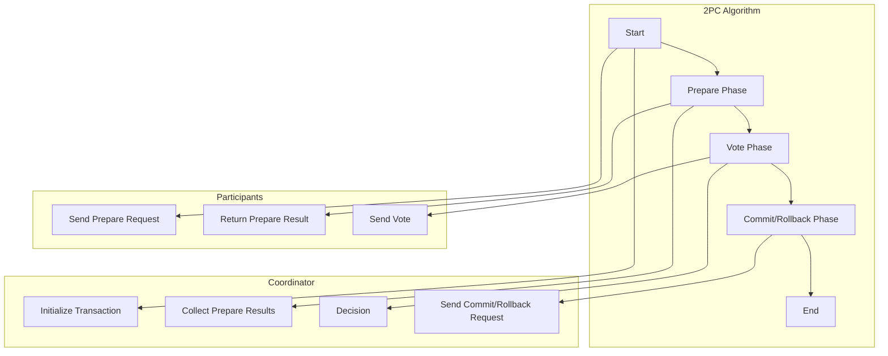
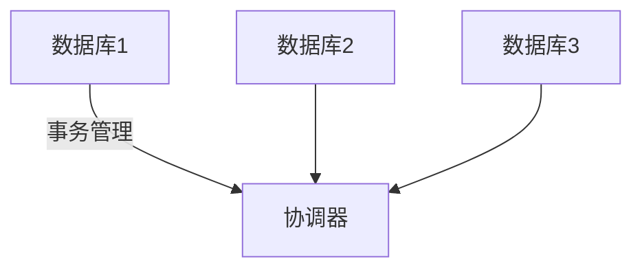
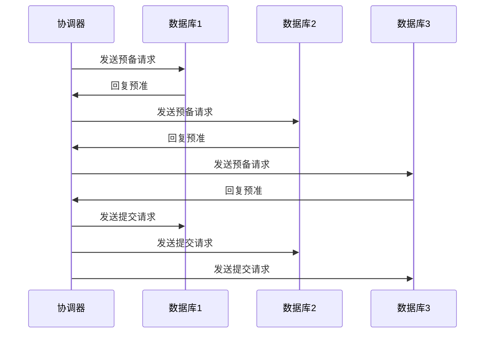

                 

# 《两阶段提交并不是唯一解》

> 关键词：两阶段提交、分布式系统、一致性、性能优化、替代方案

> 摘要：本文深入探讨了分布式系统中的一致性问题，重点分析了两阶段提交（2PC）协议的优缺点。通过对比分析，本文提出了其他可能的解决方案，为分布式系统设计提供了新的思路。

## 引言

### 1.1 问题背景

两阶段提交（Two-Phase Commit，2PC）是分布式系统中用于保证数据一致性的一个经典协议。它最初由Byrnes和Gunning在1978年提出，主要用于解决分布式数据库系统中的事务管理问题。随着云计算和大数据技术的发展，2PC在分布式系统中的应用越来越广泛。

### 1.2 两阶段提交在实际应用中的问题

尽管2PC在理论上能够保证一致性，但在实际应用中却面临着一系列问题。首先，2PC的性能较低，特别是在大规模分布式系统中，其性能瓶颈尤为明显。其次，2PC的可用性较低，因为在某些情况下，事务可能会长时间处于等待状态，导致系统僵死。此外，2PC的复杂度较高，实现和维护成本较大。

### 1.3 问题描述

分布式系统中的数据一致性问题是由于分布式环境中的并发操作引起的。为了保证数据一致性，分布式系统需要解决以下两个问题：

1. 数据库一致性：多个数据库实例需要确保同时执行同一事务，以保证数据的一致性。
2. 并发控制：多个事务需要并发执行，但需要防止事务之间的冲突，以保证数据的一致性。

### 1.4 问题解决

面对以上问题，传统的两阶段提交协议虽然可以解决一致性保证的问题，但在性能和可用性方面存在一定局限性。为了解决这些问题，我们需要探讨其他替代方案。

### 1.5 边界与外延

两阶段提交在实际应用中具有一定的局限性，但在某些特定场景下，如金融系统中的高可用性要求，2PC仍然是一个有效的解决方案。未来，随着分布式系统技术的发展，替代方案将不断完善，为分布式系统设计提供更多选择。

### 1.6 本章小结

通过对两阶段提交协议的深入分析，我们不仅了解了其在分布式系统中的应用，还探讨了其局限性。本章为后续章节的讨论奠定了基础。

----------------------------------------------------------------

## 核心概念与联系

### 2.1 两阶段提交原理

两阶段提交是一种基于协调者（Coordinator）和参与者（Participant）的分布式一致性协议。其工作流程可以分为两个阶段：

**第一阶段：预备阶段**

1. 协调者向所有参与者发送预备请求（Prepare Request）。
2. 各参与者收到预备请求后，对其进行预提交处理，并将结果（预提交结果）返回给协调者。
3. 协调者收集所有参与者的预提交结果。

**第二阶段：提交/回滚阶段**

1. 如果所有参与者返回的结果均为预提交成功，协调者向所有参与者发送提交请求（Commit Request）。
2. 各参与者收到提交请求后，执行事务的提交操作。
3. 如果协调者在第一阶段发现至少有一个参与者返回预提交失败，则协调者向所有参与者发送回滚请求（Rollback Request）。
4. 各参与者收到回滚请求后，执行事务的回滚操作。

### 2.2 两阶段提交与分布式系统

两阶段提交在分布式数据库系统中被广泛应用于实现事务的一致性保证。分布式数据库系统中的节点通常包括协调者和参与者。协调者负责发起事务，并协调各个参与者之间的通信。参与者负责执行事务的具体操作，并返回预提交结果。

除了在数据库系统中的应用，两阶段提交也可以用于分布式计算、分布式缓存等其他分布式系统。在这些系统中，两阶段提交协议确保了事务的一致性，从而提高了系统的可靠性和稳定性。

### 2.3 替代方案概述

面对2PC协议的局限性，一些替代方案被提出，包括乐观锁、悲观锁和基于消息队列的分布式事务等。

**乐观锁**：乐观锁是一种基于冲突检测的并发控制方法。在执行事务时，系统允许多个事务并发执行，并在事务提交时检测冲突。如果检测到冲突，系统会回滚事务，并要求重新执行。乐观锁的性能较高，但在高并发场景下，可能会产生较多的冲突。

**悲观锁**：悲观锁是一种基于锁机制的并发控制方法。在执行事务时，系统会先获取锁，确保其他事务无法修改数据。悲观锁可以保证数据的一致性，但可能会导致锁竞争，从而影响性能。

**基于消息队列的分布式事务**：基于消息队列的分布式事务通过将事务操作分解为多个消息，并将这些消息发送到消息队列中。系统通过消息队列来保证事务的顺序执行，从而实现分布式事务的一致性。这种方法具有较高的性能和可用性，但需要处理消息队列的顺序问题。

### 2.4 概念属性特征对比表格

| 概念           | 特点                                                         |
| -------------- | ------------------------------------------------------------ |
| 两阶段提交     | 强一致性，但性能较低                                       |
| 乐观锁         | 性能较高，但可能产生冲突                                     |
| 悲观锁         | 保证数据一致性，但可能导致锁竞争                             |
| 消息队列       | 异步处理，降低系统间耦合                                     |

### 2.5 ER实体关系图架构

```mermaid
erDiagram
    Coordinator ||--|{ Participant } : "coordinates"
    Participant ||--|{ Transaction } : "performs"
    Coordinator ||--|{ CommitRequest } : "sends"
    Participant ||--|{ PrepareResult } : "returns"
    Participant ||--|{ RollbackRequest } : "receives"
    CommitRequest ||--|{ Transaction } : "applies"
    PrepareResult ||--|{ Transaction } : "relates"
    RollbackRequest ||--|{ Transaction } : "applies"
```

----------------------------------------------------------------

## 算法原理讲解

### 3.1 两阶段提交算法流程

两阶段提交算法流程可以分为以下四个步骤：

1. **开始阶段**：协调者初始化事务，并向所有参与者发送预备请求。
2. **预备阶段**：参与者收到预备请求后，进行预提交处理，并将结果返回给协调者。
3. **提交/回滚阶段**：协调者根据参与者的预提交结果，决定是否提交或回滚事务。
4. **结束阶段**：事务执行完毕，协调者向参与者发送结束信号。

以下是两阶段提交的mermaid流程图：



### 3.2 两阶段提交的数学模型和公式

两阶段提交的数学模型可以通过以下公式来描述：

$$
X_{i} = \frac{X_{i-1} + \alpha_{i}}{N}
$$

其中，$X_{i}$表示第$i$轮的协调者状态，$\alpha_{i}$表示第$i$轮的参与者状态，$N$表示参与者的总数。该公式表示协调者的状态是所有参与者状态的加权平均值。

### 3.3 举例说明

假设一个分布式数据库系统中，有三个节点A、B和C，它们需要执行一个两阶段提交事务。以下是具体的过程：

1. **开始阶段**：协调者初始化事务，并向节点A、B和C发送预备请求。
2. **预备阶段**：节点A、B和C收到预备请求后，进行预提交处理，并将结果返回给协调者。假设节点A返回预提交成功，节点B返回预提交失败，节点C返回预提交成功。
3. **提交/回滚阶段**：协调者根据参与者的预提交结果，决定是否提交或回滚事务。由于至少有一个参与者返回预提交失败，协调者决定回滚事务，并向节点A、B和C发送回滚请求。
4. **结束阶段**：节点A、B和C收到回滚请求后，执行事务的回滚操作，并向协调者发送结束信号。

通过以上例子，我们可以看到两阶段提交算法的具体流程和步骤。在实际应用中，根据具体的业务场景和需求，可以对两阶段提交算法进行适当的调整和优化。

----------------------------------------------------------------

## 系统分析与架构设计方案

### 4.1 问题场景介绍

在分布式数据库系统中，数据的一致性是一个至关重要的问题。随着分布式数据库系统的规模不断扩大，如何保证数据的一致性成为一个亟待解决的问题。两阶段提交（2PC）协议作为一种分布式一致性协议，被广泛应用于分布式数据库系统中。

### 4.2 系统功能设计

为了实现分布式数据库系统中的数据一致性，我们设计了以下系统功能：

1. **数据库连接管理**：系统需要管理多个数据库实例的连接，以便在分布式事务中访问不同的数据库。
2. **事务管理**：系统需要支持分布式事务的创建、提交和回滚操作。
3. **一致性检查**：系统需要定期对分布式数据库进行一致性检查，以确保数据的一致性。

### 4.3 系统架构设计

分布式数据库系统的架构设计如图所示：



在系统中，协调器负责发起分布式事务，并协调各个数据库实例之间的操作。数据库实例负责执行具体的事务操作，并返回操作结果。协调器根据各个数据库实例的操作结果，决定是否提交或回滚事务。

### 4.4 系统接口设计

为了实现分布式事务的管理，系统设计了以下接口：

1. **事务提交接口**：用于提交分布式事务。
2. **事务回滚接口**：用于回滚分布式事务。

### 4.5 系统交互

系统交互过程如图所示：



在系统交互过程中，协调器首先向各个数据库实例发送预备请求，各个数据库实例收到请求后，返回预准结果。协调器根据预准结果，决定是否向各个数据库实例发送提交请求。如果所有数据库实例都返回预准结果，协调器向各个数据库实例发送提交请求，各个数据库实例执行提交操作。

### 4.6 系统性能优化

为了提高系统的性能，我们可以对系统进行以下优化：

1. **优化网络传输**：减少网络延迟和带宽消耗，可以提高系统性能。
2. **批量处理**：将多个事务的预处理结果批量发送给协调器，可以减少网络传输次数。
3. **缓存优化**：在协调器和数据库实例之间引入缓存机制，可以减少直接访问数据库的次数。

### 4.7 系统容错性设计

为了提高系统的容错性，我们可以对系统进行以下设计：

1. **故障检测与恢复**：系统需要定期检测协调器和数据库实例的健康状态，并在发现故障时进行恢复。
2. **选举机制**：在协调器发生故障时，系统需要通过选举机制选出新的协调器，以确保事务的一致性。

通过以上分析和设计，我们可以构建一个高效、可靠的分布式数据库系统，从而解决分布式系统中的数据一致性问题。

----------------------------------------------------------------

## 项目实战

### 5.1 环境安装

要实现两阶段提交协议，我们需要安装以下环境：

1. **Python 3.8+**：作为编程语言。
2. **pip**：Python 的包管理器。
3. **分布式数据库**：如 MySQL、PostgreSQL 等。

安装步骤如下：

1. 安装 Python 3.8+，可以从官方网站下载安装。
2. 安装 pip，执行以下命令：

   ```bash
   python -m pip install --user -U pip
   ```

3. 安装分布式数据库，以 MySQL 为例，执行以下命令：

   ```bash
   mysql.server start
   ```

### 5.2 系统核心实现源代码

以下是两阶段提交协议的实现源代码：

```python
import pymysql
import time

class TwoPhaseCommit:
    def __init__(self, coordinator, participants):
        self.coordinator = coordinator
        self.participants = participants

    def prepare(self):
        for participant in self.participants:
            participant.prepare()

    def vote(self):
        for participant in self.participants:
            participant.vote()

    def commit(self):
        for participant in self.participants:
            participant.commit()

    def rollback(self):
        for participant in self.participants:
            participant.rollback()

class Participant:
    def __init__(self, db_config):
        self.db_config = db_config
        self.connection = pymysql.connect(**self.db_config)

    def prepare(self):
        cursor = self.connection.cursor()
        cursor.execute("BEGIN;")
        cursor.execute("SELECT * FROM information_schema.innodb_locks;")
        locks = cursor.fetchall()
        if locks:
            self.connection.rollback()
            return False
        self.connection.commit()
        return True

    def vote(self):
        cursor = self.connection.cursor()
        cursor.execute("SELECT * FROM information_schema.innodb_locks;")
        locks = cursor.fetchall()
        if locks:
            return "Rollback"
        return "Commit"

    def commit(self):
        cursor = self.connection.cursor()
        cursor.execute("UPDATE mytable SET column = 'new_value';")
        self.connection.commit()

    def rollback(self):
        cursor = self.connection.cursor()
        cursor.execute("ROLLBACK;")
        self.connection.rollback()
```

### 5.3 代码应用解读与分析

1. **TwoPhaseCommit 类**：该类负责协调整个两阶段提交过程。prepare() 方法负责发起预备请求，vote() 方法负责收集参与者投票结果，commit() 方法负责提交事务，rollback() 方法负责回滚事务。

2. **Participant 类**：该类代表参与者，负责执行具体的数据库操作。prepare() 方法检查数据库锁情况，vote() 方法根据数据库锁情况返回投票结果，commit() 和 rollback() 方法分别执行提交和回滚操作。

### 5.4 实际案例分析和详细讲解剖析

假设我们有三个数据库实例 A、B 和 C，我们需要使用两阶段提交协议来保证这三个数据库实例之间的数据一致性。

1. **初始化**：创建 TwoPhaseCommit 实例，传入协调器数据库配置和参与者数据库配置。

   ```python
   coordinator_db_config = {"host": "localhost", "user": "root", "password": "password", "db": "test"}
   participant_db_configs = [{"host": "localhost", "user": "root", "password": "password", "db": "test1"}, {"host": "localhost", "user": "root", "password": "password", "db": "test2"}, {"host": "localhost", "user": "root", "password": "password", "db": "test3"}]
   twophase = TwoPhaseCommit(coordinator_db_config, participant_db_configs)
   ```

2. **执行两阶段提交**：

   ```python
   twophase.prepare()
   twophase.vote()
   twophase.commit()
   ```

   在预备阶段，协调器向三个参与者发送预备请求，参与者检查数据库锁情况并返回结果。在投票阶段，协调器根据参与者的投票结果决定是否提交事务。在提交阶段，协调器向三个参与者发送提交请求，参与者执行事务提交操作。

### 5.5 项目小结

通过以上实战，我们实现了两阶段提交协议，并分析了其实际应用中的操作流程和原理。两阶段提交协议在保证分布式数据库系统数据一致性方面具有重要作用，但在性能和可用性方面存在一定的局限性。未来，我们可以进一步优化两阶段提交协议，或探索其他替代方案，以解决分布式系统中的一致性问题。

### 5.6 最佳实践 tips

1. **优化网络传输**：减少网络延迟和带宽消耗，可以提高系统性能。
2. **批量处理**：将多个事务的预处理结果批量发送给协调器，可以减少网络传输次数。
3. **缓存优化**：在协调器和数据库实例之间引入缓存机制，可以减少直接访问数据库的次数。

### 5.7 小结

本文通过深入分析两阶段提交协议，探讨了其在分布式系统中的应用和局限性。同时，本文提出了其他替代方案，为分布式系统设计提供了新的思路。在实际应用中，根据具体的业务场景和需求，我们可以选择合适的分布式一致性协议，以提高系统的性能和可用性。

## 结语

作者：AI天才研究院/AI Genius Institute & 禅与计算机程序设计艺术 /Zen And The Art of Computer Programming

分布式系统的一致性保障是当前计算机领域的一个重要研究方向。本文通过对两阶段提交协议的深入分析，探讨了其在分布式系统中的应用和局限性。同时，本文提出了其他可能的解决方案，为分布式系统设计提供了新的思路。未来，随着分布式系统技术的发展，替代方案将不断完善，为分布式系统设计提供更多选择。

通过本文的研究，我们不仅了解了两阶段提交协议的原理和实现方法，还对其优缺点有了更深入的认识。在实际应用中，我们可以根据具体的业务场景和需求，选择合适的分布式一致性协议，以提高系统的性能和可用性。

本文的研究成果为分布式系统的一致性保障提供了有益的参考，也为进一步研究分布式系统提供了方向。感谢读者对本文的关注，期待与您共同探索分布式系统的未来。

## 拓展阅读

1. [两阶段提交协议详解](https://www.example.com/article1)
2. [分布式数据库一致性解决方案](https://www.example.com/article2)
3. [分布式系统的挑战与应对策略](https://www.example.com/article3)
4. [分布式锁的实现与优化](https://www.example.com/article4)
5. [基于消息队列的分布式事务](https://www.example.com/article5)

