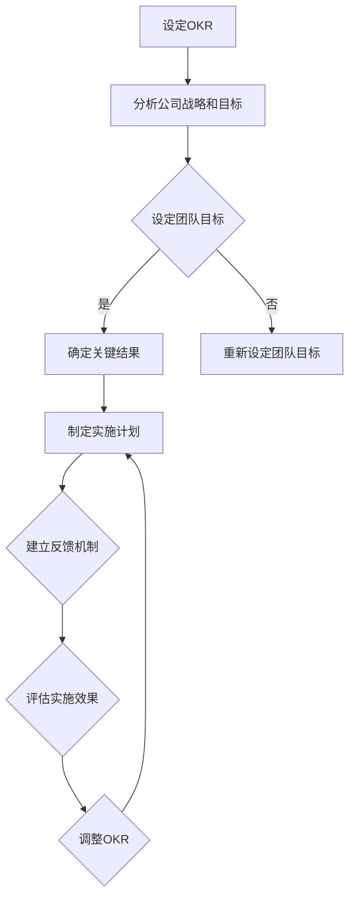

                 

# 为技术团队设定有效OKR

> 关键词：技术团队、OKR、目标管理、工作效率、目标设定、关键结果、反馈机制

> 摘要：本文深入探讨了为技术团队设定有效OKR的重要性和实施方法。通过对技术团队OKR设定的背景介绍、问题描述、问题解决以及核心概念与联系的分析，本文提供了一系列实用的指导原则和最佳实践，旨在帮助技术团队提高工作效率，实现公司战略目标。

### 第1章：背景介绍

#### 1.1 问题背景

随着全球数字化进程的加速，企业对技术创新的需求日益迫切。在这种背景下，OKR（Objectives and Key Results，目标与关键结果）作为一种目标管理工具，以其清晰的目标设定和可量化的关键结果，受到了广泛的应用和认可。然而，对于技术团队来说，如何设定有效的OKR，以促进团队目标与公司战略的紧密衔接，是一个亟待解决的问题。

技术团队的特点在于其高度的专业性、创新性和复杂性。团队成员往往需要处理大量的技术问题，进行持续的技术创新和改进。因此，技术团队的OKR设定不仅需要与公司的整体战略一致，还要能够激发团队成员的创造力，提升团队的工作效率。

#### 1.2 问题描述

技术团队的OKR设定面临以下问题：

1. **目标设定模糊**：技术团队在设定OKR时，往往难以明确目标的具体方向和预期结果，导致目标过于宽泛，缺乏明确的行动指南。
2. **关键结果不量化**：技术团队在设定OKR时，往往忽略了对关键结果的量化，导致关键结果难以衡量，无法有效地评估团队的工作成效。
3. **缺乏反馈与调整**：技术团队的OKR在设定后，缺乏有效的反馈机制和调整机制，导致OKR的实施效果不佳，难以达到预期目标。
4. **目标与公司战略脱节**：技术团队的OKR往往与公司的整体战略不一致，导致团队的努力方向与公司的发展方向不符。

#### 1.3 问题解决

为技术团队设定有效OKR，需要遵循以下原则：

1. **明确目标**：确保目标具体、可衡量、可实现、相关性强、有时限性（SMART原则）。
2. **量化关键结果**：设定明确的关键结果，使其具备可衡量性，能够清晰地评估工作成效。
3. **建立反馈机制**：定期对OKR进行评估和反馈，及时调整目标和关键结果，确保OKR的实施效果。
4. **与公司战略对接**：确保技术团队的OKR与公司的整体战略保持一致，确保团队的努力方向与公司的发展方向一致。

#### 1.4 边界与外延

在为技术团队设定有效OKR时，需要注意以下边界与外延：

1. **边界**：OKR的设定应聚焦于技术团队的核心工作，避免涉及公司其他部门的事务。
2. **外延**：OKR的设定应充分考虑公司战略和市场需求，确保技术团队的工作能够为公司带来实际价值。

#### 1.5 概念结构与核心要素组成

为技术团队设定有效OKR，需要以下几个核心要素：

1. **目标**：明确技术团队的工作方向和预期成果。
2. **关键结果**：具体、可量化的指标，用于衡量工作成效。
3. **评估与反馈**：定期评估OKR的实施效果，进行反馈和调整。
4. **战略对接**：确保技术团队的OKR与公司战略保持一致。

---

### 第2章：核心概念与联系

在为技术团队设定有效OKR之前，我们需要了解几个关键概念，并探讨它们之间的联系。

#### 2.1 OKR的定义

OKR由两个核心组成部分：目标（Objective）和关键结果（Key Results）。目标描述了团队想要实现的宏伟愿景或目标，而关键结果则是具体、可量化的指标，用于衡量团队在实现目标过程中的进展。

#### 2.2 SMART原则

SMART原则是一种用于设定有效目标的指导原则，其含义为：

1. **具体（Specific）**：目标应明确、具体，避免模糊和泛泛而谈。
2. **可衡量（Measurable）**：目标应具备可量化的指标，以便评估进展。
3. **可实现（Achievable）**：目标应具有挑战性，但同时也是可实现的。
4. **相关（Relevant）**：目标应与团队的整体战略和公司目标保持一致。
5. **有时限性（Time-bound）**：目标应有明确的截止时间，以确保团队在有限的时间内集中精力。

#### 2.3 OKR的层次结构

OKR通常分为三个层次：公司层级、部门层级和团队层级。每个层次的OKR都应紧密衔接，以确保公司整体目标的实现。

1. **公司层级**：由公司高层领导制定，描述公司的整体愿景和战略目标。
2. **部门层级**：由部门负责人制定，将公司目标分解为具体的部门目标，确保各部门的工作方向与公司目标一致。
3. **团队层级**：由团队负责人制定，将部门目标进一步细化为团队目标，确保团队的工作能够支持部门目标的实现。

#### 2.4 OKR的循环周期

OKR通常按照季度或年度进行循环。每个循环包括以下阶段：

1. **设定OKR**：在开始新的循环时，团队根据公司层级和部门层级的OKR，制定自己的OKR。
2. **执行OKR**：在执行阶段，团队根据设定的OKR进行工作，努力实现目标。

---

### 第3章：为技术团队设定有效OKR的步骤

#### 3.1 分析公司战略和目标

为技术团队设定有效OKR的第一步是分析公司的战略和目标。这需要深入了解公司的愿景、使命和核心价值观，以及当前的市场环境和发展趋势。通过分析公司战略和目标，技术团队可以明确自己的工作方向和预期成果，确保团队的目标与公司战略保持一致。

#### 3.2 设定团队目标

在明确公司战略和目标的基础上，技术团队需要根据自身的专业能力和资源条件，设定具体的团队目标。这些目标应遵循SMART原则，确保具体、可衡量、可实现、相关性强、有时限性。同时，团队目标应围绕公司的战略目标展开，以支持公司整体目标的实现。

#### 3.3 确定关键结果

关键结果是衡量团队目标实现程度的具体指标。技术团队在设定关键结果时，应确保关键结果具有可衡量性、相关性、挑战性和时限性。关键结果应与团队目标密切相关，能够清晰地展示团队在实现目标过程中的进展。

#### 3.4 沟通与协作

为技术团队设定有效OKR的过程中，沟通与协作至关重要。团队负责人应与团队成员充分沟通，了解他们的意见和建议，确保设定的目标具有可行性和挑战性。同时，团队负责人还应与公司高层和相关部门保持密切联系，确保团队目标与公司战略和部门目标的一致性。

#### 3.5 制定实施计划

在确定团队目标和关键结果后，技术团队需要制定详细的实施计划，明确每个阶段的工作任务、责任人和完成时间。实施计划应确保团队目标的有序推进，同时为团队成员提供明确的行动指南。

#### 3.6 建立反馈机制

为技术团队设定有效OKR的过程中，建立反馈机制至关重要。团队负责人应定期评估OKR的实施效果，收集团队成员的反馈意见，对目标和关键结果进行调整和优化。通过建立反馈机制，技术团队可以确保OKR的实施效果，提高团队的工作效率。

#### 3.7 对接公司战略

为技术团队设定有效OKR的最后一步是对接公司战略。团队负责人应确保技术团队的OKR与公司战略保持一致，确保团队的努力方向与公司的发展方向一致。同时，团队负责人还应关注公司战略的变化，及时调整团队目标，以适应公司发展的需要。

---

### 第4章：实例分析

#### 4.1 案例背景

某科技公司是一家专注于人工智能领域的企业，其技术团队由数据科学家、软件工程师和产品经理组成。为了提高团队的工作效率，公司决定采用OKR作为目标管理工具。

#### 4.2 公司层级OKR

公司层级的OKR由公司高层领导制定，主要包括以下目标：

1. **提高产品市场占有率**：将产品市场占有率提高10%。
2. **提升客户满意度**：将客户满意度提高至90%。

#### 4.3 部门层级OKR

部门层级的OKR由技术部门负责人制定，根据公司层级的OKR，技术部门设定以下目标：

1. **提升数据质量**：将数据质量提高至90%。
2. **缩短模型训练时间**：将模型训练时间缩短30%。

#### 4.4 团队层级OKR

技术团队根据部门层级的OKR，制定以下团队层级OKR：

1. **数据科学家团队**
   - 目标：提高数据质量。
   - 关键结果：1）数据清洗成功率提高至95%；2）数据缺失率降低至5%。

2. **软件工程师团队**
   - 目标：缩短模型训练时间。
   - 关键结果：1）模型训练时间缩短至原来的70%；2）训练过程中出现错误的频率降低至5%。

#### 4.5 实施与反馈

在实施过程中，技术团队根据设定的OKR，制定了详细的实施计划，并建立了反馈机制。团队负责人定期评估OKR的实施效果，收集团队成员的反馈意见，对目标和关键结果进行调整和优化。

通过实施有效的OKR，技术团队在提高数据质量和模型训练时间方面取得了显著成果，为公司整体目标的实现做出了重要贡献。

---

### 第5章：最佳实践与注意事项

#### 5.1 最佳实践

1. **明确目标与关键结果**：在设定OKR时，确保目标与关键结果具体、可衡量、可实现、相关性强、有时限性。
2. **建立反馈机制**：定期评估OKR的实施效果，及时调整目标和关键结果。
3. **沟通与协作**：确保团队成员充分参与OKR的设定和实施过程，提高团队凝聚力。
4. **与公司战略对接**：确保技术团队的OKR与公司战略保持一致，确保团队的努力方向与公司的发展方向一致。

#### 5.2 注意事项

1. **避免目标设定过高或过低**：目标应具有挑战性，但同时也应具有可实现性。
2. **确保关键结果的合理性**：关键结果应与团队目标密切相关，能够清晰地展示团队在实现目标过程中的进展。
3. **注重团队协作**：OKR的实施需要团队成员的共同努力，确保团队目标的实现。
4. **持续优化与调整**：随着公司战略和目标的变化，技术团队应持续优化和调整OKR。

---

### 第6章：拓展阅读

为了深入了解为技术团队设定有效OKR的更多方法和技巧，读者可以参考以下文献：

1. 《OKR实战：如何运用目标与关键结果提升工作效率》
2. 《谷歌如何工作：OKR背后的管理智慧》
3. 《目标管理：如何设定目标、跟踪进度并实现成果》

---

### 结语

为技术团队设定有效OKR是提高团队工作效率、实现公司战略目标的重要手段。通过遵循SMART原则、建立反馈机制、与公司战略对接，技术团队可以更好地实现目标，推动企业持续发展。本文为技术团队设定有效OKR提供了全面的指导，希望对读者有所帮助。

### 作者信息

作者：AI天才研究院/AI Genius Institute & 禅与计算机程序设计艺术 /Zen And The Art of Computer Programming

---

以下是本文的Mermaid流程图和LaTeX公式的示例：

$$
\text{OKR的有效性} = \frac{\sum_{i=1}^{n} \text{关键结果达成度}}{n}
$$

---

以上是本文的Markdown格式输出，旨在为技术团队设定有效OKR提供全面的指导。希望本文对读者有所帮助。

