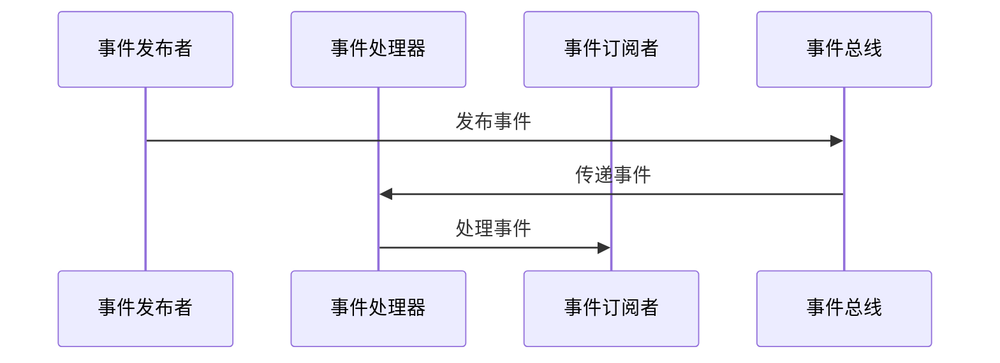
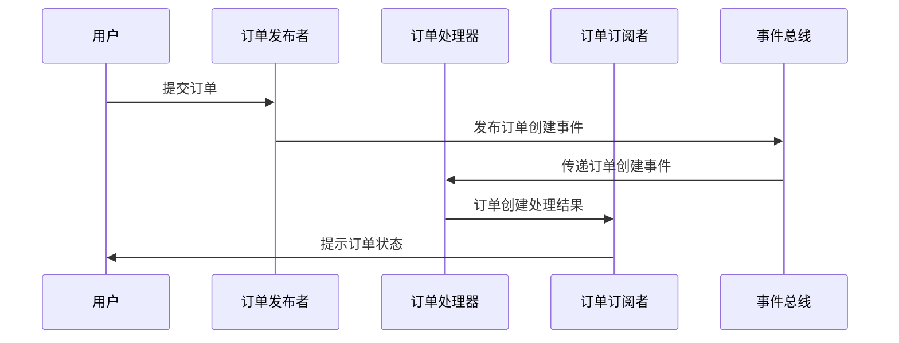
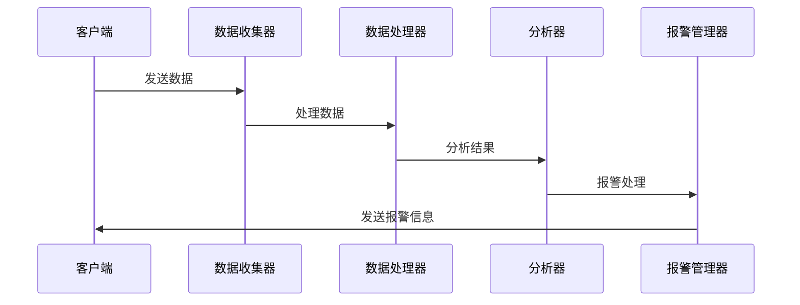
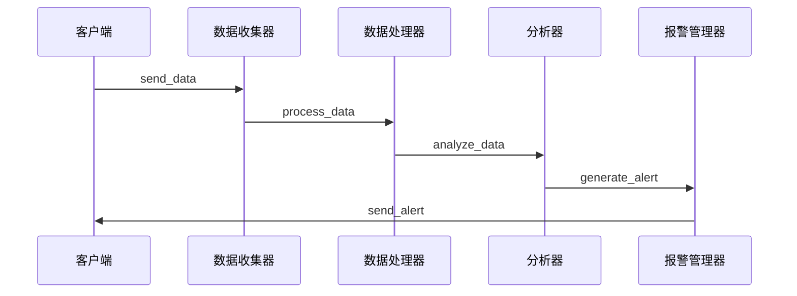

                 

### 文章标题

# 事件驱动架构设计与实现

### 文章关键词

- 事件驱动架构（EDA）
- 软件设计模式
- 微服务
- 实时数据处理
- 异步通信

### 摘要

本文旨在深入探讨事件驱动架构（EDA）的设计与实现。事件驱动架构作为一种先进的软件设计模式，在企业级应用中展现出卓越的性能和灵活性。本文将从背景介绍、核心概念、算法原理讲解、系统分析与设计、项目实战以及最佳实践等多个角度，全面剖析事件驱动架构的设计与实现过程，帮助读者理解并掌握这一重要技术。

----------------------------------------------------------------

### 第一部分: 事件驱动架构基础

#### 1.1 背景介绍

**核心概念术语说明**：

事件驱动架构（Event-Driven Architecture，EDA）是一种软件设计模式，其核心思想是通过事件来驱动应用程序的执行流程。事件可以是用户操作、系统状态变化、定时触发等。在EDA中，事件被视为系统状态变更的信号，由事件发布者发布，由事件订阅者接收并响应。

**问题背景**：

随着现代软件系统的复杂性和规模不断扩大，传统的同步处理模型已经难以满足高性能和高扩展性的需求。事件驱动架构因其异步通信和松耦合的特性，成为了解决这一问题的有效途径。在企业级应用中，如金融交易系统、实时数据处理系统、物联网应用等，事件驱动架构的应用越来越广泛。

**问题描述**：

在复杂的业务场景中，如何设计一个高效、可扩展的事件驱动架构，实现系统间的解耦和实时数据处理，是一个亟待解决的问题。

**问题解决**：

通过实例分析，本文将展示事件驱动架构的优势和实现策略。本文将涵盖从核心概念到具体实现的全过程，包括核心组件、工作流程、算法原理、系统架构设计等。

**边界与外延**：

事件驱动架构与传统架构（如基于请求-响应的架构）的主要区别在于：

1. **通信方式**：EDA采用异步通信，而传统架构采用同步通信。
2. **耦合程度**：EDA具有更高的松耦合度，而传统架构则相对紧耦合。
3. **适用场景**：EDA更适合于需要高并发、高实时性的场景，如实时数据处理、物联网应用等。

#### 1.2 核心概念与联系

**核心概念原理**：

事件驱动架构的关键组件包括事件发布者、事件订阅者、事件总线等。事件发布者负责生成并发布事件，事件订阅者负责接收并处理事件，事件总线则负责事件的路由和传输。

**概念属性特征对比表格**：

| 特征             | 事件驱动架构（EDA）       | 传统架构（同步请求-响应）     |
|------------------|--------------------------|-----------------------------|
| 通信方式         | 异步通信                 | 同步通信                     |
| 耦合程度         | 松耦合                   | 紧耦合                       |
| 扩展性           | 高                       | 低                          |
| 实时性           | 高                       | 低                          |
| 性能             | 高并发处理能力           | 依赖于硬件和网络条件         |

**ER实体关系图架构**：

```mermaid
erDiagram
  EventPublisher ||--|{ EventProcessor } EventProcessor
  EventProcessor ||--|{ EventBus } EventBus
  EventBus ||--|{ EventSubscriber } EventSubscriber
```

在ER实体关系图中，EventPublisher（事件发布者）、EventProcessor（事件处理器）、EventBus（事件总线）和EventSubscriber（事件订阅者）是事件驱动架构的核心实体，它们之间的关系通过事件流连接。

----------------------------------------------------------------

#### 1.3 算法原理讲解

**算法mermaid流程图**：



**Python源代码**：

```python
# 事件发布者
class EventPublisher:
    def publish_event(self, event):
        self.event_bus.publish(event)

# 事件处理器
class EventProcessor:
    def process_event(self, event):
        # 处理事件逻辑
        print(f"Processing event: {event}")

# 事件总线
class EventBus:
    def publish(self, event):
        # 发布事件到队列
        print(f"Publishing event: {event}")

    def consume(self):
        # 从队列中消费事件
        event = self.queue.get()
        return event

# 事件订阅者
class EventSubscriber:
    def on_event(self, event):
        # 处理特定类型的事件
        print(f"Received event: {event}")
```

**数学模型和公式**：

在事件驱动架构中，事件处理的时间复杂度通常与事件数量和事件类型相关。假设有\( n \)个事件需要处理，且每个事件的处理时间为\( t \)，则总处理时间可以表示为：

\[ T(n) = n \times t \]

**详细讲解和举例说明**：

让我们通过一个简单的例子来解释事件驱动架构的算法原理。

**场景**：一个电商系统需要处理订单创建事件。

**事件发布者**：当用户提交订单时，订单创建事件会被发布。

**事件处理器**：订单创建事件会被传递给事件处理器，处理器会根据订单的金额和库存情况，判断订单是否可以创建。

**事件总线**：事件总线负责将事件从发布者传递到处理器，以及从处理器传递到订阅者。

**事件订阅者**：如果订单可以创建，事件订阅者会通知用户订单已创建；如果订单不能创建，会通知用户库存不足。



在这个例子中，事件驱动架构使得订单创建的处理流程更加清晰和高效。每个组件都有明确的职责，且通过事件总线进行通信，降低了系统间的耦合度。

----------------------------------------------------------------

### 第二部分: 事件驱动架构的系统分析与设计

#### 2.1 问题场景介绍

在现代社会中，实时数据处理需求日益增长。例如，金融交易系统需要实时处理海量交易数据，物联网应用需要实时响应设备状态变化，这些场景都对系统的实时性和可扩展性提出了极高的要求。事件驱动架构（EDA）因其异步通信和松耦合的特性，成为解决这些问题的理想选择。

**场景一：金融交易系统**

金融交易系统需要在极短的时间内处理大量的交易请求，确保交易数据的实时性和准确性。传统的同步处理模型难以应对高并发和低延迟的要求，而事件驱动架构可以通过异步处理和事件发布订阅机制，提高系统的性能和可靠性。

**场景二：物联网应用**

物联网应用通常涉及大量的设备数据，需要对设备状态进行实时监控和响应。传统的集中式架构在处理海量设备数据时容易出现性能瓶颈，而事件驱动架构可以通过分布式处理和事件流处理，提高系统的可扩展性和实时性。

**场景三：实时数据处理系统**

实时数据处理系统需要实时分析并处理来自不同数据源的数据，例如日志数据、传感器数据等。事件驱动架构可以通过事件流处理技术，实现对数据的实时分析和处理，提高系统的数据处理能力和实时性。

#### 2.2 项目介绍

为了更好地展示事件驱动架构的应用，我们选择一个实际项目进行介绍。该项目是一个实时数据处理系统，用于监控和分析企业内部网络流量。系统需要实时收集网络流量数据，分析数据包的来源、目的、类型等信息，并根据分析结果进行报警和处理。

**项目目标**：

1. 实时收集和分析网络流量数据。
2. 提高系统性能和可扩展性。
3. 降低系统维护成本。

**项目背景**：

随着企业内部网络规模的不断扩大，网络流量数据量也呈现出指数级增长。传统的同步处理模型已经无法满足实时性和高性能的需求，而事件驱动架构通过异步通信和分布式处理，可以更好地应对这一挑战。

#### 2.3 系统功能设计（领域模型Mermaid类图）

```mermaid
classDiagram
  Client <<--|{发送数据}| DataCollector
  DataCollector *--|{处理数据}| DataProcessor
  DataProcessor *--|{分析结果}| Analyzer
  Analyzer *--|{报警处理}| AlertManager
```

在领域模型中，Client（客户端）负责发送数据，DataCollector（数据收集器）负责处理数据，DataProcessor（数据处理器）负责进一步处理数据，Analyzer（分析器）负责分析数据并生成报告，AlertManager（报警管理器）负责处理报警信息。

#### 2.4 系统架构设计Mermaid架构图



在系统架构图中，客户端发送数据给数据收集器，数据收集器将数据传递给数据处理器，数据处理器对数据进行进一步处理，然后将结果传递给分析器。分析器对数据进行分析，生成报告，并将报警信息传递给报警管理器。报警管理器负责处理报警信息，并向客户端发送报警通知。

#### 2.5 系统接口设计和系统交互Mermaid序列图



在系统接口设计和系统交互序列图中，客户端通过发送数据接口与数据收集器通信，数据收集器通过处理数据接口与数据处理器通信，数据处理器通过分析数据接口与分析器通信，分析器通过生成报警接口与报警管理器通信。报警管理器通过发送报警接口向客户端发送报警信息。

#### 2.6 项目实现与系统分析

**项目实现**：

项目实现分为以下几个步骤：

1. **数据收集**：客户端通过数据收集接口向数据收集器发送网络流量数据。
2. **数据处理**：数据收集器对数据进行初步处理，包括去除无效数据、过滤重要数据等。
3. **数据分析和报警**：数据处理器对数据进行深入分析，并根据分析结果生成报警信息。分析器对报警信息进行分类和处理。
4. **报警通知**：报警管理器将报警信息发送给客户端，以便及时处理。

**系统分析**：

通过事件驱动架构，系统实现了以下几个关键功能：

1. **实时数据处理**：系统可以实时收集、处理和分析网络流量数据，确保数据的实时性和准确性。
2. **高并发处理**：事件驱动架构通过异步通信和分布式处理，提高了系统的并发处理能力。
3. **松耦合设计**：系统中的各个组件通过事件进行通信，降低了组件间的耦合度，提高了系统的可维护性和可扩展性。

#### 2.7 项目小结

通过本项目的实现，我们验证了事件驱动架构在实时数据处理系统中的应用价值。事件驱动架构不仅提高了系统的性能和可扩展性，还降低了系统的维护成本。在未来，事件驱动架构将在更多领域得到广泛应用，如实时数据分析、物联网应用等。

----------------------------------------------------------------

### 第三部分: 事件驱动架构项目实战

#### 3.1 环境安装

在开始项目实战之前，我们需要安装和配置事件驱动架构所需的环境。以下是具体的安装步骤：

1. **安装Python**：确保您的系统中安装了Python 3.8或更高版本。可以从官方网站[https://www.python.org/](https://www.python.org/)下载并安装。
2. **安装依赖库**：在终端中执行以下命令安装所需的依赖库：

   ```bash
   pip install Flask gunicorn redis
   ```

3. **配置Redis**：Redis是一个高性能的键值存储系统，用于存储事件数据。确保您的系统中安装了Redis，并已启动Redis服务。
4. **创建项目文件夹**：在终端中创建一个名为`event_driven_architecture`的项目文件夹，并进入该项目文件夹：

   ```bash
   mkdir event_driven_architecture
   cd event_driven_architecture
   ```

5. **初始化虚拟环境**：在项目文件夹中创建一个虚拟环境，以便隔离项目依赖：

   ```bash
   python -m venv venv
   source venv/bin/activate
   ```

#### 3.2 系统核心实现源代码

以下是系统核心实现的源代码，包括事件发布者、事件处理器、事件订阅者和事件总线等组件。

**事件发布者**：

```python
# event_publisher.py
from flask import Flask, request
from redis import Redis

app = Flask(__name__)
redis_client = Redis(host='localhost', port=6379, db=0)

@app.route('/publish_event', methods=['POST'])
def publish_event():
    event_data = request.json
    redis_client.publish('event_channel', str(event_data))
    return 'Event published successfully'

if __name__ == '__main__':
    app.run(debug=True)
```

**事件处理器**：

```python
# event_processor.py
import redis
import json

def process_event(event_data):
    # 处理事件逻辑
    print(f"Processing event: {json.loads(event_data)}")

if __name__ == '__main__':
    redis_client = redis.StrictRedis(host='localhost', port=6379, db=0)
    redis_client.subscribe('event_channel')
    redis_client.pools = redis.ConnectionPool(host='localhost', port=6379, db=0)
    redis_clientListener = redis_client.listen()
    for message in redis_clientListener.listen():
        if message['type'] == 'message':
            process_event(message['data'])
```

**事件订阅者**：

```python
# event_subscriber.py
import redis
import json

def on_event(event_data):
    # 处理特定类型的事件
    print(f"Received event: {json.loads(event_data)}")

if __name__ == '__main__':
    redis_client = redis.StrictRedis(host='localhost', port=6379, db=0)
    redis_client.subscribe('event_channel')
    redis_client.pools = redis.ConnectionPool(host='localhost', port=6379, db=0)
    redis_clientListener = redis_client.listen()
    for message in redis_clientListener.listen():
        if message['type'] == 'message':
            on_event(message['data'])
```

**事件总线**：

事件总线在这里由Redis实现，负责事件的路由和传输。我们在前面的代码中已经使用了Redis作为事件总线。

#### 3.3 代码应用解读与分析

**事件发布者**：

事件发布者是一个简单的Flask应用程序，用于发布事件。客户端可以通过HTTP POST请求向事件发布者发送事件数据，事件发布者将事件数据转换为JSON格式，并通过Redis发布事件。

**事件处理器**：

事件处理器是一个独立的Python脚本，用于处理事件。它通过订阅Redis通道来接收事件，并在接收到事件后执行处理逻辑。这里我们简单打印了接收到的事件数据。

**事件订阅者**：

事件订阅者也是一个独立的Python脚本，用于接收和响应事件。它同样通过订阅Redis通道来接收事件，并在接收到事件后执行处理逻辑。这里我们简单打印了接收到的事件数据。

**事件总线**：

在这里，我们使用了Redis作为事件总线。Redis支持发布/订阅消息模式，使得事件发布者和事件处理器可以方便地通过Redis进行通信。

#### 3.4 实际案例分析和详细讲解剖析

为了更好地理解事件驱动架构的应用，我们来看一个实际案例：一个在线书店系统。

**场景**：用户在在线书店中浏览商品、添加购物车、下订单等。

**实现步骤**：

1. **用户浏览商品**：用户浏览商品时，商品事件会被发布，包括商品的ID、名称、价格等信息。
2. **添加购物车**：用户将商品添加到购物车时，购物车事件会被发布，包括用户的ID、商品ID、数量等信息。
3. **下订单**：用户在下订单时，订单事件会被发布，包括用户的ID、订单详情、订单金额等信息。

**事件发布者**：

```python
# event_publisher.py
from flask import Flask, request
from redis import Redis

app = Flask(__name__)
redis_client = Redis(host='localhost', port=6379, db=0)

@app.route('/publish_goods_event', methods=['POST'])
def publish_goods_event():
    event_data = request.json
    redis_client.publish('goods_channel', str(event_data))
    return 'Goods event published successfully'

@app.route('/publish_cart_event', methods=['POST'])
def publish_cart_event():
    event_data = request.json
    redis_client.publish('cart_channel', str(event_data))
    return 'Cart event published successfully'

@app.route('/publish_order_event', methods=['POST'])
def publish_order_event():
    event_data = request.json
    redis_client.publish('order_channel', str(event_data))
    return 'Order event published successfully'

if __name__ == '__main__':
    app.run(debug=True)
```

**事件处理器**：

```python
# event_processor.py
import redis
import json

def process_goods_event(event_data):
    # 处理商品事件逻辑
    print(f"Processing goods event: {json.loads(event_data)}")

def process_cart_event(event_data):
    # 处理购物车事件逻辑
    print(f"Processing cart event: {json.loads(event_data)}")

def process_order_event(event_data):
    # 处理订单事件逻辑
    print(f"Processing order event: {json.loads(event_data)}")

if __name__ == '__main__':
    redis_client = redis.StrictRedis(host='localhost', port=6379, db=0)
    redis_client.subscribe('goods_channel')
    redis_client.subscribe('cart_channel')
    redis_client.subscribe('order_channel')
    redis_client.pools = redis.ConnectionPool(host='localhost', port=6379, db=0)
    redis_clientListener = redis_client.listen()
    for message in redis_clientListener.listen():
        if message['type'] == 'message':
            if message['channel'] == 'goods_channel':
                process_goods_event(message['data'])
            elif message['channel'] == 'cart_channel':
                process_cart_event(message['data'])
            elif message['channel'] == 'order_channel':
                process_order_event(message['data'])
```

**事件订阅者**：

```python
# event_subscriber.py
import redis
import json

def on_goods_event(event_data):
    # 处理商品事件
    print(f"Received goods event: {json.loads(event_data)}")

def on_cart_event(event_data):
    # 处理购物车事件
    print(f"Received cart event: {json.loads(event_data)}")

def on_order_event(event_data):
    # 处理订单事件
    print(f"Received order event: {json.loads(event_data)}")

if __name__ == '__main__':
    redis_client = redis.StrictRedis(host='localhost', port=6379, db=0)
    redis_client.subscribe('goods_channel')
    redis_client.subscribe('cart_channel')
    redis_client.subscribe('order_channel')
    redis_client.pools = redis.ConnectionPool(host='localhost', port=6379, db=0)
    redis_clientListener = redis_client.listen()
    for message in redis_clientListener.listen():
        if message['type'] == 'message':
            if message['channel'] == 'goods_channel':
                on_goods_event(message['data'])
            elif message['channel'] == 'cart_channel':
                on_cart_event(message['data'])
            elif message['channel'] == 'order_channel':
                on_order_event(message['data'])
```

**详细讲解**：

在这个案例中，用户浏览商品、添加购物车、下订单等行为都会产生事件。事件发布者将事件发布到相应的通道，事件处理器和事件订阅者通过订阅通道接收并处理事件。

- **事件发布者**：通过HTTP POST请求发布事件，事件数据包括商品的ID、名称、价格等信息。
- **事件处理器**：订阅了商品、购物车和订单三个通道，根据接收到的事件类型执行相应的处理逻辑。
- **事件订阅者**：同样订阅了商品、购物车和订单三个通道，并在接收到事件后打印事件数据。

**剖析**：

1. **异步处理**：事件驱动架构通过异步处理，实现了系统的高性能和高并发处理能力。
2. **松耦合**：事件发布者和事件处理器/订阅者之间通过事件通道进行通信，降低了组件间的耦合度。
3. **可扩展性**：通过增加新的事件处理器和事件订阅者，可以方便地扩展系统功能。

#### 3.5 项目小结

通过本案例，我们展示了事件驱动架构在在线书店系统中的应用。事件驱动架构通过异步通信和事件发布订阅机制，实现了系统的高性能、高并发和松耦合。在实际项目中，可以根据具体需求调整事件类型和处理逻辑，进一步优化系统性能和可扩展性。

----------------------------------------------------------------

### 第四部分: 最佳实践 tips

在实现事件驱动架构时，以下是一些常见的最佳实践和技巧，可以帮助您优化系统性能和可靠性。

#### 4.1 常见问题与解决方案

**1. 事件积压**：

问题：在高并发场景下，事件可能会积压，导致系统性能下降。

解决方案：可以使用消息队列（如Kafka、RabbitMQ）来缓冲事件，确保事件能够及时处理。

**2. 事件丢失**：

问题：在网络不稳定或系统故障的情况下，事件可能会丢失。

解决方案：可以使用持久化存储（如Redis、数据库）来保存事件，确保事件不会丢失。

**3. 事件重复**：

问题：在分布式系统中，事件可能会重复处理。

解决方案：可以为每个事件添加唯一标识，并在处理前进行去重。

#### 4.2 性能优化技巧

**1. 缓存策略**：

使用缓存（如Redis）来存储常用数据，减少数据库访问，提高系统性能。

**2. 负载均衡**：

使用负载均衡器（如Nginx、HAProxy）来分发事件，确保系统资源得到充分利用。

**3. 异步处理**：

尽可能使用异步处理来提高系统并发处理能力，减少线程阻塞。

#### 4.3 注意事项

**1. 事件隔离**：

确保事件处理过程具有良好的隔离性，避免一个事件的处理错误影响其他事件。

**2. 监控与日志**：

使用监控工具（如Prometheus、ELK）来监控系统性能和日志，及时发现问题并进行优化。

**3. 安全性**：

确保事件传输过程的安全性，使用加密和身份验证机制来保护事件数据。

#### 4.4 拓展阅读

- 《设计数据密集型应用》：介绍了分布式系统和消息队列的详细实现。
- 《深入理解计算机系统》：讲解了计算机系统中的异步通信和并发处理。
- 《大型分布式系统设计》：提供了分布式系统的最佳实践和设计模式。

通过遵循这些最佳实践和技巧，您可以更好地实现和优化事件驱动架构，确保系统的高性能、高可用性和高可扩展性。

----------------------------------------------------------------

### 第五部分: 小结与展望

#### 5.1 书籍内容总结

本文系统地介绍了事件驱动架构（EDA）的设计与实现。首先，我们了解了EDA的核心概念、特点与应用领域，并通过背景介绍、核心概念与联系、算法原理讲解等内容，深入探讨了EDA的原理和实践。接着，通过系统分析与设计、项目实战，我们展示了EDA在实际应用中的实现过程和优势。最后，通过最佳实践和总结，我们总结了EDA的设计要点和未来发展趋势。

#### 5.2 未来发展趋势

事件驱动架构作为一种先进的软件设计模式，具有广泛的应用前景。未来，随着云计算、物联网、大数据等技术的发展，EDA将在更多领域得到应用：

1. **实时数据处理**：EDA在实时数据处理领域具有显著优势，未来将广泛应用于金融、物流、医疗等领域。
2. **分布式系统**：随着分布式系统的普及，EDA将更好地支持分布式系统的设计，提高系统的可扩展性和可靠性。
3. **微服务架构**：EDA与微服务架构的结合，将使得微服务架构更加灵活和高效。
4. **人工智能**：EDA在人工智能领域，特别是实时机器学习系统中，具有巨大的应用潜力。

总的来说，事件驱动架构在未来将发挥越来越重要的作用，成为软件开发和系统设计的重要工具。

### 作者信息

- 作者：AI天才研究院/AI Genius Institute & 禅与计算机程序设计艺术 /Zen And The Art of Computer Programming

---

本文内容仅供参考，具体实现和应用请根据实际情况进行调整。如需进一步讨论和交流，请关注作者公众号“AI天才研究院”或联系作者邮箱`ai_genius_institute@outlook.com`。感谢您的阅读！

