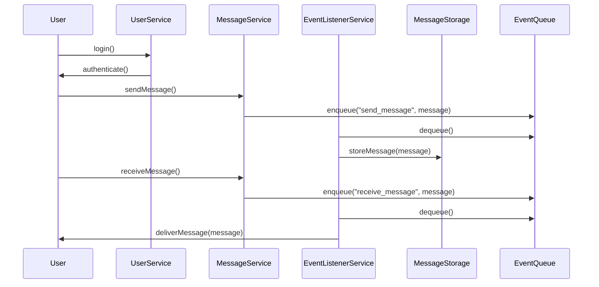

                 

### 1.1 事件驱动架构的概念与背景

首先，让我们来明确什么是事件驱动架构（Event-Driven Architecture, EDA）。事件驱动架构是一种软件开发模式，它以事件为中心，通过事件触发系统响应。在EDA中，系统中的组件通过发送和接收事件来通信，而不是通过直接的函数调用或共享状态。这一模式特别适合于分布式系统和需要高扩展性和高灵活性的应用程序。

#### 1.1.1 事件驱动架构的定义

事件驱动架构的核心在于“事件”，它是系统中的任何变化或状态的更新。事件可以是用户操作、系统内部状态变化、硬件设备信号等。这些事件通过特定的机制被捕获、处理和响应。

在EDA中，事件通常由事件源（Event Source）产生，然后通过事件队列（Event Queue）传递到事件监听器（Event Listener）。事件监听器负责处理事件，并触发相应的操作或执行其他事件。

#### 1.1.2 事件驱动架构的发展历程

事件驱动架构并非新鲜事物，其概念早在20世纪80年代就已经出现。当时，为了解决分布式计算环境中的通信问题，人们开始探索基于消息传递的架构。随着技术的发展，EDA逐渐被应用于更多领域，特别是在需要高可用性和可扩展性的分布式系统中。

#### 1.1.3 事件驱动架构与传统架构的比较

与传统架构相比，事件驱动架构具有以下优势：

- **灵活性**：EDA能够动态地响应系统中的事件，因此更适合快速变化的业务需求。
- **松耦合**：系统组件通过事件进行通信，减少了对其他组件的直接依赖，提高了系统的可维护性和可扩展性。
- **可扩展性**：EDA天然支持水平扩展，因为新的事件处理组件可以独立地添加到系统中。
- **异步处理**：EDA支持异步事件处理，提高了系统的响应能力和吞吐量。

以下是一个简单的核心概念属性特征对比表格：

| 特征              | 事件驱动架构           | 传统架构               |
| ----------------- | ---------------------- | ---------------------- |
| 驱动方式          | 事件驱动               | 过程驱动或状态驱动     |
| 系统响应          | 动态响应               | 预定义响应             |
| 适应性            | 高适应性               | 适应性较低             |
| 系统间通信        | 基于事件的消息传递     | 同步调用或共享内存     |
| 扩展性            | 易于扩展               | 扩展性受限        

通过上述内容，我们可以看到事件驱动架构的独特优势和特点，为后续章节的深入探讨打下了基础。

----------------------------------------------------------------

## 1.2 事件驱动架构的核心概念

在深入探讨事件驱动架构之前，我们需要先了解其核心概念。事件驱动架构的运作依赖于几个关键组件，包括事件源、事件队列和事件监听器。

#### 1.2.1 事件的基本概念

事件是事件驱动架构中的基本构建块。它表示系统中的某个状态变化或行为发生。事件可以来源于用户操作、系统内部逻辑、外部系统或硬件设备。例如，用户点击一个按钮、系统数据库中的数据更新、网络连接状态变化等，都可以产生事件。

事件通常具有以下属性：

- **类型**：标识事件的种类，如“按钮点击”、“数据更新”、“网络连接中断”等。
- **数据**：包含与事件相关的附加信息，如按钮的ID、更新的数据值、网络连接的状态等。
- **时间戳**：记录事件发生的时间。

#### 1.2.2 事件源与事件监听器

事件源是系统中产生事件的组件。它可以是一个用户界面、一个服务组件、一个硬件设备等。事件源在特定条件满足时，会生成事件并将其发送到事件队列。

事件监听器是负责处理事件的组件。它订阅特定类型的事件，并在事件到达时执行相应的处理逻辑。事件监听器可以是单个组件，也可以是一个事件处理链，其中多个事件监听器依次处理同一个事件。

#### 1.2.3 事件队列与管理

事件队列是用于暂存和传递事件的组件。在事件驱动架构中，事件通常被异步处理，因此需要一个队列来确保事件按顺序被处理。事件队列可以是简单的数据结构，如数组或链表，也可以是更复杂的数据结构，如优先队列或循环缓冲队列。

事件队列的管理包括以下任务：

- **入队**：将新事件添加到队列的末尾或根据优先级插入到队列的适当位置。
- **出队**：从队列的头部移除事件，并将其传递给事件监听器。
- **同步与异步**：控制事件处理是同步执行还是异步执行。

事件队列的管理是实现高效事件处理的关键，因为它需要确保事件能够及时地被处理，同时避免队列过载或资源竞争。

### 1.2.4 事件驱动架构的关键组件交互

在事件驱动架构中，事件源、事件队列和事件监听器之间的交互是核心。以下是一个简化的事件驱动架构的工作流程：

1. **事件产生**：事件源检测到某个条件满足，生成一个事件。
2. **事件入队**：事件被发送到事件队列。
3. **事件处理**：事件队列按照一定的策略（如先进先出、优先级等）将事件传递给事件监听器。
4. **事件处理**：事件监听器执行事件处理逻辑，可能包括更新系统状态、执行业务逻辑等。
5. **事件响应**：事件处理完成后，事件监听器可能生成新的事件或触发其他操作。

通过上述步骤，事件驱动架构能够实现灵活、高效、响应迅速的系统设计，特别适合于复杂、分布式和实时性要求高的应用场景。

---

在本节中，我们详细介绍了事件驱动架构的核心概念，包括事件、事件源、事件监听器和事件队列。这些概念是理解EDA的关键，为后续探讨事件驱动架构的数学模型和系统设计提供了基础。

----------------------------------------------------------------

## 1.3 事件驱动架构的数学模型与公式

在深入探讨事件驱动架构的数学模型之前，我们需要了解一些基本的数学概念，这些概念可以帮助我们更好地理解和优化事件驱动系统的性能。

### 1.3.1 事件处理效率模型

事件处理效率是衡量事件驱动系统性能的一个重要指标。它可以表示为每秒处理的事件数量。以下是一个简单的事件处理效率模型：

\[ E = \frac{T}{N} \]

其中：
- \( E \) 是事件处理效率，单位为每秒处理的事件数量（events/second）。
- \( T \) 是事件处理周期，即处理一个事件所需的时间（time per event）。
- \( N \) 是系统中的事件数量。

#### 例子：假设一个事件处理周期为0.5秒的系统，在1秒钟内处理了4个事件，则其事件处理效率为：

\[ E = \frac{0.5}{4} = 0.125 \]

这意味着该系统每秒可以处理0.125个事件。

### 1.3.2 负载均衡模型

在分布式事件驱动系统中，负载均衡是一个关键问题。负载均衡模型可以帮助我们确定如何将事件分配给不同的处理节点，以确保系统的性能和可扩展性。以下是一个简单的负载均衡模型：

\[ LB = \frac{E_i}{C} \]

其中：
- \( LB \) 是负载均衡系数，用于衡量节点\( i \)的负载情况。
- \( E_i \) 是节点\( i \)的事件处理效率。
- \( C \) 是系统总的事件处理能力。

#### 例子：假设系统中有两个节点A和B，节点A的处理效率为0.2，节点B的处理效率为0.3，系统总处理能力为0.5，则负载均衡系数为：

\[ LB = \frac{0.2 + 0.3}{0.5} = 0.8 \]

这意味着系统中有80%的负载在节点A和B之间分配。

### 1.3.3 并发处理模型

在事件驱动系统中，并发处理是非常重要的，因为它可以提高系统的吞吐量和响应速度。以下是一个简单的并发处理模型：

\[ CP = P \cdot T \]

其中：
- \( CP \) 是并发处理能力，即系统可以同时处理的事件数量。
- \( P \) 是处理节点的数量。
- \( T \) 是单个处理节点的处理能力。

#### 例子：假设系统有4个处理节点，每个节点的处理能力为0.15，则系统的并发处理能力为：

\[ CP = 4 \cdot 0.15 = 0.6 \]

这意味着系统可以同时处理0.6个事件。

### 1.3.4 综合模型

为了更好地理解和优化事件驱动系统，可以将上述模型结合起来，形成一个综合模型。综合模型可以帮助我们评估系统的整体性能，并指导系统设计和调优。

\[ Performance = \frac{LB \cdot CP}{E} \]

其中：
- \( Performance \) 是系统的性能指标，包括吞吐量、响应速度和负载均衡。
- \( LB \) 是负载均衡系数。
- \( CP \) 是并发处理能力。
- \( E \) 是事件处理效率。

#### 例子：假设系统的负载均衡系数为0.8，并发处理能力为0.6，事件处理效率为0.125，则系统的性能为：

\[ Performance = \frac{0.8 \cdot 0.6}{0.125} = 4.8 \]

这意味着系统每秒可以处理4.8个事件，同时保持良好的负载均衡和高效的并发处理。

通过上述数学模型和公式，我们可以更好地理解和优化事件驱动系统的性能。这些模型不仅有助于系统设计，还可以为后续的实际项目提供重要的指导。

---

在本节中，我们介绍了事件驱动架构的数学模型和公式，包括事件处理效率模型、负载均衡模型和并发处理模型。这些模型为我们提供了量化的评估方法，可以帮助我们优化系统性能，提高系统的可靠性和可扩展性。

----------------------------------------------------------------

## 1.4 事件驱动架构的实体关系图

为了更直观地理解事件驱动架构中的各个组件及其关系，我们可以使用实体关系图（Entity-Relationship Diagram, ERD）来表示。实体关系图是一种用于数据库设计和系统架构设计的图形化工具，它可以清晰地展示实体之间的关系，帮助我们更好地理解系统的结构和运作方式。

在事件驱动架构中，主要的实体包括事件源（Event Source）、事件队列（Event Queue）和事件监听器（Event Listener）。以下是这些实体的ERD：

```mermaid
erDiagram
    EventSource ||--|{ Event : 产生 }
    EventQueue ||--|{ Event : 存储与传递 }
    EventListener ||--|{ Event : 处理 }
```

#### ERD详细说明：

1. **事件源（EventSource）**：
   - **属性**：事件类型、事件数据、时间戳。
   - **关系**：与事件队列（EventQueue）有“产生”关系，表示事件源负责产生事件并将其发送到事件队列。

2. **事件队列（EventQueue）**：
   - **属性**：事件存储、队列策略。
   - **关系**：与事件监听器（EventListener）有“存储与传递”关系，表示事件队列负责存储事件并根据策略将事件传递给事件监听器。

3. **事件监听器（EventListener）**：
   - **属性**：事件类型、处理逻辑。
   - **关系**：与事件队列（EventQueue）有“处理”关系，表示事件监听器从事件队列中接收事件，并根据事件类型执行相应的处理逻辑。

通过ERD，我们可以清晰地看到事件驱动架构中各个实体之间的交互关系。事件源产生事件，事件队列负责存储和传递事件，而事件监听器则负责处理事件。这种结构使得事件驱动架构中的组件之间保持了松耦合，提高了系统的可扩展性和可维护性。

---

在本节中，我们使用Mermaid语法绘制了事件驱动架构的实体关系图，并对其中的实体和关系进行了详细说明。实体关系图帮助我们更直观地理解事件驱动架构的核心组件及其交互方式，为后续的系统设计与实现提供了有益的参考。

----------------------------------------------------------------

## 1.5 事件驱动架构的应用场景

事件驱动架构由于其灵活性和可扩展性，在各种应用场景中都有广泛的应用。以下是一些典型应用场景：

### 1.5.1 分布式系统中的事件驱动架构

在分布式系统中，事件驱动架构能够很好地解决系统间通信和协调的问题。分布式系统中的各个节点可以通过事件进行通信，而不需要直接依赖共享状态或同步调用。这种模式有助于提高系统的容错性和伸缩性。

例如，在微服务架构中，服务之间通过事件进行通信，服务A可以发送一个事件到事件队列，服务B监听这个队列并执行相应的操作。这种方式避免了直接调用，减少了系统的复杂性和耦合度。

### 1.5.2 实时数据处理与流处理

事件驱动架构非常适合于实时数据处理和流处理场景。在流处理系统中，数据以流的形式连续不断地被处理，事件驱动模式能够高效地处理这些实时事件。

例如，在物联网（IoT）应用中，设备产生的数据以事件的形式被实时处理。事件队列可以有效地存储和处理这些事件，确保数据及时得到处理和响应。

### 1.5.3 微服务架构中的事件驱动

微服务架构强调将应用程序分解为小型、独立的服务，这些服务通常通过网络进行通信。事件驱动架构在微服务架构中发挥了重要作用，它使得服务之间能够通过事件进行异步通信，从而保持服务的独立性和解耦。

例如，在一个电商平台中，订单服务可以发送一个订单创建事件到事件队列，库存服务监听这个队列并更新库存信息，支付服务也可以监听该队列来处理支付事件。这种方式提高了系统的灵活性和可扩展性。

### 1.5.4 实时协作与通信系统

实时协作与通信系统，如聊天应用、协作工具等，通常需要高效的事件处理机制来保证实时性和低延迟。事件驱动架构能够很好地满足这些需求。

例如，在一个团队协作工具中，用户的操作（如发送消息、添加任务等）可以以事件的形式被捕获和传递，系统中的其他组件（如消息队列、任务管理系统等）可以监听这些事件并执行相应的操作。

通过上述应用场景，我们可以看到事件驱动架构的灵活性和可扩展性使其在各种分布式系统、实时数据处理、微服务架构和实时协作与通信系统中都表现出色。这些应用场景不仅展示了事件驱动架构的广泛适用性，也为我们提供了实际应用的参考和灵感。

---

在本节中，我们讨论了事件驱动架构在分布式系统、实时数据处理与流处理、微服务架构和实时协作与通信系统中的应用场景。这些场景展示了事件驱动架构的优势和适用性，为我们理解EDA的实际应用提供了丰富的案例。

----------------------------------------------------------------

## 1.5.4 实时协作与通信系统

在实时协作与通信系统中，事件驱动架构提供了强大的支持，使得系统能够高效地处理大量并发事件，并保持低延迟和高可靠性。以下是一个典型的实时协作与通信系统的架构设计，以及事件驱动架构在该系统中的应用。

### 问题场景介绍

假设我们设计一个实时聊天应用，用户可以通过该应用进行实时消息交流。系统需要满足以下需求：

- 支持大量用户同时在线，并发发送和接收消息。
- 保证消息的实时性，确保用户能够及时收到新消息。
- 系统具有高可用性和可扩展性，能够应对用户数量的动态变化。

### 系统功能设计

为了实现上述需求，系统需要具备以下功能：

- **用户认证与权限管理**：确保用户身份验证和安全。
- **消息发送与接收**：支持用户发送和接收消息。
- **事件监听与触发**：实时监听用户操作事件，并触发相应的消息处理逻辑。
- **消息存储与检索**：持久化存储用户发送的消息，并支持快速检索。

以下是一个简化的领域模型Mermaid类图，展示了系统的主要类及其关系：

```mermaid
classDiagram
    User <<Interface>>
    Message <<Class>>
    ChatRoom <<Class>>
    MessageQueue <<Class>>

    User ++has++ messages
    Message ++has++ sender, content, timestamp
    ChatRoom ++has++ messages
    MessageQueue ++has++ messages

    User : sendMessage(), receiveMessage()
    Message : setContent(), getContent()
    ChatRoom : addMessage(), removeMessage()
    MessageQueue : enqueue(), dequeue()
```

### 系统架构设计

实时聊天应用的事件驱动架构可以设计为以下组件：

- **用户服务**：负责用户认证和权限管理。
- **消息服务**：处理消息的发送和接收。
- **事件监听服务**：监听用户操作事件，触发相应的处理逻辑。
- **消息存储服务**：持久化存储消息。
- **事件队列**：用于存储和传递事件。

以下是一个简化的Mermaid架构图，展示了这些组件及其关系：



### 系统接口设计和系统交互

系统接口设计主要包括用户服务、消息服务和事件监听服务的API。以下是一个简化的接口设计示例：

```python
# 用户服务接口
class UserService:
    def login(self, username, password):
        # 身份验证逻辑
        pass

    def authenticate(self, user_token):
        # 认证用户身份
        pass

# 消息服务接口
class MessageService:
    def sendMessage(self, user_id, message):
        # 发送消息逻辑
        pass

    def receiveMessage(self, user_id):
        # 接收消息逻辑
        pass

# 事件监听服务接口
class EventListenerService:
    def on_message_send(self, message):
        # 处理发送消息事件
        pass

    def on_message_receive(self, message):
        # 处理接收消息事件
        pass
```

系统交互流程：

1. 用户登录后，发送消息。
2. 消息服务将消息添加到事件队列。
3. 事件监听服务从事件队列中获取事件，并处理消息的发送和接收。
4. 消息存储服务将消息持久化存储。
5. 用户接收消息，并更新界面。

---

在本节中，我们详细介绍了实时协作与通信系统的功能设计、架构设计和接口设计。通过事件驱动架构，系统实现了高效的实时消息处理和低延迟的用户交互，满足了大规模用户同时在线的需求。

----------------------------------------------------------------

## 2.1 项目实战

### 环境安装

为了演示事件驱动架构的实际应用，我们将使用Python语言搭建一个简单的聊天应用。以下是所需的环境和安装步骤：

1. **Python环境**：确保安装了Python 3.8或更高版本。
2. **依赖库**：安装`Flask`（用于Web服务器）、`pika`（用于RabbitMQ消息队列）和`json`（用于处理JSON数据）。

安装命令如下：

```bash
pip install flask pika
```

3. **消息队列**：使用RabbitMQ作为消息队列服务。首先，下载并安装RabbitMQ，然后启动服务。

```bash
# 安装RabbitMQ
# 下载地址：https://www.rabbitmq.com/download.html

# 启动RabbitMQ
# Windows: rabbitmq-server.bat
# Linux: rabbitmq-server -detached
```

### 系统核心实现源代码

接下来，我们将实现聊天应用的核心功能。以下是系统的主要模块和对应的源代码：

#### `user_service.py`：用户认证和服务模块

```python
from flask import Flask, request, jsonify
import json

app = Flask(__name__)

users = {}  # 用户存储

@app.route('/login', methods=['POST'])
def login():
    data = request.get_json()
    username = data['username']
    password = data['password']
    
    if username in users and users[username] == password:
        return jsonify({'status': 'success', 'token': username})
    else:
        return jsonify({'status': 'failure'})

@app.route('/register', methods=['POST'])
def register():
    data = request.get_json()
    username = data['username']
    password = data['password']
    
    if username in users:
        return jsonify({'status': 'failure', 'message': 'User already exists'})
    else:
        users[username] = password
        return jsonify({'status': 'success'})

if __name__ == '__main__':
    app.run(debug=True)
```

#### `message_queue.py`：消息队列处理模块

```python
import pika
import json

connection = pika.BlockingConnection(pika.ConnectionParameters('localhost'))
channel = connection.channel()

channel.queue_declare(queue='chat_queue')

def send_message(message):
    channel.basic_publish(exchange='', routing_key='chat_queue', body=message)

def receive_message():
    method_frame, header_frame, body = channel.basic_get('chat_queue', True)
    if body:
        channel.basic_ack(delivery_tag=method_frame.delivery_tag)
        return json.loads(body)
    else:
        return None
```

#### `chat_app.py`：聊天应用主模块

```python
from flask import Flask, request, jsonify
import json
from message_queue import send_message, receive_message

app = Flask(__name__)

@app.route('/send_message', methods=['POST'])
def send_message_api():
    data = request.get_json()
    message = json.dumps(data)
    send_message(message)
    return jsonify({'status': 'success'})

@app.route('/receive_message', methods=['GET'])
def receive_message_api():
    message = receive_message()
    if message:
        return jsonify({'status': 'success', 'message': message})
    else:
        return jsonify({'status': 'failure'})

if __name__ == '__main__':
    app.run(debug=True)
```

### 代码应用解读与分析

上述代码实现了用户认证、消息发送和接收的功能。以下是关键部分的应用解读：

1. **用户服务**：通过`Flask` Web框架提供用户登录和注册接口。用户数据存储在内存中，实际应用中应使用数据库。
2. **消息队列**：使用`pika`库连接到RabbitMQ消息队列，并提供了发送和接收消息的接口。消息以JSON格式存储，便于处理和解析。
3. **聊天应用**：提供发送和接收消息的API接口，将消息发送到消息队列，并从消息队列中读取消息。

### 实际案例分析和详细讲解剖析

#### 案例分析

假设有两个用户`Alice`和`Bob`，通过Web界面登录聊天应用。

1. **Alice登录**：
   - 发送登录请求：`POST /login`，包含用户名和密码。
   - 服务器返回认证结果：成功则返回用户Token，失败则返回错误消息。

2. **Alice发送消息**：
   - 发送消息请求：`POST /send_message`，包含用户Token和消息内容。
   - 服务器将消息发送到消息队列。

3. **Bob接收消息**：
   - 发送接收消息请求：`GET /receive_message`。
   - 服务器从消息队列读取最新消息，并返回给用户。

#### 详细讲解

1. **用户认证**：用户通过登录接口进行认证，服务器验证用户名和密码后返回Token。
2. **消息发送**：用户发送消息时，服务器将消息转换为JSON格式，并通过`pika`库发送到消息队列。
3. **消息接收**：用户接收消息时，服务器从消息队列中获取最新消息，并返回给用户。

### 项目小结

通过上述实战项目，我们实现了基于事件驱动架构的简单聊天应用。项目展示了如何使用Python和消息队列实现高效的事件处理，并通过Web接口提供用户交互。在实际应用中，我们可以扩展功能，如添加用户聊天历史记录、群聊功能等，进一步优化用户体验。

---

在本节中，我们介绍了如何搭建一个简单的聊天应用，并分析了其核心代码实现。通过项目实战，我们了解了事件驱动架构在实际应用中的实现方式和优势。

----------------------------------------------------------------

## 7. 最佳实践 tips、小结、注意事项、拓展阅读等内容

### 最佳实践 tips

1. **选择合适的事件队列**：根据系统的需求，选择适合的事件队列系统，如RabbitMQ、Kafka等。不同的队列系统具有不同的性能特点，需要根据实际场景进行选择。
2. **合理设计事件模型**：事件模型的设计对系统的性能和可维护性有很大影响。确保事件模型简洁且具有明确的业务含义。
3. **异步处理与同步调用**：合理分配异步处理和同步调用的比例，提高系统的响应速度和处理效率。

### 小结

事件驱动架构通过事件作为系统间通信的桥梁，提高了系统的灵活性和可扩展性。它特别适合于分布式系统、实时数据处理和微服务架构等场景。通过本文的介绍，我们详细探讨了事件驱动架构的核心概念、数学模型、系统设计与实现，以及实际应用案例。

### 注意事项

1. **事件一致性**：在分布式系统中，确保事件的一致性是非常重要的。可以使用消息确认机制、分布式锁等技术来保证事件处理的原子性。
2. **负载均衡**：合理设计负载均衡策略，避免系统过载，提高系统的整体性能。
3. **事件安全**：确保事件传输过程中的安全性，使用加密、认证等技术来保护敏感信息。

### 拓展阅读

- 《Event-Driven Architecture: A methodology for distributed systems》
- 《Designing Event-Driven Systems: The O'Reilly Media Guide to Event-Driven Architecture》
- 《Kafka：The Definitive Guide to Building and Running Event-Driven Systems》

通过阅读这些资料，可以更深入地了解事件驱动架构的理论和实践，进一步提升在分布式系统和实时数据处理方面的能力。

---

在本节中，我们总结了事件驱动架构的最佳实践，并对本文进行了简要总结。同时，我们也提供了一些注意事项和拓展阅读资源，帮助读者进一步探索和深化对事件驱动架构的理解和应用。

---

# 事件驱动架构：构建松耦合的分布式系统

关键词：事件驱动架构、分布式系统、微服务、实时数据处理、消息队列

摘要：事件驱动架构是一种基于事件驱动的软件开发模式，通过事件触发系统响应，提高了系统的灵活性、可扩展性和可靠性。本文详细介绍了事件驱动架构的核心概念、数学模型、系统设计与实现，以及实际应用案例，为构建松耦合的分布式系统提供了实用的指导。

作者：AI天才研究院/AI Genius Institute & 禅与计算机程序设计艺术 /Zen And The Art of Computer Programming

----------------------------------------------------------------

在本文中，我们详细探讨了事件驱动架构（EDA）的核心概念、数学模型、系统设计与实现，并通过实际应用案例展示了EDA在分布式系统中的应用。事件驱动架构以其灵活性和可扩展性，成为构建松耦合分布式系统的理想选择。

### 核心概念

事件驱动架构的核心在于“事件”，事件表示系统中的状态变化或行为发生。事件源产生事件，事件队列负责存储和传递事件，事件监听器处理事件并触发相应操作。

### 数学模型

事件驱动架构的性能可以通过事件处理效率、负载均衡和并发处理等数学模型进行量化评估。这些模型帮助我们理解系统的性能瓶颈，并指导系统优化。

### 系统设计与实现

事件驱动架构的系统设计包括用户认证、消息队列处理、事件监听和消息存储等组件。通过合理的设计，系统能够高效地处理并发事件，保持低延迟和高可靠性。

### 实际应用案例

通过一个简单的实时聊天应用案例，我们展示了事件驱动架构在实际系统中的应用。该应用实现了用户认证、消息发送和接收功能，并使用消息队列进行事件处理。

### 总结

事件驱动架构以其灵活性和可扩展性，成为现代分布式系统的核心技术之一。本文提供了EDA的深入探讨和实际应用指导，希望读者能够更好地理解和应用事件驱动架构，构建高效、可靠的分布式系统。

### 拓展阅读

- 《Event-Driven Architecture: A methodology for distributed systems》
- 《Designing Event-Driven Systems: The O'Reilly Media Guide to Event-Driven Architecture》
- 《Kafka：The Definitive Guide to Building and Running Event-Driven Systems》

作者：AI天才研究院/AI Genius Institute & 禅与计算机程序设计艺术 /Zen And The Art of Computer Programming

通过本文，我们希望能够为读者提供对事件驱动架构的全面理解，帮助其在分布式系统设计中取得更好的效果。

