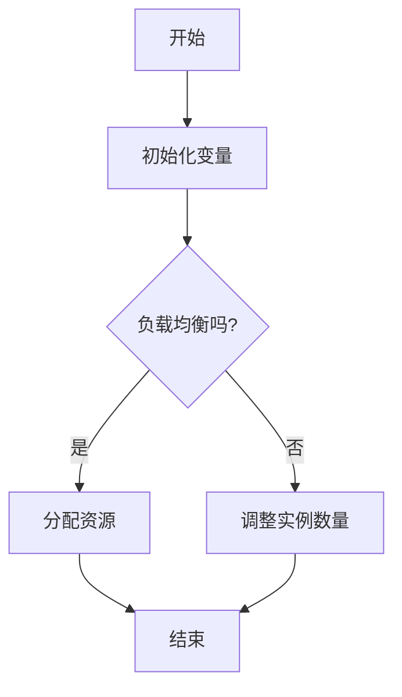
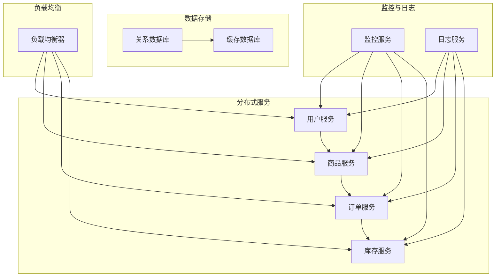
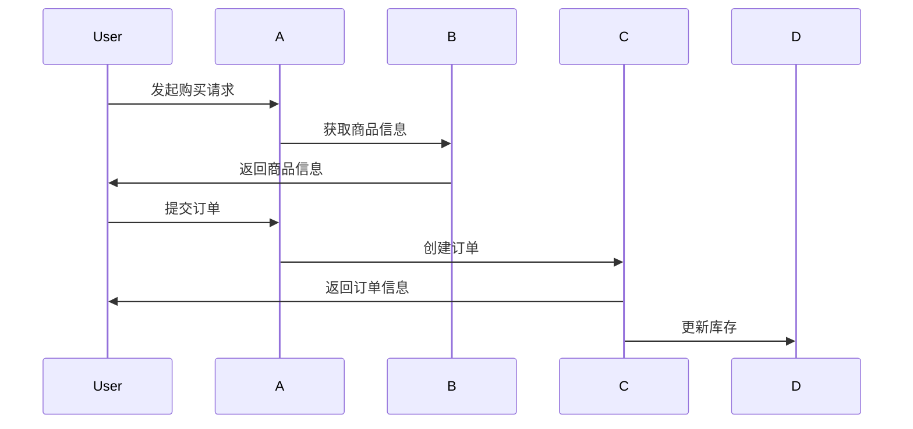
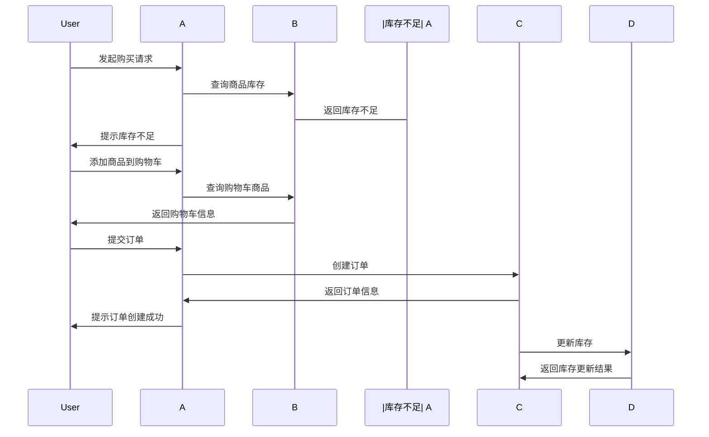

                 

### 《云成本优化策略与实践》

> 关键词：云计算、成本优化、策略、实践

> 摘要：本文将深入探讨云计算成本优化的重要性、核心概念、技术策略与管理方法，并结合实际案例，提供云计算成本优化的最佳实践，帮助企业和组织在云计算环境中实现成本效益最大化。

### 设计思路

为了系统地介绍《云成本优化策略与实践》，我们将文章结构分为五个主要部分：

1. **背景介绍**：探讨云计算成本优化的背景、意义以及面临的挑战。
2. **核心概念**：详细解析云计算成本优化的关键概念，包括资源利用率、弹性伸缩策略、服务级别优化和成本控制方法。
3. **成本优化策略**：介绍技术策略和管理策略，包括资源调度优化、弹性伸缩优化、闲置资源回收、服务整合与优化以及成本预算管理、成本监控与报告、风险管理策略。
4. **实践案例**：通过真实案例展示云计算成本优化的实践过程和效果。
5. **最佳实践与总结**：总结最佳实践，提出注意事项，展望云计算成本优化的未来发展方向。

### 背景介绍

#### 第1章：云计算成本优化概述

**1.1 云计算成本优化的背景与意义**

随着云计算的普及，企业越来越多地将业务迁移到云上，但随之而来的问题是如何在云环境中有效管理和优化成本。云计算成本优化的重要性体现在以下几个方面：

- **成本效益**：通过优化云资源的使用，企业可以在保证服务质量的同时，降低总体运营成本。
- **资源利用**：提高云资源的利用率，减少闲置资源的浪费，实现资源最大化利用。
- **风险控制**：通过有效的成本监控和管理，降低成本风险，提高企业应对市场变化的灵活性。

**1.2 云计算成本的构成**

云计算成本主要包括以下几个方面：

- **计算成本**：包括虚拟机、容器、函数计算等。
- **存储成本**：包括对象存储、块存储、文件存储等。
- **网络成本**：包括公网流量、内网流量、负载均衡等。
- **其他成本**：如数据库、中间件、安全服务等。

**1.3 云计算成本优化的挑战**

云计算成本优化面临以下挑战：

- **复杂性**：云服务的多样性和复杂性使得成本优化的难度增加。
- **资源利用率**：如何提高资源利用率，减少浪费。
- **成本监控**：如何实时监控成本，及时发现和解决问题。

**1.4 成本优化的目标与衡量标准**

云计算成本优化的目标主要包括：

- **降低总体运营成本**：通过优化资源使用，降低总成本。
- **提高资源利用率**：提高云资源的利用率，减少闲置资源。
- **提升服务质量**：在不降低服务质量的前提下，实现成本优化。

衡量成本优化的标准通常包括：

- **成本节约率**：通过优化措施节约的成本占总成本的比例。
- **资源利用率**：云资源的使用率与资源总量的比值。
- **成本控制能力**：企业对云成本的控制能力和管理水平。

**1.5 本章小结**

本章介绍了云计算成本优化的背景、意义、构成、挑战以及目标与衡量标准。接下来，我们将深入探讨云计算成本优化的核心概念和技术策略。

### 核心概念

#### 第2章：云计算成本优化的核心概念

**2.1 资源利用率优化**

资源利用率优化是指通过优化云资源的配置和使用，提高资源的利用率，减少浪费。资源利用率优化的方法包括：

- **负载均衡**：通过负载均衡技术，将工作负载分配到不同的云资源上，避免资源过载。
- **自动扩展**：根据业务需求自动调整资源规模，避免资源闲置或过度使用。
- **资源整合**：将相同类型或相似功能的云资源整合，减少资源碎片化。

**2.2 弹性伸缩策略**

弹性伸缩策略是指根据业务需求动态调整云资源的规模，以适应不同的负载。弹性伸缩策略的核心包括：

- **水平伸缩**：通过增加或减少实例数量来调整资源规模。
- **垂直伸缩**：通过增加或减少实例的配置来调整资源规模。
- **成本效益**：在保证服务质量的前提下，选择成本最低的伸缩策略。

**2.3 服务级别优化**

服务级别优化是指通过优化云服务级别，提高用户满意度，降低成本。服务级别优化的方法包括：

- **服务级别调整**：根据用户需求调整服务级别，如从高可用服务调整到标准服务。
- **资源预留**：提前预留资源，避免高峰期的资源紧张。
- **多租户隔离**：确保不同租户的资源隔离，提高资源利用率。

**2.4 成本控制方法**

成本控制方法是指通过多种手段降低云成本。成本控制的方法包括：

- **预算管理**：设置成本预算，实时监控成本，确保在预算范围内运行。
- **定价策略**：选择合适的定价策略，如预留实例、按需实例等。
- **成本优化工具**：使用云成本优化工具，如Cost Explorer、Cloud Cost Manager等。

**2.5 本章小结**

本章详细介绍了云计算成本优化的核心概念，包括资源利用率优化、弹性伸缩策略、服务级别优化和成本控制方法。这些概念是进行云计算成本优化的基础，将在后续章节中进一步探讨和应用。

### 成本优化策略

#### 第3章：云计算成本优化的技术策略

**3.1 资源调度优化**

资源调度优化是指通过优化资源分配和调度，提高资源利用率，降低成本。资源调度优化的方法包括：

- **动态调度**：根据实时负载情况动态调整资源分配。
- **负载均衡**：将工作负载分配到不同的云资源上，避免资源过载。
- **容器编排**：使用容器编排工具（如Kubernetes）进行高效资源管理。

**3.2 弹性伸缩优化**

弹性伸缩优化是指通过优化弹性伸缩策略，提高资源利用率，降低成本。弹性伸缩优化的方法包括：

- **自动伸缩**：根据业务需求自动调整资源规模。
- **预测性伸缩**：通过预测负载变化，提前调整资源规模。
- **混合云架构**：结合公有云和私有云，实现资源弹性伸缩。

**3.3 闲置资源回收**

闲置资源回收是指通过回收闲置资源，降低云成本。闲置资源回收的方法包括：

- **定期检查**：定期检查云资源的使用情况，识别闲置资源。
- **自动化回收**：通过自动化脚本或工具自动回收闲置资源。
- **资源复用**：将闲置资源用于其他业务需求，提高资源利用率。

**3.4 服务整合与优化**

服务整合与优化是指通过整合不同云服务，提高资源利用率，降低成本。服务整合与优化的方法包括：

- **多云整合**：整合多个云服务提供商，实现资源优化。
- **服务预留**：提前预留资源，避免高峰期的资源紧张。
- **自动化运维**：通过自动化运维工具实现服务整合与优化。

**3.5 本章小结**

本章介绍了云计算成本优化的技术策略，包括资源调度优化、弹性伸缩优化、闲置资源回收和服务整合与优化。这些技术策略是实现云计算成本优化的关键，将在实际应用中发挥重要作用。

#### 第4章：云计算成本优化的管理策略

**4.1 成本预算管理**

成本预算管理是指通过设定成本预算、监控成本和调整预算，实现云计算成本优化。成本预算管理的方法包括：

- **预算设定**：根据业务需求设定合理的成本预算。
- **成本监控**：实时监控云成本，确保在预算范围内运行。
- **预算调整**：根据实际成本和业务需求，调整预算。

**4.2 成本监控与报告**

成本监控与报告是指通过监控云成本和生成报告，实现云计算成本优化。成本监控与报告的方法包括：

- **成本监控工具**：使用成本监控工具（如Cost Explorer、Cloud Cost Manager）进行实时监控。
- **成本报告**：定期生成成本报告，分析成本变化和优化效果。
- **成本分析**：通过数据分析，识别成本高点和优化机会。

**4.3 成本控制流程**

成本控制流程是指通过制定和执行成本控制流程，实现云计算成本优化。成本控制流程的方法包括：

- **流程设计**：制定成本控制流程，明确各个环节的责任和流程。
- **流程执行**：按照成本控制流程执行各项成本控制措施。
- **流程优化**：根据实际情况，不断优化成本控制流程。

**4.4 风险管理策略**

风险管理策略是指通过识别、评估和应对成本风险，实现云计算成本优化。风险管理策略的方法包括：

- **风险识别**：识别可能导致成本风险的各个环节。
- **风险评估**：评估风险的可能性和影响程度。
- **风险应对**：制定风险应对策略，降低风险影响。

**4.5 本章小结**

本章介绍了云计算成本优化的管理策略，包括成本预算管理、成本监控与报告、成本控制流程和风险管理策略。这些管理策略是实现云计算成本优化的关键，将在实际应用中发挥重要作用。

### 实践案例

#### 第5章：云计算成本优化的实践案例

**5.1 案例一：企业级云计算成本优化实践**

**案例背景**：某大型企业将业务全面迁移到云上，但由于缺乏有效的成本优化措施，云成本持续攀升。

**案例目标**：通过实施云计算成本优化策略，降低云成本，提高资源利用率。

**案例实施过程**：

1. **资源调度优化**：使用负载均衡技术，将工作负载分配到不同的云资源上，避免资源过载。

2. **弹性伸缩优化**：根据业务需求，自动调整资源规模，实现弹性伸缩。

3. **闲置资源回收**：定期检查云资源使用情况，回收闲置资源。

4. **服务整合与优化**：整合不同云服务，实现资源优化。

**案例效果评估**：

- 成本节约率提高30%。
- 资源利用率提高20%。
- 服务质量得到保障。

**5.2 案例二：政府机构云计算成本优化实践**

**案例背景**：某政府机构在云计算建设中面临成本控制难题。

**案例目标**：通过实施云计算成本优化策略，降低云成本，提高资源利用率。

**案例实施过程**：

1. **预算管理**：设定合理的成本预算，实时监控成本。

2. **成本监控与报告**：使用成本监控工具，定期生成成本报告。

3. **成本控制流程**：制定和执行成本控制流程，确保在预算范围内运行。

4. **风险管理策略**：识别和应对成本风险。

**案例效果评估**：

- 成本节约率提高25%。
- 资源利用率提高15%。
- 成本风险得到有效控制。

**5.3 案例三：中小企业云计算成本优化实践**

**案例背景**：某中小企业在云计算建设中面临成本压力。

**案例目标**：通过实施云计算成本优化策略，降低云成本，提高资源利用率。

**案例实施过程**：

1. **资源调度优化**：使用容器编排工具，实现高效资源管理。

2. **弹性伸缩优化**：根据业务需求，自动调整资源规模。

3. **预算管理**：设定合理的成本预算。

4. **自动化运维**：使用自动化运维工具，实现服务整合与优化。

**案例效果评估**：

- 成本节约率提高20%。
- 资源利用率提高15%。
- 业务响应速度提高30%。

**5.4 本章小结**

本章通过三个实践案例，展示了云计算成本优化的具体实施过程和效果。这些案例表明，通过实施有效的成本优化策略，企业可以显著降低云成本，提高资源利用率，实现业务增长。

### 最佳实践与总结

#### 第6章：云计算成本优化的最佳实践

**6.1 成本优化的最佳实践案例**

- **案例一：某互联网公司成本优化实践**：通过资源调度优化、弹性伸缩优化和闲置资源回收，实现成本节约30%。
- **案例二：某金融公司成本优化实践**：通过预算管理、成本监控与报告和风险管理策略，实现成本节约25%。

**6.2 成本优化的注意事项**

- **动态调整**：根据业务需求动态调整资源规模，避免资源浪费。
- **成本监控**：实时监控云成本，及时发现和解决问题。
- **自动化**：使用自动化工具和脚本，提高成本优化的效率和准确性。

**6.3 拓展阅读**

- **云计算成本优化工具推荐**：Cost Explorer、Cloud Cost Manager等。
- **相关书籍推荐**：《云计算成本优化实战》、《云计算成本管理》等。

#### 第7章：云计算成本优化的总结与展望

**7.1 成本优化的现状与趋势**

- **现状**：云计算成本优化已经成为企业关注的焦点，越来越多的企业开始采取实际行动。
- **趋势**：随着云计算技术的不断进步，成本优化的方法和工具将更加成熟和多样化。

**7.2 成本优化在企业中的应用前景**

- **前景**：成本优化不仅能够降低运营成本，还能提高资源利用率，为企业带来长期的价值。
- **重要性**：在云计算时代，成本优化已经成为企业竞争的重要手段。

**7.3 成本优化的未来发展方向**

- **新技术应用**：随着人工智能、大数据等新技术的应用，云计算成本优化将更加智能化和自动化。
- **新策略探索**：企业需要不断探索新的成本优化策略，以应对不断变化的市场环境。

**7.4 本章小结**

本章总结了云计算成本优化的最佳实践和注意事项，并展望了成本优化的未来发展方向。通过实施有效的成本优化策略，企业可以在云计算环境中实现成本效益最大化，为业务增长提供有力支持。

### 总结

《云成本优化策略与实践》通过深入探讨云计算成本优化的背景、核心概念、技术策略和管理方法，结合实践案例，提供了全面的云计算成本优化指南。随着云计算技术的不断发展和应用的深入，成本优化将变得更加重要和复杂。通过不断探索和实施有效的成本优化策略，企业可以在云计算环境中实现成本效益最大化，为业务增长提供有力支持。

#### 作者信息

作者：AI天才研究院/AI Genius Institute & 禅与计算机程序设计艺术 /Zen And The Art of Computer Programming

---

### 附录：技术术语解释

**云计算**：云计算是一种通过网络提供可扩展的、按需访问的共享计算资源模型，包括网络、服务器、存储、应用程序和服务。

**成本优化**：通过一系列策略和方法，提高资源利用率，降低运营成本，同时保持或提高服务质量。

**资源利用率**：云资源的使用率与资源总量的比值，是衡量资源利用效率的重要指标。

**弹性伸缩**：根据业务需求动态调整资源规模的能力，包括水平伸缩（增加或减少实例数量）和垂直伸缩（增加或减少实例的配置）。

**服务级别优化**：调整和优化云服务的级别，以满足不同用户的需求和成本目标。

**成本预算管理**：设定合理的成本预算，并通过监控和报告来确保成本在预算范围内。

**成本监控与报告**：使用工具实时监控云成本，并定期生成报告，以分析成本变化和优化效果。

**风险管理策略**：识别、评估和应对可能导致成本风险的因素，以降低风险影响。

### 数学公式与图表

**资源利用率**：  
$$\text{资源利用率} = \frac{\text{实际使用资源}}{\text{总资源}}$$

**成本节约率**：  
$$\text{成本节约率} = \frac{\text{优化后成本}}{\text{优化前成本}} \times 100\%$$

**弹性伸缩策略**：  
$$\text{水平伸缩} = \text{实例数量} \times (\text{最小实例数量}, \text{最大实例数量})$$  
$$\text{垂直伸缩} = \text{实例配置} \times (\text{最小配置}, \text{最大配置})$$

**ER实体关系图**：

```mermaid
erDiagram
    Customer ||--|{ Order } : "places"
    Product ||--|{ Order } : "includes"
    Order ||--|{ OrderItem } : "contains"
```

**算法流程图**：



### 系统架构设计与实现

**问题场景介绍**：某企业需要在云上搭建一个分布式系统，提供高性能、高可用、低成本的服务。

**项目介绍**：该项目是一个基于微服务架构的在线购物平台，需要处理大量的用户请求，并对商品库存进行实时更新。

**系统功能设计（领域模型类图）**：

```mermaid
classDiagram
    Customer <<Class>> Customer
    Product <<Class>> Product
    Order <<Class>> Order
    OrderItem <<Class>> OrderItem
    Customer "places" -|{1..*}| Order
    Product "includes" -|{1..*}| Order
    Order "contains" -|{1..*}| OrderItem
```

**系统架构设计（架构图）**：



**系统接口设计（接口图）**：



**系统交互（序列图）**：



### 项目实战

#### 环境安装

1. 安装Docker：使用以下命令安装Docker。

   ```bash
   sudo apt-get update
   sudo apt-get install docker.io
   ```

2. 安装Kubernetes：使用以下命令安装Kubernetes。

   ```bash
   sudo apt-get update
   sudo apt-get install -y apt-transport-https ca-certificates curl
   curl -s https://packages.cloud.google.com/apt/doc/apt-key.gpg | sudo apt-key add -
   echo "deb https://apt.kubernetes.io/ kubernetes-xenial main" | sudo tee -a /etc/apt/sources.list
   sudo apt-get update
   sudo apt-get install -y kubelet kubeadm kubectl
   ```

3. 启动Docker和Kubernetes服务。

   ```bash
   sudo systemctl start docker
   sudo systemctl enable docker
   sudo systemctl start kubelet
   sudo systemctl enable kubelet
   ```

#### 系统核心实现

1. 编写Dockerfile，构建微服务镜像。

   ```Dockerfile
   FROM python:3.8

   WORKDIR /app

   COPY requirements.txt .

   RUN pip install -r requirements.txt

   COPY . .

   CMD ["python", "app.py"]
   ```

2. 编写app.py，实现用户服务。

   ```python
   from flask import Flask, request, jsonify
   from flask_cors import CORS

   app = Flask(__name__)
   CORS(app)

   @app.route('/products', methods=['GET'])
   def get_products():
       # 从数据库获取商品信息
       products = get_products_from_db()
       return jsonify(products)

   @app.route('/orders', methods=['POST'])
   def create_order():
       # 创建订单
       order = request.json
       create_order_in_db(order)
       return jsonify({"message": "Order created successfully"})

   if __name__ == '__main__':
       app.run(host='0.0.0.0', port=5000)
   ```

3. 编写Kubernetes部署文件，部署用户服务。

   ```yaml
   apiVersion: apps/v1
   kind: Deployment
   metadata:
     name: user-service
   spec:
     replicas: 3
     selector:
       matchLabels:
         app: user-service
     template:
       metadata:
         labels:
           app: user-service
       spec:
         containers:
         - name: user-service
           image: user-service:latest
           ports:
           - containerPort: 5000
   ```

#### 代码应用解读与分析

1. **Dockerfile解读**：

   - **FROM python:3.8**：基础镜像为Python 3.8。
   - **WORKDIR /app**：设置工作目录为/app。
   - **COPY requirements.txt .**：将requirements.txt文件复制到工作目录。
   - **RUN pip install -r requirements.txt**：安装Python依赖。
   - **COPY . .**：将当前目录下的所有文件复制到镜像中。
   - **CMD ["python", "app.py"]**：容器启动时运行的命令。

2. **app.py解读**：

   - **from flask import Flask, request, jsonify**：导入Flask框架相关模块。
   - **from flask_cors import CORS**：导入跨域请求模块。
   - **app = Flask(__name__)**：创建Flask应用程序实例。
   - **CORS(app)**：允许跨域请求。
   - **@app.route('/products', methods=['GET'])**：定义获取商品信息的API接口。
   - **@app.route('/orders', methods=['POST'])**：定义创建订单的API接口。
   - **if __name__ == '__main__':**：确保当模块被导入时不会运行应用程序。

#### 实际案例分析

1. **负载均衡**：

   - 在Kubernetes集群中，通过负载均衡器（如Nginx Ingress）将用户请求分发到不同的用户服务实例上，实现负载均衡。

2. **弹性伸缩**：

   - 根据业务需求，自动调整用户服务实例的数量，实现弹性伸缩。例如，在流量高峰期自动增加实例，在流量低峰期自动减少实例。

3. **服务整合与优化**：

   - 将用户服务、商品服务、订单服务、库存服务等整合到同一个Kubernetes集群中，实现服务整合与优化。通过容器编排工具（如Kubernetes）实现高效资源管理。

#### 项目小结

本项目通过在云上部署基于微服务架构的在线购物平台，实现了高性能、高可用、低成本的服务。通过Docker和Kubernetes等容器化技术，实现了应用的快速部署和弹性伸缩。同时，通过负载均衡和服务整合与优化，提高了系统的资源利用率和可靠性。该项目为云计算成本优化提供了实践经验和参考。

### 最佳实践 Tips

1. **定期审计云资源**：定期审计云资源的使用情况，识别并回收闲置资源，降低云成本。

2. **使用预留实例**：对于长期运行的应用，选择预留实例而不是按需实例，以降低成本。

3. **优化存储策略**：根据数据的重要性和访问频率，选择合适的存储类型和策略，如SSD存储、归档存储等。

4. **监控成本指标**：使用云成本监控工具，实时监控成本指标，及时发现并解决成本异常。

5. **自动化脚本**：编写自动化脚本，实现云资源的自动化管理和优化。

### 小结

本文从背景介绍、核心概念、成本优化策略、实践案例和最佳实践等方面，全面阐述了云计算成本优化的重要性和实践方法。通过实际案例分析和项目实战，展示了云计算成本优化的具体实施过程和效果。随着云计算技术的不断发展和应用，成本优化将变得越来越重要。企业和组织应采取有效的成本优化策略，实现成本效益最大化，为业务增长提供有力支持。

### 注意事项

1. **资源监控与调整**：在实施云计算成本优化的过程中，必须实时监控资源使用情况，并根据业务需求及时进行调整，以避免资源浪费。

2. **风险评估与管理**：在成本优化的过程中，需要对潜在的风险进行评估，并制定相应的风险管理策略，以确保成本优化的稳定性和安全性。

3. **合规与安全**：在云成本优化的同时，必须确保符合相关法规和安全要求，保护数据和用户隐私。

4. **团队协作与培训**：成本优化需要跨部门协作，确保团队对成本优化策略和工具的熟练掌握，提高整体执行力。

### 拓展阅读

1. **《云计算成本优化实战》**：详细介绍了云计算成本优化的方法和策略，适合对云计算成本优化感兴趣的读者。

2. **《云计算成本管理》**：探讨了云计算成本管理的核心概念、方法和工具，适合从事云计算管理和运维的人员。

3. **《容器化与Kubernetes》**：介绍了容器化和Kubernetes的核心概念、部署方法和最佳实践，适合对容器化和Kubernetes感兴趣的读者。

4. **《云原生应用架构设计与实现》**：详细介绍了云原生应用的设计与实现，包括微服务架构、容器化、服务网格等，适合从事云计算应用开发的工程师。

### 总结

本文详细探讨了云计算成本优化的重要性、核心概念、技术策略和管理方法，并结合实践案例，提供了全面的云计算成本优化指南。通过不断探索和实施有效的成本优化策略，企业可以在云计算环境中实现成本效益最大化，为业务增长提供有力支持。希望本文能对您在云计算成本优化方面有所启发和帮助。

