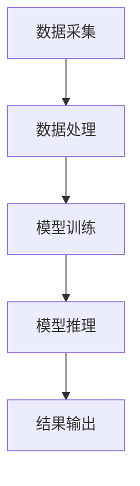
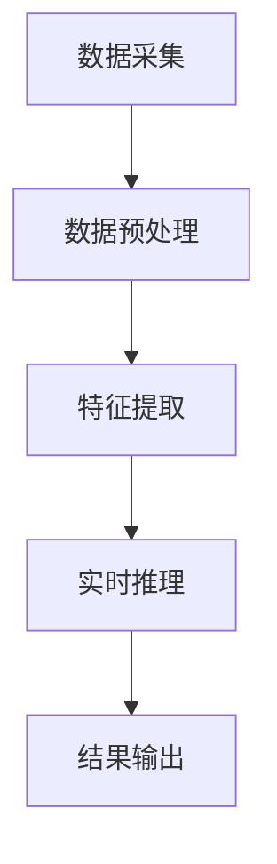
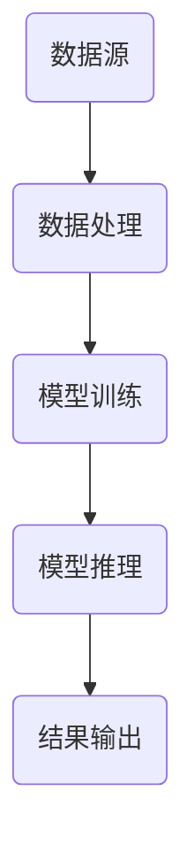
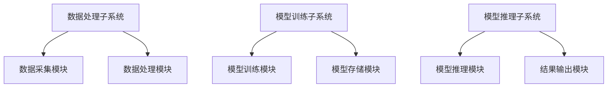
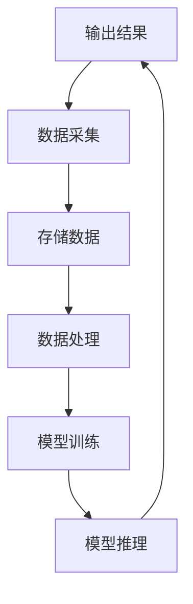
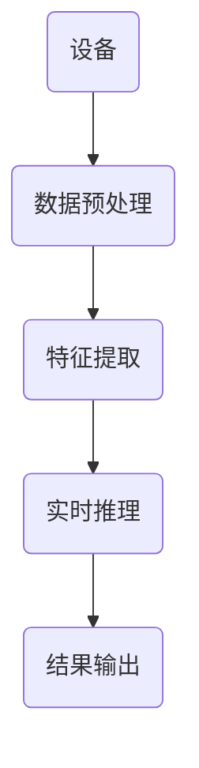
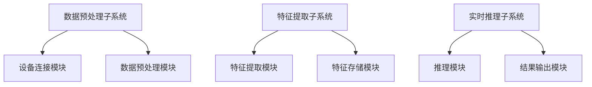
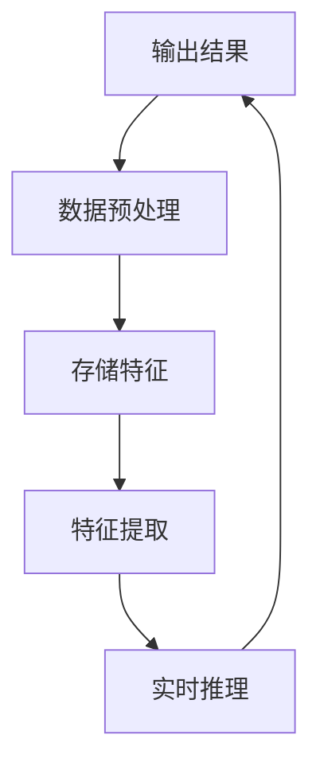

                 

## 引言

### 文章标题：《云端vs边缘计算：AI Agent的最佳运行环境》

### 关键词：云端计算、边缘计算、AI Agent、运行环境、算法、系统架构、最佳实践

### 摘要

在人工智能（AI）飞速发展的时代，如何选择最适合AI Agent运行的云端或边缘计算环境成为了技术领域的一个重要课题。本文将从背景概述、核心概念、算法原理、系统架构、项目实战和最佳实践等方面，系统性地探讨云端与边缘计算在AI Agent运行环境中的优劣，并最终提出最佳实践建议。

## 第一部分：背景与概述

### 第1章：问题的提出与背景

#### 云计算与边缘计算的基本概念

云计算和边缘计算是当今信息技术领域中的重要概念。云计算是指通过互联网以服务的形式提供计算资源，包括数据存储、处理能力和应用程序等。而边缘计算则是指将计算任务分散到网络的边缘，即靠近数据源或终端设备的地方进行处理。

#### 云端计算与边缘计算的发展历程

从20世纪60年代的云计算概念提出，到21世纪的物联网、大数据和AI的兴起，云端计算经历了从基础设施服务（IaaS）、平台服务（PaaS）到软件服务（SaaS）的演进。边缘计算则随着物联网设备和5G网络的普及，逐渐成为云计算的有力补充。

#### AI Agent的定义与功能

AI Agent是指能够自主执行任务、与环境互动并学习改进的人工智能实体。它们在智能机器人、自动化系统、智能城市等领域中发挥着重要作用。选择最佳的运行环境对于AI Agent的性能和效率至关重要。

#### 研究背景与意义

随着AI技术的不断进步，AI Agent在云端和边缘计算环境中的运行效率、响应速度和可靠性成为关键考量因素。本文旨在通过深入分析云端与边缘计算的特点，为AI Agent选择最佳的运行环境提供理论依据和实践指导。

## 第二部分：核心概念与联系

### 第2章：核心概念与联系

#### 云端计算的优势与挑战

**优势**：云端计算具有强大的计算能力、丰富的存储资源和灵活的服务模式，能够满足大规模AI应用的计算需求。

**挑战**：然而，云端计算也存在网络延迟、数据安全和隐私保护等问题。

#### 边缘计算的特性与应用

**特性**：边缘计算通过将计算任务分散到网络的边缘，能够显著降低网络延迟，提高数据处理的实时性和安全性。

**应用**：边缘计算适用于物联网设备、智能交通、智慧医疗等对响应速度要求高的领域。

#### AI Agent的运行环境选择

AI Agent的运行环境选择需要考虑任务特性、数据处理需求、网络条件等因素。云端计算适合计算密集型任务，而边缘计算则更适合实时性强、数据量小的任务。

#### 云端与边缘计算的结合

随着技术的发展，云端和边缘计算逐渐走向融合。通过将云计算和边缘计算的优势相结合，可以为AI Agent提供更为灵活和高效的运行环境。

## 第三部分：算法原理与实现

### 第3章：云端计算算法原理

#### 云端计算的算法概述

云端计算算法主要包括数据处理、模型训练和推理等步骤。通过分布式计算和云计算平台，实现高效的数据处理和模型训练。

#### 云端计算算法的mermaid流程图



#### 云端计算算法的Python源代码实现

```python
# Python代码示例：云端计算算法
import pandas as pd
from sklearn.ensemble import RandomForestClassifier

# 数据处理
data = pd.read_csv('data.csv')
X = data.drop('target', axis=1)
y = data['target']

# 模型训练
model = RandomForestClassifier()
model.fit(X, y)

# 模型推理
predictions = model.predict(X)

# 结果输出
print(predictions)
```

#### 云端计算算法的数学模型与公式讲解

云端计算算法的数学模型主要涉及机器学习中的算法公式，如随机森林中的决策树公式、模型训练中的损失函数等。这些公式决定了算法的性能和预测能力。

### 第4章：边缘计算算法原理

#### 边缘计算的算法概述

边缘计算算法主要包括数据预处理、特征提取和实时推理等步骤。通过边缘设备，实现数据的快速处理和实时分析。

#### 边缘计算算法的mermaid流程图



#### 边缘计算算法的Python源代码实现

```python
# Python代码示例：边缘计算算法
import numpy as np
from sklearn.preprocessing import StandardScaler
from sklearn.linear_model import LogisticRegression

# 数据预处理
data = np.load('data.npy')
X = data[:, :-1]
y = data[:, -1]

# 特征提取
scaler = StandardScaler()
X_scaled = scaler.fit_transform(X)

# 实时推理
model = LogisticRegression()
model.fit(X_scaled, y)
predictions = model.predict(X_scaled)

# 结果输出
print(predictions)
```

#### 边缘计算算法的数学模型与公式讲解

边缘计算算法的数学模型主要涉及数据预处理中的特征提取公式、机器学习中的分类公式等。这些公式确保了算法的准确性和实时性。

## 第四部分：系统架构与设计

### 第5章：云端计算系统架构设计

#### 云端计算系统的功能需求分析

云端计算系统需要满足大规模数据处理、模型训练和推理等需求，同时具备高可用性、安全性和可扩展性。

#### 云端计算系统的领域模型mermaid类图



#### 云端计算系统的架构设计mermaid架构图



#### 云端计算系统的接口设计mermaid序列图



### 第6章：边缘计算系统架构设计

#### 边缘计算系统的功能需求分析

边缘计算系统需要满足低延迟、高实时性和数据安全性等功能，适用于物联网设备和智能设备的处理需求。

#### 边缘计算系统的领域模型mermaid类图



#### 边缘计算系统的架构设计mermaid架构图



#### 边缘计算系统的接口设计mermaid序列图



## 第五部分：项目实战与案例分析

### 第7章：云端计算项目实战

#### 项目环境安装与配置

在云端计算项目中，首先需要安装和配置云计算平台，如AWS、Azure或Google Cloud Platform。同时，配置必要的虚拟机和容器服务，以及数据存储和模型训练工具。

#### 系统核心实现源代码解读

云端计算项目的核心实现包括数据采集、数据处理、模型训练和推理等步骤。源代码需要详细说明各个模块的功能和接口，并确保代码的可读性和可维护性。

#### 代码应用解读与分析

通过具体的应用案例，分析云端计算在处理大规模数据、训练复杂模型和实现实时推理等方面的优势。同时，探讨云端计算的局限性和优化策略。

#### 实际案例分析与详细讲解剖析

以实际项目为例，详细分析云端计算的实现过程，包括数据收集、处理、模型训练和部署等步骤。通过案例讲解，帮助读者理解云端计算的实际应用场景和操作细节。

#### 项目小结

总结云端计算项目的成功经验和挑战，讨论如何优化云端计算的性能和可靠性，为后续项目提供参考。

### 第8章：边缘计算项目实战

#### 项目环境安装与配置

边缘计算项目需要安装和配置边缘设备，如树莓派或边缘服务器。同时，配置边缘计算框架，如Kubernetes或边缘计算服务，以满足实时数据处理和推理需求。

#### 系统核心实现源代码解读

边缘计算项目的核心实现包括数据预处理、特征提取和实时推理等步骤。源代码需要详细说明各个模块的功能和接口，并确保代码的轻量级和高效率。

#### 代码应用解读与分析

通过具体的应用案例，分析边缘计算在实现低延迟、高实时性和数据安全性等方面的优势。同时，探讨边缘计算的局限性和优化策略。

#### 实际案例分析与详细讲解剖析

以实际项目为例，详细分析边缘计算的实现过程，包括数据收集、预处理、特征提取和推理等步骤。通过案例讲解，帮助读者理解边缘计算的实际应用场景和操作细节。

#### 项目小结

总结边缘计算项目的成功经验和挑战，讨论如何优化边缘计算的性能和可靠性，为后续项目提供参考。

## 第六部分：最佳实践与拓展

### 第9章：云端计算与边缘计算的最佳实践

#### 云端计算的实践经验与技巧

1. **资源优化**：合理分配云计算资源，提高计算效率。
2. **数据管理**：优化数据存储和传输，确保数据安全和隐私。
3. **模型优化**：选择适合云端计算的模型，提高训练和推理速度。

#### 边缘计算的实践经验与技巧

1. **设备管理**：优化边缘设备配置，确保设备稳定运行。
2. **数据处理**：优化边缘数据处理流程，提高实时性和可靠性。
3. **安全防护**：加强边缘计算的安全防护，防止数据泄露和攻击。

#### AI Agent在云端与边缘的最佳运行策略

1. **任务调度**：根据任务特性，合理调度云端和边缘计算资源。
2. **模型迁移**：优化模型在云端和边缘之间的迁移，提高运行效率。
3. **协同计算**：结合云端和边缘计算的优势，实现协同计算和优化。

### 第10章：小结与展望

#### 全书内容的总结

本文系统地介绍了云端与边缘计算的原理、算法、系统架构和实际应用。通过对比分析，探讨了AI Agent在两种环境中的最佳运行策略。

#### 未来发展趋势与研究方向

1. **边缘智能**：随着5G和物联网的普及，边缘智能将成为重要发展方向。
2. **混合计算**：结合云端和边缘计算的优势，实现更高效的计算和数据处理。
3. **AI安全**：加强云端和边缘计算中的AI安全防护，防止恶意攻击和数据泄露。

#### 阅读建议与拓展阅读

1. **深入学习**：建议读者进一步学习云计算和边缘计算的相关技术，掌握核心原理和实际应用。
2. **实践操作**：通过实际项目操作，提升对云端和边缘计算的理解和运用能力。
3. **参考资料**：推荐阅读相关领域的技术书籍和学术论文，拓展知识视野。

## 结语

作者：AI天才研究院/AI Genius Institute & 禅与计算机程序设计艺术 /Zen And The Art of Computer Programming

本文旨在为AI Agent选择最佳运行环境提供理论依据和实践指导。通过深入分析和对比，读者可以更好地理解云端与边缘计算的特点，为实际应用提供参考。随着技术的发展，云端与边缘计算将在人工智能领域发挥越来越重要的作用。希望本文能为读者的研究和工作提供帮助。

