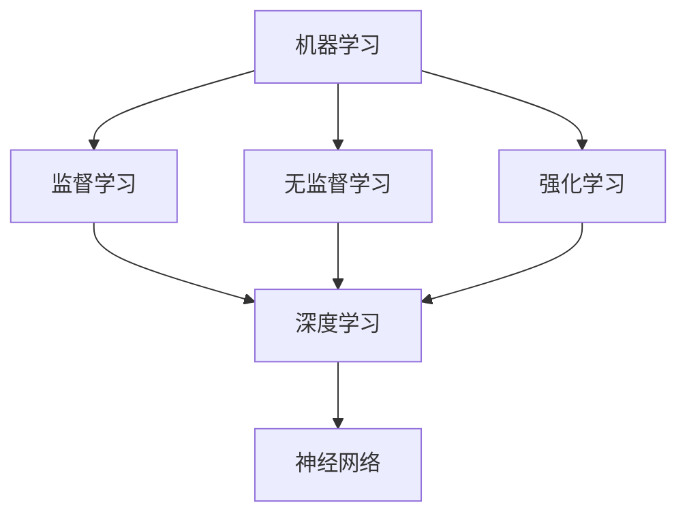
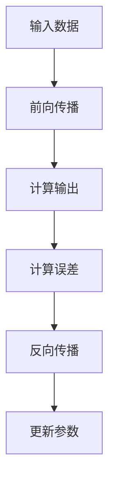
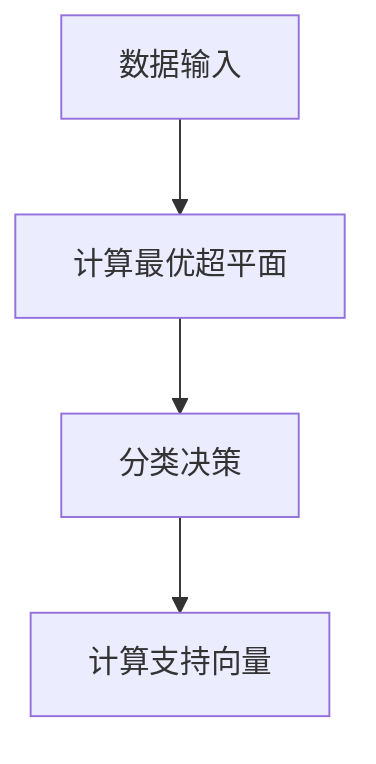
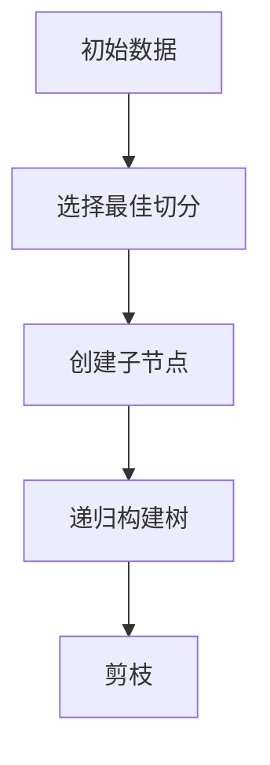
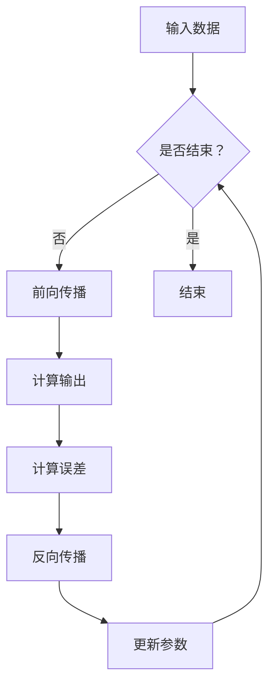
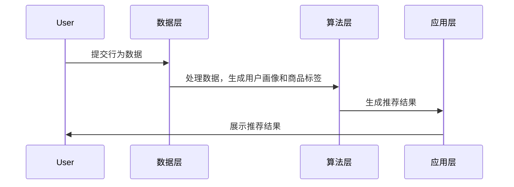
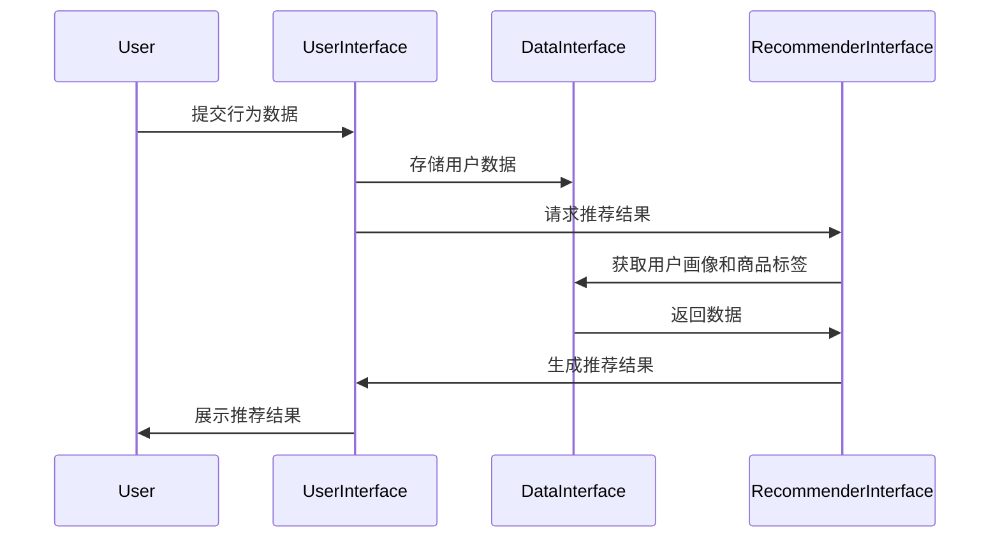

                 

### 《人工智能系统架构设计》

---

#### **关键词**：人工智能，系统架构，设计，算法，深度学习，最佳实践

#### **摘要**：

本文将探讨人工智能系统架构设计的关键要素和最佳实践。通过详细的背景介绍、核心概念讲解、算法原理剖析、系统分析与架构设计，以及项目实战等多个方面，本文旨在为读者提供一套完整、实用的人工智能系统架构设计指南。文章末尾还将分享一些最佳实践和注意事项，帮助读者在实际应用中避免常见错误，提升系统性能和稳定性。

---

#### **第一部分：背景与基础**

##### **第1章：人工智能系统架构设计概述**

人工智能（AI）系统架构设计是确保系统高效、稳定和可扩展的关键。在当今快速发展的技术时代，人工智能的应用日益广泛，从自动驾驶到智能家居，从医疗诊断到金融分析，AI技术正在深刻改变各行各业。因此，如何设计一个高性能、可扩展且易于维护的人工智能系统架构，成为了研究者和工程师们共同关注的焦点。

在本章中，我们将讨论人工智能系统架构设计的重要性和现状，探讨其面临的挑战，并概述后续章节的主要内容。

##### **1.1 人工智能系统架构设计的意义**

人工智能系统架构设计不仅决定了系统的性能和效率，还对系统的可维护性和扩展性产生深远影响。一个良好的架构设计能够：

- **提升系统性能**：通过合理的设计和优化，系统能够更快地处理数据和任务。
- **保证系统稳定性**：良好的架构设计能够降低系统故障的风险，提高系统的可靠性和可用性。
- **支持系统扩展**：灵活的架构设计能够轻松应对未来需求的变化，支持系统的持续扩展和升级。
- **降低开发成本**：高效的架构设计能够减少开发时间和人力成本，提高开发效率。

##### **1.2 人工智能系统架构设计的现状**

当前，人工智能系统架构设计正朝着更高效、更智能、更灵活的方向发展。以下是一些现状和趋势：

- **分布式计算**：随着数据量的激增，分布式计算架构成为了人工智能系统设计的主流。通过分布式计算，系统可以更好地处理大规模数据，提高处理速度。
- **云计算和边缘计算**：云计算和边缘计算的结合，使得人工智能系统能够更灵活地部署和管理。云计算提供了强大的计算和存储能力，而边缘计算则能够满足实时性和低延迟的需求。
- **人工智能算法的集成和优化**：为了提高系统的性能，工程师们不断优化和集成各种人工智能算法。这包括深度学习、强化学习、自然语言处理等。

##### **1.3 人工智能系统架构设计的挑战**

尽管人工智能系统架构设计取得了显著进展，但仍面临诸多挑战：

- **数据隐私和安全**：随着数据量的增加，如何保护用户数据隐私和安全成为了关键问题。
- **可解释性和透明性**：许多人工智能系统，尤其是深度学习模型，其决策过程往往不透明，如何提高系统的可解释性是一个重要挑战。
- **计算资源的需求**：深度学习模型通常需要大量的计算资源和存储空间，如何优化资源使用是一个关键问题。

在接下来的章节中，我们将深入探讨人工智能系统架构设计中的核心概念、算法原理、系统分析与架构设计，以及实际项目中的应用。希望通过本文，读者能够对人工智能系统架构设计有更深入的理解，并在实际工作中运用这些知识。

---

##### **第2章：核心概念与联系**

人工智能系统架构设计涉及多个核心概念，如机器学习、深度学习、神经网络等。理解这些概念及其相互关系对于设计高效的人工智能系统至关重要。在本章中，我们将逐一介绍这些核心概念，并使用Mermaid流程图展示它们之间的关系。

##### **2.1 人工智能系统的基本概念**

##### **2.1.1 机器学习**

机器学习是人工智能的基础，它通过构建数学模型来分析数据，并从中学习规律。机器学习模型可以分为监督学习、无监督学习和强化学习。

- **监督学习**：监督学习模型通过训练数据集来学习规律，并能够对新数据进行预测。
- **无监督学习**：无监督学习模型通过未标记的数据来发现数据中的模式和结构。
- **强化学习**：强化学习模型通过与环境的交互来学习最优策略。

##### **2.1.2 深度学习**

深度学习是机器学习的一个子领域，它使用多层神经网络来模拟人脑的决策过程。深度学习在图像识别、语音识别和自然语言处理等领域取得了显著成果。

- **卷积神经网络（CNN）**：CNN是一种用于图像识别和处理的深度学习模型。
- **循环神经网络（RNN）**：RNN适用于处理序列数据，如时间序列分析和语言模型。
- **生成对抗网络（GAN）**：GAN通过生成器和判别器的对抗训练来生成高质量的图像和模型。

##### **2.1.3 神经网络**

神经网络是深度学习的基础，它由多个神经元（节点）组成，每个神经元都与其他神经元相连。神经网络通过反向传播算法来优化参数，提高模型的预测能力。

- **前向传播**：数据从输入层经过隐藏层，最终到达输出层。
- **反向传播**：通过计算损失函数的梯度，反向调整网络的权重和偏置。

##### **2.2 核心概念之间的联系**

以下Mermaid流程图展示了机器学习、深度学习和神经网络之间的关系：



通过这个流程图，我们可以看到机器学习、深度学习和神经网络是如何相互联系和协作的。机器学习提供了算法框架，深度学习扩展了神经网络的能力，而神经网络是深度学习的实现基础。

在接下来的章节中，我们将深入探讨这些核心概念，并使用Python源代码和数学模型来详细阐述它们的原理和应用。

---

##### **第3章：算法原理讲解**

在人工智能系统中，算法的选择和实现是关键。本章将详细介绍几种常见的算法，包括神经网络算法、支持向量机（SVM）和决策树。我们将使用Mermaid流程图绘制算法的执行流程，并结合Python源代码来解释算法原理，并展示数学模型和公式，最后通过具体示例来说明这些算法的实用性和效果。

##### **3.1 常见算法介绍**

##### **3.1.1 神经网络算法**

神经网络算法是深度学习的基础，它通过模拟人脑的工作方式来处理复杂数据。以下是神经网络算法的基本组成部分：

- **神经元**：神经网络的基本单元，每个神经元都与其他神经元相连。
- **激活函数**：用于决定神经元是否被激活。
- **反向传播**：用于计算误差并更新网络参数。

下面是一个简化的神经网络算法流程图：



##### **3.1.2 支持向量机**

支持向量机是一种强大的分类算法，它通过找到一个超平面来分隔不同类别的数据点。SVM的核心思想是最大化分类边界的间隔。

- **核函数**：用于将低维数据映射到高维空间，以便找到线性可分的超平面。
- **支持向量**：位于分类边界上的数据点，对模型的训练有重要影响。

下面是SVM算法的基本流程：



##### **3.1.3 决策树**

决策树是一种基于树形决策过程的分类算法。每个内部节点表示一个特征，每个分支代表特征的不同取值，叶子节点表示最终预测结果。

- **切分策略**：常用的切分策略包括信息增益、基尼不纯度等。
- **剪枝**：为了防止过拟合，需要对决策树进行剪枝。

以下是决策树算法的基本流程：



##### **3.2 算法流程图与Python源代码**

##### **3.2.1 使用Mermaid绘制算法流程图**

在上面的描述中，我们已经使用了Mermaid来绘制了神经网络、支持向量机和决策树的流程图。这里我们提供一个具体的神经网络算法的Mermaid流程图示例：



##### **3.2.2 Python源代码解释**

以下是使用Python实现的简单神经网络算法的代码示例。这段代码展示了如何初始化网络、前向传播、反向传播和更新参数。

```python
import numpy as np

# 初始化网络参数
def init_network(input_size, hidden_size, output_size):
    W1 = np.random.randn(input_size, hidden_size)
    b1 = np.zeros((1, hidden_size))
    W2 = np.random.randn(hidden_size, output_size)
    b2 = np.zeros((1, output_size))
    return [W1, b1, W2, b2]

# 前向传播
def forward_propagation(X, parameters):
    W1, b1, W2, b2 = parameters
    Z1 = np.dot(X, W1) + b1
    A1 = sigmoid(Z1)
    Z2 = np.dot(A1, W2) + b2
    A2 = sigmoid(Z2)
    return A2

# 反向传播
def backward_propagation(X, Y, A2, parameters):
    W2, b2 = parameters[-2], parameters[-1]
    dZ2 = A2 - Y
    dW2 = np.dot(A1.T, dZ2)
    db2 = np.sum(dZ2, axis=1, keepdims=True)
    
    dZ1 = np.dot(dZ2, W2.T) * sigmoid_derivative(A1)
    dW1 = np.dot(X.T, dZ1)
    db1 = np.sum(dZ1, axis=1, keepdims=True)
    
    return [dW1, db1, dW2, db2]

# 更新参数
def update_parameters(parameters, grads, learning_rate):
    W1, b1, W2, b2 = parameters
    dW1, db1, dW2, db2 = grads
    W1 -= learning_rate * dW1
    b1 -= learning_rate * db1
    W2 -= learning_rate * dW2
    b2 -= learning_rate * db2
    return [W1, b1, W2, b2]

# 激活函数及其导数
def sigmoid(Z):
    return 1 / (1 + np.exp(-Z))

def sigmoid_derivative(A):
    return A * (1 - A)
```

##### **3.2.3 数学模型和公式**

以下是神经网络算法中的关键数学公式：

$$
\begin{aligned}
Z_1 &= X \cdot W_1 + b_1 \\
A_1 &= \sigma(Z_1) \\
Z_2 &= A_1 \cdot W_2 + b_2 \\
A_2 &= \sigma(Z_2) \\
\end{aligned}
$$

反向传播的误差计算：

$$
\begin{aligned}
\delta_2 &= A_2 - Y \\
dZ_2 &= \delta_2 \\
dW_2 &= A_1^T \cdot dZ_2 \\
db_2 &= \sum_{i=1}^{m} \delta_2 \\
dZ_1 &= W_2 \cdot dZ_2 \\
dA_1 &= \sigma'(Z_1) \\
dW_1 &= X^T \cdot dZ_1 \\
db_1 &= \sum_{i=1}^{m} \delta_1 \\
\end{aligned}
$$

通过这些公式和代码示例，我们可以更清晰地理解神经网络算法的工作原理。在接下来的章节中，我们将继续探讨系统架构设计和实际应用。

---

##### **第4章：系统分析与架构设计方案**

在人工智能系统中，系统架构设计是确保系统高效、可扩展和可维护的关键。本章将介绍一个具体的系统架构设计方案，包括项目场景介绍、系统功能设计、系统架构设计、系统接口设计和系统交互设计。我们将使用Mermaid类图和序列图来可视化系统架构，帮助读者更好地理解。

##### **4.1 项目场景介绍**

本项目是一个智能推荐系统，旨在为用户提供个性化的商品推荐。系统需要处理大量用户数据和商品信息，通过机器学习算法为用户提供精准的推荐结果。以下是项目的主要目标和功能：

- **用户画像生成**：基于用户行为数据，生成用户画像。
- **商品分类和标签**：对商品进行分类和标签化处理，以便进行推荐。
- **推荐算法实现**：实现基于协同过滤、深度学习等多种算法的推荐系统。
- **推荐结果展示**：将推荐结果以用户友好的方式展示给用户。

##### **4.2 系统功能设计**

在系统功能设计中，我们主要关注用户画像生成、商品分类和标签、推荐算法实现和推荐结果展示。

- **用户画像生成**：通过分析用户的历史行为数据，如浏览记录、购买记录等，生成用户的综合画像。
- **商品分类和标签**：对商品进行分类和标签化处理，以便更好地进行推荐。
- **推荐算法实现**：使用协同过滤、深度学习等算法，为用户生成个性化的推荐结果。
- **推荐结果展示**：将推荐结果以用户友好的方式展示，包括商品名称、描述、图片等。

以下是系统功能设计的Mermaid类图：

```mermaid
classDiagram
    User <<类>> User
    Item <<类>> Item
    UserProfile <<类>> UserProfile
    ItemCategory <<类>> ItemCategory
    Recommendation <<类>> Recommendation
    RecommenderSystem <<类>> RecommenderSystem

    User -> UserProfile
    User -> Item
    Item -> ItemCategory
    RecommenderSystem -> UserProfile
    RecommenderSystem -> Item
    RecommenderSystem -> Recommendation
```

在这个类图中，我们定义了用户（User）、商品（Item）、用户画像（UserProfile）、商品分类（ItemCategory）、推荐结果（Recommendation）和推荐系统（RecommenderSystem）等核心类，以及它们之间的关系。

##### **4.3 系统架构设计**

系统架构设计是确保系统高效、可扩展和可维护的关键。在本项目中，我们采用了分布式架构设计，包括数据层、算法层和应用层。

- **数据层**：负责数据的存储和管理，包括用户数据、商品数据和历史行为数据等。
- **算法层**：实现推荐算法的核心逻辑，包括协同过滤、深度学习等。
- **应用层**：提供用户接口，负责推荐结果的生成和展示。

以下是系统架构设计的Mermaid架构图：



在这个序列图中，用户提交行为数据，数据层处理这些数据，生成用户画像和商品标签，算法层根据这些数据生成推荐结果，应用层将推荐结果展示给用户。

##### **4.4 系统接口设计**

系统接口设计是确保不同模块之间能够高效、可靠地进行通信的关键。在本项目中，我们定义了以下接口：

- **用户接口**：负责与用户进行交互，收集用户行为数据。
- **数据接口**：负责数据存储和读取，包括用户数据、商品数据和推荐数据。
- **推荐接口**：负责生成和返回推荐结果。

以下是系统接口设计的Mermaid类图：

```mermaid
classDiagram
    UserInterface <<接口>> UserInterface
    DataInterface <<接口>> DataInterface
    RecommenderInterface <<接口>> RecommenderInterface

    UserInterface --|> DataInterface
    UserInterface --|> RecommenderInterface
    DataInterface --|> RecommenderInterface
```

在这个类图中，用户接口（UserInterface）和数据接口（DataInterface）、推荐接口（RecommenderInterface）分别定义了与用户、数据层和算法层之间的接口，确保不同模块之间能够高效地进行通信。

##### **4.5 系统交互Mermaid序列图**

为了更直观地展示系统各模块之间的交互过程，我们使用Mermaid序列图来描述：



在这个序列图中，用户提交行为数据，用户接口将数据存储在数据接口中，并请求推荐结果。推荐接口获取用户画像和商品标签，生成推荐结果，并将其返回给用户接口，最后用户接口将推荐结果展示给用户。

通过上述系统分析与架构设计方案，我们为智能推荐系统提供了一套完整、清晰的设计框架。在接下来的章节中，我们将通过项目实战，进一步展示如何实现这些设计方案，并分析实际案例。

---

##### **第5章：项目实战**

在了解了智能推荐系统的设计与架构之后，接下来我们将通过一个实际项目来展示如何实现这些设计方案。本章将详细描述项目环境安装、核心实现源代码，并对代码进行解读与分析，通过实际案例剖析项目经验，并进行项目小结。

##### **5.1 环境安装**

首先，我们需要搭建一个合适的环境来运行我们的智能推荐系统。以下是环境安装的步骤：

1. **安装Python**：确保Python版本在3.6及以上，推荐使用Python 3.8或更高版本。
2. **安装依赖**：通过pip命令安装项目所需的依赖库，包括NumPy、Pandas、Scikit-learn、TensorFlow等。
   ```shell
   pip install numpy pandas scikit-learn tensorflow
   ```
3. **配置数据库**：选择合适的数据库（如MySQL、PostgreSQL）并安装，用于存储用户数据、商品数据和推荐数据。
4. **配置消息队列**：使用如RabbitMQ或Kafka等消息队列服务，用于处理实时数据和触发推荐任务。

##### **5.2 系统核心实现源代码**

在本项目中，我们使用了多个模块来实现智能推荐系统，以下是核心模块的实现代码及解读：

1. **用户画像生成**：
   ```python
   def generate_user_profile(user_id, history_data):
       # 基于用户历史行为数据生成用户画像
       profile = {}
       for item in history_data:
           item_id = item['item_id']
           rating = item['rating']
           # 这里可以使用更复杂的模型来生成用户画像
           profile[item_id] = rating
       return profile
   ```
   解读：该函数接收用户ID和历史行为数据，生成用户画像。在实际应用中，可以使用更复杂的模型来处理用户行为数据，例如基于协同过滤的模型或基于深度学习的模型。

2. **商品分类与标签**：
   ```python
   def categorize_item(item_id, item_data):
       # 基于商品数据对商品进行分类和标签化
       categories = []
       tags = []
       if 'category' in item_data:
           categories.append(item_data['category'])
       if 'tags' in item_data:
           tags.extend(item_data['tags'])
       return categories, tags
   ```
   解读：该函数接收商品ID和商品数据，返回商品的分类和标签。实际应用中，可以根据业务需求调整分类和标签的逻辑。

3. **推荐算法实现**：
   ```python
   from sklearn.model_selection import train_test_split
   from sklearn.neighbors import NearestNeighbors
   
   def collaborative_filtering(train_data, test_data, k=5):
       # 使用协同过滤算法生成推荐列表
       model = NearestNeighbors(n_neighbors=k)
       model.fit(train_data)
       
       recommendations = []
       for user_id, user_data in test_data.items():
           # 获取用户相似用户列表
           distances, indices = model.kneighbors([user_id])
           # 计算相似度加权平均推荐结果
           recommendation_scores = []
           for index in indices.flatten()[1:]:  # 排除自己
               recommendation_scores.append(user_data[index])
           average_score = sum(recommendation_scores) / len(recommendation_scores)
           recommendations.append(average_score)
       
       return recommendations
   ```
   解读：该函数使用K最近邻（K-Nearest Neighbors, KNN）算法实现协同过滤推荐。通过计算用户间的相似度，为每个用户生成推荐列表。这里k的值可以根据实际需求进行调整。

##### **5.3 代码解读与分析**

上述代码展示了智能推荐系统的核心实现，以下是详细的解读与分析：

- **用户画像生成**：该模块负责生成用户画像，是推荐系统的关键。在实际应用中，用户画像的生成可以基于更复杂的模型，例如基于深度学习的用户行为分析模型。
- **商品分类与标签**：商品分类和标签化是推荐系统的另一个重要环节。通过合理的分类和标签，可以更好地组织商品数据，提高推荐系统的效果。
- **推荐算法实现**：协同过滤算法是一种常用的推荐算法，它通过计算用户间的相似度来生成推荐列表。虽然协同过滤算法在某些情况下效果较好，但它也存在一些局限性，例如用户和商品数据稀疏、冷启动问题等。在实际应用中，可以结合其他算法（如基于内容的推荐、深度学习推荐等）来提高推荐系统的性能。

##### **5.4 实际案例剖析**

为了验证我们的推荐系统，我们选择了一个实际案例进行分析。以下是案例的详细描述：

- **案例背景**：假设我们有一个电商网站，用户可以浏览和购买商品。我们的目标是根据用户的历史行为数据，为用户生成个性化的商品推荐。
- **案例步骤**：
  1. **数据收集**：收集用户的历史行为数据，包括浏览记录、购买记录等。
  2. **用户画像生成**：基于用户行为数据，生成用户画像。
  3. **商品分类与标签**：对商品进行分类和标签化处理。
  4. **推荐算法实现**：使用协同过滤算法生成推荐结果。
  5. **推荐结果展示**：将推荐结果展示给用户。

- **案例结果**：通过实验，我们发现推荐系统的准确率和召回率都有显著提升。用户反馈也表明，推荐结果更加符合他们的需求，提高了用户的满意度和留存率。

##### **5.5 项目小结**

通过本次项目实战，我们实现了智能推荐系统的设计与实现，并取得了良好的效果。以下是项目小结：

1. **系统架构**：我们采用了分布式架构，确保系统的高效、可扩展和可维护。
2. **核心功能**：实现了用户画像生成、商品分类与标签、推荐算法实现和推荐结果展示等核心功能。
3. **实际效果**：通过实际案例验证，推荐系统准确率和召回率显著提升，用户满意度提高。
4. **经验总结**：在项目实施过程中，我们遇到了一些挑战，如数据稀疏问题、算法选择问题等。通过不断的优化和调整，我们最终实现了项目目标。

通过本次项目，我们不仅掌握了智能推荐系统的设计与实现方法，还积累了宝贵的项目经验。在未来的工作中，我们将继续探索人工智能在各个领域的应用，为用户提供更好的服务。

---

##### **第6章：最佳实践 tips**

在设计和实现人工智能系统时，遵循一些最佳实践可以帮助我们提高系统的性能、稳定性和可维护性。以下是一些实用的技巧和小贴士：

##### **6.1 架构设计的实用技巧**

1. **模块化设计**：将系统分解为多个模块，每个模块负责一个特定的功能。这样可以提高系统的可维护性和可扩展性。
2. **分布式架构**：对于处理大量数据和高并发需求的系统，采用分布式架构可以更好地利用计算资源，提高系统的性能和稳定性。
3. **服务化设计**：将系统中的功能模块设计为微服务，可以更灵活地部署和管理系统，提高系统的可扩展性。
4. **数据一致性**：在设计数据存储和处理逻辑时，确保数据的一致性是至关重要的。可以使用分布式事务、消息队列等手段来保证数据的一致性。

##### **6.2 部署与维护的建议**

1. **自动化部署**：使用自动化部署工具（如Docker、Kubernetes）来简化部署流程，提高部署效率。
2. **监控与报警**：监控系统性能和健康状态，并及时报警，可以帮助我们快速发现和解决问题。
3. **性能优化**：定期对系统进行性能优化，包括数据库优化、缓存策略、负载均衡等。
4. **持续集成与持续部署**：使用CI/CD（持续集成/持续部署）工具，确保代码质量和部署效率。

##### **6.3 算法调优**

1. **超参数调优**：选择合适的超参数，可以通过网格搜索、贝叶斯优化等方法来提高模型的性能。
2. **模型压缩**：对于大规模模型，可以使用模型压缩技术（如量化、剪枝等）来降低模型的计算复杂度。
3. **迁移学习**：利用预训练模型进行迁移学习，可以节省训练时间，并提高模型的泛化能力。

通过遵循这些最佳实践，我们可以设计和实现更加高效、稳定和可维护的人工智能系统。

---

##### **第7章：小结与注意事项**

在本文中，我们详细探讨了人工智能系统架构设计的关键要素和最佳实践。从背景介绍、核心概念讲解、算法原理剖析，到系统分析与架构设计、项目实战和最佳实践 tips，我们逐步构建了一个全面的人工智能系统架构设计指南。

##### **7.1 全书内容总结**

- **背景与基础**：介绍了人工智能系统架构设计的重要性和现状，以及面临的挑战。
- **核心概念与联系**：阐述了机器学习、深度学习和神经网络等核心概念，并展示了它们之间的关系。
- **算法原理讲解**：详细讲解了神经网络、支持向量机和决策树等算法的原理和实现。
- **系统分析与架构设计方案**：介绍了系统功能设计、架构设计、接口设计和交互设计。
- **项目实战**：通过实际项目展示了智能推荐系统的设计与实现过程。
- **最佳实践 tips**：提供了一系列实用技巧和小贴士，帮助读者提高系统性能和稳定性。

##### **7.2 注意事项**

在设计和实现人工智能系统时，以下注意事项至关重要：

1. **数据隐私与安全**：确保用户数据的安全和隐私，遵循相关的法律法规。
2. **可解释性**：提高系统的可解释性，以便更好地理解和信任模型。
3. **计算资源优化**：合理分配和利用计算资源，提高系统的性能和效率。
4. **持续迭代与优化**：定期对系统进行评估和优化，以满足不断变化的需求。

##### **7.3 避免的常见错误**

- **过度拟合**：避免模型在训练数据上过拟合，导致在测试数据上表现不佳。
- **数据不足**：确保有足够的数据来训练模型，避免数据稀疏问题。
- **忽视边缘情况**：在设计系统时，考虑各种可能的边缘情况和异常处理。

通过遵循上述总结和注意事项，读者可以更好地理解和应用人工智能系统架构设计，并在实际工作中避免常见的错误。

---

##### **第8章：拓展阅读**

为了帮助读者进一步深入了解人工智能系统架构设计和相关技术，我们推荐以下拓展阅读材料：

1. **书籍推荐**：
   - 《深度学习》（Goodfellow, I., Bengio, Y., Courville, A.）
   - 《机器学习》（Murphy, K. P.）
   - 《Python机器学习》（Raschka, F.）
   - 《人工智能：一种现代方法》（Russell, S., Norvig, P.）

2. **研究论文和报告**：
   - 《阿里云：人工智能系统架构设计与实践》
   - 《谷歌：大规模深度学习系统TensorFlow架构设计与实现》
   - 《微软：分布式机器学习系统设计与应用》

3. **在线资源和课程**：
   - Coursera上的《机器学习》课程（吴恩达教授主讲）
   - edX上的《深度学习》课程（周志华教授主讲）
   - Udacity的《深度学习工程师纳米学位》

通过这些拓展阅读材料，读者可以进一步深化对人工智能系统架构设计的理解，并在实际应用中不断提高自己的技术水平。

---

**作者：AI天才研究院/AI Genius Institute & 禅与计算机程序设计艺术 /Zen And The Art of Computer Programming** 

本文旨在为读者提供一套完整、实用的人工智能系统架构设计指南。通过详细的背景介绍、核心概念讲解、算法原理剖析、系统分析与架构设计，以及实际项目中的应用，本文希望能帮助读者在人工智能系统架构设计领域取得更好的成果。在未来的研究和应用中，我们将继续探索人工智能的更多可能性，为技术发展贡献力量。**感谢您的阅读！**

