                 

# 从0到1搭建高可用系统：核心概念与构建方法

## 关键词
- 高可用系统
- 冗余
- 故障转移
- 监控
- 自动化
- 高可靠性
- 系统稳定性

## 摘要
本文将详细探讨高可用系统的核心概念、构建方法及其重要性。我们将首先定义高可用系统，并分析其在现代商业环境中的重要性。接着，我们将深入探讨冗余、故障转移、监控和自动化等高可用系统的关键组成部分。通过实际的案例分析，我们将展示如何将理论知识应用于实践，最后总结最佳实践并提供进一步的阅读建议。

## 第一部分：背景介绍

### 问题背景

在现代信息社会中，随着互联网、大数据和云计算技术的飞速发展，系统的可用性成为了企业持续发展的重要保障。高可用系统不仅能够提高业务的稳定性，还能够为企业降低运营成本、提升用户体验。然而，构建一个真正的高可用系统并非易事，它需要深入理解系统的各个层面，包括硬件、软件、网络、数据等多个方面。

### 问题描述

《从0到1搭建高可用系统》旨在为读者提供一个系统的学习路径，帮助他们从零开始构建高可用系统。本书的目标是帮助读者理解高可用系统的核心概念、设计原则和实践方法，并通过具体的案例让读者学会如何将理论应用于实际项目中。

### 问题解决

本书将通过以下几个步骤来解决构建高可用系统的问题：
1. **核心概念介绍**：介绍高可用系统的基本概念，包括定义、重要性、关键因素等。
2. **设计原则讲解**：阐述构建高可用系统所需遵循的设计原则，如冗余、故障转移、监控和自动化等。
3. **实践方法分享**：通过案例研究和实战操作，让读者了解如何在实际项目中应用高可用系统的构建方法。
4. **案例分析**：分析成功和失败的案例，为读者提供实际操作的经验和教训。
5. **最佳实践总结**：总结最佳实践经验，帮助读者快速提升构建高可用系统的能力。

### 边界与外延

1. **边界**：本书主要针对互联网和高科技企业中的系统架构师、开发者和运维工程师，旨在解决他们日常工作中遇到的高可用系统构建问题。
2. **外延**：本书的内容不仅局限于技术实现，还涉及到组织管理和团队协作等方面，为读者提供全面的解决方案。

### 核心概念

#### 高可用系统

高可用系统是指在满足业务需求的前提下，通过一系列技术和策略，确保系统在长时间内持续稳定运行的能力。高可用系统通常具有以下特点：
- **高可靠性**：系统能够在长时间内不出现故障。
- **高稳定性**：系统能够在故障发生时迅速恢复。
- **高响应性**：系统在正常运行时能够快速响应用户的请求。

#### 核心概念原理

高可用系统的核心原理包括：
- **冗余**：通过冗余组件提高系统的容错能力。
- **故障转移**：当主组件出现故障时，系统能够自动切换到备用组件。
- **监控**：实时监控系统的运行状态，及时发现并处理故障。
- **自动化**：通过自动化工具提高系统管理的效率。

#### 概念属性特征对比表格

| 特征 | 冗余 | 故障转移 | 监控 | 自动化 |
| ---- | ---- | ---- | ---- | ---- |
| 定义 | 提供备用组件，增加系统容错能力 | 在主组件故障时自动切换到备用组件 | 实时监控系统运行状态 | 自动执行系统管理任务 |
| 目的 | 提高系统可靠性 | 提高系统稳定性 | 提高系统响应性 | 提高系统效率 |
| 关系 | 冗余是故障转移的基础 | 故障转移是监控的对象 | 监控是自动化的前提 | 自动化是冗余和故障转移的实现手段 |

#### ER实体关系图架构

```mermaid
erDiagram
    System ||--|{ Component }| Component
    System ||--|{ Backup }| Backup
    System ||--|{ Monitor }| Monitor
    System ||--|{ Automation }| Automation
```

通过上述内容，我们为《从0到1搭建高可用系统》这本书奠定了坚实的理论基础，并为后续章节的深入探讨提供了清晰的框架。在接下来的章节中，我们将进一步详细介绍高可用系统的核心概念和构建方法，帮助读者逐步掌握这一重要技能。接下来，我们将深入探讨高可用系统的核心概念和构建方法。

## 第1章：高可用系统的核心概念与构建方法

### 1.1 高可用系统的定义与重要性

高可用系统（High Availability System，简称HAS）是指在满足业务需求的前提下，通过一系列技术和策略，确保系统在长时间内持续稳定运行的能力。高可用系统的核心目标是最大限度地减少系统故障时间，从而提高业务的连续性和用户的满意度。

#### 高可用系统的定义

高可用系统通常具有以下三个关键要素：

1. **高可靠性**：系统在长时间内不出现故障。
2. **高稳定性**：系统能够在故障发生时迅速恢复。
3. **高响应性**：系统在正常运行时能够快速响应用户的请求。

#### 高可用系统的重要性

在当今高度依赖信息技术的商业环境中，高可用系统的重要性体现在以下几个方面：

1. **业务连续性**：高可用系统确保业务不因系统故障而中断，从而提高企业的运营效率。
2. **用户体验**：高可用系统提供稳定的性能，提升用户满意度和忠诚度。
3. **企业竞争力**：高可用系统能够帮助企业降低运营成本，提升市场竞争力。
4. **法规遵从性**：对于某些行业，如金融、医疗等，高可用系统是法规遵从的必要条件。

### 1.2 高可用系统的核心概念

高可用系统的构建涉及到多个核心概念，以下将逐一介绍：

#### 1.2.1 冗余

冗余（Redundancy）是高可用系统的基石。通过在系统中引入冗余组件，可以在主组件出现故障时提供备份，从而确保系统的连续运行。冗余可以分为以下几种类型：

1. **硬件冗余**：通过冗余的硬件设备（如服务器、存储设备等）来提高系统的可靠性。
2. **软件冗余**：通过冗余的软件组件（如数据库镜像、应用实例等）来提高系统的容错能力。
3. **数据冗余**：通过在多个位置存储数据的副本，来防止数据丢失。

#### 1.2.2 故障转移

故障转移（Fault Tolerance）是一种通过自动切换到备用组件来处理故障的技术。故障转移可以分为以下几种类型：

1. **主动故障转移**：在主组件出现故障时，系统自动切换到备用组件，而用户无需感知故障的存在。
2. **被动故障转移**：当主组件发生故障时，系统等待故障确认后再切换到备用组件，用户可能会短暂感知到故障。

#### 1.2.3 监控

监控（Monitoring）是高可用系统的关键组成部分。通过实时监控系统的运行状态，可以及时发现并处理故障。监控包括以下几个方面：

1. **性能监控**：监控系统的性能指标，如响应时间、吞吐量、资源利用率等。
2. **故障监控**：监控系统的故障情况，如系统崩溃、网络故障、硬件故障等。
3. **告警机制**：当监控到异常情况时，及时发送告警信息，以便相关人员及时处理。

#### 1.2.4 自动化

自动化（Automation）是提高高可用系统效率的重要手段。通过自动化工具，可以减少人工干预，提高系统管理的效率。自动化包括以下几个方面：

1. **部署自动化**：通过自动化工具实现快速部署和更新系统。
2. **监控自动化**：通过自动化工具实现实时监控和告警。
3. **故障处理自动化**：通过自动化工具实现故障的自动检测、诊断和处理。

### 1.3 高可用系统的构建方法

构建高可用系统需要综合考虑硬件、软件、网络和数据等多个方面。以下是一些常见的构建方法：

#### 1.3.1 硬件冗余

硬件冗余是提高系统可靠性的基础。以下是一些常用的硬件冗余策略：

1. **服务器集群**：通过多个服务器组成集群，实现负载均衡和高可用性。
2. **存储冗余**：通过多存储设备组成存储集群，实现数据的冗余备份。
3. **网络冗余**：通过多条网络线路和设备，提高网络的可靠性和稳定性。

#### 1.3.2 软件冗余

软件冗余主要通过冗余的软件组件来实现。以下是一些常用的软件冗余策略：

1. **数据库镜像**：通过数据库镜像实现数据的高可用性。
2. **应用集群**：通过多个应用实例组成集群，实现应用的负载均衡和高可用性。
3. **服务冗余**：通过冗余的服务组件来提高系统的容错能力。

#### 1.3.3 故障转移

故障转移是实现高可用性的关键。以下是一些常用的故障转移策略：

1. **自动故障转移**：通过自动化工具实现故障转移，减少人工干预。
2. **手动故障转移**：在系统出现故障时，由人工进行故障转移。
3. **多活故障转移**：在多个地理位置部署系统，实现故障转移的高可用性。

#### 1.3.4 监控与告警

监控与告警是确保系统高可用性的重要手段。以下是一些常用的监控与告警策略：

1. **性能监控**：监控系统的性能指标，如CPU利用率、内存使用率等。
2. **故障监控**：监控系统的故障情况，如服务不可用、网络故障等。
3. **告警通知**：通过短信、邮件、微信等方式通知相关人员，及时处理故障。

#### 1.3.5 自动化

自动化是实现高可用系统高效管理的重要手段。以下是一些常用的自动化策略：

1. **部署自动化**：通过自动化工具实现系统的快速部署和更新。
2. **监控自动化**：通过自动化工具实现系统的实时监控和告警。
3. **故障处理自动化**：通过自动化工具实现故障的自动检测、诊断和处理。

### 1.4 总结

高可用系统的构建是一项复杂且重要的任务，需要综合考虑硬件、软件、网络和数据等多个方面。通过冗余、故障转移、监控和自动化等策略，可以构建一个真正的高可用系统，确保系统的长时间稳定运行。在接下来的章节中，我们将进一步探讨这些策略的实现细节和应用实例。

## 第2章：高可用系统的关键组成部分

高可用系统（High Availability System，简称HAS）是确保关键业务系统在长时间内持续稳定运行的重要保障。它由多个关键组成部分构成，每个部分都发挥着至关重要的作用。本章节将详细探讨这些组成部分，包括冗余、故障转移、监控和自动化，并分析它们在高可用系统中的作用和实现方式。

### 2.1 冗余

冗余是高可用系统的基石，通过引入冗余组件，可以确保系统在单个组件故障时仍然能够正常运行。冗余可以分为硬件冗余、软件冗余和数据冗余。

#### 2.1.1 硬件冗余

硬件冗余是通过冗余的硬件设备来提高系统的可靠性。以下是一些常见的硬件冗余策略：

1. **多服务器集群**：通过部署多个服务器组成集群，实现负载均衡和高可用性。当一个服务器发生故障时，其他服务器可以接管其工作，确保系统的不间断运行。
   
   ```mermaid
   sequenceDiagram
       A->>B: 服务器1故障
       B->>C: 负载均衡器将请求分配到其他服务器
       C->>D: 服务器2处理请求
   ```

2. **多存储设备**：通过冗余的存储设备组成存储集群，实现数据的高可用性。数据可以在多个存储设备上备份，确保一个设备故障时数据仍然可用。
   
   ```mermaid
   sequenceDiagram
       A->>B: 存储设备1故障
       B->>C: 数据迁移到其他存储设备
       C->>D: 存储设备2继续提供服务
   ```

3. **网络冗余**：通过部署多条网络线路和设备，提高网络的可靠性和稳定性。网络冗余可以确保一个网络线路故障时，其他线路仍然可以正常工作。

   ```mermaid
   sequenceDiagram
       A->>B: 网络线路1故障
       B->>C: 负载均衡器将流量切换到其他网络线路
       C->>D: 网络线路2提供服务
   ```

#### 2.1.2 软件冗余

软件冗余是通过冗余的软件组件来提高系统的容错能力。以下是一些常见的软件冗余策略：

1. **数据库镜像**：通过将数据库的数据复制到多个实例中，实现数据的高可用性。当一个数据库实例故障时，其他实例可以继续提供服务。
   
   ```mermaid
   sequenceDiagram
       A->>B: 数据库实例1故障
       B->>C: 客户端连接到其他数据库实例
       C->>D: 数据库实例2继续提供服务
   ```

2. **应用集群**：通过部署多个应用实例组成集群，实现应用的负载均衡和高可用性。当一个应用实例故障时，其他实例可以继续提供服务。

   ```mermaid
   sequenceDiagram
       A->>B: 应用实例1故障
       B->>C: 负载均衡器将请求分配到其他实例
       C->>D: 应用实例2处理请求
   ```

3. **服务冗余**：通过冗余的服务组件来提高系统的容错能力。服务冗余可以在单个服务组件故障时，其他服务组件能够接管其工作。

   ```mermaid
   sequenceDiagram
       A->>B: 服务组件1故障
       B->>C: 其他服务组件接管其工作
       C->>D: 系统继续提供服务
   ```

#### 2.1.3 数据冗余

数据冗余是通过在多个位置存储数据的副本来防止数据丢失。以下是一些常见的数据冗余策略：

1. **分布式存储**：通过在多个节点上存储数据的副本，实现数据的高可用性。当一个节点故障时，其他节点的数据副本仍然可用。

   ```mermaid
   sequenceDiagram
       A->>B: 节点1故障
       B->>C: 数据副本迁移到其他节点
       C->>D: 节点2继续提供服务
   ```

2. **数据库复制**：通过将数据库的数据复制到多个实例中，实现数据的高可用性。当一个数据库实例故障时，其他实例的数据副本仍然可用。

   ```mermaid
   sequenceDiagram
       A->>B: 数据库实例1故障
       B->>C: 客户端连接到其他数据库实例
       C->>D: 数据库实例2继续提供服务
   ```

### 2.2 故障转移

故障转移是实现高可用性的关键技术，它通过在主组件出现故障时自动切换到备用组件，确保系统的连续运行。以下是一些常见的故障转移策略：

#### 2.2.1 主动故障转移

主动故障转移（Active Fault Transfer）是指在主组件出现故障时，系统自动切换到备用组件，而用户无需感知故障的存在。以下是一个主动故障转移的例子：

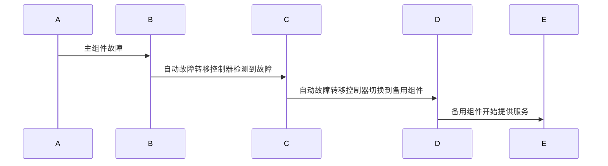

#### 2.2.2 被动故障转移

被动故障转移（Passive Fault Transfer）是指当主组件发生故障时，系统等待故障确认后再切换到备用组件，用户可能会短暂感知到故障。以下是一个被动故障转移的例子：

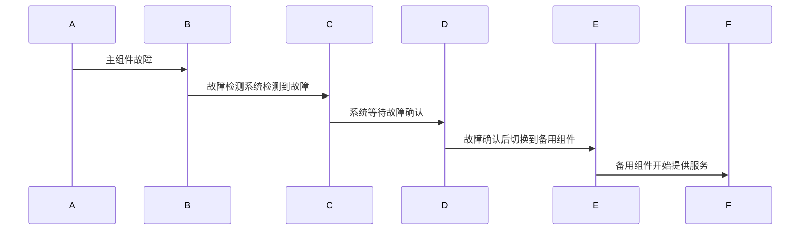

#### 2.2.3 多活故障转移

多活故障转移（Multi-active Fault Transfer）是指在同一时间内，多个组件都可以提供服务，当一个组件故障时，其他组件可以继续提供服务。以下是一个多活故障转移的例子：

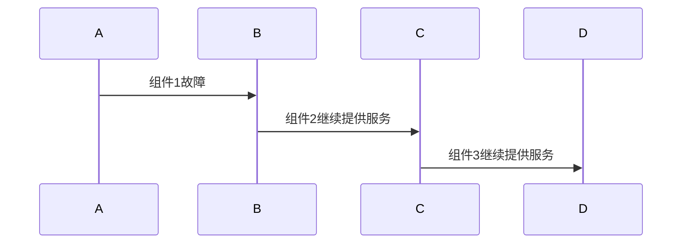

### 2.3 监控

监控是确保高可用系统正常运行的重要手段。通过实时监控系统的运行状态，可以及时发现并处理故障。以下是一些常见的监控策略：

#### 2.3.1 性能监控

性能监控是通过监控系统的性能指标，如CPU利用率、内存使用率等，来评估系统的性能状况。以下是一个性能监控的例子：

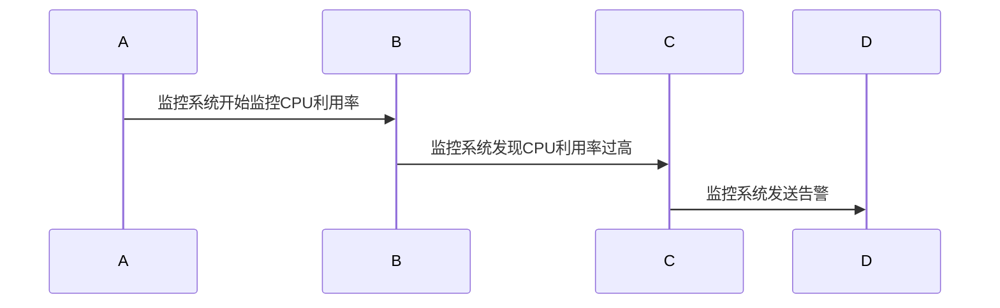

#### 2.3.2 故障监控

故障监控是通过监控系统的故障情况，如服务不可用、网络故障等，来确保系统的稳定性。以下是一个故障监控的例子：

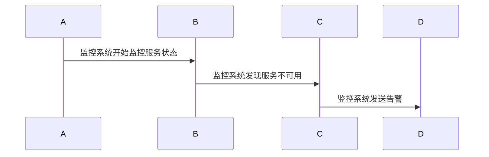

#### 2.3.3 告警通知

告警通知是通过发送告警信息，如短信、邮件、微信等，来通知相关人员及时处理故障。以下是一个告警通知的例子：

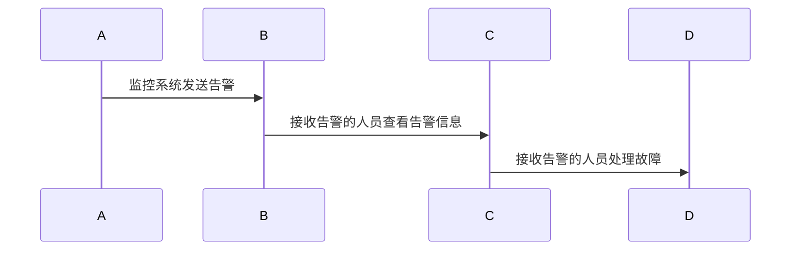

### 2.4 自动化

自动化是提高高可用系统效率的重要手段。通过自动化工具，可以减少人工干预，提高系统管理的效率。以下是一些常见的自动化策略：

#### 2.4.1 部署自动化

部署自动化是通过自动化工具实现系统的快速部署和更新。以下是一个部署自动化的例子：

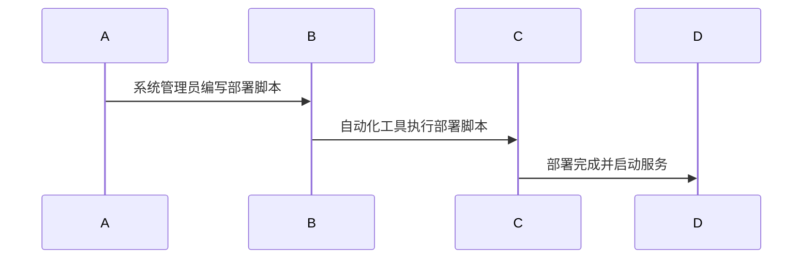

#### 2.4.2 监控自动化

监控自动化是通过自动化工具实现系统的实时监控和告警。以下是一个监控自动化的例子：

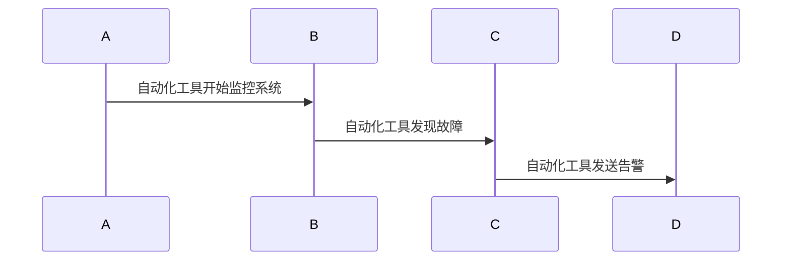

#### 2.4.3 故障处理自动化

故障处理自动化是通过自动化工具实现故障的自动检测、诊断和处理。以下是一个故障处理自动化的例子：

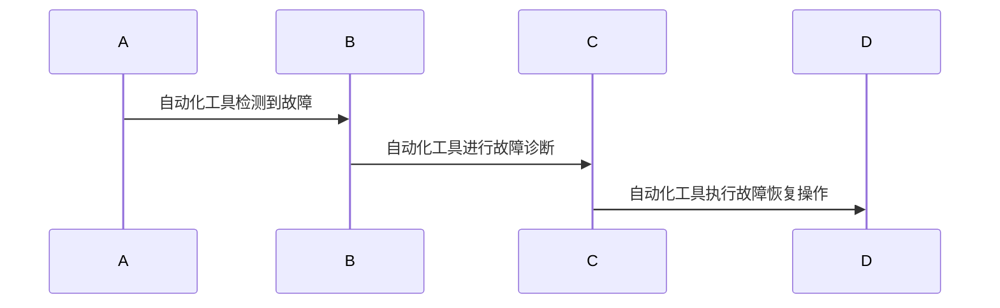

### 2.5 总结

高可用系统由多个关键组成部分构成，包括冗余、故障转移、监控和自动化。每个部分都发挥着至关重要的作用，共同确保系统的长时间稳定运行。通过深入理解和应用这些组成部分，我们可以构建一个真正的高可用系统，为关键业务的连续运行提供有力保障。在接下来的章节中，我们将通过具体的案例分析，进一步探讨这些组成部分的实际应用。

## 第3章：案例分析

在构建高可用系统的过程中，成功和失败的案例都能为我们提供宝贵的经验和教训。本章节将通过几个典型的案例，分析它们在高可用系统构建中的应用，并探讨它们在实现高可用性方面所采取的具体策略和措施。

### 3.1 案例一：电子商务平台的高可用性构建

#### 项目介绍

某大型电子商务平台在面临日益增长的客户需求和复杂的业务场景时，决定构建一个高可用性的系统来保障业务的连续性和用户体验。该平台的主要业务包括商品展示、购物车管理、订单处理、支付处理和客户服务等。

#### 系统功能设计

为了实现高可用性，该电子商务平台采用了以下功能设计：

1. **负载均衡**：通过负载均衡器实现流量分发，减少单个服务器的压力，提高系统的处理能力。
2. **数据库集群**：通过主从数据库集群实现数据的高可用性，主数据库故障时，从数据库能够自动接管。
3. **缓存系统**：通过分布式缓存系统减少数据库的查询压力，提高系统的响应速度。
4. **消息队列**：通过消息队列实现异步处理，提高系统的处理能力和容错能力。

#### 系统架构设计

该电子商务平台的系统架构设计如图3-1所示：

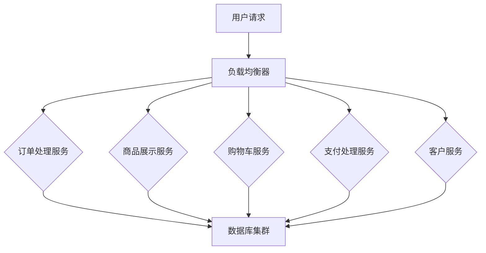

#### 系统接口设计和系统交互

该电子商务平台的系统接口设计和系统交互如图3-2所示：

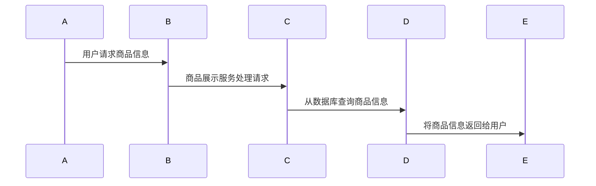

#### 实际案例分析和详细讲解

在该电子商务平台的高可用性构建过程中，采用了以下策略：

1. **负载均衡**：通过负载均衡器实现流量分发，避免单点故障。同时，负载均衡器还支持健康检查和故障转移，确保流量总是分配到正常工作的服务器上。
   
   ```mermaid
   sequenceDiagram
       A->>B: 用户请求
       B->>C: 健康检查
       C->>B: 故障转移
       B->>D: 分配流量到正常服务器
   ```

2. **数据库集群**：通过主从数据库集群实现数据的高可用性。主数据库故障时，从数据库能够自动接管，确保数据不会丢失。

   ```mermaid
   sequenceDiagram
       A->>B: 主数据库故障
       B->>C: 从数据库接管
       C->>D: 继续提供服务
   ```

3. **缓存系统**：通过分布式缓存系统减少数据库的查询压力，提高系统的响应速度。同时，缓存系统还支持缓存一致性，确保数据的准确性。

   ```mermaid
   sequenceDiagram
       A->>B: 用户请求商品信息
       B->>C: 查询缓存
       C->>D: 缓存命中，返回商品信息
       A->>E: 更新缓存
   ```

4. **消息队列**：通过消息队列实现异步处理，提高系统的处理能力和容错能力。消息队列还能够确保消息不会丢失，即使在处理过程中出现故障。

   ```mermaid
   sequenceDiagram
       A->>B: 发送消息
       B->>C: 存储消息
       C->>D: 处理消息
       D->>E: 返回结果
   ```

#### 项目小结

通过以上案例分析，我们可以看到，电子商务平台在构建高可用性系统时，采取了多种策略和措施，包括负载均衡、数据库集群、缓存系统和消息队列等。这些策略和措施共同确保了系统的可靠性、稳定性和响应性，为业务的连续运行提供了有力保障。

### 3.2 案例二：金融机构的交易系统高可用性保障

#### 项目介绍

某金融机构在交易系统中面临高可用性的挑战。交易系统是金融机构的核心系统，对系统的稳定性和可靠性要求极高。该系统包括订单处理、交易确认、资金清算等多个模块。

#### 系统功能设计

为了实现交易系统的高可用性，该金融机构采用了以下功能设计：

1. **多活集群**：通过多活集群实现系统的负载均衡和故障转移，确保在一个集群故障时，其他集群可以继续提供服务。
2. **分布式存储**：通过分布式存储系统实现数据的高可用性，避免单点故障。
3. **备份与恢复**：通过定期备份和快速恢复机制，确保数据的安全性和系统的稳定性。

#### 系统架构设计

该金融机构的交易系统架构设计如图3-3所示：

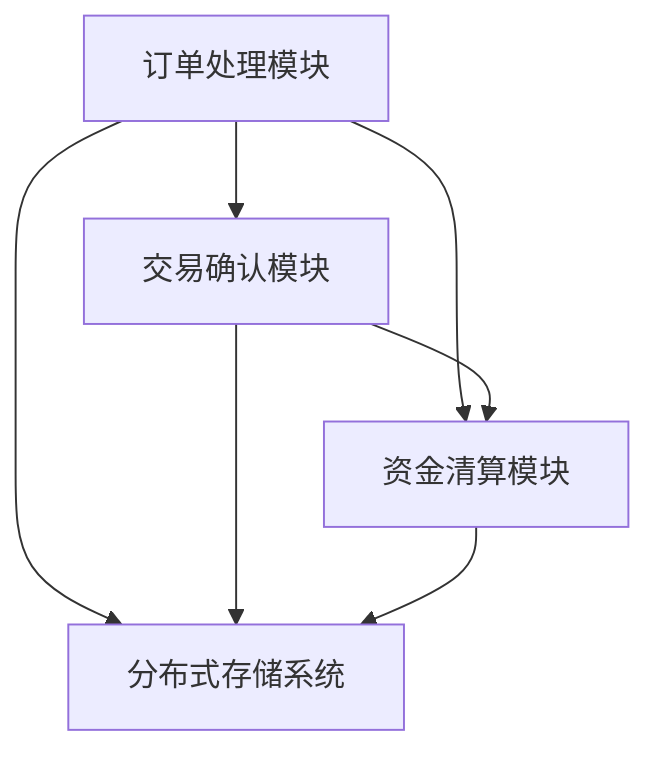

#### 系统接口设计和系统交互

该金融机构的交易系统接口设计和系统交互如图3-4所示：

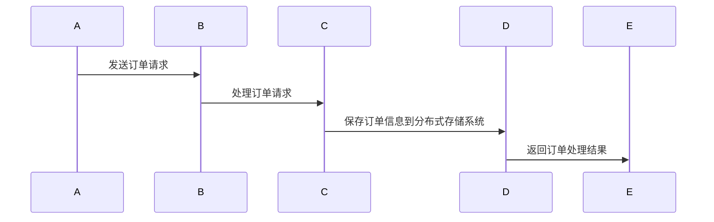

#### 实际案例分析和详细讲解

在该金融机构的交易系统高可用性保障过程中，采用了以下策略：

1. **多活集群**：通过多活集群实现系统的负载均衡和故障转移。在某个集群出现故障时，其他集群可以立即接管，确保交易系统的连续运行。

   ```mermaid
   sequenceDiagram
       A->>B: 集群1故障
       B->>C: 集群2接管
       C->>D: 继续处理交易请求
   ```

2. **分布式存储**：通过分布式存储系统实现数据的高可用性。分布式存储系统能够在某个节点故障时，自动切换到其他节点，确保数据的安全性和系统的稳定性。

   ```mermaid
   sequenceDiagram
       A->>B: 节点1故障
       B->>C: 节点2接管
       C->>D: 继续存储订单信息
   ```

3. **备份与恢复**：通过定期备份和快速恢复机制，确保数据的安全性和系统的稳定性。在系统出现故障时，可以快速恢复数据，确保业务的连续性。

   ```mermaid
   sequenceDiagram
       A->>B: 定期备份
       B->>C: 快速恢复
       C->>D: 系统恢复正常运行
   ```

#### 项目小结

通过以上案例分析，我们可以看到，金融机构在保障交易系统的高可用性时，采取了多活集群、分布式存储和备份与恢复等策略。这些策略和措施共同确保了交易系统的可靠性、稳定性和安全性，为金融机构的持续运营提供了有力保障。

### 3.3 案例三：社交媒体平台的高可用性挑战

#### 项目介绍

某社交媒体平台在面临用户快速增长和业务复杂度增加的情况下，遇到了高可用性的挑战。该平台包括用户信息管理、内容发布与推送、社交网络分析等多个模块。

#### 系统功能设计

为了实现社交媒体平台的高可用性，该平台采用了以下功能设计：

1. **水平扩展**：通过水平扩展实现系统的弹性伸缩，满足用户增长的需求。
2. **分布式缓存**：通过分布式缓存系统减少数据库的查询压力，提高系统的响应速度。
3. **服务隔离**：通过服务隔离确保单个服务的故障不会影响其他服务的运行。

#### 系统架构设计

该社交媒体平台的系统架构设计如图3-5所示：

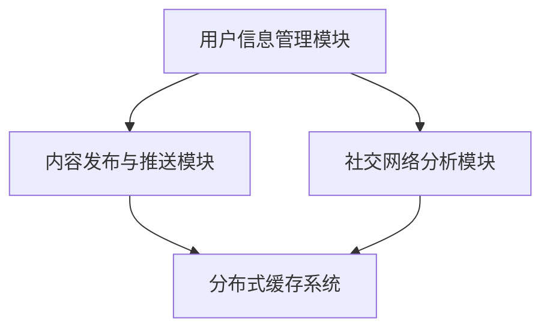

#### 系统接口设计和系统交互

该社交媒体平台的系统接口设计和系统交互如图3-6所示：

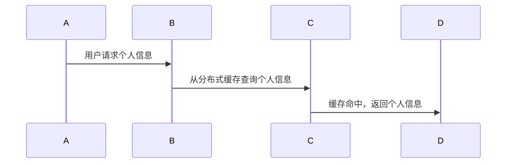

#### 实际案例分析和详细讲解

在该社交媒体平台的高可用性挑战中，采用了以下策略：

1. **水平扩展**：通过水平扩展实现系统的弹性伸缩，满足用户增长的需求。当用户量增加时，可以快速添加新的节点，确保系统的处理能力。

   ```mermaid
   sequenceDiagram
       A->>B: 用户量增加
       B->>C: 添加新节点
       C->>D: 系统处理能力提升
   ```

2. **分布式缓存**：通过分布式缓存系统减少数据库的查询压力，提高系统的响应速度。分布式缓存系统能够在多台服务器上存储缓存数据，提高数据的访问速度。

   ```mermaid
   sequenceDiagram
       A->>B: 用户请求内容
       B->>C: 从分布式缓存查询内容
       C->>D: 缓存命中，返回内容
   ```

3. **服务隔离**：通过服务隔离确保单个服务的故障不会影响其他服务的运行。当某个服务出现故障时，其他服务可以继续正常运行，确保用户体验。

   ```mermaid
   sequenceDiagram
       A->>B: 服务A故障
       B->>C: 服务B继续运行
       C->>D: 服务C继续运行
   ```

#### 项目小结

通过以上案例分析，我们可以看到，社交媒体平台在应对高可用性挑战时，采取了水平扩展、分布式缓存和服务隔离等策略。这些策略和措施共同确保了系统的可靠性、稳定性和响应性，为用户的持续使用提供了有力保障。

### 3.4 案例四：互联网服务提供商的高可用性保障

#### 项目介绍

某互联网服务提供商（ISP）在提供服务时，需要保障网络的高可用性。该提供商的服务包括宽带接入、服务器托管、云计算等。

#### 系统功能设计

为了实现网络的高可用性，该互联网服务提供商采用了以下功能设计：

1. **多网络接入**：通过多网络接入实现网络的冗余，避免单点故障。
2. **网络监控**：通过实时监控网络的运行状态，确保网络的稳定性。
3. **备份链路**：通过备份链路在主链路故障时提供备用网络。

#### 系统架构设计

该互联网服务提供商的网络架构设计如图3-7所示：

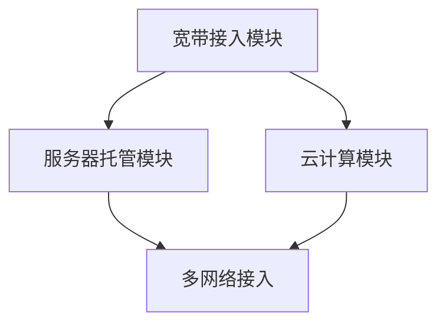

#### 系统接口设计和系统交互

该互联网服务提供商的网络接口设计和系统交互如图3-8所示：

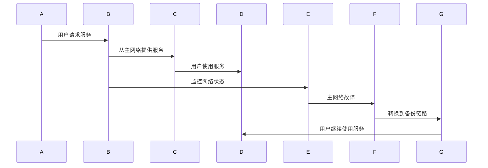

#### 实际案例分析和详细讲解

在该互联网服务提供商的高可用性保障过程中，采用了以下策略：

1. **多网络接入**：通过多网络接入实现网络的冗余，确保在主网络故障时，其他网络可以继续提供服务。

   ```mermaid
   sequenceDiagram
       A->>B: 主网络故障
       B->>C: 转换到备用网络
       C->>D: 用户继续使用服务
   ```

2. **网络监控**：通过实时监控网络的运行状态，确保网络的稳定性。当监控到网络故障时，可以及时通知相关人员进行处理。

   ```mermaid
   sequenceDiagram
       A->>B: 监控网络状态
       B->>C: 发现网络故障
       C->>D: 发送告警
   ```

3. **备份链路**：通过备份链路在主链路故障时提供备用网络，确保用户的业务不受影响。

   ```mermaid
   sequenceDiagram
       A->>B: 主链路故障
       B->>C: 转换到备份链路
       C->>D: 用户继续使用服务
   ```

#### 项目小结

通过以上案例分析，我们可以看到，互联网服务提供商在保障网络的高可用性时，采取了多网络接入、网络监控和备份链路等策略。这些策略和措施共同确保了网络的可靠性、稳定性和安全性，为用户的持续使用提供了有力保障。

### 总结

通过以上案例分析，我们可以得出以下结论：

1. **高可用性策略的选择**：根据具体的业务场景和需求，选择合适的高可用性策略，如冗余、故障转移、监控和自动化等。
2. **系统架构的设计**：合理设计系统架构，确保系统的弹性伸缩性和容错能力。
3. **技术实现**：采用成熟的技术实现高可用性，如负载均衡、分布式存储、多网络接入等。
4. **监控与告警**：建立完善的监控与告警机制，确保及时发现并处理故障。
5. **备份与恢复**：定期备份数据，确保数据的安全性和系统的稳定性。

高可用性系统的构建需要综合考虑多个方面，通过不断的实践和优化，可以构建一个真正的高可用系统，为关键业务的连续运行提供有力保障。

## 第4章：最佳实践总结与扩展

在构建高可用系统的过程中，积累最佳实践是提高系统可靠性、稳定性和响应性的关键。本章节将总结一些在高可用系统构建中常用的最佳实践，并探讨这些实践在具体场景中的应用。此外，还将讨论高可用系统的未来发展方向和潜在的研究课题。

### 4.1 最佳实践总结

1. **全面冗余策略**：在硬件、软件和数据层面进行全面冗余，确保在单个组件故障时，系统能够无缝切换到备用组件。硬件冗余可以通过多服务器集群、多存储设备、多网络线路来实现；软件冗余可以通过数据库镜像、应用集群等方式实现；数据冗余可以通过分布式存储、数据库复制等方式实现。

2. **故障转移机制**：实现主动故障转移和被动故障转移相结合的策略。主动故障转移可以在故障发生时立即切换到备用组件，减少用户感知；被动故障转移可以在故障确认后切换，确保系统的稳定性和可靠性。

3. **实时监控与告警**：建立全面的监控体系，实时监控系统的运行状态。通过性能监控、故障监控和告警通知，确保在故障发生时能够及时发现并处理。

4. **自动化管理**：利用自动化工具实现系统的部署、监控和故障处理。通过自动化脚本、CI/CD流水线等方式，提高系统管理的效率，减少人工干预。

5. **定期备份与恢复**：定期备份系统数据，确保在系统故障时能够快速恢复。同时，进行备份测试，验证备份的有效性和恢复能力。

6. **弹性伸缩**：根据业务需求，实现系统的弹性伸缩。在用户量增加时，可以快速添加新的节点，确保系统的处理能力；在用户量减少时，可以释放多余的节点，降低成本。

7. **服务隔离**：通过服务隔离确保单个服务的故障不会影响其他服务的运行。在架构设计时，将服务解耦，避免单点故障。

8. **持续集成与持续部署**：通过CI/CD流水线实现代码的自动化测试和部署，确保系统的稳定性和安全性。定期进行代码审查和自动化测试，降低故障风险。

### 4.2 具体场景应用

1. **电子商务平台**：在电子商务平台中，高可用性策略可以应用于订单处理、支付处理、商品展示和用户管理等模块。通过负载均衡、数据库集群、分布式缓存和多活集群等方式，确保系统的可靠性、稳定性和响应性。

2. **金融机构**：在金融机构中，高可用性策略可以应用于交易系统、资金清算系统、用户信息系统等模块。通过多活集群、分布式存储、备份与恢复和实时监控等方式，确保金融系统的安全性和可靠性。

3. **社交媒体平台**：在社交媒体平台中，高可用性策略可以应用于用户信息管理、内容发布与推送、社交网络分析等模块。通过水平扩展、分布式缓存、服务隔离和弹性伸缩等方式，确保系统的可靠性、稳定性和响应性。

4. **互联网服务提供商**：在互联网服务提供商中，高可用性策略可以应用于宽带接入、服务器托管、云计算等模块。通过多网络接入、备份链路、实时监控和自动化管理等方式，确保网络的高可靠性、稳定性和安全性。

### 4.3 高可用系统的未来发展方向

1. **云原生技术**：随着云计算技术的发展，云原生技术（如Kubernetes、Docker等）在高可用系统的构建中变得越来越重要。通过云原生技术，可以更灵活地部署和管理高可用系统，提高系统的弹性伸缩能力和容错能力。

2. **人工智能与机器学习**：将人工智能和机器学习技术应用于高可用系统的监控和故障处理，可以更精准地预测故障，提前进行故障预防。通过深度学习模型，可以实现智能化的故障诊断和自动修复。

3. **区块链技术**：区块链技术具有去中心化、不可篡改的特点，可以应用于高可用系统的数据备份和验证。通过分布式账本技术，可以确保数据的一致性和安全性。

4. **边缘计算**：随着物联网和智能设备的发展，边缘计算成为高可用系统的一个重要研究方向。通过在边缘节点部署计算任务，可以降低网络延迟，提高系统的响应速度和可靠性。

### 4.4 潜在的研究课题

1. **高效故障转移策略**：研究更高效的故障转移策略，减少故障转移的时间和成本，提高系统的可用性。

2. **智能监控与告警**：研究如何通过智能算法实现更精准的监控和告警，降低误报率和漏报率。

3. **混合云架构**：研究如何构建混合云架构，实现云平台与本地数据中心的协同工作，提高系统的可靠性、稳定性和成本效益。

4. **数据一致性与容错**：研究如何确保数据在分布式系统中的一致性和容错性，提高系统的可靠性和可用性。

通过总结最佳实践、探讨具体场景应用、展望未来发展方向和探讨潜在研究课题，我们可以更好地理解和应用高可用系统的构建方法，为关键业务的连续运行提供有力保障。

### 小结与注意事项

在本章节中，我们详细探讨了高可用系统的核心概念、构建方法、关键组成部分、案例分析以及最佳实践总结。通过这些讨论，我们可以得出以下结论：

1. **核心概念与重要性**：高可用系统是指通过冗余、故障转移、监控和自动化等策略，确保系统在长时间内持续稳定运行的能力。高可用性对于企业的业务连续性、用户体验和竞争力至关重要。

2. **关键组成部分**：高可用系统由冗余、故障转移、监控和自动化等关键组成部分构成。每个部分都在系统中发挥着至关重要的作用，共同确保系统的可靠性、稳定性和响应性。

3. **案例分析**：通过电子商务平台、金融机构、社交媒体平台和互联网服务提供商的案例分析，我们了解了不同业务场景下的高可用性策略和实现方法。这些案例为我们提供了宝贵的实践经验。

4. **最佳实践总结**：总结了一些在高可用系统构建中常用的最佳实践，如全面冗余策略、故障转移机制、实时监控与告警、自动化管理、定期备份与恢复、弹性伸缩和服务隔离等。

在构建高可用系统的过程中，我们还需要注意以下几点：

1. **需求分析与规划**：在构建高可用系统之前，需要进行详细的需求分析和规划，确保系统的设计符合业务需求和预期。

2. **技术选型**：选择适合业务场景的技术方案，如云计算、容器化、分布式存储等，确保系统的可靠性、稳定性和效率。

3. **监控与告警**：建立全面的监控体系，实时监控系统的运行状态，确保在故障发生时能够及时发现并处理。

4. **备份与恢复**：定期备份系统数据，确保在系统故障时能够快速恢复，降低业务中断时间。

5. **持续改进**：通过持续改进和优化，不断提升系统的可用性，确保系统在面临不断变化的市场环境和技术挑战时，能够保持高性能和高可靠性。

最后，建议读者在构建高可用系统时，不仅要掌握理论知识，还要结合实际案例进行实践，不断总结经验和教训，以提高系统的构建能力和管理水平。

### 拓展阅读

1. **《高可用架构：建设可靠分布式系统的最佳实践》**：本书详细介绍了高可用架构的设计原则、实现方法和最佳实践，适合希望深入了解高可用系统构建的读者。

2. **《深入理解高可用性》**：本文从理论层面深入分析了高可用性的概念、原则和实现方法，对于希望从技术角度理解高可用性的读者非常有帮助。

3. **《云原生应用架构设计》**：本书介绍了云原生技术在高可用系统构建中的应用，包括容器化、服务网格、微服务架构等，适合对云原生技术感兴趣的读者。

4. **《Docker实战》**：本书通过实际案例，详细介绍了如何使用Docker构建高可用系统，包括容器化、编排和管理等内容，适合对容器化技术感兴趣的读者。

通过阅读这些拓展资料，读者可以进一步加深对高可用系统构建的理解，提升实际操作能力。同时，也可以关注相关的技术社区和会议，了解最新的技术动态和实践经验。

