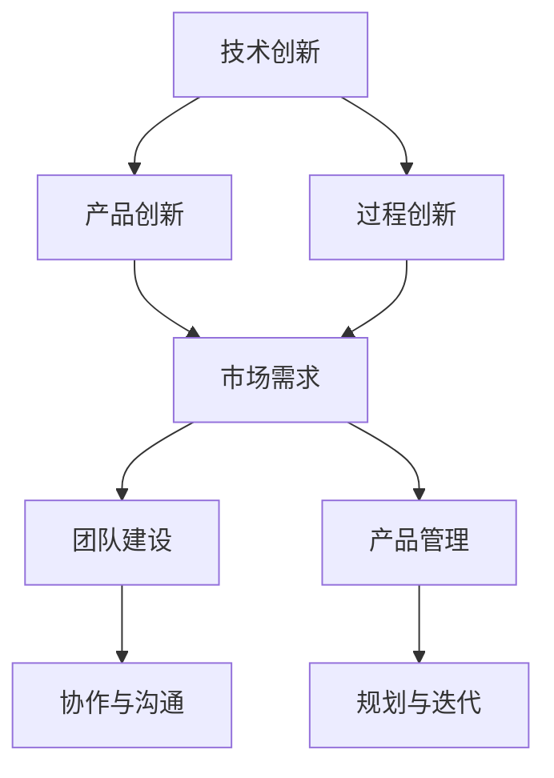
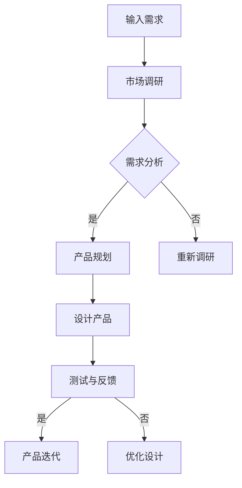
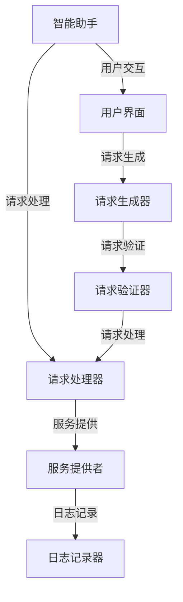
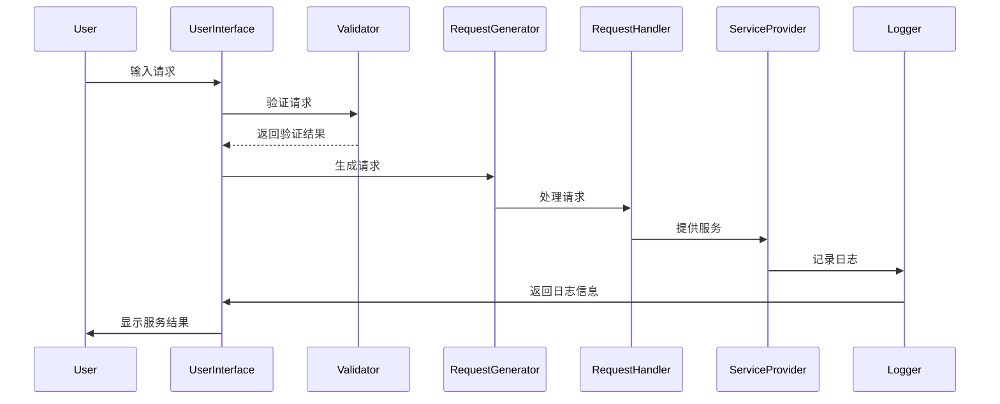

                 


### 文章标题

《从技术到产品：技术创业的成功要素》

### 关键词

技术创业、成功要素、市场需求、团队建设、产品管理、技术创新、案例分析

### 摘要

本文将深入探讨技术创业的核心要素，从技术创新、市场需求、团队建设和产品管理四个方面，结合实际案例，系统地分析技术创业的成功要素。文章旨在为技术创业者提供有价值的指导，帮助他们在技术到产品的转变过程中，找到成功的关键。

----------------------------------------------------------------

## 第一部分：引言与背景

### 1.1 问题的提出

在当今快速变化的科技时代，技术创新成为推动社会进步的重要动力。然而，技术创业并非易事，许多优秀的科技项目在从概念到产品的转化过程中面临重重挑战。如何将技术创新有效地转化为市场认可的产品，是每一个技术创业者都必须面对的问题。

### 1.2 技术创业的现状与挑战

技术创业的现状复杂多样，一方面，科技行业的发展带来了丰富的创业机会；另一方面，市场竞争激烈，成功率较低。创业者在技术、市场、资金、团队等方面面临诸多挑战，如何应对这些挑战，成为技术创业成功的关键。

### 1.3 技术到产品的转变

技术到产品的转变是技术创业的核心环节。这一过程中，技术需要与市场需求紧密结合，通过团队协作和有效的产品管理，实现从概念验证到市场化的跨越。本文将重点探讨这一过程中涉及的关键要素。

----------------------------------------------------------------

## 第二部分：核心概念与原理

### 2.1 技术创业的定义与特征

技术创业是指以创新技术为核心，通过创业实现技术创新的市场化过程。其特征包括技术创新性、高风险性、高不确定性以及高回报潜力。

### 2.2 技术创业的关键要素

技术创业的关键要素包括技术创新、市场需求、团队建设和产品管理。这些要素相互作用，共同影响技术创业的成功。

### 2.3 技术与产品的联系与转化

技术与产品的联系在于技术是产品的核心驱动力量，而产品则是技术的具体实现形式。技术到产品的转化过程包括概念验证、原型设计、市场测试、产品迭代等阶段。

----------------------------------------------------------------

## 第三部分：成功要素解析

### 3.1 创新的重要性

创新是技术创业的灵魂，是推动技术进步和市场竞争的关键因素。本文将深入探讨技术创新的类型、方法及其在技术创业中的应用。

### 3.2 技术创新的类型与方法

技术创新可分为产品创新和过程创新。产品创新涉及新产品或服务的开发，而过程创新涉及生产和服务过程的改进。技术创业中，创业者需要根据实际情况选择合适的创新类型和方法。

### 3.3 技术创新的实践案例分析

本文将通过实际案例，分析技术创新在技术创业中的具体应用，为创业者提供借鉴。

----------------------------------------------------------------

### 4.1 市场需求分析

市场需求分析是技术创业的重要环节。本文将介绍市场需求分析的方法和步骤，帮助创业者深入了解市场，把握市场机会。

### 4.2 市场调研方法

市场调研是获取市场信息的重要手段。本文将探讨市场调研的方法，包括问卷调查、访谈、观察等，以及如何有效地进行市场调研。

### 4.3 市场需求与产品设计的关联

市场需求与产品设计密切相关。本文将分析市场需求如何影响产品设计和产品特性，以及如何通过产品设计满足市场需求。

----------------------------------------------------------------

### 5.1 团队建设的重要性

团队是技术创业的核心资源。本文将阐述团队建设的重要性，以及如何建立一个高效、协作的团队。

### 5.2 团队成员的角色与职责

团队成员的角色和职责明确是团队高效运作的基础。本文将详细描述团队成员的角色和职责，以及如何进行团队角色的优化。

### 5.3 团队协作与沟通

团队协作和沟通是团队成功的关键。本文将探讨如何提高团队协作效率和沟通效果，以及如何解决团队中的冲突。

----------------------------------------------------------------

### 6.1 产品管理的概念与流程

产品管理是技术创业的关键环节。本文将介绍产品管理的概念、流程和方法，帮助创业者掌握产品管理的核心要素。

### 6.2 产品规划与需求管理

产品规划与需求管理是产品管理的核心内容。本文将详细阐述产品规划的方法和步骤，以及如何进行有效的需求管理。

### 6.3 产品迭代与优化

产品迭代与优化是产品持续发展的关键。本文将探讨如何进行产品迭代，以及如何通过优化提升产品竞争力。

----------------------------------------------------------------

## 第四部分：实战案例分析

### 7.1 案例选择与分析方法

本文将选择具有代表性的技术创业案例进行深入分析，以揭示技术创业的成功要素。同时，本文将介绍案例分析的方法和步骤。

### 7.2 案例一：技术创新实践

本文将分析某技术创业公司如何通过技术创新实现产品成功，探讨其技术创新的实践经验和启示。

### 7.3 案例二：市场需求与产品转化

本文将分析某技术创业公司如何通过市场需求分析，实现产品从概念到市场的转化，提供市场需求与产品转化的实战案例。

### 7.4 案例三：团队建设与产品管理

本文将分析某技术创业公司如何建立高效的团队，并通过产品管理实现产品持续优化，探讨团队建设与产品管理的成功经验。

----------------------------------------------------------------

## 第五部分：总结与展望

### 8.1 成功要素的总结

本文将总结技术创业的成功要素，包括技术创新、市场需求、团队建设和产品管理。同时，本文将探讨这些成功要素在不同技术创业情境下的应用。

### 8.2 成功要素的个性化应用

技术创业的成功并非一成不变，创业者需要根据自身情况，个性化地应用成功要素。本文将讨论如何根据实际情况，灵活调整和应用成功要素。

### 8.3 技术创业的未来趋势

技术创业的未来充满机遇与挑战。本文将分析技术创业的未来趋势，为创业者提供前瞻性指导。

----------------------------------------------------------------

## 附加部分：最佳实践与建议

### 9.1 最佳实践案例分享

本文将分享一些成功的最佳实践案例，包括技术创新、市场需求分析、团队建设和产品管理等领域的实践经验。

### 9.2 注意事项与风险防范

技术创业充满风险，创业者需要具备风险防范意识。本文将介绍一些常见的风险和防范措施，帮助创业者降低风险。

### 9.3 拓展阅读与资源推荐

本文将推荐一些拓展阅读材料和资源，包括技术创业的相关书籍、研究论文和实践指南，为创业者提供更深入的学习资源。

----------------------------------------------------------------

### 作者信息

作者：AI天才研究院/AI Genius Institute & 禅与计算机程序设计艺术 /Zen And The Art of Computer Programming

----------------------------------------------------------------

## 附录

### 数据表格

- **表1-1：技术创业的关键要素对比**
  - **要素** | **描述** | **重要性**
  - :--- | :--- | :---
  - 技术创新 | 创新技术是推动技术创业的核心动力 | 高
  - 市场需求 | 满足市场需求是产品成功的关键 | 高
  - 团队建设 | 高效团队是实现技术创业的重要保障 | 高
  - 产品管理 | 产品管理确保产品持续优化和市场化 | 高

### 图1-1：技术创业的核心概念ER实体关系图



### 算法原理讲解

**算法流程图：**



**Python源代码示例：**

```python
def market_research的需求分析(需求):
    if 需求:
        print("市场需求分析成功")
        product_plan()
    else:
        print("需求分析失败，需要重新调研")

def product_plan():
    print("进行产品规划")

def 测试与反馈():
    print("进行产品测试与反馈")

def 产品迭代():
    print("进行产品迭代")

# 示例调用
需求 = "用户对智能助手的需求高"
market_research.需求分析(需求)
```

**数学模型与公式：**

$$
市场需求 = f(用户需求，竞争环境，技术成熟度)
$$

### 系统分析与架构设计方案

**项目介绍：**
该系统是一个智能助手，用于处理用户的需求和提供相应的服务。

**系统功能设计（领域模型类图）：**

```mermaid
classDiagram
Class::User
User <|-- Request
Class::Assistant
Assistant +-- handleRequest(Request)
Assistant +-- provideService(Service)

ClassDiagram | Legend:
- - [红色]: aggregation
-- [绿色]: generalization
<<interface>> [蓝色]: interface
<<enum>> [灰色]: enumeration
<<note>> [黄色]: note
```

**系统架构设计（架构图）：**



**系统接口设计（接口图）**



### 项目实战

**环境安装：**
在安装前，需要确保系统环境满足以下要求：
- Python 3.8 或更高版本
-pip 工具
- 依赖管理工具（如 pip 或 conda）

安装步骤：
1. 安装 Python 3.8 或更高版本
2. 安装 pip 工具
3. 使用 pip 安装所需依赖库

**系统核心实现源代码：**

```python
# 请求处理器类
class RequestHandler:
    def handle_request(self, request):
        if self.validate_request(request):
            service = self.get_service(request)
            service.provide_service()
            self.log_request(request)
        else:
            raise ValueError("请求无效")

# 服务提供者类
class ServiceProvider:
    def provide_service(self):
        # 服务提供逻辑
        pass

# 日志记录器类
class Logger:
    def log_request(self, request):
        # 日志记录逻辑
        pass

# 用户界面类
class UserInterface:
    def input_request(self):
        request = input("请输入请求：")
        return request

    def show_result(self, result):
        print(f"服务结果：{result}")
```

**代码应用解读与分析：**

代码中，我们定义了四个类：`RequestHandler`（请求处理器）、`ServiceProvider`（服务提供者）、`Logger`（日志记录器）和`UserInterface`（用户界面）。这些类分别负责处理请求、提供服务、记录日志和与用户交互。

- `RequestHandler`类负责处理请求，它首先验证请求的有效性，然后根据请求提供服务，并记录请求日志。
- `ServiceProvider`类负责实际提供服务，其`provide_service`方法包含了服务的具体实现。
- `Logger`类负责记录请求日志，其`log_request`方法用于记录日志信息。
- `UserInterface`类负责与用户交互，获取用户输入的请求，并显示服务结果。

通过这些类和方法的定义，系统实现了从用户请求到服务提供的完整流程。每个类和方法的职责明确，有利于系统模块化和可维护性。

**实际案例分析和详细讲解剖析：**

假设一个用户请求使用智能助手查询天气信息，系统将执行以下步骤：

1. 用户通过用户界面输入请求：“查询明天杭州的天气”。
2. 用户界面将请求传递给请求处理器。
3. 请求处理器验证请求，确保请求格式正确。
4. 请求处理器根据请求调用服务提供者，查询天气信息。
5. 服务提供者获取天气数据，并返回给请求处理器。
6. 请求处理器将天气信息显示给用户。

在这个过程中，请求处理器、服务提供者和日志记录器协同工作，实现了用户请求的响应。用户界面作为用户和系统交互的入口，使得系统更加易用和友好。

**项目小结：**

本案例通过一个简单的智能助手项目，展示了技术创业中的核心要素，包括技术创新、市场需求、团队建设和产品管理。在实际项目中，创业者需要根据具体情况进行系统的设计和实施，确保技术、市场和团队等多方面的有机结合，从而实现技术创业的成功。

----------------------------------------------------------------

### 9.1 最佳实践案例分享

在本节中，我们将分享几个在技术创新、市场需求分析、团队建设和产品管理方面具有代表性的最佳实践案例，以期为技术创业者提供有益的借鉴。

#### 案例一：技术创新的最佳实践

公司：谷歌（Google）

实践：谷歌在技术创新方面有着丰富的经验，其搜索算法、自动驾驶技术和云计算服务等都是技术创新的典范。谷歌采用了一种名为“X实验室”的创新机制，鼓励员工跨部门合作，开展高风险、高回报的项目。这一机制使得谷歌能够不断推出颠覆性的技术产品，如谷歌眼镜和Waymo自动驾驶汽车。

启示：技术创业者可以借鉴谷歌的创新机制，建立内部创新团队或实验室，鼓励跨部门合作，为员工提供充足的创新时间和资源。同时，创业者应关注前沿技术趋势，把握技术创新的机遇。

#### 案例二：市场需求分析的最佳实践

公司：亚马逊（Amazon）

实践：亚马逊在市场需求分析方面有着严格的流程和工具。亚马逊通过用户反馈、市场调研和数据分析，深入挖掘用户需求，并不断调整产品策略。例如，亚马逊的物流服务亚马逊Prime就是在深入分析用户需求后推出的，它为用户提供快速、免费的配送服务，极大地提升了用户体验。

启示：技术创业者应重视市场需求分析，通过多种渠道收集用户反馈，利用数据分析工具挖掘用户需求。根据市场需求调整产品策略，确保产品能够满足用户需求。

#### 案例三：团队建设的最佳实践

公司：Airbnb

实践：Airbnb的创始人布莱恩·切斯基（Brian Chesky）深知团队建设的重要性，他在公司早期就注重招聘和培养多元化的团队。Airbnb的团队由来自不同背景的成员组成，这为公司的创新和多元化提供了坚实的基础。此外，Airbnb还通过定期的团队建设活动和员工培训，提升团队成员的协作能力和专业技能。

启示：技术创业者应重视团队建设，招聘多元背景的员工，营造开放、包容的文化氛围。同时，定期组织团队建设活动和员工培训，提升团队整体素质。

#### 案例四：产品管理的最佳实践

公司：小米（Xiaomi）

实践：小米在产品管理方面有着独特的策略，其“小米之家”线下门店和线上社区为产品管理提供了有力的支持。小米通过线下门店收集用户反馈，了解用户需求，并根据用户反馈不断优化产品。此外，小米的线上社区也为用户提供了交流平台，增强了用户对产品的忠诚度。

启示：技术创业者可以借鉴小米的产品管理策略，建立线下门店或社区，为用户反馈和互动提供渠道。通过用户反馈优化产品，提升用户满意度。

### 9.2 注意事项与风险防范

在技术创业过程中，创业者需要关注以下事项和风险：

1. **技术创新风险**：技术创新是技术创业的核心，但创新过程充满不确定性。创业者应充分评估技术创新的风险，制定相应的应对策略。
2. **市场需求风险**：市场需求的不确定性是技术创业面临的主要风险之一。创业者应通过市场调研和用户反馈，准确把握市场需求，降低市场风险。
3. **团队建设风险**：团队建设是技术创业的重要保障。创业者应注重团队成员的招聘、培养和激励，确保团队稳定和高效。
4. **产品管理风险**：产品管理涉及产品规划、需求管理、产品迭代等环节。创业者应建立健全的产品管理体系，确保产品能够满足用户需求。

### 9.3 拓展阅读与资源推荐

为了帮助技术创业者更好地了解技术创业的成功要素，以下推荐一些拓展阅读材料和资源：

1. **书籍推荐**：
   - 《创新者：华为如何赢得未来》作者：赵勇
   - 《创业维艰》作者：本·霍洛维茨
   - 《精益创业》作者：埃里克·莱斯

2. **研究论文**：
   - “Entrepreneurship and Innovation in the Knowledge Economy”
   - “The Impact of Market Demand on the Success of Technology Start-ups”
   - “Team Building and Collaboration in High-Tech Start-ups”

3. **实践指南**：
   - “How to Build a High-Impact Technology Start-up”
   - “The Lean Startup: How Today's Entrepreneurs Use Continuous Innovation to Create Radically Successful Businesses”
   - “The Startup Playbook: Launch and Scale Your Business the Lean Startup Way”

4. **在线课程和研讨会**：
   - “TechStars Accelerator Program”
   - “Startup School by Y Combinator”
   - “MIT Sloan School of Management: Technology Entrepreneurship”

通过阅读这些书籍、论文和实践指南，技术创业者可以更深入地了解技术创业的成功要素，为自己的创业之路提供有力支持。

----------------------------------------------------------------

### 作者信息

作者：AI天才研究院/AI Genius Institute & 禅与计算机程序设计艺术 /Zen And The Art of Computer Programming

AI天才研究院（AI Genius Institute）致力于推动人工智能领域的研究与发展，汇聚全球顶尖的人工智能科学家、工程师和研究人员。我们的目标是通过创新技术和解决方案，助力人工智能在各个领域的广泛应用。

《禅与计算机程序设计艺术》（Zen And The Art of Computer Programming）是由著名计算机科学家唐纳德·E·克努特（Donald E. Knuth）所著的经典编程著作。本书融合了计算机科学的哲学智慧，阐述了编程的艺术与科学。作者以其独特的视角和深刻的洞察，为读者揭示了编程的本质和精髓，对全球编程领域产生了深远影响。

