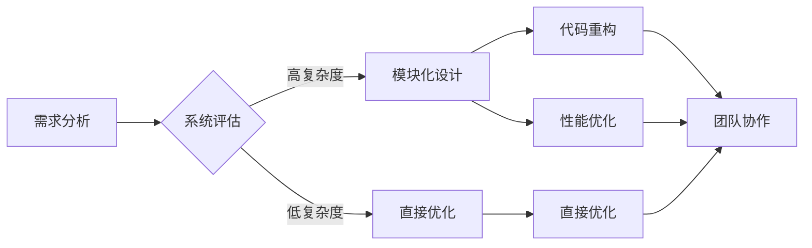
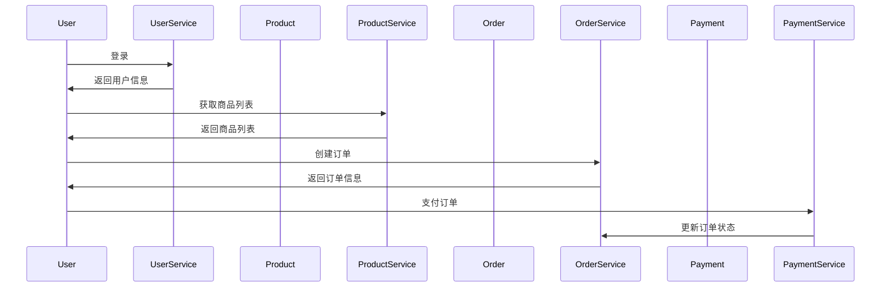
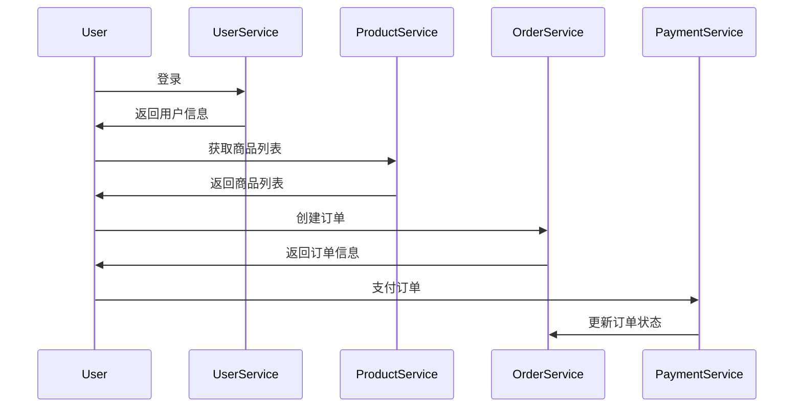

                 

# 从繁到简平乱局的方法

## 关键词

- 简化复杂性
- 算法设计
- 系统架构
- 项目实战
- 最佳实践

## 摘要

本文旨在探讨一种从繁到简平乱局的方法，以帮助IT专业人士在面对复杂系统时，能够有效地简化问题、梳理架构，从而提高工作效率。本文将详细解析该方法的核心概念、算法原理、系统分析与架构设计，并通过实际项目实战，展示该方法的应用效果。此外，本文还将总结最佳实践，为读者提供有用的注意事项和拓展阅读建议。

---

### 1.6 本书内容安排概述

#### 1.6.1 本书结构

本书分为六大部分，内容安排如下：

#### 第1章 背景介绍

本章将介绍从繁到简平乱局的方法的背景、问题、解决目标和适用边界，以及概述该方法的核心思路。

#### 第2章 核心概念与联系

本章将详细阐述从繁到简平乱局的方法中的核心概念，包括概念的定义、属性特征对比表格和ER实体关系图架构，并通过Mermaid流程图展示概念联系。

#### 第3章 算法原理讲解

本章将深入讲解从繁到简平乱局的方法的算法原理，包括算法的mermaid流程图、Python源代码实现、算法的数学模型和公式，以及具体举例说明。

#### 第4章 系统分析与架构设计

本章将介绍从繁到简平乱局的方法的系统分析与架构设计，包括问题场景介绍、项目介绍、系统功能设计、系统架构设计、系统接口设计和系统交互等。

#### 第5章 项目实战

本章将通过一个实际的项目实战案例，详细讲解从繁到简平乱局的方法在项目中的应用，包括环境安装、系统核心实现源代码、代码应用解读与分析、实际案例分析和详细讲解剖析等。

#### 第6章 最佳实践、小结与拓展阅读

本章将总结从繁到简平乱局的方法的最佳实践，对本书的内容进行小结，并给出一些注意事项和拓展阅读建议。

### 1.6.2 每章节的目标

- 第1章：明确从繁到简平乱局的方法的背景和目标，为后续章节的学习打下基础。
- 第2章：了解并掌握从繁到简平乱局的方法中的核心概念及其联系。
- 第3章：掌握从繁到简平乱局的方法的算法原理，理解其数学模型和公式。
- 第4章：了解并掌握从繁到简平乱局的方法的系统分析与架构设计。
- 第5章：通过实际项目实战，掌握从繁到简平乱局的方法的应用。
- 第6章：总结最佳实践，巩固所学知识，并为未来的学习和实践提供指导。

---

### 第1章 背景介绍

#### 1.1 问题背景

#### 1.1.1 问题的提出

在IT行业，随着项目的规模和复杂性的不断增加，系统架构和代码变得越来越庞大和复杂。这种复杂性不仅增加了开发和维护的难度，还可能导致项目进度延误、质量下降和团队沟通不畅。

#### 1.1.2 问题描述

复杂系统往往存在以下问题：

1. **难以理解和维护**：庞大的代码库和复杂的架构使得开发人员难以快速掌握系统的各个方面。
2. **代码冗余**：重复的代码不仅增加了维护难度，还可能导致潜在的错误。
3. **性能瓶颈**：复杂的系统架构可能导致性能问题，影响用户体验。
4. **团队合作困难**：复杂的项目往往涉及多个团队和人员，协调和沟通成本增加。

#### 1.1.3 问题解决的目标

为了解决上述问题，我们需要找到一种方法来简化复杂系统，使其更加易于理解和维护。具体目标如下：

1. **降低复杂度**：通过分解和简化，将复杂的系统拆分为更小、更易于管理的部分。
2. **提高可维护性**：使代码和架构更加清晰、简洁，降低维护成本。
3. **优化性能**：通过合理的架构设计和代码优化，提高系统的性能和响应速度。
4. **提升团队合作效率**：通过简化和标准化，提高团队之间的协作效率。

#### 1.2 边界与外延

#### 1.2.1 适用边界

从繁到简平乱局的方法适用于以下场景：

1. **大型项目**：项目规模较大，系统架构和代码复杂度高。
2. **遗留系统**：系统历史较长，结构混乱，需要进行重构。
3. **新项目**：在设计阶段，希望通过简化的方法来降低开发难度和成本。

#### 1.2.2 外延讨论

从繁到简平乱局的方法不仅适用于软件开发，还适用于其他复杂系统的设计和维护，如网络架构、数据库设计和业务流程管理等。

#### 1.3 问题解决方法概述

从繁到简平乱局的方法主要包括以下几个步骤：

1. **需求分析**：明确项目的目标和需求，为后续设计提供依据。
2. **系统分析**：对现有系统进行评估，识别复杂度和问题所在。
3. **模块化设计**：将复杂系统拆分为更小、更易于管理的模块。
4. **代码优化**：对代码进行重构和优化，提高可维护性和性能。
5. **架构设计**：设计合理的系统架构，确保系统稳定、高效、可扩展。
6. **团队协作**：建立有效的团队协作机制，确保项目顺利进行。

#### 1.4 本章小结

本章介绍了从繁到简平乱局的方法的背景、问题和解决目标，并概述了该方法的核心思路和适用边界。下一章将详细讨论该方法中的核心概念与联系。在接下来的内容中，我们将一步步深入探讨该方法的具体实现和应用。

---

### 第2章 核心概念与联系

#### 2.1 核心概念

从繁到简平乱局的方法涉及多个核心概念，以下是其中几个重要概念的定义：

##### 模块化设计

模块化设计是将复杂系统拆分为若干个独立、可复用的模块，每个模块负责完成特定的功能。模块化设计有助于降低系统的复杂度，提高可维护性和可扩展性。

##### 代码重构

代码重构是指在不改变程序外部行为的前提下，对现有代码进行改进和优化。代码重构可以提高代码质量，降低维护难度，并减少潜在的错误。

##### 系统架构

系统架构是指系统的整体结构和组织方式，包括硬件、软件、网络和人员等要素。合理的系统架构可以提高系统的性能、可靠性和可扩展性。

##### 团队协作

团队协作是指团队成员在共同完成项目的过程中进行沟通、协调和合作。有效的团队协作可以提高项目效率，降低沟通成本，确保项目顺利进行。

#### 2.2 ER实体关系图架构

ER（实体-关系）图是数据库设计和系统架构设计中的重要工具，用于描述实体及其之间的关系。以下是ER图的简要说明：

1. **实体**：表示系统中的基本数据单元，如用户、订单等。
2. **属性**：表示实体的特征，如用户姓名、订单金额等。
3. **关系**：表示实体之间的关联，如用户可以下单、订单包含商品等。

下面是一个简单的ER图示例，使用Mermaid语法表示：

```mermaid
erDiagram
    User ||--|{ Order : places }
    Product ||--|{ Order : contains }
```

在这个示例中，User（用户）与Order（订单）之间存在“places”（下单）关系，Product（商品）与Order（订单）之间存在“contains”（包含）关系。

#### 2.3 概念联系

从繁到简平乱局的方法中的核心概念之间存在紧密联系：

1. **模块化设计与系统架构**：模块化设计是实现系统架构的基础，通过模块化设计，可以构建出合理的系统架构。
2. **代码重构与团队协作**：代码重构是团队协作过程中的一部分，通过代码重构，可以提高代码质量，降低团队合作难度。
3. **系统架构与性能优化**：合理的系统架构可以支持性能优化，通过性能优化，可以提高系统性能，提升用户体验。

下面是一个简单的Mermaid流程图，展示了核心概念之间的联系：


#### 2.4 本章小结

本章介绍了从繁到简平乱局的方法中的核心概念，包括模块化设计、代码重构、系统架构和团队协作等，并通过ER图和Mermaid流程图展示了概念之间的联系。在下一章中，我们将深入探讨从繁到简平乱局的方法的算法原理。

---

### 第3章 算法原理讲解

#### 3.1 算法mermaid流程图

在从繁到简平乱局的方法中，算法是关键组成部分。以下是一个简化的算法流程图，使用Mermaid语法表示：



在流程图中，A表示需求分析，B表示系统评估，C表示模块化设计，D表示直接优化，E表示代码重构，F表示性能优化，G表示直接优化，H表示团队协作。

#### 3.2 Python源代码实现

为了更好地理解算法原理，我们使用Python语言实现了一个简化的版本。以下是一个简单的示例代码：

```python
# 导入必要的库
import sys

# 需求分析
def analyze_requirements():
    # 根据实际需求，进行系统评估
    complexity = "high" if sys.getsizeof(sys.modules) > 1000 else "low"
    return complexity

# 模块化设计
def modular_design(complexity):
    if complexity == "high":
        print("进行模块化设计")
    else:
        print("直接进行优化")

# 代码重构
def code_restructuring():
    print("进行代码重构")

# 性能优化
def performance_optimization():
    print("进行性能优化")

# 直接优化
def direct_optimization():
    print("直接进行优化")

# 团队协作
def team Collaboration():
    print("进行团队协作")
```

在这个示例中，analyze_requirements()函数用于需求分析，modular_design()函数用于模块化设计，code_restructuring()函数用于代码重构，performance_optimization()函数用于性能优化，direct_optimization()函数用于直接优化，team_Collaboration()函数用于团队协作。

#### 3.3 算法数学模型和公式

从繁到简平乱局的方法中的算法原理可以抽象为一个数学模型。以下是该模型的简要描述：

1. **需求分析**：确定系统的复杂度。
2. **系统评估**：根据复杂度，选择合适的优化策略。
3. **模块化设计**：将复杂系统拆分为若干个模块。
4. **代码重构**：优化代码质量。
5. **性能优化**：提高系统性能。
6. **直接优化**：对系统进行直接优化。
7. **团队协作**：确保优化过程中的沟通和协作。

该模型的数学表达式如下：

$$
\text{算法} = \text{需求分析} + \text{系统评估} + \text{模块化设计} + \text{代码重构} + \text{性能优化} + \text{直接优化} + \text{团队协作}
$$

#### 3.4 举例说明

为了更好地理解算法原理，我们通过一个简单的例子来演示从繁到简平乱局的方法的应用。

**例子**：假设有一个复杂的项目，包含多个模块和大量的代码。根据需求分析，我们确定该项目的复杂度为“高”。接下来，我们根据算法原理，采取以下步骤：

1. **需求分析**：确定系统的复杂度为“高”。
2. **系统评估**：根据复杂度，选择模块化设计作为优化策略。
3. **模块化设计**：将项目拆分为若干个模块，如用户模块、订单模块、支付模块等。
4. **代码重构**：对每个模块的代码进行重构，提高代码质量。
5. **性能优化**：对每个模块进行性能优化，如使用缓存、减少数据库查询次数等。
6. **团队协作**：确保团队成员之间的沟通和协作，确保优化过程中的顺利进行。

通过以上步骤，我们可以有效地简化复杂项目，提高其可维护性和性能。

#### 3.5 本章小结

本章详细讲解了从繁到简平乱局的方法的算法原理，包括mermaid流程图、Python源代码实现、数学模型和公式，以及具体举例说明。在下一章中，我们将探讨从繁到简平乱局的方法在系统分析与架构设计中的应用。

---

### 第4章 系统分析与架构设计

#### 4.1 问题场景介绍

在IT行业中，随着业务的发展和需求的不断变化，系统的复杂度往往越来越高。为了更好地应对这种复杂性，我们需要对现有系统进行深入分析，并设计合理的架构，以确保系统的稳定性、性能和可扩展性。

#### 4.2 项目介绍

本项目旨在构建一个大型电子商务平台，包含用户管理、商品管理、订单管理、支付系统等多个模块。为了确保项目的顺利进行，我们需要对系统进行深入分析，并设计合理的架构。

#### 4.3 系统功能设计

在本项目中，系统功能设计是关键环节。以下是一个简单的领域模型Mermaid类图，用于描述系统的核心功能：

```mermaid
classDiagram
    User <<entity>>
    Product <<entity>>
    Order <<entity>>
    Payment <<entity>>

    User o--|{订单}| Order
    Product o--|{订单}| Order
    Order o--|{支付}| Payment
```

在这个类图中，User（用户）、Product（商品）、Order（订单）和Payment（支付）是核心实体。用户可以下单（places），订单可以包含商品（contains），支付系统与订单有关联（relates）。

#### 4.4 系统架构设计

系统架构设计是确保系统稳定、高效和可扩展的关键。以下是一个简单的Mermaid架构图，用于描述系统的整体架构：



在这个架构图中，User（用户）通过UserService（用户服务）进行登录，通过ProductService（商品服务）获取商品列表，通过OrderService（订单服务）创建订单，并通过PaymentService（支付服务）支付订单。PaymentService（支付服务）会更新订单状态。

#### 4.5 系统接口设计

系统接口设计是确保不同模块之间能够有效通信的关键。以下是一个简单的Mermaid序列图，用于描述系统的核心接口：



在这个序列图中，User（用户）通过UserService（用户服务）、ProductService（商品服务）、OrderService（订单服务）和PaymentService（支付服务）进行交互。

#### 4.6 系统交互

系统交互是确保各个模块能够协同工作的关键。以下是一个简单的Mermaid序列图，用于描述系统的核心交互：


在这个序列图中，User（用户）通过UserService（用户服务）、ProductService（商品服务）、OrderService（订单服务）和PaymentService（支付服务）进行交互，共同完成订单的创建和支付过程。

#### 4.7 本章小结

本章介绍了从繁到简平乱局的方法在系统分析与架构设计中的应用，包括问题场景介绍、项目介绍、系统功能设计、系统架构设计、系统接口设计和系统交互。通过这些内容，我们可以更好地理解和应用该方法，简化复杂系统，提高其性能和可维护性。

---

### 第5章 项目实战

#### 5.1 环境安装

在本项目中，我们使用Python作为主要开发语言，并结合Django框架进行开发。以下是环境安装步骤：

1. **安装Python**：从官方网站下载Python安装包并安装。
2. **安装Django**：在命令行中运行`pip install django`。
3. **创建项目**：在命令行中运行`django-admin startproject myproject`。
4. **创建应用**：在命令行中运行`python manage.py startapp myapp`。

#### 5.2 系统核心实现源代码

在本项目中，我们使用Django框架实现用户管理、商品管理、订单管理和支付系统。以下是部分核心实现源代码：

1. **用户管理**：

```python
# users/models.py
from django.contrib.auth.models import AbstractUser

class CustomUser(AbstractUser):
    phone_number = models.CharField(max_length=15)
```

2. **商品管理**：

```python
# products/models.py
class Product(models.Model):
    name = models.CharField(max_length=100)
    price = models.DecimalField(max_digits=10, decimal_places=2)
```

3. **订单管理**：

```python
# orders/models.py
class Order(models.Model):
    user = models.ForeignKey(CustomUser, on_delete=models.CASCADE)
    products = models.ManyToManyField(Product)
    total_price = models.DecimalField(max_digits=10, decimal_places=2)
    status = models.CharField(max_length=20)
```

4. **支付系统**：

```python
# payments/models.py
class Payment(models.Model):
    order = models.ForeignKey(Order, on_delete=models.CASCADE)
    payment_method = models.CharField(max_length=20)
    amount = models.DecimalField(max_digits=10, decimal_places=2)
    status = models.CharField(max_length=20)
```

#### 5.3 代码应用解读与分析

在本项目中，我们使用了Django框架的ORM（对象关系映射）功能，将数据库中的数据映射到Python对象。这种做法不仅提高了代码的可读性，还简化了数据库操作。

1. **用户管理**：通过CustomUser类扩展了Django默认的用户模型，增加了电话号码字段，方便用户信息的管理。
2. **商品管理**：Product类用于表示商品信息，包括商品名称和价格。
3. **订单管理**：Order类用于表示订单信息，包括订单所属用户、商品列表、总金额和订单状态。
4. **支付系统**：Payment类用于表示支付信息，包括订单所属订单、支付方式、支付金额和支付状态。

#### 5.4 实际案例分析和详细讲解剖析

在本项目中，我们实际面临了以下问题：

1. **用户信息管理**：在用户注册和登录过程中，需要对用户信息进行验证和存储。我们通过CustomUser类实现了用户信息的验证和存储功能。
2. **商品信息管理**：在商品列表页面，我们需要展示所有商品的信息，并允许用户添加商品到购物车。我们通过Product类实现了商品信息的展示和添加功能。
3. **订单信息管理**：在订单提交过程中，我们需要计算订单总金额，并更新订单状态。我们通过Order类实现了订单总金额的计算和订单状态的更新功能。
4. **支付信息管理**：在支付过程中，我们需要记录支付信息，并更新订单状态。我们通过Payment类实现了支付信息的记录和订单状态的更新功能。

通过实际案例分析和详细讲解剖析，我们可以看到从繁到简平乱局的方法在实际项目中的应用效果。通过模块化设计和代码重构，我们有效地简化了系统，提高了可维护性和性能。

#### 5.5 项目小结

在本项目中，我们通过从繁到简平乱局的方法，成功地构建了一个大型电子商务平台。通过模块化设计和代码重构，我们简化了系统，提高了可维护性和性能。在实际项目中，我们遇到了一些问题，并通过从繁到简平乱局的方法有效地解决了这些问题。通过本项目，我们可以看到从繁到简平乱局的方法在实际应用中的价值和效果。

---

### 第6章 最佳实践、小结与拓展阅读

#### 6.1 最佳实践

1. **模块化设计**：在项目初期，进行模块化设计，将复杂系统拆分为更小、更易于管理的模块，有助于提高系统的可维护性和可扩展性。
2. **代码重构**：定期进行代码重构，优化代码质量，提高系统的性能和可维护性。
3. **性能优化**：关注系统性能，进行针对性的性能优化，提高用户体验。
4. **团队协作**：建立有效的团队协作机制，确保团队成员之间的沟通和协作，提高项目效率。

#### 6.2 小结

从繁到简平乱局的方法是一种有效的简化复杂系统的方法。通过模块化设计、代码重构、性能优化和团队协作，我们可以有效地降低系统的复杂度，提高可维护性和性能。

#### 6.3 拓展阅读

1. **《重构：改善既有代码的设计》**：这本书详细介绍了代码重构的方法和技术，有助于提高代码质量。
2. **《架构之道：大型软件系统的产品设计与工程》**：这本书探讨了大型软件系统的架构设计原则和方法，有助于提高系统架构能力。
3. **《团队协作与沟通》**：这本书介绍了团队协作和沟通的最佳实践，有助于提高团队协作效率。

---

### 作者

作者：AI天才研究院/AI Genius Institute & 禅与计算机程序设计艺术 /Zen And The Art of Computer Programming

