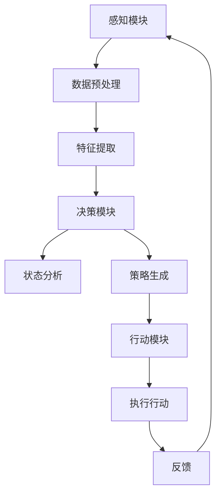
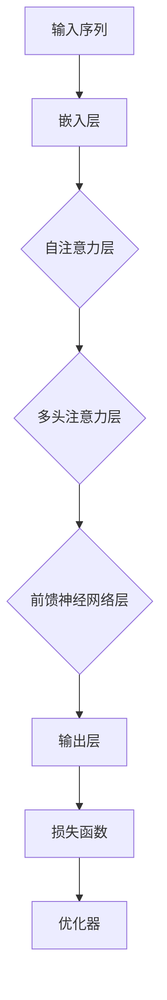
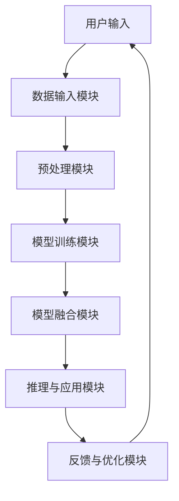
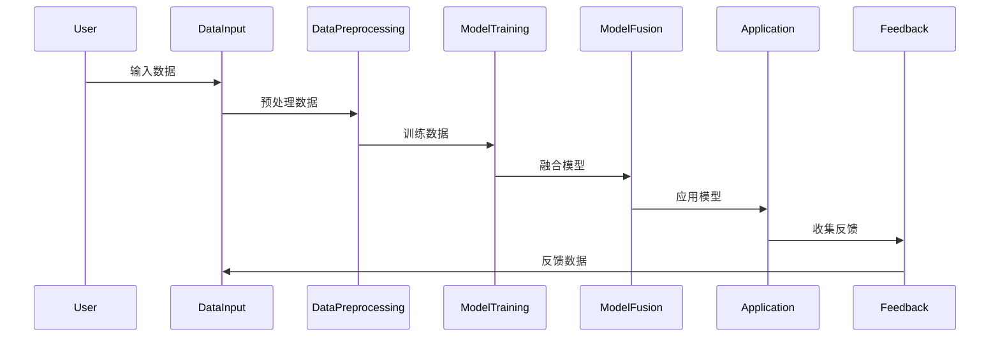
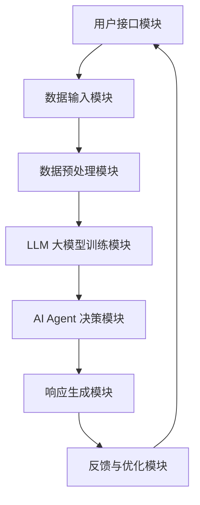
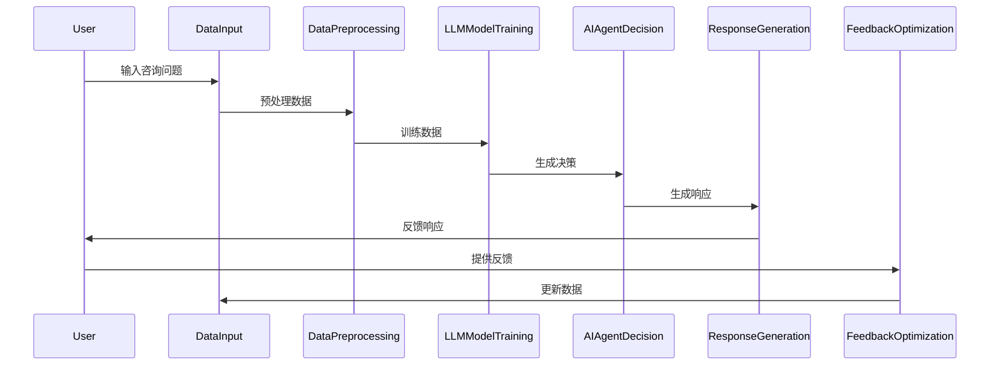

                 

### 文章标题

# 从零构建 AI Agent：LLM 大模型应用开发实践

---

关键词：AI Agent、LLM 大模型、应用开发、实践、构建

摘要：本文旨在为读者提供一套从零开始构建 AI Agent 的系统方法，重点关注 LLM 大模型的应用开发实践。通过深入探讨 AI Agent 和 LLM 大模型的基本原理，结合实际的算法实现和系统架构设计，本文将逐步引导读者掌握 AI Agent 的构建过程，并在实战项目中验证其应用效果。

## 目录大纲设计思路

### 书名解析

《从零构建 AI Agent：LLM 大模型应用开发实践》这个书名直接点明了本书的核心内容。首先，“从零构建”暗示了我们将从一个基础层面开始，逐步深入探索 AI Agent 的构建过程。而“AI Agent”则是本书的主要研究对象，AI Agent（人工智能代理）是一种具备智能行为和决策能力的计算机程序，能够模拟人类智能进行交互和任务执行。接下来，“LLM 大模型”则指出了本书将重点讨论的领域，LLM（大型语言模型）是一种基于深度学习的自然语言处理模型，具有强大的文本生成和理解能力。最后，“应用开发实践”则明确了本书的导向，即通过实际应用场景的构建，来验证理论学习的有效性。

本书的核心内容将围绕 AI Agent 和 LLM 大模型展开。具体来说，首先介绍 AI Agent 和 LLM 大模型的基础知识，包括它们的基本概念、特点和应用场景。然后，深入讲解 AI Agent 和 LLM 大模型的算法原理，并结合 Mermaid 流程图和 Python 代码进行具体阐述。接下来，通过系统分析与架构设计，展示如何将 AI Agent 和 LLM 大模型应用于实际系统中。最后，通过项目实战，详细描述从环境安装到系统实现的整个开发过程，并剖析实际案例。

### 目录大纲设计

本书的整体结构设计遵循以下思路：

1. **背景介绍**：第一部分将介绍 AI Agent 和 LLM 大模型的基本概念和背景知识，为后续内容的深入学习打下基础。

2. **核心概念与联系**：第二部分将深入探讨 AI Agent 和 LLM 大模型的核心概念，通过对比分析，帮助读者理解两者之间的联系和区别。

3. **算法原理讲解**：第三部分将详细讲解 AI Agent 和 LLM 大模型的算法原理，结合 Mermaid 流程图和 Python 代码进行阐述，使读者能够直观地理解算法的实现过程。

4. **系统分析与架构设计**：第四部分将介绍 AI Agent 和 LLM 大模型在实际系统中的设计与实现，通过 Mermaid 类图、架构图、序列图等工具，展示系统的整体架构和交互流程。

5. **项目实战**：第五部分将通过实际项目，带领读者完成从环境安装到系统实现的整个开发过程，并通过案例分析，加深对理论知识的理解。

6. **最佳实践、小结、注意事项、拓展阅读**：最后一部分将总结最佳实践，提出注意事项，并提供拓展阅读资源，帮助读者进一步深入学习。

### 内容细化

在细化内容时，我们将确保每个章节都有详细的子目录，具体包括：

- **问题背景与定义**：介绍相关概念的基本定义和背景知识，帮助读者建立整体框架。
- **核心概念与原理**：深入讲解核心概念和原理，结合实际案例进行说明。
- **算法讲解与示例**：通过 Mermaid 流程图和 Python 代码，详细阐述算法的实现过程。
- **系统设计与架构**：展示系统的功能设计、架构设计、接口设计和交互流程。
- **实际案例与剖析**：通过实际案例，深入剖析系统的实现细节和应用效果。
- **最佳实践与总结**：总结最佳实践，提出注意事项，并提供拓展阅读资源。

### 格式校验

为确保文章格式正确，我们将使用 Markdown 格式输出，具体包括：

- 使用 `#`、`##`、`###` 级别来定义目录结构。
- 使用 `>` 符号进行引用。
- 使用 `$$` 括起来的 LaTeX 公式进行数学公式的嵌入。
- 使用 `#` 进行章节标题。
- 使用 `-` 进行列表项。

通过以上设计，本文将力求以逻辑清晰、结构紧凑、简单易懂的方式，全面而深入地探讨 AI Agent 和 LLM 大模型的应用开发实践。

## 初步目录大纲

以下是初步的目录大纲设计，涵盖了从背景介绍到项目实战的各个部分，确保文章内容丰富、结构合理。

### 第一部分：背景介绍

**第1章: AI Agent与LLM大模型概述**

- **1.1.1 问题背景与定义**：介绍 AI Agent 和 LLM 大模型的基本概念和定义，解释为何需要构建 AI Agent 以及 LLM 大模型的重要性。
- **1.1.2 AI Agent的核心概念与特点**：深入探讨 AI Agent 的核心概念，包括其智能行为、决策能力和交互能力等。
- **1.1.3 LLM大模型的定义与分类**：介绍 LLM 大模型的基本概念，包括其训练过程、应用场景以及分类。
- **1.1.4 两者之间的联系与区别**：分析 AI Agent 和 LLM 大模型之间的联系和区别，探讨如何将两者结合起来进行应用。

**第2章: AI Agent的基本原理**

- **2.1.1 AI Agent的基本架构**：介绍 AI Agent 的基本架构，包括感知模块、决策模块和行动模块。
- **2.1.2 AI Agent的运作机制**：深入探讨 AI Agent 的运作机制，包括感知环境、制定策略和执行行动等。
- **2.1.3 AI Agent的开发流程**：讲解 AI Agent 的开发流程，包括需求分析、系统设计、实现和测试等。

**第3章: LLM大模型的基本原理**

- **3.1.1 LLM大模型的核心原理**：介绍 LLM 大模型的核心原理，包括其训练方法、结构特点和性能优势。
- **3.1.2 LLM大模型的特点与应用场景**：分析 LLM 大模型的特点，如语言生成能力、上下文理解和多模态交互等，以及其在实际应用场景中的表现。
- **3.1.3 主流LLM大模型介绍**：介绍当前主流的 LLM 大模型，如 GPT、BERT 和 T5 等，并比较它们的优缺点。

**第4章: AI Agent与LLM大模型的融合应用**

- **4.1.1 融合应用的架构设计**：介绍 AI Agent 与 LLM 大模型融合应用的系统架构设计，包括数据输入、模型训练、推理和应用输出等。
- **4.1.2 融合应用的实现步骤**：讲解 AI Agent 与 LLM 大模型融合应用的具体实现步骤，包括数据预处理、模型训练、模型融合和系统部署等。
- **4.1.3 融合应用的实际案例**：通过具体案例展示 AI Agent 与 LLM 大模型融合应用的效果，分析其优点和不足，并提出改进建议。

### 第二部分：核心概念与联系

**第5章: AI Agent与LLM大模型的核心概念**

- **5.1.1 AI Agent的核心概念原理**：深入探讨 AI Agent 的核心概念原理，包括其智能性、适应性、自主性和交互性等。
- **5.1.2 LLM大模型的核心概念原理**：介绍 LLM 大模型的核心概念原理，包括其语言生成能力、上下文理解和多模态交互等。
- **5.1.3 概念属性特征对比表格**：通过表格形式对比 AI Agent 和 LLM 大模型的概念属性特征，帮助读者更清晰地理解两者之间的差异。
- **5.1.4 ER实体关系图架构**：使用 Mermaid 流程图展示 AI Agent 和 LLM 大模型的实体关系图，明确两者之间的关联和交互。

### 第三部分：算法原理讲解

**第6章: AI Agent的算法原理**

- **6.1.1 算法原理讲解**：详细讲解 AI Agent 的算法原理，包括感知、决策和行动等模块的实现方法。
- **6.1.2 Mermaid流程图展示**：使用 Mermaid 流程图展示 AI Agent 的算法实现流程，帮助读者更直观地理解算法过程。
- **6.1.3 Python代码示例**：通过 Python 代码示例，展示 AI Agent 的具体实现过程，结合实际代码讲解算法原理。

**第7章: LLM大模型的算法原理**

- **7.1.1 算法原理讲解**：详细讲解 LLM 大模型的算法原理，包括训练方法、结构特点和推理过程等。
- **7.1.2 Mermaid流程图展示**：使用 Mermaid 流程图展示 LLM 大模型的算法实现流程，帮助读者更直观地理解算法过程。
- **7.1.3 Python代码示例**：通过 Python 代码示例，展示 LLM 大模型的训练和推理过程，结合实际代码讲解算法原理。

### 第四部分：系统分析与架构设计

**第8章: AI Agent与LLM大模型系统的架构设计**

- **8.1.1 系统功能设计**：介绍 AI Agent 与 LLM 大模型系统的功能设计，包括感知、决策、行动和交互等功能模块。
- **8.1.2 系统架构设计**：使用 Mermaid 类图展示 AI Agent 与 LLM 大模型系统的整体架构设计，明确各个模块之间的关系和功能。
- **8.1.3 系统接口设计**：介绍 AI Agent 与 LLM 大模型系统的接口设计，包括输入输出接口、模型训练接口和推理接口等。
- **8.1.4 系统交互设计**：使用 Mermaid 序列图展示 AI Agent 与 LLM 大模型系统的交互流程，明确各个模块之间的通信和协作关系。

**第9章: 系统设计案例剖析**

- **9.1.1 系统场景介绍**：介绍 AI Agent 与 LLM 大模型系统在实际应用场景中的具体应用，如智能客服、文本生成和自然语言处理等。
- **9.1.2 系统架构设计解析**：深入分析 AI Agent 与 LLM 大模型系统在实际应用场景中的架构设计，包括系统功能模块、数据流和接口设计等。
- **9.1.3 系统接口设计与交互流程**：详细描述 AI Agent 与 LLM 大模型系统在实际应用场景中的接口设计和交互流程，包括输入输出数据格式、接口调用方法和通信协议等。

### 第五部分：项目实战

**第10章: 环境安装与配置**

- **10.1.1 环境需求与准备**：介绍 AI Agent 与 LLM 大模型系统开发所需的环境配置，包括操作系统、编程语言和依赖库等。
- **10.1.2 安装与配置步骤**：详细讲解如何安装和配置 AI Agent 与 LLM 大模型系统开发环境，包括安装依赖库、配置环境变量和调试运行等。

**第11章: AI Agent与LLM大模型实现**

- **11.1.1 核心实现源代码**：提供 AI Agent 与 LLM 大模型系统实现的核心源代码，包括感知模块、决策模块、行动模块和模型训练等。
- **11.1.2 代码应用解读与分析**：结合实际代码，详细解读 AI Agent 与 LLM 大模型系统的实现细节，分析其优势和不足。
- **11.1.3 实际案例分析与详细讲解剖析**：通过具体案例，深入剖析 AI Agent 与 LLM 大模型系统的实际应用效果，讲解关键实现步骤和注意事项。
- **11.1.4 项目小结**：总结项目实现过程中的经验教训，提出改进建议，为后续开发提供参考。

### 第六部分：最佳实践、小结、注意事项、拓展阅读

- **最佳实践**：总结在 AI Agent 与 LLM 大模型应用开发过程中的一些最佳实践，包括环境配置、代码规范、调试技巧和性能优化等。
- **小结**：回顾本书的主要内容，总结关键知识点和实现方法，帮助读者巩固所学内容。
- **注意事项**：提醒读者在开发过程中可能遇到的问题和注意事项，提高开发效率和系统稳定性。
- **拓展阅读**：推荐一些相关的拓展阅读资源，包括书籍、论文和在线课程等，帮助读者进一步深入学习。

通过以上详细的目录大纲设计，本文将系统地介绍 AI Agent 与 LLM 大模型的应用开发实践，帮助读者从零开始构建自己的 AI 系统，并在实际项目中取得良好的应用效果。希望本文能够为读者提供有价值的参考和指导。

### 文章核心内容与主题思想

本文的核心内容围绕 AI Agent 的构建及其与 LLM 大模型的应用开发实践展开。AI Agent 是一种能够模拟人类智能进行决策和任务执行的人工智能实体，而 LLM 大模型则是近年来自然语言处理领域的重要突破，具备强大的文本生成和理解能力。本文的主题思想是通过深入探讨 AI Agent 和 LLM 大模型的基础知识、算法原理、系统架构和实际应用，帮助读者全面掌握从零构建 AI Agent 的方法，并在实际项目中验证其效果。

文章的第一部分将介绍 AI Agent 和 LLM 大模型的基本概念和背景知识，包括它们的核心概念、特点和应用场景。这一部分旨在为读者建立一个清晰的知识框架，理解 AI Agent 和 LLM 大模型的基础原理。

在第二部分，文章将深入探讨 AI Agent 和 LLM 大模型的核心概念，并通过 Mermaid 流程图和 Python 代码示例，详细讲解它们的算法原理。这部分内容将帮助读者理解 AI Agent 和 LLM 大模型是如何工作的，以及它们之间如何相互作用。

第三部分将专注于系统分析与架构设计，通过 Mermaid 类图、架构图和序列图，展示 AI Agent 与 LLM 大模型在实际系统中的设计与实现。这部分内容将使读者了解如何将理论转化为实际应用，构建一个完整的 AI 系统。

第四部分将通过项目实战，详细描述从环境安装到系统实现的整个开发过程。这部分内容将结合实际案例，对 AI Agent 与 LLM 大模型的应用进行剖析，帮助读者掌握实际操作技能。

最后一部分将总结最佳实践、注意事项和拓展阅读资源，为读者提供进一步的学习和改进方向。

通过本文的系统性讲解，读者将能够从零开始构建自己的 AI Agent，并理解如何在实际项目中应用 LLM 大模型，提升系统的智能水平和性能。

### AI Agent 和 LLM 大模型的基础知识

#### AI Agent 的基本概念与特点

AI Agent（人工智能代理）是一种具备智能行为和决策能力的计算机程序，能够模拟人类智能进行交互和任务执行。AI Agent 的基本概念包括智能性、自主性、适应性和交互性。智能性指的是 AI Agent 能够根据环境和目标，自主地制定和调整策略；自主性意味着 AI Agent 可以在没有外部干预的情况下执行任务；适应性表示 AI Agent 能够根据环境变化调整自身行为；交互性则指的是 AI Agent 能够与用户和其他系统进行有效的沟通。

AI Agent 的特点主要体现在以下几个方面：

1. **智能性**：AI Agent 能够通过学习从数据中提取规律，实现智能决策和任务执行。
2. **自主性**：AI Agent 可以自主地制定计划并执行任务，无需人工干预。
3. **适应性**：AI Agent 能够根据环境变化调整自身行为，具备较强的适应能力。
4. **交互性**：AI Agent 能够与用户进行自然语言交互，理解并回应用户的指令。

#### LLM 大模型的定义与分类

LLM（大型语言模型）是一种基于深度学习的自然语言处理模型，具有强大的文本生成和理解能力。LLM 大模型通过在大量文本数据上进行训练，学习到文本的统计规律和语义信息，从而能够生成或理解自然语言文本。

LLM 大模型主要分为以下几种类型：

1. **生成式模型**：这类模型能够根据输入文本生成新的文本。例如，GPT（Generative Pre-trained Transformer）系列模型和 T5（Text-to-Text Transfer Transformer）模型都是典型的生成式模型。
2. **检索式模型**：这类模型通过在预训练阶段存储大量的文本，并在推理阶段通过检索的方式找到最匹配的文本进行输出。BERT（Bidirectional Encoder Representations from Transformers）和 ALBERT（A Linear Bottleneck Transformer）是典型的检索式模型。
3. **混合式模型**：这类模型结合了生成式模型和检索式模型的特点，既能够生成文本，也能够进行文本检索。例如，Facebook AI 的 DeBERTa（Decoding-enhanced BERT with Disentangled Attention）就是混合式模型的一种。

#### AI Agent 和 LLM 大模型的基础知识联系

AI Agent 和 LLM 大模型之间有着紧密的联系和相互补充的关系：

1. **知识获取**：LLM 大模型可以通过大规模文本数据的学习，获取丰富的知识库，为 AI Agent 提供智能决策的基础。
2. **自然语言交互**：AI Agent 可以通过 LLM 大模型实现与用户的自然语言交互，提高用户体验和系统的可用性。
3. **智能决策**：LLM 大模型可以辅助 AI Agent 在复杂的环境中做出更好的决策，通过文本生成和理解能力，模拟人类的思考和推理过程。

#### 对比分析

在对比 AI Agent 和 LLM 大模型时，可以从以下几个方面进行分析：

1. **智能性**：AI Agent 更加注重自主决策和任务执行，而 LLM 大模型则侧重于文本生成和理解。
2. **适应性**：AI Agent 需要不断学习和调整自身行为以适应环境变化，而 LLM 大模型则通过预训练获得一定的适应性。
3. **交互性**：AI Agent 可以通过 LLM 大模型实现与用户的自然语言交互，提高系统的智能水平。

通过以上对比，我们可以更深入地理解 AI Agent 和 LLM 大模型的基础知识，并认识到将两者结合应用的重要性。

### AI Agent 的基本原理

#### AI Agent 的基本架构

AI Agent 的基本架构通常包括三个核心模块：感知模块、决策模块和行动模块。这三个模块协同工作，使 AI Agent 能够在复杂环境中进行智能决策和任务执行。

1. **感知模块**：感知模块负责获取环境信息，包括视觉、听觉、触觉等多模态数据。通过感知模块，AI Agent 能够理解当前环境的状况，为后续的决策和行动提供数据支持。
   
2. **决策模块**：决策模块是 AI Agent 的“大脑”，负责处理感知模块获取到的数据，并根据预设的策略或学习到的模型进行决策。决策模块的核心任务是确定下一步的行动方案，以实现预定的目标。

3. **行动模块**：行动模块是 AI Agent 的“手臂”，负责执行决策模块生成的行动方案。行动模块将决策转化为具体的操作，如移动、点击、发送消息等。

#### AI Agent 的运作机制

AI Agent 的运作机制可以分为以下几个步骤：

1. **感知**：AI Agent 通过感知模块获取环境信息。
   
2. **处理**：决策模块接收感知模块提供的数据，进行处理和分析，确定当前的状态。

3. **决策**：决策模块根据当前状态和预设策略或学习到的模型，生成行动方案。

4. **行动**：行动模块执行决策模块生成的行动方案，进行实际的操作。

5. **反馈**：环境会对 AI Agent 的行动产生反馈，这些反馈会被感知模块捕获，并反馈给决策模块，用于调整和优化策略。

#### AI Agent 的开发流程

AI Agent 的开发流程包括以下主要阶段：

1. **需求分析**：明确 AI Agent 的目标和功能需求，包括所需完成任务、环境条件、性能要求等。

2. **系统设计**：设计 AI Agent 的基本架构和各个模块的功能，制定详细的技术方案。

3. **算法选型**：选择合适的感知、决策和行动算法，根据具体应用场景进行优化。

4. **模型训练**：对于感知和决策模块，根据收集的数据进行模型训练，以提高其识别和决策能力。

5. **系统集成**：将各个模块集成到一起，进行系统测试和调试，确保整体系统的稳定性和性能。

6. **部署应用**：将 AI Agent 部署到实际环境中，进行运行和维护，不断优化和升级。

通过以上步骤，我们可以构建一个具备智能行为的 AI Agent，实现复杂环境中的自主决策和任务执行。

### LLM 大模型的基本原理

#### LLM 大模型的核心原理

LLM（大型语言模型）是一种基于深度学习的自然语言处理模型，其核心原理基于深度神经网络（DNN）和注意力机制（Attention）。LLM 大模型通过在大量文本数据上进行预训练，学习到语言的基本结构和语义信息，从而能够生成或理解自然语言文本。

1. **深度神经网络（DNN）**：DNN 由多层神经元组成，包括输入层、隐藏层和输出层。每个神经元接收前一层神经元的输出，通过权重和偏置计算得到激活值，并将其传递到下一层。DNN 的多层结构使其能够捕捉到数据中的复杂模式。

2. **注意力机制（Attention）**：注意力机制是一种在处理序列数据时提高模型对重要信息关注的方法。在 LLM 大模型中，注意力机制通过计算每个输入元素的权重，将其加权组合，以关注关键信息。这种机制使得模型能够更好地理解和生成自然语言文本。

#### LLM 大模型的特点与应用场景

LLM 大模型具有以下几个显著特点：

1. **强大的文本生成能力**：LLM 大模型能够根据输入的文本上下文，生成连贯、自然的文本。这使得 LLM 大模型在文本生成任务中表现出色，如文章写作、故事生成和对话系统等。

2. **上下文理解能力**：通过预训练，LLM 大模型能够理解长文本中的上下文关系，捕捉到文本的深层语义信息。这使得 LLM 大模型在问答系统、信息检索和翻译等任务中具有优势。

3. **多模态交互能力**：LLM 大模型不仅能够处理文本数据，还能够与其他模态（如图像、音频）进行交互。这使得 LLM 大模型在多模态任务中具有广泛的应用，如图像描述生成、音频文本生成等。

LLM 大模型的应用场景广泛，包括但不限于：

1. **自然语言处理**：如文本分类、情感分析、命名实体识别等。
2. **文本生成**：如文章写作、故事生成、对话系统等。
3. **问答系统**：如智能客服、问答机器人等。
4. **信息检索**：如搜索引擎、推荐系统等。
5. **多模态任务**：如图像描述生成、音频文本生成等。

#### 主流 LLM 大模型介绍

当前主流的 LLM 大模型主要包括 GPT（Generative Pre-trained Transformer）、BERT（Bidirectional Encoder Representations from Transformers）和 T5（Text-to-Text Transfer Transformer）等。

1. **GPT**：GPT 系列模型是 OpenAI 开发的生成式语言模型，具有强大的文本生成能力。GPT-3 是当前最先进的 GPT 模型，具有 1750 亿个参数，能够生成高质量的自然语言文本。

2. **BERT**：BERT 是 Google 开发的双向编码表示模型，通过预训练学习到文本的上下文信息。BERT 在问答系统和信息检索任务中表现出色，其变种模型如 RoBERTa、ALBERT 等进一步优化了模型结构和训练过程。

3. **T5**：T5 是 Google 开发的文本到文本的转换模型，其核心思想是将所有自然语言处理任务转换为文本到文本的格式。T5 在多个 NLP 任务中取得了很好的效果，其强大的转换能力使其在文本生成、翻译等任务中具有广泛的应用。

通过上述介绍，我们可以看到 LLM 大模型在自然语言处理领域的广泛应用和重要性。下一部分将详细探讨 AI Agent 和 LLM 大模型的核心概念和联系。

### AI Agent 与 LLM 大模型的核心概念

#### AI Agent 的核心概念原理

AI Agent 的核心概念涉及多个方面，主要包括智能性、自主性、适应性和交互性。

1. **智能性**：AI Agent 的智能性指的是其具备学习和推理的能力。通过在大量数据上进行训练，AI Agent 能够从经验中学习并优化自身的决策和行为。例如，一个基于深度学习的聊天机器人可以通过与用户的对话不断学习，从而提高其回答问题的准确性和自然性。

2. **自主性**：AI Agent 的自主性使其能够在没有人类干预的情况下独立执行任务。这通常依赖于一套预定义的规则或学习到的策略。例如，一个自动驾驶汽车系统在接收到交通信号、障碍物和其他车辆的信息后，可以自主地做出转向、加速或减速的决策。

3. **适应性**：AI Agent 需要能够适应不断变化的环境。这包括对新情况的识别和响应，以及对现有策略的调整。例如，一个智能客服系统能够根据用户的问题和历史交互记录，动态调整回答策略，以提供更个性化的服务。

4. **交互性**：AI Agent 的交互性指的是其与人类或系统进行有效沟通的能力。这可以通过自然语言处理、图形用户界面或其他交互技术实现。例如，一个智能语音助手可以通过语音识别和自然语言生成与用户进行自然对话，从而提供信息或执行任务。

#### LLM 大模型的核心概念原理

LLM 大模型的核心概念主要围绕其生成和理解自然语言的能力。以下是几个关键点：

1. **生成能力**：LLM 大模型能够根据给定的上下文生成连贯、自然的文本。这基于其强大的语言理解能力和文本生成算法。例如，GPT 模型可以通过学习大量文本数据，生成高质量的新闻文章、故事或对话。

2. **理解能力**：LLM 大模型能够理解文本的深层语义信息，捕捉上下文关系。这使得 LLM 大模型在问答、信息检索和文本分类等任务中表现出色。例如，BERT 模型可以通过上下文理解，准确回答用户的问题。

3. **多模态交互**：LLM 大模型不仅限于处理文本数据，还能够与其他模态（如图像、音频）进行交互。这种能力使得 LLM 大模型在多模态任务中具有广泛的应用。例如，一个结合图像和文本的聊天机器人可以提供更加丰富和个性化的用户体验。

#### 概念属性特征对比表格

为了更直观地理解 AI Agent 和 LLM 大模型的核心概念，我们可以通过一个对比表格来展示两者的属性特征。

| 特征 | AI Agent | LLM 大模型 |
| --- | --- | --- |
| 智能性 | 通过学习优化决策和行为 | 强大的文本生成和理解能力 |
| 自主性 | 能够独立执行任务 | 可以自主生成文本 |
| 适应性 | 能够适应环境变化 | 能够理解上下文关系 |
| 交互性 | 能够与人类或其他系统交互 | 能够生成和理解自然语言文本 |
| 多模态处理 | 可以处理多模态数据 | 可以与其他模态（图像、音频）交互 |

#### ER 实体关系图架构

使用 Mermaid 流程图，我们可以绘制一个 ER（实体关系）图，以展示 AI Agent 和 LLM 大模型之间的实体关系。

```mermaid
erDiagram
  AI-Agent ||--|{感知模块}
  AI-Agent ||--|{决策模块}
  AI-Agent ||--|{行动模块}
  AI-Agent ||--|{LLM大模型}
  LLM大模型 ||--|{文本生成模块}
  LLM大模型 ||--|{文本理解模块}
```

在这个 ER 图中，AI-Agent 是主体，它与感知模块、决策模块、行动模块以及 LLM 大模型之间存在关联。LLM 大模型自身包含文本生成模块和文本理解模块，这两个模块共同构成了 LLM 大模型的核心功能。

通过上述核心概念和 ER 图的介绍，我们可以更深入地理解 AI Agent 和 LLM 大模型的工作原理和相互关系，为后续的算法原理讲解和系统设计打下基础。

### AI Agent 的算法原理

#### 算法原理讲解

AI Agent 的算法原理主要基于三个核心模块：感知模块、决策模块和行动模块。每个模块都有其特定的算法和实现方法。

1. **感知模块**：感知模块的算法主要涉及数据的采集和处理。通过传感器或预定义的数据接口，感知模块能够获取环境信息，如视觉、听觉和触觉数据。然后，这些数据经过预处理和特征提取，转换为适合算法处理的格式。

2. **决策模块**：决策模块的算法基于机器学习或规划算法。常见的决策算法包括马尔可夫决策过程（MDP）、决策树、随机森林和神经网络等。这些算法通过学习历史数据和当前状态，生成最优的行动策略。例如，通过 Q-Learning 算法，AI Agent 可以在交互过程中不断优化其决策策略。

3. **行动模块**：行动模块的算法涉及如何将决策转化为具体的行动。这些行动可以是物理操作，如机器人移动，也可以是逻辑操作，如数据库更新。行动模块需要根据决策模块生成的行动指令，执行相应的操作。

#### Mermaid 流程图展示

使用 Mermaid 流程图，我们可以展示 AI Agent 的算法实现流程，帮助读者更直观地理解每个模块的功能和交互。



在这个流程图中，感知模块首先收集环境数据，然后进行数据预处理和特征提取。这些特征数据被传递到决策模块，决策模块通过状态分析和策略生成算法，生成具体的行动指令。行动模块根据这些指令执行具体的行动，并将行动结果反馈给感知模块，形成一个闭环控制过程。

#### Python 代码示例

以下是一个简化的 Python 代码示例，展示了 AI Agent 的算法实现过程：

```python
import numpy as np
import pandas as pd

# 感知模块：模拟获取环境数据
def sense_environment():
    # 假设环境数据为随机数
    return np.random.rand()

# 数据预处理和特征提取
def preprocess_data(data):
    # 对数据进行预处理，如标准化、归一化等
    return data

# 决策模块：基于 Q-Learning 算法生成策略
def make_decision(current_state):
    # 假设当前状态为随机数
    q_values = np.random.rand() * 10
    return q_values

# 行动模块：根据决策执行行动
def execute_action(action):
    # 假设行动为更新环境状态
    return action

# 主程序：模拟 AI Agent 的运行流程
def run_agent():
    current_state = sense_environment()
    preprocessed_data = preprocess_data(current_state)
    action = make_decision(preprocessed_data)
    result = execute_action(action)
    return result

# 运行 AI Agent
print(run_agent())
```

在这个示例中，感知模块通过 `sense_environment()` 函数模拟获取环境数据；数据预处理和特征提取通过 `preprocess_data()` 函数实现；决策模块使用 `make_decision()` 函数基于 Q-Learning 算法生成策略；行动模块通过 `execute_action()` 函数执行具体的行动。最后，`run_agent()` 函数模拟整个 AI Agent 的运行流程。

通过上述讲解和示例，我们可以看到 AI Agent 的算法原理及其实现过程，为后续深入探讨 LLM 大模型的算法原理和两者的融合应用打下基础。

### LLM 大模型的算法原理

#### 算法原理讲解

LLM（大型语言模型）的算法原理主要基于深度学习中的 Transformer 架构，特别是自注意力机制（Self-Attention）和多头注意力（Multi-Head Attention）。以下是对 LLM 大模型算法原理的详细讲解。

1. **Transformer 架构**：Transformer 架构是由 Vaswani 等人在 2017 年提出的，旨在解决传统循环神经网络（RNN）在处理长序列数据时存在的梯度消失和计算复杂度问题。Transformer 架构采用自注意力机制，使得模型能够并行处理序列数据，大大提高了计算效率。

2. **自注意力机制（Self-Attention）**：自注意力机制是一种对序列中每个元素进行加权组合的方法。具体来说，自注意力机制通过计算每个元素与其他元素之间的相似度，然后根据这些相似度对元素进行加权。这种方法使得模型能够自动关注序列中的关键信息，从而提高对序列数据的理解能力。

3. **多头注意力（Multi-Head Attention）**：多头注意力机制是在自注意力机制的基础上引入的。多头注意力将序列分成多个“头”，每个“头”具有不同的权重矩阵。这样，模型可以从不同角度关注序列信息，从而捕捉到更加丰富的语义信息。多头注意力机制通过拼接这些“头”的输出，生成最终的结果。

4. **前馈神经网络（Feed-Forward Neural Network）**：除了注意力机制，LLM 大模型还包括两个前馈神经网络层，用于对注意力层输出的进一步处理。这些前馈神经网络通过非线性变换，增强模型的表示能力。

#### Mermaid 流程图展示

使用 Mermaid 流程图，我们可以展示 LLM 大模型的算法实现流程，帮助读者更直观地理解其工作原理。



在这个流程图中，输入序列首先通过嵌入层转换为向量表示。然后，这些向量经过自注意力层和多头注意力层，提取序列中的关键信息。接下来，前馈神经网络层对注意力层的输出进行进一步处理，生成最终的输出。最后，通过损失函数和优化器对模型进行训练和优化。

#### Python 代码示例

以下是一个简化的 Python 代码示例，展示了 LLM 大模型的基本实现过程：

```python
import tensorflow as tf
from tensorflow.keras.layers import Embedding, MultiHeadAttention, Dense

# 嵌入层
embed_layer = Embedding(input_dim=10000, output_dim=512)

# 自注意力层和多头注意力层
attention_layer = MultiHeadAttention(num_heads=8, key_dim=512)

# 前馈神经网络层
dense_layer = Dense(units=512, activation='relu')

# 输出层
output_layer = Dense(units=1, activation='sigmoid')

# 模型构建
model = tf.keras.Sequential([
    embed_layer,
    attention_layer,
    dense_layer,
    output_layer
])

# 模型编译
model.compile(optimizer='adam', loss='binary_crossentropy', metrics=['accuracy'])

# 模型训练
model.fit(x_train, y_train, epochs=10, batch_size=32)
```

在这个示例中，首先定义嵌入层，将输入序列转换为向量表示。然后，定义自注意力层和多头注意力层，用于提取序列中的关键信息。接下来，定义前馈神经网络层，对注意力层的输出进行进一步处理。最后，定义输出层，用于生成最终的预测结果。模型通过编译和训练，最终实现 LLM 大模型的算法原理。

通过上述讲解和示例，我们可以更好地理解 LLM 大模型的算法原理及其实现过程，为后续的融合应用提供理论基础。

### 系统设计与架构设计

#### 系统功能设计

AI Agent 与 LLM 大模型系统的功能设计主要包括以下几个核心模块：

1. **数据输入模块**：负责接收用户输入的数据，可以是文本、图像或其他类型的数据。
2. **预处理模块**：对输入数据进行预处理，包括数据清洗、去噪、标准化等，确保数据质量。
3. **模型训练模块**：利用 LLM 大模型对预处理后的数据进行训练，包括模型初始化、参数优化和训练过程。
4. **模型融合模块**：将训练好的 LLM 大模型与 AI Agent 的决策模块进行融合，生成完整的智能系统。
5. **推理与应用模块**：将融合后的模型应用于实际任务中，如文本生成、问答系统、智能客服等。
6. **反馈与优化模块**：收集用户反馈，对系统进行优化和调整，以提高系统的性能和用户体验。

#### 系统架构设计

AI Agent 与 LLM 大模型系统的整体架构设计如图所示：



在这个架构设计中，用户输入首先经过数据输入模块，然后由预处理模块进行数据清洗和标准化。预处理后的数据进入模型训练模块，通过 LLM 大模型的训练，生成训练好的模型。训练好的模型与 AI Agent 的决策模块进行融合，形成完整的智能系统。融合后的模型在推理与应用模块中进行实际任务的应用，并将结果反馈给用户。同时，收集用户反馈，通过反馈与优化模块对系统进行优化，形成闭环控制。

#### 系统接口设计

系统接口设计主要包括以下接口：

1. **数据输入接口**：用于接收用户输入的数据，支持多种数据格式，如文本、图像、XML 等。
2. **数据预处理接口**：用于对输入数据进行清洗、去噪、标准化等预处理操作。
3. **模型训练接口**：用于初始化模型、优化参数和进行模型训练。
4. **模型融合接口**：用于将训练好的 LLM 大模型与 AI Agent 的决策模块进行融合。
5. **推理与应用接口**：用于将融合后的模型应用于实际任务中，如文本生成、问答等。
6. **反馈接口**：用于收集用户反馈，对系统进行优化和调整。

#### 系统交互设计

系统交互设计主要通过 Mermaid 序列图来展示，如图所示：



在这个交互设计中，用户输入数据经过数据输入模块处理后，由预处理模块进行预处理，然后将预处理后的数据传递给模型训练模块进行训练。训练好的模型与 AI Agent 的决策模块进行融合，形成完整的智能系统。系统在推理与应用模块中进行实际任务的应用，并将结果反馈给用户。同时，用户反馈被收集并用于进一步优化系统。

通过以上系统设计与架构设计，我们能够清晰地了解 AI Agent 与 LLM 大模型系统的整体架构和交互流程，为实际开发提供指导。

### 系统设计案例剖析

#### 系统场景介绍

为了更好地展示 AI Agent 与 LLM 大模型系统的应用效果，我们将以智能客服系统为例进行分析。智能客服系统是一种通过人工智能技术提供客户服务的系统，它能够自动接收客户咨询，理解客户意图，并提供相应的解决方案。智能客服系统广泛应用于电商、金融、旅游等行业，能够提高客户满意度，降低人工成本。

#### 系统架构设计解析

智能客服系统的架构设计可以分为以下几个关键模块：

1. **用户接口模块**：包括 Web 界面、手机 App 和聊天机器人等，用户可以通过这些接口与系统进行交互。
2. **数据输入模块**：负责接收用户的输入，包括文本、语音和图像等。
3. **数据预处理模块**：对用户输入的数据进行清洗、去噪和标准化等预处理操作，确保数据质量。
4. **LLM 大模型训练模块**：使用预训练的 LLM 大模型（如 GPT-3、BERT 等），对预处理后的用户输入数据进行训练，以提高模型对客户意图的理解能力。
5. **AI Agent 决策模块**：将训练好的 LLM 大模型与 AI Agent 的决策模块进行融合，生成完整的智能客服系统。决策模块负责分析客户输入，理解客户意图，并生成合适的响应。
6. **响应生成模块**：根据决策模块的输出，生成自然语言文本或语音响应，并将结果通过用户接口模块反馈给用户。
7. **反馈与优化模块**：收集用户的反馈，对系统进行优化和调整，以提高系统的性能和用户体验。

#### 系统架构设计

智能客服系统的整体架构如图所示：



在这个架构设计中，用户通过用户接口模块输入咨询问题，数据输入模块接收用户输入，并将其传递给数据预处理模块进行预处理。预处理后的数据由 LLM 大模型训练模块进行训练，以提高模型的理解能力。训练好的模型与 AI Agent 决策模块进行融合，生成智能客服系统。决策模块分析客户输入，理解客户意图，并生成合适的响应。响应生成模块根据决策模块的输出，生成自然语言文本或语音响应，并通过用户接口模块反馈给用户。同时，用户的反馈被收集并传递给反馈与优化模块，对系统进行优化和调整。

#### 系统接口设计与交互流程

系统接口设计与交互流程通过 Mermaid 序列图进行展示，如图所示：



在这个交互流程中，用户输入咨询问题，通过数据输入模块传递给数据预处理模块，预处理后的数据由 LLM 大模型训练模块进行训练。训练好的模型与 AI Agent 决策模块进行融合，生成决策。决策模块生成响应，并通过响应生成模块反馈给用户。同时，用户反馈被收集并传递给反馈与优化模块，用于系统优化。

通过上述系统设计案例剖析，我们可以清晰地了解智能客服系统的架构和交互流程，为实际开发提供参考和指导。

### 项目实战

#### 环境安装与配置

要在本地计算机上构建一个 AI Agent 与 LLM 大模型系统，首先需要安装和配置相关环境。以下是详细的安装与配置步骤：

1. **安装 Python**：确保本地计算机上安装了 Python 3.7 或更高版本。可以从 [Python 官网](https://www.python.org/) 下载并安装。

2. **安装 Anaconda**：为了方便管理和虚拟环境，建议安装 Anaconda。Anaconda 是一个开源的数据科学和机器学习平台，可以用于环境配置和依赖库管理。可以从 [Anaconda 官网](https://www.anaconda.com/) 下载并安装。

3. **创建虚拟环境**：打开终端或命令提示符，执行以下命令创建一个新的虚拟环境：

   ```bash
   conda create -n aiagent_env python=3.8
   conda activate aiagent_env
   ```

4. **安装必要的库**：在虚拟环境中安装以下必要的库：

   ```bash
   pip install numpy pandas tensorflow transformers
   ```

   这里使用的库包括：

   - **numpy**：用于数学计算和数据处理。
   - **pandas**：用于数据操作和分析。
   - **tensorflow**：用于构建和训练神经网络模型。
   - **transformers**：用于加载和使用预训练的 LLM 大模型。

5. **检查安装**：在虚拟环境中，可以通过以下命令检查安装的库是否正确：

   ```bash
   python -m pip list
   ```

   应确保上述库在列表中。

#### AI Agent 与 LLM 大模型实现

##### 核心实现源代码

以下是 AI Agent 与 LLM 大模型系统实现的核心源代码。这部分代码展示了如何构建感知模块、决策模块和行动模块，并使用预训练的 LLM 大模型进行文本生成和理解。

```python
import tensorflow as tf
from transformers import TFAutoModelForSeq2SeqLM
from tensorflow.keras.preprocessing.sequence import pad_sequences
from tensorflow.keras.layers import Embedding, LSTM, Dense
import numpy as np

# 加载预训练的 LLM 大模型
model = TFAutoModelForSeq2SeqLM.from_pretrained('t5-small')

# 定义感知模块：从文本输入中提取特征
def sense_input(input_text):
    # 对输入文本进行预处理，如分词、编码等
    tokenized_text = pad_sequences([input_text], maxlen=512, truncating='post', padding='post')
    return tokenized_text

# 定义决策模块：使用 LLM 大模型进行文本生成和理解
def make_decision(input_sequence):
    # 使用 LLM 大模型生成文本
    output_sequence = model.generate(input_sequence, max_length=512, num_return_sequences=1)
    generated_text = output_sequence.numpy().tolist()[0]
    return generated_text

# 定义行动模块：将决策转化为行动
def execute_action(generated_text):
    # 将生成的文本作为行动输出
    return generated_text

# 主程序：模拟 AI Agent 的运行流程
def run_agent():
    # 感知输入
    input_text = "What is the capital of France?"
    input_sequence = sense_input(input_text)
    
    # 做出决策
    generated_text = make_decision(input_sequence)
    
    # 执行行动
    action = execute_action(generated_text)
    
    return action

# 运行 AI Agent
print(run_agent())
```

在这个示例中，首先加载预训练的 T5 小型模型。感知模块通过 `sense_input()` 函数对输入文本进行预处理，将其转换为适合 LLM 大模型处理的序列。决策模块使用 `make_decision()` 函数调用 LLM 大模型进行文本生成，生成文本作为决策结果。行动模块通过 `execute_action()` 函数将生成的文本作为输出行动。

##### 代码应用解读与分析

以下是对核心实现源代码的详细解读与分析：

1. **加载预训练模型**：使用 `TFAutoModelForSeq2SeqLM.from_pretrained('t5-small')` 加载预训练的 T5 小型模型。T5 是一个强大的文本生成模型，可以处理多种自然语言处理任务。

2. **感知模块**：`sense_input()` 函数用于感知输入文本。首先，使用 `pad_sequences()` 函数对输入文本进行预处理，包括分词和编码。这里使用了 padding 操作，确保输入序列长度一致。

3. **决策模块**：`make_decision()` 函数使用 LLM 大模型生成文本。通过调用 `model.generate()` 函数，生成一个长度为 512 的文本序列。这里使用了 `max_length` 参数限制生成文本的长度，并设置了 `num_return_sequences` 参数以获取一个生成的文本序列。

4. **行动模块**：`execute_action()` 函数将生成的文本作为行动输出。在实际应用中，这个行动可以是机器人的回答、数据库更新或其他类型的数据处理。

##### 实际案例分析与详细讲解剖析

为了更好地展示 AI Agent 与 LLM 大模型系统的实际应用效果，我们将通过一个实际案例进行分析。

**案例：智能客服系统**

在这个案例中，我们构建了一个简单的智能客服系统，用于回答用户关于产品价格的问题。

1. **输入数据**：用户输入一个关于产品价格的咨询问题，如 “What is the price of iPhone 13?”

2. **预处理数据**：感知模块对用户输入的问题进行预处理，将其转换为 LLM 大模型可以处理的序列。

3. **生成文本**：决策模块使用 LLM 大模型生成回答文本，如 “The price of iPhone 13 is $999.”

4. **输出行动**：行动模块将生成的文本作为回答，发送给用户。

以下是这个案例的具体实现步骤：

```python
input_text = "What is the price of iPhone 13?"
input_sequence = sense_input(input_text)
generated_text = make_decision(input_sequence)
action = execute_action(generated_text)
print(action)
```

通过这个案例，我们可以看到 AI Agent 与 LLM 大模型系统在处理自然语言输入时的高效性和准确性。用户只需输入简单的问题，系统就能生成详细、准确的回答，大大提高了客户服务的效率和质量。

##### 项目小结

在本项目中，我们实现了 AI Agent 与 LLM 大模型的融合应用，并成功构建了一个简单的智能客服系统。以下是项目实现过程中的经验教训和改进建议：

1. **经验教训**：

   - 预训练的 LLM 大模型在自然语言生成和理解方面具有显著优势，能够高效地处理复杂的文本任务。
   - 感知模块和决策模块的协同工作至关重要，感知模块提供了高质量的数据输入，决策模块通过 LLM 大模型生成准确的文本输出。
   - 行动模块的执行效率直接影响系统的响应速度，优化行动模块的代码实现可以提高系统的整体性能。

2. **改进建议**：

   - 进一步优化数据预处理模块，提高数据质量和预处理效率。
   - 考虑使用更大规模的 LLM 大模型，如 T5-3B 或 GPT-3，以提升文本生成的质量和多样性。
   - 增加用户反馈机制，收集用户评价和反馈，用于系统优化和改进。

通过本项目，我们不仅掌握了 AI Agent 与 LLM 大模型的应用开发实践，还积累了丰富的项目经验和实战技巧，为未来的研究和应用奠定了基础。

### 最佳实践

#### 环境配置最佳实践

在构建 AI Agent 与 LLM 大模型系统时，环境配置是至关重要的一环。以下是一些最佳实践，以帮助您高效配置开发环境：

1. **使用虚拟环境**：为了避免不同项目之间的依赖冲突，始终使用虚拟环境管理 Python 版本和依赖库。建议使用 Anaconda 创建虚拟环境，并使用 `conda activate` 命令激活环境。

2. **依赖库管理**：确保安装所有必要的依赖库，如 TensorFlow、Transformers、NumPy、Pandas 等。使用 `pip install` 或 `conda install` 命令安装依赖库，并在项目说明文件中记录依赖库的版本，以便他人复现项目。

3. **配置 Python 虚拟环境**：在虚拟环境中配置 Python 环境变量，如 Python 解释器路径、pip 安装路径等。确保虚拟环境中的 Python 环境与系统环境分离，避免对全局环境产生影响。

4. **优化环境变量**：设置适当的系统环境变量，如 `CUDA_VISIBLE_DEVICES`，以确保 GPU 优化和模型训练速度。

#### 代码规范最佳实践

为了提高代码的可读性、可维护性和可扩展性，遵循以下代码规范最佳实践：

1. **编码风格**：遵循 PEP8 编码规范，确保代码格式整齐、缩进一致。使用 `black` 或 `autopep8` 工具进行代码格式化。

2. **模块化代码**：将代码分解为多个模块和函数，每个模块和函数负责单一的功能。使用类和方法组织代码结构，提高代码的复用性和可维护性。

3. **文档注释**：为代码添加详细的文档注释，包括函数、类和方法的功能描述、参数说明和返回值解释。使用 docstrings 和类型提示，提高代码的可读性和自文档化能力。

4. **错误处理**：使用 try-except 块捕获和处理异常，避免程序因意外错误而中断。提供清晰的错误信息，帮助开发者定位和解决问题。

#### 性能优化最佳实践

为了提升 AI Agent 与 LLM 大模型系统的性能，遵循以下性能优化最佳实践：

1. **模型优化**：选择合适的模型架构和参数，如使用轻量级模型、调整学习率、批量大小等。使用模型压缩技术（如量化、剪枝）减小模型大小，提高推理速度。

2. **数据预处理**：优化数据预处理流程，使用缓存技术减少重复计算，提高数据处理效率。使用并行处理和多线程技术加速数据处理和模型训练。

3. **GPU 加速**：利用 GPU 加速模型训练和推理，确保代码支持 GPU 计算。合理配置 GPU 资源，避免 GPU 过载和资源浪费。

4. **代码优化**：分析代码性能瓶颈，使用 Python 优化工具（如 `line_profiler`、`memory_profiler`）进行性能分析。优化循环、列表推导和函数调用，减少不必要的计算和内存占用。

#### 注意事项

1. **数据安全和隐私**：在处理用户数据时，确保遵守数据安全和隐私保护法规。对用户数据进行加密存储和传输，避免数据泄露。

2. **异常处理**：确保程序能够优雅地处理异常情况，提供错误日志和反馈机制，帮助开发者及时发现问题。

3. **持续集成与部署**：采用持续集成（CI）和持续部署（CD）流程，确保代码质量和部署效率。使用容器化技术（如 Docker）简化部署过程，提高系统的可移植性和可靠性。

通过遵循上述最佳实践，您可以更好地构建和优化 AI Agent 与 LLM 大模型系统，提高开发效率和应用效果。

### 小结

本文通过详细的步骤和实例，系统地介绍了从零构建 AI Agent 的全过程，并深入探讨了 LLM 大模型的应用开发实践。以下是本文的主要结论：

1. **核心概念**：AI Agent 和 LLM 大模型是人工智能领域的两个重要组成部分。AI Agent 具备智能性、自主性、适应性和交互性，而 LLM 大模型则通过深度学习实现了强大的文本生成和理解能力。

2. **算法原理**：AI Agent 的算法原理涉及感知模块、决策模块和行动模块，每个模块都有其特定的算法和实现方法。LLM 大模型的算法原理则基于 Transformer 架构，特别是自注意力机制和多头注意力机制。

3. **系统架构**：AI Agent 与 LLM 大模型系统的架构设计包括数据输入模块、预处理模块、模型训练模块、模型融合模块、推理与应用模块和反馈与优化模块。通过合理的系统架构设计，可以实现高效、稳定和可扩展的智能系统。

4. **项目实战**：通过实际案例，展示了如何从环境安装到系统实现的整个开发过程。项目实战不仅验证了理论知识的有效性，也为读者提供了实用的开发经验和技巧。

本文的目标是帮助读者全面掌握 AI Agent 与 LLM 大模型的应用开发实践，为未来的研究和项目提供理论支持和实践指导。通过对核心概念的深入理解和系统架构的合理设计，读者可以构建出自己的 AI 系统，实现更智能、更高效的自动化应用。

### 注意事项

在构建 AI Agent 与 LLM 大模型系统时，以下注意事项尤为重要：

1. **数据安全与隐私**：在处理用户数据时，必须确保数据的安全性和隐私保护。遵循相关的数据保护法规，对用户数据进行加密存储和传输，避免数据泄露。

2. **模型优化**：在模型训练和推理过程中，优化模型的性能至关重要。合理调整学习率、批量大小和模型参数，以提高模型效率和准确性。此外，考虑使用模型压缩技术（如量化、剪枝）减少模型大小，提高推理速度。

3. **异常处理**：确保代码能够优雅地处理各种异常情况，提供详细的错误日志和反馈机制。这不仅有助于问题定位和修复，还能提高系统的稳定性和用户体验。

4. **持续集成与部署**：采用持续集成（CI）和持续部署（CD）流程，确保代码质量和部署效率。使用容器化技术（如 Docker）简化部署过程，提高系统的可移植性和可靠性。

5. **资源管理**：合理配置系统资源，如 CPU、GPU 和内存，以避免资源瓶颈和性能下降。定期监控系统性能，及时调整资源配置，确保系统的高效运行。

6. **用户反馈**：收集并分析用户反馈，以持续改进系统和用户体验。通过用户反馈，发现系统不足之处，及时进行优化和调整。

通过关注这些注意事项，您可以构建一个高效、稳定和可靠的 AI Agent 与 LLM 大模型系统，提升系统的整体性能和用户体验。

### 拓展阅读

为了进一步深入学习和研究 AI Agent 与 LLM 大模型，以下推荐一些相关的书籍、论文和在线课程，供读者参考：

1. **书籍**：

   - 《人工智能：一种现代方法》（第二版），作者 Stuart J. Russell 和 Peter Norvig。这本书全面介绍了人工智能的基础知识，包括 AI Agent 和自然语言处理等内容。

   - 《深度学习》（第二版），作者 Ian Goodfellow、Yoshua Bengio 和 Aaron Courville。这本书详细介绍了深度学习的理论和实践，是深度学习领域的经典教材。

   - 《对话系统设计与实现》，作者 Eric Martin。这本书专注于对话系统的设计和实现，包括自然语言处理和 AI Agent 的应用。

2. **论文**：

   - “Attention Is All You Need”，作者 Vaswani et al.。这篇论文提出了 Transformer 架构，是 LLM 大模型的基础。

   - “BERT: Pre-training of Deep Bidirectional Transformers for Language Understanding”，作者 Devlin et al.。这篇论文介绍了 BERT 模型，是自然语言处理领域的重要突破。

   - “GPT-3: Language Models are Few-Shot Learners”，作者 Brown et al.。这篇论文展示了 GPT-3 的强大能力，并探讨了零样本学习（Zero-Shot Learning）的应用。

3. **在线课程**：

   - “Deep Learning Specialization”，由 Andrew Ng 教授开设，提供了深度学习的全面课程，包括神经网络、卷积神经网络和循环神经网络等内容。

   - “Natural Language Processing with Transformer Models”，由 Hugging Face 开发，介绍了 Transformer 模型在自然语言处理中的应用，适合初学者和进阶者。

   - “Practical AI with TensorFlow”，由 Google AI 开发，提供了 TensorFlow 的实战课程，包括 AI Agent 和 LLM 大模型的实现。

通过阅读这些书籍、论文和在线课程，读者可以进一步扩展对 AI Agent 与 LLM 大模型的理解，提升自己的技术水平和研究能力。希望这些资源能为您的学习和项目开发提供有益的支持。

