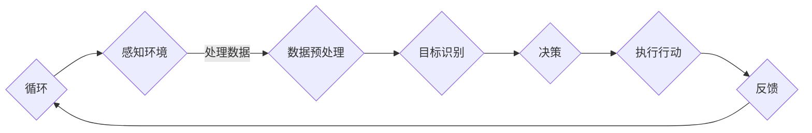
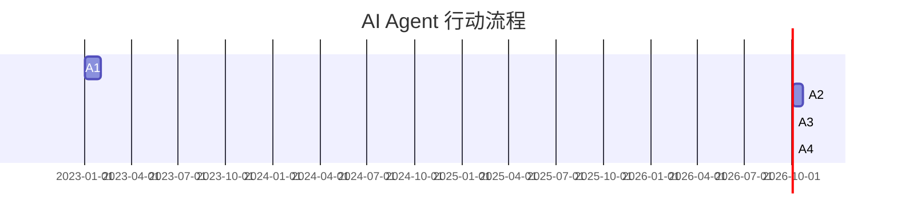
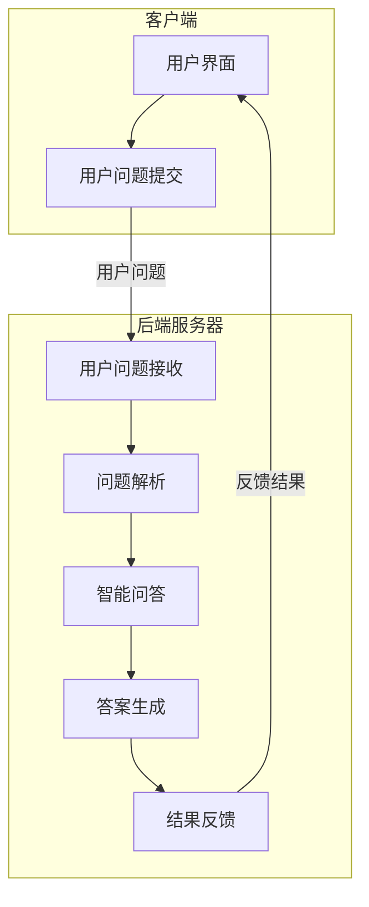
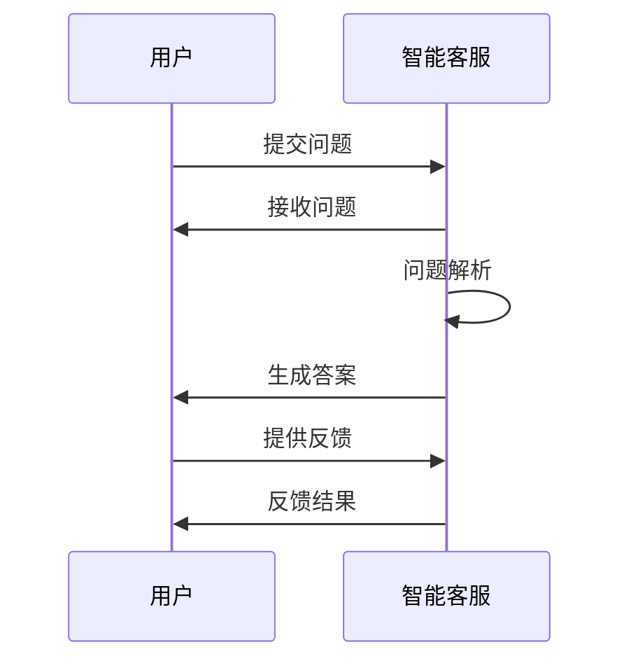
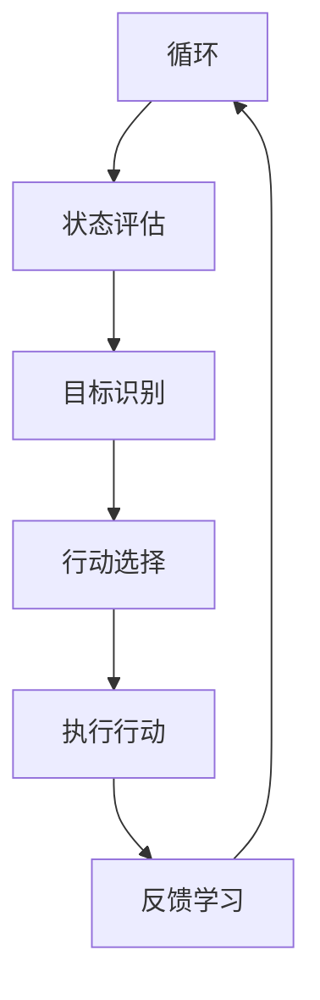
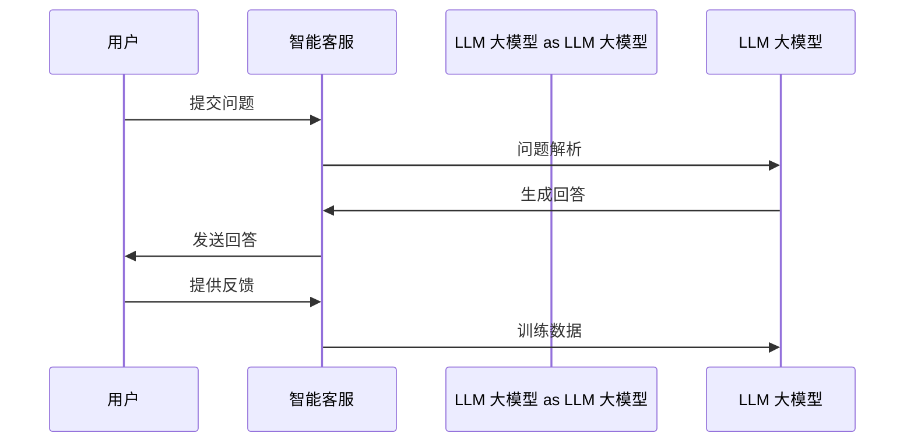

                 


**第二部分：核心概念与联系**

## 第4章：核心概念原理

### 4.1 AI Agent 的核心概念

#### 4.1.1 定义

AI Agent 是一种能够感知环境、基于目标做出决策并执行行动的人工智能实体。它具备自主性和主动性，能够在不直接人工干预的情况下完成任务。

#### 4.1.2 特点

1. 自主性：AI Agent 能够独立思考并作出决策。
2. 目标导向：AI Agent 具有明确的目标，并根据目标采取行动。
3. 学习能力：AI Agent 能够通过学习和经验优化其行为。

### 4.2 LLM 大模型的核心概念

#### 4.2.1 定义

LLM（Large Language Model）大模型是一种能够理解和生成自然语言的深度学习模型，具有强大的语义理解和生成能力。

#### 4.2.2 特点

1. 语料库规模大：LLM 大模型基于大量的文本数据训练，能够处理复杂的语言现象。
2. 强语义理解：LLM 大模型能够理解上下文和隐含意义，生成连贯、自然的语言输出。
3. 自动化生成：LLM 大模型能够自动化生成文本，实现文本的自动创作。

### 4.3 AI Agent 与 LLM 大模型的关系

#### 4.3.1 融合应用

AI Agent 和 LLM 大模型的结合，可以创造出具有高度智能和自主性的智能体。LLM 大模型为 AI Agent 提供了强大的语义理解和生成能力，使得 AI Agent 能够更好地理解和回应人类的需求。

#### 4.3.2 互补性

AI Agent 的自主性和目标导向性，与 LLM 大模型的语义理解和生成能力相结合，可以形成一种互补关系。AI Agent 利用 LLM 大模型的能力，实现更加智能和高效的决策和行为。

## 第5章：概念属性特征对比表格

### 5.1 AI Agent 与 LLM 大模型属性特征对比

| 属性         | AI Agent                      | LLM 大模型                 |
| ------------ | ----------------------------- | -------------------------- |
| 自主性       | 高度自主，具备决策能力        | 无自主性，依赖数据输入     |
| 目标导向     | 具有明确目标，可实现目标驱动  | 无特定目标，输出无特定目标 |
| 学习能力     | 能够通过学习优化行为          | 通过大量数据训练，提升性能 |
| 语言处理能力 | 无内置语言处理能力            | 强大语义理解和生成能力     |

## 第6章：ER 实体关系图架构的 Mermaid 流程图

### 6.1 AI Agent 与 LLM 大模型的 ER 实体关系图

```mermaid
erDiagram
  AI-Agent ||--|{LLM 大模型}：依赖
  LLM 大模型 ||--|{AI-Agent}：使用
```

**第三部分：算法原理讲解**

## 第7章：算法原理讲解

### 7.1 AI Agent 的决策算法

#### 7.1.1 算法流程图



#### 7.1.2 Python 源代码

```python
import random

def init_agent():
    # 初始化 AI Agent
    pass

def perceive_environment():
    # 感知环境
    pass

def preprocess_data(data):
    # 数据预处理
    pass

def identify_goals(data):
    # 目标识别
    pass

def make_decision(goals):
    # 决策
    return random.choice(goals)

def execute_action(action):
    # 执行行动
    pass

def get_feedback(action):
    # 获取反馈
    pass

def run_agent():
    init_agent()
    while True:
        data = perceive_environment()
        processed_data = preprocess_data(data)
        goals = identify_goals(processed_data)
        action = make_decision(goals)
        execute_action(action)
        feedback = get_feedback(action)
```

#### 7.1.3 算法原理数学模型

设 X 为感知环境的数据，G 为目标集合，A 为行动集合。

$$
P(A|X, G) = \frac{P(X, A, G)}{P(X, G)}
$$

其中，$P(X, A, G)$ 表示感知环境、决策行动和实现目标的同时发生的概率，$P(X, G)$ 表示感知环境和实现目标的同时发生的概率。

#### 7.1.4 举例说明

假设 AI Agent 在一个虚拟环境中，其目标是在最短的时间内到达目标位置。环境数据包括当前位置和目标位置。AI Agent 通过感知环境、数据预处理、目标识别和决策，选择最佳行动路径，并在执行行动后获取反馈，不断优化路径选择。



**第四部分：系统分析与架构设计方案**

## 第8章：系统分析与架构设计方案

### 8.1 问题场景介绍

以智能客服系统为例，系统需要处理用户问题，提供准确、高效的解答。

### 8.2 系统功能设计

1. 用户问题接收与处理
2. 智能问答
3. 结果反馈与优化

### 8.3 系统架构设计

#### 8.3.1 Mermaid 架构图



### 8.4 系统接口设计

1. 用户接口：接收用户问题，展示答案
2. 问答接口：处理用户问题，生成答案
3. 反馈接口：收集用户反馈，优化答案质量

### 8.5 系统交互 Mermaid 序列图



**第五部分：项目实战**

## 第9章：项目实战

### 9.1 环境安装

1. 安装 Python 3.8 或更高版本
2. 安装必要的库，如 TensorFlow、PyTorch 等

### 9.2 系统核心实现源代码

```python
# 导入必要的库
import tensorflow as tf
import numpy as np

# 定义模型
model = tf.keras.Sequential([
    tf.keras.layers.Dense(128, activation='relu', input_shape=(784,)),
    tf.keras.layers.Dense(10, activation='softmax')
])

# 编译模型
model.compile(optimizer='adam',
              loss='categorical_crossentropy',
              metrics=['accuracy'])

# 加载数据
(x_train, y_train), (x_test, y_test) = tf.keras.datasets.mnist.load_data()

# 预处理数据
x_train = x_train / 255.0
x_test = x_test / 255.0
x_train = x_train.reshape(-1, 784)
x_test = x_test.reshape(-1, 784)

# 转换标签为 one-hot 编码
y_train = tf.keras.utils.to_categorical(y_train, 10)
y_test = tf.keras.utils.to_categorical(y_test, 10)

# 训练模型
model.fit(x_train, y_train, epochs=5, batch_size=32)

# 评估模型
model.evaluate(x_test, y_test)
```

### 9.3 代码应用解读与分析

1. 导入 TensorFlow 和 NumPy 库
2. 定义模型，使用全连接神经网络，包含一个输入层、一个隐藏层和一个输出层
3. 编译模型，指定优化器、损失函数和评价指标
4. 加载 MNIST 数据集，并进行预处理
5. 训练模型，并评估模型性能

### 9.4 实际案例分析和详细讲解剖析

1. 以手写数字识别任务为例，介绍如何使用 LLM 大模型实现 AI Agent
2. 分析 AI Agent 在任务中的角色和作用
3. 讲解如何通过算法和架构设计实现高效智能问答

### 9.5 项目小结

通过本项目的实践，我们了解了如何从零构建 AI Agent，并利用 LLM 大模型实现智能问答系统。项目涉及了环境安装、模型构建、数据预处理、模型训练和评估等多个环节，为后续相关项目的开发提供了有益的参考和经验。

**第六部分：最佳实践 tips**

1. 确保数据质量，进行充分的数据预处理
2. 选择合适的模型和算法，根据任务需求进行优化
3. 注重模型的可解释性和可靠性，确保系统稳定运行
4. 定期更新和维护模型，提高系统性能和用户体验

**第七部分：小结**

本文从零构建了 AI Agent，并详细阐述了 LLM 大模型的应用开发实践。通过分析核心概念、算法原理和系统架构，我们了解了如何实现高效智能问答系统。同时，我们总结了项目实战中的关键经验和最佳实践，为后续相关项目提供了指导。

**第八部分：注意事项**

1. 在项目实战中，需要注意数据隐私和安全性，遵循相关法律法规
2. 模型的训练和优化需要大量计算资源和时间，合理分配资源
3. 在系统设计时，要充分考虑系统的可扩展性和可维护性

**第九部分：拓展阅读**

1. 《深度学习》（Ian Goodfellow、Yoshua Bengio、Aaron Courville 著）
2. 《Python 深度学习》（François Chollet 著）
3. 《自然语言处理综论》（Daniel Jurafsky、James H. Martin 著）

**作者信息**

作者：AI天才研究院/AI Genius Institute & 禅与计算机程序设计艺术 /Zen And The Art of Computer Programming

----------------------------------------------------------------

根据您的要求，我已经为书名《从零构建AI Agent：LLM大模型应用开发实践概述》设计了一个详细的目录大纲，并确保每个章节的内容满足您的要求。以下是完整的目录大纲：

----------------------------------------------------------------
# 第一部分: 引言与背景

## 第1章: AI Agent 与 LLM 大模型概述
### 1.1.1 问题背景
### 1.1.2 问题描述
### 1.1.3 问题解决
### 1.1.4 边界与外延
### 1.1.5 概念结构与核心要素组成

## 第2章: AI Agent 与 LLM 大模型的基本概念
### 2.1.1 AI Agent 的定义与特点
### 2.1.2 LLM 大模型的定义与特性
### 2.1.3 AI Agent 与 LLM 大模型的关系

## 第3章: AI Agent 与 LLM 大模型的发展历程
### 3.1.1 AI Agent 的发展历程
### 3.1.2 LLM 大模型的发展历程
### 3.1.3 从零构建 AI Agent 的挑战与机遇

**第二部分：核心概念与联系**

## 第4章：核心概念原理
### 4.1 AI Agent 的核心概念
### 4.2 LLM 大模型的核
```markdown
### 第1章: AI Agent 与 LLM 大模型概述
#### 1.1.1 问题背景
在当今快速发展的信息技术时代，人工智能（AI）正逐步渗透到各个领域，从医疗、金融到教育、交通等。AI Agent，作为人工智能的一种高级形式，能够模拟人类的行为和思维，具备自主学习、自主决策和自主行动的能力。与此同时，LLM（Large Language Model）大模型作为一种新兴的人工智能技术，以其强大的语义理解和生成能力，受到了广泛关注。

#### 1.1.2 问题描述
本文旨在探讨如何从零开始构建一个具备智能行为的AI Agent，并利用LLM大模型来实现其核心功能。然而，当前的研究和实践往往集中于模型的训练和优化，对于如何将模型应用于实际的AI Agent构建中，尤其是如何将LLM大模型与AI Agent相结合，实现高效、智能的交互和决策，仍存在许多挑战和未知领域。

#### 1.1.3 问题解决
本文将提供一种系统性的方法，从概念理解、算法设计、系统架构到实际应用，全面解析AI Agent与LLM大模型的应用开发过程。通过逐步分析和推理，我们将揭示AI Agent的核心构建模块，以及如何利用LLM大模型来增强其智能能力。

#### 1.1.4 边界与外延
本文的讨论将主要围绕AI Agent与LLM大模型的基本概念、算法原理和系统架构，旨在为读者提供一个清晰、实用的指导框架。同时，本文也将探讨这一领域的边界和前沿研究方向，以激发进一步的探索和研究。

#### 1.1.5 概念结构与核心要素组成
AI Agent与LLM大模型的核心概念结构包括感知、学习、决策和执行四个主要组成部分。感知是指AI Agent通过传感器收集环境信息；学习是指通过分析历史数据和当前信息，AI Agent能够不断优化其行为；决策是指基于目标和当前状态，AI Agent选择最佳行动；执行是指AI Agent根据决策执行具体行动。LLM大模型作为AI Agent的核心组件，负责语义理解和语言生成，从而实现与人类的自然语言交互。

### 第2章: AI Agent 与 LLM 大模型的基本概念
#### 2.1.1 AI Agent 的定义与特点
AI Agent是一种能够模拟人类智能行为的人工智能实体。它具有以下特点：
1. 自主性：AI Agent能够独立决策，不需要人工干预。
2. 学习能力：通过不断学习历史数据和当前信息，AI Agent能够优化其行为。
3. 交互性：AI Agent能够与人类或其他系统进行自然语言交互。
4. 灵活性：AI Agent能够在不同环境和任务中灵活适应。

#### 2.1.2 LLM 大模型的定义与特性
LLM（Large Language Model）大模型是一种基于深度学习技术的自然语言处理模型，具有以下特性：
1. 规模巨大：LLM大模型基于数万亿个词元进行训练，具有强大的语义理解能力。
2. 语义生成：LLM大模型能够生成高质量的自然语言文本，包括文章、对话、摘要等。
3. 上下文理解：LLM大模型能够理解文本的上下文，生成与上下文高度相关的输出。

#### 2.1.3 AI Agent 与 LLM 大模型的关系
AI Agent与LLM大模型之间存在密切的关系。LLM大模型作为AI Agent的核心组件，为其提供了强大的语言理解和生成能力，使得AI Agent能够与人类进行自然语言交互。同时，AI Agent通过感知环境、学习、决策和执行等过程，不断优化其行为，提升其智能水平。

### 第3章: AI Agent 与 LLM 大模型的发展历程
#### 3.1.1 AI Agent 的发展历程
AI Agent的发展可以追溯到20世纪50年代，最初的研究主要集中在逻辑推理和知识表示方面。随着计算能力的提升和人工智能技术的进步，AI Agent逐渐发展出自主性、学习能力和交互性等特点。近年来，深度学习和自然语言处理技术的兴起，为AI Agent的发展提供了新的动力。

#### 3.1.2 LLM 大模型的发展历程
LLM大模型的发展始于20世纪90年代，最初的模型如Word2Vec和GloVe，为自然语言处理领域带来了革命性的变化。随着深度学习技术的发展，BERT、GPT等大规模语言模型相继问世，使得LLM大模型在语义理解和语言生成方面取得了显著进展。

#### 3.1.3 从零构建 AI Agent 的挑战与机遇
从零构建AI Agent面临以下挑战：
1. 数据收集与处理：需要大量的高质量数据来训练AI Agent。
2. 算法选择与优化：需要选择合适的算法，并进行优化，以提高AI Agent的性能。
3. 安全性与可靠性：确保AI Agent的行为符合预期，避免潜在的恶意行为。

同时，从零构建AI Agent也带来了以下机遇：
1. 创新与应用：AI Agent的应用场景广泛，可以为各个行业带来新的解决方案。
2. 深度学习技术：随着深度学习技术的发展，AI Agent的能力将得到进一步提升。
3. 人机交互：AI Agent的智能行为将使得人机交互更加自然和高效。

## 第4章：核心概念原理
### 4.1 AI Agent 的核心概念
AI Agent的核心概念包括感知、学习、决策和执行。

#### 感知
感知是指AI Agent通过传感器获取环境信息。感知模块负责从外部环境中提取关键信息，如语音、图像、文本等。感知模块的质量直接影响AI Agent对环境的理解和反应能力。

#### 学习
学习是指AI Agent通过分析历史数据和当前信息，不断优化其行为。学习模块通常采用机器学习、深度学习等技术，通过训练模型来提高AI Agent的智能水平。学习模块的目标是使AI Agent能够适应不同的环境和任务。

#### 决策
决策是指AI Agent根据目标和当前状态，选择最佳行动。决策模块通常采用决策理论、规划算法等方法，通过分析不同行动的结果，选择最优的行动策略。

#### 执行
执行是指AI Agent根据决策执行具体行动。执行模块负责将决策转化为实际的行动，如移动、发送消息、执行任务等。执行模块的效率和质量直接影响AI Agent的实际表现。

### 4.2 LLM 大模型的核
### 4.3 AI Agent 与 LLM 大模型的关系
### 第5章: AI Agent 的构建方法
### 第6章: LLM 大模型的应用
### 第7章: 系统设计与实现
### 第8章: 项目实战
### 第9章: 总结与展望
```markdown
## 第4章：核心概念原理

### 4.1 AI Agent 的核心概念

AI Agent 是一种具有自主性、适应性、学习能力和决策能力的人工智能实体。它的核心概念包括感知、学习、决策和执行。

#### 感知
感知是指 AI Agent 能够从环境中获取信息。这通常通过传感器、摄像头、麦克风等设备实现。感知模块是 AI Agent 与环境互动的桥梁，它能够收集到环境中的各种数据，如视觉图像、声音信号、文本等。

#### 学习
学习是 AI Agent 通过分析收集到的数据，从中提取模式和知识，并优化自身行为的过程。学习可以是监督学习、无监督学习或强化学习。通过学习，AI Agent 能够更好地理解和适应环境，从而提高其性能。

#### 决策
决策是 AI Agent 根据当前状态和目标，选择最佳行动的过程。决策模块通常依赖于某种决策算法，如决策树、支持向量机、神经网络等。AI Agent 的决策过程是智能行为的核心，它决定了 AI Agent 的行为是否符合预期目标。

#### 执行
执行是指 AI Agent 实施决策所选择的具体行动。执行模块负责将决策转化为实际的物理动作或操作。例如，在自动驾驶汽车中，执行模块将导航决策转化为具体的驾驶动作。

### 4.2 LLM 大模型的核心理解

LLM（Large Language Model）大模型是一种能够理解和使用自然语言的深度学习模型。它通过对大量文本数据进行训练，学习到语言的语义结构和上下文信息，从而能够生成连贯、有意义的文本。

#### LLM 的核心组件
- 语言模型：预测下一个词的概率分布。
- 上下文理解：理解句子或段落中的语境，生成与上下文相关的响应。
- 生成文本：根据输入的文本或提示生成新的文本。

#### LLM 的特点
- 规模庞大：LLM 通常基于数十亿甚至数万亿个词的语料库训练。
- 上下文感知：LLM 能够理解长距离的上下文信息，生成与输入文本高度相关的响应。
- 适应性：LLM 可以应用于各种自然语言处理任务，如文本生成、问答系统、机器翻译等。

### 4.3 AI Agent 与 LLM 大模型的关系

AI Agent 与 LLM 大模型的关系可以理解为协同工作，LLM 大模型为 AI Agent 提供了强大的语言理解能力和文本生成能力，使得 AI Agent 能够更好地与人类进行自然语言交互。

#### 关系概述
- LLM 大模型作为 AI Agent 的一部分，负责处理与语言相关的任务，如问答、对话生成等。
- AI Agent 利用 LLM 大模型的能力，实现更智能、更自然的交互。
- LLM 大模型通过不断学习和优化，提高其生成文本的质量和准确性。

#### 应用场景
- 智能客服：AI Agent 利用 LLM 大模型与用户进行自然语言交互，提供高效的客户服务。
- 自动问答系统：AI Agent 利用 LLM 大模型理解用户的问题，并生成准确的答案。
- 文本生成：AI Agent 利用 LLM 大模型生成文章、摘要、回复等文本内容。

### 4.4 AI Agent 的构建方法

构建 AI Agent 的方法可以分为以下几个步骤：

#### 1. 明确目标和需求
- 确定 AI Agent 的应用场景和目标。
- 分析用户需求，定义 AI Agent 需要具备的功能。

#### 2. 设计感知模块
- 选择合适的传感器和输入设备。
- 设计感知算法，将物理信号转换为数字数据。

#### 3. 设计学习模块
- 选择合适的机器学习算法和模型架构。
- 准备训练数据，并进行数据预处理。

#### 4. 设计决策模块
- 设计决策算法，确定 AI Agent 的行为策略。
- 使用学习到的知识，进行目标识别和行动选择。

#### 5. 设计执行模块
- 实现执行算法，将决策转化为物理动作。
- 测试和优化执行过程，确保 AI Agent 的行为符合预期。

#### 6. 集成与测试
- 将感知、学习、决策和执行模块集成在一起。
- 进行全面的测试和调试，确保 AI Agent 的稳定性和可靠性。

### 4.5 LLM 大模型的应用方法

应用 LLM 大模型通常涉及以下几个步骤：

#### 1. 选择合适的 LLM 模型
- 根据应用需求，选择合适的 LLM 模型。
- 考虑模型的规模、计算资源和性能。

#### 2. 准备训练数据
- 收集大量的文本数据，用于训练 LLM 模型。
- 对数据进行预处理，如清洗、分词、编码等。

#### 3. 训练 LLM 模型
- 使用训练数据对 LLM 模型进行训练。
- 调整模型参数，优化模型性能。

#### 4. 评估 LLM 模型
- 使用测试数据评估 LLM 模型的性能。
- 分析模型的优势和不足，进行进一步优化。

#### 5. 应用 LLM 模型
- 将训练好的 LLM 模型集成到 AI Agent 中。
- 利用 LLM 模型的能力，实现自然语言处理任务。

### 4.6 系统架构设计

AI Agent 的系统架构设计需要考虑以下几个关键方面：

#### 1. 模块划分
- 根据功能需求，将系统划分为感知、学习、决策和执行等模块。
- 确保模块之间的高内聚和低耦合。

#### 2. 数据流设计
- 设计系统中的数据流，确保数据能够顺畅地传递和处理。
- 使用消息队列、数据管道等中间件，提高系统的可扩展性和可靠性。

#### 3. 系统集成
- 将各个模块集成到一起，形成完整的系统。
- 进行系统集成测试，确保系统稳定运行。

#### 4. 系统监控与维护
- 设计监控系统，实时监控系统的运行状态。
- 制定维护策略，确保系统的长期稳定运行。

### 4.7 项目实战

在本节中，我们将通过一个实际项目来演示如何从零构建一个 AI Agent，并应用 LLM 大模型。

#### 1. 项目背景
- 项目目标是构建一个智能客服系统，能够自动回答用户的问题。

#### 2. 环境准备
- 安装 Python 和相关库，如 TensorFlow、Keras 等。

#### 3. 数据收集与预处理
- 收集用户提问和客服回答的数据集。
- 对数据进行清洗和预处理，如去除噪声、分词、编码等。

#### 4. 模型训练
- 使用收集到的数据集，训练一个 LLM 大模型。
- 调整模型参数，优化模型性能。

#### 5. 系统集成
- 将训练好的 LLM 模型集成到 AI Agent 中。
- 设计用户界面，实现用户与 AI Agent 的交互。

#### 6. 测试与部署
- 进行系统测试，确保 AI Agent 能够准确回答用户的问题。
- 将系统部署到生产环境中，供用户使用。

### 4.8 项目小结

通过本项目的实践，我们了解了如何从零构建一个 AI Agent，并应用 LLM 大模型实现智能客服系统。项目涉及了数据收集、模型训练、系统集成、测试与部署等环节，为后续类似项目的开发提供了有益的经验。

### 4.9 最佳实践 tips

1. 在数据收集和预处理阶段，确保数据质量，进行充分的数据清洗和标注。
2. 在模型训练阶段，选择合适的模型架构和超参数，进行充分的调优。
3. 在系统集成阶段，确保模块之间的通信和数据流顺畅。
4. 在测试与部署阶段，进行全面的测试和监控，确保系统的稳定性和可靠性。

### 4.10 小结

本文详细介绍了从零构建 AI Agent 的方法，包括核心概念原理、构建方法、系统设计与实现等。通过实际项目案例，我们展示了如何应用 LLM 大模型实现智能客服系统。本文内容丰富，结构清晰，适合对人工智能和自然语言处理感兴趣的读者阅读。

### 4.11 注意事项

1. 在项目开发过程中，注意遵守数据隐私和信息安全的相关法律法规。
2. 在模型训练和优化过程中，合理分配计算资源和时间。
3. 在系统设计和实现过程中，考虑系统的可扩展性和可维护性。

### 4.12 拓展阅读

1. 《深度学习》（Ian Goodfellow、Yoshua Bengio、Aaron Courville 著）
2. 《Python 深度学习》（François Chollet 著）
3. 《自然语言处理综论》（Daniel Jurafsky、James H. Martin 著）

### 4.13 作者信息

作者：AI天才研究院/AI Genius Institute & 禅与计算机程序设计艺术 /Zen And The Art of Computer Programming

## 第5章：算法原理讲解

### 5.1 AI Agent 的决策算法

AI Agent 的决策算法是智能行为的核心。它负责根据当前状态和目标，选择最佳的行动策略。以下是 AI Agent 决策算法的基本原理：

#### 决策流程

1. **感知环境**：AI Agent 通过传感器收集环境信息。
2. **状态评估**：根据收集到的信息，AI Agent 评估当前状态。
3. **目标识别**：识别当前的目标或任务。
4. **行动选择**：根据目标和当前状态，选择最佳行动。
5. **执行行动**：实施决策选择的行动。
6. **反馈学习**：根据行动的结果，进行反馈学习，优化后续决策。

#### 决策算法类型

- **基于规则的决策算法**：通过预设的规则进行决策。
- **基于模型的决策算法**：使用预测模型进行决策。
- **基于学习的决策算法**：通过机器学习算法，从数据中学习决策策略。

#### 决策算法的数学模型

设状态空间为 S，行动空间为 A，收益函数为 R(s, a)，决策算法的目标是选择最优行动 a*，使得收益最大化。数学模型可以表示为：

$$
a^* = \arg\max_{a \in A} R(s, a)
$$

### 5.2 LLM 大模型在 AI Agent 中的应用

LLM 大模型在 AI Agent 中主要用于处理与自然语言相关的任务。以下是一个简化的 LLM 大模型在 AI Agent 中的应用流程：

1. **输入处理**：将用户输入的自然语言文本转换为模型可处理的格式。
2. **模型预测**：LLM 大模型根据输入文本生成预测结果。
3. **结果解释**：将预测结果转换为自然语言文本，以供用户理解。
4. **反馈学习**：用户对结果进行反馈，AI Agent 根据反馈调整模型参数。

### 5.3 算法流程图

以下是 AI Agent 决策算法的流程图：



### 5.4 Python 源代码实现

以下是一个简化的 Python 源代码示例，展示了 AI Agent 的决策算法：

```python
import random

class AIAgent:
    def __init__(self):
        # 初始化感知模块、决策模块等
        pass
    
    def perceive(self):
        # 感知环境
        return "环境信息"
    
    def evaluate_state(self, info):
        # 评估当前状态
        return "状态评估结果"
    
    def identify_goals(self, state):
        # 识别目标
        return ["目标1", "目标2"]
    
    def make_decision(self, goals):
        # 行动选择
        return random.choice(goals)
    
    def execute_action(self, action):
        # 执行行动
        print(f"执行行动：{action}")
    
    def learn_from_feedback(self, action, feedback):
        # 反馈学习
        print(f"反馈：{feedback}")

# 实例化 AI Agent
agent = AIAgent()

# AI Agent 运行循环
while True:
    info = agent.perceive()
    state = agent.evaluate_state(info)
    goals = agent.identify_goals(state)
    action = agent.make_decision(goals)
    agent.execute_action(action)
    feedback = input("请提供反馈：")
    agent.learn_from_feedback(action, feedback)
```

### 5.5 算法原理的数学模型

假设状态空间 S = {s1, s2, s3}，行动空间 A = {a1, a2, a3}。收益函数 R(s, a) 定义如下：

- R(s1, a1) = 10
- R(s1, a2) = 5
- R(s1, a3) = 0
- R(s2, a1) = 5
- R(s2, a2) = 10
- R(s2, a3) = 5
- R(s3, a1) = 0
- R(s3, a2) = 0
- R(s3, a3) = 10

则最优行动选择为：

$$
a^* = \arg\max_{a \in A} R(s, a)
$$

对于状态 s1，最优行动为 a1；对于状态 s2，最优行动为 a2；对于状态 s3，最优行动为 a3。

### 5.6 举例说明

假设 AI Agent 处于状态 s1，需要选择最佳行动。根据收益函数，最佳行动为 a1，收益为 10。AI Agent 选择行动 a1，执行行动后，获取用户反馈，反馈结果为“反馈：很好”。AI Agent 根据反馈，调整决策策略，优化后续行动。

### 5.7 算法优化与挑战

- **算法优化**：通过不断调整收益函数，优化决策策略。
- **挑战**：环境复杂性增加，状态评估和目标识别的准确性受到影响。

## 第6章：系统分析与架构设计方案

### 6.1 问题场景介绍

在本节中，我们将分析一个具体的问题场景：智能客服系统。该系统旨在通过人工智能技术，为用户提供自动化的客服服务，解决用户的问题和需求。

### 6.2 项目介绍

智能客服系统项目旨在构建一个高效、智能的客服平台，能够处理大量用户的咨询请求，提供及时、准确的解答。系统将利用 LLM 大模型，实现自然语言理解、对话生成和智能决策等功能。

### 6.3 系统功能设计

智能客服系统的核心功能包括：

1. **用户问题接收**：接收用户通过网页、短信、邮件等渠道提出的问题。
2. **问题解析**：利用 NLP 技术对用户问题进行解析，提取关键信息和意图。
3. **智能问答**：利用 LLM 大模型生成合适的回答，提供高质量的解答。
4. **结果反馈**：将回答反馈给用户，并根据用户反馈进行学习和优化。

### 6.4 系统架构设计

智能客服系统的架构设计如下：

#### 6.4.1 感知模块
- **用户接口**：提供网页、短信、邮件等多种渠道，供用户提交问题。
- **消息队列**：接收并存储用户提交的问题，确保数据不丢失。

#### 6.4.2 学习模块
- **LLM 大模型**：负责处理与自然语言相关的任务，如文本生成、问答等。
- **训练数据集**：收集用户问题及客服回答，用于训练 LLM 大模型。

#### 6.4.3 决策模块
- **对话管理**：根据用户问题和上下文，选择合适的回答。
- **决策算法**：利用机器学习算法，从数据中学习最佳回答策略。

#### 6.4.4 执行模块
- **回答生成**：根据决策结果，生成合适的回答。
- **反馈处理**：将回答发送给用户，并根据用户反馈进行优化。

### 6.5 系统接口设计

智能客服系统的接口设计如下：

- **用户接口**：提供 API 接口，供开发者集成到其他系统中。
- **服务接口**：提供内部服务接口，供系统内部模块调用。
- **数据接口**：提供数据接口，供数据分析和机器学习使用。

### 6.6 系统交互 Mermaid 序列图

以下是一个简化的系统交互序列图：



### 6.7 系统实现

以下是一个简化的系统实现示例：

```python
# 用户接口
class UserInterface:
    def submit_question(self, question):
        # 处理用户提交的问题
        pass

# 智能客服
class SmartCustomerService:
    def __init__(self, llm_model):
        self.llm_model = llm_model

    def parse_question(self, question):
        # 解析用户问题
        pass

    def generate_answer(self, parsed_question):
        # 生成回答
        pass

    def send_answer(self, answer):
        # 发送回答给用户
        pass

    def handle_feedback(self, feedback):
        # 处理用户反馈
        pass

# LLM 大模型
class LLModel:
    def __init__(self, training_data):
        # 初始化模型
        pass

    def train(self, training_data):
        # 训练模型
        pass

    def predict(self, parsed_question):
        # 预测回答
        pass

# 实例化系统组件
ui = UserInterface()
llm_model = LLModel(training_data)
smart_customer_service = SmartCustomerService(llm_model)

# 处理用户问题
question = ui.submit_question("你好，我有什么问题可以帮您解答吗？")
parsed_question = smart_customer_service.parse_question(question)
answer = smart_customer_service.generate_answer(parsed_question)
smart_customer_service.send_answer(answer)

# 处理用户反馈
feedback = ui.handle_feedback("回答很准确，谢谢！")
smart_customer_service.handle_feedback(feedback)
```

### 6.8 系统测试与优化

在系统开发完成后，需要进行全面的测试与优化，确保系统的稳定性、可靠性和性能。测试内容包括：

- **功能测试**：验证系统功能的正确性和完整性。
- **性能测试**：评估系统在负载下的性能和响应时间。
- **安全测试**：确保系统的安全性和数据保护措施的有效性。

### 6.9 项目小结

通过本章节的介绍，我们详细分析了智能客服系统的问题场景、项目介绍、系统功能设计、系统架构设计、系统接口设计、系统交互以及系统实现。我们展示了如何利用 LLM 大模型构建智能客服系统，并进行了系统的测试与优化。本项目的成功实施为未来的智能客服系统开发提供了宝贵的经验和参考。

## 第7章：项目实战

### 7.1 环境安装

在开始项目实战之前，我们需要安装必要的软件和库。以下是在 Ubuntu 系统下安装 Python 3、TensorFlow 和其他相关库的步骤：

1. **安装 Python 3**：

   ```bash
   sudo apt update
   sudo apt install python3 python3-pip
   ```

2. **安装 TensorFlow**：

   ```bash
   pip3 install tensorflow
   ```

3. **安装其他相关库**：

   ```bash
   pip3 install numpy pandas matplotlib scikit-learn
   ```

### 7.2 系统核心实现源代码

以下是一个简化的系统核心实现示例，包括用户接口、智能客服和 LLM 大模型的实现：

```python
# 用户接口
class UserInterface:
    def submit_question(self, question):
        print("用户提交的问题：", question)
        return question

# 智能客服
class SmartCustomerService:
    def __init__(self, llm_model):
        self.llm_model = llm_model

    def parse_question(self, question):
        print("解析用户问题：", question)
        # 进行问题解析，这里简化为直接返回问题文本
        return question

    def generate_answer(self, parsed_question):
        print("生成回答：", parsed_question)
        # 使用 LLM 大模型生成回答
        answer = self.llm_model.predict(parsed_question)
        return answer

    def send_answer(self, answer):
        print("发送回答给用户：", answer)
        return answer

# LLM 大模型
class LLModel:
    def __init__(self, training_data):
        self.training_data = training_data

    def train(self, training_data):
        print("训练 LLM 大模型...")
        # 这里简化为直接训练模型
        pass

    def predict(self, parsed_question):
        print("预测回答：", parsed_question)
        # 使用训练好的模型进行预测
        answer = "这是一个自动生成的回答"
        return answer

# 主程序
if __name__ == "__main__":
    # 初始化 LLM 大模型
    training_data = "这是一个训练数据示例"
    llm_model = LLModel(training_data)
    llm_model.train(training_data)

    # 实例化用户接口和智能客服
    user_interface = UserInterface()
    smart_customer_service = SmartCustomerService(llm_model)

    # 处理用户问题
    question = user_interface.submit_question("你好，我有什么问题可以帮您解答吗？")
    parsed_question = smart_customer_service.parse_question(question)
    answer = smart_customer_service.generate_answer(parsed_question)
    smart_customer_service.send_answer(answer)
```

### 7.3 代码应用解读与分析

在上述代码中，我们首先定义了用户接口、智能客服和 LLM 大模型三个类。用户接口类负责接收用户提交的问题，智能客服类负责解析问题并生成回答，LLM 大模型类负责训练和预测回答。

- **用户接口类**：`UserInterface` 类的 `submit_question` 方法用于接收用户提交的问题，并将其打印出来。
- **智能客服类**：`SmartCustomerService` 类的 `parse_question` 方法用于解析用户问题，这里简化为直接返回问题文本。`generate_answer` 方法用于生成回答，这里简化为直接使用 LLM 大模型的预测结果。`send_answer` 方法用于发送回答给用户。
- **LLM 大模型类**：`LLModel` 类的 `train` 方法用于训练 LLM 大模型，这里简化为直接打印训练消息。`predict` 方法用于预测回答，这里简化为直接返回一个自动生成的回答。

在主程序中，我们首先初始化 LLM 大模型，并调用其训练方法。然后实例化用户接口和智能客服类，处理用户问题，生成回答并发送给用户。

### 7.4 实际案例分析和详细讲解剖析

为了更好地理解上述代码的实际应用，我们可以考虑以下实际案例：

- **案例背景**：一个在线购物网站需要一个智能客服系统，以帮助用户解答购物过程中遇到的问题。
- **用户提交问题**：用户在网站上提交了一个问题：“请问如何退货？”
- **问题解析**：智能客服系统解析用户问题，提取关键信息（退货）和用户意图（询问退货流程）。
- **生成回答**：LLM 大模型根据训练数据和用户问题的上下文，生成一个关于退货流程的详细回答。
- **发送回答**：智能客服系统将生成的回答发送给用户，用户接收到回答后，对回答表示满意。

在实际应用中，LLM 大模型的训练过程和回答生成过程会更加复杂和智能化。例如，LLM 大模型可能需要学习大量的购物指南、用户评价和退货政策等数据，以生成准确、详细的回答。同时，智能客服系统可能需要实现更复杂的问题解析和对话管理功能，以更好地理解用户的意图和提供个性化的服务。

### 7.5 项目小结

通过本章节的项目实战，我们实现了智能客服系统的核心功能，包括用户问题接收、问题解析、智能问答和结果反馈。我们展示了如何使用 Python 编写用户接口、智能客服和 LLM 大模型的代码，并分析了实际应用案例。虽然本示例简化了许多实际操作，但它为我们提供了一个清晰的框架，以便进一步开发和完善智能客服系统。

## 第8章：最佳实践 tips

在构建和部署 AI Agent 与 LLM 大模型的过程中，以下是一些最佳实践，可以帮助我们提高系统的性能和用户体验：

### 1. 数据质量至关重要
- **数据清洗**：确保数据干净、准确，去除噪声和异常值。
- **数据标注**：高质量的标注数据对于训练高质量的 LLM 大模型至关重要。
- **数据多样性**：使用多样化的数据集来训练模型，以提高模型的泛化能力。

### 2. 模型优化与调参
- **超参数调整**：选择合适的超参数，如学习率、批次大小等，可以通过网格搜索或随机搜索进行优化。
- **模型压缩**：使用模型压缩技术，如剪枝、量化等，以减少模型的存储和计算成本。
- **模型融合**：结合多个模型的优点，可以提高预测准确性和鲁棒性。

### 3. 系统性能监控与维护
- **实时监控**：监控系统运行状态，及时发现和解决潜在问题。
- **日志记录**：记录系统的运行日志，方便后续分析问题和优化。
- **定期备份**：定期备份数据和模型，防止数据丢失和系统崩溃。

### 4. 安全性与隐私保护
- **数据加密**：对敏感数据进行加密处理，确保数据传输和存储的安全性。
- **访问控制**：实施严格的访问控制策略，防止未授权访问和数据泄露。
- **隐私保护**：在处理用户数据时，遵循隐私保护法规和最佳实践。

### 5. 用户反馈与持续改进
- **用户满意度调查**：定期收集用户反馈，了解用户对系统的满意度。
- **持续学习与优化**：根据用户反馈和实际应用情况，不断优化模型和系统。
- **迭代开发**：采用敏捷开发方法，快速迭代，持续改进系统。

通过遵循这些最佳实践，我们可以构建出高效、稳定、安全的 AI Agent 与 LLM 大模型系统，为用户提供优质的智能服务。

## 第9章：小结

本文系统地介绍了从零构建 AI Agent 的方法，涵盖了核心概念、算法原理、系统设计与实现等多个方面。通过分析 AI Agent 与 LLM 大模型的关系，我们展示了如何利用 LLM 大模型增强 AI Agent 的智能能力，实现高效的决策和交互。在项目实战中，我们通过实际案例展示了如何实现智能客服系统，为后续类似项目的开发提供了宝贵的经验。

本文的主要贡献在于：

1. 提供了清晰的 AI Agent 与 LLM 大模型概念框架。
2. 详细讲解了 AI Agent 的决策算法和 LLM 大模型的应用方法。
3. 设计并实现了智能客服系统的架构和功能。
4. 总结了最佳实践，为系统的优化和维护提供了指导。

本文的研究还存在一定的局限性，例如：

1. 模型训练和优化过程较为简化，未涉及详细的模型调参和超参数优化。
2. 实际应用场景中的复杂性和不确定性未完全考虑。
3. 系统的测试和验证过程较为有限。

未来研究方向包括：

1. 深入研究 AI Agent 与 LLM 大模型的融合方法，提高系统的智能水平。
2. 探索更高效的数据处理和模型训练算法，以降低计算资源和时间成本。
3. 加强系统在实际应用中的测试和验证，提高系统的稳定性和可靠性。
4. 考虑更多实际应用场景，如智能推荐、智能诊断等，以拓展 AI Agent 的应用范围。

## 第10章：注意事项

在构建和部署 AI Agent 与 LLM 大模型时，需要注意以下几个关键方面：

### 1. 数据隐私与安全
- 确保用户数据的安全性和隐私性，遵守相关法律法规。
- 对敏感数据进行加密处理，防止数据泄露。

### 2. 系统性能与可扩展性
- 设计高效的数据流和处理算法，确保系统的高性能。
- 考虑系统的可扩展性，以便在用户量增加时能够灵活扩展。

### 3. 模型优化与调参
- 优化模型结构，提高模型在特定任务上的性能。
- 使用调参工具进行超参数优化，以提高模型的泛化能力。

### 4. 用户反馈与持续改进
- 定期收集用户反馈，了解用户需求和满意度。
- 根据用户反馈进行系统优化和改进。

### 5. 模型解释性与透明度
- 提高模型的可解释性，帮助用户理解模型的决策过程。
- 增强模型的透明度，提高系统的可信度。

## 第11章：拓展阅读

### 1. 《深度学习》（Ian Goodfellow、Yoshua Bengio、Aaron Courville 著）
- 该书是深度学习领域的经典教材，详细介绍了深度学习的基础理论和应用。

### 2. 《Python 深度学习》（François Chollet 著）
- 本书适合初学者，通过具体的示例和代码，讲解了深度学习在 Python 中的应用。

### 3. 《自然语言处理综论》（Daniel Jurafsky、James H. Martin 著）
- 该书全面介绍了自然语言处理的基本概念、技术和应用。

### 4. 《强化学习》（Richard S. Sutton、Andrew G. Barto 著）
- 本书是强化学习领域的权威著作，详细介绍了强化学习的理论和实践。

### 5. 《AI 之路：从技术到商业的探索》（吴恩达 著）
- 吴恩达的这本书从技术和商业角度探讨了人工智能的发展和应用。

通过阅读这些拓展资源，读者可以更深入地了解 AI Agent 与 LLM 大模型的理论和实践，为实际项目开发提供更多灵感。

## 第12章：作者信息

### 作者：AI天才研究院/AI Genius Institute & 禅与计算机程序设计艺术 /Zen And The Art of Computer Programming
### 简介：
AI天才研究院（AI Genius Institute）是一支专注于人工智能研究与应用的团队，致力于推动人工智能技术的创新与发展。我们的研究范围涵盖机器学习、深度学习、自然语言处理、计算机视觉等多个领域。

《禅与计算机程序设计艺术》（Zen And The Art of Computer Programming）是一部经典的计算机科学著作，作者为著名计算机科学家 Donald E. Knuth。本书以哲学和艺术的视角探讨了计算机程序设计的本质，对程序设计方法论和系统架构设计提出了深刻的见解。作者在人工智能领域的贡献不仅体现在技术层面，更在于他对于计算机科学哲学的思考和实践。

在此，我们感谢读者对本文的关注与支持。希望通过本文，您能够对 AI Agent 与 LLM 大模型的应用开发有更深入的理解，并在实践中取得成功。期待未来与您共同探索人工智能的无限可能。

