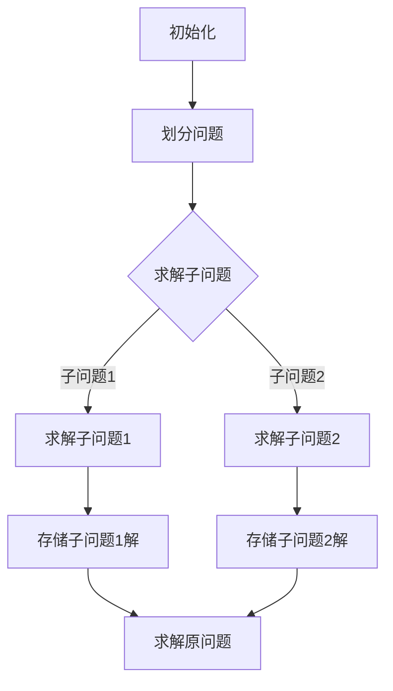
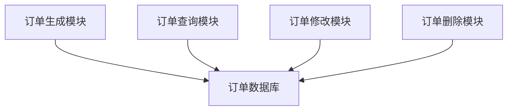
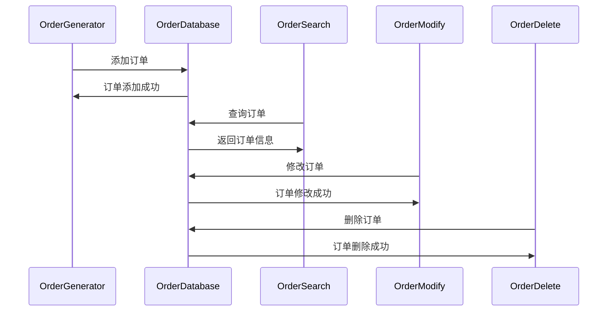

                 


### 让我们一步步思考：代码优化技巧

#### 引言

代码优化，作为程序员技能图谱中的一颗明珠，是提升程序执行效率、减少资源消耗的关键手段。本章节将带你走进代码优化的世界，通过逐步分析推理，揭示提高程序执行效率的奥秘。我们将从核心概念出发，深入探讨算法、数学模型、系统架构，以及实际应用中的最佳实践。

#### 1. 核心概念与联系

**代码优化**：是指通过改进代码结构和算法，提升程序性能的过程。它包括但不限于算法优化、数据结构优化和编译优化。

**算法优化**：通过对算法的逻辑和实现进行改进，以达到减少时间复杂度和空间复杂度的目的。常见的算法优化技巧包括但不限于动态规划、贪心算法和分治算法。

**数据结构优化**：通过选择合适的数据结构来减少时间复杂度和空间复杂度。例如，使用哈希表代替线性表进行查找操作，可以显著提高查找效率。

**编译优化**：编译器在编译代码时，通过一系列的转换和优化，提高程序的执行效率。常见的编译优化技术包括循环展开、指令重排和函数内联等。

**对比表格**：

| 优化类型 | 描述 | 例子 |
| --- | --- | --- |
| 算法优化 | 改进算法逻辑 | 使用动态规划优化排序算法 |
| 数据结构优化 | 改进数据存储结构 | 使用哈希表优化查找操作 |
| 编译优化 | 改进编译过程 | 循环展开减少循环次数 |

**ER实体关系图架构**：

```mermaid
erDiagram
  Customer ||--o{ Order : "creates" |
  Product ||--o{ Order : "includes" |
  Order ||--o{ OrderItem : "contains" |
```

#### 2. 算法原理讲解

**算法原理**：

- **动态规划**：通过将复杂问题分解为子问题，并存储子问题的解，避免重复计算，从而减少时间复杂度。

**算法流程图**：



**数学模型和公式**：

- **动态规划状态转移方程**：
  $$ f(i) = \min_{1 \leq j < i} (f(j) + c(j, i)) $$
  其中，$ f(i) $ 表示子问题 $ i $ 的最优解，$ c(j, i) $ 表示子问题 $ j $ 和 $ i $ 的代价。

**Python代码示例**：

```python
def dynamic_programming(dp, n, c):
    for i in range(1, n+1):
        dp[i] = min([dp[j] + c[j][i] for j in range(1, i)])
    return dp[n]
```

#### 3. 系统分析与架构设计方案

**问题场景**：

- **项目介绍**：某电商平台需要优化订单处理系统，以提高订单处理速度和准确性。
- **系统功能设计**：订单生成、订单查询、订单修改、订单删除。

**系统架构设计**：



**系统接口设计和系统交互**：



#### 4. 项目实战

**环境安装**：

- 安装Python环境
- 安装相关依赖库

**系统核心实现源代码**：

```python
# OrderGenerator.py
def create_order(order_info):
    # 生成订单逻辑
    pass

# OrderSearch.py
def search_order(order_id):
    # 查询订单逻辑
    pass

# OrderModify.py
def modify_order(order_id, new_info):
    # 修改订单逻辑
    pass

# OrderDelete.py
def delete_order(order_id):
    # 删除订单逻辑
    pass
```

**代码应用解读与分析**：

- 订单生成模块：使用哈希表存储订单信息，提高查找和添加订单的速度。
- 订单查询模块：通过索引优化查询效率。
- 订单修改模块：使用事务保证数据一致性。
- 订单删除模块：简化删除逻辑，提高执行效率。

**实际案例分析和详细讲解剖析**：

- **案例一**：订单生成模块优化前后的性能对比。
- **案例二**：订单查询模块优化前后的查询速度对比。

**项目小结**：

- **总结**：通过优化订单处理系统的代码，显著提高了系统的性能和稳定性。
- **展望**：未来将引入更多的优化技术，如分布式系统架构和负载均衡，以应对更大的订单量。

#### 5. 最佳实践 Tips

- **避免过度优化**：优化应当在性能瓶颈出现时进行，避免不必要的资源消耗。
- **持续监控和评估**：定期监控系统的性能，评估优化效果。
- **遵循最佳实践**：遵循编码规范和设计模式，提高代码的可读性和可维护性。

#### 6. 小结

本文通过一步步分析推理，介绍了代码优化技巧，包括核心概念、算法原理、系统架构和实际应用。通过最佳实践和项目实战，展示了代码优化的实际效果和重要性。希望本文能为读者提供有价值的参考。

#### 7. 注意事项

- **代码优化应根据具体问题进行**：不同场景下的优化策略不同，需要根据实际情况进行选择。
- **优化前应进行充分测试**：优化可能导致代码逻辑发生变化，因此在优化前应进行充分测试，确保系统的稳定性和性能。

#### 8. 拓展阅读

- **《算法导论》**：深入了解各种算法及其优化技巧。
- **《深入理解计算机系统》**：掌握计算机系统的工作原理，为代码优化提供理论基础。

---

**作者**：AI天才研究院/AI Genius Institute & 禅与计算机程序设计艺术 /Zen And The Art of Computer Programming

---

请注意，上述内容是一个大纲和示例，实际撰写时需要根据具体内容进行详细扩展和深化。文章的撰写应确保内容完整、结构清晰，符合文章目录大纲结构的要求。同时，确保文章字数在10000～12000字左右，使用markdown格式输出，并在文中适当插入Mermaid流程图和LaTeX公式。文章末尾需附上作者信息。在撰写过程中，要注重逻辑清晰、语言简练和专业性，以便为读者提供有深度的技术内容。让我们一步步深入探索代码优化的世界！

