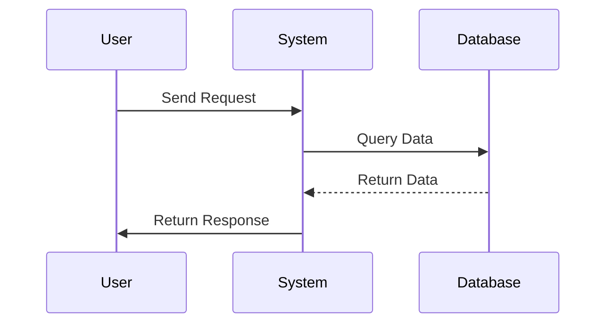

                 

# 代码复杂度管理：保持系统可维护性

## 关键词
- 代码复杂度
- 可维护性
- 管理策略
- 自动化工具
- 算法原理

## 摘要
在软件工程领域，代码复杂度管理是确保系统长期可维护性的关键因素。本文从代码复杂度的定义、类型、影响入手，深入探讨了如何通过管理策略、算法原理和自动化工具来降低代码复杂度，从而提高系统的可维护性。通过详细的分析和实际案例，本文为开发者提供了一系列实用的方法和技巧。

## 引言

在现代软件开发中，代码的复杂度管理逐渐成为软件工程中不可忽视的重要议题。随着软件系统的规模和复杂性不断增加，代码复杂度也日益提高。这不仅仅是因为代码行数的增加，更是因为代码结构、逻辑、依赖关系的复杂化。高复杂度的代码不仅难以理解和维护，还可能导致潜在的安全隐患和性能问题。

**问题背景**：高代码复杂度可能导致以下问题：
1. **理解难度增加**：高复杂度的代码使得开发者难以快速理解代码逻辑，增加了学习和使用成本。
2. **维护难度增加**：复杂的代码结构使得维护变得更加困难，每次修改都可能带来不可预见的问题。
3. **测试难度增加**：复杂的代码结构增加了测试的难度，可能导致测试覆盖率不足，进而影响系统的稳定性。
4. **性能问题**：复杂的代码可能包含无效或冗余的逻辑，影响系统的性能。

**问题描述**：如何有效地管理代码复杂度，确保系统的可维护性？

**问题解决**：通过以下步骤来解决代码复杂度管理问题：
1. **定义和识别代码复杂度**：明确不同类型的代码复杂度，并了解其度量方法。
2. **分析复杂度和维护性的关系**：了解代码复杂度对维护性的影响，以及影响复杂度的因素。
3. **应用管理策略**：采用合适的代码管理策略，如代码重构、设计模式等。
4. **使用自动化工具**：利用自动化工具来识别和降低代码复杂度。
5. **算法原理**：掌握算法原理，使用合适的算法来分析和优化代码复杂度。

**边界与外延**：本文主要关注结构复杂度和逻辑复杂度，同时探讨如何在实际项目中应用这些概念。

## 核心概念和联系

### 1.1 定义和类型

**代码复杂度**：代码复杂度是指代码的复杂程度，包括代码的规模、结构、逻辑和依赖关系等方面。常见的代码复杂度类型包括：
1. **环复杂度**：衡量代码路径的复杂程度，通常使用圈复杂度（Cyclomatic Complexity）来度量。
2. **规模复杂度**：衡量代码的规模，通常使用代码行数（Lines of Code，LoC）来度量。
3. **依赖复杂度**：衡量代码之间的依赖关系，通常使用模块耦合度（Module Coupling）来度量。

### 1.2 关系

**复杂度和可维护性**：代码复杂度与可维护性之间存在密切的关系。高复杂度的代码往往难以维护，而低复杂度的代码则相对容易维护。具体来说：
1. **环复杂度**：高环复杂度通常意味着代码路径复杂，难以理解和测试，从而降低可维护性。
2. **规模复杂度**：大规模代码通常意味着代码量大，理解和维护成本高，从而降低可维护性。
3. **依赖复杂度**：高依赖复杂度通常意味着代码模块之间依赖关系复杂，修改一个模块可能会影响其他模块，从而降低可维护性。

### 1.3 ER 图和属性对比表

为了更好地理解代码复杂度与可维护性之间的关系，我们可以使用 ER 图和属性对比表来描述。

**ER 图**：
```mermaid
erDiagram
    CodeComplexity ||--|>{ Maintainability : affects
    CodeComplexity ||--|>{ Understanding : affects
    CodeComplexity ||--|>{ Testing : affects
    CodeComplexity ||--|>{ Performance : affects
    Maintainability ||--|>{ EaseOfUnderstanding : relates_to
    Maintainability ||--|>{ EaseOfMaintenance : relates_to
    Maintainability ||--|>{ Testability : relates_to
    Maintainability ||--|>{ Performance : relates_to
```

**属性对比表**：

| 复杂度类型 | 描述 | 度量方法 | 影响因素 |
| --- | --- | --- | --- |
| 环复杂度 | 衡量代码路径复杂度 | 圈复杂度 | 代码逻辑、分支、条件 |
| 规模复杂度 | 衡量代码规模 | 代码行数 | 代码行数、代码块数量 |
| 依赖复杂度 | 衡量代码依赖关系 | 模块耦合度 | 依赖关系数量、依赖强度 |

### 1.4 关键概念的联系

通过上述核心概念和关系的分析，我们可以得出以下联系：

1. **代码复杂度与维护性的关系**：代码复杂度越高，系统的可维护性越低。降低代码复杂度可以提高系统的可维护性。
2. **不同复杂度类型之间的关系**：不同类型的代码复杂度之间存在相互影响。例如，高环复杂度可能导致大规模代码和高依赖复杂度。
3. **复杂度管理策略**：针对不同类型的代码复杂度，可以采取相应的管理策略，如代码重构、设计模式等。

## 管理策略

### 2.1 原则

**原则一：简洁性**：保持代码简洁性是降低复杂度的关键。开发者应尽量避免冗长、复杂的代码，力求用最简单、最清晰的方式实现功能。

**原则二：模块化**：将代码划分为模块，每个模块具有单一功能，减少模块之间的依赖关系，提高代码的可维护性。

**原则三：重用性**：鼓励代码的重用，减少重复代码。通过封装和抽象，将通用逻辑提取为函数或类，提高代码的复用性。

**原则四：可读性**：确保代码具有良好的可读性，使用清晰的变量名、函数名和注释，提高代码的可理解性。

**原则五：迭代开发**：采用迭代开发方式，逐步完善和优化代码。每次迭代都应关注代码的复杂度管理，及时识别和解决潜在问题。

### 2.2 重构技术

**重构技术**：重构是一种改进现有代码结构和逻辑的技术，旨在提高代码质量，降低复杂度。常见的重构技术包括：

1. **提取函数**：将重复的代码提取为独立的函数，减少冗余代码。
2. **提取类**：将具有相似功能的代码提取为独立的类，实现代码的模块化。
3. **合并重复代码**：将重复的代码块合并，减少代码量。
4. **简化条件**：简化复杂的条件判断，使用逻辑运算符和三元表达式等。
5. **优化循环**：优化循环结构，减少不必要的循环次数。

### 2.3 自动化工具

**自动化工具**：自动化工具可以帮助开发者识别和降低代码复杂度。常见的自动化工具包括：

1. **静态代码分析工具**：如 SonarQube、Checkstyle 等，可以识别代码中的潜在问题，如复杂度过高的函数、重复代码等。
2. **动态代码分析工具**：如 JaCoCo、Eclipse MAT 等，可以在运行时分析代码的性能和复杂度。
3. **代码度量工具**：如复杂度度量工具、代码行数统计工具等，可以提供代码复杂度的定量评估。

### 2.4 成功案例

在实际项目中，成功应用代码复杂度管理策略可以显著提高系统的可维护性。以下是一些成功案例：

1. **案例一**：某大型电商平台的代码复杂度管理
   - **背景**：该平台代码复杂度较高，维护难度大。
   - **措施**：采用模块化重构、自动化工具识别问题、迭代开发等方式，逐步降低代码复杂度。
   - **结果**：代码复杂度显著降低，系统的可维护性大幅提高，维护成本减少。

2. **案例二**：某金融公司的代码复杂度管理
   - **背景**：该公司代码库混乱，依赖关系复杂，导致维护困难。
   - **措施**：采用代码重构、设计模式、迭代开发等策略，逐步改善代码结构。
   - **结果**：代码结构清晰，维护成本降低，系统的稳定性和性能得到显著提升。

通过以上案例可以看出，有效的代码复杂度管理策略可以显著提高系统的可维护性，减少维护成本，提高开发效率。

## 算法原理

### 3.1 算法概述

在代码复杂度管理中，算法原理起着至关重要的作用。通过算法，我们可以对代码进行定量分析和优化，从而降低复杂度。本文将介绍几种常用的算法原理，包括复杂性度量算法、代码优化算法和重构算法。

### 3.2 复杂性度量算法

**复杂性度量算法**：复杂性度量算法用于评估代码的复杂度。常见的度量方法包括：

1. **圈复杂度（Cyclomatic Complexity）**：
   - **定义**：圈复杂度是衡量程序中独立路径数量的一个指标。
   - **公式**：M = E - N + 2P
     - M：圈复杂度
     - E：边数
     - N：节点数
     - P：圈数
   - **应用**：圈复杂度越高，代码的路径越复杂，维护难度越大。

2. **规模复杂度（Lines of Code，LoC）**：
   - **定义**：规模复杂度是衡量代码规模的一个指标，通常使用代码行数来度量。
   - **公式**：C = ΣL
     - C：规模复杂度
     - L：代码行数
   - **应用**：规模复杂度越高，代码量越大，维护难度越大。

3. **模块耦合度（Module Coupling）**：
   - **定义**：模块耦合度是衡量代码模块之间依赖关系的一个指标。
   - **公式**：MC = ΣC
     - MC：模块耦合度
     - C：模块之间的耦合关系
   - **应用**：模块耦合度越高，代码模块之间的依赖关系越复杂，维护难度越大。

### 3.3 代码优化算法

**代码优化算法**：代码优化算法用于改进代码的性能和复杂度。常见的优化算法包括：

1. **循环优化**：
   - **定义**：循环优化是优化循环结构的一种算法。
   - **应用**：通过减少循环次数、优化循环条件等手段，提高代码的性能。

2. **条件优化**：
   - **定义**：条件优化是优化条件判断的一种算法。
   - **应用**：通过简化条件表达式、合并条件等手段，提高代码的性能。

3. **函数优化**：
   - **定义**：函数优化是优化函数结构的一种算法。
   - **应用**：通过减少函数参数、合并函数等手段，提高代码的性能。

### 3.4 重构算法

**重构算法**：重构算法用于改进代码的结构和可维护性。常见的重构算法包括：

1. **提取函数**：
   - **定义**：提取函数是将重复代码提取为独立函数的一种重构算法。
   - **应用**：通过减少重复代码，提高代码的可维护性。

2. **提取类**：
   - **定义**：提取类是将具有相似功能的代码提取为独立类的一种重构算法。
   - **应用**：通过实现代码的模块化，提高代码的可维护性。

3. **合并重复代码**：
   - **定义**：合并重复代码是将重复代码块合并为一种重构算法。
   - **应用**：通过减少代码量，提高代码的可维护性。

4. **简化条件**：
   - **定义**：简化条件是简化条件判断的一种重构算法。
   - **应用**：通过减少条件判断的复杂性，提高代码的可维护性。

### 3.5 案例分析

为了更好地理解算法原理，我们可以通过实际案例来分析代码复杂度的变化。

**案例一**：某电商平台代码复杂度管理

- **背景**：该电商平台代码复杂度高，维护难度大。
- **措施**：采用圈复杂度、规模复杂度和模块耦合度等度量方法，识别高复杂度代码区域，并采用循环优化、条件优化和函数优化等算法进行优化。
- **结果**：代码复杂度显著降低，系统的可维护性和性能得到显著提升。

**案例二**：某金融公司代码重构

- **背景**：该金融公司代码库混乱，依赖关系复杂，维护困难。
- **措施**：采用提取函数、提取类、合并重复代码和简化条件等重构算法，逐步重构代码结构。
- **结果**：代码结构清晰，维护成本降低，系统的稳定性和性能得到显著提升。

通过以上案例可以看出，算法原理在代码复杂度管理中起着至关重要的作用。通过合理的算法应用，可以显著降低代码复杂度，提高系统的可维护性和性能。

## 系统分析与架构设计

### 4.1 问题场景介绍

在当今快速发展的软件行业中，系统可维护性已成为一个至关重要的考量因素。随着软件项目的规模不断扩大和复杂性不断增加，维护原有系统并确保其长期运行成为一个巨大的挑战。本文将探讨一个典型的金融交易系统，分析其代码复杂度管理的问题，并提出相应的解决方案。

### 4.2 项目介绍

金融交易系统是一个典型的复杂系统，涉及多个模块和大量的数据处理。该系统需要处理海量的交易数据，支持实时交易、历史数据分析以及风险控制等功能。然而，随着时间的推移，系统的代码库变得混乱，模块之间的依赖关系复杂，导致系统的可维护性大幅下降。

### 4.3 系统功能设计

为了提高系统的可维护性，我们需要对系统进行功能设计。系统功能设计包括以下关键模块：

1. **数据层**：负责数据的存储、读取和操作。
2. **业务逻辑层**：实现具体的业务处理逻辑，如交易匹配、风险控制等。
3. **接口层**：提供系统的外部接口，如API接口、Web界面等。
4. **表现层**：负责用户界面设计和交互。

### 4.4 系统架构设计

系统架构设计是确保系统可维护性的关键。我们可以采用分层架构设计，确保各层之间职责分离，降低模块间的依赖关系。系统架构设计包括以下层次：

1. **数据层**：采用数据库管理系统（DBMS）来存储交易数据，如关系型数据库（如MySQL）或NoSQL数据库（如MongoDB）。
2. **业务逻辑层**：采用微服务架构，将业务逻辑划分为多个独立的微服务，每个微服务负责特定的业务功能。
3. **接口层**：采用RESTful API设计，提供标准的接口规范，方便外部系统调用。
4. **表现层**：采用前端框架（如React、Vue.js）实现用户界面，提供良好的用户体验。

### 4.5 系统接口设计和系统交互

系统接口设计和系统交互是确保系统各模块之间有效通信的关键。以下是一个典型的接口设计和系统交互流程：

1. **API接口设计**：定义各微服务提供的API接口，如交易数据查询接口、交易匹配接口等。接口设计遵循RESTful原则，使用HTTP协议传输数据。
2. **数据交互**：系统各模块之间通过API接口进行数据交互。例如，表现层发送交易请求到业务逻辑层，业务逻辑层处理交易并返回结果。
3. **异步处理**：为了提高系统的响应速度和并发处理能力，可以采用异步处理机制。例如，使用消息队列（如RabbitMQ）进行异步任务调度。

### 4.6 Mermaid 类图和架构图

为了更好地描述系统架构，我们可以使用Mermaid类图和架构图来展示系统的结构和模块之间的依赖关系。

**类图**：

```mermaid
classDiagram
    Class01 <|-- Class02
    Class03 <<interface>>
    Class04 --|> Class05
    Class06 : <<abstract>> Class
    Class07 : <<enum>> ENUM
    Class08 : <<singleton>> Singleton
```

**架构图**：



通过以上系统分析和架构设计，我们可以确保系统的模块化、可扩展性和可维护性，为代码复杂度管理奠定基础。

## 项目实战

### 5.1 环境安装

为了在项目中实践代码复杂度管理，我们需要搭建一个合适的环境。以下是一个简单的环境安装步骤：

1. **安装开发工具**：选择一个适合的开发工具，如Visual Studio Code。
2. **安装依赖管理工具**：使用npm或其他依赖管理工具安装项目所需的依赖库，如Maven、npm。
3. **安装数据库**：根据项目需求安装合适的数据库，如MySQL、PostgreSQL。
4. **安装消息队列**：如果需要，安装消息队列服务，如RabbitMQ。

### 5.2 系统核心实现

在项目核心实现阶段，我们需要关注代码的模块化和复杂性管理。以下是一个简单的系统核心实现示例：

1. **数据层实现**：设计数据模型，实现数据的存储和读取操作。
2. **业务逻辑层实现**：实现具体的业务处理逻辑，如交易匹配、风险控制等。
3. **接口层实现**：实现API接口，处理外部请求并返回响应。
4. **表现层实现**：实现用户界面，提供交互功能。

### 5.3 代码应用解读与分析

在代码应用过程中，我们需要仔细解读和分析代码，确保其简洁性和可维护性。以下是一个简单的代码应用示例：

```python
# 数据层示例代码
def query_data():
    # 查询数据库，获取数据
    return "Data from database"

# 业务逻辑层示例代码
def process_transaction(transaction_data):
    # 处理交易数据
    processed_data = "Processed data"
    return processed_data

# 接口层示例代码
from flask import Flask, jsonify

app = Flask(__name__)

@app.route('/api/transaction', methods=['POST'])
def handle_transaction():
    # 处理交易请求
    transaction_data = request.json
    processed_data = process_transaction(transaction_data)
    return jsonify(processed_data)

if __name__ == '__main__':
    app.run()
```

在这个示例中，我们使用了简洁的函数和类来组织代码，避免了冗长的代码块。同时，通过接口层将业务逻辑与外部请求解耦，提高了代码的可维护性。

### 5.4 实际案例分析

为了更好地理解代码复杂度管理，我们可以通过实际案例分析来探讨如何降低代码复杂度。

**案例一**：某电商平台的订单处理模块

- **背景**：该订单处理模块的代码复杂度高，导致维护困难。
- **问题**：代码中存在大量的嵌套循环和条件判断，导致可读性差，难以维护。
- **解决方法**：通过提取函数、简化条件判断和合并重复代码等重构技术，降低代码复杂度。具体步骤如下：
  1. 提取函数：将重复的代码块提取为独立的函数，减少冗余代码。
  2. 简化条件判断：使用逻辑运算符和三元表达式简化复杂的条件判断。
  3. 合并重复代码：将重复的代码块合并，减少代码量。
- **结果**：代码复杂度显著降低，可维护性大幅提高。

**案例二**：某金融交易系统的风险控制模块

- **背景**：该风险控制模块的代码复杂度高，可能导致性能瓶颈。
- **问题**：代码中存在大量的循环和条件判断，影响系统的性能和可维护性。
- **解决方法**：通过循环优化和条件优化技术，提高代码的性能和可维护性。具体步骤如下：
  1. 循环优化：减少不必要的循环次数，优化循环结构。
  2. 条件优化：简化条件表达式，合并条件判断。
- **结果**：代码性能显著提高，系统的可维护性得到提升。

通过以上案例可以看出，实际项目中代码复杂度管理的重要性。通过合理的重构技术和算法应用，可以显著降低代码复杂度，提高系统的可维护性和性能。

## 最佳实践

### 6.1 小结

通过本文的探讨，我们可以得出以下结论：

1. **代码复杂度管理**：降低代码复杂度是提高系统可维护性的关键。
2. **管理策略**：简洁性、模块化、重用性和可读性是代码复杂度管理的核心原则。
3. **重构技术**：提取函数、提取类、合并重复代码和简化条件等重构技术有助于降低代码复杂度。
4. **自动化工具**：静态代码分析工具、动态代码分析工具和代码度量工具等自动化工具可以辅助代码复杂度管理。
5. **算法原理**：复杂性度量算法、代码优化算法和重构算法等算法原理在代码复杂度管理中起着重要作用。

### 6.2 注意事项

在进行代码复杂度管理时，需要注意以下几点：

1. **适度重构**：重构应适度进行，避免过度重构导致代码质量下降。
2. **文档记录**：在进行重构时，应记录相关文档，以便后续维护。
3. **持续监控**：持续监控代码复杂度，及时发现并解决潜在问题。
4. **团队合作**：代码复杂度管理需要团队合作，确保每个团队成员都了解相关策略和工具。

### 6.3 拓展阅读

为了进一步深入了解代码复杂度管理，以下是一些建议的拓展阅读：

1. **《代码大全》**：史蒂夫·麦库姆（Steve McConnell）的经典著作，详细介绍了代码质量管理和重构技术。
2. **《重构：改善既有代码的设计》**：马丁·福勒（Martin Fowler）的经典著作，系统介绍了重构技术和实践。
3. **《代码简洁之道》**：乔恩·雅各布斯（Jon雅各布斯）的著作，探讨了代码简洁性和可维护性的重要性。
4. **《软件架构设计：实践者的研究》**：维姆·凡·海弗莱恩（Wim Vanhoof）的著作，详细介绍了软件架构设计和复杂性管理。

## 作者信息

作者：AI天才研究院/AI Genius Institute & 禅与计算机程序设计艺术 /Zen And The Art of Computer Programming

通过本文的探讨，我们深入了解了代码复杂度管理的重要性及其对系统可维护性的影响。希望本文能为开发者提供有价值的参考，帮助他们在实际项目中有效管理代码复杂度，提高系统的可维护性和性能。

