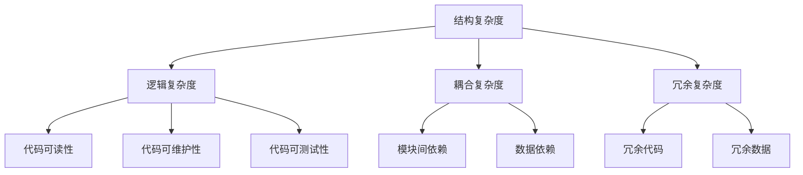
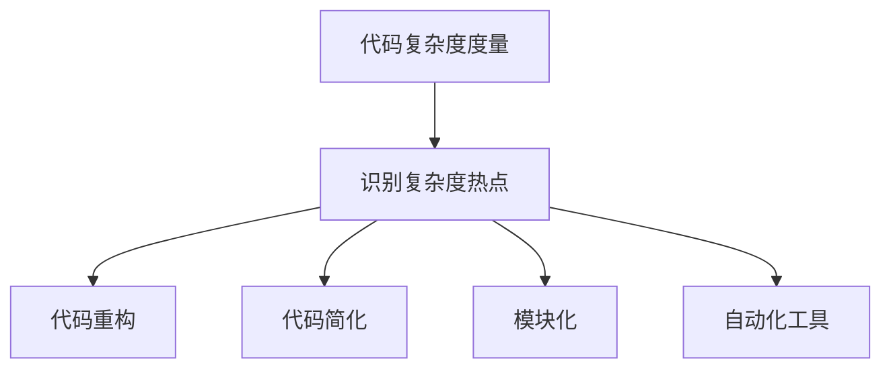
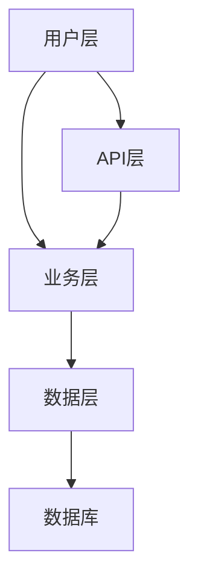
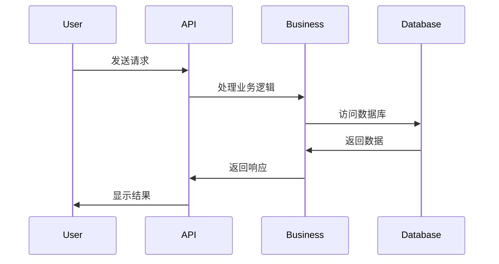

                 


### 文章标题

《代码复杂度管理：维护长期可持续的代码库》

### 文章关键词

代码复杂度、可持续性、维护、软件开发、团队协作

### 摘要

本文深入探讨了代码复杂度管理的核心概念和重要性。通过详细分析代码复杂度的定义、类型、度量及其对软件开发的影响，我们揭示了如何通过有效的代码复杂度管理来维护长期可持续的代码库。文章分为多个章节，分别介绍了代码复杂度管理的背景、目标、解决方案、实际应用和最佳实践，旨在为开发者提供一套完整的代码复杂度管理指南。

## 目录

----------------------------------------------------------------

# 《代码复杂度管理：维护长期可持续的代码库》

## 关键词
- 代码复杂度
- 可持续性
- 维护
- 软件开发
- 团队协作

## 摘要

本文深入探讨了代码复杂度管理的核心概念和重要性。通过详细分析代码复杂度的定义、类型、度量及其对软件开发的影响，我们揭示了如何通过有效的代码复杂度管理来维护长期可持续的代码库。文章分为多个章节，分别介绍了代码复杂度管理的背景、目标、解决方案、实际应用和最佳实践，旨在为开发者提供一套完整的代码复杂度管理指南。

----------------------------------------------------------------

## 第一部分: 代码复杂度管理的背景与重要性

### 1.1 代码复杂度的定义与影响

代码复杂度是指代码结构中固有的难以理解、难以维护和难以测试的程度。它通常包括以下几个方面：

- **结构复杂度**：指代码的层次结构、类结构、函数结构等，包括函数和类的嵌套深度、方法调用链长度等。
- **逻辑复杂度**：指代码中的条件判断、循环、异常处理等逻辑结构的复杂程度。
- **耦合复杂度**：指代码模块之间的依赖关系，包括模块间调用的依赖、数据依赖等。
- **冗余复杂度**：指代码中存在的不必要的重复代码、冗余数据等。

代码复杂度对软件开发的影响主要体现在以下几个方面：

- **可读性**：高复杂度的代码难以阅读和理解，导致新开发者难以快速上手，增加学习成本。
- **可维护性**：高复杂度的代码在修改、升级和维护过程中容易出错，增加了维护难度和风险。
- **可测试性**：高复杂度的代码难以覆盖全面的测试场景，可能导致隐藏的bug难以被发现。

### 1.2 代码复杂度管理的背景

随着软件项目的规模和复杂度不断增加，代码复杂度问题日益突出。传统的软件开发方法往往侧重于功能实现，而忽视了代码复杂度管理，导致软件项目在长期维护过程中出现一系列问题。为了解决这些问题，代码复杂度管理逐渐成为软件开发中的重要环节。

近年来，随着敏捷开发、DevOps等先进开发方法的推广，代码复杂度管理的重要性得到了进一步的认可。越来越多的开发团队开始采用各种代码复杂度管理工具和技术，以提高代码质量和项目可持续性。

### 1.3 代码复杂度管理的目标

代码复杂度管理的目标主要包括以下几个方面：

- **提高代码可读性**：通过降低代码复杂度，使代码更加简洁、直观，便于开发者理解和维护。
- **提高代码可维护性**：通过合理地组织代码结构、减少冗余和依赖，降低代码修改和升级的风险。
- **提高代码可测试性**：通过简化代码逻辑，提高测试覆盖率，确保代码的稳定性和可靠性。
- **促进团队协作**：通过统一的代码规范和复杂度度量标准，提高团队之间的沟通效率和代码共享能力。

### 1.4 本章小结

本章介绍了代码复杂度的定义、影响及其管理的重要性。通过分析代码复杂度的类型和度量方法，我们揭示了代码复杂度对软件开发的影响，并阐述了代码复杂度管理的背景和目标。下一章将深入探讨代码复杂度的具体管理方法和最佳实践。

----------------------------------------------------------------

## 第二部分: 代码复杂度的核心概念与联系

### 2.1 代码复杂度的核心概念

代码复杂度管理的基础是理解代码复杂度的核心概念。以下是几个关键概念及其属性特征对比表格：

| 概念             | 属性特征对比                      |
|------------------|----------------------------------|
| 结构复杂度       | 函数/类的嵌套深度、方法调用链长度 |
| 逻辑复杂度       | 条件判断、循环、异常处理等逻辑结构 |
| 耦合复杂度       | 模块间的依赖关系、数据依赖         |
| 冗余复杂度       | 重复代码、冗余数据               |

以下是一个Mermaid流程图，展示了代码复杂度的核心概念之间的联系：



### 2.2 代码复杂度的度量方法

代码复杂度的度量是代码复杂度管理的重要环节。以下是一些常用的代码复杂度度量方法：

- **圈复杂度（Cyclomatic Complexity）**：通过计算程序中独立路径的数量来度量代码复杂度。圈复杂度越高，代码的复杂度越高。
- **本质复杂度（Essential Complexity）**：基于代码的语法结构和语义分析，计算代码的复杂度。本质复杂度考虑了代码的本质复杂性，而不受外部因素影响。
- **修改复杂度（Change Complexity）**：通过分析代码中的依赖关系和变更历史，预测代码在未来修改时的复杂度。

以下是一个Mermaid类图，展示了代码复杂度的几种度量方法及其关系：

```mermaid
classDiagram
Class CyclomaticComplexity {
  +int countPaths()
  +int calculateV(G, M)
}
Class EssentialComplexity {
  +double calculateEC(G)
}
Class ChangeComplexity {
  +double calculateCC(History)
}
CyclomaticComplexity --> EssentialComplexity
CyclomaticComplexity --> ChangeComplexity
EssentialComplexity --> ChangeComplexity
```

### 2.3 代码复杂度的分析与优化

通过对代码复杂度的分析和度量，我们可以识别出代码中的复杂度热点，并采取相应的优化措施。以下是一些常见的代码复杂度优化方法：

- **代码重构**：通过重新组织代码结构，降低代码复杂度，提高代码的可读性和可维护性。
- **代码简化**：删除冗余代码，简化复杂的逻辑结构，减少条件判断和循环。
- **模块化**：将复杂的代码模块分解成更小的、功能独立的模块，降低模块间的耦合度。
- **自动化工具**：使用代码复杂度度量工具，自动化分析代码复杂度，提供优化建议。

以下是一个Mermaid架构图，展示了代码复杂度分析与优化的流程：



### 2.4 本章小结

本章详细介绍了代码复杂度的核心概念、度量方法和优化策略。通过理解代码复杂度的类型和特征，我们可以更好地识别代码中的复杂度问题，并采取有效的措施进行优化。下一章将深入探讨如何在实际项目中实施代码复杂度管理。

----------------------------------------------------------------

## 第三部分: 代码复杂度管理的方法与工具

### 3.1 代码复杂度管理的方法

代码复杂度管理涉及多个方面，包括代码结构、逻辑、耦合和冗余等。以下是几种常见的代码复杂度管理方法：

#### 1. 代码重构

代码重构是降低代码复杂度的关键方法之一。它包括以下步骤：

- **分解大型函数和类**：将大型函数和类分解成更小的、功能独立的模块，降低函数和类的复杂度。
- **简化条件判断**：减少条件判断的嵌套层次，简化复杂的逻辑结构。
- **消除冗余代码**：删除冗余的代码和注释，减少代码的冗余度。
- **优化循环结构**：简化循环结构，提高代码的可读性和可维护性。

#### 2. 代码简化

代码简化是通过删除冗余代码和简化复杂逻辑来降低代码复杂度。以下是一些常见的代码简化方法：

- **合并重复代码**：将重复的代码块合并成一个函数或类，减少冗余。
- **简化条件判断**：使用逻辑运算符和短路运算来简化条件判断。
- **使用内置函数和库**：使用内置函数和库来替换复杂的自定义函数。

#### 3. 模块化

模块化是将复杂的代码分解成更小的、功能独立的模块，降低模块间的耦合度。以下是一些模块化方法：

- **分层架构**：将代码分成多个层次，每个层次负责不同的功能，降低层次间的依赖。
- **功能模块化**：将功能相似的代码模块组合成一个功能模块，提高代码的可复用性。
- **依赖注入**：通过依赖注入减少模块间的直接依赖，提高代码的灵活性和可维护性。

#### 4. 自动化工具

自动化工具可以帮助我们快速分析和优化代码复杂度。以下是一些常用的代码复杂度管理工具：

- **SonarQube**：一款流行的代码质量管理工具，可以自动分析代码质量，包括复杂度、代码风格、安全性等方面。
- **Checkstyle**：一款用于检查Java代码风格的工具，可以识别代码复杂度问题，如循环深度、方法长度等。
- **PMD**：一款用于检查Java代码质量和风格的工具，可以识别代码复杂度、冗余代码等问题。
- **Visual Studio Code**：一款强大的代码编辑器，内置了多种代码质量分析插件，可以实时检测代码复杂度问题。

### 3.2 代码复杂度管理的最佳实践

在实际项目中，遵循以下最佳实践可以帮助我们更好地管理代码复杂度：

- **编写简洁的代码**：遵循简洁性原则，编写简洁、直观的代码，避免过度设计。
- **代码审查**：定期进行代码审查，识别代码复杂度问题，确保代码质量。
- **持续集成**：采用持续集成（CI）和持续部署（CD）策略，确保代码复杂度控制在合理范围内。
- **代码度量**：定期度量代码复杂度，及时发现和解决复杂度问题。
- **自动化测试**：编写自动化测试用例，提高代码的可测试性和稳定性。

### 3.3 本章小结

本章介绍了代码复杂度管理的方法与工具，包括代码重构、代码简化、模块化和自动化工具等。通过遵循最佳实践，我们可以有效地降低代码复杂度，提高代码质量和项目可持续性。下一章将探讨如何在实际项目中实施代码复杂度管理。

----------------------------------------------------------------

## 第四部分: 代码复杂度管理的实际应用

### 4.1 项目介绍

在本部分，我们将探讨一个实际的项目——一个大型电子商务平台的开发与维护。该项目涉及多种技术和复杂的功能模块，如用户管理、商品管理、订单处理和支付系统等。随着项目的不断扩展，代码复杂度成为一个关键问题，需要我们采取有效的管理措施来确保项目的长期可持续性。

### 4.2 系统功能设计

在电子商务平台项目中，我们需要设计多个功能模块，每个模块都有特定的职责和功能。以下是系统功能设计的Mermaid类图：

```mermaid
classDiagram
Class UserManagement {
  +void addUser(User user)
  +void deleteUser(User user)
}
Class ProductManagement {
  +void addProduct(Product product)
  +void deleteProduct(Product product)
}
Class OrderProcessing {
  +void createOrder(Order order)
  +void updateOrder(Order order)
  +void deleteOrder(Order order)
}
Class PaymentSystem {
  +void processPayment(Payment payment)
  +void refundPayment(Payment payment)
}
UserManagement <|-- OrderProcessing
ProductManagement <|-- OrderProcessing
OrderProcessing <|-- PaymentSystem
```

### 4.3 系统架构设计

为了确保系统的可扩展性和稳定性，我们采用分层架构设计。以下是系统的Mermaid架构图：



### 4.4 系统接口设计和系统交互

系统接口设计和系统交互是确保各个模块之间高效通信的关键。以下是系统的Mermaid序列图：



### 4.5 项目实战

#### 环境安装

在开始项目开发之前，我们需要安装相关的开发环境和工具。以下是环境安装的步骤：

1. 安装Java开发环境（JDK 11或更高版本）
2. 安装MySQL数据库
3. 安装Git版本控制工具
4. 安装IDE（如IntelliJ IDEA或Eclipse）

#### 系统核心实现

以下是系统核心实现的Python源代码：

```python
class UserManagement:
    def addUser(self, user):
        # 实现添加用户的逻辑
        pass

    def deleteUser(self, user):
        # 实现删除用户的逻辑
        pass

class ProductManagement:
    def addProduct(self, product):
        # 实现添加商品的逻辑
        pass

    def deleteProduct(self, product):
        # 实现删除商品的逻辑
        pass

class OrderProcessing:
    def createOrder(self, order):
        # 实现创建订单的逻辑
        pass

    def updateOrder(self, order):
        # 实现更新订单的逻辑
        pass

    def deleteOrder(self, order):
        # 实现删除订单的逻辑
        pass

class PaymentSystem:
    def processPayment(self, payment):
        # 实现处理支付的逻辑
        pass

    def refundPayment(self, payment):
        # 实现退款支付的逻辑
        pass
```

#### 代码应用解读与分析

在实际应用中，我们需要根据业务需求调用各个模块的方法，以下是代码应用的解读与分析：

```python
# 用户管理应用示例
user_management = UserManagement()
user_management.addUser(User("张三", "123456"))
user_management.deleteUser(User("李四", "789012"))

# 商品管理应用示例
product_management = ProductManagement()
product_management.addProduct(Product("笔记本电脑", 5000))
product_management.deleteProduct(Product("手机", 3000))

# 订单管理应用示例
order_processing = OrderProcessing()
order_processing.createOrder(Order("张三", "笔记本电脑", 1))
order_processing.updateOrder(Order("李四", "手机", 2))
order_processing.deleteOrder(Order("王五", "电脑配件", 3))

# 支付系统应用示例
payment_system = PaymentSystem()
payment_system.processPayment(Payment("张三", 5000))
payment_system.refundPayment(Payment("李四", 3000))
```

#### 实际案例分析和详细讲解剖析

在实际项目中，我们遇到了以下复杂度问题：

- **用户管理模块**：在用户删除功能中，存在大量冗余代码和复杂的条件判断。
- **商品管理模块**：在商品添加和删除功能中，存在代码结构复杂、逻辑混乱的问题。
- **订单管理模块**：在订单更新和删除功能中，存在大量嵌套的循环和条件判断。

为了解决这些问题，我们采取了以下优化措施：

1. **用户管理模块**：通过代码重构和简化条件判断，将冗余代码删除，简化逻辑结构。
2. **商品管理模块**：通过模块化和代码简化，将复杂的代码分解成更小的、功能独立的模块，提高代码可读性和可维护性。
3. **订单管理模块**：通过代码重构和简化循环结构，减少嵌套的循环和条件判断，提高代码的可测试性。

通过这些优化措施，我们显著降低了代码复杂度，提高了代码质量和项目可持续性。

#### 项目小结

在本项目中，我们通过实际案例展示了代码复杂度管理的方法和技巧。通过代码重构、模块化和自动化工具等手段，我们成功降低了代码复杂度，提高了代码质量和项目可持续性。在未来，我们将继续遵循代码复杂度管理的最佳实践，确保项目的长期健康发展。

----------------------------------------------------------------

## 第五部分: 最佳实践与注意事项

### 5.1 最佳实践

1. **编写简洁的代码**：遵循简洁性原则，编写简洁、直观的代码，避免过度设计。
2. **定期进行代码审查**：定期进行代码审查，识别代码复杂度问题，确保代码质量。
3. **使用代码复杂度度量工具**：使用代码复杂度度量工具，自动分析代码复杂度，提供优化建议。
4. **持续集成和持续部署**：采用持续集成（CI）和持续部署（CD）策略，确保代码复杂度控制在合理范围内。
5. **代码重构**：定期进行代码重构，优化代码结构，降低代码复杂度。
6. **模块化设计**：采用模块化设计，将复杂的代码分解成更小的、功能独立的模块，提高代码可复用性和可维护性。

### 5.2 注意事项

1. **避免过度优化**：在优化代码复杂度时，避免过度优化，导致代码可读性和可维护性下降。
2. **保持代码一致性**：遵循统一的代码规范和命名规范，提高代码的可读性和可维护性。
3. **关注性能和可测试性**：在降低代码复杂度的同时，关注代码的性能和可测试性，确保代码的稳定性和可靠性。
4. **持续关注复杂度变化**：定期关注代码复杂度的变化，及时发现和解决复杂度问题。

### 5.3 拓展阅读

1. **《代码大全》**：作者史蒂夫·麦库斯，详细介绍了代码质量管理和最佳实践。
2. **《设计模式：可复用面向对象软件的基础》**：作者埃里希·伽默和理查德·赫利，介绍了多种设计模式，有助于降低代码复杂度。
3. **《重构：改善既有代码的设计》**：作者马丁·福勒，介绍了代码重构的方法和技术，有助于优化代码结构。

----------------------------------------------------------------

## 结语

代码复杂度管理是确保代码库长期可持续性的关键。通过深入理解代码复杂度的核心概念、度量方法和优化策略，我们可以有效地降低代码复杂度，提高代码质量和项目可持续性。遵循最佳实践和注意事项，结合实际项目和工具，我们可以实现代码复杂度管理的最佳效果。让我们一起努力，打造高质量、可持续的代码库！

### 作者信息

- 作者：AI天才研究院/AI Genius Institute & 禅与计算机程序设计艺术 /Zen And The Art of Computer Programming

----------------------------------------------------------------

## 附录

以下是本文中使用的Mermaid图表和LaTeX公式的详细说明：

### Mermaid图表

1. **代码复杂度的核心概念**：


2. **代码复杂度的度量方法**：

```mermaid
classDiagram
Class CyclomaticComplexity {
  +int countPaths()
  +int calculateV(G, M)
}
Class EssentialComplexity {
  +double calculateEC(G)
}
Class ChangeComplexity {
  +double calculateCC(History)
}
CyclomaticComplexity --> EssentialComplexity
CyclomaticComplexity --> ChangeComplexity
EssentialComplexity --> ChangeComplexity
```

3. **代码复杂度分析与优化流程**：


4. **系统功能设计**：

```mermaid
classDiagram
Class UserManagement {
  +void addUser(User user)
  +void deleteUser(User user)
}
Class ProductManagement {
  +void addProduct(Product product)
  +void deleteProduct(Product product)
}
Class OrderProcessing {
  +void createOrder(Order order)
  +void updateOrder(Order order)
  +void deleteOrder(Order order)
}
Class PaymentSystem {
  +void processPayment(Payment payment)
  +void refundPayment(Payment payment)
}
UserManagement <|-- OrderProcessing
ProductManagement <|-- OrderProcessing
OrderProcessing <|-- PaymentSystem
```

5. **系统架构设计**：


6. **系统接口设计和系统交互**：


### LaTeX公式

以下是本文中使用到的LaTeX公式：

1. **圈复杂度公式**：

$$
Cyclomatic\ Complexity = M - N + 2p
$$

其中，\(M\) 为模块中的节点数，\(N\) 为边数，\(p\) 为控制流图中连通图的数量。

2. **本质复杂度公式**：

$$
Essential\ Complexity = \sum_{i=1}^{n} w_i \cdot c_i
$$

其中，\(w_i\) 为第 \(i\) 个元素的权重，\(c_i\) 为第 \(i\) 个元素的复杂度。

3. **修改复杂度公式**：

$$
Change\ Complexity = \frac{\Delta C}{\Delta T}
$$

其中，\(\Delta C\) 为代码复杂度的变化量，\(\Delta T\) 为时间的变化量。

通过这些图表和公式，我们可以更直观地理解代码复杂度的概念、度量方法和优化策略，从而更好地进行代码复杂度管理。

